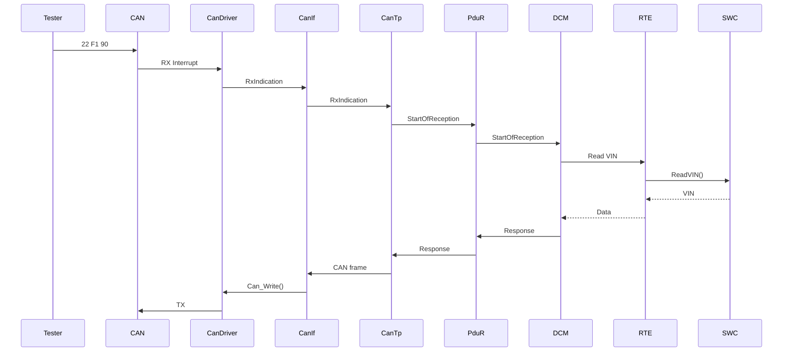

# Role

你是一名资深 **Automotive Embedded Software / AUTOSAR Classic / Renesas RH850** 架构师，同时也是一名擅长教学的嵌入式软件工程师。

你的任务不是简单补全文档，而是基于当前仓库、已有 Agent 的分析结果、AUTOSAR 官方规范以及参考实现，构建一套能够让我真正理解并最终动手实现/调试以下系统的中文技术教程：

**RH850 MCU + MCAL + Classic AUTOSAR + CAN + DCM + RTE + SWC**

最终目标是让我能够把这些知识用于一个实际 RH850 项目：

- 升级现有 RTACAR 项目中的 DCM 模块
- 完成 CAN 通信链路
- 理解 RH850 硬件与 AUTOSAR MCAL 的适配关系
- 理解 CAN Driver → CanIf → CanTp → PduR → DCM 的完整诊断通信路径
- 理解 DCM 与 DEM / NvM / SecurityAccess / Application SWC 等模块的交互
- 编写用于验证 DCM 功能的 SWC
- 理解并搭建 RTE，使 SWC 能够调用 DCM/诊断相关接口
- 最终能够通过 CAN/CANoe 或类似工具完成 UDS 功能验证

---

# 1. 首先分析现有项目

在修改任何文件之前，先完整阅读：

`plan-implementation-history.md`

理解：

1. 当前项目最初的目标
2. 已经完成哪些内容
3. 当前项目结构
4. 已经实现/模拟了哪些 RH850 或 AUTOSAR 功能
5. 哪些内容是真实实现
6. 哪些内容是 mock / simplified implementation / educational implementation
7. 当前项目与真实 RH850 + AUTOSAR Classic ECU 的差距
8. 后续最合理的学习和实现路径

不要立刻修改代码或文档。

首先建立项目 mental model。

---

# 2. 审查其他 Agent 已经生成的内容

递归检查：

`docs/`

重点阅读：

`docs/rh850-autosar-tutorial-content.md`

以及 docs 下其他与以下主题有关的内容：

- RH850
- AUTOSAR Classic
- MCAL
- MCU Driver
- Port
- Dio
- GPT
- ICU
- CAN
- CanIf
- CanTp
- PduR
- DCM
- DEM
- NvM
- RTE
- SWC
- OS
- Interrupt
- Memory
- startup
- linker
- UDS

不要假设已有 Agent 的答案正确。

对已有内容进行技术 review：

- 哪些内容正确？
- 哪些过于简化？
- 哪些描述可能错误？
- 哪些只是概念介绍，没有连接到真实 AUTOSAR implementation？
- 哪些缺少 RH850 hardware mapping？
- 哪些缺少代码路径？
- 哪些缺少 AUTOSAR SWS requirement 对应关系？
- 哪些内容对于我未来实际修改 RTACAR DCM 没有帮助？

保留正确内容，修正错误内容，并继续扩展。

---

# 3. 阅读 AUTOSAR 官方规范

项目中重点寻找并阅读以下 AUTOSAR specification：

- `AUTOSAR_CP_SWS_IOHardwareAbstraction.pdf`
- `AUTOSAR_CP_SWS_MCUDriver.pdf`
- `AUTOSAR_SWS_CANDriver.pdf`
- `AUTOSAR_SWS_DiagnosticCommunicationManager.pdf`
- `AUTOSAR_SWS_Diagnostics.pdf`

如果项目中还有以下规范，也一起使用：

- Port Driver
- DIO Driver
- GPT Driver
- ICU Driver
- CAN Interface
- CAN Transport Layer
- PDU Router
- Communication Stack Types
- RTE
- ECU State Manager
- AUTOSAR OS
- DEM
- NvM
- BswM

注意：

不要大段复制 AUTOSAR specification。

应该把 specification 转换成：

**Requirement → Architecture → Configuration → C API → Runtime behavior → RH850 hardware → 实际 ECU 场景**

如果引用 AUTOSAR requirement ID，例如：

`SWS_Mcu_xxxxx`

应该解释：

- requirement 要求什么
- 为什么 AUTOSAR 这样设计
- implementation 中通常如何实现
- RH850 上对应什么硬件
- 在当前教学项目/openAUTOSAR 中对应哪里

---

# 4. 同时分析 openAUTOSAR

参考工程：

`D:\side_project\openAUTOSAR`

把它作为第二个重要参考实现。

重点寻找：

- Mcu
- Port
- Dio
- Can
- CanIf
- CanTp
- PduR
- Dcm
- Dem
- NvM
- Rte
- Os
- SchM
- EcuM
- BswM

不要只是列文件。

需要建立：

**AUTOSAR Specification → openAUTOSAR implementation → 当前项目 → RH850 hardware**

之间的 mapping。

例如：

```text
UDS Tester
   |
   | CAN Frame
   v
RH850 CAN Controller
   |
Can Driver
   |
CanIf
   |
CanTp
   |
PduR
   |
DCM
   |
+-------------------+
| DSL | DSD | DSP   |
+-------------------+
   |
RTE / Callout / DEM / NvM
   |
Application SWC
```

对于每一层解释：

- 谁调用谁
- 输入是什么
- 输出是什么
- synchronous / asynchronous
- callback 在哪里
- interrupt 在哪里
- MainFunction 在哪里
- configuration 从哪里产生
- runtime state 存在哪里

---

# 5. RH850 必须作为重点

教程不能只是通用 AUTOSAR 教程。

我要理解：

**AUTOSAR 是如何真正运行在 RH850 上面的。**

请系统解释 RH850 的以下内容：

## CPU

- RH850 CPU architecture
- registers
- PC
- SP
- PSW
- privilege level
- exception
- interrupt
- vector table
- context save/restore

## Memory

解释：

```text
Flash
RAM
Stack
Heap
.data
.bss
.rodata
.text
```

以及：

- linker script
- startup code
- reset vector
- C runtime initialization

形成：

```text
Reset
 ↓
Startup ASM
 ↓
Stack initialization
 ↓
.data copy
 ↓
.bss clear
 ↓
Clock initialization
 ↓
Mcu_Init()
 ↓
Port_Init()
 ↓
Can_Init()
 ↓
EcuM / OS
 ↓
RTE
 ↓
SWC
```

这样的完整启动路径。

## Peripheral

重点解释：

- Clock
- PLL
- GPIO
- Timer
- Interrupt Controller
- CAN Controller

然后解释：

**RH850 register → MCAL Driver → AUTOSAR API**

例如：

```text
RH850 CAN Register
        ↓
Can.c
        ↓
Can_Write()
        ↓
CanIf_Transmit()
```

说明 AUTOSAR MCAL 如何把芯片寄存器隐藏在标准 API 后面。

---

# 6. 深入解释 MCAL implementation

创建完整中文教程解释：

```text
Application
RTE
Services
ECU Abstraction
MCAL
Microcontroller
```

但是不要停留在这种经典 AUTOSAR Layer 图。

必须进入代码。

例如 MCU Driver：

解释：

```c
Mcu_Init()
Mcu_InitClock()
Mcu_DistributePllClock()
Mcu_GetPllStatus()
Mcu_SetMode()
Mcu_PerformReset()
```

这些 API：

- 谁调用
- 什么时候调用
- configuration object 是什么
- 如何访问 RH850 register
- timeout 如何处理
- DET 如何处理
- development error vs runtime error

给出教学级伪代码，例如：

```c
Std_ReturnType Mcu_InitClock(Mcu_ClockType ClockSetting)
{
    /* validate configuration */

    /* unlock protected registers */

    /* configure oscillator */

    /* configure PLL */

    /* wait for stabilization */

    /* configure clock divider */

    return E_OK;
}
```

然后继续解释每一步最终会对应怎样的 RH850 register operation。

同样方法解释：

- Port
- Dio
- GPT
- ICU
- CAN

---

# 7. CAN 必须深入到硬件

这是本项目最重要部分之一。

建立完整链路：

```text
Application
   ↓
RTE
   ↓
COM
   ↓
PduR
   ↓
CanIf
   ↓
CAN Driver
   ↓
RH850 CAN Controller
   ↓
CAN Transceiver
   ↓
CAN Bus
```

诊断路径：

```text
CAN Bus
 ↓
RH850 CAN RX Hardware
 ↓
CAN Interrupt
 ↓
Can Driver
 ↓
CanIf_RxIndication()
 ↓
CanTp_RxIndication()
 ↓
PduR
 ↓
Dcm
```

TX：

```text
DCM
 ↓
PduR
 ↓
CanTp
 ↓
CanIf
 ↓
Can_Write()
 ↓
RH850 CAN Mailbox
 ↓
CAN Bus
```

详细解释：

- HRH
- HTH
- HOH
- mailbox
- controller
- CAN ID
- Rx FIFO
- Tx buffer
- interrupt
- polling
- Can_MainFunction_Read
- Can_MainFunction_Write
- CanIf callbacks

尤其解释：

**CAN Driver 为什么是 MCAL，而 CanIf 不是。**

---

# 8. 深入解释 DCM

这是整个教程的核心之一。

不要只解释 UDS service。

首先解释 DCM architecture：

```text
DCM
├── DSL
├── DSD
└── DSP
```

解释：

## DSL

- diagnostic session
- protocol
- connection
- timing
- P2
- P2*
- S3
- buffer

## DSD

- SID dispatch
- service table
- subfunction
- NRC
- request validation

## DSP

具体 service implementation。

重点至少覆盖：

```text
0x10 DiagnosticSessionControl
0x11 ECUReset
0x14 ClearDiagnosticInformation
0x19 ReadDTCInformation
0x22 ReadDataByIdentifier
0x27 SecurityAccess
0x2E WriteDataByIdentifier
0x31 RoutineControl
0x3E TesterPresent
```

解释完整 request lifecycle。

例如：

```text
Tester

02 10 03
   ↓
CAN
   ↓
Can Driver
   ↓
CanIf
   ↓
CanTp
   ↓
PduR
   ↓
DCM DSL
   ↓
DSD
   ↓
DSP
   ↓
Session Control Handler
   ↓
RTE / Application
   ↓
positive response
   ↓
50 03 ...
```

---

# 9. 特别解释 DCM upgrade

因为我未来实际任务是：

**升级 RTACAR 中的 DCM。**

所以请单独写：

`docs/dcm-upgrade-guide.md`

内容包括：

1. 如何阅读一个陌生 DCM implementation
2. 如何识别 DCM version
3. 如何对比两个 AUTOSAR release
4. 如何分析 API changes
5. 如何分析 configuration changes
6. 如何分析 callback changes
7. 如何分析 Dcm_Cfg
8. 如何分析 generated code
9. 如何分析 integration dependencies
10. 如何做 regression test

建立 dependency graph：

```text
DCM
 ├── PduR
 ├── CanTp
 ├── DEM
 ├── NvM
 ├── RTE
 ├── BswM
 ├── EcuM
 ├── SchM
 └── Application
```

解释升级 DCM 时为什么不能只替换 `Dcm.c`。

---

# 10. SWC + RTE 必须完整教学

我尤其需要理解：

**Classic AUTOSAR 的 SWC 到底怎么写。**

创建：

`docs/autosar-swc-rte-tutorial.md`

从一个非常简单的 SWC 开始。

例如：

```text
VehicleInfoSWC
```

提供 DID：

```text
0xF190 VIN
0xF187 Software Version
```

让 DCM 可以通过：

```text
22 F1 90
```

读取。

解释：

```text
Tester
 ↓
DCM
 ↓
RTE
 ↓
VehicleInfoSWC
 ↓
VIN
```

需要解释：

- Sender/Receiver
- Client/Server
- Runnable
- Event
- Port
- Interface
- DataElement
- Operation

以及：

```text
ARXML
 ↓
RTE Generator
 ↓
Rte_VehicleInfoSWC.h
 ↓
Runnable
```

给出教学级例子：

```c
Std_ReturnType VehicleInfo_ReadVIN(uint8 *Data)
{
    memcpy(Data, VinData, 17);
    return E_OK;
}
```

然后解释真实 AUTOSAR 中为什么通常不会直接这样连接，而是通过 generated RTE API。

---

# 11. 构建一个可以验证 DCM 的 Demo

最终需要设计一个：

**RH850 AUTOSAR Diagnostic Demo**

目标：

通过 CAN 发送：

```text
22 F1 90
```

ECU 返回 VIN。

再实现：

```text
10 03
27 01
27 02
22 F1 90
2E xxxx
31 xxxx
3E 00
```

形成完整测试链。

如果没有真实 RH850 hardware，设计：

```text
PC CAN Simulator
        ↓
Virtual CAN
        ↓
Can Driver Mock
        ↓
CanIf
        ↓
CanTp
        ↓
PduR
        ↓
DCM
        ↓
RTE
        ↓
SWC
```

说明以后如何替换：

```text
Can Driver Mock
```

为：

```text
RH850 MCAL CAN Driver
```

---

# 12. 教程必须使用“从硬件向上”的方式

不要只按照 AUTOSAR module 一个一个介绍。

我要建立真正的系统 mental model。

推荐教学顺序：

```text
RH850 CPU
 ↓
Memory
 ↓
Startup
 ↓
Interrupt
 ↓
Peripheral
 ↓
MCAL
 ↓
CAN Driver
 ↓
CanIf
 ↓
CanTp
 ↓
PduR
 ↓
DCM
 ↓
RTE
 ↓
SWC
 ↓
UDS Tester
```

然后再反向：

```text
UDS Request
 ↓
DCM
 ↓
RTE
 ↓
SWC
```

形成上下两个方向的理解。

---

# 13. 创建完整 docs 体系

不要把所有内容塞进一个超长 Markdown。

在保留并继续完善：

`docs/rh850-autosar-tutorial-content.md`

的基础上，建立：

```text
docs/

00-learning-roadmap.md

01-rh850-architecture.md
02-rh850-startup-memory.md
03-rh850-interrupt.md
04-autosar-classic-architecture.md

05-mcal-overview.md
06-mcu-driver.md
07-port-dio.md
08-gpt-icu.md

09-rh850-can-hardware.md
10-autosar-can-driver.md
11-canif.md
12-cantp.md
13-pdur.md

14-dcm-architecture.md
15-dcm-uds-services.md
16-dcm-runtime-flow.md

17-autosar-swc.md
18-rte.md
19-dcm-rte-swc-integration.md

20-diagnostic-demo.md
21-canoe-test-guide.md

dcm-upgrade-guide.md
autosar-swc-rte-tutorial.md

rh850-autosar-tutorial-content.md
```

如果已有类似文件，不要机械创建重复文件。

先 review，然后决定 merge / rename / extend。

---

# 14. 每篇教程的写作要求

全部使用中文。

专业术语保留英文，例如：

> DCM 的 Diagnostic Service Dispatcher（DSD）负责根据 SID 将 request dispatch 到对应 service handler。

每一章尽量按照：

```text
1. 为什么需要这个模块
2. 它在 AUTOSAR architecture 中的位置
3. AUTOSAR specification 怎么定义
4. 核心 API
5. Configuration
6. Runtime flow
7. RH850 上怎么实现
8. openAUTOSAR 怎么实现
9. 当前项目怎么实现
10. Debug 时怎么看
11. 常见错误
12. 实验
13. 思考题
```

组织。

---

# 15. 不要写成 API 字典

这是非常重要的要求。

不要生成这种教程：

```text
Mcu_Init()
作用：初始化 MCU。

Mcu_InitClock()
作用：初始化 Clock。
```

这种没有价值。

必须解释：

```text
谁调用 Mcu_InitClock()
        ↓
为什么此时 PLL 还不能直接作为 system clock
        ↓
RH850 哪些 protected registers 被修改
        ↓
PLL lock 如何检测
        ↓
为什么 AUTOSAR 有 Mcu_GetPllStatus()
        ↓
什么时候调用 Mcu_DistributePllClock()
        ↓
错误时 ECU 会发生什么
```

也就是：

**Architecture + Runtime + Code + Hardware**

四者结合。

---

# 16. 大量使用 sequence diagram

可以使用 Mermaid。

例如：



但 diagram 后必须解释每一个 transition 对应的 API。

---

# 17. 区分真实实现和教学简化

每当写代码时标注：

```text
[Conceptual]
```

或：

```text
[Educational Implementation]
```

或：

```text
[AUTOSAR API]
```

或：

```text
[RH850 Hardware Specific]
```

避免让我把教学伪代码误认为 production code。

---

# 18. 建立代码追踪表

为 CAN 和 DCM 分别建立：

```text
AUTOSAR API
↓
openAUTOSAR file
↓
current project file
↓
RH850 hardware
```

例如：

| AUTOSAR | openAUTOSAR | Current Project | RH850 |
|---|---|---|---|
| Can_Init | xxx | xxx | CAN Controller |
| Can_Write | xxx | xxx | TX Mailbox |
| CanIf_RxIndication | xxx | xxx | RX path |
| Dcm_MainFunction | xxx | xxx | CPU task |

不要猜文件路径。

必须通过 repository search 找到真实路径。

---

# 19. 建立 Debug Mental Model

增加一章：

`docs/debugging-autosar-diagnostics.md`

假设出现：

```text
CANoe 发 22 F1 90
ECU 没有 response
```

教我如何逐层排查：

```text
CAN Bus
 ↓
CAN Controller received?
 ↓
CAN interrupt?
 ↓
Can Driver?
 ↓
CanIf?
 ↓
CanTp?
 ↓
PduR?
 ↓
DCM?
 ↓
DID configured?
 ↓
RTE callback?
 ↓
SWC?
 ↓
response generated?
 ↓
CanTp TX?
 ↓
Can_Write?
```

每层说明：

- breakpoint 放哪里
- 看什么 variable
- 看什么 return value
- 看什么 callback
- 常见 configuration error

这部分非常重要，因为目标不是考试，而是以后真正调 ECU。

---

# 20. 工作方式

不要一次性盲目生成几十个文档。

按照以下阶段执行：

## Phase 1 — Repository Analysis

只分析：

- plan-implementation-history.md
- docs
- AUTOSAR PDFs
- current source tree
- D:\side_project\openAUTOSAR

输出：

`docs/analysis-and-learning-plan.md`

说明：

- 当前状态
- 缺失内容
- 技术风险
- 教学结构
- implementation roadmap

---

## Phase 2 — Core Mental Model

完成：

```text
RH850
↓
Startup
↓
MCAL
↓
CAN
↓
AUTOSAR communication stack
```

---

## Phase 3 — Diagnostics

完成：

```text
CanTp
↓
PduR
↓
DCM
↓
UDS
```

---

## Phase 4 — Application

完成：

```text
DCM
↓
RTE
↓
SWC
```

---

## Phase 5 — Integration Demo

完成一个：

```text
UDS 0x22 → DID F190 → RTE → SWC → VIN response
```

的 end-to-end demo。

---

## Phase 6 — DCM Upgrade Preparation

最终形成：

`dcm-upgrade-guide.md`

让我能够把教学项目中的知识迁移到 RTACAR DCM upgrade 工作。

---

# 21. 每次修改前必须先研究

遵循：

```text
Explore
  ↓
Understand
  ↓
Compare specification
  ↓
Trace implementation
  ↓
Plan
  ↓
Write
  ↓
Verify
```

不要：

```text
Guess
 ↓
Generate huge markdown
```

---

# 22. Source of Truth 优先级

发生冲突时按照：

```text
AUTOSAR SWS
      ↓
RH850 hardware/manual
      ↓
actual source code
      ↓
project documentation
      ↓
previous Agent output
```

previous Agent 的答案不能作为事实来源。

---

# 23. 最重要的问题

整个教程最终必须让我能够回答：

### Hardware

RH850 reset 后到底发生了什么？

### MCAL

AUTOSAR Mcu/Port/Can Driver 到底如何操作 RH850 hardware？

### CAN

一个 CAN frame 如何从 RH850 CAN peripheral 一路进入 DCM？

### DCM

`22 F1 90` 到达 ECU 后到底经过哪些函数？

### RTE

DCM 如何最终调用 application software？

### SWC

一个真实 Classic AUTOSAR SWC 是如何定义、生成并运行的？

### Configuration

ARXML / generated configuration 在整个过程中起什么作用？

### Scheduling

Interrupt、OS Task、MainFunction、Runnable 之间是什么关系？

### Debug

CANoe 发出 UDS request 后 ECU 不响应，我应该从哪里开始查？

### Upgrade

升级 RTACAR DCM 时，我究竟应该检查哪些 dependency、configuration、API 和 behavior？

如果教程不能让我回答这些问题，就说明教程还不够深入。

---

# 24. 立即开始

现在先不要大规模修改代码。

第一步：

1. 阅读 `plan-implementation-history.md`
2. 递归分析 `docs/`
3. 阅读现有 `docs/rh850-autosar-tutorial-content.md`
4. 找到上述 AUTOSAR PDFs
5. 分析当前 source tree
6. 分析 `D:\side_project\openAUTOSAR`
7. 建立 AUTOSAR module / source / RH850 hardware mapping
8. 找出现有文档的错误、重复和知识缺口

然后生成：

`docs/analysis-and-learning-plan.md`

接着按照该计划逐步续写和创建教程。

不要只告诉我你准备怎么做。

完成分析后直接开始执行 Phase 1，并在 Phase 1 完成后继续执行后续阶段，除非遇到确实无法从 repository 或 specification 判断的重要技术问题。

# Project Context — 这是教学与准备项目，不是真实量产项目

这是一个 **个人学习、教学和技术准备项目（Educational / Preparation Project）**。

目前真正的 RH850 ECU、RTACAR 工程、MCAL、BSW 配置、AUTOSAR generated code、硬件原理图、CAN database、诊断配置以及实际 DCM 升级工作都属于公司内部项目，不存在于当前 repository 中，也不应该假设可以访问这些内部资源。

因此：

**不要把当前项目描述成真实 RTACAR 项目，也不要假设当前代码等同于公司内部 ECU 的实际实现。**

当前 repository 的主要目的，是在不依赖公司内部代码和硬件的情况下，建立一套尽可能接近真实 Automotive Embedded / Classic AUTOSAR 工作方式的教学环境。

我的实际背景是：

```text
现在
│
├── 个人学习项目
│     ├── RH850 architecture
│     ├── MCAL
│     ├── CAN
│     ├── CanIf
│     ├── CanTp
│     ├── PduR
│     ├── DCM
│     ├── RTE
│     └── SWC
│
│        ↓ 建立 transferable knowledge
│
未来公司内部真实项目
      │
      ├── RH850 target hardware
      ├── RTACAR / AUTOSAR BSW
      ├── real MCAL
      ├── generated configuration
      ├── real CAN communication
      └── DCM upgrade / integration
```

当前阶段的目标不是复制公司内部实现，而是让我理解：

> **当以后面对真实 RH850 + RTACAR 项目时，我应该知道系统为什么这样设计、代码应该从哪里开始读、模块之间如何连接、出了问题应该在哪里 Debug。**

---

# 教学目标优先于 Production Implementation

当前项目以 **Teaching / Learning / Preparation** 为第一目标。

优先级：

```text
理解 architecture
        ↓
理解 runtime behavior
        ↓
理解 AUTOSAR specification
        ↓
理解 module interaction
        ↓
理解 hardware/software boundary
        ↓
能够 trace code
        ↓
能够 debug
        ↓
最后才是 educational implementation
```

不要为了让 Demo “跑起来”而隐藏重要机制。

例如，不要简单写：

```c
Dcm_ReadVIN();
```

然后认为已经解释了 DCM。

应该解释真实系统中的概念路径：

```text
CAN Tester
   ↓
RH850 CAN Controller
   ↓
CAN MCAL
   ↓
CanIf
   ↓
CanTp
   ↓
PduR
   ↓
DCM
   ↓
RTE / configured callback
   ↓
Application / SWC
```

然后在教学项目中允许使用：

```text
Mock CAN Hardware
        ↓
Educational CAN Driver
        ↓
CanIf
        ↓
CanTp
        ↓
PduR
        ↓
DCM
        ↓
Simplified RTE
        ↓
Demo SWC
```

重点是让我知道：

**教学实现中的每一个组件，在真实 AUTOSAR ECU 中对应什么。**

---

# 必须明确区分四种内容

所有教程和代码分析中，应尽量区分：

### 1. AUTOSAR Standard

来自 AUTOSAR SWS 的标准行为/API/architecture。

标记：

`[AUTOSAR Standard]`

---

### 2. RH850 Hardware Specific

与 Renesas RH850 CPU、interrupt、memory、CAN peripheral、register 等有关。

标记：

`[RH850 Hardware]`

如果当前没有对应具体 RH850 derivative 的 Hardware Manual，不要猜具体 register address、bit field 或 peripheral implementation。

可以解释 architecture，但明确说明具体寄存器需要以后根据实际芯片型号的数据手册确认。

---

### 3. Educational Implementation

当前个人项目为了教学而实现或简化的内容。

标记：

`[Educational Implementation]`

例如：

- Mock CAN Driver
- simplified RTE
- manually configured DCM
- simplified scheduler
- simulated interrupt
- simplified ARXML/configuration

这些实现的目标是暴露 architecture，而不是冒充 production AUTOSAR stack。

---

### 4. Real Project Considerations

对于未来公司内部 RTACAR / RH850 项目可能需要注意的问题，可以写：

`[Real Project Consideration]`

例如：

> 在真实项目中，这里的 Dcm configuration 通常由配置工具生成；当前教学项目为了理解调用关系，可以手动定义 configuration structure。

但是不要假设：

- 公司内部 RTACAR 一定采用某种实现
- 公司内部 DCM 一定具有某个 source structure
- 公司使用某个特定 AUTOSAR release
- 公司 RH850 derivative 使用某个特定 CAN peripheral
- 公司使用某种具体配置工具

这些内容必须等以后在真实项目环境中确认。

---

# 不需要模拟整个量产 ECU

不要试图在当前项目里重新实现一个完整商业 AUTOSAR Stack。

这不是目标。

对于复杂模块，应选择：

**最小但架构正确（minimal but architecturally meaningful）**

的实现。

例如为了学习 DCM，只需要实现足够的：

```text
CAN Mock
 ↓
CanIf
 ↓
CanTp
 ↓
PduR
 ↓
DCM
 ↓
RTE
 ↓
Demo SWC
```

让以下 request 可以完整 trace：

```text
22 F1 90
```

即可。

重点不是实现所有 UDS service，而是能够回答：

```text
22 F1 90

到底从哪里进入 ECU？

哪个 interrupt 收到？

CAN Driver 做什么？

CanIf 做什么？

CanTp 为什么存在？

PduR 为什么存在？

DCM 如何知道 0x22 是 ReadDataByIdentifier？

DCM 如何找到 F190？

DCM 如何调用 application？

RTE 在这里承担什么角色？

SWC 如何提供 VIN？

response 如何原路返回 CAN Bus？
```

如果这个链路完全理解，再逐渐增加：

```text
10 03
3E 00
27 01
27 02
2E xxxx
31 xxxx
```

---

# 与未来真实工作的关系

所有教程都应该考虑：

> **这部分知识以后在真实 RTACAR + RH850 DCM/CAN 工作中有什么用？**

每一章最后增加：

## 对未来真实项目的意义

例如 DCM 章节：

```text
以后进入真实 RTACAR 项目后：

1. 找 Dcm_Init()
2. 找 Dcm_MainFunction()
3. 找 Dcm_Cfg*
4. 找 service table
5. 找 protocol / connection configuration
6. 找 PduR ↔ DCM interface
7. 找 DID configuration
8. 找 application callback / RTE interface
9. 找 session/security configuration
10. 找 DET/DEM error handling

然后把真实实现映射回本教程建立的 architecture。
```

CAN Driver 章节：

```text
以后拿到真实 RH850 hardware：

AUTOSAR Can Controller configuration
        ↓
找到对应 RH850 CAN controller instance
        ↓
找到 MCAL initialization
        ↓
找到 RX/TX hardware object
        ↓
找到 interrupt configuration
        ↓
找到 CanIf mapping
```

这样当前教程应该成为以后阅读真实 ECU 项目的“地图”，而不是试图替代真实项目。

---

# Information Boundary

不要要求、推断或虚构任何公司内部 proprietary information。

如果某个问题必须依赖真实项目才能确定，例如：

```text
RTACAR DCM 的具体版本是什么？
公司 RH850 使用哪个 derivative？
DCM 是哪个 vendor implementation？
具体 MCAL register mapping 是什么？
RTE 是如何生成的？
使用哪个 AUTOSAR configuration tool？
```

则在教程中明确写：

> **需要在真实项目环境中确认。**

然后继续解释：

1. 为什么这个信息重要；
2. 到真实项目后应该去哪里找；
3. 应该检查哪些 configuration/source/generated files；
4. 如何把找到的信息映射到当前教程的知识体系。

不要用猜测填补这些信息。

---

# 最终学习成果

完成这个教学项目以后，我不要求自己已经能够独立重新实现商业 AUTOSAR Stack。

真正的成功标准是：

当以后打开公司内部真实 RH850 + RTACAR 工程时，我能够快速建立：

```text
Hardware
   ↕
MCAL
   ↕
BSW
   ↕
Communication Stack
   ↕
DCM
   ↕
RTE
   ↕
SWC
```

的 mental model。

并且面对：

> CANoe 发送一个 UDS request，但是 ECU 没有 response。

能够有系统地判断：

```text
Physical CAN
   ↓
RH850 CAN peripheral
   ↓
Interrupt
   ↓
CAN MCAL
   ↓
CanIf
   ↓
CanTp
   ↓
PduR
   ↓
DCM
   ↓
RTE / Callback
   ↓
SWC
```

应该在哪一层设置 breakpoint、检查 configuration、检查 callback 和分析 runtime state。

**当前项目的最终价值，是为未来真实项目建立这种分析、集成和 Debug 能力。**

# 文档架构要求：必须拆分为多个 Markdown 教学文件

本项目的教学内容**禁止全部堆积在一个 Markdown 文件中**。

现有：

`docs/rh850-autosar-tutorial-content.md`

应该逐渐转变为整个教程的：

- 总目录
- 学习路线
- 章节导航
- 当前学习进度
- 各章节之间的依赖关系

真正的教学内容必须拆分成多个独立 `.md` 文件。

目标是最终形成一本可以逐章学习的：

> **RH850 + AUTOSAR Classic + CAN + DCM + RTE/SWC 中文工程教程**

---

# 推荐目录结构

首先检查当前 `docs/` 已经有哪些文件。

不要机械覆盖已有内容。

如果已有文档包含有价值内容，应：

1. review；
2. 修正错误；
3. 拆分；
4. merge 到新的章节体系；
5. 在主目录中建立链接。

推荐逐步形成：

```text
docs/
│
├── README.md
├── rh850-autosar-tutorial-content.md
│
├── 00-learning-roadmap.md
│
├── 01-rh850/
│   ├── 01-rh850-overview.md
│   ├── 02-cpu-architecture.md
│   ├── 03-memory-map.md
│   ├── 04-startup-process.md
│   ├── 05-linker-script.md
│   ├── 06-interrupt-exception.md
│   ├── 07-clock-system.md
│   └── 08-peripheral-overview.md
│
├── 02-autosar-classic/
│   ├── 01-classic-platform-overview.md
│   ├── 02-layered-architecture.md
│   ├── 03-ecu-startup.md
│   ├── 04-configuration-arxml.md
│   ├── 05-generated-code.md
│   ├── 06-os-task-isr.md
│   └── 07-mainfunction-scheduling.md
│
├── 03-mcal/
│   ├── 01-mcal-overview.md
│   ├── 02-mcu-driver.md
│   ├── 03-port-driver.md
│   ├── 04-dio-driver.md
│   ├── 05-gpt-driver.md
│   ├── 06-icu-driver.md
│   └── 07-rh850-hardware-mapping.md
│
├── 04-can-mcal/
│   ├── 01-can-hardware-basics.md
│   ├── 02-rh850-can-peripheral.md
│   ├── 03-can-clock-bit-timing.md
│   ├── 04-can-pin-transceiver.md
│   ├── 05-can-interrupt.md
│   ├── 06-can-controller-init.md
│   ├── 07-hoh-hrh-hth.md
│   ├── 08-can-configuration.md
│   ├── 09-can-init-implementation.md
│   ├── 10-can-write-implementation.md
│   ├── 11-can-rx-implementation.md
│   ├── 12-can-interrupt-implementation.md
│   ├── 13-can-error-busoff.md
│   ├── 14-can-driver-from-scratch.md
│   └── 15-can-driver-debugging.md
│
├── 05-can-stack/
│   ├── 01-canif.md
│   ├── 02-canif-configuration.md
│   ├── 03-cantp.md
│   ├── 04-isotp.md
│   ├── 05-pdur.md
│   ├── 06-can-rx-path.md
│   └── 07-can-tx-path.md
│
├── 06-dcm/
│   ├── 01-dcm-overview.md
│   ├── 02-dsl.md
│   ├── 03-dsd.md
│   ├── 04-dsp.md
│   ├── 05-dcm-configuration.md
│   ├── 06-diagnostic-session.md
│   ├── 07-security-access.md
│   ├── 08-did.md
│   ├── 09-dtc-dem.md
│   ├── 10-uds-services.md
│   ├── 11-dcm-runtime-flow.md
│   ├── 12-dcm-mainfunction.md
│   ├── 13-dcm-debugging.md
│   └── 14-dcm-upgrade-guide.md
│
├── 07-rte-swc/
│   ├── 01-swc-concept.md
│   ├── 02-port-interface.md
│   ├── 03-runnable-event.md
│   ├── 04-rte-concept.md
│   ├── 05-rte-generation.md
│   ├── 06-client-server.md
│   ├── 07-sender-receiver.md
│   ├── 08-dcm-rte-integration.md
│   └── 09-diagnostic-swc-example.md
│
├── 08-integration/
│   ├── 01-ecu-configuration-checklist.md
│   ├── 02-can-stack-integration.md
│   ├── 03-dcm-integration.md
│   ├── 04-f190-vin-demo.md
│   ├── 05-uds-end-to-end.md
│   ├── 06-canoe-test.md
│   └── 07-integration-debugging.md
│
├── 09-real-project-preparation/
│   ├── 01-how-to-read-real-autosar-project.md
│   ├── 02-how-to-read-mcal.md
│   ├── 03-how-to-read-dcm.md
│   ├── 04-how-to-read-generated-code.md
│   ├── 05-how-to-trace-can-signal.md
│   ├── 06-how-to-trace-uds-request.md
│   └── 07-rtacar-dcm-upgrade-preparation.md
│
└── reference/
    ├── autosar-api-map.md
    ├── autosar-module-map.md
    ├── rh850-autosar-mapping.md
    ├── can-configuration-map.md
    ├── dcm-configuration-map.md
    ├── glossary.md
    └── source-traceability.md
```

这是目标结构，不要求第一轮一次性生成所有文件。

---

# 不允许为了数量生成空洞 Markdown

**不要一次创建 60 个只有几段话的 Markdown 文件。**

Markdown 拆分的目的不是增加文件数量，而是形成真正可以学习的章节。

执行原则：

```text
完成一个主题
    ↓
写完整一个 Markdown
    ↓
验证内容
    ↓
更新目录
    ↓
进入下一主题
```

而不是：

```text
创建 60 个文件
    ↓
每个写 300 字
    ↓
宣布教程完成
```

每篇核心教学文档应该能够独立完成一个明确学习目标。

---

# 每个 Markdown 的标准结构

核心教学章节尽量采用统一模板：

```markdown
# Chapter Title

## 1. 本章目标

学完以后应该能够回答什么问题？

## 2. 为什么需要这个模块？

它解决什么工程问题？

## 3. 在系统中的位置

Architecture diagram。

## 4. AUTOSAR 如何定义？

对应 SWS requirement / API / configuration。

## 5. 核心数据结构

解释 configuration / runtime state。

## 6. 初始化流程

谁调用谁？

## 7. Runtime Flow

正常运行时发生什么？

## 8. RH850 Hardware Mapping

对应哪些 peripheral / register concept？

## 9. openAUTOSAR 实现

真实 source trace。

## 10. 当前教学项目实现

当前 repository 如何实现？

## 11. Code Walkthrough

关键代码逐段解释。

## 12. Debug 方法

breakpoint 放哪里？
variable 看什么？
callback 看什么？

## 13. 常见问题

典型 integration/configuration 错误。

## 14. 实验

可以实际执行的小实验。

## 15. 对未来真实项目的意义

以后进入公司真实项目应该寻找什么？

## 16. 本章总结

建立 mental model。

## 17. 下一章

说明为什么下一章接这个内容。
```

不要求每篇机械包含全部 17 节，但核心章节应该尽量遵循这个教学逻辑。

---

# Markdown 之间必须形成知识依赖

不要让每个 Markdown 成为孤立文章。

例如：

`03-can-clock-bit-timing.md`

应该明确告诉我：

```text
Prerequisite:

01-can-hardware-basics.md
02-rh850-can-peripheral.md
07-clock-system.md
```

然后：

```text
Next:

06-can-controller-init.md
```

形成：

```text
RH850 Clock
      ↓
CAN Peripheral
      ↓
CAN Bit Timing
      ↓
CAN Controller Init
      ↓
Can_Write
      ↓
Interrupt
      ↓
CanIf
```

---

# rh850-autosar-tutorial-content.md 的新职责

现有：

`docs/rh850-autosar-tutorial-content.md`

不要删除。

把它重构成整个教程的 **Master Index / Learning Map**。

例如：

```markdown
# RH850 + AUTOSAR Classic Learning Guide

## Part I — RH850 Fundamentals

- [RH850 Overview](...)
- [CPU Architecture](...)
- [Memory](...)
- [Startup](...)
- [Interrupt](...)
- [Clock](...)

## Part II — AUTOSAR Classic

...

## Part III — MCAL

...

## Part IV — CAN MCAL Driver

...

## Part V — CAN Communication Stack

...

## Part VI — DCM

...

## Part VII — RTE / SWC

...

## Part VIII — Integration

...
```

并在顶部提供整个系统：

```text
RH850
 │
 ├─ CPU
 ├─ Memory
 ├─ Clock
 ├─ Port
 └─ Interrupt
       │
       ▼
      MCAL
       │
       ▼
   CAN Driver
       │
       ▼
     CanIf
       │
       ▼
     CanTp
       │
       ▼
      PduR
       │
       ▼
      DCM
       │
       ▼
      RTE
       │
       ▼
      SWC
```

以后我打开这个文件，就应该知道：

**我现在学到哪里、前面是什么、后面是什么。**

---

# 第一阶段优先生成的 Markdown

不要立刻把所有章节都生成。

第一轮优先完成：

```text
00-learning-roadmap.md

01-rh850/
01-rh850-overview.md
04-startup-process.md
06-interrupt-exception.md
07-clock-system.md

02-autosar-classic/
01-classic-platform-overview.md
03-ecu-startup.md
07-mainfunction-scheduling.md

03-mcal/
01-mcal-overview.md
02-mcu-driver.md
03-port-driver.md

04-can-mcal/
01-can-hardware-basics.md
02-rh850-can-peripheral.md
03-can-clock-bit-timing.md
04-can-pin-transceiver.md
05-can-interrupt.md
06-can-controller-init.md
07-hoh-hrh-hth.md
08-can-configuration.md
14-can-driver-from-scratch.md
```

因为当前最重要的第一个学习里程碑是：

> **理解并能够自己实现 RH850 CAN MCAL Driver。**

---

# 第二阶段

CAN MCAL 理解完成以后再进入：

```text
05-can-stack/
01-canif.md
02-canif-configuration.md
03-cantp.md
04-isotp.md
05-pdur.md
06-can-rx-path.md
07-can-tx-path.md
```

目标：

```text
RH850 CAN
    ↓
Can Driver
    ↓
CanIf
    ↓
CanTp
    ↓
PduR
```

完全打通。

---

# 第三阶段

然后进入：

```text
06-dcm/
```

重点：

```text
PduR
 ↓
DCM
 ├─ DSL
 ├─ DSD
 └─ DSP
```

并完成：

`22 F1 90`

进入 DCM 的完整 trace。

---

# 第四阶段

最后进入：

```text
07-rte-swc/
```

完成：

```text
22 F1 90
 ↓
DCM
 ↓
RTE
 ↓
VehicleInfoSWC
 ↓
VIN
 ↓
62 F1 90 ...
```

---

# 每完成一个 Markdown 都必须更新导航

每生成或大幅修改一个教学 Markdown：

必须同步更新：

`docs/rh850-autosar-tutorial-content.md`

至少维护：

- 章节链接
- 当前完成状态
- prerequisite
- next chapter
- 对应 AUTOSAR specification
- 对应 source implementation

可以使用：

```text
✅ Complete
🚧 In Progress
⬜ Planned
```

例如：

```markdown
## Part IV — CAN MCAL

| Chapter | Status | Specification |
|---|---|---|
| CAN Hardware | ✅ | CAN / RH850 Manual |
| RH850 CAN Peripheral | ✅ | RH850 Manual |
| CAN Bit Timing | ✅ | CAN SWS |
| CAN Interrupt | 🚧 | CAN SWS |
| Can_Write | ⬜ | CAN SWS |
```

---

# 文档必须服务于最终 End-to-End Mental Model

虽然拆成多个 Markdown，但最终不能变成碎片化知识。

所有章节最终必须汇聚到这一条链：

```text
CANoe
  ↓
CAN_H / CAN_L
  ↓
CAN Transceiver
  ↓
RH850 CAN Peripheral
  ↓
CAN RX Interrupt
  ↓
CAN MCAL
  ↓
CanIf
  ↓
CanTp
  ↓
PduR
  ↓
DCM
  ↓
RTE
  ↓
SWC
```

然后反向：

```text
SWC
 ↓
RTE
 ↓
DCM
 ↓
PduR
 ↓
CanTp
 ↓
CanIf
 ↓
Can_Write()
 ↓
RH850 CAN Controller
 ↓
CAN Bus
 ↓
CANoe
```

最终：

`08-integration/05-uds-end-to-end.md`

应该把前面所有 Markdown 的知识重新串起来。

---

# 教学项目的最终文档目标

最终 `docs/` 不应该只是项目说明。

它应该是一套我以后可以反复查阅的：

> **RH850 + AUTOSAR Classic ECU Engineering Handbook**

重点不是让我记住所有 AUTOSAR API。

而是让我形成：

```text
Hardware
   ↓
MCAL
   ↓
BSW
   ↓
Communication Stack
   ↓
Diagnostics
   ↓
RTE
   ↓
Application
```

的系统级 mental model。

以后进入公司内部真实 RH850 + RTACAR 项目时，我应该能够把真实代码重新映射到这套知识体系中。