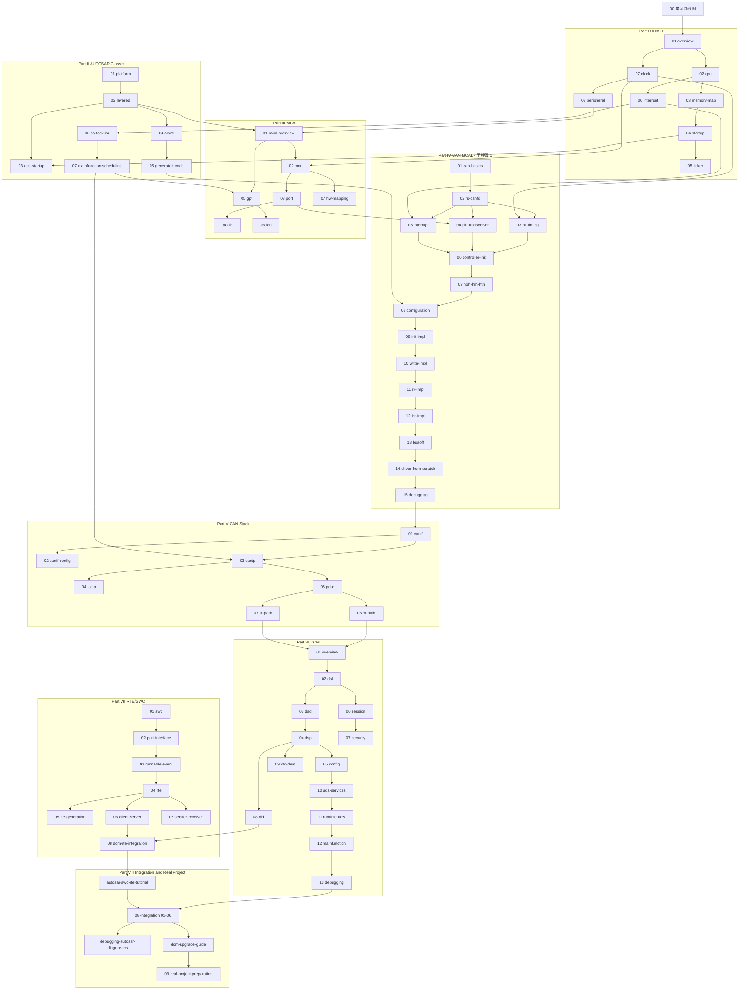

# 00 · 学习路线图（Learning Roadmap）

> Prerequisite: 无（从这里开始）
> Next: [01-rh850/01-rh850-overview.md](01-rh850/01-rh850-overview.md)
> 对应规范: AUTOSAR CP SWS MCU Driver R24-11、CAN Driver R22-11、DCM R20-11、IoHwAb R24-11；RH850/P1M-E User's Manual: Hardware Rev.1.20（HW-E）
> 对应源码: `examples/rh850_mcal_reference/`（已存在）；`examples/uds_diag_demo/`（已实现，`python tools/run_uds_demo.py`）；`D:\side_project\openAUTOSAR`（R3.1.5，只读参考）
> 规划依据: [analysis-and-learning-plan.md](analysis-and-learning-plan.md)

## 1. 这份教程要带你到哪里

[Real Project Consideration] 这是一个**教学 / 准备项目**。成功标准不是“重新实现一个商业 AUTOSAR stack”，而是：以后打开真实的 RH850 + RTA-CAR 工程时，你能快速建立下面这张图，并知道每一层该在哪里下断点、看什么配置。

```text
Hardware  ↕  MCAL  ↕  BSW  ↕  Communication Stack  ↕  DCM  ↕  RTE  ↕  SWC
```

整套教程最终要汇聚到一条链，然后**反向再走一遍**：

```text
CANoe → CAN_H/CAN_L → Transceiver → RH850 RS-CANFD → CAN RX Interrupt → Can Driver
      → CanIf → CanTp → PduR → DCM(DSL/DSD/DSP) → RTE → SWC
SWC → RTE → DCM → PduR → CanTp → CanIf → Can_Write() → RH850 TX buffer → CAN Bus → CANoe
```

本教程的参考器件是 **R7F701381 = RH850/P1M-E**（core RH850G3M，CAN = RS-CANFD）。请先记住三件常被写错的事：

- P1M-E **没有软件可编程 PLL 寄存器，也没有 PROTCMD**；时钟固定为 CPU 160 / HSB 80 / LSB 40 MHz（HW-E p.469–471）。
- CAN 位时间时钟 fCAN 是 **40 MHz 或 16 MHz**（GCFG.DCS），不是 80 MHz（HW-E p.791）。
- RX FIFO 的中断是 **EI190**，EI184 是 CAN0 的 common FIFO（HW-E p.285–286）。

## 2. 两个方向：从硬件向上，再从 UDS 向下

### 2.1 Hardware-up 路径（主线，`claude_plan.md` §12）

```text
RH850 CPU → Memory → Startup → Interrupt → Clock/Peripheral
   → MCAL(Mcu/Port/Gpt) → CAN Driver → CanIf → CanTp → PduR
   → DCM → RTE → SWC → UDS Tester
```

每一步只依赖前面学过的东西。例如学 `03-can-clock-bit-timing` 之前，必须先知道 CLK_LSB 为什么是 40 MHz（`01-rh850/07-clock-system`）。

### 2.2 UDS-down 路径（复习 + 实战）

学完主线以后，从一个具体请求倒推回来：

```text
Tester 发出 22 F1 90
 ↓ 06-dcm/11-dcm-runtime-flow：DSL 收到请求、DSD 查 SID 表、DSP 查 DID 表
 ↓ 07-rte-swc/08-dcm-rte-integration：DCM 调 Rte_Call_DataServices_*_ReadData
 ↓ docs/autosar-swc-rte-tutorial.md：VehicleInfoSWC 返回 VIN
 ↓ 05-can-stack/07-can-tx-path：62 F1 90 + 17 字节 VIN = 20 字节 → CanTp FF/FC/CF
 ↓ 04-can-mcal/10-can-write-implementation：Can_Write → TMCp
 ↓ docs/debugging-autosar-diagnostics.md：如果没有 response，逐层排查
```

如果在倒推时某一跳说不清楚，就回到 hardware-up 路径里对应的章节。

## 3. 章节依赖图



关键跨 Part 依赖（必须先学左边）：

| 先学 | 再学 | 原因 |
|---|---|---|
| `01-rh850/07-clock-system` | `03-mcal/02-mcu-driver`、`04-can-mcal/03-can-clock-bit-timing` | fCAN 来源与 `McuClockReferencePoint → CanCpuClockRef` 配置链 |
| `01-rh850/06-interrupt-exception` | `04-can-mcal/05-can-interrupt`、`02-autosar-classic/06-os-task-isr` | EIC / 向量 / Cat2 ISR |
| `03-mcal/03-port-driver` | `04-can-mcal/04-can-pin-transceiver` | CAN 引脚 ALT 配置由 Port 负责（`SWS_Can_00239`） |
| `02-autosar-classic/07-mainfunction-scheduling` | `05-can-stack/03-cantp`、`06-dcm/12-dcm-mainfunction` | N_Cr / P2 / S3 都以 MainFunction 周期计数 |
| `04-can-mcal/15-can-driver-debugging` | `05-can-stack/01-canif` | 先确认帧真的进了 RH850，再看软件栈 |
| `05-can-stack/06, 07` | `06-dcm/01-dcm-overview` | DCM 只与 PduR 交互（SWS-DCM p.23） |
| `06-dcm/08-did` | `07-rte-swc/08-dcm-rte-integration` | `DcmDspDataUsePort` 决定 RTE 接口形态 |

## 4. 建议学习顺序与时间估计

时间按“读懂 + 做实验 + 回答检查题”估算，假设每周 8–10 小时。

| 顺序 | 阶段 | 章节 | 估计时间 |
|---|---|---|---|
| 1 | Part I RH850 Fundamentals | 01-rh850/01–08 | 14–18 h |
| 2 | Part II AUTOSAR Classic | 02-autosar-classic/01–07 | 10–14 h |
| 3 | Part III MCAL | 03-mcal/01–07（06 ICU 可延后） | 10–14 h |
| 4 | **Part IV CAN MCAL（里程碑 1）** | 04-can-mcal/01–15 | 25–35 h |
| 5 | Part V CAN Stack | 05-can-stack/01–07 | 12–16 h |
| 6 | Part VI DCM | 06-dcm/01–13 | 20–28 h |
| 7 | Part VII RTE/SWC | 07-rte-swc/01–08 + autosar-swc-rte-tutorial | 12–16 h |
| 8 | Part VIII Integration | 08-integration/01–06 + debugging-autosar-diagnostics + 跑 demo | 10–14 h |
| 9 | Real Project Preparation | 09-real-project-preparation/01–07 + dcm-upgrade-guide | 8–12 h |
| | **合计** | | **约 120–170 h（12–18 周）** |

**快速通道**（如果很快要接触真实 DCM 工作）：01-rh850/01 → 02-autosar-classic/01, 07 → 05-can-stack/03, 05 → 06-dcm/01–04, 08, 11 → 07-rte-swc/08 → debugging-autosar-diagnostics → dcm-upgrade-guide，约 30–40 h。之后再回头补硬件与 CAN MCAL。

## 5. 里程碑

| 里程碑 | 内容 | 达成标志 |
|---|---|---|
| **M1：理解并能够自己实现 RH850 CAN MCAL Driver** | Part I + III（Mcu/Port）+ Part IV | 能不看资料画出 RS-CANFD 初始化序列（GRAMINIT → global reset → AFL → RX FIFO → CmCFG → operating → RFE → communication → COMSTS）；能解释 HTH/HRH 与 TX buffer / RX FIFO 的对应；能按 `04-can-mcal/14` 写出可在 fake bus 上测试的 `Can_Init` / `Can_Write` / Rx 处理并通过测试 |
| M2：CAN 帧进入 DCM | Part V | 能画出 `CanIf_RxIndication → CanTp → PduR → Dcm_StartOfReception/CopyRxData/TpRxIndication` 时序图，并说明每一跳是否在中断上下文 |
| M3：`22 F1 90` 全链路 | Part VI + VII | 能逐函数讲清 DSL/DSD/DSP 与 RTE 调用，说出 NRC 0x31/0x33/0x7F/0x78 分别在哪一步产生 |
| M4：端到端 demo | Part VIII | 在 `examples/uds_diag_demo/` 跑通 `10 03 / 27 01 / 27 02 / 22 F1 90 / 2E / 31 / 3E 00`，并能故意注入一个配置错误再用 debugging 文档定位 |
| M5：DCM upgrade 准备 | dcm-upgrade-guide + 09 | 能为一个陌生 DCM 列出版本识别方法、依赖清单、配置差异检查点与 regression 用例 |

## 6. 各 Part 章节链接与自测检查点

状态说明：本文件写于 Phase 1；现在所有 81 个章节均已完成，完成状态以 [rh850-autosar-tutorial-content.md](rh850-autosar-tutorial-content.md)（Master Index）为准。

### Part I — RH850 Fundamentals

- [01 RH850 Overview](01-rh850/01-rh850-overview.md)
- [02 CPU Architecture](01-rh850/02-cpu-architecture.md)
- [03 Memory Map](01-rh850/03-memory-map.md)
- [04 Startup Process](01-rh850/04-startup-process.md)
- [05 Linker Script](01-rh850/05-linker-script.md)
- [06 Interrupt & Exception](01-rh850/06-interrupt-exception.md)
- [07 Clock System](01-rh850/07-clock-system.md)
- [08 Peripheral Overview](01-rh850/08-peripheral-overview.md)

**Checkpoint I**

1. R7F701381 的 core 是什么？lock-step checker 能不能跑第二个任务？
2. 复位后 PC 从哪里开始取指？PSW 复位值 `0x20` 对中断意味着什么？
3. `.data` 为什么要从 Flash 拷贝到 RAM，`.bss` 为什么要清零？P1M-E 的 LRAM 已经由硬件清零并写好 ECC，启动代码还需要做什么？
4. EI 级中断受理时硬件自动保存了什么，软件必须保存什么？为什么嵌套中断时要软件保存 EIPC/EIPSW？
5. 直接向量方式和表引用方式（EITB/INTBP）有什么区别？handler 地址怎么算？
6. 为什么在 P1M-E 上不能照搬 F1x 的 “PROTCMD + PLL 启动” 序列？P1M-E 上哪些寄存器真的需要 `0xA5` 解锁？
7. 清 CAN 中断源之后，为什么要 dummy read + SYNCP 再 EIRET？

### Part II — AUTOSAR Classic

- [01 Classic Platform Overview](02-autosar-classic/01-classic-platform-overview.md)
- [02 Layered Architecture](02-autosar-classic/02-layered-architecture.md)
- [03 ECU Startup](02-autosar-classic/03-ecu-startup.md)
- [04 Configuration & ARXML](02-autosar-classic/04-configuration-arxml.md)
- [05 Generated Code](02-autosar-classic/05-generated-code.md)
- [06 OS Task & ISR](02-autosar-classic/06-os-task-isr.md)
- [07 MainFunction Scheduling](02-autosar-classic/07-mainfunction-scheduling.md)

**Checkpoint II**

1. 判断一个模块属于 MCAL 还是 ECU Abstraction 的规则是什么？为什么片外 CAN 控制器的驱动不属于 MCAL（SWS-CAN p.22 脚注 3）？
2. 从 reset 到第一个 SWC Runnable，EcuM 分几个阶段初始化驱动？`Can_Init` 为什么必须在 `Mcu_Init` 和 `Port_Init` 之后？
3. Pre-compile / Link-time / Post-build 配置的区别是什么？分别对应什么样的生成文件？
4. Category 1 与 Category 2 ISR 的区别是什么？CAN Rx ISR 通常是哪一类？
5. `Dcm_MainFunction` 的周期如果和 `DcmTaskTime` 配置不一致，会对 P2/S3 产生什么影响？（提示：openAUTOSAR 的周期错位）

### Part III — MCAL

- [01 MCAL Overview](03-mcal/01-mcal-overview.md)
- [02 Mcu Driver](03-mcal/02-mcu-driver.md)
- [03 Port Driver](03-mcal/03-port-driver.md)
- [04 Dio Driver](03-mcal/04-dio-driver.md)
- [05 Gpt Driver](03-mcal/05-gpt-driver.md)
- [06 Icu Driver](03-mcal/06-icu-driver.md)
- [07 RH850 Hardware Mapping](03-mcal/07-rh850-hardware-mapping.md)

**Checkpoint III**

1. 为什么 AUTOSAR 把 `Mcu_InitClock`（启动 PLL，立即返回）和 `Mcu_DistributePllClock`（切换时钟）拆成两步？未锁定时调用后者会怎样（`SWS_Mcu_00142`）？
2. 在没有软件 PLL 的 P1M-E 上，`McuNoPll` 配置会让这两个 API 怎样表现？
3. 影响多个模块的 I/O 寄存器由谁初始化？非 I/O 寄存器呢？一次性写寄存器呢（`SWS_Mcu_00116/00244–00247`）？
4. 把一个引脚配置成 CAN RX 需要写哪些 PORT 寄存器、按什么顺序？为什么 CAN 引脚 PIPC 必须为 0？
5. 用 OSTM0 产生 1 ms 周期，80 MHz 下 CMP 写多少？为什么是 N−1？
6. 什么是 development error（DET）、runtime error、production error（DEM）？各举一个 MCU 或 CAN 的例子。

### Part IV — CAN MCAL Driver（里程碑 1）

- [01 CAN Hardware Basics](04-can-mcal/01-can-hardware-basics.md)
- [02 RH850 CAN Peripheral (RS-CANFD)](04-can-mcal/02-rh850-can-peripheral.md)
- [03 CAN Clock & Bit Timing](04-can-mcal/03-can-clock-bit-timing.md)
- [04 CAN Pin & Transceiver](04-can-mcal/04-can-pin-transceiver.md)
- [05 CAN Interrupt](04-can-mcal/05-can-interrupt.md)
- [06 CAN Controller Init](04-can-mcal/06-can-controller-init.md)
- [07 HOH / HRH / HTH](04-can-mcal/07-hoh-hrh-hth.md)
- [08 CAN Configuration](04-can-mcal/08-can-configuration.md)
- [09 Can_Init Implementation](04-can-mcal/09-can-init-implementation.md)
- [10 Can_Write Implementation](04-can-mcal/10-can-write-implementation.md)
- [11 CAN Rx Implementation](04-can-mcal/11-can-rx-implementation.md)
- [12 CAN Interrupt Implementation](04-can-mcal/12-can-interrupt-implementation.md)
- [13 CAN Error & Bus-off](04-can-mcal/13-can-error-busoff.md)
- [14 CAN Driver from Scratch](04-can-mcal/14-can-driver-from-scratch.md)
- [15 CAN Driver Debugging](04-can-mcal/15-can-driver-debugging.md)

**Checkpoint IV**

1. 为什么 CAN Driver 是 MCAL，而 CanIf 不是？用 SWS-CAN 的原文依据回答（p.14、`SWS_Can_00238`、`SWS_Can_00058`）。
2. fCAN = 40 MHz、500 kbps、采样点 80%：写出 BRP/TSEG1/TSEG2/SJW 与 Classical CmCFG 的编码。SJW 取 1 Tq 和 3 Tq 时结果有何不同？手册对 SJW 约束有哪两种写法？
3. RS-CANFD 的 Classical 与 FD 接口为什么不能混用寄存器偏移？GRMCFG.RCMC 只能在什么模式下写？
4. 按顺序列出从复位到能收发的初始化步骤；哪些寄存器只能在 global reset 中写，哪些只能在 channel reset 中写？为什么 RFE 要在 global operating 之后单独写一次？
5. HTH、HRH、HOH、Hardware Object、L-PDU Handle 分别是什么？在 RS-CANFD 上各对应什么资源？
6. GAFLM 中位 = 1 是什么含义？某些工具里 “mask = 0 精确匹配” 的语义会造成什么配置错误？
7. `Can_Write` 在 HTH 忙时返回什么？是否会取消正在发送的帧？谁负责排队（`SWS_Can_00213`）？R22-11 与 AR 4.2.x 的返回类型有什么区别？
8. 发送完成后在哪里调用 `CanIf_TxConfirmation`？TMTRF 为什么必须写回 00B？
9. RX FIFO 中断是 EI 几号？如果只使能了 EI184，会发生什么？
10. `SWS_Can_00274` 为什么禁止自动 bus-off 恢复？BOM 应如何设置，由谁决定何时恢复？

### Part V — CAN Communication Stack

- [01 CanIf](05-can-stack/01-canif.md)
- [02 CanIf Configuration](05-can-stack/02-canif-configuration.md)
- [03 CanTp](05-can-stack/03-cantp.md)
- [04 ISO-TP](05-can-stack/04-isotp.md)
- [05 PduR](05-can-stack/05-pdur.md)
- [06 CAN RX Path](05-can-stack/06-can-rx-path.md)
- [07 CAN TX Path](05-can-stack/07-can-tx-path.md)

**Checkpoint V**

1. CanIf 收到一帧后如何决定交给 CanTp 还是 PduR/Com？PduMode 与 ControllerMode 闸门在哪里？
2. 为什么需要 CanTp？`62 F1 90` + 17 字节 VIN 会被拆成哪些帧？FC 中 BS 和 STmin 起什么作用？
3. N_Ar、N_Bs、N_Cr 超时分别在哪个 MainFunction 中检测？周期配错会怎样？
4. PduR 为什么存在？R4.x 的 `StartOfReception / CopyRxData / TpRxIndication` 和 R3.x 的 `ProvideRxBuffer` 有什么本质区别？
5. 在 openAUTOSAR 中，为什么说 PduR “看起来在路由，实际上被绕过了”？

### Part VI — DCM

- [01 DCM Overview](06-dcm/01-dcm-overview.md)
- [02 DSL](06-dcm/02-dsl.md)
- [03 DSD](06-dcm/03-dsd.md)
- [04 DSP](06-dcm/04-dsp.md)
- [05 DCM Configuration](06-dcm/05-dcm-configuration.md)
- [06 Diagnostic Session](06-dcm/06-diagnostic-session.md)
- [07 Security Access](06-dcm/07-security-access.md)
- [08 DID](06-dcm/08-did.md)
- [09 DTC & DEM](06-dcm/09-dtc-dem.md)
- [10 UDS Services](06-dcm/10-uds-services.md)
- [11 DCM Runtime Flow](06-dcm/11-dcm-runtime-flow.md)
- [12 Dcm_MainFunction](06-dcm/12-dcm-mainfunction.md)
- [13 DCM Debugging](06-dcm/13-dcm-debugging.md)
- DCM 升级 → [dcm-upgrade-guide.md](dcm-upgrade-guide.md)

**Checkpoint VI**

1. DSL、DSD、DSP 各管什么？规范是否强制按这三个子模块实现（SWS-DCM p.50 Note）？
2. 写出 DSD 的校验顺序（`SWS_Dcm_01535`）以及每一步失败时的 NRC。
3. P2、P2*、S3 分别从什么时候开始计时？什么时候发送 NRC 0x78（`SWS_Dcm_00024`）？SW-C 能不能直接“返回 0x78”？
4. `10 03` 的会话切换在什么时刻真正生效（`SWS_Dcm_00311`）？切换会话时安全级会怎样（`SWS_Dcm_00139`）？
5. `27 01 / 27 02` 中，错误 key、超过尝试次数、延时未到分别返回什么 NRC？
6. `22 F1 90` 中，DID 不存在、会话不允许、安全不允许分别返回什么？为什么会话不允许时是 0x31 而不是 0x7F？
7. `Dcm_OpStatusType` 的四个值分别在什么时候出现？`DCM_E_PENDING` 之后 DCM 如何重新调用应用？
8. 0x11 ECUReset 为什么要“先发正响应，再复位”？复位最终经过哪些模块到达 `Mcu_PerformReset`？

### Part VII — RTE / SWC

- [01 SWC Concept](07-rte-swc/01-swc-concept.md)
- [02 Port & Interface](07-rte-swc/02-port-interface.md)
- [03 Runnable & Event](07-rte-swc/03-runnable-event.md)
- [04 RTE Concept](07-rte-swc/04-rte-concept.md)
- [05 RTE Generation](07-rte-swc/05-rte-generation.md)
- [06 Client/Server](07-rte-swc/06-client-server.md)
- [07 Sender/Receiver](07-rte-swc/07-sender-receiver.md)
- [08 DCM–RTE Integration](07-rte-swc/08-dcm-rte-integration.md)
- 一条龙实战 → [autosar-swc-rte-tutorial.md](autosar-swc-rte-tutorial.md)

**Checkpoint VII**

1. Sender/Receiver 和 Client/Server 分别适合什么场景？VIN 读取用哪种？为什么？
2. Runnable、RTE Event、OS Task 三者是什么关系？一个 OperationInvokedEvent 最终在哪个上下文执行？
3. 从 ARXML 到 `Rte_VehicleInfoSWC.h`，RTE generator 输入什么、输出什么？
4. `DcmDspDataUsePort = USE_DATA_SYNCH_CLIENT_SERVER` 与 `USE_DATA_ASYNCH_CLIENT_SERVER` 生成的 `ReadData` 签名有什么不同？
5. 为什么真实 AUTOSAR 中 DCM 不直接调用 `VehicleInfo_ReadVIN()`，而是通过 RTE？

### Part VIII — Integration & Real Project

- [01 ECU Configuration Checklist](08-integration/01-ecu-configuration-checklist.md)
- [02 CAN Stack Integration](08-integration/02-can-stack-integration.md)
- [03 DCM Integration](08-integration/03-dcm-integration.md)
- [04 F190 VIN Demo](08-integration/04-f190-vin-demo.md)
- [05 UDS End-to-End](08-integration/05-uds-end-to-end.md)
- [06 CANoe Test](08-integration/06-canoe-test.md)
- [Debugging AUTOSAR Diagnostics](debugging-autosar-diagnostics.md)
- [01 How to Read a Real AUTOSAR Project](09-real-project-preparation/01-how-to-read-real-autosar-project.md)
- [02 How to Read MCAL](09-real-project-preparation/02-how-to-read-mcal.md)
- [03 How to Read DCM](09-real-project-preparation/03-how-to-read-dcm.md)
- [04 How to Read Generated Code](09-real-project-preparation/04-how-to-read-generated-code.md)
- [05 How to Trace a CAN Signal](09-real-project-preparation/05-how-to-trace-can-signal.md)
- [06 How to Trace a UDS Request](09-real-project-preparation/06-how-to-trace-uds-request.md)
- [07 RTA-CAR DCM Upgrade Preparation](09-real-project-preparation/07-rtacar-dcm-upgrade-preparation.md)
- [DCM Upgrade Guide](dcm-upgrade-guide.md)

**Checkpoint VIII**

1. CANoe 发 `22 F1 90`、ECU 无响应：按顺序列出你要检查的 12 层，以及每层第一个要看的变量或寄存器。
2. 在 demo 中把 CanIf 的 Rx PDU 路由改错（不送 CanTp），你会在哪一层第一次发现异常？
3. Mock Can 换成 RH850 MCAL CAN Driver 时，哪些文件要改、哪些不应改？
4. 拿到一个陌生 DCM，你如何在 30 分钟内判断它基于哪个 AUTOSAR release？（提示：`Dcm_ProvideRxBuffer` vs `Dcm_StartOfReception`、`Dem_SelectDTC`、`BswM_Dcm_RequestSessionMode`）
5. 为什么升级 DCM 不能只替换 `Dcm.c`？至少列出 6 个必须同步检查的依赖模块。

### Reference（随时查阅）

- [AUTOSAR API Map](reference/autosar-api-map.md) · [AUTOSAR Module Map](reference/autosar-module-map.md) · [RH850–AUTOSAR Mapping](reference/rh850-autosar-mapping.md)
- [CAN Configuration Map](reference/can-configuration-map.md) · [DCM Configuration Map](reference/dcm-configuration-map.md)
- [Glossary](reference/glossary.md) · [Source Traceability](reference/source-traceability.md)
- Phase 1 研究笔记：[01 项目与文档 review](reference/research/01-project-and-docs-review.md) · [02 SWS 笔记](reference/research/02-autosar-sws-notes.md) · [03 openAUTOSAR trace](reference/research/03-openautosar-trace.md) · [04 RH850 硬件笔记](reference/research/04-rh850-hardware-notes.md)

## 7. 学习方法建议

1. **每章都画一次图**：sequence diagram 中每一个箭头都要能说出 API 名、调用者、上下文（ISR / MainFunction / Task）。
2. **区分四类内容**：`[AUTOSAR Standard]`、`[RH850 Hardware]`、`[Educational Implementation]`、`[Real Project Consideration]`。教学伪代码不是 production code。
3. **注意 release**：引用 API 时问自己“这是哪个 release 的签名？”——本地 SWS 是 R20-11 / R22-11 / R24-11，openAUTOSAR 是 R3.1.5，真实项目可能是 4.2.2。
4. **用 openAUTOSAR 读算法，用 demo 跑链路**：openAUTOSAR 不能运行；`examples/uds_diag_demo/` 用来下断点、看 trace。
5. **每完成一个 Part 回答 Checkpoint**：答不出来的题，回到依赖图里找前置章节。

## 8. 对未来真实项目的意义

[Real Project Consideration] 进入真实 RH850 + RTA-CAR 工程后，用本路线图的顺序反向“认领”真实代码：

1. 确认芯片型号（PRDNAME / BOM）与 MCAL / BSW 各自的 AUTOSAR release；
2. 找启动代码、链接文件、向量表 → 对应 Part I；
3. 找 EcuM 初始化 callout 与 MCAL 配置（Mcu/Port/Can）→ 对应 Part II–IV；
4. 找 CanIf / CanTp / PduR 的配置与 MainFunction 调度 → 对应 Part V；
5. 找 `Dcm_Init`、`Dcm_MainFunction`、`Dcm_Cfg*`、服务表、DID 表、session/security 配置 → 对应 Part VI；
6. 找 `Rte_*.h` 与诊断相关 SWC → 对应 Part VII；
7. 把一条 `22 F1 90` 从 CANoe trace 跟到 SWC → 对应 Part VIII。

这些具体文件名、版本、工具链**都需要在真实项目环境中确认**；本教程提供的是“去哪里找、找到后如何映射回这张图”的方法。
