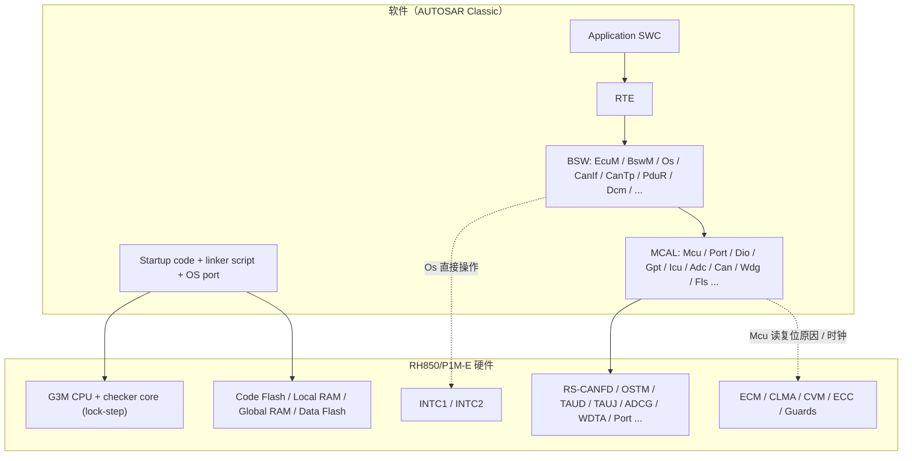
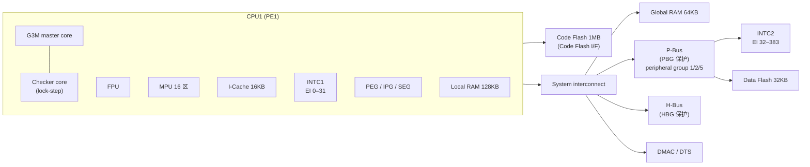
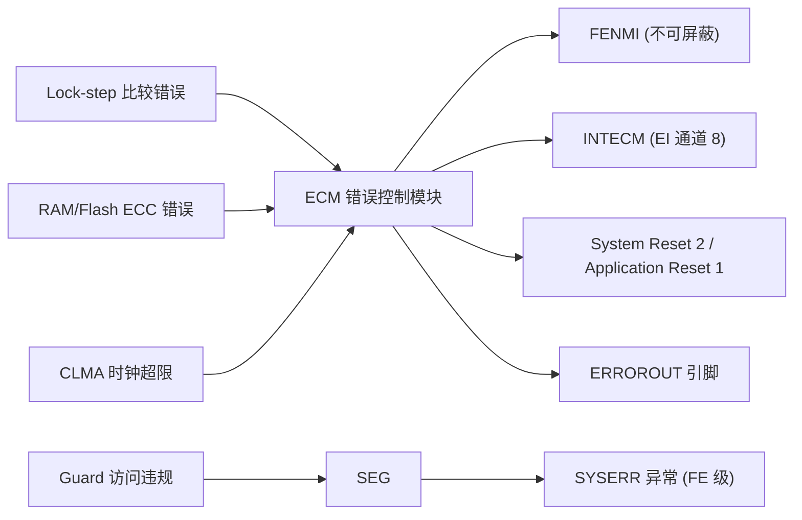

# RH850 概览：从芯片家族到 R7F701381（RH850/P1M-E）

> Prerequisite: 无（Part I 第一章）。建议先浏览 [学习路线](../00-learning-roadmap.md)
> Next: [02-cpu-architecture.md](02-cpu-architecture.md)
> 对应规范: RH850/P1M-E User's Manual: Hardware R01UH0585EJ0120 Rev.1.20（下称 **HW-E**）§1、§3.1、§4、§31；RH850/P1M-E Datasheet R01DS0505ED0100 Rev.1.00（下称 **DS-E**）p.1–3；AUTOSAR CP SWS MCU Driver **R24-11**（下称 **SWS-MCU**）p.9、p.13–14
> 对应源码: 本项目 `examples/rh850_mcal_reference/`（OSTM、CAN 位时间、MMIO shim）；openAUTOSAR（`D:\side_project\openAUTOSAR`）**没有任何 RH850 支持**，见 §9
> 事实底稿: [04-rh850-hardware-notes.md](../reference/research/04-rh850-hardware-notes.md)

---

## 1. 本章目标

读完本章，你应该能够：

1. 说清楚 **R7F701381 是哪颗芯片**：RH850/P1M-E、100-pin、DPS 电源方式、1 MB Code Flash、G3M 内核 + lock-step checker core，而**不是** G4MH、也不是“双核”。
2. 说清楚这颗芯片为什么会出现在汽车底盘类 ECU 里：功能安全（ASIL）相关的硬件机制有哪些。
3. 列出它的主要外设，并知道每一个外设在后面会对应哪一个 AUTOSAR MCAL 驱动。
4. 会读 Renesas 的手册：知道 HW-E、DS-E、G3M Software Manual、Flash Manual 各自管什么；知道仓库里缺哪一本，缺了以后该怎么办。
5. 知道换到其他 RH850 derivative（P1x、P1x-C、F1x、U2A）时，**哪些知识可以迁移、哪些必须重新查手册**。

本章是整个 Part I 的“地图”。后面 02–08 章会逐个把 CPU、存储、启动、链接、中断、时钟和外设展开。

---

## 2. 为什么要先学芯片？

AUTOSAR Classic 的一个核心承诺是：**上层软件（SWC、RTE、大部分 BSW）不关心芯片**。那为什么一个以 DCM / CAN 为最终目标的教程，要先花 8 章讲 RH850？

原因是：AUTOSAR 只是把芯片**藏起来**，并没有让芯片**消失**。当一个 UDS 请求 `22 F1 90` 从 CAN 总线进来时，真正发生的第一件事是：

```text
CAN 收发器把差分电平转成 RXD 逻辑电平
  → RH850 的 RS-CANFD 外设按接收规则把帧放进 RX FIFO
  → RS-CANFD 拉高中断请求 INTRCANGRECC（EI 通道 190）
  → INTC2 根据 EIC190 的优先级把请求送给 G3M CPU
  → CPU 硬件把 PC/PSW 存进 EIPC/EIPSW，跳到中断向量
  → OS 的 Category 2 ISR 包装函数调用 Can 驱动的 RX 处理
  → Can 驱动读 RFIDx/RFPTRx/RFDF0_x 寄存器，调用 CanIf_RxIndication()
  → ……一直到 DCM、RTE、SWC
```

这里面前 6 步全是芯片行为。如果你以后在真实项目里遇到“诊断仪发了请求，ECU 没反应”，问题有很大概率落在这 6 步里：引脚复用没配、接收规则 mask 写反、中断绑到了 EI184 而不是 EI190、EIC 被屏蔽、ISR 没清外设标志导致中断风暴……这些都不是 DCM 配置能解决的问题。

> 所以本教程的顺序是“从硬件向上”：先建立芯片的 mental model，再看 MCAL 怎么把寄存器包装成标准 API，最后才看 BSW。

---

## 3. RH850 在 AUTOSAR ECU 中的位置



逐层解释：

- **Startup code + linker script + OS port**：这三样东西在 AUTOSAR 分层图里经常被画成“看不见的地基”。它们决定 CPU 从哪里开始执行、栈在哪里、`.data` 怎么从 Flash 搬到 RAM、中断向量表放在哪里。SWS-MCU 明确说 start-up code 在 MCU driver **之前**运行，负责向量基址、栈指针、看门狗、cache、默认时钟等（SWS-MCU p.13–14）。这部分在 [04-startup-process.md](04-startup-process.md) 和 [05-linker-script.md](05-linker-script.md) 展开。
- **MCAL**：直接访问外设寄存器。它是唯一“知道” RS-CANFD 寄存器偏移的软件层。见 [08-peripheral-overview.md](08-peripheral-overview.md)。
- **Os**：AUTOSAR OS 的 port（如真实项目截图中出现的 RTA-OS RH850GHS port）直接操作 CPU 系统寄存器和 INTC：保存上下文、设置中断优先级、切换栈。见 [06-interrupt-exception.md](06-interrupt-exception.md)。
- **Safety 硬件（ECM/CLMA/CVM/ECC/Guards）**：不对应单一 MCAL 模块，往往分散在 startup、Mcu、Wdg、以及项目自己的 safety 代码里。

---

## 4. RH850 家族与 P1M-E 的定位

### 4.1 家族的组织方式（架构层面）

[Conceptual] Renesas RH850 是一个 32 位汽车 MCU 家族，按应用领域分成若干系列，系列内再分 group 和具体型号。理解时可以用三层：

| 层次 | 例子 | 决定了什么 |
|---|---|---|
| CPU 内核架构 | RH850 G3K / G3M / G3MH / G4MH 等 | 指令集、系统寄存器、异常模型、是否多核/虚拟化 |
| 系列 / group | P1x（底盘、安全）、F1x（车身/通用）、U2A（新一代域控/多核）等 | 外设组合、CAN IP、时钟结构、写保护机制 |
| 具体型号 | R7F701381 | Flash/RAM 容量、封装、引脚、电源方式 |

> 注意：上表中“系列面向什么应用”“U2A 用什么核”等信息**本仓库没有对应手册**，只是行业常识层面的定位描述。具体到任何寄存器、地址、外设数量，都**需根据实际芯片手册确认**。本仓库能核对的只有 P1M-E（HW-E/DS-E）、P1x 非 E 版（HW-X，R01UH0436EJ0140）和 P1x-C（DS-C，R01DS0506ED0100）。

### 4.2 P1M-E 在 P1x 里的位置

[RH850 Hardware] DS-E 自述：RH850/P1M-E 面向 “Automotive field (including chassis control system)”（DS-E p.2 §1.2），内置 CAN、LIN、FlexRay、SENT、PSI5 等“best suited for the automobile chassis applications”的外设（DS-E p.1）。底盘系统（制动、转向、悬架等）对功能安全要求高，这就是 P1x 系列强调 lock-step 和 ECC 的原因。

### 4.3 R7F701381 是哪颗芯片

[RH850 Hardware] DS-E Table 1.1 把产品按“电源方式 × Flash 容量 × 封装”排列（DS-E p.2）：

| 电源方式 | Flash | 100-pin LFQFP100 (14×14) | 144-pin (16×16) | 144-pin (20×20) |
|---|---|---|---|---|
| eVR | 1 MB | R7F701382 | R7F701384 | R7F701386 |
| eVR | 2 MB | R7F701376 | R7F701378 | R7F701380 |
| **DPS** | **1 MB** | **R7F701381** | R7F701383 | R7F701385 |
| DPS | 2 MB | R7F701375 | R7F701377 | R7F701379 |

所以：**R7F701381 = RH850/P1M-E，DPS，1 MB Code Flash，100-pin**。

> **一个真实发生过的错误**：DS-E p.1 写的是 “Code Flash … up to 2MB / Data Flash … up to 64KB”，这是**整个系列的上限**。早期截图里的链接配置 `iROM 2048K` 就是把系列上限当成了本型号容量（见 [01-project-and-docs-review.md](../reference/research/01-project-and-docs-review.md) §1.4）。R7F701381 的 Code Flash 用户区只到 `0x000F_FFFF`（HW-E p.257 Note 1）。

运行时确认型号的方法：读 PRDNAME1–4 产品名寄存器，R7F701381 对应 ASCII “R7F701381” 的编码（HW-E p.2879–2880）。真实项目里还要核对 BOM 和芯片丝印。

### 4.4 R7F701381 特性表

[RH850 Hardware] 依据 DS-E Table 1.1（p.2–3）与 HW-E §3.1（p.187–189），对 1 MB / 100-pin 型号取值：

| 类别 | 项目 | R7F701381 的值 | 出处 |
|---|---|---|---|
| CPU | 内核 | RH850 **G3M**，Main core ×1，**Lockstep: Yes** | DS-E p.1–2 |
| CPU | 频率 | CLK_CPU 160 MHz（PLL 输出） | DS-E p.2；HW-E p.469 |
| CPU | 外部晶振 | **Main OSC = 16 MHz only** | DS-E p.2 |
| CPU | FPU | 单精度 + 双精度，IEEE754 | DS-E p.2；HW-E p.189 |
| CPU | MPU | 16 区 | DS-E p.2；HW-E p.189 |
| CPU | I-Cache | 16 KB 4-way | DS-E p.2 |
| RAM | Local RAM | 128 KB | DS-E p.2 |
| RAM | Global RAM | 64 KB（Bank A/B 各 32 KB） | DS-E p.2；HW-E p.257 |
| RAM | Trace RAM | 32 KB | DS-E p.2 |
| RAM | Emulation RAM | 8 KB（1 MB 型号；2 MB 型号为 32 KB） | DS-E p.2 Note 2；HW-E p.2889 |
| Flash | Code Flash | 1 MB（+32 KB 扩展用户区） | DS-E p.2；HW-E p.257 |
| Flash | Data Flash | 32 KB（1 MB 型号） | DS-E p.2 Note 2；HW-E p.257 Note 3 |
| INTC | INTC1 / INTC2 | 32 ch（Redundant）/ 352 ch | DS-E p.2 |
| DMA | DMAC / DTS | 16 ch / 128 ch（均 Redundant） | DS-E p.2 |
| Safety | ECM、CVM、BIST、ERROROUT、Clock monitor | 均有 | DS-E p.2 |
| ADC | ADCG 12-bit | 2 个模块；100-pin：ADCG0 9 ch、ADCG1 10 ch | DS-E p.2 |
| Timer | TAUD / TAUJ | 3 个（16 bit × 16 ch）/ 3 个（32 bit × 4 ch） | DS-E p.3 |
| Timer | OSTM | 5 个 + 带输出的 2 个（OSTM0/1）；**没有 OSTM2** | DS-E p.3；HW-E p.1542 |
| Timer | 其他 | TSG3 ×2、TAPA ×4、ENCA ×2、TPBA ×2、WDT ×1 | DS-E p.3 |
| 通信 | RS-CANFD | 3 channels（1 个单元 RSCFD0） | DS-E p.3；HW-E p.788 |
| 通信 | FlexRay / PSI5 / RSENT | 2 ch / 2 ch / 5 ch（100-pin） | DS-E p.3 |
| 通信 | SCI3 / RLIN3 / CSIG / CSIH | 3 / 2 / 1 / 4 ch | DS-E p.3 |
| 其他 | DataCRC（DCRA）、Security（ICUS）、Nexus-JTAG | 4 / Yes / Yes | DS-E p.3 |
| 电源 | Core / IO | 1.25 V（DPS）/ 3.3 或 5.0 V | DS-E p.3 |

几个容易误解的点：

1. **“两个 G3M”不等于“双核”**。DS-E p.1 说 “This product contains two RH850G3Ms: one operates as the master CPU for normal operation and another as a checker CPU that monitors the operation of the master CPU. The two CPUs operate in lock step mode.” checker core 不执行你的任务，它和主核同步执行同一条指令流，由比较器逐拍比较输出。对 AUTOSAR OS 来说这是**单核**系统。
2. **有 FPU 不等于编译时一定用硬件浮点**。截图中的编译选项 `-fsoft` 表示软件浮点。是否使用 FPU 取决于编译器、库 ABI 和 OS 是否保存浮点上下文——见 [02-cpu-architecture.md](02-cpu-architecture.md) §8.6。
3. **OSTM 没有 2 号**。OSTM 编号为 0、1、3–7（HW-E p.1542），OSTM3–7 只能产生 FE 级中断 FEINT（HW-E p.264、p.1544），不能当普通定时器中断用。

---

## 5. 硬件框图：CPU 子系统

[RH850 Hardware] HW-E Figure 3.1（p.187）给出了 CPU 系统框图。用 Mermaid 重画如下：



读图要点（HW-E p.187–188）：

- **Code Flash 通过专用接口直连 CPU1**，Local RAM 也在 PE1 内部——这两者是 CPU 访问最快的存储。
- **Global RAM 在 system interconnect 上**，所有 bus master（CPU、DMA、H-Bus master）都能访问。
- **INTC1 在 PE 内部**（并且与 checker core 冗余），**INTC2 在 P-Bus 上**。这解释了为什么 EIC0–31 地址在 `FFFE_Exxx`（CPU 私有区），EIC32–383 地址在 `FFFF_Bxxx`（P-Bus 区）（HW-E p.265）。中断响应时间也因此不同：INTC1 直接向量 cache 命中 7 个 CPU 周期，INTC2 为 12 个周期（HW-E p.297 Table 6.13）。
- **Slave Guard**（PEG、IPG、SEG、GRG、PBG/HBG）防止“错误的 bus master 访问错误的资源”。复位后外设对 PE1 以外的 master 默认是保护状态，Global RAM 默认不保护（HW-E p.188）。

---

## 6. 为什么这颗芯片适合汽车功能安全

ISO 26262 要求按 ASIL 等级控制随机硬件失效。软件写得再好，CPU 算错一条指令、RAM 翻一个 bit、时钟漂了 20%，系统照样会出错。RH850/P1M-E 用一组硬件机制把这些随机失效**检测出来**，再交给 ECM（Error Control Module）统一决定后果。DS-E p.1 列出的功能安全支持是：Lock-Step Dual Core、memory protection with ECC、bus protection with ECC、peripheral module protection、voltage/clock monitors。

[RH850 Hardware] 逐项对应到手册：

| 失效类型 | 检测机制 | 手册位置 | 软件要关心什么 |
|---|---|---|---|
| CPU 内核随机失效 | Checker core lock-step 比较，覆盖 CPU core、FPU、MPU、PEG、IPG、SEG、INTC1 | HW-E p.250；§31.3 p.2684 | **启动时不要读复位后值未定义的寄存器再写出去**，否则可能触发比较错误（HW-E p.250 CAUTION）。见 [04-startup-process.md](04-startup-process.md) |
| RAM / Flash 位翻转 | ECC（除 I-Cache RAM 和 ERAM 外所有 RAM；I-Cache 为 EDC） | HW-E p.2889–2890；§31.2 | 读未初始化 RAM 会触发 ECC 错误；硬件在复位时清零 LRAM/GRAM 并写正确 ECC |
| 总线传输错误 | ECC on data transfer path | HW-E §31.2.9 p.2620 | 一般由 safety 软件配置 |
| 非法访问 | PEG / IPG / PBG / HBG / GRG + MPU | HW-E p.260；§31.4 | 访问违规 → SYSERR 等异常；debug 时要会读异常原因 |
| 时钟异常 | CLMA0–3 时钟监视 | HW-E §31.5 p.2752 | 需要软件用 `0xA5` 保护序列使能，见 [07-clock-system.md](07-clock-system.md) |
| 电压异常 | CVM（Core Voltage Monitor） | HW-E §10 p.442 | CVM 复位会体现在 RESF.SRESF1 |
| 软件跑飞 | WDTA0 窗口看门狗 | HW-E §21 p.1522 | 启动模式由 option byte 决定 |
| 错误汇总 | **ECM**：把各类错误路由成 FENMI、EI 中断、ERROROUT 引脚或复位 | HW-E p.432；§32 p.2786 | ECM 的路由配置决定“出错后 ECU 是复位、进中断还是只拉 ERROROUT” |
| 硬件自检 | Field BIST（复位后执行） | HW-E p.432、p.434；§31.6 | RESF.ARESF3 表示 BIST 执行过 |



图中 INTECM 是 EI 通道 8（HW-E p.282 Table 6.11）；CLMA 的错误以 ECM error factor #8–#15 上报（HW-E p.2752 Table 31.181）；ECM 复位可配置为 System Reset 2 或 Application Reset 1（HW-E p.418、p.432）。

> [Real Project Consideration] ECM 的具体路由（哪个 error factor 进 FENMI、哪个触发复位）是**项目 safety concept 的一部分**，通常由 safety 团队定义、由启动代码或专门的 safety 模块配置。本教程只讲机制，具体配置需要在真实项目环境中确认。

---

## 7. 外设总览（详细映射见第 08 章）

[RH850 Hardware] HW-E 按 Section 组织外设。下表列出与 AUTOSAR MCAL 关系最密切的部分（页码为 HW-E 章节起始页）：

| HW-E Section | 外设 | 基址（举例） | 未来对应的 MCAL 驱动 |
|---|---|---|---|
| §2 p.68 | Port（P0–P5、JP0） | `PORT_base = FFC1_0000H`（p.91） | Port / Dio |
| §6 p.264 | INTC1 / INTC2 | EIC0 `FFFE_EA00H`，EIC32 `FFFF_B040H` | 由 Os port 管理 |
| §8 p.418 | Reset Controller | RESF `FFF8_1000H` | Mcu（`Mcu_GetResetReason`、`Mcu_PerformReset`） |
| §12 p.468 | Clock Controller | `FFF8_8810H` 起 | Mcu（时钟部分） |
| §17 p.788 | RS-CANFD | `RSCFD0_base = FFD2_0000H`（p.791） | **Can** |
| §21 p.1522 | WDTA0 | `FFD7_4000H` | Wdg |
| §22 p.1542 | OSTM0/1、3–7 | OSTM0 `FFDD_8000H` | Gpt / OS counter |
| §23 p.1571 | TAUD0–2 | `FFE2_0000H` 起 | Gpt / Pwm / Icu |
| §24 p.1878 | TAUJ0–2 | `FFE5_0000H` 起 | Gpt / Icu |
| §30 p.2427 | ADCG0/1 | `FFF9_1000H` / `FFF9_2000H` | Adc |
| §35 p.2857 | Flash（Code/Data） | Data Flash `FF20_0000H` | Fls / Fee |
| §16 p.687 | RLIN3 | `FFDF_8000H` 起 | Lin（本教程不展开） |
| §14 p.525 | CSIH0–3 | `FFD8_0000H` 起 | Spi（本教程不展开） |

详细的“寄存器 → MCAL → AUTOSAR API”映射在 [08-peripheral-overview.md](08-peripheral-overview.md)。

---

## 8. 如何阅读 Renesas 手册

### 8.1 需要哪几本书

| 文档 | 管什么 | 仓库中是否有 |
|---|---|---|
| **HW-E**：RH850/P1M-E User's Manual: Hardware（R01UH0585EJ0120 Rev.1.20，3121 页） | 外设寄存器、地址映射、复位、时钟、中断表、功能安全、Flash 寄存器、电气特性 | 有：`references/downloads/r01uh0585ej0120.pdf`，文本 `artifacts/pdf-text/r01uh0585ej0120.txt` |
| **DS-E**：RH850/P1M-E Datasheet | 型号表、容量、封装、引脚、电气参数 | 有：`r01ds0505ed0100-rh850p1m-e.pdf` |
| **RH850G3M User's Manual: Software** | 指令集、完整异常表与向量偏移、EIRET/FERET 语义、SYNCP/SYNCI 要求、系统寄存器 hazard 处理 | **没有**。HW-E 多处直接引用它（如 p.193、p.199、p.254、p.264、p.281） |
| RH850/P1M-E Flash Memory User's Manual: Hardware Interface | Code/Data Flash 自编程、FACI 命令时序 | **没有**（HW-E p.255、p.2888 引用） |
| 编译器手册（GHS / CC-RH） | ABI、寄存器保留、section 名、linker 语法、启动文件 | **没有** |
| Technical Update / Errata | 勘误 | 没有；真实项目必须查 Renesas 官网对应器件页面 |
| HW-X：RH850/P1x（P1H/P1M，非 -E）硬件手册 | 只作对照：RS-CAN、PROT1PHCMD 写保护 | 有，但**不能**用于 P1M-E |
| DS-C：RH850/P1x-C 数据手册 | 只作对照：MCAN、G3K 安全核 | 有，但**不能**用于 P1M-E |

> 缺失的手册怎么办？教程中凡是只能由 G3M Software Manual 回答的问题（例如 SYSERR 的向量偏移、EIRET 恢复哪些位），一律写“**需根据 RH850G3M User's Manual: Software 确认**”，并解释为什么重要、去哪里查。不要从其他内核或网上片段“补齐”数值。

### 8.2 HW-E 的组织结构

HW-E 目录（p.9 起）中与本教程相关的章节：

```text
§1  Overview ............... p.64      §17 RS-CANFD ............. p.788
§2  Pin Functions .......... p.68      §21 WDTA ................. p.1522
§3  CPU System ............. p.187     §22 OSTM ................. p.1542
§4  Address Space .......... p.257     §23 TAUD ................. p.1571
§5  Operating Modes ........ p.261     §24 TAUJ ................. p.1878
§6  Interrupt .............. p.264     §30 ADCG ................. p.2427
§8  Reset Controller ....... p.418     §31 Functional Safety .... p.2520
§12 Clock Controller ....... p.468     §32 ECM .................. p.2786
                                       §35 Flash Memory ......... p.2857
                                       §36 RAM .................. p.2889
                                       §37 Electrical Spec ...... p.2901
```

HW-E 的 PDF 页码与印刷页码一致（例如 PDF p.257 页脚印有 “Page 257 of 3121”），所以本教程所有 `(HW-E p.xxx)` 可以直接在 PDF 里跳转。

### 8.3 读一个寄存器描述的固定套路

以 EIC 寄存器（HW-E p.267）为例，Renesas 的寄存器描述总是包含这些要素：

```text
Access:            EICn can be read/written in 16-bit units.
                   EICnH and EICnL can be read/written in 8- or 1-bit units.
Address:           FFFE EA00H - FFFE EA3EH (EIC0-31)
                   FFFF B040H - FFFF B2FEH (EIC32-383)
Value after reset: 008FH (edge detection), 808FH (high level detection)
Bit / R/W 表 + 每个 bit 的 Function 表
CAUTION / NOTE
```

每一项都对应一个实际的工程风险：

| 要素 | 为什么重要 | 违反时的典型后果 |
|---|---|---|
| **Access 宽度** | 有的寄存器只能 8 位访问（如 RS-CANFD 的 TMCp、TMSTSp，HW-E p.878、p.880） | 用 32 位写会写到相邻寄存器，或者被忽略 |
| **Address** | 用 `<XXX_base> + offset` 表示；`n`、`m` 等是实例索引 | 套错索引公式，写到别的通道 |
| **Value after reset** | 告诉你复位后状态（例如 EIMK=1 即复位后屏蔽） | 误以为中断默认打开 |
| **Reset condition 表** | 哪些复位会初始化这个寄存器（如 HW-E Table 8.5 p.420） | Application Reset 后以为寄存器已复位 |
| **R/W 列** | 只读位、写 1 清除、写 0 清除各不相同 | 读-改-写把别的标志清掉 |
| **CAUTION** | 时序或顺序约束（如 EIC 读-改-写会丢中断，p.267） | 偶发、难以复现的 bug |
| **Protection** | 是否需要特殊解锁序列（如 CLMAnCTL0 需要 `0xA5` 序列，p.2764） | 写入“成功”但值没变 |

### 8.4 用仓库里的文本快速检索

```bash
# 找某个寄存器出现在哪一页
grep -n "RESF" artifacts/pdf-text/r01uh0585ej0120.txt | head
# 把行号换算成 PDF 页：向上找最近一个 "=== PDF PAGE n ==="
```

注意：旋转排版的表格（例如 HW-E p.151–154 的引脚功能表）文本抽取后列会错位，**写进代码前必须回到 PDF 原表核对**（[04-rh850-hardware-notes.md](../reference/research/04-rh850-hardware-notes.md) §6.3 已记录这个风险）。

---

## 9. openAUTOSAR 与本教学项目在这一章的位置

**openAUTOSAR**（Arctic Core 2.18.0，R3.1.5 风格）**没有任何 RH850 支持**：`boards/linuxOs/MCAL/*` 实际是 STM32 / MPC5xxx 的遗留代码；构建工具链只有 arm-none-eabi-gcc（见 [03-openautosar-trace.md](../reference/research/03-openautosar-trace.md) §1.2、§1.3）。所以 openAUTOSAR 在 Part I 中只用来对照“启动顺序的代码意图”（第 04 章），不用来讲 RH850 硬件。

**本教学项目**的 RH850 相关代码在 `examples/rh850_mcal_reference/`：

| 文件 | 内容 | 本章之后在哪里用到 |
|---|---|---|
| `platform/Rh850_Mmio.h/.c` | volatile 8/16/32 位访问抽象，可替换为测试模型 | 第 08 章“寄存器访问为什么要按宽度” |
| `mcal/gpt/Ostm.c` | OSTM0/1 配置、启停、比较值、周期换算 | 第 07 章 OSTM 时钟、第 08 章 Gpt 映射 |
| `mcal/can/Can_BitTiming.c` | CAN FD 位时间参数检查与编码 | 第 07 章 CAN 时钟 |
| `integration/Tick_Accumulator.c` | 32 位硬件计数 → 16 位 1 ms tick | 第 06 章 OS tick |

[Educational Implementation] 这些代码只在主机上编译测试（`python tools/run_host_tests.py`），没有启动代码、向量表和链接脚本，也没有上板。

---

## 10. 换一颗 RH850 时，什么会变？

以后你在真实项目里拿到的芯片**未必**是 P1M-E。下表告诉你哪些知识可以直接迁移，哪些必须重新查手册。

| 主题 | 可迁移的“架构知识” | 必须重新查的“型号细节” | 本仓库可核对的对照事实 |
|---|---|---|---|
| CPU 寄存器模型 | r0–r31 角色、PSW、EI/FE 两级异常、LDSR/STSR 访问系统寄存器 | 内核版本（G3M/G3MH/G4MH）带来的新系统寄存器、虚拟化、多核 PE 数量 | P1x-C：主核 G3M（1–2 个，各自 lock-step）+ G3K 安全核（DS-C p.1） |
| 中断控制器 | EIC 的优先级/屏蔽/向量方式概念、INTBP 表引用 | 通道号、EIC 地址、INTC 分组 | P1M-E 的 CAN 是 EI 183–193；其他型号必须查各自中断表 |
| CAN 外设 | AUTOSAR Can 驱动的抽象（HTH/HRH、controller 状态机） | **CAN IP 本身可能完全不同** | P1x 非 E：RS-CAN（只有 classical）（HW-X §17 p.772）；P1M-E：RS-CANFD；P1x-C：MCAN / M_TTCAN（DS-C p.4） |
| 时钟 | Mcu_InitClock / GetPllStatus / DistributePllClock 的 AUTOSAR 语义 | 是否有软件可编程 PLL、时钟选择寄存器 | P1M-E：**没有**软件 PLL 寄存器（HW-E §12.3 p.471）；P1x 非 E：有 CKSC0CTL 等，用 PROT1PHCMD 保护（HW-X p.257–261） |
| 写保护 | “关键寄存器需要解锁序列”的思想 | 保护寄存器名称、序列、覆盖范围 | P1M-E：只有 CLMA/ECM/FLMDCNT 用 `0xA5` 序列，时钟控制器寄存器靠 Slave Guard（HW-E p.471）、复位寄存器靠 P-Bus Guard（p.420，PBG 是 slave guard 的一种）；全文没有 `PROTCMD` |
| 存储映射 | Code Flash 在低地址、RAM 在高地址、外设在 `FFxx_xxxx` 的总体布局 | 每个区域的精确地址和容量 | 见 [03-memory-map.md](03-memory-map.md) |
| 启动 | Reset → startup → C runtime → EcuM → OS 的顺序 | 复位向量、option bytes、RAM 硬件初始化能力 | P1M-E 有 LRAM/GRAM 硬件清零 + ECC（HW-E p.2890） |

> [Real Project Consideration] **“MCAL 包名是 P1M”不等于“芯片是 P1M-E”**。截图中的 RTA-OS variant 写作 `RH850GHS[P1M]`，Renesas MCAL 包也叫 P1M。P1M 与 P1M-E 的 CAN IP、时钟、写保护都不同。进入真实项目的第一件事，就是用 BOM / 丝印 / PRDNAME 确认型号，再确认 MCAL 包的 derivative 选项与之一致。

---

## 11. RH850 register → MCAL → AUTOSAR API：第一次预览

AUTOSAR MCAL 的价值，在于把下面左边这一列藏到右边这一列后面：

```text
[RH850 Hardware]                         [MCAL]            [AUTOSAR API]               [上层调用者]
RSCFD0 TMIDp/TMPTRp/TMDF0_p/TMCp   →   Can.c          →  Can_Write(Hth, PduInfo)  ←  CanIf_Transmit()
RFSTSx / RFIDx / RFPCTRx            →   Can.c (ISR)    →  CanIf_RxIndication()     →  CanTp / PduR
RESF (FFF8_1000H)                   →   Mcu.c          →  Mcu_GetResetReason()     ←  EcuM
PMCn / PFCn / PMn                   →   Port.c         →  Port_Init()              ←  EcuM
PSRn / PPRn                         →   Dio.c          →  Dio_WriteChannel()       ←  IoHwAb / SWC (via RTE)
OSTM0 CMP / CTL / TS                →   Gpt.c          →  Gpt_StartTimer()         ←  BSW / OS
WDTA0 WDTE                          →   Wdg.c          →  Wdg_SetTriggerCondition()←  WdgIf / WdgM
```

这一张表会在 [08-peripheral-overview.md](08-peripheral-overview.md) 展开成完整的映射，并在 Part III（MCAL）和 Part IV（CAN MCAL）逐个驱动深入。

---

## 12. Debug 方法：第一次连上板子先看什么

[RH850 Hardware] 拿到一块未知的板子时，用调试器只读访问下面几个寄存器，就能建立“这是什么芯片、刚才发生了什么”的基本判断：

| 寄存器 | 地址 / 编号 | 读到什么 | 出处 |
|---|---|---|---|
| PRDNAME1–4 | Flash 区产品名寄存器 | 型号字符串，确认 R7F701381 | HW-E p.2879–2880 |
| PID | 系统寄存器 SR6,1 | `0580_0714H`：bit10/9/8 = 双精度 FPU / 单精度 FPU / MPU 已实现 | HW-E p.206 |
| MODE | `FFF8_0104H` | 复位时锁存的 FLMD0/FLMD1：Normal 还是 Serial programming 模式 | HW-E p.263 |
| RESF | `FFF8_1000H` | 上一次复位原因（POR / pin / CVM / SW / ECM / BIST） | HW-E p.421–422 |
| OPBT0 | `FFCD_0030H`（只读映射） | WDTA0 是否上电自动运行、溢出时间、时钟 | HW-E p.2884 |

> PID 寄存器手册特别提醒：不要让软件行为根据 PID 动态变化（HW-E p.206 CAUTION）。它只用于识别，不用于“运行时适配多种芯片”。

---

## 13. 常见问题与误区

| 误区 | 正确理解 | 依据 |
|---|---|---|
| “P1M-E 是双核，可以跑两个 OS core” | 只有一个主核；checker 是 lock-step 比较用的 | DS-E p.1；HW-E p.250 |
| “R7F701381 有 2 MB Flash” | 1 MB；2 MB 是系列上限 | DS-E p.2 Table 1.1；HW-E p.257 |
| “RH850 的 CAN 都是 RS-CAN” | P1M-E 是 RS-CANFD；P1x 非 E 是 RS-CAN；P1x-C 是 MCAN | HW-E p.788；HW-X p.772；DS-C p.4 |
| “Mcu_InitClock 要按 PROTCMD 0xA5 序列写 PLL 寄存器” | P1M-E 没有软件 PLL 寄存器，也没有 PROTCMD | HW-E p.471；见第 07 章 |
| “CAN 位时间按 80 MHz 算” | 80 MHz 是 pclk（接口时钟）；位时间时钟是 40 MHz 或 16 MHz | HW-E p.791 |
| “OSTM 有 0–7 共 8 个，都能做 Gpt” | 没有 OSTM2；OSTM3–7 只能 FEINT | HW-E p.1542、p.1544 |
| “P1M 的 MCAL 示例代码可以直接用在 P1M-E 上” | 外设 IP 和保护机制不同，必须使用匹配 derivative 的 MCAL | HW-X 与 HW-E 对照 |

---

## 14. 实验

**实验 1：给芯片做一张“身份证”。**
打开 `artifacts/pdf-text/r01ds0505ed0100-rh850p1m-e.txt`，找到 Table 1.1。自己填一张表：R7F701381 的 Flash、Data Flash、RAM、ERAM、ADC 通道数、RSENT 通道数，并在每格后面写上页码。然后回答：为什么 ERAM 一栏有两个值？（提示：看 Note 1/2。）

**实验 2：验证“没有 PLL 寄存器”这个结论。**

```bash
grep -c "PROTCMD" artifacts/pdf-text/r01uh0585ej0120.txt
grep -c "PLLE"    artifacts/pdf-text/r01uh0585ej0120.txt
grep -c "PROT1PHCMD" artifacts/pdf-text/REN_r01uh0436ej0140-rh850p1x_MAH_20180330_1.txt
```

前两条应为 0，第三条不为 0。用这个结果解释：为什么不能把 P1x 的时钟初始化代码搬到 P1M-E。

**实验 3：页码习惯。**
任选 HW-E 中的三个寄存器（建议 RESF、EIC、OSTM0CTL），在文本中 grep 它们，换算成 PDF 页码，再打开 PDF 核对页脚。养成“每个硬件事实都带页码”的习惯。

---

## 15. 思考题

1. 如果 lock-step checker core 和主核比较出不一致，软件还能“自己处理”吗？这个错误最终会走到哪个模块，可能产生哪几种后果？
2. 为什么 INTC1 放在 PE 内部且与 checker core 冗余，而 INTC2 放在 P-Bus 上？这对“高优先级、低延迟中断该分配在哪个通道范围”有什么启示？（提示：HW-E p.264 说 32 个 high-speed interrupts 包含 DMAC、ECM、WDTA。）
3. 一个 MCAL 包同时支持 P1M 和 P1M-E 两种 derivative，你认为它的 Can 驱动内部会如何组织代码？你会去哪里确认当前项目选了哪一个？
4. 为什么 DS-E 要把 1 MB 和 2 MB 型号的 ERAM、Data Flash 容量设计成不同？这对 Fee 配置意味着什么？

---

## 16. 对未来真实项目的意义

进入真实 RH850 + RTA-CAR 项目后，第一周就应该做完下面这张清单。它不依赖任何公司内部知识，只依赖你在本章建立的“芯片身份”意识：

```text
1. 确认芯片型号：BOM / 丝印 / 调试器读 PRDNAME
2. 根据型号找到正确的 Hardware Manual、Datasheet、Technical Update
3. 确认内核：G3M？G3MH？G4MH？——决定要不要找 G3M/G4MH Software Manual
4. 确认 MCAL 包的 derivative 选项与芯片一致（不只看包名）
5. 确认 OS port 的 variant（截图例子：RH850GHS[P1M]）与芯片一致
6. 确认 CAN IP 类型：RS-CAN / RS-CANFD / MCAN —— 决定 Part IV 的哪些内容适用
7. 确认时钟结构：有没有软件 PLL —— 决定 Mcu_InitClock 是“真干活”还是“空实现”
8. 确认 Code Flash 容量与 linker script 中 ROM 区长度一致
9. 读出 OPBT0，确认 WDTA 是否上电自动运行
10. 列出 safety 机制（ECM 路由、CLMA、MPU）由哪个模块/团队负责
```

这些信息全部属于“**需要在真实项目环境中确认**”的范畴。本教程给你的是“该问哪些问题、去哪里找答案、找到后如何映射回 Part I–IV 的知识”。

---

## 17. 本章总结

- R7F701381 = RH850/P1M-E，DPS，1 MB Code Flash，100-pin；G3M 主核 + lock-step checker core，单核视角；160 MHz CPU，16 MHz 晶振固定。
- 它面向底盘类功能安全应用，硬件上提供 lock-step、ECC、guard、CLMA、CVM、WDTA、ECM、BIST 等机制。
- 外设与 MCAL 驱动有清晰的对应关系：RS-CANFD→Can，OSTM/TAUx→Gpt/Icu，Port→Port/Dio，Reset/Clock→Mcu，WDTA→Wdg，ADCG→Adc，Flash→Fls/Fee。
- 读手册要关注 Access 宽度、复位值、复位条件、R/W 语义、CAUTION 和保护机制；缺失的 G3M Software Manual 与 Flash Manual 相关内容必须标注“需确认”。
- 换芯片时，架构知识可迁移，寄存器细节不可迁移。

## 18. 下一章

[02-cpu-architecture.md](02-cpu-architecture.md)：进入 G3M CPU 内部——32 个通用寄存器、PSW、EI/FE 两级异常、特权模式，以及“中断发生时硬件保存什么、软件必须保存什么”。
