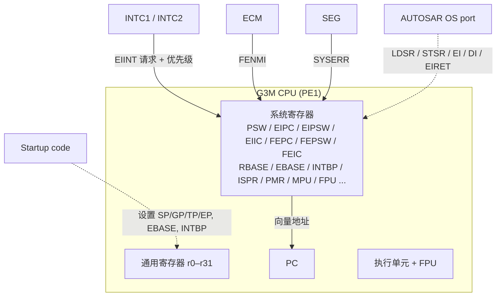
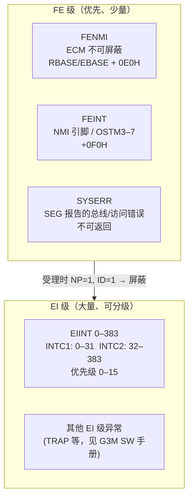
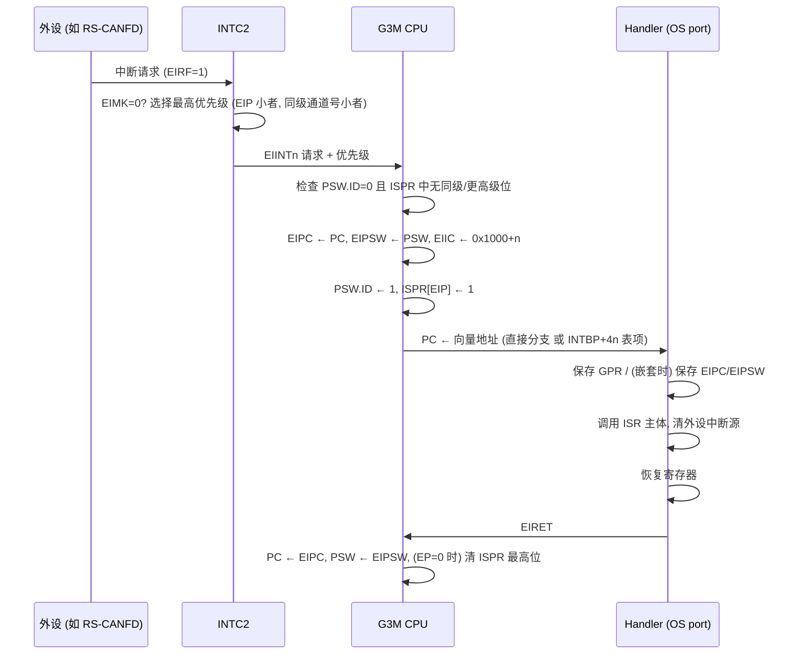

# RH850 G3M CPU 架构：寄存器、PSW、特权级与异常级别

> Prerequisite: [01-rh850-overview.md](01-rh850-overview.md)
> Next: [03-memory-map.md](03-memory-map.md)
> 对应规范: HW-E（R01UH0585EJ0120 Rev.1.20）§3.2.1 p.189–226（寄存器集）、§3.2.3.4 p.250（checker core）、§3.4 p.254–256（使用注意）、§6.4 p.281；**RH850G3M User's Manual: Software（本仓库没有）**
> 对应源码: 无 RH850 汇编源码（本仓库与 openAUTOSAR 都没有 RH850 OS port / 启动文件）；本章代码均为 `[Conceptual]`
> 事实底稿: [04-rh850-hardware-notes.md](../reference/research/04-rh850-hardware-notes.md) §2

---

## 1. 本章目标

1. 能说出 r0–r31 每个寄存器在 RH850 软件生态里的约定角色，尤其是 **r3=SP、r4=GP、r5=TP、r30=EP、r31=LP**，以及为什么 **r2 可能被 RTOS 占用**。
2. 能读懂 PSW 的每一个关键位：**UM、CU0、EBV、NP、EP、ID** 和条件标志。
3. 能说清楚 EI 级与 FE 级异常的区别，以及 EIPC/EIPSW/EIIC、FEPC/FEPSW/FEIC 各自什么时候被硬件写入。
4. 能回答面试级问题：“RH850 进中断时**硬件保存了什么，软件必须保存什么**？为什么嵌套中断必须先保存 EIPC/EIPSW？”
5. 知道哪些问题只能由 **RH850G3M Software Manual** 回答，仓库里没有这本书时应该怎么写、怎么查。

---

## 2. 为什么 AUTOSAR 工程师需要懂 CPU 寄存器？

在 AUTOSAR 项目里，你很少直接写汇编。但下面这些日常问题，全都需要 CPU 寄存器知识：

| 场景 | 需要的 CPU 知识 |
|---|---|
| 调试器停在一个奇怪地址，调用栈是空的 | 读 EIPC/FEPC 找“出事前在哪”，读 EIIC/FEIC 找“为什么” |
| OS 报告栈溢出，或者任务切换后变量被改 | SP（r3）的初始化、上下文保存范围 |
| 编译选项 `-reserve_r2`、`-sda=0` 是否和 OS 库一致 | r2、GP、EP 的 ABI 角色 |
| 临界区（`SuspendAllInterrupts`）实际做了什么 | PSW.ID、DI/EI 指令、PMR |
| 浮点运算在 ISR 里导致数据错乱 | PSW.CU0、FPU 系统寄存器是否保存 |
| 用户模式的 OS-Application 写外设寄存器被拒绝 | PSW.UM、SV 权限、MPU、Guard |

AUTOSAR OS port、启动代码、MCAL 中的临界区宏，都是建立在这些硬件行为之上的。

---

## 3. CPU 在系统中的位置



- **通用寄存器**：编译器和 ABI 的领域。
- **系统寄存器**：只能用 `LDSR`（写）/`STSR`（读）指令访问，以 `(regID, selID)` 编号（HW-E p.192）。它们是 OS port 和启动代码的领域。
- **INTC/ECM/SEG**：在 CPU 外部，产生异常请求；CPU 决定是否受理，并在受理时自动更新系统寄存器。

---

## 4. AUTOSAR 如何看待 CPU？

[AUTOSAR Standard] AUTOSAR Classic **没有一个“CPU 驱动”**。与 CPU 核心相关的职责分散在：

- **Start-up code**：SWS-MCU R24-11 p.13–14 要求 start-up code 设置中断/异常向量基址、中断栈和用户栈指针、上下文保存区、cache、内存保护等。这就是 RBASE/EBASE/INTBP、r3（SP）的初始化。
- **AUTOSAR OS**：任务/ISR 上下文切换、中断屏蔽 API（`DisableAllInterrupts`、`SuspendOSInterrupts` 等）、memory protection（用户模式 + MPU）。本仓库**没有 AUTOSAR OS SWS**，相关 API 只按公认的 OSEK/AUTOSAR R4.x 形态描述，需以真实项目所用 release 的 SWS 确认。
- **编译器抽象 / MemMap**：`Compiler.h`、`MemMap.h` 把工具链差异隔离。本仓库同样没有这些 SWS。

所以本章内容在 AUTOSAR 文档里几乎找不到，它们属于“AUTOSAR 默认你已经知道的芯片知识”。

---

## 5. 核心数据结构：寄存器集

### 5.1 通用寄存器 r0–r31

[RH850 Hardware] HW-E Table 3.2（p.190）与 §3.2.1.2(1)(a)（p.191）：

| 寄存器 | 名称 | 手册给出的用途 | 被谁隐式使用 | 教学解读 |
|---|---|---|---|---|
| r0 | Zero register | 恒为 0 | 指令（以 0 为操作数 / 以 0 为基址寻址） | 可用于 `r0` 相对寻址访问地址 0 附近或负偏移的“零页”（常被工具链用作 ZDA，需按编译器手册确认） |
| r1 | Assembler reserved | 汇编器生成地址时的工作寄存器 | 汇编器、C 编译器 | 手写汇编不要随便用 |
| r2 | — | 地址/数据变量；**“used when the real-time OS used does not use this register”** | 可能被 RTOS 占用 | 截图编译选项中出现 `-reserve_r2`，说明该工程保留 r2（具体给谁用需在真实项目确认） |
| r3 | **SP** | 函数调用时生成栈帧 | `PREPARE`、`DISPOSE`、`PUSHSP`、`POPSP` | 启动代码最先要设置的寄存器之一 |
| r4 | **GP** | 访问 data 区全局变量 | 汇编器、C 编译器 | 与 small data area（SDA）相关，需按编译器手册确认 |
| r5 | **TP** | 指向 text 区起点 | 汇编器、C 编译器 | 具体用法取决于工具链 |
| r6–r29 | — | 地址/数据变量 | — | 参数传递、caller/callee-saved 的划分**由编译器 ABI 决定**，HW-E 不定义 |
| r30 | **EP** | 生成内存地址的基址 | `SLD`、`SST`（短格式 load/store） | 工具链常用于 tiny data area（TDA），需确认 |
| r31 | **LP** | 编译器调用函数时使用 | 汇编器、C 编译器 | `JARL` 等调用指令把返回地址写入 LP（指令细节见 G3M Software Manual） |

关键事实：

- **r0 恒为 0；r1–r31 复位后值未定义**（HW-E p.190）。这有两个后果：
  1. 启动代码必须自己设置 SP/GP/TP/EP 等，不能假设任何初值。
  2. 在 lock-step 芯片上，**把未定义值的寄存器写到 PE 外部（例如压栈到 RAM）可能导致 lock-step 比较错误**（HW-E p.250 CAUTION）。这就是为什么 RH850 lock-step 芯片的启动代码通常会先把所有通用寄存器清零或写成确定值——见 [04-startup-process.md](04-startup-process.md) §6.2。
- HW-E p.190 的 NOTE 明确说：r1、r3–r5、r31 在汇编器/C 编译器中的具体用法“see the specification of each software development environment”。也就是说，**ABI 细节不在硬件手册里**，要看 GHS 或 CC-RH 的编译器手册。

### 5.2 PC

[RH850 Hardware] PC 保存当前执行指令的地址，**bit0 固定为 0**，不能跳到奇数地址（HW-E p.191）。PC 的复位值“differs depending on the setting value of the reset vector”，即由 RBASE 的初值决定（HW-E p.191 Note 1、p.205）。当启动区为 user mat 时，复位向量是 `0x0000_0000`（HW-E p.258）。

### 5.3 PSW（SR5,0）

[RH850 Hardware] PSW 复位值 `0x0000_0020`（只有 ID=1）（HW-E p.197–198）：

| 位 | 名称 | 写权限 | 含义 | 对 AUTOSAR 工程的意义 |
|---|---|---|---|---|
| 30 | **UM** | SV | 0=Supervisor，1=User | OS memory protection：非 trusted OS-Application 在 UM 下运行 |
| 18–16 | CU2–0 | SV | **CU0=FPU 使用许可**；为 0 时执行 FPU 指令或访问 FPU 系统寄存器产生 coprocessor unusable 异常 | 若工程用硬件浮点，启动代码/OS 必须设 CU0；若用 `-fsoft` 则可保持 0 作为“误用 FPU”的检测手段（工程策略，需确认） |
| 15 | **EBV** | SV | 0：异常向量基址用 RBASE；1：用 EBASE | 启动代码通常把向量表放到自己的位置并置 EBV=1（取决于工程），见第 06 章 |
| 11–9 | Debug | Special | 调试工具使用，正常运行写 0 | 不要碰 |
| 7 | **NP** | SV | 受理 FE 级异常时**自动置 1**，屏蔽 EI 级和 FE 级异常 | FE 处理程序中默认不会被再打断 |
| 6 | **EP** | SV | 正在处理“不是 INTC 中断”的异常时置 1 | 影响 EIRET 时是否清 ISPR（见 §8.4） |
| 5 | **ID** | SV | 受理 EI 或 FE 级异常时**自动置 1**，屏蔽 EI 级中断；`DI` 置 1，`EI` 清 0 | **复位后中断默认关闭**；也是最基础的临界区手段 |
| 4 | SAT | UM | 饱和运算累积标志 | — |
| 3–0 | CY/OV/S/Z | UM | 进位/溢出/负/零 | 条件分支 |

两个细节：

- **UM 下用 LDSR 写受 SV 保护的位**：写入被忽略，**不产生 PIE 异常**（HW-E p.197 Table 3.9 Note 1）。这意味着用户模式代码“偷偷开中断”不会报错，只是无效——调试时要意识到“写了但没生效”。
- **EI/DI 的生效时间**：ID 位的改变“will be enabled from the next instruction”（HW-E p.198）。而用 LDSR 改 PSW 的 bit7–0 “become valid immediately after completion of the LDSR instruction execution”（HW-E p.197 CAUTION 1）。
- MCTL.UIC=1 时用户模式也能执行 EI/DI（HW-E p.208）——OS 是否打开这个开关属于 OS port 设计。

### 5.4 基本系统寄存器

[RH850 Hardware] HW-E Table 3.4（p.192），只列出与本教程相关的部分：

| (regID, selID) | 名称 | 权限 | 作用 | 何时被写 |
|---|---|---|---|---|
| SR0,0 | **EIPC** | SV | EI 级异常受理时保存 PC | 硬件：受理 EI 级异常时 |
| SR1,0 | **EIPSW** | SV | EI 级异常受理时保存 PSW | 硬件：同上 |
| SR2,0 | **FEPC** | SV | FE 级异常受理时保存 PC | 硬件：受理 FE 级异常时 |
| SR3,0 | **FEPSW** | SV | FE 级异常受理时保存 PSW | 硬件：同上 |
| SR5,0 | PSW | 按位 | 见 §5.3 | 软件 / 硬件 |
| SR13,0 | **EIIC** | SV | EI 级异常原因码 | 硬件：受理时 |
| SR14,0 | **FEIC** | SV | FE 级异常原因码 | 硬件：受理时 |
| SR16,0 / SR17,0 / SR20,0 | CTPC / CTPSW / CTBP | UM | CALLT 用 | 截图选项 `-no_callt` 表示不使用 CALLT |
| SR28,0 / SR29,0 | EIWR / FEWR | SV | 异常处理中可自由使用的工作寄存器 | 软件：handler 入口暂存一个 GPR |
| SR0,1 | MCFG0 | SV | 机器配置 | — |
| SR2,1 | **RBASE** | SV（只读） | 复位向量基址；EBV=0 时也是异常向量基址；bit0=RINT | 复位时由硬件/Flash 设置决定 |
| SR3,1 | **EBASE** | SV | EBV=1 时的异常向量基址；bit0=RINT | 软件：启动代码 |
| SR4,1 | **INTBP** | SV | 表引用方式中断的地址表基址（低 9 位为 0） | 软件：启动代码 / OS |
| SR5,1 | MCTL | SV | CPU 控制（UIC、MA 等） | 软件 |
| SR6,1 | PID | SV（只读） | 处理器 ID，复位值 `0580_0714H` | — |
| SR11,1 / SR12,1 | SCCFG / SCBP | SV | SYSCALL 表大小 / 基址 | OS（若使用 SYSCALL） |
| SR6,2 / SR8,2 | MEA / MEI | SV | 存储器错误地址 / 信息（MAE、MDP、MIP 时） | 硬件 |

中断优先级相关的 ISPR（SR10,2）、PMR（SR11,2）、ICSR（SR12,2）、INTCFG（SR13,2）、FPIPR（SR7,1）在 HW-E p.209–212；FPU 的 FPSR/FPEPC/FPST/FPCC/FPCFG/FPEC 是 SR6–11,0（HW-E p.192、p.213）；MPU 寄存器在 selID 5/6/7（HW-E p.214）。

几个寄存器的硬件约束值得记住：

- **EIPC/FEPC 必须是偶数地址**，bit0 写 1 也会在 EIRET 时被当作 0（HW-E p.193）。
- **EIPC/EIPSW 只有一组**：“Because there is only one pair of EI level exception status save registers, when processing multiple exceptions, the contents of these registers must be saved by a program.”（HW-E p.193–194）。这是嵌套中断设计的出发点，见 §8。
- **RBASE/EBASE 的低 9 位恒为 0**（bit31–9 有效），即 512 字节对齐；**INTBP 同样低 9 位为 0**（HW-E p.205–206）。
- **EIIC/FEIC 的 bit31–16** 存放“detailed exception source codes defined individually for each exception”（HW-E p.199）。对 EIINT 而言，原因码就是 Table 6.11 的 Source Code：**`0x1000 + 通道号`**（例如 INTWDTA0=`1009H`、INTOSTM0=`104AH`、INTRCANGRECC=`10BEH`，HW-E p.282–286）。

---

## 6. 初始化：CPU 视角下的复位状态

[RH850 Hardware] 复位释放瞬间，CPU 的状态是：

| 项目 | 复位后状态 | 出处 | 启动代码要做什么 |
|---|---|---|---|
| PC | = reset vector（user mat 启动时为 `0x0000_0000`） | HW-E p.191、p.258 | 在该地址放复位入口（通常是一条跳转） |
| r0 | 0 | HW-E p.190 | — |
| r1–r31 | **未定义** | HW-E p.190 | 全部初始化；至少在任何“写到 PE 外部”的操作前 |
| PSW | `0x20`：SV 模式、EI 中断屏蔽、FPU 不可用、EBV=0 | HW-E p.197 | 按需设置 CU0、EBV；最后由 OS 开中断 |
| EBASE、INTBP | **未定义** | HW-E p.205–206 | 使用前必须写 |
| ICCTRL.ICHEN | 1（I-Cache 默认使能） | HW-E p.223 | 一般无需操作；Code Flash 自编程后要清 cache（p.255） |

[Conceptual] 所以，CPU 角度的启动最小集合是：

```text
1. 让每个 GPR 有确定值（lock-step 要求）
2. 设置 SP（r3）、GP（r4）、TP（r5）、EP（r30）——具体值由链接脚本符号给出
3. 设置 EBASE / INTBP，必要时置 PSW.EBV
4. 若使用硬件浮点：置 PSW.CU0，初始化 FPSR
5. 跳到 C 运行时初始化
```

完整流程见 [04-startup-process.md](04-startup-process.md)。

---

## 7. Runtime Flow：特权级与异常级别

### 7.1 两种特权模式

[RH850 Hardware] G3M 有 Supervisor（SV，PSW.UM=0）和 User（UM，PSW.UM=1）两种模式（HW-E p.189、p.197）。

| 资源 | SV | UM |
|---|---|---|
| 大多数系统寄存器（EIPC、RBASE、INTBP、MPU 寄存器……） | 可访问 | 不可访问（HW-E p.192、p.209、p.214） |
| PSW 的 SV 位（UM、CU、EBV、NP、EP、ID） | 可写 | 写入被忽略，不报异常（p.197） |
| EIC / IMR / EIBD（INTC 寄存器） | 可写 | **不可写**：“只有 PE1 在 SV 模式下才能写”（HW-E p.265） |
| SEG 寄存器 | 可写 | 写入被忽略（HW-E p.244） |
| EI / DI 指令 | 可执行 | 仅 MCTL.UIC=1 时可执行（HW-E p.208） |
| 普通外设寄存器 | 受 MPU/Guard 控制 | 受 MPU/Guard 控制 |

[Conceptual] AUTOSAR OS 的 memory protection（Scalability Class 3/4）正是基于这种模式划分：trusted 代码（OS 内核、多数 BSW）跑在 SV，non-trusted OS-Application 跑在 UM 并受 MPU 区域限制。是否启用、哪些模块 trusted，**需要在真实项目的 OS 配置中确认**。

> [Real Project Consideration] 如果一个 SWC 被配置成 non-trusted，它通过 RTE 调用的 BSW 服务必须经过 OS 的 trusted function / service 机制，而不能直接写外设寄存器。真实项目里遇到“SWC 里直接调 MCAL API 时触发异常”，很可能就是这个原因。

### 7.2 两种异常级别：FE 与 EI

[RH850 Hardware] G3M 把异常分成两级（HW-E p.192–199、p.264）：

| 级别 | 保存寄存器 | 原因寄存器 | 受理时 PSW 的自动变化 | P1M-E 上的来源 |
|---|---|---|---|---|
| **FE**（Fatal/Fast Exception level） | FEPC、FEPSW | FEIC | **NP=1、ID=1**：屏蔽 EI 和 FE 级 | FENMI（来自 ECM，不可屏蔽）、FEINT（NMI 引脚 + OSTM3–7）、SYSERR（来自 SEG）以及其他 FE 级异常 |
| **EI**（Exception/Interrupt level） | EIPC、EIPSW | EIIC | **ID=1**：屏蔽 EI 级中断 | EIINT 0–383（INTC1/INTC2）以及其他 EI 级异常（如 TRAP 等，完整列表见 G3M SW 手册） |



需要强调的几个事实：

- **SYSERR 是 FE 级异步异常，不能返回或恢复**，由 SEG 产生，来源包括取指/数据访问错误、PBG/IPG 违规、RAM ECC 等（HW-E p.244–245）。在 AUTOSAR 项目中，它通常对应“记录现场 + 进入安全状态/复位”，而不是恢复执行。
- **FENMI、FEINT 的向量偏移**是 `+0E0H`、`+0F0H`（HW-E p.282 Table 6.11）。
- 其他 FE/EI 级异常（RESET 之外的 SYSERR、FETRAP/TRAP、RIE、UCPOP、PIE、MAE、MIP/MDP、FPP/FPI、SYSCALL 等）的**向量偏移、优先级、可恢复性**，HW-E 都指向 RH850G3M Software Manual。**本仓库没有该手册，本教程不给出这些数值**，需根据 RH850G3M User's Manual: Software 确认。
- 多个异常同时发生时，保存现场的系统寄存器会被覆盖；“whether correct return or recovery is possible for each exception source”也要查 G3M Software Manual（HW-E p.255 §3.4.4）。

---

## 8. RH850 Hardware Mapping：中断受理时到底发生了什么

### 8.1 EIINT 受理序列

[RH850 Hardware] 综合 HW-E p.193–199、p.210、p.281：



逐步解释：

1. **外设 → INTC**：外设设置请求；INTC 中对应 EICn.EIRF 置 1。EIMK=1 时请求被屏蔽但 **EIRF 仍然会置位**（HW-E p.268）。
2. **INTC 仲裁**：EIP 0 最高、15 最低；同优先级时通道号小者优先（HW-E p.268、p.281）。
3. **CPU 受理条件**：PSW.ID=0，并且 ISPR 中没有“同级或更高级”的位（HW-E p.210）。PMR 可以进一步屏蔽某些优先级（HW-E p.211）。
4. **硬件保存**：PC→EIPC、PSW→EIPSW、原因码→EIIC（HW-E p.193–194、p.199）。
5. **硬件修改状态**：PSW.ID=1，ISPR 对应优先级位置 1（HW-E p.198、p.210）。
6. **取向量**：直接分支方式按优先级落在 `+100H`–`+1F0H`（或 RINT=1 时统一 `+100H`）；表引用方式从 `INTBP + 通道号×4` 读 handler 地址（HW-E p.281）。细节见 [06-interrupt-exception.md](06-interrupt-exception.md)。
7. **EIRET**：恢复 PC/PSW；若 PSW.EP=0，硬件清除 ISPR 中最高优先级的位（HW-E p.210）。EIRET 的完整语义需查 G3M Software Manual。

### 8.2 硬件保存什么，软件保存什么

这是本章最重要的一张表：

| 内容 | 谁保存 | 依据 | 备注 |
|---|---|---|---|
| PC | **硬件** → EIPC / FEPC | HW-E p.193、p.195 | 只有一组 |
| PSW | **硬件** → EIPSW / FEPSW | HW-E p.194、p.196 | 只有一组 |
| 原因码 | **硬件** → EIIC / FEIC | HW-E p.199 | |
| 屏蔽状态 | **硬件** 置 PSW.ID（FE 级另置 NP），置 ISPR 位 | HW-E p.198、p.210 | |
| r1–r31 中被 handler 用到的寄存器 | **软件** | — | 通常保存 caller-saved 集合，具体集合由编译器 ABI 决定 |
| 嵌套时的 EIPC / EIPSW | **软件** | HW-E p.193–194 “must be saved by a program” | 必须在重新 `EI` 之前保存 |
| FPU 状态（FPSR、FPEPC 等）以及浮点使用的 GPR | **软件**（若 ISR/任务使用 FPU） | FPU 使用 GPR，无独立浮点寄存器堆（HW-E p.213） | 由编译选项和 OS 策略决定 |
| CTPC/CTPSW（若使用 CALLT） | 软件 | HW-E p.200–201 | 截图 `-no_callt` 时可不考虑 |

> [RH850 Hardware] G3M 提供 **PUSHSP / POPSP** 指令，用于中断时高速保存/恢复上下文（HW-E p.189 Table 3.1）。它们隐式使用 r3（HW-E p.191）。具体指令编码和寄存器范围语义见 G3M Software Manual。

### 8.3 嵌套中断：为什么必须先保存 EIPC/EIPSW

[Conceptual] 假设一个优先级 5 的 CAN 中断正在处理，handler 执行了 `EI` 允许更高优先级中断嵌套。此时优先级 2 的 OSTM 中断到来：

```text
时刻 t0: CAN ISR 运行中，EIPC = 被打断的任务 PC_task，EIPSW = PSW_task
时刻 t1: CAN ISR 执行 EI（但没保存 EIPC/EIPSW）
时刻 t2: OSTM 中断受理 → 硬件把 EIPC 改写为 PC_canisr，EIPSW 改写为 PSW_canisr
时刻 t3: OSTM ISR EIRET → 回到 CAN ISR（正确）
时刻 t4: CAN ISR EIRET → PC ← EIPC = PC_canisr（错误！应回到 PC_task）
        → 无限回到 CAN ISR 内部，或执行到错误位置
```

正确做法是：

```text
handler 入口: 保存 GPR → STSR EIPC / EIPSW 到栈 → EI（允许嵌套）
handler 出口: DI → LDSR 从栈恢复 EIPC / EIPSW → 恢复 GPR → EIRET
```

> 这正是 AUTOSAR OS port 的 ISR 包装（wrapper）在做的事。你在应用层写的 `ISR(CanIsr_Rx)` 只是“主体”，入口/出口由 OS 生成或提供。不同 OS port 是否默认允许嵌套、如何切换到 ISR 栈，**需要查 OS port 文档**。

### 8.4 优先级屏蔽寄存器：ISPR、PMR、INTCFG

[RH850 Hardware]

| 寄存器 | 作用 | 出处 |
|---|---|---|
| **ISPR** | 受理 EIINT 时对应优先级位**自动置 1**；ISPR 有位为 1 时，同级及更低优先级中断（以及 FPI 异常）被屏蔽；EIRET 且 PSW.EP=0 时清除最高优先级位 | HW-E p.210 |
| **PMR** | 软件屏蔽某些优先级；必须从最低优先级开始连续置位（如 `FF00H` 可以，`F0F0H` 不行） | HW-E p.211 |
| **INTCFG.ISPC** | 一般保持 0（ISPR 自动更新）；只有用 PMR 做软件优先级控制时才置 1 | HW-E p.212 |
| ICSR.PMEI / PMFP | 存在被 PMR 屏蔽的挂起中断 | HW-E p.211 |

[Conceptual] 与 AUTOSAR OS 的关系：

- `DisableAllInterrupts()` / `SuspendAllInterrupts()`：最直接的实现是 `DI`（PSW.ID=1），屏蔽所有 EI 级中断。
- `SuspendOSInterrupts()`：只屏蔽 Category 2 中断，Category 1 仍可进入。在 RH850 上一种自然的实现是用 PMR 屏蔽“Cat2 所在的优先级及以下”，前提是 Cat1 的 EIP 数值上更小（更高优先级）。

具体用哪种机制，**是 OS port 的设计选择，需要在 OS port 文档中确认**；本教程只说明硬件为此提供了什么。

### 8.5 存储器同步：SYNCP / SYNCI 与 dummy read

[RH850 Hardware] HW-E §3.4.1（p.254–255）给出三类同步要求，它们在启动代码、ISR 和 MCAL 中反复出现：

| 场景 | 序列 | 典型用途 |
|---|---|---|
| 写控制寄存器后，下一条指令依赖其结果（例：清除 INTC2/外设中断请求后再 EI） | store → **dummy read 同一寄存器** → **SYNCP** → 后续指令（EI） | ISR 清中断源后返回/开中断；见第 06 章 |
| 写寄存器 A 后要访问寄存器 B（不同外设组），且依赖 A 已生效 | store A → dummy read A → SYNCP → 访问 B | 先配外设、再解除 INTC 屏蔽 |
| 把代码写进 RAM 再跳过去执行；或修改 MPU/ECC 控制后跳到受控区域 | store → dummy read → SYNCP → **SYNCI** → 跳转 | RAM 中执行 Flash 驱动例程 |

另外，“FENMI、FEINT、EIINT（直接向量方式）、SYSERR、FPI 需要在 exception handler 前插入 SYNCP”（HW-E p.281 CAUTION、p.256 §3.4.6）。用 LDSR 写系统寄存器后的 hazard 处理在 G3M Software Manual 的 Appendix A（HW-E p.254 引用）。

### 8.6 FPU 与 `-fsoft`

[RH850 Hardware] P1M-E 的 FPU 支持单/双精度，**使用通用寄存器 r0–r31 进行浮点运算（双精度用寄存器对）**，没有独立的浮点寄存器堆（HW-E p.189、p.213）；控制/状态在 FPSR 等系统寄存器中；PSW.CU0=0 时 FPU 指令触发 coprocessor unusable 异常（HW-E p.197）。

[Real Project Consideration] 这带来一个工程上的取舍：

- 因为浮点值就在 GPR 里，**OS 保存 GPR 时就已经保存了浮点数据**；但 FPSR（舍入模式、异常标志）等还需要额外处理。
- 截图编译选项 `-fsoft` 表示软件浮点。有 FPU 却选软件浮点，可能出于库 ABI 一致性、OS 上下文策略或 safety 考虑。**不能仅凭“芯片有 FPU”就删掉 `-fsoft`**；必须全工程（包括 OS 库、MCAL 库）一致。这需要在真实项目的构建配置中确认。

---

## 9. openAUTOSAR 实现

openAUTOSAR 没有 RH850 arch port：`system/kernel/CMakeLists.txt` include 了不存在的 `arch/x64/kernel/include`，`Os_ArchInit` 没有实现（见 [03-openautosar-trace.md](../reference/research/03-openautosar-trace.md) §1.2、§6.1）。所以在 CPU 寄存器层面，openAUTOSAR **没有可参考的代码**。它的 `system/kernel/src/isr.c` 中 `Os_Isr`（`:327`）展示的是“平台无关的 ISR 分发逻辑”，可以在 [../02-autosar-classic/06-os-task-isr.md](../02-autosar-classic/06-os-task-isr.md) 中作为 OS 层面的参考。

---

## 10. 当前教学项目实现

[Educational Implementation] `examples/rh850_mcal_reference/` 只包含外设层的 C 代码，**不包含任何 CPU 寄存器操作或汇编**。这是有意的：CPU 系统寄存器只能在目标板上验证，主机测试无法覆盖。本章的代码都标注为 `[Conceptual]`。

---

## 11. Code Walkthrough：一个“概念上的” EI 级中断入口

[Conceptual] 下面是一个**教学用伪汇编**，展示一个支持嵌套的 EI handler 需要做哪些事。**它不是任何工具链可以直接汇编的代码，也不是 RTA-OS 或任何 OS port 的实现**。指令助记符采用 RH850 风格以便理解，寄存器保存集合、栈帧布局、ISR 栈切换都必须以真实 OS port 和编译器 ABI 为准。

```asm
; [Conceptual] —— 教学伪汇编，非 production code
; 假设：表引用方式（EITB=1），INTBP 表项指向本入口
_conceptual_ei_entry:
    ; (1) 硬件已完成：EIPC/EIPSW/EIIC 已写入，PSW.ID=1，ISPR[prio]=1
    ; (2) 保存被调用者可能破坏的 GPR（集合由编译器 ABI 决定）
    PUSHSP   r1-r2           ; 示意：用 PUSHSP 批量保存（真实范围见 G3M SW 手册 / ABI）
    PUSHSP   r4-r19          ; 示意
    PUSHSP   r30-r31         ; 示意
    ; (3) 为允许嵌套，先把 EIPC / EIPSW 存到栈
    stsr     EIPC,  r10
    stsr     EIPSW, r11
    ; ... 把 r10, r11 压栈（省略）
    ; (4) [可选] 切换到 ISR 专用栈（OS port 设计）
    ; (5) 读 EIIC，得到通道号 = EIIC - 0x1000，查表调用 ISR 主体
    stsr     EIIC, r6
    ; ... 计算并调用 C 函数（省略）
    ; (6) 允许更高优先级嵌套（ISPR 保证同级/低级仍被屏蔽）
    ei
    jarl     _Isr_Body, lp   ; C 主体：读外设、清外设标志、调用 MCAL 回调
    di
    ; (7) 恢复 EIPC / EIPSW，再恢复 GPR
    ; ... 出栈到 r10, r11（省略）
    ldsr     r10, EIPC
    ldsr     r11, EIPSW
    POPSP    r30-r31
    POPSP    r4-r19
    POPSP    r1-r2
    eiret                    ; 硬件：PC←EIPC, PSW←EIPSW, 清 ISPR 最高位（EP=0 时）
```

逐段对应的硬件依据：(1) HW-E p.193–199、p.210；(3) HW-E p.193–194；(5) EIIC 原因码 = `0x1000 + ch`（HW-E p.282–286）；(6) ISPR 屏蔽规则（HW-E p.210）；(7) EIRET 行为（HW-E p.210；完整语义见 G3M SW 手册）。

对照这个伪代码，你应该能回答：如果去掉第 (3)/(7) 步，嵌套时会发生什么？（答案在 §8.3。）

---

## 12. Debug 方法

### 12.1 程序“跑飞”后先读哪几个寄存器

| 现象 | 读什么 | 怎么解读 |
|---|---|---|
| 停在 FE 级向量附近（`+0E0H`、`+0F0H` 或 SYSERR 入口） | **FEPC、FEPSW、FEIC** | FEPC 是出事指令（或下一条）地址；FEIC 是原因码；FEPSW.UM 告诉你出事时是用户还是 SV 模式 |
| 停在 EI 级默认 handler / 未注册中断入口 | **EIPC、EIIC** | EIIC − `0x1000` = 通道号，回 Table 6.11 查是谁（HW-E p.282–290） |
| 访问异常（MAE / MDP / MIP） | **MEA、MEI** | MEA = 出错的数据地址；MEI = 指令信息（HW-E p.202–204） |
| 中断“永远不来” | **PSW.ID、ISPR、PMR**，以及 EICn | ID=1？ISPR 有遗留位（某个 ISR 没有 EIRET 而是直接跳走）？PMR 屏蔽了这个优先级？ |
| 用户模式写系统寄存器“没生效” | PSW.UM | UM=1 时 LDSR 写 SV 位被静默忽略（HW-E p.197） |

### 12.2 一个典型 bug：ISPR 残留

[Conceptual] 某些错误处理路径在 ISR 里直接 `longjmp` 或跳转到“安全状态函数”，没有经过 EIRET。此时 ISPR 中对应优先级位一直是 1，**同级和更低优先级的中断从此再也进不来**（HW-E p.210）。症状是“系统看起来活着（高优先级中断还在跑），但 CAN 接收/某些定时器全停了”。调试器里读 ISPR 就能一眼看出来。

### 12.3 lock-step 比较错误

[RH850 Hardware] 如果启动阶段在初始化 GPR 之前就压栈（例如过早调用 C 函数），可能把未定义寄存器值写到 RAM，引起 lock-step 比较错误（HW-E p.250）。这个错误会经 ECM 上报——症状可能是上电后立即 FENMI 或复位。排查方法：检查启动代码第一段是否已将所有 GPR 写成确定值；读 ECM 状态寄存器确认错误源（ECM 寄存器细节见 HW-E §32，需按项目 ECM 配置解读）。

---

## 13. 常见问题

| 问题 | 回答 |
|---|---|
| RH850 有没有像 ARM Cortex-M 那样“硬件自动压栈 8 个寄存器”？ | 没有。G3M 硬件只保存 PC/PSW 到 EIPC/EIPSW（或 FEPC/FEPSW），GPR 全部由软件保存（可借助 PUSHSP） |
| EIIC 读到 `0x104A` 是什么？ | `0x104A − 0x1000 = 74` → INTOSTM0（HW-E p.283） |
| 为什么复位后中断是关的？ | PSW 复位值 `0x20`，ID=1（HW-E p.197）；而且所有 EICn.EIMK 复位值为 1（HW-E p.267） |
| `-reserve_r2` 是什么意思？ | 告诉编译器不要使用 r2。HW-E p.191 说明 r2 可能被 RTOS 使用；具体给谁用要看 OS port 和工具链说明 |
| 能不能在 User 模式下写 EIC 屏蔽中断？ | 不能。EICn/IMRn/EIBDn 只有 PE1 在 SV 模式下可写（HW-E p.265） |
| SYSERR 后能返回继续执行吗？ | 不能；SYSERR 不可返回/恢复（HW-E p.244–245） |

---

## 14. 实验

**实验 1：原因码解码表。** 从 `artifacts/pdf-text/r01uh0585ej0120.txt` 中 grep `INTRCAN`、`INTOSTM`、`INTWDTA0`、`INTTAUD0I0`，记录它们的 Source Code 列（`10xxH`），验证“原因码 = `0x1000` + 通道号”在这些行上都成立。

**实验 2：嵌套推演。** 在纸上模拟 §8.3 的时间线：画出每个时刻 PC、EIPC、EIPSW、PSW.ID、ISPR 的值。分别做“保存 EIPC/EIPSW”和“不保存”两种情况。

**实验 3：PSW 解码。** 调试器读到 PSW = `0x4001_0020`，请逐位解释（提示：bit30、bit16、bit5）。这个状态下执行一条 FPU 指令会怎样？用户代码执行 `EI` 会怎样？

**实验 4：ABI 问题清单。** 针对截图中的编译选项 `-cpu=rh850g3m -fsoft -large_sda -sda=0 -registermode=32 -reserve_r2 -no_callt`，为每个选项写下“它影响哪个寄存器/哪类系统寄存器/哪种上下文保存”，并写下“要去哪本手册确认”。

---

## 15. 思考题

1. 为什么 G3M 设计成“硬件只保存 PC/PSW，GPR 交给软件”？对中断延迟和 OS 设计各有什么好处和代价？（对照 HW-E p.297 的中断延迟表思考。）
2. 如果 OS 用 PMR 实现 `SuspendOSInterrupts()`，而某个 Category 1 ISR 的 EIP 被误配置成比 Category 2 更低的优先级（数值更大），会出现什么问题？
3. FE 级受理时 NP=1 会同时屏蔽 EI 和 FE 级异常。这对“在 FENMI 处理程序里记录错误日志到 Flash”这种设计意味着什么风险？
4. 为什么 EIPC 必须是偶数？结合 PC bit0 固定为 0 解释。

---

## 16. 对未来真实项目的意义

在真实 RH850 + RTA-OS 项目里，CPU 层面的知识用于这些具体动作：

```text
1. 找到 OS port 的中断入口/出口代码（通常是汇编或生成文件），
   对照 §8.2/§11 确认：保存了哪些 GPR？是否保存 EIPC/EIPSW？是否切换 ISR 栈？
2. 找到编译选项（GHS 命令行或 .gpj），确认 r2 / SDA / FPU 策略在所有库中一致
3. 找到 OS 的临界区实现（DisableAllInterrupts / SuspendOSInterrupts），
   确认用的是 PSW.ID 还是 PMR
4. 找到 trap / SYSERR / FENMI 的默认 handler，确认它们会记录 FEPC/FEIC/MEA 等现场
5. 调试时，把 EIIC/FEIC → Table 6.11 → 外设 → MCAL 模块这条链走通
```

所有 OS port 内部细节（保存集合、栈切换、嵌套策略）都**需要在真实项目环境中确认**：去 OS port 的用户手册 / 端口说明 / 生成的汇编入口文件里找。找到后，把它映射回本章的 §8.2 表格。

---

## 17. 本章总结

- r0=0，r3=SP，r4=GP，r5=TP，r30=EP，r31=LP；r2 可能被 RTOS 占用；r1–r31 复位后未定义（lock-step 下要特别注意）。
- PSW 复位值 `0x20`：SV、中断关闭、FPU 不可用、EBV=0。
- 异常分 FE 级（FEPC/FEPSW/FEIC，NP+ID 置位）与 EI 级（EIPC/EIPSW/EIIC，ID 置位）；EIINT 原因码 = `0x1000 + ch`。
- 硬件只保存 PC/PSW/原因码并修改屏蔽状态；GPR、嵌套时的 EIPC/EIPSW、FPU 状态都由软件保存。
- ISPR 自动实现“同级与更低级屏蔽”；PMR 供软件优先级控制。
- 异常向量偏移、EIRET 细节、其他异常种类需要 RH850G3M Software Manual（仓库中没有）。

## 18. 下一章

[03-memory-map.md](03-memory-map.md)：CPU 能“看见”哪些地址？Code Flash、Local RAM、Global RAM、外设区如何分布，`.text/.data/.bss/stack` 应该放在哪里。
