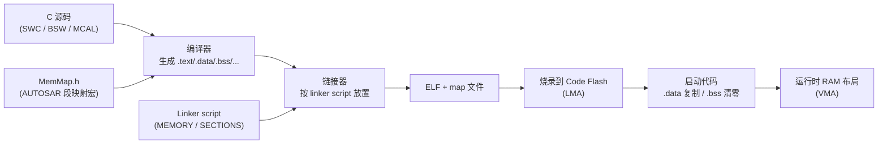
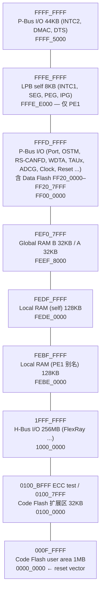
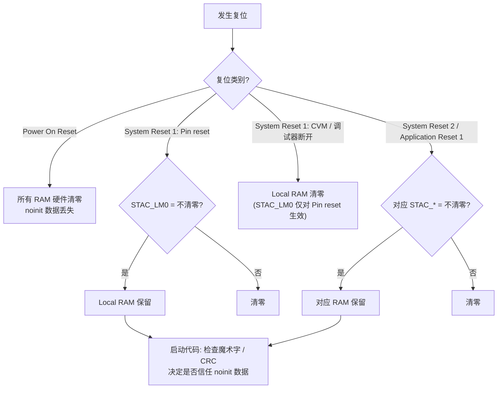
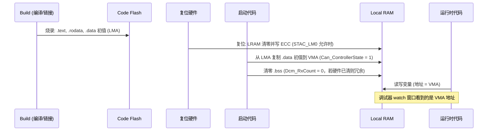

# RH850/P1M-E 存储器映射与程序段布局

> Prerequisite: [01-rh850-overview.md](01-rh850-overview.md), [02-cpu-architecture.md](02-cpu-architecture.md)
> Next: [04-startup-process.md](04-startup-process.md)
> 对应规范: HW-E §4 p.257–260（地址空间、各 bus master 视角、guard）、§8.4.6 p.434 与 Table 8.4 p.420（RAM 初始化控制）、§35 p.2857–（Flash）、§36 p.2889–2890（RAM/ECC）、§3.4.5 p.256（预取）；DS-E p.2；SWS-MCU R24-11 p.26（`Mcu_InitRamSection`）、p.47–49（`McuRamSectorSettingConf`）
> 对应源码: openAUTOSAR `system/kernel/src/init.c:249-334`（链接文件自检）；本项目无 RH850 链接脚本（见第 05 章）
> 事实底稿: [04-rh850-hardware-notes.md](../reference/research/04-rh850-hardware-notes.md) §1.3、§3.4

---

## 1. 本章目标

1. 能画出 R7F701381 的完整地址映射，并给出每个区域的起止地址、容量和页码。
2. 理解 **Local RAM 的 self 地址与 PE1 别名**、**哪些 master 能访问哪些区域**，以及这对 DMA / CAN 缓冲区放置的影响。
3. 能把 C 程序的 `.text / .rodata / .data / .bss / stack / heap` 以及 RH850 工具链常见的 small-data 段，正确映射到 P1M-E 的物理区域，并说清楚 LMA 与 VMA。
4. 理解为什么 AUTOSAR ECU 通常**不用 heap**。
5. 理解 RAM 的 ECC 与硬件清零机制，以及“复位后保留数据（noinit）”在 P1M-E 上如何实现。

---

## 2. 为什么需要关心存储映射？

C 程序员习惯把内存看成“一大块”。嵌入式系统不是这样：

- **代码和常量在 Flash 里**，掉电不丢，但不能像 RAM 一样随便写。
- **变量在 RAM 里**，上电后内容无意义（P1M-E 上会被硬件清零），初值要从 Flash 搬过来。
- **外设寄存器也是地址**，写错一个地址，可能改掉时钟、复位芯片，或者触发访问保护异常。
- **不同 RAM 速度不同、可访问的 master 不同**：CPU 访问 Local RAM 最快，但 DMA 看不到 Local RAM 的 self 地址。

在 AUTOSAR 项目里，这些知识体现为：链接脚本、MemMap 配置、MCAL 中 RAM 段初始化（`Mcu_InitRamSection`）、CAN/DMA 缓冲区的放置、以及调试器里看 map 文件。

---

## 3. 在系统中的位置



本章讲“物理上有什么地址”和“每类数据应该放在哪里”；第 05 章讲“链接脚本怎么写”；第 04 章讲“启动代码怎么把 Flash 里的初值搬到 RAM”。

---

## 4. AUTOSAR 如何定义？

[AUTOSAR Standard] AUTOSAR 不规定芯片地址，但有三处与存储布局直接相关：

1. **SWS-MCU 的 RAM 段初始化**：`Mcu_InitRamSection(RamSection)` 按配置 `McuRamSectionBaseAddress`、`McuRamSectionSize`、`McuRamDefaultValue`、`McuRamSectionWriteSize` 填充 RAM（`SWS_Mcu_00011`，SWS-MCU R24-11 p.26；配置容器 `McuRamSectorSettingConf` ECUC_Mcu_00120，p.47–49）。`WriteSize` 参数（4.3.1 引入）正是为 ECC RAM 按 32/64 位对齐写入而设计。
2. **Start-up code 的最小 RAM 初始化**：“The start-up code shall initialize a minimum amount of RAM in order to allow proper execution of the MCU driver services and the caller of these services.”（SWS-MCU p.14）
3. **Memory Mapping（MemMap.h）**：每个模块用 `<MSN>_START_SEC_<...>` / `<MSN>_STOP_SEC_<...>` 宏把变量和代码分到不同 section，再由集成者在 MemMap 头文件中映射到编译器 pragma。**本仓库没有 AUTOSAR Specification of Memory Mapping**，宏名形态按公认 R4.x 约定描述，具体需以真实项目所用 release 确认。

---

## 5. 核心数据结构：P1M-E 地址映射

### 5.1 完整地址表（R7F701381，1 MB 型号）

[RH850 Hardware] HW-E Table 4.1（p.257），按 1 MB 型号的注释取值：

| 起始地址 | 结束地址 | 区域 | 大小 | 备注 |
|---|---|---|---|---|
| `0000_0000` | `000F_FFFF` | **Code Flash（user area）** | 1 MB | 2 MB 型号到 `001F_FFFF`（Note 1）；复位向量在 `0000_0000`（user mat 启动时，p.258） |
| `0010_0000` | `00FF_FFFF` | Reserved | — | |
| `0100_0000` | `0100_7FFF` | **Code Flash（extended user area）** | 32 KB | 与 user area 不连续 |
| `0100_8000` | `0100_9FFF` | Reserved | — | |
| `0100_A000` | `0100_BFFF` | ECC test area | 8 KB | ECC 测试用（p.2887） |
| `0100_C000` | `0FFF_FFFF` | Reserved | — | |
| `1000_0000` | `1FFF_FFFF` | On-chip I/O（**H-Bus 区**） | 256 MB | 例如 FlexRay `FLXA0_base = 1002_0000H`（p.1124） |
| `2000_0000` | `FEBD_FFFF` | Reserved | — | |
| `FEBE_0000` | `FEBF_FFFF` | **Local RAM（PE1 area）** | 128 KB | 与 self 是**同一块** RAM 的别名 |
| `FEC0_0000` | `FEDD_FFFF` | Reserved | — | |
| `FEDE_0000` | `FEDF_FFFF` | **Local RAM（self）** | 128 KB | CPU 自身访问用 |
| `FEE0_0000` | `FEEF_7FFF` | Reserved | — | |
| `FEEF_8000` | `FEEF_FFFF` | **Global RAM Bank A** | 32 KB | |
| `FEF0_0000` | `FEF0_7FFF` | **Global RAM Bank B** | 32 KB | 与 Bank A 地址连续 |
| `FEF0_8000` | `FEFF_FFFF` | Reserved | — | |
| `FF00_0000` | `FFFD_FFFF` | On-chip I/O（**P-Bus 区**） | 16 MB − 128 KB | 大部分外设在这里 |
| `FF20_0000` | `FF20_7FFF` | （P-Bus 区内）**Data Flash** | 32 KB | 2 MB 型号到 `FF20_FFFF`（Note 3） |
| `FFFE_0000` | `FFFE_DFFF` | Reserved | — | |
| `FFFE_E000` | `FFFE_FFFF` | On-chip I/O（**LPB self 区**） | 8 KB | SEG、PEG、IPG、**INTC1** 等 CPU 私有功能，**只有 PE1 能访问**（Note 2） |
| `FFFF_0000` | `FFFF_4FFF` | Reserved | — | |
| `FFFF_5000` | `FFFF_FFFF` | On-chip I/O（P-Bus 区） | 44 KB | 含 **INTC2** 的 EIC32–383（`FFFF_B040` 起，p.265）、DMAC `FFFF_8000`、DTS `FFFF_9000`（p.299） |

HW-E 在 Table 4.1 上方有一条 CAUTION：访问 on-chip I/O 区时，**只能访问手册列出的地址**，访问 reserved 或未定义地址“operation is not guaranteed”（p.257）。

### 5.2 用图来记



### 5.3 不同 bus master 看到的地址空间

[RH850 Hardware] HW-E Figure 4.1（p.259）给出了三类 master 的视角。整理如下：

| 区域 | PE1（CPU） | DMA（DMAC/DTS） | H-Bus master |
|---|---|---|---|
| Code Flash user area | **取指 + 数据** | 数据 | 数据 |
| Code Flash extended user area | 取指 + 数据 | **禁止** | **禁止** |
| ECC test area | 数据 | 数据 | 数据 |
| H-Bus I/O `1000_0000–1FFF_FFFF` | 数据 | 数据 | **禁止** |
| Local RAM（PE1 别名）`FEBE_xxxx` | 数据 | 数据 | 数据 |
| **Local RAM（self）`FEDE_xxxx`** | **取指 + 数据** | **禁止** | **禁止** |
| Global RAM A/B | **取指 + 数据** | 数据 | 数据 |
| P-Bus I/O `FF00_0000–FFFD_FFFF` | 数据 | 数据 | 数据（依图） |
| LPB self `FFFE_E000–FFFE_FFFF` | 数据 | **禁止** | **禁止** |
| P-Bus I/O `FFFF_5000–FFFF_FFFF` | 数据 | 数据 | 依图 |

> 注：H-Bus master 对 P-Bus 区的访问在 Figure 4.1 中按区段区分，文本抽取不足以逐格确认，使用前请对照 PDF 原图。

从中提炼出三条工程规则：

1. **可取指（能执行代码）的区域只有 Code Flash、Local RAM（self）和 Global RAM**（HW-E p.258 §4.2.1）。从 RAM 执行代码（如 Flash 擦写例程）只能放在这些地方。
2. **DMA 和 H-Bus master 看不到 Local RAM 的 self 地址**（`FEDE_xxxx`），只能用 PE1 别名 `FEBE_xxxx`（HW-E p.259）。如果你把 DMA 目标地址配置成链接器给出的 `FEDE_xxxx` 变量地址，DMA 会访问违规。
3. **self 和 PE1 别名是同一块 128 KB RAM**，不能在链接脚本里把两者当作两块 RAM 分别分配——那样会把同一物理字节分给两个变量。

### 5.4 Guard：谁保护哪块区域

[RH850 Hardware] HW-E Table 4.2（p.260）：

| 区域 | 访问者 | 保护机制 |
|---|---|---|
| P-Bus 区 | 所有 master | P-Bus Guard（PBG） |
| LPB 区 | 本 PE | Internal Peripheral Guard（IPG） |
| LPB 区 | 其他 master | PE Guard（PEG） |
| Local RAM | 除本 PE 外的所有 master | PEG |
| H-Bus 区 | 所有 master | H-Bus Guard（HBG） |
| Global RAM | 所有 master | GRAM Guard（GRG） |

此外，每个 PE 还有 16 区 MPU（HW-E p.189、p.260）。复位后：外设对 PE1 以外的 master 是保护状态；Global RAM 不保护；PEG 只允许 PE 自身访问 Local RAM（HW-E p.188）。

---

## 6. 程序段如何映射到 P1M-E

### 6.1 通用段

| 段 | 内容 | 运行时位置（VMA） | 镜像中位置（LMA） | P1M-E 推荐区域 |
|---|---|---|---|---|
| 复位/向量段 | 复位入口、直接向量（RBASE/EBASE + 偏移） | Code Flash | 同左 | `0000_0000` 起，512 字节对齐（RBASE/EBASE 低 9 位为 0，HW-E p.205） |
| 中断地址表 | 表引用方式的 handler 地址表 | Code Flash 或 RAM | Code Flash | 512 字节对齐（INTBP 低 9 位为 0，HW-E p.206） |
| `.text` | 机器码 | Code Flash | 同左 | user area |
| `.rodata` | `const` 数据、字符串、配置表（MCAL `*_PBcfg.c` 等） | Code Flash | 同左 | user area |
| `.data` | 有初值的全局/静态变量 | **RAM** | **Code Flash** | Local RAM（self） |
| `.bss` | 无初值（或初值为 0）的全局/静态变量 | RAM | 不占 Flash | Local RAM（self） |
| stack | 函数调用栈、局部变量 | RAM | 不占 Flash | Local RAM（self） |
| heap | `malloc` 区 | RAM | 不占 Flash | **通常不分配**（§6.4） |

LMA（Load Memory Address）与 VMA（Virtual/Run Memory Address）：`.data` 的初值**存放**在 Flash（LMA），程序**运行**时变量位于 RAM（VMA）。启动代码负责把 LMA 处的字节复制到 VMA 处。`.bss` 只有 VMA，没有 LMA，启动代码负责清零（或依赖硬件清零，见 §7）。

### 6.2 RH850 工具链常见的 small-data 段

[Conceptual] RH850 编译器普遍利用 GP（r4）、EP（r30）、r0 作为基址，对“靠近基址”的变量生成更短更快的指令。常见的约定（**具体段名、范围和开关以编译器手册为准**）：

| 概念段 | 基址寄存器 | 用途 |
|---|---|---|
| SDA（small data area：`.sdata` / `.sbss`） | GP（r4） | 小的全局变量，用 GP 相对寻址 |
| TDA（tiny data area） | EP（r30） | 极小的高频变量，用 `SLD/SST` 短指令（HW-E p.191 说明 r30 被 SLD/SST 用作基址） |
| ZDA（zero data area） | r0 | 地址 0 附近（或负地址，即 `FFFF_xxxx` 高端）的数据 |

截图编译选项 `-large_sda -sda=0` 与 SDA 有关；启动代码必须把 GP/EP 设置成链接器给出的符号值，否则所有 SDA/TDA 访问都会读错地址。**这些选项的精确含义需在真实项目的 GHS 手册中确认**，不能凭名字推断。

### 6.3 Local RAM 还是 Global RAM？

[RH850 Hardware] HW-E Table 12.2/12.3（p.469）给出了访问时钟：Local RAM 属于 CPU 时钟域（PE1 的一部分）；Global RAM 标注为 “(Global RAM) 80 (1 wait)”，即相对 CPU 有等待周期。

| 放在 Local RAM（self）`FEDE_xxxx` | 放在 Global RAM `FEEF_8000–FEF0_7FFF` |
|---|---|
| 普通变量、OS 数据、任务栈、ISR 栈 | **DMA 源/目标缓冲区**（DMA 可以访问） |
| 需要最快访问的数据 | 需要被其他 bus master 访问的数据 |
| 从 RAM 执行的代码（可取指） | 也可取指，但较慢 |

> [Real Project Consideration] RS-CANFD 自带 3 KB 的 CAN RAM（HW-E p.2889 Table 36.1），报文缓冲在外设内部，CPU 通过寄存器窗口读写，因此**CAN 驱动本身一般不需要在 Global RAM 中开缓冲区**。只有使用 DMA 搬运 CAN/ADC 数据时，才需要关心 DMA 可见性。是否使用 DMA，需要在真实项目的 MCAL 配置中确认。

### 6.4 为什么 AUTOSAR ECU 通常不用 heap

[Real Project Consideration] Classic AUTOSAR 工程中，heap 区一般被设为 0，`malloc/free` 被禁止。理由：

| 问题 | 解释 |
|---|---|
| **确定性** | `malloc` 的执行时间取决于空闲链表状态，无法给出可证明的最坏执行时间（WCET），与 OS 的时序分析冲突 |
| **碎片化** | ECU 连续运行数千小时，反复分配/释放会产生碎片，导致“运行很久之后才失败”的不可复现故障 |
| **失败处理** | `malloc` 返回 NULL 时，嵌入式系统往往没有合理的恢复路径 |
| **静态配置理念** | AUTOSAR 的所有资源（PDU 缓冲、任务栈、队列深度）都在配置期确定、由生成器静态分配；运行时“需要多少内存”在编译期就已知 |
| **编码规范** | MISRA C:2012 有禁止使用 `<stdlib.h>` 动态内存函数的规则（本仓库无 MISRA 文档，规则编号需在真实项目所用规范中确认） |
| **功能安全** | ISO 26262 要求证明不同 ASIL 软件间的 freedom from interference；静态分配 + MPU 区域更易证明 |

因此，在 P1M-E 的链接布局中，“heap”通常不存在；如果某个第三方库需要 heap，常见做法是给一个很小的、静态的、被监控的区域，并在评审中单独论证。

### 6.5 一个可行的 P1M-E 布局示意

[Conceptual] 下面的布局**只是教学示意**，参考了截图中出现过的例子（`PLRAM 118K@0xFEDE0000`、`stack 10K@0xFEDFD800`，并把错误的 `iROM 2048K` 修正为 1 MB）。真实项目的布局由 bootloader、OS、MCAL 和 safety 需求共同决定，需要在真实项目的链接脚本中确认。

```text
Code Flash user area (1 MB)
  0000_0000  .reset / 向量区 (512B 对齐)
  0000_0200  中断地址表 (INTBP, 512B 对齐; 384 × 4 = 1536 B)
  ...        .text
  ...        .rodata (含 MCAL/BSW 配置常量)
  ...        .data 的初值镜像 (LMA)
  ...        (bootloader 存在时, 应用起始地址会偏移 —— 需项目确认)
  000F_FFFF

Local RAM self (128 KB)
  FEDE_0000  .data (VMA) / .sdata / .tdata
  ...        .bss / .sbss
  ...        OS 内部数据, 任务栈 (若由 OS 静态分配)
  FEDF_D800  系统栈 / 启动栈 (示例 10 KB)
  FEDF_FFFF  栈顶 = FEE0_0000 (不含), 向下增长

Global RAM (64 KB)
  FEEF_8000  DMA 缓冲区、需要被其他 master 访问的数据
  FEF0_7FFF

Data Flash (32 KB) —— 不进链接脚本, 由 Fls/Fee 驱动按块管理
  FF20_0000–FF20_7FFF
```

栈的地址算术：`0xFEDF_D800 + 10 KB (0x2800) = 0xFEE0_0000`，正好到 Local RAM self 区的末尾之后一个字节（`0xFEDF_FFFF` 是最后一个有效字节）（[01-project-and-docs-review.md](../reference/research/01-project-and-docs-review.md) §1.5 已核对算术）。

---

## 7. 初始化流程：RAM 的硬件清零与 ECC

### 7.1 为什么 RAM 一定要初始化

[RH850 Hardware] 除 I-Cache RAM（只有 EDC）和 Emulation RAM 外，**所有 RAM 都带 ECC**（HW-E p.2889–2890）。ECC 位与数据一起写入；如果一块 RAM 从未被写过，其中的“数据 + ECC”组合是随机的，**第一次读就可能报 ECC 错误**。

这包括一种容易忽略的读：**CPU 的取指预取**。HW-E §3.4.5（p.256）警告：CPU 会从当前 PC 之后的位置推测性取指，最多到“代码末尾之后 48 字节”。如果你从 Local RAM 执行代码，必须把代码末尾之后 48 字节也初始化，否则预取可能读到未初始化区域而触发 ECC 错误；同样，这个预取区域也不能与 IPG 禁止访问区重叠。

### 7.2 P1M-E 的硬件清零

[RH850 Hardware] HW-E §36.2.1.4（p.2890）：“To avoid time-consuming initialization by software, a hardware mechanism is implemented to initialize the following RAMs. This initialization includes correct setting of the related ECC bits.” 被硬件初始化的 RAM 包括：**LRAM、GRAM、DTS RAM、CSIH RAM**。“RAM initialization to 0 is executed by all reset”，但可以通过 RAM Initialization Mode Control 寄存器关闭。

关闭条件（HW-E §8.4.6 p.434；寄存器表 p.420）：

| 寄存器 | 地址 | 控制对象 | 可在哪些复位中关闭硬件清零 |
|---|---|---|---|
| STAC_LM0 | `FFF8_1520H` | Local RAM | System Reset 1（**仅 Pin reset**）、System Reset 2、Application Reset 1 |
| STAC_GRAM | `FFF8_1420H` | Global RAM | 仅 Application Reset 1 |
| STAC_DTSRAM | `FFF8_1320H` | DTS RAM | 仅 Application Reset 1 |
| STAC_LM10 | `FFF8_1E20H` | CSIH RAM | 仅 Application Reset 1 |

RZEROMD 字段：`11` = 执行清零（复位值 `0000_0003H`），`x0` = 不执行，`01` = 禁止设置（HW-E p.420、p.427–430）。注意 **STAC 配置的是“下一次复位时”的行为**，不是“立即清零”的命令。

Power On Reset 总是清零所有这些 RAM。

此外，RS-CANFD 的 CAN RAM 由 CAN 模块自己在复位后初始化（约 3794 个 pclk 周期），软件要等 `GSTS.GRAMINIT = 0` 才能配置 CAN（HW-E p.1090、p.821）——这是 Can 驱动的职责，见 Part IV。

### 7.3 这意味着什么

| 结论 | 理由 |
|---|---|
| 启动代码**不需要**为了 ECC 逐字写一遍 LRAM/GRAM | 硬件已清零并写好 ECC（HW-E p.2890） |
| 启动代码**仍然需要** `.data` 复制 | 硬件只会清零，不会写入初值 |
| `.bss` 清零在 Power On Reset 后是“冗余但无害”的 | 硬件已清零；但若某次复位关闭了清零，软件清零就是必须的 |
| 想保留跨复位数据（如复位原因日志），必须**同时**：放在专门的 noinit 段、对相应复位关闭硬件清零、启动代码不清这个段、并用校验/魔术字判断有效性 | 见 §7.4 |

### 7.4 “保留 RAM（noinit）”在 P1M-E 上的含义

P1M-E 的地址表中**没有单独的 “retention RAM / standby RAM” 区域**（HW-E Table 4.1 p.257）。跨复位保留数据有两条路：

1. **Backup Register BRAMDAT0–3**（`FFC0_A000H + n×4`，32 位访问）：手册明确 “This register is not initialized by any reset”，设计用途是在 BIST 自检期间保留数据；复位值 Undefined（HW-E p.2891 §36.3；Table 8.2 p.419）。只有 4 × 32 bit，适合存“复位原因码 + 魔术字”这类极少量信息。因为上电后值未定义，必须配合魔术字/校验使用。
2. **对某些复位类型关闭 RAM 硬件清零 + 软件不清 noinit 段**：容量大，但受复位类型限制，流程如下：



> 图中 CVM 复位不受 STAC_LM0 控制，依据是 HW-E p.434 “For System Reset 1 (Pin reset only) … Initialization of Local RAM can be disabled”，以及 Table 8.2 Note 2 “In case of Pin Reset, the execution of RAM initialization is configurable by a register setting”（p.419）。

> [Real Project Consideration] 截图中出现了 `.bss.PORST.*`、`.bss.TRAPRST.*` 这类段名。从名字只能猜测它们与“上电复位才清”“trap 复位也保留”有关，**不能从名字确定实际语义**。进入真实项目后，要去链接脚本和启动代码的清零表中确认每个段在哪种复位下被清零。

---

## 8. Runtime Flow：一个变量的一生

[Conceptual] 以 `static uint8 Can_ControllerState = 1u;`（`.data`）和 `static uint32 Dcm_RxCount;`（`.bss`）为例：



transition 解释：

- **Build → Flash**：链接器把 `.data` 放在 RAM 的 VMA，但把它的初值内容放在 Flash 的 LMA；ELF/S-record 中只有 LMA 的部分会被烧录。
- **复位 → RAM**：P1M-E 硬件清零（HW-E p.2890），这一步对软件透明。
- **启动代码 → RAM**：`.data` 复制、`.bss` 清零，详见 [04-startup-process.md](04-startup-process.md)。
- **运行时**：代码中所有对变量的访问都使用 VMA。

---

## 9. RH850 Hardware Mapping 小结

| 软件概念 | P1M-E 硬件 | 出处 |
|---|---|---|
| 复位向量 | `0000_0000`（user mat）；可用 variable reset vector 改变 | HW-E p.258、p.2860、p.2865 |
| 代码/常量 | Code Flash user area 1 MB；CPU 访问 1 wait（Table 12.2 标注） | HW-E p.257、p.469 |
| 变量、栈 | Local RAM self 128 KB | HW-E p.257 |
| DMA 可见 RAM | Global RAM 64 KB；Local RAM 只能经 PE1 别名 | HW-E p.259 |
| 非易失数据 | Data Flash 32 KB（由 Fls/Fee 管理，不进链接脚本） | HW-E p.257、§35 |
| CPU 私有外设 | LPB self 区（INTC1、SEG、PEG、IPG） | HW-E p.257 Note 2 |
| 一般外设 | P-Bus 区；H-Bus 区（FlexRay 等） | HW-E p.257 |
| RAM 初始化 | 硬件清零 + ECC；STAC_* 控制 | HW-E p.420、p.434、p.2890 |
| 跨任何复位保留的少量数据 | BRAMDAT0–3（4 × 32 bit，不被任何复位初始化） | HW-E p.2891 |
| RAM 段初始化 API | `Mcu_InitRamSection`（若项目配置） | SWS-MCU R24-11 p.26 |

---

## 10. openAUTOSAR 实现

openAUTOSAR 的 `main()` 在调用 `EcuM_Init()` 之前做了一件很有教学价值的事：**链接文件自检**。

[阅读] `system/kernel/src/init.c`：

- `:249–254`：定义 `test_data = TEST_DATA (0x12345)`、`test_data_array[3]`（应进入 `.data`/`.sdata`），以及若干未初始化变量（应进入 `.bss`/`.sbss`）。
- `:274`：`#define BAD_LINK_FILE() while(1) {}`。
- `:290–334`：`main()` 逐个检查：`.data` 中的变量是否等于初值、`.bss` 中的变量是否为 0；任何一项不对就死循环在 `BAD_LINK_FILE()`。
- `:343`：自检通过后才调用 `EcuM_Init()`。

这段代码回答了一个问题：**“`.data` 复制和 `.bss` 清零是否真的做对了？”** 如果链接脚本的 LMA/VMA 写错、或者启动代码漏了复制，程序会停在这里，而不是在几十个模块之后以莫名其妙的方式失败。

> 与 R4.x 的差异：这是 Arctic Core 的工程习惯，不是 AUTOSAR 规范要求。真实项目中一般不会在 `main()` 里放这种检查，而是依赖启动代码的正确性和测试。

---

## 11. 当前教学项目实现

[Educational Implementation] 本项目没有 RH850 链接脚本，也没有在目标板上运行过。`examples/rh850_mcal_reference/platform/Rh850_Mmio.h` 中的 MMIO 抽象说明了一个与存储映射相关的原则：**外设地址不是普通内存**，访问必须是 `volatile`、宽度必须正确。主机测试用一个模型替换真实地址，因此不会访问 `FFxx_xxxx`。

---

## 12. Debug 方法

### 12.1 用 map 文件核对布局

拿到 map 文件后按以下顺序检查（详见第 05 章）：

1. **每个 output section 的 VMA 是否落在 §5.1 的合法区域内**（例如 `.data` 应在 `FEDE_0000–FEDF_FFFF`）。
2. **`.data` 的 LMA 是否在 Code Flash 内，且不与 `.text/.rodata` 重叠**。
3. **Code Flash 总用量 ≤ 1 MB**（R7F701381），不是 2 MB。
4. **栈区是否与 `.bss` 末尾重叠**。
5. **没有任何段同时分配在 `FEDE_xxxx` 与 `FEBE_xxxx`**（同一物理 RAM 的两个别名）。
6. **DMA 缓冲区是否在 Global RAM 或使用 PE1 别名地址**。

### 12.2 典型故障与定位

| 症状 | 可能原因 | 定位方法 |
|---|---|---|
| 上电后立即 SYSERR / ECC 错误 | 读了未初始化 RAM（例如关闭了硬件清零，或从 RAM 执行代码时预取越界） | 读 MEA/MEI（HW-E p.202–204）和 ECM 状态；检查 STAC_* 与 RAM 执行区末尾 48 字节 |
| 有初值的全局变量运行时是 0 | `.data` 未复制（LMA/VMA 配置错或启动代码漏步） | 对比 map 中 `.data` 的 LMA 内容与 RAM 中 VMA 内容 |
| DMA 传输报访问错误 | DMA 地址用了 `FEDE_xxxx` | 改用 Global RAM 或 `FEBE_xxxx` 别名（HW-E p.259） |
| 某个变量“被莫名改写” | 栈溢出进入 `.bss`；或 self/别名双重分配 | 检查栈底与 `.bss` 末尾间距；栈涂色（stack painting）后观察水位 |
| 访问某外设地址时异常 | 地址属于 reserved 区或被 guard 保护 | 对照 Table 4.1（p.257）与 guard 表（p.260） |

### 12.3 栈水位检测

[Conceptual] 常用的栈监控方法：启动时把栈区填充为固定模式（如 `0xAA`），运行一段时间后从栈底往上找第一个被改写的位置，得到最大使用深度。AUTOSAR OS 通常也提供栈监控（stack monitoring）功能，具体机制需查 OS 手册。

---

## 13. 常见问题

| 问题 | 回答 |
|---|---|
| Global RAM Bank A 和 B 能当作一块 64 KB 用吗？ | 地址上连续（`FEEF_8000–FEF0_7FFF`）。是否需要按 bank 区分（例如 GRG 保护按 bank 配置）需按项目 safety 配置确认 |
| 扩展用户区 `0100_0000` 能和 user area 合并成 1 MB + 32 KB 吗？ | 不能自动合并：地址不连续，而且 DMA/H-Bus 访问被禁止（p.259）。如使用需单独定义 region |
| Data Flash 能放常量吗？ | 它在 P-Bus 区，不可取指（p.258），访问需经 Flash 控制逻辑；一般只用于 Fee/EEPROM 仿真 |
| Local RAM 有多少可用？ | 128 KB（DS-E p.2）；`FEBE_xxxx` 不是额外的 128 KB |
| 硬件已清零 RAM，`.bss` 清零可以删掉吗？ | 取决于 STAC 配置和是否有 noinit 段；为了在所有复位路径下正确，通常保留 |

---

## 14. 实验

**实验 1：画地址图。** 不看本章，从 `artifacts/pdf-text/r01uh0585ej0120.txt` 中找到 Table 4.1（grep `Address Space Type`），自己画一张 R7F701381 的地址图，标出每块区域谁能取指、DMA 能否访问。

**实验 2：布局预算。** 假设一个项目：`.text` 600 KB、`.rodata` 120 KB、`.data` 8 KB、`.bss` 60 KB、OS 任务栈合计 24 KB、ISR 栈 4 KB。计算 Code Flash 和 Local RAM 的占用率，并判断还能留给 bootloader 多少 Flash。

**实验 3：主机上观察 LMA/VMA。** 主机 GCC（PE/COFF）不区分 LMA/VMA，但你可以用 `gcc -Wl,-Map=out.map` 编译 `examples/rh850_mcal_reference/tests/test_reference.c`，打开 map 文件观察 `.text`、`.data`、`.bss` 的地址与大小，熟悉 map 文件格式。然后思考：在 RH850 上 `.data` 为什么需要两个地址？

**实验 4：noinit 设计。** 设计一个“复位原因日志”结构（包含魔术字、RESF 值、FEPC/FEIC、CRC），说明它应放在哪个段、需要怎样的 STAC 设置、启动代码怎样判断其有效性。再比较：如果只需要保存 16 字节，用 BRAMDAT0–3（HW-E p.2891）有什么优缺点？

---

## 15. 思考题

1. 为什么 HW-E 要提供 Local RAM 的两个地址（self 与 PE1 别名）？如果只有一个地址，会有什么问题？
2. 从 Local RAM 执行 Flash 擦写例程时，你需要考虑哪三件事？（提示：取指区域、预取 48 字节、store→dummy read→SYNCP→SYNCI。）
3. 如果 bootloader 占用 Code Flash 前 64 KB，应用的复位向量和中断向量表应该放在哪里？RBASE 是只读的，那应用如何让自己的向量表生效？（提示：EBASE 与 PSW.EBV。）
4. 为什么“静态分配所有资源”与 AUTOSAR 的“配置驱动 + 代码生成”是一致的设计哲学？

---

## 16. 对未来真实项目的意义

```text
进入真实 RH850 项目后：
1. 找到链接脚本（GHS 通常是 .ld 文件，截图例子为 rh850ghs.ld），列出 MEMORY 区域，
   与本章 §5.1 的地址表逐行比对容量和起点
2. 找到 bootloader 与应用的 Flash 分区约定（起始地址、向量表位置）
3. 找到 MemMap 头文件，看 AUTOSAR 段宏被映射到了哪些 section
4. 打开 map 文件，确认 .data LMA/VMA、.bss、栈、OS 栈、noinit 段的位置
5. 找到启动代码中的 .data 复制表和 .bss 清零表，看哪些段在何种复位下被清零
6. 查 STAC_* 的实际配置（启动代码或 Mcu 配置），确认 noinit 数据是否真的能跨复位保留
7. 确认 DMA（若使用）缓冲区位于 Global RAM 或使用 PE1 别名
```

这些都**需要在真实项目环境中确认**。找到之后，把每个段映射回本章 §6 的表格，你就能回答“这个变量出问题时，应该去 Flash 还是 RAM 的哪一段找原因”。

---

## 17. 本章总结

- R7F701381：Code Flash `0000_0000–000F_FFFF`（1 MB），Local RAM self `FEDE_0000–FEDF_FFFF`（128 KB，PE1 别名 `FEBE_xxxx`），Global RAM `FEEF_8000–FEF0_7FFF`（64 KB），Data Flash `FF20_0000–FF20_7FFF`（32 KB），外设在 P-Bus/H-Bus/LPB 区。
- 只有 Code Flash、Local RAM self、Global RAM 可以取指；DMA 看不到 Local RAM self 地址。
- `.data` 有 LMA（Flash）和 VMA（RAM）两个地址；`.bss` 只有 VMA；heap 在 AUTOSAR ECU 中通常不使用。
- 所有 RAM（除 I-Cache、ERAM）带 ECC；LRAM/GRAM/DTS/CSIH RAM 由硬件在复位时清零并写 ECC，可用 STAC_* 在特定复位中关闭。

## 18. 下一章

[04-startup-process.md](04-startup-process.md)：从 Reset 到 SWC runnable 的完整启动路径。
