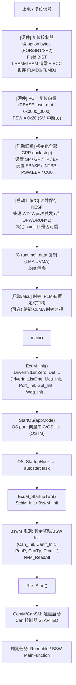
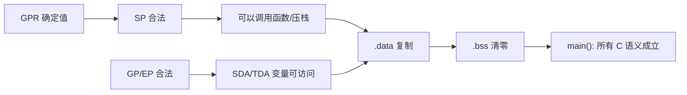
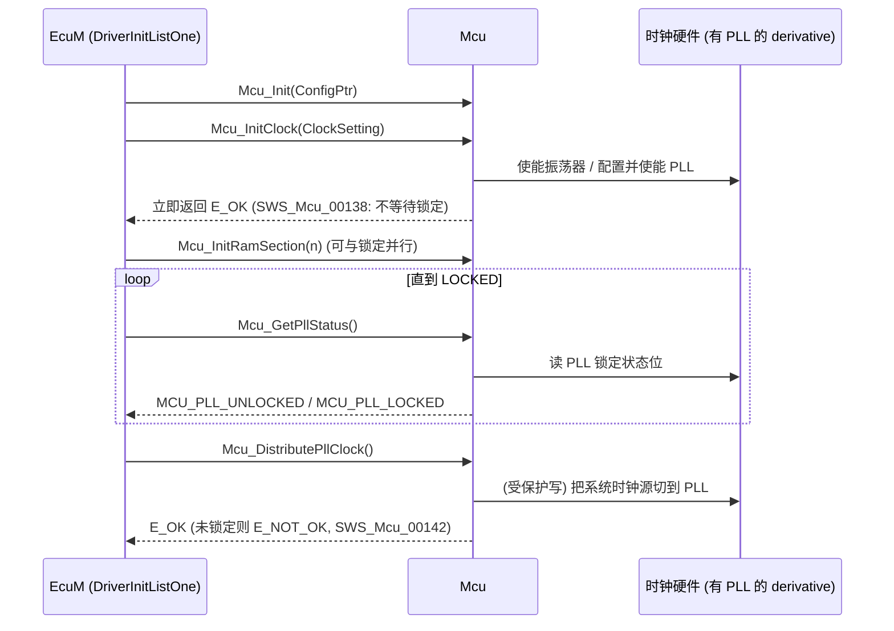
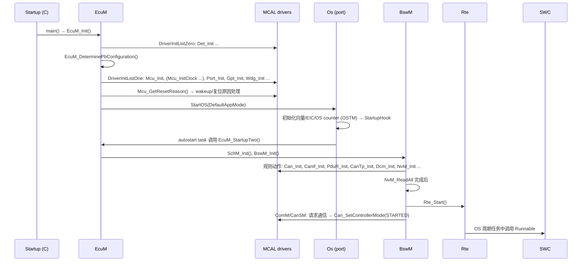
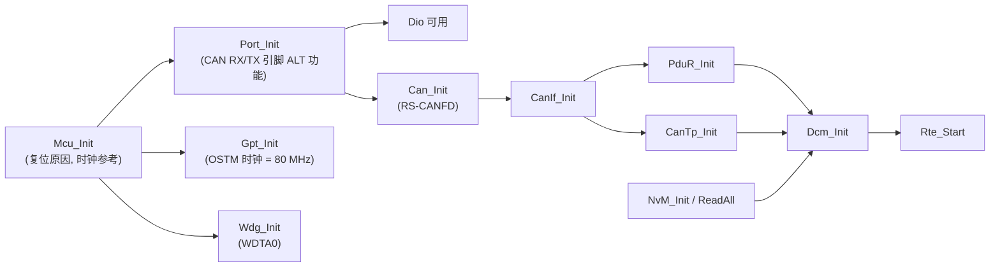

# 启动过程：从 Reset 到 SWC Runnable

> Prerequisite: [02-cpu-architecture.md](02-cpu-architecture.md), [03-memory-map.md](03-memory-map.md)
> Next: [05-linker-script.md](05-linker-script.md)；之后在 AUTOSAR 层面继续看 [../02-autosar-classic/03-ecu-startup.md](../02-autosar-classic/03-ecu-startup.md)
> 对应规范: HW-E §8 Reset Controller p.418–434、§4.2.1 p.258（复位向量）、§3.2.3.4 p.250（lock-step 注意事项）、§5 p.261–263（工作模式）、§35.10 p.2884–2886（option bytes）、§36.2.1.4 p.2890（RAM 初始化）、§32 p.2790、p.2817（ECM）；SWS-MCU **R24-11** p.13–14（start-up code）、p.25（寄存器初始化归属）、p.26–31（Mcu API）、p.36（示例序列）；SWS-CAN **R22-11** p.22（`SWS_Can_00240`）。**本仓库没有 EcuM / BswM / Os / Rte 的 SWS**
> 对应源码: openAUTOSAR `system/kernel/src/init.c:290-343`、`system/EcuM/src/EcuM.c:115-249`、`system/EcuM/src/EcuM_Callout_Stubs.c:184-376`、`system/SchM/src/SchM.c:351-371`；本项目无启动代码（全部 `[Conceptual]`）
> 事实底稿: [04-rh850-hardware-notes.md](../reference/research/04-rh850-hardware-notes.md) §3；[03-openautosar-trace.md](../reference/research/03-openautosar-trace.md) §6

---

## 1. 本章目标

这是 Part I 最核心的一章。读完后你应该能：

1. 画出 R7F701381 从上电到第一个 SWC runnable 执行的**完整路径**，并说出每一步由谁（硬件 / 启动汇编 / C runtime / EcuM / OS / BswM / RTE）负责。
2. 说清楚**硬件在复位时已经替你做了什么**（option bytes 读取、Field BIST、RAM 清零 + ECC），以及**软件必须做什么**。
3. 理解 P1M-E 上“时钟初始化”为什么几乎是空的，以及通用的 `Mcu_InitClock → Mcu_GetPllStatus → Mcu_DistributePllClock` 序列在这里如何退化——包括一个会让 ECU **永远卡死**的陷阱。
4. 能用 RESF 判断“上一次为什么复位”，并知道它怎样对应 `Mcu_GetResetReason()`。
5. 知道驱动初始化顺序（Mcu → Port → … → Can → CanIf …）背后的依赖关系。

---

## 2. 为什么启动过程如此重要？

真实项目里最难调的问题，有相当一部分发生在 `main()` 之前或 `StartOS()` 之前：

- 上电后调试器连不上，或者一连上就复位 → 看门狗（option byte 设成上电自动运行）
- 程序停在一个 ECC 错误或 SYSERR → RAM 初始化 / 访问保护
- 全局变量初值不对 → `.data` 复制
- `EcuM_Init` 里卡死 → 等一个永远不会 LOCKED 的 PLL
- CAN 收不到任何报文 → `Port_Init` 晚于 `Can_Init`，或 Can 在 OS 启动前就开了中断

这些问题的共同点是：**此时 OS、DET、DEM 都还没起来，没有日志，只能靠你对启动顺序的理解去推断。**

---

## 3. 系统位置：完整启动路径总览



> 图中 `I`–`O` 的 AUTOSAR 部分按 R4.x 公认的 EcuM “flexible” 形态描述。**本仓库没有 EcuM/BswM/Os/Rte 的 SWS**，具体哪个驱动在哪个 init list、谁调用 `Rte_Start`，需以真实项目所用 release 的 SWS 和配置确认。Part II 的 [03-ecu-startup.md](../02-autosar-classic/03-ecu-startup.md) 会从 AUTOSAR 视角展开这一段。

本章按“硬件 → 汇编 → C runtime → 时钟 → AUTOSAR”的顺序逐段讲解。

---

## 4. AUTOSAR 如何定义启动的“分工”

[AUTOSAR Standard] SWS-MCU R24-11 §5.1（p.13–14）对 **start-up code** 的要求（这是指导性描述，“listed for guidance because some functionality might not be supported in all MCU's”）：

| SWS-MCU 对 start-up code 的要求 | 在 P1M-E 上对应什么 |
|---|---|
| 初始化中断和 trap 向量表基址 | 设置 EBASE（并置 PSW.EBV=1）或依赖 RBASE；设置 INTBP |
| 初始化中断栈指针（若 MCU 支持） | G3M 没有独立的硬件中断栈指针；ISR 栈由 OS port 用软件切换（需确认） |
| 初始化用户栈指针 | 设置 r3（SP） |
| 初始化上下文保存区（若支持） | — |
| 看门狗在 WDG 驱动初始化之前**不被服务**，例如加大超时 | **P1M-E 有冲突**：若 OPWDRUN=1，WDTA0 上电即运行且不能停（§6.4） |
| 初始化并使能 cache | I-Cache 复位后默认使能（ICCTRL.ICHEN=1，HW-E p.223） |
| 初始化内部存储相关特性，如 memory protection | MPU / Guard 配置（项目 safety 决定） |
| 默认时钟初始化（含全局预分频） | P1M-E 时钟树固定，基本无事可做（第 07 章） |
| 使能 SFR 保护机制 | Slave Guard / PBG 配置 |
| 初始化一次性写寄存器、多个驱动共用的寄存器 | 依项目 |
| 初始化最少量 RAM，使 MCU 驱动及其调用者能运行 | 硬件已清零；软件做 `.data` 复制 / `.bss` 清零 |

[AUTOSAR Standard] 寄存器初始化归属（`SWS_Mcu_00116/00244/00245/00246/00247`，SWS-MCU p.25；CAN SWS 有对应的 `SWS_Can_00407`）：

1. 只被一个外设使用的寄存器 → 该外设的驱动初始化；
2. 影响多个外设的 **I/O 寄存器** → Port 驱动；
3. 影响多个外设的 **非 I/O 寄存器** → Mcu 驱动；
4. 复位后必须立即写的一次性寄存器 → start-up code；
5. 其他 → start-up code。

[AUTOSAR Standard] 另外，SWS-CAN R22-11 `SWS_Can_00240`（p.22）要求 **Mcu 先于 Can 初始化**，共享寄存器由 Mcu 配置。

---

## 5. 阶段 0：硬件复位做了什么

### 5.1 四类复位

[RH850 Hardware] HW-E Table 8.1（p.418）：

| 复位类别 | 来源 | 读 option bytes | Field BIST | RAM 硬件清零 |
|---|---|---|---|---|
| **Power On Reset** | 上电（VCC 低于 VPOC）、Debugger Initiated Reset | 是 | 是 | 全部 |
| **System Reset 1** | Pin reset、CVM reset、Debugger Disconnect reset | 是 | 是（Pin reset 时可由 BSEQ0CTL 关闭） | 是；**Pin reset** 时 LRAM 可关闭 |
| **System Reset 2** | 软件复位 SWSRESA0、ECM reset（RESC0=0） | 是 | 是（可关闭） | 是；LRAM 可关闭 |
| **Application Reset 1** | 软件复位 SWARESA0、ECM reset（**RESC0=1，初始设置**） | **否** | **否** | 是；LRAM、GRAM、DTS、CSIH RAM 均可关闭 |

依据：HW-E p.418、p.431（“Application Reset 1 … The Option bytes stored in the FLASH is not reloaded. Filed BIST is not executed too.”）、p.434（§8.4.4–8.4.6）。

RESC 复位值为 `0000_0001H`（HW-E p.420），即 RESC0=1，**ECM 复位默认是 Application Reset 1**。

### 5.2 复位释放后的硬件动作

[RH850 Hardware]

1. **锁存工作模式**：复位时采样 FLMD0 和 FLMD1（P3_14）。FLMD0=0 → Normal 模式；FLMD0=1 且 FLMD1=0 → Serial programming 模式（运行片上 boot 程序）（HW-E p.261）。MODE 寄存器 `FFF8_0104H` 可读出锁存值（HW-E p.263）。
2. **读取 option bytes**（POR / SR1 / SR2）：其中 OPBT0 决定 WDTA0 的启动行为（§6.4）（HW-E p.434、p.2884）。
3. **Field BIST**（POR / SR1 / SR2，若使能）：完成后 RESF.ARESF3=1（HW-E p.421、p.434）。
4. **RAM 硬件初始化**：LRAM、GRAM、DTS RAM、CSIH RAM 清零并写正确 ECC，受 STAC_* 控制（HW-E p.434、p.2890）。
5. **CPU 开始取指**：PC = 复位向量。启动区为 user mat 时，复位向量（RBASE 初值）为 `0000_0000H`（HW-E p.258）。Flash 提供 **variable reset vector** 功能，可通过 Flash 保护设置改写复位向量，用于安全更新 boot 程序（HW-E p.2860 Table 35.1、p.2865 Figure 35.4）。

此时 CPU 状态（第 02 章 §6）：PSW=`0x20`（SV、EI 中断屏蔽、FPU 不可用、EBV=0），r1–r31 未定义，EBASE/INTBP 未定义，所有 EICn.EIMK=1。

### 5.3 Option bytes：启动前就已决定的事

[RH850 Hardware] OPBT0（只读映射 `FFCD_0030H`，HW-E p.2884）：

| 位 | 名称 | 含义 | 对启动的影响 |
|---|---|---|---|
| 31 | **OPWDRUN** | 0：WDTA0 软件触发启动；1：**Default start mode**（复位释放后自动运行） | 1 时启动代码必须在溢出前触发 WDTA |
| 27–25 | **OPWDOVF[2:0]** | WDTA0 溢出时间 `2^(9+OVF) / WDTATCKI` | 决定“第一口气”能憋多久 |
| 22 | OPWDVAC | 0：WDTAnWDTE 固定触发；1：WDTAnEVAC 可变触发 | 触发方式 |
| 21 | **OPWDMDS** | 0：8 MHz（CLK_IOSC）；1：250 kHz（CLK_IOSC/32） | 计数时钟 |
| 15 / 14 | OPEVTO / OPEVTI | EVTO/EVTI 调试引脚是否使用 | — |
| 1 | ERROUTSEL | ERROROUT 相关 | — |

OPBT2（`FFCD_0038H`）的 OPJTAG[1:0] 选择调试接口 GPIO / LPD / Nexus（HW-E p.2886）。写 Flash 程序前必须先设好 option bytes（HW-E p.2881）。

[推导] 溢出时间范围：8 MHz 时 `2^9/8MHz = 64 µs` 到 `2^16/8MHz = 8.192 ms`；250 kHz 时 `2.048 ms` 到 `262.144 ms`。也就是说，**如果 OPWDRUN=1、OPWDMDS=0、OPWDOVF=000，启动代码只有 64 µs**（不计振荡器容差）就必须第一次触发看门狗。

> [Real Project Consideration] Option bytes 的实际值**不能从芯片型号推出**，必须用编程器/调试器读出，或查烧录配置。它们属于“需要在真实项目环境中确认”的信息。

---

## 6. 阶段 1：启动汇编

### 6.1 启动汇编的职责清单

| 序号 | 动作 | 为什么 | 依据 |
|---|---|---|---|
| 1 | （可选）复位入口处是一条跳转 | 向量区只有很少空间，直接跳到真正的启动代码 | HW-E p.281（向量偏移） |
| 2 | **初始化全部 GPR 为确定值** | r1–r31 复位后未定义；lock-step 芯片读未定义寄存器再写到 PE 外部可能产生比较错误 | HW-E p.190、p.250 CAUTION |
| 3 | 设置 **SP（r3）** | 任何函数调用、压栈之前必须有合法栈 | HW-E p.190–191；SWS-MCU p.13 |
| 4 | 设置 **GP（r4）、TP（r5）、EP（r30）** | 编译器 SDA/TDA 寻址依赖这些基址；值来自链接器符号 | HW-E p.190；编译器手册 |
| 5 | 设置 **EBASE**、置 **PSW.EBV=1**（若不用 RBASE） | 让异常向量指向应用自己的向量表 | HW-E p.198、p.205 |
| 6 | 设置 **INTBP** | 表引用方式中断的地址表基址 | HW-E p.206 |
| 7 | 若使用硬件浮点：置 **PSW.CU0**，初始化 FPSR | 否则 FPU 指令触发异常 | HW-E p.197 |
| 8 | 写系统寄存器后按要求做 hazard 处理 | LDSR 后续指令的同步 | HW-E p.254（细节见 G3M SW 手册 Appendix A） |
| 9 | 跳转到 C 级启动 | — | — |

### 6.2 [Conceptual] 教学用启动汇编伪代码

> **[Conceptual] 重要声明**：下面是“GHS 风格”的**教学伪代码**。段名（`.reset`、`.intvect`）、链接器符号（`__ghsbegin_*`/`__ghsend_*` 风格、`__gp`/`__tp`/`__ep`）**只是示例名**，用来说明“启动代码需要从链接器拿到哪些地址”。真实 GHS / CC-RH 工程使用各自的启动文件（如截图中出现的 `reset.850`、`crt0` 类文件）、符号名和 copy/clear 表格式，**必须在真实项目中确认**。不要把它当作可以汇编的 production code。

```asm
;--------------------------------------------------------------------
; [Conceptual] RH850/P1M-E 启动汇编（教学伪代码，非 production code）
;--------------------------------------------------------------------
        .section ".reset", .text        ; 示例段名：链接到 0x0000_0000（RBASE）
_RESET:
        jr      __start                 ; 复位入口：只放一条跳转

        .section ".text", .text
__start:
        ; --- (2) lock-step 要求：给所有 GPR 确定值 (HW-E p.250) ---
        mov     r0, r1
        mov     r0, r2
        ; ... r3–r31 同样处理（省略）

        ; --- (3)(4) 栈和数据基址：值来自链接器（示例符号名） ---
        mov     ___ghsend_stack,  sp    ; r3 = 栈顶（栈向下增长）
        mov     ___gp,  gp              ; r4：SDA 基址（名字需按工具链确认）
        mov     ___tp,  tp              ; r5
        mov     ___ep,  ep              ; r30：TDA 基址

        ; --- (5) 异常向量基址：使用应用自己的向量表 ---
        mov     ___ghsbegin_exvect, r10 ; 512B 对齐（低 9 位为 0, HW-E p.205）
        ldsr    r10, EBASE              ; SR3,1
        stsr    PSW, r11
        ; r11 |= (1 << 15)              ; PSW.EBV = 1 (HW-E p.198)
        ldsr    r11, PSW

        ; --- (6) 表引用方式的中断地址表 ---
        mov     ___ghsbegin_intvect, r10; 512B 对齐（HW-E p.206）
        ldsr    r10, INTBP              ; SR4,1

        ; --- (7) 若使用 FPU：PSW.CU0 = 1, 初始化 FPSR（工程用 -fsoft 时可省略）---

        ; --- (8) 系统寄存器 hazard 处理：按 G3M Software Manual Appendix A ---

        ; --- (9) 进入 C 级启动 ---
        jarl    _StartupC, lp
_hang:  br      _hang                   ; 不应返回
```

逐段对应：

- `_RESET` 位于 RBASE 指向的 `0000_0000`。如果有 bootloader，复位向量属于 bootloader，应用的入口地址和向量表位置由项目约定（见第 05 章）。
- GPR 初始化**必须在任何 store（压栈）之前**完成，原因见 HW-E p.250。
- 设置 EBASE 后置 EBV=1，之后的异常和直接向量中断都以 EBASE 为基址（HW-E p.205）；FENMI `+0E0H`、FEINT `+0F0H`、EIINT 直接向量 `+100H`–`+1F0H`（HW-E p.281–282）。
- 直接向量方式下，FENMI、FEINT、EIINT、SYSERR、FPI 的 handler 前需要 SYNCP（HW-E p.281 CAUTION），这属于向量表内容，见第 06 章。

### 6.3 尽早读取并保存 RESF

[RH850 Hardware] RESF（`FFF8_1000H`，32 位只读）记录复位原因（HW-E p.421–422）：

| 位 | 名称 | 含义 | 清除方式 |
|---|---|---|---|
| 0 | PRESF0 | Power On Reset（Debugger Initiated Reset 也会置位） | 仅 CVM reset 或软件 |
| 1 | SRESF0 | Pin Reset（POR 与 Debugger Initiated Reset **也会置位**） | 仅软件 |
| 2 | SRESF1 | CVM Reset | 仅 POR、Debugger Initiated Reset 或软件 |
| 3 | SRESF2 | 软件 System Reset（SWSRESA0） | — |
| 5 | SRESF4 | ECM System Reset | — |
| 7 | ARESF0 | 软件 Application Reset（SWARESA0） | — |
| 9 | ARESF2 | ECM Application Reset | — |
| 10 | ARESF3 | Field BIST 已执行 | 仅软件 |

清除：向 RESFC（`FFF8_1008H`，32 位只写）对应位写 1（HW-E p.423）。

几个解读要点：

- **标志是累积的**：POR 会同时置 PRESF0 和 SRESF0（HW-E p.422），所以解码时要按优先级判断（先看 PRESF0），而不能“看到 SRESF0 就说是 pin reset”。
- **看门狗超时默认表现为 ARESF2**：ECM 错误源 0 是 “Window watchdog timer error”（HW-E p.2790 Table 32.9），并且 “Only the watchdog timer error is enabled by the default setting of Error Control Module Reset”（HW-E p.2817）；而 RESC0 默认为 1，ECM 复位默认是 Application Reset 1（HW-E p.418、p.420）。因此“看门狗复位”在 RESF 里通常是 **ARESF2（ECM Application Reset）**——要区分是看门狗还是其他 ECM 错误，还需读 ECM 的错误状态寄存器（HW-E §32）。
- **为什么要“尽早保存”**：后续某个模块（例如 Mcu_Init 的实现）可能会清除 RESF；调试器复位也会改变它（[rh850-hardware-handoff.md](../rh850-hardware-handoff.md) §12 已提醒）。最稳妥的做法是在启动早期把 RESF 原值存到一个 noinit 变量或 BRAMDAT（HW-E p.2891），再由 Mcu/EcuM 使用。

[AUTOSAR API] 对应关系（SWS-MCU R24-11）：

| API | 规范行为 | P1M-E 实现上的含义 |
|---|---|---|
| `Mcu_GetResetRawValue()` | 返回复位状态寄存器原值；Init 前返回实现定义的非法值（`SWS_Mcu_00006/00135`，p.30） | 返回 RESF 原值（或启动早期保存的副本） |
| `Mcu_GetResetReason()` | 读硬件复位原因，映射为 `Mcu_ResetType`（至少 `MCU_POWER_ON_RESET`、`MCU_RESET_UNDEFINED`，可扩展）；Init 前返回 `MCU_RESET_UNDEFINED`；规范提醒用户读后清除（`SWS_Mcu_00005/00133`，p.29–30） | RESF 位 → 枚举的映射是 MCAL 供应商定义的，例如 ARESF2 是否映射成 `MCU_WATCHDOG_RESET` **需查 MCAL 文档** |
| `Mcu_PerformReset()` | 用硬件执行复位，类型由 `McuResetSetting` 决定（`SWS_Mcu_00143/00144`，p.31） | 写 SWSRESA0（`FFF8_1100H`）→ System Reset 2，或 SWARESA0（`FFF8_1200H`）→ Application Reset 1（HW-E p.420、p.424–425） |

### 6.4 看门狗：启动阶段的第一道时间约束

[RH850 Hardware] 若 OPWDRUN=1，WDTA0 在复位释放后自动开始计数，“The first trigger must occur before the counter overflows”（HW-E p.2817 NOTE）；WDTA0 被所有复位类别复位（HW-E Table 8.2 p.418）。

[AUTOSAR Standard] SWS-MCU 要求 start-up code “shall ensure that the MCU internal watchdog shall not be serviced until the watchdog is initialized from the MCAL watchdog driver. This can be done for example by increasing the watchdog service time.”（p.13）

两者放在一起，就出现了一个必须由项目决策的问题：

| 方案 | 做法 | 风险 |
|---|---|---|
| A：option byte 设为软件触发启动（OPWDRUN=0） | 上电时 WDTA 不运行，由 Wdg 驱动启动 | 启动阶段跑飞时没有看门狗保护 |
| B：OPWDRUN=1 + 最长溢出时间（OPWDOVF=111，250 kHz → 262 ms） | 启动阶段一直到 Wdg_Init 都在 262 ms 内完成 | 启动路径（尤其 NvM_ReadAll）超过 262 ms 就会复位 |
| C：OPWDRUN=1 + 启动代码在关键点手动触发 | 在 `.data` 复制、长循环等处喂狗 | 与 SWS-MCU “不服务看门狗”的指导相悖；需要论证 |

> [Real Project Consideration] 哪种方案是项目的选择，**需要在真实项目环境中确认**：读 OPBT0、看启动代码里有没有 WDTA 触发、看 Wdg 驱动何时初始化。截图中曾出现 `WDG_59_DRIVERA_TRIGGERFUNCTION_CAT2_ISR` 这样的符号——它是否绑定到 INTWDTA0（EI9）也需要确认（[agent-guide.md](../agent-guide.md) F3）。

---

## 7. 阶段 2：C 运行时初始化

### 7.1 `.data` 复制与 `.bss` 清零

[Conceptual] 无论用什么工具链，C 运行时初始化都要完成：

```c
/* [Conceptual] 教学伪代码 —— 符号名为示例，真实名称由链接器/工具链决定 */
extern uint32 __data_lma_start[];   /* .data 初值在 Flash 中的位置 (LMA) */
extern uint32 __data_vma_start[];   /* .data 在 RAM 中的位置 (VMA) */
extern uint32 __data_vma_end[];
extern uint32 __bss_start[];
extern uint32 __bss_end[];

void StartupC(void)
{
    uint32 *src = __data_lma_start;
    uint32 *dst = __data_vma_start;

    /* (a) 保存复位原因（尽早，见 6.3） */
    Startup_SavedResf = RH850_READ32(0xFFF81000u);   /* RESF, HW-E p.421 */

    /* (b) .data: Flash → RAM，按 32 位写（ECC RAM 以字为单位写更自然） */
    while (dst < __data_vma_end) { *dst++ = *src++; }

    /* (c) .bss 清零：POR 后硬件已清零，但关闭了 STAC 清零的复位路径需要它 */
    for (dst = __bss_start; dst < __bss_end; ++dst) { *dst = 0u; }

    /* (d) 不清 noinit 段：由校验字决定是否信任（第 03 章 §7.4） */

    /* (e) 进入 main */
    (void)main();
    for (;;) { }
}
```

注意事项：

- 这段 C 代码运行时**已经需要合法的栈**（局部变量、函数调用），所以 SP 必须在汇编阶段设置。它本身不能依赖任何 `.data`/`.bss` 变量的初值（`Startup_SavedResf` 应放在 noinit 段，或在 `.bss` 清零之后再写入）。
- GHS、CC-RH 等工具链通常用**链接器生成的“ROM→RAM 复制表”和“清零表”**驱动这一步，而不是手写循环。表格式需按编译器手册确认。
- 如果代码需要从 RAM 执行（例如 Flash 自编程例程），复制完成后还要执行 store → dummy read → SYNCP → SYNCI 再跳转（HW-E p.255），并初始化代码末尾之后 48 字节（HW-E p.256）。

### 7.2 为什么这个顺序不能乱



- 没有 SP 就不能调用 C 函数；
- 没有 GP/EP，编译器生成的 SDA/TDA 访问会读写错误地址；
- `.data` 复制之前，任何“有初值”的全局变量都不可信；
- 进入 `main()` 时，C 标准要求的“静态存储期对象已初始化”才成立。

openAUTOSAR 的 `main()` 用一个链接文件自检来验证最后一条（`system/kernel/src/init.c:290–334`，详见第 03 章 §10）。

---

## 8. 阶段 3：时钟（P1M-E 的特殊情况）

### 8.1 P1M-E 上实际要做什么

[RH850 Hardware] P1M-E 的时钟树是固定的：MainOSC 16 MHz → PLL → CLK_CPU 160 MHz，CLK_HSB 80 MHz，CLK_LSB 40 MHz（HW-E p.469 Table 12.2）。HW-E §12.3 的寄存器表**只有** CLKD2DIV/STAT、CLKD3DIV/STAT（外部时钟输出分频）、CKSC2C/S、CKSC3C/S（EXTCLK0O/1O 源选择）、CKSC8C/S（ADC 时钟）（HW-E p.471）；全文检索 `PLLE`、`PROTCMD` 无结果。PLL 规格仅在电气特性中给出：输入 16 MHz、输出 160 MHz（HW-E p.2905）。

所以在 P1M-E 上，启动阶段的“时钟初始化”只剩：

| 可能的动作 | 寄存器 | 说明 |
|---|---|---|
| 选择 ADC 时钟 40/20 MHz | CKSC8C（`FFF8_9110H`） | 也可由 Adc/Mcu 驱动做（HW-E p.480） |
| 配置外部时钟输出（板级测频） | CKSC2C/CLKD2DIV 等 | 调试用，见第 07 章 |
| 使能时钟监视 CLMA0–3 | CLMAnCTL0 + `0xA5` 保护序列 | safety 需求，见第 07 章 |

**没有 PLL 使能、没有锁定等待、没有 CPU 时钟切换。** PLL 由谁在何时锁定，HW-E 没有给出软件步骤；推定由硬件在复位序列中完成，但这一点**需根据实际芯片手册/启动代码确认**（[04-rh850-hardware-notes.md](../reference/research/04-rh850-hardware-notes.md) §10 第 2 项）。

### 8.2 通用 AUTOSAR 时钟序列（在有 PLL 的芯片上）

[AUTOSAR Standard] SWS-MCU R24-11 的设计（p.26–29、p.36 示例序列）：



每个 transition 的规范依据：

- `Mcu_InitClock`：`SWS_Mcu_00137` 初始化 PLL 和其他时钟选项；**`SWS_Mcu_00138` 启动锁定过程后立即返回，不等待**；`SWS_Mcu_00139` 必须在 Init 之后；`SWS_Mcu_00210` 受 `McuInitClock` 开关控制（SWS-MCU p.27）。
- `Mcu_GetPllStatus`：返回锁定状态；**Init 前或 `McuNoPll=TRUE` 时返回 `MCU_PLL_STATUS_UNDEFINED`**（`SWS_Mcu_00008/00132/00206`，p.28–29）。
- `Mcu_DistributePllClock`：把 PLL 切入时钟分配（`SWS_Mcu_00140/00141`）；**PLL 未锁定时立即返回 `E_NOT_OK`**（`SWS_Mcu_00142`），DET 报 `MCU_E_PLL_NOT_LOCKED`（`SWS_Mcu_00122`，p.35）；`McuNoPll=TRUE` 时该 API 被禁用（`ECUC_Mcu_00180`，p.41）。

为什么拆成三步？因为 PLL 锁定需要时间，而在锁定期间系统必须继续运行在一个安全时钟（内部振荡器）上；把“启动锁定”“查询锁定”“切换时钟”分开，EcuM 可以在等待期间做别的事（比如 RAM 初始化），并在锁定失败时决定如何处理，而不是让 MCAL 在启动路径里做无界等待。

[Conceptual] 在一个**有软件 PLL 的** RH850（例如 P1x 非 E 版），`Mcu_InitClock` 内部大致会：使能主振荡器并等待稳定 → 配置 PLL 倍频/分频 → 使能 PLL；`Mcu_DistributePllClock` 会通过**写保护序列**修改 CPU 时钟选择寄存器。HW-X 中可以看到时钟选择寄存器 CKSC0CTL 和写保护命令寄存器 PROT1PHCMD（`FFF8_B000H`），保护序列以写 `A5H` 开始（HW-X p.257–261）。**这些寄存器在 P1M-E 上不存在**；其他 derivative 的具体寄存器需根据实际芯片手册确认。

### 8.3 在 P1M-E 上这三个 API 如何退化

[Real Project Consideration] 下表是“规范允许的退化方式”，**真实 Renesas P1M-E MCAL 的具体实现需要在真实项目中确认**：

| API / 参数 | P1M-E 上合理的形态 | 规范依据 |
|---|---|---|
| `McuNoPll` | 很可能为 TRUE（“硬件无 PLL **或上电自动启用 PLL**”） | ECUC_Mcu_00180 p.41 |
| `McuInitClock` | 可能为 FALSE（不做时钟初始化），或为 TRUE 但只设置 CKSC8C 等少量寄存器 | ECUC_Mcu_00182 p.40；SWS_Mcu_00210 |
| `Mcu_InitClock()` | 空实现或只写 ADC/外部输出时钟选择，返回 E_OK | SWS_Mcu_00137 |
| `Mcu_GetPllStatus()` | 若 McuNoPll=TRUE：恒返回 `MCU_PLL_STATUS_UNDEFINED` | SWS_Mcu_00206 p.29 |
| `Mcu_DistributePllClock()` | 若 McuNoPll=TRUE：不可用 | ECUC_Mcu_00180 |
| `McuClockReferencePoint` | 仍然需要：发布 80 MHz（OSTM/pclk）、40 MHz（CAN clkc）等频率给 Gpt、Can 等 | SWS_Mcu_00248 p.16；SWS-CAN `CanCpuClockRef`（p.112） |

### 8.4 一个真实存在的陷阱：永远等不到 LOCKED

openAUTOSAR 的 `EcuM_AL_DriverInitOne`（`system/EcuM/src/EcuM_Callout_Stubs.c`）：

```c
/* openAUTOSAR, EcuM_Callout_Stubs.c:193-204（摘录，R3.1.5 风格） */
Mcu_Init(ConfigPtr->McuConfig);                                   /* :193 */
(void) Mcu_InitClock(ConfigPtr->McuConfig->McuDefaultClockSettings); /* :197 */
while (Mcu_GetPllStatus() != MCU_PLL_LOCKED) {                    /* :200 */
    ;
}
Mcu_DistributePllClock();                                         /* :204 */
```

（同样的循环在同文件 `:463–466` 的唤醒路径中再出现一次。）

如果把这段代码配到一个 `McuNoPll=TRUE` 的 MCU 驱动上，`Mcu_GetPllStatus()` 按 `SWS_Mcu_00206` **恒返回 `MCU_PLL_STATUS_UNDEFINED`**，这个 `while` 循环**永远不会退出**——ECU 在 `EcuM_Init` 里卡死，OS 永远不会启动，而且没有任何错误输出（如果看门狗是软件启动模式，连复位都不会发生）。

正确的写法应把 `UNDEFINED` 也作为“无需等待”的条件，或者在 EcuM 配置中根本不生成这个等待：

```c
/* [Conceptual] 兼容 McuNoPll 的写法 —— 教学示意 */
Mcu_PllStatusType pll;
do {
    pll = Mcu_GetPllStatus();
} while ((pll == MCU_PLL_UNLOCKED) && (Startup_PllTimeoutNotExpired()));
if (pll == MCU_PLL_LOCKED) {
    (void)Mcu_DistributePllClock();
}
/* pll == MCU_PLL_STATUS_UNDEFINED: 无 PLL 或硬件自动, 不调用 Distribute */
```

> 与 R4.x 的差异：openAUTOSAR 的 `Mcu_DistributePllClock` 是 `void` 返回（`boards/linuxOs/MCAL/Mcu/src/Mcu.c:400`），而 SWS-MCU R24-11 中返回 `Std_ReturnType`（`SWS_Mcu_00156`，p.27–28；4.1.1 改变了签名）。另外它的 `Mcu_GetPllStatus` 读的是 STM32 的 `RCC->CR`（`Mcu.c:412` 起），与 RH850 无关。

---

## 9. 阶段 4：main → EcuM → OS → BswM → RTE

### 9.1 AUTOSAR 启动时序

[Conceptual] 下面按 R4.x 公认的 EcuM/BswM 分工描述（**本仓库没有 EcuM、BswM、Os、Rte 的 SWS**；API 名称是公认形态，具体 release 的细节需在真实项目确认）：



逐步解释：

| Transition | 谁调用 | 何时 | 关键约束 | RH850 对应 |
|---|---|---|---|---|
| `main() → EcuM_Init()` | 启动代码 | C runtime 完成后 | OS 还没运行，**不能调用 OS 服务**；中断全关 | PSW.ID=1，EIMK 全 1 |
| DriverInitListZero | EcuM | 最先 | 只初始化不依赖配置的模块（Det 等） | — |
| DriverInitListOne：`Mcu_Init` | EcuM | Port 之前 | Mcu 先于 Port、Can（`SWS_Can_00240`） | 复位原因、时钟参考点 |
| `Port_Init` | EcuM | Mcu 之后、Can 之前 | 引脚复用必须在外设驱动之前 | PMC/PFC/PM（HW-E p.127–130） |
| `Gpt_Init` / `Wdg_Init` | EcuM | Port 之后 | Wdg 越早越好（§6.4） | OSTM、WDTA0 |
| `StartOS()` | EcuM | DriverInitListOne 之后 | 不返回；之后进入多任务 | OS port 设置 INTBP/EIC、启动 OSTM tick |
| `EcuM_StartupTwo()` | OS 中的启动任务 | OS 运行后 | 此时可以用 OS 服务 | — |
| `BswM_Init` + 规则动作 | EcuM / BswM | StartupTwo | 剩余驱动和 BSW 的初始化顺序由 BswM 配置决定 | — |
| `Can_Init` | EcuM 或 BswM（取决于项目） | Port 之后 | **Can_Init 后控制器处于 STOPPED**，不收发；中断使能但控制器未启动 | RS-CANFD global reset→operating、channel reset（Part IV） |
| `Rte_Start()` | BswM（或 EcuM） | BSW 初始化完成后 | 之后 runnable 才会被触发 | — |
| 通信启动 | ComM → CanSM → CanIf → `Can_SetControllerMode` | 用户请求通信后 | 没有 ComM/CanSM 时需要有人手动 STARTED | CmCTR.CHMDC=00，等待 COMSTS=1 |

### 9.2 驱动初始化顺序背后的依赖



- **Mcu → 其他**：时钟参考点（`McuClockReferencePoint`）被 Can（`CanCpuClockRef`）、Gpt 引用；在有 PLL 的芯片上，PLL 切换前外设时钟不对，Can 位时间会全错。
- **Port → Can**：引脚复用不对，CAN 控制器内部正常，但总线上什么也看不到。HW-E p.126 还提醒：PMC 置 1 到 PM 清 0 之间引脚短暂处于 alternative 输入状态，若复用了中断功能需先屏蔽中断。
- **Can → CanIf → PduR/CanTp → Dcm**：上层 init 会引用下层的配置和句柄；CanIf 需要知道 controller/HOH，Dcm 需要 PduR 路由。
- **NvM → Dcm/SWC**：很多 DID 数据（如 VIN `F190`）来自 NvM block，`NvM_ReadAll` 完成前读到的是 RAM 默认值。

> [Real Project Consideration] 以上是依赖关系，不是“唯一正确的列表”。真实项目的 EcuM/BswM 配置会给出确切的 init 列表——去 EcuM 生成代码（如 `EcuM_Callout*.c`、`EcuM_Cfg*.c`）和 BswM 生成代码中找。

### 9.3 中断何时被打开

[Conceptual] 一个常见的误解是“`Can_Init` 打开了 CAN 中断，所以 CAN 中断从那时起就能来”。实际上要同时满足：

1. 外设内部中断使能（如 RFCCx.RFIE、CmCTR 中的错误中断使能）——Can 驱动；
2. INTC 中对应 EICn.EIMK=0、EIP/EITB 正确——通常由 OS port 根据 ISR 配置设置，或由 MCAL 设置（需确认归属）；
3. CPU 的 PSW.ID=0——OS 在 `StartOS` 进入第一个任务时打开；
4. ISPR/PMR 没有屏蔽该优先级。

在 `StartOS` 之前，第 3 条不成立，所以即使 Can_Init 很早执行，中断也不会在 OS 建立上下文之前进入 Category 2 ISR——这是正确的设计，也是 [rh850-hardware-handoff.md](../rh850-hardware-handoff.md) §10 强调的“不能在 OS 尚未建立上下文时进入生成的 Category 2 ISR”。

---

## 10. openAUTOSAR 实现

openAUTOSAR（Arctic Core 2.18.0，R3.1.5 风格）提供了一个可以逐行阅读的启动链（[03-openautosar-trace.md](../reference/research/03-openautosar-trace.md) §6.1），以下 path:line 均相对 `D:\side_project\openAUTOSAR\`：

```text
main()                                    system/kernel/src/init.c:290
  链接文件自检 (.data/.bss)                init.c:303/309/315/321/327/334
  EcuM_Init()                             init.c:343 → system/EcuM/src/EcuM.c:115
    EcuM_AL_DriverInitZero()              EcuM.c:120 → EcuM_Callout_Stubs.c:169 (Det_Init)
    InitOS()                              EcuM.c:123 → init.c:93 (Os_ArchInit 无实现)
    Os_IsrInit()                          EcuM.c:126 → isr.c:80 (isr.c 未被 CMake 编译)
    EcuM_DeterminePbConfiguration()       EcuM.c:129 (&EcuMConfig 定义缺失)
    EcuM_AL_DriverInitOne(config)         EcuM.c:134 → EcuM_Callout_Stubs.c:184
       Mcu_Init / Mcu_InitClock / while(!LOCKED) / Mcu_DistributePllClock   :193-204
       Port_Init :214, Gpt_Init :219, ...
    Mcu_GetResetReason()                  EcuM.c:137-151
    StartOS(appMode)                      EcuM.c:186 → init.c:353
TASK(SchM_Startup)                        system/SchM/src/SchM.c:351
  EcuM_StartupTwo()                       SchM.c:364 → EcuM.c:193
    EcuM_AL_DriverInitTwo(config)         EcuM.c:218 → EcuM_Callout_Stubs.c:266
       Can_Init :308 → CanIf_Init :313 → CanTp_Init :318 → PduR_Init :335 → Dcm_Init :360
    Rte_Start()                           EcuM.c:228 (USE_RTE)
    EcuM_AL_DriverInitThree()             EcuM.c:245
```

与 R4.x 的主要差异与限制：

- 这是 R3.x 的“固定”EcuM：DriverInitOne/Two/Three 直接写死在 callout 里；R4.x 引入了 BswM 规则驱动的“flexible”启动（需以真实项目 SWS 确认）。
- `Os_ArchInit` 无实现、`isr.c` 未编译、`EcuMConfig` 缺失——**这条链无法在任何硬件上运行**，只能用来理解“代码意图”。
- `Can_Init` 被调用但**没有定义**（openAUTOSAR 没有 Can 驱动，[03-openautosar-trace.md](../reference/research/03-openautosar-trace.md) §1.3）。
- PLL 等待循环在 P1M-E 上会死锁（§8.4）。

---

## 11. 当前教学项目实现

[Educational Implementation] 本项目目前**没有** RH850 启动代码、链接脚本或 EcuM。`examples/rh850_mcal_reference/` 中的 OSTM、CAN 位时间代码可以被理解为“DriverInitListOne / BswM 阶段会调用的驱动的一部分”。

Part VIII 的集成 demo 会在主机上用一个简化的“启动序列”模拟：`[Educational Implementation] main → 初始化 Mock Can → CanIf → CanTp → PduR → Dcm → 简化调度循环`。那条序列没有 RH850 硬件阶段，阅读时请对照本章 §3 的完整路径，明确哪些步骤被省略了。

---

## 12. Code Walkthrough：把启动路径和寄存器对上

| 启动步骤 | 读/写的寄存器 | 地址 / 编号 | 页码 |
|---|---|---|---|
| 判断工作模式 | MODE | `FFF8_0104H` | HW-E p.263 |
| 判断看门狗启动方式 | OPBT0 | `FFCD_0030H`（只读） | HW-E p.2884 |
| 读复位原因 | RESF | `FFF8_1000H` | HW-E p.421–422 |
| 清复位原因 | RESFC | `FFF8_1008H` | HW-E p.423 |
| 配置下一次复位的 RAM 清零 | STAC_LM0 / STAC_GRAM / STAC_DTSRAM / STAC_LM10 | `FFF8_1520H` / `1420H` / `1320H` / `1E20H` | HW-E p.420、p.427–430 |
| 跨复位保存少量数据 | BRAMDAT0–3 | `FFC0_A000H + 4n` | HW-E p.2891 |
| 异常向量基址 | EBASE / PSW.EBV | SR3,1 / SR5,0 bit15 | HW-E p.198、p.205 |
| 中断地址表 | INTBP | SR4,1 | HW-E p.206 |
| 软件复位 | SWSRESA0 / SWARESA0 | `FFF8_1100H` / `FFF8_1200H` | HW-E p.420、p.424–425 |
| ECM 复位类别 | RESC | `FFF8_2800H`（复位值 1） | HW-E p.420 |
| ADC 时钟 | CKSC8C | `FFF8_9110H` | HW-E p.471、p.480 |
| 时钟监视 | CLMAnCTL0 / CLMAnPCMD | `FFF8_3100H + 100H×n` | HW-E p.2757、p.2764 |

复位相关寄存器“can be protected from inadvertent write access … by configuration of the P-Bus Guards”（HW-E p.420）。如果项目在启动早期配置了 PBG，后续 Mcu 驱动写 RESFC/SWSRESA0 可能被 guard 拦截——这也是需要在真实项目中确认的点。

---

## 13. Debug 方法：启动问题定位表

| 症状 | 最可能的阶段 | 检查什么 |
|---|---|---|
| 调试器连上后立即失去连接 / 反复复位 | 阶段 0/1：看门狗 | OPBT0.OPWDRUN、OPWDOVF、OPWDMDS；RESF 是否为 ARESF2（ECM application reset）；ECM 错误源 0（WDTA） |
| 上电后 PC 停在 FENMI 向量 | 阶段 1：lock-step 或 ECC | GPR 是否在压栈前初始化（HW-E p.250）；ECM 错误源 1（DCLS compare error，HW-E p.2790）；MEA/MEI |
| 停在 SYSERR | 阶段 1/2：访问违规 | FEPC、FEIC；访问的地址是否 reserved 或被 guard 保护 |
| `main()` 中全局变量初值错误 | 阶段 2：`.data` 复制 | map 中 `.data` 的 LMA/VMA；复制循环/复制表的边界 |
| 卡在 `EcuM_Init` 里不出来 | 阶段 3：PLL 等待 | 是否在等 `MCU_PLL_LOCKED`；McuNoPll 配置；§8.4 |
| `StartOS` 后立即进异常 | 阶段 4：OS port | INTBP/EBASE 是否设置；向量表是否完整；ISR 栈 |
| 所有模块 init 完成，但 CAN 不通 | 阶段 4：顺序/通信启动 | Port_Init 是否在 Can_Init 之前；控制器是否被切到 STARTED（ComM/CanSM 或手动）；第 06 章中断检查表 |
| 软件复位后行为与上电不同 | 复位类别差异 | Application Reset 1 不读 option bytes、不跑 BIST，RAM 清零取决于 STAC（HW-E p.431、p.434） |

实用技巧：

- **在复位入口打硬件断点**，单步走过 GPR 初始化、SP 设置，确认每个系统寄存器值。
- **在启动早期把一个“阶段码”写到 BRAMDAT0**（不受复位影响），复位后读出就知道上一次死在哪个阶段。
- 读 RESF 前先想清楚：调试器的复位操作本身会改变 RESF（Debugger Initiated Reset 会置 PRESF0 与 SRESF0）。

---

## 14. 常见问题

| 问题 | 回答 |
|---|---|
| P1M-E 启动代码需要把整个 RAM 清零来初始化 ECC 吗？ | 通常不需要：LRAM/GRAM/DTS/CSIH RAM 在复位时由硬件清零并写 ECC（HW-E p.2890）。但若某些复位路径关闭了清零，软件要处理 `.bss` |
| `Mcu_InitClock` 在 P1M-E 上要做什么？ | 几乎无事可做：没有软件 PLL 寄存器（HW-E p.471）。可能只设置 ADC 时钟等；具体看 MCAL 实现 |
| 为什么要先 `Port_Init` 再 `Can_Init`？ | CAN TX/RX 引脚需先复用为 RSCAN 功能；寄存器归属规则把多外设共享的 I/O 寄存器交给 Port（SWS-MCU p.25） |
| 软件复位用哪个寄存器？ | SWSRESA0 → System Reset 2；SWARESA0 → Application Reset 1（HW-E p.418、p.420） |
| 看门狗复位在 RESF 中是哪一位？ | 默认是 ARESF2（ECM Application Reset），因为 WDTA 错误经 ECM 复位、RESC0 默认 1（HW-E p.418、p.420、p.2790、p.2817） |
| `Can_Init` 后 CAN 能通信吗？ | 不能。Can_Init 后控制器为 STOPPED；要由 CanIf/CanSM 调 `Can_SetControllerMode(STARTED)`（Part IV） |

---

## 15. 实验

**实验 1：完整路径默写。** 不看本章，写出从上电到第一个 runnable 的步骤，每一步标出“负责者”（硬件 / 汇编 / C runtime / EcuM / OS / BswM / RTE）和至少一个相关寄存器或 API。

**实验 2：RESF 解码函数。** 写一个主机可测试的 C 函数 `ResetReason_Decode(uint32 resf)`，按优先级把 RESF 值解码为 POR / CVM / Pin / SW-System / ECM-System / SW-App / ECM-App。用以下输入测试：`0x00000003`（上电：PRESF0+SRESF0）、`0x00000200`（ECM application）、`0x00000082`（pin + SW application 累积）。思考：累积标志下“最近一次复位”如何判断？（提示：需要软件在每次启动后清 RESF。）

**实验 3：看门狗时间预算。** 假设 OPWDRUN=1、OPWDMDS=1（250 kHz）、OPWDOVF=111。计算第一次触发的期限；再估计你的启动路径（`.data` 复制 8 KB、`NvM_ReadAll` 读 4 KB Data Flash）是否可能超时。列出你需要测量的数据。

**实验 4：修复 PLL 死循环。** 打开 `D:\side_project\openAUTOSAR\system\EcuM\src\EcuM_Callout_Stubs.c:193-204`（只读，不要修改），在你自己的笔记中写出兼容 `McuNoPll=TRUE` 的版本，并说明你加的超时值应该如何确定。

---

## 16. 思考题

1. 为什么 SWS-MCU 要求 start-up code “不服务看门狗”，而 P1M-E 的 option byte 又允许看门狗上电即运行？你会如何向 safety 工程师解释项目选择的方案？
2. Application Reset 1 不重新读 option bytes、不跑 BIST，但比 System Reset 2 快。在什么场景下 ECM 应该配置成 Application Reset 1？什么场景下必须是 System Reset 2？
3. 如果 bootloader 已经运行过一次 C runtime 并跳到应用，应用的启动代码还需要做哪些事？哪些事不能再做（例如重设 EBASE 之前的向量）？
4. `Can_Init` 放在 DriverInitListOne（OS 之前）和放在 BswM 规则（OS 之后）各有什么利弊？

---

## 17. 对未来真实项目的意义

进入真实 RTA-CAR + RH850 项目后，按这个顺序把启动路径“走一遍”：

```text
1. 读 OPBT0 / OPBT2（编程器或调试器），记录 WDTA 启动方式、溢出时间、调试接口
2. 找到复位入口：链接脚本中放在复位向量地址的段 → 对应的汇编文件（截图例子：reset.850 / crt0 类文件）
3. 在启动汇编里确认：GPR 初始化、SP/GP/TP/EP 来源、EBASE/INTBP/EBV、FPU 设置
4. 找到 .data 复制 / .bss 清零的实现（手写循环还是工具链 copy/clear 表）
5. 找到 RESF 在哪里被读取、保存、清除；Mcu_GetResetReason 的映射表
6. 找到 STAC_* 是否被配置，noinit 段如何保护
7. 找到 main() → EcuM_Init()；在 EcuM 生成代码中列出 DriverInitListZero/One
8. 检查 Mcu 配置：McuNoPll、McuInitClock；确认没有“等待 LOCKED”的死循环
9. 找到 StartOS 之后的启动任务 → EcuM_StartupTwo → BswM 规则 → 各 BSW Init → Rte_Start
10. 找到通信启动：ComM/CanSM 何时把 Can 控制器切到 STARTED
```

每一步的具体文件名、函数名、配置值都**需要在真实项目环境中确认**；本章给出的是“应该找什么、为什么找、找到后对照哪张表”。

---

## 18. 本章总结

- 硬件复位已经完成：模式锁存、option bytes 读取（AR1 除外）、Field BIST（AR1 除外）、RAM 清零 + ECC（可由 STAC_* 关闭）、PC=复位向量、PSW=`0x20`。
- 启动汇编：初始化全部 GPR（lock-step）、SP/GP/TP/EP、EBASE/EBV/INTBP、可选 CU0；尽早保存 RESF；处理 WDTA 首次触发。
- C runtime：`.data` 复制、`.bss` 清零、保留 noinit。
- 时钟：P1M-E 固定时钟树，无软件 PLL；`Mcu_GetPllStatus` 在 McuNoPll=TRUE 时恒为 UNDEFINED，“等待 LOCKED”的写法会死锁。
- AUTOSAR：EcuM_Init（Mcu→Port→Gpt/Wdg…）→ StartOS → EcuM_StartupTwo → BswM（Can→CanIf→PduR/CanTp→Dcm、NvM）→ Rte_Start → 通信启动 → runnables。
- 复位原因：RESF 标志累积；看门狗复位默认表现为 ARESF2。

## 19. 下一章

[05-linker-script.md](05-linker-script.md)：启动代码用到的 `__data_lma_start`、栈顶、向量表地址都从哪里来？——链接脚本与 map 文件。
