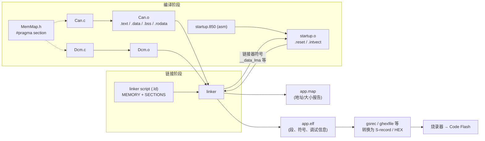
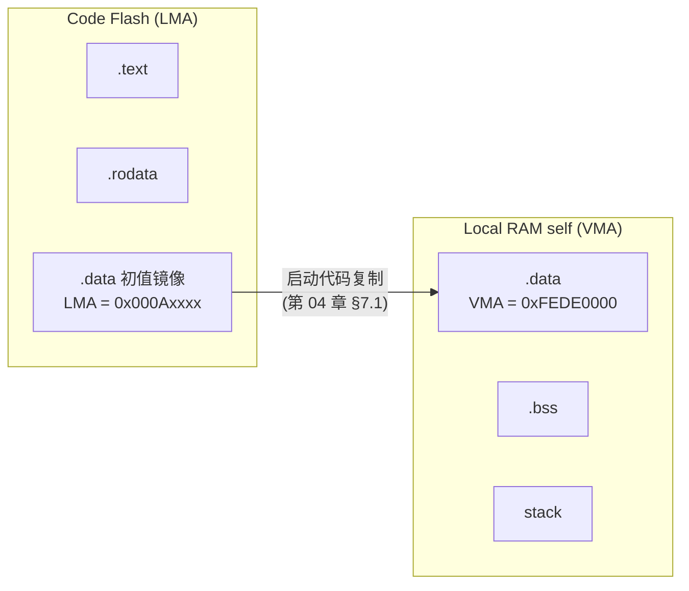
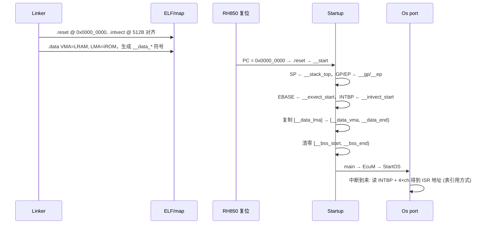

# 链接脚本与 map 文件：把程序段放到 RH850/P1M-E 的地址上

> Prerequisite: [03-memory-map.md](03-memory-map.md), [04-startup-process.md](04-startup-process.md)
> Next: [06-interrupt-exception.md](06-interrupt-exception.md)
> 对应规范: HW-E §4 p.257–259（地址空间）、p.205–206（RBASE/EBASE/INTBP 对齐）、p.281–282（向量偏移）、p.256（预取 48 字节）；SWS-MCU R24-11 p.13（start-up code 的向量/栈“provided as configuration parameter or linker/locator setting”）。**本仓库没有 GHS / CC-RH 链接器手册，也没有 AUTOSAR Memory Mapping SWS**
> 对应源码: openAUTOSAR `system/kernel/src/init.c:249-334`（链接文件自检）；本项目无 RH850 链接脚本，本章脚本全部为 `[Conceptual]`
> 背景资料: [01-project-and-docs-review.md](../reference/research/01-project-and-docs-review.md) §1.5（截图中的 `rh850ghs.ld` 片段）

---

## 1. 本章目标

1. 理解链接器的输入（object 文件中的 input section）与输出（ELF 中的 output section）、MEMORY 区域、地址分配和链接器符号。
2. 能清楚地解释 **LMA 与 VMA**，以及它们和启动代码 `.data` 复制之间的关系。
3. 能用 P1M-E 的真实地址写出一份“教学级”的 GHS 风格链接脚本，并指出哪些地方必须在真实项目中确认。
4. 能读懂 map 文件，用它定位“变量在哪”“栈还剩多少”“Flash 还剩多少”“向量表放对了没有”。
5. 理解 AUTOSAR MemMap 机制如何把“模块的 section 宏”连接到链接脚本。

---

## 2. 为什么需要关心链接脚本？

在 PC 上，你几乎从不写链接脚本——操作系统的 loader 会把程序放到虚拟内存里。在 RH850 这样的 MCU 上：

- **没有 loader**：CPU 复位后从固定地址开始执行，Flash 里的字节必须恰好在正确的地址上。
- **代码和数据在不同的物理存储**：Code Flash、Local RAM、Global RAM 是完全不同的硬件。
- **有硬件对齐要求**：EBASE/INTBP 必须 512 字节对齐（HW-E p.205–206）。
- **容量有限且不能越界**：R7F701381 只有 1 MB Code Flash、128 KB Local RAM。

链接脚本就是“软件对芯片存储映射的描述”。它错了，后果从“编译通过但上电即死”到“运行几小时后栈覆盖变量”都有可能。

---

## 3. 在系统中的位置



关键点：**启动代码需要的地址（栈顶、`.data` 的 LMA/VMA、`.bss` 范围、向量表地址）都由链接器在链接时计算，并以符号的形式提供给启动代码。** 启动代码和链接脚本是一对，必须一起读。

> 截图中的 GHS 工具链例子：`gsrec` 把可执行文件转为 Motorola S-record，`ghexfile` 用于十六进制转换（GHS 官方 RH850 产品页，见 [agent-guide.md](../agent-guide.md) H2）。具体参数需以安装版本的工具帮助为准。

---

## 4. AUTOSAR 如何定义？

[AUTOSAR Standard] AUTOSAR 不标准化链接脚本，但规定了两件事：

1. **SWS-MCU R24-11 p.13**：向量表基址、中断栈、用户栈的基址与大小“are provided as configuration parameter or linker/locator setting”——即这些值可以来自链接器。
2. **Memory Mapping**（MemMap.h）：每个 BSW 模块的源码用如下形态的宏包围变量和代码：

```c
/* [AUTOSAR Standard 形态] —— 宏名按公认 R4.x 约定，具体以真实项目所用 release 的 MemMap SWS 为准 */
#define CAN_START_SEC_VAR_INIT_UNSPECIFIED
#include "Can_MemMap.h"
static uint8 Can_ControllerMode[CAN_MAX_CONTROLLERS] = { 0u };
#define CAN_STOP_SEC_VAR_INIT_UNSPECIFIED
#include "Can_MemMap.h"
```

集成者在 `Can_MemMap.h`（或统一的 `MemMap.h`）中把这些宏翻译成编译器指令：

```c
/* [Conceptual] 集成者编写的 MemMap 片段 —— GHS pragma 语法需按编译器手册确认 */
#if defined(CAN_START_SEC_VAR_INIT_UNSPECIFIED)
  #undef  CAN_START_SEC_VAR_INIT_UNSPECIFIED
  #pragma ghs section data=".data.CAN_VAR_INIT"
#elif defined(CAN_STOP_SEC_VAR_INIT_UNSPECIFIED)
  #undef  CAN_STOP_SEC_VAR_INIT_UNSPECIFIED
  #pragma ghs section data=default
#endif
```

然后链接脚本决定 `.data.CAN_VAR_INIT` 放到哪个 RAM 区域。**本仓库没有 AUTOSAR Memory Mapping SWS**，这里展示的是机制，不是规范原文。

这条链“源码宏 → MemMap → pragma → section 名 → 链接脚本 → 物理地址”是真实项目中把某个模块的数据放到特定 RAM（例如 noinit、Global RAM、MPU 区域）的唯一正规途径。

---

## 5. 核心数据结构：链接器的几个基本概念

### 5.1 Input section、output section、MEMORY 区域

| 概念 | 含义 | 例子 |
|---|---|---|
| **input section** | 编译器在每个 `.o` 里生成的段 | `Can.o(.text)`、`Dcm.o(.bss)`、`startup.o(.reset)` |
| **output section** | 链接后 ELF 中的段，由多个 input section 合并而成 | `.text` = 所有 `.o` 的 `.text` |
| **MEMORY 区域** | 对物理存储的命名描述：起点 + 长度 + 属性 | `iROM: 0x00000000, 1024K` |
| **location counter** | 链接器当前分配到的地址（GNU ld 中写作 `.`） | |
| **链接器符号** | 链接时计算出的地址常量，供代码引用 | 栈顶、`.data` 起止 |

### 5.2 LMA 与 VMA



| 段 | VMA（运行地址） | LMA（加载/存放地址） | 是否占 Flash |
|---|---|---|---|
| `.text`、`.rodata` | Flash | = VMA | 是 |
| `.data` | RAM | **Flash** | 是（初值） |
| `.bss` | RAM | 无 | 否 |
| stack | RAM | 无 | 否 |
| 从 RAM 执行的代码（如 `.ramfunc`） | RAM | Flash | 是 |

代码中引用变量用的是 **VMA**；烧录器写入的是 **LMA**；启动代码负责从 LMA 复制到 VMA。

### 5.3 P1M-E 的 MEMORY 区域（从地址映射推出）

[RH850 Hardware] 依据 HW-E Table 4.1（p.257）与 Figure 4.1（p.259）：

| 建议的区域名（示例） | 起点 | 长度 | 用途 | 注意 |
|---|---|---|---|---|
| `iROM` | `0x0000_0000` | 1024 KB | 复位向量、向量表、`.text`、`.rodata`、`.data` 镜像 | **不是 2048K**（截图中的错误假设，见 01-review §1.5） |
| `iROM_EXT` | `0x0100_0000` | 32 KB | 若项目使用扩展用户区 | 与 `iROM` 不连续；DMA/H-Bus 不可访问（p.259） |
| `LRAM` | `0xFEDE_0000` | 128 KB | `.data`、`.bss`、栈、OS 数据 | **不要**再定义 `0xFEBE_0000` 的同一块 RAM |
| `GRAM` | `0xFEEF_8000` | 64 KB | DMA 缓冲区等 | Bank A/B 地址连续 |
| （不定义） | `0xFF20_0000` | 32 KB | Data Flash | 由 Fls/Fee 管理，不交给链接器 |

> [Real Project Consideration] 如果有 bootloader，`iROM` 的起点和长度要扣除 bootloader 区域，应用的向量表起点也随之变化。Bootloader/应用的分区约定**需要在真实项目环境中确认**。

### 5.4 对齐约束

[RH850 Hardware]

| 对象 | 约束 | 依据 |
|---|---|---|
| RBASE（复位向量基址） | bit8–0 恒为 0 → 512 字节对齐 | HW-E p.205 |
| EBASE（EBV=1 时的异常向量基址） | bit8–0 恒为 0 → 512 字节对齐 | HW-E p.205 |
| INTBP（中断地址表基址） | bit8–0 为 0 → 512 字节对齐 | HW-E p.206 |
| 直接向量区 | 基址 + `0x000`（RESET）… `+0x0E0`（FENMI）、`+0x0F0`（FEINT）、`+0x100`–`+0x1F0`（EIINT 按优先级 0–15，每级 16 字节） | HW-E p.281–282 |
| 中断地址表大小 | 384 个通道 × 4 字节 = 1536 字节（表项 = `INTBP + ch×4`） | HW-E p.281 |
| 指令 | PC bit0 固定 0 → 至少 2 字节对齐 | HW-E p.191 |
| 栈 | 对齐要求由编译器 ABI 决定（常见 4 或 8 字节） | 需按编译器手册确认 |
| RAM 代码区末尾 | 末尾之后 48 字节需初始化且不与禁止访问区重叠 | HW-E p.256 |

> 直接向量区中 RESET 以外各异常（SYSERR、TRAP 等）的偏移**需要 RH850G3M Software Manual 确认**（本仓库没有）。因此本章只给出手册 Table 6.11 能确认的几项。

---

## 6. 初始化流程：链接脚本与启动代码的“契约”

启动代码（第 04 章）需要的每一个地址，都应在链接脚本中有对应定义：

| 启动代码需要 | 链接脚本提供（示例符号名） | 用途 |
|---|---|---|
| 栈顶 | `__stack_top` / `___ghsend_stack` | 设置 r3 |
| SDA 基址 | `__gp` | 设置 r4 |
| TDA / EP 基址 | `__ep` | 设置 r30 |
| TP | `__tp` | 设置 r5 |
| 异常向量表起点 | `__exvect_start` | 写 EBASE |
| 中断地址表起点 | `__intvect_start` | 写 INTBP |
| `.data` 的 LMA、VMA、长度 | `__data_lma` / `__data_vma` / `__data_end` | `.data` 复制 |
| `.bss` 起止 | `__bss_start` / `__bss_end` | `.bss` 清零 |
| noinit 段起止 | `__noinit_start` / `__noinit_end` | 启动代码**跳过**清零 |

> 以上符号名**都是示例**。GHS 链接器会为每个 section 自动生成 begin/end 类符号，并能生成 ROM→RAM 复制表与清零表；CC-RH 有自己的约定。真实名称**需在真实项目的链接脚本与启动文件中确认**。

---

## 7. Runtime Flow：链接结果如何在运行时被使用



transition 解释：链接器只在构建时运行一次；之后所有地址都“烧死”在 ELF 和启动代码里。如果链接脚本把 `.intvect` 放在非 512 字节对齐的地址，写入 INTBP 时低 9 位会被忽略（HW-E p.206 “bits 8–0 … Be sure to clear to 0”），CPU 将从错误的表读 ISR 地址——症状是“某些中断跳到奇怪的地方”。

---

## 8. RH850 Hardware Mapping：一份教学级 GHS 风格链接脚本

> **[Conceptual] 重要声明**：下面的脚本**参考 GHS 链接器语法风格**（`MEMORY`、`SECTIONS`、`> region`、`ROM()`、`ALIGN()`、`PAD()` 等），用于说明“在 P1M-E 上一个链接脚本应该包含什么”。它**没有在任何 GHS 版本上验证过**，语法细节、段名、符号名都必须以真实项目的 `.ld` 文件和 GHS 手册为准。地址全部来自 HW-E Table 4.1（p.257）；`stack 10K@0xFEDFD800` 取自截图示例（01-review §1.5），`iROM` 已从错误的 2048K 修正为 1024K。

```text
/*------------------------------------------------------------------
 * [Conceptual] rh850_p1me_teaching.ld —— 教学示意，非 production
 * Target: R7F701381 (RH850/P1M-E, 1 MB Code Flash)
 *------------------------------------------------------------------*/
MEMORY
{
    iROM    : ORIGIN = 0x00000000, LENGTH = 1024K   /* HW-E p.257: 0000_0000–000F_FFFF */
    LRAM    : ORIGIN = 0xFEDE0000, LENGTH = 118K    /* Local RAM self, 扣除栈 */
    STACK   : ORIGIN = 0xFEDFD800, LENGTH = 10K     /* 截图示例: 栈顶 = 0xFEE00000 */
    GRAM    : ORIGIN = 0xFEEF8000, LENGTH = 64K     /* Global RAM A+B, HW-E p.257 */
    /* 不定义 0xFEBE0000: 那是 LRAM 的 PE1 别名, 同一块物理 RAM (HW-E p.259) */
    /* 不定义 0xFF200000: Data Flash 由 Fls/Fee 管理 */
}

SECTIONS
{
    /* ---------- Code Flash ---------- */
    .reset        0x00000000            : > iROM   /* 复位入口, RBASE (user mat) */
    .exvect       ALIGN(512)            : > .      /* EBASE 目标: FENMI +0E0, FEINT +0F0, EIINT +100..+1F0 */
    .intvect      ALIGN(512)            : > .      /* INTBP 目标: 384 × 4 B 地址表 */
    .text                               : > .
    .rodata                             : > .
    .ROM.data     ROM(.data)            : > .      /* .data 的初值镜像 (LMA) */
    .ROM.sdata    ROM(.sdata)           : > .
    .ROM.ramfunc  ROM(.ramfunc)         : > .      /* 若有 RAM 执行代码 */

    /* ---------- Local RAM ---------- */
    .data                               : > LRAM   /* VMA 在 RAM */
    .sdata                              : > .      /* GP 相对 */
    .sbss                               : > .
    .bss                                : > .
    .noinit       (NOLOAD)              : > .      /* 启动代码不清零; 需配合 STAC_* (第 03 章) */
    .ramfunc      ALIGN(4)              : > .      /* 末尾预留 48 B (HW-E p.256) */
    .ramfunc_pad  PAD(48)               : > .

    /* ---------- Stack ---------- */
    .stack        ALIGN(8) PAD(10K)     : > STACK  /* 向下增长, 栈顶 = 0xFEE00000 */

    /* ---------- Global RAM ---------- */
    .gram_dma     ALIGN(4)              : > GRAM   /* DMA 可访问 (HW-E p.259) */
}

/* 启动代码使用的符号 (示例名, 真实工程按 GHS 自动生成的 begin/end 符号或复制表) */
__stack_top     = ADDR(.stack) + SIZEOF(.stack);    /* = 0xFEE00000 */
__exvect_start  = ADDR(.exvect);
__intvect_start = ADDR(.intvect);
```

逐段解释（对应硬件依据）：

| 片段 | 作用 | 硬件依据 |
|---|---|---|
| `iROM 1024K` | R7F701381 的 Code Flash user area 只到 `000F_FFFF` | HW-E p.257 Note 1；DS-E p.2 |
| `.reset 0x00000000` | 复位后 CPU 从 RBASE 取指；user mat 时为 0 | HW-E p.258 |
| `.exvect ALIGN(512)` | EBASE 低 9 位为 0 | HW-E p.205 |
| `.intvect ALIGN(512)` | INTBP 低 9 位为 0 | HW-E p.206 |
| `ROM(.data)` | 为 `.data` 生成 Flash 中的初值镜像（GHS 风格写法） | 第 04 章 §7.1 |
| `.ramfunc_pad PAD(48)` | RAM 代码末尾后 48 字节预取区 | HW-E p.256 |
| `STACK` 区域独立 | 栈溢出时越界到 `.bss` 末尾之前，留出检测空间；也便于 MPU 设置 | 工程实践 |
| 不定义 `FEBE_0000` | 避免同一物理 RAM 被重复分配 | HW-E p.257、p.259 |

### 8.1 对照：GNU ld 风格的同一意图

[Conceptual] 如果你更熟悉 GNU ld（例如在主机或其他 MCU 上），同样的 LMA/VMA 意图写作：

```text
/* [Conceptual] GNU ld 风格对照 —— 仅帮助理解 LMA/VMA, 不用于 RH850 GHS 工程 */
.data : {
    __data_vma = .;
    *(.data .data.*)
    __data_end = .;
} > LRAM AT> iROM            /* VMA 在 LRAM, LMA 在 iROM */
__data_lma = LOADADDR(.data);

.bss (NOLOAD) : {
    __bss_start = .;
    *(.bss .bss.* COMMON)
    __bss_end = .;
} > LRAM
```

`> LRAM AT> iROM` 就是 GHS 风格中 `.data : > LRAM` + `.ROM.data ROM(.data) : > iROM` 两行合起来表达的意思。

### 8.2 栈的放置

[Conceptual] 关于栈，常见设计考虑：

| 考虑点 | 建议 | 原因 |
|---|---|---|
| 放在哪 | Local RAM self 的高端 | 访问最快（CPU 时钟域）；向下增长时远离 `.data` |
| 大小 | 由 OS 栈分析 + 最坏中断嵌套深度决定 | 截图中的 10 KB 只是一个例子，“不证明栈足够”（[agent-guide.md](../agent-guide.md) A2） |
| 有几个栈 | 取决于 OS：启动栈、OS/ISR 栈、每个扩展任务的栈 | AUTOSAR OS 配置决定；单栈 / 多栈模型需查 OS 手册 |
| 溢出检测 | MPU 保护栈底下方一个区域，或栈底填充 pattern 定期检查 | MPU 16 区（HW-E p.189） |
| 对齐 | 按编译器 ABI | 需按编译器手册确认 |

---

## 9. openAUTOSAR 实现

openAUTOSAR 没有 RH850 链接脚本。它在 `system/kernel/src/init.c` 里用一组“哨兵变量”验证链接文件（第 03 章 §10 已介绍）：

- `:249–254` 定义了有初值的 `test_data`、`test_data_array[3]`；
- `:290–334` 在 `main()` 里检查它们是否等于 `TEST_DATA`（`0x12345`），以及 `.bss` 中的变量是否为 0；
- `:274` 失败时 `BAD_LINK_FILE()` 死循环。

这组检查覆盖了链接脚本最常见的两类错误：**LMA/VMA 不匹配**（`.data` 复制源地址错）和 **`.bss` 范围符号错**（清零不完整）。它在 PowerPC CodeWarrior 编译器下还在 `main()` 开头手动复制/清零 `.sdata2/.sbss2`（符号声明 `init.c:278–284`，复制 `:292–296`），并检查它们（`:324–336`），这与 RH850 的 SDA 概念类似：**small-data 段也需要复制/清零**。

---

## 10. 当前教学项目实现

[Educational Implementation] 本项目没有 RH850 链接脚本，因为没有目标板构建。主机测试使用 TDM-GCC 默认链接（PE/COFF），没有 LMA/VMA 分离。本章实验 3 会利用主机 map 文件练习“读 map”的基本功。

---

## 11. Code Walkthrough：如何读 map 文件

不同工具链的 map 格式不同，但都会包含以下几类信息。用一个**虚构的、教学用**的 map 片段说明（地址按本章脚本推算，大小为假设值）：

```text
[Conceptual] 教学用 map 片段（虚构数据，格式仅示意）

Output Section      Address     Size      Load Address
.reset              0x00000000  0x00000004
.exvect             0x00000200  0x00000200
.intvect            0x00000400  0x00000600
.text               0x00000a00  0x0007c210
.rodata             0x0007cc10  0x00018a40
.ROM.data           0x00095650  0x00001f20
.data               0xfede0000  0x00001f20  0x00095650     <-- VMA / LMA
.sdata              0xfede1f20  0x00000140  0x00097570
.sbss               0xfede2060  0x00000200
.bss                0xfede2260  0x0000e8a0
.noinit             0xfedf0b00  0x00000100
.stack              0xfedfd800  0x00002800
.gram_dma           0xfeef8000  0x00000400

Symbol                               Address     Section    Module
Can_ControllerMode                   0xfede0120  .data      Can.o
Dcm_DslRuntime                       0xfede4a00  .bss       Dcm.o
Os_Isr_INTRCANGRECC                  0x00012340  .text      Os_Isr.o
__stack_top                          0xfee00000
```

读 map 的检查清单：

| 检查项 | 怎么看 | 本例结论 |
|---|---|---|
| 1. Flash 总用量 | 最后一个 Flash 段的 `Address + Size`（含 `.ROM.*`） | `0x97570 + 0x140 ≈ 0x976B0` ≈ 606 KB < 1 MB |
| 2. `.data` 的 LMA 在 Flash，VMA 在 LRAM | `Load Address` 列 | `.data` VMA `FEDE_0000`，LMA `0009_5650`，正确 |
| 3. `.data` 大小 = `.ROM.data` 大小 | 两行 Size | 均为 `0x1F20` |
| 4. RAM 段末尾与栈的间距 | `.noinit` 结束 `FEDF_0C00` 到 `.stack` 起点 `FEDF_D800` | 约 51 KB 空闲 |
| 5. 栈顶 | `__stack_top` | `FEE0_0000` = LRAM self 末尾 + 1 |
| 6. 对齐 | `.exvect`、`.intvect` 低 9 位 | `0x200`、`0x400` 均 512 对齐 |
| 7. 别名重复 | 是否有任何段在 `FEBE_xxxx` | 无 |
| 8. 某个 ISR 地址 | 符号表 | 可与 INTBP 表项内容比对 |

调试时 map 文件的典型用途：

- 调试器停在 `0x00012350`：在 map 里找“地址 ≤ 0x00012350 的最近符号” → `Os_Isr_INTRCANGRECC + 0x10`。
- 某个变量被改坏：找它的地址，看相邻的是谁（溢出的数组？栈？）。
- 新增功能后 Flash 超了：按模块（`Module` 列）统计 `.text`/`.rodata` 大小，找最大的贡献者。

---

## 12. Debug 方法

| 症状 | 链接相关原因 | 检查 |
|---|---|---|
| 烧录时报“地址超出范围” | `iROM` 长度写成 2048K，实际芯片只有 1 MB | 对照 HW-E p.257；看 map 中 Flash 段最大地址 |
| 上电后全局变量初值全错 | `.data` 的 LMA 与复制代码用的符号不一致 | map 的 Load Address 与启动代码符号值比对 |
| 部分变量初值对、部分错 | `.sdata` 等 small-data 段没进复制表 | 检查每一个有初值的 output section 是否都有 ROM 镜像 |
| 中断跳到奇怪的地址 | `.intvect` 未 512 对齐，或表项数量不足 384 | map 中 `.intvect` 地址低 9 位、大小 ≥ 0x600 |
| 运行一段时间后随机崩溃 | 栈溢出进入 `.bss`/`.noinit` | 栈区下方是否有保护间隔；栈水位 |
| DMA 写入的数据 CPU 读不到 / DMA 报错 | 缓冲区放在 `FEDE_xxxx`（DMA 不可见） | 段是否在 `GRAM`（HW-E p.259） |
| 从 RAM 执行 Flash 例程时 ECC 错误 | RAM 代码末尾 48 字节未初始化 | `.ramfunc` 后的 pad（HW-E p.256） |

---

## 13. 常见问题

| 问题 | 回答 |
|---|---|
| `.bss` 为什么不占 Flash？ | 它的内容全是 0，只需要知道范围，由启动代码（或 P1M-E 硬件）清零 |
| `const` 变量一定在 Flash 吗？ | 通常在 `.rodata`（Flash）；但若编译器把它当作需要运行时初始化的对象，或 MemMap 把它映射到 RAM 段，就不一定。看 map 确认 |
| 可以把 `.text` 放到 Global RAM 吗？ | 可以取指（HW-E p.258），但要有 LMA 镜像和复制步骤，且 GRAM 访问有等待周期 |
| 链接脚本和 MemMap 谁说了算？ | MemMap 决定变量进入哪个 section 名；链接脚本决定这个 section 放到哪里。两者缺一不可 |
| 为什么链接脚本里常有很多“看起来重复”的段？ | AUTOSAR 模块按 MemMap 分类（VAR_INIT / VAR_NO_INIT / VAR_CLEARED / CONST / CODE…）× 对齐（8/16/32/UNSPECIFIED）× 安全分区，组合很多 |

---

## 14. 实验

**实验 1：改错。** 截图示例中链接配置写着 `iROM 2048K@0x0`、`PLRAM 118K@0xFEDE0000`、`stack 10K@0xFEDFD800`。指出哪一项对 R7F701381 是错误的、依据是哪一页手册；再验证另外两项的地址算术（`0xFEDE0000 + 118K = ?`，`0xFEDFD800 + 10K = ?`）。

**实验 2：向量表预算。** 计算：直接向量区（`+0x000`–`+0x1FF`）和表引用地址表（384 × 4 B）分别需要多少字节？如果两者都放在 Flash 开头，且都要 512 字节对齐，`.text` 最早从哪个地址开始？

**实验 3：读主机 map。** 在仓库根目录：

```bash
B=examples/rh850_mcal_reference
mkdir -p /tmp/rh850-map   # 用临时目录，避免覆盖 artifacts/host-build/ 中的测试结果
gcc -std=c99 -O2 -Wl,-Map=/tmp/rh850-map/ref.map \
    -I $B/platform -I $B/mcal/gpt -I $B/mcal/can -I $B/integration \
    $B/tests/test_reference.c $B/platform/Rh850_Mmio.c \
    $B/mcal/gpt/Ostm.c $B/mcal/can/Can_BitTiming.c \
    $B/integration/Tick_Accumulator.c \
    -o /tmp/rh850-map/ref.exe
```

（include 目录与源文件列表取自 `tools/run_host_tests.py:18-21`。）打开 `ref.map`，找到 `Ostm_InitPclk` 的地址和所在 section；找一个全局变量，判断它在 `.data` 还是 `.bss`。然后思考：在 RH850 上，它的 LMA 和 VMA 会分别在哪里？

**实验 4：MemMap 推演。** 假设你需要把 `Dem` 模块的“跨复位保留的事件记忆”放到 noinit 区。写出：模块源码中的 MemMap 宏、MemMap 头文件中的 pragma、链接脚本中的段放置、启动代码中需要排除的清零范围、以及需要的 STAC_* 配置（第 03 章 §7）。

---

## 15. 思考题

1. 为什么 RH850 把 EBASE/INTBP 设计成 512 字节对齐？（提示：直接向量区 `+0x000`–`+0x1F0` 正好 512 字节。）
2. 如果 bootloader 和应用都有自己的向量表，复位时 RBASE 指向 bootloader；应用启动后如何让异常和中断进入自己的表？哪些异常可能在切换前发生？
3. 在 AUTOSAR 多分区（partition）或 memory protection 场景下，链接脚本需要怎样配合 MPU 的 16 个区域？区域对齐会带来什么浪费？
4. 一个变量既出现在 map 的 `.data` 中、又被启动代码清零（因为它也落在 `.bss` 范围内），会产生什么症状？如何从 map 发现？

---

## 16. 对未来真实项目的意义

```text
进入真实 RH850 + GHS 项目后：
1. 找到链接脚本（截图例子：rh850ghs.ld），列出 MEMORY 区域，与 HW-E p.257 的地址逐项核对容量
2. 确认 Code Flash 长度对应芯片实际容量（R7F701381 = 1 MB），并扣除 bootloader/保留区
3. 找到复位入口、异常向量表、中断地址表三个段，确认地址与 512 字节对齐
4. 找到 .data/.sdata 等所有“有初值”段的 ROM 镜像，以及启动代码使用的复制/清零表
5. 找到 MemMap 头文件，抽查一个模块（如 Can、Dcm）的 section 宏 → pragma → 段名 → 物理区域
6. 找到 noinit / 保留段，确认启动代码不会清零它们
7. 打开最新的 map 文件：记录 Flash/RAM 余量、栈位置、关键 ISR 和关键变量地址
8. 若使用 DMA：确认缓冲区段在 Global RAM
```

链接脚本语法、段名、符号名、copy table 格式都**需要在真实项目环境中确认**（工具链版本不同，细节不同）。本章给你的是检查清单和判断依据。

---

## 17. 本章总结

- 链接脚本 = 软件对存储映射的描述；它与启动代码通过链接器符号形成“契约”。
- `.data` 有 LMA（Flash）与 VMA（RAM）；`.bss` 只有 VMA；启动代码按链接器给出的范围复制和清零。
- P1M-E：`iROM` 1 MB @ 0，`LRAM` 128 KB @ `FEDE_0000`（不要重复定义 `FEBE_0000` 别名），`GRAM` 64 KB @ `FEEF_8000`；Data Flash 不进链接脚本。
- EBASE/INTBP 512 字节对齐；中断地址表 1536 字节；RAM 代码后留 48 字节。
- AUTOSAR MemMap 把模块的 section 宏翻译成编译器 pragma，再由链接脚本放置。
- map 文件是调试的地图：段地址、LMA/VMA、符号地址、余量。

## 18. 下一章

[06-interrupt-exception.md](06-interrupt-exception.md)：向量表放好了，接下来看中断如何从外设一路走到 OS 的 ISR——INTC1/INTC2、EIC、直接向量与表引用、Category 1/2 ISR。
