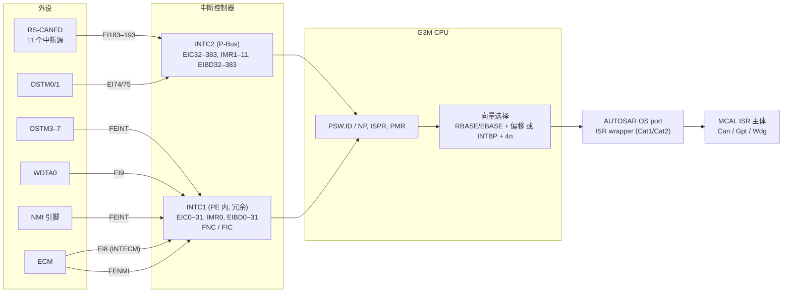
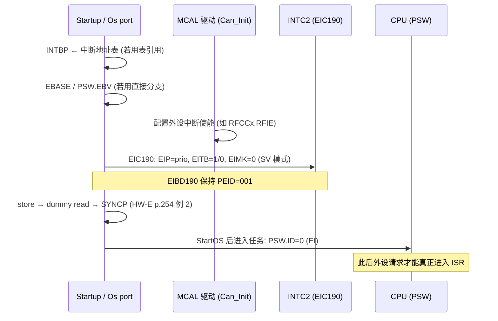
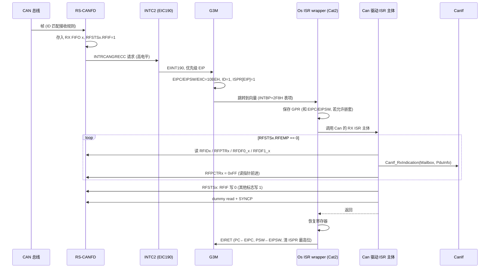

# 中断与异常：INTC1/INTC2、EIC、向量方式与 AUTOSAR OS ISR

> Prerequisite: [02-cpu-architecture.md](02-cpu-architecture.md), [05-linker-script.md](05-linker-script.md)
> Next: [07-clock-system.md](07-clock-system.md)；CAN 中断的驱动实现见 [../04-can-mcal/05-can-interrupt.md](../04-can-mcal/05-can-interrupt.md)；OS 侧见 [../02-autosar-classic/06-os-task-isr.md](../02-autosar-classic/06-os-task-isr.md)
> 对应规范: HW-E §6 Interrupt p.264–297（寄存器 p.265–279、Table 6.11 p.282–290、延迟 p.297）、§3.2.1.2 p.192–212（EIPC/EIIC/ISPR/PMR）、§3.4.1 p.254（同步）、§17.1.4 p.792 与 §17.3.x p.1057–1058（CAN 中断源）、§22.1.4 p.1544（OSTM）；SWS-CAN **R22-11**（`SWS_Can_00016` 等，见 [02-autosar-sws-notes.md](../reference/research/02-autosar-sws-notes.md) §2.5）。**本仓库没有 AUTOSAR OS SWS 与 RH850G3M Software Manual**
> 对应源码: openAUTOSAR `system/kernel/src/isr.c:80`（`Os_IsrInit`）、`:327`（`Os_Isr`，平台无关，且未被 CMake 编译）；本项目无 RH850 ISR 代码
> 事实底稿: [04-rh850-hardware-notes.md](../reference/research/04-rh850-hardware-notes.md) §2.4–2.6、§5

---

## 1. 本章目标

1. 说清楚 P1M-E 的中断控制器结构：**INTC1（EI 0–31，CPU 私有）与 INTC2（EI 32–383，P-Bus）**，以及 FE 级的 FENMI/FEINT。
2. 读懂 EIC 寄存器的每一位：**EICT、EIRF、EIMK、EITB、EIP**；复位值 `008FH` / `808FH` 各代表什么。
3. 比较两种向量方式：**直接分支（RBASE/EBASE + 优先级偏移）** 与 **表引用（INTBP + 4×通道号）**，并能算出任意通道的表项地址和 EIIC 值。
4. 记住本教程最关键的中断通道：**CAN 183–193（RX FIFO = 190）、OSTM0/1 = 74/75、WDTA0 = 9**。
5. 理解电平型中断“必须清外设源”、清源后的 **store → dummy read → SYNCP** 同步要求。
6. 能把这些硬件机制映射到 AUTOSAR OS 的 **Category 1 / Category 2 ISR**、嵌套和临界区，并知道哪些属于 OS port 的职责、必须在真实项目中确认。

---

## 2. 为什么中断如此关键？

在一个 CAN 诊断 ECU 里，几乎所有“事件”都是从中断开始的：

| 事件 | 中断源 | 后续 AUTOSAR 路径 |
|---|---|---|
| 收到一帧 CAN | INTRCANGRECC（EI190） | Can ISR → `CanIf_RxIndication` → CanTp → PduR → Dcm |
| 一帧 CAN 发送完成 | INTRCANmTRX（EI185/188/193） | Can ISR → `CanIf_TxConfirmation` → CanTp/Dcm 状态推进 |
| CAN bus-off | INTRCANmERR（EI183/186/191） | Can ISR → `CanIf_ControllerBusOff` → CanSM |
| OS tick | INTOSTM0/1（EI74/75） | OS counter → alarm → 周期任务 → `Dcm_MainFunction` 等 |
| 看门狗 75% 预警 | INTWDTA0（EI9） | Wdg 驱动（视项目） |

中断路径上的一个配置错误（通道号错、优先级错、没清源、没开 EIMK），就会让整条诊断链“看起来什么都没发生”或者“CPU 100% 卡在中断里”。

---

## 3. 在系统中的位置



> 图中 FNC/FIC 归属 INTC1、地址在 `FFFE_EAxx`（HW-E p.272）；FEINT 的来源区分寄存器 FEINTF 在 `FFD6_7000H`（HW-E p.278）。

---

## 4. AUTOSAR 如何定义？

[AUTOSAR Standard] 与中断相关的 AUTOSAR 概念分布在：

- **AUTOSAR OS**（本仓库**没有** OS SWS；以下按公认的 OSEK/AUTOSAR R4.x 概念描述，需以真实项目 release 确认）：
  - **Category 1 ISR**：不经过 OS 管理，不能调用大多数 OS 服务；开销最小。
  - **Category 2 ISR**：由 OS 包装，可调用 `ActivateTask`、`SetEvent` 等服务；OS 知道“当前在 ISR 上下文中”。
  - 中断 API：`DisableAllInterrupts/EnableAllInterrupts`、`SuspendAllInterrupts/ResumeAllInterrupts`、`SuspendOSInterrupts/ResumeOSInterrupts`。
- **MCAL 驱动 SWS**：规定“中断模式还是轮询模式”。例如 SWS-CAN R22-11 规定 TX confirmation 由 TX ISR 或 `Can_MainFunction_Write`（polling）调用 `CanIf_TxConfirmation`（`SWS_Can_00016`）；配置参数 `CanTxProcessing`/`CanRxProcessing`/`CanBusoffProcessing` 选择 INTERRUPT 或 POLLING（详见 [02-autosar-sws-notes.md](../reference/research/02-autosar-sws-notes.md) §2.5）。
- **MCAL ISR 的“名字”**：MCAL 通常提供 ISR 主体函数（或宏），由 OS 配置把它挂到某个中断向量上——**这个绑定关系是集成工作的一部分**，真实项目中出错率很高。

---

## 5. 核心数据结构：INTC 寄存器

### 5.1 寄存器总览

[RH850 Hardware] HW-E §6.2（p.265–279）：

| 寄存器 | 地址 | 宽度 | 作用 | 出处 |
|---|---|---|---|---|
| **EIC0–31** | `FFFE_EA00H + 2n` | 16（L/H 字节可 8/1 位访问） | INTC1 通道控制 | p.265、p.267 |
| **EIC32–383** | `FFFF_B000H + 2n`（`FFFF_B040H`–`FFFF_B2FEH`） | 16 | INTC2 通道控制 | p.265、p.267 |
| IMR0 | `FFFE_EAF0H` | 32/16/8 | EIMK0–31 的批量视图 | p.269 |
| IMR1–11 | `FFFF_B404H`–`FFFF_B42CH` | 32/16/8 | EIMK32–383 的批量视图 | p.269 |
| EIBD0–31 / 32–383 | `FFFE_EB00H` / `FFFF_B880H`–`FFFF_BDFCH` | 32 | 中断绑定：**PEID 必须为 001**，GPID 必须为 00；处理 EIINT 期间禁止修改 | p.271 |
| FNC / FIC | `FFFE_EA78H` / `FFFE_EA7AH` | 16 | FE 级 NMI / FEINT 请求控制 | p.272 |
| FEINTF / FEINTFC | `FFD6_7000H` / `FFD6_7008H` | 32 | 区分 FEINT 来源（NMI 引脚还是 OSTM3–7）并清除 | p.278–279 |
| SINTR0–4 | `FFC0_0000H + 4n` | 8 | 软件中断 | p.266、p.273 |

**写权限**：EICn、IMRn、EIBDn **只有 PE1 在 SV 模式下才能写**（HW-E p.265）。

### 5.2 EICn 各位

[RH850 Hardware] HW-E Table 6.4（p.267–268）：

```text
bit  15    14  13  12    11..8   7     6     5  4   3..0
    EICT   -   -   EIRF   -      EIMK  EITB  -  -   EIP[3:0]
复位  0/1   0   0   0     0      1     0     0  0   1111
R/W   R    R   R  R/W*    R     R/W   R/W    R  R   R/W
```

| 位 | 名称 | 含义 |
|---|---|---|
| 15 | **EICT** | 只读：**0 = 同步边沿检测，1 = 高电平检测**（由中断输入接口决定） |
| 12 | **EIRF** | 请求标志。**边沿型**：CPU 受理时自动清 0，软件可置位/清除；**电平型**：只读，软件不能置/清 |
| 7 | **EIMK** | 1 = 屏蔽（**复位值 1**）。屏蔽时请求不送 CPU、不置 ICSR.PMEI，**但 EIRF 照样置位** |
| 6 | **EITB** | **0 = 直接分支方式（按优先级），1 = 表引用方式** |
| 3–0 | **EIP** | 优先级 0（最高）–15（最低）；同优先级时通道号小者优先 |

**复位值**：边沿型 `008FH`，电平型 `808FH`（HW-E p.267）——即“屏蔽、直接分支、最低优先级 15”。

### 5.3 写 EIC 的陷阱

[RH850 Hardware] HW-E p.267 明确警告：

- 边沿型通道上，如果在外设刚产生请求时写 EIRF=0，请求可能丢失；在 CPU 刚受理后写 EIRF=1，可能产生错误的重复请求。
- `set1/clr1/not1` 位操作指令是“读 → 修改 → 写回”。如果操作的不是 EIRF 位，第 (1) 步读到的 EIRF 会在第 (3) 步写回——中间若有请求或受理，就会出现上述问题。
- **bit 15–13、11–8、5、4 禁止用位操作指令访问。**
- 结论：**只在外设不产生请求且 CPU 没有在受理该中断时写 EIC**。运行时只想屏蔽/解除屏蔽，优先考虑 IMR 寄存器或 OS 提供的 API。

另外 HW-E §3.4.2（p.255）指出：位操作指令以 8 位为单位做原子读-改-写，只能用于支持 8 位读写的寄存器；含多个标志位的寄存器用读-改-写可能清掉非目标标志。

---

## 6. 初始化流程：一个中断通道从关闭到可用



逐步说明：

1. **向量基础设施**：INTBP 或 EBASE（第 04 章 §6.2）。
2. **外设内部使能**：例如 RS-CANFD RX FIFO 中断需要 RFCCx.RFIE=1（HW-E p.1058 Table 17.175）——这是 Can 驱动的工作。
3. **EIC 配置**：设置优先级、向量方式、解除屏蔽。CAN 初始化流程（HW-E Figure 17.16，p.1091）中也把“设置 INTC”列为一步。
4. **跨外设组同步**：先配外设、再解除 INTC 屏蔽时，需要 store → dummy read → SYNCP（HW-E p.254 Example 2）。
5. **CPU 开中断**：OS 启动第一个任务时清 PSW.ID。

> [Real Project Consideration] 第 3 步由谁做（OS port 根据 OsIsr 配置生成，还是 MCAL 在 Init 中写 EIC），**不同的 OS/MCAL 组合不同，需要在真实项目中确认**。如果两边都写，就可能出现“后写的覆盖先写的优先级”这类问题。

---

## 7. Runtime Flow：向量方式

### 7.1 两种方式对比

[RH850 Hardware] HW-E §6.4（p.281）把它们称为“standard specifications”和“extended specifications”：

| | **直接分支方式**（EITB=0） | **表引用方式**（EITB=1） |
|---|---|---|
| handler 地址 | 基址（PSW.EBV=0 用 RBASE，=1 用 EBASE）+ 偏移 | 从 **`INTBP + 通道号 × 4`** 读出 handler 地址 |
| 偏移 | RINT=0：按通道**优先级** 0–15 落在 `+100H`–`+1F0H`（每级 16 字节）；RINT=1：一律 `+100H` | 每个通道一个表项 |
| handler 如何知道是哪个通道 | 读 **EIIC**（= `0x1000 + ch`） | 表项本身就区分了通道；也可读 EIIC |
| 入口是否需要 SYNCP | **需要**（HW-E p.281 CAUTION） | CAUTION 未列出 EIINT 表引用方式 |
| 存储占用 | 最小（RINT=1 时只有一个入口） | 384 × 4 = 1536 字节 |
| 延迟（INTC2，cache 命中，边沿型） | 12 个 CPU 周期 | 16（表在 Local RAM）/ 19（表在 Code Flash） |

延迟数据来自 HW-E Table 6.13（p.297），单位是 CPU1 时钟周期（160 MHz 下 1 周期 = 6.25 ns）。完整表格：

| I-Cache | 检测 | 方式 | 表位置 | INTC1 | INTC2 |
|---|---|---|---|---|---|
| hit | edge | 直接 | — | 7 | 12 |
| miss | edge | 直接 | — | 10 | 15 |
| hit | level | 直接 | — | 6 | 10 |
| miss | level | 直接 | — | 9 | 13 |
| hit | edge | 表引用 | Local RAM | 11 | 16 |
| miss | edge | 表引用 | Local RAM | 14 | 19 |
| hit | level | 表引用 | Local RAM | 10 | 14 |
| miss | level | 表引用 | Local RAM | 13 | 17 |
| hit | edge | 表引用 | Code Flash | 14 | 19 |
| miss | edge | 表引用 | Code Flash | 17 | 22 |
| hit | level | 表引用 | Code Flash | 13 | 17 |
| miss | level | 表引用 | Code Flash | 16 | 20 |

这些数字只到“handler 第一条指令取指”为止；之后 OS wrapper 保存上下文的时间通常远大于此。

### 7.2 地址计算练习

以 CAN 全局 RX FIFO 中断 INTRCANGRECC（通道 190）为例：

| 量 | 计算 | 结果 | 出处 |
|---|---|---|---|
| EIC 地址 | `FFFF_B000H + 2 × 190` | `FFFF_B17CH` | HW-E p.265、p.267 |
| 表引用偏移 | `4 × 190` | `+2F8H` | HW-E p.286 Table 6.11 |
| 表项地址 | `INTBP + 2F8H` | 取决于 INTBP | HW-E p.281 |
| EIIC 值 | `1000H + 190` | `10BEH` | HW-E p.286 Source Code 列 |
| 直接分支入口（EIP=3，RINT=0） | `EBASE + 100H + 3 × 10H` | `EBASE + 130H` | HW-E p.281–282 |

### 7.3 本教程关键中断通道表

[RH850 Hardware] Table 6.11（p.282–290）、Table 17.8（p.792）、§22.1.4（p.1544）：

| 源 | 名称 | EI 通道 | EIIC | 表偏移 | EIC 地址 | 检测方式 | 未来对应 |
|---|---|---|---|---|---|---|---|
| ECM（可屏蔽） | INTECM | 8 | `1008H` | `+020H` | `FFFE_EA10H` | 见 EICT | safety 处理 |
| WDTA0 75% | INTWDTA0 | 9 | `1009H` | `+024H` | `FFFE_EA12H` | 见 EICT | Wdg（视项目） |
| OSTM0 | INTOSTM0 | 74 | `104AH` | `+128H` | `FFFF_B094H` | 边沿 | Gpt / OS counter |
| OSTM1 | INTOSTM1 | 75 | `104BH` | `+12CH` | `FFFF_B096H` | 边沿 | Gpt / OS counter |
| TAUJ0 ch0–3 | INTTAUJ0I0–3 | 133–136 | `1085H`… | `+214H`… | `FFFF_B10AH`… | — | Gpt / Icu |
| TAUD0 ch0–15 | INTTAUD0I0–15 | 141–156 | `108DH`… | `+234H`… | `FFFF_B11AH`… | — | Gpt / Icu / Pwm |
| CAN0 error | INTRCAN0ERR | 183 | `10B7H` | `+2DCH` | `FFFF_B16EH` | 电平* | Can（bus-off） |
| CAN0 common FIFO RX | INTRCAN0REC | 184 | `10B8H` | `+2E0H` | `FFFF_B170H` | 电平* | Can（TX/RX FIFO 接收模式） |
| CAN0 TX | INTRCAN0TRX | 185 | `10B9H` | `+2E4H` | `FFFF_B172H` | 电平* | Can（TxConfirmation） |
| CAN1 error / REC / TRX | INTRCAN1ERR/REC/TRX | 186/187/188 | `10BAH`–`10BCH` | `+2E8H`/`+2ECH`/`+2F0H` | `FFFF_B174H`/`B176H`/`B178H` | 电平* | Can |
| CAN global error | INTRCANGERR | 189 | `10BDH` | `+2F4H` | `FFFF_B17AH` | 电平* | Can |
| **CAN RX FIFO（全局，8 个 RX FIFO 共用）** | **INTRCANGRECC** | **190** | **`10BEH`** | **`+2F8H`** | **`FFFF_B17CH`** | 电平* | **Can（RxIndication）** |
| CAN2 error / REC / TRX | INTRCAN2ERR/REC/TRX | 191/192/193 | `10BFH`–`10C1H` | `+2FCH`/`+300H`/`+304H` | `FFFF_B17EH`/`B180H`/`B182H` | 电平* | Can |
| Flash sequencer end / error | — | 379 / 383 | — | — | — | — | Fls |
| OSTM3–7 | INTOSTM3–7 | **FEINT**（非 EI） | — | `+0F0H` | FIC | — | timing protection 等 |

\* CAN 行在 Table 6.11 的 “Level Interrupt” 列有标记（PDF 文本抽取为特殊符号），按表注为高电平检测（[04-rh850-hardware-notes.md](../reference/research/04-rh850-hardware-notes.md) §5.2）。这是从抽取文本推断的，上板后应读 EICn.EICT 直接确认（HW-E p.267）。

> **一个真实出现过的错误**：EI184 是 **CAN0 的 common (TX/RX) FIFO 接收中断**，不是“CAN 的 RX FIFO 中断”。如果 Can 驱动把接收路由到 RX FIFO（RFCCx），对应的中断是 **EI190（INTRCANGRECC）**。只配置 CAN0 的 183/184/185 三个 ISR，RX FIFO 中的报文可能永远到不了 CanIf（[rh850-hardware-handoff.md](../rh850-hardware-handoff.md) §10；[01-project-and-docs-review.md](../reference/research/01-project-and-docs-review.md) §7 第 2 条）。

### 7.4 电平型与边沿型：如何“结束”一个中断

[RH850 Hardware]

| | 边沿型（EICT=0），如 OSTM0/1 | 电平型（EICT=1），如 CAN |
|---|---|---|
| EIRF 何时清除 | CPU 受理时自动清 0（HW-E p.267） | 软件不能清；只要外设请求线为高，就一直有请求 |
| ISR 必须做什么 | 处理事件即可（外设一般无需清标志，具体看外设章节） | **必须清除外设内部的中断标志**，否则 EIRET 后立即再次进入 |
| 典型错误 | 用 EIRF 写操作“清中断”时机不当导致丢失/重复 | 只清 EIC 不清外设 → **中断风暴** |

RS-CANFD 明确：“在中断标志清除之前，模块会一直输出中断请求”（HW-E p.1057）。各 CAN 中断的标志与使能位（HW-E Table 17.175 p.1058）：

| CAN 中断 | 请求标志（需在 ISR 中清除） | 使能位 |
|---|---|---|
| 全局 RX FIFO（EI190） | RFSTSx.RFIF | RFCCx.RFIE |
| 全局错误（EI189） | GERFL.DEF / MES / THLES | GCTR.DEIE / MEIE / THLEIE |
| 通道发送（EI185/188/193） | TMSTSp.TMTRF 等 | TMIECy.TMIEp 等 |
| 通道 TX/RX FIFO 接收（EI184/187/192） | CFSTSk.CFRXIF | CFCCk.CFRXIE |
| 通道错误（EI183/186/191） | CmERFL.BEF / EWF / EPF / BOEF / BORF / OVLF / BLF / ALF | CmCTR 中对应 *IE |

### 7.5 清源后的同步

[RH850 Hardware] HW-E §3.4.1.1 Example 1（p.254）：“an interrupt is enabled by implementation of an EI instruction after an interrupt request is cleared by access from the control register in the INTC2 and the peripheral circuits”时，必须：

```text
1. store：写外设控制寄存器（清标志）
2. dummy read：读回同一寄存器
3. SYNCP
4. 后续指令（EI，或 EIRET 返回）
```

原因：store 指令执行完到寄存器真正更新之间有时间差。若跳过 2、3 步，CPU 可能在外设请求线尚未拉低时就重新开放中断，于是**同一个中断被受理两次**——第二次进入时 FIFO 已经空了，驱动可能误报错误或做无效处理。

---

## 8. RH850 Hardware Mapping：上下文保存、嵌套与 FE 级

### 8.1 一次 CAN RX 中断的完整旅程



每个 transition 的依据：RX FIFO 读取与 RFPCTRx=0xFF（HW-E p.848、p.1102）；RFIF 清除方式（HW-E p.847）；同步（HW-E p.254）；EIIC 值（HW-E p.286）；硬件保存与 ISPR（HW-E p.193–199、p.210）。`CanIf_RxIndication` 的参数形态按 SWS-CAN R22-11（Part IV/V 展开）。

### 8.2 硬件保存 vs 软件保存（回顾）

| 内容 | 谁 | 依据 |
|---|---|---|
| PC → EIPC / FEPC | 硬件 | HW-E p.193、p.195 |
| PSW → EIPSW / FEPSW | 硬件 | HW-E p.194、p.196 |
| 原因码 → EIIC / FEIC | 硬件 | HW-E p.199 |
| PSW.ID=1（FE 级另置 NP=1），ISPR 置位 | 硬件 | HW-E p.198、p.210 |
| r1–r31（被使用的部分） | 软件（OS wrapper / 编译器生成的 ISR 序言） | — |
| 嵌套时的 EIPC/EIPSW | **软件**，必须在重新 EI 前保存 | HW-E p.193–194 |
| FPU 状态 | 软件（若使用 FPU） | HW-E p.213 |

详细讨论与伪汇编见 [02-cpu-architecture.md](02-cpu-architecture.md) §8、§11。

### 8.3 嵌套中断

[RH850 Hardware] 硬件为嵌套提供的支持：

- 受理 EIINT 时 **ISPR 自动置位**，从而自动屏蔽“同级及更低优先级”的中断（HW-E p.210）；
- handler 内执行 `EI` 后，**只有更高优先级（EIP 数值更小）** 的中断能嵌套进来；
- EIRET 时（PSW.EP=0）硬件清除 ISPR 中最高优先级的位（HW-E p.210）。

软件的义务：在 `EI` 之前保存 EIPC/EIPSW，在 `EIRET` 之前 `DI` 并恢复它们（HW-E p.193–194）。

[Conceptual] 嵌套深度与栈：每一层嵌套都在栈上叠加一个上下文帧。最坏栈深度 ≈ 任务栈 + Σ（每个优先级的 ISR 帧 + ISR 主体栈）。OS 配置的 ISR 栈大小必须覆盖最坏嵌套情形。

### 8.4 FE 级：FENMI、FEINT、SYSERR

[RH850 Hardware]

| 异常 | 来源 | 向量偏移 | 可屏蔽 | 典型用途 |
|---|---|---|---|---|
| FENMI | ECM（不可屏蔽） | `+0E0H` | 否 | 严重硬件错误（lock-step、ECC 等，由 ECM 路由） |
| FEINT | NMI 引脚、OSTM3–7 | `+0F0H` | 可（FIC 等） | OSTM3–7 用于 timing protection 监视（HW-E p.1544） |
| SYSERR | SEG | 需查 G3M SW 手册 | — | 总线/访问错误；**不可返回** |

依据：HW-E p.264、p.244–245、p.282。FEINT 有多个来源，handler 需读 **FEINTF**（`FFD6_7000H`）区分，并用 FEINTFC 清除（HW-E p.278–279）。

受理 FE 级异常时 PSW.NP=1、ID=1，**所有 EI 级中断和 FE 级异常都被屏蔽**（HW-E p.198）。所以 FE handler 应该短小，只做记录与安全响应。

> [Real Project Consideration] AUTOSAR OS 的 timing protection 可能会使用 OSTM3–7 的 FEINT（HW-E p.1544 说明 OSTM3–7 “用于 timing protection 监视”的设计意图）。是否使用、由 OS port 还是 safety 模块管理，需要在真实项目中确认。

### 8.5 AUTOSAR OS ISR Category 与 RH850 硬件的对应

[Conceptual] 下表把 OS 概念映射到本章的硬件机制。**OS 侧的具体实现是 OS port 的设计，本仓库没有任何 OS port 资料，以下“通常”均需在真实项目中确认。**

| OS 概念 | 在 RH850 上依赖的硬件机制 | 说明 |
|---|---|---|
| ISR 向量绑定（OsIsr → 中断源） | EIC 的 EITB、INTBP 表或直接向量区 | 生成的向量表/表项把通道 n 指向 OS wrapper 或 Cat1 handler |
| ISR 优先级（OsIsrPriority） | EICn.EIP（0 最高） | OS 优先级数值到 EIP 的换算**不能假设相等或 `15-x`**，必须查端口文档（[agent-guide.md](../agent-guide.md) B4） |
| Category 1 ISR | 直接进入用户 handler，OS 不介入 | 通常放在最高优先级，用于极低延迟需求 |
| Category 2 ISR | OS wrapper：保存上下文 → 标记 ISR 上下文 → 调用主体 → 可能触发调度 → EIRET | 可调用 OS 服务；退出时若激活了更高优先级任务，OS 在此切换 |
| `DisableAllInterrupts` | PSW.ID（DI/EI） | 屏蔽所有 EI 级中断；不影响 FE 级 |
| `SuspendOSInterrupts` | PMR（或等效机制）屏蔽 Cat2 所在优先级 | 要求所有 Cat1 的 EIP 数值上小于所有 Cat2 |
| ISR 嵌套 | ISPR + wrapper 中的 EI | OS 配置可能决定是否允许嵌套 |
| ISR 栈 | 软件栈切换 | G3M 无硬件独立中断栈指针 |
| OS tick | OSTM0/1（EI74/75） | OS counter 的硬件；OSTM0/1 归属在不同文档中不一致，**是配置选择不是硬件事实** |
| Timing protection | 可能使用 OSTM3–7 FEINT | 需确认 |

[Real Project Consideration] **RTA-OS 这类 OS port 通常拥有的部分**（截图中出现过 RTA-OS RH850GHS port 作为可能的真实环境；以下是“应该去端口文档里核对的清单”，不是对其内部实现的断言）：

1. 向量表 / INTBP 表是由 OS 生成，还是由启动代码手写、再由 OS 填入；
2. EIC 的 EIP/EITB/EIMK 由谁写（OS 启动时统一写，还是 MCAL Init 写）；
3. Category 2 wrapper 保存哪些寄存器、是否保存 EIPC/EIPSW、是否切换栈、是否允许嵌套；
4. OS 优先级到 EIP 的映射规则；
5. `SuspendOSInterrupts` 用 PSW.ID 还是 PMR；
6. 中断向量的命名规则（截图中 `Interrupt_0228/022C` 与 OSTM0/1 表偏移 `0x128/0x12C` 相差 `0x100`——**这只是可检查的数值关系，不能据此断定命名规则**，[agent-guide.md](../agent-guide.md) B3）。

### 8.6 中断模式 vs 轮询模式

[AUTOSAR Standard] 许多 MCAL 驱动允许选择中断或轮询。以 Can 为例，若选择 POLLING，`Can_MainFunction_Read/Write/BusOff` 在周期任务里检查硬件标志（SWS-CAN R22-11）。此时：

- 外设内部中断使能（RFIE 等）可以关闭，**或**保持打开但 EIC 屏蔽（EIMK=1）——两种做法都要确认 MCAL 的实际行为；
- 注意 EIMK=1 时 EIRF 仍会置位（HW-E p.268）；
- 轮询延迟 = MainFunction 周期，影响 CanTp 的时序（N_Ar/N_Cr 等）。

Part IV 的 [05-can-interrupt.md](../04-can-mcal/05-can-interrupt.md) 会详细比较。

---

## 9. openAUTOSAR 实现

openAUTOSAR 的 OS 中断部分是平台无关的：`system/kernel/src/isr.c` 中 `Os_IsrInit`（`:80`）和 `Os_Isr`（`:327`）实现了“ISR 描述表 + 统一分发”的逻辑，但：

- **`isr.c` 没有被 CMake 编译**（`system/kernel/CMakeLists.txt` 只编 `event.c init.c task.c …`，[03-openautosar-trace.md](../reference/research/03-openautosar-trace.md) §1.2）；
- **没有 RH850（或任何真实 CPU）的 arch port**，所以“读 EIIC → 查表 → 调用 ISR”这一跳在 openAUTOSAR 里不存在；
- 没有 Can 驱动，因此“CAN ISR → `CanIf_RxIndication`”无法追踪（03-trace §2.1 结论）。

可以把 `Os_Isr` 当作“Category 2 wrapper 在 C 层面做了什么”的参考：进入 ISR 上下文、调用用户 ISR 函数、退出时检查是否需要重新调度。硬件层面（保存哪些寄存器、EIRET）需要按本章 §8 理解。

---

## 10. 当前教学项目实现

[Educational Implementation] 本项目的 host demo 没有真实中断。Part V/VIII 的教学诊断栈会用**函数调用模拟“中断到来”**：Mock CAN 硬件把一帧放进 Mock FIFO，然后直接调用 Can 的“RX 处理函数”，后者调用 `CanIf_RxIndication`。阅读时请记住它省略了本章的哪些步骤：

```text
[真实 RH850]  RS-CANFD → INTC2(EIC190) → CPU 受理 → OS Cat2 wrapper → Can ISR 主体 → CanIf
[教学实现]    Mock FIFO →                                          Can RX 处理函数 → CanIf
              （省略：电平中断、EIC 优先级、上下文保存、清源同步、嵌套）
```

---

## 11. Code Walkthrough：一个 Category 2 CAN RX ISR 主体

[Conceptual] 下面是**教学用**的 Can RX ISR 主体（OS wrapper 之内的部分）。寄存器访问以宏表示；偏移来自 HW-E §17（Classical CAN mode，基址 `FFD2_0000H`），但**这不是任何 MCAL 的实现**，真实驱动还需处理多 FIFO、HRH 映射、DLC、FD 模式等。

```c
/* [Conceptual] 教学伪代码 —— 非 production code
 * 运行上下文：OS Category 2 ISR，被 INTRCANGRECC (EI190) 触发
 * 硬件依据：HW-E p.846–848 (RFSTSx/RFPCTRx), p.1102 (RX FIFO 读取流程), p.254 (同步) */
#define RSCFD0_BASE        0xFFD20000u
#define RFSTS(x)           (RSCFD0_BASE + 0x00D8u + 4u * (x))   /* Classical mode, HW-E p.798 */
#define RFPCTR(x)          (RSCFD0_BASE + 0x00F8u + 4u * (x))
#define RFSTS_RFEMP        (1u << 0)
#define RFSTS_RFIF         (1u << 3)

void Can_Conceptual_RxFifoIsr(uint8 fifo)
{
    /* 1. 读空 FIFO：每读一帧，RFPCTRx 写 0xFF 让读指针前进 */
    while ((RH850_READ32(RFSTS(fifo)) & RFSTS_RFEMP) == 0u) {
        Can_Conceptual_ReadOneFrameAndIndicate(fifo);   /* 读 RFIDx/RFPTRx/RFDF0_x/RFDF1_x → CanIf_RxIndication */
        RH850_WRITE32(RFPCTR(fifo), 0xFFu);
    }

    /* 2. 清 RFIF：RFIF 写 0，其余可写标志写 1（避免误清 RFMLT 等，HW-E p.847）
     *    注意：这里的“其余位写 1”是对 W0C 类标志的保护写法；具体哪些位可写需按 p.847 位表 */
    RH850_WRITE32(RFSTS(fifo), ~RFSTS_RFIF & Can_Conceptual_RfstsWritableMask);

    /* 3. 同步：dummy read + SYNCP，确保请求线已拉低后再 EIRET (HW-E p.254) */
    (void)RH850_READ32(RFSTS(fifo));
    Rh850_Syncp();   /* 编译器内建 / 内联汇编，需按工具链确认 */
}
```

对照检查：

- 如果漏了第 2 步：电平中断持续有效 → EIRET 后立即再次进入 → **中断风暴**，低优先级任务全部饿死。
- 如果漏了第 3 步：偶发地“同一中断进两次”，第二次 FIFO 已空。
- 如果把 `CanIf_RxIndication` 放在“清 RFIF 之后才读数据”：期间新到的帧可能不再触发中断（RFIF 已清、下一次触发条件取决于 RFIGCV/RFIM 设置，HW-E p.845），导致帧滞留。

---

## 12. Debug 方法

### 12.1 “中断从来不进”检查表

按从外设到 CPU 的顺序：

| # | 检查 | 寄存器 / 方法 | 依据 |
|---|---|---|---|
| 1 | 外设事件确实发生了吗？ | 外设状态（如 RFSTSx.RFEMP=0、RFIF=1） | 外设章节 |
| 2 | 外设中断使能了吗？ | 如 RFCCx.RFIE=1 | HW-E p.1058 |
| 3 | INTC 收到请求了吗？ | EICn.EIRF=1 | HW-E p.267 |
| 4 | 通道被屏蔽了吗？ | EICn.EIMK、IMRn | HW-E p.268–269 |
| 5 | 通道号对吗？ | RX FIFO 是 190，不是 184 | HW-E p.286 |
| 6 | EIBD 绑定正确吗？ | PEID=001 | HW-E p.271 |
| 7 | CPU 允许 EI 中断吗？ | PSW.ID=0 | HW-E p.198 |
| 8 | 被更高/同级屏蔽了吗？ | ISPR（是否有残留位）、PMR | HW-E p.210–211 |
| 9 | 向量正确吗？ | EITB；INTBP + 4n 表项内容 / EBASE+偏移处代码 | HW-E p.281 |
| 10 | 中断进了，但进的是默认 handler？ | 读 EIIC，与 map 中的 ISR 符号比对 | HW-E p.199 |

### 12.2 “中断风暴”检查表

| 症状 | 原因 | 检查 |
|---|---|---|
| CPU 100% 在某个 ISR，任务不运行 | 电平型中断源未在外设清除 | 外设标志位；ISR 是否处理了**所有**已使能的源（如 CAN 错误中断有 8 种标志，HW-E p.1058） |
| 偶发“空 ISR” | 清源后未做 dummy read + SYNCP | HW-E p.254 |
| ISR 中断嵌套无限加深 | wrapper 未保存 EIPC/EIPSW 就 EI；或优先级配置相同而 ISPR 被手工清除 | HW-E p.193–194、p.210 |

### 12.3 读 EIIC/FEIC 定位

调试器停在某个通用异常 handler 时：

1. 读 **EIIC**（SR13,0）：若在 `0x1000`–`0x117F` 范围，减去 `0x1000` 得到 EI 通道号 → Table 6.11 → 外设 → 负责的 MCAL 模块。
2. 读 **FEIC**（SR14,0）：FE 级原因码（`0xE0` FENMI、`0xF0` FEINT 等见 Table 6.11 前两行；其余需查 G3M SW 手册）。
3. 读 **EIPC/FEPC**：在 map 中找到被打断的位置。

---

## 13. 常见问题

| 问题 | 回答 |
|---|---|
| EIC 复位值 `008FH` 是什么意思？ | EIMK=1（屏蔽）、EITB=0（直接分支）、EIP=15（最低）；`808FH` 多了 EICT=1（电平型）（HW-E p.267） |
| 为什么 EIIC 是 `0x1000 + ch`？ | Table 6.11 的 Source Code 列如此定义（HW-E p.282–290），bit31–16 可能有额外细节码（p.199） |
| 直接分支方式下所有同优先级的中断进同一个入口吗？ | 是（RINT=0 时按优先级分 16 个入口；RINT=1 时全部进 `+100H`）。handler 要读 EIIC 分派 |
| OSTM3 能当 Gpt 的普通定时器吗？ | 不适合：OSTM3–7 只能产生 FEINT（HW-E p.264、p.1544） |
| EIMK=1 时外设事件会丢吗？ | 不会，EIRF 照样置位（p.268）；解除屏蔽后（边沿型）会立即受理 |
| 用户模式代码能改中断优先级吗？ | 不能，EIC 只能在 SV 下写（p.265） |

---

## 14. 实验

**实验 1：通道计算器。** 写一个主机 C 函数：输入 EI 通道号，输出 EIC 地址、表引用偏移、EIIC 值。用 9、74、75、183、190、193 测试，结果与 §7.3 表格比对。

**实验 2：读 Table 6.11。** 在 `artifacts/pdf-text/r01uh0585ej0120.txt` 中 grep `INTADCG0I0`、`INTTAUJ0I0`、`INTRLIN30`，补全它们的通道号、EIIC、表偏移，并判断它们属于 INTC1 还是 INTC2。

**实验 3：嵌套推演。** 设 CAN RX（EI190）EIP=5，OSTM0（EI74）EIP=2，CAN TX（EI185）EIP=5。写出以下场景中 ISPR 的变化：CAN RX ISR 执行中（已 EI），OSTM0 与 CAN TX 同时到来。哪个先被受理？CAN TX 何时被受理？

**实验 4：风暴复现（纸上）。** 用 §11 的伪代码，删掉“清 RFIF”这一行，推演 EIRET 之后 CPU 的行为；再删掉 dummy read + SYNCP，推演可能出现的“空 ISR”。

---

## 15. 思考题

1. 为什么 RH850 同时提供直接分支和表引用两种方式？在一个使用 AUTOSAR OS、有 30 个 ISR 的项目中，你会选哪种？考虑延迟（p.297）、存储、可维护性和 OS 生成工具。
2. 为什么 CAN 中断设计成电平型，而 OSTM 是边沿型？从“不丢事件”的角度思考。
3. 如果 OS 用 PMR 实现 `SuspendOSInterrupts`，而 INTCFG.ISPC 仍为 0，会有什么问题？（提示：HW-E p.210 说用 PMR 做软件优先级控制时要用 ISPC 功能清 ISPR。）
4. CAN 的 8 个 RX FIFO 共用一个中断 EI190。驱动如何知道是哪个 FIFO？（提示：RFISTS，HW-E p.799。）这对 HRH 设计有什么影响？

---

## 16. 对未来真实项目的意义

```text
进入真实 RH850 + RTA-OS 项目后：
1. 找到 OS 配置中的所有 OsIsr：名字、Category、优先级、绑定的中断源/向量
2. 对每个 ISR，查 Table 6.11 确认通道号；特别核对 CAN：RX FIFO 是否绑到 EI190
3. 找到向量表的生成物（OS 生成的汇编/C 表）和 INTBP/EBASE 的设置位置
4. 在 OS port 文档中确认：EIC 由谁写、OS 优先级 ↔ EIP 映射、Cat2 wrapper 保存范围、嵌套策略、ISR 栈
5. 在 MCAL 中找到每个 ISR 主体（Can/Gpt/Wdg），确认它们清除外设中断源并做了同步
6. 确认 MCAL 驱动的中断/轮询模式配置（CanRxProcessing 等）与 OS ISR 配置一致
7. 调试时养成习惯：异常 → 读 EIIC/FEIC/EIPC/FEPC → Table 6.11 → 外设 → MCAL 模块
```

所有 OS port 内部行为都**需要在真实项目环境中确认**；本章给出的硬件事实（通道号、EIC 位、向量计算、同步要求）可以直接用于核对。

---

## 17. 本章总结

- INTC1 管 EI0–31（CPU 私有，`FFFE_EAxx`），INTC2 管 EI32–383（`FFFF_Bxxx`）；FE 级有 FENMI（ECM）与 FEINT（NMI 引脚、OSTM3–7）。
- EIC：EICT（检测方式）、EIRF（请求）、EIMK（屏蔽，复位 1）、EITB（向量方式）、EIP（0 最高）；复位值 `008FH`/`808FH`；只在 SV 可写；避免读-改-写。
- 直接分支：基址 + `100H` + 优先级×`10H`（RINT=0）；表引用：`INTBP + 4×ch`；EIIC = `0x1000 + ch`。
- 关键通道：CAN 183–193（RX FIFO = 190，EI184 是 CAN0 common FIFO），OSTM0/1 = 74/75，WDTA0 = 9。
- 电平型中断必须清外设标志；清源后 store → dummy read → SYNCP。
- OS 的 Cat1/Cat2、嵌套、临界区建立在 PSW.ID、ISPR、PMR、EIC 之上；具体实现属于 OS port，需在真实项目确认。

## 18. 下一章

[07-clock-system.md](07-clock-system.md)：中断的时间基准从哪里来？OSTM 的 80 MHz、CAN 的 40/16 MHz、WDTA 的 8 MHz/250 kHz——P1M-E 的时钟树与时钟监视。
