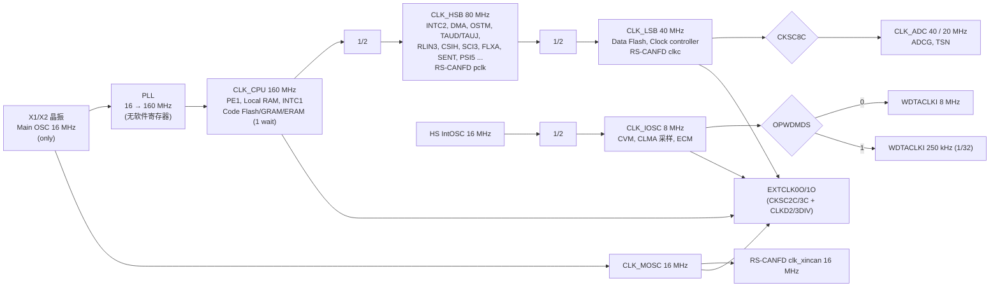
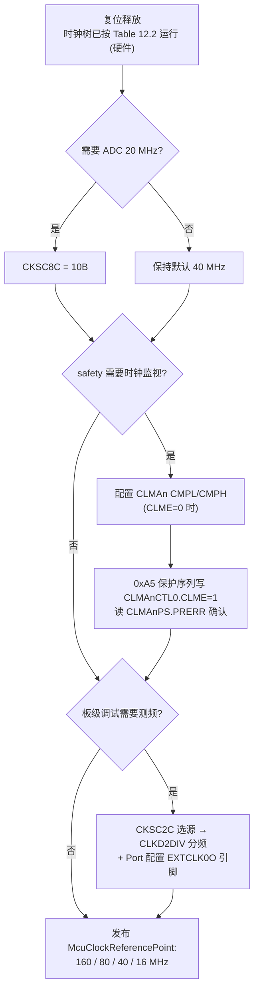
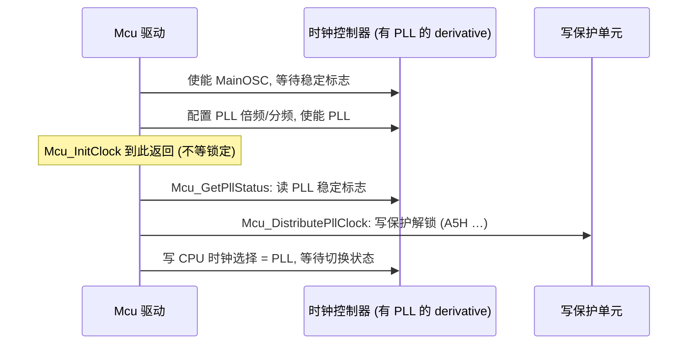

# 时钟系统：P1M-E 的固定时钟树、外设时钟与时钟监视

> Prerequisite: [04-startup-process.md](04-startup-process.md), [06-interrupt-exception.md](06-interrupt-exception.md)
> Next: [08-peripheral-overview.md](08-peripheral-overview.md)；CAN 位时间见 [../04-can-mcal/03-can-clock-bit-timing.md](../04-can-mcal/03-can-clock-bit-timing.md)；Mcu 驱动见 [../03-mcal/02-mcu-driver.md](../03-mcal/02-mcu-driver.md)
> 对应规范: HW-E §12 Clock Controller p.468–483、§17.1.3 p.791（CAN 时钟）、§22.1.3 p.1543 与 §22.2.3 p.1547–1548（OSTM 时钟）、§31.5 CLMA p.2752–2766、§37.6 p.2905（PLL 特性）、p.2884（OPWDMDS）；HW-X（P1x 非 E）p.257–261（仅作对照）；SWS-MCU **R24-11** p.16（`SWS_Mcu_00248`）、p.26–29（InitClock/DistributePllClock/GetPllStatus）、p.36（示例序列）、p.40–41（`McuInitClock`/`McuNoPll`）；SWS-CAN **R22-11** p.112（`CanCpuClockRef`）
> 对应源码: openAUTOSAR `system/EcuM/src/EcuM_Callout_Stubs.c:193-204`、`boards/linuxOs/MCAL/Mcu/src/Mcu.c:382-425`；本项目 `examples/rh850_mcal_reference/mcal/gpt/Ostm.c`（周期换算）、`mcal/can/Can_BitTiming.c`（fCAN 选择）
> 事实底稿: [04-rh850-hardware-notes.md](../reference/research/04-rh850-hardware-notes.md) §4

---

## 1. 本章目标

1. 画出 P1M-E 的时钟树：**MainOSC 16 MHz → PLL → CLK_CPU 160 MHz / CLK_HSB 80 MHz / CLK_LSB 40 MHz**，以及 IOSC、WDTA、ADC 时钟。
2. 知道每个外设用哪个时钟：OSTM 用 80 MHz、RS-CANFD 位时间用 **40 MHz（clkc）或 16 MHz（clk_xincan）而不是 80 MHz**、WDTA 用 8 MHz/250 kHz。
3. 理解 **P1M-E 没有软件可编程 PLL**，因此 `Mcu_InitClock / Mcu_GetPllStatus / Mcu_DistributePllClock` 如何退化，以及与有 PLL 的 derivative 的区别。
4. 会配置和计算 **CLMA 时钟监视**，并掌握 `0xA5` 四步保护写序列（HW-E p.2764）。
5. 会用 EXTCLK 输出在板上测量时钟，用于调试“波特率不对”“定时器周期不对”。

---

## 2. 为什么需要关心时钟？

时钟错误的症状往往出现在离时钟很远的地方：

| 症状 | 实际原因 |
|---|---|
| CAN 能发但对方收不到 / 全是 error frame | 位时间按 80 MHz 计算，实际 fCAN 是 40 MHz |
| OS tick 比预期慢一半 | OSTM 的计数时钟被改成了 TAUD/TAUJ 提供的计数使能，而不是 PCLK |
| 看门狗比预期早复位 | OPWDMDS 选的是 8 MHz，而计算按 250 kHz |
| CanTp/DCM 超时时间不对 | OS counter 的 tick 换算错误 |
| 偶发复位，RESF 显示 ECM 复位 | CLMA 阈值设置过紧，正常频偏也报错 |

AUTOSAR 层面，时钟频率通过 `McuClockReferencePoint` 发布给其他驱动（`SWS_Mcu_00248`，SWS-MCU p.16），Can 驱动通过 `CanCpuClockRef` 引用它计算位时间（SWS-CAN p.112）。所以一个错误的时钟参考点，会通过配置传遍所有用到它的驱动。

---

## 3. 在系统中的位置：P1M-E 时钟树

[RH850 Hardware] 依据 HW-E Table 12.2/12.3（p.469）、Figure 12.1（p.470）、Table 17.6（p.791）：



| 时钟 | 频率 | 来源 | 主要用户 | 出处 |
|---|---|---|---|---|
| CLK_CPU | 160 MHz | PLL 输出 | PE1、Local RAM、INTC1；Code Flash/GRAM/ERAM 按 80 MHz 1 wait | HW-E p.469 |
| CLK_HSB | 80 MHz | CPU/2（框图） | INTC2、DMAC、DTS、DCRA、PIC、CSIG、CSIH、SCI、FLXA、SENT、PSI5、RLIN、TAUD、TAUJ、TSG3、ENCA、TAPA、TPBA、**OSTM** | HW-E p.469 |
| CLK_LSB | 40 MHz | HSB/2（框图） | Data Flash（from 4 cycle）、**RS-CANFD**、Clock controller | HW-E p.469 |
| CLK_IOSC | 8 MHz | HS IntOSC/2 | CVM、CLMA（monitor clock）、ECM delay timer | HW-E p.469 |
| WDTACLKI | 8 MHz / 250 kHz | CLK_IOSC 的 1/1 或 1/32，由 Flash option OPWDMDS 选择 | WDTA | HW-E p.469、p.2884 |
| CLK_MOSC | 16 MHz | Main OSC | RS-CANFD（xin） | HW-E p.469 |
| CLK_ADC | 40 / 20 MHz | CKSC8C 选择 | ADCG、TSN | HW-E p.469、p.480 |
| EXTCLK0O/1O | 1/1–1/1023，最大 20 MHz | CKSC2C/3C 选源 | 外部引脚 | HW-E p.469 |

HS IntOSC 典型频率 16 MHz（最小 15.44、最大 16.56 MHz，HW-E §37 电气特性）。PLL 特性：输入 16 MHz、输出 160 MHz（HW-E p.2905）。

---

## 4. AUTOSAR 如何定义时钟？

[AUTOSAR Standard] SWS-MCU R24-11：

| 要求 / 参数 | 内容 | 页 |
|---|---|---|
| `SWS_Mcu_00248` | 提供使能并设置 MCU 时钟（CPU 时钟、外设时钟、预分频、倍频）的服务；所有外设时钟通过 `McuClockReferencePoint` 发布 | p.16 |
| `McuClockSettingConfig` / `McuClockSettingId` | 一组时钟设置，作为 `Mcu_InitClock()` 的参数 | p.42–43 |
| `McuClockReferencePoint` / `McuClockReferencePointFrequency` | 发布给其他模块的时钟频率（Hz） | p.49–50 |
| `McuInitClock`（ECUC_Mcu_00182） | FALSE 时 MCU 驱动不做时钟初始化（例如 bootloader 已初始化、寄存器只能写一次） | p.40 |
| `McuNoPll`（ECUC_Mcu_00180） | TRUE：硬件无 PLL 或上电自动启用 PLL；禁用 `Mcu_DistributePllClock`，`Mcu_GetPllStatus` 返回 `MCU_PLL_STATUS_UNDEFINED` | p.41 |
| `MCU_E_CLOCK_FAILURE` | 扩展生产错误（时钟失效），`SWS_Mcu_00053`；若时钟失效由 trap 等其他硬件机制检测，应关闭该通知并在 MCU 驱动外处理 | p.18–19 |

[AUTOSAR API] 三个时钟 API（详细行为见第 04 章 §8.2）：

| API | 签名（R24-11） | 关键语义 |
|---|---|---|
| `Mcu_InitClock` | `Std_ReturnType Mcu_InitClock(Mcu_ClockType ClockSetting)` | 启动 PLL 锁定后**立即返回**（`SWS_Mcu_00138`） |
| `Mcu_GetPllStatus` | `Mcu_PllStatusType Mcu_GetPllStatus(void)` | LOCKED / UNLOCKED / **UNDEFINED**（Init 前或 McuNoPll） |
| `Mcu_DistributePllClock` | `Std_ReturnType Mcu_DistributePllClock(void)` | 未锁定返回 `E_NOT_OK`（`SWS_Mcu_00142`） |

[AUTOSAR Standard] 消费者：Can 驱动的 `CanCpuClockRef` 是对 `McuClockReferencePoint` 的引用（SWS-CAN R22-11 p.112），Can 配置工具用它和位时间参数计算 BRP。

---

## 5. 核心数据结构：P1M-E 时钟控制器寄存器

[RH850 Hardware] HW-E Table 12.4（p.471）——**这就是全部**：

| 地址 | 寄存器 | 作用 | 复位值 |
|---|---|---|---|
| `FFF8_8810H` | CLKD2DIV | EXTCLK0O 分频（0 = 停止，1–1023） | `0000_0000H` |
| `FFF8_8814H` | CLKD2STAT | 分频器 2 状态 | `0000_0002H` |
| `FFF8_8818H` | CLKD3DIV | EXTCLK1O 分频 | `0000_0000H` |
| `FFF8_881CH` | CLKD3STAT | 分频器 3 状态 | `0000_0002H` |
| `FFF8_9080H` | CKSC2C | EXTCLK0O 源选择 | `0000_0004H` |
| `FFF8_9088H` | CKSC2S | 选择器 2 状态 | `0000_0004H` |
| `FFF8_90C0H` | CKSC3C | EXTCLK1O 源选择 | `0000_0004H` |
| `FFF8_90C8H` | CKSC3S | 选择器 3 状态 | `0000_0004H` |
| `FFF8_9110H` | CKSC8C | ADC 时钟：`01B` = CLK_LSB 40 MHz（默认），`10B` = CLK_LSB/2 20 MHz，`11B` 禁止 | `0000_0002H` |
| `FFF8_9114H` | CKSC8S | 选择器 8 状态 | `0000_0003H` |

写保护：这些寄存器“can be protected from inadvertent write access … by configuration of the Slave Guards”（HW-E p.471 §12.3.1）——**不是 PROTCMD 式命令寄存器**。HW-E 全文 grep `PROTCMD`、`PROTS[0-9]`、`PLLE` 都是 0 结果（[01-project-and-docs-review.md](../reference/research/01-project-and-docs-review.md) F-CLK-2、F-SYS-2）。

> **结论**：P1M-E 上**没有** PLL 使能寄存器、没有 PLL 锁定状态寄存器、没有 CPU 时钟源选择寄存器。CPU/HSB/LSB 频率按 Table 12.2 固定。PLL 由谁、何时锁定，手册没有给出软件步骤，**需根据实际芯片手册/启动代码确认**——教学上的合理推断是由硬件在复位序列中完成。

---

## 6. 初始化流程

### 6.1 P1M-E 上真正需要的时钟初始化



这些动作分别属于：CKSC8C（Mcu 或 Adc 驱动，按寄存器归属规则，多模块共享的非 I/O 寄存器归 Mcu，SWS-MCU p.25）；CLMA（Mcu 或 safety 模块，需项目确认）；EXTCLK（仅调试用）。

### 6.2 CLMA 时钟监视

[RH850 Hardware] 四个监视器（HW-E Table 31.181，p.2752），复位后均为 **Disabled**，错误上报 ECM：

| 监视器 | 被监视时钟（CLMATMON） | 采样时钟（CLMATSMP） | ECM error factor（上限/下限） |
|---|---|---|---|
| CLMA0 | Main OSC 16 MHz | CLK_IOSC/2 = 4 MHz | #8 / #9 |
| CLMA1 | CLK_LSB/2 = 20 MHz | Main OSC/8 = 2 MHz | #12 / #13 |
| CLMA2 | WDTA 计数时钟（8 MHz 或 250 kHz，由 OPWDMDS 决定） | Main OSC/256 = 62.5 kHz | #10 / #11 |
| CLMA3 | CLK_CPU 160 MHz | Main OSC/4 = 4 MHz | #14 / #15 |

工作原理（HW-E p.2754）：在 **16 个采样时钟周期** 内数被监视时钟的上升沿个数，与 CLMAnCMPL（下限）和 CLMAnCMPH（上限）比较，越界即通知 ECM。注意 Note 1：被监视时钟**完全停止**时可能检测不到。

寄存器（基址 CLMA0–3 = `FFF8_3100H` / `3200H` / `3300H` / `3400H`，HW-E p.2757）：

| 偏移 | 寄存器 | 宽度 | 复位值 | 要点 |
|---|---|---|---|---|
| +00H | CLMAnCTL0 | 8 | 00H | bit0 CLME 使能；**受保护**，需 `0xA5` 序列；**只能由复位清 0** |
| +08H | CLMAnCMPL | 16 | 0001H | 下限 [11:0]；只能在 CLME=0 时写 |
| +0CH | CLMAnCMPH | 16 | 03FFH | 上限 [11:0]；只能在 CLME=0 时写；最小值 CMPL + 3 |
| +10H | CLMAnPCMD | 8 | 00H | 保护命令寄存器（只写） |
| +14H | CLMAnPS | 8 | 00H | bit0 PRERR：1 = 保护写失败 |

手册推荐值（HW-E p.2760）：

```text
CMPL = fCLMATMON(min) × 16 / fCLMATSMP(max) − 1
CMPH = fCLMATMON(max) × 16 / fCLMATSMP(min) + 1
```

[推导] 理想计数（不含容差）：

| 监视器 | 理想计数 = fMON × 16 / fSMP |
|---|---|
| CLMA0 | 16 MHz × 16 / 4 MHz = **64** |
| CLMA1 | 20 MHz × 16 / 2 MHz = **160** |
| CLMA2（8 MHz） | 8 MHz × 16 / 62.5 kHz = **2048** |
| CLMA2（250 kHz） | 250 kHz × 16 / 62.5 kHz = **64** |
| CLMA3 | 160 MHz × 16 / 4 MHz = **640** |

实际的 min/max 必须代入晶振精度和 IOSC 的频率偏差（例如 HS IntOSC 15.44–16.56 MHz）。以 CLMA3 为例，采样时钟来自 Main OSC，被监视时钟也来自 Main OSC（经 PLL），两者同源，理想计数恒为 640；但 CLMA0 用 IOSC 采样 MainOSC，IOSC 的 ±3.5% 偏差直接决定阈值宽度。**阈值必须由 safety 需求和电气特性共同决定，以上只是教学计算**。

### 6.3 `0xA5` 保护写序列（HW-E p.2764）

[RH850 Hardware]

```text
Step 1. CLMAnPCMD ← A5H                         （固定值）
Step 2. CLMAnCTL0 ← 设定值                      （保留位写复位值）
Step 3. CLMAnCTL0 ← ~设定值                     （保留位写复位值的反码）
Step 4. CLMAnCTL0 ← 设定值
（推荐）读 CLMAnPS.CLMAnPRERR：0 = 成功
```

规则：

- 序列没按要求完成 → 不写入，PRERR=1，**需要从头重来**；
- 序列中途写**同一模块**的其他寄存器（包括被中断打断、中断处理里访问了该模块）→ 失败，PRERR=1；
- 序列中途写**其他模块**的寄存器 → 不影响；读操作也不影响。

所以典型实现会在序列前后关中断：

```c
/* [Conceptual] 教学伪代码 —— 非 production code；依据 HW-E p.2757, p.2759, p.2764 */
#define CLMA_BASE(n)   (0xFFF83100u + 0x100u * (n))
#define CLMA_CTL0(n)   (CLMA_BASE(n) + 0x00u)
#define CLMA_CMPL(n)   (CLMA_BASE(n) + 0x08u)
#define CLMA_CMPH(n)   (CLMA_BASE(n) + 0x0Cu)
#define CLMA_PCMD(n)   (CLMA_BASE(n) + 0x10u)
#define CLMA_PS(n)     (CLMA_BASE(n) + 0x14u)

Std_ReturnType Clma_Conceptual_Enable(uint8 n, uint16 cmpl, uint16 cmph)
{
    Std_ReturnType ret;
    RH850_WRITE16(CLMA_CMPL(n), cmpl);          /* 只能在 CLME=0 时写 (p.2760) */
    RH850_WRITE16(CLMA_CMPH(n), cmph);          /* cmph >= cmpl + 3 */

    SuspendAllInterrupts();                     /* 防止中断访问同一模块导致 PRERR */
    RH850_WRITE8(CLMA_PCMD(n), 0xA5u);          /* Step 1 */
    RH850_WRITE8(CLMA_CTL0(n), 0x01u);          /* Step 2: CLME=1, 保留位写 0 */
    RH850_WRITE8(CLMA_CTL0(n), 0xFEu);          /* Step 3: 按位取反 */
    RH850_WRITE8(CLMA_CTL0(n), 0x01u);          /* Step 4 */
    ret = ((RH850_READ8(CLMA_PS(n)) & 0x01u) == 0u) ? E_OK : E_NOT_OK;
    ResumeAllInterrupts();
    return ret;   /* 失败需从 Step 1 重来；CLME 一旦为 1 只能由复位清除 (p.2759) */
}
```

CLMA 还支持自诊断：通过 CLMATEST 故意设置会出错的阈值、屏蔽 ECM 通知、读 CLMATESTS 确认能检测错误，最多需要两个采样周期（HW-E p.2756 §31.5.2.3）。

> P1M-E 上**确实使用 `0xA5` 解锁序列**的只有 CLMAnCTL0、ECM 寄存器（ECMPCMD1/ECMmPCMD0，HW-E p.2795）和 FLMDCNT（HW-E p.2870–2871）。它的形式与 P1x 的 PROT1PHCMD 很像，但**保护对象完全不同**——不要因此认为 P1M-E 的时钟选择寄存器也需要 `0xA5`。

---

## 7. Runtime Flow：外设如何“消费”时钟

### 7.1 RS-CANFD 的三个时钟

[RH850 Hardware] HW-E Table 17.6/17.7（p.791）：

| 时钟 | 来源 | 频率 | 用途 |
|---|---|---|---|
| pclk | CLK_HSB | 80 MHz（fixed） | **寄存器接口时钟**，不用于位时间 |
| clkc | CLK_LSB | 40 MHz（fixed） | 位时间时钟候选（GCFG.DCS=0） |
| clk_xincan | CLK_MOSC | 16 MHz（fixed） | 位时间时钟候选（GCFG.DCS=1）；**传输速率 > 2 Mbps 时不要选** |

位时间：`bitrate = fCAN / ((BRP+1) × 每位 Tq 数)`（HW-E p.794、p.1094）。手册示例 fCAN = 40 MHz、500 kbps 可取 8 Tq（分频 10）或 20 Tq（分频 4）（HW-E p.1095）。

[推导] 用 80 MHz 算 500 kbps / 20 Tq 会得到分频 8；但实际 fCAN 是 40 MHz，结果就是 **250 kbps**——与总线上其他节点完全无法通信。这就是“CAN 能配置成功、能进入 communication 模式、但只有 error frame”的典型原因。

本项目 `examples/rh850_mcal_reference/mcal/can/Can_BitTiming.c` 把 fCAN 选择（40/16 MHz）作为显式输入，并检查两阶段 BRP 相同、TDC prescaler 限制；40 MHz 下 FD nominal 500k → NCFG=`0x071E1801`、data 1M → DCFG=`0x023E0001`（[01-project-and-docs-review.md](../reference/research/01-project-and-docs-review.md) F-CAN-5，主机测试覆盖）。

### 7.2 OSTM 的计数时钟

[RH850 Hardware] OSTM 的计数时钟是 PCLK = CLK_HSB = 80 MHz（HW-E p.1543）。OSTM0/1 还可以通过 IC0CKSEL0/1（`FFDD_6000H` / `FFDD_6004H`，16 位）改用 TAUD/TAUJ 提供的计数使能信号，切换必须在定时器停止时进行（HW-E p.1547–1548）；IC0TMEN=0 时直接使用 PCLK（[rh850-hardware-handoff.md](../rh850-hardware-handoff.md) §12）。

[推导] interval 模式周期 = `(CMP + 1) / f`：80 MHz 下 1 ms → CMP = 79999 = `0x0001387F`；32 位自由运行计数在 80 MHz 下 53.6870912 s 回绕。本项目 `Ostm.c` 的 `Ostm_IntervalCompare(counter_hz, period_us, &compare)` 实现了这个换算，并检查整除与溢出。

> [Real Project Consideration] 截图中出现过 “CK0 / 20 MHz” 的 OSTM 时钟描述。从名字**不能**确认它就是 PCLK/4；要读 IC0CKSELn 和 TAUD/TAUJ 预分频配置才能确定（[agent-guide.md](../agent-guide.md) A3）。

### 7.3 WDTA 与 ADC

- WDTA：计数时钟 8 MHz 或 250 kHz（OPWDMDS），溢出 `2^(9+OVF) / WDTATCKI`（HW-E p.2884）。注意它来自**内部振荡器**，与 MainOSC/PLL 无关——这正是看门狗作为“独立监视者”的意义。
- ADC：CKSC8C 选 40 或 20 MHz（HW-E p.480）。

---

## 8. RH850 Hardware Mapping：P1M-E vs 有 PLL 的 derivative

### 8.1 Mcu 时钟 API 在 P1M-E 上的退化

[Real Project Consideration] 规范允许的形态（真实 Renesas P1M-E MCAL 的具体实现**需要在真实项目中确认**）：

| AUTOSAR 元素 | 有软件 PLL 的芯片 | P1M-E |
|---|---|---|
| `McuNoPll` | FALSE | 很可能 TRUE（PLL 由硬件自动启用） |
| `McuInitClock` | TRUE | TRUE（只设 CKSC8C 等）或 FALSE |
| `Mcu_InitClock()` | 使能 OSC、配置并启动 PLL，立即返回 | 几乎空；可能只写 CKSC8C |
| `Mcu_GetPllStatus()` | 读锁定位，UNLOCKED → LOCKED | McuNoPll=TRUE 时恒 `MCU_PLL_STATUS_UNDEFINED`（`SWS_Mcu_00206`） |
| `Mcu_DistributePllClock()` | 受保护写切换 CPU 时钟源 | 禁用（`ECUC_Mcu_00180`） |
| `McuClockReferencePoint` | 160/80/40… 视配置 | 固定：CPU 160 MHz、HSB 80 MHz、LSB 40 MHz、MOSC 16 MHz |
| 时钟失效检测 | 视芯片 | CLMA0–3 → ECM；`MCU_E_CLOCK_FAILURE` 可能关闭，改由 ECM/safety 处理（`SWS_Mcu_00053` 的说明，SWS-MCU p.18–19） |
| EcuM 中的“等待 LOCKED”循环 | 必需 | **必须避免**：会死循环（第 04 章 §8.4，openAUTOSAR `EcuM_Callout_Stubs.c:200`） |

### 8.2 [Conceptual] 有 PLL 的 RH850 上的典型序列

对照：P1x（非 E）硬件手册中可以看到时钟选择寄存器 CKSC0CTL（`FFF8_9080H`）和写保护命令寄存器 PROT1PHCMD（`FFF8_B000H`），写保护序列以 `PROT1PHCMD = A5H` 开始（HW-X p.257–261；文本行 `PROT1PHCMD = A5H`）。在这类芯片上，`Mcu_InitClock` / `Mcu_DistributePllClock` 的内部大致是：



**以上寄存器在 P1M-E 上不存在**。F1x、U2A 等其他系列的时钟寄存器、保护机制、锁定流程，均**需根据实际芯片手册确认**；不要把任何一个系列的 MOSC/PLL 启动代码搬到另一个系列。

---

## 9. openAUTOSAR 实现

`boards/linuxOs/MCAL/Mcu/src/Mcu.c`（STM32/PowerPC 遗留代码，与 RH850 无关）：

- `Mcu_InitClock` `:382`；
- `Mcu_DistributePllClock` `:400`：返回 `void`（R3.x 签名，R24-11 为 `Std_ReturnType`），函数体注释 “NOT IMPLEMENTED due to pointless function on this hardware”，PLL 锁定检查（`FMPLL.SYNSR.B.LOCK`）被注释掉；
- `Mcu_GetPllStatus` `:412` 起：读 STM32 的 `RCC->CR & RCC_CR_PLLRDY`，模拟器下恒返回 LOCKED。

再加上 `EcuM_Callout_Stubs.c:200` 的 `while (Mcu_GetPllStatus() != MCU_PLL_LOCKED)`，它说明了一个设计耦合：**EcuM 的启动代码假设“一定有 PLL 且一定会锁定”**。移植到 P1M-E 时必须同时修改 Mcu 配置（McuNoPll）和 EcuM 的等待逻辑。

---

## 10. 当前教学项目实现

[Educational Implementation]

| 文件 | 与时钟相关的部分 | 局限 |
|---|---|---|
| `mcal/gpt/Ostm.c` | `Ostm_InitPclk` 把 OSTM0/1 配为 PCLK（IC0CKSEL=0）；`Ostm_IntervalCompare` 做周期换算 | 不支持 TAUD/TAUJ 计数使能时钟 |
| `mcal/can/Can_BitTiming.c` | 位时间计算以 fCAN（40/16 MHz）为输入，拒绝无效组合 | 只做算术，不写寄存器 |
| `integration/Tick_Accumulator.c` | 80 MHz 原始计数 → 1 ms tick，保留余数，处理 32 位回绕 | 需要采样间隔 < 回绕周期 |

这些代码都把“时钟频率”当作**显式参数**而不是硬编码常量——这正对应 AUTOSAR 的 `McuClockReferencePoint` 思想：频率由一个地方发布，所有消费者引用它。

---

## 11. Code Walkthrough：用 EXTCLK0O 测量 CLK_LSB

[Conceptual] 板级调试时最可靠的方法是把内部时钟送到引脚上用示波器/频率计测。依据 HW-E p.472–477（[rh850-hardware-handoff.md](../rh850-hardware-handoff.md) §2）：

```c
/* [Conceptual] 教学伪代码 —— 非 production code */
#define CLKD2DIV   0xFFF88810u
#define CLKD2STAT  0xFFF88814u
#define CKSC2C     0xFFF89080u

void ExtClk0_Conceptual_OutputLsbDiv4(void)
{
    /* 1. 切换源之前：DIV 必须为 0（停止输出），且 STAT = 0x2 */
    RH850_WRITE32(CLKD2DIV, 0u);
    while (RH850_READ32(CLKD2STAT) != 0x2u) { /* 真实代码需要超时 */ }

    /* 2. 选择源：3 = MainOSC, 4 = CLK_LSB, 5 = CLK_CPU, 6 = CLK_IOSC (HW-E p.476) */
    RH850_WRITE32(CKSC2C, 4u);

    /* 3. 设置分频：40 MHz / 4 = 10 MHz (< 20 MHz 上限, HW-E p.469) */
    RH850_WRITE32(CLKD2DIV, 4u);
    /* 改分频前需等待同步位 (HW-E p.472)，此处省略 */

    /* 4. 还需 Port 驱动把 EXTCLK0O 所在引脚配置为对应 ALT 功能 —— 否则引脚上什么也没有 */
}
```

测到 10 MHz → CLK_LSB 正确 → CAN clkc = 40 MHz 可信；测到其他值 → 回头查晶振和复位状态。

---

## 12. Debug 方法

| 症状 | 检查顺序 |
|---|---|
| CAN 波特率不对 | 1) GCFG.DCS 是 0 还是 1；2) BRP 按 40 或 16 MHz 计算；3) 读回 CmCFG/NCFG/DCFG 反算；4) EXTCLK 测 CLK_LSB；5) 示波器量位宽 |
| OS tick / Gpt 周期不对 | 1) IC0CKSELn 是否为 PCLK；2) CMP 是否按 `(CMP+1)/f`；3) 时钟参考点配置是否为 80 MHz |
| 看门狗复位时间不符 | OPBT0.OPWDMDS / OPWDOVF；CLMA2 是否报错 |
| 偶发 ECM 复位/FENMI | ECM 错误源是否为 CLMA（factor #8–#15）；阈值是否过紧；CLMA0 的 IOSC 偏差 |
| 卡在 EcuM_Init | 是否等待 `MCU_PLL_LOCKED`（McuNoPll=TRUE 时永远 UNDEFINED） |
| CLMA 使能“没生效” | CLMAnPS.PRERR=1？序列中是否被中断打断/访问了同模块寄存器？ |

---

## 13. 常见问题

| 问题 | 回答 |
|---|---|
| P1M-E 能把 CPU 降频省电吗？ | HW-E §12 没有 CPU 时钟选择寄存器；不存在软件降频路径（SNOOZE 指令可暂停 CPU 32 个时钟周期，HW-E p.189） |
| 能换 20 MHz 晶振吗？ | 不能：“Main OSC = 16 MHz only”（DS-E p.2） |
| CAN 应选 40 MHz 还是 16 MHz？ | 数据速率 > 2 Mbps 时只能选 40 MHz（HW-E p.791）；16 MHz 直接来自晶振，抖动特性可能更好，具体由网络时序要求决定 |
| CLMA 使能后能关掉吗？ | 不能，CLME 只能由复位清 0（HW-E p.2759） |
| 时钟寄存器有写保护吗？ | 通过 Slave Guard 配置保护（HW-E p.471 §12.3.1 原文写 “Slave Guards”，未指名具体是哪一个 guard；PBG/HBG 是 slave guard 的两种，§31.4.1.2），不是 0xA5 命令序列。注意：“P-Bus Guard”字样出现在复位寄存器一节（HW-E p.420），不要混用 |

---

## 14. 实验

**实验 1：时钟树默写。** 画出时钟树，标出每个外设的时钟，并标注页码。

**实验 2：CAN 位时间。** 用 `Can_BitTiming.c` 的 API（或手算）分别在 fCAN = 40 MHz 和 16 MHz 下求 500 kbps、采样点 80% 的 Classical 参数；再故意用 80 MHz 算一次，计算若把这组参数写进 40 MHz 的硬件，实际波特率是多少。

**实验 3：CLMA 阈值。** 假设 MainOSC 精度 ±0.5%，HS IntOSC 15.44–16.56 MHz，按 HW-E p.2760 的推荐公式计算 CLMA0 和 CLMA3 的 CMPL/CMPH。为什么 CLMA3 的窗口可以比 CLMA0 窄得多？

**实验 4：OSTM 周期。** 用 `Ostm_IntervalCompare(80000000u, 1000u, &cmp)` 验证 1 ms 的 CMP；再计算 10 ms、100 µs 的值，并说明为什么某些周期在 80 MHz 下不能整除。

---

## 15. 思考题

1. 为什么 WDTA 和 CLMA 采样使用内部振荡器（IOSC）而不是 MainOSC/PLL？如果晶振失效，哪些模块还能工作？
2. CLMA 文档说时钟“完全停止”时可能检测不到。有哪些其他机制能覆盖这种失效？（提示：看门狗、lock-step。）
3. 既然 P1M-E 的 `Mcu_InitClock` 几乎为空，为什么 AUTOSAR 配置里仍然要正确填写 `McuClockReferencePoint`？
4. 如果一个 MCAL 包同时支持 P1M（有 PLL 寄存器）和 P1M-E，你预计它的 Mcu 配置界面会有哪些差异？

---

## 16. 对未来真实项目的意义

```text
进入真实 RH850 项目后：
1. 确认芯片型号与晶振频率（P1M-E 只能 16 MHz）
2. 打开 Mcu 配置：McuNoPll、McuInitClock、McuClockSettingConfig、McuClockReferencePoint 的每个频率
3. 打开 EcuM 生成代码/callout：确认没有“while != LOCKED”的无条件等待
4. 打开 Can 配置：CanCpuClockRef 指向哪个参考点（应对应 40 或 16 MHz，而非 80 MHz）；读 GCFG.DCS
5. 打开 Gpt/Os counter 配置：OSTM 时钟源（PCLK 还是 TAUx 计数使能）与 tick 换算
6. 读 OPBT0：WDTA 时钟与溢出
7. 找到 CLMA/ECM 配置的归属（Mcu、safety 模块还是启动代码），记录阈值与 ECM 路由
8. 需要时用 EXTCLK0O/1O 在板上实测
```

具体实现和配置值都**需要在真实项目环境中确认**；本章提供核对依据与计算方法。

---

## 17. 本章总结

- P1M-E：MainOSC 16 MHz → PLL → CPU 160 / HSB 80 / LSB 40 MHz，固定；IOSC 8 MHz；WDTA 8 MHz/250 kHz；ADC 40/20 MHz。
- 时钟控制器只有 EXTCLK 输出和 ADC 时钟选择寄存器；没有 PLL/CPU 时钟寄存器，没有 PROTCMD；保护靠 Slave Guard。
- RS-CANFD：pclk 80 MHz 只是接口时钟；位时间用 clkc 40 MHz 或 clk_xincan 16 MHz（GCFG.DCS），>2 Mbps 不能用 16 MHz。
- OSTM 用 PCLK 80 MHz（或 TAUx 计数使能）。
- CLMA0–3 监视 MainOSC/LSB/WDTA 时钟/CPU，16 个采样周期计数比较，错误进 ECM；CLMAnCTL0 用 `0xA5` 四步序列写入。
- `McuNoPll=TRUE` 时 `Mcu_GetPllStatus` 恒为 UNDEFINED，EcuM 不能等待 LOCKED。

## 18. 下一章

[08-peripheral-overview.md](08-peripheral-overview.md)：把 Port、OSTM、TAUD/TAUJ、RS-CANFD、ADCG、WDTA、Flash 逐一映射到 MCAL 驱动和 AUTOSAR API。
