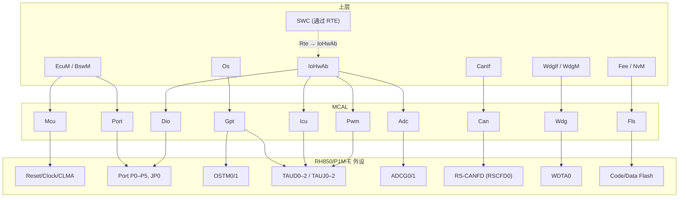
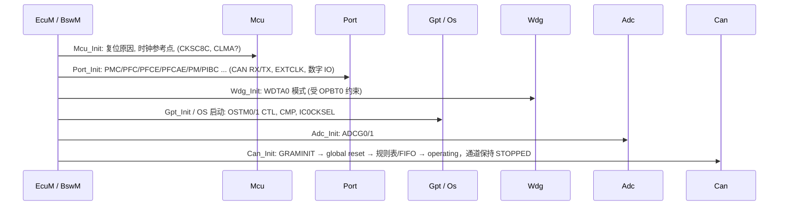

# 外设总览：RH850 寄存器 → MCAL 驱动 → AUTOSAR API

> Prerequisite: [01-rh850-overview.md](01-rh850-overview.md), [06-interrupt-exception.md](06-interrupt-exception.md), [07-clock-system.md](07-clock-system.md)
> Next: Part II [../02-autosar-classic/01-classic-platform-overview.md](../02-autosar-classic/01-classic-platform-overview.md)；Part III [../03-mcal/01-mcal-overview.md](../03-mcal/01-mcal-overview.md)；CAN 硬件深入见 [../04-can-mcal/02-rh850-can-peripheral.md](../04-can-mcal/02-rh850-can-peripheral.md)
> 对应规范: HW-E §2 Port p.68–186（基址 p.91、寄存器 p.94–131）、§8 Reset p.418、§17 RS-CANFD p.788–1123、§21 WDTA p.1522–1541、§22 OSTM p.1542–1570、§23 TAUD p.1571、§24 TAUJ p.1878、§30 ADCG p.2427、§35 Flash p.2857；DS-E p.2–3；SWS-MCU **R24-11**、SWS-CAN **R22-11**、SWS-IoHwAb **R24-11**。**本仓库没有 Port/Dio/Gpt/Icu/Adc/Wdg/Fls 的 SWS**
> 对应源码: 本项目 `examples/rh850_mcal_reference/`（`platform/Rh850_Mmio.*`、`mcal/gpt/Ostm.*`、`mcal/can/Can_BitTiming.*`）；openAUTOSAR 无 RH850 MCAL（`boards/linuxOs/MCAL/*` 为 STM32/MPC5xxx 遗留）
> 事实底稿: [04-rh850-hardware-notes.md](../reference/research/04-rh850-hardware-notes.md) §6–§9；[mcal-reference-guide.md](../mcal-reference-guide.md)

---

## 1. 本章目标

1. 对 P1M-E 的每个关键外设，说出：它是什么、基址、关键寄存器、中断、时钟，以及**对应哪一个 MCAL 驱动**。
2. 理解 “**RH850 register → MCAL driver → AUTOSAR API → 上层调用者**” 这条抽象链，以及 MCAL 到底“隐藏”了什么。
3. 理解 MCAL 的寄存器归属规则（谁初始化共享寄存器），以及“一个硬件资源只能有一个 owner”的集成原则。
4. 为 Part III（MCAL）和 Part IV（CAN MCAL）建立索引：每个外设在后续哪一章深入。

---

## 2. 为什么需要 MCAL？

如果没有 MCAL，CanIf 想发一帧 CAN，就得自己写：

```c
/* 没有 MCAL 时的样子（[Conceptual]）：上层直接碰 RS-CANFD 寄存器 */
*(volatile uint32*)(0xFFD20000u + 0x1000u + 0x10u * p) = id;      /* TMIDp, Classical mode */
*(volatile uint32*)(0xFFD20000u + 0x1004u + 0x10u * p) = dlc << 28; /* TMPTRp */
/* ... TMDF0/1_p ... */
*(volatile uint8 *)(0xFFD20000u + 0x0250u + p) = 0x01u;            /* TMCp: TMTR=1, 8 位访问 */
```

问题是：

- 换成 FD 模式，TMIDp 偏移从 `+1000H` 变为 `+4000H + 20H×p`（HW-E p.916–919）；换成 P1x-C，整个 IP 变成 MCAN。
- 上层必须知道 buffer 编号 p 与通道 m 的关系（`16m … 16m+15`，HW-E p.800）、8 位访问宽度、发送前要检查 TMTRM=0……
- 每个上层模块都可能各写一套，互相冲突。

MCAL 把这些统一收进一个驱动，对上提供标准 API：

```text
CanIf_Transmit(PduId, PduInfo)
   └─> Can_Write(Hth, PduInfo)            [AUTOSAR API, SWS-CAN R22-11, SWS_Can_00233]
          └─> HTH → (通道 m, TX buffer p) 映射表   [MCAL 生成配置]
                 └─> TMIDp / TMPTRp / TMDF0_p / TMDF1_p / TMCp   [RH850 Hardware]
```

上层只知道 “Hth = 3”；“3 号 HTH 是 CAN0 的 TX buffer 2，Classical 模式，寄存器在哪”全部封装在 Can 驱动和它的生成配置中。

---

## 3. 在系统中的位置



注意：**OS 的 tick 硬件**可能直接由 OS port 驱动 OSTM（不经过 Gpt），也可能经 Gpt——这是配置选择（OSTM0/OSTM1 在不同文档中的归属不一致，**是配置选择不是硬件事实**）。

---

## 4. AUTOSAR 如何定义 MCAL 的边界？

[AUTOSAR Standard]

1. **MCAL 直接访问硬件**：SWS-MCU 自述 MCU 驱动 “直接访问硬件，位于 MCAL”（SWS-MCU R24-11 p.9）；SWS-CAN 解释了 Can 属于 MCAL 而 CanIf 不属于（见 [02-autosar-sws-notes.md](../reference/research/02-autosar-sws-notes.md) §2.2）。
2. **寄存器初始化归属**（`SWS_Mcu_00116/00244–00247`，SWS-MCU p.25；`SWS_Can_00407`，SWS-CAN p.43）：
   - 只被一个外设用的寄存器 → 该外设驱动；
   - 影响多个外设的 **I/O** 寄存器 → **Port**；
   - 影响多个外设的**非 I/O** 寄存器 → **Mcu**；
   - 复位后一次性写的寄存器、其他 → **start-up code**。
3. **Mcu 先于 Can**（`SWS_Can_00240`，SWS-CAN p.22）。
4. **IoHwAb**（SWS-IoHwAb R24-11）位于 ECU 抽象层，把 Dio/Adc/Pwm/Icu 等 MCAL 信号包装成 ECU 信号，再通过 RTE 提供给 SWC——SWC 不直接调用 MCAL。

本仓库只有 MCU、CAN、IoHwAb 的 SWS；Port、Dio、Gpt、Icu、Adc、Pwm、Wdg、Fls 的 API 只按公认 R4.x 形态描述，签名和 SWS ID **需以真实项目所用 release 确认**。

---

## 5. 核心数据结构：外设 → MCAL 映射总表

[RH850 Hardware] + [AUTOSAR API]

| 外设（HW-E） | 基址 | 时钟 | 中断（EI 通道） | MCAL 驱动 | 代表性 AUTOSAR API | 典型上层调用者 | 深入章节 |
|---|---|---|---|---|---|---|---|
| Reset Controller §8 | RESF `FFF8_1000H` | — | — | **Mcu** | `Mcu_GetResetReason`、`Mcu_GetResetRawValue`、`Mcu_PerformReset` | EcuM、Dcm（0x11 经 BswM） | 03-mcal/02 |
| Clock Controller §12、CLMA §31.5 | `FFF8_8810H`、CLMA `FFF8_3100H` | — | 经 ECM | **Mcu** | `Mcu_InitClock`、`Mcu_GetPllStatus`（P1M-E 退化） | EcuM | 本 Part 07 |
| Port §2 | `PORT_base = FFC1_0000H`，`JPORT0_base = FFC2_0000H` | — | INTP 经 FCLA | **Port** | `Port_Init`、`Port_SetPinDirection`、`Port_SetPinMode` | EcuM | 03-mcal/03 |
| Port §2（数据） | 同上 | — | — | **Dio** | `Dio_ReadChannel`、`Dio_WriteChannel`、`Dio_ReadPort` | IoHwAb | 03-mcal/04 |
| OSTM §22 | OSTM0 `FFDD_8000H`、OSTM1 `FFDD_9000H`、OSTM3–7 `FFD7_0000H` 起 | HSB 80 MHz | 74 / 75；3–7 为 FEINT | **Gpt** 或 OS counter | `Gpt_StartTimer`、`Gpt_GetTimeElapsed`、`Gpt_EnableNotification` | BSW、Os | 03-mcal/05 |
| TAUD0–2 §23 | `FFE2_0000H` / `1000H` / `2000H` | HSB | 141–156（TAUD0） | **Gpt / Pwm / Icu** | `Pwm_SetDutyCycle`、`Icu_GetTimeElapsed` | IoHwAb | 03-mcal/05、06 |
| TAUJ0–2 §24 | `FFE5_0000H` / `1000H` / `2000H` | HSB | 133–136（TAUJ0） | **Gpt / Icu** | 同上 | IoHwAb | 03-mcal/05、06 |
| ADCG0/1 §30 | `FFF9_1000H` / `FFF9_2000H` | CLK_ADC 40/20 MHz | 76–81（ADCG0）、177–182（ADCG1） | **Adc** | `Adc_StartGroupConversion`、`Adc_ReadGroup` | IoHwAb | （Part III 扩展） |
| RS-CANFD §17 | `RSCFD0_base = FFD2_0000H` | pclk 80 / clkc 40 / xin 16 MHz | 183–193 | **Can** | `Can_Init`、`Can_SetControllerMode`、`Can_Write` → `CanIf_RxIndication`/`TxConfirmation` | CanIf、CanSM | Part IV |
| WDTA0 §21 | `FFD7_4000H` | WDTACLKI 8 MHz/250 kHz | 9 | **Wdg** | `Wdg_SetMode`、`Wdg_SetTriggerCondition` | WdgIf/WdgM | （Part III 扩展） |
| Flash §35 | Data Flash `FF20_0000H` | LSB | 379 / 383 | **Fls** | `Fls_Write`、`Fls_Erase`、`Fls_MainFunction` | Fee → NvM | （需 Flash 手册） |
| RLIN3 §16 | `FFDF_8000H` 起 | HSB | — | Lin | — | LinIf | 不展开 |
| CSIH0–3 §14 | `FFD8_0000H` 起 | HSB | — | Spi | — | Eep、CanTrcv 等 | 不展开 |
| FlexRay §18 | `1002_0000H`（H-Bus） | HSB | 194– | Fr | — | FrIf | 不展开 |
| INTC1/2 §6 | `FFFE_EA00H` / `FFFF_B040H` | CPU / HSB | — | （Os port） | — | Os | 本 Part 06 |
| ECM §32 | `FFD6_0000H` 起 | — | FENMI、EI8 | （safety / 项目） | — | — | 本 Part 01 §6 |

中断通道号均来自 HW-E Table 6.11（p.282–290）；基址来自各章“Register Base Address”表（p.91、p.791、p.1522、p.1543、p.1572、p.1878、p.2427、p.2757、p.2786）。

---

## 6. 初始化流程：谁在什么时候初始化哪个外设



依赖说明（详见第 04 章 §9.2）：

- **Port 在所有使用引脚的驱动之前**：CAN、ADC 模拟输入、TAUx 输入/输出、EXTCLK 都依赖引脚复用。
- **Wdg 尽早**：若 OPWDRUN=1，WDTA0 上电即运行（第 04 章 §6.4）。
- **Can 最后，且 Init 后控制器 STOPPED**：真正开始通信要等 CanSM/ComM 请求。

---

## 7. Runtime Flow：逐个外设看 “寄存器 → 驱动 → API”

### 7.1 Port / Dio

[RH850 Hardware] 端口组 P0–P5、JP0；寄存器按 `PORT_base + n×40H`（数据/控制）和 `+4000H + n×40H`（电气特性）排列（HW-E p.91、p.99–100）：

| 寄存器 | 作用 | 由谁使用 |
|---|---|---|
| PMCn | 0 = port 模式，1 = alternative 功能 | Port |
| PFCn / PFCEn / PFCAEn | 选择 ALT1–6（编码 `[PFCAE,PFCE,PFC]`：ALT1=000 … ALT6=101，HW-E p.94） | Port |
| PMn | 1 = 输入，0 = 输出 | Port（`Port_SetPinDirection`） |
| PIPCn | direct I/O 控制；**只允许 Table 2.33 列出的 CSIH/CSIG/TSG3 引脚，CAN 必须为 0**（HW-E p.131） | Port |
| PIBCn / PBDCn | 输入缓冲 / 双向 | Port |
| PUn / PDn / PODCn / PDSCn / PUCCn / PINVn | 上下拉、开漏、驱动能力、输入类型、反相 | Port |
| Pn | 输出数据 | Dio |
| **PSRn** | 高 16 位为写使能、低 16 位为值——**无需读-改-写即可原子修改单个位** | Dio（`Dio_WriteChannel`） |
| PNOTn | 取反 | Dio（`Dio_FlipChannel`） |
| PPRn | 读引脚电平 | Dio（`Dio_ReadChannel`） |

P1M-E 端口寄存器**没有** PPCMD 写保护（HW-E 全文 grep `PPCMD` 为 0；P1x 非 E 有，HW-X p.259）。

推荐的 alternative 模式配置顺序（HW-E Figure 2.7/2.8，p.127–130）：先让引脚处于安全输入状态（PBDC=0、PIBC=0、PM=1、PMC=0、PIPC=0）→ 滤波器 → 电气特性 → PFC/PFCE/PFCAE → PIPC → **PMC=1** → PM → PIBC/PBDC。PMC 置 1 到 PM 清 0 之间引脚短暂处于 alternative 输入状态，若复用中断需先屏蔽（HW-E p.126）。

CAN 引脚候选（100-pin，HW-E p.793；ALT 号需在 PDF 原表核对）：CAN0 P2_0/P2_1（ALT1）、P3_7/P3_8（ALT3）、P4_5/P4_6（ALT3）；CAN1 P2_2/P2_3（ALT1）、P3_12/P3_13（ALT3）、P4_2/P4_3（ALT1）；CAN2 RX P5_6（ALT1）/ TX **P5_5（ALT6）**。板卡实际用哪组**只能看原理图**。

```text
[映射] PMC/PFC/PFCE/PFCAE/PM/PIPC  →  Port.c (PortPinMode = CAN_TX/CAN_RX)  →  Port_Init()        ← EcuM
[映射] PSRn / PPRn                  →  Dio.c                                 →  Dio_WriteChannel() ← IoHwAb ← RTE ← SWC
```

### 7.2 OSTM → Gpt / OS counter

[RH850 Hardware] 7 个单元：OSTM0、1、3–7，**没有 OSTM2**；32 位；interval（向下计数）与 free-running compare（向上计数）两种模式（HW-E p.1542）。寄存器偏移（HW-E p.1551）：CMP +00（32）、CNT +04（32，只读）、TO +08、TOE +0C、TE +10（只读）、TS +14、TT +18、CTL +20（后六个 8 位）。CTL 只能在 TE=0 时写（HW-E p.1556）。

```text
[映射] OSTMn CMP/CTL/TS/TT/CNT  →  Gpt.c / OS port  →  Gpt_StartTimer(), Gpt_GetTimeElapsed()
                                                      或  OS counter → Alarm → 周期任务
[中断] INTOSTM0/1 (EI74/75, 边沿型)  →  Gpt 通知回调 / OS tick
```

本项目 `examples/rh850_mcal_reference/mcal/gpt/Ostm.c` 实现了 `Ostm_InitPclk`、`Ostm_Start`、`Ostm_Stop`、`Ostm_SetCompare`、`Ostm_ReadCounter` 与周期换算（[Educational Implementation]）：访问宽度严格按手册（CMP 32 位、CTL/TS/TT 8 位），运行中拒绝重配置，停止时有界轮询 TE。

> [Real Project Consideration] **一个硬件资源只能有一个 owner**。如果 Gpt 和 OS counter 都配置了 OSTM0，它们会互相改 CMP/CTL。进入真实项目首先要列出 OSTM0/1 的 owner（[rh850-hardware-handoff.md](../rh850-hardware-handoff.md) §12）。

### 7.3 TAUD / TAUJ → Gpt / Pwm / Icu

[RH850 Hardware] TAUD0–2：每个 16 通道、16 位；TAUJ0–2：每个 4 通道、32 位；时钟 CLK_HSB（HW-E p.1571–1572、p.1878–1879）。TAUD 可用于 ICU 的功能包括 Input Interval Timer（p.1651）、External Event Count（p.1664）、Input Pulse Interval Measurement（p.1679）、Input Signal Width Measurement（p.1687）、Input Position Detection（p.1696）、Input Period Count Detection（p.1701）；这些功能都要求为输入引脚配置噪声滤波器（HW-E p.1574 Note 2）。外部中断 INTP0–12 也可用于 Icu 边沿检测（HW-E p.280、p.293）。

```text
[映射] TAUDn 通道 (PWM 输出模式)        →  Pwm.c  →  Pwm_SetDutyCycle()       ← IoHwAb
[映射] TAUDn/TAUJn 通道 (输入测量)      →  Icu.c  →  Icu_GetDutyCycleValues() ← IoHwAb
[映射] TAUJn 通道 (interval)            →  Gpt.c  →  Gpt_StartTimer()
```

### 7.4 ADCG → Adc

[RH850 Hardware] 2 个 12 位模块 ADCG0/1（`FFF9_1000H` / `FFF9_2000H`，HW-E p.2427），100-pin 型号 ADCG0 9 ch、ADCG1 10 ch，带温度传感器（DS-E p.2）。中断按 scan group 组织：ADCG0 error = EI76，SG0–SG4 end = EI77–81；ADCG1 error = EI177，SG0–SG4 end = EI178–182（HW-E Table 6.11）。时钟 CLK_ADC 由 CKSC8C 选 40/20 MHz（HW-E p.480）。

```text
[映射] ADCGn scan group (SG0–SG4)  →  Adc.c (AdcGroup)  →  Adc_StartGroupConversion(), Adc_ReadGroup()
[中断] INTADCGnIx (SG 结束)        →  Adc 组转换完成通知  →  IoHwAb
```

AUTOSAR 的 “Adc Group” 与 ADCG 的 “Scan Group” 是天然的对应概念，但具体映射（一个 AdcGroup 用哪个 SG、触发源）由 MCAL 决定，需查 MCAL 文档。

### 7.5 RS-CANFD → Can（Part IV 的主角）

[RH850 Hardware] 1 个单元 RSCFD0、3 个通道（HW-E p.788、p.791）；Classical / CAN FD 两种接口模式由 GRMCFG.RCMC 选择，**寄存器偏移不同、不能混用**（HW-E p.802、p.916–919）；每通道 16 个 TX buffer，8 个共享 RX FIFO，192 条接收规则（HW-E p.794–795）；GAFLM 位 =1 表示“比较”（HW-E p.834）。

| 硬件概念 | AUTOSAR 概念 | 依据 |
|---|---|---|
| RSCFD0 单元 | Can 驱动实例 | HW-E p.788 |
| 通道 CANm | CanController | p.798 |
| TX buffer p（16m … 16m+15） | CanHardwareObject (TRANSMIT) → **HTH** | p.800、p.1076 |
| 接收规则 + RX FIFO / RX buffer | CanHardwareObject (RECEIVE) → **HRH**；CanHwFilter | p.831–837、p.1072 |
| channel communication / reset / halt / stop | `Can_SetControllerMode` STARTED / STOPPED / SLEEP（一种可能的映射，需按 MCAL 确认） | p.1062–1066 |
| CmSTS.BOSTS + BOM | `CanIf_ControllerBusOff` → CanSM | p.807、p.1069 |
| TMSTSp.TMTRF=10B + EI185/188/193 | `CanIf_TxConfirmation` | p.1109 |
| RFSTSx + EI190 | `CanIf_RxIndication` | p.1102 |

```text
[映射] TMIDp/TMPTRp/TMDF0_p/TMDF1_p/TMCp  →  Can.c  →  Can_Write(Hth, PduInfo)   ← CanIf_Transmit()
[映射] RFIDx/RFPTRx/RFDF0_x/RFPCTRx        →  Can.c ISR (EI190) / Can_MainFunction_Read  →  CanIf_RxIndication()
[映射] CmCTR.CHMDC / CmSTS                  →  Can.c  →  Can_SetControllerMode()   ← CanIf ← CanSM
```

[AUTOSAR API] `Can_Write`（SWS-CAN **R22-11**，`SWS_Can_00233`，p.80–81）：`Std_ReturnType Can_Write(Can_HwHandleType Hth, const Can_PduType* PduInfo)`，返回 `E_OK` / `E_NOT_OK` / `CAN_BUSY`；HTH 忙时不取消在途帧、返回 CAN_BUSY（`SWS_Can_00213/00214`）；必须保存 `swPduHandle` 直到调用 `CanIf_TxConfirmation`（`SWS_Can_00276`）。（AUTOSAR 4.2.2 时代返回 `Can_ReturnType`——本仓库无 4.2.2 SWS，unverified locally。）

[RH850 Hardware] RS-CANFD 时钟陷阱：位时间用 clkc 40 MHz 或 clk_xincan 16 MHz（GCFG.DCS），**不是 80 MHz pclk**（HW-E p.791，第 07 章 §7.1）。

### 7.6 WDTA0 → Wdg

[RH850 Hardware] 只有 WDTA0，基址 `FFD7_4000H`；WDTE +0、EVAC +4、REF +8（只读）、MD +C，均 8 位；无 VAC 模式时 WDTE 写 `ACH` 触发，写其他值报错（HW-E p.1522、p.1527–1531）。启动方式、溢出时间、时钟由 OPBT0 决定（HW-E p.2884）；75% 中断 INTWDTA0 = EI9（HW-E p.282）。WDTA 错误是 ECM 错误源 0，默认唯一使能的 ECM 复位源（HW-E p.2790、p.2817）。

```text
[映射] WDTA0 WDTE / EVAC / MD  →  Wdg.c  →  Wdg_SetMode(), Wdg_SetTriggerCondition(timeout)  ← WdgIf ← WdgM
```

`Wdg_SetTriggerCondition(1000)` 的含义是“在 1000 ms 内驱动继续喂硬件”，**不是**把硬件溢出周期改成 1000 ms（[agent-guide.md](../agent-guide.md) F2）。

### 7.7 Flash → Fls / Fee

[RH850 Hardware] Data Flash `FF20_0000H`–`FF20_7FFFH`（32 KB）；Data Flash 擦写期间可以从 Code Flash 执行（BGO）（HW-E p.2857、p.2869）；sequencer 结束/错误中断 EI379/383（HW-E p.290）。FACI 命令时序在 **P1M-E Flash Memory User's Manual: Hardware Interface 中，本仓库没有**（HW-E p.2888）。Code Flash 自编程后要用 ICCTRL/CDBCR 清 I-Cache 和 data buffer（HW-E p.255）。

```text
[映射] Flash sequencer 寄存器 (FACI)  →  Fls.c  →  Fls_Write(), Fls_Erase(), Fls_MainFunction()  ← Fee ← NvM
```

> 这一层与 DCM 直接相关：DID（如 VIN `F190`）往往由 NvM block 保存；`2E` WriteDataByIdentifier 最终会走到 Fls。

---

## 8. RH850 Hardware Mapping：MCAL 到底“隐藏”了什么

| 被隐藏的硬件细节 | 例子 | 上层看到的 |
|---|---|---|
| **地址与偏移** | Classical vs FD 模式偏移不同 | `Hth`、`Hrh` 句柄 |
| **访问宽度** | TMCp/TMSTSp 只能 8 位；OSTM CMP 32 位、CTL 8 位 | 无 |
| **位语义** | GAFLM 位 =1 表示比较；TMTRF 写 00B 清除；CmERFL 写 0 清除、其余写 1 | 标准化的 filter/mask 配置参数（是否反相要查生成代码） |
| **模式状态机** | RS-CANFD global/channel 四种模式及切换时限 | `CAN_CS_STARTED/STOPPED/SLEEP` |
| **写入时机限制** | 规则表只能在 global reset 中写；CTL 只能在 TE=0 时写 | “Init 之后不能改”这类 API 约束 |
| **中断源与清除** | 11 个 CAN 中断源、电平型、需同步 | `CanIf_RxIndication` 回调 |
| **时钟** | fCAN 40/16 MHz；OSTM 80 MHz | `McuClockReferencePoint` 引用 |
| **引脚复用** | ALT 编码、PIPC 限制 | `PortPinMode` 枚举 |

但 MCAL **没有隐藏**：资源分配（哪个 OSTM 给谁）、中断优先级与向量绑定（OS 配置）、时钟参考点是否正确、硬件特有的限制（如 >2 Mbps 不能用 16 MHz）。这些都是集成工程师的责任。

---

## 9. openAUTOSAR 实现

openAUTOSAR 的 `boards/linuxOs/MCAL/*`（Mcu、Port、Gpt 等）是 STM32 / MPC5xxx 遗留代码，**没有 Can 驱动**（`Can_Init` 在 `system/EcuM/src/EcuM_Callout_Stubs.c:308` 被调用但没有定义；`Can_Write` 只在 `communication/CAN/CanIf/src/CanIf.c:470` 被调用），见 [03-openautosar-trace.md](../reference/research/03-openautosar-trace.md) §1.3、§2.1。它能告诉你“上层如何调用 MCAL API”，但不能告诉你 RH850 寄存器如何实现这些 API——这正是本教程 Part III/IV 要补的部分。

---

## 10. 当前教学项目实现

[Educational Implementation] `examples/rh850_mcal_reference/`：

| 文件 | 层次 | 说明 |
|---|---|---|
| `platform/Rh850_Mmio.h/.c` | “寄存器访问”层 | volatile 8/16/32 位访问抽象；主机测试中替换为模型，用来断言**访问宽度和顺序** |
| `mcal/gpt/Ostm.h/.c` | “驱动内部”层 | OSTM 操作原语；尚不是完整 Gpt API |
| `mcal/can/Can_BitTiming.h/.c` | “驱动配置计算”层 | 位时间检查与编码；尚不是 Can 驱动 |
| `integration/Tick_Accumulator.c` | 集成层 | OS 时间基准的换算 |

这些文件刻意停留在“寄存器 ↔ 驱动原语”这一层，AUTOSAR API 层将在 Part III/IV 中逐步建立。完整状态见 `examples/rh850_mcal_reference/README.md`。

---

## 11. Code Walkthrough：MMIO 抽象为什么重要

[Educational Implementation] `Rh850_Mmio.h` 的思路（简化描述，以源码为准）：驱动不直接解引用地址，而是通过一组 `read8/16/32`、`write8/16/32` 函数访问寄存器。好处：

1. **宽度显式**：读代码就能看出“TMCp 用 8 位写”，与手册 Access 栏逐一对应；
2. **可测试**：主机测试中把这组函数替换为记录访问序列的模型，断言 `Ostm_InitPclk` 的写顺序（TT → 等 TE=0 → IC0CKSEL → CTL → CMP）；
3. **可审查**：寄存器访问集中，便于检查“是否有两个驱动写同一个寄存器”。

真实 MCAL 通常用宏或内联函数实现同样的目的，并配合编译器特定的 volatile/屏障语义（需按编译器手册确认）。

---

## 12. Debug 方法：从现象回到外设，再回到驱动

| 现象 | 外设 | 先看寄存器 | 再看驱动/配置 |
|---|---|---|---|
| 引脚电平不变 | Port | PMCn、PFCn/PFCEn/PFCAEn、PMn、PIPCn | Port 配置 PortPinMode；是否有其他驱动改写 |
| Dio 读回与写入不符 | Port | Pn vs PPRn（PPR 读的是引脚，来源见 Table 2.7，HW-E p.95） | Dio 是读输出锁存还是读引脚 |
| Gpt 通知不来 | OSTM | TE、CTL、CMP、EIC74/75 | Gpt 通知使能、OS ISR 绑定、owner 冲突 |
| ADC 结果全 0 | ADCG | 转换状态、CKSC8C | Adc 组配置、Port 模拟输入 |
| CAN 不收发 | RS-CANFD | GSTS、CmSTS（COMSTS）、GCFG.DCS、GAFL 规则、RFCCx.RFE | Can 配置、Port ALT、EI190 绑定 |
| 看门狗复位 | WDTA0 | OPBT0、RESF（ARESF2） | Wdg/WdgM 触发策略 |
| Fee 写失败 | Flash | sequencer 状态、EI379/383 | Fls 作业状态机（需 Flash 手册） |

---

## 13. 常见问题

| 问题 | 回答 |
|---|---|
| SWC 能直接调 `Dio_WriteChannel` 吗？ | AUTOSAR 分层中不应该：SWC 经 RTE 调 IoHwAb，IoHwAb 再调 Dio（SWS-IoHwAb R24-11） |
| Port 和 Dio 为什么分成两个驱动？ | Port 负责“引脚是什么功能、什么方向”（初始化期），Dio 负责“数字电平读写”（运行期） |
| OSTM0 归 Gpt 还是 OS？ | 硬件不规定；是项目配置选择，必须唯一 owner |
| CAN 的 mask 在配置工具里填 0 是精确匹配吗？ | 硬件 GAFLM 位 =1 才比较（HW-E p.834）；配置值是否被 MCAL 反相转换需看生成代码 |
| P1M-E 有 SPI 吗？ | 有 CSIH0–3 和 CSIG0，对应 Spi 驱动（本教程不展开） |

---

## 14. 实验

**实验 1：映射表补全。** 为 SCI3、RLIN3、CSIH、DCRA（Data CRC，`FFD5_0000H`）各填一行 §5 的表格：基址、时钟、可能的 MCAL 驱动、上层调用者（基址和时钟从 HW-E 中 grep，页码必填）。

**实验 2：一个信号的全路径。** 选择“车速传感器脉冲 → SWC 得到车速”，写出：引脚 → Port 配置 → TAUD 输入测量功能 → Icu API → IoHwAb → RTE → SWC 的每一层，并标出每层的配置来源。

**实验 3：资源 owner 表。** 设计一张 P1M-E 资源 owner 表（OSTM0/1、OSTM3–7、TAUD0 各通道、RS-CANFD 各通道、WDTA0、CLMA、ECM），列出“owner 模块 / 中断通道 / 配置文件”，并标记哪些需要在真实项目确认。

**实验 4：读主机测试。** 打开 `examples/rh850_mcal_reference/tests/test_reference.c`，找到验证 OSTM 访问宽度和顺序的测试，说明它对应 HW-E 的哪几页约束。

---

## 15. 思考题

1. 为什么 AUTOSAR 把“多外设共享的 I/O 寄存器”交给 Port、把“共享的非 I/O 寄存器”交给 Mcu？举一个 P1M-E 上可能适用的例子（如 CKSC8C 归 Mcu 还是 Adc）。
2. RS-CANFD 的三个通道共享 GCFG、规则表和 RX FIFO。这对“只重新初始化 CAN1、不影响 CAN0”的需求意味着什么？`Can_Init` 为什么通常是整单元初始化？
3. MCAL 隐藏了寄存器，但集成工程师仍然要懂寄存器。请举出三个“只看 AUTOSAR API 无法定位”的故障。
4. 如果换成 P1x-C（MCAN），本章表格中哪些行完全改变，哪些行不变？

---

## 16. 对未来真实项目的意义

```text
进入真实 RH850 + MCAL 项目后，为每个外设建立一行“寄存器 → 驱动 → API → 调用者”记录：
1. 从 MCAL 安装包/工程中找到每个驱动的源码或库与配置生成物（*_Cfg.h / *_PBcfg.c / *_Lcfg.c）
2. 对 Can：找到 HTH/HRH → TX buffer / RX FIFO / 规则表的映射；确认 Classical/FD；确认 DCS；确认 EI183–193 中哪些被绑定
3. 对 Port：对照原理图确认 CAN RX/TX、收发器 STB/EN 引脚与 ALT 号
4. 对 Gpt/Os：确认 OSTM0/1 owner 与时钟源
5. 对 Wdg：确认 OPBT0 与 Wdg_SetTriggerCondition 的调用者和周期
6. 对 Mcu：确认 McuNoPll、时钟参考点、复位原因映射
7. 对 Fls/Fee：确认 Data Flash 分区与 Flash 驱动版本
8. 把以上信息映射回本 Part 的章节，形成项目自己的“硬件 ↔ MCAL”索引
```

MCAL 供应商、版本、derivative 选项和每一个配置值都**需要在真实项目环境中确认**；本章提供的是索引框架和核对依据。

---

## 17. 本章总结

- 每个外设都有清晰的 MCAL 对应：Reset/Clock→Mcu，Port→Port/Dio，OSTM→Gpt/OS，TAUD/TAUJ→Gpt/Pwm/Icu，ADCG→Adc，RS-CANFD→Can，WDTA0→Wdg，Flash→Fls/Fee。
- MCAL 隐藏地址、宽度、位语义、模式状态机、写入时机、中断清除和引脚复用；但资源分配、中断绑定、时钟参考点和芯片特有限制仍由集成者负责。
- 寄存器归属规则：独占寄存器归驱动；共享 I/O 归 Port；共享非 I/O 归 Mcu；一次性寄存器归 start-up code。
- “RH850 register → MCAL → AUTOSAR API → 上层”是贯穿后续所有 Part 的阅读方法。

## 18. 下一章

Part I 到此结束。下一步：

- Part II [../02-autosar-classic/01-classic-platform-overview.md](../02-autosar-classic/01-classic-platform-overview.md)：AUTOSAR Classic 分层架构，以及第 04 章启动路径中 EcuM/OS/BswM/RTE 部分的规范视角；
- Part III [../03-mcal/01-mcal-overview.md](../03-mcal/01-mcal-overview.md)：逐个 MCAL 驱动深入；
- Part IV [../04-can-mcal/01-can-hardware-basics.md](../04-can-mcal/01-can-hardware-basics.md)：RS-CANFD 与 Can 驱动。
