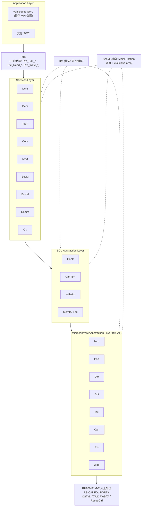
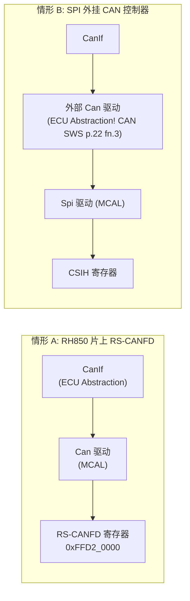
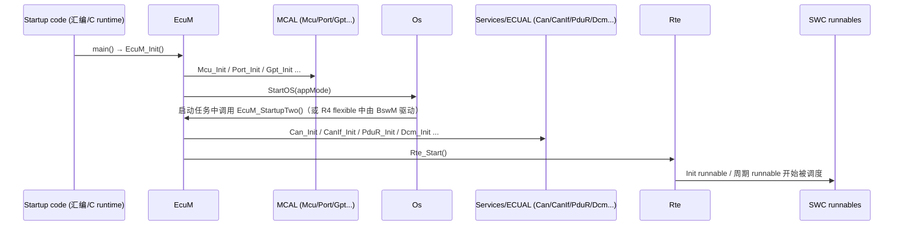
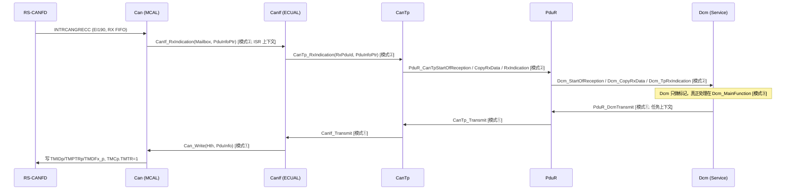

# AUTOSAR Classic Platform 总览：从分层图走进代码

> Prerequisite: [RH850 外设总览](../01-rh850/08-peripheral-overview.md), [RH850 中断与异常](../01-rh850/06-interrupt-exception.md)
> Next: [分层架构与诊断路径](02-layered-architecture.md)
> 对应规范: AUTOSAR CP SWS MCU Driver R24-11（p.9, p.13–14, p.25, p.34）；SWS CAN Driver R22-11（p.14, p.22 含脚注 3, p.23, p.84–87）；SWS DCM R20-11（p.22–23）；SWS IoHwAb R24-11（p.8, p.15–16）。本仓库**没有** Layered Software Architecture、BSW General、Compiler Abstraction、Memory Mapping、RTE、Os SWS。
> 对应源码: openAUTOSAR `include/Std_Types.h`、`include/Compiler.h`、`include/MemMap.h`、`include/Modules.h`、`system/SchM/include/SchM.h`、`debug/Det/src/Det.c`；本项目 `examples/rh850_mcal_reference/`

---

## 1. 本章目标

读完本章，你应该能做到：

1. 看到一个函数名（比如 `CanIf_RxIndication`、`SchM_Enter_Can_CAN_EXCLUSIVE_AREA_0`、`Det_ReportError`），立刻说出它属于哪一层、谁会调用它、它为什么存在。
2. 说清楚 AUTOSAR 的层次划分**不是按“模块名字”划分，而是按“是否直接访问片上硬件 / 是否依赖 ECU 布线 / 是否与网络无关”划分**，并能用 CAN SWS p.22 脚注 3 举证。
3. 理解所有 BSW 模块共享的“基础设施”：`Std_Types.h`、`Platform_Types.h`、`Compiler.h`、`MemMap.h`、`Det`、`SchM` exclusive area。以后在真实 RTA-CAR 工程里看到 `FUNC(void, CAN_CODE)`、`#define CAN_START_SEC_CODE` 不再陌生。
4. 建立一张“调用方向图”：上层调用下层的 API，下层通过 callback（`<Up>_RxIndication` 等）通知上层，横向的 Det/Dem/SchM/Os 服务被所有人使用。

本章是 Part II 的入口。它不会把每个模块讲深（那是后续章节的任务），而是建立后面所有章节都会用到的**词汇和方向感**。

---

## 2. 为什么需要分层？

### 2.1 一个没有分层的 ECU 会怎样

想象你写了一个诊断功能：收到 CAN 报文 `0x7E0` 后，如果数据是 `22 F1 90`，就回 VIN。没有分层时，代码可能是这样的：

```c
/* [Conceptual] 反例：不分层的写法，仅用于说明问题 */
void CAN0_RX_ISR(void)
{
    uint32 id = RSCFD0RFID0;              /* 直接读 RS-CANFD 寄存器 */
    if (id == 0x7E0u) {
        uint8 sid = (uint8)(RSCFD0RFDF00 >> 8);
        if (sid == 0x22u) {
            read_vin_from_flash_and_send();  /* 业务逻辑也在 ISR 里 */
        }
    }
}
```

这段代码的问题，每一条都对应 AUTOSAR 的一个设计动机：

| 问题 | 后果 | AUTOSAR 的答案 |
|---|---|---|
| 直接访问 `RSCFD0...` 寄存器 | 换芯片（P1M-E → U2A，RS-CANFD → MCAN）要重写诊断逻辑 | **MCAL** 封装寄存器，向上提供硬件无关 API（CAN SWS p.14） |
| 0x7E0 写死 | 换车型、换 CAN ID 要改代码 | **配置**（ARXML → `*_Cfg.h`/`*_PBcfg.c`），见 [04-configuration-arxml.md](04-configuration-arxml.md) |
| 多帧（ISO-TP）没有处理 | VIN 17 字节超过一帧，必须分段 | **CanTp** 独立处理传输层 |
| 服务分发、会话、安全检查都没有 | 任何人都能读写任何数据 | **DCM** 的 DSL/DSD/DSP |
| 业务逻辑在 ISR | 中断延迟不可控，P2 定时、优先级全乱 | **MainFunction + OS Task** 模型，见 [07-mainfunction-scheduling.md](07-mainfunction-scheduling.md) |
| 读 Flash 的函数在应用里 | 存储一致性、写入寿命无人管理 | **NvM / Fee / Fls** 存储栈 |

### 2.2 分层带来的“供应链”含义

在真实项目里，分层不仅是软件架构，更是**交付边界**：

- **MCAL**：通常由芯片厂（例如 Renesas 的 RH850 MCAL）交付，带自己的配置工具或插件。目标工程背景（来自截图，本仓库不存在）中提到的是 “Renesas P1M MCAL（AR 4.2.2 API）”。
- **BSW（Services + ECU Abstraction + 部分 Complex Driver）**：由栈供应商交付，例如 ETAS RTA-CAR（截图中为 12.9.0）。
- **OS**：例如 RTA-OS 的 RH850 GHS port。
- **RTE**：由工具根据 SWC 描述和 ECU 配置**生成**。
- **SWC（应用）**：由 OEM / Tier1 应用团队编写。

[Real Project Consideration] 这意味着 MCAL 与 BSW 的 AUTOSAR Release 往往**不一致**（例如 MCAL 按 4.2.2，BSW 按更新的 Release）。本仓库的规范也不在同一 Release：MCU = R24-11、CAN = R22-11、DCM = R20-11（见 `docs/reference/research/02-autosar-sws-notes.md` §0）。当你在真实工程中看到 `Can_Write` 的返回值类型、`Mcu_DistributePllClock` 的签名和本教程不同，第一反应应该是“查这个模块对应的 Release”，而不是“教程错了”或“代码错了”。

---

## 3. 在系统中的位置：六层 + 横向服务

### 3.1 经典分层图（但带上真实模块名）



> \* CanTp 在 AUTOSAR 的分层图中通常被画在 Communication Services（与 PduR 同层或紧邻），而不是 ECU Abstraction。上图为了强调“它离硬件近、离诊断语义远”放在了中间。**本仓库没有 CanTp SWS 和 Layered Software Architecture 文档**，这一归属需以真实项目所用 Release 的文档确认。重要的不是它画在哪个格子里，而是它的调用关系：CanIf ↔ CanTp ↔ PduR。

逐层解释“这一层的代码长什么样”：

| 层 | 典型代码特征 | 你在真实工程中如何识别 |
|---|---|---|
| Application | 只 include `Rte_<SwcName>.h`，只调用 `Rte_*` API | 文件里**不应**出现 `Can_`、`Dio_` 等 BSW 头文件 |
| RTE | 生成的 `Rte.c`、`Rte_<Swc>.h`、`Rte_Type.h`；把 SWC 的端口映射成函数调用或全局变量读写，并负责把 runnable 放进 OS task | 文件头一般有工具名、生成时间 |
| Services | 与硬件、与网络都无关的服务：诊断（Dcm/Dem）、路由（PduR）、信号（Com）、存储管理（NvM）、模式（EcuM/BswM/ComM）、Os | 有 `<Mod>_MainFunction`；大量配置表 |
| ECU Abstraction | 与**ECU 板级**相关但与**芯片**无关：CanIf 抽象“这块板上有几个 CAN 控制器、来自哪个驱动”；IoHwAb 抽象“这个引脚在原理图上是什么信号” | 调用多个 MCAL 驱动；IoHwAb 是“integration code” |
| MCAL | 直接读写片上外设寄存器 | 出现寄存器地址/结构体（`0xFFD20000` 等）、ISR |
| Microcontroller | 硬件本身 | — |

### 3.2 横向服务：所有层都会用到的“基础设施”

上图里有两个虚线连接的模块，它们不属于某一层的“纵向数据通路”，却渗透到每一个模块的代码里：

- **Det（Default Error Tracer）**：开发阶段的错误收集器。几乎每个 API 的开头都有 `if (!initialized) { Det_ReportError(...); return; }`。
- **SchM（BSW Scheduler）**：在 R4.x 中是 RTE 的一部分。它做两件事：
  1. 周期性调用各模块的 `<Mod>_MainFunction`（CAN SWS p.84：“These functions are directly called by Basic Software Scheduler”）。
  2. 提供 exclusive area 的进入/退出（`SchM_Enter_<Mod>_<Area>()` / `SchM_Exit_<Mod>_<Area>()`），用于保护模块内部共享数据。

再加上编译期基础设施：`Std_Types.h`、`Platform_Types.h`、`Compiler.h`、`MemMap.h`。下面第 5 节逐个讲。

---

## 4. AUTOSAR 如何定义层次？用规范原文判断“谁是 MCAL”

### 4.1 判断规则：访问的是什么？

本仓库的规范给出的判断依据可以总结为三条（`02-autosar-sws-notes.md` §7 第 5 条）：

| 规则 | 规范依据 | 例子 |
|---|---|---|
| 直接访问**片上**外设寄存器 → MCAL | MCU SWS p.9（MCU 驱动“直接访问硬件，位于 MCAL”）；CAN SWS p.14（“The Can module is part of the lowest layer, performs the hardware access and offers a hardware independent API to the upper layer”） | Mcu、Can、Port、Dio、Gpt、Icu |
| 调用 MCAL、抽象**ECU 板级布线** → ECU Abstraction | IoHwAb SWS p.8：IoHwAb 属于 ECU Abstraction Layer，“总是 ECU 专用实现”，因为它取决于电路板原理图 | IoHwAb；片外 CAN 控制器的驱动 |
| 与网络/硬件都无关 → Service Layer | DCM SWS p.23：DCM 位于 Service Layer 的 Communication Services，“网络无关”，只与 PduR 交互 | Dcm、Dem、PduR、NvM |

### 4.2 为什么 Can 是 MCAL，而 CanIf 不是？

这是面试和真实项目中最常被问到的问题之一。CAN SWS R22-11 给了四层证据：

1. **硬件访问 vs 硬件无关**（p.14）：Can 执行硬件访问，并向上提供硬件无关的 API；并且**唯一能访问 Can 的上层是 CanIf**。
2. **片上控制器不得使用其它驱动**——`SWS_Can_00238`（p.22）：“If the CAN controller is on-chip, the Can module shall not use any service of other drivers.” 也就是说，片上 Can 驱动是一个“自给自足”的寄存器操作层。连 CAN 引脚的复用也不归它管：`SWS_Can_00239`（p.22）规定 Can_Init 初始化 CAN 控制器使用的所有片上资源，**唯一例外是 CAN 引脚的数字 I/O 配置，由 Port 驱动完成**。
3. **反证——p.22 脚注 3**（最有说服力）：当使用**片外** CAN 控制器（例如通过 SPI 连接的独立 CAN 芯片）时，原文是：

   > “In this case the CAN driver is not any more part of the µC abstraction layer but put part of the ECU abstraction layer. Therefore it is (theoretically) allowed to use any µC abstraction layer driver it needs.”

   **同样叫 “Can 驱动”，挂在片外就变成 ECU Abstraction**。所以层次的定义标准是“访问的是不是 µC 片上外设”，不是模块名。
4. **Can 只认 CanIf**——`SWS_Can_00058`（p.23）：驱动不关心请求真正来自哪里、通知最终去哪里，只把 CanIf 当来源和目的地。

那 CanIf 做什么？它把“一个或多个 Can 驱动（可能来自不同厂商、片上和片外混用）”统一成一个接口，管理 L-PDU handle、软件过滤、Tx 缓冲（CAN SWS p.51：“In case of CAN_BUSY the CanIf module queues that request”）。这些都是**ECU 级别**的抽象：这块板上有几个 CAN 控制器、每个帧 ID 对应哪个上层模块。

> 注意：**本仓库没有 CanIf SWS**。“CanIf 位于 ECU Abstraction Layer” 在本仓库只能通过 CAN SWS 间接佐证；正式结论需用 CanIf SWS / Layered Software Architecture 确认。



### 4.3 寄存器归属规则：谁初始化哪一个寄存器

MCU SWS 在 `SWS_Mcu_00026`（p.25）之下列出了一组规则（`SWS_Mcu_00116/00244/00245/00246/00247`），CAN SWS 也有同样的一条 `SWS_Can_00407`（p.43）：

1. 只被一个硬件模块使用的寄存器 → 由实现该功能的驱动初始化（RS-CANFD 的 `GCFG` 归 Can）；
2. 影响多个硬件模块的 **I/O 寄存器** → Port 驱动（`PMC`/`PFC` 等引脚复用归 Port）；
3. 影响多个硬件模块的**非 I/O 寄存器** → Mcu 驱动（时钟、复位、低功耗等）；
4. 复位后必须立即写入的一次性寄存器 → start-up code；
5. 其它 → start-up code。

这五条规则就是 MCAL 模块之间的“产权证”。以后你在 RH850 上 debug “CAN 不发”时，按这张表去找：时钟（Mcu）、引脚（Port）、CAN 寄存器本身（Can）、中断控制器 EIC（通常是 OS 或集成代码）。详见 [03-mcal/01-mcal-overview.md](../03-mcal/01-mcal-overview.md)。

---

## 5. 核心数据结构与基础设施：每个 BSW 文件开头都有的东西

### 5.1 BSW 模块命名约定

[AUTOSAR Standard] AUTOSAR BSW 的 API 统一采用 `<ModuleAbbreviation>_<ApiName>` 的形式，模块缩写首字母大写：`Mcu_Init`、`Can_Write`、`CanIf_Transmit`、`Dcm_MainFunction`。回调（callback）则以**被调用方**的模块名开头：Can 驱动收到帧后调用的是 `CanIf_RxIndication`——函数属于 CanIf，声明在 CanIf 提供给 Can 的头文件里——R22-11 CAN SWS 把它写作 `CanIf_Can.h`（`SWS_Can_00234` p.88，且明确“All callback functions that are called by the Can module are implemented in the CanIf module”）；较早的 Release 和不少供应商代码中叫 `CanIf_Cbk.h`。

这一约定决定了你读代码的方向：

| 你看到 | 它定义在 | 调用者 | 方向 |
|---|---|---|---|
| `Can_Write(Hth, PduInfo)` | Can 驱动 | CanIf | 上 → 下（请求） |
| `CanIf_RxIndication(Mailbox, PduInfoPtr)` | CanIf | Can 驱动（ISR 或 `Can_MainFunction_Read`） | 下 → 上（通知） |
| `CanIf_TxConfirmation(CanTxPduId)` | CanIf | Can 驱动 | 下 → 上（确认） |
| `Det_ReportError(ModuleId, InstanceId, ApiId, ErrorId)` | Det | 任何模块 | 横向 |
| `SchM_Enter_Can_<Area>()` | SchM（RTE 生成） | Can 驱动 | 横向 |
| `Can_MainFunction_Read()` | Can 驱动 | SchM / OS task | 调度 → 模块 |

**模块 ID**：每个标准模块有一个数字 ID，用于 `Det_ReportError` 的第一个参数和 `Std_VersionInfoType.moduleID`。openAUTOSAR 的 `include/Modules.h` 列出了它们，例如 `MODULE_ID_OS (1)`（:34）、`MODULE_ID_ECUM (10)`（:36）、`MODULE_ID_DET (15)`（:41）、`MODULE_ID_CANTP (35)`（:50）、`MODULE_ID_PDUR (51)`（:58）、`MODULE_ID_DCM (53)`（:60）、`MODULE_ID_CANIF (60)`（:64）、`MODULE_ID_CAN (80)`（:72）、`MODULE_ID_GPT (100)`（:81）、`MODULE_ID_MCU (101)`（:82）、`MODULE_ID_DIO (120)`（:85）、`MODULE_ID_PORT (124)`（:89）。这些值来自 AUTOSAR 的 BSW Module List（本仓库无该文档），真实项目中以供应商头文件为准。

**典型的文件集合**（以 Can 为例，[Conceptual]，具体文件名因供应商而异）：

| 文件 | 内容 | 谁写 |
|---|---|---|
| `Can.h` | API 声明、`Can_ConfigType` 前向声明 | 供应商（静态） |
| `Can_GeneralTypes.h` | `Can_PduType`、`Can_IdType`、`Can_HwHandleType` 等，供 Can/CanIf/CanTrcv 共享（`SWS_Can_00436` p.24） | AUTOSAR 定义 |
| `Can_Cfg.h` | pre-compile 开关：`CAN_DEV_ERROR_DETECT`、HTH/HRH 符号名 | **生成** |
| `Can_PBcfg.c` / `Can_Lcfg.c` | post-build / link-time 配置结构体实例 | **生成** |
| `Can.c`、`Can_Irq.c` | 实现、ISR | 供应商（静态） |
| `SchM_Can.h` | MainFunction 声明、exclusive area 宏（CAN SWS p.85 “Available via SchM_Can.h”） | **生成**（RTE/SchM 工具） |
| `CanIf_Cbk.h` | Can 要调用的 CanIf 回调声明 | CanIf 供应商 |
| `Can_MemMap.h` / `MemMap.h` | 段映射 | 集成者 / 生成 |

### 5.2 `Std_Types.h` 与 `Platform_Types.h`

[AUTOSAR API] 两个最基础的头文件。CAN SWS 和 MCU SWS 都把 `Std_ReturnType`、`Std_VersionInfoType` 列为从 `Std_Types.h` 导入的类型（MCU SWS p.20 的 “Imported types” 表；CAN SWS p.56 的同类表，其中还从 `ComStack_Types.h` 导入 `PduIdType`/`PduInfoType`/`PduLengthType`）。

openAUTOSAR 的实现（R3.1.5 风格）：

```c
/* [openAUTOSAR] include/Std_Types.h:86-107（摘录） */
typedef uint8 Std_ReturnType;
#define E_OK      (Std_ReturnType)0
#define E_NOT_OK  (Std_ReturnType)1
/* ... :91-98 还定义了 E_PENDING(10)、E_COMPARE_KEY_FAILED(11)、E_FORCE_RCRRP(12) 等，
 *     这是 Arctic 把 DCM 的返回码塞进了 Std_Types —— 不是 R4.x 的标准做法 */
#define STD_HIGH 0x01
#define STD_LOW  0x00
#define STD_ON   0x01
#define STD_OFF  0x00
```

几个要点：

- `Std_ReturnType` 是 `uint8`。**模块可以在高位扩展自己的返回值**，例如 CAN SWS R22-11 的 `CAN_BUSY = 0x02` 就是对 `Std_ReturnType` 的扩展，**只用于 `Can_Write`**（`SWS_Can_00039`，p.59–60）。DCM 的 `DCM_E_PENDING = 10` 也是同一思路（DCM SWS p.338）。
- `STD_ON/STD_OFF` 用于 pre-compile 开关：`#if (CAN_DEV_ERROR_DETECT == STD_ON)`。
- `Platform_Types.h` 定义 `uint8/uint16/uint32/boolean` 和 `CPU_BYTE_ORDER`。openAUTOSAR `include/Platform_Types.h:31` 写的是 `#define CPU_BYTE_ORDER HIGH_BYTE_FIRST`（大端），这是它的 PowerPC 遗留。[Real Project Consideration] RH850 的字节序需以 RH850G3M Software Manual 确认（本仓库没有该手册，P1M-E 硬件手册中检索不到 endian 描述）；移植任何开源 BSW 到 RH850 时，`Platform_Types.h` 是第一个要核对的文件——字节序错了，Com 的信号打包、DCM 的 DID 数据全部会错位。

### 5.3 `Compiler.h`：为什么函数要写成 `FUNC(void, CAN_CODE)`

[AUTOSAR Standard] Compiler Abstraction 规范（本仓库无）定义了一组宏，让同一份 BSW 源码能适配不同编译器的“内存类别”关键字（历史上为 16 位 MCU 的 near/far 指针设计）。

```c
/* [openAUTOSAR] include/Compiler.h:74-80 */
#define FUNC(rettype,memclass) rettype
#define P2VAR(ptrtype, memclass, ptrclass) ptrtype *
#define P2CONST(ptrtype, memclass, ptrclass) const ptrtype *
#define CONSTP2VAR(ptrtype,memclass,ptrclass) ptrtype * const
```

所以供应商代码中的：

```c
/* [Conceptual] 真实 MCAL 常见写法 */
FUNC(Std_ReturnType, CAN_CODE) Can_Write(Can_HwHandleType Hth,
                                         P2CONST(Can_PduType, AUTOMATIC, CAN_APPL_CONST) PduInfo);
```

在 RH850 + GHS 这种 32 位平坦地址空间上，展开后就是普通的 `Std_ReturnType Can_Write(Can_HwHandleType Hth, const Can_PduType *PduInfo);`。**读代码时可以在脑中把这些宏“剥掉”**；但**不要**在真实项目里删除它们，因为 MISRA 检查和供应商交付一致性依赖它们。

openAUTOSAR `include/Compiler.h:33-57` 还有一个值得注意的细节：它按 `__GNUC__`/`__CWCC__`/`__DCC__`/`__ICCHCS12__` 分支定义 `__balign`，其它编译器直接 `#error Compiler not defined.`（:56）。GHS 不在其中——这再次说明 openAUTOSAR 不能直接拿来编 RH850 目标。

### 5.4 `MemMap.h`：代码和数据放到哪个段

[AUTOSAR Standard] Memory Mapping 规范（本仓库无）要求每个模块用如下模式包裹代码和变量：

```c
/* [Conceptual] R4.x 典型写法（模块级 MemMap 头文件名因 Release/供应商而异） */
#define CAN_START_SEC_CODE
#include "Can_MemMap.h"

FUNC(void, CAN_CODE) Can_MainFunction_Read(void) { /* ... */ }

#define CAN_STOP_SEC_CODE
#include "Can_MemMap.h"

#define CAN_START_SEC_VAR_NO_INIT_32
#include "Can_MemMap.h"
static uint32 Can_RxFifoShadow[16];
#define CAN_STOP_SEC_VAR_NO_INIT_32
#include "Can_MemMap.h"
```

`MemMap.h` 内部把这些宏翻译成编译器的 `#pragma`（GHS 用 `#pragma ghs section ...`，具体语法需查 GHS 手册）。openAUTOSAR 在 `include/MemMap.h:16-60` 的注释里解释了这一机制，并说明 Arctic 改用了 `__attribute__((section(...)))` 风格（:55-60）。

**为什么 RH850 项目必须关心 MemMap？**

- RH850/P1M-E 有 Local RAM（`FEDE_0000`–`FEDF_FFFF`，CPU 自身访问）和 Global RAM（`FEEF_8000`… / `FEF0_0000`…），且 **DMA 和其他 H-Bus 主设备访问不到 Local RAM 的 self 地址**，只能走 `FEBE_xxxx` 别名（HW-E p.257, p.259）。如果 CAN 或 SPI 的 DMA 缓冲被 MemMap 放进了 Local RAM self 区，DMA 会读写失败。
- `NO_INIT` 段在软件复位后保持内容（用于保存复位原因、DCM 的 “programming conditions”），它和启动代码的 RAM 清零策略、`STAC_*` 硬件清零（HW-E p.2890）直接相关。见 [RH850 内存映射](../01-rh850/03-memory-map.md)。

### 5.5 Det：开发错误 vs 运行时错误 vs 生产错误

[AUTOSAR API] 每个模块在 SWS 第 7 章“Error Classification”中列出三类错误。以 MCU R24-11 为例（p.18）：

| 类别 | 上报给谁 | MCU 的例子 | 何时启用 |
|---|---|---|---|
| Development Error | `Det_ReportError` | `MCU_E_PARAM_CONFIG 0x0A`、`MCU_E_UNINIT 0x0F`、`MCU_E_PLL_NOT_LOCKED 0x0E`（`SWS_Mcu_00012`，p.18） | 仅当 `McuDevErrorDetect = TRUE`；量产通常关闭 |
| Runtime Error | `Det_ReportRuntimeError` | MCU：无（p.18） | 量产也启用 |
| (Extended) Production Error | Dem（`Dem_SetEventStatus`） | `MCU_E_CLOCK_FAILURE`（`SWS_Mcu_00053`，p.18） | 量产启用，形成 DTC |

CAN 的对照：开发错误 `CAN_E_PARAM_POINTER 0x01` … `CAN_E_PARAM_LPDU 0x0A`（`SWS_Can_91019`，p.52–53），运行时错误 `CAN_E_DATALOST 0x01`（`SWS_Can_91020`，p.53）。

**它们的设计含义完全不同**：

- 开发错误 = “调用者写错了代码”（传了空指针、没初始化就调用）。正确的程序永远不该触发。所以可以在量产中关掉检查，省 ROM 和 CPU。
- 运行时错误 = “硬件/环境导致的、正确程序也会遇到的异常”（CAN 接收 FIFO 溢出丢帧）。量产必须保留。
- 生产错误 = 需要记录成 DTC、维修站能读到的故障。

openAUTOSAR 中的典型写法：

```c
/* [openAUTOSAR] boards/linuxOs/MCAL/Mcu/src/Mcu.c:40-54（结构摘录） */
#if ( MCU_DEV_ERROR_DETECT == STD_ON )
#define VALIDATE(_exp,_api,_err ) \
        if( !(_exp) ) { \
          Det_ReportError(MODULE_ID_MCU,0,_api,_err); \
          return; \
        }
#else
#define VALIDATE(_exp,_api,_err )
#endif
```

`Det_ReportError` 本身（`debug/Det/src/Det.c:137` 起）只在 Det 已启动时遍历回调表、写 RAM log。**Det 本身不会让 ECU 停下**——它是一个“记录点”。开发阶段的常见做法是在 Det 回调里放一个断点或死循环，让调试器停住，这样你立刻能看到调用栈。见 §12。

### 5.6 SchM exclusive area：模块内部的临界区

[AUTOSAR Standard] 一个模块的数据可能同时被 ISR 和 MainFunction 访问。例如 Can 驱动的 “HTH 是否忙” 标志：`Can_Write` 在任务上下文中置位，Tx 完成 ISR 中清除。CAN SWS `SWS_Can_00212`（p.81）要求 `Can_Write` “置该 HTH 互斥 → 写入硬件 → 触发发送 → 释放互斥”。

AUTOSAR 不允许模块自己直接 `DI`/`EI`，而是调用：

```c
/* [Conceptual] R4.x 风格；函数名中的 <Area> 由模块定义，实现由 RTE/SchM 生成器生成 */
SchM_Enter_Can_CAN_EXCLUSIVE_AREA_0();
/* 读-改-写 HTH 状态 */
SchM_Exit_Can_CAN_EXCLUSIVE_AREA_0();
```

生成器根据**集成者的配置**决定这对函数展开成什么：关所有中断（`SuspendAllInterrupts`）、只关 OS 中断（`SuspendOSInterrupts`）、获取 OS Resource、或者（如果分析证明不需要）展开为空。**这就是“机制与策略分离”**：模块开发者只声明“这里需要保护”，集成者根据整个 ECU 的任务/中断布局决定“怎么保护”。

在 RH850 上，这些 OS 服务最终落到 `PSW.ID`（DI/EI）或 `PMR`（按优先级屏蔽）上（HW-E p.198, p.211；`04-rh850-hardware-notes.md` §9）。详见 [06-os-task-isr.md](06-os-task-isr.md)。

openAUTOSAR 中有一个绝佳的**反面教材**：

```c
/* [openAUTOSAR] system/SchM/include/SchM.h:26-30 */
#define SchM_Enter( _module, _exc_area ) \
    SchM_Enter_EcuM ## _module ##  _exc_area

#define SchM_Exit( _module, _exc_area ) \
    SchM_Enter_EcuM ## _module ##  _exc_area     /* <-- Exit 展开成了 Enter！ */
```

`SchM_Exit` 宏展开成了 `SchM_Enter_...`。如果有模块真用它，结果是“进两次临界区、从不退出”。Arctic 的模块实际上用 `Irq_Save/Irq_Restore` 绕开了这套机制（`03-openautosar-trace.md` §8.2）。教训：**exclusive area 的实现是生成代码，必须在真实项目的生成结果里核对它到底展开成了什么**。

---

## 6. 初始化流程（概览）

完整的启动顺序在 [03-ecu-startup.md](03-ecu-startup.md) 中讲。这里只给出“层次视角”的规律：



规律：**越靠近硬件的模块越早初始化**；**需要 OS 服务（任务、计数器、MainFunction 调度）的模块在 StartOS 之后初始化**；**需要非易失数据的模块在 NvM_ReadAll 完成之后初始化**；RTE 最后启动，SWC 最后运行。

---

## 7. Runtime Flow：调用方向的四种模式

在运行时，模块之间的交互只有四种模式。记住它们，任何调用链你都能归类：

| 模式 | 例子 | 上下文 |
|---|---|---|
| ① 同步请求（上 → 下） | `CanIf_Transmit` → `Can_Write` | 调用者的上下文（任务） |
| ② 异步通知（下 → 上） | Can Rx ISR → `CanIf_RxIndication` → `CanTp_RxIndication` | **ISR 或下层 MainFunction**（CAN SWS p.51：回调必须按“可能在 ISR 中被调用”来写） |
| ③ 周期处理 | `CanTp_MainFunction`、`Dcm_MainFunction` 推进状态机、检查超时 | 由 SchM 映射到的 OS task |
| ④ 横向服务 | `Det_ReportError`、`SchM_Enter_*`、`GetCounterValue` | 任意 |



逐个 transition 说明：

1. **`INTRCANGRECC`**：RS-CANFD 的全局 RX FIFO 中断，EI 通道 190（HW-E p.286, p.792）。注意不是 EI184（那是 CAN0 的 TX/RX FIFO 接收中断）。ISR 的入口由 OS 配置（Cat2 ISR）。
2. **`CanIf_RxIndication`**：Can 从 RX FIFO 读出 ID、DLC、数据，组装 `Can_HwType`（`CanId`、`Hoh`、`ControllerId`，`SWS_CAN_00496` p.59）和 `PduInfoType`，调用 CanIf（`SWS_Can_00279` p.48）。
3. **`CanTp_RxIndication`**：CanIf 根据 CAN ID 查表得到 RxPduId，按配置路由到 CanTp。
4. **`PduR_CanTp*`**：CanTp 拆 ISO-TP 头（单帧/首帧），通过 PduR 向 DCM 申请缓冲并拷贝数据。
5. **`Dcm_StartOfReception/CopyRxData/TpRxIndication`**：DCM 的 TP 接口（DCM SWS §3.3 笔记）。DCM 在这里**不处理服务**，只记录“有新请求”。
6. **`Dcm_MainFunction`**：在周期任务中执行 DSL/DSD/DSP，生成响应。
7. **`PduR_DcmTransmit` → `CanTp_Transmit` → `CanIf_Transmit` → `Can_Write`**：逐层下发。`Can_Write` 返回 `CAN_BUSY` 时 CanIf 负责排队（CAN SWS p.51）。
8. **写 TX buffer 寄存器**：HW-E p.1107 的发送序列。

这条链路的每一跳在 [02-layered-architecture.md](02-layered-architecture.md) 和 Part IV/V 中会逐层展开。

---

## 8. RH850 Hardware Mapping：横向服务落在哪些硬件上

| AUTOSAR 基础设施 | RH850/P1M-E 硬件 | 依据 |
|---|---|---|
| exclusive area / `SuspendAllInterrupts` | `PSW.ID`（DI/EI 指令）；`PMR` 按优先级屏蔽 | HW-E p.198, p.211 |
| ISR 入口 | EIC*n*（EIP/EITB/EIMK）、`INTBP` 表、`RBASE`/`EBASE` | HW-E p.267–268, p.281 |
| OS 计数器 / SchM 节拍 | OSTM0/OSTM1（EI 74/75）；OSTM3–7 只能接 FEINT | HW-E p.1544 |
| MemMap 段 | Local RAM / Global RAM / Code Flash / Data Flash 地址区 | HW-E p.257 |
| Det “停住” | 调试器断点；或 `SYSERR`/`FETRAP` 异常（不可恢复） | HW-E p.244–245 |
| 生产错误（时钟失效） | CLMA 时钟监视器 → ECM | HW-E p.2757–2764 |

---

## 9. openAUTOSAR 实现：值得读的与要警惕的

openAUTOSAR = Arctic Core 2.18.0，主体是 **R3.1.5** 风格（`03-openautosar-trace.md` §0）。它对本章的价值：

| 看什么 | 路径 | 价值 |
|---|---|---|
| 基础类型 | `include/Std_Types.h:86-107` | 看清 `Std_ReturnType` 是 uint8、`STD_ON` 是 1 |
| 编译器抽象 | `include/Compiler.h:74-80` | `FUNC/P2VAR/P2CONST` 在 32 位平台上的平凡展开 |
| 段映射思想 | `include/MemMap.h:16-60` | 注释解释了 AUTOSAR MemMap 模式和 Arctic 的取舍 |
| 模块 ID | `include/Modules.h:34-91` | Det 上报时 ModuleId 的来源 |
| Det | `debug/Det/src/Det.c:137` | `Det_ReportError` 的回调表与 RAM log |
| DET 包装宏 | `boards/linuxOs/MCAL/Mcu/src/Mcu.c:40-54` | `VALIDATE`/`VALIDATE_W_RV` 模式 |
| SchM 宏（反例） | `system/SchM/include/SchM.h:26-30` | `SchM_Exit` 展开成 Enter |

要警惕的 R3.x/Arctic 特有做法：`Std_Types.h` 中混入 DCM 返回码（:91-98）；Can 驱动通过函数指针表 `Can_CallbackType` 回调上层（`include/Can.h:178-185`），而 R4.x 中 Can **直接**调用 `CanIf_*`（CAN SWS `SWS_Can_00234` p.88）；`Irq_Save/Irq_Restore` 代替 SchM exclusive area。

---

## 10. 当前教学项目实现

本项目 `examples/rh850_mcal_reference/` 目前只有四个小组件（OSTM 底层、CAN FD 位时间计算、tick 累计器、MMIO 注入层），**不是完整的 AUTOSAR 模块**，也没有 `Std_Types.h`/`Compiler.h`/`MemMap.h`。它刻意使用 `<stdint.h>` 而不是 AUTOSAR 类型，以表明“这是寄存器级参考代码，不冒充 AUTOSAR API”（`mcal/gpt/Ostm.h:6-8` 的注释）。

其中 `platform/Rh850_Mmio.h:12-19` 定义的 `Rh850_Mmio` 函数指针表，是本章“分层”思想在教学代码中的体现：硬件访问被收敛到一个注入点，主机测试可以替换它来检查**访问宽度和顺序**。这类似于真实 MCAL 中 “寄存器访问宏 + 静态代码分析” 的作用，但真实 MCAL 一般直接用 volatile 指针或供应商的寄存器头文件。

[Educational Implementation] Phase 5 计划中的 `examples/uds_diag_demo/` 会用 Mock Can → CanIf → CanTp → PduR → Dcm → Rte → SWC 的结构复现第 7 节的调用链；本文撰写时该目录尚未创建。

---

## 11. Code Walkthrough：如何从一个 API 名推断一切

练习：在真实 RTA-CAR 工程里你看到 `SchM_Enter_Dcm_DCM_EXCLUSIVE_AREA_0()`。按本章方法推断：

1. 前缀 `SchM_` → 横向服务，实现是 RTE/SchM 生成代码 → 去 `SchM_Dcm.h` 或 `Rte` 生成目录找定义。
2. 第二段 `Dcm` → 使用者是 DCM 模块 → DCM 的某个数据会被不同上下文访问（例如 `Dcm_TpRxIndication` 在 CAN ISR 链路上，`Dcm_MainFunction` 在任务里）。
3. 展开结果决定了**这段代码执行期间哪些中断会被延迟**。如果展开成 `SuspendAllInterrupts()`，CAN 接收中断在此期间会被推迟——这是分析中断延迟的入口。

再练一个：`Can_MainFunction_Mode`。

1. 前缀 `Can_` → Can 驱动自己的函数；`MainFunction` → 周期调用，由 SchM 调度（CAN SWS p.84）。
2. `_Mode` → 处理控制器模式切换的轮询：`Can_SetControllerMode` 是异步的，在 `CanTimeoutDuration` 内没完成的切换由它继续轮询并调用 `CanIf_ControllerModeIndication`（`SWS_Can_00370/00372/00373`，p.39–40）。
3. 周期配置在 `CanMainFunctionModePeriod`（CAN SWS p.102）。

---

## 12. Debug 方法

| 现象 | 用本章知识定位 |
|---|---|
| 某个 API “什么都没做就返回了” | 先查是否被 `VALIDATE`/DET 拦截：在 `Det_ReportError` 下断点，看 ModuleId/ApiId/ErrorId（对照 `Modules.h` 和该模块 SWS 第 7 章） |
| 量产软件里同样的错误没有任何记录 | `<Mod>DevErrorDetect` 在量产配置中通常为 OFF；开发错误只在开发构建可见。需要在开发构建复现 |
| 偶发数据错乱 | 检查 exclusive area 的生成展开（是否为空？是否只关了 OS 中断而 Cat1 ISR 也访问了数据？） |
| 链接错误：重复定义 / 段溢出 | 检查 MemMap 的 START/STOP 是否配对，是否有变量落在了错误的段 |
| 移植后数据字节顺序反了 | 检查 `Platform_Types.h` 的 `CPU_BYTE_ORDER` |

[Real Project Consideration] 建议在开发构建中给 Det 注册一个回调：把最近 N 条错误存到一个 `NO_INIT` 段的环形缓冲，复位后也能读出来。这样即使错误发生在启动早期、调试器还没连上，也能事后分析。

---

## 13. 常见问题 / 常见错误

1. **“CanIf 也访问 CAN，所以也是 MCAL？”** 不是。CanIf 从不访问寄存器，它只调用 `Can_*` API。判断标准是“是否直接访问片上外设”（CAN SWS p.14, p.22 脚注 3）。
2. **“开发错误在量产中关了，那出了问题怎么办？”** 开发错误代表编程错误，应在开发和集成测试阶段消灭；量产中靠运行时错误和生产错误（Dem）。
3. **“SWC 里能不能直接调 `Dio_WriteChannel`？”** 不能。SWC 只能通过 RTE 端口访问，引脚语义由 IoHwAb 提供（IoHwAb SWS p.8）。openAUTOSAR 的 `examples/rte_simple` 中 `Tester.c` include 了 `Os.h`，就是一个反面例子（`03-openautosar-trace.md` §5）。
4. **“`FUNC(void, CAN_CODE)` 太丑了，能不能删掉？”** 能编译，但会破坏 MISRA/供应商一致性检查，也会让以后的版本合并困难。读代码时脑中剥掉即可。
5. **“exclusive area 就是关中断吧？”** 不一定。它是一个“需要保护”的声明，展开方式由集成配置决定。

---

## 14. 实验

1. **剥宏练习**：打开 openAUTOSAR `communication/CAN/CanIf/src/CanIf.c`，找 5 个使用 `FUNC`/`P2CONST` 或 `VALIDATE` 的地方（若该文件未使用 FUNC 宏，换 `diagnostic/Dcm/src/Dcm.c`），手工写出预处理展开后的样子。
2. **画调用方向图**：只用 grep，从 `CanIf_RxIndication` 出发，在 openAUTOSAR 中找出它调用了哪些上层函数（提示：`CanIf.c:794-822` 附近的查表逻辑）。把结果画成 Mermaid sequenceDiagram，并标注每一跳属于第 7 节的哪一种模式。
3. **Det 实验**：在主机上写一个 20 行的小程序：实现一个假的 `Det_ReportError` 把四个参数打印出来，然后用 openAUTOSAR 的 `VALIDATE` 宏写一个 `Foo_DoSomething(const uint8 *p)`，传入 NULL 观察输出；再把 `FOO_DEV_ERROR_DETECT` 改为 `STD_OFF`，观察行为变化（以及潜在的空指针访问）。

---

## 15. 思考题

1. 如果一块板子上同时有 RH850 片上 RS-CANFD 通道和一个 SPI 外挂的 CAN 控制器，CanIf 的配置会出现几个 “CAN Driver”？两个驱动分别属于哪一层？它们的 `Can_Write` 函数名如何避免冲突（提示：CAN SWS `00284/00385/00386`，p.33–34 的 VendorId 命名规则）？
2. 为什么 AUTOSAR 要求回调“必须按可能在 ISR 中被调用来写”（CAN SWS p.51）？如果 `CanIf_RxIndication` 里调用了一个可能阻塞的函数，会发生什么？
3. `Std_ReturnType` 只有 8 位，DCM 却定义了 `DCM_E_PENDING = 10`、CAN 定义了 `CAN_BUSY = 2`。如果某个函数同时可能返回这两类值，会发生什么问题？AUTOSAR 如何避免？

---

## 16. 对未来真实项目的意义

以后进入真实 RH850 + RTA-CAR 项目，第一周可以按下面的顺序建立“地图”：

1. **找基础头文件**：`Std_Types.h`、`Platform_Types.h`（核对字节序、`boolean` 定义）、`Compiler.h`、`Compiler_Cfg.h`、各模块 `*_MemMap.h`。确认它们来自哪个供应商、哪个 Release。
2. **列模块清单**：从 EcuM 或 BswM 的初始化代码列出所有被初始化的模块，按本章的层次表归类（MCAL 来自 Renesas、BSW 来自 ETAS、RTE 是生成的）。
3. **建立 Release 对照表**：每个模块的 `<MOD>_AR_RELEASE_MAJOR/MINOR/REVISION_VERSION` 宏。MCAL（例如 AR 4.2.2）与 BSW 不一致是常态，DCM 升级时尤其要看。
4. **找 Det 和 exclusive area 的生成结果**：在开发构建里给 Det 加断点；查看 `SchM_<Mod>.h` 中 exclusive area 实际展开成了什么。
5. **找 MemMap 与链接脚本的对应**：哪些段放 Local RAM、哪些放 Global RAM、`NO_INIT` 段在哪里。
6. **把每个“奇怪的函数名”按第 5.1 节的规则分类**，你会发现 90% 的代码都能用“请求/通知/周期/横向”四种模式解释。

这张地图建立之后，后续读 Can 驱动、读 DCM 时，你知道每个函数在“全局”中的位置。

---

## 17. 本章总结

- AUTOSAR 的分层由“访问什么”决定：片上寄存器 → MCAL；板级布线 → ECU Abstraction；与网络/硬件无关 → Services。CAN SWS p.22 脚注 3 是最直接的证据。
- 寄存器归属有明确规则（`SWS_Mcu_00116/00244–00247`、`SWS_Can_00407`）：单用途寄存器归驱动、共享 I/O 归 Port、共享非 I/O 归 Mcu、一次性写归 startup。
- 所有模块共享 `Std_Types`/`Platform_Types`/`Compiler`/`MemMap`/`Det`/`SchM` 这些基础设施；读代码时要能“剥宏”，集成时要能“看生成结果”。
- 运行时交互只有四种模式：同步请求、异步通知（可能在 ISR）、周期 MainFunction、横向服务。
- openAUTOSAR 是 R3.1.5 风格，适合读结构，但有不少 Arctic 特有做法（Std_Types 混入 DCM 返回码、Can 回调函数指针表、SchM_Exit 宏错误），引用时必须标注差异。

## 18. 下一章

[02-layered-architecture.md](02-layered-architecture.md)：逐层讲职责边界，并用一条完整的诊断路径（UDS `22 F1 90` 读 VIN）把每一层的代码、配置和 RH850 硬件串起来。
