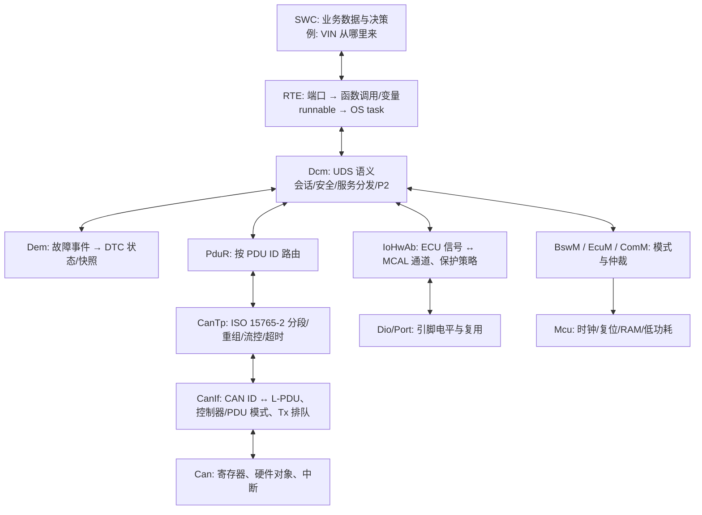
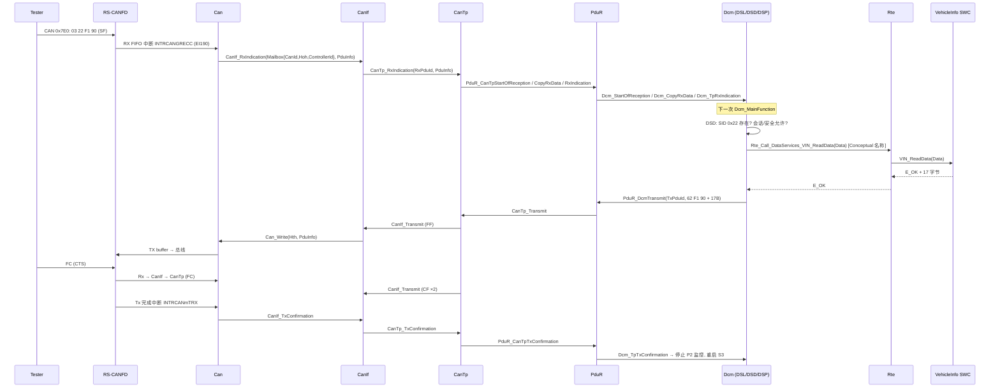
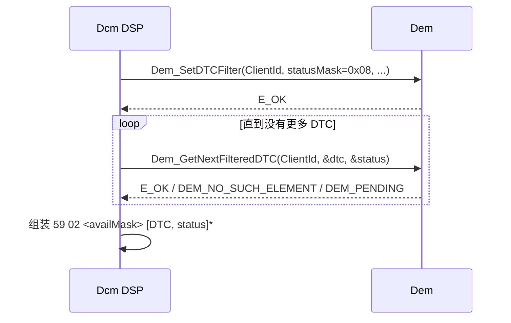
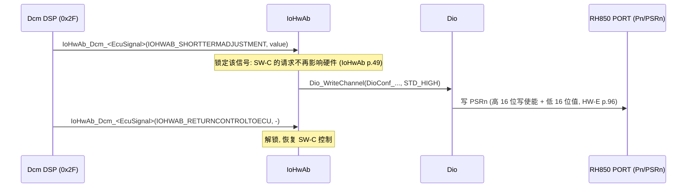
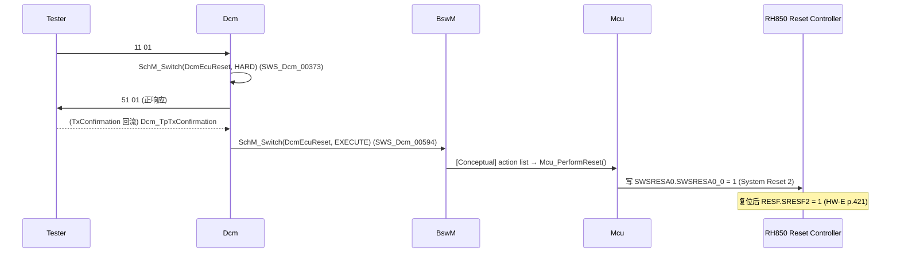

# 分层架构：每一层的职责边界与四条诊断路径

> Prerequisite: [Classic Platform 总览](01-classic-platform-overview.md)
> Next: [ECU 启动流程](03-ecu-startup.md)
> 对应规范: SWS CAN Driver R22-11（p.14, p.22–23, p.45–51, p.81）；SWS DCM R20-11（p.22–23, p.30–31, p.61, p.85, p.114–115, p.138）；SWS IoHwAb R24-11（p.8, p.15, p.20–21, p.48–50）；SWS MCU R24-11（p.31）。本仓库无 CanIf/CanTp/PduR/Dem/BswM/RTE SWS。
> 对应源码: openAUTOSAR `communication/CAN/CanIf/src/CanIf.c`、`communication/CAN/CanTp/src/CanTp.c`、`communication/ComServices/PDURouter/include/PduR_Cfg.h`、`diagnostic/Dcm/src/Dcm_{Dsl,Dsd,Dsp}.c`

---

## 1. 本章目标

上一章建立了“层”的概念。本章把每一层的**职责边界**讲清楚：它负责什么、**明确不负责什么**、它的输入输出是什么、它的配置是谁写的、坏了会出现什么症状。

为了不停留在概念，本章用**四条真实的诊断路径**贯穿所有层：

| 路径 | UDS 请求 | 穿过的层 | 教学重点 |
|---|---|---|---|
| A | `22 F1 90` 读 VIN | MCAL → ECUAL → Services → RTE → SWC | 数据从应用来 |
| B | `19 02 08` 读 DTC | MCAL → ECUAL → Dcm → Dem | 数据从服务层来（不经过 RTE） |
| C | `2F xx xx 03 ..` IO 控制 | Dcm → IoHwAb → Dio/Port | 诊断**向下**控制硬件 |
| D | `11 01` 硬复位 | Dcm → BswM → Mcu → RH850 复位控制器 | 诊断触发系统级动作 |

读完后，你应该能拿到任何一个“诊断不工作”的问题，先判断它**最可能坏在哪一层**，再决定看哪个模块的代码和配置。

---

## 2. 为什么职责边界如此重要？

在真实项目里，层与层的边界同时是：

- **团队边界**：MCAL 问题找芯片厂支持，CanIf/CanTp/Dcm 问题找 BSW 供应商，SWC 问题找应用团队。
- **配置边界**：每层有自己的 ECUC 配置容器，由不同的人、不同的工具维护。
- **Debug 边界**：每一层都有一个“可以观测的接口”（函数调用 + 参数）。在边界上打断点，就能二分定位问题。

一个没有边界意识的工程师 debug “诊断没响应”时会从 CAN 寄存器一路看到 SWC；有边界意识的工程师会先在 `CanIf_RxIndication`、`Dcm_TpRxIndication`、`PduR_DcmTransmit`、`Can_Write` 四个点打断点，30 分钟内定位到层。

---

## 3. 在系统中的位置：一张带“职责”的分层图



---

## 4. 逐层职责：负责什么、不负责什么

### 4.1 MCAL：Can 驱动

[AUTOSAR Standard] CAN SWS R22-11：

| 负责 | 依据 |
|---|---|
| 初始化 CAN 控制器的所有片上资源（引脚除外） | `SWS_Can_00239` p.22 |
| 把 CAN 帧写入硬件发送对象并触发发送；忙时返回 `CAN_BUSY`，**不取消**正在发送的帧 | `SWS_Can_00212/00213` p.81 |
| 从硬件对象读出接收帧，调用 `CanIf_RxIndication` | `SWS_Can_00279` p.48 |
| 检测 bus-off，转 STOPPED，通知 `CanIf_ControllerBusOff`；**禁止自动 bus-off 恢复** | `SWS_Can_00020` p.42、`SWS_Can_00274` p.43 |
| 保存 `swPduHandle` 直到发送确认时回传 | `SWS_Can_00276` p.45 |

| **不**负责 | 谁负责 |
|---|---|
| CAN ID 对应哪个上层 PDU、该交给谁 | CanIf（`SWS_Can_00058` p.23：Can 只把 CanIf 当来源/目的地） |
| 发送缓冲排队 | CanIf（p.51） |
| 记住控制器“应该”处于什么状态 | CanIf/CanSM（p.36：“Can 模块不记忆状态”） |
| bus-off 何时恢复 | CanSM（`SWS_Can_00274`） |
| CAN 引脚复用 | Port（`SWS_Can_00239`） |

**诊断路径中的角色**：Can 驱动对 UDS 一无所知。`22 F1 90` 对它来说只是 CAN ID `0x7E0`（举例，实际 ID 由项目定义）、DLC 8、8 字节数据。

[RH850 Hardware] Can 驱动在 P1M-E 上操作 RS-CANFD（1 unit、3 channels、base `0xFFD2_0000`，HW-E p.788, p.791）：接收规则表 GAFL（硬件过滤）、RX FIFO / RX buffer、TX buffer。详见 [04-can-mcal/02-rh850-can-peripheral.md](../04-can-mcal/02-rh850-can-peripheral.md)。

### 4.2 ECU Abstraction：CanIf

[AUTOSAR Standard]（本仓库无 CanIf SWS；以下来自 CAN SWS 中对 CanIf 的描述及 R4.x 公认职责，需以 CanIf SWS 确认）

| 负责 | 说明 |
|---|---|
| 统一多个 Can 驱动的接口 | 一个 ECU 可能有片上 + 片外控制器 |
| CAN ID ↔ L-PDU（`PduIdType`）映射 | 收：按 HRH + CAN ID 查表；发：按 TxPduId 查 HTH 和 CAN ID |
| 软件过滤（硬件过滤不够细时） | BasicCAN HRH 收到多个 ID 时 |
| 发送缓冲：`Can_Write` 返回 `CAN_BUSY` 时排队 | CAN SWS p.51, p.54 |
| 控制器模式与 PDU 模式（OFFLINE / ONLINE / TX_OFFLINE …） | 由 CanSM 请求 |
| 把 RxIndication 分发给 CanTp / PduR / CanNm 等上层 | 按配置的 “user type” |

**诊断路径中的角色**：CanIf 知道 “CAN ID `0x7E0` 是 CanTp 的 RxPdu #3”，但不知道它是 ISO-TP 单帧还是首帧。

openAUTOSAR 中一个非常有教育意义的检查（`communication/CAN/CanIf/src/CanIf.c:446-462`，`03-openautosar-trace.md` §3.2）：`CanIf_Transmit` 在**控制器不是 STARTED**（:451）或 **PDU mode 不是 ONLINE**（:460）时直接拒绝发送。这意味着：**如果没有人（CanSM/ComM，或集成代码）把控制器切到 STARTED、把 PDU 模式切到 ONLINE，诊断响应永远发不出去**——即使 DCM 完全正确。

### 4.3 CanTp：ISO 15765-2 传输层

| 负责 | 不负责 |
|---|---|
| 识别 SF/FF/CF/FC；多帧重组与分段 | UDS 语义（SID、NRC） |
| 接收方向发送 FC（BS、STmin）；发送方向等待 FC | 缓冲的所有权（向 PduR/上层申请） |
| N_As/N_Bs/N_Cs/N_Ar/N_Br/N_Cr 超时监控 | CAN 帧的物理发送（交给 CanIf） |
| 填充（padding）| 路由（交给 PduR） |

时间相关的工作（超时、STmin）都在 `CanTp_MainFunction` 中推进——这使 CanTp 的行为**直接依赖 MainFunction 周期**。openAUTOSAR 的 `CanTp_Cfg.h:24` 假设周期 1000 ms，而 SchM 实际调度约 25 ms，是“周期不一致”的反面教材（见 [07-mainfunction-scheduling.md](07-mainfunction-scheduling.md)）。

### 4.4 PduR：路由

PduR 只做一件事：**按 PDU ID 把数据从源模块路由到目的模块**。诊断路径上它连接 CanTp 与 Dcm；如果同一个 ECU 还有 DoIP，PduR 会把 SoAd/DoIP 的诊断请求也路由到同一个 Dcm。这正是 DCM “网络无关”（DCM SWS p.23）得以成立的原因。

openAUTOSAR 的 `PduR_Cfg.h` 中有一组“zero-cost”宏（`03-openautosar-trace.md` §3.1：`PduR_Cfg.h:86-89, :127`），把 `PduR_CanTpProvideRxBuffer` 直接替换为 `Dcm_ProvideRxBuffer`、`PduR_DcmTransmit` 替换为 `CanTp_Transmit`。这是一种合法的优化思路（只有一条路由时省掉查表），但在该仓库中**无条件生效**，导致链接期重复符号。

### 4.5 Services：Dcm

[AUTOSAR Standard] DCM SWS R20-11：位于 Service Layer 的 Communication Services，覆盖 OSI 5–7 层（p.22），网络无关（p.23）。依赖 DEM、PduR、ComM、SW-C/RTE、BswM、NvM、IoHwAb 等（p.30–31）。

| 子模块 | 负责 |
|---|---|
| DSL（Session Layer） | 接收/发送缓冲、会话状态、P2/P2\*/S3 定时、NRC 0x78、TesterPresent |
| DSD（Service Dispatcher） | 按 SID 查服务表、检查会话/安全许可、SPRMIB |
| DSP（Service Processor） | 具体服务的处理：0x22 读 DID → 调数据接口 |

**不负责**：数据从哪里来（SWC / NvM / IoHwAb / Dem 提供）；CAN 帧格式；复位的物理执行（BswM/Mcu）。

关键时序（DCM SWS `SWS_Dcm_00024`，p.61）：如果服务处理需要更多时间，DSL 在 `P2ServerMax − DcmTimStrP2ServerAdjust` 到达时发送 NRC 0x78。这个“到达”是在 `Dcm_MainFunction` 中检测的。

### 4.6 Services：Dem

Dem 管理故障事件和 DTC。诊断路径上，Dcm 通过 `Dem_SetDTCFilter`、`Dem_GetNextFilteredDTC`、`Dem_SelectDTC` 等 API 读取 DTC（DCM SWS 可选接口表 p.261–265；R20-11 使用 ClientId + select 模式，p.82/p.116）。**本仓库没有 Dem SWS**，完整签名需在真实项目确认。

### 4.7 ECU Abstraction：IoHwAb

[AUTOSAR Standard] IoHwAb SWS R24-11：

- 属于 ECU Abstraction Layer，**不标准化其 C-API**，总是 ECU 专用实现（p.8）。
- 向下调用 ADC/OCU/PWM/ICU/DIO/PORT/GPT 驱动（`SWS_IoHwAb_00078`，p.15）。
- 所有硬件保护策略（短路、过温时切断输出）都在 IoHwAb 内（`SWS_IoHwAb_00038`，p.20–21），但**失效恢复策略**由负责的 SW-C 决定（`00039`，p.21）。
- 向 DCM 提供 `IoHwAb_Dcm_<EcuSignalName>(action, signal)`（`00135`，p.48–49）与 `IoHwAb_Dcm_Read<EcuSignalName>()`（`00139`，p.49–50）。

### 4.8 Services：BswM / EcuM / ComM

| 模块 | 诊断路径中的角色 |
|---|---|
| ComM | DCM 收到请求或进入非默认会话时调用 `ComM_DCM_ActiveDiagnostic`，阻止网络休眠（DCM SWS `SWS_Dcm_01373`，p.87–88）；DCM 发送响应前必须处于 Full Com（`01142`，p.85） |
| BswM | 订阅 DCM 的 ModeDeclarationGroup（会话、`DcmEcuReset`），执行 action list（例如复位）（DCM SWS `00594`，p.114–115） |
| EcuM | 启动/关机/休眠管理；复位原因的上层用户（MCU SWS p.51 `McuResetReason` 被 `EcuMResetReason` 引用） |

### 4.9 RTE 与 SWC

RTE 把 DCM 的“数据接口”映射到 SWC 的 runnable。在 R4.x 中，如果 DID 的 `DcmDspDataUsePort = USE_DATA_SYNCH_CLIENT_SERVER`，DCM 会调用类似 `Rte_Call_DataServices_<Data>_ReadData()` 的 RTE 函数，RTE 把它转成对 SWC 中某个 server runnable 的直接函数调用（DCM SWS p.223 关于同步/异步接口的说明；DataServices 端口见 `02-autosar-sws-notes.md` §3.9）。RTE SWS 不在本仓库，生成代码的具体形态需在真实项目确认。

---

## 5. 核心数据结构：四种“编号”贯穿所有层

诊断路径之所以难 debug，一个重要原因是**每一层都用自己的编号**。必须能在它们之间换算：

| 编号 | 所在层 | 例子 | 配置位置 |
|---|---|---|---|
| CAN ID（`Can_IdType`，最高两位编码帧类型） | Can / CanIf | `0x7E0`（物理请求，举例） | CanIf Rx/Tx PDU 配置 |
| HOH（HRH/HTH，`CanObjectId`） | Can / CanIf | HRH 0、HTH 2 | `CanHardwareObject`（CAN SWS `ECUC_Can_00326` p.125：HRH 与 HTH 共用连续 ID 空间） |
| L-PDU / N-PDU / I-PDU ID（`PduIdType`） | CanIf / CanTp / PduR / Dcm | `CanIfRxPduId=3` → `CanTpRxNPduId=1` → `PduRSrcPdu` → `DcmRxPduId=0` | 各模块的 PDU 引用（ARXML 中通过 EcuC Pdu 统一） |
| DID / SID / NRC | Dcm / SWC | `0xF190`、`0x22`、`0x31` | `DcmDspDid`、`DcmDsdService` |

> `Can_IdType` 是 `uint32`，最高两位：00 标准 CAN、01 标准 ID CAN FD、10 扩展 CAN、11 扩展 ID CAN FD（`SWS_Can_00416`，p.58）。接收扩展帧时 Can 必须把 MSB 置 1（`SWS_Can_00423`，p.48）。debug 时如果看到 `0x800007E0`，不要以为是错误 ID——它是“扩展帧 0x7E0”。

---

## 6. 初始化流程（与层次相关的约束）

初始化顺序在 [03-ecu-startup.md](03-ecu-startup.md) 详细展开。与本章相关的层次约束：

1. **Mcu 先于 Can**：`SWS_Can_00240`（p.22）的实现提示 “The Mcu module shall be initialized before initializing the Can module.”
2. **Port 先于 Can**：CAN 引脚复用由 Port 完成（`SWS_Can_00239`）。
3. **所有 `*_Init` 完成 ≠ 能通信**：Can_Init 后控制器处于 STOPPED（CAN SWS p.36–43 状态机），需要 CanSM/CanIf 请求 STARTED，CanIf PDU 模式需要切到 ONLINE。
4. **ComM 允许 Full Com** 之前 DCM 不能发响应（DCM `01142`，p.85）。

---

## 7. Runtime Flow：四条诊断路径

### 7.1 路径 A：`22 F1 90` 读 VIN（数据来自 SWC）



逐跳说明（只列关键 API 与“坏了的症状”）：

| # | Transition | API / 机制 | 坏了的症状 |
|---|---|---|---|
| 1 | Tester → RS-CANFD | 硬件过滤：GAFL 规则表（**GAFLM bit=1 表示比较**，HW-E p.834） | 总线上有帧，但 `GSTS`/`RFSTS` 无变化 → 规则表或 mask 错 |
| 2 | RS-CANFD → Can | RX FIFO 中断 EI190；电平中断，必须在 ISR 中清 `RFSTSx.RFIF`（HW-E p.285–290, p.847） | 中断风暴（未清标志）或无中断（EIC 屏蔽、OS 未配置 ISR） |
| 3 | Can → CanIf | `CanIf_RxIndication`（`SWS_Can_00279` p.48），ISR 上下文 | Can 收到了但 CanIf 不处理 → HRH/CAN ID 不在 CanIf Rx 表 |
| 4 | CanIf → CanTp | 按 Rx PDU 配置的 user type | openAUTOSAR 当前配置**只路由到 PduR/Com，没有 CanTp**（`03-openautosar-trace.md` §3.3） |
| 5 | CanTp → PduR → Dcm | `StartOfReception/CopyRxData/TpRxIndication`（R4.x 风格；openAUTOSAR 为 R3.x `ProvideRxBuffer`） | `BUFREQ_E_OVFL`：Dcm 缓冲（`DcmDslBufferSize`，DCM p.459）不够 |
| 6 | Dcm 内部 | DSD 查表 → NRC 0x11/0x7F/0x33（DCM §3.7 笔记） | 回 `7F 22 11` → 服务未配置；`7F 22 31` → DID 不存在或当前会话不支持 |
| 7 | Dcm → RTE → SWC | DataServices 端口 | 回 `7F 22 10`（未指定 NRC 时默认 0x10，`SWS_Dcm_00271`） |
| 8 | Dcm → … → Can_Write | 逐层下发；`CAN_BUSY` 由 CanIf 排队 | CanIf 拒绝：控制器不是 STARTED / PDU 不是 ONLINE |
| 9 | FC 与 CF | CanTp_MainFunction 推进 STmin/N_Bs | Tester 报 N_Bs 超时 → CanTp 周期或 FC 路由问题 |
| 10 | TxConfirmation 回流 | Tx 中断 → `CanIf_TxConfirmation` → … → `Dcm_TpTxConfirmation`（DCM `00353` p.59：停止 P2 监控） | 最后一帧发出但 DCM 没收到确认 → 下一个请求被拒（DCM 认为仍忙） |

### 7.2 路径 B：`19 02 08` 读 DTC（数据来自 Dem，不经过 RTE）



要点：

- Dcm 与 Dem 都在 Service Layer，**直接函数调用，不经过 RTE**。
- R20-11 中所有 Dem API 带 `ClientId`，来自协议行配置 `DcmDemClientRef`（`ECUC_Dcm_01083`，p.467；`SWS_Dcm_01369` p.82）。这是 4.3.0 “Redesign interfaces between Dem and Dcm” 之后的设计（DCM p.2）。
- Dem 返回 `DEM_PENDING` 时，Dcm 在下一个 MainFunction 重调（`SWS_Dcm_01412`，p.110）。所以读大量 DTC 可能跨越多个 `Dcm_MainFunction` 周期，可能触发 NRC 0x78。
- Dem API 完整签名不在本仓库（无 Dem SWS），以上名称来自 DCM SWS 可选接口表 p.261–265。

### 7.3 路径 C：`2F` InputOutputControlByIdentifier（诊断向下控制硬件）



要点：

- action 取值：`IOHWAB_RETURNCONTROLTOECU / RESETTODEFAULT / FREEZECURRENTSTATE / SHORTTERMADJUSTMENT`（`SWS_IoHwAb_00135`，p.48–49）。
- “锁定”语义（p.49）：信号对 SW-C 软件锁定，SW-C 的请求不再影响硬件。这就是 IoHwAb 存在的意义之一——**诊断与应用对同一个物理输出的仲裁点在 IoHwAb**，而不是在 Dio。
- 0x22 读 ECU 信号可用 `USE_ECU_SIGNAL` → `IoHwAb_Dcm_Read<EcuSignalName>()`（DCM `SWS_Dcm_00578` p.138），且 `00140`（IoHwAb p.49–50）要求**无论是否锁定，总是读当前物理值**。
- 保护策略（`SWS_IoHwAb_00038`）：例如诊断要求打开一个输出，但 IoHwAb 检测到短路，它可以拒绝或切断。
- 本仓库是教学项目，没有真实原理图，IoHwAb 的具体信号与引脚映射一律是 `[Conceptual]`。

### 7.4 路径 D：`11 01` HardReset（诊断触发系统级动作）



要点：

- DCM 规范只到 BswM：**正响应发送确认后**切换 `DcmEcuReset` 到 `EXECUTE`，“由 BswM 根据 action list 完成最终复位”（`SWS_Dcm_00594`，p.114–115）。“先回响应再复位”的时序非常重要——否则 Tester 收不到 `51 01`。
- openAUTOSAR（R3.x）用的是更直接的方式：在 `DspDcmConfirmation` 中，正响应发完后调用 `DcmE_EcuPerformReset` / `Mcu_PerformReset`（`diagnostic/Dcm/src/Dcm_Dsp.c:1971-1981`）。时序同样是“先响应后复位”，值得学习。
- `Mcu_PerformReset`（`SWS_Mcu_00143/00144`，MCU p.31）使用硬件功能执行复位，类型由 `McuResetSetting` 配置决定。在 P1M-E 上可选 `SWSRESA0`（System Reset 2）或 `SWARESA0`（Application Reset 1）（HW-E p.418, p.424–425）。两者初始化的范围不同（Table 8.2，HW-E p.418），选择哪一个是**配置决策**，详见 [03-mcal/02-mcu-driver.md](../03-mcal/02-mcu-driver.md)。
- 复位后，`Mcu_GetResetReason` 读取 RESF，EcuM 据此判断启动原因；DCM 可通过 `Dcm_GetProgConditions` 判断是否需要补发响应（`02-autosar-sws-notes.md` §7 第 4 条）。

---

## 8. RH850 Hardware Mapping：每层“最底下”接触的硬件

| 层 / 模块 | 直接接触的 RH850/P1M-E 资源 | 依据 |
|---|---|---|
| Can | RS-CANFD `0xFFD2_0000`：GCFG/GCTR/GSTS、CmCFG/CmCTR/CmSTS、GAFL、RFCC/RFSTS、TMC/TMSTS | HW-E p.798–799 |
| Can 中断 | EI183–193（189 全局错误，190 全局 RX FIFO） | HW-E p.285–286, p.792 |
| Port | PMCn/PFCn/PFCEn/PFCAEn/PMn/PIBCn（`PORT_base = 0xFFC1_0000`） | HW-E p.91, p.94, p.99 |
| Dio | Pn/PSRn/PNOTn/PPRn | HW-E p.95–96, p.99 |
| Mcu | RESF/RESFC/SWSRESA0/SWARESA0、STAC_*；P1M-E **没有**软件可配 PLL 寄存器 | HW-E p.420–425, p.471 |
| Gpt / OS 节拍 | OSTM0/1（EI 74/75） | HW-E p.1543–1544 |
| CanIf / CanTp / PduR / Dcm / Dem | **无**（纯软件） | — |
| IoHwAb | 间接（经 Dio/Adc/Pwm/Icu） | IoHwAb p.15 |

---

## 9. openAUTOSAR 实现：链路是“意图存在，配置断开”

`03-openautosar-trace.md` §3 对 RX/TX 两条链路做了逐跳追踪。关键入口：

| 跳 | openAUTOSAR 位置 | 说明 |
|---|---|---|
| CanIf 收 | `communication/CAN/CanIf/src/CanIf.c:764` | `CanIf_RxIndication(Hrh, CanId, CanDlc, CanSduPtr)`——R3.x 签名，R4.x 改为 `(Mailbox, PduInfoPtr)` |
| CanIf 软件过滤 | `CanIf.c:794-822` | 线性扫描 Rx PDU 表 |
| CanTp 收 | `communication/CAN/CanTp/src/CanTp.c:1001` | 帧类型判定、SF/FF/CF/FC 分派 |
| Dcm 收 | `diagnostic/Dcm/src/Dcm.c:109`、`:124` | R3.x `Dcm_ProvideRxBuffer` / `Dcm_RxIndication` |
| DSL → DSD | `Dcm_Dsl.c:854` → `Dcm_Dsd.c:369-379` | 只置标志，异步到下一次 MainFunction |
| DSD 服务分发 | `Dcm_Dsd.c:86`（switch :89） | 0x22 → `Dcm_Dsp.c:1386` |
| CanIf 发 | `CanIf.c:424`；状态检查 `:446-462`；`Can_Write` 调用 `:470` | `Can_Write` 在仓库中**未定义** |
| 0x11 复位 | `Dcm_Dsp.c:1971-1981` | 正响应确认后才复位 |

在当前仓库配置下，这条链路至少在 6 个地方断开（无 Can 驱动、CanIf 未接 CanTp、CanTp 配置不完整、PduR 宏重复定义、Dcm 无配置、调度未接；`03-openautosar-trace.md` §3.3）。**它的价值在于模块内部的状态机与算法，而不是“模块间如何被配置连起来”**——后者恰好是本教程要补的。

DID 读取路径的版本差异也值得注意：openAUTOSAR 的 DCM 通过配置中的 C 函数指针 `DspDidReadDataFnc` 直接调用应用（`Dcm_Lcfg.h:179-181`，调用点 `Dcm_Dsp.c:1254`），`UsePort` 字段从未被读取，**没有任何 `Rte_Call_*`**。这是 R3.x 的 “callout 风格”；R4.x 中是 “service port 风格”（`03-openautosar-trace.md` §4.4、§5）。

---

## 10. 当前教学项目实现

`examples/rh850_mcal_reference/` 目前只覆盖最底层的硬件辅助（OSTM、CAN 位时间计算），没有任何诊断路径代码。Phase 5 计划中的 `examples/uds_diag_demo/` 会实现 “Mock Can → CanIf → CanTp → PduR → Dcm → Rte → VehicleInfoSWC” 的 host 可运行诊断栈，正好对应本章路径 A。在它创建之前，本章的 sequenceDiagram 就是它的设计说明。

[Educational Implementation] 教学实现中每个组件在真实 ECU 中的对应：

| 教学组件 | 真实 ECU 中对应 |
|---|---|
| Mock Can（内存队列模拟 RX FIFO / TX buffer） | Renesas RH850 Can MCAL + RS-CANFD |
| 简化 CanIf（一张 CAN ID ↔ PduId 表） | RTA-CAR CanIf + 生成的 `CanIf_PBcfg.c` |
| 简化 CanTp（SF/FF/CF/FC） | RTA-CAR CanTp |
| 直连 PduR | RTA-CAR PduR（路由表生成） |
| 简化 Dcm（DSL/DSD/DSP 骨架） | RTA-CAR Dcm |
| 简化 Rte（函数指针表） | RTE 生成器输出 |
| VehicleInfoSWC | 应用团队的 SWC |

---

## 11. Code Walkthrough：在边界上读代码

推荐的“边界读码法”：每层只读三样东西——**入口函数**、**出口调用**、**配置查表点**。以 CanIf 收方向为例（openAUTOSAR `CanIf.c:764` 起）：

1. **入口**：`CanIf_RxIndication(Hrh, CanId, CanDlc, CanSduPtr)`。参数告诉你下层给了什么：硬件对象、ID、长度、数据指针。
2. **查表点**：`CanIf_Arc_FindHrhChannel(Hrh)`（`CanIf.c:100`）→ 得到 channel；检查 PDU mode（`:778-789`）；线性扫描 Rx PDU 配置做软件过滤（`:794-822`）；DLC 检查（`:825-831`）。
3. **出口**：`switch(entry->CanIfRxUserType)` 按用户类型调用上层（`:868-878` 是 CanTp 分支）。

读完这三点，你就知道“CanIf 丢帧”只可能有四个原因：HRH 没映射到 channel、PDU mode 不对、没有匹配的 Rx PDU、DLC 检查失败。

> 注意 `03-openautosar-trace.md` §2.2 记录了一个真实缺陷：`CanIf.c:820` 在 “unsupported filter type” 分支 `continue` 前没有 `entry++`，可能死循环。读开源代码时要带着怀疑。

---

## 12. Debug 方法：按层二分

推荐的四个“边界断点”（适用于真实项目的任何诊断问题）：

```text
断点 1: CanIf_RxIndication       → 帧是否到达软件?  (否 → 硬件/MCAL/中断)
断点 2: Dcm_TpRxIndication       → 请求是否完整到达 DCM? (否 → CanIf/CanTp/PduR 配置)
断点 3: PduR_DcmTransmit         → DCM 是否产生了响应? (否 → DCM 配置/服务/数据接口)
断点 4: Can_Write                → 响应是否到达驱动? 返回值? (否/NOT_OK → CanIf 模式/CanTp)
```

| 断点 1 | 断点 2 | 断点 3 | 断点 4 | 最可能的层 |
|---|---|---|---|---|
| ✗ | — | — | — | MCAL / RH850（GAFL 过滤、FIFO 使能 RFE、EIC、引脚、bit timing） |
| ✓ | ✗ | — | — | CanIf/CanTp/PduR 路由或缓冲 |
| ✓ | ✓ | ✗ | — | DCM（服务表、会话、安全、数据接口返回值） |
| ✓ | ✓ | ✓ | ✗ | PduR/CanTp 发送路由、CanIf 控制器/PDU 模式 |
| ✓ | ✓ | ✓ | ✓ 但总线无帧 | Can 驱动 / RS-CANFD（TX buffer、通道模式、COMSTS） |

[Real Project Consideration] 断点会破坏时序（P2 = 50 ms 级别，CanTp 的 N_Cr 等也是几十到上千毫秒）。在多帧场景下，更好的方法是在这四个点**记录时间戳到 RAM 环形缓冲**，事后读取；或者用 CANoe 的 trace 对照。

---

## 13. 常见问题 / 常见错误

1. **把诊断问题归咎于 DCM，而实际是 CanIf PDU mode 未 ONLINE**。症状：DCM 产生了响应（断点 3 命中），但 `CanIf_Transmit` 返回 `E_NOT_OK`。
2. **把 `CAN_BUSY` 当作错误处理**。它是“暂时无可用硬件对象”，CanIf 应排队（CAN SWS p.51）。
3. **在 SWC 中直接控制输出，绕过 IoHwAb**。结果：诊断 0x2F 的 “锁定”无法生效，SWC 和 Tester 同时写同一个引脚。
4. **复位前没等正响应发送完成**。`11 01` 后 Tester 报 “no response”。规范要求在 `Dcm_TpTxConfirmation` 之后才 `EXECUTE`（`SWS_Dcm_00594`）。
5. **忽视 `Can_IdType` 的高位编码**，把扩展帧 ID `0x80000123` 当作非法值过滤掉。
6. **混用 R3.x 与 R4.x 的接口名**：在 openAUTOSAR 里看到 `Dcm_ProvideRxBuffer`，在 RTA-CAR 里看到 `Dcm_StartOfReception`/`Dcm_CopyRxData`，它们是同一职责在不同 Release 中的形态。

---

## 14. 实验

1. **画四种编号的映射表**：任选路径 A，假设 CAN ID `0x7E0/0x7E8`、HRH 0/HTH 2、CanIf Rx PDU 3、CanTp NSdu 1、Dcm Rx PDU 0、DID `0xF190`，写出每一层看到的“编号”。然后把其中一个映射故意配错，预测断点表中哪一列会失败。
2. **openAUTOSAR 路由断点实验**（只读代码）：阅读 `CanIf_Cfg.c` 的 Rx PDU 配置，确认它的 user type 是什么，解释为什么 `22 F1 90` 在该仓库配置下永远到不了 Dcm。
3. **时序实验**（纸面）：假设 `Dcm_MainFunction` 周期 10 ms，`CanTp_MainFunction` 周期 5 ms，P2ServerMax = 50 ms，SWC 读 VIN 需要 3 个 MainFunction 周期（异步 `DCM_E_PENDING`）。画时间轴，计算响应的最早/最晚首帧发送时间，判断是否需要 NRC 0x78。

---

## 15. 思考题

1. 为什么 Dcm 与 Dem 之间是直接 C 调用，而 Dcm 与 SWC 之间要经过 RTE？（提示：两者都是 BSW；SWC 的可移植性与 AUTOSAR 方法论。）
2. 如果同一个 ECU 支持 CAN 诊断和 DoIP 诊断，哪一层需要“知道”两者的区别？DCM 需要改吗？
3. IoHwAb 中的“锁定”与 DCM 的会话/安全检查是什么关系？如果 S3 超时导致回到默认会话，0x2F 的控制应该怎样处理？（提示：DCM 在会话切换时会通知；IoHwAb 的 `RETURNCONTROLTOECU`。）
4. 路径 D 中如果 BswM 的 action list 没有配置复位动作，会发生什么？DCM 会认为复位成功吗？

---

## 16. 对未来真实项目的意义

以后在真实 RH850 + RTA-CAR 项目中处理“诊断无响应 / 响应错误”时：

1. **先按 §12 的四个边界断点（或 trace 点）二分到层**，不要直接读 DCM 源码。
2. **建立“四种编号”对照表**：从 CAN DBC/ARXML 的 CAN ID → `CanIf_PBcfg.c` 中的 HRH/HTH 与 PduId → CanTp NSdu → PduR 路由 → Dcm 协议行与 Rx/Tx PduRef → DID 表。这张表是 DCM 升级时最容易出错、也最能体现经验的地方。
3. **核对模式管理**：CanSM/ComM 是否把控制器切到 STARTED、PDU 切到 ONLINE；DCM 的 `ComM_DCM_ActiveDiagnostic` 是否阻止了休眠。
4. **核对数据来源**：每个 DID 的 `DcmDspDataUsePort`（SWC/RTE、NvM、IoHwAb、callout），这决定了数据错误时应该找哪个团队。
5. **核对复位链**：`DcmEcuReset` → BswM 规则 → `Mcu_PerformReset` → `McuResetSetting`，以及复位后 `Mcu_GetResetReason` 的映射。
6. **把真实工程的每个模块放回本章的分层图**，标注“谁交付、哪个 Release、配置在哪个工具”。

---

## 17. 本章总结

- 每一层都有清晰的“负责 / 不负责”。Can 只管硬件对象，CanIf 管 ID 与模式，CanTp 管分段与超时，PduR 管路由，Dcm 管 UDS 语义，IoHwAb 管 ECU 信号与仲裁，BswM 管系统动作。
- 四种编号（CAN ID / HOH / PduId / DID）贯穿整个路径，debug 时必须能互相换算。
- 四条诊断路径展示了数据的三种来源（SWC、Dem、IoHwAb）和一种系统动作（复位）。
- 按层二分的 debug 方法：`CanIf_RxIndication` → `Dcm_TpRxIndication` → `PduR_DcmTransmit` → `Can_Write`。

## 18. 下一章

[03-ecu-startup.md](03-ecu-startup.md)：在这些层能工作之前，它们必须按正确的顺序被初始化。下一章讲 EcuM 如何从 `main()` 一步步把 Mcu、Port、Can、CanIf、CanTp、PduR、Dcm、Dem、NvM、RTE 带起来，以及顺序错了会发生什么。
