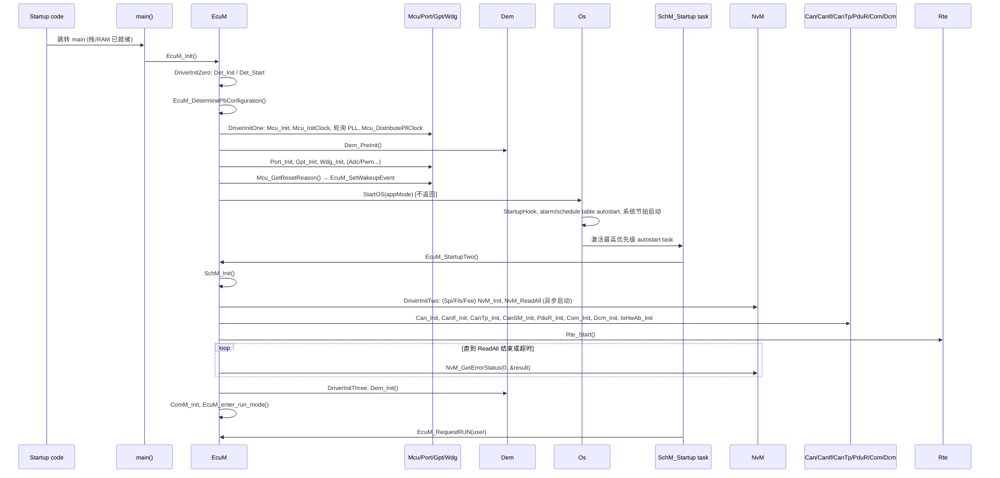
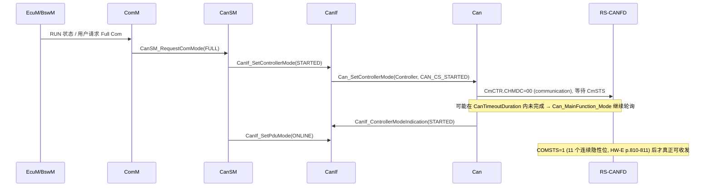
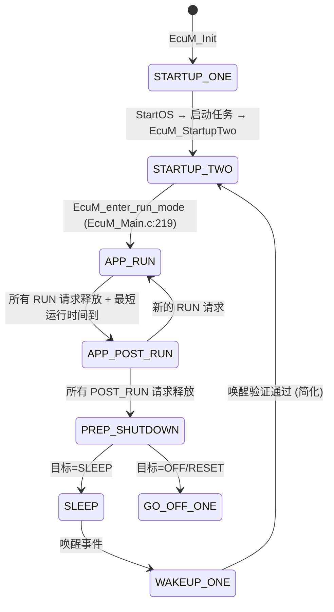
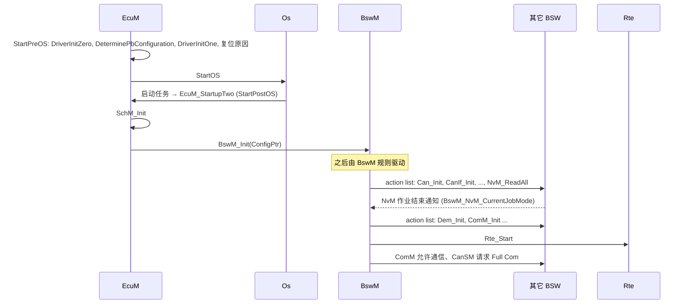

# ECU 启动流程：从复位向量到 Rte_Start

> Prerequisite: [RH850 启动流程](../01-rh850/04-startup-process.md), [分层架构](02-layered-architecture.md)
> Next: [配置与 ARXML](04-configuration-arxml.md)
> 对应规范: SWS MCU R24-11（p.13–14 start-up code, p.24–31, p.36 示例序列, p.51 `McuResetReason`）；SWS CAN R22-11（p.22 `SWS_Can_00239/00240`, p.36–43 控制器状态机）；SWS DCM R20-11（p.85, p.87–88）；SWS IoHwAb R24-11（p.29 `00036/00037`）。**本仓库没有 EcuM、BswM、Os、NvM、Dem、CanIf、CanTp、PduR、RTE 的 SWS**——涉及这些模块的状态名与 API 均为 R4.x 公认形态，需以真实项目所用 Release 的 SWS 确认。
> 对应源码: openAUTOSAR `system/kernel/src/init.c`、`system/EcuM/src/EcuM.c`、`system/EcuM/src/EcuM_Callout_Stubs.c`、`system/EcuM/src/EcuM_Main.c`、`system/SchM/src/SchM.c`、`examples/rte_simple/rte_simple.c`

---

## 1. 本章目标

1. 能画出一条完整的启动时间线：复位 → startup code → `main()` → `EcuM_Init()` → driver init lists → `StartOS()` → 启动任务 → `EcuM_StartupTwo()`（或 BswM 驱动的后续初始化）→ `NvM_ReadAll` → `Rte_Start()` → RUN。
2. 知道 `Mcu_Init`、`Port_Init`、`Can_Init`、`CanIf_Init`、`CanTp_Init`、`PduR_Init`、`Dcm_Init`、`Dem_PreInit`/`Dem_Init`、`NvM_ReadAll` 各自应该出现在哪个阶段，**为什么必须在那里**。
3. 理解 “Init 完成” 与 “可以通信” 的区别：Can_Init 之后控制器是 STOPPED；CanIf PDU 模式需要 ONLINE；DCM 需要 Full Com。
4. 理解 R4.x EcuM 的两种配置风格（Fixed / Flexible）与 BswM 的角色，并知道在真实 RTA-CAR 工程中该去哪里找初始化顺序。
5. 能把启动失败的症状（死循环在 PLL 等待、看门狗复位、NvM 读超时、CAN 不发）定位到具体阶段。

---

## 2. 为什么启动顺序如此重要？

ECU 启动就像建房子：地基（时钟、RAM、栈）→ 水电（引脚、定时器、中断）→ 结构（OS）→ 设备（通信栈、诊断）→ 住户（应用）。任何一步顺序错了，后果都不是“报错”，而是**静默的错误行为**：

| 顺序错误 | 静默后果 |
|---|---|
| Can_Init 在 Mcu 时钟配置之前 | 位时间按错误的 fCAN 计算，总线上全是错误帧 |
| Can_Init 在 Port_Init 之前 | 控制器配好了，但引脚还是 GPIO，总线上没有任何信号 |
| Dem_Init 在 NvM_ReadAll 完成之前 | DTC 状态从默认值开始，上一次点火周期的故障“消失”，或被覆盖写回 |
| 启动早期看门狗未处理 | 在等待 PLL/NvM 的循环中被 WDTA 复位，表现为“偶发无限重启” |
| Rte_Start 前 SWC runnable 被触发 | SWC 访问未初始化的 RTE 缓冲 |

所以 AUTOSAR 把启动的编排交给一个专门的模块——**EcuM（ECU State Manager）**，并在 R4.x 中进一步把“可配置的部分”交给 **BswM**。

---

## 3. 在系统中的位置：启动的三段式


三段的本质区别：

| 阶段 | 能用什么 | 不能用什么 |
|---|---|---|
| Startup code | 只有 CPU 和 Flash；栈刚建立 | C 全局变量（`.data` 拷贝前）、任何驱动、OS |
| EcuM_Init（OS 之前） | 已初始化的 RAM；MCAL 驱动 | OS 服务（任务、事件、计数器、`GetCounterValue`）；周期 MainFunction |
| StartOS 之后 | OS、任务、alarm、MainFunction 调度 | 尚未初始化的 BSW 模块 |

---

## 4. AUTOSAR 如何定义？

### 4.1 MCU SWS 对 start-up code 的界定

[AUTOSAR Standard] MCU SWS R24-11 p.13–14 明确：**start-up code 在 MCU 驱动之前执行**，它负责（规范称为“指导性”内容，细节由 MCU 设计规格决定）：

- 设置中断/异常向量基址；
- 设置中断栈与用户栈指针、上下文保存区；
- 看门狗：在 WDG 驱动接管前“先不喂/拉长超时”；
- Cache、内存保护、外部存储初始化；
- **默认时钟**（含全局预分频）；
- SFR 写保护、一次性写寄存器；
- 最少量 RAM 初始化。

配合寄存器归属规则（`SWS_Mcu_00246/00247`，p.25）：“复位后必须立即写入的一次性寄存器 → start-up code；其它 → start-up code”。

[RH850 Hardware] 在 RH850/P1M-E 上对应的事实（`04-rh850-hardware-notes.md` §3）：

| start-up 职责 | P1M-E 事实 | 出处 |
|---|---|---|
| 复位入口 | reset vector = RBASE 初值；user mat 启动时为 `0x0000_0000` | HW-E p.258 |
| 中断状态 | PSW 复位值 `0x20`，**ID=1，EI 级中断被屏蔽** | HW-E p.197 |
| 通用寄存器 | 复位后 r1–r31 **未定义**，必须设置 SP(r3)/GP(r4)/TP(r5)/EP(r30) | HW-E p.190 |
| 向量基址 | `PSW.EBV` 选择 RBASE/EBASE；表引用中断需设置 `INTBP` | HW-E p.205–206, p.281 |
| RAM/ECC | LRAM/GRAM 等在复位时**由硬件清零并写入正确 ECC**，可通过 `STAC_*` 关闭 | HW-E p.2890, p.427–430 |
| 看门狗 | `OPBT0.OPWDRUN` 决定 WDTA0 是否复位后自动运行 | HW-E p.2884 |
| 时钟 | P1M-E **没有**软件可配 PLL 寄存器，CPU 160 MHz / HSB 80 MHz / LSB 40 MHz 固定 | HW-E p.469–471 |

所以在 P1M-E 上，“默认时钟”这一项 start-up code 几乎不需要做什么；而在有 PLL 的 RH850 衍生型号上（例如 F1x 系列），这一项可能由 start-up 或 `Mcu_InitClock` 完成——**需根据实际芯片手册确认**。详见 [RH850 启动流程](../01-rh850/04-startup-process.md) 与 [MCU 驱动](../03-mcal/02-mcu-driver.md)。

### 4.2 EcuM：Fixed 与 Flexible

[AUTOSAR Standard]（**本仓库无 EcuM SWS**；以下为 R4.x 公认结构，需以项目所用 Release 的 EcuM SWS 确认）

R4.0 起 EcuM 规范描述了两种配置风格：

| 风格 | 特点 | 状态（简化） |
|---|---|---|
| **EcuM Fixed** | 启动/关机序列由 EcuM 固定编排；STARTUP 分为 STARTUP I（OS 前）与 STARTUP II（OS 后），II 中由 EcuM 自己调用 driver init list two/three、等待 NvM_ReadAll、启动 RTE | STARTUP（I/II）、RUN、POST_RUN、SHUTDOWN、SLEEP、WAKEUP… |
| **EcuM Flexible** | EcuM 只负责 OS 前的启动（StartPreOS）和 OS 后的最小部分（StartPostOS：SchM_Init、BswM_Init），**之后的模块初始化、RUN/POST_RUN 的仲裁全部交给 BswM 的规则与 action list** | STARTUP、UP（由 BswM 管理子模式）、SHUTDOWN、SLEEP |

不同 Release 对 Fixed 的支持程度有变化（后续 Release 中 Flexible 成为主流）。真实工程中：**先确认项目用的是哪种风格**——这决定了你去 `EcuM_Callout_Stubs.c`/`EcuM_Cfg.c` 还是去 `BswM_Cfg.c`/BswM 的 action list 里找 `Can_Init`。

openAUTOSAR 是 R3.1.5 风格（与 Fixed 相似）：状态名 `ECUM_STATE_STARTUP_ONE = 0x11`、`ECUM_STATE_STARTUP_TWO = 0x12`、`ECUM_STATE_RUN = 0x30`、`ECUM_STATE_APP_RUN = 0x32`、`ECUM_STATE_APP_POST_RUN = 0x33`、`ECUM_STATE_PREP_SHUTDOWN = 0x44`、`ECUM_STATE_SLEEP = 0x50` 等（`system/EcuM/include/EcuM_Types.h:42-62`）。

### 4.3 各模块 SWS 对启动的约束（本仓库可查到的）

| 约束 | 规范 |
|---|---|
| `Mcu_InitClock`、`Mcu_InitRamSection`、`Mcu_PerformReset` 等必须在 `Mcu_Init` 之后调用 | `SWS_Mcu_00139` p.27、`00136` p.26、`00145` p.31 |
| `Mcu_InitClock` 启动 PLL 后**立即返回，不等待锁定** | `SWS_Mcu_00138` p.27 |
| `Mcu_GetResetReason` 在 Init 前返回 `MCU_RESET_UNDEFINED` | `SWS_Mcu_00133` p.30 |
| 规范示例启动序列：Init → InitClock → InitRamSection（与锁定并行）→ 轮询 GetPllStatus → DistributePllClock | MCU SWS p.36 |
| Mcu 先于 Can 初始化（共享寄存器由 Mcu 配置） | `SWS_Can_00240` p.22 |
| CAN 引脚由 Port 驱动配置 | `SWS_Can_00239` p.22 |
| Can_Init 后控制器处于 STOPPED | CAN SWS p.36–43（`00259`） |
| IoHwAb 的 Init/DeInit 由 EcuM 独占调用 | `SWS_IoHwAb_00036/00037` p.29 |
| 即使 PRE-COMPILE 变体，`Mcu_Init` 也带指针参数（传 NULL） | `SWS_Mcu_00126` p.38 |

---

## 5. 核心数据结构

### 5.1 EcuM 配置：“所有模块配置指针的总表”

EcuM 的 post-build 配置里有一组指向其他模块配置的指针。openAUTOSAR 的定义非常直观（`system/EcuM/include/EcuM_Generated_Types.h:101-182`，摘录）：

```c
/* [openAUTOSAR] system/EcuM/include/EcuM_Generated_Types.h（摘录） */
typedef struct EcuM_ConfigS {
    EcuM_StateType EcuMDefaultShutdownTarget;
    uint8          EcuMDefaultSleepMode;
    AppModeType    EcuMDefaultAppMode;
    uint32         EcuMRunMinimumDuration;
    uint32         EcuMNvramReadAllTimeout;      /* :107 等待 NvM_ReadAll 的超时 */
    uint32         EcuMNvramWriteAllTimeout;
    /* ... */
    const Mcu_ConfigType  *McuConfig;            /* :117 */
    const Port_ConfigType *PortConfig;           /* :120 */
    const Can_ConfigType  *CanConfig;            /* :123 */
    const CanIf_ConfigType *CanIfConfig;
    const PduR_PBConfigType *PduRConfig;
    const Gpt_ConfigType  *GptConfig;
    /* ... */
} EcuM_ConfigType;
```

`EcuM_DeterminePbConfiguration()` 返回指向这个结构体的指针（openAUTOSAR `EcuM_Callout_Stubs.c:156-159` 返回 `&EcuMConfig`——但 `EcuMConfig` 的定义在仓库中**缺失**）。在支持多套 post-build 配置（例如不同车型变体）的项目中，这个 callout 会根据某个硬件编码引脚或 Flash 中的标识选择配置集。详见 [04-configuration-arxml.md](04-configuration-arxml.md)。

### 5.2 运行时状态

| 状态 | 位置 | 用途 |
|---|---|---|
| EcuM 当前状态 | openAUTOSAR `EcuM_World`（`set_current_state()` 在 `EcuM.c:117, :204`） | `SchM_BswService` 按状态决定调度哪些 MainFunction |
| 各模块 “已初始化” 标志 | 每个模块内部（例如 `Mcu_Global.initRun`，`Mcu.c:358`） | DET 检查 `MCU_E_UNINIT` |
| 复位/唤醒原因 | EcuM 内部 wakeup event 位图 | 决定启动目标、上报给应用 |
| NvM ReadAll 结果 | NvM 多块请求状态 | EcuM 轮询或 BswM 规则 |

---

## 6. 初始化流程：逐阶段详解

### 6.1 总时序图（openAUTOSAR 风格，接近 EcuM Fixed）



> 注意：openAUTOSAR 在 `EcuM_Init` 中调用了 `InitOS()`（`EcuM.c:123`）和 `Os_IsrInit()`（`:126`），这是 Arctic 的做法（OS 的内部初始化），不是 R4.x EcuM 的标准步骤。R4.x 中 `StartOS` 内部完成 OS 初始化。

下面逐阶段解释每个调用“为什么在这里”。

### 6.2 Startup code → main()

openAUTOSAR 的 `main()`（`system/kernel/src/init.c:290`）在调用 `EcuM_Init()`（`:343`）之前做了一件很有意思的事：**链接文件自检**——检查 `.data` 中的变量是否等于初值、`.bss` 中的变量是否为 0（`init.c:298-335`，失败时 `BAD_LINK_FILE()`）。这在 RH850 上同样有价值：如果启动代码没有正确拷贝 `.data` 或清零 `.bss`，后续所有模块的“已初始化”标志都可能是随机值。

[RH850 Hardware] 由于 P1M-E 的 LRAM/GRAM 在复位时由硬件清零（HW-E p.2890），即使 C runtime 忘了清 `.bss`，上电后 `.bss` 也“碰巧”是 0；但 **Application Reset 1 可以关闭某些 RAM 的硬件清零**（HW-E p.434），此时 `.bss` 中就会残留上次运行的值。这类 bug 只在软件复位后出现，极难复现——启动代码必须自己清 `.bss`，不能依赖硬件。

### 6.3 EcuM_Init（STARTUP I）：OS 之前

openAUTOSAR `system/EcuM/src/EcuM.c:113-187`：

```c
/* [openAUTOSAR] system/EcuM/src/EcuM.c:113-187（结构摘录，省略错误处理） */
void EcuM_Init(void) {
    set_current_state(ECUM_STATE_STARTUP_ONE);            /* :117 */
    EcuM_AL_DriverInitZero();                             /* :120  Det_Init/Det_Start */
    InitOS();                                             /* :123  Arctic 特有 */
    Os_IsrInit();                                         /* :126  Arctic 特有 */
    EcuM_World.config = EcuM_DeterminePbConfiguration();  /* :129 */
    EcuM_AL_DriverInitOne(EcuM_World.config);             /* :134 */
    switch (Mcu_GetResetReason()) { /* → EcuM_SetWakeupEvent */ }   /* :137-151 */
    EcuM_World.initiated = TRUE;                          /* :155 */
    /* 选择默认 shutdown target 与 application mode */     /* :159-173 */
    StartOS(appMode);                                     /* :186 不返回 */
}
```

**DriverInitZero** 只初始化“确定 post-build 配置所需要的驱动”和 Det（`EcuM_Callout_Stubs.c:169-177`）。Det 最先初始化，因为之后所有模块的 DET 检查都依赖它。

**DriverInitOne**（`EcuM_Callout_Stubs.c:184-253`）是 MCAL 的主战场：

```c
/* [openAUTOSAR] system/EcuM/src/EcuM_Callout_Stubs.c:192-219（摘录） */
#if defined(USE_MCU)
    Mcu_Init(ConfigPtr->McuConfig);                                         /* :193 */
    (void) Mcu_InitClock(ConfigPtr->McuConfig->McuDefaultClockSettings);   /* :197 */
    while (Mcu_GetPllStatus() != MCU_PLL_LOCKED) { ; }                      /* :200-202 无超时! */
    Mcu_DistributePllClock();                                               /* :204 */
#endif
#if defined(USE_DEM)
    NO_DRIVER(Dem_PreInit());                                               /* :209 */
#endif
#if defined(USE_PORT)
    Port_Init(ConfigPtr->PortConfig);                                       /* :214 */
#endif
#if defined(USE_GPT)
    Gpt_Init(ConfigPtr->GptConfig);                                         /* :219 */
#endif
    /* Wdg_Init :224, WdgM_Init :227, Dma_Init :232, Adc_Init :237, Pwm_Init :246 */
```

逐个解释：

| 调用 | 为什么在 OS 之前 | 为什么在这个位置 |
|---|---|---|
| `Mcu_Init` | 所有外设依赖时钟；`SWS_Can_00240` | 最先，其它 Mcu API 依赖它（`SWS_Mcu_00139`） |
| `Mcu_InitClock` + 轮询 + `Mcu_DistributePllClock` | OS 节拍定时器、CAN 位时间都依赖最终时钟 | 规范示例序列（MCU p.36）；`00138` 规定 InitClock 不等待锁定，所以**等待由调用者（EcuM）负责** |
| `Dem_PreInit` | 让后续初始化过程中检测到的故障（例如时钟失效 `MCU_E_CLOCK_FAILURE`）可以被**暂存** | 在 NvM 可用之前，Dem 只能在 RAM 中缓存事件 |
| `Port_Init` | 引脚复用、默认输出电平应尽早确定（防止外部器件被错误驱动） | 在 Mcu 之后（端口滤波器等可能依赖时钟） |
| `Gpt_Init` | OS 之外的定时需求；若 OS 节拍用 Gpt 则必须在 StartOS 前 | — |
| `Wdg_Init` | 看门狗可能从复位起就在运行（`OPWDRUN`） | 尽早接管，避免启动长时间等待时复位 |

**复位原因**：`Mcu_GetResetReason()` 必须在 `Mcu_Init` 之后调用，否则返回 `MCU_RESET_UNDEFINED`（`SWS_Mcu_00133` p.30）。openAUTOSAR 正是这样做的（`EcuM.c:137`，在 DriverInitOne 之后）。EcuM 把复位原因转换成 wakeup source（POWER / RESET / INTERNAL_WDG），供后续决定启动目标；`McuResetReason` 被 EcuM 的 `EcuMResetReason` 引用（`ECUC_Mcu_00186`，MCU p.51）。

[Real Project Consideration] 两个反面教材值得记住：

1. **`EcuM_Callout_Stubs.c:200-202` 的 PLL 等待循环没有超时**。如果晶振没起振，ECU 将永远卡在这里（若看门狗在运行，则表现为无限复位）。真实项目必须给这个循环加超时，并在超时后进入一个定义好的降级路径（例如使用内部振荡器 + 上报 `MCU_E_CLOCK_FAILURE`）。在 P1M-E 上，由于没有软件可配 PLL，`McuNoPll=TRUE` 时 `Mcu_GetPllStatus` 恒返回 `MCU_PLL_STATUS_UNDEFINED`（`SWS_Mcu_00206` p.29）——**照抄这个循环会永远等不到 `MCU_PLL_LOCKED`**！见 [MCU 驱动 §6](../03-mcal/02-mcu-driver.md)。
2. **openAUTOSAR 的 `Mcu_Init` 内部调用了 `Irq_Enable()`**（`boards/linuxOs/MCAL/Mcu/src/Mcu.c:355`）。在 OS 启动之前开中断，意味着任何已使能的外设中断都可能在 OS 数据结构就绪前进入 ISR。R4.x 的正确做法是由 OS 在 `StartOS` 中统一开中断；RH850 复位后 `PSW.ID=1`（HW-E p.197），应保持到 OS 接管。

### 6.4 StartOS：EcuM 把控制权交给 OS

openAUTOSAR `system/kernel/src/init.c:353-363`：`StartOS(Mode)` 校验配置后调用 `os_start()`，**永不返回**（`/** @req OS424 */ assert(0);`）。`os_start()`（`init.c:156` 起）依次：

1. `Irq_Disable()`（:162）——先关中断；
2. 调用 `StartupHook`（:170-171）；
3. alarm 与 schedule table 的 autostart（:183, :187）；
4. 初始化并启动系统节拍定时器 `Os_SysTickInit/Start`（:193-194）；
5. 找到最高优先级的 autostart task 并切换过去（:197 起）。

[RH850 Hardware] 在 RH850 上，系统节拍通常由 OSTM0 或 OSTM1 产生（EI 74/75，HW-E p.1544）。**选哪一个是配置决策，不是硬件事实**：本仓库不同文档中对 OSTM0/OSTM1 的归属说法不一（`docs/reference/research/00-writing-conventions.md` §2），真实项目以 OS 配置和 Gpt 配置为准，关键是“一个 OSTM 通道只能有一个所有者”。见 [06-os-task-isr.md](06-os-task-isr.md)。

### 6.5 启动任务与 EcuM_StartupTwo（STARTUP II）

openAUTOSAR 用一个 autostart 任务 `SchM_Startup` 来继续启动（`system/SchM/src/SchM.c:351-376`）：

```c
/* [openAUTOSAR] system/SchM/src/SchM.c:351-376（摘录） */
TASK(SchM_Startup) {
    SetRelAlarm(ALARM_ID_Alarm_BswService, 10, 2);   /* :356 先以 2 tick 周期跑存储类 MainFunction */
    EcuM_StartupTwo();                               /* :364 */
    CancelAlarm(ALARM_ID_Alarm_BswService);          /* :367 */
    SetRelAlarm(ALARM_ID_Alarm_BswService, 10, 5);   /* :368 切换到正常 5 tick 周期 */
    EcuM_RequestRUN(ECUM_USER_User_1);               /* :371 */
    TerminateTask();
}
```

这段代码揭示了 STARTUP II 的一个关键事实：**`EcuM_StartupTwo` 内部要等待 `NvM_ReadAll` 完成，而 NvM 的工作是在 `NvM_MainFunction`（以及 Fee/Fls 的 MainFunction）中推进的**。所以在调用 `EcuM_StartupTwo` 之前，必须先让调度 MainFunction 的 alarm 跑起来，并且 MainFunction 所在任务的优先级要**高于**正在等待的启动任务（`EcuM.c:232-235` 的注释原文：“This assumes that … MainFunctions … are run in a higher priority task that the task that executes this code”）。`SchM_BswService` 任务在 `ECUM_STATE_STARTUP_TWO` 状态下只运行 `runMemory()`（`SchM.c:388-390`），这正是为 ReadAll 服务的。

`EcuM_StartupTwo`（`system/EcuM/src/EcuM.c:193-251`）：

```c
/* [openAUTOSAR] system/EcuM/src/EcuM.c:193-251（结构摘录） */
void EcuM_StartupTwo(void) {
    set_current_state(ECUM_STATE_STARTUP_TWO);       /* :204 */
    SchM_Init();                                     /* :208 */
    WdgM_SetMode(...StartupMode);                    /* :213 */
    EcuM_AL_DriverInitTwo(EcuM_World.config);        /* :218 */
    Rte_Start();                                     /* :228 (USE_RTE) */
    do {                                             /* :236-241 */
        NvM_GetErrorStatus(0, &readAllResult);
        tickTimerElapsed = OS_TICKS2MS_OS_TICK(GetOsTick() - tickTimerStart);
    } while ((readAllResult == NVM_REQ_PENDING) &&
             (tickTimerElapsed < EcuM_World.config->EcuMNvramReadAllTimeout));
    EcuM_AL_DriverInitThree(EcuM_World.config);      /* :245 */
    EcuM_enter_run_mode();                           /* :249 */
}
```

**DriverInitTwo**（`EcuM_Callout_Stubs.c:266-368`）的顺序：

```text
Spi_Init (:274) → Eep_Init (:279) → Fls_Init (:284) → Fee_Init (:289) → Ea_Init (:294)
→ NvM_Init (:299) → NvM_ReadAll (:300)            ← 异步启动, 立即返回
→ Can_Init (:308) → CanIf_Init (:313) → CanTp_Init (:318) → CanSM_Init (:322)
→ J1939Tp_Init (:327) → PduR_Init (:335) → CanNm_Init (:340) → Nm_Init (:350)
→ Com_Init (:355) → Dcm_Init (:360) → IoHwAb_Init (:365)
```

**DriverInitThree**（`EcuM_Callout_Stubs.c:376-390`）：`Dem_Init`（:383）、`ComM_Init`（:388）。

### 6.6 为什么是这个顺序？逐模块分析

| 模块 Init | 阶段 | 必须在它之前完成的 | 原因 |
|---|---|---|---|
| `Det_Init/Det_Start` | ZERO | — | 后续所有 DET 检查依赖它 |
| `Mcu_Init` | ONE | Det | 时钟是一切外设的前提（`SWS_Can_00240`） |
| `Dem_PreInit` | ONE | Mcu | 让启动早期的事件能被缓存；此时 NV 数据尚不可用 |
| `Port_Init` | ONE | Mcu | 引脚尽早进入确定状态；CAN 引脚复用（`SWS_Can_00239`） |
| `Gpt_Init`、`Wdg_Init` | ONE | Mcu | OS 节拍/看门狗可能在 OS 前就需要 |
| `NvM_Init` + `NvM_ReadAll` | TWO | Fls/Fee（存储栈下层）、**OS 已运行** | ReadAll 是异步作业，需要 MainFunction 推进 |
| `Can_Init` | TWO | Mcu、Port | 控制器初始化后处于 STOPPED，不会收发 |
| `CanIf_Init` | TWO | Can（逻辑上） | CanIf 管理控制器/PDU 模式，初始为 OFFLINE/STOPPED 视图 |
| `CanTp_Init` | TWO | — | 初始化通道状态机为 IDLE |
| `PduR_Init` | TWO | — | 加载路由表；openAUTOSAR 把它放在 CanIf/CanTp 之后（`03-openautosar-trace.md` §6.1） |
| `Com_Init` | TWO | PduR | — |
| `Dcm_Init` | TWO | PduR、（逻辑上）Dem | 会话初始化为 Default（`SWS_Dcm_00034`）、安全级 LOCKED（`00033`） |
| `Rte_Start` | TWO | 所有 SWC 依赖的 BSW | 启动 RTE 后 SWC runnable 开始被触发 |
| `Dem_Init` | THREE | **NvM_ReadAll 完成** | DTC 状态字节、计数器、快照需要从 NV 恢复 |
| `ComM_Init` | THREE | — | 之后才可能请求 Full Com |

两条最容易被误解的规律：

1. **Init 之间通常没有直接调用依赖**。AUTOSAR 模块的 `*_Init` 一般只初始化自己的状态，不调用其他模块。顺序的真正意义是：**保证“第一次被别人调用/回调”之前自己已初始化**。例如 CAN 接收中断只有在控制器 STARTED 之后才会发生，而 STARTED 是 RUN 阶段由 CanSM 请求的——此时 CanIf/CanTp/PduR/Dcm 早已初始化。
2. **NV 依赖决定了“前后两半”**。凡是需要 NV 数据才能正确工作的模块（Dem 的 DTC 状态、某些项目中 Dcm 的编程条件/会话恢复、应用的标定数据）必须在 ReadAll 完成后初始化（或在 ReadAll 后再次加载）。

### 6.7 从 “Init 完成” 到 “可以诊断”

即使所有 Init 都完成了，诊断请求仍然可能得不到响应。还需要：



- `Can_SetControllerMode` 是**异步**的（`SWS_Can_00230` p.66–67），在 `CanTimeoutDuration` 内用 `GetCounterValue` 有限等待（`00398` p.39）——**这要求 OS 已经启动**，所以不能在 EcuM_Init 中调用。
- 控制器真正可用前提交的发送会丢失（CAN SWS p.40）。
- openAUTOSAR 的 `examples/rte_simple/rte_simple.c:37-47` 展示了“没有 ComM/CanSM 时”的手动做法：在启动任务中 `EcuM_StartupTwo()` 之后手动 `CanIf_InitController` + `CanIf_SetControllerMode(STARTED)`（:43-44，注释 “ComM is missing in this example” :42），再 `Com_IpduGroupStart`（:47）。教学项目 `uds_diag_demo` 也需要类似的“集成胶水”。

---

## 7. Runtime Flow：EcuM 状态机

### 7.1 openAUTOSAR（R3.1.5 / 类 Fixed）



`EcuM_enter_run_mode()`（`system/EcuM/src/EcuM_Main.c:219-221`）设置 `ECUM_STATE_APP_RUN` 并调用 `EcuM_OnEnterRun()` callout。`EcuM_MainFunction`（`EcuM_Main.c:509`）在 RUN 状态中检查 RUN 请求，并通过 `Rte_Switch_EcuM_CurrentMode_currentMode`（`EcuM_Main.c:198`）把模式通知 RTE（该函数在仓库中无定义）。

### 7.2 R4.x Flexible + BswM（[Conceptual]）



要点：在 Flexible 风格中，**“驱动初始化列表”不再是 EcuM 的 C 函数，而是 BswM 配置中的 action list**（或供应商生成的 `EcuM_AL_DriverInit*`/`BswM_*` 函数）。RTA-CAR 中具体如何组织，需在真实项目中确认（例如生成的 `BswM_Cfg.c`、`EcuM_Cfg.c`，或供应商工具中的“Init sequence”视图）。

---

## 8. RH850 Hardware Mapping：启动各阶段触碰的硬件

| 阶段 | RH850/P1M-E 硬件动作 | 依据 |
|---|---|---|
| 复位 | Field BIST、RAM 初始化（硬件清零 + ECC）；Power On/System Reset 1/2 重新读取 option bytes | HW-E p.431–434, p.2890 |
| Startup code | 设置 r3/r4/r5/r30；`EBASE`/`INTBP`；`PSW.ID` 保持 1 | HW-E p.190, p.197, p.205–206 |
| 看门狗 | 若 `OPWDRUN=1`，WDTA0 已在运行：启动代码/`Wdg_Init` 必须在超时前触发（固定 `0xAC` 或 VAC 模式） | HW-E p.2884, p.1528–1535 |
| `Mcu_Init` / `Mcu_InitClock` | P1M-E：无 PLL 寄存器可写；可能仅做时钟状态/CLMA 监控相关配置 | HW-E p.471, p.2757–2764 |
| `Mcu_GetResetReason` | 读 RESF `0xFFF8_1000`；用 RESFC `0xFFF8_1008` 清除 | HW-E p.420–423 |
| `Port_Init` | PMC/PFC/PFCE/PFCAE/PM/PIBC 按手册顺序配置 | HW-E p.127–130 |
| `Gpt_Init` / OS 节拍 | OSTM0/1：`TE=0` 时写 CTL；EIC74/75 | HW-E p.1556, p.283 |
| `Can_Init` | 等 `GSTS.GRAMINIT=0`（最长约 3794 pclk）→ global reset → 规则表/FIFO → global operating；通道保持 reset/halt | HW-E p.1090–1091, p.821 |
| StartOS | OS 开中断（`EI`），系统节拍 ISR 开始 | HW-E p.198 |
| RUN：CAN STARTED | `CmCTR.CHMDC=00`，等待 `COMSTS=1` | HW-E p.811, p.1068 |

---

## 9. openAUTOSAR 实现：完整 path:line 追踪表

| 步骤 | 位置 |
|---|---|
| `main()` | `system/kernel/src/init.c:290` |
| 链接文件自检 | `init.c:298-335` |
| `EcuM_Init()` 调用 | `init.c:343` → `system/EcuM/src/EcuM.c:113` |
| `EcuM_AL_DriverInitZero` | `EcuM.c:120` → `EcuM_Callout_Stubs.c:169` |
| `InitOS` / `Os_IsrInit` | `EcuM.c:123` / `:126`（Arctic 特有） |
| `EcuM_DeterminePbConfiguration` | `EcuM.c:129` → `EcuM_Callout_Stubs.c:156`（`EcuMConfig` 缺失） |
| `EcuM_AL_DriverInitOne` | `EcuM.c:134` → `EcuM_Callout_Stubs.c:184` |
| Mcu 时钟序列 | `EcuM_Callout_Stubs.c:193-204` |
| `Dem_PreInit` / `Port_Init` / `Gpt_Init` | `EcuM_Callout_Stubs.c:209 / :214 / :219` |
| 复位原因 → wakeup | `EcuM.c:137-151` |
| `StartOS` | `EcuM.c:186` → `init.c:353` → `os_start` `init.c:156` |
| 启动任务 | `system/SchM/src/SchM.c:351` |
| `EcuM_StartupTwo` | `SchM.c:364` → `EcuM.c:193` |
| `SchM_Init` | `EcuM.c:208`（实现为空，`SchM.c:326`） |
| `EcuM_AL_DriverInitTwo` | `EcuM.c:218` → `EcuM_Callout_Stubs.c:266` |
| `NvM_Init`/`NvM_ReadAll` | `EcuM_Callout_Stubs.c:299-300` |
| `Can_Init`/`CanIf_Init`/`CanTp_Init`/`PduR_Init`/`Dcm_Init` | `EcuM_Callout_Stubs.c:308 / :313 / :318 / :335 / :360` |
| `Rte_Start` | `EcuM.c:228`（无定义） |
| 等待 ReadAll（带超时） | `EcuM.c:236-241` |
| `EcuM_AL_DriverInitThree` | `EcuM.c:245` → `EcuM_Callout_Stubs.c:376`（`Dem_Init` :383、`ComM_Init` :388） |
| 进入 RUN | `EcuM.c:249` → `EcuM_Main.c:219` |
| 正常调度周期切换 | `SchM.c:367-368` |

与 R4.x 的主要差异：OS 初始化混入 EcuM；没有 BswM（`03-openautosar-trace.md` §1.1 “无 BswM”）；`NO_DRIVER(...)` 宏可以把某个 Init 编译成空（`EcuM_Callout_Stubs.c` 多处）；Arctic 状态名（`APP_RUN`/`APP_POST_RUN`）。

---

## 10. 当前教学项目实现

`examples/rh850_mcal_reference/` 没有 EcuM，也没有启动代码或链接脚本（README 明确列为“尚未覆盖：GHS 启动、向量表、链接脚本”）。它的 OSTM 函数有明确的**启动前置条件**，这本身就是“启动顺序”思想的体现：

- `Ostm_InitPclk` 要求定时器已停止（`TE=0`），否则返回 `OSTM_BUSY`（`mcal/gpt/Ostm.c:21-22`）——对应硬件规则“只有 TE=0 时才能写 CTL”（HW-E p.1556）。
- 头文件注释要求调用者“masks its interrupt, keeps TSST low, and serializes all operations”（`mcal/gpt/Ostm.h:12-14`）——也就是说，**谁在启动时负责屏蔽 EIC、谁负责串行化**，是集成层（EcuM/OS）的责任，驱动不越权。

[Educational Implementation] 计划中的 `uds_diag_demo` 会用一个 `main()` 依次调用简化版的 `Can_Init → CanIf_Init → CanTp_Init → PduR_Init → Dcm_Init → Rte_Start`，然后手动把 Mock Can 控制器设为 STARTED、CanIf PDU 设为 ONLINE（模仿 `rte_simple.c:43-44`）。在真实 ECU 中，这些“手动步骤”由 EcuM/BswM/ComM/CanSM 完成。

---

## 11. Code Walkthrough：在真实工程中找初始化顺序

拿到一个陌生的 RTA-CAR 工程，按以下顺序找：

```text
1. 链接脚本 / 启动汇编: 找 reset vector → 找 _start / __start → 看它调用了什么 → 找 main
2. main(): 通常只有 EcuM_Init() (以及也许 OS 的 port 初始化)
3. EcuM_Init 的 callout: EcuM_AL_DriverInitZero / EcuM_AL_DriverInitOne
   (可能在 EcuM_Callout_Stubs.c、EcuM_Cfg.c 或项目自己的 integration 文件中)
4. Os 配置: 哪个任务是 autostart、哪个任务调用 EcuM_StartupTwo
5. BswM 配置: 搜索 "Can_Init" / "NvM_ReadAll" / "Rte_Start" 出现在哪个 action list
6. 搜索 "Rte_Start": 它被谁调用, 前后是什么
7. 搜索 "CanSM_RequestComMode" / "ComM_RequestComMode": RUN 后谁请求通信
```

一个实用技巧：在每个 `*_Init` 入口记录一个递增序号到 `NO_INIT` RAM 数组，复位后用调试器读出，你就得到了**实际执行顺序**（而不是你以为的顺序）。

---

## 12. Debug 方法

| 症状 | 最可能的阶段 | 检查 |
|---|---|---|
| 上电后什么都不运行，调试器停在复位向量附近循环 | Startup | reset vector、栈指针、`.data` 拷贝源地址、option bytes |
| 周期性复位，复位间隔固定 | 看门狗 | `OPWDRUN`、WDTA0 溢出时间（`OPWDOVF`）；启动中的长循环（PLL 等待、NvM 等待） |
| 停在 `while (Mcu_GetPllStatus() != MCU_PLL_LOCKED)` | DriverInitOne | P1M-E 上 `McuNoPll=TRUE` 时永远返回 UNDEFINED；晶振问题 |
| 软件复位后行为与上电不同 | RAM 初始化 | `.bss` 是否由启动代码清零；Application Reset 是否关闭了硬件 RAM 清零（HW-E p.434） |
| 启动后 DTC 全部丢失或异常 | NV 依赖 | `Dem_Init` 是否在 ReadAll 结束后；ReadAll 是否超时（`EcuMNvramReadAllTimeout`） |
| ReadAll 永远 PENDING | 调度 | NvM/Fee/Fls MainFunction 的任务优先级是否高于等待者；alarm 是否已启动 |
| 所有 Init 都执行了，但 CAN 不发 | RUN 前置条件 | CanSM/ComM 是否请求 STARTED；CanIf PDU 模式；`COMSTS` |
| 第一个诊断请求无响应，之后正常 | 时序 | 控制器 STARTED 之前 Tester 已发请求；DCM 尚未 Full Com |

**复位原因是启动 debug 的第一条线索**：在 `Mcu_Init` 之后、清除之前读取 RESF 原值（`Mcu_GetResetRawValue`，`SWS_Mcu_00159` p.30）存到 `NO_INIT` RAM。P1M-E 上 SRESF2=软件系统复位、ARESF0=软件应用复位、SRESF4/ARESF2=ECM 复位（看门狗错误经 ECM 触发，HW-E p.421, p.1524, p.2790）。

---

## 13. 常见问题 / 常见错误

1. **在 `EcuM_Init` 阶段调用需要 OS 的 API**（例如 `Can_SetControllerMode` 依赖 `GetCounterValue`）。症状：OS 未启动时返回错误或死机。
2. **把 MainFunction 任务优先级设得低于启动任务**，导致 ReadAll 等待永远不结束（或直到超时）。
3. **在 PLL 等待、NvM 等待循环中不喂狗**。P1M-E 上 WDTA0 是否自动运行由 option byte 决定，开发板和量产板可能不同。
4. **认为 `Can_Init` 后就能通信**。控制器是 STOPPED，需要 STARTED + PDU ONLINE + COMSTS=1。
5. **Dem_Init 放在 ReadAll 之前**。DTC 状态从默认开始，然后在 shutdown 的 WriteAll 时把“清空的状态”写回 NV。
6. **假设所有项目都用 EcuM Fixed**。RTA-CAR 等现代栈多用 Flexible + BswM，初始化顺序在 BswM 配置里。
7. **在复位原因被清除之后才读取它**。某些 MCAL 在 `Mcu_Init` 中清除 RESF（MCU SWS 只提醒“用户应读后清除”，`SWS_Mcu_00005` p.29 相关说明）——需在真实项目确认。

---

## 14. 实验

1. **画出你自己的启动时间线**：基于 §9 的追踪表，画一张带时间估计的甘特图：假设 Mcu 时钟序列 0.1 ms、Port 0.05 ms、`Can_Init` 中等待 GRAMINIT 约 3794 pclk（80 MHz 下约 47 µs）、NvM_ReadAll 30 ms，标出 WDTA0 溢出时间（例如 `OPWDOVF` 对应的值）在哪里。
2. **启动顺序故障注入**（纸面或 host demo）：把 `Dem_Init` 移到 `NvM_ReadAll` 之前，写出一个点火周期后 DTC 状态的变化过程。
3. **openAUTOSAR 阅读**：阅读 `SchM.c:379-422` 的 `SchM_BswService` 任务，解释为什么在 `ECUM_STATE_STARTUP_ONE` 时“Nothing to schedule”，而在 `STARTUP_TWO` 时只运行 `runMemory()`。
4. **复位原因实验**（有板子时）：分别通过 `SWSRESA0`、`SWARESA0`、调试器复位、断电复位启动，在 `Mcu_Init` 之后读 RESF 并记录，验证 HW-E p.421 Table 8.6 的标志。

---

## 15. 思考题

1. 为什么 `Mcu_InitClock` 设计成“启动 PLL 后立即返回，不等待锁定”（`SWS_Mcu_00138`）？在启动时间预算很紧的 ECU 中，EcuM 可以利用这段等待时间做什么？（提示：MCU p.36 示例中 `Mcu_InitRamSection` 与锁定并行。）
2. 如果 NvM_ReadAll 超时（`EcuMNvramReadAllTimeout` 到达但仍 PENDING），EcuM 继续执行 DriverInitThree 会有什么风险？应该如何设计降级？
3. 在 EcuM Flexible 中，BswM 的规则依赖 “NvM 作业结束” 这样的模式通知。如果 BswM 的 MainFunction 周期是 10 ms，这会给启动时间增加多少延迟？
4. 软件复位（SWSRESA0）和应用复位（SWARESA0）在 P1M-E 上初始化的区域不同（HW-E p.418 Table 8.2）。对于 UDS `11 01`（hard reset）和 `11 03`（soft reset），你会分别选哪一种？依据是什么？

---

## 16. 对未来真实项目的意义

以后在真实 RH850 + RTA-CAR 项目中：

1. **先确认 EcuM 风格**（Fixed / Flexible），找到“初始化顺序的唯一真相来源”：`EcuM_AL_DriverInit*` callout，还是 BswM action list。
2. **列出每个模块 Init 的实际位置与顺序**，特别标注：Mcu、Port、Can、CanIf、CanTp、PduR、Dcm、Dem_PreInit/Dem_Init、NvM_ReadAll、Rte_Start。
3. **检查所有启动期等待循环**：PLL（P1M-E 上是否存在）、Can 模式切换、NvM ReadAll，确认都有超时并在等待中满足看门狗。
4. **检查 OS 配置中启动任务与 MainFunction 任务的优先级关系**。
5. **找出 RUN 之后谁把 CAN 控制器切到 STARTED、谁把 PDU 切到 ONLINE、DCM 何时得到 Full Com**。DCM 升级后“第一个请求无响应”往往出在这里。
6. **确认复位原因的处理链**：`Mcu_GetResetReason` 的 RESF 映射、谁清除 RESF、EcuM 如何使用、DCM 如何在 `11 xx` 后补发响应。
7. 把这些结果画成和本章 §6.1 一样的 sequenceDiagram——这就是你在该项目中的“启动地图”。

---

## 17. 本章总结

- 启动分为三段：startup code（无驱动、无 OS）→ EcuM_Init（MCAL，无 OS）→ StartOS 之后（BSW、NvM、RTE）。
- 顺序的意义不在于 Init 函数之间的调用，而在于：时钟/引脚先于外设；需要 OS 的模块在 StartOS 之后；需要 NV 数据的模块在 ReadAll 之后；“第一次被调用”之前必须已初始化。
- Init 完成 ≠ 可以通信：还需要 CanSM/ComM 把控制器切到 STARTED、PDU ONLINE，RS-CANFD `COMSTS=1`。
- openAUTOSAR 提供了完整的、可逐行追踪的类 Fixed 启动序列，同时有两个必须记住的反例：PLL 等待无超时、`Mcu_Init` 中提前开中断。
- P1M-E 的特殊性：无软件 PLL（`McuNoPll` 场景）、硬件 RAM 清零、option byte 决定看门狗是否自动运行、复位原因在 RESF。

## 18. 下一章

[04-configuration-arxml.md](04-configuration-arxml.md)：本章反复出现的 `ConfigPtr->McuConfig`、`EcuMNvramReadAllTimeout`、“Init 顺序在 BswM 配置里”——这些配置从哪里来？下一章讲 ARXML、ECUC、配置类（pre-compile / link-time / post-build）以及如何读生成代码。
