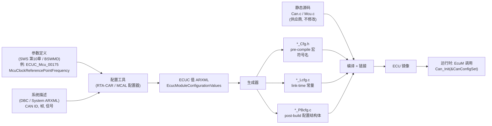
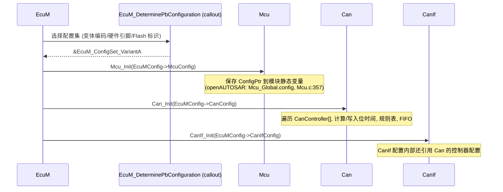
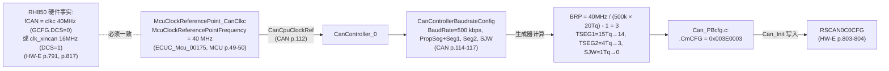

# 配置与 ARXML：从 ECUC 参数到 `*_Init(ConfigPtr)`

> Prerequisite: [ECU 启动流程](03-ecu-startup.md)
> Next: [生成代码](05-generated-code.md)（之后是 [OS、Task 与 ISR](06-os-task-isr.md)）
> 对应规范: SWS MCU R24-11 §10（p.38–51：容器结构、`SWS_Mcu_00126/00259` p.38、各参数 Configuration Class）；SWS CAN R22-11 §10（p.98–131；`SWS_Can_00056` p.44；`SWS_Can_NA_00999` 关于 link-time 的 traceability p.27）。**本仓库没有** ECU Configuration 规范（TPS ECUConfiguration）、BSW General SWS、Methodology 文档——ARXML 元素名与生成文件命名为 R4.x 公认形态，标注 `[Conceptual]`，需以真实工具链输出确认。
> 对应源码: openAUTOSAR `system/EcuM/include/EcuM_Generated_Types.h`、`communication/CAN/CanIf/src/CanIf_Cfg.c`、`boards/linuxOs/MCAL/Mcu/include/{Mcu.h,Mcu_Cfg.h}`、`diagnostic/Dcm/include/{Dcm_Cfg.h,Dcm_Lcfg.h}`；本项目 `examples/rh850_mcal_reference/mcal/can/Can_BitTiming.c`

---

## 1. 本章目标

1. 理解 AUTOSAR 中“配置”的完整链路：**ECUC 参数定义（规范第 10 章）→ ARXML 中的参数值 → 生成器 → `*_Cfg.h` / `*_Lcfg.c` / `*_PBcfg.c` → `*_Init(ConfigPtr)` → 模块运行时查表**。
2. 区分三种配置类（Configuration Class）：pre-compile、link-time、post-build，以及它们对代码形态、可变性、Flash 布局的影响。
3. 能读懂一个生成的配置结构体：知道每个字段来自哪个 ECUC 参数、在运行时被哪段代码使用。
4. 能追踪一条跨模块的配置引用链：`CanCpuClockRef` → `McuClockReferencePoint` → CAN 位时间寄存器值。
5. 知道当配置“看起来对但行为不对”时，应该检查 ARXML、生成代码还是运行时的哪一处。

---

## 2. 为什么需要这样配置？

一个 Can 驱动要支持：不同芯片衍生型号的控制器数量、不同车型的 CAN ID 与波特率、不同 ECU 的硬件对象分配、开发版打开 DET / 量产版关闭 DET、一个软件镜像支持多个车型变体……

如果把这些写死在 C 代码里，供应商就要为每个客户维护一个分支。AUTOSAR 的做法是：

- **规范第 10 章**定义“有哪些可配置参数、取值范围、多重性、能在哪个阶段确定”——这是参数的**定义（definition）**。
- 集成者在工具中填写**值（value）**，保存为 ARXML。
- **生成器**（MCAL 供应商的插件、BSW 供应商的工具）把值翻译成 C 代码。
- 模块的静态 C 代码（供应商交付，不修改）通过宏和配置结构体读取这些值。

这样“代码不变、配置变”，同一份经过认证的驱动源码可以用于无数项目。

---

## 3. 在系统中的位置：配置的数据流



---

## 4. AUTOSAR 如何定义？

### 4.1 参数定义的“表格”

规范第 10 章为每个参数给出一张表。以 MCU R24-11 为例：

| 字段 | 含义 | 例：`McuNoPll`（`ECUC_Mcu_00180`，p.41） |
|---|---|---|
| Parameter Name / ECUC ID | 名字与唯一 ID | `McuNoPll` / `ECUC_Mcu_00180` |
| Type | Boolean / Integer / Float / Enumeration / Reference / FunctionName… | Boolean |
| Multiplicity | 出现次数 | 1 |
| Default value | 默认 | — |
| **Value Configuration Class** | 值能在哪个阶段确定 | Pre-compile time，All Variants |
| Scope / Dependency | 影响范围 | local |

**容器（container）** 把参数组织成树。MCU 的完整树（`02-autosar-sws-notes.md` §1.3，p.38–51）：

```text
Mcu (ECUC_Mcu_00189)                     支持 VARIANT-PRE-COMPILE / VARIANT-POST-BUILD (p.38)
├── McuGeneralConfiguration [1]          McuDevErrorDetect, McuInitClock, McuNoPll, McuPerformResetApi ...
├── McuModuleConfiguration [1]
│   ├── McuClockSettingConfig [1..*]     McuClockSettingId ← Mcu_InitClock() 的参数
│   │   └── McuClockReferencePoint [1..*]   McuClockReferencePointFrequency (Hz, float)
│   ├── McuDemEventParameterRefs [0..1]  MCU_E_CLOCK_FAILURE → DemEventParameter
│   ├── McuModeSettingConf [1..*]        McuMode ← Mcu_SetMode() 的参数
│   └── McuRamSectorSettingConf [0..*]   BaseAddress, Size, DefaultValue, WriteSize
└── McuPublishedInformation
    └── McuResetReasonConf [1..*]        McuResetReason ← 被 EcuM 引用
```

### 4.2 三种配置类

[AUTOSAR Standard] 配置类描述“这个值最晚在什么时候确定”：

| 配置类 | 值何时确定 | 典型生成物 | 修改代价 | 例子（本仓库 SWS 中可查） |
|---|---|---|---|---|
| **Pre-compile time** | 编译前 | `#define` 宏（`*_Cfg.h`），甚至改变代码结构（`#if`） | 重新编译该模块 | `McuDevErrorDetect`（p.40）、`McuNoPll`（p.41）、`McuClockSettingId`（p.43）、`CanControllerBaseAddress`（p.108）、`CanCpuClockRef`（p.112） |
| **Link time** | 链接前 | `const` 变量放在独立 `.c`（常称 `*_Lcfg.c`），模块以 `extern` 引用 | 重新编译该 `.c` 并重新链接，模块目标文件可不变 | CAN R22-11 把 BSW General 中的 link-time 需求标为不适用（`SWS_Can_NA_00999`，CAN SWS p.27 的 traceability 表） |
| **Post-build time** | 链接后（甚至刷写后） | 放在独立 Flash 区域的配置结构体（`*_PBcfg.c`），通过指针传给 `*_Init` | 只需重新生成并刷写配置区（若项目支持独立刷写） | `McuClockReferencePointFrequency`（p.50）、`McuRamSectionBaseAddress`（p.48）、`McuClockSrcFailureNotification`（p.44）、`CanHwFilterCode`（p.129–130） |

还有一类 **Published Information**：例如 `McuResetReason`（p.51），它不是给集成者“配置”的，而是驱动“公布”的信息（该芯片支持哪些复位原因），供 EcuM 引用。

**变体（Variant）**：模块声明它支持的实现变体。MCU 支持 `VARIANT-PRE-COMPILE` 和 `VARIANT-POST-BUILD`（p.38）；CAN 同样支持这两种（CAN SWS p.98）。每个参数表的 “Value Configuration Class” 一栏会按变体写出该参数在该变体下属于哪一类，例如 `McuClockReferencePointFrequency` 在 VARIANT-PRE-COMPILE 下是 pre-compile，在 VARIANT-POST-BUILD 下是 post-build（p.50）。

### 4.3 配置指针传给 `*_Init`

[AUTOSAR Standard]

- `SWS_Can_00056`（CAN SWS p.44）：“Post-Build configuration elements that are marked as ‘multiple’ … can be selected by passing the pointer ‘Config’ to the init function of the module.”——**post-build 的多套配置通过 Init 指针选择**。
- `SWS_Mcu_00126`（MCU SWS p.38）：“The initialization function of this module shall always have a pointer as a parameter, even though for VARIANT-PRE-COMPILE no configuration set shall be given. Instead a NULL pointer shall be passed.”——**签名固定带指针，pre-compile 变体传 NULL**。
- `SWS_Mcu_00259`（p.38）：实现不支持的分区映射必须在配置阶段被拒绝——**配置错误应在生成阶段发现，而不是运行时**。

这解释了为什么同一个 `Mcu_Init(const Mcu_ConfigType* ConfigPtr)` 在不同项目中，有时传 `&Mcu_Config`，有时传 `NULL_PTR`。

---

## 5. 核心数据结构：ARXML 与生成代码长什么样

### 5.1 ECUC 值的 ARXML（[Conceptual]）

下面是一段**示意性**的 ECUC 值 ARXML（元素名为 R4.x ECUC 模式的常见形态，具体 schema 版本、包路径由工具决定，需以真实工具输出确认）：

```xml
<!-- [Conceptual] 示意: Mcu 的一个时钟参考点 -->
<ECUC-MODULE-CONFIGURATION-VALUES>
  <SHORT-NAME>Mcu</SHORT-NAME>
  <DEFINITION-REF DEST="ECUC-MODULE-DEF">/AUTOSAR/EcucDefs/Mcu</DEFINITION-REF>
  <IMPLEMENTATION-CONFIG-VARIANT>VARIANT-POST-BUILD</IMPLEMENTATION-CONFIG-VARIANT>
  <CONTAINERS>
    <ECUC-CONTAINER-VALUE>
      <SHORT-NAME>McuModuleConfiguration</SHORT-NAME>
      <DEFINITION-REF DEST="ECUC-PARAM-CONF-CONTAINER-DEF">/AUTOSAR/EcucDefs/Mcu/McuModuleConfiguration</DEFINITION-REF>
      <SUB-CONTAINERS>
        <ECUC-CONTAINER-VALUE>
          <SHORT-NAME>McuClockSettingConfig_0</SHORT-NAME>
          <!-- ... McuClockSettingId = 0 ... -->
          <SUB-CONTAINERS>
            <ECUC-CONTAINER-VALUE>
              <SHORT-NAME>McuClockReferencePoint_CanClkc</SHORT-NAME>
              <PARAMETER-VALUES>
                <ECUC-NUMERICAL-PARAM-VALUE>
                  <DEFINITION-REF DEST="ECUC-FLOAT-PARAM-DEF">/AUTOSAR/EcucDefs/Mcu/McuModuleConfiguration/McuClockSettingConfig/McuClockReferencePoint/McuClockReferencePointFrequency</DEFINITION-REF>
                  <VALUE>40000000</VALUE>
                </ECUC-NUMERICAL-PARAM-VALUE>
              </PARAMETER-VALUES>
            </ECUC-CONTAINER-VALUE>
          </SUB-CONTAINERS>
        </ECUC-CONTAINER-VALUE>
      </SUB-CONTAINERS>
    </ECUC-CONTAINER-VALUE>
  </CONTAINERS>
</ECUC-MODULE-CONFIGURATION-VALUES>
```

读 ARXML 的三个关键：

1. **`DEFINITION-REF`** 指向规范中的参数定义路径——它告诉你“这个值是哪个 ECUC 参数”。
2. **`SHORT-NAME`** 是集成者起的名字——它会变成生成代码中的**符号名**的一部分。
3. **引用（`ECUC-REFERENCE-VALUE`）** 把不同模块的配置连起来，例如 Can 的 `CanCpuClockRef` 指向上面的 `McuClockReferencePoint_CanClkc`。

```xml
<!-- [Conceptual] 示意: Can 控制器引用 Mcu 的时钟参考点 -->
<ECUC-REFERENCE-VALUE>
  <DEFINITION-REF DEST="ECUC-REFERENCE-DEF">/AUTOSAR/EcucDefs/Can/CanConfigSet/CanController/CanCpuClockRef</DEFINITION-REF>
  <VALUE-REF DEST="ECUC-CONTAINER-VALUE">/MyEcu/EcucValues/Mcu/McuModuleConfiguration/McuClockSettingConfig_0/McuClockReferencePoint_CanClkc</VALUE-REF>
</ECUC-REFERENCE-VALUE>
```

### 5.2 生成的 C 代码（[Conceptual]）

同一份配置，生成器通常产出三类文件：

```c
/* [Conceptual] Mcu_Cfg.h —— pre-compile 参数 */
#define MCU_DEV_ERROR_DETECT        STD_ON     /* McuDevErrorDetect (ECUC_Mcu_00166) */
#define MCU_NO_PLL                  STD_ON     /* McuNoPll (ECUC_Mcu_00180): P1M-E 无软件 PLL */
#define MCU_INIT_CLOCK              STD_ON     /* McuInitClock (ECUC_Mcu_00182) */
#define MCU_PERFORM_RESET_API       STD_ON     /* McuPerformResetApi (ECUC_Mcu_00167) */

/* 符号名: 让上层用名字而不是魔数引用配置实例 */
#define McuConf_McuClockSettingConfig_McuClockSettingConfig_0   ((Mcu_ClockType)0u)
#define McuConf_McuModeSettingConf_McuModeSettingConf_Run       ((Mcu_ModeType)0u)
```

```c
/* [Conceptual] Mcu_PBcfg.c —— post-build 配置结构体 */
#define MCU_START_SEC_CONFIG_DATA_UNSPECIFIED
#include "Mcu_MemMap.h"

static const Mcu_ClockRefPointType Mcu_ClockRefPoints_0[] = {
    { 40000000.0f },   /* McuClockReferencePoint_CanClkc  → CLK_LSB 40 MHz (HW-E p.469) */
    { 80000000.0f },   /* McuClockReferencePoint_Hsb      → CLK_HSB 80 MHz (OSTM/TAUD)  */
};

const Mcu_ConfigType Mcu_Config = {
    /* McuClockSettingConfig[] */ Mcu_ClockSettings,
    /* McuNumberOfMcuModes      */ 1u,
    /* McuRamSectors            */ 0u,
    /* McuResetSetting          */ MCU_RESET_SW_SYSTEM,   /* 厂商扩展: SWSRESA0 */
    /* ... */
};

#define MCU_STOP_SEC_CONFIG_DATA_UNSPECIFIED
#include "Mcu_MemMap.h"
```

> 符号名的命名约定（`<Mip>Conf_<ContainerDefShortName>_<ContainerShortName>`）来自 BSW General SWS，本仓库没有该文档。真实项目中直接看生成的 `*_Cfg.h` 即可。

### 5.3 openAUTOSAR 中真实的“生成”文件

openAUTOSAR 的配置文件大多缺失（`03-openautosar-trace.md` §0），但留下的几个片段很能说明问题：

| 文件 | 观察 |
|---|---|
| `communication/CAN/CanIf/src/CanIf_Cfg.c` | 文件头写明 “Configured for (MCU): STM32_F107”（:7）、“Generated by Arctic Studio”（:12）——这是**生成代码**；它 `extern` 引用了 `CanControllerConfigData[]` 和 `CanConfigSetData`（:35-36，注释 “Imported structs from Can_Lcfg.c”），但 `Can_Lcfg.c` 在仓库中**不存在**。这正是“跨模块配置引用”在 C 层面的样子：CanIf 的配置直接指向 Can 的配置实例。 |
| `boards/linuxOs/MCAL/Mcu/include/Mcu_Cfg.h:27-29` | `MCU_DEV_ERROR_DETECT STD_OFF`、`MCU_PERFORM_RESET_API STD_ON`、`MCU_VERSION_INFO_API STD_ON`——典型 pre-compile 开关 |
| `boards/linuxOs/MCAL/Mcu/include/Mcu.h:100-169` | `Mcu_ClockSettingConfigType`（含 `McuClockReferencePointFrequency` 和 `Pll1..Pll4` 字段）、`Mcu_ConfigType`（`McuClockSettings`、`McuDefaultClockSettings`、`McuClockSettingConfig` 指针…）——**配置结构体的类型**由静态代码定义，**实例**由生成器生成 |
| `diagnostic/Dcm/include/Dcm_Cfg.h:30-31, :46` | `DCM_VERSION_INFO_API STD_ON`、`DCM_DEV_ERROR_DETECT STD_ON`、`DCM_MAIN_FUNCTION_PERIOD_TIME_MS 10` |
| `diagnostic/Dem/include/Dem_LCfg.c` | link-time 配置 `.c` 被错放在 `include/` 目录、未被 CMake 编译（`03-openautosar-trace.md` §2.3） |
| `system/EcuM/include/EcuM_Generated_Types.h:101-182` | `EcuM_ConfigType` 聚合了所有模块的配置指针 |

---

## 6. 初始化流程：配置指针如何流到每个模块



逐步说明：

1. **`EcuM_DeterminePbConfiguration`**：返回 post-build 配置集的根指针。openAUTOSAR 中是 `EcuM_Callout_Stubs.c:156-159`，固定返回 `&EcuMConfig`。在多变体项目中，它可能读取一个编码引脚（经 Dio）或 Flash 中的变体标识来选择。
2. **`Mcu_Init(ConfigPtr)`**：`SWS_Mcu_00026`（p.25）规定 Init “使配置在模块内可见”。openAUTOSAR 实现就是把指针存起来：`Mcu_Global.config = configPtr; Mcu_Global.initRun = 1;`（`boards/linuxOs/MCAL/Mcu/src/Mcu.c:357-358`）。之后 `Mcu_InitClock(ClockSetting)` 用 `ClockSetting` 作为数组下标访问 `Mcu_Global.config->McuClockSettingConfig[...]`（`Mcu.c:386-389`），并先做越界检查（`:386` → `MCU_E_PARAM_CLOCK`）。
3. **其它模块同理**：Init 保存指针并按配置初始化硬件；运行时 API 用“配置下标”（HTH、PduId、ClockSetting、McuMode）查表。

**设计要点**：`Mcu_ClockType`、`Mcu_ModeType`、`Mcu_RamSectionType` 都定义为 “0..N-1 的配置索引”（MCU SWS p.20–24，`00233/00238/00240`）。也就是说，**运行时 API 的参数不是“频率”或“模式”，而是“第几个配置项”**。上层通过符号名（`McuConf_...`）传入，保证配置改了顺序也不会传错。

---

## 7. Runtime Flow：一条跨模块配置链的完整追踪

最有教学价值的一条链：**MCU 时钟参考点 → CAN 位时间寄存器**（`02-autosar-sws-notes.md` §2.4、§7 第 1 条）。



逐步解释：

1. **`McuClockReferencePointFrequency`**：MCU 配置中“发布”给其他模块的时钟频率（`SWS_Mcu_00248` p.16：所有外设时钟通过 `McuClockReferencePoint` 发布给其它 BSW）。这里填 40 MHz，因为 P1M-E 的 RS-CANFD 位时间时钟 `clkc = CLK_LSB = 40 MHz`（HW-E p.469, p.791）。
2. **`CanCpuClockRef`**：Can 控制器配置中引用上面那个参考点（CAN SWS p.112，pre-compile）。
3. **`CanControllerBaudrateConfig`**：集成者填写波特率和各段 Tq 数。
4. **生成器计算**：BRP = fCAN / (BaudRate × Tq_total) − 1。示例（`04-rh850-hardware-notes.md` §8.4，**仅演示编码，不是项目配置**）：DCS=0、fCAN=40 MHz、500 kbps、20 Tq、TSEG1=15 Tq、TSEG2=4 Tq、SJW=1 Tq、采样点 80% → BRP=3、TSEG1 字段=14、TSEG2 字段=3、SJW 字段=0 → `CmCFG = 0x003E_0003`。
5. **`Can_Init` 写寄存器**：在 channel reset 模式下写 CmCFG（HW-E p.804）。

**这条链的脆弱点**：

| 错误 | 后果 | 在哪一层发现 |
|---|---|---|
| 把 `McuClockReferencePointFrequency` 填成 80 MHz（误用 pclk） | 生成器算出 BRP=7，实际位速率 250 kbps，总线全是错误帧 | 生成代码看起来“合法”；只有示波器或 CANoe 能发现 |
| MCU 配置 40 MHz，但 Can 驱动把 `GCFG.DCS` 设成 1（16 MHz clk_xincan） | 位速率 = 16/40 × 500k = 200 kbps | 同上 |
| CAN FD 数据段 > 2 Mbps 却选 clk_xincan | 手册禁止（HW-E p.791 Table 17.7） | 需要人工审查 |

> 本项目 `examples/rh850_mcal_reference/mcal/can/Can_BitTiming.c` 正是这个“生成器计算”步骤的教学版：输入物理分频比和 Tq 数，输出校验结果和 NCFG/DCFG 编码，**不写寄存器**（README 中给出的候选参数：fCAN=40 MHz、标称 `{2,31,8,4}`、数据 `{2,15,4,3}` → 500 kbit/s / 1 Mbit/s、采样点 80%、NCFG=`0x071E1801`、DCFG=`0x023E0001`）。在真实项目中，这一步由 MCAL 配置工具完成，你的工作是**核对**。

---

## 8. RH850 Hardware Mapping：哪些配置值必须与芯片手册一致

| ECUC 参数 | 必须匹配的 RH850/P1M-E 事实 | 依据 |
|---|---|---|
| `McuNoPll` | P1M-E 无软件可配 PLL 寄存器 → 合理取值通常为 TRUE（以供应商 MCAL 文档为准） | HW-E p.471 |
| `McuClockReferencePointFrequency` | CPU 160 MHz、HSB 80 MHz、LSB 40 MHz、MainOSC 16 MHz（固定） | HW-E p.469 |
| `McuRamSectionBaseAddress/Size` | Local RAM `FEDE_0000`–`FEDF_FFFF`、Global RAM 区；ECC 要求的写宽度（`McuRamSectionWriteSize`） | HW-E p.257, p.2889–2890 |
| `McuResetSetting` | SWSRESA0（System Reset 2）或 SWARESA0（Application Reset 1） | HW-E p.418, p.424–425 |
| `CanControllerBaseAddress` | RS-CANFD 单元 `0xFFD2_0000`（通道寄存器按 `+10H×m` 偏移，Classical 模式） | HW-E p.791, p.798 |
| `CanCpuClockRef` | clkc 40 MHz 或 clk_xincan 16 MHz，与 `GCFG.DCS` 一致 | HW-E p.791, p.817 |
| `CanHwFilterCode/Mask` | GAFLIDj/GAFLMj；**GAFLM 位为 1 表示比较** | HW-E p.832, p.834 |
| `CanHwObjectCount`、HTH/HRH 数量 | 每通道 16 个 TX buffer；8 个共享 RX FIFO；RAM 总容量约束 ≤192 | HW-E p.794–795, p.1097 |
| Port 的引脚模式 | PFC/PFCE/PFCAE 编码 ALT1–6；CAN 引脚 ALT 号需对照 PDF 原表 | HW-E p.94, p.151–154, p.793 |
| Gpt 通道 → OSTM 实例 | OSTM0/1 用 EI 74/75；OSTM3–7 只能 FEINT | HW-E p.1544 |

[Real Project Consideration] 关于 **mask 语义**：AUTOSAR 的 `CanHwFilterMask` 与 RS-CANFD 的 GAFLM 都是“1=比较”，但某些配置工具的界面字段可能使用相反的语义（`04-rh850-hardware-notes.md` §9）。核对方法：在生成的 `Can_PBcfg.c` 中找到规则表数组，手工解码一条已知应精确匹配的 ID，看 mask 是否为 `0x1FFFFFFF`（扩展）或 `0x7FF`（标准）级别的全 1。

---

## 9. openAUTOSAR 实现：配置“只有类型、缺少实例”

openAUTOSAR 的配置问题是一份很好的反面教材：

1. **类型齐全、实例缺失**：`Mcu_ConfigType`（`Mcu.h:127-169`）、`EcuM_ConfigType`（`EcuM_Generated_Types.h:101-182`）都有，但 `EcuMConfig`、`McuConfigData`、`CanConfigData`、`DCM_Config` 的定义都找不到（`03-openautosar-trace.md` §2）。结果：能编译、不能链接。
2. **配置与目标芯片不符**：`CanIf_Cfg.c:7` 写着 STM32_F107；Mcu 的配置类型里有 STM32 的 RCC 时钟门控字段（`Mcu_ConfigTypes.h:73-77` 的 `AHBClocksEnable/APB1ClocksEnable/APB2ClocksEnable`）。**配置结构体的形态本身就是芯片相关的**——这也说明为什么 MCAL 的配置类型由芯片厂定义。
3. **跨模块引用名字不一致**：`CanIf_Cfg.c:36` 引用 `CanConfigSetData`，而 `boards/linuxOs/MCAL/Can/include/Can_Cfg.h:219` 声明的是 `Can_ConfigSet`（`03-openautosar-trace.md` §1.3）。在真实工具链中，这类引用由生成器保证一致；手写配置时最容易出错。
4. **周期参数各自为政**：`Dcm_Cfg.h:46` 假设 Dcm MainFunction 10 ms，`CanTp_Cfg.h:24` 假设 1000 ms，而 SchM 实际约 25 ms（`03-openautosar-trace.md` §6.2）。在真实工具链中，`DcmTaskTime`（`ECUC_Dcm_00820`，DCM p.678）这类参数应该与 SchM/OS 配置来自同一个来源。见 [07-mainfunction-scheduling.md](07-mainfunction-scheduling.md)。

---

## 10. 当前教学项目实现

`examples/rh850_mcal_reference/` 没有 ARXML 和生成器，但它的设计体现了“配置与代码分离”：

- `Can_BitTiming.c`：把“由时钟和 Tq 数计算寄存器编码”做成纯函数，等价于生成器中的一步，可在主机上测试（`tests/test_reference.c` 覆盖时钟来源、位域编码、两阶段 prescaler、TDC 限制、非法参数）。
- `Ostm_IntervalCompare(counter_hz, period_us, &compare)`（`mcal/gpt/Ostm.c:69-77`）：把“周期”换算成 CMP 值，**拒绝非整除**（`product % 1000000 != 0` 返回 false），而不是悄悄截断。真实的 Gpt 配置工具在把 `GptChannelTickFrequency` 与周期换算成 tick 时，也应该给出同样的检查；如果工具只是截断，生成的周期就会有累积误差。

[Educational Implementation] 计划中的 `uds_diag_demo` 会把 CanIf/CanTp/PduR/Dcm 的“配置”写成手写的 `const` 表（相当于 `*_PBcfg.c`），并在注释中标注每个字段对应的 ECUC 参数名，帮助你在真实项目中对照生成代码。

---

## 11. Code Walkthrough：如何读生成的配置代码

拿到真实项目的 `Can_PBcfg.c`（或同类文件），按以下步骤读：

```text
1. 找根结构体: 通常是 const Can_ConfigType <Name> = {...}; 记住名字
2. 找谁把它传给 Can_Init: grep 名字 → EcuM/BswM 配置
3. 找控制器数组: 每个元素对应一个 CanController 容器 → 记下 BaseAddress/通道号、位时间寄存器值
4. 解码位时间: 用 HW-E p.803-804 的位域 (SJW b25:24, TSEG2 b22:20, TSEG1 b19:16, BRP b9:0)
   反算波特率和采样点, 与 CAN 矩阵要求对比
5. 找硬件对象数组: 每个 HOH 的 CanObjectId、类型 (RECEIVE/TRANSMIT)、ID、mask、
   对应的 RS-CANFD 资源 (TX buffer 号 / RX FIFO 号 / 规则号)
6. 找 CanIf 侧: CanIf_PBcfg.c 中 Rx/Tx PDU 表引用的 HRH/HTH 符号, 与第 5 步对上
7. 找 *_Cfg.h: DEV_ERROR_DETECT、MainFunction 周期、轮询/中断模式 (CanRxProcessing 等)
```

一个解码练习（Classical 模式 CmCFG）：

```c
/* [Conceptual] 解码 CmCFG = 0x003E0003 */
uint32 cfg   = 0x003E0003u;
uint32 brp   = (cfg >>  0) & 0x3FFu;   /* = 3   → 分频 4          */
uint32 tseg1 = (cfg >> 16) & 0x0Fu;    /* = 14  → 15 Tq           */
uint32 tseg2 = (cfg >> 20) & 0x07u;    /* = 3   → 4 Tq            */
uint32 sjw   = (cfg >> 24) & 0x03u;    /* = 0   → 1 Tq            */
/* Tq 总数 = 1 (SS) + 15 + 4 = 20; 位速率 = 40 MHz / (4 × 20) = 500 kbps
 * 采样点 = (1 + 15) / 20 = 80%  —— 前提: fCAN = 40 MHz (GCFG.DCS = 0)
 * 注意: 本例取 SJW = 1 Tq; 04-can-mcal 各章的 Demo 取 SJW = 3 Tq → 0x023E0003,
 *       波特率与采样点相同, 只差 SJW (见 04-can-mcal/03 §6.1) */
```

---

## 12. Debug 方法

| 症状 | 检查顺序 |
|---|---|
| 行为与 ARXML 不一致 | ① 生成代码是否已重新生成（看文件时间戳/生成器版本注释）② 构建是否使用了新生成的文件（include 路径里有没有旧副本）③ post-build 区是否已刷写 |
| `*_Init` 后模块立即报 DET `*_E_PARAM_POINTER`/`*_E_INIT_FAILED` | 传入的配置指针（NULL？指向了另一个变体？） |
| post-build 配置改了没生效 | 是否真的是 post-build 参数（看 SWS 第 10 章 Configuration Class）；pre-compile 参数改了必须重新编译 |
| 两个模块对同一个 ID/时钟理解不同 | 跨模块引用（`*Ref`）是否指向同一个容器；手写胶水代码是否绕过了引用 |
| 位速率错误 | 按 §11 解码 CmCFG/NCFG/DCFG，反算 fCAN；核对 `GCFG.DCS` 与 `CanCpuClockRef` |

[Real Project Consideration] 在调试器里检查 post-build 配置时，直接看 `*_Init` 保存的静态指针（例如 `Can_ConfigPtr`）指向的内存，而不是看源码中的初值——Flash 中的配置区可能与你的生成代码版本不同。

---

## 13. 常见问题 / 常见错误

1. **把 pre-compile 参数当成 post-build 修改**，然后疑惑为什么不生效。
2. **手改生成文件**。下次重新生成时修改丢失，且无人知道。需要定制时，使用工具支持的 callout/用户代码区，或改 ARXML。
3. **只看 ARXML 不看生成代码**。生成器可能有 bug、可能做了你没想到的取整。
4. **MCU 时钟参考点填写“我以为的频率”**，而不是手册中该外设实际使用的时钟（P1M-E 上 RS-CANFD 是 clkc 40 MHz / clk_xincan 16 MHz，不是 80 MHz pclk）。
5. **符号名与索引混用**：上层用魔数 `0` 而不是 `McuConf_...` 符号名调用 `Mcu_InitClock`，配置重排后传错。
6. **混淆“参数定义”与“参数值”**：SWS 第 10 章是定义（可配置什么），ARXML 是值（配置成什么），BSWMD（供应商的模块描述）可能对定义做了扩展或限制。

---

## 14. 实验

1. **读参数表**：打开 `artifacts/pdf-text/AUTOSAR_CP_SWS_MCUDriver.txt`，找到 `McuRamSectionWriteSize`（p.49）和 `McuClockSettingId`（p.43），比较它们的 Configuration Class，解释为什么一个能 post-build、一个只能 pre-compile。
2. **手工“生成”**：为一个假设的 P1M-E CAN0 控制器（Classical，500 kbps，fCAN=40 MHz，采样点 75%）选择 Tq 数，算出 CmCFG 值；然后用 `Can_BitTiming.c` 的思路（或直接调用它的 FD 版本函数做对比）验证。
3. **配置链故障注入**：在 §7 的链路中把 `McuClockReferencePointFrequency` 改成 80 MHz，重新计算 BRP，再用 40 MHz 实际时钟算出真实位速率。
4. **openAUTOSAR 阅读**：在 `CanIf_Cfg.c` 中找出所有 `extern` 引用的外部配置符号，逐个 grep 看是否有定义，列出“缺失清单”。

---

## 15. 思考题

1. 为什么 `CanControllerBaseAddress` 和 `CanCpuClockRef` 只能是 pre-compile，而 `CanHwFilterCode` 可以 post-build？从“改变它会影响哪些代码结构”角度回答。
2. 如果一个 ECU 要用同一个软件镜像支持“有 CAN FD”和“无 CAN FD”两个车型变体，哪些参数必须是 post-build？RS-CANFD 的 `GRMCFG.RCMC`（只能在 global reset 中写，且先于其他寄存器，HW-E p.802）对这种设计有什么影响？
3. `SWS_Mcu_00126` 要求 pre-compile 变体也保留指针参数并传 NULL。这样设计对“同一套 EcuM 代码适配不同变体的 MCAL”有什么好处？

---

## 16. 对未来真实项目的意义

以后在真实 RH850 + RTA-CAR 项目中：

1. **建立“配置文件地图”**：每个模块的 ARXML 在哪里、用什么工具编辑、生成的 `*_Cfg.h`/`*_Lcfg.c`/`*_PBcfg.c` 在哪里、谁负责重新生成。
2. **确认每个模块的实现变体**（PRE-COMPILE / POST-BUILD），以及项目是否真的使用独立刷写的 post-build 区。
3. **追踪关键跨模块引用链**：`CanCpuClockRef` → `McuClockReferencePoint`；`DcmDslProtocolRxPduRef` → EcuC Pdu → PduR → CanTp → CanIf；`DcmDemClientRef` → Dem client。DCM 升级时这些引用最容易断。
4. **核对生成代码中的硬件值**：位时间寄存器、规则表 mask、引脚 ALT 编码，用芯片手册反算，而不是信任 GUI 显示。
5. **记录生成器版本**：DCM 升级常伴随 BSW 工具升级，生成代码结构可能变化（结构体字段、符号名规则），要做新旧生成代码的 diff。
6. **把“改了配置不生效”的排查流程固化**：重新生成 → 确认构建使用新文件 → 确认刷写 → 调试器看运行时指针指向的内容。

---

## 17. 本章总结

- 配置链路：SWS 第 10 章定义参数 → ARXML 存值 → 生成器产出 `*_Cfg.h`/`*_Lcfg.c`/`*_PBcfg.c` → `*_Init(ConfigPtr)` 保存指针 → 运行时 API 用“配置索引”查表。
- 三种配置类决定修改代价：pre-compile 需重编译，link-time 需重链接，post-build 可只换配置区。Init 签名始终带指针（`SWS_Mcu_00126`），多套 post-build 配置通过指针选择（`SWS_Can_00056`）。
- 跨模块引用（例如 `CanCpuClockRef` → `McuClockReferencePoint`）是配置中最有价值也最脆弱的部分；在 P1M-E 上，CAN 位时间时钟是 40 MHz clkc 或 16 MHz clk_xincan，不是 80 MHz。
- openAUTOSAR 只有配置类型、缺少配置实例，且配置与芯片（STM32）不符，是“配置从哪里来”的反面教材。
- 读生成代码的方法：找根结构体 → 找谁传给 Init → 按手册解码寄存器值 → 与需求对照。

## 18. 下一章

[05-generated-code.md](05-generated-code.md) 进一步讲生成代码的组织（RTE、SchM、Os 配置的生成物）；之后 [06-os-task-isr.md](06-os-task-isr.md) 讲这些模块运行在什么“执行上下文”中：OS task、Cat1/Cat2 ISR、alarm、counter、schedule table，以及它们如何落到 RH850 的 EIC 和 OSTM 上。
