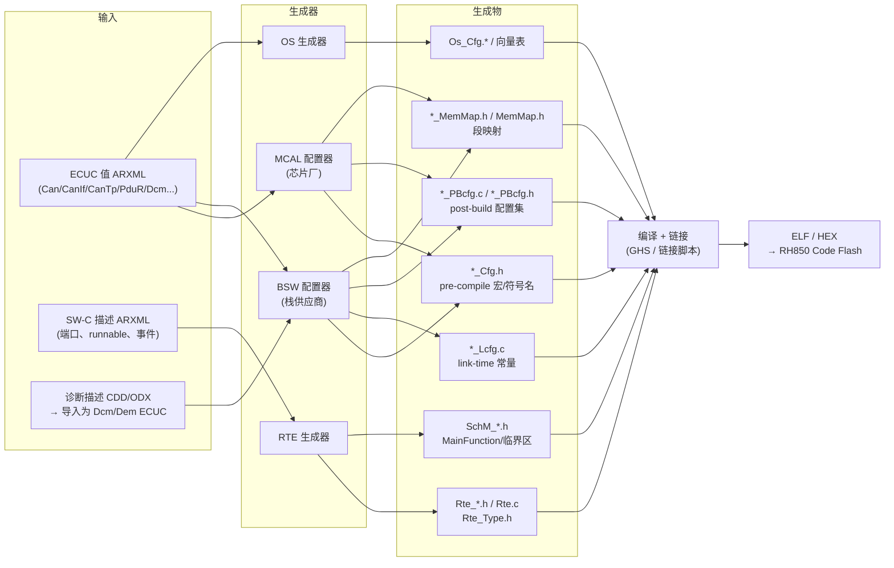
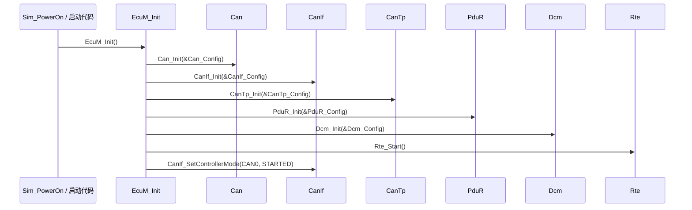
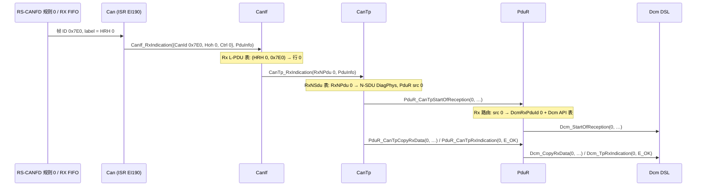
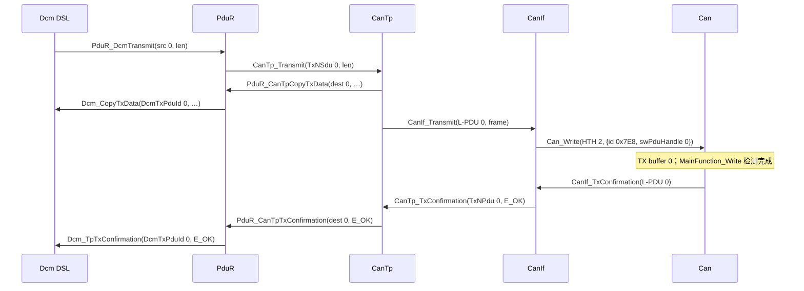

# 生成代码：`*_Cfg.h`、`*_PBcfg.c`、`*_Lcfg.c`、`Rte_*.h`、`SchM_*.h` 与 MemMap，以及 handle 如何在模块间串起来

> Prerequisite: [配置与 ARXML](04-configuration-arxml.md)
> Next: [OS、Task 与 ISR](06-os-task-isr.md)
> 对应规范: SWS CAN R22-11（`SWS_Can_00056` p.44 多配置集经 Init 指针选择；`ECUC_Can_00326` `CanObjectId` p.125；`ECUC_Can_00469/00470` p.129–130；`Can_MainFunction_*` p.84–87）；SWS MCU R24-11（`SWS_Mcu_00126` p.38：Init 总带指针，pre-compile 变体传 NULL）；SWS DCM R20-11（`SWS_Dcm_00053` p.260 `Dcm_MainFunction` 声明在 `SchM_Dcm.h`；`SWS_Dcm_00984` p.301 `Dcm_OpStatusType` 在 `Rte_Dcm_Type.h`；`SWS_Dcm_00686` p.341 `DataServices_<Data>` 端口接口；`SWS_Dcm_00311` p.114 `SchM_Switch_<bsnp>_DcmDiagnosticSessionControl`）。**本仓库没有** BSW General SWS、RTE SWS、Memory Mapping SWS、ECU Configuration TPS——文件命名（`*_PBcfg.c`、`<Mip>Conf_*`、`<Mip>_MemMap.h`）属于 R4.x 公认形态，标注 `[Conceptual]`，需以真实工具链输出确认。
> 对应源码: 本项目 `examples/uds_diag_demo/{mcal/Can_Cfg.*, ecual/CanIf_Cfg.*, com/CanTp_Cfg.*, com/PduR_Cfg.*, diag/Dcm_Cfg.*, rte/Rte_Dcm.*, rte/SchM_Dcm.h, rte/Rte_VehicleInfoSWC.h}`、`docs/04-can-mcal/14-can-driver-from-scratch.md` §7.3–7.4；openAUTOSAR `communication/CAN/CanIf/src/CanIf_Cfg.c`、`communication/CAN/CanTp/src/CanTp_Cfg.c`、`communication/ComServices/PDURouter/include/PduR_Cfg.h`、`diagnostic/Dcm/include/{Dcm_Cfg.h,Dcm_Lcfg.h,Rte_Dcm.h}`、`system/SchM/include/{SchM_cfg.h,SchM_Dcm.h,SchM_Can.h}`、`include/MemMap.h`

---

## 1. 本章目标

读完本章，你应该能够：

1. 看到一个真实工程的 `Gen/`（或 `GenData/`、`Generated/`）目录时，按**文件后缀**立刻说出每个文件属于哪一类：pre-compile 宏、link-time 常量、post-build 配置集、RTE 契约、BSW 调度契约、内存段映射。
2. 在生成的 C 代码中，**从一个 CAN ID（0x7E0）出发**，沿 `Can → CanIf → CanTp → PduR → Dcm` 的配置表追出每一层的 handle（HRH、L-PDU id、N-PDU id、N-SDU id、PduR src/dest id、DcmRxPduId），并在响应方向反向追到 HTH 与 TX buffer。
3. 读 `Dcm_Cfg.c`（或真实工程中的 `Dcm_Lcfg.c`/`Dcm_PBcfg.c`）时，回答“DCM 怎么知道 0x22 是 ReadDataByIdentifier、怎么找到 F190、怎么调用应用”。
4. 读 `Rte_Dcm.h` / `Rte_<Swc>.h` / `SchM_Dcm.h` 时，知道哪些函数是 **RTE 生成的“合同”**、哪些是 SW-C 自己实现的 runnable。
5. 区分本项目“手写但模仿生成器”的配置（`examples/uds_diag_demo`）、openAUTOSAR 中残缺的“生成”文件、以及真实项目中工具生成的文件三者的差异。

本章是 [04 配置与 ARXML](04-configuration-arxml.md) 的下半场：04 讲“参数从哪来、何时确定”，本章讲“**参数变成 C 之后长什么样、模块之间怎样靠这些 C 符号连起来**”。

---

## 2. 为什么需要生成代码

[AUTOSAR Standard] AUTOSAR Classic 的 BSW 模块（Can、CanIf、CanTp、PduR、Dcm…）的**静态代码**（`Can.c`、`Dcm_Dsl.c` 等）在不同 ECU 之间是同一份；它们“认识”的不是具体的 CAN ID 或 DID，而是**配置表**。每个 ECU 的差异——用哪几个 CAN 控制器、哪个 ID 是诊断请求、支持哪些 UDS 服务、F190 由哪个 SW-C 提供——全部落在生成文件里。

这种设计带来三个后果，也是本章所有内容的出发点：

| 后果 | 含义 | 你在 debug 时会遇到什么 |
|---|---|---|
| **代码与数据分离** | 静态代码只做“查表 + 状态机”；行为由表决定 | 代码看起来没错，但 ECU 不响应——十有八九是表错了或表之间不一致 |
| **模块之间靠 handle 连接** | CanIf 不知道“诊断”，它只知道“L-PDU 0 → 调用 `CanTp_RxIndication(0, …)`” | 一个数字错位，整条链路静默断开（不一定报 DET） |
| **跨模块一致性由生成器保证** | 同一个 ARXML 引用（例如 CanIf Rx PDU 引用的 EcucPdu）在两个模块里被生成成两边一致的数字 | 手写或手改生成文件时最容易破坏；openAUTOSAR 就是反面教材（§9） |

[Real Project Consideration] 在真实项目中你几乎不会“写”这些文件，但你一定会**读**它们：bring-up 时核对寄存器值、诊断不通时核对路由表、DCM 升级时 diff 新旧生成物。会读生成代码，是从“看懂 AUTOSAR 概念”走向“能调真实 ECU”的分水岭。

---

## 3. 在系统中的位置：从 ARXML 到镜像



逐个 transition 解释：

1. **ECUC ARXML → MCAL 配置器**：Can、Port、Mcu、Gpt 的配置由芯片厂工具生成（截图中的环境是 Renesas P1M MCAL，属“可能的真实环境”，本仓库无法验证其输出格式）。MCAL 的配置结构体**形态本身是芯片相关的**，因为它要装下 RS-CANFD 的规则表、TX buffer 编号、CmCFG 位时间编码。
2. **ECUC ARXML → BSW 配置器**：CanIf/CanTp/PduR/Dcm/Dem 的表由栈供应商工具生成（RTA-CAR、DaVinci、EB tresos 等）。
3. **CDD/ODX → Dcm/Dem ECUC**：诊断需求（DID、服务、会话、安全级）通常先在诊断工具中定义，再导入为 `DcmDsp*`、`DcmDsd*` 容器——这就是为什么 DCM 升级经常牵涉“诊断描述重新导入”。
4. **SW-C ARXML → RTE 生成器**：产生 `Rte_<SwcType>.h`（SW-C 唯一允许 include 的头）、`Rte_Dcm.h`（DCM 作为 service component 的客户端接口）、`Rte.c`（`Rte_Call_*` 的实现、任务体）、`SchM_<Mod>.h`（BSW 模块的 MainFunction 声明、`SchM_Enter/Exit` 临界区、`SchM_Switch` 模式切换）。
5. **OS 生成器**：产生任务/ISR/Alarm 表和中断向量（下一章 [06 OS、Task 与 ISR](06-os-task-isr.md) 详述）。
6. **编译 + 链接**：`*_MemMap.h` 决定每个变量/常量进哪个段，链接脚本把段放到 RH850 的 Code Flash、Local RAM、Global RAM（见 §8）。

---

## 4. AUTOSAR 如何定义：配置类、文件族与命名

### 4.1 配置类决定文件后缀

[AUTOSAR Standard] 配置类在 [04 章 §4.2](04-configuration-arxml.md) 已讲过，这里只把它们落到文件上：

| 配置类 | 典型生成文件 | C 形态 | 修改后要做什么 |
|---|---|---|---|
| Pre-compile | `<Mod>_Cfg.h`（有时还有 `<Mod>_Cfg.c`） | `#define`、`#if` 开关、符号名常量 | 重新编译该模块全部 `.c` |
| Link-time | `<Mod>_Lcfg.c` / `<Mod>_Lcfg.h` | `const` 表，模块用 `extern` 引用 | 重新编译该 `.c` 并重新链接 |
| Post-build | `<Mod>_PBcfg.c` / `<Mod>_PBcfg.h` | 一个根结构体（如 `Can_Config0`），地址传给 `<Mod>_Init(ConfigPtr)` | 重新生成配置区；项目支持时可单独刷写 |

规范依据：

- `SWS_Can_00056`（CAN SWS R22-11 p.44）：标记为 “multiple” 的 post-build 配置元素，通过把指针 `Config` 传给 Init 来选择——**post-build 根结构体的地址就是“选择哪一套配置”的手段**。
- `SWS_Mcu_00126`（MCU SWS R24-11 p.38）：Init 总是带指针参数，VARIANT-PRE-COMPILE 时传 NULL——所以你会看到同一个 `Mcu_Init` 在不同项目里收到 `&Mcu_Config` 或 `NULL_PTR`。

### 4.2 RTE / SchM 生成物

[AUTOSAR Standard] 本仓库没有 RTE SWS；以下只引用 DCM SWS R20-11 中**作为对接方**出现的内容：

| 生成物 | DCM SWS 中的证据 | 含义 |
|---|---|---|
| `SchM_Dcm.h` | `SWS_Dcm_00053`（p.260）：`Dcm_MainFunction` 的 “Header file” 是 `SchM_Dcm.h`，由 BSW Scheduler 周期调用 | MainFunction 的声明属于 BSW 调度契约，不属于 `Dcm.h` |
| `Rte_Dcm_Type.h` | `SWS_Dcm_00984`（p.301）：`Dcm_OpStatusType` 定义在 `Rte_Dcm_Type.h` | DCM 与 SW-C 共享的类型由 RTE 生成器产出 |
| `Rte_Dcm.h` 中的 `Rte_Call_<port>_<op>` | `SWS_Dcm_00686`（p.341）：`DataServices_<Data>` C/S 接口；`SWS_Dcm_00685`（p.338）`SecurityAccess_<Level>`；`SWS_Dcm_00690`（p.362）`RoutineServices_<Routine>` | DCM 是 service component，它通过 RTE 客户端调用 SW-C 的 server runnable |
| `SchM_Switch_<bsnp>_DcmDiagnosticSessionControl` | `SWS_Dcm_00311`（p.114）：0x10 正响应发送确认后切换模式 | 会话变化通过 mode switch 通知 BswM / SW-C |

### 4.3 命名：符号名就是地图

[Conceptual] 生成的 `*_Cfg.h` 通常把每个配置容器实例导出为一个符号名，常见形态是 `<Mip>Conf_<ContainerDef>_<ShortName>`（例：`CanIfConf_CanIfRxPduCfg_DiagPhysReq_7E0`）。该约定来自 BSW General SWS，**本仓库没有该文档**；真实项目以生成的头文件为准。

为什么重要：上层模块代码（以及集成代码）应该**只用符号名**，永不写裸数字。因为配置一改顺序，数字就变；符号名由同一次生成同时更新，两边永远一致。本项目的手写配置刻意模仿了这一风格（§10）。

### 4.4 MemMap

[Conceptual] 每个模块的代码与数据用 `<MIP>_START_SEC_<CLASS>` / `<MIP>_STOP_SEC_<CLASS>` 包围，再 `#include "<Mip>_MemMap.h"`（或统一的 `MemMap.h`）。生成器 / 集成者在 MemMap 头里把这些宏翻译成编译器的段指令（GHS 的 `#pragma ghs section`、GCC 的 `__attribute__((section))` 等），链接脚本再把段放进具体存储区。本仓库没有 Memory Mapping SWS，段名（`VAR_CLEARED_8`、`CONFIG_DATA_UNSPECIFIED` 等）为常见形态，需在真实项目确认。

---

## 5. 核心数据结构：一个生成目录里有什么

### 5.1 文件族速查表

| 文件 | 谁生成 | 内容 | 谁 include / 引用 | 本项目对应 |
|---|---|---|---|---|
| `Can_Cfg.h` | MCAL 配置器 | `CAN_DEV_ERROR_DETECT`、控制器/HOH 符号名 | `Can.h`、`CanIf_Cfg.c` | `examples/uds_diag_demo/mcal/Can_Cfg.h:15-25` |
| `Can_PBcfg.c` | MCAL 配置器 | 控制器表（基址/通道、CmCFG）、HOH 表、规则表、根 `Can_Config*` | `EcuM` 传给 `Can_Init` | `mcal/Can_Cfg.c:12-26`；capstone 版 `docs/04-can-mcal/14-can-driver-from-scratch.md:1181-1221` |
| `CanIf_Cfg.h` / `CanIf_PBcfg.c` | BSW 配置器 | Rx/Tx L-PDU 表、HRH/HTH 引用、上层回调函数指针、Tx 缓冲深度 | `CanIf.c`；上层用 `CanIfConf_*` 符号 | `ecual/CanIf_Cfg.h:14-25`、`ecual/CanIf_Cfg.c:15-28` |
| `CanTp_Cfg.h` / `CanTp_PBcfg.c` | BSW 配置器 | RxNSdu/TxNSdu：N-PDU 引用、FC PDU、BS/STmin、N_Ar/N_Bs/N_Cr 等 | `CanTp.c` | `com/CanTp_Cfg.h:16-32`、`com/CanTp_Cfg.c:13-39` |
| `PduR_Cfg.h` / `PduR_PBcfg.c` | BSW 配置器 | 路由路径：src PDU → dest PDU + 目标模块 API | `PduR.c` | `com/PduR_Cfg.h:14-22`、`com/PduR_Cfg.c:12-30` |
| `Dcm_Cfg.h` / `Dcm_Lcfg.c` / `Dcm_PBcfg.c` | BSW 配置器（源自 CDD/ODX） | 服务表、会话行、安全行、DID/Data、Routine、协议/连接、缓冲 | `Dcm_*.c` | `diag/Dcm_Cfg.h:19-152`、`diag/Dcm_Cfg.c:19-133` |
| `Rte_Dcm.h` / `Rte_Dcm_Type.h` | RTE 生成器 | DCM 客户端调用原型、`Dcm_OpStatusType`、NRC 常量 | `Dcm_Cfg.c`（函数指针指向 `Rte_Call_*`） | `rte/Rte_Dcm.h:30-47`、`rte/Rte_Dcm_Type.h:20-27` |
| `Rte_<Swc>.h` | RTE 生成器 | runnable 原型 + 该 SW-C 可用的 `Rte_*` API | 只被该 SW-C 的 `.c` include | `rte/Rte_VehicleInfoSWC.h:26-51` |
| `Rte.c`（或 `Rte_<Partition>.c`） | RTE 生成器 | `Rte_Call_*` 实现、任务体、`Rte_Start` | 链接 | `rte/Rte_Dcm.c:38-155` |
| `SchM_<Mod>.h` | RTE 生成器（BSW 调度部分） | MainFunction 声明、`SchM_Enter/Exit_<Mod>_<EA>`、`SchM_Switch_*` | 对应 BSW 模块 | `rte/SchM_Dcm.h:18-21` |
| `<Mip>_MemMap.h` / `MemMap.h` | 集成者 / 生成器 | 段宏 → 编译器段指令 | 每个模块的 `.c` | 本项目无（host 编译不需要）；概念见 capstone `14-can-driver-from-scratch.md:1226-1244` |
| `Os_Cfg.*`、向量表 | OS 生成器 | 任务、ISR、Alarm、`ISR()` 绑定的中断通道 | OS 内核 / 端口 | 本项目无；见 [06](06-os-task-isr.md) |

### 5.2 一个 post-build 根结构体的解剖（以 Can 为例）

[Educational Implementation] `examples/uds_diag_demo/mcal/Can_Cfg.c` 只有 26 行，但具备真实 `Can_PBcfg.c` 的全部骨架：

```c
/* examples/uds_diag_demo/mcal/Can_Cfg.c:12-26（节选） */
static const Can_ControllerConfigType Can_Controllers[CAN_NUM_CONTROLLERS] = {
    { CanConf_CanController_CAN0, 500u }
};
static const Can_HardwareObjectConfigType Can_Hoh[CAN_NUM_HOH] = {
    { CanConf_HRH_DiagPhysReq_7E0, CAN_OBJECT_TYPE_RECEIVE,  0u, 0x7E0u, 0x7FFu, 0u, "HRH0(0x7E0 phys req)" },
    { CanConf_HRH_DiagFuncReq_7DF, CAN_OBJECT_TYPE_RECEIVE,  0u, 0x7DFu, 0x7FFu, 1u, "HRH1(0x7DF func req)" },
    { CanConf_HTH_DiagResp,        CAN_OBJECT_TYPE_TRANSMIT, 0u, 0u,     0u,     0u, "HTH2(TX buffer 0)" }
};
const Can_ConfigType Can_Config = {
    Can_Controllers, CAN_NUM_CONTROLLERS,
    Can_Hoh, CAN_NUM_HOH
};
```

读法：

1. **`static const` 子表 + 一个非 static 的根**：子表外部不可见，只有根 `Can_Config` 被 `extern`（`mcal/Can.h:64`）并传给 `Can_Init`（`integration/EcuM.c:28`，见 §6）。真实生成器几乎都这么做。
2. **数组下标 = handle**：`Can_Hoh[i]` 的 `i` 就是 `CanObjectId`。`ECUC_Can_00326`（CAN SWS p.125）要求 HOH 从 0 开始连续编号、HRH 在前 HTH 在后——所以 HRH0、HRH1、HTH2（`mcal/Can_Cfg.h:22-24`）。`Can_Write(Hth, …)` 直接用 `Hth` 下标 `Can_CfgPtr->hoh[Hth]`（`mcal/Can.c:180`）。
3. **字段对应 ECUC 参数**：`filterCode/filterMask` ↔ `CanHwFilterCode/CanHwFilterMask`（`ECUC_Can_00469/00470`，p.129–130）；`controllerId` ↔ `CanControllerRef`（`ECUC_Can_00322`，p.127）；`hwBufferIdx` 是 RS-CANFD 的规则号 / TX buffer 号——**这一字段在 AUTOSAR 中没有标准名字，完全是 MCAL 供应商的实现细节**（`mcal/Can.h:47`）。
4. **`name` 字符串**是教学增强，真实生成物不会有（它会浪费 Flash）。

真实 RS-CANFD 驱动的配置还会多出位时间寄存器值、规则表、RX FIFO 配置、全局 GCFG——capstone 章节的示例给出了这一形态（`docs/04-can-mcal/14-can-driver-from-scratch.md:1189-1221`：`STD_EXACT_MASK 0xC00007FF`、`CmCFG 0x023E0003`、`RFCC0 0x1200`、`GCFG DCS=0`）。

### 5.3 一个 RTE 契约头的解剖（`Rte_Dcm.h`）

[Educational Implementation] `examples/uds_diag_demo/rte/Rte_Dcm.h:30-47` 声明了 DCM 作为客户端可以调用的全部操作：

```c
Std_ReturnType Rte_Call_DataServices_DID_F190_ReadData(Dcm_OpStatusType OpStatus, uint8 *Data);   /* async, SWS_Dcm_91006 p.269 */
Std_ReturnType Rte_Call_DataServices_DID_F187_ReadData(uint8 *Data);                              /* sync,  SWS_Dcm_00793 p.269 */
Std_ReturnType Rte_Call_SecurityAccess_Level_01_GetSeed(Dcm_OpStatusType OpStatus, uint8 *Seed,
                                                        Dcm_NegativeResponseCodeType *ErrorCode);
```

读法：

- **函数名 = 端口名 + 操作名**：`DataServices_DID_F190` 是 DCM 的 R-port，`ReadData` 是 `DataServices_<Data>` 接口的操作（`SWS_Dcm_00686` p.341）。端口名来自 `DcmDspData` 容器的 ShortName。
- **签名由配置决定**：同一个 `ReadData`，`DcmDspDataUsePort = USE_DATA_ASYNCH_CLIENT_SERVER` 时带 `OpStatus`，`USE_DATA_SYNCH_CLIENT_SERVER` 时不带（`ECUC_Dcm_00713` p.537；研究笔记 02 §3.5）。所以**改一个配置参数会改变 SW-C 必须实现的函数签名**——这是 DCM 升级时最常见的编译错误来源。
- **实现在 `Rte.c`**：本项目中 `Rte_Call_DataServices_DID_F190_ReadData` 直接调用 server runnable `VehicleInfoSWC_ReadVin`（`rte/Rte_Dcm.c:54-62`）。真实 RTE 在同核同分区时也常生成为直接调用甚至宏；跨分区则走 IOC，此时 `DCM_E_PENDING` + `OpStatus` 才真正必要（`rte/Rte_Dcm.c:8-14` 注释）。

### 5.4 `SchM_Dcm.h`：BSW 侧的“RTE”

[Educational Implementation] `examples/uds_diag_demo/rte/SchM_Dcm.h:18,21` 声明了 `SchM_Switch_Dcm_DcmDiagnosticSessionControl` 与 `SchM_Switch_Dcm_DcmEcuReset`。DCM 是 BSW 模块，所以它用 `SchM_*` 而不是 `Rte_*` 做模式切换（`SWS_Dcm_00311` p.114 的命名）。真实的 `SchM_Dcm.h` 还会包含：

- `Dcm_MainFunction` 的声明（`SWS_Dcm_00053` p.260）——本项目放在 `diag/Dcm.h`，是简化；
- `SchM_Enter_Dcm_<ExclusiveArea>()` / `SchM_Exit_…`：在 RH850 上通常展开为 OS 的 `SuspendAllInterrupts` 或直接的 DI/EI / PMR 操作（研究笔记 04 §9 “PSW.ID、PMR、ISPR”）。本项目是单线程 host 程序，故省略（`rte/SchM_Dcm.h:6-10` 注释）。

### 5.5 MemMap 的样子

[Conceptual] capstone 章节给出了 Can 模块的写法（`docs/04-can-mcal/14-can-driver-from-scratch.md:1230-1242`）：

```c
#define CAN_START_SEC_VAR_CLEARED_8
#include "Can_MemMap.h"
static Can_DriverStateType Can_DriverState;
#define CAN_STOP_SEC_VAR_CLEARED_8
#include "Can_MemMap.h"

#define CAN_START_SEC_CONFIG_DATA_UNSPECIFIED
#include "Can_MemMap.h"
const Can_ConfigType Can_Config0 = { /* ... */ };
#define CAN_STOP_SEC_CONFIG_DATA_UNSPECIFIED
#include "Can_MemMap.h"
```

而 openAUTOSAR 的 `include/MemMap.h` 只是一个早期的 Arctic 版本：文件头注释描述 `XXX_START_SEC_YYY` 约定（`include/MemMap.h:28-40`），真正定义的只有 `SECTION_RAMLOG`、`SECTION_RAM_NO_CACHE`、`SECTION_RAM_NO_INIT` 几个段宏（`include/MemMap.h:95-103`），而且 `CanTp.c:54` 把 `#include "MemMap.h"` 注释掉了。也就是说，openAUTOSAR **没有**按模块/按段类别的完整 MemMap——真实项目的 MemMap 要看 MCAL 交付与项目的 MemMap 规范。

---

## 6. 初始化流程：配置指针如何到达每个模块



逐步解释（全部对应 `examples/uds_diag_demo/integration/EcuM.c`）：

1. **`Can_Init(&Can_Config)`**（`EcuM.c:28`）：`Can_Init` 把指针存进 `Can_CfgPtr`（`mcal/Can.c:63`），然后遍历每个 RECEIVE HOH 写“接收规则”（`mcal/Can.c:74-85`，在 mock 中是 `VirtualCanBus_HwSetRxRule`；真实 RS-CANFD 是 GAFLIDj/GAFLMj/GAFLP0_j/GAFLP1_j，HW-E p.832–837）。控制器停在 STOPPED（`mcal/Can.c:87`，`SWS_Can_00259`）。
2. **`CanIf_Init(&CanIf_Config)`**（`EcuM.c:30`）：只保存指针并清 Tx 缓冲（`ecual/CanIf.c:25-36`）。CanIf 的配置表里**直接包含 Can 的 HOH 符号与 CanTp 的函数指针**，所以它必须在 Can 和 CanTp 的配置之后“生成”，但运行时 Init 顺序只要求在第一帧到达前完成。
3. **`CanTp_Init` / `PduR_Init`**（`EcuM.c:31-32`）：同样保存指针。
4. **`Dcm_Init(&Dcm_Config)`**（`EcuM.c:36`）：`diag/Dcm.c:16-28`，保存 `Dcm_CfgPtr` 后初始化 DSL（默认会话、LOCKED）与 DSP。`SWS_Dcm_00037`（DCM SWS p.236）规定的签名就是 `Dcm_Init(const Dcm_ConfigType*)`。
5. **`Rte_Start()`**（`EcuM.c:37`）：调用 SW-C 的 init runnable（`rte/Rte_Dcm.c:38-44`）。
6. **启动通信**（`EcuM.c:40`）：真实栈中由 ComM → CanSM → `CanIf_SetControllerMode` 完成；本项目直接调用。只有 `Can_MainFunction_Mode` 确认 STARTED（`mcal/Can.c:147-167`）后，`CanIf_RxIndication` 才会放行帧（`ecual/CanIf.c:168`）。

对照 openAUTOSAR：`EcuM_AL_DriverInitTwo` 依次调用 `Can_Init(ConfigPtr->CanConfig)`（`system/EcuM/src/EcuM_Callout_Stubs.c:308`）、`CanIf_Init`（`:313`）、`CanTp_Init()`（`:318`，**R3 风格无参数**）、`PduR_Init`（`:335`）、`Dcm_Init()`（`:360`，同样无参数，直接用全局 `DCM_Config`）。配置根来自 `EcuM_DeterminePbConfiguration()`（`:156`），它返回 `&EcuMConfig`——而 `EcuMConfig` 的定义在仓库中不存在（研究笔记 03 §2.3）。

[Real Project Consideration] 在真实工程里，“谁把哪个根结构体传给谁”通常在 EcuM 的 DriverInitList 或 BswM 的 action list 中**也是生成的**。多变体项目会在这里根据编码引脚或 Flash 标识选择 `Can_Config_VariantA` 还是 `_VariantB`（`SWS_Can_00056` p.44）。

---

## 7. Runtime Flow：handle 如何在模块间串起来

这是本章的核心。先记住一个原则：

> **每一层只认识自己的 handle 空间。** 下层调用上层时，传的是“上层的 id”；上层调用下层时，传的是“下层的 id”。这个“翻译”由**调用方的配置表**完成。

### 7.1 请求方向：0x7E0 → Dcm



逐个 transition，对应配置表与代码：

| # | Transition | 用到的 handle | 由哪张配置表翻译 | 代码位置 |
|---|---|---|---|---|
| 1 | 硬件 → Can | 规则号 0 / label | `Can_Hoh[0]`：code 0x7E0、mask 0x7FF、`hwBufferIdx` 0 → 规则 0，label = `objectId` 0 | `mcal/Can_Cfg.c:18`；规则写入 `mcal/Can.c:79` |
| 2 | Can → CanIf | `Mailbox.Hoh = label = 0`（HRH） | 硬件规则的 label 字段在 Init 时被写成 HRH 号 | `mcal/Can.c:268`、调用 `:275` |
| 3 | CanIf 软件过滤 | (HRH 0, CAN ID 0x7E0) → Rx L-PDU 0 | `CanIf_RxPdus[0] = {0x7E0, CanConf_HRH_DiagPhysReq_7E0, 1, CanTpConf_RxNPdu_DiagPhysReq_7E0, CanTp_RxIndication}` | 表 `ecual/CanIf_Cfg.c:16`；匹配 `ecual/CanIf.c:173`；上调 `:182` |
| 4 | CanIf → CanTp | `CanTpConf_RxNPdu_DiagPhysReq_7E0 = 0`（N-PDU） | 同上一行的 `upperPduId` 字段 | `com/CanTp_Cfg.h:20` |
| 5 | CanTp → PduR | `PduRConf_PduRSrcPdu_CanTp_DiagPhysReq = 0` | `CanTp_RxNSdus[0].pdurSduId` | `com/CanTp_Cfg.c:15-16`；调用 `com/CanTp.c:204`（SF）/ `:246`（FF） |
| 6 | PduR → Dcm | `DcmConf_DcmDslProtocolRx_DiagPhys = 0` | `PduR_RxPaths[0] = {src 0, dest 0, &PduR_DcmApi}` | `com/PduR_Cfg.c:18`；转发 `com/PduR.c:89` |
| 7 | Dcm 判断物理/功能寻址 | DcmRxPduId 0 / 1 | `Dcm_Cfg.h:31-32` | `diag/Dcm_Dsl.c:317, :425` |

注意第 3 步：**CanIf 的 Rx 表同时引用了 Can 的符号（HRH）和 CanTp 的符号（N-PDU）**，并且包含一个函数指针 `CanTp_RxIndication`。真实生成器正是这样把“CanIf 不懂诊断”和“0x7E0 必须交给 CanTp”这两件事统一起来的（`ecual/CanIf_Cfg.c:7-9` 注释）。

### 7.2 响应方向：Dcm → 0x7E8，以及确认回流



| # | Transition | handle | 配置表 | 代码位置 |
|---|---|---|---|---|
| 1 | Dcm → PduR | `PduRConf_PduRSrcPdu_Dcm_DiagResp = 0` | `com/PduR_Cfg.h:19` | `diag/Dcm_Dsl.c:199` |
| 2 | PduR → CanTp | `CanTpConf_TxNSdu_DiagPhys = 0`，函数指针 `CanTp_Transmit` | `PduR_TxPaths[0]`（`com/PduR_Cfg.c:23-24`） | `com/PduR.c:75` |
| 3 | CanTp 取数据 | `PduRConf_PduRDestPdu_CanTp_DiagResp = 0` → `DcmConf_DcmDslProtocolTx_DiagResp = 0` | `CanTp_TxNSdus[0].pdurSduId`（`com/CanTp_Cfg.c:31`）；PduR 用 `lowerCbkPduId` 反查（`com/PduR.c:50-63`） | `com/CanTp.c:365`；`com/PduR.c:118` |
| 4 | CanTp → CanIf | `CanIfConf_CanIfTxPduCfg_DiagResp_7E8 = 0`（L-PDU） | `CanTp_TxNSdus[0].canIfTxPduId`（`com/CanTp_Cfg.c:30`） | `com/CanTp.c:108` |
| 5 | CanIf → Can | HTH 2、CAN ID 0x7E8、`swPduHandle = L-PDU 0` | `CanIf_TxPdus[0] = {0x7E8, CanConf_HTH_DiagResp, CanTpConf_TxNPdu_DiagResp_7E8, CanTp_TxConfirmation}`（`ecual/CanIf_Cfg.c:21`） | `ecual/CanIf.c:85-89` |
| 6 | Can 写硬件 | HTH 2 → TX buffer 0 | `Can_Hoh[2].hwBufferIdx = 0`（`mcal/Can_Cfg.c:20`） | `mcal/Can.c:210-212`（保存 `swPduHandle`，`SWS_Can_00276` p.45） |
| 7 | Can → CanIf 确认 | 回传 `swPduHandle` = L-PDU 0 | Can 不查表，原样回传 | `mcal/Can.c:235` |
| 8 | CanIf → CanTp 确认 | `upperPduId` = TxNPdu 0 | `CanIf_TxPdus[0]` | `ecual/CanIf.c:155` |
| 9 | CanTp → PduR → Dcm 确认 | dest 0 → DcmTxPduId 0 | `PduR_TxPaths[0].upperPduId` | `com/CanTp.c:543`；`com/PduR.c:127` |

两个容易漏的细节：

- **同一个 CAN ID 0x7E8 有两个 Tx L-PDU**：数据帧用 L-PDU 0，流控帧（ECU 接收长请求时发出的 FC）用 L-PDU 1（`ecual/CanIf_Cfg.h:18-23`，`ecual/CanIf_Cfg.c:22`）。分开 handle 是为了让 CanTp 在 TxConfirmation 时分清“这是 FC 发完了”还是“这是 SF/FF/CF 发完了”。RxNSdu 的 FC 引用见 `com/CanTp_Cfg.c:15`。
- **反向 FC 也走 Rx 表**：测试仪对 ECU 长响应发出的 FC 帧 ID 仍是 0x7E0，所以它也落到 Rx L-PDU 0 → N-PDU 0；`CanTp_TxNSdus[0].rxFcNPduId = CanTpConf_RxNPdu_DiagPhysReq_7E0`（`com/CanTp_Cfg.c:30`）告诉 CanTp“在这个 N-PDU 上等 FC”。

### 7.3 DCM 内部：从 SID 到 SW-C 也是“查表 + 函数指针”

`22 F1 90` 在 DCM 内部的三次查表：

1. **DSL → DSD**：`Dcm_TpRxIndication` 只登记请求、启动 P2（`diag/Dcm_Dsl.c:384`、`:433`），下一个 `Dcm_MainFunction`（`diag/Dcm.c:33`）里 DSL 调 `Dcm_DsdProcessRequest(DCM_INITIAL, …)`（`diag/Dcm_Dsl.c:256`）。
2. **DSD 查服务表**：线性查找 `Dcm_CfgPtr->services[i].sid == 0x22`（`diag/Dcm_Dsd.c:67-69`），命中 `Dcm_Services[]` 中 0x22 那一行（`diag/Dcm_Cfg.c:120`），检查会话/安全/长度（`diag/Dcm_Dsd.c:91-101`），然后通过行里的函数指针 `fnc` 调 `Dcm_DspReadDataByIdentifier`（`diag/Dcm_Dsd.c:163`）。这对应 `SWS_Dcm_00221`（DCM SWS p.100）的“DSD 分发到 DSP”。
3. **DSP 查 DID 表**：`identifier == 0xF190`（`diag/Dcm_Dsp.c:57-60`）命中 `Dcm_Dids[0]`（`diag/Dcm_Cfg.c:35-37`），其 `usePort = DCM_USE_DATA_ASYNCH_CLIENT_SERVER`，于是调 `readAsync(OpStatus, …)`（`diag/Dcm_Dsp.c:349`）——它就是 `Rte_Call_DataServices_DID_F190_ReadData`，最终到 server runnable `VehicleInfoSWC_ReadVin`（`rte/Rte_Dcm.c:59`）。

这就是 `diag/Dcm_Cfg.c:10-13` 注释里那三个问题的答案：**0x22 是 ReadDataByIdentifier，因为服务表这样写；F190 能找到，因为 DID 表这样写；应用被调用，因为表里放了 `Rte_Call_*` 的函数指针。**

---

## 8. RH850 Hardware Mapping：生成值最终落在哪些寄存器和存储区

### 8.1 Can 配置 → RS-CANFD 寄存器

[RH850 Hardware] 以 RH850/P1M-E（R7F701381，RS-CANFD 单元 RSCFD0，基址 `0xFFD2_0000`，HW-E p.791）为例：

| 生成配置中的值 | 写到哪里 | 何时可写 | 依据 |
|---|---|---|---|
| HRH 的 `CanHwFilterCode/Mask` | GAFLIDj / GAFLMj（**GAFLM 位 = 1 表示比较**） | 仅 global reset 模式 | HW-E p.832, p.834；p.831 |
| HRH 编号（label） | GAFLP0_j.PTR（12 位 label） | 同上 | HW-E p.835 |
| HRH 指向的 RX FIFO | GAFLP1_j.FDP；RFCCx（深度 RFDC、RFIE、RFIM） | 规则：global reset；RFE：operating 后单独写 | HW-E p.837, p.844–845 |
| HTH → TX buffer p | 运行时写 TMIDp / TMPTRp / TMDF0_p / TMDF1_p，TMCp.TMTR=1（TMCp 只能 8 位访问） | channel communication | HW-E p.878–887 |
| 位时间（`CanControllerBaudrateConfig` 计算结果） | CmCFG（Classical）或 CmNCFG/CmDCFG（FD） | channel reset | HW-E p.803–804, p.921, p.935 |
| `CanCpuClockRef` → 时钟源 | GCFG.DCS：0 = clkc 40 MHz，1 = clk_xincan 16 MHz（**不是 80 MHz**） | global reset | HW-E p.791, p.817 |
| `CanRxProcessing = INTERRUPT` | RFCCx.RFIE + EIC190（INTRCANGRECC）解除屏蔽 | — | HW-E p.286, p.792 |

本项目 mock 用 `hwBufferIdx` 一个字段同时代表“规则号”和“TX buffer 号”（`mcal/Can.h:47`）；capstone 驱动把规则表单独列出（`docs/04-can-mcal/14-can-driver-from-scratch.md:1199-1202`），更接近真实 MCAL。

### 8.2 MemMap 段 → RH850 存储区

[RH850 Hardware] 段名由 MemMap 决定，地址由链接脚本决定，但**能放到哪里**由芯片决定：

| 段类别（概念名） | 典型内容 | P1M-E 可选区域 | 注意 |
|---|---|---|---|
| `CODE` | `Can.c`、`Dcm_*.c` 的函数 | Code Flash `0x0000_0000`–`0x000F_FFFF`（1 MB 型号） | HW-E p.257 |
| `CONFIG_DATA` / `CONST` | `Can_Config0`、`Dcm_Config` 等 post-build/link-time 表 | Code Flash（或独立的配置区） | 只有放在可单独刷写的区域，post-build 才有意义 |
| `VAR_CLEARED` | `Can_DriverState`、`Dcm_CfgPtr` | Local RAM self `0xFEDE_0000`–`0xFEDF_FFFF` 或 Global RAM | 依赖启动代码清零；P1M-E 的 LRAM/GRAM 复位时由硬件清零并写 ECC（HW-E p.2890） |
| `VAR_NO_INIT` | 跨复位保留的数据（如复位原因副本） | 同上 | STAC_LM0 等可关闭硬件清零（HW-E p.427–430）；否则“no-init”会被硬件清掉 |
| DMA 访问的缓冲 | — | **不能**用 Local RAM self 地址；DMA 只能走 PE1 别名 `0xFEBE_xxxx` | HW-E p.259 |

[Real Project Consideration] capstone 章节提醒过：如果 `Can_DriverState` 被错误地放进 no-init 段，`Can_Init` 的“重复初始化”DET 检查会读到随机值（`docs/04-can-mcal/14-can-driver-from-scratch.md:1244`）。这类问题只有读 MemMap + 链接 map 文件才能发现。

### 8.3 OS 生成物 → 中断向量

`Can_Isr_*` 这样的 ISR 名字本身不会自动连到 EI190。把它绑定到 INTC 通道、设置 EIC 优先级与 EITB、填 INTBP 表的是 **OS 生成器 + OS 端口**（研究笔记 04 §9 “EICn … → OS ISR Category 2 配置”）。下一章展开。

---

## 9. openAUTOSAR 实现：生成文件“有类型、缺实例、链不上”

openAUTOSAR（Arctic Core 2.18.0，R3.1.5 风格）是理解“生成代码为什么必须由工具保证一致”的最好反面教材。全部 path:line 相对 `D:\side_project\openAUTOSAR\`：

| 文件 | 存在的内容 | 缺失 / 错误 | 教学意义 |
|---|---|---|---|
| `boards/linuxOs/MCAL/Can/include/Can_Cfg.h` | HTH/HRH 枚举（`HWObj_2` 等，`:59-68`）、`Can_ConfigType`（`:206-214`） | 只 `extern`：`CanConfigData`、`CanControllerConfigData[]`、`Can_ConfigSet`（`:217-219`），**无任何定义**；目录下只有这一个头文件 | 类型由静态代码给，实例应由生成器给；缺了就链接失败 |
| `communication/CAN/CanIf/src/CanIf_Cfg.c` | 根 `CanIf_Config`（`:168`）；1 个 Tx PDU（CAN ID 512，确认回调 `PduR_CanIfTxConfirmation`，`:117`, `:124`）；1 个 Rx PDU（CAN ID 256，`CANIF_USER_TYPE_CAN_PDUR`，`:133`, `:141`） | `extern CanConfigSetData`（`:36`）与 `Can_Cfg.h:219` 的 `Can_ConfigSet` **名字对不上**；**没有任何 CanTp PDU**；`CanIfDriverNameRef = "FLEXCAN"`（`:60`） | 跨模块引用名不一致 = 手写配置的典型错误；诊断路径（CanIf→CanTp）根本没配 |
| `communication/CAN/CanTp/src/CanTp_Cfg.c` | `CanTpNSduConfigList[]`（`:62`），`CanTpBs = 30`（`:102`），`CanTpNcr = 1000`（`:105`）；文件头 `#warning "This default file may only be used as an example!"`（`:16`） | 根 `CanTpConfig`（`:136-140`）只初始化 `CanTpNSduList` 与 `CanTpGeneral`，**没有 `CanTpRxIdList`** → `CanTp_RxIndication` 解引用 NULL | 结构体字段漏填，编译器不会报错 |
| `communication/CAN/CanTp/include/CanTp_Cfg.h` | `CANTP_MAIN_FUNCTION_PERIOD_TIME_MS 1000`（`:24`）、换算宏（`:25`） | 与 SchM 实际周期不一致 | 周期必须与调度配置同源 |
| `communication/ComServices/PDURouter/include/PduR_Cfg.h` | `PDUR_ZERO_COST_OPERATION STD_OFF`（`:42`） | 但 `#define PduR_CanTpProvideRxBuffer Dcm_ProvideRxBuffer`（`:86`）、`PduR_CanTpRxIndication Dcm_RxIndication`（`:87`）、`PduR_DcmTransmit CanTp_Transmit`（`:127`）、`PduR_CanIfRxIndication Com_RxIndication`（`:78`）**无条件生效** → 路由表被绕过、`PduR_CanTp.c` 等编出与 `Dcm.c` 同名的符号 | “zero cost” 宏也是生成物，生成条件错了会导致重复定义 |
| `communication/ComServices/PDURouter/include/PduR_PbCfg.h` | `extern PduR_PBConfigType PduR_Config;`（`:34`） | 无 `PduR_PbCfg.c` | — |
| `diagnostic/Dcm/include/Dcm_Cfg.h` | `DCM_RESPOND_ALL_REQUEST STD_ON`（`:33`）、`DCM_MAIN_FUNCTION_PERIOD_TIME_MS 10`（`:46`） | `DCM_TASK_TIME TBD`（`:34`）；**全仓无人定义 `DCM_USE_SERVICE_*`** → `selectServiceFunction`（`diagnostic/Dcm/src/Dcm_Dsd.c:86`）中每个 case 都被 `#ifdef DCM_USE_SERVICE_…`（如 `:91`）编译掉 | 服务开关是 pre-compile 生成物；缺了就“所有请求回 0x11” |
| `diagnostic/Dcm/include/Dcm_Lcfg.h` | 完整的配置类型树：`Dcm_DspDidType`（结束于 `:192`，含 `DspDidUsePort` `:174`、`DspDidReadDataFnc` `:181`）、`Dcm_DsdServiceType`（`:368`）、`Dcm_ConfigType`（`:634`） | `extern const Dcm_ConfigType DCM_Config;`（`:641`）无定义；回调类型 `Dcm_CallbackReadDataFncType(uint8 *data)`（`:56`）**没有 OpStatus** | R3.1.5 的 callout 风格，不是 R4.x 的 `Rte_Call_DataServices_*` |
| `diagnostic/Dcm/include/Rte_Dcm.h` | 只有 include guard（`:23-28`） | 无任何 `Rte_Call_*` | DCM→RTE→SW-C 路径在 openAUTOSAR 中**不存在** |
| `diagnostic/Dem/include/Dem_LCfg.c` | `DEM_Config`（`:80`） | 放在 `include/` 目录，CMake 不编译 | link-time 配置放错位置 |
| `system/SchM/include/SchM_Dcm.h` | `SCHM_MAINFUNCTION_DCM()` → `SCHM_MAINFUNCTION(DCM, Dcm_MainFunction())`（`:20`） | 只在 `USE_DCM` 下 include；否则 `SchM.c:179` 定义为空 | `SchM_<Mod>.h` 在 Arctic 中只是调度宏，不是 R4.x 的模式/临界区契约 |
| `system/SchM/include/SchM_cfg.h` | `SCHM_CYCLE_MAIN (5)`（`:27`），各模块共用 | `ALARM_ID_Alarm_BswService 123`（`:74`）是写死的假 ID | 调度配置与 OS 配置不同源 |
| `include/MemMap.h` | 约定说明（`:28-40`）与 3 个段宏（`:95-103`） | 无按模块/按类别的段 | 见 §5.5 |

**结论**：openAUTOSAR 的价值在静态代码（DSL/DSD/DSP、CanTp 状态机），而“生成代码”这一层几乎全部缺失或错误。它恰好演示了本章的核心观点：**模块之间的连接全部在生成物里；生成物一旦不一致，静态代码再正确也跑不起来。**

---

## 10. 当前教学项目实现：“as if generated” 的手写配置

[Educational Implementation] `examples/uds_diag_demo` 的五组 `*_Cfg.*` 都在文件头写明 “hand-written "as if generated"” 并给出真实对应物（例：`mcal/Can_Cfg.h:4-7`、`ecual/CanIf_Cfg.c:4-5`、`com/CanTp_Cfg.c:4-5`、`com/PduR_Cfg.c:4-6`、`diag/Dcm_Cfg.c:4-8`）。它们刻意模仿生成器的三个习惯：

1. **符号名而非裸数字**：`CanConf_HRH_DiagPhysReq_7E0`、`CanIfConf_CanIfRxPduCfg_DiagPhysReq_7E0`、`CanTpConf_RxNPdu_DiagPhysReq_7E0`、`PduRConf_PduRSrcPdu_CanTp_DiagPhysReq`、`DcmConf_DcmDslProtocolRx_DiagPhys`——每一层引用下一层时都用对方头文件里的符号（`ecual/CanIf_Cfg.c:16` 同时用了 `CanConf_*` 与 `CanTpConf_*`）。
2. **字段注释标出 ECUC 参数名**：例如 `ecual/CanIf.h:31-35`（`CanIfRxPduCanId`、`CanIfRxPduHrhIdRef`、`CanIfRxPduUserRxIndicationUL`），`diag/Dcm_Cfg.h:87-96`（`DcmDspDidIdentifier`、`DcmDspDataUsePort`、`DcmDspDidReadSessionRef`…）。读真实生成代码时，你可以拿这些注释当“字段 → 容器”的对照表。
3. **根结构体 + `static const` 子表**：五个模块都只导出一个根（`Can_Config`、`CanIf_Config`、`CanTp_Config`、`PduR_Config`、`Dcm_Config`）。

与真实生成物的差异（读真实代码前必须知道）：

| 方面 | 本项目 | 真实生成物 | 影响 |
|---|---|---|---|
| 文件拆分 | 每模块一个 `_Cfg.h` + 一个 `_Cfg.c` | `_Cfg.h` / `_Lcfg.c` / `_PBcfg.c` 按配置类拆分 | 真实项目要先判断“这个值在哪类文件里” |
| DCM DID 结构 | 一行 `Dcm_DspDidType` 拍平 DID + DidInfo + Data（`diag/Dcm_Cfg.h:9-11` 注释） | `DcmDspDid` → `DcmDspDidInfo` → `DcmDspDidRead/Write` → `DcmDspData` 多张表互相引用 | 真实代码要跟着引用跳 2–4 次才找到 `ReadData` 函数指针 |
| 会话/安全授权 | 位掩码 `DCM_SES_MASK(ses)`（`diag/Dcm_Cfg.h:44-50`） | 指向 `DcmDspSessionRow` / `DcmDspSecurityRow` 的引用列表 | 语义相同（“当前会话是否在列表中”），存储形式不同 |
| Routine 适配 | 手写“generated glue”`Dcm_Cfg_Routine_FF00_*`（`diag/Dcm_Cfg.c:55-85`） | 生成器按 `RoutineServices_<Name>` 签名生成适配或直接调用 | 说明“签名随配置变化”需要一层适配 |
| 名字字符串 | 每行有 `name`（trace 用） | 没有 | 真实 debug 要靠 map 文件 / 调试器符号 |
| MemMap / 编译器抽象 | 无 | `FUNC(...)`、`P2CONST(...)`、MemMap 段 | 读真实代码时先在脑中“去宏” |
| 一致性保证 | 靠人 + 12 个主机测试用例（`artifacts/uds-demo/results.txt`：12/12 通过） | 靠生成器的校验 | 手改真实生成文件会失去这层保证 |

---

## 11. Code Walkthrough：怎样读一份生成的 DCM 配置

拿 `examples/uds_diag_demo/diag/Dcm_Cfg.c` 演示一个通用的阅读顺序，换成真实工程的 `Dcm_Lcfg.c` / `Dcm_PBcfg.c` 也适用。

**第 1 步：找根。** `const Dcm_ConfigType Dcm_Config`（`diag/Dcm_Cfg.c:127-133`）。看它有几个成员：服务表、会话行、安全行、DID、Routine——这就是 `DcmConfigSet` 下 `DcmDsd` / `DcmDsp` 的骨架（`diag/Dcm_Cfg.h:139-150`）。

**第 2 步：读服务表。** `Dcm_Services[]`（`diag/Dcm_Cfg.c:114-125`）每行 = 一个 `DcmDsdService`：

```c
/* [Educational Implementation] diag/Dcm_Cfg.c:120 */
{ 0x22u, FALSE, 3u, DCM_SES_ALL, DCM_SEC_ANY, NULL_PTR, 0u, Dcm_DspReadDataByIdentifier, "ReadDataByIdentifier" },
```

依次是 `DcmDsdSidTabServiceId`（`ECUC_Dcm_00735` p.449）、`DcmDsdSidTabSubfuncAvail`（`ECUC_Dcm_00737` p.449）、最小长度、`DcmDsdSidTabSessionLevelRef`（`00734` p.451）、`DcmDsdSidTabSecurityLevelRef`（`00733` p.450）、子功能表、处理函数（`DcmDsdSidTabFnc` `00777` p.448 或内部 DSP）。**会话列允许哪些会话、安全列是不是 ANY，直接决定 NRC 0x7F / 0x33**（DSD 检查在 `diag/Dcm_Dsd.c:91-101`）。

**第 3 步：读会话行与 P2。** `Dcm_SessionRows[]`（`diag/Dcm_Cfg.c:19-23`）：默认与扩展会话都是 P2 = 50 ms、P2\* = 5000 ms。`0x10` 正响应会把这两个值编码进响应（`diag/Dcm_Dsp.c:132-133`，P2\* 以 10 ms 为单位 `:130`）。

**第 4 步：读 DID 表。** `Dcm_Dids[]`（`diag/Dcm_Cfg.c:33-49`）：

- F190：17 字节、异步 C/S、只读、所有会话、无安全（`:35-37`）；
- F187：8 字节、同步 C/S（`:40-42`）；
- F1A0：10 字节、可写，写需要扩展会话 + 安全级 1（`:45-47`）。

**第 5 步：顺着函数指针跳到 RTE。** `Rte_Call_DataServices_DID_F190_ReadData` → `rte/Rte_Dcm.c:54` → `VehicleInfoSWC_ReadVin`（`swc/VehicleInfoSWC.c:77`）。SW-C 侧只 include `Rte_VehicleInfoSWC.h`（`rte/Rte_VehicleInfoSWC.h:26-51` 列出它的 runnable 与可用 API）。

**第 6 步：读安全行。** `Dcm_SecurityRows[]`（`diag/Dcm_Cfg.c:26-30`）：level 1、seed/key 4 字节、3 次失败后延时 3000 ms，函数指针指向 `Rte_Call_SecurityAccess_Level_01_GetSeed/CompareKey`。DSP 在 `diag/Dcm_Dsp.c:424`（GetSeed）、`:454`（CompareKey）、`:468`（尝试次数）使用它们。

**第 7 步：核对 handle 常量。** `diag/Dcm_Cfg.h:31-33` 的 `DcmConf_DcmDslProtocolRx_DiagPhys/DiagFunc`、`DcmConf_DcmDslProtocolTx_DiagResp` 必须与 `com/PduR_Cfg.c:18-19, :24` 引用的值一致。真实工程中这一步是“PduR 生成物 vs Dcm 生成物”的交叉核对。

> 练习式结论：读完这七步，你已经可以不运行代码就预测 `22 F1 90` 在默认会话下会得到正响应、`2E F1 A0 …` 在默认会话下会得到 `7F 2E 7F`（服务表 0x2E 只允许扩展会话，`diag/Dcm_Cfg.c:122`）。

---

## 12. Debug 方法：怎样确认“问题出在生成代码”

| 症状 | 先查的生成物 | 在本项目中怎么验证 | 真实项目怎么做 |
|---|---|---|---|
| 总线上有 0x7E0，但 CanIf 没有任何反应 | Can 规则表（code/mask/label） | trace 中看 `Can Init: receive rule …`（`mcal/Can.c:80`）与 ISR 行（`:273`） | 断点 `Can` RX ISR；读 GAFLIDj/GAFLMj（注意 mask=1 才比较） |
| CanIf 收到但丢弃：“no Rx L-PDU configured” | CanIf Rx 表（HRH + CAN ID 两个键） | `ecual/CanIf.c:186` 的 trace | 断点 `CanIf_RxIndication`，比较 `Mailbox->Hoh` 与生成表的 HRH 引用 |
| PduR 报 DET（PDU id 无效） | CanTp 的 `pdurSduId` 与 PduR src id 不一致 | `com/PduR.c:31` 报 `PDUR_E_PDU_ID_INVALID`（值为示意） | 看 Det 记录的 ModuleId/ApiId；diff CanTp 与 PduR 生成物中的同名 PDU |
| DCM 回 `7F xx 11` | 服务表缺该 SID，或服务开关（pre-compile）没打开 | `Dcm_Services[]`（`diag/Dcm_Cfg.c:114-125`） | 在 `Dcm_Cfg.h` 中找服务使能宏；openAUTOSAR 的 `DCM_USE_SERVICE_*` 就是反例 |
| DCM 回 `7F 22 31` | DID 表缺 F190，或会话不允许（注意 R20-11：会话不满足回 0x31，`SWS_Dcm_00434` p.137） | `Dcm_Dids[]`（`diag/Dcm_Cfg.c:33-49`） | 跟 `DcmDspDid → DidInfo → DidRead` 引用链 |
| 编译错误：`Rte_Call_..._ReadData` 参数个数不对 | `DcmDspDataUsePort` 改了（同步↔异步） | 对比 `rte/Rte_Dcm.h:30-31` 两种签名 | 重新生成 RTE，并按新签名修改 SW-C |
| 链接错误：重复定义 / 未定义 `*_Config` | 生成物不完整或宏短路 | — | openAUTOSAR `PduR_Cfg.h:78-127` 是现成例子 |
| 时间参数全部错位（P2、N_Cr） | MainFunction 周期常量与调度不一致 | `DCM_TASK_TIME_MS 10`（`diag/Dcm_Cfg.h:20`）与 `BswScheduler.c` 的 10 ms 分支一致 | openAUTOSAR：Dcm 10 ms、CanTp 1000 ms、SchM ≈25 ms 三者不同（研究笔记 03 §6.2） |

一个通用技巧：**先 grep 符号名，再 grep 数字**。例如真实工程中搜 `DiagPhysReq` 会同时命中 CanIf、CanTp、PduR、Dcm 的生成物，把四个文件里的数字并排放，一眼就能看出谁错位。

---

## 13. 常见问题

1. **“`*_Cfg.h` 里的宏可以手改吗？”** 不可以。下一次生成会覆盖，而且你改的只是一边，另一边（引用它的模块）不会同步。真实项目里改 ARXML → 重新生成 → diff（见 [09-real-project-preparation/04](../09-real-project-preparation/04-how-to-read-generated-code.md)）。
2. **“为什么 CanIf 的 Tx 表里要放 CanTp 的 id，而不是 CanTp 自己记？”** 因为 Can 只回传 `swPduHandle`（L-PDU id，`SWS_Can_00276` p.45），CanIf 必须能把 L-PDU 翻译回上层 id 才能调用上层确认回调。翻译表只能在 CanIf 配置里。
3. **“HRH 号和 RS-CANFD 规则号是同一个数吗？”** 不一定。HRH 是 AUTOSAR `CanObjectId`；规则号、RX FIFO 号、label 是硬件资源。本项目用 label 存 HRH（`mcal/Can.c:77-79`）只是一种实现方式；真实 MCAL 可能用查表。
4. **“post-build 配置真的能单独刷写吗？”** 取决于项目：需要 MemMap 把配置放进独立 Flash 区域、bootloader 支持、以及 Init 指针来自那个区域。很多项目虽然生成 `*_PBcfg.c`，但与代码一起链接（“post-build loadable”与“post-build selectable”的区别需在真实项目确认）。
5. **“`SchM_Dcm.h` 和 `Rte_Dcm.h` 有什么区别？”** `SchM_*` 是 BSW 模块与 BSW 调度器/模式管理之间的契约（MainFunction、临界区、`SchM_Switch`）；`Rte_*` 是 SW-C 端口通信（`Rte_Call`、`Rte_Read`、`Rte_Mode`）。DCM 两者都有：它是 BSW（有 MainFunction、会切模式），同时又是 service component（通过 `Rte_Call_DataServices_*` 调 SW-C）。
6. **“openAUTOSAR 的 `Dcm_Lcfg.h` 能直接用来理解 R4.x DCM 配置吗？”** 只能理解骨架。它的 DID 回调没有 `OpStatus`（`diagnostic/Dcm/include/Dcm_Lcfg.h:56`），也没有 `UsePort` 驱动的 RTE 端口（`DspDidUsePort` 字段存在但源码从未读取，研究笔记 03 §4.4）。

---

## 14. 实验

所有实验都在 `examples/uds_diag_demo` 上做（`python tools/run_uds_demo.py` 构建并运行；它会重写 `artifacts/uds-demo/`）。建议在副本上改。

1. **断开 CanIf → CanTp**：把 `ecual/CanIf_Cfg.c:16` 的 CAN ID 改成 `0x7E1u`。预期：`22 F1 90` 无响应，trace 停在 `CanIf … no Rx L-PDU configured -> dropped`（`ecual/CanIf.c:186`）。体会“静默失败”。
2. **PduR 路由错位**：把 `com/PduR_Cfg.c:18` 的 dest 改成 `DcmConf_DcmDslProtocolRx_DiagFunc`。预期：物理请求被 DCM 当作功能寻址处理（`diag/Dcm_Dsl.c:425`），某些 NRC 会被抑制。
3. **同步 ↔ 异步**：把 F187 的 `usePort` 改为 `DCM_USE_DATA_ASYNCH_CLIENT_SERVER` 但不改函数指针（`diag/Dcm_Cfg.c:40-42`）。预期：DSP 走异步分支调用 `d->readAsync`（`diag/Dcm_Dsp.c:349`），而该指针是 `NULL_PTR` → 运行期空指针调用。若同时把函数指针换成同名的异步原型，则 RTE 原型（`rte/Rte_Dcm.h:31`）不匹配 → 编译失败。这就是“配置改变签名”：真实工具链会在生成阶段一起改 RTE 与 DCM 表，手写时只能靠你自己保持一致。
4. **会话限制**：把 0x22 的会话掩码改成 `DCM_SES_EXTENDED`（`diag/Dcm_Cfg.c:120`），在默认会话发 `22 F1 90`。预期 `7F 22 7F`（DSD 层，`diag/Dcm_Dsd.c:91`）。再恢复，并把 F190 的 `readSessionMask` 改为 `DCM_SES_EXTENDED`（`:37`）。预期 `7F 22 31`——对比两者，理解“服务级 vs DID 级”授权给出不同 NRC。
5. **周期不一致**：把 `DCM_TASK_TIME_MS` 改成 `5u`（`diag/Dcm_Cfg.h:20`），但不改 `integration/BswScheduler.c` 的 10 ms 调度。预期：P2/S3 计时变成实际的两倍长。这正是 openAUTOSAR 周期错位问题的缩影。

---

## 15. 对未来真实项目的意义

[Real Project Consideration]

1. **拿到工程第一天**：列出 `Gen/` 目录，按本章 §5.1 的表把文件分类；找到每个模块的根配置结构体以及谁把它传给 `*_Init`（EcuM DriverInitList / BswM）。
2. **诊断不通时**：按 §7 的两张表，从 CAN ID 出发把 HRH → L-PDU → N-PDU → N-SDU → PduR src/dest → DcmRxPduId/DcmTxPduId 逐个写下来，并核对每个数字在“定义方”和“引用方”的生成物中是否一致。90% 的“ECU 不回诊断”在这一步就能定位。
3. **DCM 升级时**：新旧版本各生成一次，diff 以下几类：
   - `Rte_Dcm.h` / `Rte_<Swc>.h` 的签名（`OpStatus`、`ErrorCode` 参数的增删，`DcmDspDataUsePort` 取值集合的变化，研究笔记 02 §6.2 第 2 条）；
   - `Dcm_Cfg.h` 中的服务开关与时间参数（`DcmTaskTime`、`DcmTimStrP2ServerAdjust`、`DcmDslDiagRespMaxNumRespPend`）；
   - DID/服务表的授权引用（会话、安全、模式规则）；
   - 与 Dem 的接口（ClientId + `Dem_SelectDTC` 形态，R4.3.0 起）。
   本仓库只有 DCM R20-11，R21-11 之后的变化**需要在真实项目的 SWS / Change Documentation 中确认**。
4. **RH850 bring-up 时**：在生成的 `Can_PBcfg.c` 中找到 CmCFG / NCFG 值和规则表，用 [03 位时间](../04-can-mcal/03-can-clock-bit-timing.md) 的方法手工解码；确认 GCFG.DCS 与 `McuClockReferencePoint` 一致（[04 章 §7](04-configuration-arxml.md)）；确认 GAFLM 的 mask 语义。
5. **读截图中那类环境（RTA-CAR + Renesas P1M MCAL）的生成物时**：MCAL 与 BSW 很可能来自不同 AUTOSAR release（截图称 MCAL 为 4.2.2 API），生成文件命名、`Can_Write` 返回类型（`Can_ReturnType` vs `Std_ReturnType`）都可能不同——以生成物与供应商手册为准，不要以本教程的示例名为准。

---

## 16. 本章总结

- 生成代码按配置类分成 `*_Cfg.h`（pre-compile）、`*_Lcfg.c`（link-time）、`*_PBcfg.c`（post-build）；RTE 生成器另产出 `Rte_*.h`、`Rte.c`、`SchM_*.h`；MemMap 头把这些代码和数据放进具体段，链接脚本再放进 RH850 存储区。
- 静态 BSW 代码只做“查表 + 状态机”；**模块之间的全部连接是生成的 handle 与函数指针**。每一层只认识自己的 id 空间，翻译由调用方的配置表完成（§7 两张表）。
- DCM 回答“0x22 是什么、F190 在哪、谁提供数据”的方式也是查表：服务表 → DID 表 → `Rte_Call_*` 函数指针 → SW-C runnable。
- openAUTOSAR 有类型、缺实例、跨模块名字不一致、宏短路路由、周期参数各自为政——正好说明生成器存在的意义。
- 本项目的 `examples/uds_diag_demo/*_Cfg.*` 用符号名与 ECUC 注释模仿生成器，可作为阅读真实生成物的“对照字典”。

---

## 17. 下一章

生成物里还有一类本章只点到为止：OS 配置与中断向量。`Can_Isr_GlobalRxFifo`、`Dcm_MainFunction` 究竟在什么上下文、以什么优先级、由谁调用？请继续阅读 [06 OS、Task 与 ISR](06-os-task-isr.md)，之后在 [07 MainFunction 与调度](07-mainfunction-scheduling.md) 中把 `DcmTaskTime`、`CanTp` 周期与 OS 任务对齐。

相关参考表：[source-traceability](../reference/source-traceability.md)、[can-configuration-map](../reference/can-configuration-map.md)、[dcm-configuration-map](../reference/dcm-configuration-map.md)。
