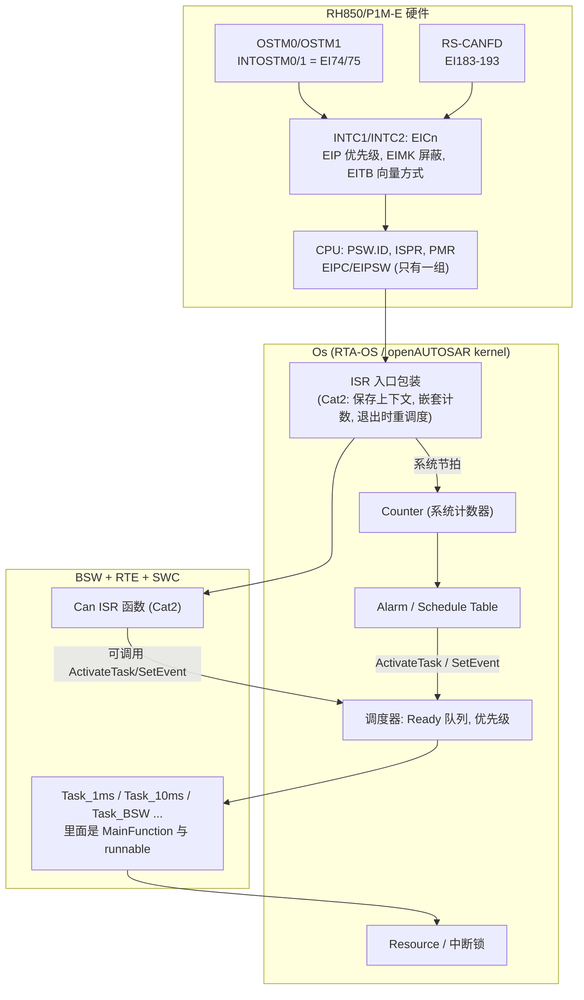
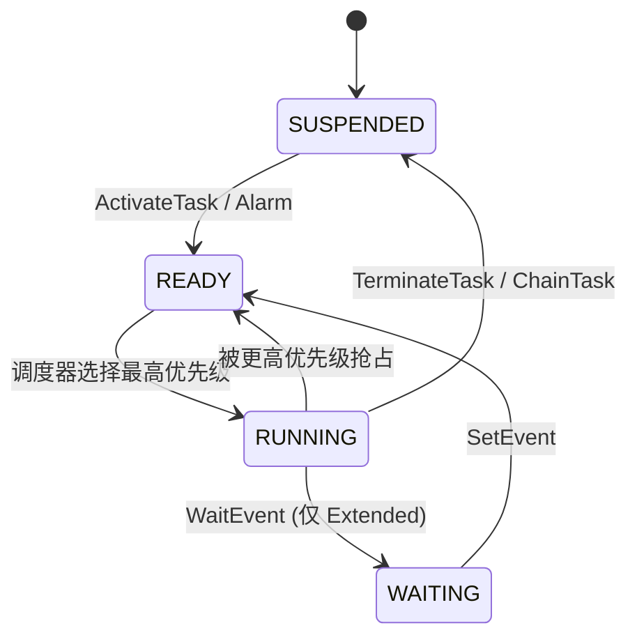
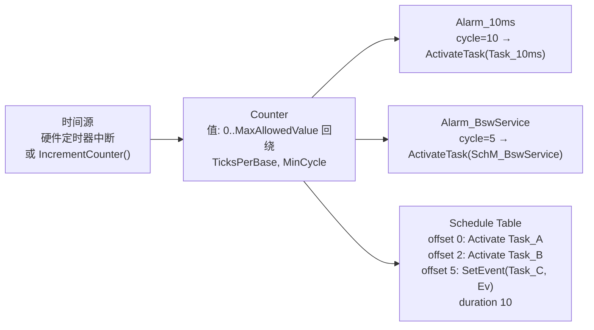
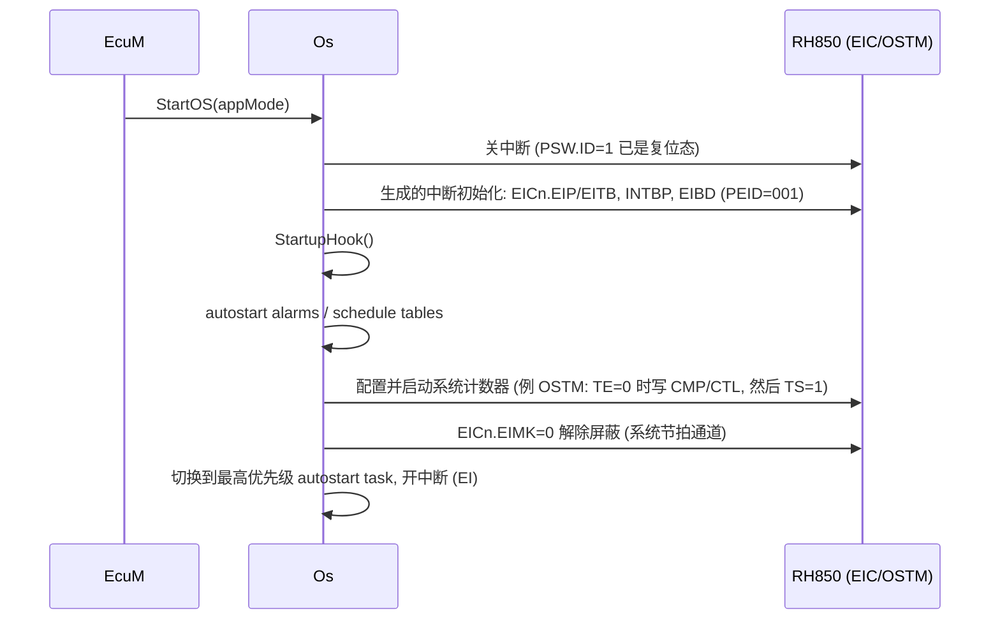
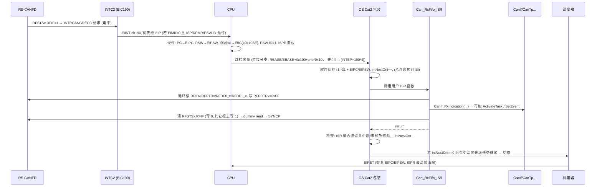
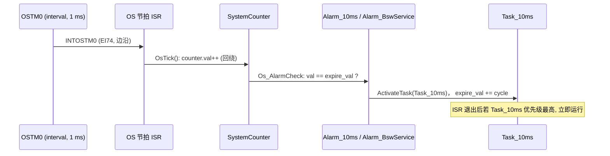

# OS：Task、Cat1/Cat2 ISR、Counter/Alarm/Schedule Table 与 RH850 中断硬件

> Prerequisite: [RH850 中断与异常](../01-rh850/06-interrupt-exception.md), [ECU 启动流程](03-ecu-startup.md)
> Next: [MainFunction 与调度](07-mainfunction-scheduling.md)
> 对应规范: **本仓库没有 AUTOSAR Os SWS / OSEK OS 规范 / RTA-OS 手册**。OS 概念与 API 名称为 OSEK/AUTOSAR OS 公认形态，标注 `[Conceptual]`，需以真实项目所用 OS SWS 与 RTA-OS 用户手册确认。可引用的相关规范：SWS CAN R22-11（`SWS_Can_00033/00419/00420` p.33；`GetCounterValue` 依赖 p.88；`SWS_Can_00398` p.39）；SWS IoHwAb R24-11（`00032/00033` p.27 `BswInterruptEntity` 在中断上下文执行）。
> 对应源码: openAUTOSAR `system/kernel/src/{init.c,task.c,isr.c,counter.c,alarm.c,resource.c,sched_table.c,event.c}`、`system/SchM/src/SchM.c`；本项目 `examples/rh850_mcal_reference/mcal/gpt/Ostm.c`、`integration/Tick_Accumulator.c`、`docs/counter-design.md`
> RH850 依据: RH850/P1M-E HW-E p.190–212（CPU 寄存器与中断优先级）、p.254（清中断源同步）、p.264–290（INTC1/INTC2、EIC、向量、Table 6.11）、p.1542–1567（OSTM）

---

## 1. 本章目标

1. 理解 AUTOSAR Classic 中代码的四种执行上下文：**Task、Cat2 ISR、Cat1 ISR、Hook/Callback**，以及每种上下文能调用什么、不能调用什么。
2. 理解 OS 的时间基础设施：**Counter → Alarm / Schedule Table → ActivateTask / SetEvent**，以及硬件计数器与软件计数器的区别。
3. 理解 **Resource**（优先级天花板）与中断锁 API 的差异，它们是 SchM exclusive area 的底层实现。
4. 把这些概念落到 RH850/P1M-E 硬件上：EIC*n* 的优先级/屏蔽/向量方式、`PSW.ID`、`ISPR`/`PMR`、EIPC/EIPSW 只有一组、电平中断必须清源、OSTM0/1 作为系统计数器。
5. 能读懂 OS 配置与 RH850 中断配置之间的对应关系，并能 debug “中断不进”“中断风暴”“任务不运行”“时间不准”。

---

## 2. 为什么需要 OS？

### 2.1 没有 OS 的 superloop 会怎样

```c
/* [Conceptual] 反例: 裸机 superloop */
int main(void) {
    init_all();
    for (;;) {
        if (tick_1ms)  { can_poll(); cantp_main(); tick_1ms = 0; }
        if (tick_10ms) { dcm_main(); app_10ms(); tick_10ms = 0; }
        if (tick_100ms){ nvm_main(); tick_100ms = 0; }   /* 写 Flash 可能要几毫秒! */
    }
}
```

问题：`nvm_main()` 一次执行 5 ms，期间 1 ms 的 CAN 处理全部延迟；`app_10ms()` 有一个长计算，DCM 的 P2 定时就不准。你无法表达“CAN 处理比 NvM 更紧急”。

### 2.2 OS 提供的三样东西

| 能力 | 解决的问题 | OS 对象 |
|---|---|---|
| **抢占式优先级调度** | 紧急工作可以打断不紧急的工作 | Task（优先级）、ISR |
| **基于时间的激活** | 周期性工作准时开始 | Counter、Alarm、Schedule Table |
| **受控的共享数据保护** | 被打断时数据不被破坏 | Resource、中断锁 API |

AUTOSAR OS 基于 OSEK/VDX OS，并增加了 Schedule Table、保护机制（内存/时间保护）、OS-Application 等。所有配置都是**静态的**：任务、ISR、alarm 数量在编译时确定，没有动态创建。

---

## 3. 在系统中的位置



---

## 4. AUTOSAR OS 如何定义？（[Conceptual]，本仓库无 OS SWS）

### 4.1 Task

| 概念 | 说明 |
|---|---|
| Basic task | 状态：SUSPENDED → READY → RUNNING → SUSPENDED。不能等待事件。执行完调用 `TerminateTask()` |
| Extended task | 多一个 WAITING 状态：可 `WaitEvent(mask)`，被 `SetEvent` 唤醒 |
| 优先级 | 静态配置；数字越大优先级越高是 OSEK 惯例（但 OS 实现内部可能映射成别的编号） |
| 抢占性 | FULL（可被更高优先级任务抢占）/ NON（只在调用调度点时让出） |
| 激活 | `ActivateTask(id)`（来自其它任务、Cat2 ISR、alarm）；`activation` 上限可配置 |
| 自动启动 | `AUTOSTART` 在某个 AppMode 下由 `StartOS` 激活 |



### 4.2 ISR：Category 1 与 Category 2

| | Category 1 (Cat1) | Category 2 (Cat2) |
|---|---|---|
| OS 是否知道它 | 否（直接向量到用户函数） | 是（OS 包装入口与出口） |
| 能调用的 OS 服务 | 极少（中断锁类） | ActivateTask、SetEvent、GetResource、GetCounterValue、IncrementCounter 等 |
| 退出时 | 直接返回被打断的代码 | OS 检查是否需要切换到新就绪的更高优先级任务 |
| 开销 / 延迟 | 最小 | 有包装开销 |
| 优先级要求 | 通常配置为**高于**所有 Cat2（这样“只屏蔽 Cat2”的锁不会影响它） | — |
| 典型用途 | 极短、极紧急、不需要通知任务的工作（如某些安全监控、高速采样） | 绝大多数 BSW 中断：Can、Gpt 通知、Icu |

**为什么 Cat1 不能调用 `ActivateTask`？** 因为 OS 没有包装它的出口——如果 Cat1 中激活了一个更高优先级的任务，返回时没人做调度，新任务要等到下一个调度点才运行；更糟的是 Cat1 可能打断了 OS 内核本身正在修改就绪队列的代码，在其中再修改就绪队列会破坏数据结构。

**CAN 驱动的 ISR 应该是哪一类？** 几乎总是 Cat2：它调用 `CanIf_RxIndication` → … → 上层可能 `ActivateTask` 或 `SetEvent`，并且 Can 的模式切换用 `GetCounterValue`（CAN SWS p.88 把它列为必需接口）。CAN SWS 自己只规定“所有需要的中断由 Can 模块实现 ISR”（`SWS_Can_00033` p.33）、“未用的中断要关闭”（`00419`）、“ISR 末尾清中断标志”（`00420`），以及“驱动不设置中断向量优先级”（p.33 实现提示）——**ISR 的类别、优先级、向量由 OS 配置决定**。

### 4.3 Counter、Alarm、Schedule Table



| 对象 | 说明 | 主要 API（[Conceptual] OSEK/AUTOSAR 名称） |
|---|---|---|
| Counter | 一个按 tick 递增、到最大值回绕的计数器 | `IncrementCounter`（软件计数器）、`GetCounterValue`、`GetElapsedValue` |
| Alarm | 挂在某个 counter 上，到期执行动作：激活任务 / 设置事件 / 回调 / 递增另一个 counter | `SetRelAlarm(id, increment, cycle)`、`SetAbsAlarm`、`CancelAlarm` |
| Schedule Table | 一张在 counter 上按偏移排列的“到期点”表，每个到期点可激活多个任务/设置多个事件；可与全局时间同步 | `StartScheduleTableRel/Abs`、`StopScheduleTable`、`NextScheduleTable` |

**软件计数器 vs 硬件计数器**：

- **软件计数器**：一个周期性中断（例如 OSTM interval 模式每 1 ms 一次）的 ISR 调用 `IncrementCounter`，OS 在其中检查所有挂在该 counter 上的 alarm。简单，但每个 tick 都有中断开销。
- **硬件计数器**（RTA-OS 等 OS 支持的高级形式）：counter 的值直接就是硬件定时器的计数值；OS 只在“下一个到期点”编程一次比较寄存器，没有到期就没有中断。省 CPU，但需要 OS 与硬件之间的一组回调（读当前值、设置下次比较、查询状态、取消）。`docs/counter-design.md` 讨论的正是这种方案（以 OSTM1 自由运行 + 比较中断实现 `Rte_TickCounter` 的 HARDWARE 计数器），其中的“四回调”是 RTA-OS 的硬件计数器接口概念——**具体回调名与语义需以 RTA-OS 用户手册与 RH850 port 文档确认**。

### 4.4 Resource 与中断锁

| 机制 | 作用范围 | 实现思想 | 典型用途 |
|---|---|---|---|
| `GetResource/ReleaseResource` | 任务之间（以及配置了访问权的 Cat2 ISR） | **优先级天花板协议**：拿到资源时，任务优先级临时提升到所有可能使用该资源的任务/ISR 中最高者 | 保护多个任务共享的数据，且不阻塞高于天花板的中断 |
| `RES_SCHEDULER` | 所有任务 | 天花板 = 最高任务优先级，等于临时不可抢占 | — |
| `DisableAllInterrupts/EnableAllInterrupts` | 所有中断 | 关全部（不可嵌套） | 极短临界区 |
| `SuspendAllInterrupts/ResumeAllInterrupts` | 所有中断 | 关全部（可嵌套） | 极短临界区 |
| `SuspendOSInterrupts/ResumeOSInterrupts` | 仅 Cat2 | 屏蔽 Cat2 优先级范围，Cat1 仍可进 | 保护任务与 Cat2 ISR 共享的数据 |

SchM exclusive area（见 [01-classic-platform-overview.md §5.6](01-classic-platform-overview.md)）最终会被生成为上述机制之一。选择的原则是：**锁住所有可能并发访问该数据的上下文，但不多锁**。

### 4.5 Hook

`StartupHook`、`ShutdownHook`、`ErrorHook`、`PreTaskHook`/`PostTaskHook`、`ProtectionHook`。openAUTOSAR 在 `os_start` 中调用 `StartupHook`（`init.c:170-171`），在 Cat2 ISR 退出检查中调用 `ERRORHOOK`（`isr.c` 中 `E_OS_DISABLEDINT`/`E_OS_RESOURCE`）。

---

## 5. 核心数据结构（OS 配置的生成物）

OS 配置同样是生成的。典型生成物（[Conceptual]，RTA-OS 的具体文件名与结构以其工具输出为准）：

| 生成物 | 内容 |
|---|---|
| `Os_Cfg.h` | 任务/ISR/alarm/counter/resource 的 ID 宏（`TASK_ID_xxx` 或 `OsTask_xxx`），AppMode |
| 任务控制块常量表 | 每个任务的入口、优先级、栈、激活上限、autostart |
| ISR 常量表 + **向量表** | 每个 ISR 的入口、类别、优先级、对应的中断通道号 |
| Counter/Alarm/ScheduleTable 表 | 周期、最大值、动作 |
| 中断控制器初始化代码 | 写 EIC*n*（EIP、EITB、EIMK）、`INTBP` |

openAUTOSAR 中只有类型与宏（`include/os_config_macros.h`），`Os_TaskConstList[]` 实例缺失（`03-openautosar-trace.md` §1.4）。它的运行时结构 `Os_Sys` 记录当前任务、中断嵌套计数 `intNestCnt`、系统 tick 等。

---

## 6. 初始化流程



对照 openAUTOSAR `os_start`（`system/kernel/src/init.c:156` 起）：`Irq_Disable()`（:162）→ `StartupHook`（:170-171）→ `Os_AlarmAutostart()`（:183）→ `Os_SchTblAutostart()`（:187）→ `Os_SysTickInit()` / `Os_SysTickStart(sys_freq/OsTickFreq)`（:193-194）→ 找最高优先级 autostart task 并切换（:197 起）。

[RH850 Hardware] 关键硬件约束：

- **EIC 只能在 SV 模式下由 PE1 写**（HW-E p.265）；EIBD 的 PEID **必须为 001**、GPID 必须为 00，且处理 EIINT 期间禁止修改（HW-E p.271）。
- **对 EIC 做读-改-写（包括 set1/clr1）可能丢失或重复中断**，必须在外设不产生请求、CPU 也没有正在受理该中断时才写（HW-E p.267）。这就是为什么中断配置应在 `StartOS` 开中断之前一次性完成。
- **OSTM 只有在 `TE=0`（停止）时才能写 CTL**（HW-E p.1556）。

---

## 7. Runtime Flow

### 7.1 一次 Cat2 ISR 的完整路径（以 CAN RX FIFO 为例）



逐跳说明：

1. **请求产生**：RX FIFO 中断标志 `RFSTSx.RFIF`，使能位 `RFCCx.RFIE`（HW-E p.1058）。CAN 中断在 Table 6.11 中标记为**电平检测**：只要模块内标志未清，请求一直有效，`EIRF` 不能由软件清（HW-E p.285–290 Note；上电后可读 `EICn.EICT` 确认，p.267）。
2. **CPU 受理条件**：`EICn.EIMK=0`；`PSW.ID=0`；该优先级未被 `ISPR` 中同级或更高位屏蔽（HW-E p.210）；未被 `PMR` 屏蔽（p.211）。优先级 0 最高、15 最低；同优先级时通道号小的先受理（p.268）。
3. **硬件保存**：PC→EIPC、PSW→EIPSW、原因码→EIIC，`PSW.ID` 置 1，`ISPR` 对应位置 1（HW-E p.193–194, p.198–199, p.210）。EI 通道的异常源码 = `0x1000 + 通道号`（例 INTRCANGRECC 为 `10BEH`，HW-E pp.282–286 Table 6.11，`01-project-and-docs-review.md` F-INT-7）——**debug 时读 EIIC 就知道是哪个中断**。
4. **向量**：`EICn.EITB=0` 直接分支方式——RINT=0 时按优先级落在基址 `+100H`–`+1F0H`；`EITB=1` 表引用方式——从 `INTBP + 通道号×4` 取地址（HW-E p.281–282）。直接分支方式下，同一优先级的所有中断共享一个入口，OS 需要读 EIIC 再分派；表引用方式每个通道直达自己的处理函数。**选哪种由 OS port 决定**。直接向量方式入口前需要 `SYNCP`（HW-E p.281, p.256）。
5. **软件保存**：通用寄存器以及 **EIPC/EIPSW（只有一组）**——如果允许嵌套（在 ISR 中重新 EI），必须先把 EIPC/EIPSW 存到栈上，否则更高优先级中断会覆盖它们，返回地址丢失（HW-E p.193–194）。FPU 上下文是否保存取决于 ISR 是否使用 FPU，属于编译器/OS 策略（`04-rh850-hardware-notes.md` §2.6）。
6. **ISR 主体**：按 HW-E p.1102 读 FIFO、推进指针；调用上层回调。
7. **清中断源 + 同步**：先写控制寄存器清标志 → 对该寄存器做一次 dummy read → `SYNCP` → 再 EI 或 EIRET（HW-E p.254）。否则写操作可能尚未到达外设，EIRET 后同一请求再次被受理，形成“幽灵中断”。CAN SWS `SWS_Can_00420`（p.33）也要求“ISR 末尾清中断标志”。
8. **OS 出口检查与重调度**：openAUTOSAR `Os_Isr`（`system/kernel/src/isr.c:327` 起）在 Cat2 ISR 返回后检查“ISR 是否遗留关中断”（`/** @req OS368 */` → `ERRORHOOK(E_OS_DISABLEDINT)`）和“是否未释放资源”（`/** @req OS369 */` → `E_OS_RESOURCE`），然后 `--intNestCnt`，若回到 0 且有更高优先级任务就绪则切换。对比 Cat1 分支：`if (isrPtr->constPtr->type == ISR_TYPE_1) { entry(); Irq_EOI(); return stack; }`（`isr.c:335-339`）——**Cat1 直接调用、直接返回，没有任何检查和重调度**，这正是 §4.2 表格的代码证据。

### 7.2 系统节拍 → Alarm → Task



openAUTOSAR 对应代码：

- `OsTick()`（`system/kernel/src/counter.c:193`）：`Os_Sys.tick++`，`cPtr->val = Os_CounterAdd(...)`，然后 `Os_AlarmCheck(cPtr)`（:219）、`Os_SchTblCheck(cPtr)`（:222）。
- `IncrementCounter()`（`counter.c:45`）：软件计数器版本，同样在关中断（`Irq_Save`）下递增并检查 alarm/schedule table（:82, :85）；并检查 counter 类型必须是 `COUNTER_TYPE_SOFT`（`/** @req OS285 */`）。
- `Os_AlarmCheck()`（`system/kernel/src/alarm.c:286`）：遍历挂在该 counter 上的 alarm，`val == expire_val` 时按动作类型 `ActivateTask` / `SetEvent` / `IncrementCounter`。
- `GetCounterValue()`（`counter.c:96`）：Can 驱动的 `Can_SetControllerMode` 用它做有限等待（CAN SWS `SWS_Can_00398` p.39）。
- `SetRelAlarm()`（`alarm.c:99`）：`SchM.c:356, :368` 用它启动 BSW 服务 alarm。
- `StartScheduleTableRel()`（`sched_table.c:246`）、`Os_SchTblCheck()`（`sched_table.c:622`）。
- `GetResource()`（`resource.c:140`）：在 ISR 中调用时检查该 ISR 是否被配置为可访问该资源，`RES_SCHEDULER` 在 ISR 中不可用。

[RH850 Hardware] OSTM 作为节拍源（HW-E p.1542–1567；`04-rh850-hardware-notes.md` §7.1）：

| 项 | 值 |
|---|---|
| 单元 | OSTM0、OSTM1、OSTM3–7（**没有 OSTM2**） |
| 基址 | OSTM0 `FFDD_8000`，OSTM1 `FFDD_9000` |
| 计数时钟 | PCLK = CLK_HSB = 80 MHz |
| 中断 | OSTM0/1 → EI 74/75（边沿检测）；OSTM3–7 → **FEINT**（用于 timing protection 监视，不适合作普通节拍） |
| Interval 模式周期 | (CMP+1)/f；80 MHz 下 1 ms → CMP = 79999 |
| 32 位回绕 | 80 MHz 下 53.687 s |

**OSTM0 还是 OSTM1 给 OS？** 本仓库不同文档说法不一：`docs/counter-design.md` 依据截图工程认为 OSTM0 已被 Gpt 占用、OSTM1 为 OS 候选；旧教程中曾写“本案例可为 OS 独占 OSTM0”。这**不是硬件事实，而是配置选择**。唯一的硬件约束是：一个 OSTM 通道（及其 EIC 通道）只能有一个所有者；OSTM3–7 只能接 FEINT。真实项目以 OS 配置与 Gpt 配置为准。

---

## 8. RH850 Hardware Mapping：OS 概念 ↔ 寄存器

| OS 概念 | RH850/P1M-E 实现手段 | 依据 |
|---|---|---|
| ISR 优先级 | `EICn.EIP[3:0]`，0 最高、15 最低 | HW-E p.267–268 |
| ISR 使能/屏蔽 | `EICn.EIMK`（复位值 1=屏蔽）；`IMRn` 位与 EIMK 联动 | HW-E p.267, p.269 |
| 向量方式 | `EICn.EITB`：0 直接分支（按优先级）、1 表引用（`INTBP+ch×4`） | HW-E p.281–282 |
| `DisableAllInterrupts` / `SuspendAllInterrupts` | `DI` 指令（`PSW.ID=1`）；需保存/恢复原 ID 以支持嵌套 | HW-E p.198 |
| `SuspendOSInterrupts`（只屏蔽 Cat2） | `PMR`：从最低优先级开始连续置位屏蔽（例 `FF00H` 合法，`F0F0H` 不合法）；`INTCFG.ISPC` 在用 PMR 做软件优先级控制时置 1 | HW-E p.211–212 |
| 嵌套中断 | ISR 中执行 EI；**必须先保存 EIPC/EIPSW** | HW-E p.193–194 |
| 当前正在服务的优先级 | `ISPR`：受理时硬件自动置位，EIRET 时（PSW.EP=0）清除最高位 | HW-E p.210 |
| 被 PMR 屏蔽的挂起中断 | `ICSR.PMEI/PMFP` | HW-E p.211 |
| ISR 原因识别 | `EIIC`（EI 通道 = `0x1000 + ch`） | HW-E p.199, pp.282–286 |
| OS 用户/特权模式 | `PSW.UM`；EIC/EIBD/MPU 只能 SV 写 | HW-E p.197, p.265 |
| 内存保护（OS-Application） | MPU 16 区（MPLA/MPUA/MPAT） | HW-E p.214–215；DS-E p.2 |
| 时间保护 | OSTM3–7 + FEINT | HW-E p.1544–1545 |
| 系统计数器 | OSTM0/1 interval（软件计数器）或 free-run compare（硬件计数器） | HW-E p.1556 |
| 不可恢复错误 | SYSERR（FE 级，不能返回）→ OS ProtectionHook / ShutdownOS | HW-E p.244–245 |

**OS 优先级编号 ≠ EIP 编号**：OS 配置中的 ISR 优先级（OSEK 惯例“数字大=优先级高”）由 OS port 映射到 EIP（“数字小=优先级高”）。映射规则需看 RTA-OS RH850 port 文档；debug 时直接读 EIC 寄存器的 EIP 值最可靠。

---

## 9. openAUTOSAR 实现：值得读的 OS 内核片段

openAUTOSAR 的 kernel 是 Arctic 的 OSEK/AUTOSAR OS 实现，**没有 RH850 arch port**（`InitOS` 调用的 `Os_ArchInit` 无实现，`isr.c` 甚至未被 CMake 编译；`03-openautosar-trace.md` §1.2、§6.1），所以不能运行，但其通用部分是很好的阅读材料：

| 主题 | 位置 | 看点 |
|---|---|---|
| StartOS | `init.c:353` → `os_start` `:156` | 关中断 → hook → autostart → 节拍 → 首任务 |
| 任务 API | `task.c:697`（ActivateTask）、`:787`（TerminateTask）、`:908`（Schedule） | 就绪队列与抢占 |
| 事件 | `event.c:50`（WaitEvent）、`:111`（SetEvent） | Extended task |
| Cat1 vs Cat2 | `isr.c:327` `Os_Isr`，Cat1 分支 `:335-339` | Cat1 无检查直接返回 |
| ISR 退出检查 | `isr.c` 中 `@req OS368`/`OS369` | 遗留关中断 / 未释放资源 |
| 节拍 | `counter.c:193` `OsTick` | counter++ → alarm/schedule table 检查 |
| 软件计数器 | `counter.c:45` `IncrementCounter` | 类型检查 `COUNTER_TYPE_SOFT` |
| Alarm | `alarm.c:99` SetRelAlarm、`:286` Os_AlarmCheck | 动作：ActivateTask / SetEvent / IncrementCounter |
| Resource | `resource.c:140` GetResource、`:229` ReleaseResource | ISR 访问权检查、RES_SCHEDULER |
| Schedule table | `sched_table.c:246`、`:622` | 到期点处理 |
| 示例 OS 应用 | `examples/os_simple/os_simple.c`（`bTask3` :32、`eTask1` :50、`eTask2` :75、`OsIdle` :98）、`system_hooks.c`（StartupHook :82） | basic/extended task 写法；example_info.txt 自称“只为证明构建系统可用” |

一个容易被忽视的细节：openAUTOSAR 的 BSW 模块普遍用 `Irq_Save/Irq_Restore`（关全部中断）保护内部数据，而不是 SchM exclusive area（`03-openautosar-trace.md` §8.2）。这在功能上“安全”，但会让所有中断（包括本应不受影响的 Cat1）的延迟变长。

---

## 10. 当前教学项目实现

`examples/rh850_mcal_reference/` 中与 OS 相关的是两个“底层积木”，它们**不是** OS，也不实现 RTA-OS 回调：

1. **`mcal/gpt/Ostm.c`**：OSTM0/1 的停止状态配置、启停、比较值更新、计数读取。
   - `Ostm_InitPclk`（:16-30）：TE=1 时返回 `OSTM_BUSY`（:21-22，对应“只有 TE=0 时才能写 CTL”）；写 `IC0CKSELn = 0`（16 位写，:25，选 PCLK）、`TOE = 0`、`CMP`、`CTL`。
   - `Ostm_SetCompare`（:53-60）的注释特别重要：“Does not clear/force pending IRQs or handle a passed deadline. Those operations belong to the OS integration layer and its critical section.”——在硬件计数器方案中，**“新比较值已经过去了”这种竞争**必须由 OS 集成层在临界区内处理（`docs/counter-design.md` §2–3）。
   - 头文件注释：“Do not use this as an OS alarm cancellation implementation”（`Ostm.h:18-19`）——停表会让自由运行计数器的时间原点归零，OS 的 Cancel 只能取消比较、不能停表。
2. **`integration/Tick_Accumulator.c`**：把 32 位自由运行原始计数换算成 16 位 / 1 ms 的 OS tick，保留余数（:29-43）。`delta = raw_now - state->last_raw` 利用无符号回绕（:35）。头文件明确：要求采样间隔严格小于一次硬件回绕，“This does not implement the RTA-OS callback contract”（`Tick_Accumulator.h:6-8`）。

这两个组件对应 §4.3 中“硬件计数器”方案的最底层：读当前值（`Ostm_ReadCounter`）、换算 tick（`Tick_Update`）、设置下一次比较（`Ostm_SetCompare`）。缺少的部分——ISR、EIC 配置、临界区、过期比较的补发——正是真实 OS port 的工作。

---

## 11. Code Walkthrough：一个 Cat2 ISR 应该怎么写

[Conceptual] 下面是一个**教学用**的 RS-CANFD RX FIFO ISR 骨架（`ISR()` 宏是 OSEK 风格的 Cat2 声明方式；RTA-OS 中写法需按其手册确认；寄存器访问宏为示意）：

```c
/* [Conceptual] 教学骨架，不是 production code */
ISR(CanIsr_RxFifo)                      /* OS 配置: Cat2, 绑定 EI190 (INTRCANGRECC) */
{
    uint32 fifoMask = RSCFD0_RFISTS;   /* 哪些 RX FIFO 有中断 (HW-E p.799, p.846) */
    for (uint8 x = 0u; x < 8u; x++) {
        if ((fifoMask & (1uL << x)) == 0u) { continue; }
        while ((RSCFD0_RFSTS(x) & RFEMP) == 0u) {      /* FIFO 非空 */
            Can_HwType  mailbox;
            PduInfoType pdu;
            uint8       data[8];
            Can_Lld_ReadRxFifo(x, &mailbox, data, &pdu); /* 读 RFID/RFPTR/RFDF0/RFDF1 */
            RSCFD0_RFPCTR(x) = 0xFFu;                     /* 读指针前进 (HW-E p.848) */
            CanIf_RxIndication(&mailbox, &pdu);           /* 回调: 仍在 ISR 上下文 */
        }
        RSCFD0_RFSTS(x) = (uint32)~RFIF & RFSTS_WRITABLE_FLAGS; /* RFIF 写 0, 其它标志写 1 (p.847) */
    }
    (void)RSCFD0_RFSTS(0u);            /* dummy read */
    __SYNCP();                          /* HW-E p.254: 清源后同步, 再返回 */
}
```

要点：

1. **在 ISR 中把 FIFO 读空**，否则电平中断会立刻再次进入。
2. **先推进读指针再调用上层**，还是**先调用再推进**？取决于上层是否在回调中直接使用 `pdu.SduDataPtr` 指向的数据——CAN SWS 要求数据在回调期间有效；如果指针直接指向 FIFO 窗口寄存器，就必须在推进前调用（或先拷贝，像上面这样）。
3. **清标志的写法**：RFSTS 中 RFIF 写 0 清除，其余可写标志要写 1（避免误清 RFMLT 等）（HW-E p.847）。
4. **dummy read + SYNCP** 后再返回（HW-E p.254）。
5. ISR 里**不要**做 UDS 处理，只把数据交给上层；上层（CanTp/Dcm）在 MainFunction 中处理。这是 [07-mainfunction-scheduling.md](07-mainfunction-scheduling.md) 的主题。

---

## 12. Debug 方法

| 症状 | 检查 |
|---|---|
| 中断从不进入 | ① 外设使能位（如 `RFCCx.RFIE`、`RFE`）② `EICn.EIMK` 是否为 0 ③ `EICn.EIP` 是否被 `PMR`/`ISPR` 屏蔽 ④ `PSW.ID` 是否一直为 1（有人关中断没开）⑤ 向量：`EITB`、`INTBP` 表项是否指向正确函数 ⑥ OS 是否把该 ISR 配置到正确通道号 |
| 中断风暴（反复进入） | 电平中断源未清（`RFIF`、`TMTRF` 等）；清了但没做 dummy read + SYNCP |
| 进入了“未知中断”/默认处理 | 读 `EIIC`：`0x1000 + ch`，反查 Table 6.11（HW-E pp.282–286） |
| 嵌套中断后返回地址错乱 | ISR 开中断前未保存 EIPC/EIPSW |
| 任务从不运行 | 任务未被激活（alarm 未启动、counter 不走）；更高优先级任务死循环；Resource 未释放导致天花板不降 |
| alarm 周期不准 | 节拍 ISR 被长时间关中断推迟（OSTM interval 模式会丢 tick 吗？interval 模式下硬件会重载继续计数，但若 ISR 延迟超过一个周期，软件 counter 只加 1——丢 tick） |
| OS ErrorHook 报 `E_OS_DISABLEDINT` / `E_OS_RESOURCE` | Cat2 ISR 中 Suspend/Resume 或 Get/ReleaseResource 不配对 |
| 时间相关的偶发错误 | 在节拍 ISR 和关键 ISR 入口/出口翻转一个 GPIO（Dio），用示波器看抖动与关中断时间 |

[Real Project Consideration] RTA-OS 等商业 OS 通常提供运行时统计（任务执行时间、最大关中断时间、栈使用）。在 DCM 升级后出现 P2 超时，首先看 Dcm 所在任务的响应时间统计。

---

## 13. 常见问题 / 常见错误

1. **把 CAN ISR 配成 Cat1** 以“减少延迟”，结果上层回调中的 `ActivateTask`/`SetEvent` 失效或破坏内核数据。
2. **以为 OS 优先级数字与 EIP 数字方向相同**。
3. **在 ISR 中处理业务**（解析 UDS、写 NvM），导致其它中断延迟。
4. **用 `SuspendAllInterrupts` 保护一切**，Cat1 和高优先级 Cat2 的延迟被无谓拉长。
5. **忘记电平中断要清外设标志**；或用 `EIRF` 去清（电平型 EIRF 不能由软件清，HW-E p.267）。
6. **OSTM 通道被两个模块同时配置**（OS 节拍和 Gpt 都以为自己拥有 OSTM0）。
7. **在启动早期（StartOS 前）调用需要 OS 的服务**，例如 `GetCounterValue`。
8. **用停表来实现 alarm Cancel**（`Ostm.h:18-19` 的警告）。

---

## 14. 实验

1. **读 Table 6.11**：在 `artifacts/pdf-text/r01uh0585ej0120.txt` 中找到 INTOSTM0、INTOSTM1、INTRCAN0ERR、INTRCANGRECC 四行，记下通道号、表偏移、EIC 地址、是否电平检测、EIIC 源码。
2. **OSTM 周期计算**：用 `Ostm_IntervalCompare` 的规则，计算 80 MHz 下 1 ms、5 ms、10 ms、100 µs 的 CMP 值；再算 20 MHz 下的值；说明为什么 `Ostm_IntervalCompare(32768, 1000, &cmp)` 返回 false（`tests/test_reference.c:154`）。
3. **Cat1/Cat2 阅读**：阅读 openAUTOSAR `isr.c:327` 起的 `Os_Isr`，画出 Cat1 和 Cat2 两条路径的流程图，标出每个检查对应的 OS 需求号（OS368/OS369）。
4. **优先级设计纸面练习**：给出一个 ECU 的中断与任务清单——OSTM 节拍（1 ms）、CAN RX、CAN TX、CAN 错误、Gpt 通知、Task_1ms（Can/CanTp MainFunction）、Task_10ms（Dcm/Dem/Com MainFunction）、Task_100ms（NvM）、Background——为它们分配 OS 优先级与 EIP，说明哪些是 Cat1、哪些是 Cat2，以及 `SuspendOSInterrupts` 用 PMR 屏蔽的范围。

---

## 15. 思考题

1. 为什么 Cat1 ISR 的优先级通常要高于所有 Cat2 ISR？如果把一个 Cat1 ISR 配置在两个 Cat2 ISR 之间，`SuspendOSInterrupts` 用 PMR 实现时会遇到什么问题？（提示：PMR 必须从最低优先级连续置位，HW-E p.211。）
2. 硬件计数器方案中，如果新比较值在写入 CMP 之前就已经“过去”了（计数器已越过目标），会发生什么？OS 集成层应该如何检测并补发？（参考 `docs/counter-design.md` §2 关于“到期/过去目标先走补发分支”。）
3. RH850 的 EIPC/EIPSW 只有一组。这对“允许 ISR 嵌套”的 OS 设计意味着什么额外开销？如果所有 Cat2 ISR 都不允许嵌套，又会带来什么问题？
4. Can 驱动的 `Can_SetControllerMode` 在 `CanTimeoutDuration` 内用 `GetCounterValue` 等待（`SWS_Can_00398`）。如果这个调用发生在一个比 OS 节拍 ISR 优先级更高的上下文中（例如关中断状态下），等待会怎样？

---

## 16. 对未来真实项目的意义

以后在真实 RH850 + RTA-OS 项目中：

1. **建立中断清单**：从 OS 配置导出所有 ISR，列出 名称 / 类别 / OS 优先级 / EI 通道 / EIP / 向量方式 / 所属模块（Can、Gpt、Icu、Wdg…），对照 Table 6.11 核对通道号。
2. **建立任务清单**：每个任务的优先级、周期（由哪个 alarm/schedule table 激活）、里面运行哪些 MainFunction 和 runnable（见下一章）。
3. **确认系统计数器**：用哪个 OSTM、软件还是硬件计数器、tick 长度；`Rte_TickCounter` 之类的计数器类型要求（截图工程中为 HARDWARE）；OSTM 通道的唯一所有者。
4. **查看 exclusive area 与 OS 锁的映射**：哪些 `SchM_Enter_*` 展开为 `SuspendAllInterrupts`，哪些为 `SuspendOSInterrupts`，哪些为 Resource。
5. **测量**：最大关中断时间、节拍 ISR 抖动、Dcm/CanTp 所在任务的最坏响应时间——DCM P2 问题最终都会落到这里。
6. **把 Cat2 ISR 的写法与 HW-E p.254 的“清源 + dummy read + SYNCP”规则对照**，检查供应商 MCAL 的 ISR 是否遵守（通常是遵守的，但集成者自己写的 ISR 常常不遵守）。

---

## 17. 本章总结

- 执行上下文：Task（可抢占、有优先级）、Cat2 ISR（OS 管理、可调用 OS 服务、退出时可重调度）、Cat1 ISR（OS 不知情、不可调用大多数 OS 服务）。BSW 中断（Can 等）几乎都是 Cat2。
- 时间：Counter（软件或硬件）→ Alarm / Schedule Table → ActivateTask / SetEvent。
- 保护：Resource（优先级天花板）与三类中断锁；SchM exclusive area 是它们的抽象。
- RH850：EIC 的 EIP/EIMK/EITB、`PSW.ID`、`ISPR`/`PMR`、EIPC/EIPSW 只有一组、电平中断必须清外设源并 dummy read + SYNCP、EIIC = `0x1000 + ch`、OSTM0/1 为 EI 74/75 而 OSTM3–7 为 FEINT。
- OSTM0/OSTM1 的归属是配置选择，不是硬件事实。

## 18. 下一章

[07-mainfunction-scheduling.md](07-mainfunction-scheduling.md)：有了 Task、ISR 和 alarm，就可以回答一个核心问题——**Interrupt、OS Task、MainFunction、Runnable 之间到底是什么关系**？以及 MainFunction 的周期如何决定 CanTp 超时和 DCM 的 P2 行为。
