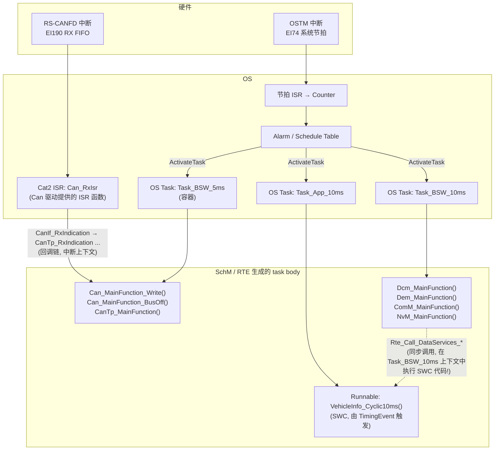
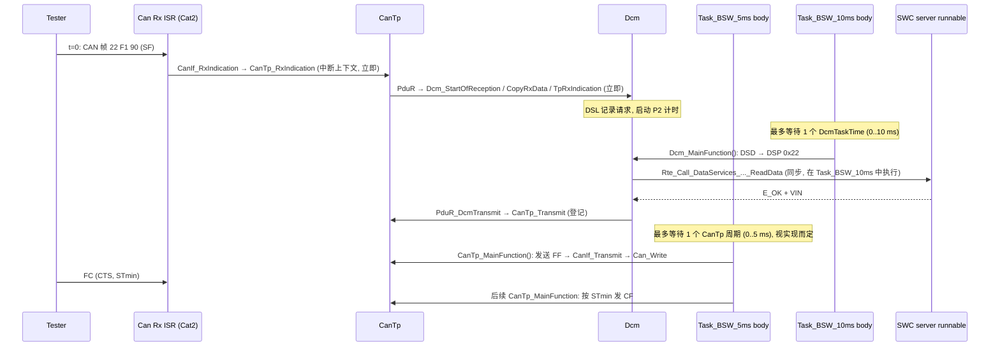

# Interrupt、OS Task、MainFunction、Runnable：调度关系与 P2 时序

> Prerequisite: [OS、Task 与 ISR](06-os-task-isr.md), [分层架构](02-layered-architecture.md)
> Next: [MCAL 总览](../03-mcal/01-mcal-overview.md)
> 对应规范: SWS CAN R22-11（p.50–51 中断 vs 轮询、p.84–87 Scheduled functions、`SWS_Can_00110` p.84、`CanMainFunction*Period` p.101–102、`CanMainFunctionRWPeriods` p.131、`CanRxProcessing/CanTxProcessing` p.109–110）；SWS DCM R20-11（`SWS_Dcm_00024` p.61、`SWS_Dcm_00143` p.79、`Dcm_MainFunction` `SWS_Dcm_00053` p.260–261、`DcmTimStrP2ServerAdjust` p.466、`DcmTaskTime` p.678）；SWS IoHwAb R24-11（`00032/00033/00035` p.27–28）。**本仓库没有 RTE/SchM、Os、CanTp、Dem、NvM、Com SWS**——相关周期与事件类型为 R4.x 公认形态，需在真实项目确认。
> 对应源码: openAUTOSAR `system/SchM/include/SchM.h`、`system/SchM/include/SchM_cfg.h`、`system/SchM/src/SchM.c`、`diagnostic/Dcm/src/Dcm.c`、`diagnostic/Dcm/src/Dcm_Dsl.c`、`diagnostic/Dcm/include/Dcm_Cfg.h`、`communication/CAN/CanTp/include/CanTp_Cfg.h`

---

## 1. 本章目标

这一章回答一个初学者最常卡住的问题：

> **Interrupt、OS Task、MainFunction、Runnable 到底是什么关系？谁调用谁？代码到底在哪个上下文里执行？**

读完后你应该能：

1. 用一句话区分四者：**Interrupt 是硬件事件；Task 是 OS 的执行容器；MainFunction 是 BSW 模块的周期性函数；Runnable 是 SWC 的函数。MainFunction 和 Runnable 都被“放进” Task 里执行。**
2. 说出 BSW Scheduler（SchM）在其中扮演的角色：把 MainFunction（以及 RTE 把 Runnable）映射进 OS Task。
3. 知道常见 MainFunction 的典型周期（Can、CanTp、Dcm、Dem、NvM、Com），以及**这些周期从哪里配置、为什么必须一致**。
4. 能计算一个诊断请求从 CAN 帧到响应的**最坏延迟**，并解释它如何决定 DCM 何时发送 NRC 0x78（P2 定时）。

---

## 2. 为什么需要 MainFunction？为什么不在中断里做完一切？

### 2.1 中断要短

中断打断一切比它优先级低的代码。如果 CAN 接收中断里直接完成 UDS 处理（查表、读 NvM、调用 SWC），那么：

- 所有更低优先级的中断与所有任务都被延迟，延迟长度取决于“这次是什么诊断请求”——不可预测；
- 中断上下文里不能等待（不能 `WaitEvent`），而很多工作天然需要“等一会儿再继续”（NvM 读、DEM 过滤、SWC 异步计算）。

### 2.2 很多工作本来就是“周期性”的

- CanTp 需要检查 N_Cr（等下一个连续帧的超时）、遵守 STmin（连续帧之间的最小间隔）——这是**时间驱动**的；
- DCM 需要检查 P2/P2\*/S3——时间驱动；
- NvM 需要分多步推进 Flash 擦写——每次推进一点；
- Dem 需要做 debounce、老化计数。

所以 AUTOSAR 的模式是：**中断只做“搬运 + 标记”，真正的处理在周期调用的 MainFunction 中推进状态机**。CAN SWS 对此的表述很直接：主函数“are directly called by Basic Software Scheduler”，无参无返回、不可重入（p.84）。

---

## 3. 在系统中的位置：四个概念的关系图



逐个解释：

| 概念 | 是什么 | 由谁定义 | 由谁触发 | 在什么上下文执行 |
|---|---|---|---|---|
| **Interrupt** | 硬件事件（EIC*n* 请求） | 芯片（Table 6.11） | 硬件 | ISR（Cat1/Cat2） |
| **ISR 函数** | 处理中断的 C 函数 | MCAL 模块提供（`SWS_Can_00033` p.33），OS 配置绑定到通道 | OS 中断包装 | 中断上下文 |
| **OS Task** | OS 的调度单位，有优先级、栈 | OS 配置 | Alarm/Schedule Table/ActivateTask/SetEvent | 任务上下文 |
| **MainFunction** | BSW 模块的周期函数，`void <Mod>_MainFunction(void)` | 模块 SWS（例 `Can_MainFunction_Write` `SWS_Can_00225`、`Dcm_MainFunction` `SWS_Dcm_00053`） | **SchM**：在某个 Task 的 body 里被调用 | 所在 Task 的上下文 |
| **Runnable** | SWC 的函数（runnable entity） | SWC 描述（ARXML） | **RTE**：按 RTE Event（TimingEvent、DataReceivedEvent、OperationInvokedEvent、InitEvent…）在某个 Task 中调用，或被另一个组件通过 `Rte_Call` 直接调用 | 所在 Task 的上下文，或**调用者的上下文** |

关键认识：

1. **MainFunction 不是 Task**。它只是一个函数。SchM（在 R4.x 中是 RTE 的一部分）为每个 OS Task 生成一个 body，body 里按配置顺序调用若干 MainFunction。
2. **Runnable 也不是 Task**。RTE 把 Runnable 映射进 Task；同一个 Task 里可以混合 BSW MainFunction 和 SWC Runnable。
3. **回调链在调用者的上下文中执行**。Can 的 Rx ISR 调用 `CanIf_RxIndication`，CanIf 再调用 `CanTp_RxIndication`……这一整串都在**中断上下文**里。CAN SWS p.51 因此要求“回调实现必须按可能在 ISR 中被调用来写”。
4. **同步的 C/S 调用也在调用者上下文中执行**。DCM 在 `Dcm_MainFunction` 中调用 `Rte_Call_DataServices_<Data>_ReadData()`，如果 RTE 把它实现为直接函数调用，那么 **SWC 的 server runnable 就在 DCM 所在的 BSW Task 中运行**。SWC 代码写得慢，DCM 就慢；SWC 访问的共享数据，就要防范与 SWC 自己任务的并发。

---

## 4. AUTOSAR 如何定义？

### 4.1 BSW 的可调度实体

[AUTOSAR Standard]（BSW 模块描述与 SchM 细节在 RTE SWS / BSW Module Description Template 中，本仓库无；以下为 R4.x 公认概念，IoHwAb SWS 中有直接引用）

- **BswSchedulableEntity**：可被 SchM 调度的 BSW 函数，即 MainFunction。IoHwAb SWS：“Job 处理函数为 `BswSchedulableEntity`，由 BSW Scheduler 周期触发”（`SWS_IoHwAb_00035`，p.28）。
- **BswInterruptEntity**：在中断上下文执行的 BSW 函数。IoHwAb SWS：处理 MCAL 通知的回调定义为 `BswInterruptEntity`，**在中断上下文执行**（`00032/00033`，p.27）。
- **BswTimingEvent**：周期触发 BswSchedulableEntity 的事件，带周期。集成者把它映射到一个 OS Task（以及在 Task 中的位置）。

### 4.2 Can 驱动：中断还是轮询？

[AUTOSAR Standard] CAN SWS R22-11：

- 事件可由中断或轮询检测（`SWS_Can_00099`，p.50）；驱动必须能配置成**完全不用中断**（`SWS_Can_00007`，p.50）。
- 每个控制器单独配置：`CanRxProcessing`、`CanTxProcessing`（INTERRUPT / MIXED / POLLING，p.109–110）、`CanBusoffProcessing`（INTERRUPT / POLLING，p.107）、`CanWakeupProcessing`（p.110）。
- 轮询发生在对应的 `Can_MainFunction_xxx` 中，**回调的上下文从 ISR 变为 MainFunction 所在的任务**（p.51）。
- 主函数（p.84–87）：`Can_MainFunction_Write`（0x01，TX 确认轮询）、`Can_MainFunction_Read`（0x08，RX 轮询）、`Can_MainFunction_BusOff`（0x09）、`Can_MainFunction_Wakeup`（0x0a）、`Can_MainFunction_Mode`（0x0c，控制器模式切换轮询）。**执行顺序无要求**（`SWS_Can_00110`，p.84）；无轮询需求时可实现为空宏。
- 周期参数：`CanMainFunctionBusoffPeriod`（p.101）、`CanMainFunctionModePeriod`（p.102）等；配置多个 `CanMainFunctionRWPeriods`（`ECUC_Can_00437`，p.131）时，读写主函数名变为 `Can_MainFunction_Read_<ShortName>()` / `Can_MainFunction_Write_<ShortName>()`（`SWS_Can_00441/00442`，p.85–86）——不同硬件对象可以用不同周期轮询。

即使 RX/TX 全部用中断，`Can_MainFunction_Mode` 通常仍然需要：`Can_SetControllerMode` 是异步的，超时未完成的模式切换由它继续轮询并通知 `CanIf_ControllerModeIndication`（`SWS_Can_00370/00372/00373`，p.39–40）。

### 4.3 DCM：MainFunction 周期是时间基准

[AUTOSAR Standard] DCM SWS R20-11：

- `Dcm_MainFunction`（Service ID 0x25，`SWS_Dcm_00053`，p.260–261）：“used for processing the tasks of the main loop”，通过 `SchM_Dcm.h` 提供。
- **`DcmTaskTime`**（`ECUC_Dcm_00820`，p.678）：MainFunction 周期（秒）。规范原文：“This configuration value **shall be equal to the value in the RTE module**.”——**DCM 用这个值把所有时间参数换算成 MainFunction 调用次数，它必须等于 SchM/RTE 真正调度 `Dcm_MainFunction` 的周期**。
- `DcmTimStrP2ServerAdjust` / `DcmTimStrP2StarServerAdjust`（`ECUC_Dcm_00729/00728`，p.466–467）：“mainly represents the software architecture dependent communication delay between the time the transmission is initiated by DCM and the time when the message is actually transmitted to the bus”，且**必须是 `DcmTaskTime` 的整数倍**。
- `SWS_Dcm_00024`（p.61）：如果需要更多时间，DSL 在 **`DcmDspSessionP2ServerMax − DcmTimStrP2ServerAdjust`**（或 P2\* 对应值）到达时发送 NRC 0x78。
- `SWS_Dcm_00143`（p.79）：P2min = P2\*min = 0，**S3Server = 5 s**。
- 异步操作：应用返回 `DCM_E_PENDING` 后，每个 MainFunction 以 `DCM_PENDING` 重调（`SWS_Dcm_00530/00760`，`02-autosar-sws-notes.md` §3.5）——**“一次 PENDING = 至少多等一个 `DcmTaskTime`”**。

---

## 5. 核心数据结构：典型周期表

[Real Project Consideration] 下表是**常见量级**，不是规范要求；真实取值由项目的时序需求、CPU 负载和 OEM 诊断规范决定，必须在真实项目配置中确认。

| MainFunction | 主要工作 | 常见周期量级 | 周期太长的后果 | 配置参数 |
|---|---|---|---|---|
| `Can_MainFunction_Write` | TX 确认轮询（POLLING 时） | 1–10 ms（中断模式下可为空） | TxConfirmation 延迟 → CanTp 下一帧延迟 | `CanMainFunctionRWPeriods`（p.131） |
| `Can_MainFunction_Read` | RX 轮询（POLLING 时） | 1–10 ms | 接收延迟、RX FIFO 溢出（`CAN_E_DATALOST`） | 同上 |
| `Can_MainFunction_BusOff` | bus-off 轮询 | 5–10 ms | bus-off 通知延迟 | `CanMainFunctionBusoffPeriod`（p.101） |
| `Can_MainFunction_Mode` | 模式切换完成轮询 | 5–10 ms | STARTED 通知延迟 | `CanMainFunctionModePeriod`（p.102） |
| `CanTp_MainFunction` | 发送下一帧、STmin、N_xx 超时 | 1–5 ms | STmin 分辨率变粗（STmin=0 时多帧响应被拉长）；超时检测粗 | CanTp 的 MainFunction 周期参数（无 SWS） |
| `Dcm_MainFunction` | DSL/DSD/DSP 处理、P2/S3 计时 | 5–10 ms | 响应延迟；P2 检测粒度粗 → NRC 0x78 发送偏晚 | `DcmTaskTime`（p.678） |
| `Dem_MainFunction` | debounce、事件处理、NV 同步 | 10 ms 量级 | 故障确认延迟 | Dem 配置（无 SWS） |
| `NvM_MainFunction`（+ `Fee/Fls_MainFunction`） | 推进读写作业 | 1–10 ms | 启动时 ReadAll 变慢；DCM 0x2E 写 DID 变慢 | NvM 配置（无 SWS） |
| `Com_MainFunctionRx/Tx` | 信号超时、周期发送 | 5–10 ms | 周期报文抖动 | Com 配置（无 SWS） |
| `CanSM/ComM/EcuM/BswM_MainFunction` | 模式管理 | 10 ms 量级 | 模式切换延迟 | 各自配置 |

---

## 6. 初始化流程：调度何时开始

调度的起点在 OS 启动之后（见 [03-ecu-startup.md §6.5](03-ecu-startup.md)）：

- openAUTOSAR 的启动任务先 `SetRelAlarm(ALARM_ID_Alarm_BswService, 10, 2)`（`SchM.c:356`），在 `ECUM_STATE_STARTUP_TWO` 期间只运行存储类 MainFunction（`runMemory()`，`SchM.c:388-390`），以便 `NvM_ReadAll` 能完成；
- `EcuM_StartupTwo` 返回后切换到正常周期 `SetRelAlarm(..., 10, 5)`（`SchM.c:367-368`），并在 RUN 状态运行所有 MainFunction（`SchM.c:391-418`）。

这说明**“哪些 MainFunction 在哪个阶段被调度”本身也是 EcuM 状态的函数**：模块未初始化时调用它的 MainFunction 会触发 DET `*_E_UNINIT`。真实 RTA-CAR 项目中，这通常由 BswM 规则或 SchM 生成代码中的模式判断控制。

---

## 7. Runtime Flow：一次诊断请求的时间线

### 7.1 openAUTOSAR 的调度实现（反面教材：周期不一致）

```c
/* [openAUTOSAR] system/SchM/include/SchM.h:43-47 */
#define SCHM_MAINFUNCTION(_mod,_func) \
        if( (++SchM_Info_ ## _mod.timer % SCHM_MAINFUNCTION_CYCLE_ ## _mod )== 0 ) { \
            _func; \
            SchM_Info_ ## _mod.timer = 0; \
        }
```

- 所有 BSW MainFunction 都在一个任务 `SchM_BswService` 中（`SchM.c:379-422`），按计数分频调用；
- 该任务由 `Alarm_BswService` 每 5 tick 激活（`SchM.c:368`），`OSTICKDURATION` = 1 ms（`boards/linuxOs/MCAL/Os/include/Os_Cfg.h:38`）→ 5 ms；
- 所有模块的分频都是 `SCHM_CYCLE_MAIN = 5`（`system/SchM/include/SchM_cfg.h:27`，:29-65）→ **实际约 25 ms**；
- 但 `Dcm_Cfg.h:46` 定义 `DCM_MAIN_FUNCTION_PERIOD_TIME_MS 10`，`CanTp_Cfg.h:24` 定义 `CANTP_MAIN_FUNCTION_PERIOD_TIME_MS 1000`；
- `SchM_cfg.h:74` 用写死的 `ALARM_ID_Alarm_BswService 123`，OS 配置中并没有这个 alarm。

后果可以直接从代码推出：

```c
/* [openAUTOSAR] diagnostic/Dcm/src/Dcm_Dsl.c:38 */
#define DCM_CONVERT_MS_TO_MAIN_CYCLES(x)  ((x)/DCM_MAIN_FUNCTION_PERIOD_TIME_MS)
/* :840 收到请求时 */
runtime->stateTimeoutCount = DCM_CONVERT_MS_TO_MAIN_CYCLES(sessionRow->DspSessionP2ServerMax);
/* :555-558 每次 DslMain 递减, 到 0 时触发 response-pending 处理并重装 P2* */
```

如果 P2ServerMax = 50 ms：DCM 算出 50/10 = **5 次** MainFunction；但真实周期 25 ms，于是 P2 实际变成 **125 ms**——Tester 早已超时。CanTp 更严重：`CANTP_CONVERT_MS_TO_MAIN_CYCLES(x)`（`CanTp_Cfg.h:25`）是 `(x)/1000` 的整数除法，所有小于 1000 ms 的超时（如 N_As = 2 ms 级别的配置值）都会被换算成 **0 个周期**（`03-openautosar-trace.md` §8.3 第 5 条）。

**这就是 `DcmTaskTime` “shall be equal to the value in the RTE module”（DCM p.678）的意义**：模块内部的时间换算与真实调度周期必须来自同一个配置源。

### 7.2 R4.x 典型调度（[Conceptual]）



### 7.3 计算最坏响应时间（教学例题）

假设（[Conceptual]，数字仅用于练习）：

- `DcmTaskTime` = 10 ms，`CanTp_MainFunction` 周期 = 5 ms；
- `P2ServerMax` = 50 ms（以项目诊断规范为准），`DcmTimStrP2ServerAdjust` = 10 ms（必须是 `DcmTaskTime` 的整数倍，p.466）；
- 请求是单帧；响应是多帧（VIN 17 字节 + 3 字节头 → 20 字节，ISO-TP 需 FF + 2 个 CF）；
- SWC 的 `ReadData` 是同步的，执行时间可忽略。

| 阶段 | 最好 | 最坏 | 说明 |
|---|---|---|---|
| ① 帧到达 → Dcm 记录请求 | ~0 | 中断延迟（µs 级，取决于关中断时间） | 回调链在 ISR 中 |
| ② 等待下一次 `Dcm_MainFunction` | 0 | 10 ms | MainFunction 与请求到达时刻无关 |
| ③ DSD/DSP 处理 + SWC 读数据 | ~0 | ~0（同步） | 若 SWC 返回 PENDING，每次 +10 ms |
| ④ `PduR_DcmTransmit` → FF 发出 | 0（若 CanTp_Transmit 立即发 FF） | 5 ms（等下一个 CanTp_MainFunction） | 取决于 CanTp 实现：openAUTOSAR 只登记、在 MainFunction 中发（`CanTp.c:1204-1205`） |
| ⑤ FF 在总线上 + 进入 Tester | <1 ms | <1 ms | 500 kbps 一帧约 0.25 ms 量级 |
| **首帧响应时间** | **~0 ms** | **~15 ms** | 远小于 P2 = 50 ms |

**NRC 0x78 的发送时刻**：若服务处理需要很长时间（例如 SWC 异步计算、Dem 过滤大量 DTC），DSL 应在 `P2ServerMax − DcmTimStrP2ServerAdjust` = 40 ms 时发送 0x78。但 DCM 只能在 `Dcm_MainFunction` 中检查时间——检测粒度 = 10 ms；从 DCM 决定发送 0x78 到它真正上总线，还要经过 PduR → CanTp（最多 5 ms）→ Can。所以：

```text
0x78 最晚上总线时刻 ≈ (P2ServerMax − Adjust) + 检测粒度误差 + 发送路径延迟
                    ≈ 40 ms + (0..10 ms) + (0..5 ms) ≈ 最坏 55 ms  > 50 ms !
```

结论：`DcmTimStrP2ServerAdjust` 必须覆盖“MainFunction 检测粒度 + 下层发送路径延迟”。这正是规范把它描述为“software architecture dependent communication delay”（p.466）的原因。把 Adjust 设为 20 ms，则最坏约 45 ms，满足 50 ms。

> 这只是数量级推演。真实的计时方式（DCM 是在请求到达时就开始计时，还是在第一次 MainFunction 时才开始；计数器在 MainFunction 的哪个位置递减）因实现而异，必须在真实项目中测量。

### 7.4 同一 Task 内的调用顺序

`SWS_Can_00110` 说 Can 的几个主函数之间没有顺序要求，但**不同模块 MainFunction 在同一个 Task 中的顺序会影响延迟**。例如在一个 5 ms 任务中：

```text
顺序 A: Can_MainFunction_Read → CanTp_MainFunction → Dcm_MainFunction → CanTp_MainFunction(?) → Can_MainFunction_Write
顺序 B: Dcm_MainFunction → CanTp_MainFunction → Can_MainFunction_Read
```

顺序 A 中，一个刚轮询到的请求可以在同一个周期内被 CanTp 处理、被 DCM 处理；顺序 B 中则要等下一个周期。openAUTOSAR 的 `Dcm_MainFunction` 内部顺序是 `DsdMain(); DspMain(); DslMain();`（`diagnostic/Dcm/src/Dcm.c:96-102`）——DSL 在最后，所以 DSP 生成的响应在**同一次** MainFunction 末尾就交给了 PduR（`03-openautosar-trace.md` §3.2）。这种“同周期内完成”的设计是有意的。

---

## 8. RH850 Hardware Mapping：调度最终落在哪些硬件上

| 调度要素 | RH850/P1M-E 硬件 | 依据 |
|---|---|---|
| 所有周期的“心跳” | OSTM0 或 OSTM1（interval：CMP=79999 → 1 ms @ 80 MHz；或 free-run compare 硬件计数器） | HW-E p.1543, p.1556 |
| 节拍中断 | INTOSTM0/1 = EI74/75（边沿） | HW-E p.283 |
| MainFunction 所在 Task 的抢占 | OS 调度器（软件）；被中断打断时由 EIC 优先级决定 | HW-E p.268 |
| 中断上下文中的回调链 | EI190（RX FIFO）、EI185/188/193（TX）等 Cat2 ISR | HW-E p.285–286 |
| exclusive area 对延迟的影响 | `DI`/`PMR` 期间，节拍与 CAN 中断被推迟 | HW-E p.198, p.211 |
| 轮询模式的数据来源 | 轮询 `RFSTSx.RFEMP`、`TMSTSp.TMTRF`、`CmSTS` | HW-E p.847, p.880, p.810 |

[RH850 Hardware] 轮询模式下要注意：RX FIFO 满时新帧被丢弃（`RFMLT` 置位，HW-E p.1122），而 FIFO 深度可配 4–128（`RFCCx.RFDC`，p.845）。如果 `Can_MainFunction_Read` 周期 10 ms、总线上 500 kbps 满负载，10 ms 内可能来几十帧——FIFO 深度必须按“周期 × 最大帧率”设计。CAN SWS 对此报运行时错误 `CAN_E_DATALOST`（`SWS_Can_00395`，p.49）。

---

## 9. openAUTOSAR 实现：完整追踪

| 主题 | 位置 | 说明 |
|---|---|---|
| 调度宏 | `system/SchM/include/SchM.h:43-47` | 计数分频 |
| 每模块调度宏定义 | `system/SchM/include/SchM_Dcm.h:20`（`SCHM_MAINFUNCTION_DCM()` → `SCHM_MAINFUNCTION(DCM, Dcm_MainFunction())`）；`SchM_Can.h:19-23` | 模块未启用时被定义为空（`SchM.c:175-179` 等） |
| 分频配置 | `system/SchM/include/SchM_cfg.h:27`（`SCHM_CYCLE_MAIN 5`）、`:29-65` | 所有模块同一分频 |
| 写死的 alarm ID | `SchM_cfg.h:74` | `ALARM_ID_Alarm_BswService 123` |
| 启动任务 | `SchM.c:351-376` | 先 2 tick，后 5 tick |
| BSW 服务任务 | `SchM.c:379-422` | 按 EcuM 状态选择调度内容 |
| `SchM_MainFunction` | `SchM.c:424` | 空函数 |
| 节拍 | `boards/linuxOs/MCAL/Os/include/Os_Cfg.h:38` | `OSTICKDURATION 1000000UL` ns |
| Dcm 周期假设 | `diagnostic/Dcm/include/Dcm_Cfg.h:46` | 10 ms |
| Dcm 时间换算 | `diagnostic/Dcm/src/Dcm_Dsl.c:38`、`:79`（S3）、`:840`（P2）、`:555-558`（递减与 P2\* 重装） | 以“MainFunction 次数”计时 |
| Dcm 主函数顺序 | `diagnostic/Dcm/src/Dcm.c:96-102` | Dsd → Dsp → Dsl |
| CanTp 周期假设与换算 | `communication/CAN/CanTp/include/CanTp_Cfg.h:24-25` | 1000 ms、整数除法 |
| CanTp 定时器装载 | `CanTp.c:402`（N_Ar）、`:425`（N_As）、`:555`（N_Br）、`:568`（N_Cr） | 均经该宏换算 |
| CanTp 主函数 | `CanTp.c:1172` | 发送下一帧、超时检查 |

另外：在当前仓库的 CMake 配置下，`system/SchM/CMakeLists.txt` 只定义了 `-DUSE_MCU -DUSE_ECUM`，所以 `SCHM_MAINFUNCTION_DCM()`、`SCHM_MAINFUNCTION_CANTP()` 被定义为空——**Dcm 和 CanTp 的 MainFunction 根本不会被调度**（`03-openautosar-trace.md` §1.2、§3.3 第 6 条）。

---

## 10. 当前教学项目实现

`examples/rh850_mcal_reference/` 没有调度器。`integration/Tick_Accumulator.c` 提供了“把硬件原始计数换算成 1 ms tick”的积木：它要求“采样间隔严格小于一次硬件回绕”（`Tick_Accumulator.h:6-8`），这与本章的主题一致——**任何依赖周期调用的换算，都对“真实调用周期”有前提假设**。

[Educational Implementation] 计划中的 `uds_diag_demo`（host 可运行）将用一个简单的循环模拟调度：每“1 ms tick”推进一次虚拟时间，按配置的分频调用 `CanTp_MainFunction`、`Dcm_MainFunction`，并且所有模块的时间换算都从**同一个**周期常量派生——这是对 §7.1 openAUTOSAR 问题的直接修正。在真实 ECU 中，这个角色由 RTE/SchM 生成的 task body + OS alarm 承担。

---

## 11. Code Walkthrough：读一个（概念性的）生成 task body

[Conceptual] RTE/SchM 生成的 task body 大致如下（RTA-CAR 的真实形态以其生成代码为准）：

```c
/* [Conceptual] 生成的 OS task body 示意 */
TASK(Task_BSW_10ms)
{
    /* BswTimingEvent: 10 ms */
    Can_MainFunction_BusOff();
    Can_MainFunction_Mode();
    CanSM_MainFunction();
    ComM_MainFunction_ComMChannel_Can0();
    Dcm_MainFunction();              /* DcmTaskTime 必须 = 0.010 */
    Dem_MainFunction();
    BswM_MainFunction();

    /* SWC runnable 映射到同一个 task (TimingEvent 10 ms) */
    Rte_Runnable_VehicleInfo_Cyclic10ms();

    (void)TerminateTask();
}

TASK(Task_BSW_5ms)
{
    Can_MainFunction_Write();        /* 若 TX 为 INTERRUPT 模式, 可能是空宏 */
    Can_MainFunction_Read();
    CanTp_MainFunction();
    Com_MainFunctionRx();
    Com_MainFunctionTx();
    (void)TerminateTask();
}
```

读这样的代码时问四个问题：

1. **这个 Task 的周期是多少？**（找激活它的 alarm / schedule table）
2. **每个 MainFunction 的“配置周期”是否等于这个 Task 的周期？**（`DcmTaskTime`、CanTp 周期参数、`CanMainFunction*Period`）
3. **调用顺序是否有利于延迟？**（§7.4）
4. **这个 Task 的优先级相对于其它 Task 和 ISR 如何？**（DCM 被长时间抢占 → P2 超时）

---

## 12. Debug 方法

| 症状 | 最可能原因 | 检查 |
|---|---|---|
| 所有诊断定时都“慢 N 倍” | 模块配置周期 ≠ 实际调度周期 | 对比 `DcmTaskTime` 与 Task 周期；用 GPIO 翻转测 `Dcm_MainFunction` 实际间隔 |
| Tester 报 P2 超时，但 ECU 最终给了正确响应 | 响应路径延迟超过 P2；`DcmTimStrP2ServerAdjust` 太小 | §7.3 的预算；测量“请求到达 → 首帧上总线” |
| 长服务没有发 0x78 | 0x78 检测点太晚或被高优先级任务抢占 | Dcm 所在 Task 的最坏响应时间 |
| 多帧响应很慢 | CanTp 周期长 + STmin；Tx 确认用轮询 | CanTp MainFunction 周期；`CanTxProcessing` |
| 偶发丢帧 | 轮询周期太长，RX FIFO 溢出 | `RFMLT`、`CAN_E_DATALOST` 运行时错误 |
| 模块报 `*_E_UNINIT` | MainFunction 在模块 Init 之前被调度 | EcuM/BswM 对调度的模式控制 |
| SWC 的共享数据偶发错乱 | SWC server runnable 在 DCM 的 Task 中执行，与 SWC 自己的 Task 并发 | RTE 的 runnable-to-task 映射；exclusive area |

[Real Project Consideration] 最有效的测量手段：在 `Dcm_MainFunction` 入口、`Dcm_TpRxIndication`、`PduR_DcmTransmit`、`Can_Write` 处各翻转一个空闲 GPIO（或记录 OSTM 计数值），配合 CANoe trace，可以把 §7.3 的每一段都量出来。

---

## 13. 常见问题 / 常见错误

1. **“MainFunction 就是一个 Task”**——不是。多个 MainFunction（和 Runnable）共享一个 Task。
2. **“Runnable 总是在自己的 Task 里执行”**——不一定。被同步 `Rte_Call` 调用的 server runnable 在调用者的上下文执行。
3. **只改了 OS alarm 周期，没改 `DcmTaskTime`**（或反之）——所有 DCM 定时按比例错误。
4. **在 ISR 回调链里做重活**（例如在 `Dcm_TpRxIndication` 中直接处理服务）——违反 AUTOSAR 的“中断只搬运”模式，且延迟所有更低优先级中断。
5. **认为把 Dcm 周期改小就能解决 P2 问题**——更小的周期增加 CPU 负载，且如果瓶颈在 SWC 处理或 CanTp，改 Dcm 周期无效。
6. **把所有 MainFunction 放进一个最低优先级的 Task**——任何应用任务的长计算都会推迟 CanTp/Dcm。

---

## 14. 实验

1. **openAUTOSAR 周期推演**：基于 `SchM.c:368`、`Os_Cfg.h:38`、`SchM_cfg.h:27`、`Dcm_Cfg.h:46`，计算当 P2ServerMax = 50 ms、S3 = 5000 ms 时，openAUTOSAR 的 DCM 实际 P2 与 S3 是多少毫秒。再计算 CanTp 的 N_Cr = 150 ms 被换算成几个周期。
2. **响应时间预算**：重做 §7.3，但假设 SWC 的 `ReadData` 是异步的，需要返回 2 次 `DCM_E_PENDING`；计算首帧最坏时间，判断是否需要 0x78。
3. **调用顺序实验**（host 或纸面）：对 §7.4 的顺序 A 和 B，假设请求在 Task 开始前 0.1 ms 到达（轮询模式），分别算出 DCM 何时处理到它。
4. **FIFO 深度设计**：500 kbps、标准帧 8 字节满负载约每 0.25 ms 一帧（数量级），如果 `Can_MainFunction_Read` 周期为 5 ms 且只有 20% 的帧通过硬件过滤进入 RX FIFO，FIFO 深度至少要多少？对照 `RFCCx.RFDC` 的可选值（4/8/16/32/48/64/128，HW-E p.845）。

---

## 15. 思考题

1. 为什么 `DcmTimStrP2ServerAdjust` 必须是 `DcmTaskTime` 的整数倍（p.466）？如果允许任意值，DCM 能实现吗？
2. 如果把 `CanTp_MainFunction` 放在 1 ms Task、`Dcm_MainFunction` 放在 10 ms Task，而 `PduR_DcmTransmit` 在 Dcm 的 Task 中调用 `CanTp_Transmit`，CanTp 内部的数据会被两个不同优先级的 Task 访问。需要怎样的保护？由谁负责（CanTp 的 exclusive area 还是集成者）？
3. CAN 接收用中断模式时，`CanIf_RxIndication → … → Dcm_TpRxIndication` 全在 ISR 上下文。如果 PduR 配置了网关路由（把诊断请求转发到另一条 CAN 总线），这条链会更长。它对系统中最高优先级任务的最坏延迟有什么影响？
4. 一个 SWC 的 DID 读函数需要 30 ms（例如等待一次 SPI 外设读取）。应该把它设计成同步还是异步（`DCM_E_PENDING`）？两种方式分别会让哪个 Task 阻塞？

---

## 16. 对未来真实项目的意义

以后在真实 RH850 + RTA-CAR 项目中：

1. **画出“Task 表”**：每个 OS Task 的周期、优先级、激活源，以及 body 里按顺序调用了哪些 MainFunction 和 Runnable。这张表通常可以从 RTE/OS 配置工具导出，也可以直接读生成的 task body。
2. **建立“周期一致性检查表”**：`DcmTaskTime`、CanTp 周期参数、`CanMainFunction*Period`、Com/Dem/NvM 周期，逐个与其所在 Task 的实际周期对比。DCM 升级后（新工具可能改变默认值或单位换算）必须重做一次。
3. **定位 DCM 的数据接口在哪个上下文执行**：每个 DID/Routine 的 `DcmDspDataUsePort`；同步 C/S 时 SWC 代码运行在 DCM 的 Task 里；异步时有多少次 PENDING。
4. **做 P2 预算**：用 §7.3 的方法，基于真实周期与测量数据，确认 `DcmTimStrP2ServerAdjust` 足够。
5. **核对 Can 的 INTERRUPT/POLLING 配置**与 RX FIFO 深度、`CAN_E_DATALOST` 运行时错误记录。
6. **测量**：用 GPIO 或时间戳实测 MainFunction 周期与抖动，而不是相信配置。

---

## 17. 本章总结

- **Interrupt** 是硬件事件；**ISR 函数**由 MCAL 提供、OS 绑定；**Task** 是 OS 的执行容器；**MainFunction** 是 BSW 的周期函数、由 SchM 放进 Task；**Runnable** 是 SWC 的函数、由 RTE 放进 Task 或被同步调用。
- 回调链在调用者上下文执行：Can ISR 中的 `CanIf_RxIndication` 链在中断上下文；DCM 同步调用的 SWC server runnable 在 DCM 的 Task 中。
- MainFunction 周期是模块内部的时间基准：`DcmTaskTime` 必须等于 RTE 中的真实周期（DCM p.678）。openAUTOSAR 的 25 ms / 10 ms / 1000 ms 三方不一致是绝佳反例。
- P2 预算 = MainFunction 检测粒度 + 处理时间（含 PENDING 次数）+ 发送路径延迟；`DcmTimStrP2ServerAdjust` 用于覆盖“架构相关的发送延迟”，且必须是 `DcmTaskTime` 的整数倍。

## 18. 下一章

Part III 开始：[MCAL 总览](../03-mcal/01-mcal-overview.md)。我们从最底层的 MCAL 模块开始，逐个讲 Mcu、Port、Dio、Gpt、Icu 在 RH850/P1M-E 上如何实现，以及它们与本 Part 建立的启动、配置、调度模型如何衔接。
