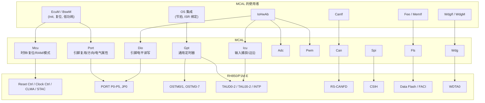
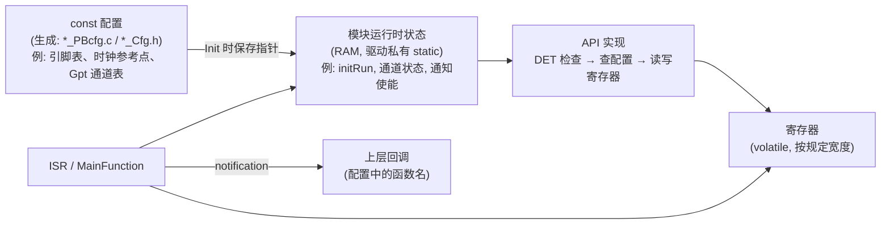
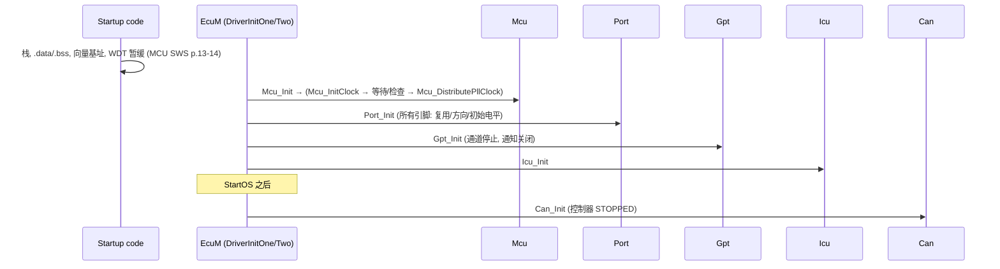

# MCAL 总览：驱动的共同骨架与 RH850/P1M-E 的资源归属

> Prerequisite: [Classic Platform 总览](../02-autosar-classic/01-classic-platform-overview.md), [ECU 启动流程](../02-autosar-classic/03-ecu-startup.md), [RH850 外设总览](../01-rh850/08-peripheral-overview.md)
> Next: [MCU 驱动](02-mcu-driver.md)
> 对应规范: SWS MCU R24-11（p.9, p.13–14, p.18, p.25 寄存器归属规则, p.34–35）；SWS CAN R22-11（p.14, p.22, p.33, p.43 `SWS_Can_00407`, p.50–53）。**本仓库没有 Port、Dio、Gpt、Icu、Adc、Pwm、Spi、Fls、Wdg 的 SWS**——这些模块的 API 名称为 R4.x 公认形态，需以真实项目所用 Release 的 SWS 与供应商 MCAL 手册确认。
> 对应源码: openAUTOSAR `boards/linuxOs/MCAL/{Mcu,Port,Dio,Gpt}`（STM32/MPC5xxx 遗留）；本项目 `examples/rh850_mcal_reference/{platform,mcal}`
> RH850 依据: HW-E p.91–131（Port）、p.254–256（同步要求）、p.257–260（地址映射与 guard）、p.418–434（Reset）、p.468–482（Clock）、p.1542–1567（OSTM）、p.1571 起（TAUD）、p.2757–2796（CLMA/ECM 保护写序列）

---

## 1. 本章目标

1. 知道 MCAL 有哪些模块、哪些在本仓库有 SWS 依据、哪些只能按 R4.x 公认形态讲解。
2. 掌握**所有 MCAL 驱动共享的骨架**：`<Mod>_Init(ConfigPtr)` → 模块状态 → API 中的 DET 检查 → 寄存器访问 → 通知（notification）回调 → ISR / MainFunction。
3. 掌握 MCAL 之间的**寄存器“产权”规则**，并能对 RH850/P1M-E 的每一个关键外设说出“归哪个驱动”。
4. 掌握 RH850 上写 MCAL 的硬件纪律：访问宽度、保护写序列（以及 P1M-E 上**没有** PROTCMD）、清中断源后的同步、有界等待。
5. 为后续 Mcu / Port / Dio / Gpt / Icu 章节建立统一的阅读框架。

---

## 2. 为什么需要 MCAL？

在 [Classic Platform 总览](../02-autosar-classic/01-classic-platform-overview.md) 中我们说过：MCAL 是唯一允许直接访问片上外设寄存器的层（MCU SWS p.9；CAN SWS p.14）。它的价值在于把“芯片差异”封装在一个**有标准 API、标准配置容器、标准错误分类**的边界之内：

- 上层（CanIf、IoHwAb、EcuM、OS 集成）只依赖 `Can_Write`、`Dio_WriteChannel`、`Mcu_PerformReset` 这样的 API；
- 换芯片时（P1M-E → U2A），理论上只换 MCAL 和它的配置；
- MCAL 由芯片厂提供并做过硬件验证——它知道“这个寄存器只能在 channel reset 模式下写”“这个 RAM 初始化要等 3794 个 pclk”这类只有芯片设计者最清楚的约束。

[Real Project Consideration] 目标工程背景（来自截图，本仓库不存在）提到的是 Renesas P1M MCAL（AR 4.2.2 API）。这只能作为“可能的真实环境”。读真实 MCAL 时，你需要同时打开三样东西：AUTOSAR SWS（定义行为）、Renesas MCAL 用户手册（定义实现与限制）、芯片硬件手册（定义寄存器）。

---

## 3. 在系统中的位置：MCAL 模块地图



注意 Port 和 Dio 指向**同一组硬件**（PORT 寄存器）、Gpt 和 Icu 可能共享 TAUD/TAUJ——这正是第 4.2 节“产权规则”要解决的问题。

### 3.1 本仓库的规范覆盖情况

| 模块 | 本仓库 SWS | 本教程章节 | 讲解依据 |
|---|---|---|---|
| Mcu | **有**（R24-11） | [02-mcu-driver.md](02-mcu-driver.md) | SWS ID + 页码 |
| Can | **有**（R22-11） | Part IV（`04-can-mcal/`） | SWS ID + 页码 |
| Port | 无 | [03-port-driver.md](03-port-driver.md) | R4.x 公认 API + HW-E；openAUTOSAR `@req PORTxxx` 注释（R3.x） |
| Dio | 无 | [04-dio-driver.md](04-dio-driver.md) | 同上 |
| Gpt | 无 | [05-gpt-driver.md](05-gpt-driver.md) | 同上 + 本项目 `Ostm.c` |
| Icu | 无 | [06-icu-driver.md](06-icu-driver.md) | 同上 + HW-E TAUD 章节 |
| Adc/Pwm/Spi/Fls/Wdg | 无 | 本 Part 不展开 | — |

---

## 4. AUTOSAR 如何定义 MCAL 的共同规则？

### 4.1 共同骨架

[AUTOSAR Standard] 以本仓库有的 MCU、CAN 两份 SWS 为证据，MCAL 驱动的共同结构是：

| 要素 | MCU 的体现 | CAN 的体现 |
|---|---|---|
| Init 带配置指针 | `Mcu_Init(const Mcu_ConfigType*)`（`SWS_Mcu_00153` p.24），PRE-COMPILE 也带指针传 NULL（`00126` p.38） | `Can_Init(const Can_ConfigType*)`（`SWS_Can_00223` p.62–63）；post-build 配置通过指针选择（`00056` p.44） |
| 未初始化调用 → DET | `MCU_E_UNINIT`（`SWS_Mcu_00125` p.35） | `CAN_E_UNINIT 0x05`（`SWS_Can_91019` p.52–53） |
| 参数检查 → DET（并对有返回值的 API 返回 E_NOT_OK） | `SWS_Mcu_00017/00019/00020/00021` p.35 | `SWS_Can_00089/00091` |
| 运行时错误（量产保留） | 无（p.18） | `CAN_E_DATALOST`（`91020` p.53） |
| 生产错误 → Dem | `MCU_E_CLOCK_FAILURE`（扩展生产错误，`00053` p.18） | 无（p.53） |
| 可选 API 由 pre-compile 开关控制 | `McuPerformResetApi`、`McuGetRamStateApi`、`McuInitClock`（p.40–41） | `CanSetBaudrateApi`（p.103） |
| `GetVersionInfo` | `Mcu_GetVersionInfo`（`00162` p.32） | `Can_GetVersionInfo`（`00224` p.63） |
| MainFunction | **无**（p.34–35） | `Can_MainFunction_*`（p.84–87） |
| ISR | 无 | 由 Can 模块实现（`SWS_Can_00033` p.33），不设置向量优先级 |
| 回调（向上） | 无 | 只调用 CanIf（`00234` p.88） |

所以读任何 MCAL 驱动，都可以按这张表找到对应的东西：**Init 在哪、状态变量在哪、DET 宏在哪、哪些 API 被开关关掉了、ISR 在哪、回调指向谁**。

### 4.2 寄存器“产权”规则

[AUTOSAR Standard] MCU SWS `SWS_Mcu_00116/00244/00245/00246/00247`（p.25）与 CAN SWS `SWS_Can_00407`（p.43）给出同样的规则：

| # | 寄存器类型 | 负责初始化的模块 |
|---|---|---|
| 1 | 只被一个硬件模块使用 | 实现该功能的驱动 |
| 2 | 影响多个硬件模块的 **I/O 寄存器** | **Port** |
| 3 | 影响多个硬件模块的**非 I/O 寄存器** | **Mcu** |
| 4 | 复位后必须立即写的一次性寄存器 | start-up code |
| 5 | 其它 | start-up code |

再加上 CAN 的两条：片上 Can 不使用其它驱动的服务（`SWS_Can_00238` p.22）；CAN 引脚由 Port 配置（`00239`）；Mcu 先于 Can 初始化（`00240`）。

### 4.3 MCU SWS 对 start-up code 的界定

[AUTOSAR Standard] MCU SWS p.13–14：start-up code 在 MCU 驱动之前执行，负责向量基址、栈、看门狗暂缓、cache、内存保护、默认时钟、SFR 写保护、一次性写寄存器、最少 RAM 初始化。规范说明这些是“指导性”的，细节由 MCU 设计决定。详见 [ECU 启动流程](../02-autosar-classic/03-ecu-startup.md) §4.1。

---

## 5. 核心数据结构：一个 MCAL 驱动内部的三类数据



| 数据 | 存放位置 | 生命周期 | 例子 |
|---|---|---|---|
| 配置 | Flash（const），MemMap 的 `CONFIG_DATA` 段 | 永久 | `Mcu_Config`、`Port_Config` |
| 运行时状态 | RAM（驱动私有 `static`），MemMap 的 `VAR_*` 段 | 上电/复位后由 Init 建立 | openAUTOSAR `Mcu_Global.initRun`（`Mcu.c:358`）、`_portState`（`Port.c:52`）、`Gpt_Global.channelMap`（`Gpt.c:226-236`） |
| 硬件状态 | 外设寄存器 | 由硬件复位决定 | RESF、OSTMnTE、PMCn |

**一个关键设计原则**：运行时状态与硬件状态可能不一致（例如别人改了寄存器、或调试器复位了外设但没复位 CPU）。好的驱动在关键路径上**以硬件状态为准**（例如本项目 `Ostm_InitPclk` 每次都读 `TE` 而不是依赖软件标志，`mcal/gpt/Ostm.c:21`）。

---

## 6. 初始化流程：MCAL 之间的顺序



每一步的“为什么”：

1. **Mcu 最先**：所有外设依赖时钟（`SWS_Can_00240`）；复位原因要在被清除前读取。
2. **Port 第二**：引脚尽早进入确定状态——复位后 P1M-E 引脚基本处于输入方向（`PM1`–`PM5` 复位值 `FFFFH`；`PM0` 复位值 `FBFFH`，即 P0_10 例外为输出），且 `PIBCn` 复位值为 0、输入缓冲关闭（HW-E p.104, p.106）；外部负载的状态在 Port_Init 之前由外部上下拉决定。Port_Init 要先写输出锁存值再切方向，避免输出毛刺（见 [03-port-driver.md](03-port-driver.md)）。
3. **Gpt/Icu**：定时器类驱动在 Init 时通常让所有通道保持停止、通知关闭，等待使用者显式启动。
4. **Can**：需要 Mcu（时钟）和 Port（引脚）；Can_Init 后控制器 STOPPED，不会收发。

---

## 7. Runtime Flow：MCAL 的三种运行方式

| 方式 | 触发 | 例子 | 上下文 |
|---|---|---|---|
| 同步 API | 上层调用 | `Dio_WriteChannel`、`Port_SetPinMode`、`Gpt_StartTimer`、`Mcu_PerformReset` | 调用者 |
| 中断 + 通知 | 硬件事件 | Gpt 通道到期 → `Gpt_Notification_<Ch>()`；Icu 边沿 → `Icu_SignalNotification_<Ch>()`；Can Rx → `CanIf_RxIndication` | ISR（Cat2） |
| MainFunction 轮询 | SchM 周期调用 | `Can_MainFunction_Read`（POLLING）；Fls 作业推进 | Task |

**同步 API 的硬件等待必须有界**。规范的态度很一致：

- `Mcu_InitClock` 启动 PLL 后**立即返回，不等待锁定**（`SWS_Mcu_00138` p.27）；
- `Can_SetControllerMode` 在 `CanTimeoutDuration` 内有限等待，超时后由 `Can_MainFunction_Mode` 继续（`SWS_Can_00398` p.39）。

本项目的 `Ostm_Stop` 同样体现了这一纪律：写 `TT=1` 后最多轮询 `poll_limit` 次 `TE`，超时返回 `OSTM_TIMEOUT`（`mcal/gpt/Ostm.c:41-51`），主机测试中用 `poll_limit=3` 验证超时路径（`tests/test_reference.c:142`）。

---

## 8. RH850 Hardware Mapping：写 MCAL 的硬件纪律

### 8.1 P1M-E 外设 → MCAL 模块的产权表

| RH850/P1M-E 资源 | 归属 MCAL | 规则编号（§4.2） | 依据 |
|---|---|---|---|
| RESF/RESFC/SWSRESA0/SWARESA0、RESC | Mcu | 3 | HW-E p.420–426 |
| STAC_*（RAM 初始化模式） | Mcu 或 start-up | 3/4 | HW-E p.427–430 |
| 时钟控制器（CKSC2/3/8、CLKD2/3） | Mcu | 3 | HW-E p.471 |
| CLMA（时钟监视） | Mcu（或安全监控模块） | 3 | HW-E p.2757–2764 |
| PMC/PFC/PFCE/PFCAE/PM/PIBC/PBDC/PU/PD/PODC… | Port | 2 | HW-E p.94, p.99–100 |
| Pn/PSRn/PNOTn/PPRn | Dio（运行时电平）；Port（初始电平） | 2 | HW-E p.95–96 |
| OSTM0/1（或其一） | Gpt **或** OS 集成（二选一，配置决定） | 1 | HW-E p.1543–1544 |
| IC0CKSEL0/1（OSTM 时钟源选择，影响 OSTM 与 TAUD/TAUJ 链） | 取决于实现；若跨模块共享应归 Mcu | 1 或 3 | HW-E p.1547–1548, p.1551 |
| TAUD/TAUJ 通道 | Gpt / Icu / Pwm（按通道分配） | 1 | HW-E p.1571–1572, p.1878 |
| 端口数字噪声滤波器（FCLA/DNFA） | Port 或使用该输入的驱动（需按实现确认） | 2 或 1 | HW-E p.158 |
| RS-CANFD | Can | 1 | HW-E p.788 |
| EIC*n*、INTBP | **OS**（不是任何 MCAL 驱动；CAN SWS p.33 “驱动不设置中断向量优先级”） | — | HW-E p.265–271 |
| WDTA0 | Wdg（启动阶段可能由 start-up 处理首次期限） | 1 / 4 | HW-E p.1522–1535, p.2884 |
| Option bytes（OPBT0/2） | 不属于运行时软件（编程器写入） | — | HW-E p.2881–2886 |

[Real Project Consideration] 表中“二选一”的资源（OSTM0/1、TAUD 通道）是集成冲突的高发区。本仓库不同文档对 OSTM0/OSTM1 的归属说法不一，这**不是硬件事实，而是配置选择**——真实项目以 OS 配置与 Gpt 配置为准，并确保“一个通道只有一个所有者”。

### 8.2 访问宽度

RH850 外设寄存器有规定的访问宽度，错误宽度的写可能被忽略或产生错误：

| 寄存器 | 宽度 | 依据 |
|---|---|---|
| RESF / RESFC / SWSRESA0 / SWARESA0 | 32 位 | HW-E p.420–425 |
| OSTMnCMP / CNT | 32 位；TO/TOE/TE/TS/TT/CTL 为 8 位 | HW-E p.1551；`01-project-and-docs-review.md` F-OSTM-2 |
| IC0CKSEL0/1 | 16 位 | `Ostm.c:24-25` 注释 “Never use a 32-bit write to this 16-bit clock register” |
| RS-CANFD TMCp / TMSTSp | **8 位** | HW-E p.878, p.880 |
| EICn | 16 位（L/H 可 8 位或 1 位访问） | HW-E p.265, p.267 |
| PMn / PMCn / PIBCn 等端口控制寄存器 | 16 位（JPORT0 的同类寄存器为 8 位） | HW-E p.101–107 |

本项目 `platform/Rh850_Mmio.h:12-19` 用一张函数指针表（`read8/read32/write8/write16/write32`）把访问宽度显式化，主机测试可以检查“每个寄存器是否用了正确的宽度和顺序”（`tests/test_reference.c` 的 OSTM 测试组）。真实 MCAL 通常用带宽度的寄存器结构体或宏。

### 8.3 写保护：P1M-E 与“典型 RH850”的差异

[RH850 Hardware] 这是本教程最需要强调的器件差异之一（`04-rh850-hardware-notes.md` §4.4）：

- **P1M-E 没有 PROTCMDn / PROTSn 寄存器**（HW-E 全文检索 `PROTCMD`、`PROTS[0-9]` 为 0 结果）。复位寄存器靠 **P-Bus Guard** 配置防误写（HW-E p.420），时钟控制器寄存器靠 **Slave Guard** 配置防误写（HW-E p.471 §12.3.1），二者都在 Section 31 Functional Safety 中描述。
- **P1M-E 端口寄存器没有 PPCMD 写保护**（检索 `PPCMD`、`PPROTS` 为 0 结果）。
- P1M-E 上**确实使用 `0xA5` 解锁序列**的只有：CLMAn（`CLMAnPCMD`，HW-E p.2757, p.2761, p.2764）、ECM（`ECMPCMD1`/`ECMmPCMD0`，p.2795）、FLMDCNT（`FLMDPCMD`/`FLMDPS`，p.2870–2871）。序列为：写 `A5H` → 写设定值 → 写设定值的按位取反 → 再写设定值 → 读状态寄存器确认（例如 `CLMAnPS.PRERR`）。**序列中若中断或其它代码访问了同一模块的其它寄存器，写入失败**（p.2795–2796）。
- 对照：RH850/P1x（非 -E）用 `PROT1PHCMD/PROT1PS` 保护 CKSC0CTL 等时钟寄存器、用 `PPCMDn/PPROTSn` 保护端口寄存器（HW-X p.257–261）。F1x、U2A 等其它系列各有自己的保护机制，**需根据实际芯片手册确认**。

因此，网上常见的“`Mcu_InitClock` 内部要走 PROTCMD 0xA5 序列”的说法，**对 R7F701381 不成立**。

### 8.4 清中断源后的同步

[RH850 Hardware] 写外设控制寄存器以清除中断请求后：store → 对该寄存器 dummy read → `SYNCP` → 再 `EI` 或访问下一个外设（HW-E p.254）。所有带 ISR 的 MCAL（Gpt、Icu、Can）都适用。

### 8.5 Guard（访问保护）

P-Bus 区由 PBG 保护，LPB 区由 IPG/PEG，Local RAM 由 PEG，Global RAM 由 GRG（HW-E p.260）；复位后外设对 PE1 以外的总线主设备默认受保护（p.188）。如果项目启用了 guard 配置（功能安全要求），MCAL 写某些寄存器可能被拒绝——这是“驱动代码看起来对、寄存器就是写不进去”的一个可能原因（`04-rh850-hardware-notes.md` §10 第 13 条）。

---

## 9. openAUTOSAR 实现：不是 RH850，也不是 Linux 仿真

openAUTOSAR 的 `boards/linuxOs/MCAL/` 名字叫 “linuxOs”，但实际是 STM32 / MPC5xxx 遗留代码（`03-openautosar-trace.md` §1.3）：

| 模块 | 文件 | 观察 |
|---|---|---|
| Mcu | `boards/linuxOs/MCAL/Mcu/src/Mcu.c` | `Mcu_Init` :345；读 STM32 `RCC->CR/CSR`；注释掉的 MPC5xxx `FMPLL.SYNSR`（:403）；`Mcu.h:32-34` 声明 AUTOSAR **2.2.2** |
| Port | `boards/linuxOs/MCAL/Port/src/Port.c` | `#include "stm32f10x.h"`（:18）；`Port_Init` :98 |
| Dio | `boards/linuxOs/MCAL/Dio/src/Dio.c` | `#include "stm32f10x_gpio.h"`（:23）；`Dio_WriteChannel` :150 |
| Gpt | `boards/linuxOs/MCAL/Gpt/src/Gpt.c` | `#include "stm32f10x.h"`（:27）；`TIM_TypeDef` 数组（:74）；`Gpt_Init` :211 |
| Icu | **不存在** | — |
| Can | `boards/linuxOs/MCAL/Can/include/Can_Cfg.h` | 只有头文件，无 `Can.c` |

它对本 Part 的价值：**API 骨架与 DET 模式**（`VALIDATE` 宏、`initRun` 标志、`@req PORTxxx` 需求追溯注释），以及一些可以拿来讨论的设计缺陷（后续章节逐个指出）。它**不能**提供任何 RH850 寄存器层面的参考。

---

## 10. 当前教学项目实现

`examples/rh850_mcal_reference/`：

| 文件 | 内容 | 对应 MCAL 概念 |
|---|---|---|
| `platform/Rh850_Mmio.{h,c}` | 带宽度的 MMIO 注入表；native 实现用 volatile 指针（`Rh850_Mmio.c:4-18`） | 寄存器访问层 |
| `mcal/gpt/Ostm.{h,c}` | OSTM0/1 底层：配置、启停、比较、读计数、周期换算 | Gpt 驱动或 OS 计数器的最底层 |
| `mcal/can/Can_BitTiming.{h,c}` | CAN FD 位时间校验与 NCFG/DCFG 编码 | Can 配置生成器中的一步 |
| `integration/Tick_Accumulator.{h,c}` | 原始计数 → 1 ms tick | OS 硬件计数器集成 |

README 明确：“还没有完整 AUTOSAR MCAL API、目标启动工程或可烧录镜像”；“Mcu/Port/Dio/Fls/Wdg 仍处于资料核查阶段”。所以本 Part 中 Mcu/Port/Dio/Icu 的代码都是 `[Conceptual]` 或 `[Educational Implementation]` 伪代码，Gpt 章节会逐行讲解 `Ostm.c`。

---

## 11. Code Walkthrough：一个“标准形状”的 MCAL API

[Educational Implementation] 下面是一个**教学用**的 MCAL API 模板，展示所有 MCAL API 的共同形状（名称 `Xxx` 为占位）：

```c
/* [Educational Implementation] MCAL API 的标准形状——不是任何真实驱动 */
#define XXX_START_SEC_CODE
#include "Xxx_MemMap.h"

Std_ReturnType Xxx_DoSomething(Xxx_ChannelType Channel, uint32 Value)
{
    Std_ReturnType ret = E_NOT_OK;

#if (XXX_DEV_ERROR_DETECT == STD_ON)
    if (Xxx_InitState != XXX_INITIALIZED) {                    /* ① 未初始化 */
        (void)Det_ReportError(XXX_MODULE_ID, 0u, XXX_SID_DOSOMETHING, XXX_E_UNINIT);
        return E_NOT_OK;
    }
    if (Channel >= XXX_NUMBER_OF_CHANNELS) {                   /* ② 参数越界 */
        (void)Det_ReportError(XXX_MODULE_ID, 0u, XXX_SID_DOSOMETHING, XXX_E_PARAM_CHANNEL);
        return E_NOT_OK;
    }
#endif

    {
        const Xxx_ChannelConfigType *cfg = &Xxx_ConfigPtr->Channels[Channel];  /* ③ 查配置 */

        SchM_Enter_Xxx_XXX_EXCLUSIVE_AREA_0();                 /* ④ 保护读-改-写 */
        if (Xxx_HwIsIdle(cfg->HwUnit)) {                       /* ⑤ 以硬件状态为准 */
            Xxx_HwWrite32(cfg->HwUnit, XXX_REG_DATA, Value);   /* ⑥ 正确宽度 */
            ret = E_OK;
        }
        SchM_Exit_Xxx_XXX_EXCLUSIVE_AREA_0();
    }
    return ret;                                                /* ⑦ 运行时失败只返回, 不报 DET */
}

#define XXX_STOP_SEC_CODE
#include "Xxx_MemMap.h"
```

逐条对应：① 未初始化检查（`*_E_UNINIT`）；② 参数检查（开发错误，量产可关）；③ 用“配置索引”查表；④ exclusive area（见 [Classic Platform 总览 §5.6](../02-autosar-classic/01-classic-platform-overview.md)）；⑤ 以硬件状态为准；⑥ 访问宽度；⑦ 硬件忙等“正常的运行时情况”不是开发错误。

---

## 12. Debug 方法

| 症状 | 第一检查点 |
|---|---|
| API 无效果 | Det 断点：`*_E_UNINIT`？`*_E_PARAM_*`？量产配置 DET 关闭时，用开发构建复现 |
| 寄存器写不进去 | 访问宽度；该寄存器的写入时机限制（模式/停止状态）；guard 配置；（若是 CLMA/ECM/FLMDCNT）0xA5 序列是否被打断 |
| 外设行为与配置不符 | 产权冲突：是否有两个模块（或一个模块 + 集成代码）写同一寄存器；用数据断点（watchpoint）找最后写入者 |
| 中断风暴 | 电平中断未清源；清源后未 dummy read + SYNCP |
| 启动卡死 | 某个同步 API 中的无界等待（PLL、模式切换、RAM 初始化） |

---

## 13. 常见问题 / 常见错误

1. **在 Can 驱动里配置 CAN 引脚**——违反 `SWS_Can_00239`，并且会与 Port 的配置互相覆盖。
2. **让 Gpt 驱动和 OS 同时使用 OSTM0**。
3. **照搬其它 RH850 系列的 PROTCMD 序列**到 P1M-E。
4. **以为 MCAL 会配置 EIC 优先级**——那是 OS 的事（CAN SWS p.33）。
5. **在 MCAL API 中写无界 `while` 等待**。
6. **用 32 位写访问 8 位/16 位寄存器**（例如 RS-CANFD 的 TMCp、OSTM 的 IC0CKSEL）。

---

## 14. 实验

1. **产权表练习**：从 HW-E 的 OSTM 章节（p.1547–1548）找到 `IC0CKSEL0/1` 的作用，讨论它为什么可能被 Gpt、Icu、OS 集成三方同时关心，并给出你的归属方案。
2. **保护写序列阅读**：在 `artifacts/pdf-text/r01uh0585ej0120.txt` 中检索 `PROTCMD`（应为 0 结果）和 `CLMA0PCMD`，阅读 p.2764 的写序列，写出伪代码，并说明为什么序列中途被 ISR 打断会失败。
3. **主机测试阅读**：阅读 `tests/test_reference.c:97-125` 的 `test_ostm_sequence_and_ownership`，说出它验证了哪些“MCAL 纪律”（访问宽度、忙拒绝、通道隔离、有界停止）。

---

## 15. 思考题

1. 为什么 AUTOSAR 让 Port 而不是各外设驱动负责“影响多个模块的 I/O 寄存器”？如果让 Can 驱动自己配 CAN 引脚，会出现什么集成问题？
2. MCU 没有 MainFunction（p.34–35），而 Can 有。什么样的硬件特性决定了一个驱动需要 MainFunction？
3. 一个驱动的运行时状态（RAM）与硬件状态（寄存器）在什么情况下会不一致？驱动应该信任哪一个？

---

## 16. 对未来真实项目的意义

拿到真实 RH850 + Renesas MCAL 项目后：

1. **列出 MCAL 交付清单**：模块、版本、AUTOSAR Release（截图提示 AR 4.2.2 API）、配置工具与生成目录。
2. **做产权核对**：用 §8.1 的表，对照真实配置确认每个外设资源只有一个所有者；特别是 OSTM、TAUD/TAUJ 通道、端口滤波器。
3. **确认芯片型号**：读 PRDNAME 或 BOM（R7F701381 = P1M-E），确认 MCAL 的芯片变体选项一致；P1x-C 的 CAN 是 MCAN，不能套用（`04-rh850-hardware-notes.md` §1.1）。
4. **找到每个 MCAL 的 DET 宏和 SID 表**，在开发构建中给 Det 加断点。
5. **核对保护机制**：P1M-E 没有 PROTCMD，但可能启用了 PBG/PEG guard；CLMA/ECM 用 0xA5 序列。
6. **找到所有 MCAL 的 ISR 与 OS 配置的绑定关系**（通道号 ↔ ISR 名 ↔ 类别 ↔ 优先级）。

---

## 17. 本章总结

- MCAL 驱动共享骨架：Init(ConfigPtr) + 运行时状态 + DET 检查 + 寄存器访问 + 通知/ISR/MainFunction。
- 寄存器产权规则（`SWS_Mcu_00116/00244–00247`、`SWS_Can_00407`）决定谁初始化哪个寄存器；EIC 属于 OS。
- RH850 纪律：访问宽度、P1M-E 无 PROTCMD/PPCMD（0xA5 只用于 CLMA/ECM/FLMDCNT）、清源后 dummy read + SYNCP、有界等待、guard。
- 本仓库只有 MCU 与 CAN 的 SWS；Port/Dio/Gpt/Icu 按 R4.x 公认形态讲解并标注。

## 18. 下一章

[02-mcu-driver.md](02-mcu-driver.md)：MCU 驱动——AUTOSAR 通用的时钟/PLL/复位/RAM/模式模型，以及它在“没有软件 PLL、没有 PROTCMD”的 P1M-E 上的真实形态。
