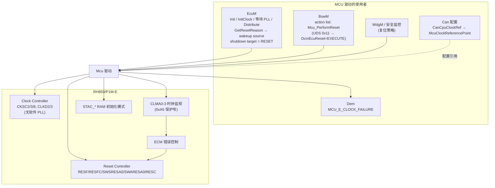
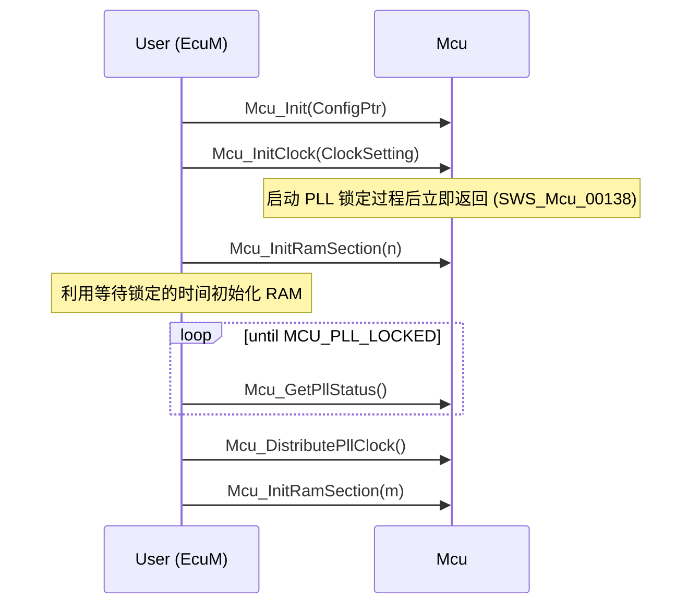
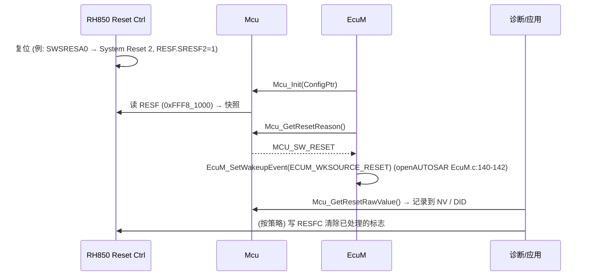
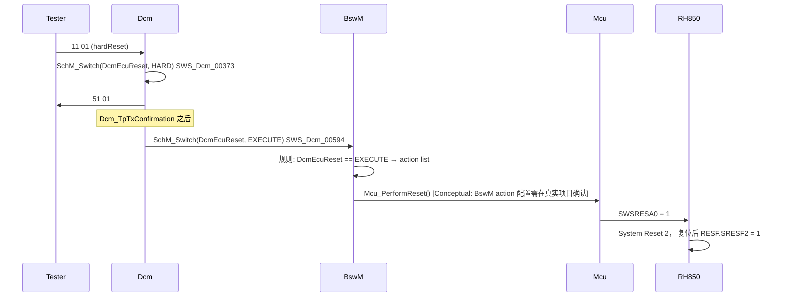

# MCU 驱动：时钟、PLL、复位、RAM、模式——AUTOSAR 通用模型与 P1M-E 的真实形态

> Prerequisite: [MCAL 总览](01-mcal-overview.md), [ECU 启动流程](../02-autosar-classic/03-ecu-startup.md), [RH850 时钟系统](../01-rh850/07-clock-system.md)
> Next: [Port 驱动](03-port-driver.md)
> 对应规范: **AUTOSAR CP SWS MCU Driver R24-11（Doc ID 31，52 页）**——p.9（功能）、p.12（限制）、p.13–14（start-up code）、p.15–19（需求与错误分类）、p.20–24（类型）、p.24–33（API）、p.34–35（依赖与 DET 检查）、p.36（示例序列）、p.38–51（配置）。CAN SWS R22-11 `SWS_Can_00240`（p.22）。DCM SWS R20-11 `SWS_Dcm_00373/00594`（p.114–115）。
> 对应源码: openAUTOSAR `boards/linuxOs/MCAL/Mcu/src/Mcu.c`、`boards/linuxOs/MCAL/Mcu/include/{Mcu.h,Mcu_Cfg.h}`、`system/EcuM/src/EcuM_Callout_Stubs.c:192-205`、`system/EcuM/src/EcuM.c:137-151`、`diagnostic/Dcm/src/Dcm_Dsp.c:1971-1981`；本项目无 Mcu 实现（README：“仍处于资料核查阶段”）。
> RH850 依据: RH850/P1M-E User's Manual Hardware R01UH0585EJ0120（HW-E）§8 Reset Controller p.418–434、§12 Clock Controller p.468–482、§31.5 CLMA p.2752–2764、ECM p.2785–2796、RAM 初始化 p.2889–2890。

---

## 1. 本章目标

MCU 驱动是 MCAL 中“最不像驱动”的驱动：它没有数据收发，没有 MainFunction，却决定了**整个 ECU 跑在什么时钟上、复位后从哪里知道发生了什么、怎样主动复位**。本章要做到：

1. 对每一个 MCU API——`Mcu_Init`、`Mcu_InitClock`、`Mcu_GetPllStatus`、`Mcu_DistributePllClock`、`Mcu_InitRamSection`、`Mcu_GetResetReason`/`Mcu_GetResetRawValue`、`Mcu_PerformReset`、`Mcu_SetMode`、`Mcu_GetRamState`——讲清楚：**谁调用、何时调用、输入输出、同步性、配置来源、运行时状态、出错时 ECU 会发生什么、对应哪块硬件**。
2. 理解 AUTOSAR 把“启动 PLL”“等待锁定”“切换时钟”拆成三个 API 的设计原因。
3. 区分 DET 开发错误（`MCU_E_*`）、运行时错误（MCU 没有）和扩展生产错误（`MCU_E_CLOCK_FAILURE`）。
4. **最重要**：知道教科书式的“PLL 启动流程”在 **RH850/P1M-E（R7F701381）上并不存在**——P1M-E 没有软件可编程 PLL 寄存器、没有 PROTCMD——并能说出 P1M-E 上 MCU 驱动真正要做的事：读 RESF、写 SWSRESA0/SWARESA0、选择 ADC 时钟、配置 CLMA 时钟监视（0xA5 保护序列）、处理 RAM 初始化。

---

## 2. 为什么需要 MCU 驱动？

回到 [MCAL 总览 §4.2](01-mcal-overview.md) 的产权规则：**影响多个硬件模块的非 I/O 寄存器归 Mcu**（`SWS_Mcu_00245/00246`，p.25）。时钟、复位、低功耗模式、RAM 初始化都是这样的“全局”资源——没有哪个外设驱动有资格独占它们。

MCU SWS p.9 列出的功能：

1. 时钟（PLL、预分频、时钟分配）初始化；
2. RAM 区初始化；
3. µC 低功耗模式激活；
4. µC 复位；
5. 读取复位原因。

对应的关键需求（p.16–17）：`SWS_Mcu_00248`（提供使能并设置 MCU 时钟的服务，所有外设时钟通过 `McuClockReferencePoint` 发布给其它 BSW）、`SWS_Mcu_00055`（软件触发硬件复位，“只有授权用户才应调用”）、`SWS_Mcu_00052`（读取上次复位原因）、`SWS_Mcu_00164/00165`（低功耗模式，数量由芯片决定）。

规范也明确了**不归 MCU 驱动管**的东西（p.12）：低功耗模式的标准化程度有限；**ECU/µC 电源的开关不是 MCU 驱动的职责**，由上层（EcuM 等）负责。

---

## 3. 在系统中的位置



依赖关系（p.34–35）：必需接口只有 `Dem_SetEventStatus`（`SWS_Mcu_00166`，用于时钟失效扩展生产错误）；可选 `Det_ReportError`（`SWS_Mcu_00163`）。**无回调、无调度函数（无 MainFunction）、无 Service Interface**。

CAN SWS 对 MCU 的依赖：`SWS_Can_00240`（p.22）“The Mcu module shall configure register settings that are ‘shared’ with other modules”，实现提示“The Mcu module shall be initialized before initializing the Can module”。

---

## 4. AUTOSAR 如何定义？

### 4.1 API 一览（R24-11，均在 `Mcu.h`）

[AUTOSAR API]

| API | 签名 | SID | Sync | Reentrancy | 定义 |
|---|---|---|---|---|---|
| `Mcu_Init` | `void Mcu_Init(const Mcu_ConfigType* ConfigPtr)` | 0x00 | Sync | Non | `SWS_Mcu_00153` p.24 |
| `Mcu_InitRamSection` | `Std_ReturnType Mcu_InitRamSection(Mcu_RamSectionType RamSection)` | 0x01 | Sync | Non | `SWS_Mcu_00154` p.26 |
| `Mcu_InitClock` | `Std_ReturnType Mcu_InitClock(Mcu_ClockType ClockSetting)` | 0x02 | Sync | Non | `SWS_Mcu_00155` p.26–27 |
| `Mcu_DistributePllClock` | `Std_ReturnType Mcu_DistributePllClock(void)` | 0x03 | Sync | Non | `SWS_Mcu_00156` p.27–28 |
| `Mcu_GetPllStatus` | `Mcu_PllStatusType Mcu_GetPllStatus(void)` | 0x04 | Sync | **Reentrant** | `SWS_Mcu_00157` p.28–29 |
| `Mcu_GetResetReason` | `Mcu_ResetType Mcu_GetResetReason(void)` | 0x05 | Sync | Reentrant | `SWS_Mcu_00158` p.29 |
| `Mcu_GetResetRawValue` | `Mcu_RawResetType Mcu_GetResetRawValue(void)` | 0x06 | Sync | Reentrant | `SWS_Mcu_00159` p.30 |
| `Mcu_PerformReset` | `void Mcu_PerformReset(void)` | 0x07 | Sync | Non | `SWS_Mcu_00160` p.31 |
| `Mcu_SetMode` | `void Mcu_SetMode(Mcu_ModeType McuMode)` | 0x08 | Sync | **Reentrant** | `SWS_Mcu_00161` p.31–32 |
| `Mcu_GetVersionInfo` | `void Mcu_GetVersionInfo(Std_VersionInfoType* versioninfo)` | 0x09 | Sync | Reentrant | `SWS_Mcu_00162` p.32 |
| `Mcu_GetRamState` | `Mcu_RamStateType Mcu_GetRamState(void)` | 0x0a | Sync | Reentrant | `SWS_Mcu_00207` p.33 |

**所有 API 都是同步的，且 MCU 没有 MainFunction**。那 PLL 锁定这种“需要时间”的事情怎么办？答案是：**把“开始”和“检查”拆成两个同步 API**，由调用者（EcuM）负责轮询（§6.3）。

### 4.2 类型（p.20–24）

| 类型 | 取值 | 依据 |
|---|---|---|
| `Mcu_ConfigType` | 硬件相关的配置结构体 | `SWS_Mcu_00249` |
| `Mcu_PllStatusType` | `MCU_PLL_LOCKED 0x00` / `MCU_PLL_UNLOCKED 0x01` / `MCU_PLL_STATUS_UNDEFINED 0x02` | `00250/00231` |
| `Mcu_ClockType` / `Mcu_ModeType` / `Mcu_RamSectionType` | 0..N-1 的**配置索引**（uint8/16/32 按平台选） | `00233/00238/00240` |
| `Mcu_ResetType` | `MCU_POWER_ON_RESET 0x00` / `MCU_WATCHDOG_RESET 0x01` / `MCU_SW_RESET 0x02` / `MCU_RESET_UNDEFINED 0x03`；至少须提供 POWER_ON 与 UNDEFINED，可按芯片扩展 | `00252/00134` p.22 |
| `Mcu_RawResetType` | 复位状态寄存器原值 | `00253` |
| `Mcu_RamStateType` | `MCU_RAMSTATE_INVALID 0x00` / `VALID 0x01` | `00256` |

注意 `Mcu_ClockType` 是**索引**，不是频率——`Mcu_InitClock(McuConf_McuClockSettingConfig_X)` 选择的是“第几套时钟配置”。

### 4.3 错误分类（p.18–19, p.35）

| 类别 | 错误 | 何时 |
|---|---|---|
| Development（DET，`SWS_Mcu_00012` p.18） | `MCU_E_PARAM_CONFIG 0x0A`、`MCU_E_PARAM_CLOCK 0x0B`、`MCU_E_PARAM_MODE 0x0C`、`MCU_E_PARAM_RAMSECTION 0x0D`、`MCU_E_PLL_NOT_LOCKED 0x0E`、`MCU_E_UNINIT 0x0F`、`MCU_E_PARAM_POINTER 0x10`、`MCU_E_INIT_FAILED 0x11` | `McuDevErrorDetect = TRUE` 时 |
| Runtime | **无** | — |
| Production | **无** | — |
| Extended Production | `MCU_E_CLOCK_FAILURE`（值由 Dem 分配） | `SWS_Mcu_00053` p.18；配置 `McuDemEventParameterRefs` 时 |

DET 检查规则（p.35）：`SWS_Mcu_00017`（DET 使能时检查参数，并对有返回值的 API 返回 `E_NOT_OK`）、`00019`（ClockSetting 越界 → `PARAM_CLOCK`）、`00020`（McuMode 越界 → `PARAM_MODE`）、`00021`（RamSection 越界 → `PARAM_RAMSECTION`）、`00122`（PLL 未锁定时调用 DistributePllClock → `PLL_NOT_LOCKED`）、`00125`（除 GetVersionInfo 外，Init 前调用任何 API → `MCU_E_UNINIT`）。

`MCU_E_CLOCK_FAILURE` 的判据见 `SWS_Mcu_00257/00258`（p.19）；规范还说明：如果时钟失效由 trap 等其它硬件机制检测，应关闭该通知、在 MCU 驱动外处理。`SWS_Mcu_00226`（p.17）：生产错误不得作为函数返回值。

> **开发错误 vs 运行时错误，在 MCU 上的含义**：MCU 的所有 DET 错误都是“调用者写错了”——传了不存在的时钟配置索引、没 Init 就调用、PLL 没锁就切换。这些在开发阶段就该被消灭，所以量产可以关闭 DET。而“晶振坏了、时钟频率漂了”这种**硬件**故障，不是 DET，而是扩展生产错误 `MCU_E_CLOCK_FAILURE`，进入 Dem 成为 DTC。

### 4.4 配置容器（p.38–51）

```text
Mcu (ECUC_Mcu_00189)                              VARIANT-PRE-COMPILE / VARIANT-POST-BUILD (p.38)
├── McuGeneralConfiguration (00118) [1]
│     McuDevErrorDetect (00166)       pre-compile (p.40)
│     McuGetRamStateApi (00181)       pre-compile (p.40)
│     McuInitClock (00182)            pre-compile (p.40)   FALSE → MCU 不初始化时钟
│     McuNoPll (00180)                pre-compile (p.41)   TRUE  → 无 PLL / PLL 上电自动
│     McuPerformResetApi (00167)      pre-compile (p.41)
│     McuVersionInfoApi (00168)       pre-compile (p.41)
│     McuEcucPartitionRef (00191) [0..*]
├── McuModuleConfiguration (00119) [1]
│     McuClockSrcFailureNotification (00170)   pre-compile 或 post-build (p.44)
│     McuNumberOfMcuModes (00171)              (p.45)
│     McuRamSectors (00172)                    (p.45)
│     McuResetSetting (00173) [0..1]           pre-compile (p.45)
│     ├── McuClockSettingConfig (00124) [1..*]
│     │     McuClockSettingId (00183)  pre-compile (p.43) ← Mcu_InitClock 的参数
│     │     └── McuClockReferencePoint (00174) [1..*]
│     │           McuClockReferencePointFrequency (00175) Hz  (p.50) ← 被 CanCpuClockRef 等引用
│     ├── McuDemEventParameterRefs (00187) [0..1] → MCU_E_CLOCK_FAILURE (00188)
│     ├── McuModeSettingConf (00123) [1..*]   McuMode (00176) ← Mcu_SetMode 的参数
│     └── McuRamSectorSettingConf (00120) [0..*]
│           McuRamDefaultValue (00177) / McuRamSectionBaseAddress (00178)
│           McuRamSectionSize (00179) / McuRamSectionWriteSize (00190)   (p.48–49)
└── McuPublishedInformation (00184)
      └── McuResetReasonConf (00185) [1..*]  McuResetReason (00186) ← 被 EcuM 的 EcuMResetReason 引用 (p.51)
```

两个与 P1M-E 直接相关的开关：

- **`McuInitClock = FALSE`**（`ECUC_Mcu_00182` p.40；`SWS_Mcu_00210` p.27）：用于“有 bootloader 且时钟寄存器只能写一次”的场景，MCU 驱动不做时钟初始化。
- **`McuNoPll = TRUE`**（`ECUC_Mcu_00180` p.41）：硬件无 PLL **或上电自动启用 PLL**；此时 `Mcu_DistributePllClock` 被禁用（`SWS_Mcu_00205` p.28），`Mcu_GetPllStatus` 恒返回 `MCU_PLL_STATUS_UNDEFINED`（`SWS_Mcu_00206` p.29）。

P1M-E 的 PLL 存在（160 MHz 由 PLL 输出），但**没有任何软件可配置的 PLL 寄存器**（§8.1）——这正是 “上电自动启用 PLL” 的情形。因此 P1M-E 上合理的配置通常是 `McuNoPll = TRUE`（最终以 Renesas MCAL 文档为准）。

---

## 5. 核心数据结构

### 5.1 运行时状态（驱动私有）

[Conceptual] 一个 MCU 驱动通常维护：

| 状态 | 用途 |
|---|---|
| `Mcu_ConfigPtr` | Init 时保存的配置指针（`SWS_Mcu_00026`：使配置“在模块内可见”） |
| `Mcu_InitState` | `MCU_E_UNINIT` 检查 |
| `Mcu_ResetRawValue`（快照） | Init 时读取并保存的 RESF 原值，保证“多次调用返回值相同”（`SWS_Mcu_00005` 相关说明 p.29） |
| 当前时钟配置索引 | 供诊断/调试 |

openAUTOSAR 的对应物是 `Mcu_Global`（`boards/linuxOs/MCAL/Mcu/src/Mcu.c:69-91` 的 `Mcu_GlobalType`），Init 中写 `.config` 与 `.initRun`（:357-358），InitClock 中写 `.clockSetting`（:388）。

### 5.2 配置结构体（以 openAUTOSAR 为例看“形状”）

`boards/linuxOs/MCAL/Mcu/include/Mcu.h:100-169`：

- `Mcu_ClockSettingConfigType`：`McuClockReferencePointFrequency` + `Pll1..Pll4` 等 PLL 参数字段（:100-113）——**字段本身是芯片相关的**；
- `Mcu_RamSectorSettingConfigType`：`McuRamDefaultValue`、`McuRamSectionBaseAddress`、`McuRamSectionSize`（:115-125）——注意它**没有** `McuRamSectionWriteSize`，因为该参数是 4.3.1 才引入的（MCU SWS p.2）；
- `Mcu_ConfigType`：`McuClockSrcFailureNotification`、`McuRamSectors`、`McuClockSettings`、`McuDefaultClockSettings`、`McuClockSettingConfig` 指针、`McuRamSectorSettingConfig` 指针（:127-169）；`McuNumberOfMcuModes`、`McuResetSetting`、`McuModeSettingConfig` 被注释掉（“Not supported”）。

---

## 6. 初始化流程：逐个 API 深入

### 6.0 规范给出的示例序列（p.36）

[AUTOSAR Standard] MCU SWS p.36 给出的示例（**规范说明顺序仅为示例**）：



逐个 transition：

1. **`Mcu_Init`**：装载配置。之后其它 API 才合法（否则 `MCU_E_UNINIT`）。
2. **`Mcu_InitClock`**：配置振荡器/PLL 参数，**启动锁定过程后立即返回**——不阻塞调用者。
3. **`Mcu_InitRamSection(n)`**：在 PLL 锁定期间（CPU 还在慢时钟上）做有用的工作。这是“拆成多个 API”的直接收益。
4. **轮询 `Mcu_GetPllStatus`**：由**调用者**决定等待策略（超时、喂狗、降级）。
5. **`Mcu_DistributePllClock`**：把 PLL 输出切为系统时钟。
6. **`Mcu_InitRamSection(m)`**：快时钟下初始化剩余 RAM。

### 6.1 `Mcu_Init`

| 维度 | 内容 |
|---|---|
| 谁调用 | EcuM，在 `EcuM_AL_DriverInitOne` 中（openAUTOSAR `EcuM_Callout_Stubs.c:193`） |
| 何时 | OS 启动之前，MCAL 中最先（`SWS_Can_00240`） |
| 输入 | `ConfigPtr`；PRE-COMPILE 变体传 NULL（`SWS_Mcu_00126` p.38） |
| 规范要求 | `SWS_Mcu_00026`（p.25）：使掉电、时钟、RAM 配置在模块内“可见”。**Init 本身不一定改时钟**——PLL 启动在 InitClock |
| 寄存器初始化规则 | `SWS_Mcu_00116/00244/00245/00246/00247`（p.25） |
| 错误 | `MCU_E_PARAM_CONFIG`/`MCU_E_PARAM_POINTER`/`MCU_E_INIT_FAILED`（DET） |
| 出错时 ECU 会怎样 | 配置未装载 → 后续所有 MCU API 报 `MCU_E_UNINIT` 并返回 `E_NOT_OK`/`MCU_RESET_UNDEFINED`/`MCU_PLL_STATUS_UNDEFINED`；EcuM 无法得到复位原因 |

[RH850 Hardware] 在 P1M-E 上，`Mcu_Init` 中合理的工作（具体由 Renesas MCAL 实现决定，以下为 [Conceptual] 分析）：

- **立即快照 RESF**（`0xFFF8_1000`，32 位只读，HW-E p.420–421），保存到驱动状态。这样即使后续有人清除 RESF，`Mcu_GetResetReason` 仍能返回一致的值。
- 若配置要求，设置 `RESC.RESC0`（ECM 复位归类为 System Reset 2 还是 Application Reset 1，HW-E p.426；复位值为 1 = Application Reset 1，p.418）。
- 若配置了 RAM 初始化模式，设置 `STAC_*`（Local RAM `0xFFF8_1520`、Global RAM `0xFFF8_1420` 等，HW-E p.420, p.427–430）——它们影响的是**下一次**复位时硬件是否清零 RAM。
- **不应**开中断。openAUTOSAR 的 `Mcu_Init` 调用了 `Irq_Enable()`（`Mcu.c:355`），这是反面教材：OS 还没启动，中断应保持关闭（RH850 复位后 `PSW.ID=1`，HW-E p.197）。

### 6.2 `Mcu_InitClock`

| 维度 | 内容 |
|---|---|
| 谁调用 | EcuM（`EcuM_Callout_Stubs.c:197`，参数 `McuDefaultClockSettings`） |
| 何时 | `Mcu_Init` 之后（`SWS_Mcu_00139` p.27），OS 之前 |
| 输入 | `ClockSetting` = `McuClockSettingId` 索引（`ECUC_Mcu_00183` p.43） |
| 输出 | `E_OK` / `E_NOT_OK` |
| 规范要求 | `00137`（p.27）：初始化 PLL 和其它 MCU 相关时钟选项；**`00138`：启动 PLL 锁定过程后立即返回，不等待锁定**；`00210`：受 `McuInitClock` 开关控制 |
| DET | `MCU_E_UNINIT`；`MCU_E_PARAM_CLOCK`（越界，`00019`） |
| 出错时 ECU 会怎样 | 时钟停留在复位默认值 → 所有基于 `McuClockReferencePoint` 计算的外设参数（CAN 位时间、Gpt 周期、UART 波特率）都错 |

#### 6.2.1 通用 PLL 衍生型号上的流程（[Conceptual]）

在**有软件可编程 PLL 的 RH850 衍生型号**（例如 F1x、U2A 系列，以及 RH850/P1x 非 -E 版本使用 PROT1PHCMD 保护的时钟选择寄存器——HW-X p.257–261）上，`Mcu_InitClock` 的教学级伪代码如下。**下面的寄存器名、位、解锁序列均为概念示意，需根据实际芯片手册确认，绝不能用于 P1M-E**：

```c
/* [Conceptual] 典型“有软件 PLL”的 RH850 衍生型号——不适用于 P1M-E (R7F701381)
 * 寄存器名称/位域/保护序列需根据实际芯片手册确认 */
Std_ReturnType Mcu_InitClock(Mcu_ClockType ClockSetting)
{
#if (MCU_DEV_ERROR_DETECT == STD_ON)
    if (Mcu_InitState != MCU_INITIALIZED) {
        (void)Det_ReportError(MCU_MODULE_ID, 0u, MCU_SID_INITCLOCK, MCU_E_UNINIT);
        return E_NOT_OK;
    }
    if (ClockSetting >= Mcu_ConfigPtr->NumClockSettings) {          /* SWS_Mcu_00019 */
        (void)Det_ReportError(MCU_MODULE_ID, 0u, MCU_SID_INITCLOCK, MCU_E_PARAM_CLOCK);
        return E_NOT_OK;
    }
#endif
    const Mcu_ClockCfgType *c = &Mcu_ConfigPtr->ClockSettings[ClockSetting];

    /* 1. 解锁受保护寄存器:   写保护命令寄存器 → 写目标值 → 写反码 → 写目标值 → 查保护状态 */
    /* 2. 使能主振荡器:       写 MOSC 使能位, 有界等待 MOSC 稳定标志 (超时 → return E_NOT_OK) */
    /* 3. 配置 PLL:           写倍频/分频参数, 写 PLL 使能位 (同样需要保护序列) */
    /* 4. 不等待 PLL 锁定:    SWS_Mcu_00138 —— 立即返回, 锁定由 Mcu_GetPllStatus 查询 */
    /* 5. 配置外设分频器:     各时钟域的分频选择 (只能在源时钟稳定后切换的那些, 留给 Distribute) */
    (void)c;
    return E_OK;
}
```

每一步“最终对应怎样的寄存器操作”：

| 步骤 | 典型寄存器操作（概念） | 为什么 |
|---|---|---|
| 解锁 | 向保护命令寄存器写固定值（RH850 家族常见 `0xA5`）→ 目标寄存器写值 → 写反码 → 再写值 → 读保护状态寄存器确认无错误 | 时钟寄存器写错会让芯片失去时钟，必须防误写 |
| 主振荡器 | 使能 → 轮询“稳定”标志 | PLL 的参考时钟必须先稳定 |
| PLL | 设置倍频 → 使能 | PLL 需要锁定时间（微秒到毫秒级） |
| 返回 | 不等待 | 让调用者并行做别的事（RAM 初始化），并自己决定超时策略 |

#### 6.2.2 P1M-E 的真实情况

[RH850 Hardware] RH850/P1M-E（HW-E §12，p.468–482）：

- 时钟控制器由 Main OSC、HS IntOSC、PLL、分频器和选择器组成（p.468）；CLK_CPU = 160 MHz，“Clock source: PLL output”；CLK_HSB = 80 MHz；CLK_LSB = 40 MHz；CLK_IOSC = 8 MHz；CLK_MOSC = 16 MHz（Table 12.2，p.469）。**Main OSC 只支持 16 MHz**（DS-E p.2）。
- **寄存器表（Table 12.4，p.471）只有**：`CLKD2DIV/CLKD2STAT`、`CLKD3DIV/CLKD3STAT`（外部时钟输出分频）、`CKSC2C/CKSC2S`、`CKSC3C/CKSC3S`（EXTCLK0O/1O 源选择）、`CKSC8C/CKSC8S`（ADC 时钟）。
- 全文检索 `PLLE`、`PLLS`、`MOSCE`、`CKSC_CPUCLK` **没有结果**（`04-rh850-hardware-notes.md` §4.1）。**软件没有可配置的 PLL 使能、PLL 倍频或 CPU 时钟选择寄存器**。启动时 PLL 由谁、在何时锁定，手册没有给出软件步骤——需根据实际芯片手册/启动代码确认。
- 写保护：时钟控制器寄存器“can be protected … by configuration of the **Slave Guards**”（§12.3.1，p.471）。**P1M-E 没有 PROTCMDn/PROTSn**（全文检索 0 结果）。

所以在 P1M-E 上，`Mcu_InitClock` 能做的“时钟设置”只剩：

| 可配置项 | 寄存器 | 取值 | 依据 |
|---|---|---|---|
| ADC 时钟 | `CKSC8C.CKSCID8[1:0]`（`0xFFF8_9110`，32 位） | `01B` = CLK_LSB 40 MHz（默认）；`10B` = CLK_LSB/2 20 MHz；`00B/11B` 禁止 | HW-E p.480 |
| ADC 时钟状态 | `CKSC8S.CLKSELID8`、`CLKACT8`（`0xFFF8_9114`） | 读回确认 | HW-E p.481 |
| 外部时钟输出 | `CKSC2C/CKSC3C` 选源（3=MainOSC、4=LSB、5=CPU、6=IOSC），`CLKD2DIV/CLKD3DIV` 分频 1–1023 | 切源前 DIV=0 且 STAT=`0x2`；改分频前等 SYNC=1；输出 < 20 MHz | HW-E p.469, p.472, p.476, p.482 |

外加一个与“时钟”紧密相关、但**是否放在 Mcu 驱动里取决于供应商实现**的功能：**时钟监视 CLMA**（见 §6.2.3）。

[Educational Implementation] 一个 P1M-E 版本的 `Mcu_InitClock` 教学实现：

```c
/* [Educational Implementation] P1M-E 版 Mcu_InitClock 的教学示意——不是 Renesas MCAL 代码
 * 前提: McuNoPll = TRUE (CPU/HSB/LSB 由硬件固定, HW-E p.469-471) */
#define CKSC8C_ADDR   0xFFF89110uL      /* HW-E p.471, p.480 */
#define CKSC8S_ADDR   0xFFF89114uL      /* HW-E p.471, p.481 */

Std_ReturnType Mcu_InitClock(Mcu_ClockType ClockSetting)
{
    /* DET 检查同 §6.2.1 (MCU_E_UNINIT / MCU_E_PARAM_CLOCK) */
    const Mcu_ClockCfgType *c = &Mcu_ConfigPtr->ClockSettings[ClockSetting];
    uint32 id = c->AdcClockId;                     /* 01B 或 10B, 由生成器校验 */

    /* 手册 CAUTION: A/D 转换器使用中不得改时钟选择 (p.480) —— 启动阶段 Adc 尚未初始化 */
    MMIO_WRITE32(CKSC8C_ADDR, (id & 0x3u) << 1);   /* 保留位写复位值 0 */

    for (uint32 n = 0u; n < MCU_CKSC_POLL_LIMIT; n++) {     /* 有界等待 */
        uint32 s = MMIO_READ32(CKSC8S_ADDR);
        if ((((s >> 1) & 0x3u) == id) && ((s & 0x1u) != 0u)) {  /* CLKSELID8 == id 且 CLKACT8 */
            return E_OK;
        }
    }
    return E_NOT_OK;   /* 返回给 EcuM; MCU 规范中这不是 DET 错误 */
}
```

> 为什么“有界等待”在这里可以接受？`SWS_Mcu_00138` 只要求“不等待 **PLL 锁定**”；ADC 时钟切换是一个很短的同步过程，有界轮询并以 `E_NOT_OK` 报告失败是合理的折中。真实 MCAL 是否这样做需看 Renesas 实现。

#### 6.2.3 CLMA：时钟“失效检测”的硬件，与 `MCU_E_CLOCK_FAILURE`

[RH850 Hardware] P1M-E 有 4 个时钟监视器 CLMA0–3（HW-E §31.5，Table 31.181 p.2752），复位后**全部禁用**，检测到异常时向 **ECM** 报告：

| 监视器 | 被监视时钟 | 采样时钟 | ECM 错误因子 |
|---|---|---|---|
| CLMA0 | Main OSC | CLK_IOSC/2（4 MHz） | 上限 #8 / 下限 #9 |
| CLMA1 | CLK_LSB/2（20 MHz） | Main OSC/8 | #12 / #13 |
| CLMA2 | WDTA 计数时钟（由 OPWDMDS 选择 8 MHz 或 250 kHz） | Main OSC/256 | #10 / #11 |
| CLMA3 | CLK_CPU（160 MHz） | Main OSC/4 | #14 / #15 |

工作原理：在 16 个采样时钟周期内统计被监视时钟的上升沿数，与 `CLMAnCMPL`/`CLMAnCMPH`（12 位阈值）比较（p.2754）。寄存器：`CLMAnCTL0`（8 位，`CLMAnCLME` 使能）、`CLMAnCMPL`、`CLMAnCMPH`、`CLMAnPCMD`、`CLMAnPS`；基址 CLMA0 `FFF8_3100`、CLMA1 `FFF8_3200`、CLMA2 `FFF8_3300`、CLMA3 `FFF8_3400`（Table 31.183/31.184，p.2757）。

**`CLMAnCTL0` 是 P1M-E 上少数真正需要 0xA5 保护序列的寄存器**（p.2757, p.2759, p.2764）：

```c
/* [Educational Implementation] CLMAn 使能的保护写序列 (HW-E p.2764 的步骤)
 * 序列执行期间, 不得有中断或其它代码访问同一模块的其它寄存器 (p.2795-2796 对同类机制的说明) */
static Std_ReturnType Mcu_ClmaEnable(uint32 base)       /* base = 0xFFF83100 等 */
{
    const uint8 val = 0x01u;                             /* CLMAnCLME = 1 */
    MMIO_WRITE8(base + 0x10u, 0xA5u);                    /* CLMAnPCMD  ← A5H        */
    MMIO_WRITE8(base + 0x00u, val);                      /* CLMAnCTL0  ← 值         */
    MMIO_WRITE8(base + 0x00u, (uint8)~val);              /* CLMAnCTL0  ← 值的反码   */
    MMIO_WRITE8(base + 0x00u, val);                      /* CLMAnCTL0  ← 值         */
    return ((MMIO_READ8(base + 0x14u) & 0x01u) == 0u)    /* CLMAnPS.PRERR == 0 ?    */
           ? E_OK : E_NOT_OK;
}
/* 阈值 CLMAnCMPL/CMPH 需在使能前按“被监视频率 / 采样频率 × 16”计算并留余量 */
```

**与 AUTOSAR 的关系**：CLMA 检测到异常时**直接通知 ECM 硬件**，ECM 可以配置为产生中断（FENMI/EI）或复位（`04-rh850-hardware-notes.md` §10 第 15 条）。这正是 MCU SWS 所说的“时钟失效由 trap 等其它硬件机制检测”的情形——规范建议此时**关闭 MCU 的 `McuClockSrcFailureNotification`、在 MCU 驱动外处理**（p.19 相关说明）。在 P1M-E 项目中，`MCU_E_CLOCK_FAILURE` 是否由 MCU 驱动上报、还是由 ECM 处理链（安全监控模块）处理，是一个**需在真实项目确认的架构决策**。

### 6.3 `Mcu_GetPllStatus`

| 维度 | 内容 |
|---|---|
| 谁调用 | EcuM（启动时轮询）；任何需要确认时钟状态的模块 |
| 何时 | `Mcu_InitClock` 之后 |
| 同步性 | Sync，**Reentrant** |
| 规范要求 | `00008/00132`（p.29）：返回锁定状态；**`00206`：Init 前或 `McuNoPll=TRUE` 时返回 `MCU_PLL_STATUS_UNDEFINED`** |
| 出错时 ECU 会怎样 | 调用者若只判断 `== MCU_PLL_LOCKED`，在 UNDEFINED 情况下会永远等待 |

**P1M-E 的陷阱**：openAUTOSAR 的 EcuM 写的是：

```c
/* [openAUTOSAR] system/EcuM/src/EcuM_Callout_Stubs.c:197-204 */
(void) Mcu_InitClock(ConfigPtr->McuConfig->McuDefaultClockSettings);
// Wait for PLL to sync.
while (Mcu_GetPllStatus() != MCU_PLL_LOCKED) {
    ;
}
Mcu_DistributePllClock();
```

在 P1M-E 上，若 `McuNoPll = TRUE`，`Mcu_GetPllStatus` 按 `SWS_Mcu_00206` **恒返回 `MCU_PLL_STATUS_UNDEFINED`**，这个循环**永远不会退出**；若 WDTA0 由 option byte 设置为复位后自动运行（`OPBT0.OPWDRUN`，HW-E p.2884），表现为**周期性无限复位**。正确的 EcuM 集成写法：

```c
/* [Educational Implementation] 兼容 McuNoPll 的 EcuM 时钟序列 */
if (Mcu_InitClock(McuConf_McuClockSettingConfig_Default) == E_OK) {
#if (MCU_NO_PLL == STD_OFF)
    uint32 guard = ECUM_PLL_LOCK_POLL_LIMIT;
    Mcu_PllStatusType st;
    do {
        st = Mcu_GetPllStatus();
        Wdg_TriggerIfNeeded();                    /* 若看门狗已运行 */
    } while ((st == MCU_PLL_UNLOCKED) && (--guard > 0u));
    if (st == MCU_PLL_LOCKED) {
        (void)Mcu_DistributePllClock();
    } else {
        EcuM_ErrorHook_ClockFailure();            /* 降级策略: 由项目定义 */
    }
#endif
}
```

### 6.4 `Mcu_DistributePllClock`

| 维度 | 内容 |
|---|---|
| 谁调用 | EcuM（`EcuM_Callout_Stubs.c:204`） |
| 何时 | `Mcu_GetPllStatus() == MCU_PLL_LOCKED` 之后 |
| 规范要求 | `00140/00141`（p.28）：把 PLL 时钟切入时钟分配，并移除当前源（如内部振荡器）；`00056`：硬件已自动切换则不动硬件；**`00142`：PLL 未锁定时立即返回 `E_NOT_OK`**；`00205`：`McuNoPll=TRUE` 时 API 禁用 |
| DET | `MCU_E_PLL_NOT_LOCKED`（`00122`，p.35）、`MCU_E_UNINIT` |
| 出错时 ECU 会怎样 | 返回 `E_NOT_OK`，系统继续在原（较慢/较不精确的）时钟上运行——**这正是规范把“锁定”和“切换”拆开的原因：未锁定时系统仍运行在安全时钟上** |

签名演变：4.1.1 改变了 `Mcu_DistributePllClock` 的签名（MCU SWS p.2–3 Change History；旧签名 PDF 未给出）。openAUTOSAR（声明 AUTOSAR 2.2.2，`Mcu.h:32-34`）中它是 `void Mcu_DistributePllClock(void)`（`Mcu.h:179`、`Mcu.c:400`），函数体只有 DET 检查，注释为 “NOT IMPLEMENTED due to pointless function on this hardware”（:405），PLL 锁定检查被注释掉（`FMPLL.SYNSR` 是 MPC5xxx 的寄存器，:403）。

**P1M-E**：`McuNoPll = TRUE` 时该 API 被禁用（`SWS_Mcu_00205`），集成代码不应调用。

### 6.5 `Mcu_InitRamSection`

| 维度 | 内容 |
|---|---|
| 谁调用 | EcuM 或启动集成代码 |
| 何时 | `Mcu_Init` 之后（`SWS_Mcu_00136` p.26） |
| 输入 | `RamSection` 索引 → `McuRamSectorSettingConf` |
| 规范要求 | `00011`（p.26）：从 `BaseAddress` 到 `BaseAddress+Size-1` 用 `DefaultValue` 填充，每次写 `WriteSize` 字节 |
| DET | `MCU_E_PARAM_RAMSECTION`（`00021`）、`MCU_E_UNINIT` |

`McuRamSectionWriteSize` 是 4.3.1 引入的（p.2）——它是为 **ECC RAM** 设计的：ECC 按字（32/64 位）计算，如果用 8 位写去初始化一块从未写过的 ECC RAM，硬件需要先读出旧字（ECC 可能是错的）再合并，可能触发 ECC 错误。

[RH850 Hardware] P1M-E 的情况：

- 除 I-Cache RAM 和 ERAM 外，所有 RAM 都带 ECC（HW-E p.2889–2890）；
- **LRAM、GRAM、DTS RAM、CSIH RAM 在复位时由硬件清零并写入正确 ECC**（p.2890），通常不需要软件逐字清零；
- 但硬件清零可以通过 `STAC_*` 关闭：Local RAM 在 Pin Reset、System Reset 2、Application Reset 1 下可关闭；GRAM/DTS/CSIH RAM 只在 Application Reset 1 下可关闭（HW-E p.434）；
- 从 RAM 执行代码时要把代码末尾之后 48 字节也初始化，否则预取可能触发 ECC 错误（p.256）。

所以 P1M-E 上 `Mcu_InitRamSection` 的典型用途是：**在关闭了硬件清零的软件复位之后，选择性地初始化“非保留”区域**（保留区用于跨复位传递信息，如复位前的诊断上下文）。永远不要用它初始化**当前栈所在的区域**。

### 6.6 `Mcu_GetResetReason` 与 `Mcu_GetResetRawValue`

| 维度 | `Mcu_GetResetReason` | `Mcu_GetResetRawValue` |
|---|---|---|
| 谁调用 | EcuM（`EcuM.c:137`，转换为 wakeup source）；应用/诊断（记录复位历史） | 诊断、OEM 特有复位原因分析 |
| 何时 | `Mcu_Init` 之后 | 同左 |
| 规范 | `00005`（p.29）：读取硬件复位原因；硬件不支持时恒返回 `MCU_POWER_ON_RESET`；`00133`（p.30）：Init 前返回 `MCU_RESET_UNDEFINED`；多次调用返回值应相同；**用户应读后清除** | `00006`（p.30）：返回原始寄存器值；无寄存器时返回 0x0；`00135`：Init 前返回一个“非 0 且不是合法寄存器值”的实现定义值 |
| 同步性 | Sync，Reentrant | Sync，Reentrant |

“谁来清复位标志”在规范里是对**用户**的提醒，不是驱动需求——真实项目要确认 MCAL 是否在 Init 中清除（`02-autosar-sws-notes.md` §1.5）。

#### 6.6.1 P1M-E 的 RESF

[RH850 Hardware] RESF `0xFFF8_1000`（32 位只读），RESFC `0xFFF8_1008`（32 位只写，对应位写 1 清除）（HW-E p.420–423）：

| 位 | 名称 | 含义 | 何时清除 | 出处 |
|---|---|---|---|---|
| 10 | ARESF3 | Field BIST 执行标志（POR/SR1/SR2 后若 Field BIST 使能则置 1，同时对应复位标志也置位） | 只能软件清 | p.421 |
| 9 | ARESF2 | **ECM Application Reset** | — | p.421 |
| 7 | ARESF0 | **软件应用复位（SWARESA0）** | — | p.421 |
| 5 | SRESF4 | **ECM System Reset** | — | p.421 |
| 3 | SRESF2 | **软件系统复位（SWSRESA0）** | — | p.421 |
| 2 | SRESF1 | CVM 复位 | 只被 POR、调试器复位或软件清 | p.421 |
| 1 | SRESF0 | Pin 复位（**也被 POR 和调试器复位置位**） | 只能软件清 | p.422 |
| 0 | PRESF0 | Power On Reset（也被调试器复位置位） | 只被 CVM 复位或软件清 | p.422 |

复位分类（Table 8.1，p.418）：Power On Reset（POR、调试器复位）；System Reset 1（Pin、CVM、调试器断开）；System Reset 2（SWSRESA0 软件复位、`RESC0=0` 时的 ECM 复位）；Application Reset 1（SWARESA0 软件复位、`RESC0=1`（初值）时的 ECM 复位）。

**看门狗复位在哪里？** RESF 中**没有独立的 WDT 复位标志**。WDTA 连接到 ECM（HW-E p.1524），ECM 错误源 0 是“Window watchdog timer error”（p.2790）。WDTA 超时 → ECM → ECM 复位 → RESF 中表现为 SRESF4 或 ARESF2（取决于 `RESC0`）。要区分“看门狗导致的 ECM 复位”和“其它安全错误导致的 ECM 复位”，必须读 ECM 的错误源状态寄存器——Table 8.2 显示 “ECM Master/Checker Error Source Status Register 0/1/2” 只在 Power On Reset（不含调试器复位）时被初始化（p.419 Note 7），所以 ECM 复位后它们仍保留着触发原因。ECM 寄存器的精确名称与位定义需查 HW-E Section 32。

#### 6.6.2 映射到 `Mcu_ResetType`（[Educational Implementation]）

| RESF 状态 | 建议映射 | 说明 |
|---|---|---|
| PRESF0 = 1 | `MCU_POWER_ON_RESET` | 注意 POR 同时置 SRESF0（pin flag）——**必须先判 POR** |
| SRESF2 = 1 或 ARESF0 = 1 | `MCU_SW_RESET` | 可用厂商扩展值区分 System/Application |
| SRESF4 = 1 或 ARESF2 = 1，且 ECM 错误源 = WDTA | `MCU_WATCHDOG_RESET` | 需读 ECM 状态（Section 32） |
| SRESF4 / ARESF2，其它 ECM 源 | 厂商扩展（例如 “ECM_RESET”）或 `MCU_RESET_UNDEFINED` | `SWS_Mcu_00134` 允许按芯片扩展 |
| SRESF0 = 1（且非 POR） | 厂商扩展 “PIN_RESET” | — |
| SRESF1 = 1 | 厂商扩展 “CVM_RESET”（电压监视） | — |
| 全 0 或多位冲突 | `MCU_RESET_UNDEFINED` | — |

```c
/* [Educational Implementation] P1M-E 复位原因映射示意 (位定义 HW-E p.421-422) */
#define RESF_PRESF0  (1uL << 0)
#define RESF_SRESF0  (1uL << 1)
#define RESF_SRESF1  (1uL << 2)
#define RESF_SRESF2  (1uL << 3)
#define RESF_SRESF4  (1uL << 5)
#define RESF_ARESF0  (1uL << 7)
#define RESF_ARESF2  (1uL << 9)

static Mcu_ResetType Mcu_MapResf(uint32 resf, boolean ecmCauseIsWdta)
{
    if ((resf & RESF_PRESF0) != 0u)                    { return MCU_POWER_ON_RESET; } /* 优先 */
    if ((resf & (RESF_SRESF2 | RESF_ARESF0)) != 0u)    { return MCU_SW_RESET; }
    if ((resf & (RESF_SRESF4 | RESF_ARESF2)) != 0u) {
        return (ecmCauseIsWdta == TRUE) ? MCU_WATCHDOG_RESET : MCU_RESET_UNDEFINED;
    }
    return MCU_RESET_UNDEFINED;                        /* pin / CVM: 可映射为厂商扩展值 */
}
/* Mcu_Init: Mcu_ResfSnapshot = MMIO_READ32(0xFFF81000); (然后按项目策略决定何时写 RESFC 清除) */
```

为什么要“快照 + 延后清除”？因为 RESF 的各位在下一次复位前会**累积**（只有特定复位或软件才清除）。如果不清，下次软件复位后你会同时看到 PRESF0（上次上电留下的）和 SRESF2——按上面的优先级会被误判为上电复位。所以：**读 → 保存 → 清除**，三步都要有，且顺序不能错（`docs/mcal-reference-guide.md` R1 第 2 条也强调“不能先清掉再报告”）。

### 6.7 `Mcu_PerformReset`

| 维度 | 内容 |
|---|---|
| 谁调用 | BswM（DCM `0x11` 链路：`DcmEcuReset=EXECUTE` 后的 action list，`SWS_Dcm_00594` DCM p.114–115）；EcuM（shutdown target = RESET）；安全/看门狗管理（策略复位） |
| 何时 | `Mcu_Init` 之后（`SWS_Mcu_00145` p.31）；受 `McuPerformResetApi` 开关控制（`00146`） |
| 规范 | `00143/00144`（p.31）：用硬件功能执行复位，复位类型由 `McuResetSetting` 配置决定；`SWS_Mcu_00055`（p.16）：只有“授权用户”才应调用 |
| 返回 | `void`——正常情况下**不返回** |
| 出错时 ECU 会怎样 | 若复位被屏蔽（见下）或寄存器被 guard 拒绝写入，函数返回，调用者继续运行——调用者必须有“复位未发生”的后备处理 |

[RH850 Hardware] P1M-E 上的两种软件复位（HW-E p.418, p.424–425）：

| | SWSRESA0（`0xFFF8_1100`） | SWARESA0（`0xFFF8_1200`） |
|---|---|---|
| 触发 | 写 `SWSRESA0_0 = 1`（32 位写，其它位写 0） | 写 `SWARESA0_0 = 1` |
| 复位类别 | **System Reset 2** | **Application Reset 1** |
| RESF 标志 | SRESF2 | ARESF0 |
| 重新读 option bytes | 是（HW-E p.434） | 否 |
| Field BIST | 执行（可由 BSEQ0CTL 关闭） | 不执行（Table 8.2） |
| Local RAM 初始化 | 执行（可由 STAC_LM0 关闭） | 执行（可关闭） |
| Global RAM / DTS RAM 初始化 | 执行 | 执行（**可关闭**） |
| CVM / Operating Mode | 不复位 | 不复位 |

```c
/* [Educational Implementation] P1M-E Mcu_PerformReset 示意 */
void Mcu_PerformReset(void)
{
    /* DET: MCU_E_UNINIT */
    if (Mcu_ConfigPtr->ResetSetting == MCU_RESET_SETTING_SYSTEM) {
        MMIO_WRITE32(0xFFF81100uL, 0x00000001uL);    /* SWSRESA0: System Reset 2  (HW-E p.424) */
    } else {
        MMIO_WRITE32(0xFFF81200uL, 0x00000001uL);    /* SWARESA0: Application Reset 1 (p.425) */
    }
    for (;;) { /* 等待复位生效; 若复位被调试器屏蔽, 会停在这里——便于在调试器中识别 */ }
}
```

**调试器陷阱**：HW-E p.434 Table 8.15——在 debug 模式下，System Reset 1/2 和 Application Reset 1（包括 SWSRESA0、SWARESA0、ECM 复位）**可以被调试器设置屏蔽**。如果你在调试器下测试 UDS `11 01` 而 ECU“没有复位”，先检查调试器的 reset mask 设置。

**谁有资格调用？** `SWS_Mcu_00055` 说“只有授权用户”。在 AUTOSAR 架构中，SWC 不应直接调用 `Mcu_PerformReset`，DCM 也不直接调用（R4.x 中经 BswM）。openAUTOSAR（R3.x 风格）中 DCM 在正响应发送确认后调用 `DcmE_EcuPerformReset` / `Mcu_PerformReset`（`diagnostic/Dcm/src/Dcm_Dsp.c:1971-1981`）——“先发响应、再复位”的时序是正确的。

### 6.8 `Mcu_SetMode`

| 维度 | 内容 |
|---|---|
| 谁调用 | EcuM（进入 SLEEP 时） |
| 规范 | `00147`（p.32）：设置 MCU 电源模式；**CPU 掉电模式下唤醒后才返回**；`00148`：Init 后调用；Note：**调用方须预先关中断**，实现须保证不丢失唤醒中断；4.3.1 起为 Reentrant（p.2） |
| DET | `MCU_E_PARAM_MODE`（`00020`）、`MCU_E_UNINIT` |

[RH850 Hardware] 在 HW-E 中检索 “standby mode / STOP mode / DeepSTOP / low power” 没有找到芯片级低功耗模式描述（仅有 RS-CANFD 的 global stop 等模块级停止模式，p.1062）。CPU 级的 HALT/SNOOZE 指令语义在 RH850G3M Software Manual 中（本仓库没有）。因此 P1M-E 上 `McuModeSettingConf` 很可能只有一个 RUN 模式，`Mcu_SetMode` 的实现内容**需根据实际芯片手册与 Renesas MCAL 文档确认**。P1M-E 定位为底盘/安全类应用（lock-step 核），整车休眠通常由外部电源管理芯片切断供电完成——这也呼应了规范“ECU/µC 电源开关不是 MCU 驱动职责”（p.12）。

openAUTOSAR 中 `Mcu_SetMode` 直接 `VALIDATE((0), ..., MCU_E_PARAM_MODE)`——任何调用都报错返回（`Mcu.c:495-500`）。

### 6.9 `Mcu_GetRamState`

`00208/00209`（p.33）：Init 后调用，受 `McuGetRamStateApi` 控制。语义是“RAM 内容是否有效”（例如低功耗模式后 RAM 是否保持）。P1M-E 上可结合 RESF（哪类复位）与 STAC 配置判断某些 RAM 区是否被硬件清零，但具体实现需在真实项目确认。

---

## 7. Runtime Flow：两条贯穿全系统的 MCU 路径

### 7.1 复位原因路径：从 RESF 到应用



openAUTOSAR 的 `EcuM_Init` 中：`MCU_POWER_ON_RESET → ECUM_WKSOURCE_POWER`、`MCU_SW_RESET → ECUM_WKSOURCE_RESET`、`MCU_WATCHDOG_RESET → ECUM_WKSOURCE_INTERNAL_WDG`、`MCU_RESET_UNDEFINED → 不设置`、`default → assert(0)`（`EcuM.c:137-151`）。注意 `default: assert(0)`——如果 MCU 驱动返回了厂商扩展值，openAUTOSAR 的 EcuM 会断言失败。**扩展 `Mcu_ResetType` 时必须同步检查所有 `switch` 用户**。

### 7.2 UDS `11 01` 复位路径：从诊断请求到 SWSRESA0



DCM 规范只到 BswM；“BswM 规则 → `Mcu_PerformReset`”是集成配置（`02-autosar-sws-notes.md` §3.8.2、§6.3）。选择 System Reset 2 还是 Application Reset 1（`McuResetSetting`）会影响复位后 RAM 是否保留——如果项目需要在复位后“补发响应”（`DcmResponseToEcuReset = AFTER_RESET`，DCM p.221/p.565），需要一块跨复位保留的 RAM（关闭对应 STAC 硬件清零，或使用 HW-E p.419 Table 8.2 中**任何复位都不清除的 Backup Register BRAMDAT3–0**）来保存“需要补发”的标志。

---

## 8. RH850 Hardware Mapping

### 8.1 API ↔ P1M-E 寄存器总表

| MCU API / 配置 | P1M-E 硬件 | 地址 / 位 | 依据 |
|---|---|---|---|
| `Mcu_Init`（快照） | RESF | `0xFFF8_1000`，32 位 RO | HW-E p.420–422 |
| `Mcu_Init`（可选） | RESC.RESC0；STAC_LM0/GRAM/DTSRAM/LM10 | `0xFFF8_2800`；`0xFFF8_1520/1420/1320/1E20` | HW-E p.420, p.426–430 |
| `Mcu_InitClock` | CKSC8C/CKSC8S（ADC 时钟）；CKSC2C/3C、CLKD2DIV/3DIV（EXTCLK） | `0xFFF8_9110/9114`；`0xFFF8_9080/90C0`、`0xFFF8_8810/8818` | HW-E p.471–482 |
| `Mcu_InitClock`（PLL） | **无对应寄存器** | — | HW-E p.471；全文检索 |
| `Mcu_GetPllStatus` | **无 PLL 锁定状态寄存器**（检索未发现）→ `McuNoPll=TRUE` 时恒 UNDEFINED | — | SWS `00206` |
| `Mcu_DistributePllClock` | 无（API 禁用） | — | SWS `00205` |
| 时钟失效检测 | CLMA0–3（0xA5 保护写 CLMAnCTL0）→ ECM | `0xFFF8_3100`… | HW-E p.2752–2764 |
| `Mcu_InitRamSection` | 软件写 RAM；注意 ECC 写宽度 | LRAM `FEDE_0000`… | HW-E p.257, p.2889–2890 |
| `Mcu_GetResetReason/RawValue` | RESF；（WDT 原因）ECM 错误源状态 | `0xFFF8_1000` | HW-E p.421, p.419, p.2790 |
| 清除复位标志 | RESFC | `0xFFF8_1008`，32 位 WO | HW-E p.423 |
| `Mcu_PerformReset` | SWSRESA0 / SWARESA0 | `0xFFF8_1100` / `0xFFF8_1200` | HW-E p.424–425 |
| `Mcu_SetMode` | 芯片级低功耗模式：HW-E 中未检索到 | — | 需根据实际芯片手册确认 |
| 写保护 | 复位寄存器：P-Bus Guard（p.420）；时钟控制器：Slave Guard（p.471）；CLMA：0xA5 序列 | — | **无 PROTCMD** |
| `McuClockReferencePointFrequency` | CPU 160 / HSB 80 / LSB 40 / MOSC 16 / IOSC 8 MHz | — | HW-E p.469 |

### 8.2 与“典型 RH850”的差异清单

| 话题 | “典型 RH850”教程常见说法 | P1M-E 事实 |
|---|---|---|
| PLL | `Mcu_InitClock` 配置 PLL 倍频、等待 lock | 无软件 PLL 寄存器；`McuNoPll` 场景 |
| 保护写 | 时钟寄存器走 PROTCMD + 0xA5 | 无 PROTCMD；时钟控制器靠 Slave Guard；0xA5 只用于 CLMA/ECM/FLMDCNT |
| CAN 时钟 | 有时被写成 80 MHz | RS-CANFD 位时间时钟 clkc = CLK_LSB 40 MHz 或 clk_xincan = MainOSC 16 MHz（HW-E p.791） |
| 看门狗复位原因 | 有独立 WDT 复位标志 | WDTA → ECM → SRESF4/ARESF2；需读 ECM 状态 |

---

## 9. openAUTOSAR 实现：逐行对照

文件：`boards/linuxOs/MCAL/Mcu/src/Mcu.c`（STM32/MPC5xxx 遗留，声明 AUTOSAR 2.2.2，`Mcu.h:32-34`）。

| 函数 | 行 | 观察 | 与 R24-11 的差异 |
|---|---|---|---|
| DET 宏 | :40-54 | `VALIDATE` / `VALIDATE_W_RV`；`MCU_DEV_ERROR_DETECT=STD_OFF` 时为空（`Mcu_Cfg.h:27` 正是 STD_OFF） | — |
| `Mcu_Init` | :345-359 | 检查 NULL → `MCU_E_PARAM_CONFIG`；`Mcu_CheckCpu()`（读 CPU ID）；清统计；**`Irq_Enable()`**（:355）；保存配置、`initRun=1` | 开中断是反例 |
| `Mcu_InitRamSection` | :368-376 | 检查后直接 `return E_OK`：“NOT SUPPORTED, reason: no support for external RAM” | 越界检查用 `<=`（:371），应为 `<` |
| `Mcu_InitClock` | :382-396 | `MCU_E_UNINIT`/`MCU_E_PARAM_CLOCK` 检查 → 查配置 → `InitMcuClocks` + `InitPerClocks`（STM32 RCC） | 无 `McuInitClock` 开关；是否等待锁定取决于内部函数 |
| `Mcu_DistributePllClock` | :400-407 | `void` 返回；只有 UNINIT 检查；锁定检查被注释（:403） | R24-11 返回 `Std_ReturnType`，未锁定应返回 `E_NOT_OK` + DET |
| `Mcu_GetPllStatus` | :412-427 | 读 STM32 `RCC->CR & RCC_CR_PLLRDY`；仿真器下恒 LOCKED | 无 `McuNoPll` 处理 |
| `Mcu_GetResetReason` | :435-454 | 读 STM32 `RCC->CSR`，按 SW → WDG → POR 优先级映射 | **未快照**：每次读硬件；未处理“读后清除” |
| `Mcu_GetResetRawValue` | :465-476 | 返回 `RCC->CSR` 掩码值 | — |
| `Mcu_PerformReset` | :480-491 | `NVIC_SystemReset()`（Cortex-M） | — |
| `Mcu_SetMode` | :495-500 | 任何调用都报 `MCU_E_PARAM_MODE` | — |

**值得学的**：API 骨架与 DET 模式；EcuM 侧的调用顺序。**必须警惕的**：所有寄存器层面的内容都与 RH850 无关；`Irq_Enable` 位置错误；`GetResetReason` 优先级值得讨论（STM32 的 POR 也会置 PIN 标志，与 P1M-E 类似，但它把 SW 放在第一位）。

---

## 10. 当前教学项目实现

`examples/rh850_mcal_reference/` **没有** Mcu 实现，README 将 Mcu 列为“仍处于资料核查阶段”。本章 §6 中所有标注 `[Educational Implementation]` 的代码是为本教程编写的**示意**，尚未进入 `examples/`、未经主机测试。若后续加入，建议沿用 `platform/Rh850_Mmio.h` 的注入式 MMIO，这样可以在主机测试中验证：

- RESF 快照只读一次、映射优先级正确（POR 优先于 PIN）；
- `Mcu_PerformReset` 写的是 32 位、值为 1、地址正确；
- CLMA 保护序列的四次写入顺序与宽度（8 位）正确，序列中没有插入其它 CLMA 寄存器访问；
- `Mcu_InitClock` 的有界等待在状态不匹配时返回 `E_NOT_OK`。

---

## 11. Code Walkthrough：读真实 MCU MCAL 的顺序

拿到 Renesas RH850 MCU MCAL（或任何供应商 MCU 驱动）：

```text
1. Mcu_Cfg.h:        MCU_DEV_ERROR_DETECT / MCU_NO_PLL / MCU_INIT_CLOCK / MCU_PERFORM_RESET_API
                     → 先知道哪些 API 存在、哪些是空的
2. Mcu_PBcfg.c:      时钟配置数组 (每套对应 McuClockSettingConfig)、ResetSetting、RAM 区表
                     → 用 HW-E §12 / §8 逐字段解码
3. Mcu_Init:         读了哪些寄存器? 写了哪些? 有没有清 RESF? 有没有开中断?
4. Mcu_InitClock:    在 P1M-E 上实际写了什么? (CKSC8C? CLMA? 什么都没有?)
5. Mcu_GetResetReason: RESF 哪些位映射到哪个 Mcu_ResetType? 有没有厂商扩展值?
6. Mcu_PerformReset: 写 SWSRESA0 还是 SWARESA0? 由什么配置决定?
7. 集成侧:           EcuM/BswM 如何调用这些 API (等待循环、超时、看门狗)
```

---

## 12. Debug 方法

| 症状 | 检查 |
|---|---|
| 卡在启动的 PLL 等待循环 | `McuNoPll` 是否为 TRUE？`Mcu_GetPllStatus` 返回 `UNDEFINED`（0x02）？集成代码是否只判断 `== LOCKED` |
| 周期性复位 | 读 RESF：SRESF4/ARESF2 → ECM → 查 ECM 错误源（WDTA？CLMA？）；PRESF0 → 电源问题 |
| `11 01` 后 ECU 不复位（调试器连接时） | 调试器 reset mask（HW-E p.434 Table 8.15） |
| `11 01` 后 ECU 不复位（无调试器） | `McuPerformResetApi` 是否 ON；BswM action 是否配置；P-Bus Guard 是否拒绝写 SWSRESA0 |
| 复位原因总是 POWER_ON | RESF 从未被清除，POR 位一直保留 |
| 复位原因总是 UNDEFINED | 在 `Mcu_Init` 之前调用了 `Mcu_GetResetReason`（`SWS_Mcu_00133`），或 RESF 已被启动代码清除 |
| CAN/UART 波特率错 | `McuClockReferencePointFrequency` 与真实时钟不一致（P1M-E 时钟固定，配置值必须与 Table 12.2 一致） |
| CLMA 使能失败 | `CLMAnPS.PRERR=1`：0xA5 序列被中断或其它 CLMA 访问打断；序列中宽度错误 |
| 软件复位后数据残留/丢失与预期不符 | RESC/STAC 配置；System Reset 2 与 Application Reset 1 初始化范围不同（Table 8.2） |

在开发构建中，建议在 `Mcu_Init` 之后立即把 RESF 原值、ECM 状态写入一块 `NO_INIT` RAM 或 Backup Register，并在 Det 回调中记录 `MCU_E_*`。

---

## 13. 常见问题 / 常见错误

1. **照搬其它 RH850 系列的 PLL/PROTCMD 启动代码到 P1M-E**——寄存器不存在，写入无效或写到别的寄存器上。
2. **EcuM 中只判断 `Mcu_GetPllStatus() == MCU_PLL_LOCKED`**，在 `McuNoPll=TRUE` 时死循环。
3. **把 `MCU_E_CLOCK_FAILURE` 当成 DET 错误**——它是扩展生产错误，进入 Dem。
4. **在 `Mcu_Init` 之前读复位原因**，或**先清 RESF 再读**。
5. **不清 RESF**，导致历史标志累积，复位原因判断错误。
6. **把看门狗复位当成 RESF 中的独立标志去找**——P1M-E 上它经过 ECM。
7. **让 SWC 或 DCM 直接调用 `Mcu_PerformReset`**，绕过 BswM 的仲裁（例如 NvM 写入尚未完成就复位）。
8. **`Mcu_InitRamSection` 用 8 位写初始化 ECC RAM**，或初始化了当前栈区域。
9. **认为 `Mcu_Init` 会配置时钟**——时钟在 `Mcu_InitClock`（`SWS_Mcu_00026` vs `00137`）。

---

## 14. 实验

1. **规范阅读**：在 `artifacts/pdf-text/AUTOSAR_CP_SWS_MCUDriver.txt` 中找到 `SWS_Mcu_00138`、`00142`、`00205`、`00206`，用自己的话解释为什么 `McuNoPll=TRUE` 时 `Mcu_GetPllStatus` 要返回 UNDEFINED 而不是 LOCKED。
2. **复位原因映射**（纸面/主机）：给出以下 RESF 值，用 §6.6.2 的规则判断 `Mcu_ResetType`：`0x00000003`、`0x00000008`、`0x0000000B`（未清除的历史 + 软件复位）、`0x00000280`、`0x00000020`。讨论 `0x0000000B` 暴露了什么集成问题。
3. **CLMA 阈值计算**：CLMA0 监视 Main OSC 16 MHz、采样时钟 4 MHz，16 个采样周期内理论边沿数是多少？如果允许 ±10% 偏差，`CLMA0CMPL/CMPH` 应设为多少（12 位，16 位访问，只能在 `CLMAnCLME=0` 时写）？手册给出了下限推荐公式 `(fCLMATMON(min) × 16) / fCLMATSMP(max) − 1`（HW-E p.2760），请对照你的结果。
4. **复位类型选择**：列出 System Reset 2 与 Application Reset 1 在 Table 8.2（HW-E p.418–419）中初始化范围的全部差异，为 UDS `11 01`（hardReset）和 `11 03`（softReset）各选一种并说明理由。
5. **openAUTOSAR 改造**（只读练习）：把 `EcuM_Callout_Stubs.c:197-204` 改写为兼容 `McuNoPll` 且带超时的版本。

---

## 15. 思考题

1. 为什么 AUTOSAR 把“启动 PLL / 检查锁定 / 切换时钟”拆成三个同步 API，而不是一个异步 API 加回调？（提示：MCU 没有 MainFunction、没有回调；启动早期 OS 还没运行。）
2. 如果 CLMA 检测到 Main OSC 失效，ECM 应该配置成中断还是复位？如果配置成中断，谁来上报 `MCU_E_CLOCK_FAILURE`？这与 `SWS_Mcu_00053` 的“MCU 驱动上报”是什么关系？
3. RESF 的 PRESF0 只能被 CVM 复位或软件清除。为什么硬件设计者要让“上电复位标志”这样难以清除？这对软件的复位原因判断意味着什么？
4. `Mcu_PerformReset` 返回 `void`、且不应返回。如果在调试器屏蔽复位的情况下它返回了，调用者（BswM action）应该怎么处理？
5. P1M-E 的所有主要时钟都固定。那么 `McuClockSettingConfig` 至少要有 1 个（multiplicity 1..*）的意义何在？它在 P1M-E 项目里实际承载了什么信息？

---

## 16. 对未来真实项目的意义

以后进入真实 RH850 + Renesas MCAL + RTA-CAR 项目：

1. **先确认芯片**：R7F701381（P1M-E）？读 PRDNAME 或 BOM。P1M-E 与 F1x/U2A/P1x-C 的 MCU 行为差别巨大。
2. **读 `Mcu_Cfg.h`**：`McuNoPll`、`McuInitClock`、`McuPerformResetApi`、`McuDevErrorDetect` 的取值。
3. **找 EcuM（或 BswM）中的时钟序列**：确认等待循环兼容 `McuNoPll`、有超时、满足看门狗。
4. **核对 `McuClockReferencePoint`**：每个参考点的频率是否与 HW-E Table 12.2 一致；哪些模块（Can、Gpt、Spi、Adc）引用了哪个参考点。
5. **画出复位原因链**：RESF 快照位置 → `Mcu_GetResetReason` 映射表（含厂商扩展值）→ 谁清 RESF → EcuM 如何使用 → 是否记录到 NV/DID。看门狗复位如何经 ECM 识别。
6. **画出复位执行链**：DCM `DcmEcuReset` → BswM 规则/动作 → `Mcu_PerformReset` → `McuResetSetting`（SWSRESA0 还是 SWARESA0）→ 复位后保留哪些 RAM（STAC/RESC/Backup Register）→ DCM 是否需要复位后补发响应。这是 DCM 升级时 `0x11` 回归测试的核心。
7. **确认时钟监视归属**：CLMA 由 Mcu 驱动、安全监控模块还是启动代码配置；ECM 对 CLMA 错误的反应；`MCU_E_CLOCK_FAILURE` 是否启用。
8. **调试准备**：知道调试器可能屏蔽复位（HW-E p.434）；准备一块跨复位保留的 RAM 记录 RESF 与 ECM 状态。

---

## 17. 本章总结

- MCU 驱动管理“全局非 I/O 资源”：时钟、复位、RAM 初始化、低功耗模式；全部 API 同步，无 MainFunction、无回调。
- “启动 PLL → 轮询锁定 → 切换时钟”三步拆分（`SWS_Mcu_00138/00142`）让系统在未锁定时仍运行在安全时钟上，并把等待策略交给调用者。
- DET 错误（`MCU_E_*`）= 调用错误；`MCU_E_CLOCK_FAILURE` = 扩展生产错误（Dem）；MCU 无运行时错误。
- **P1M-E 的真实形态**：无软件 PLL 寄存器（`McuNoPll` 场景，`Mcu_GetPllStatus` 恒 UNDEFINED，`Mcu_DistributePllClock` 禁用）；无 PROTCMD（复位寄存器靠 P-Bus Guard、时钟控制器靠 Slave Guard）；可配的时钟只有 ADC（CKSC8C）和外部输出；时钟监视 CLMA0–3 用 0xA5 保护序列并上报 ECM；复位原因在 RESF（看门狗经 ECM）；软件复位为 SWSRESA0（System Reset 2）/SWARESA0（Application Reset 1）；调试器可屏蔽复位。

## 18. 下一章

[03-port-driver.md](03-port-driver.md)：Port 驱动——“影响多个模块的 I/O 寄存器”的所有者。我们将看到 PMC/PM/PFC/PFCE/PFCAE/PIBC/PBDC/PU/PD 如何按手册规定的顺序配置，以及 CAN 引脚复用的完整例子（和它的不确定性）。
