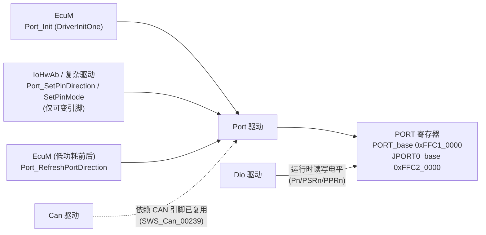
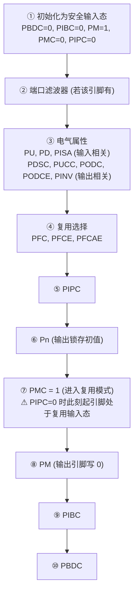
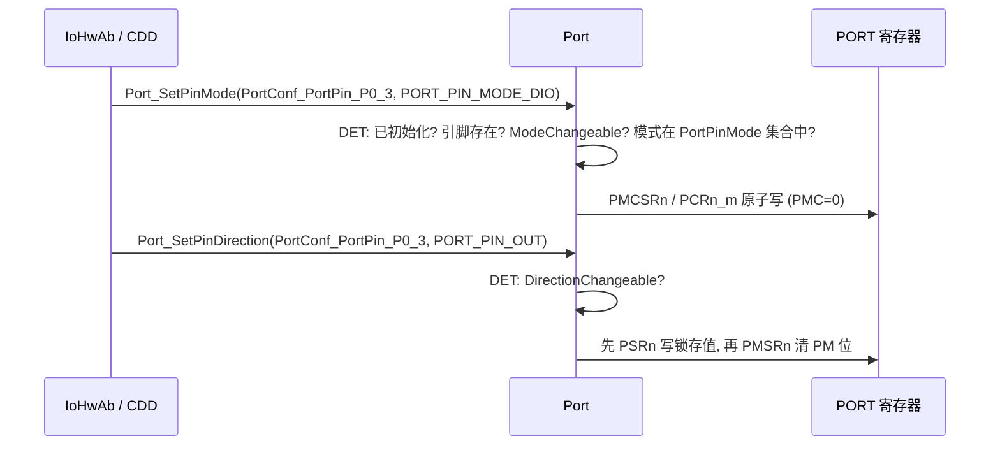

# Port 驱动：引脚复用、方向与电气属性——以 RS-CANFD 引脚为例

> Prerequisite: [MCAL 总览](01-mcal-overview.md), [MCU 驱动](02-mcu-driver.md)
> Next: [Dio 驱动](04-dio-driver.md)
> 对应规范: **本仓库没有 Port Driver SWS**。API 与配置参数名为 R4.x 公认形态（并参考 openAUTOSAR 源码中的 `@req PORTxxx` 注释，属 R3.x 编号），需以真实项目所用 Release 的 Port SWS 与 Renesas MCAL 手册确认。可引用的相关规范：SWS MCU R24-11 `SWS_Mcu_00245`（p.25，影响多模块的 I/O 寄存器归 Port）；SWS CAN R22-11 `SWS_Can_00239`（p.22，CAN 引脚由 Port 配置）、`SWS_Can_00407`（p.43）；SWS IoHwAb R24-11 `SWS_IoHwAb_00078`（p.15）。
> 对应源码: openAUTOSAR `boards/linuxOs/MCAL/Port/src/Port.c`、`include/Port.h`、`boards/linuxOs/MCAL/Port/include/Port.h`（STM32 遗留）；本项目无 Port 实现。
> RH850 依据: HW-E §2 Pin Functions：p.91（基址）、p.93–96（模式与读写语义）、p.99–116（寄存器）、p.124–125（PCRn_m）、p.126–131（配置流程与 PIPC 限制）、p.151–158（端口功能表、滤波器）、p.793（CAN 引脚组合 Table 17.10）；DS-E p.8–12, p.23。

---

## 1. 本章目标

1. 理解 Port 驱动的职责边界：**配置引脚**（复用功能、方向、初始电平、上下拉、驱动能力、输入缓冲），而不是**运行时读写电平**（那是 Dio）。
2. 掌握 Port API——`Port_Init`、`Port_SetPinDirection`、`Port_SetPinMode`、`Port_RefreshPortDirection`、`Port_GetVersionInfo`——每一个的调用者、时机、配置约束与错误。
3. 掌握 RH850/P1M-E 端口寄存器体系：`PMC`/`PM`/`PIPC`/`PFC`/`PFCE`/`PFCAE`/`PIBC`/`PBDC`/`PU`/`PD`/`PODC`/`PDSC`/`PINV`/`Pn`/`PSR`/`PCR`，以及手册规定的**配置顺序**及其原因。
4. 能独立完成一个 CAN 引脚复用配置，并清楚它的**不确定性**在哪里（ALT 号的来源、板级引脚选择、收发器控制脚）。

---

## 2. 为什么需要 Port 驱动？

一个 RH850/P1M-E 的引脚，例如 P2_0，可以是 GPIO，也可以是 RSCAN0RX0、定时器输入、串口等若干复用功能之一。“它是什么”由多个寄存器共同决定，并且：

- **同一组寄存器影响多个外设**——PMC2 的不同位决定 P2 组里每个引脚分别属于 CAN、SPI 还是 GPIO。按 `SWS_Mcu_00245`（p.25）/`SWS_Can_00407`（p.43），“影响多个硬件模块的 I/O 寄存器”由 Port 驱动统一初始化。
- **引脚配置错误会造成硬件损害或安全问题**——把一个连接到外部驱动器输出的引脚配置成输出、电平相反，就是短路。
- **配置顺序本身有硬件约束**——手册专门给出了流程图（HW-E p.126–130），顺序错了会产生毛刺或误触发中断。

所以 AUTOSAR 让 Port 驱动在启动早期**一次性、按正确顺序**把所有引脚配置好，并且只允许“配置声明为可变”的引脚在运行时改变方向或模式。

---

## 3. 在系统中的位置



Port 与 Dio 操作**同一组硬件**（PORT 寄存器），分工是：Port 管“这个引脚是什么、朝哪个方向、初始电平和电气属性”，Dio 管“运行时这个 GPIO 输出高还是低、输入读到什么”。

---

## 4. AUTOSAR 如何定义？（[AUTOSAR API]，本仓库无 Port SWS）

### 4.1 API（R4.x 公认形态）

| API | 签名（R4.x 公认） | 谁调用 / 何时 | 约束 |
|---|---|---|---|
| `Port_Init` | `void Port_Init(const Port_ConfigType* ConfigPtr)` | EcuM，启动早期（DriverInitOne） | 初始化**所有**配置的引脚；未配置的引脚按“未用引脚”策略处理 |
| `Port_SetPinDirection` | `void Port_SetPinDirection(Port_PinType Pin, Port_PinDirectionType Direction)` | 上层（IoHwAb/CDD），运行时 | 仅当该引脚 `PortPinDirectionChangeable = TRUE`；由 `PortSetPinDirectionApi` 开关控制 |
| `Port_SetPinMode` | `void Port_SetPinMode(Port_PinType Pin, Port_PinModeType Mode)` | 上层，运行时 | 仅当 `PortPinModeChangeable = TRUE`；由 `PortSetPinModeApi` 开关控制 |
| `Port_RefreshPortDirection` | `void Port_RefreshPortDirection(void)` | EcuM 或周期安全检查 | 刷新所有**方向不可变**引脚的方向寄存器（防止被干扰改写） |
| `Port_GetVersionInfo` | `void Port_GetVersionInfo(Std_VersionInfoType*)` | — | 版本信息 |

类型：`Port_PinType`（引脚的**配置索引/符号名**，而非物理位号）；`Port_PinDirectionType`（`PORT_PIN_IN` / `PORT_PIN_OUT`）；`Port_PinModeType`（**由实现定义**的模式编码，例如 DIO、CAN、SPI……）。

开发错误（R4.x 公认名称）：`PORT_E_PARAM_PIN`（引脚不存在）、`PORT_E_DIRECTION_UNCHANGEABLE`、`PORT_E_INIT_FAILED`/`PORT_E_PARAM_CONFIG`（版本不同名称不同）、`PORT_E_PARAM_INVALID_MODE`、`PORT_E_MODE_UNCHANGEABLE`、`PORT_E_UNINIT`、`PORT_E_PARAM_POINTER`。具体值以真实 SWS 为准。

### 4.2 配置容器（R4.x 公认）

```text
Port
├── PortGeneral
│     PortDevErrorDetect, PortSetPinDirectionApi, PortSetPinModeApi, PortVersionInfoApi
└── PortConfigSet
      └── PortContainer [1..*]                 (一组引脚, 常按端口组)
            PortNumberOfPortPins
            └── PortPin [1..*]
                  PortPinId                    (实现相关的物理引脚编号)
                  PortPinDirection             (PORT_PIN_IN / PORT_PIN_OUT)
                  PortPinDirectionChangeable   (TRUE/FALSE)
                  PortPinInitialMode           (例 PORT_PIN_MODE_DIO / CAN / ...)
                  PortPinMode [1..*]           (该引脚允许的模式集合)
                  PortPinModeChangeable        (TRUE/FALSE)
                  PortPinLevelValue            (PORT_PIN_LEVEL_HIGH / LOW, 初始输出电平)
                  (+ 供应商扩展: 上下拉、驱动强度、开漏、输入缓冲、滤波器 ...)
```

在 RH850 上，大量电气属性（PU/PD、PODC、PDSC、PIBC、滤波器）都是**供应商扩展参数**——标准容器不足以描述 RH850 的端口能力，Renesas MCAL 会提供额外参数。

---

## 5. 核心数据结构

### 5.1 RH850/P1M-E 端口寄存器（HW-E p.91–116）

`PORT_base = 0xFFC1_0000`，`JPORT0_base = 0xFFC2_0000`；端口组 P0–P5、JP0（HW-E p.91）。每组的寄存器 = `PORT_base + 偏移 + n × 40H`：

| 寄存器 | 偏移 | 宽度 | 复位值 | 作用 | 出处 |
|---|---|---|---|---|---|
| `Pn` | +0000H | 16 | — | 输出锁存值 | p.99, p.113 |
| `PSRn` | +0004H | 32 | — | 置位/复位：高 16 位为写使能，低 16 位为值 | p.96, p.115 |
| `PNOTn` | +0008H | 16（只写） | 读恒 0 | 取反 | p.96, p.114 |
| `PPRn` | +000CH | 16（只读） | — | 读引脚/锁存/复用输出（取决于模式，Table 2.7） | p.95, p.112 |
| `PMn` | +0010H | 16 | `PM0=FBFFH`，`PM1–5=FFFFH` | **1 = 输入，0 = 输出** | p.104 |
| `PMCn` | +0014H | 16 | `0000H` | **0 = port 模式，1 = 复用模式** | p.101 |
| `PFCn` / `PFCEn` / `PFCAEn` | +0018H / +001CH / +0028H | 16 | `0000H` | 选择 ALT1–6 | p.94, p.107–109 |
| `PMSRn` / `PMCSRn` | +0020H / +0024H | 32 | — | PM / PMC 的置位/复位寄存器 | p.102, p.105 |
| `PINVn` | +0030H | 16 | — | 输出电平反相 | p.116 |
| `PIBCn` | +4000H | 16 | `0000H` | port 输入模式下的输入缓冲使能 | p.106 |
| `PBDCn` | +4004H | 16 | `0000H` | 双向（输出时读回引脚） | p.96, p.111 |
| `PIPCn` | +4008H | 16 | `0000H` | 0 = S/W I/O 控制，1 = Direct I/O 控制（复用功能直接控制方向） | p.93, p.103 |
| `PUn` / `PDn` | +400CH / +4010H | — | — | 上拉 / 下拉 | p.100 |
| `PODCn` / `PDSCn` / `PUCCn` / `PODCEn` / `PISAn` | +4014H / +4018H / +4028H / +403CH / +402CH | — | — | 输出类型（推挽/开漏）、驱动能力、输入缓冲类型 | p.100 |
| `PCRn_m` | +2000H + n×40H + 4×m | 32 | 多数 `0000_0010H` | **单引脚控制寄存器**：一次写设置该引脚的 PFC/PFCE/PFCAE/PM/PIPC/PMC/P/PIBC/PBDC/PD/PU/PISA（PINV/PODC/PODCE/PUCC/PDSC 不能经它设置） | p.124–125 |

三种引脚模式（Table 2.5，p.93）：

| 模式 | PMC | PM | PIPC | 方向 |
|---|---|---|---|---|
| Port 模式（GPIO） | 0 | 0 / 1 | X | 由 PM：0 输出、1 输入（输入需 PIBC=1） |
| S/W I/O 控制复用模式 | 1 | 0 / 1 | 0 | 由 PM 决定复用输出或复用输入 |
| Direct I/O 控制复用模式 | 1 | X | 1 | 由复用功能直接控制，PM 被忽略 |

**ALT 编码（Table 2.6，p.94）**——`[PFCAE, PFCE, PFC]` 选择 ALT 号，`PM` 选择方向：

| ALT | PFCAE | PFCE | PFC | 输出（PM=0） | 输入（PM=1） |
|---|---|---|---|---|---|
| 1 | 0 | 0 | 0 | ALT-OUT1 | ALT-IN1 |
| 2 | 0 | 0 | 1 | ALT-OUT2 | ALT-IN2 |
| 3 | 0 | 1 | 0 | ALT-OUT3 | ALT-IN3 |
| 4 | 0 | 1 | 1 | ALT-OUT4 | ALT-IN4 |
| 5 | 1 | 0 | 0 | ALT-OUT5 | ALT-IN5 |
| 6 | 1 | 0 | 1 | ALT-OUT6 | ALT-IN6 |

要点：**CAN TX 是复用输出（PM=0），CAN RX 是复用输入（PM=1）**——即使两者的 ALT 号相同，PM 也不同。

### 5.2 一个 Port 配置条目应包含什么（[Educational Implementation]）

```c
/* [Educational Implementation] 面向 RH850/P1M-E 的引脚配置条目——不是 Renesas MCAL 的结构 */
typedef struct {
    uint8   Group;          /* 0..5 = P0..P5, 0xFF = JP0                         */
    uint8   Bit;            /* 0..15                                              */
    uint8   Mode;           /* PORT_MODE_GPIO / PORT_MODE_ALT                     */
    uint8   Alt;            /* 1..6, 仅 ALT 模式; 生成器按 Table 2.6 编码          */
    uint8   Direction;      /* PORT_PIN_IN / PORT_PIN_OUT (S/W I/O 控制)           */
    uint8   InitialLevel;   /* 输出引脚的初始锁存值                                */
    boolean InputBuffer;    /* PIBC: GPIO 输入必须 TRUE                            */
    boolean PullUp, PullDown;
    boolean OpenDrain;      /* PODC                                               */
    boolean DirectIoCtrl;   /* PIPC: 仅 Table 2.33 列出的 CSIH/CSIG/TSG3 引脚允许    */
    boolean DirectionChangeable, ModeChangeable;
} Port_PinCfgType;
```

---

## 6. 初始化流程：`Port_Init` 与手册规定的顺序

### 6.1 `Port_Init`

| 维度 | 内容 |
|---|---|
| 谁调用 | EcuM（openAUTOSAR `EcuM_Callout_Stubs.c:214`，在 Mcu 之后、Gpt 之前） |
| 何时 | OS 启动前；必须在 Can_Init 之前（`SWS_Can_00239`） |
| 输入 | `ConfigPtr` |
| 输出 | 无（`void`）；失败通过 DET |
| 运行时状态 | 初始化标志、配置指针 |
| 出错时 ECU 会怎样 | 引脚停留在复位态（基本为输入、输入缓冲关闭，HW-E p.104, p.106）→ 外设“配置正确但没有信号”；输出引脚可能浮空，外部器件处于未定义状态 |

### 6.2 RH850/P1M-E 的配置顺序（Figure 2.5 批量设置，HW-E p.127）



每一步的原因：

| 步 | 为什么 |
|---|---|
| ① 先回到安全输入态 | 无论之前是什么状态（复位后、bootloader 配置过、软件复位后），都先进入“不驱动引脚、不读引脚”的状态 |
| ② 滤波器 | 必须在引脚被复用为中断输入之前配置，否则配置过程中的毛刺可能触发中断（p.127 Note 1：对 NMI/INTP 给出了“先配 PMC → 等待脉冲抑制时间 → 再配边沿检测”的顺序） |
| ③ 电气属性 | 在引脚开始驱动之前确定驱动方式（推挽/开漏、驱动强度），避免以错误的电气方式驱动外部电路 |
| ④ ALT 选择 | 在 PMC 切换前选好功能，避免短暂地连接到错误的外设 |
| ⑥ Pn 先于 PM | **先写输出锁存，再打开输出**——否则输出使能瞬间会输出旧的锁存值，产生毛刺（例如短暂打开一个继电器或使能 CAN 收发器） |
| ⑦→⑧ 的窗口 | 手册 CAUTION（p.126）：PIPC=0 时，从 PMC 置 1 到 PM 清 0 之间，引脚会**短暂处于复用输入态**；如果该引脚复用了中断相关功能，需要先屏蔽中断或确保忽略它 |
| ⑨ PIBC | port 输入模式下才有意义；输入缓冲关闭时 PPR 读的是锁存值而不是引脚（Table 2.7，p.95）——见 [Dio 驱动](04-dio-driver.md) |

P1M-E 还提供 `PCRn_m`（p.124–125），可以**一次 32 位写**完成单个引脚的大部分设置（Figure 2.6/2.7 中“Settable range of PCRn_m”）。好处是原子性和代码简洁；限制是 PINV/PODC/PODCE/PUCC/PDSC 不能经 PCR 设置（p.124 Note 2）。

### 6.3 [Educational Implementation] 按手册顺序配置一个复用引脚

```c
/* [Educational Implementation] 单引脚复用配置（S/W I/O 控制, PIPC=0）——HW-E p.126-127 顺序
 * 地址 = PORT_base(0xFFC10000) + offset + n*0x40 (p.91, p.99-100); 16 位寄存器用 16 位访问 */
static void Port_ConfigAltPin(uint8 n, uint8 m, uint8 alt /*1..6*/, boolean isOutput,
                              boolean pullUp, uint8 initLevel)
{
    const uint16 bit = (uint16)(1u << m);
    const uint32 g   = 0xFFC10000uL + (uint32)n * 0x40u;
    const uint8  enc = (uint8)(alt - 1u);          /* Table 2.6: ALT1=000 ... ALT6=101 */

    /* ① 安全输入态 */
    RMW16(g + 0x4004u, bit, 0u);   /* PBDC = 0 */
    RMW16(g + 0x4000u, bit, 0u);   /* PIBC = 0 */
    RMW16(g + 0x0010u, bit, bit);  /* PM   = 1 (输入) */
    RMW16(g + 0x0014u, bit, 0u);   /* PMC  = 0 (port) */
    RMW16(g + 0x4008u, bit, 0u);   /* PIPC = 0 */
    /* ② 滤波器: 若该引脚有 (FCLA/DNFA), 在此配置 */
    /* ③ 电气属性 */
    RMW16(g + 0x400Cu, bit, pullUp ? bit : 0u);    /* PU */
    /* ④ ALT 选择 */
    RMW16(g + 0x0018u, bit, (enc & 1u) ? bit : 0u);  /* PFC   */
    RMW16(g + 0x001Cu, bit, (enc & 2u) ? bit : 0u);  /* PFCE  */
    RMW16(g + 0x0028u, bit, (enc & 4u) ? bit : 0u);  /* PFCAE */
    /* ⑥ 输出锁存先于方向 (用 PSRn 原子写, 高16位写使能, p.96) */
    MMIO_WRITE32(g + 0x0004u, ((uint32)bit << 16) | (initLevel ? bit : 0u));
    /* ⑦ 进入复用模式 —— 之后到 ⑧ 之间引脚短暂为复用输入 (p.126 CAUTION) */
    RMW16(g + 0x0014u, bit, bit);  /* PMC = 1 */
    /* ⑧ 方向 */
    RMW16(g + 0x0010u, bit, isOutput ? 0u : bit);  /* PM: 输出 0 / 输入 1 */
}
/* RMW16 = 读-改-写 16 位寄存器, 必须在 Port_Init 的单线程上下文中调用;
 * 运行时修改应使用 PMSRn/PMCSRn (32 位置位/复位寄存器, p.102, p.105) 或 PCRn_m 避免读改写竞争 */
```

---

## 7. Runtime Flow：运行时可改的引脚

### 7.1 `Port_SetPinDirection` / `Port_SetPinMode`



典型用例：

- 一个引脚平时是 SPI（复用），低功耗前切为 GPIO 输出低电平以降低漏电；
- 一个双向信号线（单线协议）需要在输入和输出之间切换；
- 诊断 IO 控制（0x2F）中某些信号需要临时改变模式——但这应经过 IoHwAb 的仲裁（[分层架构 §7.3](../02-autosar-classic/02-layered-architecture.md)）。

**并发**：`Port_SetPinDirection` 修改的是 16 位 `PMn` 寄存器中的一位。如果用读-改-写实现，而另一个任务同时修改同组的另一个引脚，就会丢失修改。P1M-E 提供 `PMSRn`/`PMCSRn`（32 位，高 16 位写使能，p.102, p.105）和 `PCRn_m`（单引脚，p.124），可以**不读就只改一位**。好的实现会利用它们；否则必须用 exclusive area。

### 7.2 `Port_RefreshPortDirection`

刷新所有 `PortPinDirectionChangeable = FALSE` 的引脚方向。动机是功能安全：EMC 干扰或软件错误可能改写方向寄存器，周期性刷新可把它恢复。它**不应**触碰方向可变的引脚（那些引脚的“正确方向”只有上层知道）。

---

## 8. RH850 Hardware Mapping：CAN 引脚复用完整例子（及其不确定性）

### 8.1 P1M-E 上可用的 CAN 引脚（Table 17.10，HW-E p.793）

| 通道 | RX 引脚 | TX 引脚 | 100-pin 可用 | ALT 号（推断） |
|---|---|---|---|---|
| CAN0 | P2_0 | P2_1 | 是 | RX/TX 都是 ALT1 |
| CAN0 | P3_7 | P3_8 | 是 | 都是 ALT3 |
| CAN0 | P4_5 | P4_6 | 是 | 都是 ALT3 |
| CAN1 | P2_2 | P2_3 | 是 | 都是 ALT1 |
| CAN1 | P3_12 | P3_13 | 是 | 都是 ALT3 |
| CAN1 | P4_2 | P4_3 | 是 | 都是 ALT1 |
| CAN1 | P4_7 | — | 仅 144-pin | — |
| CAN2 | P5_6 | P5_5 | 是 | RX ALT1；**TX ALT6** |
| CAN2 | — | P5_7 | 仅 144-pin | ALT1 |

100-pin 型号（R7F701381 是 LFQFP100，DS-E p.2）的 CAN2 TX 只有 P5_5（DS-E p.23；HW-E p.793）。

### 8.2 ⚠ 不确定性说明（必须读）

1. **ALT 号是推断出来的**。来源：DS-E/HW-E Pin Assignment 表中每个引脚的功能按 ALT 顺序列出（DS-E p.8–12；HW-E p.70–74），再与 HW-E p.151–154 的端口功能表核对。例如 `P5_5 / SENT0RX / SENT0SPCO / … / SCI31RX / INTP1 / RSCAN0TX2` 中 RSCAN0TX2 位于第 6 列，因此推断为 ALT6（`04-rh850-hardware-notes.md` §6.3）。**但 p.151–154 是旋转排版的表格，文本抽取后列对齐不可靠**。写入代码前，必须在 PDF 原表中逐格核对 ALT 号。
2. **板级选择未知**：板子实际用哪一组 RX/TX、收发器的 STB/EN/ERR 引脚是哪个、有效电平是什么，手册无法给出，需看原理图。本仓库是教学项目，没有原理图。
3. **RX 引脚与中断/滤波器共用**：RSCAN0RX0/1/2 分别与 INTP5/INTP6/INTP10 共用数字噪声滤波器（FCLA/DNFA 系列寄存器）（HW-E p.158）。CAN RX 是否需要配置这个滤波器，需根据实际芯片手册 §2.6 确认。
4. **PIPC 必须为 0**：PIPC=1 只允许用于 Table 2.33 列出的 CSIH/CSIG/TSG3 引脚，CAN 不在其中（HW-E p.131）。
5. **同一外设输入同一时间只能在一个引脚上使能**（HW-E p.131）：如果 P2_0 和 P3_7 都被配置成 RSCAN0RX0，行为未定义。

### 8.3 CAN0 使用 P2_0/P2_1 的配置（[Educational Implementation]，ALT1 待核对）

| 步 | P2_0（RSCAN0RX0，复用输入） | P2_1（RSCAN0TX0，复用输出） |
|---|---|---|
| ① 安全态 | PBDC=0, PIBC=0, PM=1, PMC=0, PIPC=0 | 同左 |
| ② 滤波器 | 按 HW-E §2.6 确认是否需要 | — |
| ③ 电气 | 视收发器 RXD 输出类型决定是否上拉 | 推挽（PODC=0）；驱动强度按板级 |
| ④ ALT1 | PFCAE=0, PFCE=0, PFC=0 | PFCAE=0, PFCE=0, PFC=0 |
| ⑤ PIPC | 0 | 0 |
| ⑥ Pn | — | 1（隐性电平，CAN TX 空闲为高） |
| ⑦ PMC | 1 | 1 |
| ⑧ PM | **1（输入）** | **0（输出）** |

对应的 `Port_PinCfgType` 条目（§5.2 结构）：

```c
/* [Educational Implementation] ALT 号需按 HW-E p.151-154 原表核对; 板级引脚需按原理图确认 */
{ 2u, 0u, PORT_MODE_ALT, 1u, PORT_PIN_IN,  0u, FALSE, FALSE, FALSE, FALSE, FALSE, FALSE, FALSE }, /* P2_0 RSCAN0RX0 */
{ 2u, 1u, PORT_MODE_ALT, 1u, PORT_PIN_OUT, 1u, FALSE, FALSE, FALSE, FALSE, FALSE, FALSE, FALSE }, /* P2_1 RSCAN0TX0 */
/* 收发器 STB / EN: GPIO 输出, 初始电平按收发器手册使其进入"正常模式"或"待机", 引脚号未知 → 不绑定 */
```

**为什么 TX 的初始锁存值设为 1？** 在 PMC=1 之后，TX 引脚由 CAN 外设驱动，Pn 的值不再输出；但在⑦→⑧之间、或者如果以后通过 `Port_SetPinMode` 把它切回 GPIO，锁存值决定了引脚电平。CAN 总线的隐性电平对应 TXD 高电平，所以“安全值”是 1——避免在切换窗口期向总线发出显性位。

### 8.4 CAN 不通时，Port 层面的检查

| 检查 | 方法 |
|---|---|
| 引脚是否处于复用模式 | 读 PMC2 对应位 = 1 |
| ALT 编码 | 读 PFC2/PFCE2/PFCAE2 对应位，与原表核对 |
| 方向 | PM2：RX 位 = 1，TX 位 = 0 |
| PIPC | = 0 |
| 是否有第二个引脚也被配成同一 CAN RX | 检查 P3_7、P4_5 的 PMC/PFC 配置 |
| TX 引脚是否真的在输出 | 示波器看 P2_1；`PBDC=1` 时可经 PPR 读回引脚电平（Table 2.7 Note 1，p.95） |
| 收发器 | STB/EN 引脚电平（Dio 层面），收发器供电 |

---

## 9. openAUTOSAR 实现：R3.x Port 驱动（STM32）

文件：`boards/linuxOs/MCAL/Port/src/Port.c`（`#include "stm32f10x.h"`，:18），AUTOSAR 3.1.0（`include/Port.h:30-32`）。

| 函数 | 行 | 观察 |
|---|---|---|
| 状态 | :52 | `static Port_StateType _portState = PORT_UNINITIALIZED;` |
| `Port_Init` | :98-125 | `VALIDATE_PARAM_CONFIG`（`@req PORT105`）；循环把配置结构**原样**写进 STM32 GPIO 的 CRL/CRH（:104-109），然后写 ODR 输出电平（:111-113）；启用 remap（:116-119）；置 `_portState`、保存 `_configPtr`（:121-122） |
| `Port_SetPinDirection` | :131-170 | 注意 **`static uint8 index, bit, reg;`**（:136）——用 `static` 局部变量，函数**不可重入**；方向切换时上拉/推挽等属性被硬编码（“TODO shall this be added to conf?”） |
| `Port_RefreshPortDirection` | :175-181 | `/* TODO Not implemented yet */` |
| `Port_SetPinMode` | :199 起 | 直接报 `PORT_E_MODE_UNCHANGEABLE`：“Mode of pins not changeable on this CPU” |

值得讨论的两点：

1. **注释与代码矛盾**：`Port_Init` 上方的注释写 `/** @req PORT043 Comment: Output value is set before direction */` 和 `/** @req PORT055 Comment: Output value is set before direction */`（:92-95 附近），但代码先写 CRL/CRH（方向/模式）、后写 ODR（输出值）。这正是 §6.2 第 ⑥ 步要避免的毛刺来源。**需求追溯注释不能代替代码审查**。
2. `static` 局部变量导致不可重入——如果两个任务同时调用 `Port_SetPinDirection`，计算结果会互相覆盖。

---

## 10. 当前教学项目实现

`examples/rh850_mcal_reference/` 没有 Port 实现。`docs/mcal-reference-guide.md` R2 给出了设计要点（每个引脚的配置元组、未知物理值保持未绑定、初始化顺序、运行时只改可变项、未用引脚按 HW-E §2.8 处理），本章 §5.2、§6.3、§8.3 是它的具体化。后续若加入 `mcal/port/`，建议：

- 用 `PCRn_m` 或 `PMSRn/PMCSRn/PSRn` 实现运行时修改，避免读-改-写；
- 主机测试验证每个引脚的寄存器写入**顺序**（Pn 先于 PM、PFC 先于 PMC）和**宽度**（16/32 位）；
- 配置校验：同一外设输入不得出现在两个引脚、CAN 引脚 PIPC 必须为 0、ALT 号必须在该引脚的合法集合内。

---

## 11. Code Walkthrough：读 Renesas Port 配置的方法

```text
1. Port_Cfg.h:   PORT_SET_PIN_DIRECTION_API / PORT_SET_PIN_MODE_API / DEV_ERROR_DETECT
                 引脚符号名 (PortConf_PortPin_xxx) → 物理引脚
2. Port_PBcfg.c: 每组/每引脚的寄存器值数组 (常见形态: 每组一套 PMC/PM/PFC/PFCE/PFCAE/PIBC/... 的 16 位值 + 掩码)
3. 逐位解码:    对你关心的引脚 (例 CAN0 TX/RX), 从数组中取出各寄存器对应位, 用 Table 2.5/2.6 还原:
                port 还是 ALT? ALT 几? 输入还是输出? PIPC?
4. 对照 Table 17.10 (p.793) 与原表 (p.151-154) 确认 ALT 号
5. 对照原理图确认引脚号、收发器控制脚
6. Port_Init:    看它是否遵守 p.127 的顺序 (尤其 Pn 先于 PM)
```

---

## 12. Debug 方法

| 症状 | 检查 |
|---|---|
| 外设配置正确但引脚上没有信号 | PMC 是否为 1；ALT 编码；是否被别的模块（或调试器脚本）改回 GPIO |
| 上电瞬间外部负载动作一下 | Port_Init 中 Pn 是否先于 PM；复位到 Port_Init 之间引脚的外部上下拉 |
| GPIO 输入读出来总是 0 或总是上次写的值 | PIBC 是否为 1（输入缓冲关闭时 PPR 读的是 Pn 锁存值，Table 2.7） |
| 配置引脚时触发了一次外部中断 | p.126 CAUTION 的复用输入窗口；p.127 Note 1 的滤波器/边沿配置顺序 |
| 运行时偶发引脚方向被改 | 读-改-写竞争；EMC → `Port_RefreshPortDirection` |
| CAN 收不到但能发 | RX 引脚 PM 是否为 1；同一 RX 功能是否在两个引脚使能；滤波器 |

用调试器直接看 PORT 寄存器（`0xFFC1_0000 + n×40H + offset`）是最快的方法——不要相信配置工具的 GUI，相信寄存器。

---

## 13. 常见问题 / 常见错误

1. **在 Can 驱动或应用里配置 CAN 引脚**——违反 `SWS_Can_00239`，与 Port_Init 互相覆盖。
2. **先设方向再设输出值**——输出毛刺。
3. **GPIO 输入忘了开 PIBC**——读到的是锁存值。
4. **CAN 引脚设 PIPC=1**——CAN 不在允许列表（p.131）。
5. **直接相信从 PDF 文本抽取出的 ALT 号**——旋转表格列错位，必须核对原表。
6. **运行时用 16 位读-改-写修改 PMn**，与其它任务竞争。
7. **把引脚编号当作 `Port_PinType`**——AUTOSAR 的 `Port_PinType` 是配置符号，物理映射在配置里。
8. **忽视 PM0 的复位值 FBFFH**（P0_10 复位后为输出，HW-E p.104）。

---

## 14. 实验

1. **ALT 核对**：在 HW-E PDF 原文 p.151–154 中找到 P2_0、P2_1、P5_5、P3_7 四个引脚，逐格确认 RSCAN 功能所在的 ALT 列；与 §8.1 的推断对比。
2. **寄存器地址计算**：计算 P2 组的 `PMC2`、`PM2`、`PFC2`、`PIBC2`、`PSR2`、`PCR2_1` 的绝对地址（`PORT_base=0xFFC1_0000`）。
3. **顺序推演**：假设某引脚连接一个低电平有效的继电器驱动（输出 0 = 继电器吸合），复位后外部上拉使其为高。如果 Port_Init 先写 PM=0 再写 Pn=1，而 Pn 复位值为 0，会发生什么？持续多长时间？
4. **PCR 编码**：用 PCRn_m 的位定义（p.124–125）写出把 P2_1 配置为 ALT1 复用输出（PMC=1、PM=0、PFC/PFCE/PFCAE=0、PIPC=0、P=1）的 32 位值。

---

## 15. 思考题

1. AUTOSAR 的标准 Port 配置容器没有“上下拉”“驱动强度”“输入缓冲”这些参数，而 RH850 必须配置它们。这些参数应该放在哪里？对 MCAL 的可移植性有什么影响？
2. `Port_RefreshPortDirection` 只刷新方向不可变的引脚。为什么不刷新 PMC/PFC 等模式寄存器？如果你是安全工程师，你会要求刷新哪些寄存器？
3. 一个引脚在低功耗前从 SPI 切换为 GPIO 输出低。从安全和功耗两个角度，Port_SetPinMode 与 Port_SetPinDirection 的调用顺序应如何设计？
4. 为什么 P1M-E 要同时提供 `PMn`（16 位）、`PMSRn`（32 位置位/复位）和 `PCRn_m`（单引脚）三种方式修改同一个位？

---

## 16. 对未来真实项目的意义

拿到真实 RH850 项目后：

1. **建立引脚表**：从原理图导出每个 MCU 引脚的网络名，与 Port 配置逐一对照（功能、ALT、方向、初始电平、上下拉、是否可变）。CAN TX/RX 与收发器控制脚是第一优先级。
2. **核对 ALT 号**：用芯片手册原表（不是文本抽取）核对 Port 生成代码中的 PFC/PFCE/PFCAE 位。
3. **审查 Port_Init 的顺序**：是否“先锁存后方向”；中断复用引脚是否处理了 p.126/p.127 的窗口。
4. **列出运行时可变引脚**及其使用者（IoHwAb/CDD/低功耗管理），确认并发保护方式。
5. **CAN 不通时**按 §8.4 的清单直接读寄存器，然后才去看 Can 驱动。
6. **记录未用引脚策略**（HW-E §2.8），它影响 EMC 与功耗。

---

## 17. 本章总结

- Port 负责引脚“是什么”（复用、方向、初始电平、电气属性），Dio 负责运行时电平；二者共享 PORT 寄存器。
- AUTOSAR Port API：`Port_Init`、`Port_SetPinDirection`、`Port_SetPinMode`、`Port_RefreshPortDirection`、`Port_GetVersionInfo`；运行时修改受 Changeable 配置约束。本仓库无 Port SWS，API 按 R4.x 公认形态讲解。
- P1M-E 端口寄存器：PMC（port/复用）、PM（1 入 0 出）、PFC/PFCE/PFCAE（ALT1–6）、PIPC（CAN 必须 0）、PIBC（输入缓冲）、PBDC（双向读回）、PU/PD/PODC/PDSC…、Pn/PSRn/PCRn_m。
- 手册顺序（p.127）：安全输入态 → 滤波器 → 电气属性 → ALT → PIPC → **Pn → PMC → PM** → PIBC → PBDC；注意 PMC→PM 之间的复用输入窗口。
- CAN 引脚：CAN0 可用 P2_0/P2_1（推断 ALT1）等组合；ALT 号需按原表核对，板级选择需按原理图确认。

## 18. 下一章

[04-dio-driver.md](04-dio-driver.md)：Dio 驱动——在 Port 配置好的 GPIO 上读写电平。我们会看到为什么“读回输出引脚”在 RH850 上有三种不同的答案（锁存值、引脚电平、复用输出），以及如何用 PSRn 实现无竞争的单位写。
