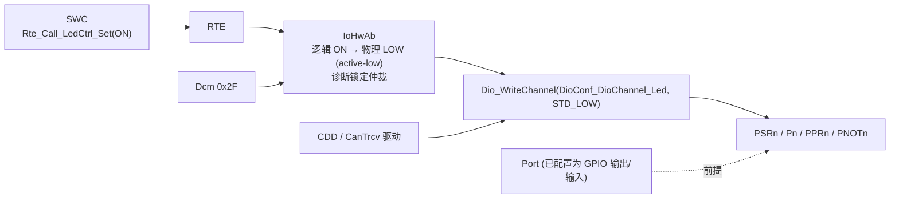
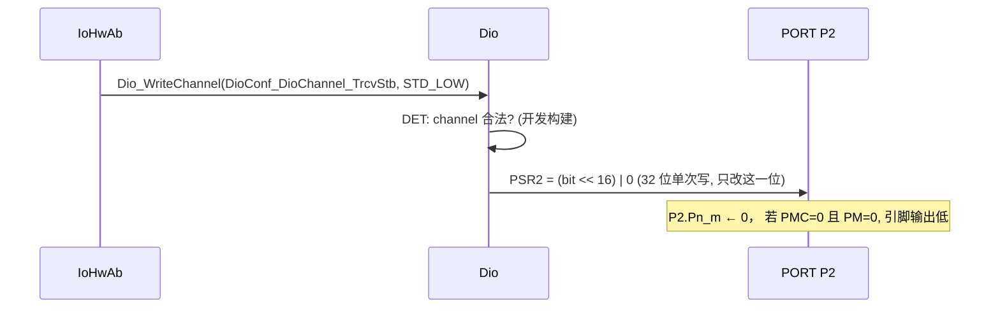

# Dio 驱动：GPIO 电平读写、原子性与“读回”的三种含义

> Prerequisite: [Port 驱动](03-port-driver.md)
> Next: [Gpt 驱动](05-gpt-driver.md)
> 对应规范: **本仓库没有 Dio Driver SWS**。API、类型与错误名为 R4.x 公认形态，需以真实项目所用 Release 的 Dio SWS 与 Renesas MCAL 手册确认。相关规范：SWS IoHwAb R24-11（p.8, p.15 `SWS_IoHwAb_00078`：IoHwAb 调用 DIO；DIO/PORT 不向 IoHwAb 发通知；p.48–50 `IoHwAb_Dcm_*`）。
> 对应源码: openAUTOSAR `boards/linuxOs/MCAL/Dio/src/Dio.c`（STM32 遗留，AUTOSAR 3.1.5，`Dio.h:84-86`）；本项目无 Dio 实现。
> RH850 依据: HW-E p.95–96（PPRn 读值来源 Table 2.7、Pn/PSRn/PNOTn 写语义）、p.99、p.104、p.106、p.111–116（寄存器）。

---

## 1. 本章目标

1. 理解 Dio 的职责：**在 Port 已经配置为 GPIO 的引脚上读写电平**，同步、可重入、不改配置。
2. 掌握 Dio 的三种访问粒度：**Channel（单引脚）、Port（整组）、ChannelGroup（一组内连续位）**，以及 `Dio_FlipChannel`。
3. 理解 RH850/P1M-E 上“读一个引脚”有三种可能的答案：**引脚实际电平、输出锁存值、复用功能的内部输出**（Table 2.7），以及 `PIBC`/`PBDC` 如何决定它。
4. 理解为什么单位写必须原子，以及 P1M-E 的 `PSRn`/`PNOTn` 如何在硬件上解决读-改-写竞争。
5. 明确 Dio 与 IoHwAb 的边界：**物理电平**归 Dio，**逻辑含义**（active-low、消抖、保护）归 IoHwAb/板级封装。

---

## 2. 为什么需要 Dio？为什么它这么“薄”？

Dio 是 MCAL 中最简单的驱动，几乎每个 API 都只是一次寄存器读或写。它存在的意义在于**统一接口和语义**：

- 上层（IoHwAb、CDD）用 `Dio_WriteChannel(DioConf_DioChannel_CanTrcvStb, STD_HIGH)` 而不是 `*(volatile uint16*)0xFFC10080 |= 0x0004`；换芯片、换引脚时只改配置。
- Dio 规定了**并发语义**：所有 API 可重入；对一个 channel 的写不得影响同一 port 上的其它 channel。这一条在硬件上并不总是免费的（§7.2）。

Dio 刻意**不做**的事：

| 不做 | 谁做 |
|---|---|
| 配置引脚方向、复用、上下拉 | Port |
| 把“LED 亮”翻译成“输出低电平” | IoHwAb / 板级封装（`docs/mcal-reference-guide.md` R3） |
| 消抖、滤波 | IoHwAb（`SWS_IoHwAb_00019` 信号属性，p.23） |
| 短路/过温保护 | IoHwAb（`SWS_IoHwAb_00038`，p.20–21） |
| 引脚变化通知 | 无（IoHwAb SWS p.15：DIO/PORT 不通知）；需要边沿事件用 Icu |

---

## 3. 在系统中的位置



---

## 4. AUTOSAR 如何定义？（[AUTOSAR API]，本仓库无 Dio SWS）

### 4.1 API（R4.x 公认形态）

| API | 签名 | 语义要点 |
|---|---|---|
| `Dio_ReadChannel` | `Dio_LevelType Dio_ReadChannel(Dio_ChannelType ChannelId)` | 返回 `STD_HIGH`/`STD_LOW`；对输出 channel 返回其输出电平（读回语义由硬件决定，见 §8） |
| `Dio_WriteChannel` | `void Dio_WriteChannel(Dio_ChannelType ChannelId, Dio_LevelType Level)` | 只影响该 channel；对输入 channel 写无效果 |
| `Dio_ReadPort` | `Dio_PortLevelType Dio_ReadPort(Dio_PortType PortId)` | 整组 |
| `Dio_WritePort` | `void Dio_WritePort(Dio_PortType PortId, Dio_PortLevelType Level)` | 整组；输入位不受影响 |
| `Dio_ReadChannelGroup` | `Dio_PortLevelType Dio_ReadChannelGroup(const Dio_ChannelGroupType* ChannelGroupIdPtr)` | 读 `(port & mask) >> offset` |
| `Dio_WriteChannelGroup` | `void Dio_WriteChannelGroup(const Dio_ChannelGroupType* ChannelGroupIdPtr, Dio_PortLevelType Level)` | 只写组内位 |
| `Dio_FlipChannel` | `Dio_LevelType Dio_FlipChannel(Dio_ChannelType ChannelId)` | 取反并返回新电平（4.x 引入，开关控制） |
| `Dio_MaskedWritePort` | `void Dio_MaskedWritePort(Dio_PortType, Dio_PortLevelType Level, Dio_PortLevelType Mask)` | 只写 mask 位（较新 Release 引入，是否存在需确认） |
| `Dio_GetVersionInfo` | 标准 | — |

**Dio 通常没有 `Dio_Init`**：引脚的初始化（方向、初始电平）由 Port 完成。Dio 因此也没有“未初始化”状态检查。（不同 Release 对此的规定需以 Dio SWS 确认；openAUTOSAR R3.1.5 的 Dio.c 同样没有 Init。）

类型：`Dio_ChannelType`、`Dio_PortType`（配置符号）；`Dio_LevelType`（`STD_LOW`/`STD_HIGH`）；`Dio_PortLevelType`（与端口宽度一致——RH850 上为 16 位）；`Dio_ChannelGroupType { mask, offset, port }`。

开发错误（公认名称）：`DIO_E_PARAM_INVALID_CHANNEL_ID`、`DIO_E_PARAM_INVALID_PORT_ID`、`DIO_E_PARAM_INVALID_GROUP`、`DIO_E_PARAM_POINTER`。

**所有 Dio API 都是同步、可重入的**——可能在多个任务和 ISR 中同时被调用。这是 §7 的出发点。

### 4.2 配置（R4.x 公认）

```text
Dio
├── DioGeneral: DioDevErrorDetect, DioFlipChannelApi, DioVersionInfoApi, (DioMaskedWritePortApi)
└── DioConfig
      └── DioPort [1..*]           DioPortId (物理端口组)
            ├── DioChannel [0..*]       DioChannelId (位号) → 符号名 DioConf_DioChannel_<Name>
            └── DioChannelGroup [0..*]  DioPortMask, DioPortOffset → DioConf_DioChannelGroup_<Name>
```

---

## 5. 核心数据结构

Dio 几乎没有运行时状态（无 Init、无模式）。它的“数据结构”就是**配置映射表**：

| 符号 | 物理含义（P1M-E 示例） |
|---|---|
| `DioConf_DioChannel_X` | (端口组 n, 位 m) → 地址 `PORT_base + offset + n×40H`、位掩码 `1<<m` |
| `DioConf_DioPort_Y` | 端口组 n |
| `DioConf_DioChannelGroup_Z` | {port=n, mask=0x00F0, offset=4} |

[Educational Implementation] 一种实现方式：把 channel ID 编码为 `(n << 4) | m`，这样不需要查表：

```c
/* [Educational Implementation] channel 编码示意; 真实 MCAL 编码方式以供应商为准 */
#define DIO_CH(n, m)        ((Dio_ChannelType)(((n) << 4) | (m)))
#define DIO_CH_GROUP(ch)    ((uint8)((ch) >> 4))
#define DIO_CH_BIT(ch)      ((uint16)(1u << ((ch) & 0x0Fu)))
#define PORT_GRP(n)         (0xFFC10000uL + (uint32)(n) * 0x40u)   /* HW-E p.91, p.99 */
#define P_OFS    0x0000u    /* Pn    16 位 读写      p.113 */
#define PSR_OFS  0x0004u    /* PSRn  32 位 读写      p.115 */
#define PNOT_OFS 0x0008u    /* PNOTn 16 位 只写      p.114 */
#define PPR_OFS  0x000Cu    /* PPRn  16 位 只读      p.112 */
```

---

## 6. 初始化流程

Dio 无初始化。它依赖：

1. **Port_Init 已完成**：引脚处于 port 模式（`PMC=0`）、方向正确、输出锁存有初值、**输入引脚已打开输入缓冲（`PIBC=1`）**。
2. 若需要读回输出引脚的**实际电平**，Port 已配置 `PBDC=1`。

如果在 Port_Init 之前调用 Dio：写操作会改变 `Pn` 锁存，但因为引脚仍是输入（复位态），不会输出；读操作在 `PIBC=0` 时读到的是锁存值而不是引脚（§8.1）——这类 bug 在启动早期（例如启动代码里读一个“模式选择”引脚）很常见。

---

## 7. Runtime Flow

### 7.1 `Dio_WriteChannel`：一次调用的全部过程



- 调用者：IoHwAb、CDD（例如 CAN 收发器驱动控制 STB/EN）、启动集成代码。
- 同步、立即生效（对寄存器而言；引脚电平的建立时间由电气特性决定）。
- 无回调、无中断、无 MainFunction。
- 出错时：开发构建报 DET；量产构建中非法 channel 可能写到错误地址——这就是为什么 channel 参数应来自配置符号而不是计算得来。

### 7.2 原子性：为什么不能用读-改-写

一个**错误**的实现：

```c
/* [Conceptual] 反例: 用读-改-写实现单位写 */
void Dio_WriteChannel_Bad(Dio_ChannelType ch, Dio_LevelType lvl)
{
    uint16 v = MMIO_READ16(PORT_GRP(DIO_CH_GROUP(ch)) + P_OFS);   /* ① 读 */
    if (lvl == STD_HIGH) { v |= DIO_CH_BIT(ch); } else { v &= (uint16)~DIO_CH_BIT(ch); }
    MMIO_WRITE16(PORT_GRP(DIO_CH_GROUP(ch)) + P_OFS, v);          /* ② 写 */
}
```

如果任务 A 在 ① 与 ② 之间被 ISR B 抢占，B 修改了同一组的另一位，A 在 ② 时会把 B 的修改**覆盖回去**。这就是 Dio “对一个 channel 的写不得影响其它 channel” 在多上下文环境下的真实含义。

两种解决办法：

| 方法 | 代价 |
|---|---|
| 读-改-写包在 exclusive area 中 | 关中断时间；所有 Dio 调用者都要付出 |
| **使用硬件原子写寄存器** | 无——P1M-E 提供 `PSRn`：高 16 位为写使能，低 16 位为值，“Thus Pn_m can be set/reset without a direct write to Pn”（HW-E p.96） |

[Educational Implementation] 利用 PSRn / PNOTn 的实现：

```c
/* [Educational Implementation] P1M-E Dio 写操作——硬件原子, 无需临界区 (HW-E p.96) */
void Dio_WriteChannel(Dio_ChannelType ch, Dio_LevelType lvl)
{
    const uint32 g   = PORT_GRP(DIO_CH_GROUP(ch));
    const uint32 bit = DIO_CH_BIT(ch);
    MMIO_WRITE32(g + PSR_OFS, (bit << 16) | ((lvl == STD_HIGH) ? bit : 0u));
}

void Dio_WriteChannelGroup(const Dio_ChannelGroupType *grp, Dio_PortLevelType lvl)
{
    const uint32 g    = PORT_GRP(grp->port);
    const uint32 mask = grp->mask;                                   /* 例 0x00F0 */
    const uint32 val  = ((uint32)lvl << grp->offset) & mask;         /* 先移位再掩码 */
    MMIO_WRITE32(g + PSR_OFS, (mask << 16) | val);                   /* 一次写完整组 */
}

Dio_LevelType Dio_FlipChannel(Dio_ChannelType ch)
{
    const uint32 g = PORT_GRP(DIO_CH_GROUP(ch));
    MMIO_WRITE16(g + PNOT_OFS, DIO_CH_BIT(ch));                      /* 硬件取反 (p.96, p.114) */
    return Dio_ReadChannel(ch);                                      /* 返回新电平, 读回语义见 §8 */
}
```

`Dio_WritePort`（整组写）可以直接写 `Pn`（16 位）——但规范语义是“输入位不受影响”，如果整组中有输入引脚，写 `Pn` 会改变它们的锁存值（虽然不影响引脚，因为 PM=1），将来该引脚被切为输出时会输出这个值。更稳妥的做法是用 `PSRn` 并以“该组的输出位掩码”作为写使能。

---

## 8. RH850 Hardware Mapping：“读一个引脚”到底读到什么

### 8.1 PPRn 的读值来源（Table 2.7，HW-E p.95）

| PMC | PM | PIBC | PIPC | 模式 | **PPRn_m 读到** |
|---|---|---|---|---|---|
| 0 | 1 | **0** | X | Port 输入，**输入缓冲关闭** | **Pn.Pn_m 锁存位**（不是引脚！） |
| 0 | 1 | 1 | X | Port 输入，输入缓冲打开 | **引脚电平** |
| 0 | 0 | X | X | Port 输出（推挽/开漏） | **Pn.Pn_m 锁存位**；若 `PBDC=1` → **引脚电平** |
| 1 | 1 | 0 | 0 | S/W I/O 控制复用输入 | 引脚电平 |
| 1 | 1 | 1 | 0 | — | 设置禁止 |
| 1 | 0 | X | 0 | S/W I/O 控制复用输出 | **复用功能的内部输出信号**；若 `PBDC=1` → 引脚电平 |
| 1 | X | X | 1 | Direct I/O 控制 | 输入：引脚；输出：复用内部输出 |

（`PIBC` 复位值 0，HW-E p.106；`PBDC` 复位值 0，p.111——**复位后读输入引脚得到的是锁存值，不是引脚电平**。）

### 8.2 对 `Dio_ReadChannel` 的影响

| 场景 | Port 配置 | `Dio_ReadChannel` 返回 | 适用 |
|---|---|---|---|
| 读按键（GPIO 输入） | PMC=0, PM=1, **PIBC=1** | 引脚电平 | 正确 |
| 读按键，忘了 PIBC | PMC=0, PM=1, PIBC=0 | 锁存值（通常恒为初值） | **bug** |
| 读回自己的输出（软件状态） | PMC=0, PM=0, PBDC=0 | 锁存值 = 上次写的值 | 适合“我上次写了什么” |
| 读回输出引脚的**实际**电平（诊断短路） | PMC=0, PM=0, **PBDC=1** | 引脚电平 | 适合“引脚实际是什么”——例如输出高但被外部短路到地时读到 0 |
| 读复用引脚（例如 CAN TX） | PMC=1, PM=0, PBDC=0 | 外设内部输出信号 | 调试用 |

`docs/mcal-reference-guide.md` R3 的要求“输出回读必须区分输出锁存与实际 pin 电平，不能把一个寄存器的值冒充另一个”，在 P1M-E 上就是 **PBDC 的配置问题**。AUTOSAR Dio 规范只说“返回输出 channel 的电平”，没有规定是锁存还是引脚——这是 MCAL 实现和 Port 配置共同决定的，**需在真实项目确认**。

### 8.3 其它硬件细节

| 细节 | 依据 |
|---|---|
| `PINVn` 置 1 时输出电平反相（Pn 不变）——如果 Port 配置了 PINV，Dio 写 HIGH 实际输出 LOW | HW-E p.116 |
| `PNOTn`：写 1 的位取反；“reading the level of the output pin can read the inverted value of the value that was initially set” | HW-E p.96 |
| `PPRn` 只能 16 位读；`PNOTn` 只能 16 位写、读恒 0；`PSRn` 32 位 | HW-E p.112, p.114, p.115 |
| JP0（JTAG 端口组）寄存器为 8 位，且可能被调试接口占用（OPBT2.OPJTAG 选择 GPIO/LPD/Nexus） | HW-E p.104, p.2886 |

---

## 9. openAUTOSAR 实现：一个包含真实并发缺陷的 Dio

文件：`boards/linuxOs/MCAL/Dio/src/Dio.c`（`#include "stm32f10x_gpio.h"`，:23；AUTOSAR 3.1.5，`Dio.h:84-86`）。

| 函数 | 行 | 实现 |
|---|---|---|
| `Dio_ReadPort` | :105-116 | `GPIO_ReadInputData(GPIO_ports[portId])`——读**输入数据寄存器**（引脚电平） |
| `Dio_WritePort` | :118-128 | `GPIO_Write(...)`——整组写 |
| `Dio_ReadChannel` | :130-148 | `Dio_ReadPort` 后取位 |
| `Dio_WriteChannel` | :150-169 | **`portVal = Dio_ReadPort(...)` → 改一位 → `Dio_WritePort(...)`** |
| `Dio_ReadChannelGroup` | :172-188 | `(ReadPort & mask) >> offset` |
| `Dio_WriteChannelGroup` | :190 起 | `(level << offset) & mask`，再与 `ReadPort & ~mask` 合并后写回 |

`Dio_WriteChannel`（:150-169）有**两个**问题：

1. **非原子的读-改-写**，没有任何临界区——§7.2 的竞争。
2. **读的是输入数据（引脚电平），写回的是输出数据**。如果同组另一个输出引脚此刻因为外部负载（开漏 + 外部拉低、短路、上升沿尚未建立）而引脚电平与锁存值不同，这次写会把那个引脚的**锁存值**改成它当前的引脚电平——一个与本次调用毫无关系的输出被意外改变了。

STM32 硬件同样有原子置位/复位寄存器（BSRR），这个实现没有使用。这是“API 骨架正确、硬件语义错误”的典型例子，也说明为什么 Dio 再简单也要做代码审查。DET 宏（`VALIDATE_CHANNEL` 等，:95-103 附近）使用 `goto cleanup` 风格，在 `DIO_DEV_ERROR_DETECT == STD_OFF` 时完全消失。

---

## 10. 当前教学项目实现

`examples/rh850_mcal_reference/` 没有 Dio。`docs/mcal-reference-guide.md` R3 给出了行为要求（无效 channel、单 bit 隔离、并发输出、输入缓冲前提、active-low 转换在板级层）。本章 §7.2 的 PSRn/PNOTn 实现可直接作为后续 `mcal/dio/` 的起点；用 `Rh850_Mmio` 注入后，主机测试可以断言：

- `Dio_WriteChannel` 只产生**一次 32 位写**到 PSRn，且高 16 位只有一位；
- 不产生对 Pn 的读；
- `Dio_WriteChannelGroup` 的移位与掩码正确（`level` 超出组宽的位被丢弃）。

---

## 11. Code Walkthrough：从 SWC 到引脚的一次“点灯”

```c
/* [Conceptual] 各层代码示意 */

/* SWC (只知道逻辑) */
(void)Rte_Call_LedCtrl_SetState(LED_ON);

/* IoHwAb (知道板级: LED 为低电平有效; 诊断是否锁定) */
Std_ReturnType IoHwAb_LedCtrl_SetState(uint8 state)
{
    if (IoHwAb_Led_LockedByDcm == TRUE) { return E_OK; }        /* 0x2F 锁定期间忽略 SWC */
    Dio_WriteChannel(DioConf_DioChannel_StatusLed,
                     (state == LED_ON) ? STD_LOW : STD_HIGH);   /* active-low 转换在这里 */
    return E_OK;
}

/* Dio (只知道物理电平) → PSRn 一次写 */
```

逐层确认：SWC 不 include `Dio.h`；active-low 转换在 IoHwAb；诊断锁定（`SWS_IoHwAb_00135`，p.48–49）在 IoHwAb；Dio 只做一次原子写。

---

## 12. Debug 方法

| 症状 | 检查 |
|---|---|
| 写了 HIGH，引脚是 LOW | ① `PMC` 是否为 0（是否仍是复用）② `PM` 是否为 0 ③ `PINV` 是否反相 ④ 外部短路（`PBDC=1` 读回对比）⑤ 开漏输出（`PODC=1`）没有上拉 |
| 读输入引脚总是同一个值 | `PIBC=0`（读到锁存值） |
| 偶发：某输出在别人写同组其它位后翻转 | 读-改-写竞争；或“读输入写输出”式实现（§9） |
| JP0 上的 GPIO 不工作 | OPJTAG 把 JP0 分配给了调试接口（HW-E p.2886） |
| 写了没效果，DET 无报错 | 量产配置 DET 关闭；channel 符号是否映射到正确的端口组 |

调试器中直接对比 `Pn`（锁存）和 `PPRn`（在 `PBDC=1` 时的引脚电平）是定位“写了但引脚不对”的最快方法。

---

## 13. 常见问题 / 常见错误

1. **忘记 PIBC=1**，输入读不到真实电平。
2. **读-改-写 Pn**，多上下文竞争；P1M-E 有 PSRn，不需要也不应这样做。
3. **把逻辑电平转换写进 Dio 或 SWC**——应在 IoHwAb/板级层。
4. **用 Dio 读复用引脚**并期望得到引脚电平（实际得到复用内部输出，除非 PBDC=1）。
5. **`Dio_WritePort` 覆盖了同组输入引脚的锁存值**，日后切换方向时输出意外电平。
6. **在 Port_Init 之前调用 Dio**（启动代码读模式引脚）。
7. **以为 Dio 会通知引脚变化**——需要事件请用 Icu。

---

## 14. 实验

1. **Table 2.7 推演**：对一个 GPIO 输出引脚（PMC=0, PM=0），先写 Pn=1，外部将其短路到地。分别在 PBDC=0 和 PBDC=1 时，`PPRn` 读到什么？据此设计一个“输出短路诊断”算法。
2. **竞争复现**（host）：用两个线程（或主循环 + 定时器信号）分别对同一个模拟 16 位端口的第 0 位和第 1 位做读-改-写，统计丢失的写；然后改为模拟 PSR 语义（`port = (port & ~(psr>>16)) | (psr & (psr>>16))`），验证不再丢失。
3. **ChannelGroup 编码**：为 P4 的第 4–7 位定义一个 group（mask=0x00F0, offset=4），写出 `Dio_WriteChannelGroup(grp, 0x0A)` 对应的 PSR4 写入值。
4. **openAUTOSAR 审查**：逐行阅读 `Dio.c:150-169` 与 `:190` 起的 `Dio_WriteChannelGroup`，列出所有可能导致“其它引脚被改变”的路径。

---

## 15. 思考题

1. AUTOSAR 要求 Dio API 可重入。P1M-E 的 PSRn 让单 channel 写天然原子；那么 `Dio_ReadChannelGroup` 是否需要原子性？在什么场景下一组输入位需要“同时”被采样？
2. 如果一个 ECU 的安全需求要求“输出命令与实际引脚状态一致性监控”，你会如何配置 PBDC，并在哪一层（Dio、IoHwAb、SWC）实现比较？
3. `Dio_FlipChannel` 用 PNOTn 实现时返回值要读回新电平。若 PBDC=0，读回的是锁存值；若 PBDC=1，读回的是引脚电平（可能还未建立）。哪个更符合 API 的意图？

---

## 16. 对未来真实项目的意义

1. **列出所有 Dio channel 与用途**，特别是 CAN 收发器 STB/EN/ERR、电源使能、看门狗外部喂狗脚等“安全相关”输出。
2. **检查 MCAL 的写实现**：Renesas Dio 是否使用 PSRn（通常会），集成者自己写的 GPIO 代码是否使用了读-改-写。
3. **确认读回语义**：每个需要“输出诊断”的引脚是否配置了 PBDC；`Dio_ReadChannel` 对输出 channel 的返回值是锁存还是引脚。
4. **确认输入引脚 PIBC=1**——在 Port 配置中逐个检查。
5. **把逻辑转换放在正确的层**：在代码审查中搜索 SWC/应用中是否出现 `Dio_` 调用。
6. **CAN 不通时**，收发器控制脚的 Dio 状态是必查项（STB 高 = 待机模式的收发器不会发送）。

---

## 17. 本章总结

- Dio 只读写已配置为 GPIO 的引脚电平；同步、可重入、通常无 Init、无通知。
- 三种粒度：Channel、Port、ChannelGroup；Flip 与 MaskedWrite 视 Release 与开关而定（本仓库无 Dio SWS）。
- P1M-E：`PSRn`（32 位，高 16 位写使能）实现硬件原子单位写；`PNOTn` 实现取反；`PPRn` 的读值来源由 PMC/PM/PIBC/PIPC/PBDC 决定——输入必须 PIBC=1，读回输出实际电平需 PBDC=1。
- openAUTOSAR 的 `Dio_WriteChannel` 是“读输入、写输出”的非原子实现，是很好的反面教材。

## 18. 下一章

[05-gpt-driver.md](05-gpt-driver.md)：Gpt 驱动——第一个带中断和通知的 MCAL 驱动。我们会逐行读本项目的 `Ostm.c`，并讨论 OSTM 在 Gpt 与 OS 计数器之间的所有权问题。
