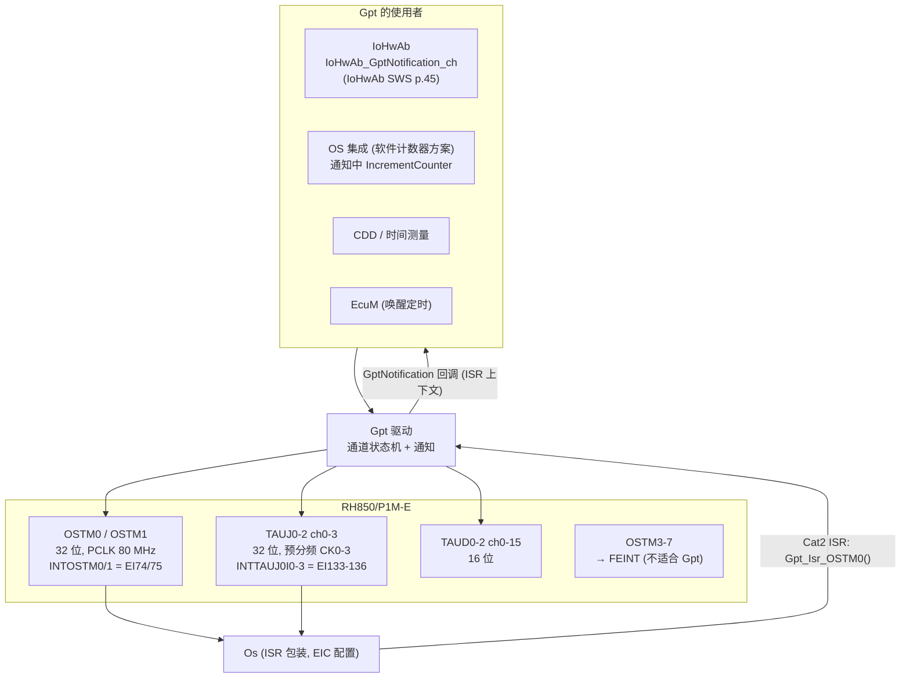
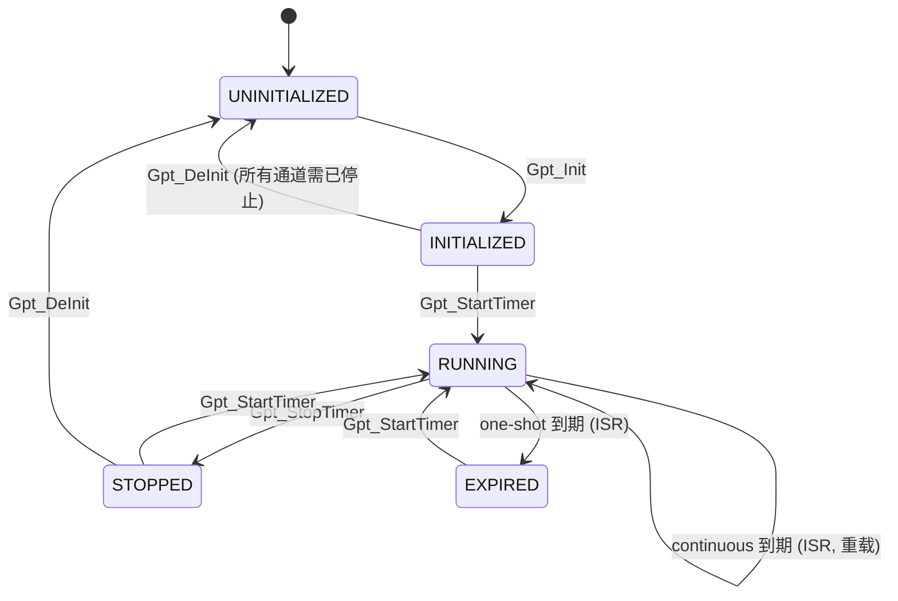
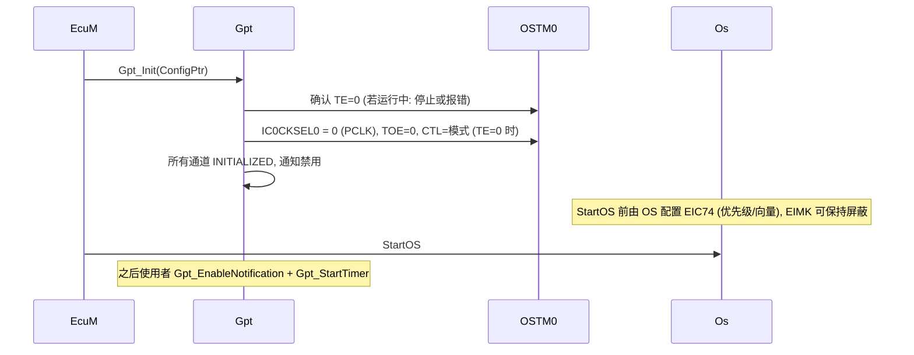
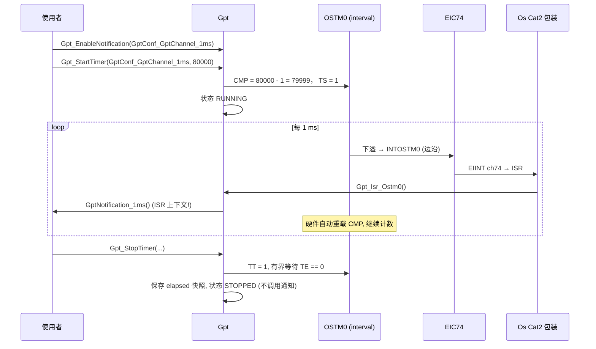

# Gpt 驱动：OSTM / TAUJ 定时器、通知回调与本项目 `Ostm.c` 逐行解读

> Prerequisite: [MCAL 总览](01-mcal-overview.md), [OS、Task 与 ISR](../02-autosar-classic/06-os-task-isr.md)
> Next: [Icu 驱动](06-icu-driver.md)
> 对应规范: **本仓库没有 Gpt Driver SWS**。API、类型、配置参数与错误名为 R4.x 公认形态，需以真实项目所用 Release 的 Gpt SWS 与 Renesas MCAL 手册确认。相关规范：SWS IoHwAb R24-11（p.14：IoHwAb 不抽象 GPT，而是用 GPT 完成自身功能；p.15 `SWS_IoHwAb_00078`；p.45 `IoHwAb_GptNotification<#ch>` SID 0x50）；SWS MCU R24-11（`McuClockReferencePoint` p.49–50）。
> 对应源码: **本项目 `examples/rh850_mcal_reference/mcal/gpt/Ostm.{h,c}`**、`platform/Rh850_Mmio.{h,c}`、`tests/test_reference.c:97-155`、`integration/Tick_Accumulator.{h,c}`；openAUTOSAR `boards/linuxOs/MCAL/Gpt/src/Gpt.c`（STM32 遗留）。
> RH850 依据: HW-E §22 OSTM p.1542–1567（基址 p.1543；时钟与 IC0CKSEL p.1547–1548；中断 p.1544, p.1550；寄存器 p.1551–1556）；§24 TAUJ p.1878 起（TAUJnTPS p.1887、CDRm p.1891、CNTm p.1892、CMORm p.1894、TS p.1899、TT p.1900）；§23 TAUD p.1571 起（Interval Timer p.1641）；Table 6.11 p.283–284。

---

## 1. 本章目标

1. 理解 Gpt 驱动的职责：提供**通用的、按通道配置的定时器服务**——启动一个定时、在到期时调用通知、查询已过/剩余时间——并把它与 **OS 计数器**（同样基于定时器硬件）区分开。
2. 掌握 Gpt API 的语义与状态机：`Gpt_Init`、`Gpt_StartTimer`、`Gpt_StopTimer`、`Gpt_GetTimeElapsed`、`Gpt_GetTimeRemaining`、`Gpt_EnableNotification`/`DisableNotification`、`Gpt_SetMode`/唤醒相关 API。
3. 掌握 RH850/P1M-E 上可用作 Gpt 的硬件：**OSTM0/1**（32 位、EI 74/75）、**TAUJ0–2**（32 位、4 通道/单元）、**TAUD0–2**（16 位、16 通道/单元），以及为什么 **OSTM3–7 不适合**作 Gpt。
4. **逐行读懂** `examples/rh850_mcal_reference/mcal/gpt/Ostm.c`，知道它实现了 Gpt 的哪一层、没有实现哪一层，以及它的主机测试证明了什么。
5. 能把“Gpt 通道 ↔ OSTM 实例 ↔ EIC 通道 ↔ OS ISR ↔ 通知函数”这条链在真实项目中找出来。

---

## 2. 为什么需要 Gpt？OS 不是已经有定时器了吗？

OS 的 Counter/Alarm 提供**以 tick 为粒度**的周期激活（通常 1 ms），适合“每 10 ms 运行一次任务”。但很多需求不适合用 OS alarm：

| 需求 | 为什么不用 OS alarm |
|---|---|
| 100 µs 级的精确定时（例如 ADC 触发、PWM 相关的采样时刻） | OS tick 太粗 |
| 测量一段代码的执行时间、两个事件之间的间隔 | 需要读“当前计数”，而不是“到期回调” |
| 一次性超时（某外设命令 2.5 ms 内必须完成） | 需要任意长度的 one-shot |
| 低功耗唤醒定时 | Gpt 有 wakeup 模式 |
| OS 本身的节拍源 | **软件计数器方案**中，OS 节拍可以由 Gpt 通道的通知 + `IncrementCounter` 驱动 |

所以 Gpt 是一个**通用硬件定时器的标准接口**；OS 计数器则可能使用 Gpt，也可能直接拥有另一个定时器（硬件计数器方案）。两者都要占用定时器硬件，这就是本章 §8.3 讨论的**所有权问题**。

---

## 3. 在系统中的位置



---

## 4. AUTOSAR 如何定义？（[AUTOSAR API]，本仓库无 Gpt SWS）

### 4.1 API（R4.x 公认形态）

| API | 签名（公认） | 谁调用 / 何时 | 同步性 |
|---|---|---|---|
| `Gpt_Init` | `void Gpt_Init(const Gpt_ConfigType* ConfigPtr)` | EcuM，DriverInitOne | Sync |
| `Gpt_DeInit` | `void Gpt_DeInit(void)` | EcuM（关机/低功耗） | Sync |
| `Gpt_StartTimer` | `void Gpt_StartTimer(Gpt_ChannelType Channel, Gpt_ValueType Value)` | 使用者，运行时 | Sync（启动后立即返回，到期异步通知） |
| `Gpt_StopTimer` | `void Gpt_StopTimer(Gpt_ChannelType Channel)` | 使用者 | Sync |
| `Gpt_GetTimeElapsed` | `Gpt_ValueType Gpt_GetTimeElapsed(Gpt_ChannelType Channel)` | 使用者 | Sync，可重入 |
| `Gpt_GetTimeRemaining` | `Gpt_ValueType Gpt_GetTimeRemaining(Gpt_ChannelType Channel)` | 使用者 | Sync，可重入 |
| `Gpt_EnableNotification` / `Gpt_DisableNotification` | `void (Gpt_ChannelType Channel)` | 使用者 | Sync |
| `Gpt_SetMode` | `void Gpt_SetMode(Gpt_ModeType Mode)` | EcuM | `GPT_MODE_NORMAL` / `GPT_MODE_SLEEP` |
| `Gpt_EnableWakeup` / `Gpt_DisableWakeup` / `Gpt_CheckWakeup` | — | EcuM | 唤醒相关 |
| `Gpt_GetPredefTimerValue` | `Std_ReturnType (Gpt_PredefTimerType, uint32*)` | 较新 Release 的“预定义自由运行定时器” | 是否存在需确认 |
| 通知 | `void Gpt_Notification_<Channel>(void)`（函数名在配置中给出） | **Gpt 在 ISR 中调用** | — |

`Gpt_ValueType` 的单位是**该通道的 tick**（由 `GptChannelTickFrequency` 决定），不是微秒。

### 4.2 通道状态机（公认）



关键语义（R4.x 公认，需以 SWS 确认）：

- **RUNNING 时再次 `Gpt_StartTimer` → DET `GPT_E_BUSY`**，不会重启。
- **`Gpt_GetTimeElapsed` 在 STOPPED 状态返回停止那一刻的已过时间**；EXPIRED（one-shot）返回目标值。
- **`Gpt_StopTimer` 不得调用通知**。
- **通知在 `Gpt_EnableNotification` 之前不会被调用**；Init 后默认禁用。
- Continuous 模式下每次到期都通知；one-shot 到期一次后进入 EXPIRED 并停止硬件。

### 4.3 错误（公认名称）

`GPT_E_UNINIT`、`GPT_E_ALREADY_INITIALIZED`、`GPT_E_BUSY`、`GPT_E_MODE`、`GPT_E_PARAM_CHANNEL`、`GPT_E_PARAM_VALUE`（Value 为 0 或超过 `GptChannelTickValueMax`）、`GPT_E_PARAM_POINTER`、`GPT_E_PARAM_MODE`、`GPT_E_INIT_FAILED`、`GPT_E_PARAM_PREDEF_TIMER`。具体值以 SWS 为准。

### 4.4 配置（公认）

```text
Gpt
├── GptDriverConfiguration: GptDevErrorDetect, GptReportWakeupSource, GptPredefTimer* ...
├── GptConfigurationOfOptApiServices: GptDeinitApi, GptEnableDisableNotificationApi,
│                                     GptTimeElapsedApi, GptTimeRemainingApi, GptWakeupFunctionalityApi ...
├── GptClockReferencePoint [1..*]  → GptClockReference → McuClockReferencePoint   (时钟链)
└── GptChannelConfigSet
      └── GptChannelConfiguration [1..*]
            GptChannelId, GptChannelMode (GPT_CH_MODE_CONTINUOUS / ONESHOT),
            GptChannelTickFrequency, GptChannelTickValueMax,
            GptEnableWakeup, GptNotification (函数名), GptChannelClkSrcRef
            + 供应商扩展: 硬件实例 (OSTM0/TAUJ0 ch2 ...), 预分频, 中断优先级参考 ...
```

`GptChannelClkSrcRef → GptClockReferencePoint → McuClockReferencePoint` 是又一条“MCU 时钟 → 外设参数”的配置链（与 CAN 的 `CanCpuClockRef` 同理，见 [配置与 ARXML §7](../02-autosar-classic/04-configuration-arxml.md)）。在 P1M-E 上，OSTM 与 TAUJ/TAUD 都由 PCLK = CLK_HSB = 80 MHz 驱动（HW-E p.1543, p.1572, p.1879），所以引用的参考点频率必须是 80 MHz。

---

## 5. 核心数据结构

### 5.1 RH850/P1M-E OSTM 寄存器（HW-E p.1543, p.1551–1556）

| 寄存器 | 偏移 | 宽度 | 作用 |
|---|---|---|---|
| `OSTMnCMP` | +00H | 32 | interval 模式：**下计数的起始值**；free-run 模式：**比较值**（p.1552） |
| `OSTMnCNT` | +04H | 32（RO） | 当前计数 |
| `OSTMnTO` | +08H | 8 | 定时器输出电平（仅 OSTM0/1 有输出） |
| `OSTMnTOE` | +0CH | 8 | 输出模式使能 |
| `OSTMnTE` | +10H | 8（RO） | 计数使能状态：1 = 运行（p.1554） |
| `OSTMnTS` | +14H | 8（WO） | 写 1 启动 |
| `OSTMnTT` | +18H | 8（WO） | 写 1 停止 |
| `OSTMnCTL` | +20H | 8 | `MD1`：0 = interval（下计数），1 = free-run compare（上计数）；`MD0`：计数开始时是否产生中断；**只有 TE=0 时才能写**（p.1556） |
| `IC0CKSEL0/1` | `FFDD_6000` / `FFDD_6004` | 16 | OSTM0/1 计数时钟使能信号选择：PCLK，或由 TAUD0/1、TAUJ0/1 的 40 个通道之一提供（p.1547–1548） |

基址：OSTM0 `FFDD_8000`、OSTM1 `FFDD_9000`；OSTM3–7 从 `FFD7_0000` 起按 `+40H` 递增（p.1543）。**没有 OSTM2**（p.1542）。

计数行为（p.1550, p.1553）：

| 模式 | 方向 | 开始时 CNT 装载 | 中断 | 周期 |
|---|---|---|---|---|
| Interval（MD1=0） | 下 | CMP | 下溢时 INTOSTMn，并重载 CMP | **(CMP + 1) / f** |
| Free-run compare（MD1=1） | 上 | 0000_0000H | CNT == CMP 时 INTOSTMn，继续计数 | 32 位回绕 2^32 / f（80 MHz 下 53.687 s） |

### 5.2 Gpt 驱动的运行时状态（[Conceptual]）

| 状态 | 每通道 | 用途 |
|---|---|---|
| 通道状态 | INITIALIZED/RUNNING/STOPPED/EXPIRED | 状态机 |
| 目标值 | Value | 计算 elapsed/remaining |
| 停止时快照 | elapsed@stop | 满足“停止后仍返回停止时的已过时间” |
| 通知使能 | bool | Enable/DisableNotification |

---

## 6. 初始化流程



谁、何时、为什么：

- **EcuM 在 DriverInitOne 中调用 `Gpt_Init`**（openAUTOSAR `EcuM_Callout_Stubs.c:219`）。在 OS 启动之前，因为 OS 的软件计数器方案可能依赖它。
- Gpt_Init **不启动任何通道**、**不使能通知**——启动是使用者的显式决定。
- **EIC 由 OS 配置**，Gpt 驱动不设置中断优先级（与 CAN SWS p.33 的原则一致）。

---

## 7. Runtime Flow

### 7.1 Continuous 通道：每 1 ms 通知一次



逐跳说明：

1. **`Gpt_StartTimer(ch, 80000)`**：tick 频率 80 MHz 时 80000 tick = 1 ms。interval 模式周期 = (CMP+1)/f，所以 CMP = 79999（`01-project-and-docs-review.md` F-OSTM-3；本项目 `Ostm_IntervalCompare(80000000, 1000, &cmp)` 得 79999，`tests/test_reference.c:149`）。
2. **TS = 1**：启动，TE 变 1；interval 模式下 CNT 装载 CMP 开始下计数（p.1553）。
3. **INTOSTM0**：EI 通道 74，表偏移 +128H，EIC 地址 `FFFF_B094`（HW-E p.283）；OSTM 行在 Table 6.11 中**不是**电平检测，即同步边沿型——外设无需软件清标志（与 CAN 的电平中断不同，见 [OS 章节 §7.1](../02-autosar-classic/06-os-task-isr.md)）。
4. **通知在 ISR 上下文执行**：通知函数必须短，不能阻塞；若要激活任务应使用 `ActivateTask`/`SetEvent`（Gpt ISR 应为 Cat2）。IoHwAb 的 `IoHwAb_GptNotification<#ch>` 正是这样的通知（IoHwAb SWS p.45）。
5. **`Gpt_StopTimer`**：写 TT，等待 TE=0（有界），保存快照，不调用通知。

### 7.2 One-shot 通道：超时监控

```text
Gpt_StartTimer(ch, 200000)        ; 2.5 ms @ 80 MHz
  ... 2.5 ms 后 ISR:
Gpt_Isr: 写 TT 停止硬件 → 状态 EXPIRED → (若使能) 调用通知
```

用 OSTM interval 模式实现 one-shot 时，**必须在 ISR 中立即停止**，否则硬件会自动重载并在下一个周期再次中断（`docs/mcal-reference-guide.md` R4：“单次模式可在首个有效事件后停止并改变逻辑状态，避免重复通知”）。另一种做法是 free-run compare 模式只设一次比较值。

### 7.3 `Gpt_GetTimeElapsed` / `Gpt_GetTimeRemaining` 在 OSTM 上的计算

| 模式 | Elapsed | Remaining |
|---|---|---|
| Interval（下计数，从 CMP 开始） | `CMP − CNT` | `CNT`（约等于，差 1 个 tick 的边界由实现定义） |
| Free-run compare（上计数，从启动时的 CNT0 开始，目标 CMP） | `CNT − CNT0`（无符号回绕减法） | `CMP − CNT`（无符号） |
| STOPPED | 停止时快照 | 目标 − 快照 |
| EXPIRED | 目标值 | 0 |

注意 STOPPED 的快照：本项目 `Ostm.h:18-19` 明确写“Stopping resets the time origin on the next free-running start”——硬件停表后再启动，free-run 计数从 0 重新开始。如果驱动在停止后直接读 CNT 来回答 elapsed，第一次读可能还对，但重新启动后就错了。`docs/mcal-reference-guide.md` R4：“Stop 的 elapsed/remaining 行为应按所选 Gpt API 定义，不能用重启硬件后的零计数回报之前运行时间”。

---

## 8. RH850 Hardware Mapping

### 8.1 哪些定时器可以做 Gpt 通道

| 硬件 | 位宽 | 时钟 | 中断 | 适合 | 依据 |
|---|---|---|---|---|---|
| OSTM0 / OSTM1 | 32 | PCLK 80 MHz（或经 IC0CKSEL 选 TAUD/TAUJ 计数使能） | EI74 / EI75（边沿） | 长周期、高分辨率；OS 节拍候选 | HW-E p.1543–1548, p.283 |
| OSTM3–7 | 32 | 仅 PCLK | **FEINT**（不是 EI 通道） | **不适合 Gpt 通知**；用于 timing protection 监视 | HW-E p.1544–1545, p.1548 |
| TAUJ0–2 ch0–3 | 32 | PCLK 经预分频 CK0–CK3 | INTTAUJ0I0–3 = EI133–136（TAUJ0） | 多通道 32 位定时 | HW-E p.1878–1879, p.284 |
| TAUD0–2 ch0–15 | 16 | PCLK 经预分频 CK0–CK3（`TAUDnTPS`，PCLK/2^0 … /2^15） | INTTAUD0I0–15 = EI141–156（TAUD0） | 短周期、PWM/ICU 共用 | HW-E p.1571–1572, p.1582, p.285 |

TAUJ/TAUD 用作 Gpt 时涉及的寄存器（名称已在 HW-E 目录中核实；位定义需按章节逐项确认）：`TAUJnTPS`（预分频，p.1887）、`TAUJnCDRm`（数据/比较，p.1891）、`TAUJnCNTm`（计数，p.1892）、`TAUJnCMORm`（通道模式，p.1894）、`TAUJnCMURm`（p.1897）、`TAUJnTS`/`TAUJnTT`（启停，p.1899–1900）；TAUD 对应寄存器在 §23.3（p.1582–1594），interval timer 功能在 §23.12.1（p.1641）。**预分频寄存器（TPS）是一个单元内所有通道共享的**，只能在使用该时钟的所有通道停止时改写（p.1582）——这是 Gpt、Icu、Pwm 共用一个 TAU 单元时的另一个“产权”冲突点。

### 8.2 IC0CKSEL：OSTM 与 TAU 的耦合

OSTM0/1 的计数时钟使能可以选 PCLK，也可以选 TAUD0/1 或 TAUJ0/1 的 40 个通道之一（p.1547–1548）。规则：只能在 OSTMn 停止（TE=0）时选择；选完 TAU 源后置 `IC0TMENn=1`；**TAU 源被 OSTM 使用期间，不得改变该 TAUD/TAUJ 的运行**（p.1548）。OSTM3–7 没有 IC0CKSEL，只能用 PCLK。

这意味着：如果某个项目把 OSTM0 的时钟链到 TAUJ0 的某个通道上（例如为了得到 20 MHz 或更低的计数频率——`docs/mcal-reference-guide.md` R4 提到“20 MHz 用 19999”），那么 TAUJ0 的那个通道与预分频器就同时被 Gpt/OS 和 TAUJ 的使用者依赖。**`IC0CKSEL` 应归谁初始化（Gpt？OS 集成？Mcu？）需要在项目中明确**（见 [MCAL 总览 §8.1](01-mcal-overview.md)）。

### 8.3 OSTM0/OSTM1 的所有权

> **这是配置选择，不是硬件事实。**

本仓库不同文档的说法不一：`docs/counter-design.md` 依据截图工程认为“OSTM0 已由 Gpt 占用，OSTM1 为 OS 硬件计数器候选”；旧版教程曾写“本案例可为 OS 独占 OSTM0”；`examples/rh850_mcal_reference/README.md` 写“截图说 Gpt 已用 OSTM0，但 OSTM1 是否空闲仍未知。参考示例没有默认抢占任何通道”。

硬件只约束：

1. 一个 OSTM 实例（及其 EIC 通道、IC0CKSEL）**只能有一个软件所有者**；
2. OSTM3–7 只能接 FEINT；
3. 修改 CTL 必须先停止。

真实项目中，打开 Gpt 配置（每个通道绑定的硬件实例）与 OS 配置（计数器的驱动方式与硬件），确认没有重叠。

---

## 9. openAUTOSAR 实现：R3.x Gpt（STM32）

文件：`boards/linuxOs/MCAL/Gpt/src/Gpt.c`（`#include "stm32f10x.h"`，:27；`TIM_TypeDef` 数组 :74）。

| 函数 | 行 | 观察 |
|---|---|---|
| `Gpt_IsrCh` | :164-185 | one-shot 时关闭定时器、状态 STOPPED（R4 中应为 EXPIRED）；**无条件**调用 `config->GptNotification()`（:181）——没有检查通知是否使能、指针是否为 NULL；最后清中断标志（:184） |
| `Gpt_Isr` | :194-208 | 一个 ISR 服务所有通道：用 **`static int i`**（:196）遍历查找哪个通道触发——`static` 局部变量使 ISR 不可重入（若该 ISR 可嵌套则出错） |
| `Gpt_Init` | :211-267 | `GPT_E_ALREADY_INITIALIZED` 检查（:215）；只支持 post-build 变体（`GPT_VARIANT_PC` 时 `assert(0)`，:218-220）；建立 channelMap（:224-237）；**有通知的通道在 Init 时用 `ISR_INSTALL_ISR2` 安装 Cat2 ISR**（:243-250，优先级硬编码 6） |
| `Gpt_StartTimer` | :289-331 | UNINIT/PARAM_CHANNEL/BUSY 检查（:293-295）；注释 “GPT_E_PARAM_VALUE, all have 32-bit so no need to check”（:296）；写 ARR/CNT、清 UIF、设预分频、使能计数（:304-321）；**若配置了通知就自动 `Gpt_EnableNotification`**（:323-329，注释 GPT275） |
| 其它 | :333（Stop）、:352（Remaining）、:371（Elapsed）、:394/:407（Enable/DisableNotification）、:425（SetMode）、:449/:465（Wakeup） | — |

可讨论的设计点：

1. **ISR 安装位置**：Arctic 在 `Gpt_Init` 中动态安装 ISR；R4.x + 静态 OS 配置中，ISR 与通道的绑定是 OS 配置的一部分（生成向量表），驱动只提供 ISR 函数。
2. **通知自动使能**：StartTimer 时自动 Enable（:323-329）与 R4.x 公认的“Init 后通知禁用、由使用者显式使能”不同——这是 R3.x 与 R4.x 的语义差异之一（需以对应 SWS 确认）。
3. **ISR 中先通知后清标志**（:181 → :184）：若通知很长，同一定时器的下一次到期可能在清标志前到来并被清掉——丢一次中断。更稳妥的顺序是“先清标志，再通知”。

---

## 10. 当前教学项目实现：`Ostm.c` 逐行解读

### 10.1 定位

`examples/rh850_mcal_reference/mcal/gpt/Ostm.h:6-8`：

```c
/* [Educational Implementation] [RH850 Hardware] P1M-E manual R01UH0585EJ0120, pp.1543,1551-1567.
 * Only OSTM0/1: OSTM3..7 use FEINT and need a different integration.
 * These are reference low-level APIs, not AUTOSAR Gpt APIs or RTA callbacks. */
```

它是 **Gpt 驱动（或 OS 计数器集成）的最底层寄存器操作**，不是 Gpt API。对应关系：

| Gpt 层（未实现） | `Ostm.c`（已实现） |
|---|---|
| `Gpt_Init`：通道表、状态、ISR 函数 | `Ostm_InitPclk`（单个实例的停止态配置） |
| `Gpt_StartTimer(ch, Value)` | `Ostm_SetCompare` + `Ostm_Start`（以及 `Ostm_IntervalCompare` 换算） |
| `Gpt_StopTimer` | `Ostm_Stop`（有界等待） |
| `Gpt_GetTimeElapsed/Remaining` | `Ostm_ReadCounter`（原始值；换算与快照在上层） |
| 通知、EIC、ISR | **未实现**（README：“完整 Gpt API、通知、EIC/ISR … 尚未覆盖”） |

### 10.2 头文件契约（`Ostm.h:9-25`）

```c
typedef enum { OSTM_OK, OSTM_INVALID, OSTM_BUSY, OSTM_TIMEOUT } Ostm_Result;   /* [Educational Implementation] [RH850 Hardware] :9 */
typedef enum { OSTM_INTERVAL = 0, OSTM_FREE_RUNNING = 2 } Ostm_Mode;            /* :10 */
```

- `OSTM_FREE_RUNNING = 2`：直接就是写入 `CTL` 的值——bit1 = `MD1` = 1（free-run compare），bit0 = `MD0` = 0（启动时不产生中断）。`OSTM_INTERVAL = 0`：MD1=0、MD0=0。
- 四种结果：`OSTM_BUSY`（硬件正在运行，拒绝配置）、`OSTM_TIMEOUT`（停止等待超时）是**运行时结果**，不是编程错误；`OSTM_INVALID` 对应 AUTOSAR 的 DET 类参数错误。

`Ostm.h:12-14` 的注释是整个文件的**集成契约**：

```c
/* [Educational Implementation] [RH850 Hardware] Caller owns channel, masks its interrupt, keeps TSST low, and serializes
 * all operations. Requires stopped timer. Selects PCLK (80 MHz per manual),
 * disables timer output and interrupt-at-start. Does not touch EIC/OS. */
```

逐条：调用者拥有通道（所有权在集成层）；调用者屏蔽中断（EIC 归 OS）；保持 `TSST`（外部计数启动信号，p.1545 “synchronized … by the count start signal (OSTMnTSST)”）为低，避免外部触发；调用者串行化所有操作（驱动本身没有临界区）。

### 10.3 `Ostm.c` 逐行

```c
/* [Educational Implementation] [RH850 Hardware] examples/rh850_mcal_reference/mcal/gpt/Ostm.c */
static const uintptr_t base[2] = {UINT32_C(0xFFDD8000), UINT32_C(0xFFDD9000)};          /* :4 */
static const uintptr_t clock_select[2] = {UINT32_C(0xFFDD6000), UINT32_C(0xFFDD6004)};  /* :5 */
enum { CMP = 0x00, CNT = 0x04, TOE = 0x0C, TE = 0x10,
       TS = 0x14, TT = 0x18, CTL = 0x20 };                                              /* :6-7 */
```

- `:4`：OSTM0 `FFDD_8000`、OSTM1 `FFDD_9000`（HW-E p.1543）。只支持两个实例——数组大小 2 本身就是“OSTM3–7 不支持”的实现。
- `:5`：`IC0CKSEL0/1` 地址（p.1551）。
- `:6-7`：寄存器偏移（p.1551）。没有 `TO`（+08H），因为本代码不使用定时器输出。

```c
static bool valid(const Rh850_Mmio *io, uint8_t unit)                     /* [Educational Implementation] [RH850 Hardware] :9-14 */
{
    return unit < 2U && io != NULL && io->read8 != NULL &&
           io->read32 != NULL && io->write8 != NULL &&
           io->write16 != NULL && io->write32 != NULL;
}
```

- 参数检查集中在一处：实例号与 MMIO 表的每个函数指针。等价于 AUTOSAR 的 `*_E_PARAM_CHANNEL` / `*_E_PARAM_POINTER` 类检查，但这里**总是启用**（不随 DET 开关）。

```c
Ostm_Result Ostm_InitPclk(const Rh850_Mmio *io, uint8_t unit,  /* [Educational Implementation] [RH850 Hardware] */
                         Ostm_Mode mode, uint32_t compare)                /* :16-17 */
{
    if (!valid(io, unit) || (mode != OSTM_INTERVAL && mode != OSTM_FREE_RUNNING))
        return OSTM_INVALID;                                              /* :19-20 */
    if ((io->read8(io->context, base[unit] + TE) & 1U) != 0U)
        return OSTM_BUSY;                                                 /* :21-22 */
    /* IC0TMEN=0 selects PCLK. Reserved fields are written with reset values.
     * Never use a 32-bit write to this 16-bit clock register. */
    io->write16(io->context, clock_select[unit], 0U);                     /* :25 */
    io->write8(io->context, base[unit] + TOE, 0U);                        /* :26 */
    io->write32(io->context, base[unit] + CMP, compare);                  /* :27 */
    io->write8(io->context, base[unit] + CTL, (uint8_t)mode);             /* :28 */
    return OSTM_OK;
}
```

| 行 | 做什么 | 硬件依据 / 设计理由 |
|---|---|---|
| :19-20 | 拒绝非法实例、空指针、非法模式 | 参数错误 → `OSTM_INVALID` |
| :21-22 | **先读 TE（8 位），运行中则拒绝** | CTL 只能在 TE=0 时写（p.1556）；IC0CKSEL 只能在 TE=0 时选（p.1548）。**以硬件状态为准**，而不是软件标志 |
| :25 | `IC0CKSELn = 0`（**16 位写**） | `IC0TMENn=0` → 计数时钟 = PCLK；注释强调不能用 32 位写这个 16 位寄存器 |
| :26 | `TOE = 0` | 关闭定时器输出（本代码不驱动 OSTMnO 引脚） |
| :27 | 写 `CMP`（32 位） | interval：起始值；free-run：比较值（p.1552） |
| :28 | 写 `CTL`（8 位）= 模式 | MD1 选模式，MD0=0 不在启动时产生中断 |

为什么**先写 IC0CKSEL/TOE/CMP、最后写 CTL**？CTL 决定计数方向和启动行为；把它放在最后，意味着之前的写都是在“模式尚未确定”的状态下进行，任何时候被打断都不会让定时器以错误组合运行（它此刻本来就停止着）。主机测试验证了这个**顺序与宽度**（`tests/test_reference.c:97-125` 的 `test_ostm_sequence_and_ownership`）。

```c
Ostm_Result Ostm_Start(const Rh850_Mmio *io, uint8_t unit)                /* [Educational Implementation] [RH850 Hardware] :32-39 */
{
    if (!valid(io, unit)) return OSTM_INVALID;
    if ((io->read8(io->context, base[unit] + TE) & 1U) != 0U)
        return OSTM_BUSY;                                                 /* :35-36 */
    io->write8(io->context, base[unit] + TS, 1U);                         /* :37 */
    return OSTM_OK;
}
```

- `:35-36`：运行中再次 Start → `OSTM_BUSY`。这正是 Gpt 的“RUNNING 时 `Gpt_StartTimer` → `GPT_E_BUSY`”语义在寄存器层的体现。测试：`tests/test_reference.c:111` `CHECK(Ostm_Start(&io, 1U) == OSTM_BUSY);`，以及运行中 `Ostm_InitPclk` 返回 BUSY（:112）。
- `:37`：写 `TS=1`（8 位）。

```c
Ostm_Result Ostm_Stop(const Rh850_Mmio *io, uint8_t unit, uint32_t poll_limit)   /* [Educational Implementation] [RH850 Hardware] :41 */
{
    uint32_t i;
    if (!valid(io, unit) || poll_limit == 0U) return OSTM_INVALID;        /* :44 */
    io->write8(io->context, base[unit] + TT, 1U);                         /* :45 */
    for (i = 0U; i < poll_limit; ++i) {                                   /* :46-49 */
        if ((io->read8(io->context, base[unit] + TE) & 1U) == 0U)
            return OSTM_OK;
    }
    return OSTM_TIMEOUT;                                                  /* :50 */
}
```

- **有界等待**：`poll_limit` 由调用者给出，`0` 被视为非法（:44）——没有“无限等待”这个选项。超时返回 `OSTM_TIMEOUT`，由上层决定怎么办。测试：`tests/test_reference.c:142` 用 `poll_limit=3` 且模拟 TE 不清零，期望 `OSTM_TIMEOUT`；`:136` 期望 `poll_limit=0` → `OSTM_INVALID`。
- 这与 MCU SWS `SWS_Mcu_00138`（不等待 PLL）、CAN SWS `SWS_Can_00398`（`CanTimeoutDuration` 有限等待）是同一种设计哲学。

```c
Ostm_Result Ostm_SetCompare(const Rh850_Mmio *io, uint8_t unit, uint32_t compare)  /* [Educational Implementation] [RH850 Hardware] :53 */
{
    if (!valid(io, unit)) return OSTM_INVALID;
    /* Does not clear/force pending IRQs or handle a passed deadline. Those
     * operations belong to the OS integration layer and its critical section. */
    io->write32(io->context, base[unit] + CMP, compare);                  /* :58 */
    return OSTM_OK;
}
```

- 运行中也允许改 CMP（free-run compare 模式下设置“下一个到期点”）。
- 注释（:56-57）指出了**最危险的竞争**：如果新的比较值在写入前就已经被计数器越过，free-run 模式下要等整整一圈（80 MHz 下约 53.7 s）才会再次匹配——到期事件“丢失”。检测与补发属于 OS 集成层（`docs/counter-design.md` §2–3），并需要临界区。测试 `tests/test_reference.c:117-120` 恰好构造了这个场景：计数器已到 901，再把比较值设为 899——断言驱动只写 CMP、定时器仍在运行、计数不被扰动，也就是说**驱动不负责发现“已过期”**，这是有意留给集成层的。

```c
Ostm_Result Ostm_ReadCounter(const Rh850_Mmio *io, uint8_t unit, uint32_t *value)  /* [Educational Implementation] [RH850 Hardware] :62-67 */
{
    if (!valid(io, unit) || value == NULL) return OSTM_INVALID;
    *value = io->read32(io->context, base[unit] + CNT);                   /* :65 */
    return OSTM_OK;
}
```

- 32 位读 CNT。上层用它实现 `Gpt_GetTimeElapsed/Remaining`（§7.3）或硬件计数器的 “Now”。
- 测试（`tests/test_reference.c:121-123`）：Stop 之后再 Start，free-run 计数从 0 重新开始——验证了 `Ostm.h:18-19` 的警告“Stopping resets the time origin on the next free-running start. Do not use this as an OS alarm cancellation implementation.”

```c
bool Ostm_IntervalCompare(uint32_t counter_hz, uint32_t period_us, uint32_t *compare)  /* [Educational Implementation] [RH850 Hardware] :69 */
{
    uint64_t product = (uint64_t)counter_hz * period_us;                   /* :71 */
    uint64_t counts = product / UINT64_C(1000000);                         /* :72 */
    if (compare == NULL || product % UINT64_C(1000000) != 0U ||
        counts == 0U || counts > (UINT64_C(1) << 32)) return false;        /* :73-74 */
    *compare = (uint32_t)(counts - 1U);                                    /* :75 */
    return true;
}
```

| 行 | 作用 |
|---|---|
| :71 | 64 位乘法避免溢出（80 MHz × 大周期会超过 32 位） |
| :72-73 | **拒绝非整除**：`32768 Hz × 1000 µs` 不是整数个 count → false（测试 `:154`）——不悄悄截断 |
| :73-74 | `counts == 0`（周期太短）或 `> 2^32`（超过 32 位计数器）→ false；边界：`2 MHz × 2147483648 µs = 2^32 counts` → `cmp = UINT32_MAX` 允许（测试 `:152`），再多 1 µs 拒绝（`:153`） |
| :75 | `CMP = counts − 1`——因为 interval 周期 = (CMP+1)/f |

测试覆盖：`80 MHz, 1000 µs → 79999`（`:149`）；`20 MHz, 1000 µs → 19999`（`:150`）；`1 MHz, 1 µs → 0`（`:151`）。注释说明 “This helper does not establish the actual clock source”（`Ostm.h:24`）——counter_hz 必须是调用者确认过的真实频率（例如来自 `McuClockReferencePoint`）。

### 10.4 主机测试证明了什么、没证明什么

`tests/test_reference.c` 用一个假的 MMIO 总线记录每次访问的地址、宽度、值，从而能断言：

| 证明了 | 测试位置 |
|---|---|
| 初始化写入的**顺序**与**宽度**（IC0CKSEL 16 位、TOE/CTL 8 位、CMP 32 位） | `:97-108` |
| 运行中拒绝 Start / Init（`OSTM_BUSY`） | `:111-112` |
| 忙时调用不产生任何额外写（“Busy calls must not disturb existing timer”） | `:113` |
| OSTM0 与 OSTM1 的访问互不干扰（通道隔离：全程操作 OSTM1 后 OSTM0 未被启用、CMP 未被写） | `:124` |
| 停止有界、超时可观测 | `:136, :142` |
| 周期换算边界 | `:149-154` |

| **没有**证明 | 原因 |
|---|---|
| 真实硬件时序（TS→TE 的延迟、TT→TE 的延迟） | 假总线 |
| 中断、EIC、ISR、通知 | 未实现 |
| GHS 编译器生成的访问宽度（volatile 访问是否真的是 8/16/32 位） | 主机 GCC |
| 并发（ISR 与任务同时调用） | 调用者串行化是契约前提 |

---

## 11. Code Walkthrough：在 `Ostm.c` 之上搭一个最小 Gpt（[Educational Implementation]）

```c
/* [Educational Implementation] 基于 Ostm.c 的最小 Gpt 通道层——教学示意, 未实现全部 Gpt 语义 */
typedef enum { GPT_ST_INIT, GPT_ST_RUNNING, GPT_ST_STOPPED, GPT_ST_EXPIRED } Gpt_StateType;
typedef struct {
    uint8 Unit;                       /* 0 = OSTM0, 1 = OSTM1 (所有权由配置保证) */
    boolean OneShot;
    void (*Notification)(void);
} Gpt_ChCfgType;

static Gpt_StateType St[GPT_NUM_CH];
static uint32 Target[GPT_NUM_CH], ElapsedAtStop[GPT_NUM_CH];
static boolean NotifOn[GPT_NUM_CH];

void Gpt_StartTimer(Gpt_ChannelType ch, Gpt_ValueType value)
{
    if (St[ch] == GPT_ST_RUNNING) { /* DET GPT_E_BUSY */ return; }
    if (value == 0u)              { /* DET GPT_E_PARAM_VALUE */ return; }
    (void)Ostm_InitPclk(&Rh850_NativeMmio, Cfg[ch].Unit, OSTM_INTERVAL, value - 1u); /* CMP = N-1 */
    Target[ch] = value;
    St[ch] = GPT_ST_RUNNING;
    (void)Ostm_Start(&Rh850_NativeMmio, Cfg[ch].Unit);
}

void Gpt_StopTimer(Gpt_ChannelType ch)
{
    uint32 cnt;
    if (St[ch] != GPT_ST_RUNNING) { return; }
    (void)Ostm_ReadCounter(&Rh850_NativeMmio, Cfg[ch].Unit, &cnt);
    ElapsedAtStop[ch] = (Target[ch] - 1u) - cnt;          /* interval: CMP - CNT, 先快照 */
    (void)Ostm_Stop(&Rh850_NativeMmio, Cfg[ch].Unit, GPT_STOP_POLL_LIMIT);
    St[ch] = GPT_ST_STOPPED;                              /* 不调用通知 */
}

/* 由 OS 配置为 Cat2 ISR, 绑定 EI74 (OSTM0) */
void Gpt_Isr_Ostm0(void)
{
    const Gpt_ChannelType ch = GPT_CH_OF_OSTM0;
    if (Cfg[ch].OneShot) {
        (void)Ostm_Stop(&Rh850_NativeMmio, 0u, GPT_STOP_POLL_LIMIT);  /* 避免硬件重载再次中断 */
        St[ch] = GPT_ST_EXPIRED;
    }
    if ((NotifOn[ch] == TRUE) && (Cfg[ch].Notification != NULL_PTR)) {
        Cfg[ch].Notification();                                        /* ISR 上下文 */
    }
}
```

注意：ISR 中调用 `Ostm_Stop` 的有界等待会延长 ISR——真实实现应评估 TT→TE 的硬件延迟，或改用 free-run compare 的 one-shot 方式。

---

## 12. Debug 方法

| 症状 | 检查 |
|---|---|
| 定时器不走 | `TE` 是否为 1；`IC0CKSEL` 是否误选了一个未运行的 TAU 通道作为计数使能（p.1547–1548）；`TSST` 外部启动信号 |
| 周期是期望的 4 倍/一半 | 计数频率假设错误（例如以为 20 MHz 实为 80 MHz）；`McuClockReferencePoint` 配置 |
| 周期多 1 个 tick | CMP 写成了 N 而不是 N−1 |
| 通知从不调用 | EIC74/75 屏蔽或未绑定 ISR；通知未 Enable；用了 OSTM3–7（FEINT，不是 EI） |
| One-shot 通知了两次 | ISR 中没有停止 interval 模式的硬件 |
| Free-run 下偶尔“丢”一次到期 | 写 CMP 时目标已过（`Ostm.c:56-57` 注释的竞争） |
| Gpt 与 OS 节拍互相干扰 | 同一个 OSTM 被两个所有者配置——检查 Gpt 通道表与 OS 计数器配置 |
| `GetTimeElapsed` 在 Stop 后返回 0 | 驱动在 Stop 后重新读 CNT 而不是用快照 |

调试器中直接看 `OSTMnCNT` 是否在变化、`OSTMnTE` 是否为 1、`EIC74` 的 `EIMK`/`EIRF`，可以在一分钟内区分“定时器问题”与“中断问题”。

---

## 13. 常见问题 / 常见错误

1. **把 OSTM3–7 配给 Gpt 并期待 EI 中断**——它们只能 FEINT。
2. **Gpt 与 OS 共用一个 OSTM**。
3. **用停表实现 OS alarm Cancel**（`Ostm.h:18-19`）。
4. **CMP = N 而不是 N−1**。
5. **用截断代替整除检查**，周期累积漂移。
6. **在通知里做重活**（ISR 上下文）。
7. **ISR 中先通知后清标志**（openAUTOSAR `Gpt.c:181→:184`）——对边沿型 OSTM 中断影响小，但对需要软件清标志的 TAU/其它定时器会丢中断。
8. **共享 TAU 预分频器（TPS）被一个模块改写**，影响同单元其它通道（p.1582：只能在相关通道全部停止时改）。

---

## 14. 实验

1. **主机测试**：在仓库根目录运行 `python tools/run_host_tests.py`（需要 PATH 上的 GCC，README 说明），阅读输出，确认 OSTM 两组测试通过；然后故意把 `Ostm.c:25` 的 `write16` 改成 `write32`，观察哪个断言失败（实验后恢复）。
2. **周期表**：用 `Ostm_IntervalCompare` 的规则计算 80 MHz 下 10 µs、100 µs、1 ms、10 ms、1 s 的 CMP；指出哪一个在 16 位 TAUD 上无法直接实现，需要多大的预分频（TAUDnTPS：PCLK/2^k，p.1582）。
3. **Elapsed 实现**：为 free-run compare 模式写 `Gpt_GetTimeElapsed`，要求正确处理 32 位回绕（提示：参考 `integration/Tick_Accumulator.c:35` 的无符号减法）。
4. **所有权表**：假设项目中 Gpt 有 3 个通道（1 ms 周期、2.5 ms one-shot、时间测量 free-run），OS 需要一个硬件计数器，ICU 需要 2 个输入捕获通道。在 OSTM0/1、TAUJ0 ch0–3、TAUD0 ch0–15 中分配资源，并说明 IC0CKSEL 与 TPS 由谁初始化。

---

## 15. 思考题

1. Gpt 的通知在 ISR 上下文执行。如果使用者需要在到期时做较多工作，应该在通知里做什么？（提示：`ActivateTask`/`SetEvent`，[MainFunction 章节](../02-autosar-classic/07-mainfunction-scheduling.md)。）
2. 软件计数器方案（Gpt 1 ms 通知 → `IncrementCounter`）与硬件计数器方案（OSTM free-run + 比较）在 CPU 负载、精度、实现复杂度上各有什么优劣？截图工程中 `Rte_TickCounter` 被要求为 HARDWARE，对选择有什么影响？（参考 `docs/counter-design.md` §1。）
3. `Ostm_InitPclk` 在运行中返回 `OSTM_BUSY` 而不是先停止再配置。为什么“拒绝”比“自动停止”更安全？
4. 为什么 `Ostm_Stop` 的 `poll_limit` 由调用者传入，而不是在驱动内部固定？在 ISR 中与在任务中调用时，合理的上限有什么不同？

---

## 16. 对未来真实项目的意义

1. **导出 Gpt 通道表**：每个通道 → 硬件实例（OSTMx / TAUJx chy / TAUDx chy）→ 模式 → tick 频率 → 通知函数 → 使用者。
2. **核对与 OS 的资源边界**：OS 计数器（尤其 HARDWARE 类型）用哪个定时器；与 Gpt 无重叠；EIC 通道与 ISR 绑定一致。
3. **核对时钟链**：`GptChannelClkSrcRef → McuClockReferencePoint` 是否为 80 MHz；IC0CKSEL 是否把 OSTM 链到了 TAU；TPS 预分频由谁设置。
4. **审查 ISR**：one-shot 停止、通知使能检查、清标志与通知的顺序、ISR 类别（Cat2）。
5. **验证 Stop/Elapsed 语义**：特别是 free-run 模式下停止后再启动的时间原点问题。
6. 本项目的 `Ostm.c` + 主机测试展示了一种在没有目标板时验证“寄存器访问顺序与宽度”的方法——在真实项目中可以用同样思路为集成代码（不是供应商 MCAL）写回归测试。

---

## 17. 本章总结

- Gpt 提供按通道配置的通用定时：Start/Stop、Elapsed/Remaining、continuous/one-shot、通知（ISR 上下文）。本仓库无 Gpt SWS，API 按 R4.x 公认形态讲解。
- P1M-E 可用 OSTM0/1（32 位，EI74/75）、TAUJ（32 位）、TAUD（16 位）；OSTM3–7 只能 FEINT。所有都由 PCLK 80 MHz 驱动；IC0CKSEL 与 TAU 预分频是共享资源。
- OSTM interval 周期 = (CMP+1)/f；CTL 只能在 TE=0 时写；free-run 停表后时间原点归零。
- OSTM0/OSTM1 的归属是配置选择，不是硬件事实；一个实例只能有一个所有者。
- 本项目 `Ostm.c` 是 Gpt 的寄存器层：以硬件 TE 状态为准拒绝忙时配置、正确访问宽度与顺序、有界停止、精确周期换算；主机测试证明了顺序/宽度/边界，未覆盖中断与真实时序。

## 18. 下一章

[06-icu-driver.md](06-icu-driver.md)：Icu 驱动——Gpt 的“反方向”：不是在设定时刻产生事件，而是测量外部事件发生的时刻、间隔和宽度。我们会看到 TAUD 的输入捕获功能和 INTP 外部中断如何映射到 Icu 的四种测量模式。
