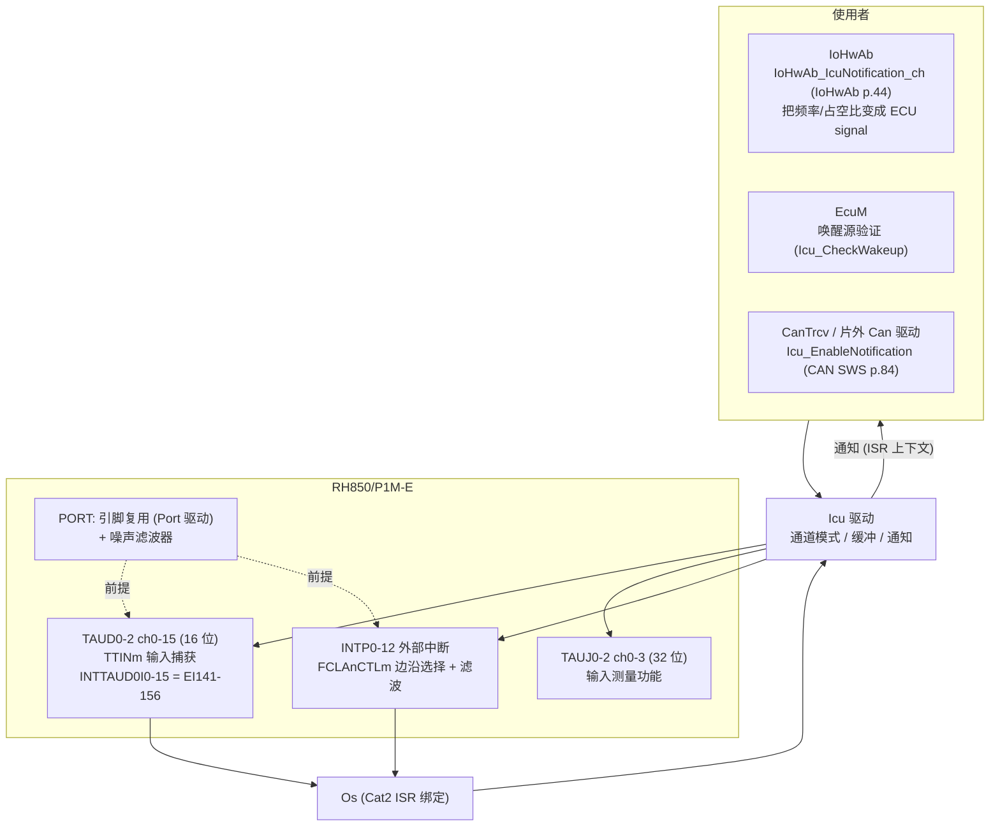
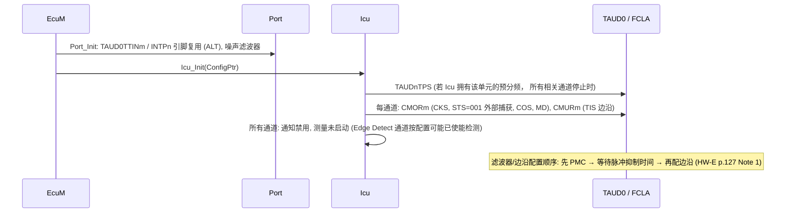
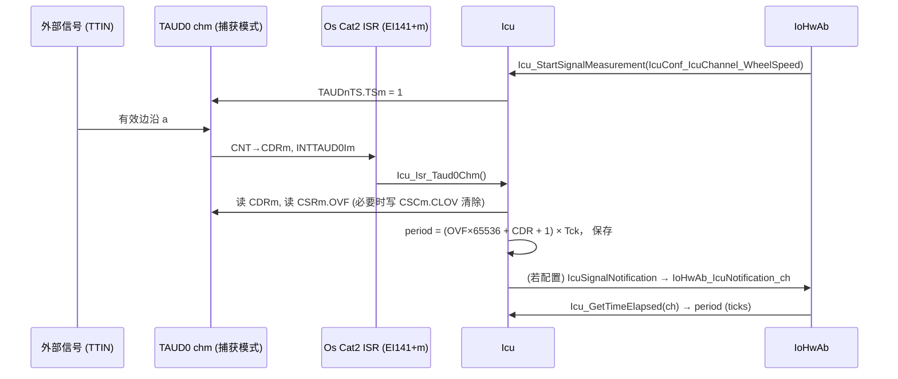
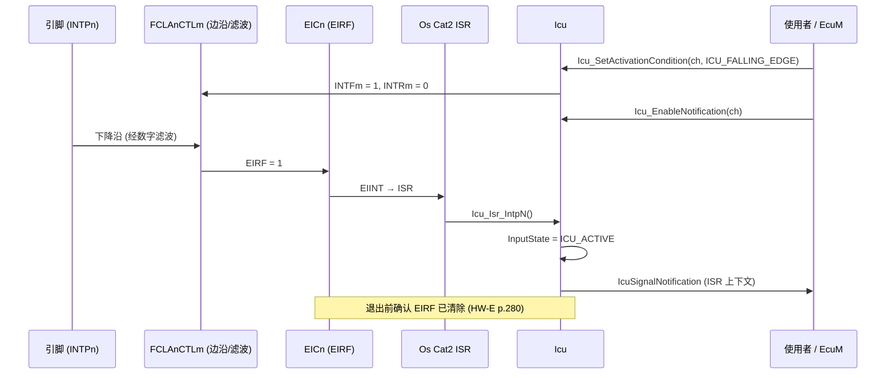

# Icu 驱动：边沿检测、时间戳、信号测量与边沿计数——TAUD 输入捕获与 INTP

> Prerequisite: [Gpt 驱动](05-gpt-driver.md), [Port 驱动](03-port-driver.md)
> Next: [RH850 硬件 ↔ MCAL 映射总表](07-rh850-hardware-mapping.md)
> 对应规范: **本仓库没有 ICU Driver SWS**——本章所有 Icu API、模式、类型、错误名都是 R4.x 公认形态，标注 `[AUTOSAR API]（本仓库无 SWS）`，必须以真实项目所用 Release 的 ICU SWS 与 Renesas MCAL 手册确认。可引用的相关规范：SWS IoHwAb R24-11（p.15 `SWS_IoHwAb_00078`：IoHwAb 接收 ICU 通知；p.44 `IoHwAb_IcuNotification<#ch>`，SID 0x40）；SWS CAN R22-11（`SWS_Can_00445/00446/00447` p.84：片外 CAN 控制器唤醒使用 `Icu_EnableNotification`/`Icu_DisableNotification`）。
> 对应源码: openAUTOSAR **没有 Icu**（`boards/linuxOs/MCAL/` 下无 Icu 目录；`system/EcuM/src/EcuM_Callout_Stubs.c:240-241` 只有 “Setup ICU // TODO”）；本项目无 Icu 实现。
> RH850 依据: HW-E §23 TAUD（p.1571–1574 概述与 Note 2；TAUDnTPS p.1582；CMORm p.1588；CSRm/CSCm p.1592–1593；External Event Count p.1664；Input Pulse Interval Measurement p.1679–1686；Input Signal Width Measurement p.1687–1695；Input Position Detection p.1696；Input Period Count Detection p.1701）；§24 TAUJ（p.1933, p.1939, p.1948, p.1957, p.1962）；INTP 与滤波器（p.75, p.171, p.280）；Table 6.11（TAUD0 中断 EI141–156，p.285）。

---

## 1. 本章目标

1. 理解 Icu（Input Capture Unit）驱动的职责：**测量外部数字信号的时间特征**——边沿何时发生、两个边沿间隔多长、高/低电平多宽、发生了多少次——并在需要时通知上层。
2. 掌握 Icu 的四种测量模式：**Signal Edge Detection、Timestamp、Signal Measurement、Edge Counter**，以及每种模式对应的 API 与运行时行为。
3. 把这些模式映射到 RH850/P1M-E 的硬件：**TAUD/TAUJ 的输入捕获功能**（脉冲间隔测量、信号宽度测量、外部事件计数……）与 **INTP 外部中断**（带数字滤波和边沿选择）。
4. 理解 16 位 TAUD 的**溢出处理**、预分频选择、噪声滤波器要求等硬件约束对 Icu 精度和量程的影响。
5. 知道 Icu 与 Gpt、Pwm、Port、IoHwAb、EcuM（唤醒）的关系。

---

## 2. 为什么需要 Icu？Dio 读引脚不行吗？

Dio 只能回答“现在是高还是低”。很多 ECU 功能需要的是**时间信息**：

| 需求 | 需要的测量 | Icu 模式 |
|---|---|---|
| 轮速传感器 / 曲轴信号的频率 | 相邻同向边沿的间隔（周期） | Signal Measurement（PERIOD_TIME）或 Timestamp |
| PWM 输入的占空比（例如外部模块用 PWM 报告状态） | 高电平时间 + 周期 | Signal Measurement（DUTY_CYCLE / HIGH_TIME） |
| 按键、唤醒线的边沿事件 | 边沿发生时通知 | Signal Edge Detection |
| 记录一串脉冲的精确时刻 | 时间戳序列 | Timestamp |
| 计数器式传感器（脉冲数） | 边沿个数 | Edge Counter |
| 片外 CAN 控制器 / 收发器的唤醒线 | 边沿唤醒 | Edge Detection + Wakeup（CAN SWS `SWS_Can_00445–00447`，p.84） |

用软件轮询 Dio 做这些事，分辨率受轮询周期限制（毫秒级），并且耗 CPU。硬件输入捕获可以在边沿发生的**那个计数时钟周期**锁存计数值（80 MHz 下 12.5 ns 分辨率），软件只需在中断中读取。

---

## 3. 在系统中的位置



---

## 4. AUTOSAR 如何定义？（[AUTOSAR API]，本仓库无 ICU SWS）

### 4.1 四种测量模式（`IcuMeasurementMode`，R4.x 公认）

| 模式 | 硬件做什么 | 软件得到什么 | 关键 API |
|---|---|---|---|
| `ICU_MODE_SIGNAL_EDGE_DETECT` | 检测配置的边沿 | 通知 + 当前输入状态 | `Icu_SetActivationCondition`、`Icu_EnableNotification`、`Icu_GetInputState`、`Icu_EnableEdgeDetection` |
| `ICU_MODE_TIMESTAMP` | 每个边沿捕获计数值 | 时间戳写入**用户提供的缓冲**（线性或环形），每 N 个时间戳通知一次 | `Icu_StartTimestamp(Channel, BufferPtr, BufferSize, NotifyInterval)`、`Icu_StopTimestamp`、`Icu_GetTimestampIndex` |
| `ICU_MODE_SIGNAL_MEASUREMENT` | 捕获边沿间隔 | `HIGH_TIME` / `LOW_TIME` / `PERIOD_TIME` / `DUTY_CYCLE` | `Icu_StartSignalMeasurement`、`Icu_StopSignalMeasurement`、`Icu_GetTimeElapsed`、`Icu_GetDutyCycleValues` |
| `ICU_MODE_EDGE_COUNTER` | 计数边沿 | 边沿个数 | `Icu_EnableEdgeCount`、`Icu_DisableEdgeCount`、`Icu_ResetEdgeCount`、`Icu_GetEdgeNumbers` |

通用 API：`Icu_Init(const Icu_ConfigType*)`、`Icu_DeInit`、`Icu_SetMode(ICU_MODE_NORMAL / ICU_MODE_SLEEP)`、`Icu_EnableWakeup`/`Icu_DisableWakeup`/`Icu_CheckWakeup`、`Icu_SetActivationCondition(Channel, ICU_RISING_EDGE / ICU_FALLING_EDGE / ICU_BOTH_EDGES)`、`Icu_EnableNotification`/`Icu_DisableNotification`、`Icu_GetInputState`（`ICU_ACTIVE` / `ICU_IDLE`）、`Icu_GetVersionInfo`。

### 4.2 关键语义（公认，需以 SWS 确认）

- **模式是配置时确定的**（`IcuMeasurementMode` 按通道配置），运行时只能在配置允许的范围内调整（例如边沿方向）。
- `Icu_GetInputState` 返回 `ICU_ACTIVE` 的含义是“自上次调用以来检测到了配置的激活边沿”，读后复位为 `ICU_IDLE`——它不是“当前引脚电平”。
- Timestamp 的缓冲由**调用者**提供；驱动在 ISR 中写入。线性缓冲满后停止，环形缓冲覆盖。
- `Icu_GetTimeElapsed` / `Icu_GetDutyCycleValues` 返回**最近一次完整测量**的结果；在第一次完整测量前返回 0。
- 通知在 ISR 上下文调用。

开发错误（公认名称）：`ICU_E_PARAM_CONFIG`/`ICU_E_INIT_FAILED`、`ICU_E_PARAM_CHANNEL`、`ICU_E_PARAM_ACTIVATION`、`ICU_E_PARAM_BUFFER_PTR`、`ICU_E_PARAM_BUFFER_SIZE`、`ICU_E_PARAM_MODE`、`ICU_E_UNINIT`、`ICU_E_NOT_STARTED`、`ICU_E_BUSY_OPERATION`、`ICU_E_ALREADY_INITIALIZED`、`ICU_E_PARAM_NOTIFY_INTERVAL`、`ICU_E_PARAM_VINIT`……具体集合与值随 Release 变化。

### 4.3 配置（公认）

```text
Icu
├── IcuGeneral: IcuDevErrorDetect, IcuReportWakeupSource ...
├── IcuOptionalApis: IcuEdgeCountApi, IcuTimestampApi, IcuSignalMeasurementApi, IcuGetDutyCycleValuesApi ...
└── IcuConfigSet
      └── IcuChannel [1..*]
            IcuChannelId, IcuDefaultStartEdge, IcuMeasurementMode,
            IcuWakeupCapability, IcuSignalNotification (函数名),
            IcuSignalMeasurement { IcuSignalMeasurementProperty: HIGH/LOW/PERIOD/DUTY },
            IcuTimestampMeasurement { IcuTimestampMeasurementProperty: CIRCULAR/LINEAR_BUFFER },
            IcuWakeup { IcuChannelWakeupInfo → EcuMWakeupSource }
            + 供应商扩展: 硬件实例 (TAUD0 ch3 / INTP5)、预分频、滤波器、溢出处理 ...
```

---

## 5. 核心数据结构

### 5.1 TAUD 通道（用于 Icu 的部分）

[RH850 Hardware] TAUD0–2：每单元 16 通道、16 位；基址 `FFE2_0000` / `FFE2_1000` / `FFE2_2000`；时钟 CLK_HSB 80 MHz（HW-E p.1571–1572）。

| 寄存器 | 作用（与 Icu 相关） | 出处 |
|---|---|---|
| `TAUDnTPS` | 预分频：CK0–CK3 = PCLK/2^k（k=0..15），**单元内所有通道共享**；只能在使用该时钟的所有通道停止时改写；16 位，复位值 FFFFH | p.1582 |
| `TAUDnCDRm` | 捕获值（输入捕获模式下，边沿到来时 CNT 被传送到这里） | p.1586 |
| `TAUDnCNTm` | 计数器 | p.1586 |
| `TAUDnCMORm` | 通道模式：`CKS[1:0]`（选 CK0–3）、`CCS`、`MAS`、`STS[2:0]`（触发源：`001` = TTINm 有效边沿作为外部捕获触发）、`COS[1:0]`（溢出行为）、`MD[4:1]`/`MD0` | p.1588, p.1682 |
| `TAUDnCMURm` | `TIS[1:0]`：TTINm 有效边沿选择（例如 `00B` = 下降沿） | p.1591, p.1681 |
| `TAUDnCSRm` / `TAUDnCSCm` | 状态（`OVF` 溢出标志）/ 清除（`CLOV`） | p.1592–1593 |
| `TAUDnTS` / `TAUDnTE` / `TAUDnTT` | 启动 / 运行状态 / 停止 | p.1593–1594 |

TAUJ0–2：每单元 4 通道、**32 位**，基址 `FFE5_0000` 起（HW-E p.1878–1879），有类似的输入测量功能（p.1933–1962）——量程大得多，溢出问题小得多。

**噪声滤波器是前提**：HW-E p.1574 Note 2——“Setting of the noise filter for the port is required when the channel input pin is used”（TAUD 的通道输入引脚使用时必须设置端口噪声滤波器，见 §2.6）。

### 5.2 INTP（用于边沿检测/唤醒）

- INTP0–12：外部中断输入，边沿可选上升/下降/双边沿（HW-E p.280）；边沿检测在 `FCLAnCTLm` 中设置：`FCLAnINTRm`（bit0，上升沿）、`FCLAnINTFm`（bit1，下降沿）、`FCLAnBYPSm`（bit7，滤波/旁路控制）；8 位或 1 位访问（p.171）。
- INTPn 的检测结果保留在对应 `EICn.EIRF` 中，直到请求被受理；**写 0 清除**；退出 ISR 前应确认 EIRF 已清除，防止误重入（p.280）。
- 同一个 INTP 功能可分配到多个引脚（例如 INTP0 在 P0_2 和 P2_5），但**同一时间只能在一个引脚上使能**（p.131）。
- RSCAN0RX0/1/2 与 INTP5/INTP6/INTP10 共用滤波器（p.158）——**CAN RX 唤醒检测**可以通过对应的 INTP 实现（这是“CAN 线唤醒”的一种常见硬件做法，是否适用需按板级与收发器确认）。

### 5.3 Icu 驱动的运行时状态（[Conceptual]）

| 每通道状态 | 用途 |
|---|---|
| 当前激活边沿 | `Icu_SetActivationCondition` |
| `InputState`（ACTIVE/IDLE） | `Icu_GetInputState` |
| 通知使能 | — |
| Timestamp：缓冲指针、大小、写索引、通知间隔计数 | ISR 写入 |
| Signal Measurement：最近一次结果（高/低/周期）、上一次捕获值、溢出计数 | 计算 |
| Edge Counter：计数值 | — |

---

## 6. 初始化流程



要点：

- **Icu 依赖 Port**：TTIN 输入引脚与 INTP 引脚的复用、噪声滤波器（p.1574 Note 2），以及“先配 PMC、等待脉冲抑制时间、再配边沿检测”的顺序（HW-E p.127 Note 1，避免配置过程中误触发中断）。
- **预分频器归属**：`TAUDnTPS` 由单元内所有通道共享；若同一个 TAUD 单元同时被 Gpt、Pwm、Icu 使用，必须约定由谁设置、何时设置（[MCAL 总览 §8.1](01-mcal-overview.md)）。
- **EIC 由 OS 配置**。
- 由谁调用：EcuM（openAUTOSAR 的 DriverInitOne 在 Pwm 之前留了 “Setup ICU // TODO”，`EcuM_Callout_Stubs.c:240-241`）。

---

## 7. Runtime Flow

### 7.1 Signal Measurement（PERIOD_TIME）：用 TAUD 输入脉冲间隔测量

TAUD 的 “TAUDnTTINm Input Pulse Interval Measurement” 功能（HW-E p.1679）：

- 启动：`TAUDnTS.TAUDnTSm = 1` → `TE=1`，`CNT` 从 0000H 开始**上计数**；
- 每检测到一个有效 TTIN 边沿：`CNT` 的值被**捕获到 `CDRm`**，产生 `INTTAUDnIm`，`CNT` 复位为 0000H 继续计数；
- 若 `CNT` 到 FFFFH 前没有边沿 → 溢出，`CNT` 归零继续；`CDRm` 与 `CSRm.OVF` 的行为由 `CMORm.COS[1:0]` 决定（Table 23.72）；
- 计算公式（p.1680）：**脉冲间隔 = 计数时钟周期 × [(OVF × (FFFFH + 1)) + CDRm 捕获值 + 1]**；
- **若两次边沿之间溢出多次，`OVF` 只能表示“至少一次”**——无法区分一次还是多次溢出（p.1679）。



**量程与分辨率的权衡**（16 位 TAUD，PCLK 80 MHz，`TAUDnTPS` 选 PCLK/2^k）：

| 预分频 | 计数时钟 | 分辨率 | 不溢出的最大周期（65536 个 tick） |
|---|---|---|---|
| /1（k=0） | 80 MHz | 12.5 ns | 0.82 ms |
| /16（k=4） | 5 MHz | 200 ns | 13.1 ms |
| /256（k=8） | 312.5 kHz | 3.2 µs | 209.7 ms |
| /4096（k=12） | 19.53 kHz | 51.2 µs | 3.36 s |

> 表中数值由 80 MHz 与 2^k 直接计算，仅作数量级参考。

如果需要“既高分辨率又大量程”，选项是：用 32 位 TAUJ；或在 Icu 驱动中**软件累加溢出次数**（在溢出中断或周期性检查中计数）——但要注意 p.1679 指出的“多次溢出不可区分”问题必须由软件额外处理。

### 7.2 Signal Measurement（HIGH_TIME / LOW_TIME）：输入信号宽度测量

TAUD 的 “Input Signal Width Measurement” 功能（p.1687）：在一个有效**起始**边沿开始从 0000H 计数，在有效**停止**边沿把 CNT 捕获到 CDRm 并产生中断，然后保持（CDR+1）等待下一个起始边沿；必须设置为“capture and one-count mode”，`MD0` 应为 0。溢出行为同样由 `COS` 决定（Table 23.77）。

**DUTY_CYCLE** 需要“高电平时间”与“周期”两个量。实现方式（需按 Renesas MCAL 确认）：两个通道配合（一个测周期、一个测宽度，输入同一信号）；或单通道在双边沿交替捕获、由软件计算。TAUD 还有 Input Position Detection（p.1696）、Input Period Count Detection（p.1701）等功能，选择哪个取决于 MCAL 的实现方式。

### 7.3 Edge Counter：外部事件计数

TAUD 的 “External Event Count” 功能（p.1664）：以 TTIN 有效边沿作为计数时钟。Icu 的 `Icu_GetEdgeNumbers` 读计数器即可；16 位计数器的回绕需在 Icu 中处理或限定应用场景。

### 7.4 Edge Detection：INTP



唤醒场景：`Icu_SetMode(ICU_MODE_SLEEP)` 时只保留配置为 wakeup 的通道；边沿到来后 Icu 报告 `EcuM_SetWakeupEvent`（由 `IcuChannelWakeupInfo` 映射到 EcuM 唤醒源），EcuM 再调用 `Icu_CheckWakeup` 验证。CAN SWS 对片外 CAN 控制器的要求：控制器切到 SLEEP 时调用 `Icu_EnableNotification`，切到 STOPPED 时调用 `Icu_DisableNotification`（`SWS_Can_00446/00447`，p.84）——这是 CAN 驱动与 Icu 驱动的唯一标准化交点。

### 7.5 Timestamp

```c
/* [Conceptual] 使用者视角 */
static Icu_ValueType TsBuf[32];
Icu_StartTimestamp(IcuConf_IcuChannel_Crank, TsBuf, 32u, 8u);   /* 每 8 个时间戳通知一次 */
/* ISR 中: TsBuf[idx++] = CDRm (+ 溢出扩展); idx 到 8 的倍数时调用通知; 线性缓冲满则停止 */
Icu_IndexType n = Icu_GetTimestampIndex(IcuConf_IcuChannel_Crank);  /* 下一个写入位置 */
```

TAUD 是 16 位计数器，直接用 CDR 作为时间戳会每 65536 tick 回绕——Icu 实现通常用自由运行通道 + 捕获，并在软件中扩展高位，或使用 32 位 TAUJ。高频信号下每个边沿一次中断的负载可能很高，某些实现会用 DMA（P1M-E 有 DMAC，HW-E p.469 Table 12.3 列于 CLK_HSB 用户），是否支持需看 MCAL。

---

## 8. RH850 Hardware Mapping

### 8.1 Icu 模式 ↔ P1M-E 硬件功能

| Icu 模式 | P1M-E 硬件选项 | 关键寄存器/功能 | 出处 |
|---|---|---|---|
| Signal Edge Detection | INTP0–12（FCLAnCTLm 边沿 + 滤波）；或 TAUD 捕获中断 | `FCLAnINTRm/INTFm`、`EICn.EIRF` | HW-E p.171, p.280 |
| Timestamp | TAUD/TAUJ 捕获（`CDRm`）+ 软件缓冲 | Input Pulse Interval（复位计数）或自由运行 + 捕获 | p.1679 |
| Signal Measurement：PERIOD | TAUD Input Pulse Interval Measurement | `CMORm.STS=001`、`COS`、`CSRm.OVF`；公式 p.1680 | p.1679–1686 |
| Signal Measurement：HIGH/LOW | TAUD Input Signal Width Measurement | capture & one-count mode，`MD0=0` | p.1687–1695 |
| Signal Measurement：DUTY | 两通道组合或双边沿交替（实现相关） | — | 需按 MCAL 确认 |
| Edge Counter | TAUD External Event Count | TTIN 作为计数时钟 | p.1664 |
| 32 位版本 | TAUJ 对应功能 | — | p.1933–1962 |
| 中断 | TAUD0 ch0–15 → EI141–156（表偏移 +234H…+270H）；TAUJ0 ch0–3 → EI133–136 | EIC 由 OS 配置 | p.284–285 |
| 前提 | 引脚复用（Port）、端口噪声滤波器 | §2.6 | p.1574 Note 2, p.127 |

### 8.2 资源冲突提醒

- 一个 TAUD 单元的 16 个通道共享 `TAUDnTPS`（4 个预分频输出 CK0–CK3）。Icu 选择的分频必须与同单元 Gpt/Pwm 的需求兼容。
- TAUD/TAUJ 的通道还可以通过 `IC0CKSEL` 被选作 OSTM0/1 的计数使能源（[Gpt 驱动 §8.2](05-gpt-driver.md)）——被 OSTM 使用期间不得改变该 TAU 的运行（HW-E p.1548）。
- TAUD 的输入还可以经 PIC（Section 29）切换（p.1574 Note 1），这会改变“哪个引脚驱动哪个 TTIN”——读 MCAL 配置时要注意。

---

## 9. openAUTOSAR 实现

openAUTOSAR **没有 Icu 驱动**：`boards/linuxOs/MCAL/` 下只有 Adc、Can（仅头文件）、Dio、Eep、Fls、Gpt、Mcu、Os、Port、Pwm、Spi、Wdg 等目录；`system/EcuM/src/EcuM_Callout_Stubs.c:240-241` 的 DriverInitOne 中只有注释：

```c
	// Setup ICU
	// TODO
```

所以本章没有可追踪的开源实现。可以对照阅读的是同目录 `Gpt.c` 的 ISR 结构（[Gpt 驱动 §9](05-gpt-driver.md)）——Icu 的 ISR 与之相似：识别通道 → 读硬件 → 更新状态 → 条件通知 → 清标志。

---

## 10. 当前教学项目实现

`examples/rh850_mcal_reference/` 没有 Icu。下面是一个**教学用**的 PERIOD 测量 ISR，展示“读捕获 + 处理溢出 + 通知”的形状（寄存器访问宏为示意；`CSRm`/`CSCm` 的位位置需按 HW-E p.1592–1593 确认后才能编码）：

```c
/* [Educational Implementation] TAUD 输入脉冲间隔测量 → Icu PERIOD_TIME 的教学示意
 * 前提: CMORm 已设为捕获模式 (STS=001, COS=00), CMURm.TIS 选边沿, TPS 选好 CK (HW-E p.1682) */
typedef struct {
    uint32 LastPeriodTicks;   /* 最近一次完整测量 */
    boolean Valid;
    boolean NotifOn;
    void (*Notification)(void);
} Icu_PeriodState;

static Icu_PeriodState IcuSt[ICU_NUM_CH];

void Icu_Isr_Taud0Ch3(void)                         /* OS: Cat2, 绑定 INTTAUD0I3 (EI144) */
{
    const Icu_ChannelType ch = ICU_CH_OF_TAUD0_3;
    uint16  cdr = TAUD0_CDR(3u);                     /* 捕获值 (p.1586) */
    boolean ovf = TAUD0_CSR_OVF(3u);                 /* 溢出标志 (p.1592) */
    if (ovf) { TAUD0_CSC_CLOV(3u); }                 /* COS 设置决定是否需要手动清 (p.1679) */

    /* p.1680: interval = Tck × (OVF×65536 + CDR + 1); 多次溢出不可区分 → 视为超量程 */
    IcuSt[ch].LastPeriodTicks = (ovf ? 65536u : 0u) + (uint32)cdr + 1u;
    IcuSt[ch].Valid = TRUE;

    if ((IcuSt[ch].NotifOn == TRUE) && (IcuSt[ch].Notification != NULL_PTR)) {
        IcuSt[ch].Notification();                    /* ISR 上下文: 只做最少的事 */
    }
    /* TAUD 中断在 Table 6.11 中的检测方式需按 EICn.EICT 确认; 若为电平型须清源 */
}

Icu_ValueType Icu_GetTimeElapsed(Icu_ChannelType ch)
{
    return (IcuSt[ch].Valid == TRUE) ? (Icu_ValueType)IcuSt[ch].LastPeriodTicks : 0u;
}
```

注意 `LastPeriodTicks` 在 ISR 中写、在任务中读——32 位对齐读写在 RH850 上通常是原子的，但如果状态包含多个字段（周期 + 有效标志 + 时间戳），任务侧需要 exclusive area 保证一致快照。

---

## 11. Code Walkthrough：读 Renesas Icu 配置的方法

```text
1. Icu_Cfg.h:   哪些可选 API 打开 (Timestamp / SignalMeasurement / EdgeCount / DutyCycle)
2. Icu_PBcfg.c: 每个 IcuChannel → 硬件 (TAUDx chy / TAUJx chy / INTPn) → 模式 → 边沿 → 通知函数
3. TAU 单元设置: TPS 预分频由谁写? 与 Gpt/Pwm 共享吗?
4. 每个 TAUD 通道: 解码 CMORm/CMURm 的值 → 对照 §23.12 的功能表, 确认它是哪种测量功能
5. Port 配置: TTIN/INTP 引脚 ALT 与噪声滤波器 (FCLA / DNFA)
6. OS 配置: INTTAUDnIm / INTPn 的 ISR 绑定 (Cat2) 与优先级
7. 使用者: IoHwAb 如何把 ticks 换算成物理量 (频率/占空比), 使用哪个 McuClockReferencePoint
```

---

## 12. Debug 方法

| 症状 | 检查 |
|---|---|
| 完全没有捕获中断 | 引脚复用与滤波器（p.1574 Note 2）；`CMORm.STS`、`CMURm.TIS` 边沿；`TE`；EIC 屏蔽；PIC 是否把 TTIN 切到别的引脚 |
| 周期值偶尔是正确值的一小部分 | 输入有毛刺 → 噪声滤波器设置；边沿选了双边沿 |
| 低频信号时测量值“跳变” | 16 位溢出：多次溢出不可区分（p.1679）→ 增大预分频或改用 TAUJ |
| 数值与示波器差一个固定倍数 | 计数时钟假设错误（TPS 分频 / PCLK=80 MHz） |
| INTP 中断重复进入 | 退出前未确认 EIRF 清除（p.280） |
| 配置引脚时触发了一次 INTP | p.127 Note 1：先 PMC → 等脉冲抑制 → 再配边沿 |
| 改了 Icu 的分频，Gpt 的周期也变了 | 共享 TPS |

示波器 + 调试器同时看 `TAUDnCDRm` 是最直接的验证：用已知频率的信号发生器输入，比对 CDR 值与公式（p.1680）。

---

## 13. 常见问题 / 常见错误

1. **把 `Icu_GetInputState` 当成“读当前电平”**——它是“自上次查询以来是否发生了激活边沿”。
2. **忽略 16 位 TAUD 的溢出**，或以为 OVF 能表示溢出次数。
3. **忘记端口噪声滤波器**（TAUD 输入使用时必须设置，p.1574）。
4. **Icu 改写共享的 TPS 预分频**，影响同单元其它驱动。
5. **在 Icu 通知中做大量计算**（ISR 上下文；高频信号时 CPU 被打满）。
6. **用 Timestamp 模式测高频信号而不评估中断负载**。
7. **混淆 RS-CANFD RX 引脚与 INTP 的共享滤波器**（p.158）——改 CAN RX 滤波设置可能影响 INTP5/6/10，反之亦然。

---

## 14. 实验

1. **公式练习**：TAUD 计数时钟 5 MHz（PCLK/16），一次捕获得到 `CDR = 0x1387`、`OVF = 0`；另一次 `CDR = 0x0010`、`OVF = 1`。按 p.1680 公式算出两次的脉冲间隔。第二次结果可信吗？
2. **量程设计**：轮速信号频率范围 2 Hz–2 kHz，要求在 2 kHz 时分辨率优于 0.1%。在 16 位 TAUD（PCLK/2^k）上能否同时满足？若不能，给出两个方案（软件溢出扩展 / TAUJ）。
3. **手册阅读**：阅读 HW-E p.1687–1695 的 Input Signal Width Measurement，画出 `TE`、`TTIN`、`CNT`、`CDR`、`INT` 的时序图，并标出“起始边沿”和“停止边沿”。
4. **唤醒链**（纸面）：设计一个“CAN 线唤醒”方案——收发器 RXD 接 P2_0（RSCAN0RX0，与 INTP5 共用滤波器，p.158），在休眠时用 Icu（INTP5 边沿检测，wakeup 能力）唤醒，画出 `Icu_SetMode(SLEEP)` → 边沿 → `EcuM_SetWakeupEvent` → `Icu_CheckWakeup` → CanSM 恢复通信的序列。哪些部分需要在真实项目/手册中确认？

---

## 15. 思考题

1. 为什么 AUTOSAR 让 Timestamp 的缓冲由调用者提供，而不是由 Icu 驱动内部分配？
2. Icu 与 Gpt 都使用 TAUD。如果一个 TAUD 单元有 8 个通道给 Pwm、4 个给 Icu、4 个给 Gpt，预分频 CK0–CK3 应如何分配？谁负责写 TPS？
3. `DUTY_CYCLE` 测量在硬件上需要两次捕获。若信号在两次捕获之间改变了占空比，结果会怎样？Icu 驱动应如何保证返回的高电平时间与周期属于同一个周期？
4. 唤醒用 INTP 还是 TAUD 捕获更合适？考虑低功耗时哪些时钟仍在运行（P1M-E 的低功耗模式需按手册确认）。

---

## 16. 对未来真实项目的意义

1. **列出所有 Icu 通道**：信号名（原理图）→ 引脚 → 硬件（TAUD/TAUJ/INTP）→ 模式 → 边沿 → 使用者（IoHwAb 信号、唤醒源）。
2. **核对量程与分辨率**：每个测量通道的预分频是否满足信号频率范围；是否有溢出扩展。
3. **核对共享资源**：TPS、IC0CKSEL、PIC、FCLA 滤波器（尤其与 CAN RX 共享的那几个）。
4. **核对唤醒链**：哪些 Icu 通道是唤醒源，EcuM 唤醒源映射，CanTrcv/片外 CAN 与 Icu 的交互（CAN SWS p.84）。
5. **测量中断负载**：高频信号的 Timestamp/Measurement 中断频率与 ISR 执行时间。
6. 本仓库无 ICU SWS——进入真实项目后第一件事是拿到对应 Release 的 ICU SWS，核对本章所有标注“公认形态”的 API 与语义。

---

## 17. 本章总结

- Icu 测量外部信号的时间特征：边沿检测、时间戳、信号测量（高/低/周期/占空比）、边沿计数；通知在 ISR 上下文。本仓库无 ICU SWS，所有 API 按 R4.x 公认形态讲解。
- P1M-E 硬件：TAUD（16 位，16 通道/单元，丰富的输入捕获功能）、TAUJ（32 位）、INTP0–12（FCLAnCTLm 边沿选择 + 滤波，EIRF 写 0 清除）。
- 关键约束：TAUD 输入引脚必须设置噪声滤波器（p.1574）；16 位溢出且多次溢出不可区分（p.1679）；TPS 预分频单元内共享（p.1582）；配置顺序避免误触发（p.127）。
- openAUTOSAR 没有 Icu；Icu 与 CAN 的标准交点是片外 CAN 控制器唤醒（CAN SWS p.84）。

## 18. 下一章

[07-rh850-hardware-mapping.md](07-rh850-hardware-mapping.md)：把 Part III 的所有内容汇总为一张“RH850 寄存器块 → MCAL 驱动 → AUTOSAR API → 配置容器”的映射总表，作为以后阅读真实 MCAL 的索引。
