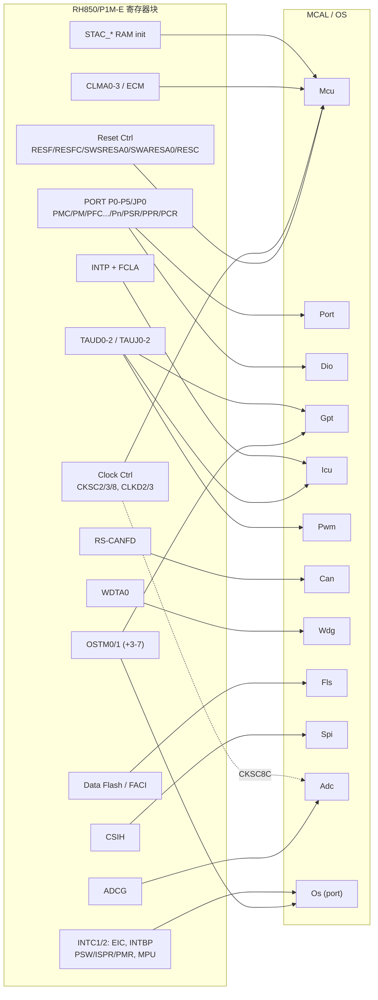

# RH850/P1M-E 硬件 ↔ MCAL 映射总表

> Prerequisite: [MCAL 总览](01-mcal-overview.md), [MCU](02-mcu-driver.md), [Port](03-port-driver.md), [Dio](04-dio-driver.md), [Gpt](05-gpt-driver.md), [Icu](06-icu-driver.md)
> Next: [RH850 CAN 外设（Part IV）](../04-can-mcal/02-rh850-can-peripheral.md)
> 对应规范: SWS MCU R24-11、SWS CAN R22-11（本仓库有）；Port/Dio/Gpt/Icu/Wdg/Fls/Spi/Adc/Os SWS **本仓库无**——表中这些模块的 API 与配置容器名为 R4.x 公认形态，标注“(无 SWS)”。
> 对应源码: 本项目 `examples/rh850_mcal_reference/`；openAUTOSAR `boards/linuxOs/MCAL/`（非 RH850）。
> RH850 依据: RH850/P1M-E User's Manual Hardware R01UH0585EJ0120（HW-E）与 Datasheet R01DS0505ED0100（DS-E）；页码均为 PDF 物理页。汇总自 `docs/reference/research/04-rh850-hardware-notes.md` 并在本 Part 各章复核。

---

## 1. 本章目标

这是一张**索引**，不是新知识。它把 Part III 各章（以及 Part IV 将展开的 CAN）中的映射关系汇总成表，回答以后读真实 MCAL 时最常问的四个问题：

1. 这个 RH850 寄存器块归哪个 MCAL 驱动？
2. 这个 AUTOSAR API 最终写了哪些寄存器？
3. 这个寄存器的值来自哪个配置容器/参数？
4. 这个映射的**可信度**如何——是 SWS + 手册双重确认，还是 R4.x 公认形态，还是需要在真实项目中确认？

---

## 2. 为什么需要一张总表？

读真实 MCAL（几十个 `.c`、上百个生成的配置数组）时，最耗时的是在三种“语言”之间来回翻译：AUTOSAR API 名、配置参数名、芯片寄存器名。总表的作用是让你**从任何一种语言进入，都能找到另外两种**，并且知道每个映射在本教程中的依据等级。

---

## 3. 在系统中的位置：全景图

---

## 4. AUTOSAR 如何定义映射规则？

映射的总原则是寄存器产权规则（`SWS_Mcu_00116/00244/00245/00246/00247`，MCU p.25；`SWS_Can_00407`，CAN p.43）：单用途寄存器归实现该功能的驱动；影响多模块的 I/O 寄存器归 Port；影响多模块的非 I/O 寄存器归 Mcu；一次性写寄存器与其它归 start-up code。中断控制器（EIC/INTBP）不属于任何 MCAL 驱动——“驱动不设置中断向量优先级”（CAN SWS p.33），由 OS 配置。

**可信度标记**（本章表格最后一列）：

| 标记 | 含义 |
|---|---|
| **S+H** | 本仓库 SWS 与 HW-E 均有直接依据 |
| **H** | HW-E 有依据；AUTOSAR 侧为 R4.x 公认形态（本仓库无该模块 SWS） |
| **S** | SWS 有依据；硬件侧为概念映射，寄存器细节需确认 |
| **?** | 需在真实项目/供应商 MCAL/完整手册中确认 |

---

## 5. 核心数据结构：映射总表

### 5.1 Mcu（SWS 有）

| RH850 寄存器块 | 地址 | AUTOSAR API | 配置容器 / 参数 | 出处 | 可信度 |
|---|---|---|---|---|---|
| RESF（复位原因，32 位 RO） | `FFF8_1000` | `Mcu_GetResetReason`、`Mcu_GetResetRawValue` | `McuPublishedInformation/McuResetReasonConf/McuResetReason` | HW-E p.420–422；SWS p.29–30, p.51 | S+H |
| RESFC（清除，32 位 WO） | `FFF8_1008` | （实现相关：Init 中或由用户清除） | — | HW-E p.423；SWS `00005` 说明 | S+H / ? |
| SWSRESA0（System Reset 2） | `FFF8_1100` | `Mcu_PerformReset` | `McuModuleConfiguration/McuResetSetting` | HW-E p.424；SWS p.31, p.45 | S+H |
| SWARESA0（Application Reset 1） | `FFF8_1200` | `Mcu_PerformReset` | 同上 | HW-E p.425 | S+H |
| RESC.RESC0（ECM 复位类别） | `FFF8_2800` | `Mcu_Init`（可选） | 厂商扩展 | HW-E p.418, p.426 | ? |
| STAC_LM0/GRAM/DTSRAM/LM10 | `FFF8_1520/1420/1320/1E20` | `Mcu_Init` 或 start-up；与 `Mcu_InitRamSection` 相关 | 厂商扩展；`McuRamSectorSettingConf` | HW-E p.420, p.427–430, p.434 | ? |
| Local/Global RAM（ECC） | `FEDE_0000`… / `FEEF_8000`… | `Mcu_InitRamSection` | `McuRamSectionBaseAddress/Size/DefaultValue/WriteSize` | HW-E p.257, p.2889–2890；SWS p.26, p.48–49 | S+H |
| CKSC8C/CKSC8S（ADC 时钟 40/20 MHz） | `FFF8_9110/9114` | `Mcu_InitClock` | `McuClockSettingConfig`（厂商扩展字段） | HW-E p.480–481 | H / ? |
| CKSC2C/3C、CLKD2DIV/3DIV（EXTCLK 输出） | `FFF8_9080/90C0`、`FFF8_8810/8818` | `Mcu_InitClock`（若支持） | 厂商扩展 | HW-E p.471–482 | ? |
| **PLL / CPU 时钟选择** | **不存在** | `Mcu_InitClock`/`Mcu_GetPllStatus`/`Mcu_DistributePllClock` → `McuNoPll=TRUE` 场景 | `McuGeneralConfiguration/McuNoPll` | HW-E p.469–471（检索无 PLL 寄存器）；SWS `00205/00206` p.28–29 | S+H |
| 时钟频率（固定） | — | — | `McuClockReferencePoint/McuClockReferencePointFrequency`：CPU 160 / HSB 80 / LSB 40 / MOSC 16 / IOSC 8 MHz | HW-E p.469；SWS p.49–50 | S+H |
| CLMA0–3（时钟监视，CTL0 需 0xA5 序列） | `FFF8_3100`… | （实现相关）；`MCU_E_CLOCK_FAILURE` | `McuClockSrcFailureNotification`、`McuDemEventParameterRefs` | HW-E p.2752–2764；SWS p.18–19, p.44, p.46 | ? |
| ECM（错误汇聚，WDTA/CLMA → 中断/复位） | Section 32 | 不属于 Mcu 标准 API | 安全监控/集成 | HW-E p.2785–2796 | ? |
| 写保护 | — | — | 复位寄存器：P-Bus Guard（p.420）；时钟控制器：Slave Guard（p.471）；**无 PROTCMD** | HW-E | H |
| 芯片级低功耗模式 | HW-E 中未检索到 | `Mcu_SetMode` | `McuModeSettingConf/McuMode` | SWS p.31–32, p.46–47 | ? |

### 5.2 Port / Dio（无 SWS）

| RH850 寄存器 | 偏移（+n×40H，`PORT_base=FFC1_0000`） | 宽度 | AUTOSAR API | 配置参数（公认） | 出处 | 可信度 |
|---|---|---|---|---|---|---|
| PMCn | +0014H | 16 | `Port_Init`、`Port_SetPinMode` | `PortPinMode`、`PortPinInitialMode` | HW-E p.101 | H |
| PMn | +0010H | 16 | `Port_Init`、`Port_SetPinDirection`、`Port_RefreshPortDirection` | `PortPinDirection`、`PortPinDirectionChangeable` | p.104 | H |
| PFCn/PFCEn/PFCAEn | +0018H/+001CH/+0028H | 16 | `Port_Init`、`Port_SetPinMode` | `PortPinMode`（ALT1–6 编码 Table 2.6） | p.94, p.107–109 | H |
| PIPCn | +4008H | 16 | `Port_Init` | 厂商扩展（CAN 必须 0） | p.103, p.131 | H |
| PIBCn | +4000H | 16 | `Port_Init` | 厂商扩展（GPIO 输入必须 1） | p.106 | H |
| PBDCn | +4004H | 16 | `Port_Init` | 厂商扩展（输出读回实际电平） | p.111 | H |
| PUn/PDn、PODCn/PODCEn/PDSCn/PUCCn/PISAn、PINVn | +400CH…/+0030H | — | `Port_Init` | 厂商扩展 | p.100, p.116 | H |
| PMSRn/PMCSRn | +0020H/+0024H | 32 | `Port_SetPinDirection/Mode`（原子实现） | — | p.102, p.105 | H |
| PCRn_m（单引脚） | +2000H + n×40H + 4×m | 32 | `Port_Init`/`SetPin*`（原子实现） | — | p.124–125 | H |
| FCLAnCTLm / DNFA（滤波器） | Table 2.50 | 8 | `Port_Init` 或使用该输入的驱动 | 厂商扩展 | p.158, p.171 | ? |
| Pn | +0000H | 16 | `Port_Init`（初始电平）、`Dio_WritePort` | `PortPinLevelValue` | p.113 | H |
| PSRn | +0004H | 32 | `Dio_WriteChannel`、`Dio_WriteChannelGroup`（原子） | `DioChannel`、`DioChannelGroup` | p.96, p.115 | H |
| PNOTn | +0008H | 16 WO | `Dio_FlipChannel` | `DioFlipChannelApi` | p.96, p.114 | H |
| PPRn | +000CH | 16 RO | `Dio_ReadChannel`、`Dio_ReadPort`、`Dio_ReadChannelGroup` | — | p.95, p.112 | H |

### 5.3 Gpt / Icu / Pwm / OS 定时（无 SWS）

| RH850 资源 | 地址 / 中断 | MCAL / OS | API（公认） | 配置（公认） | 出处 | 可信度 |
|---|---|---|---|---|---|---|
| OSTM0 / OSTM1 | `FFDD_8000` / `FFDD_9000`；EI74 / EI75 | Gpt **或** OS 计数器（**二选一，配置决定**） | `Gpt_StartTimer/StopTimer/GetTimeElapsed/...`；OS `IncrementCounter`/硬件计数器回调 | `GptChannelConfiguration`（+ 硬件实例扩展）；OS Counter | HW-E p.1543–1556, p.283 | H |
| OSTM3–7 | `FFD7_0000 + 40H×(n−3)`；**FEINT** | OS timing protection | — | OS | p.1543–1545 | H / ? |
| IC0CKSEL0/1 | `FFDD_6000/6004`（16 位） | Gpt / OS / Mcu（归属需约定） | — | 厂商扩展 | p.1547–1548, p.1551 | ? |
| TAUJ0–2 ch0–3（32 位） | `FFE5_0000`…；TAUJ0 → EI133–136 | Gpt / Icu / Pwm | 同上 | `GptChannelConfiguration` / `IcuChannel` | p.1878–1900, p.284 | H |
| TAUD0–2 ch0–15（16 位） | `FFE2_0000`…；TAUD0 → EI141–156 | Gpt / Icu / Pwm | `Icu_StartSignalMeasurement`、`Icu_GetTimeElapsed`、`Icu_EnableEdgeCount`… | `IcuChannel/IcuMeasurementMode` | p.1571–1594, p.1664–1701, p.285 | H |
| TAUDnTPS / TAUJnTPS（预分频，单元共享） | `<TAUDn_base>+240H` | 共享资源（归属需约定） | — | 厂商扩展 | p.1582, p.1887 | ? |
| INTP0–12 + FCLAnCTLm | EIC 见 Table 6.11 | Icu（边沿检测、唤醒） | `Icu_SetActivationCondition`、`Icu_EnableNotification`、`Icu_CheckWakeup` | `IcuChannel`、`IcuWakeup` | p.171, p.280 | H |

### 5.4 Can（SWS 有；Part IV 展开）

| RS-CANFD（`FFD2_0000`，1 单元 3 通道） | AUTOSAR 概念 / API | 配置 | 出处 | 可信度 |
|---|---|---|---|---|
| 整个单元 RSCFD0 | 一个 Can 驱动实例（一个 CAN Hardware Unit） | `Can`、`CanGeneral` | HW-E p.788, p.791；CAN SWS p.15, p.33 | S+H |
| 通道 CANm（CmCFG/CmCTR/CmSTS/CmERFL） | `CanController`；`Can_SetControllerMode` | `CanController`、`CanControllerBaseAddress` | HW-E p.798；CAN p.107–108 | S+H |
| GRMCFG.RCMC（Classical / FD 接口模式，偏移不同） | Can_Init 内部 | 厂商扩展 | HW-E p.802, p.916–919 | H |
| GCFG.DCS（fCAN = clkc 40 MHz / clk_xincan 16 MHz） | 位时间计算 | `CanCpuClockRef` → `McuClockReferencePoint` | HW-E p.791, p.817；CAN p.112 | S+H |
| CmCFG（Classical：SJW/TSEG2/TSEG1/BRP）；NCFG/DCFG（FD） | 位时间 | `CanControllerBaudrateConfig`、`CanControllerFdBaudrateConfig` | HW-E p.803–804, p.921, p.935；CAN p.114–121 | S+H |
| TX buffer p（16m..16m+15）、TMCp/TMSTSp（8 位） | HTH；`Can_Write`；`CanIf_TxConfirmation` | `CanHardwareObject (TRANSMIT)` | HW-E p.799, p.878–887, p.1107–1110；CAN p.80–82 | S+H |
| 接收规则 GAFLIDj/GAFLMj（**1=比较**）/GAFLP0_j/GAFLP1_j | HRH 过滤 | `CanHwFilterCode/Mask` | HW-E p.832–837；CAN p.129 | S+H |
| RX FIFO x / RX buffer q | HRH 硬件对象；`CanIf_RxIndication` | `CanHardwareObject (RECEIVE)`、`CanHwObjectCount` | HW-E p.838–848；CAN p.48, p.124 | S+H |
| channel communication / reset / halt / stop | STARTED / STOPPED / SLEEP（一种可能映射） | — | HW-E p.1062–1066；CAN p.36–43 | ? |
| CmCTR.BOM（bus-off 恢复模式） | `SWS_Can_00274` 禁止自动恢复 | 厂商扩展 | HW-E p.807, p.1069；CAN p.43 | S+H / ? |
| CmSTS.TEC/REC/EPSTS/BOSTS | `Can_GetControllerErrorState`、`Can_GetControllerRx/TxErrorCounter` | — | HW-E p.810–811；CAN p.71–74 | S+H |
| 中断 EI183–193（189 全局错误、190 全局 RX FIFO、184 = CAN0 TX/RX FIFO 接收） | Can ISR（Cat2）；`CanRxProcessing/TxProcessing` | OS ISR 配置 | HW-E p.285–286, p.792；CAN p.33, p.109–110 | S+H |
| CAN 引脚（Table 17.10；ALT 号需按原表核对） | Port（`SWS_Can_00239`） | `PortPin` | HW-E p.793, p.151–154 | H / ? |

### 5.5 Wdg / Fls / Spi / Adc（本 Part 未展开，无 SWS）

| RH850 资源 | 地址 | MCAL | 要点 | 出处 | 可信度 |
|---|---|---|---|---|---|
| WDTA0（WDTE/EVAC/REF/MD） | `FFD7_4000` | Wdg（`Wdg_Init`、`Wdg_SetMode`、`Wdg_SetTriggerCondition`） | 复位后是否自动运行由 `OPBT0.OPWDRUN` 决定；VAC 关闭时向 WDTE 写固定值触发；75% 中断 INTWDTA0 = EI9；错误经 ECM 复位 | HW-E p.1522–1535, p.282, p.2884, p.2790 | H / ? |
| Data Flash（1 MB 型号 32 KB） | `FF20_0000` | Fls | FACI 命令与时序需 Flash Memory User's Manual: Hardware Interface（**本仓库无**） | HW-E p.257, p.2888；DS-E p.2 | ? |
| CSIH | `FFD8_0000` 起 | Spi | — | HW-E p.526 | ? |
| ADCG | `FFF9_1000` | Adc | 时钟由 Mcu 的 CKSC8C 选择 | HW-E p.2427, p.480 | ? |

### 5.6 OS（无 SWS）

| RH850 资源 | OS 概念 | 出处 |
|---|---|---|
| EIC0–31（INTC1，`FFFE_EA00`+2n）、EIC32–383（INTC2，`FFFF_B000`+2n）：EIP/EIMK/EITB/EIRF/EICT | ISR 优先级、使能、向量方式；Cat1/Cat2 | HW-E p.265–268 |
| EIBD（PEID 必须 001） | 中断绑定 | p.271 |
| INTBP / RBASE / EBASE | 向量表基址 | p.205–206, p.281 |
| PSW.ID（DI/EI） | `DisableAllInterrupts` / `SuspendAllInterrupts` | p.198 |
| PMR / ISPR / ICSR / INTCFG | `SuspendOSInterrupts`、优先级屏蔽 | p.210–212 |
| EIPC/EIPSW（只有一组） | 嵌套 ISR 上下文保存 | p.193–194 |
| EIIC（EI 通道 = 0x1000 + ch） | ISR 识别 / debug | p.199, p.282–286 |
| MPU（16 区） | OS-Application 内存保护 | p.214–215；DS-E p.2 |
| SYSERR（FE 级，不可恢复） | ProtectionHook / ShutdownOS | p.244–245 |

---

## 6. 初始化流程：按启动顺序看映射

| 启动阶段 | 调用 | 触碰的 RH850 资源 |
|---|---|---|
| start-up code | — | RBASE/EBASE、SP/GP/TP/EP、（WDTA 首次期限）、`.data/.bss` |
| DriverInitOne | `Mcu_Init` | RESF 快照、（RESC/STAC） |
| | `Mcu_InitClock` | CKSC8C（ADC）、（CLMA） |
| | `Port_Init` | PORT 全部控制寄存器、滤波器 |
| | `Gpt_Init` / `Icu_Init` | OSTM/TAUD/TAUJ 停止态配置、TPS、IC0CKSEL |
| | `Wdg_Init` | WDTA0 |
| StartOS | OS | EIC/EIBD/INTBP、系统节拍定时器、PSW.ID |
| DriverInitTwo | `Can_Init` | GRAMINIT 等待 → global reset → GCFG/规则表/FIFO → global operating；通道 reset/halt |
| RUN | `Can_SetControllerMode(STARTED)` | CmCTR.CHMDC=00、等 COMSTS |

（顺序依据见 [ECU 启动流程](../02-autosar-classic/03-ecu-startup.md)。）

---

## 7. Runtime Flow：三条跨模块配置链

| 链 | 路径 | 必须与硬件一致的值 |
|---|---|---|
| CAN 时钟链 | `McuClockReferencePoint`（40 MHz）→ `CanCpuClockRef` → `CanControllerBaudrateConfig` → CmCFG/NCFG/DCFG | fCAN = GCFG.DCS 选择的 clkc 40 MHz 或 clk_xincan 16 MHz（HW-E p.791, p.817） |
| Gpt/Icu 时钟链 | `McuClockReferencePoint`（80 MHz）→ `GptChannelClkSrcRef`（及 Icu 对应参数）→ CMP 计算 / ticks→物理量 | PCLK = CLK_HSB 80 MHz；TAU 预分频 TPS；IC0CKSEL |
| 复位链 | DCM `DcmEcuReset` → BswM action → `Mcu_PerformReset` → `McuResetSetting` → SWSRESA0/SWARESA0 → RESF → `Mcu_GetResetReason` → EcuM | RESC0、STAC、Backup Register（复位后保留数据） |

---

## 8. RH850 Hardware Mapping：P1M-E 与其它 RH850 的差异速查

| 话题 | P1M-E（R7F701381） | 其它 RH850（需按各自手册确认） | 依据 |
|---|---|---|---|
| CPU 核 | G3M（lock-step，checker 不是第二个可调度核） | G4MH 等（多核/虚拟化） | DS-E p.1–2；HW-E p.187, p.250 |
| PLL | 无软件可配寄存器，时钟固定 | F1x/U2A 等有软件 PLL | HW-E p.469–471 |
| 时钟/端口写保护 | 无 PROTCMD/PPCMD；Guard 机制；0xA5 只用于 CLMA/ECM/FLMDCNT | P1x（非 -E）用 PROT1PHCMD、PPCMDn | HW-E p.2757–2796；HW-X p.257–261 |
| CAN IP | RS-CANFD（1 单元 3 通道） | P1x：RS-CAN（classical）；P1x-C：MCAN | HW-E p.788；HW-X p.772；DS-C p.4 |
| 看门狗复位原因 | 经 ECM（SRESF4/ARESF2） | — | HW-E p.421, p.2790 |
| OSTM | OSTM0/1（EI）、OSTM3–7（FEINT），无 OSTM2 | — | HW-E p.1542–1545 |

---

## 9. openAUTOSAR 实现

openAUTOSAR 的 MCAL（`boards/linuxOs/MCAL/`）是 STM32 / MPC5xxx 遗留代码，**表中没有任何一行能在 openAUTOSAR 中找到 RH850 对应实现**。它对本表的唯一贡献是 API 骨架与 DET 模式（见各章 §9）。这也提醒我们：开源参考实现只能用于学习“结构”，**寄存器层映射必须来自芯片手册与芯片厂 MCAL**。

---

## 10. 当前教学项目实现

| 表中条目 | 本项目实现 | 状态 |
|---|---|---|
| OSTM0/1 底层（停止态配置、启停、比较、读计数、周期换算） | `mcal/gpt/Ostm.c` | 已实现 + 主机测试 |
| CAN FD 位时间（NCFG/DCFG 编码与校验） | `mcal/can/Can_BitTiming.c` | 已实现 + 主机测试 |
| 原始计数 → OS tick | `integration/Tick_Accumulator.c` | 已实现 + 主机测试 |
| 带宽度的 MMIO 访问 | `platform/Rh850_Mmio.c` | 已实现 |
| Mcu / Port / Dio / Icu / Wdg / Fls | 无（本 Part 各章给出 `[Educational Implementation]` 示意） | 资料核查阶段 |
| EIC/ISR/OS 回调 | 无 | 未实现 |

---

## 11. Code Walkthrough：用总表读一个陌生的 MCAL 函数

示例：你在 Renesas MCAL 中看到一个函数写了 `0xFFF81100`。

1. 查 §5.1：`FFF8_1100` = SWSRESA0 → **Mcu**，API `Mcu_PerformReset`，配置 `McuResetSetting`。
2. 查 HW-E p.424：写 `SWSRESA0_0 = 1` → System Reset 2；复位后 RESF.SRESF2 = 1。
3. 查 §7 复位链：上游是 BswM action（DCM `0x11`）或 EcuM shutdown；下游是 `Mcu_GetResetReason`。
4. 查可信度：S+H——规范与手册都有依据；但“谁调用、复位后 RAM 保留什么”是 ? ——需看项目的 BswM 与 STAC/RESC 配置。

另一个示例：生成代码中某数组元素为 `0x003E0003`，所在结构体字段名含 “BTR/CFG”。

1. 查 §5.4：CmCFG（Classical 模式位时间）。
2. 按 [配置与 ARXML §11](../02-autosar-classic/04-configuration-arxml.md) 解码：BRP=3、TSEG1=15 Tq、TSEG2=4 Tq、SJW=1 Tq → fCAN=40 MHz 时 500 kbps、采样点 80%。（04-can-mcal 的 Demo 值 `0x023E0003` 只差 SJW=3 Tq。）
3. 核对 `CanCpuClockRef` 引用的参考点是否为 40 MHz，GCFG.DCS 是否为 0。

---

## 12. Debug 方法：按寄存器块定位问题

| 现象 | 先看的寄存器块（§5） | 再看的配置 |
|---|---|---|
| 启动卡死 / 周期性复位 | RESF、ECM 状态、WDTA0 | `McuNoPll`、EcuM 等待循环、OPBT0 |
| 外设无信号 | PMC/PFC/PFCE/PFCAE/PM/PIPC | `PortPin` |
| GPIO 读不到输入 | PIBC、PPR | Port 扩展参数 |
| 定时不准 | OSTMnCMP/CTL、TAUDnTPS、IC0CKSEL | Gpt 通道、`McuClockReferencePoint` |
| 捕获值异常 | TAUDnCDRm/CSRm、滤波器 | IcuChannel、Port 滤波器 |
| 中断不进 / 风暴 | EICn（EIMK/EIP/EIRF/EICT）、外设中断标志 | OS ISR 配置 |
| CAN 不通 | GSTS/CmSTS（COMSTS）、GCFG.DCS、CmCFG、GAFL、RFCC.RFE | `CanController`、`CanHardwareObject`、`CanCpuClockRef` |

---

## 13. 常见问题 / 常见错误

1. **把其它 RH850 系列的寄存器（PLL、PROTCMD、PPCMD）带到 P1M-E**。
2. **把 OSTM0/OSTM1 的归属当成硬件事实**——它是配置选择。
3. **忽视共享资源**：IC0CKSEL、TAU 的 TPS、FCLA 滤波器（与 CAN RX 共享）、端口组寄存器（Port 与 Dio 共享）。
4. **以为某个 MCAL 驱动会配置 EIC**——那是 OS。
5. **把可信度为 “?” 的映射当成定论**——例如 CAN STARTED/STOPPED/SLEEP 到通道模式的映射、Mcu 是否负责 CLMA。

---

## 14. 实验

1. **补全表格**：为 §5.5 的 Wdg 行，阅读 HW-E p.1522–1535，写出 WDTE/EVAC/REF/MD 各自的偏移、宽度与作用，并标注哪些寄存器只能首次写（参考 `docs/mcal-reference-guide.md` R7 的摘要，再回到手册核对）。
2. **反向索引**：选 10 个地址（例如 `FFF8_1000`、`FFC1_0094`、`FFDD_9020`、`FFE2_0240`、`FFD2_0084`、`FFFF_B17C`），用总表说出它们是什么、归谁、对应哪个 API。（提示：`FFC1_0094` = `PORT_base + 0x14 + 2×0x40` = PMC2。）
3. **可信度升级计划**：列出总表中所有 “?” 条目，为每条写出“去哪里确认”（Renesas MCAL 手册、HW-E 某章、原理图、项目配置）。

---

## 15. 思考题

1. 为什么 AUTOSAR 不把 EIC（中断控制器）分配给某个 MCAL 驱动，而交给 OS？如果让 Can 驱动自己设置 EIC183–193 的优先级，会和什么冲突？
2. 总表中有多处“共享资源归属需约定”。如果你是集成负责人，你会用什么机制（文档、配置检查脚本、运行时断言）保证一个资源只有一个所有者？
3. 本表的可信度标记体系可以怎样应用到 DCM 升级中（例如“DCM 配置参数 ↔ 生成代码 ↔ SWC 接口”的映射）？

---

## 16. 对未来真实项目的意义

这张表就是你进入真实 RH850 项目时的“第一份地图”。建议：

1. **复制这张表到项目笔记中**，把“?” 一列逐项替换为真实项目的事实（MCAL 版本、配置值、原理图引脚）。
2. **为每个 MCAL 驱动找到“寄存器写入点”**，在调试器中设置数据断点，验证表中的映射（特别是共享资源）。
3. **建立三条配置链的核对清单**（§7），每次 MCAL/BSW 升级后重新核对。
4. **把芯片差异表（§8）贴在显眼处**——它能防止最常见的“照搬其它 RH850 例程”错误。
5. 进入 Part IV 后，CAN 一行会被展开为 15 个章节；本表是那些章节的入口。

---

## 17. 本章总结

- 寄存器产权规则决定映射：单用途 → 对应驱动；共享 I/O → Port；共享非 I/O → Mcu；中断控制器 → OS。
- P1M-E 的关键映射：RESF/SWSRESA0/SWARESA0/CKSC8C/CLMA → Mcu；PORT 寄存器 → Port（配置）+ Dio（PSR/PNOT/PPR）；OSTM0/1 → Gpt 或 OS（二选一）；TAUD/TAUJ/INTP → Gpt/Icu/Pwm；RS-CANFD → Can；WDTA0 → Wdg；EIC/PSW/PMR → OS。
- 三条配置链（CAN 时钟、Gpt/Icu 时钟、复位）把 Mcu 与其它模块连在一起，是升级与集成时最需要核对的地方。
- 表中每一行都带可信度标记；“?” 项是你进入真实项目后的待办清单。

## 18. 下一章

Part IV：[RH850 CAN 外设](../04-can-mcal/02-rh850-can-peripheral.md)——从 §5.4 的 RS-CANFD 一行出发，深入 global/channel 模式、规则表、FIFO、TX buffer 与中断，最终实现并调试一个 CAN 驱动。
