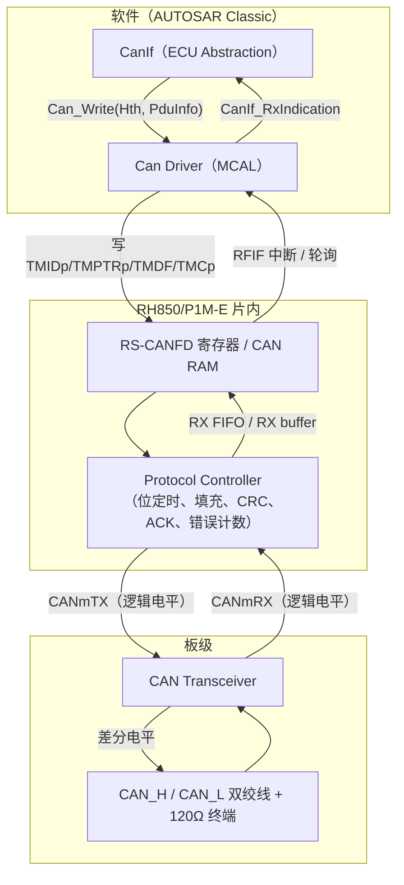
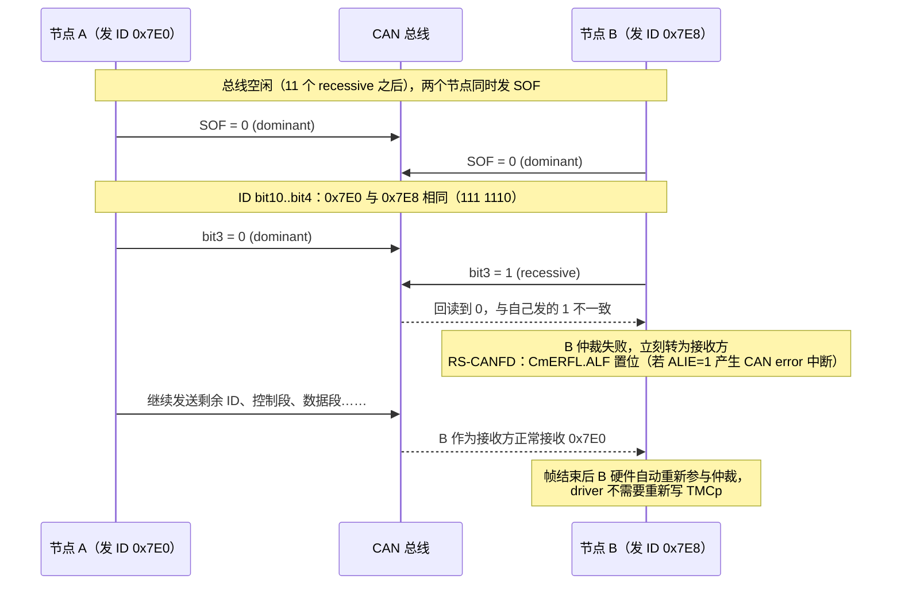
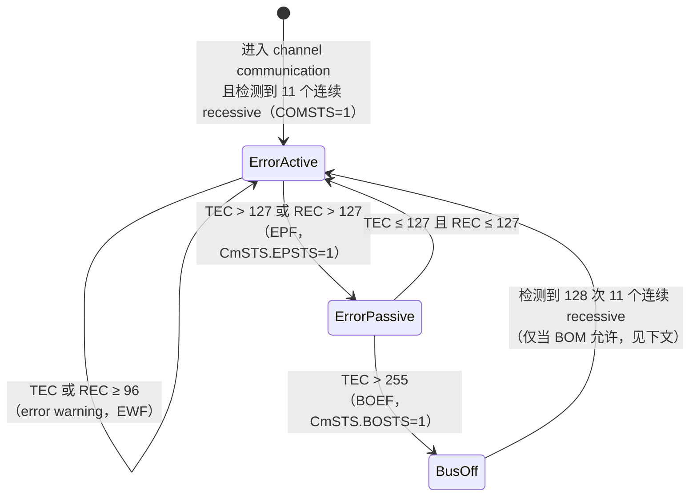
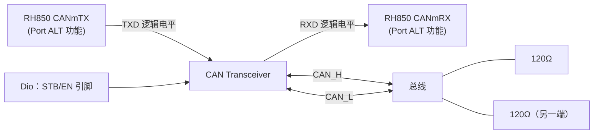
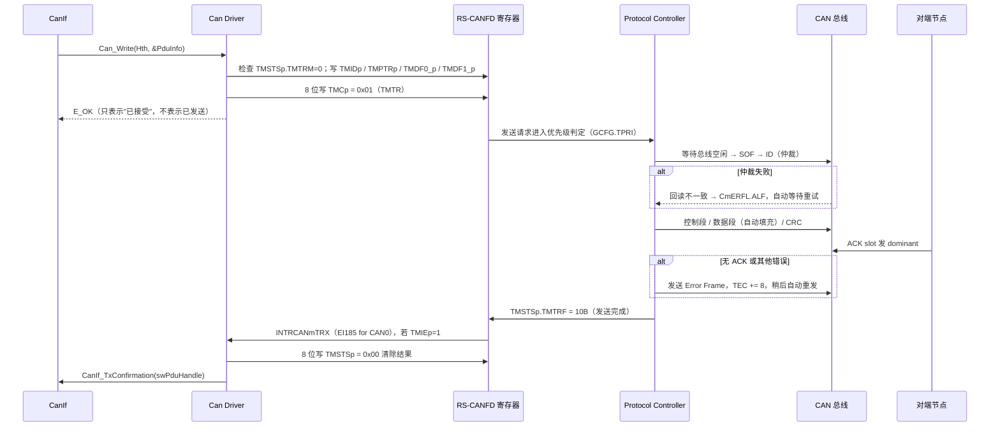

# CAN 硬件基础：从一个 bit 到一帧，再到 bus-off

> Prerequisite: [RH850 外设总览](../01-rh850/08-peripheral-overview.md)、[MCAL 总览](../03-mcal/01-mcal-overview.md)（只需知道 "MCAL = 直接访问片上外设的那一层"）
> Next: [02-rh850-can-peripheral.md](02-rh850-can-peripheral.md)
> 对应规范: AUTOSAR CP R22-11 SWS CAN Driver（`Can_IdType` p.58、`Can_ErrorStateType` p.60、`Can_ErrorType` p.61、`SWS_Can_00274` p.43、`SWS_Can_00218` p.82）；RH850/P1M-E HW Manual R01UH0585EJ0120 Rev.1.20（下称 HW-E）§17（p.794–795 协议与错误监视、p.1065–1069 通信状态与 bus-off）
> 对应源码: openAUTOSAR 无 Can driver（见 [03-openautosar-trace.md](../reference/research/03-openautosar-trace.md) §1）；本项目 `examples/rh850_mcal_reference/` 无收发代码

> **资料边界说明**：本仓库**没有** ISO 11898-1 / ISO 11898-2 / Bosch CAN 2.0 原文。本章中帧格式、仲裁、位填充、错误计数规则属于业界公认的协议知识，标注为 `[Conceptual]`；凡是能落到 RS-CANFD 寄存器或 AUTOSAR SWS 上的内容，都给出手册/SWS 页码。真实项目中如果需要精确到协议条款（例如一致性测试），必须以 ISO 11898-1 原文为准。

---

## 1. 本章目标

读完本章，你应该能够：

1. 在示波器或 CANoe Trace 上认出一帧 Classical CAN 的每一个字段，并说出它在 RS-CANFD 的哪个寄存器里出现（发送侧 `TMIDp/TMPTRp/TMDFd_p`，接收侧 `RFIDx/RFPTRx/RFDFd_x`）。
2. 解释"为什么 ID 越小优先级越高"，以及这和 AUTOSAR 里的 HTH、优先级反转（priority inversion）有什么关系。
3. 解释位填充（bit stuffing）、ACK、错误帧，并知道 RS-CANFD 用哪些标志（`CmERFL`）报告它们。
4. 画出 error active → error passive → bus-off 的状态机，知道 `TEC/REC` 在 `CmSTS` 的哪几位，知道为什么 AUTOSAR 要求 **禁止自动 bus-off 恢复**（`SWS_Can_00274`）。
5. 说出 CAN FD 相对 Classical CAN 多了哪些字段（FDF/BRS/ESI、DLC 9–15），它们在 AUTOSAR `Can_IdType` 和 RS-CANFD 寄存器里分别怎么表示。
6. 知道 CAN_H/CAN_L 的物理层常识，能用万用表判断终端电阻是否正确。

这不是一本 CAN 协议教科书。本章的取舍标准只有一个：**写 CAN MCAL Driver 时你会用到的协议知识**。

---

## 2. 为什么 MCAL 工程师必须懂 CAN 帧？

很多人觉得"协议是硬件做的，driver 只管写寄存器"。这个想法会在以下场景让你卡住：

| 场景 | 如果不懂协议，你会…… | 懂了之后你会…… |
|---|---|---|
| 上板第一帧发不出去，`TMSTSp.TMTRF` 一直不是 10B | 怀疑寄存器地址写错，反复改代码 | 先看 `CmERFL.AERR`（ACK error）：总线上是不是**只有你一个节点**？没有别的节点回 ACK，发送永远不会成功 |
| `TEC` 持续上涨，但没有 bus-off | 以为是 driver bug | 知道单节点无 ACK 时 TEC 会停在 error passive 区域（见 §9），这是协议行为 |
| 收到的扩展帧 ID 在 CanIf 里对不上 | 怀疑 CanIf 配置 | 知道 AUTOSAR `Can_IdType` 用最高位表示扩展帧（SWS p.58），driver 必须把 `RFID.IDE` 转成这个位（`SWS_Can_00423` p.48） |
| CAN FD 帧能收不能发 | 怀疑 TX buffer | 知道 FD 有 BRS 数据段速率，问题可能在 `DCFG`、TDC 或收发器速率上限 |
| 测试仪发 `22 F1 90` 后 ECU 没有响应 | 怀疑 DCM | 先确认是否 0x7E0 被 AFL 规则过滤掉了——ID 过滤是**硬件**行为 |

AUTOSAR 把这些协议细节"藏"在 `Can_Write()` 和 `CanIf_RxIndication()` 后面，但写 driver 的人正是负责"藏"它们的人。

---

## 3. 在系统中的位置



本章讲的内容（帧、仲裁、填充、CRC、ACK、错误计数）**全部由图中 Protocol Controller 硬件完成**，driver 不需要也不能用软件去做。Driver 能做的是：

- 告诉硬件"发什么"（ID、DLC、数据、FD 属性）；
- 告诉硬件"收什么"（接收规则 AFL）；
- 读取硬件"发生了什么"（完成标志、错误标志、错误计数器、状态）。

所以本章每一小节最后都有一个 **"Driver 视角"**：这个协议机制在 RS-CANFD 上体现为哪些寄存器、在 AUTOSAR 上体现为哪个类型或 callback。

---

## 4. 一帧 Classical CAN 的结构

### 4.1 Data Frame（标准帧，11-bit ID）

`[Conceptual]`（ISO 11898-1 公认格式）

```text
 SOF | Identifier(11) | RTR | IDE | r0 | DLC(4) | Data(0..8 byte) | CRC(15) | CRC Del | ACK Slot | ACK Del | EOF(7) | IFS(3)
  1  |      11        |  1  |  1  | 1  |   4    |    0..64 bit     |   15    |    1    |    1     |    1    |   7    |  3
 |<------------------- Arbitration ------>|<-- Control -->|<- Data ->|<------ CRC ------>|<----- ACK ----->|
```

| 字段 | 长度 | 含义 | Driver 视角（RS-CANFD / AUTOSAR） |
|---|---|---|---|
| SOF | 1 bit，dominant | 帧开始，所有节点用它的下降沿做硬同步（hard sync） | 不可见。`CmSTS.COMSTS` 置 1 之前（需检测到 11 个连续 recessive bit），节点不会参与（HW-E p.1068） |
| Identifier | 11 bit | 报文 ID，同时是**仲裁优先级** | 发送：`TMIDp.ID[28:0]`，标准帧放低 11 位（HW-E p.882）；接收：`RFIDx`；AUTOSAR：`Can_PduType.id`（SWS p.57） |
| RTR | 1 bit | 0=Data Frame（dominant），1=Remote Frame | `TMIDp.RTR`(b30)；**AUTOSAR Can 驱动不支持 Remote Frame**（`SWS_Can_00236/00237` p.21），所以 driver 通常写 0，并在 AFL 中通过 `RTRM=1, RTR=0` 把远程帧过滤掉 |
| IDE | 1 bit | 0=标准帧，1=扩展帧 | `TMIDp.IDE`(b31)；AUTOSAR `Can_IdType` 最高位（见 §4.3） |
| r0 | 1 bit | 保留位（在 CAN FD 中这个位置变成 FDF） | 不可见 |
| DLC | 4 bit | 数据长度码。Classical CAN 中 0–8 表示 0–8 字节，9–15 也表示 8 字节 | `TMPTRp.DLC[31:28]`；`Can_PduType.length` |
| Data | 0–8 byte | 有效载荷，**先发送的字节是 byte0** | `TMDF0_p` 低字节 = byte0（handoff §8）；AUTOSAR：数组下标 0 是第一个上总线的字节（`SWS_Can_00059` p.44、`SWS_Can_00060` p.48） |
| CRC | 15 bit + 1 delimiter | 对 SOF 到 Data 计算的 CRC-15 | 硬件计算和校验；校验失败 → `CmERFL.CERR`（HW-E p.812–815） |
| ACK Slot | 1 bit | 发送方发 recessive，**任何一个**正确接收的节点在此位发 dominant | 没人回 ACK → `CmERFL.AERR`；ACK delimiter 错 → `ADERR` |
| EOF | 7 bit recessive | 帧结束 | 不可见 |
| IFS | 3 bit recessive | 帧间间隔（Intermission） | 不可见；这正是 RS-CANFD 判断"总线空闲"所依据的 recessive 序列的一部分 |

### 4.2 扩展帧（29-bit ID）

`[Conceptual]` 扩展帧把 ID 拆成 11 bit Base ID + 18 bit Extended ID，中间插入 SRR（Substitute Remote Request，固定 recessive）和 IDE（=1，recessive）：

```text
SOF | Base ID(11) | SRR | IDE=1 | Ext ID(18) | RTR | r1 | r0 | DLC | Data | CRC | ACK | EOF
```

推论（仲裁时非常重要）：**相同 Base ID 的标准帧永远赢扩展帧**——因为在 SRR/RTR 位置上，标准数据帧发的是 dominant 的 RTR，而扩展帧发的是 recessive 的 SRR。

### 4.3 AUTOSAR 怎么表示"标准/扩展/FD"

`[AUTOSAR API]`（R22-11，SWS p.58，`SWS_Can_00416`）

`Can_IdType` 是 `uint32`，**最高两位编码帧类型**：

| bit31 | bit30 | 含义 |
|---|---|---|
| 0 | 0 | 标准 ID，Classical CAN |
| 0 | 1 | 标准 ID，CAN FD |
| 1 | 0 | 扩展 ID，Classical CAN |
| 1 | 1 | 扩展 ID，CAN FD |

`SWS_Can_00423`（p.48）要求：接收扩展帧时，driver 必须把 `Can_IdType` 的最高位置 1 后再交给 CanIf。

这正好落在 driver 的职责上——把硬件格式"翻译"成 AUTOSAR 格式：

`[Educational Implementation]`（教学伪代码，不是 production code；RS-CANFD 位定义见 HW-E p.882、handoff §8）

```c
/* RS-CANFD RFIDx/TMIDp: IDE=bit31, RTR=bit30, ID=bit28..0
 * AUTOSAR Can_IdType: bit31=IDE, bit30=FD, 低位=ID            */
static Can_IdType EduCan_HwIdToAutosar(uint32 rfid, boolean isFdFrame)
{
    Can_IdType id;
    if ((rfid & 0x80000000UL) != 0UL) {          /* IDE=1：扩展帧 */
        id = (rfid & 0x1FFFFFFFUL) | 0x80000000UL;
    } else {                                      /* 标准帧 */
        id = (rfid & 0x000007FFUL);
    }
    if (isFdFrame) {                              /* FD 帧：来自 RFFDSTS.FDF（仅 FD 接口模式） */
        id |= 0x40000000UL;
    }
    return id;
}
```

注意 RS-CANFD 的 bit31 恰好也是 IDE，但 bit30 在硬件里是 **RTR**，在 AUTOSAR 里是 **FD 标志**。直接把 `RFIDx` 原样当成 `Can_IdType` 是一个典型的"能编译、偶尔出错"的 bug。

---

## 5. 仲裁（Arbitration）：为什么 ID 越小优先级越高

### 5.1 线与（wired-AND）

`[Conceptual]` CAN 总线的电气特性是：**只要有一个节点发 dominant（逻辑 0），总线就是 dominant**；只有所有节点都发 recessive（逻辑 1），总线才是 recessive。每个节点在发送的同时**回读**总线（通过收发器的 RXD）。

仲裁过程：



逐个 transition 解释：

1. **两个节点同时发 SOF**：只有总线空闲时才能开始发送。RS-CANFD 在 `CHMDC=00`（channel communication）之后，要检测到 11 个连续 recessive 位才置 `CmSTS.COMSTS=1`（HW-E p.1068）。
2. **ID 逐位比较**：0x7E0 = `111 1110 0000`，0x7E8 = `111 1110 1000`，第一次不同出现在 bit3。发 dominant 的一方胜出。
3. **B 仲裁失败**：B 不产生错误帧（仲裁失败不是错误），只是变为接收方。RS-CANFD 用 `CmERFL.ALF`（Arbitration Lost Flag）记录这一事件（HW-E p.812–815，Table 17.175 p.1058 中 ALF→ALIE）。**这个标志通常不需要打开中断**——在繁忙总线上它会频繁发生。
4. **自动重发**：B 的发送请求（`TMCp.TMTR=1`）仍然挂着，硬件在下一次总线空闲时自动重试。除非设置了 one-shot（`TMCp.TMOM=1`，HW-E p.878），否则 driver 不需要做任何事。

### 5.2 Driver 视角：仲裁和 AUTOSAR 的关系

| 协议现象 | AUTOSAR 概念 | RS-CANFD 机制 |
|---|---|---|
| ID 小 = 优先级高 | SWS p.15 术语表 "Priority：The lower the numerical value of the identifier, the higher the priority" | — |
| 同一节点内多个待发帧谁先上总线 | inner priority inversion（SWS p.15–17） | `GCFG.TPRI=0` 按 ID 优先、`=1` 按 buffer 号优先，对所有通道生效（HW-E p.817, p.1077） |
| 两帧之间间隙太长，被别的节点的低优先级帧抢走 | outer priority inversion（SWS p.15） | 多个 TX buffer 同时挂起请求即可避免 |
| AUTOSAR 的对策 | Multiplexed Transmission（`SWS_Can_00277` p.45）、或 HTH 都配成 FULL | 一个 HTH 对应多个 TX buffer（`CanHwObjectCount`，ECUC_Can_00467 p.124） |

这些会在 [07-hoh-hrh-hth.md](07-hoh-hrh-hth.md) 展开。

---

## 6. 位填充（Bit Stuffing）

`[Conceptual]`

**规则**：在 SOF 到 CRC 序列（不含 CRC delimiter）之间，发送方每发出 5 个相同极性的位，就自动插入 1 个相反极性的"填充位"。接收方自动删除填充位。

**为什么需要**：CAN 没有独立时钟线，接收方靠总线上的**跳变沿**做重同步（resynchronization，调整幅度受 SJW 限制，见 [03-can-clock-bit-timing.md](03-can-clock-bit-timing.md)）。如果数据里连续 20 个 0，就 20 个 bit 没有跳变，接收方的位时钟会漂移。填充保证最多每 5 bit 有一次跳变。

**例子**：发送数据字节 `0x00 0x00`（16 个 0）：

```text
原始：0000 0000 0000 0000
填充：00000 1 00000 1 00000 1 0   （每 5 个 0 插一个 1）
```

**推论（对计算帧长和总线负载很重要）**：

- 同样 8 字节数据，`0x00` 或 `0xFF` 的帧比 `0x55` 的帧更长。
- 最坏情况下 Classical CAN 标准帧 8 字节约 135 bit（含填充、EOF、IFS），这就是"500 kbit/s 下一帧约 0.27 ms"的来历。
- 错误帧的 6 个连续 dominant 位**故意违反**填充规则，这就是所有节点能识别"有人报错"的原因（§8）。

**Driver 视角**：填充错误（6 个相同位）→ `CmERFL.SERR`（Stuff Error）（HW-E p.812–815）；AUTOSAR `Can_ErrorType` 中对应 `CAN_ERROR_STUFF`（SWS p.61，`SWS_Can_91021`，仅在 `CanEnableSecurityEventReporting=TRUE` 时通过 `CanIf_ErrorNotification` 上报，p.55）。

**CAN FD 差异**：FD 帧的 CRC 段使用"固定填充位"（fixed stuff bit，每 4 bit 插一个）和 stuff count 字段——这是 ISO 11898-1:2015 为修复早期 FD CRC 弱点而加的。RS-CANFD 手册 p.794 只写 "ISO11898-1 compliant"；ISO/non-ISO FD 的选择细节本仓库资料无法确认（handoff §6 也明确不能凭名字编造 ISO 切换位），需根据实际芯片手册与测试仪设置确认。

---

## 7. ACK 机制

`[Conceptual]`

- 发送方在 ACK Slot 发 **recessive**。
- 任何一个**正确收到这一帧**（CRC 正确）的接收节点，在 ACK Slot 发 **dominant**。
- 发送方回读到 dominant → 至少有一个节点收到了；回读到 recessive → **ACK Error**。

关键理解：

1. ACK 只表示"总线上**至少一个节点**收到了"，不表示"目标 ECU 收到了"。应用层确认（例如 UDS 的响应）才说明对方处理了。
2. 接收节点**不管这帧 ID 是否通过了自己的接收过滤**，只要 CRC 正确都会回 ACK。所以 AFL 规则过滤掉的帧仍然会被本节点 ACK。
3. 这就是"**单节点上板，第一帧永远发不出去**"的原因：总线上没有其他节点回 ACK。RS-CANFD 自测模式（self-test mode 0 外部回环 / mode 1 内部回环，HW-E p.796, p.1085–1087）就是为这个场景设计的。

**Driver 视角**：

| 事件 | RS-CANFD | AUTOSAR |
|---|---|---|
| ACK 错误 | `CmERFL.AERR`，计入 TEC | `CAN_ERROR_ACK`（SWS p.61） |
| ACK delimiter 错误 | `CmERFL.ADERR` | `CAN_ERROR_FORM`？——SWS 的 `Can_ErrorType` 枚举不细分 ACK delimiter，需看实现如何映射 |
| 发送最终成功 | `TMSTSp.TMTRF=10B`（HW-E p.880–881） | `CanIf_TxConfirmation(swPduHandle)`（`SWS_Can_00016` p.45） |

**"发送成功"的硬件含义就是：本帧发完并收到了 ACK，没有错误帧。** 所以 `CanIf_TxConfirmation` 的语义也只是"上了总线并被某个节点 ACK"。

---

## 8. 错误检测与错误帧

### 8.1 五种错误

`[Conceptual]` + RS-CANFD 标志（HW-E p.812–815，`CmERFL` 写 0 清除对应位，其他位要写 1）

| 错误 | 谁检测 | 条件 | RS-CANFD 标志 | AUTOSAR `Can_ErrorType`（SWS p.61） |
|---|---|---|---|---|
| Bit Error | 发送方 | 发 dominant 回读 recessive，或反之（仲裁段和 ACK slot 除外） | `B0ERR`（发 recessive 读到 dominant 的情况见手册定义）/ `B1ERR` | `CAN_ERROR_BIT_MONITORING0/1` 等 |
| Stuff Error | 所有节点 | 6 个连续相同位 | `SERR` | `CAN_ERROR_STUFF` |
| CRC Error | 接收方 | 计算 CRC 与收到的不符 | `CERR` | `CAN_ERROR_CRC` |
| Form Error | 所有节点 | 固定格式位（CRC Del、ACK Del、EOF）出现 dominant | `FERR` | `CAN_ERROR_FORM` |
| ACK Error | 发送方 | ACK slot 回读为 recessive | `AERR` | `CAN_ERROR_ACK` |

此外 RS-CANFD 还有：`BLF`（Bus Lock，总线被锁在 dominant）、`OVLF`（Overload）、`ALF`（仲裁失败），以及状态变化标志 `EWF`（error warning）、`EPF`（error passive）、`BOEF`（bus-off entry）、`BORF`（bus-off recovery）。这些都汇总到 **CANm error 中断**（EI183/186/191，见 [05-can-interrupt.md](05-can-interrupt.md)）。

> 上表 B0ERR/B1ERR 与 AUTOSAR 枚举项的精确一一对应需要对照 HW-E p.812–815 原表和 SWS p.61 原表逐项确认；不同供应商 MCAL 的映射可能不同。

### 8.2 错误帧

`[Conceptual]`

检测到错误的节点立即发送 **Error Frame**：

```text
Error Flag（6 bit） + Error Delimiter（8 bit recessive）
```

- **Error active** 节点发 **6 个 dominant**（active error flag）——它故意违反填充规则，所以所有节点都会检测到 stuff error 并跟着发自己的错误标志，结果是**整帧被全网作废**，发送方稍后自动重发。
- **Error passive** 节点发 **6 个 recessive**（passive error flag）——它无法"压住"总线，不会破坏别人的帧。这就是"error passive 节点不能干扰网络"的设计。

**为什么这对 driver 重要**：错误帧会让发送方**自动重发**。driver 看到的只是 `TMSTSp.TMTRF` 迟迟不变成 10B。如果 driver 或上层设置了 confirmation 超时，就会在协议层还在重试时报告超时。

---

## 9. 错误计数器与三种错误状态

### 9.1 TEC / REC 规则（简化）

`[Conceptual]`（ISO 11898-1 规则的简化版，细节例外众多，以原文为准）

| 事件 | TEC | REC |
|---|---|---|
| 发送方检测到错误 | +8 | — |
| 接收方检测到错误 | — | +1（某些情况 +8） |
| 成功发送一帧 | −1 | — |
| 成功接收一帧 | — | −1（REC>127 时回到 119–127 之间某值） |
| 例外：error passive 的发送方因 **ACK error** 发 passive error flag 且未检测到 dominant | **不加** | — |

最后一条例外解释了一个上板时的经典现象：**单节点、总线无 ACK 时，TEC 涨到 128 进入 error passive 后就不再上涨，不会进入 bus-off**，节点会无限重发。

### 9.2 状态机



RS-CANFD 对应（HW-E p.810–811，p.1065，p.1069）：

| 量 | 位置 |
|---|---|
| TEC | `CmSTS[31:24]` |
| REC | `CmSTS[23:16]` |
| Error passive | `CmSTS.EPSTS`（b3），进入时 `CmERFL.EPF` 置位 |
| Bus-off | `CmSTS.BOSTS`（b4），进入时 `CmERFL.BOEF` 置位，恢复时 `BORF` |
| Error warning | `CmERFL.EWF` |
| bus-off 恢复方式 | `CmCTR.BOM[1:0]`（HW-E p.1069）：00=按 ISO 自动恢复；01=进入 bus-off 立即转 channel halt；10=恢复结束时转 halt；11=程序请求转 halt |

AUTOSAR 对应（R22-11）：

| 量 | API / 回调 |
|---|---|
| 错误状态 | `Can_GetControllerErrorState()` → `CAN_ERRORSTATE_ACTIVE/PASSIVE/BUSOFF`（`SWS_Can_91004` p.71、`Can_ErrorStateType` p.60） |
| TEC / REC | `Can_GetControllerTxErrorCounter()` / `Can_GetControllerRxErrorCounter()`（p.73–74） |
| 进入 error passive | 可选 `CanIf_ControllerErrorStatePassive`（`SWS_Can_91023` p.55） |
| Bus-off | **必须**：控制器转 STOPPED → `CanIf_ControllerBusOff`（`SWS_Can_00020` p.42） |

### 9.3 为什么 AUTOSAR 禁止自动 bus-off 恢复

`[AUTOSAR Standard]` `SWS_Can_00274`（p.43）："The Can module shall disable or suppress automatic bus-off recovery."

**要求什么**：硬件不能自己从 bus-off 回到总线。

**为什么这样设计**：bus-off 意味着"这个节点很可能有故障"（收发器坏、波特率错、线束短路）。如果硬件 128×11 recessive 后自动回来，一个坏节点会周期性地冲进总线、制造错误、再被踢出，**持续干扰全网**。AUTOSAR 把恢复策略交给 CanSM：先快速恢复几次（例如 L1），失败再慢速恢复（L2），并且可以通知 DEM 记录 DTC。这是**策略**问题，不属于 MCAL。

**实现中通常如何做**：在 RS-CANFD 上，选 `BOM=01`（进入 bus-off 立即转 channel halt）或 `BOM=10`（硬件走完 128×11 恢复序列后转 halt）可无条件满足"不自动恢复"；`BOM=11`（bus-off 期间由软件写 CHMDC=10B 请求 halt）只是**有条件**满足——若软件在 128×11 隐性位检测完成前没有请求 halt，硬件会自行回到 error active（HW-E p.807）；`BOM=00` 是 ISO 自动恢复，不满足。具体选哪个取决于供应商 MCAL 实现（研究笔记 02 §2.10 也标注需在真实项目确认）。详细流程见 [13-can-error-busoff.md](13-can-error-busoff.md)。

**RH850 对应**：`CmCTR.BOM` 只能在 channel reset 中修改（HW-E p.807–808），所以它在 `Can_Init` 阶段就被固定下来（[06-can-controller-init.md](06-can-controller-init.md)）。

---

## 10. CAN FD：多了什么，driver 要关心什么

`[Conceptual]` CAN FD（Flexible Data-rate）在 Classical CAN 帧上做了三件事：**更长的数据（最多 64 字节）**、**数据段可以切换到更高速率**、**更强的 CRC**。

### 10.1 控制段新增的位

```text
SOF | ID | RRS | IDE | FDF | res | BRS | ESI | DLC | Data(0..64) | Stuff Count | CRC(17/21) | ACK | EOF
```

| 位 | 含义 | RS-CANFD（FD 接口模式） | AUTOSAR |
|---|---|---|---|
| FDF（原 r0 位置） | 1 = FD 帧 | 发送：`TMFDCTRp.FDF`；接收：`RFFDSTSx.FDF`（handoff §8–9，HW-E FD 寄存器章节） | `Can_IdType` bit30 |
| RRS | 取代 RTR，FD 帧**没有** remote frame | — | Remote 帧本来就不支持 |
| BRS | 1 = 数据段切换到 data bit rate | `TMFDCTRp.BRS` | `CanControllerFdBaudrateConfig.CanControllerTxBitRateSwitch`（p.118–121），决定 driver 发送 FD 帧时是否置 BRS |
| ESI | 发送方的错误状态（0=active，1=passive） | `TMFDCTRp.ESI`，其行为受 `CmFDCFG.ESIC` 影响（handoff §9） | 不由上层控制 |

### 10.2 DLC 9–15 的含义变了

| DLC | 0–8 | 9 | 10 | 11 | 12 | 13 | 14 | 15 |
|---|---|---|---|---|---|---|---|---|
| Classical 字节数 | 0–8 | 8 | 8 | 8 | 8 | 8 | 8 | 8 |
| FD 字节数 | 0–8 | 12 | 16 | 20 | 24 | 32 | 48 | 64 |

**Driver 视角**：

- `Can_Write` 中，若 `PduInfo->length` 不是合法 FD 长度（例如 10），driver 要补到下一个合法长度（12），用 `CanFdPaddingValue` 填充（`SWS_Can_00502` p.83）。
- 长度检查（`SWS_Can_00218` p.82）：> 64 字节；或 > 8 字节但控制器不在 FD 模式；或 FD 模式但 ID 没有置 FD 位 → `E_NOT_OK`（+DET `CAN_E_PARAM_DATA_LENGTH`）。
- RS-CANFD 普通 TX buffer 在 FD 模式下最多 20 字节；要发 > 20 字节必须用 merge mode 或 TX/RX FIFO（HW-E p.1076，p.1107–1108）。这直接影响 HTH 的资源分配（[07-hoh-hrh-hth.md](07-hoh-hrh-hth.md)）。

### 10.3 两种速率

FD 帧的仲裁段（到 BRS 为止）和 ACK 段使用 **nominal bit rate**（≤1 Mbit/s，HW-E p.794），因为仲裁需要所有节点在同一位时间内看到同一电平；数据段使用 **data bit rate**（RS-CANFD 最高 8 Mbit/s，p.794），因为此时只有一个发送方。

高数据速率带来一个物理问题：发送方回读自己的位时，收发器往返延迟可能超过一个数据位时间。**TDC（Transmitter Delay Compensation）** 就是为此而设，RS-CANFD 在 `CmFDCFG.TDCE/TDCOC/TDCO` 中配置，且启用 TDC 时 `NBRP=DBRP≤1`（即分频比 ≤2，HW-E p.1092）。见 [03-can-clock-bit-timing.md](03-can-clock-bit-timing.md)。

### 10.4 RS-CANFD 的"接口模式"不等于"总线帧格式"

这是最容易混淆的一点（HW-E p.796）：

- **Classical CAN mode**（`GRMCFG.RCMC=0`）：只能处理 Classical 帧，使用一套寄存器映射。
- **CAN FD mode**（`RCMC=1`）：能处理 Classical 帧**和** FD 帧，使用**另一套**寄存器映射。

"AUTOSAR Classic Platform" 里的 "Classic" 和 "Classical CAN" 没有任何关系。项目用 FD 接口模式承载纯 Classical 总线是完全合法的。

---

## 11. 物理层：CAN_H / CAN_L

`[Conceptual]`（ISO 11898-2 高速 CAN 的典型值；**精确电平和容差以所用收发器数据手册为准**）

| 状态 | 逻辑 | CAN_H | CAN_L | 差分 V(CAN_H − CAN_L) |
|---|---|---|---|---|
| Recessive | 1 | ≈ 2.5 V | ≈ 2.5 V | ≈ 0 V |
| Dominant | 0 | ≈ 3.5 V | ≈ 1.5 V | ≈ 2 V |

关键点：

1. **差分信号**：共模噪声同时作用于两根线，差分后抵消，所以用双绞线。
2. **终端电阻**：总线两端各一个 120 Ω（匹配双绞线特性阻抗，抑制反射）。断电后用万用表量 CAN_H 与 CAN_L 之间应约为 **60 Ω**（两个 120 Ω 并联）；量到 120 Ω 说明少一个终端，量到 40 Ω 说明多了一个。
3. **MCU 不直接接总线**：RH850 的 `CANmTX/CANmRX` 是逻辑电平引脚，必须经过收发器（transceiver）转换（[04-can-pin-transceiver.md](04-can-pin-transceiver.md)）。
4. **RXD 回读**：收发器把总线状态实时送回 `CANmRX`。仲裁、bit error 检测、ACK 检测都依赖这个回读——所以 **RX 引脚配置错了，TX 也发不出去**（发送方会检测到 bit error）。



---

## 12. 把一帧的"生命"串起来

下面这张图把本章所有协议机制和 driver / AUTOSAR 的触点串在一起（Classical CAN，TX buffer 方式，中断模式）。具体寄存器流程在 [10-can-write-implementation.md](10-can-write-implementation.md) 展开。



逐个 transition 对应：

| # | Transition | 对应 API / 机制 | 依据 |
|---|---|---|---|
| 1 | CanIf → Can | `Can_Write(Can_HwHandleType Hth, const Can_PduType* PduInfo)`，同步、可重入 | SWS p.80–81 `SWS_Can_00233` |
| 2 | 检查并写 buffer | 只能在 `TMTRM=0` 时写 TMID/TMPTR/TMDF | HW-E p.882–887 |
| 3 | 写 TMCp | `TMCp` 是 **8 位**寄存器，`TMTR` 只能写 1 | HW-E p.878–879 |
| 4 | 返回 E_OK | 非阻塞（`SWS_Can_00275` p.82）；数据已拷进硬件（`SWS_Can_00011` p.47） | |
| 5–6 | 仲裁 / 填充 / CRC | 纯硬件 | §5–6 |
| 7 | ACK / 错误帧 | 纯硬件，错误计入 TEC | §7–9 |
| 8 | TMTRF=10B | 发送完成 | HW-E p.880–881 |
| 9 | 中断 | `TMIECy.TMIEp=1` 时产生 INTRCANmTRX | HW-E p.1058, p.792 |
| 10 | 清结果 | 把 `TMTRF` 写回 00B 才能清中断、才能再次发送 | HW-E p.1109–1110 |
| 11 | TxConfirmation | 在 TX ISR 或 `Can_MainFunction_Write` 中调用；回传保存的 `swPduHandle` | `SWS_Can_00016`、`SWS_Can_00276` p.45 |

---

## 13. 当前教学项目与 openAUTOSAR

- **openAUTOSAR**：没有 Can driver，也没有 CAN 仿真（研究笔记 03 §1.2："CAN 如何被仿真？—— 没有"）。它的 `include/Can.h:111` 把 `Can_IdType` 定义为 `uint32`，`include/Can.h:121-127` 的 `Can_PduType` 有 `id/length/sdu/swPduHandle`——形态和 R22-11 相同，但它是 R3.1.5 风格，没有 FD 位定义。
- **本项目**：`examples/rh850_mcal_reference/` 只有 CAN FD 位时间计算（[03-can-clock-bit-timing.md](03-can-clock-bit-timing.md) 详解），没有帧收发代码。本章的帧知识将在 [10-can-write-implementation.md](10-can-write-implementation.md) / [11-can-rx-implementation.md](11-can-rx-implementation.md) 落地。

---

## 14. Debug 方法

### 14.1 工具层面

| 工具 | 看什么 |
|---|---|
| 示波器（差分探头或两通道相减） | 位宽是否正确（500 kbit/s → 2 µs/bit）；是否有 ACK（ACK slot 处差分电平应为 dominant）；是否有错误帧（6 个 dominant 违反填充） |
| 示波器单端测 `CANmTX`、`CANmRX` 引脚 | TX 有波形而 CAN_H/L 没有 → 收发器在 standby；TX 和 RX 波形一致 → 回读正常 |
| CANoe / PCAN 等分析仪 | 帧 ID、DLC、Error Frame 计数、总线负载 |
| 万用表（断电） | CAN_H–CAN_L 电阻 ≈ 60 Ω |

### 14.2 寄存器层面（调试器 Watch 窗口）

| 寄存器 | 地址（Classical 与 FD 相同） | 看什么 |
|---|---|---|
| `C0STS` | `0xFFD2_0008` | `[2:0]` 模式；`COMSTS`(b7)；`EPSTS`(b3)、`BOSTS`(b4)；`REC=[23:16]`、`TEC=[31:24]` |
| `C0ERFL` | `0xFFD2_000C` | AERR/CERR/SERR/FERR/B0ERR/B1ERR/ALF/BOEF…… |
| `TMSTS0` | `0xFFD2_02D0`（8 位） | `TMTRF[2:1]` 发送结果 |

> 地址按 `base 0xFFD2_0000 + 0x10×m` 计算（HW-E p.798），`TMSTSp = +0x02D0 + p`（HW-E p.799）。完整索引见 `docs/hardware-registers.json`。

### 14.3 断点建议

- 在 CAN error ISR（EI183）入口打断点，读一次 `C0ERFL`，把每个置位标志翻译成本章 §8.1 的错误类型。
- 在 `Can_Write` 返回 `CAN_BUSY` 的分支打断点：频繁命中说明 HTH 数量不足或发送一直失败（多半是 ACK 问题）。

---

## 15. 常见错误

| 错误 | 后果 | 正确理解 |
|---|---|---|
| 把 `RFIDx` 原样当 `Can_IdType` 交给 CanIf | 扩展帧/FD 标志错乱，CanIf 找不到 PDU | 硬件 bit30 是 RTR，AUTOSAR bit30 是 FD（§4.3） |
| 单节点上板测试发送，认为 driver 坏了 | 浪费时间 | 无 ACK 必然失败；用自测模式或接一个分析仪 |
| 认为 "ACK = 对方 ECU 收到了" | 诊断逻辑设计错误 | ACK 只表示总线上至少一个节点 CRC 正确 |
| 认为 error passive 一定会走到 bus-off | 误判故障 | ACK error 例外规则会让单节点停在 passive |
| 打开 `ALIE`（仲裁失败中断） | 繁忙总线上中断风暴 | ALF 是正常现象，一般不开中断 |
| 选 `BOM=00` | 违反 `SWS_Can_00274`，坏节点周期性干扰总线 | 选择不自动恢复的 BOM，由 CanSM 决定恢复 |
| 以为 RS-CANFD 的 Classical 模式就是 "AUTOSAR Classic 用的" | 模式选错 | 接口模式与 AUTOSAR 平台名称无关（§10.4） |
| 只量到 120 Ω 终端电阻就上电测试 | 高速率下反射导致随机 CRC/form 错误 | 两端各 120 Ω，总共约 60 Ω |

---

## 16. 实验

> 本章实验不需要 RH850 硬件。

**实验 1：手工位填充**
给定标准帧 ID=0x7E0，DLC=8，数据 `02 10 03 00 00 00 00 00`（UDS 0x10 03 请求）。从 SOF 开始写出 SOF+ID+RTR+IDE+r0+DLC 的原始比特，再标出所有填充位。问：仲裁段 + 控制段插入了几个填充位？

**实验 2：最坏帧长与总线负载**
`[Conceptual]` 不含填充位、不含 IFS 时，标准数据帧长度 = SOF1 + ID11 + RTR1 + IDE1 + r0 1 + DLC4 + 8×DLC + CRC15 + CRCDel1 + ACKslot1 + ACKDel1 + EOF7 = `44 + 8×DLC` bit；计入 IFS 再加 3。请自己逐项核对这个求和，并说明你在计算负载时采用哪种口径、最坏填充位数按多少估计。计算 500 kbit/s 下 8 字节帧的发送时间，以及一个 10 ms 周期、20 帧的网络的负载率。

**实验 3：写一个 `Can_IdType` 编解码函数**
按 §4.3 写 `EduCan_AutosarToHwId()`（反方向），并为以下输入写断言：标准 0x7E0 Classical、扩展 0x18DA10F1 Classical、标准 0x7E0 FD。思考：发送方向中，FD 位应该写进 `TMIDp` 还是 `TMFDCTRp`？

**实验 4（有硬件时）**：只接 RH850 + 收发器 + 终端电阻，不接任何其他节点，发送一帧，读 `C0STS.TEC` 和 `C0ERFL.AERR`，验证 §9.1 的例外规则。

---

## 17. 思考题

1. 为什么仲裁失败不算错误、不增加 TEC，而 bit error 要增加？两者在"回读不一致"这一点上是一样的。
2. 一个 error passive 节点能否破坏别人正在发送的帧？为什么这对网络健壮性很重要？
3. 如果两个节点同时发同一个标准 ID 但数据不同，会发生什么？这对 CAN 网络设计（ID 唯一性）意味着什么？
4. CAN FD 为什么数据段可以提速，而仲裁段不能？
5. `SWS_Can_00274` 禁止自动 bus-off 恢复。如果 MCAL 用了 `BOM=01`（进入 bus-off 转 halt），那么 `Can_SetControllerMode(CAN_CS_STARTED)` 恢复时，driver 要对 RS-CANFD 做哪些寄存器操作？（提示：halt → communication，见 HW-E p.1065–1066）

---

## 18. 对未来真实项目的意义

`[Real Project Consideration]`

- **读供应商 MCAL 时**：你会在 Renesas MCAL 的 ISR 里看到读取 `CmERFL`、判断 `BOEF`、调用 `CanIf_ControllerBusOff` 的代码。本章让你知道这些标志背后的协议事件，而不是把它们当成"魔法常数"。
- **调试诊断不通时**：真实项目中"诊断请求没响应"有一半以上是 CAN 层问题——ID 过滤、ACK、波特率、采样点、终端电阻。本章给的是排查的第一层工具。
- **DCM 升级时**：CAN FD 的 DLC 填充（`CanFdPaddingValue`）、`Can_IdType` FD 位、CanTp 的 FD 帧长度，跨越 Can/CanIf/CanTp/Dcm 四层。升级 DCM 时如果网络从 Classical 改为 FD，你需要知道哪些层要改配置。
- **和 CanSM/DEM 打交道时**：bus-off 恢复策略、error passive 通知都是 MCAL 和上层的"契约"，第一步是确认 `BOM` 与 CanSM 恢复策略一致（handoff §5）。

---

## 19. 本章总结

- CAN 帧的仲裁、填充、CRC、ACK、错误计数**全部由硬件完成**；driver 只负责"发什么、收什么、发生了什么"。
- ID 越小优先级越高，源自 dominant 压过 recessive 的线与特性。
- 错误分 5 类，RS-CANFD 用 `CmERFL` 报告；TEC/REC 在 `CmSTS`；三种错误状态最终映射到 AUTOSAR `Can_ErrorStateType`。
- AUTOSAR 禁止自动 bus-off 恢复（`SWS_Can_00274`），RS-CANFD 用 `CmCTR.BOM`（01b/10b；11b 有竞争窗口）满足。
- CAN FD 新增 FDF/BRS/ESI 和 DLC 9–15；AUTOSAR 用 `Can_IdType` bit30 表示 FD。
- 物理层：差分、120 Ω×2、收发器、RXD 回读。

## 20. 下一章

下一章 [02-rh850-can-peripheral.md](02-rh850-can-peripheral.md) 打开 RS-CANFD 这个"黑盒"：一个 unit、三个 channel、global/channel 两级模式、CAN RAM、接收规则表、RX buffer/RX FIFO/TX-RX FIFO、TX buffer，以及 Classical / FD 两套不同的寄存器映射。
