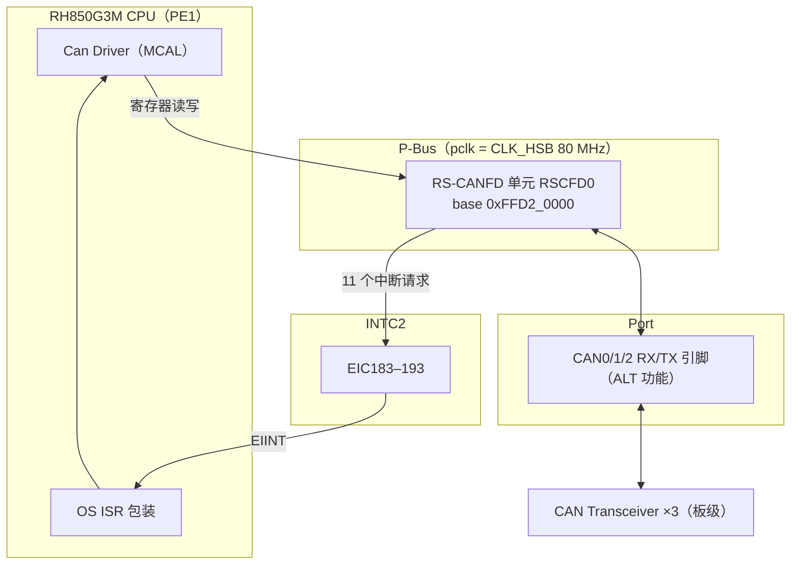
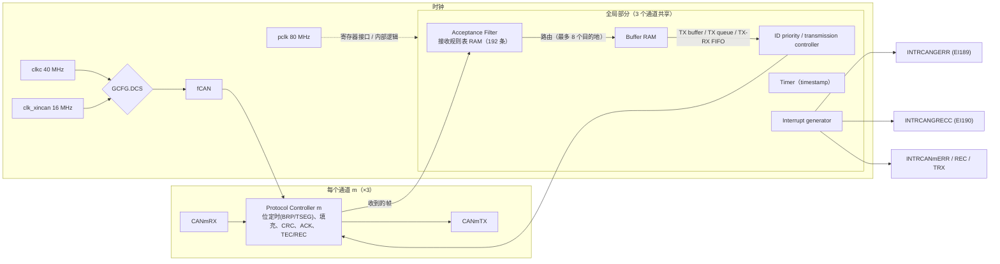
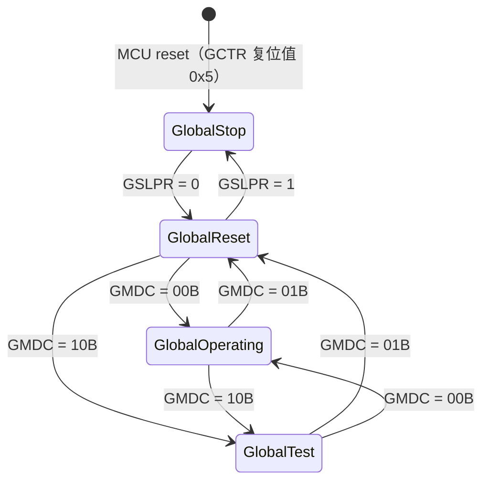
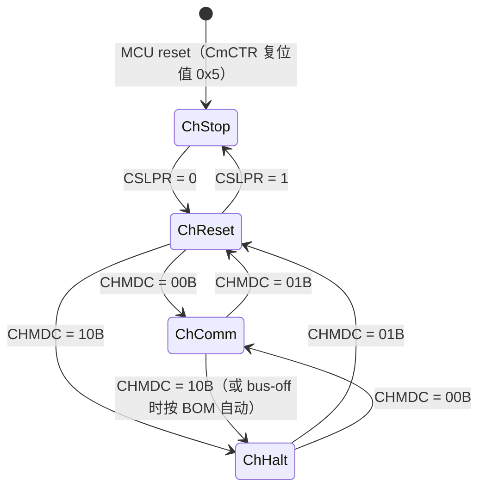
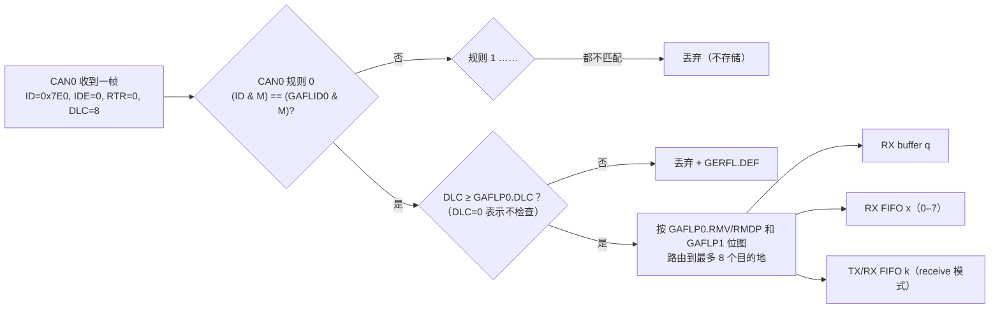

# RH850/P1M-E 的 CAN 外设：RS-CANFD 全景

> Prerequisite: [01-can-hardware-basics.md](01-can-hardware-basics.md)、[RH850 Memory Map](../01-rh850/03-memory-map.md)、[RH850 外设总览](../01-rh850/08-peripheral-overview.md)
> Next: [03-can-clock-bit-timing.md](03-can-clock-bit-timing.md)
> 对应规范: RH850/P1M-E HW Manual R01UH0585EJ0120 Rev.1.20（HW-E）§17：p.788–797（概况/时钟/中断/引脚/规格/框图）、p.798–802（Classical 寄存器映射）、p.916–920（FD 寄存器映射）、p.1062–1066（模式）、p.1072–1077（接收/发送功能）、p.1097（RAM 容量）、p.1122（注意事项）；AUTOSAR CP R22-11 SWS CAN Driver p.15（术语）、p.33（一个 Can 模块 = 一个 CAN Hardware Unit）
> 对应源码: `docs/hardware-registers.json`（1185 条已核对地址）、`tools/build_hardware_index.py`；openAUTOSAR 无 Can driver

---

## 1. 本章目标

1. 说清楚 P1M-E 上的 CAN 外设"是什么"：名字、数量、基址、时钟、中断、引脚——并且不会和 P1x 的 RS-CAN、P1x-C 的 MCAN 搞混。
2. 画出 RS-CANFD 的内部结构：protocol controller、接收规则表（AFL）、CAN RAM 中的各种 buffer/FIFO。
3. 理解 **global mode** 与 **channel mode** 两级状态机，以及"global 模式会强制改变 channel 模式"。
4. 区分四种存储资源：**RX buffer、RX FIFO、TX/RX FIFO（common FIFO）、TX buffer**（外加 TX queue），知道它们的数量、归属（全局共享还是每通道）、寄存器窗口。
5. 理解 **Classical CAN mode 与 CAN FD mode 是两套不同的寄存器映射**，同一个地址在两种模式下含义不同。
6. 为后续把 AUTOSAR 的 CanController / HTH / HRH 映射到这些资源打好基础。

---

## 2. 为什么需要先"看全景"？

AUTOSAR Can 驱动的配置（CanController、CanHardwareObject、CanHwFilter）是**硬件无关**的抽象，而 RS-CANFD 是一个非常具体的、带很多选项的 IP。MCAL 的核心工作就是在两者之间做映射：

```text
AUTOSAR 抽象                         RS-CANFD 具体资源
---------------------------------    -------------------------------------------
Can 模块（一个 CAN Hardware Unit）  → RSCFD0（整个单元，基址 0xFFD2_0000）
CanController × N                   → 通道 CAN0 / CAN1 / CAN2
CanHardwareObject (TRANSMIT) = HTH  → TX buffer p / TX queue / TX/RX FIFO(tx 模式)
CanHardwareObject (RECEIVE)  = HRH  → AFL 规则 + RX FIFO x / RX buffer q / TX/RX FIFO(rx 模式)
CanHwFilter (Code/Mask)             → GAFLIDj / GAFLMj
```

如果你不知道 RS-CANFD 有哪些资源、哪些是全局共享的、哪些只能在某个模式下配置，就无法判断一个 MCAL 配置是否合理，更不可能自己写 driver。

---

## 3. 在系统中的位置



- RS-CANFD 挂在外设总线上，CPU 通过普通 load/store 访问它的寄存器和 CAN RAM 窗口。
- 中断经 INTC2 的 EIC183–193 送到 CPU（[05-can-interrupt.md](05-can-interrupt.md)）。
- 引脚经 Port 的 alternative function 引出（[04-can-pin-transceiver.md](04-can-pin-transceiver.md)）。

---

## 4. 先确认芯片：RS-CANFD、RS-CAN、MCAN 不是一回事

`[RH850 Hardware]`

| 器件 | CAN IP | 能否套用本章 | 依据 |
|---|---|---|---|
| **RH850/P1M-E（R7F701381 等）** | **RS-CANFD**（Classical + FD） | ✔ 本教程目标 | HW-E p.788, p.791 |
| RH850/P1H、P1M（非 -E） | RS-CAN（只有 Classical） | ✘ 寄存器名/偏移不同 | HW-X §17 p.772 |
| RH850/P1x-C（P1H-C / P1M-C） | MCAN / M_TTCAN（Bosch M_CAN 系） | ✘ 完全不同的 IP | DS-C p.4 |

真实项目第一件事：看 BOM / 芯片丝印，或运行时读 `PRDNAME1–4`（HW-E p.2880）确认型号。**三个系列的寄存器不能互相套用**（研究笔记 04 §1.1）。

> 历史提醒：本仓库早期截图转录 `requirements-extracted.md` 把外设写成 "RS-CAN"，这是错误的；P1M-E §17 的标题是 "CANFD Interface (RS-CANFD)"（HW-E p.791）。

---

## 5. RS-CANFD 概况（P1M-E）

`[RH850 Hardware]`

| 项目 | 值 | 出处 |
|---|---|---|
| 单元数 | **1**（RSCFD0），100-pin 和 144-pin 相同 | HW-E p.788 Table 17.1 |
| 通道数 | **3**（CAN0/CAN1/CAN2），所有 P1M-E 型号都有 | HW-E p.788 Table 17.2 |
| 基址 | **`0xFFD2_0000`**（整个单元一个基址，三个通道在内部按偏移区分） | HW-E p.791 Table 17.5 |
| 时钟 | pclk = CLK_HSB 80 MHz（寄存器接口）；clkc = CLK_LSB 40 MHz；clk_xincan = MainOSC 16 MHz（后两者经 `GCFG.DCS` 选为 fCAN） | HW-E p.791 Table 17.6/17.7 |
| 协议 | ISO 11898-1；Classical 最高 1 Mbps；FD 仲裁段最高 1 Mbps、数据段最高 8 Mbps | HW-E p.794 |
| 中断 | 11 个：2 个全局（RX FIFO、global error）+ 每通道 3 个（error、TX/RX FIFO receive、transmit） | HW-E p.795, p.1057 |
| 接收规则 | 全模块 192 条，每通道最多 128 条，不能跨通道共享 | HW-E p.795, p.1072 |
| TX buffer | 每通道 16 个（共 48 个，编号 p=16m…16m+15） | HW-E p.794, p.1076 |
| RX buffer | 0–48 个，全通道共享 | HW-E p.1072 |
| RX FIFO | 8 个，全通道共享，每个最多 128 级 | HW-E p.1072 |
| TX/RX FIFO | 每通道 3 个（全模块 k=0–8，通道 m 用 3m…3m+2） | HW-E p.789–790, p.1072 |
| TX queue | 每通道 1 个 | HW-E p.1076 |
| 其他 | transmit history、gateway、interval transmission、timestamp、mirror、DLC filter、测试模式 | HW-E p.795–796 |

**索引约定**（手册通篇使用，读寄存器名必须先认识它们，HW-E p.789–790）：

| 符号 | 含义 | 范围 |
|---|---|---|
| n | 单元号 | 0（只有 RSCFD0） |
| m | 通道号 | 0–2 |
| j | 规则在当前页内的序号 | 0–15 |
| x | RX FIFO 号 | 0–7 |
| k | TX/RX FIFO 号 | 0–8 |
| q | RX buffer 号 | 0–47 |
| p | TX buffer 号 | 0–47 |
| y | 32 位状态寄存器的分组号 | 0–1 |

---

## 6. 内部结构（框图）

HW-E p.797 Figure 17.1 是官方框图。下面按"数据流"重画，便于理解（`[Conceptual]`，模块名与手册一致）：



阅读要点：

1. **Protocol controller 每通道一个**：它们各自有自己的位定时（`CmCFG` 或 `CmNCFG/CmDCFG`）、错误计数器（`CmSTS`）、模式（`CmCTR`）。
2. **接收过滤和 buffer RAM 是全局的**：所有通道收到的帧都进入同一个 acceptance filter，按"该通道的规则"匹配后，被路由到 buffer RAM 中的目的地。
3. **fCAN 只经过 DCS 选择，然后进入每个通道的 BRP 分频**；pclk 不参与位定时（[03-can-clock-bit-timing.md](03-can-clock-bit-timing.md) §"为什么不是 80 MHz"）。

**对 driver 设计的直接推论**：由于规则表、RX FIFO、`GCFG` 是全局共享的，**"只初始化/重置 CAN1 而不影响 CAN0"只能在 channel 级别做**；任何需要 global reset 的操作（改规则表、改 RX FIFO 深度、改 `GCFG`）都会影响所有通道（handoff §11 前提）。这就是为什么 AUTOSAR 规定一个 Can 模块对应一个 CAN Hardware Unit（SWS p.15、p.33 §7.1），并由 `Can_Init` 统一初始化全局部分（`SWS_Can_00250` p.43："Common setting for the complete CAN HW unit"）。

---

## 7. 两种接口模式：Classical CAN mode vs CAN FD mode

### 7.1 是什么

`[RH850 Hardware]` HW-E p.796："These two modes use different register maps with the same base address. Register maps change by switching interface modes."

| | Classical CAN mode | CAN FD mode |
|---|---|---|
| 选择 | `GRMCFG.RCMC = 0`（复位值） | `GRMCFG.RCMC = 1` |
| 能处理的帧 | 只有 Classical | Classical + FD（每帧由 FDF/BRS 决定） |
| 寄存器名前缀 | `RSCANn…`（如 `RSCAN0C0CFG`） | `RSCFDnCFD…`（如 `RSCFD0CFDC0NCFG`） |
| 位定时寄存器 | `CmCFG`（+0x0000+0x10m） | `CmNCFG`（+0x0000+0x10m）+ `CmDCFG`（+0x0500+0x20m） |
| 规则表窗口 | `+0x0500` 起 | `+0x1000` 起 |
| RX FIFO 读窗口 | `RFIDx` 在 `+0x0E00 + 0x10x` | `RFIDx` 在 `+0x3000 + 0x80x` |
| TX buffer 窗口 | `TMIDp` 在 `+0x1000 + 0x10p` | `TMIDp` 在 `+0x4000 + 0x20p` |
| RAM 容量 | 3072 B（16 B/条，≤192 条） | 5376 B |
| 确认当前模式 | `CANFDMDR`（`+0x8000`）bit0，只读 | 同左 |

出处：HW-E p.796, p.798–802, p.916–920, p.1097；handoff §4。

`GRMCFG`（`0xFFD2_04FC`）只能在 global reset 中修改，**并且必须先于其他 CAN 寄存器设置**（HW-E p.802）。运行后切换模式，需要先把只属于旧映射的寄存器恢复复位值（HW-E p.1122 第一条）。

### 7.2 为什么这很危险

看这个地址冲突（handoff §4）：

| 地址 | Classical 模式下 | FD 模式下 |
|---|---|---|
| `0xFFD2_0500` | `GAFLID0`（规则 0 的 ID） | `C0DCFG`（CAN0 数据段位定时） |
| `0xFFD2_1000` | `TMID0`（TX buffer 0 的 ID） | `GAFLID0`（规则 0 的 ID） |

- 在 FD 模式下按 Classical 地址写规则 → **你改的其实是 CAN0 的数据段波特率**。
- 在 Classical 模式下按 FD 地址写规则 → **你覆盖了 TX buffer 0**。

两种情况都能编译、都不会触发异常，症状是"有时收不到 / 数据段速率莫名其妙"。**基址相同不等于寄存器布局相同。** 这也是为什么 `docs/hardware-registers.json` 用 `mode` 字段把寄存器分成 `SYSTEM / CAN_BOTH / CAN_CLASSIC / CAN_FD`，并在 `mode_policy` 中要求"只使用 CAN_BOTH + 恰好一种模式"。

### 7.3 在 driver 中如何防止混用

`[Educational Implementation]`（教学示意：用编译期开关只暴露一套窗口宏）

```c
/* EduCan_Reg.h —— 教学示意，地址依据 HW-E p.798-799 / p.916-919 */
#define EDUCAN_BASE              (0xFFD20000UL)

#if (EDUCAN_INTERFACE_MODE == EDUCAN_MODE_CLASSICAL)        /* GRMCFG.RCMC = 0 */
  #define EDUCAN_CmCFG(m)        (EDUCAN_BASE + 0x0000UL + 0x10UL*(m))
  #define EDUCAN_GAFLID(j)       (EDUCAN_BASE + 0x0500UL + 0x10UL*(j))
  #define EDUCAN_RFID(x)         (EDUCAN_BASE + 0x0E00UL + 0x10UL*(x))
  #define EDUCAN_TMID(p)         (EDUCAN_BASE + 0x1000UL + 0x10UL*(p))
#elif (EDUCAN_INTERFACE_MODE == EDUCAN_MODE_FD)              /* GRMCFG.RCMC = 1 */
  #define EDUCAN_CmNCFG(m)       (EDUCAN_BASE + 0x0000UL + 0x10UL*(m))
  #define EDUCAN_CmDCFG(m)       (EDUCAN_BASE + 0x0500UL + 0x20UL*(m))
  #define EDUCAN_GAFLID(j)       (EDUCAN_BASE + 0x1000UL + 0x10UL*(j))
  #define EDUCAN_RFID(x)         (EDUCAN_BASE + 0x3000UL + 0x80UL*(x))
  #define EDUCAN_TMID(p)         (EDUCAN_BASE + 0x4000UL + 0x20UL*(p))
#else
  #error "EDUCAN_INTERFACE_MODE must select exactly one register map"
#endif

/* 两种模式偏移相同的全局寄存器（HW-E p.798） */
#define EDUCAN_CmCTR(m)          (EDUCAN_BASE + 0x0004UL + 0x10UL*(m))
#define EDUCAN_CmSTS(m)          (EDUCAN_BASE + 0x0008UL + 0x10UL*(m))
#define EDUCAN_CmERFL(m)         (EDUCAN_BASE + 0x000CUL + 0x10UL*(m))
#define EDUCAN_GCFG              (EDUCAN_BASE + 0x0084UL)
#define EDUCAN_GCTR              (EDUCAN_BASE + 0x0088UL)
#define EDUCAN_GSTS              (EDUCAN_BASE + 0x008CUL)
#define EDUCAN_GRMCFG            (EDUCAN_BASE + 0x04FCUL)
#define EDUCAN_TMC(p)            (EDUCAN_BASE + 0x0250UL + (p))   /* 8 位！ */
#define EDUCAN_TMSTS(p)          (EDUCAN_BASE + 0x02D0UL + (p))   /* 8 位！ */
```

关键设计：**FD 模式下根本不定义 `EDUCAN_CmCFG`**，Classical 模式下根本不定义 `EDUCAN_CmDCFG`——写错就编译失败。真实 MCAL 往往在生成代码里固定模式，原理相同。

> 本节只列出部分寄存器作为示意；完整偏移请查 `docs/hardware-registers.json` 或 HW-E p.798–799 / p.916–919，不要从本示例推断未列出的寄存器。

---

## 8. 两级模式：Global mode 与 Channel mode

### 8.1 Global mode（整个单元）

`[RH850 Hardware]` HW-E p.1062–1064



| 模式 | 作用 | 典型用途 |
|---|---|---|
| Global stop | 停掉整个模块时钟，寄存器可读不可写（除 GSLPR） | 复位后状态；低功耗 |
| Global reset | **做全局配置**：`GCFG`、规则表、RX FIFO 配置、`RMNB` 等只能在此写 | `Can_Init` 的主体 |
| Global test | 测试设置、RAM test | 自检 |
| Global operating | 模块运行 | 正常工作 |

状态确认看 `GSTS`（`0xFFD2_008C`）：`GRSTSTS`(b0)、`GHLTSTS`(b1)、`GSLPSTS`(b2)、`GRAMINIT`(b3)，复位值 `0xD`（HW-E p.821）。

### 8.2 Channel mode（每个通道）

`[RH850 Hardware]` HW-E p.1065–1066



| 模式 | 作用 |
|---|---|
| Channel stop | 通道时钟停止；只能写 `CSLPR` |
| Channel reset | **做通道配置**：位定时 `CmCFG`（首次必须在 reset 中写）、`CmCTR` 中的 `BOM` 和中断使能（HW-E p.804, p.807–808）；进入时清除 TEC/REC、错误标志、TX buffer 状态等（Table 17.180, p.1070） |
| Channel halt | 停止通信，保留部分状态；允许测试设置（`CTMS/CTME` 只能在 halt 改，p.807）；bus-off 后按 `BOM` 可能自动进入 |
| Channel communication | 正常收发；检测到 11 个连续 recessive 后 `CmSTS.COMSTS=1` 才真正能通信（p.1068） |

状态确认看 `CmSTS`：`CRSTSTS`(b0)、`CHLTSTS`(b1)、`CSLPSTS`(b2)、`EPSTS`(b3)、`BOSTS`(b4)、`TRMSTS`(b5)、`RECSTS`(b6)、`COMSTS`(b7)（HW-E p.810–811）。

### 8.3 Global 模式会强制改变 Channel 模式

`[RH850 Hardware]` HW-E p.1063 Table 17.176（这张表是理解"为什么改一个全局设置会让所有通道掉线"的关键）：

| 当前 channel 模式 ↓ / 设置 global → | Operating (GMDC=00) | Test (GMDC=10) | Reset (GMDC=01) | Stop (GSLPR=1) |
|---|---|---|---|---|
| Communication | 保持 communication | → halt | **→ reset** | 禁止 |
| Halt | halt | halt | **→ reset** | 禁止 |
| Reset | reset | reset | reset | → stop |
| Stop | stop | stop | stop | stop |

结论：

- **进入 global reset 会把所有通道强制拉到 channel reset**——CAN0 正在通信，你为了改 CAN1 的接收规则进入 global reset，CAN0 也会断线并清掉 TEC/REC 和 TX buffer 状态。
- 进入 global stop 之前，所有通道必须先在 reset 或 stop。

### 8.4 模式切换需要时间

`[RH850 Hardware]` HW-E p.1063 Table 17.177、p.1066 Table 17.178：

| 切换 | 最长时间 |
|---|---|
| Global stop → reset | 3 pclk |
| Global reset → operating | 10 pclk |
| Global operating → reset | 2 个 CAN bit time（取使用中通道的最低速率） |
| Channel stop → reset | 3 pclk |
| Channel reset → communication | 4 个 CANm bit time |
| Channel communication → reset | 2 个 CANm bit time |
| Channel communication → halt | 2 个 CANm frame |

所以**写完模式位必须读回状态位确认**（手册 p.1122 明确要求），并且需要超时。500 kbit/s 下 1 bit = 2 µs，"2 帧"可能是数百 µs——这正是 AUTOSAR `Can_SetControllerMode` 被定义为异步、需要 `CanTimeoutDuration` 和 `Can_MainFunction_Mode` 的硬件原因（[06-can-controller-init.md](06-can-controller-init.md)）。

---

## 9. CAN RAM

### 9.1 RAM 初始化

`[RH850 Hardware]` HW-E p.1090：MCU 复位后，RS-CANFD 自动初始化 CAN RAM，耗时 **3794 个 pclk 周期**（80 MHz 下约 47.4 µs）；期间 `GSTS.GRAMINIT=1`，完成后为 0。**必须等 `GRAMINIT=0` 后才能做任何 CAN 设置。** 在此之前，指向 RAM 的寄存器（规则表、buffer）的值未定义（p.1123）。

### 9.2 RAM 容量预算

`[RH850 Hardware]` HW-E p.1097

- **Classical 模式**：`RX buffer 数 + ΣRX FIFO 深度 + ΣTX/RX FIFO 深度 ≤ 192`（16 B/条，共 3072 B）。
- **FD 模式**：`RX buffer 数 × (12 + payload) + Σ深度 × (12 + payload) ≤ 5376 B`。
- 48 个 TX buffer 另计，不占这个预算。

例：Classical 模式，RX FIFO0 深度 8、其余全关 → 8 ≤ 192 ✔。FD 模式，RX FIFO0 深度 8、payload 16 B → 8×28 = 224 B ≤ 5376 ✔。

**为什么 driver/配置工具要检查这个**：超预算时硬件行为未定义；真实 MCAL 的配置工具会在生成阶段报错。自己写 driver 时，这个检查应该在"配置校验"中做，而不是运行时。

---

## 10. 接收路径：规则表 → buffer / FIFO

### 10.1 接收规则表（AFL，Acceptance Filter List）

`[RH850 Hardware]` HW-E p.1072–1074, p.830–837

- 每条规则 = 4 个 32 位寄存器：`GAFLIDj`（ID/IDE/RTR/LB）、`GAFLMj`（掩码）、`GAFLP0_j`（DLC 门限、label、RX buffer 指针）、`GAFLP1_j`（FIFO 目的地位图）。
- 规则表通过一个"页窗口"访问：`GAFLECTR.AFLDAE=1` 打开写入，`AFLPN` 选页（每页 16 条，共 12 页）。
- `GAFLCFG0.RNC0/1/2` 设置每个通道的规则数；规则按通道顺序**连续**存放；**不能跨通道共享**；**一条规则都不配，就什么都收不到**（p.1072）。
- 匹配从该通道最小编号的规则开始，**命中第一条即停止**；若随后的 DLC 检查失败，报文直接丢弃并置 `GERFL.DEF`（p.1073–1074, p.1122）。
- **掩码语义：`GAFLM` 中位为 1 表示"比较"，为 0 表示"不比较"**（p.1073 Figure 17.7 旁注、p.834）。所以标准数据帧精确匹配的掩码是 `0xC00007FF`（同时比较 IDE、RTR 和 11 位 ID）。



### 10.2 三种接收目的地

| 目的地 | 数量/归属 | 行为 | 对应中断 | 典型 AUTOSAR 用法 |
|---|---|---|---|---|
| **RX buffer** | 0–48 个，全通道共享，`RMNB.NRXMB` 设定数量 | **覆盖式**：新帧覆盖旧帧，永远读到最新值；`RMNDy.RMNSq` 表示有新数据 | **无专用中断**，需轮询 | FULL HRH，信号类周期报文（只关心最新值） |
| **RX FIFO** | 8 个，全通道共享，深度 4–128（`RFCCx.RFDC`） | **排队式**：按先后读出；满了新帧丢弃并置 `RFMLT` | **INTRCANGRECC = EI190**（8 个 FIFO 共用） | BASIC/FULL HRH，诊断等不能丢帧的报文 |
| **TX/RX FIFO（common FIFO）receive 模式** | 每通道 3 个（k=3m…3m+2） | 排队式，接收完成可产生 `CFRXIF` | **INTRCANmREC = EI184/187/192**（每通道一个） | 需要每通道独立中断的 HRH |

出处：HW-E p.1072, p.838–848, p.1058。

> **重要区分**：EI184 的手册名称是 "CAN0 transmit/receive FIFO receive completion interrupt"（p.792），Table 6.11 写作 "COM RX FIFO interrupt 0"（p.285）——它是 **common FIFO（TX/RX FIFO）** 的接收中断，**不是 RX FIFO 的中断**。8 个 RX FIFO 的中断是 **EI190（INTRCANGRECC）**。旧文档 `docs/agent-guide.md:71` 曾把 EI184 称为 "RxFIFO"，是错误的（研究笔记 01 §3 已标注；已在一致性复审中修正，见 [05-consistency-review-log](../reference/research/05-consistency-review-log.md)）。

---

## 11. 发送路径：TX buffer / TX queue / TX-RX FIFO

`[RH850 Hardware]` HW-E p.1076–1077, p.878–887, p.1122

| 方式 | 数量 | 特点 | 典型 AUTOSAR 用法 |
|---|---|---|---|
| **TX buffer** | 每通道 16 个（p=16m…16m+15） | 一个 buffer 一帧；`TMCp.TMTR=1` 请求；`TMSTSp.TMTRF` 报告结果；FD 下最多 20 B（merge 模式可更长） | **一个 HTH ↔ 一个或多个 TX buffer**（最直观） |
| **TX queue** | 每通道 1 个，占用该通道**最高编号**的若干 TX buffer，`(16m+15)` 是访问窗口 | 队列中所有帧按 ID 优先级发送；要求 `GCFG.TPRI=0` | 一个 BASIC HTH 映射成队列（取决于 MCAL 实现） |
| **TX/RX FIFO（transmit 模式）** | 每通道 3 个，每个链接一个 TX buffer | FIFO 先进先出；FD 下可到 64 B；被链接的 TX buffer 必须 `TMCp=00H` 且 `TMIEp=0` | 需要按顺序发送的流（例如某些 TP 实现） |

另外：

- **发送优先级**：`GCFG.TPRI=0` 按 ID（同一通道内 ID 小的先发），`=1` 按 buffer 号；对所有通道生效（p.817, p.1077）。
- **TMCp / TMSTSp 是 8 位寄存器**（p.878, p.880）：用 32 位写 `TMC0` 会同时写到 `TMC1–3`，这是一个真实存在的 bug 类型。
- **中止发送**：`TMCp.TMTAR=1`，等 `TMTRF=01B`；正在总线上的帧无法中止（p.879, p.1111）。注意 AUTOSAR R22-11 的 Can 驱动没有公开的 abort API（研究笔记 02 §2.7.3），但 `Can_SetControllerMode(CAN_CS_STOPPED)` 内部需要取消挂起的发送（`SWS_Can_00282` p.41）。

---

## 12. RH850 → AUTOSAR 映射预览

`[Conceptual]`（一种常见映射，非唯一；真实 MCAL 以供应商文档为准）

| RS-CANFD | AUTOSAR | 详见 |
|---|---|---|
| RSCFD0 整个单元 | 一个 Can 模块实例（`Can_ConfigType` 一份） | [08-can-configuration.md](08-can-configuration.md) |
| 通道 CANm | `CanController`（`CanControllerId`） | [06-can-controller-init.md](06-can-controller-init.md) |
| `CmCFG` / `CmNCFG`+`CmDCFG` | `CanControllerBaudrateConfig` / `CanControllerFdBaudrateConfig` | [03-can-clock-bit-timing.md](03-can-clock-bit-timing.md) |
| channel communication / reset / halt / stop | `CAN_CS_STARTED / STOPPED / SLEEP`（映射需设计） | [06-can-controller-init.md](06-can-controller-init.md) |
| TX buffer p | HTH | [07-hoh-hrh-hth.md](07-hoh-hrh-hth.md) |
| AFL 规则 + RX FIFO / RX buffer | HRH + `CanHwFilter` | [07-hoh-hrh-hth.md](07-hoh-hrh-hth.md) |
| EI183–193 | Can 模块实现的 ISR（`SWS_Can_00033` p.33） | [05-can-interrupt.md](05-can-interrupt.md) |
| `CmSTS.TEC/REC/EPSTS/BOSTS` | `Can_GetControllerErrorState` 等 | [13-can-error-busoff.md](13-can-error-busoff.md) |

---

## 13. openAUTOSAR 与当前教学项目

- **openAUTOSAR**：没有 Can driver。`boards/linuxOs/MCAL/Can/include/Can_Cfg.h` 只是一个头文件，其 `Can_HardwareObjectType`（`:97-128`）带有 `Can_Arc_MbMask`（"A '1' in bit 31(ppc) occupies Mb 0 in HW"）——这是 Freescale MPC5xxx FlexCAN 的"消息邮箱位图"思想，和 RS-CANFD 的"规则表 + FIFO"结构完全不同。这提醒我们：**AUTOSAR 配置容器是通用的，但 HOH 到硬件资源的映射方式是每个 IP 自己的**。
- **当前项目**：没有 RS-CANFD 寄存器访问代码；但有两个可直接使用的资产：
  - `docs/hardware-registers.json`：1185 条按模式分类、带页码的寄存器地址；
  - `tools/build_hardware_index.py --check`：校验这些地址的宽度、对齐和两套 CAN 映射的互斥性。
  - `examples/rh850_mcal_reference/platform/Rh850_Mmio.c`：volatile 8/16/32 位访问层，可作为将来写 RS-CANFD 寄存器的基础（**注意它支持 8 位访问，正是 `TMCp/TMSTSp` 需要的**）。

---

## 14. Debug 方法

### 14.1 第一眼看什么

调试器连上后，在 Memory 窗口打开 `0xFFD2_0000`，按以下顺序读：

| 步骤 | 寄存器 | 期望 | 不符合说明 |
|---|---|---|---|
| 1 | `CANFDMDR` `0xFFD2_8000` bit0 | 与你设计的模式一致 | 模式选错，后面所有窗口地址都错 |
| 2 | `GSTS` `0xFFD2_008C` | 运行时 `[3:0]=0` | `GRAMINIT=1`：RAM 未初始化完；`GRSTSTS=1`：仍在 global reset |
| 3 | `GCFG` `0xFFD2_0084` | `DCS` 位符合时钟设计 | fCAN 错 → 波特率全错 |
| 4 | `C0CTR/C0STS` | `CHMDC=00`，`C0STS[2:0]=0`，`COMSTS=1` | 通道未进入 communication，或总线无 11 个 recessive |
| 5 | `GAFLCFG0` `0xFFD2_009C` | 规则数非 0 | 规则数为 0 → 什么都收不到 |
| 6 | `RFCC0` `0xFFD2_00B8` | `RFE=1` | FIFO 未使能 |

### 14.2 断点建议

- 在 driver 写 `GRMCFG` 的那一行打断点，确认它是**第一个**被写的 CAN 配置寄存器（GRAMINIT 检查和 GSLPR 之后）。
- 对 `0xFFD2_0500` 设置数据写断点（data breakpoint）：FD 模式下如果规则写入代码命中这里，说明用了 Classical 窗口。

---

## 15. 常见错误

| 错误 | 症状 | 根因 / 依据 |
|---|---|---|
| 用 P1x 的 RS-CAN 例程或 F1x 的代码套 P1M-E | 寄存器偏移对不上 | IP 不同（§4） |
| 模式与窗口混用 | 波特率异常、TX buffer 0 被覆盖 | 两套映射（§7.2） |
| 32 位写 `TMCp` / `TMSTSp` | 相邻 buffer 被误触发或误清除 | 8 位寄存器（HW-E p.878, p.880） |
| 只配置 EI183/184/185 就以为 CAN0 中断齐全 | RX FIFO 消息永远到不了 CanIf | RX FIFO 中断是 EI190（§10.2） |
| 规则数 `RNC0=0` | 什么都收不到 | HW-E p.1072 |
| 为改 CAN1 规则进入 global reset | CAN0 也掉线 | Table 17.176（§8.3） |
| 写完 `GCTR/CmCTR` 立即配置下一步 | 写入被忽略（仍在旧模式） | 需要读回状态 + 超时（p.1122） |
| RX buffer 当 FIFO 用 | 丢帧（只保留最新） | RX buffer 是覆盖式（p.1072） |
| 规则掩码按"0=比较"理解 | 规则变成通配或永不匹配 | GAFLM：1=比较（p.1073） |

---

## 16. 实验

**实验 1：地址计算（无硬件）**
分别在 Classical 和 FD 模式下计算：CAN1 的第 3 个 TX buffer（全局 p=?）的 `TMIDp`、`TMPTRp`、`TMCp`、`TMSTSp` 地址；RX FIFO 2 的 `RFIDx` 地址。然后在 `docs/hardware-registers.json` 中查找核对（`python tools/build_hardware_index.py --check` 可校验整份索引）。

**实验 2：资源规划（无硬件）**
需求：CAN0 接收 20 个周期信号报文（只要最新值）+ 2 个诊断请求 ID（不能丢）；CAN1 接收 50 个报文（都要排队）。请设计：每通道规则数、RX buffer 数、RX FIFO 分配与深度，并验证 Classical 模式 192 条预算和"每通道 ≤128 条规则"。

**实验 3：模式表推演（无硬件）**
CAN0 在 communication、CAN1 在 halt、CAN2 在 stop。此时写 `GCTR.GMDC=01`，三个通道分别变成什么模式？再写 `GSLPR=1` 呢？用 Table 17.176 验证。

**实验 4（有硬件）**：上电后不做任何配置，读 `GCTR`、`GSTS`、`C0CTR`、`C0STS`，与手册复位值（GCTR=0x5，GSTS=0xD 或 0x5——取决于 RAM 初始化是否已完成，CmCTR=0x5，CmSTS=0x5）比较。

---

## 17. 思考题

1. 为什么 RS-CANFD 把规则表和 RX FIFO 设计成全局共享，而 TX buffer 设计成每通道专属？这对 MCAL 的初始化粒度有什么影响？
2. RX buffer 没有中断。如果某个 HRH 映射到 RX buffer，AUTOSAR 的 `CanRxProcessing` 应该怎么配？（提示：`CanHardwareObjectUsesPolling`，SWS p.124；`SWS_Can_00007` p.50。）
3. 如果需要"每个通道一个独立的接收中断"，应该用 RX FIFO 还是 TX/RX FIFO？各自的代价是什么？
4. 为什么手册要求 `GRMCFG` 必须先于其他寄存器设置？结合 §7.2 的地址冲突想一想。
5. `CmSTS[2:0]=0`（通道处于 communication）和 `COMSTS=1` 有什么区别？driver 应该在哪个条件满足时通知上层 "STARTED"？

---

## 18. 对未来真实项目的意义

`[Real Project Consideration]`

- **读 Renesas MCAL 配置时**：你会看到类似"Rx FIFO / Rx Buffer / Common FIFO / Tx Buffer / Tx Queue"的选项。本章让你知道每个选项对应哪种硬件行为（覆盖 vs 排队、哪个中断、全局 vs 每通道），从而判断配置是否合理。
- **截图中的真实工程现象**：研究笔记 01 提到截图工程"13 个邮箱 / 7 条规则 / mask=0 疑问"。用本章知识可以解释：规则数、HOH 数、TX buffer 数是**三个不同的概念**（handoff §7 末尾），mask=0 在 GAFLM 中表示"不比较"即通配——是否正确要看生成代码是否做了取反。
- **多通道 ECU**：改一个通道的接收规则需要 global reset，会打断其他通道。真实项目的 CanSM/BswM 通常不允许运行时改过滤器，这就是硬件原因。
- **DCM 升级**：如果升级后诊断改用 CAN FD（更长的单帧），HRH 背后的 RX FIFO payload 大小（FD 模式 `RFPLS`）和 RAM 预算都要重新核算。

---

## 19. 本章总结

- P1M-E 的 CAN 外设是 **RS-CANFD**：1 单元、3 通道、基址 `0xFFD2_0000`。
- 两级状态机：global（stop/reset/test/operating）+ channel（stop/reset/halt/communication）；global reset 强制所有通道 reset。
- 接收：AFL 规则（1=比较）→ RX buffer（覆盖）/ RX FIFO（EI190）/ TX-RX FIFO（EI184/187/192）。
- 发送：每通道 16 个 TX buffer（8 位 `TMCp/TMSTSp`）、TX queue、TX/RX FIFO。
- Classical 与 FD 接口模式是**两套寄存器映射**，`GRMCFG.RCMC` 先于一切配置。

## 20. 下一章

[03-can-clock-bit-timing.md](03-can-clock-bit-timing.md)：fCAN 从哪里来（40 MHz 还是 16 MHz，为什么不是 80 MHz），如何从波特率算出 BRP/TSEG1/TSEG2/SJW，并逐行阅读本项目的 `Can_BitTiming.c`。
