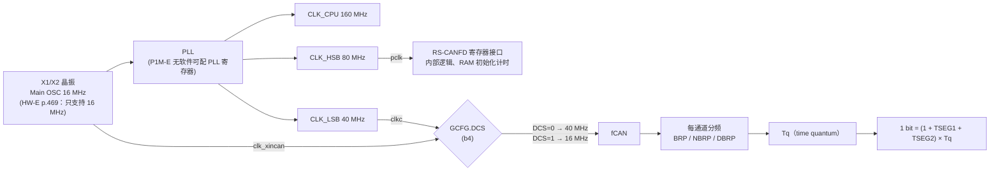
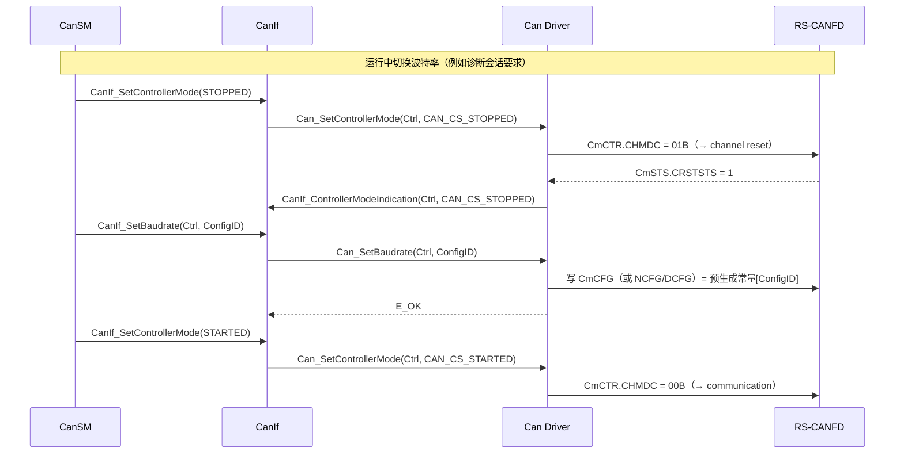

# CAN 时钟与位定时：从 fCAN 到 CmCFG / NCFG / DCFG

> Prerequisite: [01-can-hardware-basics.md](01-can-hardware-basics.md)、[02-rh850-can-peripheral.md](02-rh850-can-peripheral.md)、[RH850 Clock System](../01-rh850/07-clock-system.md)、[MCU Driver](../03-mcal/02-mcu-driver.md)（`McuClockReferencePoint` 概念）
> Next: [06-can-controller-init.md](06-can-controller-init.md)（知识依赖的下一站：位定时在初始化序列的哪一步写入）；按编号顺序阅读则先看 [04-can-pin-transceiver.md](04-can-pin-transceiver.md)
> 对应规范: HW-E（R01UH0585EJ0120 Rev.1.20）p.469（时钟表）、p.791 Table 17.6/17.7（RS-CANFD 时钟与 >2 Mbps 限制）、p.797（框图）、p.803–804（Classical `CmCFG`）、p.817（`GCFG.DCS`）、p.921–922（FD `CmNCFG`）、p.935–936（FD `CmDCFG`）、p.1092–1095（位定时设置、Figure 17.17、Table 17.183–17.185）、p.1099（TDC）；AUTOSAR CP R22-11 SWS CAN Driver p.112（`CanCpuClockRef`）、p.114–117（`CanControllerBaudrateConfig`）、p.118–121（FD）、p.65（`Can_SetBaudrate`）、p.39/p.44（`SWS_Can_00256/00062`）
> 对应源码: `examples/rh850_mcal_reference/mcal/can/Can_BitTiming.h`、`Can_BitTiming.c`、`tests/test_reference.c:160-191`；openAUTOSAR `boards/linuxOs/MCAL/Can/include/Can_Cfg.h:135-195`（`Can_ControllerConfigType` 中的 PropSeg/Seg1/Seg2/TimeQuanta 字段，R3 风格）

---

## 1. 本章目标

1. 说清 RS-CANFD 位定时的**时钟源**：clkc 40 MHz 或 clk_xincan 16 MHz，由 `GCFG.DCS` 选择；以及**为什么不是 80 MHz**。
2. 掌握一个 CAN bit 的组成（SS / TSEG1 / TSEG2 / SJW）和采样点，能从"目标波特率 + 采样点"手算出 BRP/TSEG1/TSEG2/SJW。
3. 能把物理值编码进 `CmCFG`（Classical）或 `CmNCFG/CmDCFG`（FD），并能反过来从寄存器读回值算出波特率——这是上板 debug 的基本功。
4. 能做 500 kbit/s（Classical）和 500 kbit/s / 2 Mbit/s（FD）两个完整例子。
5. 逐行读懂本项目的 `Can_BitTiming.c`，理解它为什么拒绝 80 MHz、为什么要求整除、为什么采用"保守"的 SJW 规则。
6. 理解 AUTOSAR 配置（`CanControllerBaudRate / PropSeg / Seg1 / Seg2 / SJW` + `CanCpuClockRef`）如何变成这几个寄存器值。

---

## 2. 为什么需要这一章？

CAN 是**没有时钟线**的异步总线。所有节点必须：

- 用**相同的位时间**（波特率一致，误差在容限内）；
- 在**相近的采样点**采样（同一网络通常规定统一采样点，例如 80%）。

只要有一个节点的 fCAN 算错（例如误把 80 MHz 当成 fCAN），它发出的每一位都比别人短一半，结果是：

- 它发的帧对别人来说全是 stuff/form error，别人发错误帧；
- 它收别人的帧也全错；
- TEC/REC 迅速增长 → error passive → bus-off。

而且**这类错误在单节点自测（内部回环）时完全看不出来**——因为自己和自己的波特率当然一致。这就是位定时值得单独一章的原因。

---

## 3. 在系统中的位置：时钟链



出处：时钟频率 HW-E p.469；RS-CANFD 三个时钟 p.791 Table 17.6；DCS p.817；分频与位时间 p.1092–1094（Figure 17.18）。

AUTOSAR 的对应链路（研究笔记 02 §7）：

```text
Mcu 配置 McuClockReferencePoint（"CAN 用的那个时钟是多少 Hz"）
        ↓  CanCpuClockRef（ECUC_Can_00313，SWS p.112）
CanController
        ↓  CanControllerBaudrateConfig（BaudRate / PropSeg / Seg1 / Seg2 / SJW，p.114-117）
Can 配置工具计算 BRP，生成 CmCFG 或 NCFG/DCFG 常量
        ↓  Can_Init / Can_SetBaudrate 在 channel reset 中写入
RS-CANFD 寄存器
```

注意：**AUTOSAR 配置里没有 "prescaler" 参数**。prescaler 是工具用 `时钟频率 / (BaudRate × 每位 Tq 数)` 推算出来的——所以 `CanCpuClockRef` 指向的时钟频率一旦写错，所有波特率都错，且配置界面上看起来"一切正常"。

---

## 4. fCAN：40 MHz 还是 16 MHz？为什么不是 80 MHz？

### 4.1 手册事实

`[RH850 Hardware]`

| 时钟 | 来源 | 频率 | 用途 | 出处 |
|---|---|---|---|---|
| pclk | CLK_HSB | 80 MHz（固定） | 寄存器接口、模块内部逻辑；RAM 初始化 3794 pclk；global/channel 模式切换的部分时间以 pclk 计 | p.791, p.1063, p.1090 |
| clkc | CLK_LSB | 40 MHz（固定） | **可选 fCAN**（`DCS=0`） | p.469, p.791, p.817 |
| clk_xincan | CLK_MOSC | 16 MHz（固定） | **可选 fCAN**（`DCS=1`）；**传输速率 > 2 Mbps 时禁止选择** | p.469, p.791 Table 17.7, p.817 |

HW-E p.1092 §17.11.1.1："Set the CAN clock (fCAN) as a clock source of the RS-CANFD module. Select the clk_xincan or clkc using the DCS bit"——**fCAN 只有这两个选项**。

### 4.2 为什么不是 80 MHz

1. **硬件上就没有这条路**：Figure 17.1（p.797）和 Figure 17.18（p.1094）中，进入 BRP 分频器的只有 DCS 选择后的 fCAN；pclk 不连接到位定时。
2. **80 MHz 是总线接口时钟**：它决定 CPU 访问 CAN 寄存器有多快、RAM 初始化要多久，和 CAN 位宽无关。
3. **历史错误**：本仓库早期截图转录中出现过 "80 MHz fCAN" 的假设（研究笔记 01 对 `requirements-extracted.md` 的评审），已被后续文档纠正。如果用 80 MHz 计算 500 kbit/s，会得到 BRP 偏大一倍，实际总线速率变成 250 kbit/s。
4. **代码层面的防线**：本项目 `Can_BitTiming.c:47` 只接受 16 MHz 或 40 MHz，`tests/test_reference.c:171` 专门断言 80 MHz 被拒绝（§11 详解）。

### 4.3 DCS=0（40 MHz）还是 DCS=1（16 MHz）？

| 考虑 | clkc 40 MHz | clk_xincan 16 MHz |
|---|---|---|
| FD 数据段 > 2 Mbps | ✔ 允许 | ✘ 禁止（p.791 Table 17.7） |
| Tq 分辨率 | 25 ns，更细 | 62.5 ns |
| 能整除常见波特率 | 500k/1M/2M/5M 都可整除 | 500k/1M/2M 可以，更高速率受限 |
| 时钟来源 | PLL 输出分频 | 晶振直接输入 |
| 手册示例 | Table 17.184/17.185 均有 | 只出现在 Classical 示例 Table 17.184 |

`[Real Project Consideration]` 业界常有"CAN 时钟最好直接用晶振，避免 PLL 抖动"的说法。**本仓库的 HW-E 没有给出 PLL 抖动对 CAN 的影响数据，也没有推荐 DCS 取值**；这个判断需要结合 Renesas 应用笔记、网络规范（例如 OEM 对振荡器容差的要求）确认。本教程的参考配置（handoff §11 第 5 步）选 `DCS=0`（40 MHz），理由是：同时支持 Classical 与 FD 高速数据段，且与手册示例一致。

---

## 5. 一个 bit 的结构

### 5.1 AUTOSAR / ISO 视角

`[Conceptual]`（ISO 11898-1 位时间模型）

```text
|<--------------------------- 1 bit time --------------------------->|
| Sync_Seg | Prop_Seg  |  Phase_Seg1          |   Phase_Seg2         |
|  1 Tq    | 传播延时补偿 | 可被重同步延长        |   可被重同步缩短       |
                                              ^ 采样点（Sample Point）
```

- **Sync_Seg**：固定 1 Tq，总线跳变沿应落在这里。
- **Prop_Seg**：补偿信号在总线 + 收发器上的往返延迟。
- **Phase_Seg1 / Phase_Seg2**：采样点两侧的缓冲；重同步时 Phase_Seg1 可被延长、Phase_Seg2 可被缩短，调整量不超过 **SJW**。

### 5.2 RS-CANFD 视角

`[RH850 Hardware]` HW-E p.1092 Figure 17.17：一个 bit = **SS + TSEG1 + TSEG2**

| RS-CANFD | 对应 ISO/AUTOSAR | 说明 |
|---|---|---|
| SS | Sync_Seg | 固定 1 Tq |
| TSEG1 | Prop_Seg + Phase_Seg1 | 一个字段 |
| TSEG2 | Phase_Seg2 | |
| SJW | SJW | |

**所以 AUTOSAR 的 `CanControllerPropSeg + CanControllerSeg1` 合并成 RS-CANFD 的 TSEG1。** 这是配置到寄存器的第一个映射规则。

### 5.3 公式

`[RH850 Hardware]` HW-E p.794、p.1094：

```text
Tq          = (BRP + 1) / fCAN            （BRP 是寄存器编码值，分频比 divider = BRP + 1）
每位 Tq 数   = 1 + TSEG1 + TSEG2           （物理值）
波特率       = fCAN / (divider × 每位 Tq 数)
采样点       = (1 + TSEG1) / (1 + TSEG1 + TSEG2)
```

### 5.4 取值范围（Figure 17.17，p.1092）

| 参数（物理值） | Classical | FD nominal | FD data |
|---|---|---|---|
| SS | 1 | 1 | 1 |
| TSEG1 | 4–16 | 4–128 | 2–16 |
| TSEG2 | 2–8 | 2–32 | 2–8 |
| SJW | 1–4 | 1–32 | 1–8 |
| 每位总 Tq | 8–25 | 8–161 | 5–25 |
| 分频比 divider | 1–1024（BRP 10 bit） | 1–1024（NBRP 10 bit） | 1–256（DBRP 8 bit） |
| 关系 | **TSEG1 > TSEG2 > SJW**（图中严格不等式） | 同左 | 同左 |

**手册内部的不一致**（研究笔记 01 F-CAN-4、04 §8.4、handoff §6）：Figure 17.17 写的是 `TSEG1 > TSEG2 > SJW`，而 FD 寄存器文字（p.922）写 `SJW ≤ NTSEG2`。本项目代码采用**更严格**的图中关系（§11）。这意味着 `TSEG2 = SJW` 的配置（例如截图工程中 data SJW=4、TSEG2=4）被本项目代码拒绝，但**不能据此断言它在硬件上一定不工作**——需要 Renesas 技术更新或勘误来关闭这个问题。

**FD 额外约束**（p.1092）：

- `NBRP` 必须等于 `DBRP`（两段用同一个 Tq）。
- 启用 TDC（`CmFDCFG.TDCE=1`）时，`NBRP = DBRP ≤ 1`，即分频比 ≤ 2。

### 5.5 寄存器编码："物理值 − 1"

`[RH850 Hardware]` 所有字段写入"物理值 − 1"。

**Classical `CmCFG`**（`+0x0000 + 0x10m`，HW-E p.803–804）：

| 字段 | 位 | 编码 |
|---|---|---|
| SJW[1:0] | 25:24 | SJW − 1 |
| TSEG2[2:0] | 22:20 | TSEG2 − 1 |
| TSEG1[3:0] | 19:16 | TSEG1 − 1 |
| BRP[9:0] | 9:0 | divider − 1 |

**FD `CmNCFG`**（`+0x0000 + 0x10m`，p.921）：NTSEG2[28:24]、NTSEG1[22:16]、NSJW[15:11]、NBRP[9:0]。

**FD `CmDCFG`**（`+0x0500 + 0x20m`，p.935）：DSJW[26:24]、DTSEG2[22:20]、DTSEG1[19:16]、DBRP[7:0]。

注意 NCFG 和 CFG 的**位布局不同**（NTSEG2 在 28:24，而 Classical TSEG2 在 22:20）。不能把 Classical 的 CFG 值写到 FD 的 NCFG 里。

---

## 6. 例题一：Classical CAN 500 kbit/s

### 6.1 fCAN = 40 MHz（DCS=0）

`[RH850 Hardware]` 推导过程：

1. 每位所需 fCAN 周期数 = 40 MHz / 500 kHz = **80**。
2. 80 = divider × 每位 Tq 数。Classical 每位 Tq 数 8–25 → 可选 (divider=10, 8 Tq)、(divider=8, 10 Tq)、(divider=5, 16 Tq)、(divider=4, 20 Tq)。手册 Table 17.184（p.1095）给出 "8 Tq (10)" 和 "20 Tq (4)"。
3. 选 **20 Tq、divider=4**：Tq 越多，采样点和 SJW 的调节粒度越细。
4. 采样点目标 80% → (1 + TSEG1)/20 = 0.8 → **TSEG1 = 15**，**TSEG2 = 4**。
5. SJW：需 `TSEG2 > SJW` → SJW ≤ 3，取 **SJW = 3**（容忍更大的振荡器偏差）。
6. 校验：TSEG1 15 ∈ [4,16] ✔；TSEG2 4 ∈ [2,8] ✔；SJW 3 ∈ [1,4] ✔；15 > 4 > 3 ✔；总 20 ∈ [8,25] ✔。

编码：

```text
SJW   = 3 - 1 = 2   → bits 25:24 → 0x0200_0000
TSEG2 = 4 - 1 = 3   → bits 22:20 → 0x0030_0000
TSEG1 = 15 - 1 = 14 → bits 19:16 → 0x000E_0000
BRP   = 4 - 1 = 3   → bits 9:0   → 0x0000_0003
-------------------------------------------------
C0CFG = 0x023E_0003
```

这个值与 handoff §6 路线 A、研究笔记 01 F-CAN-5、`tools/build_hardware_index.py` 中的断言一致。（若取 SJW=1，则为 `0x003E_0003`，研究笔记 04 §8.4 用的就是这个变体。）

**反算（debug 时从寄存器读回）**：读到 `0x023E0003` → BRP=3 → divider 4；TSEG1=0xE → 15；TSEG2=3 → 4；SJW=2 → 3 → 40 MHz / (4 × 20) = 500 kbit/s，采样点 16/20 = 80%。

### 6.2 fCAN = 16 MHz（DCS=1）

每位 fCAN 周期数 = 16 MHz / 500 kHz = 32。手册 Table 17.184 给出 "8 Tq (4)" 和 "16 Tq (2)"。

选 16 Tq、divider=2；80% 采样点 → 1+TSEG1 = 12.8，不是整数。取 **TSEG1=12、TSEG2=3**（采样点 13/16 = 81.25%），SJW 需 < 3 → **SJW=2**：

```text
SJW=2→1→0x0100_0000；TSEG2=3→2→0x0020_0000；TSEG1=12→11→0x000B_0000；BRP=2→1→0x0000_0001
C0CFG = 0x012B_0001
```

16 MHz 下 Tq 更粗，采样点只能在 6.25% 的台阶上选择。如果网络规范要求 "80% ± 1%"，16 MHz/16 Tq 就无法满足——这是选择 fCAN 时的实际约束。

---

## 7. 例题二：CAN FD 500 kbit/s / 2 Mbit/s

### 7.1 手册示例（fCAN = 40 MHz，divider = 1）

`[RH850 Hardware]` HW-E p.1095 Table 17.185 第二行："Nominal bit rate 500 kbps → 80 Tq (1)；Data bit rate 2 Mbps → 20 Tq (1)"。

补全 TSEG（采样点都取 80%）：

| 段 | divider | 每位 Tq | TSEG1 | TSEG2 | SJW | 采样点 | 范围检查 |
|---|---|---|---|---|---|---|---|
| Nominal | 1 | 80 | 63 | 16 | 8 | 64/80 = 80% | TSEG1 ≤128 ✔，TSEG2 ≤32 ✔，63>16>8 ✔ |
| Data | 1 | 20 | 15 | 4 | 3 | 16/20 = 80% | TSEG1 ≤16 ✔，TSEG2 ≤8 ✔，15>4>3 ✔ |

用本项目的 `Can_ComputeFdTiming()` 实际运行得到（在 scratch 中编译 `Can_BitTiming.c` 并调用，输入 `{1,63,16,8}` / `{1,15,4,3}`, `fcan=40000000`, `tdc=true`）：

```text
nominal_bps = 500000, data_bps = 2000000
nominal_sample_permyriad = 8000（80.00%）, data_sample_permyriad = 8000（80.00%）
NCFG = 0x0F3E_3800
DCFG = 0x023E_0000
```

手工核对 NCFG：NTSEG2=16−1=15→`0x0F00_0000`；NTSEG1=63−1=62=`0x3E`→`0x003E_0000`；NSJW=8−1=7→`7<<11=0x3800`；NBRP=0。合计 `0x0F3E_3800` ✔。

divider=1 ≤ 2，所以可以启用 TDC。

### 7.2 另一个可选解（divider = 2）

| 段 | divider | 每位 Tq | TSEG1 | TSEG2 | SJW | 采样点 | 编码 |
|---|---|---|---|---|---|---|---|
| Nominal | 2 | 40 | 31 | 8 | 4 | 80% | NCFG = `0x071E_1801` |
| Data | 2 | 10 | 7 | 2 | 1 | 80% | DCFG = `0x0016_0001` |

（同样由 `Can_ComputeFdTiming` 运行得到。）Nominal 与项目测试用例（500k/1M）相同，只改了 data 段。数据段只有 10 Tq，SJW 只能取 1（因为 TSEG2=2 > SJW），**重同步能力弱**——在 2 Mbit/s 这种对时序很敏感的速率下，divider=1、20 Tq 通常更好。

### 7.3 fCAN = 16 MHz 能不能做 2 Mbit/s？

Table 17.7（p.791）："Transfer Rate ≤ 2 Mbps：clk_xincan 16 MHz 可用；2 Mbps < Transfer Rate ≤ 8 Mbps：do not select"。2 Mbit/s **恰好在边界上，允许**。

16 MHz / 2 MHz = 8 → divider=1、8 Tq：TSEG1=5、TSEG2=2、SJW=1（采样点 75%）；nominal 500k：32 Tq，TSEG1=24、TSEG2=7、SJW=4（采样点 78.125%）。代码运行结果：`NCFG=0x0617_1800`，`DCFG=0x0014_0000`。

但是：data 段只有 8 Tq，无法做到 80% 采样点；nominal 也只能到 78.125%。**能用 ≠ 好用**，这也是参考配置选 40 MHz 的原因之一。

### 7.4 TDC 是另一个问题

`[RH850 Hardware]` 位定时能整除只说明"波特率算对了"。在 2 Mbit/s 以上，发送方回读自己的位时，收发器环路延迟可能接近甚至超过一个数据位，需要 **TDC**（`CmFDCFG.TDCE/TDCOC/TDCO`，HW-E p.938–940, p.1099）。TDC offset 的单位是 fCAN 周期，物理值 = 字段 + 1，需要结合收发器延迟实测确定。handoff §6 明确："本文不给出未经板级验证的'必可运行' TDCO 常数"。本教程同样不给，详见 [13-can-error-busoff.md](13-can-error-busoff.md) 与真实项目的收发器数据手册。

---

## 8. AUTOSAR 如何定义位定时配置

### 8.1 配置容器

`[AUTOSAR Standard]`（R22-11）

| 参数 | ECUC ID | 页 | 说明 | 落到 RS-CANFD |
|---|---|---|---|---|
| `CanControllerBaudRate` | 00005 | p.114 | kbps，EcucFloatParamDef | 与时钟一起决定 BRP |
| `CanControllerBaudRateConfigID` | 00471 | p.115 | 给 `Can_SetBaudrate` 用的 ID | driver 中选择第几组常量 |
| `CanControllerPropSeg` | 00073 | p.115 | Tq | 与 Seg1 相加 → TSEG1 |
| `CanControllerSeg1` | 00074 | p.116 | Tq | 同上 |
| `CanControllerSeg2` | 00075 | p.116 | Tq | TSEG2 |
| `CanControllerSyncJumpWidth` | 00383 | p.117 | Tq | SJW |
| `CanControllerFdBaudrateConfig` | — | p.118–121 | FD 数据段的 BaudRate/PropSeg/Seg1/Seg2/SJW、`TxBitRateSwitch` 等 | DCFG、TMFDCTR.BRS |
| `CanCpuClockRef` | 00313 | p.112 | 引用 `McuClockReferencePoint` | 工具计算时用的 fCAN |
| `CanControllerDefaultBaudrate` | — | p.111 | 引用默认的 BaudrateConfig | `Can_Init` 时使用 |

规范中**没有 prescaler、没有 DCS**。它们属于"实现相关"（implementation specific）的扩展——Renesas MCAL 的配置工具通常会有自己的扩展参数选择 CAN 时钟源，具体名字**需在真实项目的 MCAL 配置界面/BSWMD 中确认**。

### 8.2 从配置到寄存器值：工具做了什么

`[Conceptual]`（配置工具/生成器的典型逻辑，非任何供应商实际代码）

```text
输入：fCAN（来自 CanCpuClockRef / 供应商扩展的时钟源选择）
      BaudRate、PropSeg、Seg1、Seg2、SJW
1. TqPerBit = 1 + PropSeg + Seg1 + Seg2
2. divider = fCAN / (BaudRate × TqPerBit)，必须整除，否则报错
3. TSEG1 = PropSeg + Seg1；TSEG2 = Seg2
4. 检查 Figure 17.17 的范围与 TSEG1 > TSEG2 > SJW（或供应商采用的规则）
5. 编码为 CmCFG（Classical）或 NCFG/DCFG（FD）
6. 写入生成文件中的常量表，例如 Can_PBcfg.c 里的控制器配置结构
```

本项目的 `Can_ComputeFdTiming()` 就是第 2–5 步的一个可测试实现（FD 版）。

### 8.3 运行时：何时写入

| 时刻 | API | 硬件条件 | 依据 |
|---|---|---|---|
| 初始化 | `Can_Init(Config)` → 使用 `CanControllerDefaultBaudrate` | channel reset 中写 `CmCFG`/`NCFG`/`DCFG` | HW-E p.804（首次必须在 reset 中写）；SWS `SWS_Can_00250` p.43 |
| 运行中改波特率 | `Std_ReturnType Can_SetBaudrate(uint8 Controller, uint16 BaudRateConfigID)` | 控制器必须 STOPPED，否则 `E_NOT_OK` | SWS p.65 `SWS_CAN_00491`；p.39 `SWS_Can_00256`；p.44 `SWS_Can_00062` |



逐步说明：

1. **STOPPED 前置**：`SWS_Can_00256` 要求需要重新初始化时控制器必须处于 STOPPED；RS-CANFD 的 `CmCFG` 只能在 channel reset/halt 写（p.804），两者一致——这就是"STOPPED ≈ channel reset"映射的一个硬件理由。
2. **`Can_SetBaudrate` 只改该通道**：`SWS_Can_00255`（p.44）要求只影响单个控制器的寄存器区域。RS-CANFD 的位定时寄存器是每通道的，不需要 global reset ✔。
3. **常量预生成**：driver 不在运行时做除法和范围检查（这些在生成阶段已做），只按 ID 选一组常量写入——快速、确定。
4. CanIf/CanSM 侧 API 名称（`CanIf_SetBaudrate` 等）属于 CanIf SWS，**本仓库没有 CanIf SWS**，此处按公认 R4.x 形态描述，需以真实项目所用 release 确认。

---

## 9. RH850 Hardware Mapping 总表

| AUTOSAR | RS-CANFD 寄存器/位 | 何时写 | 页 |
|---|---|---|---|
| `CanCpuClockRef` / 供应商时钟扩展 | `GCFG.DCS`（b4） | global reset | p.817 |
| BaudRate + Seg 参数（Classical） | `CmCFG.BRP/TSEG1/TSEG2/SJW` | channel reset | p.803–804 |
| BaudRate + Seg 参数（FD nominal） | `CmNCFG.NBRP/NTSEG1/NTSEG2/NSJW` | channel reset | p.921–922 |
| FdBaudrateConfig | `CmDCFG.DBRP/DTSEG1/DTSEG2/DSJW` | channel reset | p.935–936 |
| `CanControllerTxBitRateSwitch` | 发送时 `TMFDCTRp.BRS` | 每帧 | handoff §9 |
| TDC（供应商扩展） | `CmFDCFG.TDCE/TDCOC/TDCO` | channel reset/halt | p.938–940, p.1099 |
| 接口模式（供应商扩展） | `GRMCFG.RCMC` | global reset，最先 | p.802 |

---

## 10. openAUTOSAR 的对照

openAUTOSAR 没有 Can driver，但它的 `boards/linuxOs/MCAL/Can/include/Can_Cfg.h:135-195` 定义了 R3 风格的 `Can_ControllerConfigType`，其中：

- `CanControllerBaudRate`（"in kbps"）、`CanControllerPropSeg`、`CanControllerSeg1`、`CanControllerSeg2`；
- `CanControllerTimeQuanta`——注释写 "The calculation of the resulting prescaler value depending on module clocking and time quanta shall be done offline Hardware specific"；
- `CanCpuClockRef`（这里是 `uint32`，R4 中是对 `McuClockReferencePoint` 的引用）。

这说明两点：① "prescaler 由工具离线算" 是 AUTOSAR 一贯的设计；② R3 时代把 BaudRate 放在控制器容器里，R4 之后拆到 `CanControllerBaudrateConfig` 子容器中，以支持 `Can_SetBaudrate` 的多组配置（SWS Change History：4.1.1 用 `Can_SetBaudrate` 取代 `Can_ChangeBaudrate`，p.5）。

---

## 11. Code Walkthrough：`Can_BitTiming.c`

`[RH850 Hardware]` + `[Educational Implementation]`：这是本项目真实存在、有主机测试的代码。它**只做计算，不写寄存器**，只支持 **FD 接口模式**的 NCFG/DCFG（Classical `CmCFG` 没有 C 实现，研究笔记 01 §2.3 已指出）。

### 11.1 头文件：物理值，不是编码值

`examples/rh850_mcal_reference/mcal/can/Can_BitTiming.h:6-9`

```c
/* Physical Tq counts and divider, NOT register-encoded values. */
typedef struct {
    uint16_t divider, tseg1, tseg2, sjw;
} Can_Timing;
```

**设计决策**：接口只接受物理值（divider=4 而不是 BRP=3）。原因：AUTOSAR 配置给的是物理 Tq 数；"减 1"只应在最后编码时做一次。如果接口混用编码值，调用者很容易减两次或忘记减。README 也明确警告："不能传入已减 1 的寄存器编码"。

`Can_BitTiming.h:10-13` 输出结构 `Can_FdTimingResult` 同时返回**算出的波特率、采样点（万分比）和编码值**——便于调用者与配置对照验证，而不是只拿一个"魔法数"。

`Can_BitTiming.h:15-18` 注释写明了三个策略：只支持 FD 接口；保守的 `SJW < TSEG2`（依据 Figure 17.17）；TDC 要求 divider ≤ 2。

### 11.2 `valid()`：范围检查

`Can_BitTiming.c:26-39`

```c
static bool valid(const Can_Timing *t, bool data_phase)  /* [Educational Implementation] [RH850 Hardware] */
{
    uint32_t total;
    if (t == NULL) return false;
    total = 1U + (uint32_t)t->tseg1 + t->tseg2;
    return t->divider >= 1U && t->divider <= 256U &&
           t->tseg1 >= (data_phase ? 2U : 4U) &&
           t->tseg1 <= (data_phase ? 16U : 128U) &&
           t->tseg2 >= 2U && t->tseg2 <= (data_phase ? 8U : 32U) &&
           t->sjw >= 1U && t->sjw <= (data_phase ? 8U : 32U) &&
           t->tseg1 > t->tseg2 && t->tseg2 > t->sjw &&
           total >= (data_phase ? 5U : 8U) &&
           total <= (data_phase ? 25U : 161U);
}
```

逐行对照手册（p.1092 Figure 17.17）：

| 代码 | 手册约束 | 备注 |
|---|---|---|
| `divider <= 256` | DBRP 8 位 → 1–256 | **对 nominal 也用了 256**，而 NBRP 是 10 位（1–1024）。由于 `nominal->divider != data->divider` 时直接拒绝（第 49 行），nominal 实际上也被限制在 256 以内——这是一个**保守**而非错误的选择 |
| tseg1 2–16 / 4–128 | data / nominal | ✔ |
| tseg2 2–8 / 2–32 | | ✔ |
| sjw 1–8 / 1–32 | | ✔ |
| `tseg1 > tseg2 && tseg2 > sjw` | Figure 17.17 严格不等式 | 比 p.922 文字 `SJW ≤ NTSEG2` 更严 |
| total 5–25 / 8–161 | | ✔ |

`total` 用 `uint32_t` 计算，避免 `uint16_t` 相加时的整型提升疑问；`tseg1 = UINT16_MAX` 的测试（`test_reference.c:189-190`）就是在验证这里不会因溢出误判。

### 11.3 `Can_ComputeFdTiming()`：前置条件

`Can_BitTiming.c:47-50`

```c
if (result == NULL || (fcan_hz != 16000000U && fcan_hz != 40000000U) ||  /* [Educational Implementation] [RH850 Hardware] */
    !valid(nominal, false) || !valid(data, true) ||
    nominal->divider != data->divider ||
    (tdc_enabled && nominal->divider > 2U)) return false;
```

| 条件 | 依据 |
|---|---|
| fCAN 只能是 16 MHz 或 40 MHz | p.791 Table 17.6；**这就是拒绝 80 MHz 的地方** |
| NBRP = DBRP | p.1092 "Be sure to specify the same value for both NBRP[9:0] and DBRP[7:0]" |
| TDC 时 divider ≤ 2 | p.1092 "set the equal value of 1 or less"（编码值 ≤1 即物理值 ≤2） |

### 11.4 整除检查：拒绝"近似波特率"

`Can_BitTiming.c:51-57`

```c
ntq = 1U + (uint32_t)nominal->tseg1 + nominal->tseg2;  /* [Educational Implementation] [RH850 Hardware] */
dtq = 1U + (uint32_t)data->tseg1 + data->tseg2;
ndiv = ntq * nominal->divider;
ddiv = dtq * data->divider;
if (fcan_hz % ndiv != 0U || fcan_hz % ddiv != 0U) return false;
output.nominal_bps = fcan_hz / ndiv;
output.data_bps = fcan_hz / ddiv;
```

`ndiv` 是"每位多少个 fCAN 周期"。**不能整除就拒绝**：例如 16 MHz、divider=2、nominal TSEG1=13、TSEG2=3 → 每位 17 Tq × 2 = 34 周期，16 MHz/34 ≈ 470588 bit/s，不是任何标准速率。测试 `test_reference.c:187-188` 正是这个场景（注释 "Would require rounding the requested bitrate"）。

`[Real Project Consideration]` 真实配置工具有时允许小误差（例如 < 0.5%）。本项目选择"零误差"是教学上的简化：它保证"算出来的就是精确的"，代价是少数非整除组合被拒绝。

### 11.5 速率上限

`Can_BitTiming.c:58-59`

```c
if (output.nominal_bps > 1000000U || output.data_bps < output.nominal_bps ||
    output.data_bps > (fcan_hz == 16000000U ? 2000000U : 8000000U)) return false;
```

- nominal ≤ 1 Mbit/s（p.794）。
- data ≥ nominal（数据段不会比仲裁段慢）。
- 16 MHz 时 data ≤ 2 Mbit/s（p.791 Table 17.7），40 MHz 时 ≤ 8 Mbit/s（p.794）。

### 11.6 采样点与编码

`Can_BitTiming.c:60-70`

```c
output.nominal_sample_permyriad = (uint16_t)((1U + nominal->tseg1) * 10000U / ntq);  /* [Educational Implementation] [RH850 Hardware] */
output.data_sample_permyriad = (uint16_t)((1U + data->tseg1) * 10000U / dtq);
/* R01UH0585EJ0120 pp.921-922,935-936: physical values encode as N-1. */
output.ncfg = ((uint32_t)(nominal->tseg2 - 1U) << 24) |
              ((uint32_t)(nominal->tseg1 - 1U) << 16) |
              ((uint32_t)(nominal->sjw - 1U) << 11) |
              (uint32_t)(nominal->divider - 1U);
output.dcfg = ((uint32_t)(data->sjw - 1U) << 24) |
              ((uint32_t)(data->tseg2 - 1U) << 20) |
              ((uint32_t)(data->tseg1 - 1U) << 16) |
              (uint32_t)(data->divider - 1U);
```

- 采样点用"万分比"整数表示（8000 = 80.00%），避免在嵌入式代码中用浮点。
- 移位与 §5.5 的位定义逐一对应：NTSEG2→24、NTSEG1→16、NSJW→11、NBRP→0；DSJW→24、DTSEG2→20、DTSEG1→16、DBRP→0。
- 只在所有检查通过后才 `*result = output;`（第 71 行）：**失败时不修改输出**，调用者不会拿到半成品。

### 11.7 测试在验证什么

`tests/test_reference.c:160-191`：

| 行 | 测试 | 验证点 |
|---|---|---|
| 162–169 | 40 MHz，`{2,31,8,4}` / `{2,15,4,3}`，TDC | 500k/1M，80%/80%，`NCFG=0x071E1801`、`DCFG=0x023E0001` |
| 171 | 80 MHz | **必须拒绝** |
| 172–173 | NULL 参数 | 拒绝 |
| 174–175 | data SJW=4（= TSEG2） | 保守规则拒绝 |
| 176–177 | divider 不一致 | 拒绝 |
| 178–180 | divider=4 + TDC | TDC 拒绝；无 TDC 接受 |
| 181–186 | 16 MHz，500k/1M | 81.25%/75% |
| 187–188 | 16 MHz 非整除 | 拒绝 |
| 189–190 | `tseg1 = UINT16_MAX` | 范围检查不溢出 |

运行：仓库根目录执行 `python tools/run_host_tests.py`（需要主机 GCC，C99、`-Wall -Wextra -Werror -pedantic`，见 `examples/rh850_mcal_reference/README.md`）。

---

## 12. Debug 方法

### 12.1 先读回，再测量

| 步骤 | 做什么 | 期望（以 Classical 500k/40 MHz 为例） |
|---|---|---|
| 1 | 读 `GCFG`（`0xFFD2_0084`）bit4 | DCS=0 |
| 2 | 读 `C0CFG`（`0xFFD2_0000`，Classical 模式） | `0x023E0003` |
| 3 | 用 §6.1 的反算公式算出波特率与采样点 | 500 kbit/s，80% |
| 4 | 示波器测 `CAN0TX` 引脚上最短的高/低电平宽度 | 2 µs（500 kbit/s） |
| 5 | 分析仪测采样点（若支持） | 与网络规范一致 |

**一定要第 4 步**：寄存器值对，但 fCAN 实际频率不对（例如时钟源选错、或你以为是 40 MHz 实际不是），只有示波器能发现。手册还提供了时钟输出功能（`CKSC2C` 选 LSB、`CLKD2DIV` 分频）可以把 CLK_LSB 输出到引脚测频（研究笔记 04 §4.3，handoff §2），前提是板上有可用的 EXTCLK0O 引脚。

### 12.2 症状对照

| 症状 | 优先怀疑 |
|---|---|
| 示波器位宽是期望的 2 倍 | 用 80 MHz 计算 BRP，或 DCS 选择与计算不一致 |
| 自测（内部回环）OK，接入网络后全是错误帧 | 波特率与网络不一致；采样点差异过大 |
| 小负载正常，长时间运行偶发 CRC/stuff error | 采样点偏差、SJW 太小、振荡器偏差 |
| Classical 帧正常，FD 帧数据段错误 | DCFG 错误；TDC 未配；收发器不支持该速率 |
| FD 模式下修改了"规则"后数据段速率变了 | 用 Classical 窗口写规则，覆盖了 `C0DCFG`（`0xFFD2_0500`，见 02 章 §7.2） |

### 12.3 断点

- 在写 `CmCFG/NCFG/DCFG` 的语句打断点：确认此时 `CmSTS[2:0]` = 001（channel reset）。不在 reset 中写会被忽略。
- 在 `Can_SetBaudrate` 入口打断点：确认控制器状态为 STOPPED。

---

## 13. 常见错误

| 错误 | 后果 | 正确做法 |
|---|---|---|
| 用 pclk 80 MHz 当 fCAN | 波特率减半 | fCAN = 40 或 16 MHz（p.791） |
| 寄存器填物理值而不是减 1 | 每个字段都多 1 Tq | 编码 = 物理值 − 1 |
| 把 PropSeg 丢掉，只用 Seg1 作 TSEG1 | 采样点前移 | TSEG1 = PropSeg + Seg1 |
| Classical CFG 值写进 FD NCFG | 位布局不同，结果完全错误 | 按模式选择编码函数 |
| FD 模式 NBRP ≠ DBRP | 违反 p.1092 | 两段 divider 相同，用 TSEG 调速率 |
| 16 MHz 下配置 5 Mbit/s 数据段 | 违反 Table 17.7 | > 2 Mbit/s 必须用 clkc |
| 只看配置工具显示的 "500 kbit/s" | 时钟引用错时工具仍显示正确 | 读回寄存器 + 示波器 |
| 在 communication 模式写位定时 | 写入无效 | channel reset 中写 |

---

## 14. 实验

**实验 1：运行现有测试**
执行 `python tools/run_host_tests.py`，在输出中找到 `40MHz candidate: NCFG=0x071E1801 DCFG=0x023E0001`。

**实验 2：增加 500k/2M 测试用例**
在你自己的副本中（不要修改仓库测试，或在 scratch 中写一个独立 main）调用 `Can_ComputeFdTiming(40000000U, &(Can_Timing){1,63,16,8}, &(Can_Timing){1,15,4,3}, true, &r)`，断言 `r.ncfg == 0x0F3E3800`、`r.dcfg == 0x023E0000`、两段采样点 8000。

**实验 3：写 Classical 版本**
仿照 `Can_ComputeFdTiming` 写 `Can_ComputeClassicalTiming(uint32_t fcan_hz, const Can_Timing *t, uint32_t *cfg, uint32_t *bps, uint16_t *sp)`：

`[Educational Implementation]`（练习骨架）

```c
bool Can_ComputeClassicalTiming(uint32_t fcan_hz, const Can_Timing *t,
                                uint32_t *cfg, uint32_t *bps, uint16_t *sp_permyriad)
{
    uint32_t tq, div;
    if (t == NULL || cfg == NULL || bps == NULL || sp_permyriad == NULL) return false;
    if (fcan_hz != 16000000U && fcan_hz != 40000000U) return false;     /* p.791 */
    /* TODO: Classical 范围（p.1092）：divider 1..1024, TSEG1 4..16, TSEG2 2..8, SJW 1..4,
     *       总 Tq 8..25，TSEG1 > TSEG2 > SJW                                          */
    tq  = 1U + (uint32_t)t->tseg1 + t->tseg2;
    div = tq * t->divider;
    if (fcan_hz % div != 0U) return false;
    if (fcan_hz / div > 1000000U) return false;                        /* p.794 */
    /* TODO: 按 p.803-804 编码：SJW[25:24] TSEG2[22:20] TSEG1[19:16] BRP[9:0] */
    return true;
}
```

验收：`{4,15,4,3}` @40 MHz → `0x023E0003`；`{2,12,3,2}` @16 MHz → `0x012B0001`。

**实验 4：表格练习**
用 40 MHz 计算 250 kbit/s 和 125 kbit/s 的 Classical 配置（采样点 87.5%），并与 Table 17.184（p.1095）中的分频值核对。

**实验 5（有硬件）**：用两块板或一块板 + 分析仪，故意把一个节点改成 `DCS=1` 但仍使用 40 MHz 算出的 CFG，观察错误帧与 TEC 增长。

---

## 15. 思考题

1. 为什么 FD 模式要求 NBRP = DBRP？如果允许不同，硬件在仲裁段与数据段切换时会遇到什么问题？
2. 同样是 500 kbit/s、80% 采样点，8 Tq 和 20 Tq 两种配置各有什么优缺点？
3. AUTOSAR 为什么把 PropSeg 和 Seg1 分开，而 RS-CANFD 只有一个 TSEG1？分开对配置工具有什么好处（提示：传播延迟由物理网络决定）？
4. `Can_BitTiming.c` 的 `divider <= 256` 对 nominal 段是否"过严"？在什么情况下这会拒绝一个合法配置？
5. 如果 `CanCpuClockRef` 引用的 `McuClockReferencePoint` 写成 80 MHz，配置工具会生成什么样的 CFG？上板后会看到什么现象？

---

## 16. 对未来真实项目的意义

`[Real Project Consideration]`

- **读 MCAL 配置**：在 Renesas MCAL 的配置工具里找 CAN 时钟源选项（对应 `DCS`），以及它引用的 MCU 时钟参考点。确认它是 40 MHz 或 16 MHz，而不是 80 MHz。
- **读生成代码**：在生成的 `Can_PBcfg.c`（或供应商的等价文件）中找到每个控制器的位定时常量，用本章 §6.1 的反算方法验证——这比相信 GUI 更可靠。
- **网络集成**：OEM 通常会规定采样点（例如 80% 或 87.5%）、SJW、振荡器容差。用本章方法检查你的配置能否满足；16 MHz 时钟下采样点粒度粗，可能无法满足严格规范。
- **CAN FD 升级**：诊断升级到 CAN FD 时，数据段速率、TDC、收发器能力会一起变化。TDC 参数必须有板级测量数据支撑。
- **截图工程的 SJW=4 问题**：研究笔记中截图配置的 data SJW=4、TSEG2=4，与 Figure 17.17 的严格不等式冲突。在真实项目中遇到这类"规范内部不一致"，正确做法是记录、找供应商确认，而不是凭感觉改。

---

## 17. 本章总结

- fCAN 只能是 clkc 40 MHz 或 clk_xincan 16 MHz（`GCFG.DCS`），**不是** pclk 80 MHz；>2 Mbit/s 不能用 16 MHz。
- bit = SS + TSEG1 + TSEG2；TSEG1 = PropSeg + Seg1；采样点 = (1+TSEG1)/总 Tq。
- 寄存器编码 = 物理值 − 1；Classical `CmCFG` 与 FD `NCFG/DCFG` 位布局不同。
- Classical 500k@40 MHz：`0x023E0003`；FD 500k/2M@40 MHz（手册 Table 17.185 方案）：`NCFG=0x0F3E3800`、`DCFG=0x023E0000`。
- `Can_BitTiming.c`：物理值输入、范围检查、整除检查、速率上限、万分比采样点、失败不写输出。
- AUTOSAR 没有 prescaler 参数，它由工具根据 `CanCpuClockRef` 推算；`Can_SetBaudrate` 要求 STOPPED，对应 channel reset。

## 18. 下一章

- 按编号：[04-can-pin-transceiver.md](04-can-pin-transceiver.md)——位定时决定"什么时候采样"，引脚和收发器决定"采到的电平从哪里来"。
- 按知识依赖：[06-can-controller-init.md](06-can-controller-init.md)——本章算出的寄存器值在 Figure 17.16 初始化序列的哪一步、在什么模式下写入。
