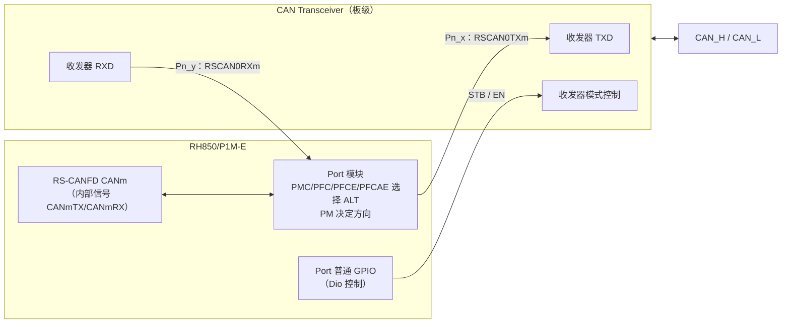
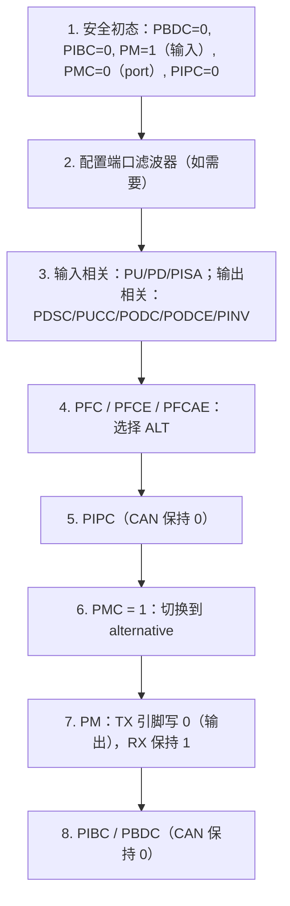
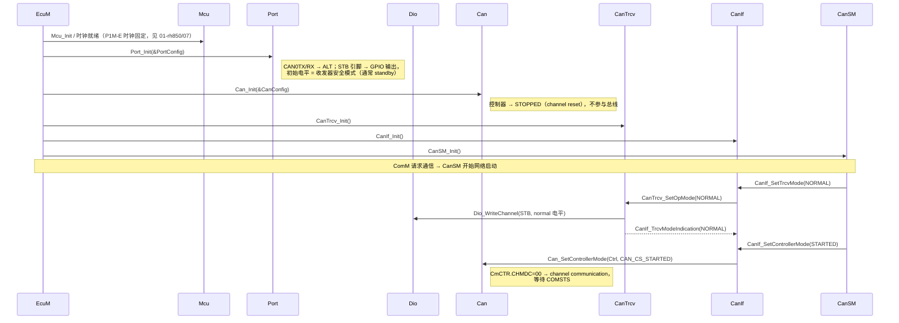
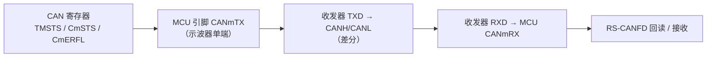

# CAN 引脚与收发器：从 RS-CANFD 到 CAN_H / CAN_L

> Prerequisite: [01-can-hardware-basics.md](01-can-hardware-basics.md)（§11 物理层）、[02-rh850-can-peripheral.md](02-rh850-can-peripheral.md)、[Port Driver](../03-mcal/03-port-driver.md)、[Dio Driver](../03-mcal/04-dio-driver.md)
> Next: [05-can-interrupt.md](05-can-interrupt.md)
> 对应规范: HW-E（R01UH0585EJ0120 Rev.1.20）p.70–74（引脚功能列表）、p.91–125（Port 寄存器）、p.94（ALT 编码）、p.126–131（Port 配置流程、PIPC 限制）、p.151–154（端口功能表）、p.158（RX 与 INTP 共用滤波器）、p.793 Table 17.10（CAN 引脚组合）；DS-E p.23；AUTOSAR CP R22-11 SWS CAN Driver p.22（`SWS_Can_00239`）、p.43（`SWS_Can_00407`）、p.24（`Can_GeneralTypes.h` 由 Can/CanIf/CanTrcv 共享）
> 对应源码: 本项目无 Port/Dio/CanTrcv 代码；`docs/rh850-hardware-handoff.md` §3（PORT 寄存器与 CAN ALT 表）；openAUTOSAR `system/EcuM/src/EcuM_Callout_Stubs.c:303-304`（"Setup CAN tranceiver // TODO"）

> **不确定性声明（务必先读）**：
> 1. **CAN 引脚的 ALT 号**来自 HW-E p.151–154 的旋转表，文本抽取后的列对齐不可靠。2026-10-02 已逐格看图确认 **P2_0/P2_1=ALT1、P3_12/P3_13=ALT3**；其余标为 ◐ 的候选仍需核对原表。
> 2. **2026-10-02 板级资料已补齐**：用户提供的 R20UT2210 Rev.1.7 底板、R20UT3831 Rev.1.0 子板手册，以及 NXP TJA1041A 数据手册，已用于确定本套板卡的默认接线。**STB/EN 由跳线控制、ERR 引到测试点，不存在默认 MCU GPIO 映射。** 跳线、CAN0/CAN1 的真实端口和寄存器目标位见 [内部 agent 执行方案 §5.3](../internal-agent-next-steps-20261002.md#531-资料和适用条件)。CanTrcv SWS 仍未提供；本章通用 API 说明须与真实供应商版本核对。

---

## 1. 本章目标

1. 知道 P1M-E 上 CAN0/1/2 的 RX/TX 可以从哪些引脚引出，以及"候选引脚"和"板上实际引脚"的区别。
2. 掌握 RH850 Port 把引脚切换到 CAN 功能所需的寄存器（`PMC/PFC/PFCE/PFCAE/PM/PIPC/PIBC/PBDC`）及其**顺序**。
3. 理解 AUTOSAR 的职责划分：**引脚复用由 Port 驱动负责，不由 Can 驱动负责**（`SWS_Can_00239`）；收发器模式由 CanTrcv（或 Dio）负责。
4. 理解 CAN 收发器（transceiver）的作用、STB/EN 等控制引脚，以及为什么"控制器正常、收发器在 standby"会表现为"TX 引脚有波形，总线上没有"。
5. 能拿到一张原理图后，列出检查清单。

---

## 2. 为什么需要这一章？

前三章讲的都在芯片内部。但真实项目里，"CAN 不通"的第一大类原因是**引脚和收发器**：

- Port 没有切换到 ALT 功能，CAN0TX 仍是普通 GPIO（输入态）→ 总线上什么也没有；
- RX 引脚配置错 → 控制器回读不到自己发的位 → bit error → 发不出去（01 章 §11）；
- 收发器 STB 引脚没拉到 normal 电平 → MCU 侧 TX 有波形，CAN_H/L 上没有；
- 同一个 RX 功能同时在两个引脚上使能 → 行为未定义。

这些问题**用 CAN 寄存器看不出来**，必须从 Port 寄存器、示波器和原理图入手。

---

## 3. 在系统中的位置



AUTOSAR 模块分工：

| 对象 | 负责的 AUTOSAR 模块 | 依据 |
|---|---|---|
| CANmTX/CANmRX 引脚复用、方向、电气属性 | **Port**（`Port_Init`） | `SWS_Can_00239`（SWS-CAN p.22）："Can_Init shall initialize all on-chip hardware resources that are used by the CAN controller. The only exception to this is the digital I/O pin configuration (of pins used by CAN), which is done by the port driver." |
| 共享寄存器、时钟 | **Mcu** | `SWS_Can_00240`（p.22），`SWS_Can_00407`（p.43） |
| RS-CANFD 本身 | **Can** | `SWS_Can_00239` |
| 收发器模式（normal/standby/sleep） | **CanTrcv**（经 Dio 或 SPI 操作引脚） | 本仓库无 CanTrcv SWS；`Can_GeneralTypes.h` 由 Can、CanIf、CanTrcv 共享（`SWS_Can_00436` p.24）说明它是同一 CAN 栈中的独立模块 |

`SWS_Can_00407`（p.43）给出的规则很实用："如果寄存器影响多个硬件模块且是 I/O 寄存器，由 PORT 驱动初始化；如果影响多个模块但不是 I/O 寄存器，由 MCU 驱动初始化"。CAN 引脚复用寄存器 `PMCn` 等同时影响该端口组的其他引脚 → 归 Port。

---

## 4. P1M-E 的 CAN 引脚候选

### 4.1 手册 Table 17.10（HW-E p.793）

`[RH850 Hardware]`

| 通道 | 引脚名 | Group 1 | Group 2 | Group 3 | Group 4 |
|---|---|---|---|---|---|
| CAN0 | RSCAN0RX0 | P2_0 | P3_7 | P4_5 | — |
| CAN0 | RSCAN0TX0 | P2_1 | P3_8 | P4_6 | — |
| CAN1 | RSCAN0RX1 | P2_2 | P3_12 | P4_2 | P4_7（仅 144-pin） |
| CAN1 | RSCAN0TX1 | P2_3 | P3_13 | P4_3 | （抽取文本显示 P4_3，需看原表） |
| CAN2 | RSCAN0RX2 | P5_6 | P5_6 | — | — |
| CAN2 | RSCAN0TX2 | P5_7（仅 144-pin） | P5_5 | — | — |

要点：

- 引脚名是 `RSCAN0RXm/RSCAN0TXm`，**模块**叫 RS-CANFD，**引脚**沿用 RSCAN 命名（研究笔记 01 F-CAN-1）。
- **R7F701381 是 100-pin**（DS-E p.2）：CAN2 TX 只能用 **P5_5**；不能套用 144-pin 的 P5_7（handoff §3、DS-E p.23）。

### 4.2 候选 ALT 号（**需逐格核对 PDF 原表**）

`[RH850 Hardware]`（来源：handoff §3 与研究笔记 04 §6.3，依据 DS-E p.8–12 / HW-E p.70–74 的引脚功能列表顺序 + p.151–154 端口功能表推得）

| 控制器 | RX 引脚 | RX ALT | TX 引脚 | TX ALT | 置信度 |
|---|---|---|---|---|---|
| CAN0 | P2_0 | 1 | P2_1 | 1 | 已看图确认 HW-E p.151 |
| CAN0 | P3_7 | 3 | P3_8 | 3 | ◐ |
| CAN0 | P4_5 | 3 | P4_6 | 3 | ◐ |
| CAN1 | P2_2 | 1 | P2_3 | 1 | ◐ |
| CAN1 | P3_12 | 3 | P3_13 | 3 | 已看图确认 HW-E p.152 |
| CAN1 | P4_2 | 1 | P4_3 | 1 | ◐ |
| CAN2 | P5_6 | 1 | P5_5 | **6** | ◐ |

**为什么不确定**：HW-E p.70–74 的引脚功能列表把输入和输出功能混排（例如 `P4_5 / CSIH2SO / SCI30RX / INTP0 / RSCAN0RX0 / INTP5 / …`），而 ALT 号是按"端口功能表中该功能所在列"决定的；p.151–154 是旋转表，抽取后列错位。例如 P4_3 的列表顺序是 `CSIH2RYI / RSCAN0TX1 / …`，仅凭列表顺序会得出 ALT2，而 handoff 给出 ALT1——两者无法仅凭文本抽取裁决。

**怎么确认**：

1. 打开 PDF HW-E p.151–154，找到对应端口组（P2/P3/P4/P5）的 "Alternative mode" 表，逐列核对 RSCAN0TXm/RXm 在 ALT1…ALT6 的哪一列；
2. 上板后读 `PFCn/PFCEn/PFCAEn` 并用示波器验证 TX 引脚是否出现 CAN 波形；
3. 若有 Renesas 的 Port 配置工具或 MCAL Port 生成代码，以其为准（但也要抽查）。

**为什么重要**：ALT 号错了，引脚连到的是另一个外设（例如 CSIH 或 SCI），CAN 控制器的 TX 信号根本出不了芯片——而 CAN 寄存器看起来一切正常。

### 4.3 ALT 编码

`[RH850 Hardware]` HW-E p.94：ALT 由三个寄存器的对应位组合 `[PFCAE, PFCE, PFC]` 编码。

| ALT | PFCAE | PFCE | PFC |
|---|---|---|---|
| ALT1 | 0 | 0 | 0 |
| ALT2 | 0 | 0 | 1 |
| ALT3 | 0 | 1 | 0 |
| ALT4 | 0 | 1 | 1 |
| ALT5 | 1 | 0 | 0 |
| ALT6 | 1 | 0 | 1 |

---

## 5. Port 寄存器与配置顺序

### 5.1 相关寄存器

`[RH850 Hardware]` PORT 基址 `0xFFC1_0000`，端口组 n 步长 `0x40`（HW-E p.91, p.99–100；handoff §3）

| 寄存器 | 偏移 | 宽度 | CAN 引脚的设置 |
|---|---|---|---|
| `PMn` | +0x0010 | 16 | RX=1（输入）；TX=0（输出） |
| `PMCn` | +0x0014 | 16 | 1 = alternative（CAN 功能） |
| `PFCn` / `PFCEn` / `PFCAEn` | +0x0018 / +0x001C / +0x0028 | 16 | 按 ALT 编码 |
| `PMSRn` / `PMCSRn` | +0x0020 / +0x0024 | 32 | 高 16 位掩码、低 16 位值，原子地改 PM/PMC 的某几位 |
| `PINVn` | +0x0030 | 32 | 0 = 不反相 |
| `PIBCn` | +0x4000 | 16 | 0（输入缓冲通过 PMC 接入外设，不需为 CAN RX 置 1） |
| `PBDCn` | +0x4004 | 16 | 0 |
| `PIPCn` | +0x4008 | 16 | **必须 0** |
| `PUn` / `PDn` | +0x400C / +0x4010 | 16 | 按板级需求 |
| `PODCn` / `PDSCn` / `PUCCn` | +0x4014 / +0x4018 / +0x4028 | 32 | TX 一般 push-pull；输出缓冲速度影响 DS-E 时序（见下） |

两个硬性约束：

- **`PIPC` 对 CAN 必须为 0**：HW-E p.131 只允许 Table 2.33 列出的 CSIH/CSIG/TSG3 等功能使用 PIPC=1，CAN 不在其中。PIPC=0 时**方向由 PM 决定**，不是"外设自动控制方向"（handoff §3）。
- **同一个外设输入功能（例如 RSCAN0RX0）同一时间只能在一个引脚上使能**（HW-E p.131）。如果 Port 配置同时把 P2_0 和 P3_7 都设成 RSCAN0RX0 的 ALT，结果未定义。

另外：

- `PODC/PDSC/PUCC/PINV` 等是 **32 位**访问；`PM/PMC/PFC*` 是 16 位（handoff §3 宽度表）。宽度用错是常见 bug。
- P1M-E 的端口寄存器**没有** `PPCMD` 写保护（HW-E 全文检索为 0，研究笔记 04 §6.1）——与 P1x 不同，不要照搬 P1x 的 Port 初始化代码。
- DS-E p.57 的 RS-CANFD 时序以 fast/middle 输出缓冲模式为前提（handoff §3）——TX 引脚的输出速度不能随便选 SLOW。

### 5.2 手册推荐的 alternative 模式配置顺序

`[RH850 Hardware]` HW-E p.127–130（Figure 2.7/2.8），研究笔记 04 §6.2：



**为什么先选 ALT 再置 PMC**：如果先置 PMC=1，此时 PFC 还是旧值（复位为 ALT1），引脚会短暂连到 ALT1 的外设，可能输出意外电平。

**为什么先保持 PM=1（输入）**：PIPC=0 时，从 PMC 置 1 到 PM 清 0 之间，引脚短暂处于 alternative 输入状态（HW-E p.126）。如果这个引脚还复用了外部中断（RX 引脚正是如此，见 §5.4），需要先屏蔽该中断。

### 5.3 示例：CAN0 使用 P2_0（RX）/ P2_1（TX）

`[RH850 Hardware]` + `[Educational Implementation]`（**局部位期望**，不是整寄存器覆盖值；ALT1 的前提见 §4.2）

端口组 2：组基址 `0xFFC1_0000 + 0x40×2 = 0xFFC1_0080`。

| 寄存器 | 地址 | bit0（P2_0 RX） | bit1（P2_1 TX） |
|---|---|---|---|
| PM2 | `0xFFC1_0090` | 1 | 0 |
| PMC2 | `0xFFC1_0094` | 1 | 1 |
| PFC2 | `0xFFC1_0098` | 0 | 0 |
| PFCE2 | `0xFFC1_009C` | 0 | 0 |
| PFCAE2 | `0xFFC1_00A8` | 0 | 0 |
| PIPC2 | `0xFFC1_4088` | 0 | 0 |

（地址与 handoff §3 一致。）

`[Educational Implementation]` 教学伪代码——**只改目标位，保留同组其他引脚**：

```c
/* 教学示意：不是 Renesas Port 驱动代码；假设 ALT1 已在 PDF 原表核对 */
#define PORT_BASE            0xFFC10000UL
#define PORT_GRP(n)          (PORT_BASE + 0x40UL * (n))
#define PMSR(n)              (PORT_GRP(n) + 0x0020UL)   /* 32 位：[31:16]=mask, [15:0]=value */
#define PMCSR(n)             (PORT_GRP(n) + 0x0024UL)
#define PFC(n)               (PORT_GRP(n) + 0x0018UL)   /* 16 位 */
#define PFCE(n)              (PORT_GRP(n) + 0x001CUL)
#define PFCAE(n)             (PORT_GRP(n) + 0x0028UL)
#define PIPC(n)              (PORT_GRP(n) + 0x4008UL)

static void EduPort_ConfigCan0_P2_0_P2_1(void)
{
    const uint16 bits = (1u << 0) | (1u << 1);

    /* 1. 安全初态：两个引脚都设为输入、port 模式 */
    Mmio_Write32(PMSR(2),  ((uint32)bits << 16) | bits);   /* PM=1 */
    Mmio_Write32(PMCSR(2), ((uint32)bits << 16) | 0u);     /* PMC=0 */
    Mmio_Write16(PIPC(2),  Mmio_Read16(PIPC(2)) & (uint16)~bits);

    /* 4. ALT1 = [PFCAE,PFCE,PFC] = 000 */
    Mmio_Write16(PFC(2),   Mmio_Read16(PFC(2))   & (uint16)~bits);
    Mmio_Write16(PFCE(2),  Mmio_Read16(PFCE(2))  & (uint16)~bits);
    Mmio_Write16(PFCAE(2), Mmio_Read16(PFCAE(2)) & (uint16)~bits);

    /* 6. PMC=1：切换到 alternative */
    Mmio_Write32(PMCSR(2), ((uint32)bits << 16) | bits);

    /* 7. 只有 TX（bit1）设为输出 */
    Mmio_Write32(PMSR(2),  ((uint32)(1u << 1) << 16) | 0u);
}
```

说明：

- `Mmio_Read16/Write16/Write32` 是**假想的**教学辅助函数。本项目真实的访问层 `examples/rh850_mcal_reference/platform/Rh850_Mmio.h` 是一个可注入的函数指针结构 `Rh850_Mmio`，目前只提供 `read8/read32/write8/write16/write32`（**没有 `read16`**）；若要用它实现本例，需要先扩展 `read16`，并在主机测试中验证访问宽度。
- 用 `PMSR/PMCSR` 的"掩码 + 值"写法，避免对 `PM/PMC` 做读-改-写，减少与其他上下文竞争（HW-E p.96, p.102）。
- `PFC/PFCE/PFCAE` 没有 set/reset 寄存器，这里用读-改-写；真实 Port 驱动在 `Port_Init` 单线程上下文执行，通常可以接受。
- 电气属性（第 3 步）省略了，必须按板级条件补齐。

### 5.4 RX 引脚与外部中断共用

`[RH850 Hardware]` HW-E p.158：`RSCAN0RX0/1/2` 分别与 `INTP5/INTP6/INTP10` 共用数字噪声滤波器（FCLA/DNFA 系列）。p.70–74 的功能列表也显示 P2_0、P3_7、P4_5 都带 INTP5。

含义：

1. 配置 CAN RX 时要避免误使能对应的外部中断（INTP5/6/10）。
2. CAN RX 路径上是否需要/能够配置这个滤波器，**本仓库资料不足，需根据实际芯片手册 §2.6 确认**（研究笔记 04 §6.3）。
3. 一些 ECU 用"CAN RX 引脚上的边沿中断"实现 CAN 唤醒（RS-CANFD 本身没有 CAN 唤醒机制的描述，研究笔记 04 §9）。这正是 INTP 共用的潜在用途，但在 AUTOSAR 中属于 Icu/EcuM 唤醒设计，需在真实项目确认。

---

## 6. CAN 收发器（Transceiver）

### 6.1 它做什么

`[Conceptual]`（通用高速 CAN 收发器；具体以数据手册为准）

| 引脚 | 方向（相对收发器） | 作用 |
|---|---|---|
| TXD | 输入 | 来自 MCU CANmTX；逻辑 0 → 总线 dominant |
| RXD | 输出 | 送往 MCU CANmRX；反映总线当前电平（包括自己发出的） |
| CANH / CANL | 双向 | 接总线 |
| STB（standby）或 EN/NSTB 等 | 输入 | 模式控制：normal / standby / sleep；不同型号命名和有效电平不同 |
| ERR / nFAULT | 输出（部分型号） | 故障指示 |
| INH | 输出（部分型号） | 控制 ECU 电源（sleep 时关闭稳压器） |
| WAKE | 输入（部分型号） | 本地唤醒 |
| VCC / VIO | 电源 | VIO 决定逻辑电平，必须与 RH850 端口电源（E0VCC/E1VCC）匹配 |

几个实际要点：

1. **TXD 显性超时（dominant timeout）**：多数收发器在 TXD 持续为 0 太久时会自动释放总线，保护网络不被一个卡死的节点锁住。上电时如果 Port 还没配置、TX 引脚处于某种默认电平，收发器的这个保护会起作用——但这不能替代正确的上电顺序。
2. **Standby 模式下发送被禁止**：此时 MCU 侧 TX 有波形，CAN_H/L 没有。RXD 在 standby 下可能只报告唤醒事件。
3. **VIO 电平**：P2/P3/P4 属于 E0VCC 电源域，P5 属于 E1VCC（HW-E p.70–74 引脚列表最后一列）。收发器 VIO 必须与所用引脚的电源域一致。

### 6.2 AUTOSAR 中谁控制收发器

`[Conceptual]`（**本仓库无 CanTrcv SWS**；以下为公认 R4.x 形态，需以真实项目所用 release 的 SWS 确认）

- **CanTrcv 模块**（ECU Abstraction Layer）：典型 API 如 `CanTrcv_Init`、`CanTrcv_SetOpMode(Transceiver, OpMode)`（OpMode：NORMAL / STANDBY / SLEEP）、`CanTrcv_GetOpMode`、`CanTrcv_CheckWakeup`、`CanTrcv_MainFunction`；模式切换完成通过 `CanIf_TrcvModeIndication` 通知 CanIf。
- 简单收发器（只有 STB 引脚）：CanTrcv 通过 **Dio**（`Dio_WriteChannel`）翻转 STB。
- SPI 收发器 / SBC（System Basis Chip）：CanTrcv 通过 **Spi** 驱动访问。
- **CanSM** 是调用者：在网络启动时先让收发器进入 NORMAL，再让控制器进入 STARTED。

`SWS_Can_00436`（p.24）规定 `Can_GeneralTypes.h` 由 Can、CanIf、CanTrcv 共享——这从侧面说明三者是 CAN 栈中的并列模块：**Can 驱动不调用 CanTrcv，也不碰 STB 引脚**。

### 6.3 启动顺序



逐个 transition：

| # | 调用 | 说明 | 依据 |
|---|---|---|---|
| 1 | `Mcu_Init` | Mcu 必须先于 Can 初始化 | `SWS_Can_00240` 实现提示（p.22） |
| 2 | `Port_Init` | CAN 引脚复用 + STB 引脚初始电平；**此时控制器未启动，TX 引脚的电平由 RS-CANFD 在 stop/reset 下的输出决定**，收发器保持 standby 更安全 | `SWS_Can_00239`（p.22） |
| 3 | `Can_Init` | 控制器进入 STOPPED；不碰 Port | `SWS_Can_00259`（p.38） |
| 4–6 | CanTrcv/CanIf/CanSM Init | — | 本仓库无这些 SWS |
| 7–10 | 收发器 → NORMAL | CanTrcv 通过 Dio 改 STB；收发器从 standby 到 normal 有建立时间（数据手册） | 需真实项目确认 |
| 11–12 | 控制器 → STARTED | 顺序是"先收发器后控制器"；反过来时控制器先上线，收发器还在 standby，帧发不出去，TEC 上涨 | [06-can-controller-init.md](06-can-controller-init.md) |

openAUTOSAR 的对照：`system/EcuM/src/EcuM_Callout_Stubs.c:303-304` 中 "Setup CAN tranceiver" 下面只有 `// TODO`，紧接着 `:306-309` 调用 `Can_Init(ConfigPtr->CanConfig)`——收发器初始化在 openAUTOSAR 中是缺失的，这也是它无法上板的原因之一。

---

## 7. RH850 Hardware Mapping 总表

| 功能 | RH850 资源 | AUTOSAR 模块 / 配置 |
|---|---|---|
| CAN0 TX/RX 引脚 | P2_0/P2_1 或 P3_7/P3_8 或 P4_5/P4_6 + ALT | Port：`PortPin`（mode = CAN TX/RX 对应的供应商枚举）、方向、初值 |
| CAN1 | P2_2/P2_3、P3_12/P3_13、P4_2/P4_3 | 同上 |
| CAN2（100-pin） | P5_6（RX）/ P5_5（TX） | 同上 |
| 收发器 STB/EN | 板级接法决定；本套底板为跳线固定电平 | 若实际接 MCU GPIO 才配置 Dio/CanTrcv 对应控制 |
| 收发器 ERR 输出 | 接 MCU 时为 GPIO 输入或中断；本套底板为 TP3/TP4 | 接入后按器件状态语义配置 Dio/中断 |
| 收发器 WAKE 输入 | 板级唤醒源或 MCU 输出；本套底板为 CN12/CN14 | 不应与收发器输出到 MCU 的唤醒信号混淆 |
| 引脚电气属性 | PDSC/PUCC/PODC/PU/PD/PISA | Port 供应商扩展参数 |

---

## 8. 当前教学项目实现

本项目没有 Port/Dio/CanTrcv 代码（研究笔记 01 §2.3：Mcu/Port/Dio/Fls/Wdg "仍处于资料核查阶段"）。可用的资料：

- `docs/rh850-hardware-handoff.md` §3：完整 PORT 寄存器宽度表、CAN ALT 候选、P2_0/P2_1 局部位期望；
- `docs/hardware-registers.json`：PORT2–5 的寄存器地址；
- `docs/mcal-reference-guide.md` §R2：Port 初始化"每 pin 输入表"思路——`{封装管脚, port, bit, GPIO/外设功能, ALT, 方向, 初始电平, 输入缓冲, 电气属性, 运行时可改属性}`。

---

## 9. 拿到原理图后要检查什么

`[Real Project Consideration]` 检查清单：

| # | 检查项 | 在哪里看 | 为什么 |
|---|---|---|---|
| 1 | 芯片型号与封装（100/144 pin） | BOM、丝印、`PRDNAME` | 决定 CAN2 TX 可用引脚 |
| 2 | 每个 CAN 通道实际连到哪两个引脚 | 原理图 MCU 页 | 选择 Table 17.10 中的 Group |
| 3 | 该 Group 的 ALT 号 | PDF HW-E p.151–154 原表 | 文本抽取不可靠 |
| 4 | 是否有引脚冲突（同一引脚被别的外设用；同一 RX 功能在两个引脚使能） | Port 配置总表 | HW-E p.131 |
| 5 | 收发器型号、VIO 电源、与 MCU 端口电源域是否匹配 | 原理图 + 数据手册 | 逻辑电平 |
| 6 | STB/EN 连到哪个 GPIO、有效电平、上电默认（上下拉） | 原理图 | Dio 初值、CanTrcv 配置 |
| 7 | 收发器支持的最高速率（FD 时 2/5 Mbit/s？）、环路延迟 | 数据手册 | TDC 与数据段速率 |
| 8 | 终端电阻是否在本 ECU 上、是否可选（跳线/分裂终端） | 原理图 | 01 章 §11 |
| 9 | ERR/INH/WAKE 是否连接 | 原理图 | 唤醒与诊断设计 |
| 10 | 共模扼流圈、ESD 器件 | 原理图 | 影响信号质量、FD 高速段 |
| 11 | 调试接口上是否引出 CAN_H/CAN_L 测试点 | PCB | 便于示波器测量 |

---

## 10. Debug 方法

### 10.1 分段定位



| 观察 | 结论 |
|---|---|
| A 有发送请求，B 没有波形 | Port ALT/PMC/PM 错；或控制器不在 communication |
| B 有波形，C 没有 | 收发器 standby（STB 电平）、收发器没电 |
| C 有波形，但只有一帧不断重复、无 ACK | 总线上没有其他节点或终端问题（01 章 §7） |
| C 正常，D 没有 | RXD 线路问题 |
| D 有波形，E 报 bit error | RX 引脚 ALT 错（RX 功能没接到 CAN 控制器），或接到另一个引脚 |

### 10.2 寄存器

| 寄存器 | 看什么 |
|---|---|
| `PMC2`/`PM2`/`PFC2`/`PFCE2`/`PFCAE2`/`PIPC2`（以 P2 为例） | 与 §5.3 位期望一致 |
| `PPR2`（`+0x000C`，读引脚） | 总线空闲时 RX 引脚应读到 1（recessive） |
| `C0STS.COMSTS` | 一直为 0 → RX 引脚上没有看到 11 个连续 recessive（引脚错、收发器未供电、总线被锁 dominant） |
| `C0ERFL.B0ERR/B1ERR` | 回读不一致 → RX 路径问题 |

### 10.3 用测试模式隔离

RS-CANFD 有 self-test mode 0（外部回环，经过引脚）与 mode 1（内部回环，不经过引脚）（HW-E p.796, p.1085–1087；`CTMS/CTME` 只能在 channel halt 中修改）：

- mode 1 通过、mode 0 失败 → 问题在 Port/引脚。
- mode 0 通过、正常模式失败 → 问题在收发器/总线/其他节点。

---

## 11. 常见错误

| 错误 | 症状 | 修正 |
|---|---|---|
| 100-pin 器件照抄 144-pin 的 CAN2 TX=P5_7 | CAN2 发不出 | 用 P5_5（ALT6 候选） |
| CAN2 RX/TX 都写 ALT1 | TX 不工作 | RX/TX ALT 不对称（handoff §3） |
| PIPC=1 | 方向控制异常 | CAN 必须 PIPC=0 |
| 先置 PMC 再改 PFC | 上电瞬间输出毛刺/误连外设 | 按 p.127–130 顺序 |
| `PODC/PDSC` 用 16 位写 | 写不到高半字或越界 | 32 位访问 |
| 两个引脚同时使能 RSCAN0RX0 | 行为未定义 | 只保留一个 |
| Can 驱动里配置 Port 寄存器 | 违反 `SWS_Can_00239`，与 Port 驱动冲突 | 引脚交给 Port |
| 控制器 STARTED 后才把收发器切到 normal | 启动初期 TEC 上涨/丢帧 | 先收发器后控制器 |
| 收发器 VIO 与端口电源域不一致 | 逻辑电平不匹配 | 检查 E0VCC/E1VCC |

---

## 12. 实验

**实验 1：核对 ALT（无硬件，需要 PDF）**
打开 `r01uh0585ej0120.pdf` p.151–154，找到 P2、P3、P4、P5 的端口功能表，逐格确认本章 §4.2 七行 ALT 值；把结果和"置信度"更新到你自己的笔记中。

**实验 2：地址计算（无硬件）**
计算 CAN1 使用 P3_12/P3_13（候选 ALT3 = `[0,1,0]`）时，`PM3/PMC3/PFC3/PFCE3/PFCAE3/PIPC3` 的地址，以及每个寄存器 bit12/bit13 的期望值。用 `docs/hardware-registers.json` 核对地址。

**实验 3：写一个 Port 配置表（无硬件）**
按 `mcal-reference-guide.md` §R2 的"每 pin 输入表"，为 CAN0（P2_0/P2_1）+ 一个假想的 STB 引脚写一份表格，包括初始电平和"运行时可改"属性。

**实验 4（有硬件）**：配置好 Port 后，不启动 CAN 控制器，用 Dio 翻转 STB，示波器观察收发器 RXD 在 standby/normal 两种模式下的电平。

---

## 13. 思考题

1. 为什么 AUTOSAR 把 CAN 引脚复用交给 Port 驱动，而不是 Can 驱动？如果 Can 驱动自己改 `PMC2`，会和谁冲突？
2. 控制器在 channel stop/reset 时，`CANmTX` 引脚输出什么电平？如果此时收发器已经在 normal 模式，会不会干扰总线？（提示：这正是"先控制器 STOPPED、再收发器 normal、再控制器 STARTED"顺序要回答的问题；RS-CANFD 在非通信模式下的 TX 输出电平需查手册确认。）
3. 如果 RX 引脚 ALT 配错但 TX 正确，发送会成功吗？为什么？
4. 一个 ECU 要求"CAN 总线活动唤醒 MCU"。在 P1M-E 上，可以用哪些硬件机制实现？哪些 AUTOSAR 模块会参与？

---

## 14. 对未来真实项目的意义

`[Real Project Consideration]`

- **读 MCAL Port 配置**：在真实项目中，CAN 引脚配置在 Port 的 ARXML/生成代码中，而不是 Can 中。排查 CAN 不通时，要同时打开 Port 和 Can 两份配置。
- **新硬件版本 bring-up**：换板子时最常改的是"哪组引脚 + 收发器型号 + STB 电平"。本章的检查清单可以直接用。
- **收发器与 CanSM/EcuM**：唤醒、部分网络（partial networking）、低功耗都依赖收发器能力。理解"Can 驱动不管收发器"能帮你快速判断问题在哪个模块。
- **FD 升级**：CAN FD 数据段速率受收发器限制（并决定 TDC），升级前先确认收发器型号。

---

## 15. 本章总结

- CAN 引脚候选见 Table 17.10（p.793）；ALT 号来自旋转表，**必须核对 PDF 原表**；100-pin 的 CAN2 TX 只能用 P5_5。
- Port 配置顺序：安全初态 → 电气属性 → ALT → PIPC=0 → PMC=1 → PM（TX 输出）。
- 引脚复用属于 Port（`SWS_Can_00239`），收发器属于 CanTrcv（经 Dio/Spi），Can 驱动只管 RS-CANFD。
- 启动顺序：Port → Can_Init（STOPPED）→ 收发器 normal → 控制器 STARTED。
- 调试按"寄存器 → MCU 引脚 → 收发器 → 总线 → RXD"分段。

## 16. 下一章

[05-can-interrupt.md](05-can-interrupt.md)：RS-CANFD 的 11 个中断源如何映射到 EI183–193，ISR 如何一路调用到 `CanIf_RxIndication` / `CanIf_TxConfirmation`，以及中断与轮询（`Can_MainFunction_*`）如何选择。
