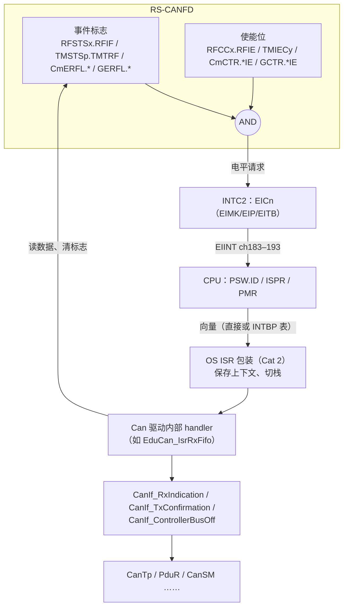
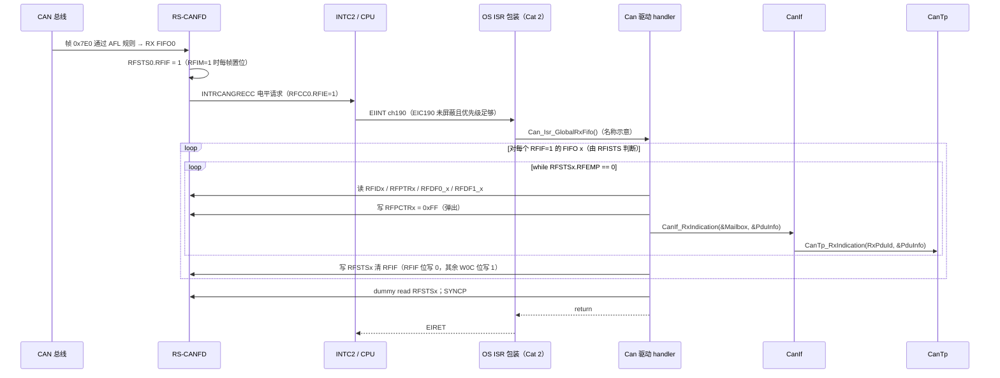
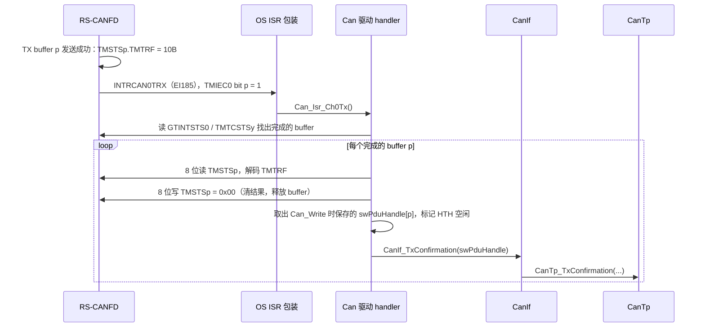
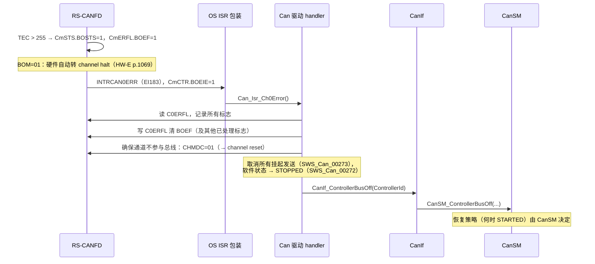

# CAN 中断：从 EI183–193 到 CanIf 回调，以及中断 vs 轮询

> Prerequisite: [02-rh850-can-peripheral.md](02-rh850-can-peripheral.md)、[RH850 中断与异常](../01-rh850/06-interrupt-exception.md)、[OS Task 与 ISR](../02-autosar-classic/06-os-task-isr.md)、[MainFunction 调度](../02-autosar-classic/07-mainfunction-scheduling.md)
> Next: [06-can-controller-init.md](06-can-controller-init.md)
> 对应规范: HW-E（R01UH0585EJ0120 Rev.1.20）p.254（清中断源后的同步要求）、p.264–268（INTC、EICn）、p.271（EIBD）、p.281–282（向量方式）、p.285–286 Table 6.11（CAN 中断通道、源码、表偏移、电平型标记）、p.792 Table 17.8、p.1057–1058（中断源与标志 Table 17.175）；AUTOSAR CP R22-11 SWS CAN Driver：p.33（`SWS_Can_00033/00419/00420`）、p.45（`SWS_Can_00016`）、p.48–49（`SWS_Can_00279/00396/00012`）、p.50–51（`SWS_Can_00099/00007`、轮询回调语义）、p.68–69（Disable/EnableControllerInterrupts）、p.84–87（`Can_MainFunction_*`）、p.107–110 / p.124（`CanBusoffProcessing/CanRxProcessing/CanTxProcessing/CanHardwareObjectUsesPolling`）
> 对应源码: openAUTOSAR `communication/CAN/CanIf/src/CanIf.c:743`（`CanIf_TxConfirmation`）、`:764`（`CanIf_RxIndication`）、`:919`（`CanIf_ControllerBusOff`）、`include/Can.h:178-185`（`Can_CallbackType`）、`:330-334`（`Can_MainFunction_*` 声明）、`system/SchM/src/SchM.c:396-400`（Can 主函数调度宏）；本项目无 CAN ISR 代码

---

## 1. 本章目标

1. 记住 RS-CANFD 的 11 个中断请求如何分配到 **EI183–193**，尤其是 **EI190（RX FIFO）与 EI184（CAN0 common FIFO）的区别**。
2. 理解 CAN 中断是**电平型**：ISR 必须清除 RS-CANFD 内部的标志，清 EIC 没用。
3. 画出 "硬件事件 → INTC → OS ISR 包装 → Can 驱动内部 handler → CanIf 回调" 的完整链条，知道每一跳由谁负责。
4. 理解 AUTOSAR 对 CAN 中断的要求（Can 实现 ISR、关闭未用中断、ISR 末尾清标志、不设置向量优先级），以及中断/轮询/MIXED 三种处理方式与 `Can_MainFunction_Read/Write/BusOff/Mode/Wakeup` 的关系。
5. 能在调试器里定位"中断没来"、"中断风暴"、"中断来了但 CanIf 没收到"三类问题。

---

## 2. 为什么需要这一章？

CAN 驱动的运行时只有两种"入口"：

1. **上层调用**：`Can_Write`、`Can_SetControllerMode` 等——由 CanIf/CanSM 在任务上下文中调用。
2. **硬件事件**：收到帧、发送完成、错误/bus-off——**通过中断或轮询进入驱动**。

第二种入口决定了 `CanIf_RxIndication`、`CanIf_TxConfirmation`、`CanIf_ControllerBusOff` 何时、在什么上下文中被调用，进而决定了 CanTp/DCM 的时序。诊断请求 "到了总线但 DCM 没反应"，很大一部分就是中断链断了。

---

## 3. 在系统中的位置



- **硬件部分**：标志 AND 使能 → 电平请求（HW-E p.1057："The current interrupt request is still output until the interrupt request flag is cleared"）。
- **INTC/CPU**：EIC 屏蔽、优先级、向量方式（[RH850 中断与异常](../01-rh850/06-interrupt-exception.md)）。
- **OS**：AUTOSAR OS 拥有向量表和 ISR 包装；Can 驱动提供 ISR 的"主体"。
- **驱动**：读数据、清标志、回调 CanIf。

---

## 4. RS-CANFD 中断通道表

`[RH850 Hardware]` HW-E p.792 Table 17.8、p.285–286 Table 6.11

| EI 通道 | 信号名 | 含义 | 源码 EIIC | 表偏移（4n） | EIC 地址 |
|---|---|---|---|---|---|
| 183 | INTRCAN0ERR | CAN0 error | `0x10B7` | `+0x2DC` | `0xFFFF_B16E` |
| 184 | INTRCAN0REC | **CAN0 TX/RX FIFO（common FIFO）receive completion** | `0x10B8` | `+0x2E0` | `0xFFFF_B170` |
| 185 | INTRCAN0TRX | CAN0 transmit | `0x10B9` | `+0x2E4` | `0xFFFF_B172` |
| 186 | INTRCAN1ERR | CAN1 error | `0x10BA` | `+0x2E8` | `0xFFFF_B174` |
| 187 | INTRCAN1REC | CAN1 common FIFO receive | `0x10BB` | `+0x2EC` | `0xFFFF_B176` |
| 188 | INTRCAN1TRX | CAN1 transmit | `0x10BC` | `+0x2F0` | `0xFFFF_B178` |
| 189 | INTRCANGERR | **global error** | `0x10BD` | `+0x2F4` | `0xFFFF_B17A` |
| 190 | INTRCANGRECC | **RX FIFO 0–7（全局共用）** | `0x10BE` | `+0x2F8` | `0xFFFF_B17C` |
| 191 | INTRCAN2ERR | CAN2 error | `0x10BF` | `+0x2FC` | `0xFFFF_B17E` |
| 192 | INTRCAN2REC | CAN2 common FIFO receive | `0x10C0` | `+0x300` | `0xFFFF_B180` |
| 193 | INTRCAN2TRX | CAN2 transmit | `0x10C1` | `+0x304` | `0xFFFF_B182` |

计算规则：EIC 地址 = `0xFFFF_B000 + 2n`（n ≥ 32，HW-E p.265）；表偏移 = `4n`（相对 INTBP，p.281）；EIIC 源码 = `0x1000 + n`（p.285–286 "Source Code" 列，研究笔记 01 F-INT-7）。注意通道号**不是连续按 CAN0/1/2 排列**：CAN2 在 191–193，中间夹着全局的 189/190。

### 4.1 最容易犯的错：EI184 ≠ RX FIFO

- EI184 的 Table 6.11 名称是 "**COM** RX FIFO interrupt 0"（p.285）——COM = common FIFO = TX/RX FIFO（每通道 3 个，k=0–2 属于 CAN0）。
- 8 个 **RX FIFO** 的中断**全部**汇集到 **EI190**（INTRCANGRECC）。

如果你的接收 HRH 映射到 RX FIFO0，而 OS 只配置了 CAN0 的 ERR/REC/TRX（183/184/185）三个 ISR，**报文会一直留在 FIFO 里，永远到不了 CanIf**（handoff §10 加粗警告）。

### 4.2 中断源 → 标志 → 使能

`[RH850 Hardware]` HW-E p.1058 Table 17.175（"ISR 里要检查和清什么"的依据）

| 中断（EI） | 请求标志 | 使能位 | 清除方式 |
|---|---|---|---|
| RX FIFO（190） | `RFSTSx.RFIF`（x=0–7） | `RFCCx.RFIE` | 对 `RFSTSx` 写：RFIF 位写 0，其余 W0C 位写 1（p.847） |
| Global error（189） | `GERFL.DEF / MES / THLES`（FD 另有 `CMPOF`） | `GCTR.DEIE / MEIE / THLEIE` | DEF 写 0；MES/THLES 是汇总位，要清源头 `RFMLT/CFMLT/THLELT`（handoff §5） |
| CANm transmit（185/188/193） | `TMSTSp.TMTRF`（完成/中止）；`CFSTSk.CFTXIF`；`TXQSTSm.TXQIF`；`THLSTSm.THLIF` | `TMIECy.TMIEp`；`CmCTR.TAIE`；`CFCCk.CFTXIE`；`TXQCCm.TXQIE`；`THLCCm.THLIE` | `TMSTSp` 8 位写 0（p.1109–1110） |
| CANm common FIFO receive（184/187/192） | `CFSTSk.CFRXIF` | `CFCCk.CFRXIE` | 写 0 清 |
| CANm error（183/186/191） | `CmERFL.BEF / EWF / EPF / BOEF / BORF / OVLF / BLF / ALF` | `CmCTR.BEIE / EWIE / EPIE / BOEIE / BORIE / OLIE / BLIE / ALIE` | `CmERFL` 写 0 清对应位、其余已定义位写 1（p.812–815） |

> 一个 EI 通道背后可能有**多个**标志源。例如 EI185 同时承载"TX buffer 完成"、"TX 中止"、"TX/RX FIFO 发送完成"、"TX queue"、"TX history"。ISR 必须检查**所有已使能**的源，只处理一个就退出会导致中断立即再次进入。

### 4.3 电平型中断

`[RH850 Hardware]` Table 6.11 的 CAN 行在 "Level Interrupt" 列有标记（p.285–286 表注 1）：**高电平检测**。含义：

- `EICn.EIRF` 由硬件跟随请求电平，**软件不能通过清 EIRF 来"消掉"中断**（p.267）；
- 只有清掉 RS-CANFD 内部的请求标志（或关掉使能位），请求电平才会撤销；
- 如果 ISR 退出时标志没清，CPU 会立刻再次进入同一个 ISR → **中断风暴**，系统看起来"卡死"。

这一点由 PDF 抽取文本中的特殊符号推断（研究笔记 04 §5.2），上板后可读 `EICn.EICT`（bit15，只读，1=电平型）直接确认。对比：OSTM0/1 是边沿型，清中断方法不同，不要互相照搬（handoff §10）。

### 4.4 清标志后的同步

`[RH850 Hardware]` HW-E p.254：清中断源后，若紧接着要开中断或访问下一个外设，顺序应为：

```text
store（写清标志）→ 对同一寄存器做一次 dummy read → SYNCP → 再执行 EI / EIRET 或访问下一个外设
```

原因：外设总线写入是异步的（写缓冲），如果不确认写已生效就 EIRET，CPU 可能在标志尚未清除时再次看到请求电平，产生"多一次"的伪中断。这条要求在真实 MCAL 的 ISR 尾部通常以 "读回 + `__SYNCP()`" 的形式出现；具体 intrinsic 名称取决于编译器（GHS / CC-RH），需按工具链手册确认。

---

## 5. AUTOSAR 如何定义 CAN 中断

`[AUTOSAR Standard]`（R22-11）

| SWS ID | 页 | 要求什么 | 为什么 | RH850 上怎么做 |
|---|---|---|---|---|
| `SWS_Can_00033` | p.33 | Can 模块实现所有需要的 CAN 中断 ISR | 只有 driver 知道硬件标志的含义 | driver 提供 EI183–193 中用到的那几个 ISR 主体 |
| `SWS_Can_00419` | p.33 | 关闭控制器中所有未使用的中断 | 防止未处理的电平中断风暴 | 未用的 `RFIE/TMIE/CmCTR.*IE` 保持 0 |
| `SWS_Can_00420` | p.33 | ISR 末尾清中断标志（若硬件不自动清） | 电平型中断必须清源 | 写 `RFSTSx/TMSTSp/CmERFL` 清标志（§4.2） |
| 实现提示 | p.33 | **Can 模块不设置向量表项的配置（如优先级）** | 优先级是系统集成决策，属于 OS | EIC 的 EIP/EITB/EIMK 由 OS 配置/生成（handoff §10："具体设置必须使用 OS/MCAL 的受控路径"） |
| `SWS_Can_00016` | p.45 | TxConfirmation 在 TX ISR 或 `Can_MainFunction_Write` 中调用 | | EI185 → handler → `CanIf_TxConfirmation` |
| `SWS_Can_00279/00396` | p.48 | RxIndication 在 RX ISR 或 `Can_MainFunction_Read` 中调用 | | EI190 → handler → `CanIf_RxIndication` |
| `SWS_Can_00012` | p.49 | RX ISR 与 `Can_MainFunction_Read` 不能被自身打断 | 保证 buffer 一致性 | 同一 FIFO 只有一个消费路径；ISR 优先级配置避免自嵌套 |
| `SWS_Can_00099` | p.50 | 事件可由中断或轮询检测，哪些可/必须轮询由硬件决定 | | RX buffer 无中断 → 只能轮询 |
| `SWS_Can_00007` | p.50 | 必须能配置成**完全不用中断** | 某些安全/调度方案要求确定性轮询 | 所有使能位为 0，靠 MainFunction |
| p.51 | p.51 | 轮询时回调上下文是 MainFunction，但**回调实现必须按"可能在 ISR 中"来写** | 上层不应假设调用上下文 | CanIf 回调必须短小、不阻塞 |

---

## 6. 从硬件到 CanIf：三条典型链路

### 6.1 接收：RX FIFO → EI190 → `CanIf_RxIndication`



逐个 transition：

| # | Transition | 说明 | 依据 |
|---|---|---|---|
| 1 | 帧 → FIFO0 | 硬件 AFL 匹配 + 路由 | HW-E p.1073–1074 |
| 2 | RFIF 置位 | `RFCCx.RFIM=1` 每收一帧置位；`RFIM=0` 按 `RFIGCV` 阈值置位 | HW-E p.844–846 |
| 3 | 电平请求 | RFIF AND RFIE | p.1058 |
| 4 | EIINT ch190 | EIC190：EIMK=0、EIP 由 OS 配置；PSW.ID=0；ISPR/PMR 未屏蔽 | p.267–268, p.210–211 |
| 5 | OS → driver | OS 的 Cat 2 ISR 包装调用 driver 提供的函数。ISR 名称、声明方式由 OS 端口和 MCAL 集成说明决定 | 本仓库无 OS SWS |
| 6 | 读帧 | 先读完整帧头和数据，再弹出 | HW-E p.1102；handoff §8 |
| 7 | 弹出 | `RFPCTRx = 0xFF` 使读指针前进 | p.848 |
| 8 | `CanIf_RxIndication` | R22-11 形态：参数为 `Mailbox`（`Can_HwType`：CanId、Hoh、ControllerId）和 `PduInfoPtr`（长度、数据指针） | `SWS_Can_00279` p.48；`Can_HwType` p.59 |
| 9 | CanIf → CanTp | CanIf 用 Hoh + CanId 找 RxPdu，再分发给上层（属于 CanIf SWS，本仓库无） | [05-can-stack/01-canif.md](../05-can-stack/01-canif.md) |
| 10 | 清 RFIF | 在循环之后清，并且**清完再检查一次 RFEMP**，处理"清标志瞬间又到一帧"的竞争 | handoff §8 |
| 11 | 同步 | dummy read + SYNCP | HW-E p.254 |

**为什么"先读完再弹出"**：弹出后 FIFO 槽位可能立即被新帧覆盖。**为什么在回调 CanIf 之前就弹出也可以**：只要数据已经复制到驱动的局部/影子缓冲（`SWS_Can_00299/00300` p.49 影子缓冲概念），回调时传的是影子缓冲指针。两种顺序在真实 MCAL 中都存在，关键是**传给 CanIf 的指针在回调期间必须有效**。

### 6.2 发送完成：TX buffer → EI185 → `CanIf_TxConfirmation`



要点：

- `TMTRF=10B` 或 `11B` 才算成功；`01B` 是中止完成，不能报 TxConfirmation（handoff §9）。
- **先清 `TMSTSp`、释放 HTH，再回调 CanIf**：因为 CanIf/CanTp 在 TxConfirmation 里很可能立刻调用 `Can_Write` 发下一帧（例如 CanTp 的连续帧 CF），如果此时 buffer 还被标记为忙，就会得到 `CAN_BUSY`。
- `swPduHandle` 的保存来自 `SWS_Can_00276`（p.45）："Can_Write 保存 swPduHandle 直到调用 CanIf_TxConfirmation"。
- `GTINTSTS0.TSIFm` 可用于快速判断哪个通道有发送中断（p.827）；`TMTCSTSy` 是 TX 完成状态位图（p.799）。具体位定义需查手册对应页。

### 6.3 Bus-off：EI183 → `CanIf_ControllerBusOff`



依据：`SWS_Can_00020`（p.42）在进入 STOPPED 后调用 `CanIf_ControllerBusOff`；`SWS_Can_00272/00273`（p.42）；`SWS_Can_00274`（p.43）禁止自动恢复。驱动把通道切到 reset 还是停在 halt，取决于 STOPPED 的映射设计（[06-can-controller-init.md](06-can-controller-init.md)）。完整处理见 [13-can-error-busoff.md](13-can-error-busoff.md)。

---

## 7. 中断 vs 轮询

### 7.1 配置参数

`[AUTOSAR Standard]`

| 参数 | ECUC ID / 页 | 取值 | 影响 |
|---|---|---|---|
| `CanRxProcessing` | 00317, p.109 | INTERRUPT / MIXED / POLLING | RX 事件由 ISR 还是 `Can_MainFunction_Read` 处理 |
| `CanTxProcessing` | 00318, p.110 | INTERRUPT / MIXED / POLLING | TX 完成由 ISR 还是 `Can_MainFunction_Write` 处理 |
| `CanBusoffProcessing` | 00314, p.107 | INTERRUPT / POLLING | bus-off 由 ISR 还是 `Can_MainFunction_BusOff` 处理 |
| `CanWakeupProcessing` | 00319, p.110 | INTERRUPT / POLLING | |
| `CanHardwareObjectUsesPolling` | 00490, p.124 | TRUE / FALSE | **MIXED** 时，只有这个为 TRUE 的硬件对象被轮询（`SWS_Can_00031` p.85，`SWS_Can_00108` p.86） |
| `CanMainFunctionRWPeriods` | 00437, p.131 | 0..* | 配置多个周期时，主函数名变为 `Can_MainFunction_Read_<ShortName>()` 等（`00441/00442` p.85–86） |
| `CanMainFunctionBusoffPeriod` / `ModePeriod` | p.101–102 | 秒 | 调度周期 |

### 7.2 主函数

`[AUTOSAR API]`（R22-11，均为 `void (void)`，由 BSW Scheduler 周期调用，不可重入）

| API | SID | 页 | 做什么 |
|---|---|---|---|
| `Can_MainFunction_Write` | 0x01 | p.84–85 | 轮询 TX 完成 → `CanIf_TxConfirmation` |
| `Can_MainFunction_Read` | 0x08 | p.85 | 轮询 RX → `CanIf_RxIndication` |
| `Can_MainFunction_BusOff` | 0x09 | p.86 | 轮询 bus-off |
| `Can_MainFunction_Wakeup` | 0x0a | p.87 | 轮询唤醒 |
| `Can_MainFunction_Mode` | 0x0c | p.87 | 轮询模式切换是否完成 → `CanIf_ControllerModeIndication`（`SWS_Can_00369/00370/00373`） |

注意：**`Can_MainFunction_Mode` 总是轮询**——它没有对应的 Processing 参数，因为模式切换完成本身就是"轮询状态寄存器"的事（SWS p.39–40）。RS-CANFD 也没有"模式切换完成"中断。

无需轮询时，主函数可以实现为空（`SWS_Can_00178/00180/00183/00185`，研究笔记 02 §2.6）。

### 7.3 怎么选

| 维度 | INTERRUPT | POLLING |
|---|---|---|
| 延迟 | 最低（微秒级） | 至多一个 MainFunction 周期（例如 5 ms） |
| CPU 负载 | 与总线负载成正比，突发帧时 ISR 密集 | 固定开销；突发帧时一次处理多帧 |
| 确定性 | 较差（中断随时打断任务） | 好 |
| FIFO 溢出风险 | 低 | 周期内到达帧数 > FIFO 深度时丢帧（`RFMLT`，运行时错误 `CAN_E_DATALOST`，SWS p.49 `00395`） |
| RS-CANFD 限制 | RX buffer 无中断 | 任何资源都可轮询 |

`[Real Project Consideration]` 诊断（CanTp）对延迟有要求：N_Ar/N_Bs 等定时器在几十 ms 级，`Can_MainFunction_Read` 周期 1–10 ms 通常可以接受；但 CanTp 连续帧 STmin=0 时一次可能连续到达多帧，FIFO 深度要按"一个轮询周期内最多到达帧数"计算。很多项目选择 RX/TX 中断 + bus-off 轮询（bus-off 不是高频事件）。

### 7.4 MIXED 模式在 RS-CANFD 上的样子

`[Conceptual]`

```text
CanRxProcessing = MIXED
  HRH0：0x7E0 诊断请求  → RX FIFO0（RFIE=1）   CanHardwareObjectUsesPolling = FALSE → EI190 中断处理
  HRH1：周期信号报文      → RX buffer q（无中断） CanHardwareObjectUsesPolling = TRUE  → Can_MainFunction_Read 轮询 RMNDy
```

这正是 `SWS_Can_00099`（"哪些事件必须轮询由硬件决定"）的一个实例：RS-CANFD 的 RX buffer 没有中断，只能轮询。

### 7.5 `Can_DisableControllerInterrupts` / `Can_EnableControllerInterrupts`

`[AUTOSAR API]` `void Can_DisableControllerInterrupts(uint8 Controller)`（SID 0x04，p.68）、`void Can_EnableControllerInterrupts(uint8 Controller)`（SID 0x05，p.69）。

- 可重入，**嵌套计数**：Disable 两次需要 Enable 两次才真正打开（`SWS_Can_00202` p.68、`00204` p.69、`00208` p.70）。
- 只影响**该控制器**的中断。
- 与模式切换交互：`Can_SetControllerMode` 打开新状态需要的中断时，若之前被 Disable 过，则不打开（`SWS_Can_00196/00197/00425/00426` p.67）。

RS-CANFD 上的实现选择（`[Conceptual]`）：

| 方案 | 做法 | 问题 |
|---|---|---|
| A：清外设使能位 | 清 `CmCTR.*IE`、`TMIEC`、`RFIE` | `CmCTR` 的中断使能只能在 channel reset 中修改（HW-E p.807–808）→ 运行时不可行；`RFIE` 有 "RFE=0 时才能改" 的限制（研究笔记 01 F-CAN-10） |
| B：屏蔽 EIC | 设置该控制器对应 EICn.EIMK=1 | **EI189/190 是全局共享的**：屏蔽 EI190 会同时屏蔽其他控制器的 RX FIFO 中断；EIC 读-改-写有竞争风险（HW-E p.267） |
| C：B + 软件过滤 | 屏蔽本控制器专属的 ERR/REC/TRX；对共享的 190，在 ISR 中跳过被 Disable 的控制器的 FIFO | 实现复杂 |

这是 RS-CANFD "全局共享中断"设计给 AUTOSAR "按控制器开关中断"带来的真实摩擦，真实 MCAL 采用哪种方案需查供应商实现。

---

## 8. RH850 Hardware Mapping 总表

| AUTOSAR 概念 | RH850 资源 | 谁配置 |
|---|---|---|
| Can RX ISR（FIFO） | EI190 + `RFCCx.RFIE` + `RFSTSx.RFIF` | Can（外设侧）+ OS（EIC/向量） |
| Can RX ISR（common FIFO） | EI184/187/192 + `CFCCk.CFRXIE` | 同上 |
| Can TX ISR | EI185/188/193 + `TMIECy` | 同上 |
| Can error / bus-off ISR | EI183/186/191 + `CmCTR.BOEIE` 等 | 同上 |
| Global error（FIFO 溢出、DLC 错误） | EI189 + `GCTR.DEIE/MEIE` | 同上 |
| ISR 优先级 | EICn.EIP（0 最高） | **OS**（Can 不设置，SWS p.33） |
| 向量方式 | EICn.EITB（0 直接 / 1 表引用 INTBP） | OS 端口 |
| EIBD（中断绑定的 PE） | EIBDn.PEID 必须 001 | OS/启动代码（HW-E p.271） |
| `SuspendAllInterrupts` 等临界区 | PSW.ID / PMR | OS |

---

## 9. openAUTOSAR 实现

openAUTOSAR **没有 Can driver**，所以没有任何 CAN ISR（研究笔记 03 §2："本仓库无法追踪 Can ISR / polling / mailbox 到 `CanIf_RxIndication` 的那一跳"）。能看到的是上下两端：

**上端（CanIf 回调，R3.1.5 风格）**：

- `communication/CAN/CanIf/include/CanIf_Cbk.h:26-27,33`：
  - `void CanIf_TxConfirmation( PduIdType canTxPduId );`
  - `void CanIf_RxIndication( uint8 Hrh, Can_IdType CanId, uint8 CanDlc, const uint8 *CanSduPtr );`
  - `void CanIf_ControllerBusOff( uint8 Controller );`
- `CanIf.c:764` 的 `CanIf_RxIndication` 先用 `CanIf_Arc_FindHrhChannel(Hrh)`（`:100`）找到通道，检查 PDU mode，再线性扫描 RxPdu 表做软件过滤（`:794-822`）。

与 R22-11 的差异：R4.x 的 `CanIf_RxIndication` 参数是 `(const Can_HwType* Mailbox, const PduInfoType* PduInfoPtr)`（`SWS_Can_00279` p.48 描述了这两个参数，`Can_HwType` 定义在 p.59；完整签名在 CanIf SWS，本仓库没有）。R3 的 4 参数形式把 Hrh、CanId、DLC、数据指针分开传。

**Arctic 特有的回调表**：`include/Can.h:178-185` 定义了 `Can_CallbackType`（`RxIndication/TxConfirmation/ControllerBusOff/...` 函数指针）。R4 中 Can 直接调用 `CanIf_*`（`SWS_Can_00234` p.88 列出必需回调），不经过函数指针表。

**下端（调度）**：`system/SchM/src/SchM.c:396-400` 在主循环中调用 `SCHM_MAINFUNCTION_CAN_WRITE/READ/BUSOFF/ERROR/WAKEUP()`；但 `:135-139` 在未定义 `USE_CAN` 时把它们定义为空。`include/Can.h:330-334` 声明了 `Can_MainFunction_Write/Read/BusOff/Error/Wakeup`——其中 `Can_MainFunction_Error` 是 Arctic 扩展，R22-11 没有；R22-11 有而它没有的是 `Can_MainFunction_Mode`。

---

## 10. 当前教学项目实现

本项目没有 CAN ISR 代码，也没有 EIC 模拟（研究笔记 01 §2.3：Fake bus 只模拟 OSTM）。下面给出一个**教学用** ISR 主体，用于理解结构；完整实现在 [12-can-interrupt-implementation.md](12-can-interrupt-implementation.md)。

`[Educational Implementation]`（教学伪代码，Classical 接口模式；不是 production code）

```c
/* 由 OS 的 Cat 2 ISR 包装调用，例如：
 *   ISR(CanIsr_GlobalRxFifo) { EduCan_IsrGlobalRxFifo(); }
 * ISR 宏与名称由 OS 端口决定，此处仅示意。                        */
void EduCan_IsrGlobalRxFifo(void)
{
    uint32 fifoMask = EduCan_Read32(EDUCAN_RFISTS) & EduCan_Cfg.rxFifoIrqMask; /* RFISTS：哪些 FIFO 有 RFIF */

    for (uint8 x = 0u; x < 8u; x++) {
        if ((fifoMask & (1uL << x)) == 0u) { continue; }

        /* 先清 RFIF，再排空；排空后再检查一次，避免"清标志瞬间到帧"的丢失 */
        EduCan_Write32(EDUCAN_RFSTS(x), EDUCAN_RFSTS_CLEAR_RFIF_ONLY);         /* RFIF 写 0，其余 W0C 写 1 */
        while ((EduCan_Read32(EDUCAN_RFSTS(x)) & EDUCAN_RFSTS_RFEMP) == 0u) {
            EduCan_FrameType frame;
            EduCan_ReadRxFifoHead(x, &frame);            /* 读 RFIDx/RFPTRx/RFDF0_x/RFDF1_x 到局部变量 */
            EduCan_Write32(EDUCAN_RFPCTR(x), 0xFFu);     /* 弹出 */
            EduCan_DispatchRx(x, &frame);                /* 按 x → HRH 映射调用 CanIf_RxIndication */
        }
        if ((EduCan_Read32(EDUCAN_RFSTS(x)) & EDUCAN_RFSTS_RFMLT) != 0u) {
            EduCan_ReportDataLost(x);                    /* 运行时错误 CAN_E_DATALOST（SWS p.49） */
            EduCan_Write32(EDUCAN_RFSTS(x), EDUCAN_RFSTS_CLEAR_RFMLT_ONLY);
        }
    }
    (void)EduCan_Read32(EDUCAN_RFSTS(0u));               /* dummy read（HW-E p.254） */
    EDU_SYNCP();                                          /* 编译器 intrinsic，名称按工具链确认 */
}
```

说明：

- 本例选择"先清 RFIF 再排空"。另一种常见写法是"先排空再清 RFIF、再检查一次"。两者都要处理竞争窗口——关键是**最后一次检查发生在清标志之后**。
- `rxFifoIrqMask` 过滤掉被配置为轮询的 FIFO（MIXED 模式），也可以用来实现 §7.5 方案 C。
- `EDUCAN_RFSTS_CLEAR_RFIF_ONLY` 的数值必须按 HW-E p.847 的位定义计算（handoff §8 给出 Classical 下仅清 RFIF 写 `0x00000004`——即 RFIF(b3)=0、RFMLT(b2)=1 等）。

---

## 11. Debug 方法

### 11.1 "中断没来"

按链条从下往上检查：

| 层 | 检查 | 寄存器 |
|---|---|---|
| 外设标志 | 帧到了没有？ | `RFSTS0.RFMC`（未读条数）、`RFEMP` |
| 外设使能 | 使能位开了吗？ | `RFCC0.RFIE`、`RFCC0.RFE`、`RFIM` |
| INTC | 请求到了吗？屏蔽了吗？ | `EIC190`（`0xFFFF_B17C`）：`EIRF`(b12)=1？`EIMK`(b7)=0？`EICT`(b15)=1？ |
| CPU | 全局中断开了吗？优先级被挡了吗？ | `PSW.ID`=0？`ISPR` 有更高/同级位？`PMR`？ |
| 向量 | 跳到对的地方了吗？ | `EITB` 与 OS 向量方式一致？表引用时 `INTBP + 190×4` 处的地址？ |
| OS | ISR 配置了吗？ | OS 配置中有没有 EI190 对应的 ISR 对象 |

最常见答案：**OS 里只配了 EI184，没有配 EI190**。

### 11.2 "中断风暴"（系统卡死在 ISR）

- 在 ISR 入口打断点，连续命中且每次 `RFSTS/TMSTS/CmERFL` 内容相同 → 标志没清。
- 检查 ISR 是否处理了**所有已使能**的源（EI185 背后有 5 类发送源）。
- 检查清标志写法：`CmERFL` 是"写 0 清"，用 `reg &= ~mask` 读改写可能把并发到来的其他事件也清掉或漏掉（handoff §5）。
- 检查是否打开了 `ALIE`（仲裁失败）、`BEIE`（总线错误）这类高频源。

### 11.3 "中断来了，CanIf 没收到"

- ISR 里有没有调用 dispatch？FIFO → HRH 映射对吗？
- `CanIf_RxIndication` 里 PDU mode 是否 OFFLINE？（openAUTOSAR `CanIf.c:778-789` 就会在 OFFLINE 时直接丢弃。）
- CanIf 软件过滤 mask 是否把 ID 过滤掉了？

### 11.4 断点与观察点

| 位置 | 观察 |
|---|---|
| ISR 入口 | `EIIC`（系统寄存器）应为 `0x10BE`（EI190）/`0x10B9`（EI185）…… |
| `CanIf_RxIndication` 入口 | `Mailbox->CanId`、`Mailbox->Hoh`、`PduInfoPtr->SduLength` |
| `CanIf_TxConfirmation` 入口 | 回传的 `swPduHandle` 是否等于 `Can_Write` 时传入的 |
| `RFSTS0` 数据观察点 | 谁在清 RFIF？是否有两个上下文（ISR + MainFunction）同时消费同一 FIFO？ |

---

## 12. 常见错误

| 错误 | 后果 | 依据/修正 |
|---|---|---|
| RX FIFO 接收只配 EI184 | 帧永远不进 CanIf | RX FIFO 用 EI190 |
| ISR 只清 EIC 不清外设标志 | 中断风暴 | 电平型（p.285–286, p.267） |
| ISR 只处理一种源 | 立即重入 | p.1058 一个 EI 多个源 |
| 先回调 CanIf 再释放 TX buffer | CanTp 下一帧 `CAN_BUSY` | 先清 `TMSTSp`、释放 HTH |
| 同一 FIFO 既在 ISR 又在 MainFunction 中读 | 双重消费 / 乱序 | `SWS_Can_00012`；MIXED 按 HOH 划分 |
| Can 驱动设置 EIP 优先级 | 与 OS 配置冲突 | SWS p.33 实现提示 |
| 清标志后直接 EIRET | 偶发伪中断 | dummy read + SYNCP（p.254） |
| 在 ISR 中长时间处理（例如 CanIf 里做大量拷贝） | 阻塞其他中断 | SRS_BSW_00325（ISR 尽量短，SWS p.26） |
| 轮询周期内帧数 > FIFO 深度 | `RFMLT` 丢帧 | 增大深度或改中断 |

---

## 13. 实验

**实验 1：通道表计算（无硬件）**
不看表，用规则计算 EI191 的 EIC 地址、INTBP 表偏移和 EIIC 源码，再与 §4 比较。

**实验 2：ISR 源清单（无硬件）**
假设 CAN0 使用：TX buffer 0–3（`TMIE` 开）、`TAIE` 开、RX FIFO0（RFIE 开）、`BOEIE` 和 `EPIE` 开、common FIFO 全关。列出需要实现的 EI 通道、每个 ISR 需要检查的标志、清除写法。

**实验 3：主机模拟（无硬件）**
仿照 `tests/test_reference.c` 的 Fake bus 思想，写一个"假 RFSTS 寄存器"：每次读 `RFEMP` 返回"还有 N 帧"，验证你的 ISR 循环在 N=0、1、8 时调用 dispatch 的次数正确，并且最后一次读发生在清 RFIF 之后。

**实验 4（有硬件）**：故意不清 `RFSTS0.RFIF`，观察 ISR 重入；然后在 ISR 末尾去掉 dummy read + SYNCP，用计数器统计"进入 ISR 但 FIFO 为空"的次数。

---

## 14. 思考题

1. 为什么 RS-CANFD 把 8 个 RX FIFO 的中断合并到一个 EI190，而 common FIFO 每通道一个？这对多控制器 AUTOSAR 驱动的 `Can_DisableControllerInterrupts` 有什么影响？
2. `CanIf_TxConfirmation` 可能在 ISR 中被调用，也可能在 `Can_MainFunction_Write` 中被调用。CanTp 的实现需要注意什么？（SWS p.51）
3. 如果 CAN error 中断（EI183）的优先级高于 RX FIFO 中断（EI190），bus-off 发生时 RX ISR 正在执行，会发生什么？对 `SWS_Can_00012` 有影响吗？
4. 为什么 `Can_MainFunction_Mode` 没有"中断"选项？
5. 在 MIXED 模式下，如果一个 RX FIFO 被两个 HRH 共用，其中一个 `CanHardwareObjectUsesPolling=TRUE`、另一个 FALSE，会出现什么问题？配置工具应该如何阻止？

---

## 15. 对未来真实项目的意义

`[Real Project Consideration]`

- **OS 配置与 MCAL 配置要对齐**：真实项目中 CAN ISR 在 OS 配置（如 RTA-OS 的 ISR 对象，对应 EI 通道号/向量）和 MCAL 配置（Processing 方式、哪些中断使能）中各有一份。两边不一致是集成阶段最常见的问题——例如 MCAL 打开了 `RFIE`，但 OS 没有 EI190 的 ISR。截图工程中的 `Interrupt_0228/022C` 等符号名不能凭名字推断通道号，需按 OS 端口文档核对（handoff §10）。
- **读供应商 ISR**：Renesas MCAL 的 CAN ISR 通常按"全局 RX FIFO / 每通道 TX / 每通道 error"组织，名称中带通道号。用本章 §4.2 的源表可以快速判断它处理了哪些源、遗漏了哪些。
- **诊断时序**：DCM 的 P2 时间从收到请求开始计。请求是在 ISR 里送到 CanTp，还是等下一个 `Can_MainFunction_Read`，会影响响应时间预算。
- **DCM 升级**：新版 DCM/CanTp 对回调上下文的假设（是否可能在 ISR 中被调用）要和 Can 的 Processing 配置一致。

---

## 16. 本章总结

- RS-CANFD 11 个中断：EI183–185（CAN0）、186–188（CAN1）、189（global error）、**190（RX FIFO 0–7）**、191–193（CAN2）。EI184 是 common FIFO，不是 RX FIFO。
- CAN 中断是电平型：ISR 必须清外设标志并处理该 EI 下所有已使能源；清完做 dummy read + SYNCP。
- AUTOSAR：Can 实现 ISR 主体、关闭未用中断、清标志、不设置优先级；OS 负责向量和优先级。
- 回调链：EI → OS 包装 → Can handler → `CanIf_RxIndication / TxConfirmation / ControllerBusOff`。
- 中断/轮询/MIXED 由 `CanRx/Tx/BusoffProcessing` + `CanHardwareObjectUsesPolling` 配置；`Can_MainFunction_Mode` 总是轮询。

## 17. 下一章

[06-can-controller-init.md](06-can-controller-init.md)：`Can_Init` 与 `Can_SetControllerMode` 如何驱动 RS-CANFD 的 global/channel 状态机，按手册 Figure 17.16 的寄存器顺序完成初始化，以及超时与 `CanIf_ControllerModeIndication`。
