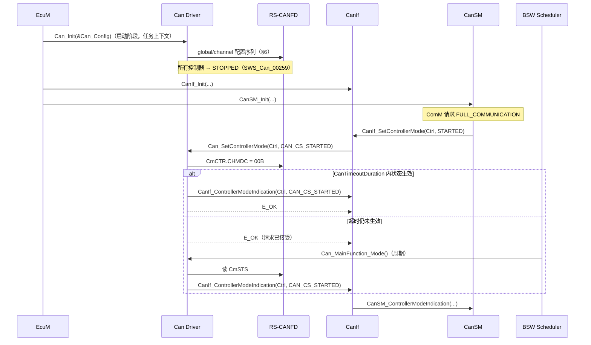
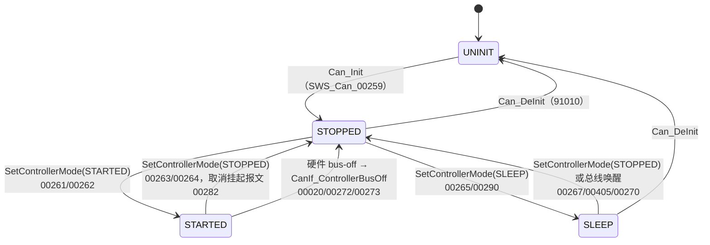
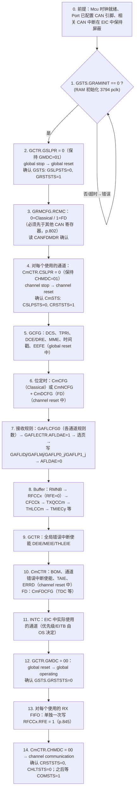
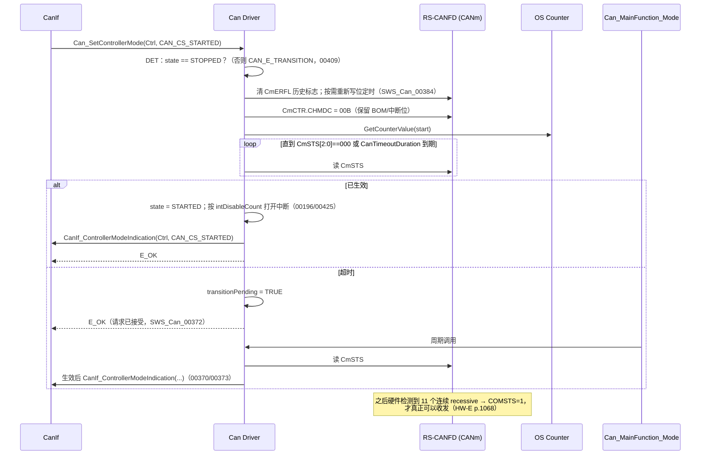

# CAN 控制器初始化与模式切换：Can_Init、Can_SetControllerMode 与 RS-CANFD 状态机

> Prerequisite: [02-rh850-can-peripheral.md](02-rh850-can-peripheral.md)（global/channel 模式）、[03-can-clock-bit-timing.md](03-can-clock-bit-timing.md)（位定时值）、[05-can-interrupt.md](05-can-interrupt.md)（中断使能与 EIC）、[ECU 启动](../02-autosar-classic/03-ecu-startup.md)
> Next: [07-hoh-hrh-hth.md](07-hoh-hrh-hth.md)
> 对应规范: AUTOSAR CP R22-11 SWS CAN Driver：p.34–35（驱动状态 `SWS_Can_00103/00246`）、p.36–43（控制器状态机、`SWS_Can_00259/00261/00262/00263/00264/00282/00258/00404/00290/00405/00370/00372/00373/00398/00409/00411/00274`）、p.43–44（`SWS_Can_00250/00053/00407/00021/00291`）、p.60（`Can_ControllerStateType`）、p.62–63（`Can_Init`）、p.66–67（`Can_SetControllerMode`）、p.72（`Can_GetControllerMode`）、p.87（`Can_MainFunction_Mode`）、p.104（`CanTimeoutDuration`）；HW-E（R01UH0585EJ0120 Rev.1.20）p.802（GRMCFG）、p.804–811（CmCFG/CmCTR/CmSTS）、p.816–821（GCFG/GCTR/GSTS）、p.845（RFCCx.RFE 写入时机）、p.1062–1071（模式、切换时间、复位初始化表 17.180/17.181）、p.1090–1091（Figure 17.16 初始化流程）、p.1096–1098（规则与 buffer 设置）、p.1122（模式切换后必须检查状态位）
> 对应源码: openAUTOSAR `system/EcuM/src/EcuM_Callout_Stubs.c:306-309`（调用 `Can_Init`）、`communication/CAN/CanIf/src/CanIf.c:226-319`（`CanIf_SetControllerMode`，R3 同步风格）、`include/Can.h:131-136,313-321`（`Can_StateTransitionType`、`Can_Init`、`Can_SetControllerMode`）；本项目无 Can_Init 代码（`docs/rh850-hardware-handoff.md` §11 有 12 步冷启动顺序）

---

## 1. 本章目标

1. 理解 AUTOSAR 定义的两层状态：**驱动**（`CAN_UNINIT` / `CAN_READY`）和**控制器**（`UNINIT` / `STOPPED` / `STARTED` / `SLEEP`）。
2. 把这四个控制器状态映射到 RS-CANFD 的 global/channel 模式，并说出每种映射选择的理由与代价。
3. 按手册 **Figure 17.16**（HW-E p.1091）写出 `Can_Init` 的完整寄存器序列：等 `GRAMINIT` → global reset → `GRMCFG` → channel reset → `GCFG` → 位定时 → AFL → buffer → 中断 → global operating → `RFE` → （由 `Can_SetControllerMode` 进入 communication）。
4. 理解 `Can_SetControllerMode` 为什么是**异步**的、如何用 `CanTimeoutDuration` + `GetCounterValue` 做有限等待、何时由 `Can_MainFunction_Mode` 接力并调用 `CanIf_ControllerModeIndication`。
5. 知道调试初始化问题时看哪些寄存器、在哪里打断点。

---

## 2. 为什么需要这个模块？

RS-CANFD 复位后处于 **global stop + 所有 channel stop**（`GCTR`=`CmCTR`=`0x5`，HW-E p.819, p.805–806）。要让它在总线上收发，必须：

- 等 CAN RAM 初始化完成；
- 进入"允许配置"的模式；
- 按严格的顺序写入几十个寄存器，其中很多**只能在特定模式下写**；
- 再一步步退出到运行模式，每一步都要确认、都要有超时。

上层（CanIf/CanSM/EcuM）不应该知道这些。AUTOSAR 把它们抽象成两个 API：

- `Can_Init(Config)`：一次性的全局 + 各控制器初始化，结束时所有控制器为 **STOPPED**；
- `Can_SetControllerMode(Controller, Transition)`：运行时在 STOPPED/STARTED/SLEEP 之间切换。

本章就是这两个 API 的"内部说明书"。

---

## 3. 在系统中的位置



- `Can_Init` 由 **EcuM** 在启动阶段调用（SWS p.43 §7.4："The ECU State Manager module shall initialize the Can module during startup phase by calling the function Can_Init"）。前提：Mcu 已初始化（`SWS_Can_00240` 实现提示 p.22），Port 已配置 CAN 引脚（`SWS_Can_00239` p.22）。
- `Can_SetControllerMode` 由 **CanIf** 调用（Can 的唯一上层，`SWS_Can_00058` p.23），CanIf 又由 **CanSM** 驱动。
- `Can_MainFunction_Mode` 由 **BSW Scheduler** 周期调用（p.84、p.87）。

> CanIf/CanSM 侧 API（`CanIf_SetControllerMode`、`CanIf_ControllerModeIndication`、`CanSM_ControllerModeIndication`）的完整签名在 CanIf/CanSM SWS，**本仓库没有**；此处按公认 R4.x 形态描述，需以真实项目所用 release 确认。

---

## 4. AUTOSAR 如何定义

### 4.1 驱动状态

`[AUTOSAR Standard]`（SWS p.34–35）：`CAN_UNINIT` →（`Can_Init`）→ `CAN_READY` →（`Can_DeInit`）→ `CAN_UNINIT`。

- `Can_Init` 在非 `CAN_UNINIT` 状态被调用 → DET `CAN_E_TRANSITION`（`SWS_Can_00174` p.63）；控制器不在 UNINIT → 同样报错（`SWS_Can_00408` p.63）。
- 其他 API 在 `CAN_UNINIT` 时被调用 → `CAN_E_UNINIT`（0x05，`SWS_Can_91019` p.52–53）。

### 4.2 控制器状态

`[AUTOSAR Standard]`（SWS p.36–43；`Can_ControllerStateType` p.60：`CAN_CS_UNINIT=0x00, STARTED=0x01, STOPPED=0x02, SLEEP=0x03`）



| 状态 | SWS 对硬件的要求（p.36–37） |
|---|---|
| UNINIT | 寄存器处于复位状态，CAN 中断关闭，不参与总线 |
| STOPPED | 已初始化，但**不参与总线**；**不发送错误帧，也不发送 ACK** |
| STARTED | 正常工作，参与网络 |
| SLEEP | 仅当硬件支持"经由 CAN 总线唤醒"时与 STOPPED 不同；否则是**逻辑睡眠**，硬件保持 STOPPED（`SWS_Can_00258/00404` p.37） |

几条容易忽略的规定：

- **Can 模块不记忆状态变化**（p.36："the Can module does not memorize the state changes"）——它只做寄存器设置，软件状态在 CanIf 的回调中改变。实际实现中 driver 通常仍保留一个内部状态变量用于 DET 检查和 `Can_GetControllerMode`（p.72），但"权威状态"在上层。
- **非法转换**：DET 开启时报 `CAN_E_TRANSITION` 并返回 `E_NOT_OK`（`SWS_Can_00409` p.40、`00411` p.41）；**生产代码中非法转换行为未定义**（p.37）。
- **控制器真正可用前提交的发送会丢失**，唯一的可用性指标是收到 TxConfirmation/RxIndication（p.40）。

### 4.3 两个 API

`[AUTOSAR API]`（R22-11）

```c
void Can_Init(const Can_ConfigType* Config);                      /* SID 0x00，同步，不可重入，p.62-63 */
Std_ReturnType Can_SetControllerMode(uint8 Controller,
                                     Can_ControllerStateType Transition); /* SID 0x03，异步，不可重入，p.66-67 */
```

`Can_Init`：

- `SWS_Can_00250`（p.43）：初始化静态变量（含标志）、整个 CAN HW unit 的公共设置、每个控制器的设置。
- `SWS_Can_00053`（p.43）：**不得修改未使用的 CAN 控制器的寄存器**。
- `SWS_Can_00021/00291`（p.44）：`Config` 指向 ROM 中的实现相关配置结构，用于选择 post-build 配置集。
- `SWS_Can_00259`（p.38）：所有控制器进入 STOPPED。

`Can_SetControllerMode`（**Asynchronous**）：

- `SWS_Can_00398`（p.39）：用 OS 服务 `GetCounterValue` 做超时监控，避免阻塞。
- `SWS_Can_00262/00264`（p.40–41）：STARTED/STOPPED 要"等待有限时间"直到生效。
- `SWS_Can_00372`（p.40）：`CanTimeoutDuration`（ECUC_Can_00113，p.104，范围 1 µs–65.535 s）内仍未生效，**函数返回**，由 `Can_MainFunction_Mode` 继续轮询。
- `SWS_Can_00370/00373`（p.39–40）：`Can_MainFunction_Mode` 轮询状态寄存器，生效后调用 `CanIf_ControllerModeIndication`（使用 CanIf 的抽象 ControllerId）。
- `SWS_Can_00282`（p.41）：进入 STOPPED 要**取消挂起的报文**。
- `SWS_Can_00384`（p.67）：进入 STARTED 时用上次 Init/SetBaudrate 的配置重新初始化控制器。
- 中断：SetControllerMode 打开新状态需要的中断、关闭不允许的中断，但尊重 `Can_DisableControllerInterrupts` 的嵌套（`SWS_Can_00196/00197/00425/00426` p.67）。

**为什么设计成异步**：不同 CAN 控制器的模式切换时间差别巨大。RS-CANFD 从 communication 到 halt 可能要"2 个 CAN 帧"（HW-E p.1066 Table 17.178），500 kbit/s 下最坏可达数百 µs；在总线被锁 dominant 时甚至**永远不会完成**（p.1067 Note 2）。如果 API 同步死等，调用它的 CanSM 任务就会卡住。

---

## 5. 核心数据结构

`[Conceptual]`（driver 内部运行时状态的典型形态；不是任何供应商的实际结构）

```c
typedef struct {
    Can_ControllerStateType   state;            /* 驱动视角的当前状态（用于 DET、Can_GetControllerMode） */
    Can_ControllerStateType   requested;        /* SetControllerMode 请求的目标状态 */
    boolean                   transitionPending;/* 超时返回后由 Can_MainFunction_Mode 接力 */
    boolean                   logicalSleep;     /* RS-CANFD 无 CAN 唤醒 → SLEEP 为逻辑状态 */
    uint8                     intDisableCount;  /* Can_Disable/EnableControllerInterrupts 嵌套计数 */
    uint16                    activeBaudrateId; /* Can_SetBaudrate 选中的配置 */
} EduCan_ControllerRuntimeType;

typedef struct {
    uint8                         driverState;  /* CAN_UNINIT / CAN_READY */
    const EduCan_ConfigType      *cfg;          /* Can_Init 传入的 ROM 配置指针 */
    EduCan_ControllerRuntimeType  ctrl[EDUCAN_MAX_CONTROLLERS];
} EduCan_GlobalType;
```

配置（ROM，来自生成代码）会在 [08-can-configuration.md](08-can-configuration.md) 详细讲；这里只需要知道 `Can_Init` 从 `cfg` 中取出：接口模式、`GCFG` 值、每通道 `CmCFG`（或 NCFG/DCFG）、`CmCTR` 中的 BOM 与中断使能、AFL 规则数组、RX FIFO/RX buffer/TX 中断配置。

---

## 6. 初始化流程：`Can_Init` 的寄存器序列

### 6.1 手册 Figure 17.16

`[RH850 Hardware]` HW-E p.1091（Figure 17.16），配合 p.1122 的"每次模式切换后检查状态位"和 p.845 的 `RFE` 写入时机：



**第 14 步不属于 `Can_Init`**：AUTOSAR 要求 `Can_Init` 结束时控制器是 STOPPED（不参与总线），所以通道应停留在 channel reset（或 halt）。第 14 步由 `Can_SetControllerMode(CAN_CS_STARTED)` 完成。这也说明一个关键事实：**Figure 17.16 是"复位到通信"的一条直线，而 AUTOSAR 在第 13 步和第 14 步之间切了一刀**。

### 6.2 每一步为什么必须在那里

| 步 | 为什么在这里 | 依据 |
|---|---|---|
| 1 | RAM 未初始化完时，指向 RAM 的寄存器值未定义 | p.1090, p.1123 |
| 2 | global stop 下寄存器只读（除 GSLPR） | p.1064 |
| 3 | 接口模式决定后续所有寄存器的映射 | p.802, p.796 |
| 4 | channel stop 下通道寄存器只读（除 CSLPR）；通道配置要在 channel reset 中做 | p.1066 |
| 5 | `GCFG` 只能在 global reset 中写 | p.817 |
| 6 | `CmCFG` 首次必须在 channel reset 中写 | p.804；p.1067 Note 3 |
| 7 | 规则表与 `GAFLCFG0` 只能在 global reset 中写 | p.831–837, p.1096 |
| 8 | `RMNB`、`RFCCx`（RFE/RFIE 以外）只能在 global reset 中写 | p.838, p.845, p.1098 |
| 9 | `GCTR` 的中断使能位只能在 global reset 中写 | p.820 |
| 10 | `CmCTR` 的 BOM 与中断使能只能在 channel reset 中改 | p.807–808 |
| 12 | 退出 global reset，模块开始运行；通道仍在 reset（Table 17.176：channel reset 在 global operating 下保持 reset） | p.1063 |
| 13 | `RFE` 必须在 global operating/test 中、且在其他位设置完成后**用另一条写指令**置 1 | p.845（Figure 17.16 本身未画此步，研究笔记 04 §8.7 注） |

### 6.3 教学伪代码

`[Educational Implementation]`（教学伪代码：Classical 接口模式、单一通道列表；省略 DET 与部分寄存器；**不是 production code**。寄存器宏沿用 [02 章 §7.3](02-rh850-can-peripheral.md) 的 `EDUCAN_*` 示意）

```c
#define GSTS_GRSTSTS   (1uL << 0)
#define GSTS_GHLTSTS   (1uL << 1)
#define GSTS_GSLPSTS   (1uL << 2)
#define GSTS_GRAMINIT  (1uL << 3)
#define GCTR_GMDC_MASK (0x3uL)
#define GCTR_GSLPR     (1uL << 2)
#define CSTS_MODE_MASK (0x7uL)          /* CSLPSTS|CHLTSTS|CRSTSTS */

/* 有界等待：mask 位全等于 expect，或超时。超时值来自配置（由 CanTimeoutDuration 推导）。 */
static Std_ReturnType EduCan_WaitReg(uint32 addr, uint32 mask, uint32 expect, uint32 timeoutTicks)
{
    uint32 start = EduCan_TimeNow();                     /* 实际实现：GetCounterValue（SWS_Can_00398） */
    while ((EduCan_Read32(addr) & mask) != expect) {
        if (EduCan_TimeElapsed(start) > timeoutTicks) { return E_NOT_OK; }
    }
    return E_OK;
}

void EduCan_Init(const EduCan_ConfigType *cfg)
{
    /* DET：驱动必须在 CAN_UNINIT（SWS_Can_00174），cfg 非空 */

    /* 1. 等 CAN RAM 初始化完成 */
    if (EduCan_WaitReg(EDUCAN_GSTS, GSTS_GRAMINIT, 0u, cfg->tmoRamInit) != E_OK) { goto fail; }

    /* 2. global stop → global reset：清 GSLPR，GMDC 保持 01 */
    EduCan_Write32(EDUCAN_GCTR, 0x00000001uL);
    if (EduCan_WaitReg(EDUCAN_GSTS, GSTS_GSLPSTS | GSTS_GRSTSTS, GSTS_GRSTSTS, cfg->tmoGlobal) != E_OK) { goto fail; }

    /* 3. 接口模式（先于其他 CAN 寄存器） */
    EduCan_Write32(EDUCAN_GRMCFG, cfg->rcmc);            /* 0 = Classical */
    /* 可选：读 CANFDMDR.bit0 确认 */

    /* 4. 只对使用的通道：channel stop → channel reset（SWS_Can_00053：不碰未用通道） */
    for (uint8 i = 0u; i < cfg->numControllers; i++) {
        uint8 m = cfg->ctrl[i].hwChannel;
        EduCan_Write32(EDUCAN_CmCTR(m), 0x00000001uL);   /* CSLPR=0, CHMDC=01 */
        if (EduCan_WaitReg(EDUCAN_CmSTS(m), CSTS_MODE_MASK, 0x1u, cfg->tmoChannel) != E_OK) { goto fail; }
    }

    /* 5. 全局配置 */
    EduCan_Write32(EDUCAN_GCFG, cfg->gcfg);              /* DCS/TPRI/... 由生成代码给出 */

    /* 6. 位定时（channel reset 中） */
    for (uint8 i = 0u; i < cfg->numControllers; i++) {
        uint8 m = cfg->ctrl[i].hwChannel;
        EduCan_Write32(EDUCAN_CmCFG(m), cfg->ctrl[i].baud[cfg->ctrl[i].defaultBaudIdx].cfg);
    }

    /* 7. 接收规则 */
    EduCan_WriteAflTable(cfg);                           /* GAFLCFG0 → AFLDAE=1 → 分页写 → AFLDAE=0 */

    /* 8. buffer 配置（RFE 保持 0） */
    EduCan_Write32(EDUCAN_RMNB, cfg->rmnb);
    for (uint8 x = 0u; x < 8u; x++) {
        EduCan_Write32(EDUCAN_RFCC(x), cfg->rfcc[x] & ~EDUCAN_RFCC_RFE);
    }
    EduCan_Write32(EDUCAN_TMIEC(0u), cfg->tmiec[0]);
    EduCan_Write32(EDUCAN_TMIEC(1u), cfg->tmiec[1]);

    /* 9. 全局错误中断使能（仍在 global reset） */
    EduCan_Write32(EDUCAN_GCTR, 0x00000001uL | cfg->gctrIrqBits);

    /* 10. 通道：BOM + 错误中断使能（仍在 channel reset） */
    for (uint8 i = 0u; i < cfg->numControllers; i++) {
        uint8 m = cfg->ctrl[i].hwChannel;
        EduCan_Write32(EDUCAN_CmCTR(m), 0x00000001uL | cfg->ctrl[i].cmctrBits);  /* CHMDC 保持 01 */
    }

    /* 11. EIC：由 OS 配置/生成，Can 不设置优先级（SWS p.33 实现提示） */

    /* 12. global reset → global operating（GMDC=00，保留中断使能位） */
    EduCan_Write32(EDUCAN_GCTR, cfg->gctrIrqBits);
    if (EduCan_WaitReg(EDUCAN_GSTS, GSTS_GRSTSTS | GSTS_GHLTSTS | GSTS_GSLPSTS, 0u, cfg->tmoGlobal) != E_OK) { goto fail; }

    /* 13. 单独一次写使能 RX FIFO（p.845） */
    for (uint8 x = 0u; x < 8u; x++) {
        if ((cfg->rfcc[x] & EDUCAN_RFCC_RFE) != 0u) {
            EduCan_Write32(EDUCAN_RFCC(x), cfg->rfcc[x]);
        }
    }

    /* 结束：所有通道仍在 channel reset = STOPPED（SWS_Can_00259） */
    for (uint8 i = 0u; i < cfg->numControllers; i++) { EduCan_G.ctrl[i].state = CAN_CS_STOPPED; }
    EduCan_G.cfg = cfg;
    EduCan_G.driverState = CAN_READY;
    return;

fail:
    /* Can_Init 返回 void。R22-11 有 CAN_E_INIT_FAILED（0x09，SWS p.52-53）可用于 DET。
       硬件状态保持在安全模式（reset/stop），记录失败步骤与寄存器快照以便调试。 */
    EduCan_ReportInitFailed();
}
```

要点：

1. **每个等待都有界**。研究笔记与 handoff §11 第 1 条："所有等待均使用有依据的单调超时，超时后记录寄存器并退出，不无限死循环"。
2. **写 `GCTR`/`CmCTR` 时要保留已设置的位**：第 9 步写入了中断使能，第 12 步改 GMDC 时必须保留它们（这里用 `cfg->gctrIrqBits` 显式重组，避免读-改-写误把状态位写回）。
3. **`Can_Init` 返回 `void`**：初始化失败无法通过返回值告诉 EcuM。真实系统依赖 DET / 运行时错误记录，或在后续 `Can_SetControllerMode` 时返回 `E_NOT_OK`。
4. **超时值的来源**：`CanTimeoutDuration` 是秒（p.104），需要换算成 OS counter tick。GRAMINIT 最长 3794 pclk ≈ 47.4 µs（80 MHz），global stop→reset 3 pclk、reset→operating 10 pclk（p.1063）——都远小于常见的 `CanTimeoutDuration`（例如 1 ms 量级），超时只为防止硬件异常导致死循环。

### 6.4 多控制器的陷阱

- **规则表、RX FIFO、`GCFG` 是全局的**。`Can_Init` 是唯一合法写它们的时机；运行时任何需要 global reset 的操作都会把**所有**通道强制拉回 channel reset（HW-E p.1063 Table 17.176）。这就是为什么 `Can_SetBaudrate` 只改通道级寄存器（`SWS_Can_00255` p.44），而接收过滤器在 AUTOSAR 中没有运行时修改 API。
- `SWS_Can_00053` 要求不碰未使用的控制器——伪代码中第 4、6、10 步都只遍历配置中的控制器。

---

## 7. Runtime Flow：`Can_SetControllerMode`

### 7.1 AUTOSAR 状态 ↔ RS-CANFD 模式映射

`[Conceptual]`（设计选择，不同 MCAL 可能不同；研究笔记 04 §9 也只给出"一种可能的映射"）

| AUTOSAR | RS-CANFD 推荐映射 | 理由 | 替代方案 |
|---|---|---|---|
| UNINIT | global stop + channel stop（复位态） | 与 SWS "寄存器复位态、中断关闭"一致 | — |
| **STOPPED** | **channel reset**（global operating） | 不参与总线（不发 ACK/错误帧）✔；位定时可写（`Can_SetBaudrate` 需要）✔；进入时硬件清除 `TMC/TMSTS`（即取消挂起发送，Table 17.180 p.1070）✔ 满足 `SWS_Can_00282`；清除 TEC/REC ✔ | channel halt：保留 TEC/REC、可做测试设置；但 `CmCTR` 的中断使能/BOM 只能在 reset 中改 |
| **STARTED** | **channel communication** | 参与网络 | — |
| SLEEP | channel reset + **逻辑睡眠**标志 | 研究笔记 04 §9：RS-CANFD 手册没有 CAN 总线唤醒机制的描述 → 按 `SWS_Can_00258/00404`，硬件保持 STOPPED | channel stop（省电，但 CSLPR 只能从 reset 进入；唤醒检测需借助 RX 引脚 INTP，属于 Icu/EcuM 设计） |

### 7.2 STOPPED → STARTED



逐个 transition：

| # | 动作 | 依据 |
|---|---|---|
| 1 | CanIf 调用 | `SWS_Can_00230` p.66 |
| 2 | 非法转换检查 | `SWS_Can_00409` p.40 |
| 3 | 重新配置 | `SWS_Can_00384` p.67："CAN_CS_STARTED 用上次 Init/SetBaudrate 的配置重新初始化"。在本映射下 `CmCFG` 在 STOPPED（channel reset）期间一直保留，无需重写；但 Table 17.180 已清掉的错误标志/计数正好满足"干净启动" |
| 4 | 写 CHMDC=00 | HW-E p.1065；reset→communication 最长 4 个 bit time（p.1066） |
| 5–6 | 有界等待 | `SWS_Can_00398` p.39（`GetCounterValue`），`SWS_Can_00262` p.40 |
| 7 | 生效：开中断、通知 | `SWS_Can_00196/00425` p.67；`CanIf_ControllerModeIndication` |
| 8 | 超时：返回并接力 | `SWS_Can_00372` p.40；`Can_MainFunction_Mode` `SWS_Can_00369/00370/00373` p.39–40, p.87 |
| 9 | COMSTS | 模式位=0 只说明进入了 communication；`COMSTS=1` 才说明已在总线上看到 11 个 recessive（p.1068）。总线被锁 dominant 时 COMSTS 永远不会置 1 |

**"STARTED" 应该在 CmSTS 模式位为 0 时报告，还是等 COMSTS=1？** `[Real Project Consideration]` SWS 只说"控制器完全可操作"（`SWS_Can_00262`），同时又说"可用性的唯一指标是收到 TxConfirmation/RxIndication"（p.40）。多数实现以模式状态位为准报告 STARTED（不依赖总线上是否有流量）；COMSTS 作为诊断信息。具体以供应商实现为准。

### 7.3 STARTED → STOPPED

| 步 | 动作 | 依据 |
|---|---|---|
| 1 | DET：state 必须是 STARTED 或 SLEEP | SWS p.40 |
| 2 | 关闭 STOPPED 不需要的中断 | `SWS_Can_00197/00426` p.67 |
| 3 | `CmCTR.CHMDC = 01B` → channel reset | HW-E p.1065 |
| 4 | 有界等待 `CmSTS[2:0]=001`（最长 2 bit time，p.1066） | `SWS_Can_00264/00268` p.41 |
| 5 | 挂起发送：channel reset 已由硬件清除 `TMCp.TMTR` 与 `TMSTSp`（Table 17.180 p.1070）；driver 释放所有 HTH 的软件占用 | `SWS_Can_00282` p.41 |
| 6 | `CanIf_ControllerModeIndication(Ctrl, CAN_CS_STOPPED)` | `SWS_Can_00373` |

**注意 channel reset 的"粗暴"**：HW-E p.1067 Table 17.179——设置 `CHMDC=01B` 时，正在接收/发送的帧**立即中断**（"before reception/transmission is completed"），可能在总线上留下一个被截断的帧（其他节点会看到错误）。手册 Note 1 给出"优雅"做法：**先 `CHMDC=10B` 进入 halt（等当前帧完成），确认 halt 后再 `CHMDC=01B`**。代价是 halt 最长需要"2 个 CAN 帧"时间，且总线被锁 dominant 时 halt 进不去（Note 2，要直接进 reset）。

`[Educational Implementation]` 两段式停止（示意）：

```c
static Std_ReturnType EduCan_StopChannel(uint8 m, uint32 tmo)
{
    EduCan_Write32(EDUCAN_CmCTR(m), EduCan_CtrBits(m) | 0x2u);        /* CHMDC=10：halt，等当前帧结束 */
    if (EduCan_WaitReg(EDUCAN_CmSTS(m), CSTS_MODE_MASK, 0x2u, tmo) != E_OK) {
        /* 可能总线锁死（CmERFL.BLF），直接进 reset（HW-E p.1067 Note 2） */
    }
    EduCan_Write32(EDUCAN_CmCTR(m), EduCan_CtrBits(m) | 0x1u);        /* CHMDC=01：reset */
    return EduCan_WaitReg(EDUCAN_CmSTS(m), CSTS_MODE_MASK, 0x1u, tmo);
}
```

如果这个等待超过 `CanTimeoutDuration`，就要把"halt→reset"的后半段交给 `Can_MainFunction_Mode` 接力——这让异步状态机变得更复杂，是真实 MCAL 代码中常见的"子状态"来源。

### 7.4 STOPPED ↔ SLEEP（逻辑睡眠）

- STOPPED → SLEEP：硬件保持 channel reset（`SWS_Can_00404`）；置 `logicalSleep=TRUE`；立即 `CanIf_ControllerModeIndication(SLEEP)`（`SWS_Can_00290` p.41）。
- SLEEP → STOPPED：只清 `logicalSleep`，不动硬件（`SWS_Can_00267` p.41）。
- SLEEP → STARTED：非法（必须先 STOPPED，`SWS_Can_00409`）。
- `[Real Project Consideration]` 若项目要求 CAN 唤醒，P1M-E 上需要借助收发器 + RX 引脚 INTP（[04 章 §5.4](04-can-pin-transceiver.md)）+ Icu/EcuM，Can 驱动的 `Can_CheckWakeup` 可能恒返回 `E_NOT_OK`。需在真实项目确认。

### 7.5 Bus-off 引起的 STARTED → STOPPED

硬件事件触发、不经过 `Can_SetControllerMode`：`SWS_Can_00020/00272/00273`（p.42）。RS-CANFD 按 `BOM` 可能已自动进入 halt；driver 在 error ISR 或 `Can_MainFunction_BusOff` 中把通道切到 reset（与 STOPPED 映射一致），然后调用 `CanIf_ControllerBusOff`。详见 [05 章 §6.3](05-can-interrupt.md) 与 [13-can-error-busoff.md](13-can-error-busoff.md)。

---

## 8. RH850 Hardware Mapping 总表

| AUTOSAR 动作 | RS-CANFD 寄存器操作 | 状态确认 | 最长时间（HW-E） |
|---|---|---|---|
| `Can_Init` 开始 | 等 `GSTS.GRAMINIT=0` | GSTS[3]=0 | 3794 pclk（p.1090） |
| `Can_Init`：进入配置 | `GCTR.GSLPR=0` | GSTS[2:0]=001 | 3 pclk（p.1063） |
| `Can_Init`：模式 | `GRMCFG.RCMC` | `CANFDMDR` bit0 | — |
| `Can_Init`：通道配置 | `CmCTR.CSLPR=0` | CmSTS[2:0]=001 | 3 pclk（p.1066） |
| `Can_Init`：退出全局配置 | `GCTR.GMDC=00` | GSTS[2:0]=000 | 10 pclk（p.1063） |
| `Can_Init`：FIFO 使能 | `RFCCx.RFE=1`（单独写） | 读回 RFCCx | — |
| STOPPED→STARTED | `CmCTR.CHMDC=00` | CmSTS[2:0]=000；COMSTS=1 | 4 bit time（p.1066） |
| STARTED→STOPPED | `CHMDC=10`（可选）→`CHMDC=01` | CmSTS[2:0]=010→001 | 2 帧 / 2 bit time（p.1066） |
| `Can_SetBaudrate` | 写 `CmCFG`（STOPPED 中） | 读回 | — |
| `Can_DeInit` | 通道 `CSLPR=1`；可选 global `GMDC=01`→`GSLPR=1` | CmSTS/GSTS | 3 pclk / 2 bit time |

---

## 9. openAUTOSAR 实现

openAUTOSAR **没有 Can driver**，所以 `Can_Init` / `Can_SetControllerMode` 都只有声明（`include/Can.h:313`、`:321`）。可以对照学习的是**调用方**：

**EcuM 中的 `Can_Init`**：`system/EcuM/src/EcuM_Callout_Stubs.c:306-309`

```c
#if defined(USE_CAN)
	// Setup Can driver
	Can_Init(ConfigPtr->CanConfig);
#endif
```

紧接着 `:311-314` 调用 `CanIf_Init`。前面 `:303-304` 的 "Setup CAN tranceiver // TODO" 说明收发器初始化缺失。顺序（Can → CanIf）与 R4.x 一致。

**CanIf 中的 `Can_SetControllerMode`**：`communication/CAN/CanIf/src/CanIf.c:226-319`

- 使用 R3 的 `Can_StateTransitionType`（`include/Can.h:131-136`：`CAN_T_START/STOP/SLEEP/WAKEUP`），而不是 R22-11 的 `Can_ControllerStateType`（目标状态）。SWS Change History 4.3.0 "移除 `Can_StateTransitionType`"（SWS p.3，研究笔记 02 §2.11）。
- 返回 R3.x/早期 R4 风格的 `Can_ReturnType`（`CAN_OK/CAN_NOT_OK`），而 R22-11 的 `Can_SetControllerMode` 返回 `Std_ReturnType`（`E_OK/E_NOT_OK`，SWS CAN R22-11 p.66）。
- **同步风格**：`:264-267` 调用 `Can_SetControllerMode(canControllerId, CAN_T_START)` 后**立即**把 `CanIf_Global.channelData[channel].ControllerMode = CANIF_CS_STARTED`——没有 `CanIf_ControllerModeIndication` 回调（grep 整个 `communication/CAN/CanIf` 无 `ModeIndication`）。R4.x 中 CanIf 应等待 Can 的 indication 再更新状态。
- `:250-257`：从 SLEEP 请求 STARTED 时，先发 `CAN_T_STOP`，再发 `CAN_T_START`——对应 R22-11 "SLEEP→STARTED 非法，必须经过 STOPPED"的规则，只是这里由 CanIf 代劳。

**Bus-off**：`CanIf.c:919-940` 的 `CanIf_ControllerBusOff` 中，CanIf 自己调用 `CanIf_SetControllerMode(channel, CANIF_CS_STOPPED)`，注释写 "According to figure 35 in canif spec this should be done in Can driver but it is better to do it here"——这与 R22-11 `SWS_Can_00272`（由 Can 驱动转 STOPPED）不同。

---

## 10. 当前教学项目实现

本项目没有 `Can_Init` 代码。已有资产：

- `docs/rh850-hardware-handoff.md` §11：12 步冷启动顺序与"路线 A（Classical）/路线 B（FD）"的关键读回值；
- `examples/rh850_mcal_reference/mcal/can/Can_BitTiming.c`：第 6 步的 NCFG/DCFG 值的计算与校验（[03 章](03-can-clock-bit-timing.md)）；
- `examples/rh850_mcal_reference/mcal/gpt/Ostm.c`：可作为"有界等待 + 访问宽度可测试"的代码风格样板（README："有界停止等待"）；
- `examples/rh850_mcal_reference/platform/Rh850_Mmio.h`：可注入的 MMIO 层，使上面的教学伪代码能在主机上用 fake bus 测试访问顺序。

完整实现留给 [09-can-init-implementation.md](09-can-init-implementation.md)。

---

## 11. Debug 方法

### 11.1 关键寄存器读回表（Classical，CAN0，参考配置）

`[RH850 Hardware]`（handoff §11 "路线 A/CAN0 的预期关键读回"）

| 时刻 | 寄存器 | 期望 |
|---|---|---|
| `Can_Init` 返回后 | `GSTS` `0xFFD2_008C` [3:0] | `0000`（RAM 完成、global operating） |
| | `GRMCFG` `0xFFD2_04FC` bit0 / `CANFDMDR` `0xFFD2_8000` bit0 | 0 / 0 |
| | `GCFG` `0xFFD2_0084` | DCS=0（参考配置 GCFG=0） |
| | `C0CFG` `0xFFD2_0000` | `0x023E0003` |
| | `C0STS` `0xFFD2_0008` [2:0] | `001`（channel reset = STOPPED） |
| | `GAFLCFG0` `0xFFD2_009C` / `GAFLECTR` `0xFFD2_0098` | 规则数非 0 / `AFLDAE=0` |
| | `RFCC0` `0xFFD2_00B8` | `RFE=1` |
| `SetControllerMode(STARTED)` 后 | `C0STS` [2:0] / bit7 | `000` / `COMSTS=1`（总线空闲时） |
| | `C0STS` TEC/REC | 0 |

### 11.2 断点

| 位置 | 目的 |
|---|---|
| `EduCan_WaitReg` 的超时分支 | 哪一步卡住？记录 `addr` 和当时的寄存器值 |
| 写 `GRMCFG` 处 | 确认它在 GRAMINIT/GSLPR 之后、其他配置之前 |
| 写 `RFCCx` 带 `RFE=1` 处 | 确认此时 `GSTS.GRSTSTS=0`（已 operating） |
| `CanIf_ControllerModeIndication` | 确认 STARTED 通知是否发出、由谁发出（SetControllerMode 还是 MainFunction_Mode） |

### 11.3 症状对照

| 症状 | 可能原因 |
|---|---|
| 卡在等 GRAMINIT | pclk 未运行 / 模块被 guard 保护阻止访问（HW-E p.260、研究笔记 04 §10 第 13 条） |
| 写了 `GCFG` 但读回为 0 | 不在 global reset（GSLPR 未清或等待未完成） |
| `CmCFG` 读回为 0 | 通道仍在 channel stop |
| `RFE` 读回为 0 | 在 global reset 中写的，或与其他位同一次写 |
| `C0STS[2:0]=000` 但 `COMSTS=0` | 总线一直 dominant（短路/收发器问题）、RX 引脚错误 |
| STARTED 后立即 bus-off | 波特率错误、无 ACK + 其他错误 |
| CanSM 一直等不到 indication | 超时返回后没有调度 `Can_MainFunction_Mode` |

---

## 12. 常见错误

| 错误 | 后果 | 依据 |
|---|---|---|
| 不等 GRAMINIT | 规则/buffer 内容未定义 | p.1090 |
| 先写 GCFG 再写 GRMCFG | GRMCFG 不再是"第一个"，映射可能错乱 | p.802 |
| RFE 与其他字段一次写入 | FIFO 未使能 | p.845 |
| `Can_Init` 中把通道带到 communication | 违反 `SWS_Can_00259`（应为 STOPPED） | SWS p.38 |
| 无限 `while` 等待 | 硬件异常时整个 ECU 启动卡死 | `SWS_Can_00398` |
| 为一个通道做 global reset | 其他通道掉线 | p.1063 |
| 运行时改 `CmCTR.BOM` | 不在 channel reset 时写入无效 | p.807–808 |
| STOPPED 直接写 CHMDC=01 不考虑当前帧 | 截断帧、对端报错 | p.1067 Table 17.179 / Note 1 |
| 超时返回 `E_NOT_OK` | 上层以为请求失败，但硬件随后完成了切换 | `SWS_Can_00372`：应返回并由 MainFunction_Mode 接力 |
| 用 R3 风格（CanIf 立即改状态） | 状态与硬件不一致 | R22-11 需等 indication |

---

## 13. 实验

**实验 1：序列核对（无硬件）**
对照 HW-E p.1091 Figure 17.16 原图，逐步核对本章 §6.3 伪代码的顺序，标出伪代码中省略的寄存器（`CFCCk`、`TXQCCm`、`THLCCm`、FD 的 `CmFDCFG`），并为每个写入标注"必须在哪种模式下"。

**实验 2：主机模拟状态机（无硬件）**
用 `Rh850_Mmio` 的注入思想写一个 fake RS-CANFD：维护 `GCTR/GSTS/CmCTR/CmSTS`，在写模式位后经过 N 次读才更新状态位。测试：
- N=0：`Can_SetControllerMode(STARTED)` 同步完成并立即发出 indication；
- N 很大：函数超时返回 `E_OK`，随后 `Can_MainFunction_Mode` 发出 indication；
- `GRAMINIT` 永不清零：`Can_Init` 超时并报告失败。

**实验 3：Table 17.180 推演（无硬件）**
TX buffer 3 有挂起请求（`TMTRM=1`），此时调用 `Can_SetControllerMode(STOPPED)`（直接 CHMDC=01）。根据 Table 17.180，`TMC3/TMSTS3` 会怎样？driver 还需要对 HTH 的软件状态做什么？`CanIf_TxConfirmation` 会不会被调用？

**实验 4（有硬件）**：在每个 `WaitReg` 中记录实际循环次数，验证各步时间与 Table 17.177/17.178 的上限相符。

---

## 14. 思考题

1. 为什么 AUTOSAR 要求 `Can_Init` 后控制器是 STOPPED 而不是 STARTED？从 CanSM 与收发器的启动顺序角度回答。
2. STOPPED 映射到 channel reset 和 channel halt 各有什么优缺点？如果选 halt，`Can_SetBaudrate` 还能工作吗？（提示：p.804 允许在 reset 或 halt 中修改 CmCFG，但首次必须在 reset。）
3. `SWS_Can_00282` 要求 STOPPED 时"取消挂起报文"，但 R22-11 中没有 `CanIf_CancelTxConfirmation`。被取消的 PDU 在 CanIf/CanTp 层会如何结束？
4. 如果 `Can_SetControllerMode(STARTED)` 超时返回，而在 `Can_MainFunction_Mode` 下一次运行之前 CanIf 又请求了 STOPPED，driver 应该怎么处理？
5. 在 FD 接口模式下，`Can_Init` 需要多写哪些寄存器？它们在 Figure 17.16 的哪一步？

---

## 15. 对未来真实项目的意义

`[Real Project Consideration]`

- **读 Renesas MCAL 的 `Can_Init`**：你会看到大量"写寄存器 → 读状态 → 超时检查"的结构，以及按 global/channel 分组的配置循环。本章的 14 步序列可以作为"地图"，逐段对照。
- **启动卡死排查**：ECU 启动卡在 `Can_Init`（例如等 GRAMINIT 或 GSTS），常见于时钟/guard 配置问题；有了寄存器读回表，可以快速定位是哪一步。
- **CanSM 与 MCAL 的契约**：`CanTimeoutDuration`、`Can_MainFunction_Mode` 周期、CanSM 的模式请求超时——三者要匹配，否则 CanSM 会误判"控制器启动失败"并进入恢复流程。
- **网络管理与低功耗**：SLEEP 在 P1M-E 上是逻辑睡眠，真正的低功耗/唤醒依赖收发器与 EcuM 设计。升级 DCM 或 NM 时如果涉及唤醒，这一点要提前确认。
- **截图工程的现实问题**：真实项目使用 AUTOSAR 4.2.2 API 的 Renesas P1M MCAL（研究笔记 01 §1.3），其 `Can_SetControllerMode` 参数可能是旧的 `Can_StateTransitionType`，返回 `Can_ReturnType`。对照本章时注意 release 差异（SWS p.3 Change History 4.3.0）。

---

## 16. 本章总结

- AUTOSAR：驱动 `CAN_UNINIT/READY`，控制器 `UNINIT/STOPPED/STARTED/SLEEP`；`Can_Init` 结束时全部 STOPPED；`Can_SetControllerMode` 异步，有界等待 + `Can_MainFunction_Mode` 接力 + `CanIf_ControllerModeIndication`。
- RS-CANFD 初始化严格按 Figure 17.16：GRAMINIT → global reset → GRMCFG → channel reset → GCFG → 位定时 → AFL → buffer → 中断 → global operating → RFE；第 14 步（communication）属于 STARTED。
- 推荐映射：STOPPED = channel reset，STARTED = channel communication，SLEEP = 逻辑睡眠。
- channel reset 立即中断当前帧并清除 TX 状态、TEC/REC；"优雅停止"需先 halt。
- 每一次模式切换都要读回状态位并有超时。

## 17. 下一章

[07-hoh-hrh-hth.md](07-hoh-hrh-hth.md)：控制器启动后，CanIf 用什么"句柄"告诉 Can 驱动"从哪个邮箱发"、Can 驱动又如何告诉 CanIf"这帧从哪个邮箱收到"——HOH/HRH/HTH 与 RS-CANFD 的 TX buffer、AFL 规则和 FIFO 的映射。
