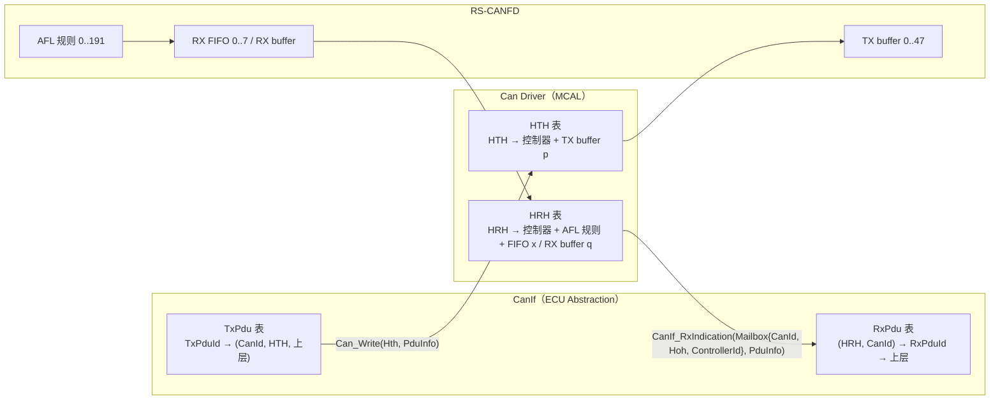
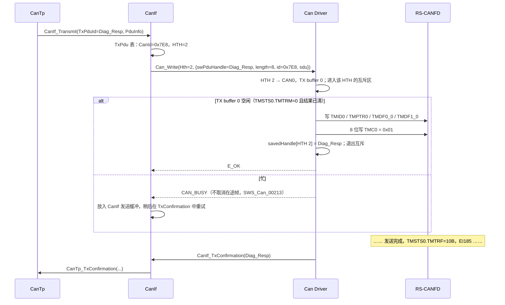
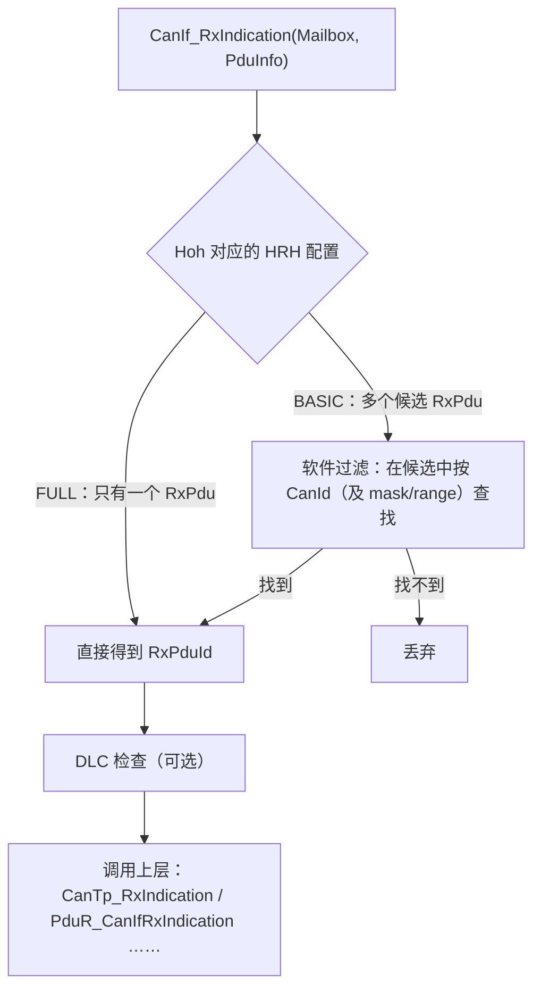

# HOH / HRH / HTH：AUTOSAR 句柄与 RS-CANFD 邮箱的映射

> Prerequisite: [01-can-hardware-basics.md](01-can-hardware-basics.md)（仲裁与优先级）、[02-rh850-can-peripheral.md](02-rh850-can-peripheral.md)（AFL、RX FIFO、TX buffer）、[05-can-interrupt.md](05-can-interrupt.md)、[06-can-controller-init.md](06-can-controller-init.md)
> Next: [08-can-configuration.md](08-can-configuration.md)
> 对应规范: AUTOSAR CP R22-11 SWS CAN Driver：p.15（术语 Hardware Object / HRH / HTH / L-PDU Handle / Priority Inversion）、p.16–17（优先级反转）、p.45（`SWS_Can_00100`、Figure 7-3、`SWS_Can_00276`、`SWS_Can_00016`）、p.45–46（Multiplexed Transmission `SWS_Can_00277/00401/00402/00403`）、p.48（`SWS_Can_00279`）、p.51（`CAN_BUSY` 由 CanIf 排队）、p.57–59（`Can_PduType`、`Can_IdType`、`Can_HwHandleType`、`Can_HwType`）、p.80–82（`Can_Write`、`SWS_Can_00212/00213/00214`）、p.122–130（`CanHardwareObject`、`CanHandleType`、`CanHwObjectCount`、`CanIdType`、`CanObjectId`、`CanObjectType`、`CanControllerRef`、`CanHwFilter`）；HW-E p.1072–1077（接收/发送功能）、p.830–837（规则寄存器）、p.878–887（TX buffer）
> 对应源码: openAUTOSAR `boards/linuxOs/MCAL/Can/include/Can_Cfg.h:53-68,97-128`；`communication/CAN/CanIf/include/CanIf_ConfigTypes.h:93-134`；`communication/CAN/CanIf/src/CanIf_Cfg.c:80-149`；`communication/CAN/CanIf/src/CanIf.c:100-124,424-490,764-830`；本项目无 HOH 代码

---

## 1. 本章目标

1. 准确说出 Hardware Object、HOH、HRH、HTH、L-PDU Handle 五个概念的定义与归属（谁定义、谁使用）。
2. 区分 **FULL** 与 **BASIC** 两种 `CanHandleType`，知道它们对 CanIf 软件过滤、对硬件资源的影响。
3. 把 HTH 映射到 RS-CANFD 的 TX buffer（或 TX queue / TX-RX FIFO），把 HRH 映射到 AFL 规则 + RX FIFO / RX buffer。
4. 理解 `CanHwFilter`（Code/Mask）如何变成 `GAFLIDj/GAFLMj`，尤其是**掩码语义**和 IDE/RTR 位。
5. 理解为什么 CanIf 必须通过 HRH/HTH 句柄与 Can 交互，以及 `CAN_BUSY`、`swPduHandle` 在这个契约里的作用。
6. 能为诊断请求/响应设计一组 HOH。

---

## 2. 为什么需要 HOH？

CanIf 是**硬件无关**的：它不知道 RS-CANFD 有"TX buffer 5"、"RX FIFO 0"、"规则页 1 第 3 条"。Can 驱动是**硬件相关**的：它不知道"0x7E8 是诊断响应"、"这帧要交给 CanTp"。

两者之间需要一个**双方都认识的编号**：

```text
CanIf：  "请从 HTH 2 发送这个 PDU"          → Can：HTH 2 = CAN0 的 TX buffer 0
Can：    "从 HRH 0 收到一帧，ID=0x7E0"      → CanIf：HRH 0 上可能的 RxPdu 只有 Diag_Req_Phys
```

这个编号就是 **HOH（Hardware Object Handle）**：发送方向叫 **HTH**，接收方向叫 **HRH**。

- 对 Can 驱动：HOH 是"配置表的下标"，O(1) 找到硬件资源。
- 对 CanIf：HOH 缩小查找范围（某个 HRH 上只可能出现少数 PDU），并决定是否需要软件过滤。

---

## 3. 在系统中的位置



---

## 4. AUTOSAR 如何定义

### 4.1 术语

`[AUTOSAR Standard]`（SWS p.15，研究笔记 02 §2.3）

| 术语 | 定义（转述） | 谁定义 | 谁用 |
|---|---|---|---|
| **Hardware Object** | CAN Hardware Unit 的 CAN RAM 中的一个 L-PDU 缓冲（message buffer / mailbox） | 硬件 | Can |
| **HOH** | Hardware Object Handle，HRH 或 HTH 的统称；对应配置中的一个 `CanHardwareObject` | Can（配置） | Can、CanIf |
| **HRH** | Hardware Receive Handle，由 Can 驱动定义并提供；**通常 1 个 HRH 对应 1 个硬件对象**；可用于优化软件过滤 | Can | CanIf |
| **HTH** | Hardware Transmit Handle，由 Can 驱动定义；**可对应 1 个或多个**（作为发送缓冲池的）硬件对象 | Can | CanIf |
| **L-PDU Handle** | **定义在 CanIf 层**，每个代表一个 L-PDU | CanIf | Can 只保存和回传（`swPduHandle`） |

### 4.2 Figure 7-3：一个 HOH 编号示例

`[AUTOSAR Standard]` SWS p.45 Figure 7-3（"numbering … is only an example"）：

```text
Message Objects of CAN Hardware
HRH = 0   | ID | DLC | SDU |
HRH = 1   | ID | DLC | SDU |
unused    | ID | DLC | SDU |
HRH = 2   | ID | DLC | SDU |
HRH = 3   | ID | DLC | SDU |
unused    | ID | DLC | SDU |
HTH = 4   | ID | DLC | SDU |
HTH = 5   | ID | DLC | SDU |
```

`SWS_Can_00100`（p.45）："可以配置多个具有唯一 HTH 的 TX 硬件对象。CanIf 把 HTH 作为发送请求的参数。"

### 4.3 编号规则：`CanObjectId`

`[AUTOSAR Standard]` `ECUC_Can_00326`（p.125）：HRH 与 HTH **共用一个连续 ID 空间**，从 0 开始、无空洞。规范示例：HRH0-0、HRH1-1、HTH0-2、HTH1-3。实践中常见做法是**所有 HRH 在前、HTH 在后**——这样 driver 可以用 `if (hoh < NUM_HRH)` 区分方向，用 `hoh - NUM_HRH` 作为 HTH 表下标。

`Can_HwHandleType`（`SWS_Can_00429` p.58–59）：`uint8`（HOH ≤ 255）或 `uint16`（扩展范围）。

### 4.4 `CanHardwareObject` 容器

`[AUTOSAR Standard]`（ECUC_Can_00324，p.122–129）

| 参数 | ID / 页 | 含义 |
|---|---|---|
| `CanObjectId` | 00326 / p.125 | HOH 编号 |
| `CanObjectType` | 00327 / p.127 | `RECEIVE`（HRH）/ `TRANSMIT`（HTH） |
| `CanHandleType` | 00323 / p.123 | `FULL` / `BASIC` |
| `CanIdType` | 00065 / p.125 | `STANDARD` / `EXTENDED` / `MIXED` |
| `CanHwObjectCount` | 00467 / p.124 | 这个 HOH 由几个硬件对象实现 |
| `CanControllerRef` | 00322 / p.127 | 属于哪个控制器 |
| `CanHardwareObjectUsesPolling` | 00490 / p.124 | MIXED 处理模式下是否轮询（[05 章 §7](05-can-interrupt.md)） |
| `CanMainFunctionRWPeriodRef` | 00438 | 由哪个主函数周期轮询 |
| `CanTriggerTransmitEnable` | 00486 | `sdu==NULL` 时调用 `CanIf_TriggerTransmit` 取数据（`SWS_Can_00503/00504` p.82） |
| `CanFdPaddingValue` | 00485 / p.122 | FD DLC 填充值（`SWS_Can_00502` p.83） |
| `CanObjectPayloadLength` | 00495 | 该 HOH 的 payload 上限（`SWS_Can_CONSTR_00512` p.129：必须 ≥ 所有相关 PDU 的长度） |
| 子容器 `CanHwFilter` | 00468 / p.129 | 仅 HRH：`CanHwFilterCode`（00469）、`CanHwFilterMask`（00470） |

---

## 5. FULL vs BASIC

`[AUTOSAR Standard]` `CanHandleType`（ECUC_Can_00323，p.123）：

- **FULL**："硬件对象只处理**一个** L-PDU"——即一个 CAN ID。
- **BASIC**："硬件对象处理**多个** L-PDU"——一个 ID 范围或一组 ID。

| | FULL HRH | BASIC HRH | FULL HTH | BASIC HTH |
|---|---|---|---|---|
| 对应 PDU 数 | 1 个 CAN ID | 多个 | 1 个 TxPdu 专用 | 多个 TxPdu 共用 |
| 硬件过滤 | 精确（mask 全比较） | 范围/部分比较 | — | — |
| CanIf 软件过滤 | 不需要 | **需要**（在该 HRH 的候选 PDU 中按 ID 查找） | — | — |
| CanIf 发送缓冲 | 通常不需要 | 需要（共用对象忙时 `CAN_BUSY` → CanIf 排队） | | |
| 硬件资源 | 多 | 少 | 多 | 少 |
| 典型用途 | 诊断请求、关键控制报文 | 大量信号报文 | 诊断响应、高优先级报文 | 一般报文 |

`CanHwObjectCount`（ECUC_Can_00467，p.124）的含义随方向不同（研究笔记 02 §2.3）：

- 对 **HRH**：FIFO 深度或影子缓冲数。
- 对 **HTH**：多路复用发送（multiplexed transmission）的对象数，或 FullCAN HTH 的硬件 FIFO。

---

## 6. 发送方向：HTH ↔ RS-CANFD

### 6.1 映射选项

`[Conceptual]`（RS-CANFD 资源见 HW-E p.1076–1077；具体 MCAL 实现需看供应商文档，研究笔记 04 §9）

| HTH 配置 | RS-CANFD 资源 | 行为 |
|---|---|---|
| FULL，`CanHwObjectCount=1` | **1 个 TX buffer p**（p ∈ 16m…16m+15） | 最直观；buffer 忙（`TMTRM=1` 或结果未清）→ `CAN_BUSY` |
| BASIC，`CanHwObjectCount=N` | **N 个 TX buffer**，driver 找空闲的一个 | multiplexed transmission（`SWS_Can_00277` p.45）；同一 HTH 的 N 帧可同时挂起，由硬件按 `GCFG.TPRI` 仲裁 |
| BASIC，硬件队列 | **TX queue**（每通道 1 个，占用最高编号 buffer） | 硬件按 ID 优先级发送；要求 `TPRI=0`（HW-E p.818, p.1077） |
| FIFO 语义 | **TX/RX FIFO（transmit 模式）**，链接一个 TX buffer | 先进先出；被链接 buffer 的 `TMCp` 必须 00H、`TMIEp=0`（p.1122） |

每通道最多 16 个 TX buffer，所以**一个控制器上 HTH 占用的硬件对象总数 ≤ 16**（再减去 TX queue、FIFO 链接、merge 模式占用的部分）。

### 6.2 `Can_Write` 与 HTH 的契约

`[AUTOSAR API]` `Std_ReturnType Can_Write(Can_HwHandleType Hth, const Can_PduType* PduInfo)`（SID 0x06，同步，**可重入（thread-safe）**，SWS p.80–81）



逐个 transition：

| # | 步骤 | 依据 |
|---|---|---|
| 1 | CanTp → CanIf | CanIf SWS（本仓库无） |
| 2 | CanIf 由 TxPduId 找到 CanId 和 HTH | CanIf 配置（openAUTOSAR `CanIf_Cfg.c:114-128` 的 `CanIfCanTxPduHthRef`） |
| 3 | `Can_Write(Hth, PduInfo)` | `SWS_Can_00233` p.80 |
| 4 | HTH 互斥 | `SWS_Can_00212` p.81：HTH 空闲 → 置互斥 → 写硬件 → 触发 → 释放 → E_OK |
| 5–6 | 写 buffer、触发 | HW-E p.878–887；`TMCp` 8 位 |
| 7 | 保存 `swPduHandle` | `SWS_Can_00276` p.45：保存到 TxConfirmation 时回传，**目的是让 CanIf 不必搜索** |
| 8 | 忙 → `CAN_BUSY` | `SWS_Can_00213/00214` p.81；`CAN_BUSY`(0x02) 不是错误，是"暂无可用对象"（`SWS_Can_00039` p.59–60） |
| 9 | CanIf 排队 | SWS p.51："In case of CAN_BUSY the CanIf module queues that request" |
| 10 | TxConfirmation | `SWS_Can_00016` p.45 |

**为什么 Can_Write 必须可重入**：`CanIf_Transmit` 本身可重入（SWS p.51），不同任务/ISR 可能同时发送。对**不同** HTH 的并发调用可以并行；对**同一** HTH 的抢占调用返回 `CAN_BUSY`（p.51 举例："write to different hardware TX Handles allowed, write to same TX Handles not allowed"）。所以互斥的粒度是 **HTH**，不是整个驱动。

### 6.3 优先级反转与 HTH 设计

`[AUTOSAR Standard]` SWS p.15–17：

- **Inner priority inversion**：同一个硬件对象里挂着一个低优先级帧，导致高优先级帧发不出去。BASIC HTH 只有 1 个 buffer 时必然发生。
- **Outer priority inversion**：两帧之间间隙太大，被其他节点的低优先级帧抢先。

对策：

1. 关键报文用 **FULL HTH**（独占 buffer）。
2. BASIC HTH 用 `CanHwObjectCount > 1`（multiplexed transmission，`SWS_Can_00277/00401/00402/00403` p.45–46），配合 `GCFG.TPRI=0`（ID 优先）让硬件选择。
3. 规范**不建议**用软件取消+重排来模拟优先级（p.46 Note，研究笔记 02 §2.7.3）；R22-11 也没有公开的发送取消 API。

`[Real Project Consideration]` 诊断响应（例如 0x7E8）通常配一个 FULL HTH，避免被大量周期报文"堵"在同一个 buffer 后面，导致 CanTp 的 N_As 超时。

---

## 7. 接收方向：HRH ↔ RS-CANFD

### 7.1 HRH = 过滤规则 + 存储目的地

RS-CANFD 没有"带过滤器的接收邮箱"这种结构，而是把"过滤"（AFL 规则）和"存储"（RX FIFO / RX buffer / common FIFO）分开（[02 章 §10](02-rh850-can-peripheral.md)）。所以一个 HRH 需要映射到**一组规则 + 一个目的地**：

`[Conceptual]`

| HRH 配置 | AFL 规则 | 目的地 | 说明 |
|---|---|---|---|
| FULL，1 个 `CanHwFilter`（mask 全比较） | 1 条，精确匹配 | 专用 RX FIFO x（深度=`CanHwObjectCount`）或 RX buffer q | RX buffer 是覆盖式、无中断（只能轮询）；FIFO 排队、EI190 |
| BASIC，多个 `CanHwFilter` | N 条规则（同一通道，连续） | 同一个 RX FIFO x | CanIf 需软件过滤 |
| BASIC，1 个范围 filter | 1 条规则（mask 部分比较） | 同一个 RX FIFO x | 例如接收 0x700–0x7FF |
| 需要每通道独立中断 | 规则 → common FIFO k（receive 模式） | EI184/187/192 | |

**规则 → HRH 的反查**：收到帧时，driver 只知道"从 RX FIFO x 读出来的"。如果多个 HRH 共享同一个 FIFO，driver 需要知道帧属于哪个 HRH。RS-CANFD 提供 **label**：`GAFLP0_j.PTR`（12 位，HW-E p.835）会随帧存入 `RFPTRx`（handoff §8：RFPTR 的 `[27:16]` 是 rule label）。driver 可以把 **HRH 编号写进 label**，接收时直接从 `RFPTRx` 取出——这是 RS-CANFD 上实现 "FIFO → HRH" 映射的一个干净方法。`[Conceptual]` 真实 MCAL 是否这样做需查看生成代码。

### 7.2 `CanHwFilter` → `GAFLIDj / GAFLMj`

`[AUTOSAR Standard]` `CanHwFilterMask`（ECUC_Can_00470，p.130）："Bits holding a 0 mean don't care, i.e. do not compare the message's identifier in the respective bit position." 标准 ID 用 11 位掩码，扩展/MIXED 用 29 位掩码。

`[RH850 Hardware]` `GAFLMj`（HW-E p.834, p.1073）："1: Bits are compared. 0: Bits are not compared."

**好消息**：两者语义一致（1=比较）。**需要注意的是 AUTOSAR 掩码只覆盖 ID 位**，而 RS-CANFD 掩码还有 `IDEM`(b31) 和 `RTRM`(b30)。driver/生成器必须根据 `CanIdType` 补上：

| `CanIdType` | `GAFLIDj` | `GAFLMj` | 说明 |
|---|---|---|---|
| STANDARD | `IDE=0, RTR=0, ID=code & 0x7FF` | `0xC0000000 \| (mask & 0x7FF)` | 比较 IDE（只收标准帧）、RTR（只收数据帧，配合"不支持远程帧" `SWS_Can_00236`） |
| EXTENDED | `IDE=1, RTR=0, ID=code & 0x1FFFFFFF` | `0xC0000000 \| (mask & 0x1FFFFFFF)` | |
| MIXED | 需拆成两条规则，或不比较 IDE | — | 手册要求 `IDEM=0` 时所有 `IDM` 也必须为 0（handoff §7、研究笔记 04 §8.5），所以"不比较 IDE 但精确比较 ID"**不能**用一条规则实现 |

所以 **0x7E0 标准数据帧精确匹配**：`GAFLID = 0x000007E0`，`GAFLM = 0xC00007FF`（研究笔记 01 F-CAN-6；handoff §7）。

`[Educational Implementation]`

```c
/* 由 AUTOSAR CanHwFilter + CanIdType 生成 AFL 规则（教学示意） */
typedef struct { uint32 gaflid, gaflm, gaflp0, gaflp1; } EduCan_AflRuleType;

static EduCan_AflRuleType EduCan_MakeRule(uint32 code, uint32 mask, boolean extended,
                                          uint16 hrhLabel, uint8 rxFifo)
{
    EduCan_AflRuleType r;
    if (extended) {
        r.gaflid = 0x80000000uL | (code & 0x1FFFFFFFuL);           /* IDE=1, RTR=0 */
        r.gaflm  = 0xC0000000uL | (mask & 0x1FFFFFFFuL);           /* 比较 IDE、RTR */
    } else {
        r.gaflid = (code & 0x7FFuL);                               /* IDE=0, RTR=0, LB=0 */
        r.gaflm  = 0xC0000000uL | (mask & 0x7FFuL);
    }
    r.gaflp0 = ((uint32)(hrhLabel & 0xFFFu) << 16);                 /* DLC 检查关(0)，PTR=label，RMV=0 */
    r.gaflp1 = (1uL << rxFifo);                                     /* bit0..7 → RX FIFO0..7 */
    return r;
}
```

> `GAFLP0` 的 `DLC[31:28]` 是"最小 DLC"门限，0 表示不检查（HW-E p.835；handoff §7："不是'只能接收恰好这个字节数'"）。若使用，需与 CanIf 的 DLC check 策略统一，避免两层重复丢弃。

### 7.3 接收时 Can 交给 CanIf 什么

`[AUTOSAR API]` `SWS_Can_00279`（p.48）：调用 `CanIf_RxIndication`，参数是：

- **Mailbox**（`Can_HwType`，`SWS_CAN_00496` p.59）：`CanId`（`Can_IdType`，含 IDE/FD 位）、**`Hoh`**（HRH 编号）、`ControllerId`（**CanIf 的抽象控制器 ID**）；
- **PduInfoPtr**：长度和 L-SDU 指针。

CanIf 拿到 `Hoh` 后：



**这就是"为什么 CanIf 需要 HRH"**：没有 HRH，CanIf 只能在**所有** RxPdu 中按 CanId 查找；有了 HRH，FULL 时 O(1)，BASIC 时只在少量候选中查找（SWS p.15："The HRH can be used to optimize software filtering"）。同时 `CanHwFilterMask` 的 Scope/Dependency 写明："The filter mask settings must be known by the CanIf configuration for optimization of the SW filters"（p.130）——硬件过滤与软件过滤是一套联合设计。

---

## 8. 为什么 CanIf 需要 HRH/HTH，而不是直接用 CAN ID？

总结成四点：

1. **硬件无关性**：CanIf 不能知道 "TX buffer 0"。HTH 是 Can 驱动对外暴露的、与硬件无关的抽象编号。
2. **多控制器、多驱动**：一个 ECU 可能有多个 Can 驱动（不同厂商的硬件单元，`SWS_Can_00077/00284` p.33–34）。CanIf 通过"驱动 + HOH"定位资源，CAN ID 可能在不同控制器上重复。
3. **同一 ID 多个对象**：同一 CAN ID 可以从不同 HTH 发送（例如不同控制器），也可能被多个 HRH 接收（不同网络）。ID 无法唯一标识资源。
4. **性能**：`swPduHandle` + HRH 让双方都不用搜索（`SWS_Can_00276` p.45："used to reduce time for searching in the CanIf module implementation"）。

---

## 9. openAUTOSAR 实现

openAUTOSAR **没有 Can driver**，但它的 CanIf 和 Can 配置头展示了 R3 风格的 HOH 设计：

**Can 侧 HOH 定义**（`boards/linuxOs/MCAL/Can/include/Can_Cfg.h`）：

- `:53-56` `Can_Arc_HohType`：`CAN_ARC_HANDLE_TYPE_BASIC / FULL`。
- `:59-68` HTH 与 HRH 是**两个独立的枚举**：`Can_Arc_HTHType { HWObj_2, NUM_OF_HTHS }`、`Can_Arc_HRHType { HWObj_1, NUM_OF_HRHS }`。
- `:97-128` `Can_HardwareObjectType`：`CanHandleType`、`CanIdType`、`CanIdValue`、`CanObjectId`、`CanObjectType`、`CanFilterMaskRef`，以及 FlexCAN 特有的 `Can_Arc_MbMask`（"A '1' in this mask tells the driver that that HW Message Box should be occupied by this Hoh"）。注释 `:109-112` 写着 "The HRH and HTH Ids are defined under two different name-spaces. Example: HRH0-0, HRH1-1, HTH0-2, HTH1-3"——注释与示例本身矛盾（示例是连续单一空间），R22-11 `ECUC_Can_00326` 已明确为同一连续空间。

**CanIf 侧引用**（`communication/CAN/CanIf/include/CanIf_ConfigTypes.h`）：

- `:93` `CanIfSoftwareFilterHrh`：HRH 是否需要软件过滤；`:103` `CanIfHrhIdSymRef`：引用 Can 的 HRH 符号。
- `:117-134` `CanIf_HthConfigType`：`CanIfHthType`、`CanIfCanControllerIdRef`、`CanIfHthIdSymRef`。

**配置实例**（`communication/CAN/CanIf/src/CanIf_Cfg.c`）：

- `:80-89` 一个 BASIC HTH（`HWObj_2`），`:91-101` 一个 BASIC HRH（`HWObj_1`，`CanIfSoftwareFilterHrh = TRUE`）。
- `:114-128` TxPdu：CanId 512（0x200），`CanIfCanTxPduHthRef = &CanIfHthConfigData_Hoh[0]`。
- `:130-149` RxPdu：CanId 256（0x100），`CanIfCanRxPduHrhRef`，`CanIfSoftwareFilterType = CANIF_SOFTFILTER_TYPE_MASK`，`:146` `CanIfCanRxPduCanIdMask = 0xFFF`。
- **没有任何 CanTp 的 Rx/Tx/FC PDU**（研究笔记 03 §2）——诊断路径在这份配置中根本没接通。

**运行时**（`communication/CAN/CanIf/src/CanIf.c`）：

- `:100-124` `CanIf_Arc_FindHrhChannel(hrh)`：遍历 HOH 配置，找到 HRH 所属的 channel（线性搜索）。
- `:470` `CanIf_Transmit` 调用 `Can_Write(txEntry->CanIfCanTxPduHthRef->CanIfHthIdSymRef, &canPdu)`——**CanIf 只传 HTH，不传硬件细节**。
- `:476-481`：`CAN_BUSY` 直接返回 `E_NOT_OK`，注释 "Tx buffering not supported"——与 R4.x "CanIf 排队"不同。
- `:794-822`：BASIC HRH 的软件过滤 `(CanId & mask) == (PduCanId & mask)`。研究笔记 03 指出 `:820` 的 "unsupported filter type" 分支在 `continue` 前没有 `entry++`，会死循环（阅读结论）。

---

## 10. 当前教学项目实现

本项目没有 HOH 表或 `Can_Write` 代码。可直接复用的设计素材：

- handoff §7：7 个标准 ID 进 FIFO0 的完整 AFL 示例（`GAFLCFG0=0x07000000`、`GAFLM=0xC00007FF`、`GAFLP0=j<<16`、`GAFLP1=1`），以及警告"Rx 规则数、MCAL HOH 数、Tx mailbox 数是三个不同概念"。
- handoff §9：TX buffer 地址表与 `TMTRF` 解码。
- `mcal-reference-guide.md` R5："已提交不等于已发送成功；无资源应返回 busy，不能覆盖仍在发送的 buffer。"

实现将在 [10-can-write-implementation.md](10-can-write-implementation.md) / [11-can-rx-implementation.md](11-can-rx-implementation.md) 中完成。

---

## 11. 设计示例：诊断 ECU 的 HOH

需求：CAN0，500 kbit/s Classical；接收物理请求 0x7E0（可选功能请求 0x7DF），发送响应 0x7E8；另有若干周期信号报文。

`[Conceptual]`

| HOH | 方向 | 类型 | CanIdType | Filter / ID | RS-CANFD 资源 | 理由 |
|---|---|---|---|---|---|---|
| 0 | RECEIVE | FULL | STANDARD | code 0x7E0，mask 0x7FF | AFL 规则 0 → RX FIFO0（深度 8，`RFIM=1`，中断 EI190），label=0 | 诊断请求不能丢、要低延迟 |
| 1 | RECEIVE | FULL | STANDARD | code 0x7DF，mask 0x7FF | AFL 规则 1 → RX FIFO0，label=1 | 功能请求（若项目需要；ID 需由网络规范确认） |
| 2 | RECEIVE | BASIC | STANDARD | code 0x100，mask 0x700（0x100–0x1FF） | AFL 规则 2 → RX FIFO1（轮询） | 周期信号，CanIf 软件过滤 |
| 3 | TRANSMIT | FULL | STANDARD | — | CAN0 TX buffer 0（`TMIEC0` bit0=1） | 诊断响应独占 buffer，避免 inner priority inversion |
| 4 | TRANSMIT | BASIC（`CanHwObjectCount=4`） | STANDARD | — | CAN0 TX buffer 1–4 | 周期报文共享 |

注意：

- HOH 编号 0–2 为 HRH、3–4 为 HTH，连续无空洞（`ECUC_Can_00326`）。
- HOH 0 和 1 共享 RX FIFO0，靠 label 区分（§7.1）。如果不用 label，driver 也可以在读出帧后用 ID 反查 HRH。
- 规则顺序很重要：**命中第一条即停止**（HW-E p.1073）。如果把 HOH 2 的宽范围规则放在前面且范围覆盖了 0x7E0，HOH 0 就永远收不到。
- 规则数 3 → `GAFLCFG0.RNC0 = 3`（`0x03000000`）。
- 完整的配置值见 [08-can-configuration.md](08-can-configuration.md)。

---

## 12. Debug 方法

| 问题 | 看什么 |
|---|---|
| 帧在总线上，CanIf 没收到 | AFL：`GAFLCFG0` 规则数、`GAFLIDj/GAFLMj`（IDE/RTR 位！）、规则顺序；`RFSTSx.RFMC` 是否增加；FIFO→HRH 映射；CanIf HRH 配置 |
| 收到了，但交给了错误的上层 | `Mailbox.Hoh` 是否正确；CanIf 的 RxPdu 表中 `(HRH, CanId)` 是否有重复/冲突 |
| `Can_Write` 频繁 `CAN_BUSY` | HTH 的 buffer 是否一直 `TMTRM=1`（发不出去：ACK/bus 问题）；TX 完成后是否清了 `TMSTSp`；HTH 是否太少 |
| TxConfirmation 报错 PDU | `savedHandle[HTH]` 是否在 `Can_Write` 中保存、在完成时取出；多 buffer 的 BASIC HTH 是否按 buffer 号保存 |
| 某些扩展帧收不到 | 规则 `IDE` 与 `IDEM`；MIXED 是否拆成两条规则 |

断点：`CanIf_RxIndication` 入口看 `Mailbox->Hoh` 与 `Mailbox->CanId`；`Can_Write` 返回 `CAN_BUSY` 的分支；TX ISR 中取 `savedHandle` 处。

寄存器观察：规则表需要先设置 `GAFLECTR.AFLPN` 选页再读窗口；调试器直接读 `GAFLID0` 地址读到的是**当前选中页**的规则 0。

---

## 13. 常见错误

| 错误 | 后果 | 依据 |
|---|---|---|
| HOH 编号不连续或 HRH/HTH 分两个空间 | 与 R22-11 配置不兼容，工具报错 | `ECUC_Can_00326` p.125 |
| `GAFLM` 只写 `0x7FF`（不比较 IDE/RTR） | 扩展帧 0x...7E0 或远程帧也被收进来 | HW-E p.834 |
| 把 AUTOSAR mask 理解为 "0=比较" | 规则变成通配 | SWS p.130 与 HW-E p.1073 都是 1=比较 |
| 宽范围规则排在精确规则前面 | 精确 HRH 永远收不到 | 命中第一条即停（p.1073） |
| HRH 映射到 RX buffer 但配置为中断 | 永远没有中断 | RX buffer 无中断（02 章 §10.2） |
| 诊断响应和大量周期报文共用 1 个 buffer 的 BASIC HTH | 诊断响应延迟、CanTp 超时 | 优先级反转（SWS p.15–17） |
| `CAN_BUSY` 被当成错误上报 | 误报故障 | `CAN_BUSY` 是正常背压（p.51） |
| `Can_Write` 对整个驱动加锁 | 不同 HTH 不能并发，延迟增加 | 互斥粒度应为 HTH（p.51） |
| 一个通道的 HTH 占用超过 16 个 buffer | 无法实现 | HW-E p.1076 |

---

## 14. 实验

**实验 1：编号（无硬件）**
为 §11 的设计再加一个控制器 CAN1（1 个 FULL HRH、1 个 FULL HTH）。重新编排 `CanObjectId`，写出 Can 驱动内部的 HRH 表和 HTH 表（下标 → 控制器、硬件资源）。

**实验 2：规则生成（无硬件）**
用 §7.2 的 `EduCan_MakeRule`，为 §11 的三个 HRH 生成 `GAFLID/GAFLM/GAFLP0/GAFLP1` 数值，并写断言：0x7E0 匹配规则 0；0x7E1 不匹配规则 0；扩展帧 0x000007E0 不匹配任何标准规则；0x150 匹配规则 2；远程帧 0x7E0 不匹配。

**实验 3：AFL 匹配模拟器（无硬件）**
写一个 C 函数 `int EduAfl_Match(const EduCan_AflRuleType *rules, int n, uint32 rxId, boolean ide, boolean rtr)`，按 HW-E p.1073 的语义返回第一条命中的规则号。用它验证"规则顺序"错误的场景。

**实验 4：读 openAUTOSAR**
阅读 `CanIf.c:764-830`，画出 `CanIf_RxIndication` 的流程图，标出 R3 与 R4.x 在参数上的差异，并找到 `:820` 附近的死循环问题。

---

## 15. 思考题

1. 为什么 HTH 可以对应多个硬件对象，而 HRH "通常" 只对应一个？从发送与接收的不对称性（谁决定 ID）考虑。
2. BASIC HRH 需要 CanIf 软件过滤。如果硬件过滤已经精确到每个 ID（多条规则），CanIf 还需要软件过滤吗？`CanIfSoftwareFilterHrh` 应该怎么配？
3. 在 RS-CANFD 上，把 HRH 编号写进规则 label 有什么好处？12 位 label 最多能区分多少个 HRH？
4. 如果 CanTp 在 `CanIf_TxConfirmation` 回调里立即发送下一个 CF，而 Can 驱动在回调之后才清 `TMSTSp`，会发生什么？
5. 同一个 CAN ID（例如 0x7DF）需要被两个控制器接收，HRH 应该如何设计？

---

## 16. 对未来真实项目的意义

`[Real Project Consideration]`

- **读真实配置**：截图工程中"13 个邮箱 / 7 条规则"（研究笔记 01 §4）就是 HOH 与规则的关系。用本章知识能判断：7 条规则可能对应 7 个 FULL HRH，也可能对应少量 BASIC HRH；13 个邮箱可能包含 HRH 与 HTH。**规则数、HOH 数、TX buffer 数是三个不同概念**。
- **mask=0 的疑问**：截图中的 mask=0 若出现在 GAFLM 里就是"通配"；若出现在 `CanHwFilterMask` 里也表示"不比较"。是否正确要看生成代码是否做了转换——这正是需要在真实环境中确认的地方。
- **诊断升级**：DCM 升级常伴随"新增诊断 ID / 功能寻址 / CAN FD 诊断"。每一项都要求新增或修改 HRH/HTH、AFL 规则、RX FIFO 深度/payload，并同步 CanIf 的 RxPdu/TxPdu 表。
- **性能调优**：发送延迟问题往往来自 HTH 设计（共用 buffer）而不是 CPU 负载。

---

## 17. 本章总结

- Hardware Object = 硬件邮箱；HOH = 句柄；HRH 接收、HTH 发送；L-PDU Handle 属于 CanIf。
- HOH 编号连续、HRH 与 HTH 共用空间（`ECUC_Can_00326`）。
- FULL = 一个 ID；BASIC = 多个 ID（需要 CanIf 软件过滤/发送排队）。
- RS-CANFD：HTH → TX buffer（或 queue/FIFO）；HRH → AFL 规则 + RX FIFO/RX buffer/common FIFO；label 可用于 FIFO → HRH 反查。
- `CanHwFilterMask` 与 `GAFLM` 都是 1=比较；driver 必须补上 IDE/RTR 掩码：标准帧精确匹配 `GAFLM=0xC00007FF`。
- `Can_Write` 按 HTH 互斥，忙时 `CAN_BUSY` 由 CanIf 排队；`swPduHandle` 让 TxConfirmation 无需搜索。

## 18. 下一章

[08-can-configuration.md](08-can-configuration.md)：把前面所有内容汇总成一份完整配置——AUTOSAR 容器、生成的 `Can_Cfg.h` / `Can_PBcfg.c` 的形态，以及一个 0x7E0/0x7E8、500 kbit/s 诊断 Demo 从配置到每个寄存器值的完整推导。
