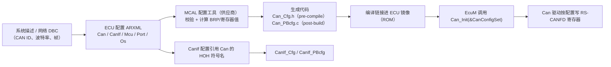
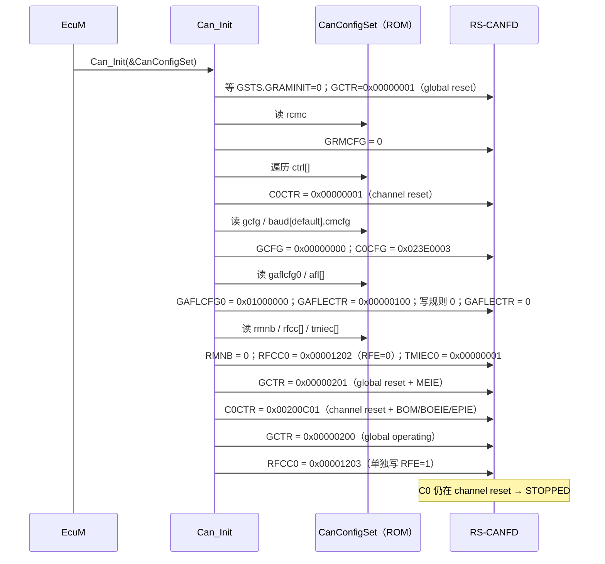
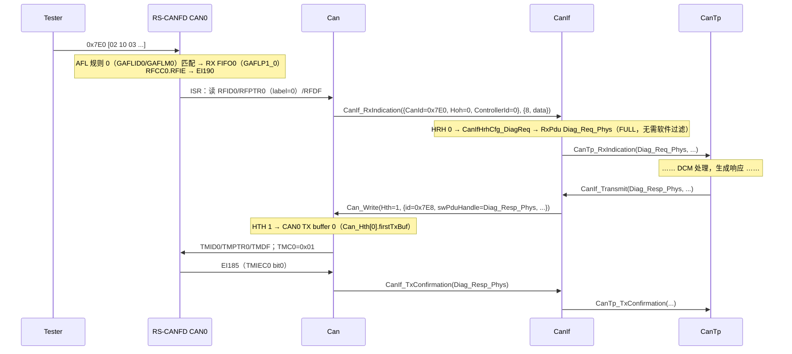

# Can 配置：从 ECUC 容器到生成代码，再到每一个寄存器值

> Prerequisite: [03-can-clock-bit-timing.md](03-can-clock-bit-timing.md)、[05-can-interrupt.md](05-can-interrupt.md)、[06-can-controller-init.md](06-can-controller-init.md)、[07-hoh-hrh-hth.md](07-hoh-hrh-hth.md)、[配置与 ARXML](../02-autosar-classic/04-configuration-arxml.md)、[生成代码](../02-autosar-classic/05-generated-code.md)
> Next: [09-can-init-implementation.md](09-can-init-implementation.md)
> 对应规范: AUTOSAR CP R22-11 SWS CAN Driver：p.44（`SWS_Can_00021/00056/00291`：配置指针与 post-build）、p.92–97（Figure 10-1 等配置总图）、p.98–106（`CanGeneral`）、p.107–113（`CanController`）、p.114–117（`CanControllerBaudrateConfig`）、p.118–121（`CanControllerFdBaudrateConfig`）、p.122–129（`CanHardwareObject`）、p.129–130（`CanHwFilter`）、p.131（`CanConfigSet`、`CanMainFunctionRWPeriods`）；HW-E（R01UH0585EJ0120 Rev.1.20）p.802–848、p.878–887、p.1091–1098（各寄存器与设置流程）
> 对应源码: openAUTOSAR `boards/linuxOs/MCAL/Can/include/Can_Cfg.h:97-219`（R3 风格配置类型，只有 extern，无实例）、`communication/CAN/CanIf/src/CanIf_Cfg.c:50-168`（手写 CanIf 配置实例）；本项目无 Can 配置代码；`docs/rh850-hardware-handoff.md` §6–§11（参考配置值）

> 本章所有"生成文件"内容均为 `[Conceptual]`：**R22-11 SWS 没有规定 Can 配置生成文件的文件名与结构**（在 SWS 全文中检索 `Can_Cfg.h`、`PBcfg` 均无结果），`Can_ConfigType` 也是"实现相关"的（`SWS_Can_00291` p.44）。真实 Renesas MCAL 的文件名、结构体名、供应商扩展参数名**需在真实项目环境中确认**。

---

## 1. 本章目标

1. 掌握 Can 模块的 ECUC 配置树：`CanGeneral`、`CanConfigSet`、`CanController`、`CanControllerBaudrateConfig`、`CanHardwareObject`、`CanHwFilter`，知道每个参数"最终落到哪里"。
2. 理解 pre-compile / link-time / post-build 配置的区别，以及 `Can_Init(const Can_ConfigType* Config)` 中那个指针指向什么。
3. 看懂（概念上的）生成文件：`Can_Cfg.h`（编译期开关、符号名）与 `Can_PBcfg.c`（ROM 中的配置结构）。
4. 能为一个 **诊断 Demo（CAN0，500 kbit/s Classical，接收 0x7E0、发送 0x7E8）** 写出完整的 AUTOSAR 配置，并推导出**每一个 RS-CANFD 寄存器值**。
5. 知道配置一致性需要检查哪些约束（ID 连续、RAM 预算、规则数、TX buffer 数、时钟引用）。

---

## 2. 为什么需要这个模块？

前七章讲了"Can 驱动要做什么"。但 driver 的**代码**对所有项目都一样；不同 ECU 之间不同的是：

- 用哪个通道、什么波特率、什么时钟；
- 收哪些 ID、发哪些 ID、用哪些硬件资源；
- 中断还是轮询、主函数周期多少；
- bus-off 恢复策略、FD 是否启用……

AUTOSAR 把这些全部抽成**配置**，由工具生成 C 代码，driver 代码在运行时只读配置。这样：

- 同一份 MCAL 源码（甚至二进制库）可以用在不同 ECU 上；
- post-build 配置允许在不重新编译 driver 的情况下替换配置集（`SWS_Can_00021/00056` p.44）。

对学习者而言，**配置是把前七章的知识"连成一条线"的地方**：每个参数背后都是一个寄存器位或一段 driver 逻辑。

---

## 3. 在系统中的位置：配置如何流动



关键点：

- **CanIf 配置引用 Can 的 HOH**（通过符号名，`CanObjectId` 是 "Symbolic Name generated for this parameter"，SWS p.125），所以两者必须由同一套 ECUC 配置一起生成。
- **Can 的位定时依赖 Mcu 的时钟参考点**（`CanCpuClockRef` → `McuClockReferencePoint`，p.112）。
- **Can 的中断依赖 Os 的 ISR 配置**（EI 通道、优先级），Can 本身不设置优先级（SWS p.33）。
- **Can 的引脚依赖 Port 配置**（`SWS_Can_00239` p.22）。

一个 CAN 通道能工作，至少需要 **Mcu + Port + Os + Can + CanIf** 五份配置一致。

---

## 4. AUTOSAR 如何定义：配置树

### 4.1 总图

`[AUTOSAR Standard]`（SWS p.92 Figure 10-1 及 p.98–131；研究笔记 02 §2.4）

```text
Can（EcucModuleDef）
├── CanGeneral（1）                                       p.98-106
│     CanDevErrorDetect                                   p.98
│     CanMultiplexedTransmission                          p.103
│     CanSetBaudrateApi                                   p.103
│     CanTimeoutDuration                                  p.104   ← Can_SetControllerMode 等待上限
│     CanMainFunctionBusoffPeriod / ModePeriod / WakeupPeriod   p.101-102
│     CanOsCounterRef                                     p.105   ← GetCounterValue 用哪个 OS Counter
│     CanLPduReceiveCalloutFunction                       p.100
│     CanIndex                                            p.100
│     CanEnableSecurityEventReporting                     p.99
│     └── CanMainFunctionRWPeriods（0..*）                p.131
└── CanConfigSet（1）                                     p.131
      ├── CanController（1..*）                           p.107-113
      │     CanControllerId（symbolic）                   p.109
      │     CanControllerActivation / CanControllerBaseAddress   p.108
      │     CanRxProcessing / CanTxProcessing / CanBusoffProcessing / CanWakeupProcessing   p.107-110
      │     CanWakeupSupport / CanWakeupSourceRef          p.111-113
      │     CanCpuClockRef → McuClockReferencePoint        p.112
      │     CanControllerDefaultBaudrate → BaudrateConfig  p.111
      │     ├── CanControllerBaudrateConfig（1..*）       p.114-117
      │     │     CanControllerBaudRate(kbps) / BaudRateConfigID / PropSeg / Seg1 / Seg2 / SyncJumpWidth
      │     │     └── CanControllerFdBaudrateConfig（0..1） p.118-121
      │     └── （供应商扩展：接口模式、时钟源、BOM、TDC …）← 不在 SWS 中
      └── CanHardwareObject（0..*）                       p.122-129
            CanObjectId / CanObjectType / CanHandleType / CanIdType / CanHwObjectCount
            CanControllerRef / CanHardwareObjectUsesPolling / CanMainFunctionRWPeriodRef
            CanTriggerTransmitEnable / CanFdPaddingValue / CanObjectPayloadLength
            └── CanHwFilter（0..*，仅 HRH）               p.129-130
                  CanHwFilterCode / CanHwFilterMask
```

### 4.2 参数 → 去向总表

| 参数 | 配置类别 | 去向 | RS-CANFD / driver 落点 |
|---|---|---|---|
| `CanDevErrorDetect` | pre-compile | `Can_Cfg.h` 宏 | DET 检查代码是否编译 |
| `CanMultiplexedTransmission` | pre-compile | 宏 | BASIC HTH 是否使用多个 TX buffer |
| `CanSetBaudrateApi` | pre-compile | 宏 | 是否编译 `Can_SetBaudrate` |
| `CanTimeoutDuration` | pre-compile | 宏（换算成 counter tick） | `Can_SetControllerMode` 有界等待（06 章 §7） |
| `CanOsCounterRef` | pre-compile | 宏 | `GetCounterValue(counterId, …)` |
| `CanMainFunction*Period` | pre-compile | 交给 SchM/RTE 调度 | `Can_MainFunction_*` 的调用周期 |
| `CanControllerId` | 符号名 | `CanConf_CanController_<name>` | CanIf 用它调用 Can API |
| `CanControllerBaseAddress` | post-build | 结构体 | RS-CANFD 是单一基址 `0xFFD2_0000`，通道用偏移区分——供应商通常用通道号代替 |
| `Can*Processing` | pre-compile/post-build | 结构体/宏 | 打开哪些外设中断使能位（`RFIE/TMIE/CmCTR.*IE`），哪些在主函数中轮询 |
| `CanCpuClockRef` | — | 生成阶段使用 | 计算 BRP 的 fCAN；运行时不需要 |
| `CanControllerBaudrateConfig` | post-build | 预计算的 `CmCFG` 或 `NCFG/DCFG` 常量 | 06 章 §6 第 6 步 |
| `CanHardwareObject` (RECEIVE) | post-build | HRH 表 + AFL 规则表 + FIFO 配置 | `GAFLCFG0`、`GAFLID/M/P0/P1`、`RFCCx`、`RMNB` |
| `CanHardwareObject` (TRANSMIT) | post-build | HTH 表 | TX buffer 号、`TMIECy` |
| `CanHwFilter` | post-build | AFL 规则 | `GAFLIDj/GAFLMj`（补 IDE/RTR 掩码，07 章 §7.2） |

---

## 5. 核心数据结构：生成代码长什么样

### 5.1 三种配置类别

`[AUTOSAR Standard]` 每个参数在 SWS 表格中都有 "Value Configuration Class"（例如 `CanHwFilterCode`：Pre-compile time X / Link time -- / Post-build time X，p.129–130）。含义：

| 类别 | 何时确定 | 典型落点 |
|---|---|---|
| Pre-compile | 编译前 | `#define`，影响哪些代码被编译 |
| Link-time | 链接时 | 外部 `const` 对象，可替换目标文件 |
| Post-build | 烧录后（可单独刷写配置区） | ROM 中的 `const` 结构体，`Can_Init(Config)` 选择 |

`SWS_Can_00291`（p.44）："Config is a pointer into an array of implementation specific data structure stored in ROM."

### 5.2 `Can_Cfg.h`（概念示意）

`[Conceptual]`（文件名、宏名为教学约定；真实 MCAL 以供应商生成结果为准）

```c
/* Can_Cfg.h —— 由配置工具生成，请勿手改（教学示意） */
#ifndef CAN_CFG_H
#define CAN_CFG_H

/* ---- CanGeneral（pre-compile） ---- */
#define CAN_DEV_ERROR_DETECT               STD_ON
#define CAN_MULTIPLEXED_TRANSMISSION       STD_OFF
#define CAN_SET_BAUDRATE_API               STD_OFF
#define CAN_TIMEOUT_DURATION_TICKS         (1000u)    /* CanTimeoutDuration=1 ms，OS counter 1 µs/tick 时 */
#define CAN_OS_COUNTER_ID                  (OsCounter_HwTick)

/* ---- 供应商扩展（示意） ---- */
#define CAN_INTERFACE_MODE_CLASSICAL       STD_ON     /* GRMCFG.RCMC = 0 */

/* ---- 符号名（ECUC symbolicNameValue = true） ---- */
#define CanConf_CanController_CAN0                    (0u)
#define CanConf_CanHardwareObject_HRH_DiagReq         (0u)   /* CanObjectId 0 */
#define CanConf_CanHardwareObject_HTH_DiagResp        (1u)   /* CanObjectId 1 */
#define CanConf_CanControllerBaudrateConfig_BR500k    (0u)

#define CAN_NUM_CONTROLLERS                (1u)
#define CAN_NUM_HRH                        (1u)
#define CAN_NUM_HTH                        (1u)

extern const Can_ConfigType CanConfigSet;
#endif
```

为什么 HOH 编号要作为**符号名**导出：CanIf 的配置引用 `CanConf_CanHardwareObject_HTH_DiagResp`，而不是写死数字 1。这样 Can 配置里调整 HOH 顺序时，CanIf 自动跟随。

### 5.3 `Can_PBcfg.c`（概念示意）

`[Conceptual]` + `[Educational Implementation]`（结构体字段是教学设计，不是 AUTOSAR 定义——`Can_ConfigType` 的内容是实现相关的）

```c
/* Can_PBcfg.c —— 由配置工具生成（教学示意，Classical 接口模式） */
#include "Can.h"

static const EduCan_BaudrateCfgType Can_Baud_CAN0[] = {
    /* ConfigID 0：500 kbit/s @ fCAN 40 MHz，divider 4，TSEG1 15，TSEG2 4，SJW 3，SP 80% */
    { .configId = 0u, .cmcfg = 0x023E0003uL },
};

static const EduCan_ControllerCfgType Can_Ctrl[] = {
    {
        .hwChannel       = 0u,                      /* RS-CANFD CAN0 */
        .baud            = Can_Baud_CAN0,
        .numBaud         = 1u,
        .defaultBaudIdx  = 0u,
        .cmctrBits       = 0x00200C00uL,            /* BOM=01, BOEIE=1, EPIE=1（CHMDC 由驱动填） */
        .rxIrq           = TRUE,                    /* CanRxProcessing = INTERRUPT */
        .txIrq           = TRUE,                    /* CanTxProcessing = INTERRUPT */
        .busoffIrq       = TRUE,                    /* CanBusoffProcessing = INTERRUPT */
    },
};

static const EduCan_AflRuleType Can_AflRules[] = {
    /* 规则 0 → HRH 0（label 0），0x7E0 标准数据帧精确匹配 → RX FIFO0 */
    { .gaflid = 0x000007E0uL, .gaflm = 0xC00007FFuL, .gaflp0 = 0x00000000uL, .gaflp1 = 0x00000001uL },
};

static const EduCan_HrhCfgType Can_Hrh[] = {
    { .controller = 0u, .rxFifo = 0u, .label = 0u, .handleType = CAN_FULL, .idType = CAN_STANDARD },
};

static const EduCan_HthCfgType Can_Hth[] = {
    { .controller = 0u, .firstTxBuf = 0u, .numTxBuf = 1u, .handleType = CAN_FULL, .idType = CAN_STANDARD },
};

const Can_ConfigType CanConfigSet = {
    .rcmc          = 0u,                            /* GRMCFG：Classical */
    .gcfg          = 0x00000000uL,                  /* DCS=0（40 MHz），TPRI=0（ID 优先） */
    .gctrIrqBits   = 0x00000200uL,                  /* MEIE：FIFO 丢帧 → global error 中断 */
    .gaflcfg0      = 0x01000000uL,                  /* RNC0 = 1 条规则 */
    .afl           = Can_AflRules,
    .numAfl        = 1u,
    .rmnb          = 0u,                            /* 不使用 RX buffer */
    .rfcc          = { 0x00001203uL, 0u, 0u, 0u, 0u, 0u, 0u, 0u },  /* FIFO0：RFIM=1, 8 级, RFIE=1, RFE=1 */
    .tmiec         = { 0x00000001uL, 0u },          /* TX buffer 0 完成中断 */
    .ctrl          = Can_Ctrl,
    .numControllers= 1u,
    .hrh           = Can_Hrh,
    .hth           = Can_Hth,
};
```

**设计原则**：生成代码里放的是"**已经算好的寄存器值**"（`cmcfg`、`gaflm` 等），而不是"kbps / mask"等原始参数。这样 driver 在 `Can_Init` 中只需要按顺序写，不做除法、不做语义转换——转换在生成阶段完成，可以做充分的检查（研究笔记 02 §2.4 中 `CanCpuClockRef` 的配置链就是为此服务的）。

---

## 6. 初始化流程：配置如何变成寄存器写入



每一步对应的模式限制与理由见 [06 章 §6.2](06-can-controller-init.md)。

---

## 7. 完整示例：诊断 Demo 配置（0x7E0 / 0x7E8，500 kbit/s）

### 7.1 需求

| 项 | 值 | 备注 |
|---|---|---|
| 控制器 | CAN0 | 引脚 P2_0/P2_1（ALT 待核对，04 章） |
| 总线 | Classical CAN，500 kbit/s，采样点 80% | |
| 接收 | 0x7E0（物理寻址诊断请求），标准帧 | 可选扩展：0x7DF 功能寻址（需网络规范确认） |
| 发送 | 0x7E8（诊断响应），标准帧 | |
| 处理方式 | RX/TX/bus-off 都用中断 | |
| bus-off | 不自动恢复（`SWS_Can_00274`），由 CanSM 恢复 | |

> 0x7E0/0x7E8 是常见的 OBD/UDS 物理寻址对，但**真实项目的诊断 ID 必须以网络规范为准**（handoff §7："这 7 个值只来自截图，不构成已确认诊断寻址规范"）。

### 7.2 AUTOSAR 配置（ECUC 视图）

`[Conceptual]`（以 ECUC 参数形式书写，近似 ARXML 的层次；真实 ARXML 语法更冗长）

```text
Can
├── CanGeneral
│     CanDevErrorDetect            = TRUE
│     CanMultiplexedTransmission   = FALSE
│     CanSetBaudrateApi            = FALSE
│     CanTimeoutDuration           = 0.001          # 1 ms，远大于 RS-CANFD 最长切换时间（2 帧 ≈ 0.5 ms @500k）
│     CanMainFunctionModePeriod    = 0.005
│     CanMainFunctionBusoffPeriod  = 0.005          # 即使 bus-off 用中断，也要给出（若工具要求）
│     CanOsCounterRef              → /Os/OsCounter_HwTick
│     CanMainFunctionRWPeriods/RW_5ms
│           CanMainFunctionPeriod  = 0.005
└── CanConfigSet
      ├── CanController_CAN0
      │     CanControllerId            = 0
      │     CanControllerActivation    = TRUE
      │     CanRxProcessing            = INTERRUPT
      │     CanTxProcessing            = INTERRUPT
      │     CanBusoffProcessing        = INTERRUPT
      │     CanWakeupProcessing        = POLLING
      │     CanWakeupSupport           = FALSE
      │     CanCpuClockRef             → /Mcu/McuModuleConfiguration/McuClockSettingConfig/McuClockReferencePoint_CAN_40MHz
      │     CanControllerDefaultBaudrate → BR500k
      │     └── CanControllerBaudrateConfig BR500k
      │           CanControllerBaudRate         = 500
      │           CanControllerBaudRateConfigID = 0
      │           CanControllerPropSeg          = 7
      │           CanControllerSeg1             = 8      # PropSeg + Seg1 = 15 = TSEG1
      │           CanControllerSeg2             = 4
      │           CanControllerSyncJumpWidth    = 3
      │     （供应商扩展，名称需确认：InterfaceMode=CLASSICAL, ClockSource=clkc, BusOffMode=ENTRY_HALT …）
      ├── CanHardwareObject HRH_DiagReq
      │     CanObjectId     = 0
      │     CanObjectType   = RECEIVE
      │     CanHandleType   = FULL
      │     CanIdType       = STANDARD
      │     CanHwObjectCount= 8                  # → RX FIFO0 深度 8
      │     CanControllerRef→ CanController_CAN0
      │     └── CanHwFilter F0
      │           CanHwFilterCode = 0x7E0
      │           CanHwFilterMask = 0x7FF        # 11 位全比较（SWS p.130：1=compare）
      └── CanHardwareObject HTH_DiagResp
            CanObjectId     = 1
            CanObjectType   = TRANSMIT
            CanHandleType   = FULL
            CanIdType       = STANDARD
            CanHwObjectCount= 1                  # → CAN0 TX buffer 0
            CanControllerRef→ CanController_CAN0
```

PropSeg/Seg1 的拆分（7+8）在 RS-CANFD 上没有区别——两者相加成 TSEG1（03 章 §5.2）。之所以 AUTOSAR 要分开，是为了让工具按物理传播延迟设置 PropSeg（03 章思考题 3）。

### 7.3 从配置推导寄存器值

`[RH850 Hardware]`（位定义出处见各行；寄存器地址为 Classical 接口模式）

| # | 寄存器 | 地址 | 值 | 推导 | 出处 |
|---|---|---|---|---|---|
| 1 | `GRMCFG` | `0xFFD2_04FC` | `0x00000000` | Classical 接口（供应商扩展） | HW-E p.802 |
| 2 | `GCFG` | `0xFFD2_0084` | `0x00000000` | DCS=0（`CanCpuClockRef`=40 MHz clkc），TPRI=0，DCE/DRE/MME=0 | p.817 |
| 3 | `C0CFG` | `0xFFD2_0000` | `0x023E0003` | divider = 40 MHz /(500k × (1+15+4)) = 4 → BRP 3；TSEG1 15→14；TSEG2 4→3；SJW 3→2 | p.803–804；03 章 §6.1 |
| 4 | `GAFLCFG0` | `0xFFD2_009C` | `0x01000000` | RNC0[31:24] = 1（只有 HRH_DiagReq 一条规则） | p.831 |
| 5 | `GAFLECTR` | `0xFFD2_0098` | 写规则时 `0x00000100`，完成后 `0x00000000` | AFLDAE[8]=1，AFLPN=0 | p.830 |
| 6 | `GAFLID0` | `0xFFD2_0500` | `0x000007E0` | IDE=0，RTR=0，LB=0，ID=0x7E0 | p.832 |
| 7 | `GAFLM0` | `0xFFD2_0504` | `0xC00007FF` | IDEM=1，RTRM=1（补齐），IDM=`CanHwFilterMask`=0x7FF | p.834；07 章 §7.2 |
| 8 | `GAFLP0_0` | `0xFFD2_0508` | `0x00000000` | DLC 检查关（0），PTR(label)=0=HRH 0，RMV=0（不进 RX buffer） | p.835 |
| 9 | `GAFLP1_0` | `0xFFD2_050C` | `0x00000001` | bit0 → RX FIFO0 | p.837 |
| 10 | `RMNB` | `0xFFD2_00A4` | `0x00000000` | 不使用 RX buffer | p.838 |
| 11 | `RFCC0` | `0xFFD2_00B8` | reset 中 `0x00001202`；operating 后 `0x00001203` | RFIM[12]=1（每帧中断）；RFDC[10:8]=010（8 级，= `CanHwObjectCount`）；RFIE[1]=1（`CanRxProcessing=INTERRUPT`）；RFE[0] 单独置 1 | p.844–845；handoff §8 |
| 12 | `TMIEC0` | `0xFFD2_0390` | `0x00000001` | TX buffer 0 完成中断（`CanTxProcessing=INTERRUPT`） | p.799；handoff §9 |
| 13 | `GCTR`（配置时） | `0xFFD2_0088` | `0x00000201` | GMDC=01（reset），MEIE[9]=1（RX FIFO 丢帧 → EI189） | p.819–820 |
| 14 | `C0CTR`（配置时） | `0xFFD2_0004` | `0x00200C01` | CHMDC=01；EPIE[10]=1；BOEIE[11]=1；BOM[22:21]=01（进入 bus-off 即 halt，满足不自动恢复） | p.805–808；handoff §5 |
| 15 | `GCTR`（运行） | `0xFFD2_0088` | `0x00000200` | GMDC=00 → global operating，保留 MEIE | p.819 |
| 16 | `C0CTR`（STARTED） | `0xFFD2_0004` | `0x00200C00` | CHMDC=00 → communication（由 `Can_SetControllerMode(STARTED)` 写） | p.805 |

**需要的中断（交给 Os 配置）**：

| EI | 原因 | 由哪个配置引起 |
|---|---|---|
| 183（CAN0 error） | BOEIE/EPIE | `CanBusoffProcessing=INTERRUPT` |
| 185（CAN0 transmit） | TMIEC0 bit0 | `CanTxProcessing=INTERRUPT` + HTH_DiagResp |
| 189（global error） | MEIE | 供应商/设计选择：FIFO 丢帧上报 `CAN_E_DATALOST` |
| **190（RX FIFO）** | RFCC0.RFIE | `CanRxProcessing=INTERRUPT` + HRH_DiagReq → FIFO0 |

**不需要**：184（CAN0 common FIFO，未使用）、186–188/191–193（未使用的通道，`SWS_Can_00419` 要求关闭未用中断）。

**资源核算**：

- RAM 预算（Classical）：RX buffer 0 + RX FIFO 深度 8 + common FIFO 0 = 8 ≤ 192 ✔（p.1097）。
- 规则：CAN0 1 条 ≤ 128，总计 1 ≤ 192 ✔（p.1072）。
- TX buffer：CAN0 使用 1 个（p=0）≤ 16 ✔。
- HOH 编号：0（HRH）、1（HTH），连续 ✔（`ECUC_Can_00326`）。

> 上表中 `C0CTR` 的位位置来自 handoff §5（BEIE8、EWIE9、EPIE10、BOEIE11 … BOM[22:21]）与 HW-E p.805–808；`GCTR` 的 DEIE8/MEIE9/THLEIE10 来自 handoff §5 与 p.819–820。写代码前请再对照手册原表核对一次位号。

### 7.4 CanIf 侧（如何引用这些 HOH）

`[Conceptual]`（**本仓库无 CanIf SWS**；容器名按公认 R4.x 形态，需以真实项目所用 release 确认）

```text
CanIf
└── CanIfInitCfg
      ├── CanIfCtrlDrvCfg → 引用 Can 驱动
      │     └── CanIfCtrlCfg_CAN0 → CanIfCtrlCanCtrlRef = /Can/CanConfigSet/CanController_CAN0
      ├── CanIfInitHohCfg
      │     ├── CanIfHrhCfg_DiagReq → CanIfHrhIdSymRef = /Can/CanConfigSet/HRH_DiagReq
      │     └── CanIfHthCfg_DiagResp → CanIfHthIdSymRef = /Can/CanConfigSet/HTH_DiagResp
      ├── CanIfRxPduCfg Diag_Req_Phys
      │     CanIfRxPduCanId = 0x7E0, CanIfRxPduHrhIdRef → CanIfHrhCfg_DiagReq,
      │     CanIfRxPduUserRxIndicationUL = CAN_TP
      └── CanIfTxPduCfg Diag_Resp_Phys
            CanIfTxPduCanId = 0x7E8, CanIfTxPduBufferRef → (指向 HTH_DiagResp 的缓冲),
            CanIfTxPduUserTxConfirmationUL = CAN_TP
```

openAUTOSAR 的 R3 对照：`communication/CAN/CanIf/src/CanIf_Cfg.c:80-89`（`CanIfHthIdSymRef = HWObj_2`）、`:91-101`（`CanIfHrhIdSymRef = HWObj_1`）、`:114-128`（TxPdu → `CanIfCanTxPduHthRef`）、`:130-149`（RxPdu → `CanIfCanRxPduHrhRef`）。结构相同：**CanIf 的 PDU 引用 CanIf 的 HOH 配置，CanIf 的 HOH 配置再引用 Can 的 HOH 符号**。不同的是它的 PDU 是 0x200/0x100、上层是 PduR，**没有任何 CanTp PDU**（研究笔记 03 §2）。

### 7.5 运行时：一次诊断请求/响应用到了哪些配置



逐步对应的配置项：

| 步骤 | 使用的配置 |
|---|---|
| 硬件接收 | `CanHwFilter`（→ GAFLID0/GAFLM0）、`CanHwObjectCount`（→ RFDC）、`CanRxProcessing`（→ RFIE）、Os 的 EI190 ISR |
| ISR → HRH | 生成的 FIFO/label → HRH 映射（`Can_Hrh[]`） |
| `CanIf_RxIndication` | `CanControllerId` 映射为 CanIf 抽象 ControllerId；HRH 编号 = `CanObjectId` |
| CanIf → CanTp | CanIf RxPdu 配置 |
| `Can_Write(Hth=1)` | CanIf TxPdu → HTH 符号 `CanConf_CanHardwareObject_HTH_DiagResp` |
| HTH → TX buffer | `Can_Hth[]`（供应商的 TX buffer 分配） |
| 完成中断 | `CanTxProcessing`（→ TMIEC0）、Os 的 EI185 ISR |

---

## 8. RH850 Hardware Mapping：配置一致性检查清单

`[Real Project Consideration]` 这些检查好的 MCAL 工具会做，自己写 driver/生成器时必须做：

| # | 约束 | 依据 |
|---|---|---|
| 1 | `CanObjectId` 从 0 连续、HRH 与 HTH 共用范围 | SWS p.125 |
| 2 | fCAN 能整除 `BaudRate × (1+PropSeg+Seg1+Seg2)`，且各段在 Figure 17.17 范围内 | HW-E p.1092 |
| 3 | `CanCpuClockRef` 指向 40 MHz 或 16 MHz（不是 80 MHz）；>2 Mbit/s 数据段不能 16 MHz | p.791 |
| 4 | 每通道规则数 ≤ 128，总数 ≤ 192 | p.1072 |
| 5 | RAM：Classical `NRXMB + ΣRFDC + ΣCFDC ≤ 192`；FD 按字节公式 ≤ 5376 | p.1097 |
| 6 | 每通道 HTH 占用的 TX buffer ≤ 16（减去 TX queue/FIFO 链接/merge 占用） | p.1076 |
| 7 | FD 模式 HTH payload ≤ 20 B（普通 TX buffer），否则需 merge 或 FIFO | p.1076 |
| 8 | 映射到 RX buffer 的 HRH 不能配置为中断 | p.1058（无 RX buffer 中断） |
| 9 | 宽范围规则不能遮挡精确规则（顺序） | p.1073 |
| 10 | BOM 不是 00（不自动恢复） | `SWS_Can_00274` p.43 |
| 11 | MIXED `CanIdType` 拆成两条规则 | HW-E p.834 IDEM 约束 |
| 12 | Os 中配置了所有被使能的 EI（尤其是 190 而不是 184） | 05 章 §4.1 |
| 13 | Port 中 CAN 引脚 ALT 已核对，且同一 RX 功能只在一个引脚使能 | 04 章 |
| 14 | `CanObjectPayloadLength` ≥ 所有相关 PDU 长度 | `SWS_Can_CONSTR_00512` p.129 |
| 15 | CanIf 的 HRH/HTH 引用与 Can 的 HOH 一一对应，CanIf 软件过滤与 `CanHwFilterMask` 一致 | SWS p.130 Scope/Dependency |

---

## 9. openAUTOSAR 实现

openAUTOSAR **没有 Can driver**，Can 配置只有类型，没有实例：

- `boards/linuxOs/MCAL/Can/include/Can_Cfg.h:97-128` `Can_HardwareObjectType`、`:135-195` `Can_ControllerConfigType`、`:198-203` `Can_ConfigSetType`、`:206-214` `Can_ConfigType`；`:217-219` 只有 `extern const Can_ConfigType CanConfigData; extern const Can_ControllerConfigType CanControllerConfigData[]; extern const Can_ConfigSetType Can_ConfigSet;`——**全仓库找不到这些对象的定义**。
- 更糟的是，`CanIf_Cfg.c` 引用的名字是 `CanConfigSetData`（`CanIf_Cfg.c:36` 声明、`:107` 使用），与 `Can_Cfg.h` 声明的 `Can_ConfigSet` 对不上（研究笔记 03 §1.2）——即使补上 Can 驱动，链接也会失败。
- R3 风格的 `Can_ControllerConfigType` 把 `CanControllerBaudRate/PropSeg/Seg1/Seg2` 直接放在控制器里（单一波特率），R4 之后拆到 `CanControllerBaudrateConfig` 子容器以支持多组波特率与 `Can_SetBaudrate`。
- `Can_ConfigSetType` 中有 Arctic 扩展 `CanCallbacks`（`Can_CallbackType` 函数指针表），R4 中 Can 直接调用 `CanIf_*`。

这恰好说明：**配置的"形状"可以从 SWS 推出，但"实例"必须由工具按项目生成**。openAUTOSAR 缺的正是工具生成的那部分。

---

## 10. 当前教学项目实现

本项目没有 Can 配置代码。可用资产：

- `examples/rh850_mcal_reference/mcal/can/Can_BitTiming.c`：生成阶段"波特率 → NCFG/DCFG"的可测试实现（FD）；Classical 版本作为 03 章实验 3。
- `docs/rh850-hardware-handoff.md` §6–§8：路线 A/B 的 CFG、AFL、RFCC 参考值；§11 的读回表。
- `docs/hardware-registers.json`：可用于生成器把寄存器名解析为地址（并按 `mode` 字段阻止跨模式访问）。

将来 [09-can-init-implementation.md](09-can-init-implementation.md) 与 [14-can-driver-from-scratch.md](14-can-driver-from-scratch.md) 会把本章的 `CanConfigSet` 变成真正能在主机 fake bus 上运行的代码。

---

## 11. Code Walkthrough：从 `CanHwFilter` 到 `GAFLM`——生成器的一段

`[Educational Implementation]`（"生成器"可以是 Python 脚本，也可以是 C 的配置检查工具；这里用 C 表达逻辑，便于与 driver 对照）

```c
/* 输入：一个 HRH 的 AUTOSAR 参数；输出：AFL 规则 + 检查结果 */
typedef enum { CAN_STANDARD, CAN_EXTENDED, CAN_MIXED } EduCanIdType;

static bool EduGen_FilterToRule(EduCanIdType idType, uint32 code, uint32 mask,
                                uint16 hrhLabel, uint8 rxFifo, EduCan_AflRuleType *out)
{
    uint32 idBits = (idType == CAN_STANDARD) ? 0x7FFuL : 0x1FFFFFFFuL;
    if (out == NULL || idType == CAN_MIXED) {
        return false;                         /* MIXED：调用者拆成两条规则（IDEM 约束，HW-E p.834） */
    }
    if ((code & ~idBits) != 0u || (mask & ~idBits) != 0u) {
        return false;                         /* SWS p.130：标准 ID 用 11 位掩码，扩展用 29 位 */
    }
    if ((code & ~mask & idBits) != 0u) {
        return false;                         /* code 中有被 mask 忽略的位：配置可疑，提示用户 */
    }
    out->gaflid = ((idType == CAN_EXTENDED) ? 0x80000000uL : 0u) | code;   /* IDE、RTR=0 */
    out->gaflm  = 0xC0000000uL | mask;                                     /* 比较 IDE 与 RTR */
    out->gaflp0 = ((uint32)(hrhLabel & 0xFFFu)) << 16;                     /* label = HRH */
    out->gaflp1 = 1uL << rxFifo;
    return true;
}
```

测试用例（建议）：

| 输入 | 期望 |
|---|---|
| STANDARD, 0x7E0, 0x7FF, label 0, FIFO0 | `{0x000007E0, 0xC00007FF, 0x00000000, 0x00000001}` |
| STANDARD, 0x100, 0x700, label 2, FIFO1 | `{0x00000100, 0xC0000700, 0x00020000, 0x00000002}` |
| EXTENDED, 0x18DA10F1, 0x1FFFFFFF | `gaflid=0x98DA10F1`、`gaflm=0xDFFFFFFF` |
| STANDARD, 0x800, … | 拒绝（超出 11 位） |
| MIXED | 拒绝（需拆分） |

---

## 12. Debug 方法

**原则：配置问题要在三处对比——ARXML（意图）、生成代码（工具理解）、寄存器读回（硬件实际）。**

| 对比 | 工具 | 发现的问题 |
|---|---|---|
| ARXML ↔ 生成代码 | 文本搜索 `CanConf_*`、规则数组 | 工具扩展参数没设对（例如时钟源） |
| 生成代码 ↔ 寄存器 | 调试器读 §7.3 表中所有寄存器 | driver 写入顺序/模式错误导致写入被忽略 |
| 寄存器 ↔ 总线 | 示波器、分析仪 | 波特率、过滤、ACK |

断点：

- `Can_Init` 入口：检查传入的 `Config` 指针是否就是 `&CanConfigSet`（post-build 配置区地址是否正确）。
- 规则写入循环：逐条核对写入值与生成的数组。
- `CanIf_RxIndication`：`Mailbox->Hoh` 与 `Can_Cfg.h` 中的 `CanConf_CanHardwareObject_*` 是否一致。

常用读回（以本章 Demo 为例）：`GRMCFG=0`、`GCFG=0`、`C0CFG=0x023E0003`、`GAFLCFG0=0x01000000`、`GAFLECTR=0`、（选页 0 后）`GAFLID0=0x7E0`、`GAFLM0=0xC00007FF`、`GAFLP1_0=1`、`RFCC0=0x1203`、`TMIEC0=1`、`GCTR=0x200`、STARTED 后 `C0CTR=0x00200C00`、`C0STS[2:0]=0`。

---

## 13. 常见错误

| 错误 | 后果 | 修正 |
|---|---|---|
| `CanCpuClockRef` 指向 CPU/HSB 时钟 | 波特率错 | 指向 CAN 实际 fCAN（40/16 MHz） |
| HOH 编号与 CanIf 引用不同步（手改了一边） | `CanIf_RxIndication` 找错 PDU | 两边都从同一 ECUC 生成，不手改 |
| `CanHwObjectCount` 很大但 RAM 预算不够 | 工具报错或硬件未定义 | 按 p.1097 核算 |
| `CanHwFilterMask=0` 当成"精确" | 通配，收所有帧 | 0 = 不比较 |
| Rx Processing=INTERRUPT 但 Os 没配 EI190 | 帧不进 CanIf | Os 与 Can 配置联查 |
| 运行时想改过滤器 | 需要 global reset，所有通道掉线 | 过滤器是 Init 时配置；用 BASIC HRH + CanIf 软件过滤做"动态"部分 |
| post-build 配置区与代码版本不匹配 | `Can_Init` 读到垃圾数据 | 配置结构带版本/校验（实现相关） |
| 未用通道也写了寄存器 | 违反 `SWS_Can_00053` | 只遍历激活的控制器 |
| 诊断 ID 抄自截图/示例 | 与真实网络不符 | 以网络规范为准 |

---

## 14. 实验

**实验 1：完成 0x7DF 扩展（无硬件）**
在本章 Demo 基础上加入 HRH_DiagFunc（0x7DF，FULL，共享 RX FIFO0，label=1）。写出变化的 ECUC 参数、`CanObjectId` 重新编号（注意 HTH 编号后移）、`GAFLCFG0`、规则 1 的四个寄存器值、CanIf 侧需要的修改。

**实验 2：改为 FD 接口模式（无硬件）**
保持 500 kbit/s 仲裁段，数据段 2 Mbit/s（03 章 §7.1：`NCFG=0x0F3E3800`、`DCFG=0x023E0000`）。列出：`GRMCFG`、规则窗口地址变化（`+0x1000`）、`RFCC0` 需要的 `RFPLS`（payload 大小）、RAM 预算公式、HTH 的 payload 上限、需要新增的 `CmFDCFG`（TDC 只列字段，不给数值）。

**实验 3：写一个配置检查器（无硬件）**
用 C 或 Python 实现 §8 中 1–11 条检查，对本章 Demo 配置运行，然后故意制造错误（HOH 编号空洞、规则顺序遮挡、RAM 超预算），确认检查器能报错。

**实验 4：对照 openAUTOSAR**
在 `CanIf_Cfg.c` 中找到 HRH/HTH 与 PDU 的引用链，画出它和本章 §7.4 的对应关系；指出它缺少的 CanTp 路由。

---

## 15. 思考题

1. 为什么 `Can_ConfigType` 是"实现相关"的，而 `Can_PduType`、`Can_HwType` 是标准化的？
2. 哪些 Can 参数**不能**是 post-build 的？（提示：影响代码是否编译的参数，例如 `CanDevErrorDetect`、`CanSetBaudrateApi`。）
3. 本章 Demo 中 bus-off 用中断，但 `CanMainFunctionBusoffPeriod` 仍可能被工具要求填写。如果 `CanBusoffProcessing=POLLING`，`C0CTR` 的值会如何变化？
4. 生成代码中放"算好的寄存器值"与放"原始参数（kbps/mask）由 driver 运行时计算"相比，各有什么优缺点？在功能安全项目中你更倾向哪种？
5. 诊断 Demo 若要支持"多帧响应"（CanTp 连续帧），对 HTH 配置有什么额外要求？（提示：TxConfirmation 时机与 `CAN_BUSY`。）

---

## 16. 对未来真实项目的意义

`[Real Project Consideration]`

- **读真实工程**：在 RTA-CAR + Renesas MCAL 这类环境中，Can 的 ECUC 配置在 MCAL 配置工具里，CanIf 在 BSW 工具里，两者通过 ARXML 引用连接。本章的"参数 → 去向"表可以当作阅读生成代码的索引。
- **截图工程的问题定位**：研究笔记中截图工程出现的"13 邮箱 / 7 规则 / mask=0"等现象，按本章方法可以分解为：哪些是 HRH、哪些是 HTH、每条规则的 `GAFLM` 是什么、mask=0 在哪一层出现。
- **DCM 升级**：升级常带来新诊断 ID、功能寻址、CAN FD、更长报文。每一项都会改动 Can 配置（HOH、规则、FIFO 深度/payload）、CanIf 配置（PDU）、Os 配置（中断）。按 §8 清单逐条检查可以避免"改了 DCM 但 CAN 层没跟上"。
- **配置评审**：在评审他人提交的 Can 配置时，§7.3 的"配置 → 寄存器值"推导是最有说服力的证据——它把"GUI 上看起来对"变成"硬件上确实对"。

---

## 17. 本章总结

- Can 配置树：`CanGeneral` + `CanConfigSet{CanController{CanControllerBaudrateConfig}, CanHardwareObject{CanHwFilter}}`，外加供应商扩展（接口模式、时钟源、BOM、TDC）。
- 配置分 pre-compile / link / post-build；`Can_Init(Config)` 的指针指向 ROM 中实现相关的结构。
- 生成代码应包含"算好的寄存器值"，driver 只按顺序写。
- 诊断 Demo（CAN0、500k、0x7E0/0x7E8）的关键寄存器：`GCFG=0`、`C0CFG=0x023E0003`、`GAFLCFG0=0x01000000`、`GAFLID0=0x7E0`、`GAFLM0=0xC00007FF`、`GAFLP1_0=1`、`RFCC0=0x1202→0x1203`、`TMIEC0=1`、`GCTR=0x201→0x200`、`C0CTR=0x00200C01→0x00200C00`；中断 EI183/185/189/190。
- 一个 CAN 通道能工作需要 Mcu、Port、Os、Can、CanIf 五份配置一致。

## 18. 下一章

[09-can-init-implementation.md](09-can-init-implementation.md)：把 06 章的初始化序列和本章的 `CanConfigSet` 合在一起，写出可在主机 fake bus 上测试的 `Can_Init` / `Can_SetControllerMode` 教学实现。
