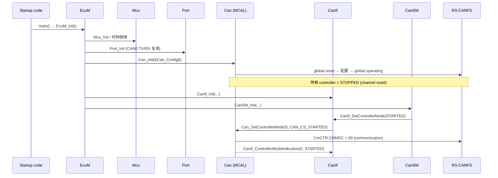
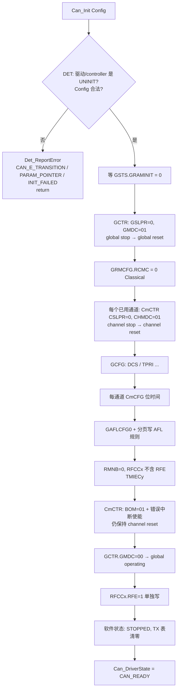

# Can_Init 实现：从 ROM 配置到 RS-CANFD 寄存器

> Prerequisite: [06 CAN Controller 初始化序列](06-can-controller-init.md)、[07 HOH / HRH / HTH](07-hoh-hrh-hth.md)、[08 CAN Configuration](08-can-configuration.md)
> Next: [10 Can_Write 实现](10-can-write-implementation.md)
> 对应规范: AUTOSAR SWS CAN Driver **R22-11**（`Can_Init` p.62–63；初始化要求 p.35、p.38–39、p.43–44；DET p.52–53）；RH850/P1M-E User's Manual: Hardware R01UH0585EJ0120 Rev.1.20（下称 HW-E；Section 17 RS-CANFD，p.788–1123）
> 对应源码: openAUTOSAR `include/Can.h:313`（只有声明）、`system/EcuM/src/EcuM_Callout_Stubs.c:308`（调用点）；本项目 `examples/rh850_mcal_reference/platform/Rh850_Mmio.h`（MMIO shim）、`examples/rh850_mcal_reference/mcal/can/Can_BitTiming.c`（FD 位时间编码）；本章教学代码完整版见 [14 从零写 Can Driver](14-can-driver-from-scratch.md)

---

## 1. 本章目标

读完本章，你应该能够：

1. 说清楚 `Can_Init` **谁调用、何时调用、调用一次**，以及它为什么是唯一能写 RS-CANFD "全局寄存器"的 API。
2. 把 SWS 中关于 `Can_Init` 的每条要求（`SWS_Can_00250/00245/00246/00259/00053/00174/00408`）落到具体代码行。
3. 写出一个**教学级** `Can_Init`：DET 检查 → 保存 config pointer → global reset → channel reset → GCFG/CmCFG → 接收规则 → RX FIFO → BOM/中断使能 → global operating → RFE，并能说明每一步对应 HW-E 的哪一页、为什么必须在这个模式下写。
4. 明白 `Can_Init` 结束时硬件处于什么状态（global operating + channel reset），以及它与 `Can_SetControllerMode(CAN_CS_STARTED)` 的分工。
5. 知道哪些东西**不属于** `Can_Init`：引脚（Port）、时钟（Mcu）、EIC 中断优先级（OS）。

> 本章所有 C 代码都是 **[Educational Implementation]**：它们按 SWS 和 HW-E 写成、在主机上用 mock 寄存器测试过（见第 14 章），但**不是**量产 MCAL。真实项目中 `Can_Init` 由 Renesas MCAL 提供，配置由工具生成。

---

## 2. 为什么需要这个模块（为什么需要一个专门的 Can_Init）

RS-CANFD 是"一个单元、三个通道"的外设（HW-E p.788）。它的寄存器分两类：

| 类别 | 例子 | 影响范围 | 何时可写 |
|---|---|---|---|
| **Global** | GCFG（时钟源 DCS、发送优先级 TPRI）、GAFLCFG0 + 接收规则表、RMNB、RFCCx 的大部分位、GRMCFG | **所有通道** | 只能在 **global reset** 模式（HW-E p.802、p.817、p.831、p.838、p.845） |
| **Channel** | CmCFG（位时间）、CmCTR（BOM、错误中断使能） | 单个通道 | 只能在 **channel reset**（CmCFG 也可在 halt）模式（HW-E p.804、p.807–808） |

这直接决定了 AUTOSAR 的分工。SWS p.35 的 Implementation hint 写得很直白：**"Hardware register settings that have impact on all CAN controllers inside the HW Unit can only be set in the function Can_Init."** 并且 EcuM "shall call Can_Init at most once during runtime"。

换句话说：

- 如果你在运行中想改某条接收规则（比如加一个诊断 ID），**必须把整个单元打回 global reset**，三个通道全部停止通信——这在量产 ECU 上几乎不可接受。所以接收规则、FIFO 深度这类东西全部是**静态配置**，在 `Can_Init` 里一次性写完。
- 单个通道的事（启动、停止、位时间）才交给 `Can_SetControllerMode` / `Can_SetBaudrate`，它们只碰 channel 寄存器（`SWS_Can_00255`，p.44）。

这就是"为什么 `Can_Init` 必须存在，并且它的代码比其他 API 长得多"。

---

## 3. 在系统中的位置



逐个 transition 解释：

1. **Startup → EcuM_Init**：C runtime 初始化完成（栈、RAM/ECC、`.data/.bss`），见 [RH850 启动过程](../01-rh850/04-startup-process.md)。此时中断仍关闭。
2. **EcuM → Mcu**：CAN 的 fCAN 来自 CLK_LSB（clkc，40 MHz）或 MainOSC（clk_xincan，16 MHz），由 GCFG.DCS 选择（HW-E p.791、p.817）。`SWS_Can_00240`（p.22）要求 Mcu 先于 Can 初始化。P1M-E 没有软件可编程 PLL 寄存器，所以这里更多是"时钟已经稳定"的前提，而不是 Can 去配时钟。
3. **EcuM → Port**：CAN TX/RX 引脚复用由 PORT 驱动完成（`SWS_Can_00239`，p.22；`SWS_Can_00407` 规则：影响多个模块的 I/O 寄存器归 PORT 初始化，p.43）。见 [04 CAN 引脚与收发器](04-can-pin-transceiver.md)。
4. **EcuM → Can_Init**：本章主题。同步、不可重入、只调用一次。完成后驱动状态 `CAN_READY`，所有 controller 为 `STOPPED`（`SWS_Can_00246/00259`）。
5. **CanIf_Init / CanSM_Init**：上层初始化。注意顺序：Can 必须先于 CanIf，因为 CanIf 之后会立即调用 Can 的 API。
6. **CanSM → CanIf → Can_SetControllerMode(STARTED)**：真正让节点上总线的是这一步，而不是 `Can_Init`。SWS p.35："Each CAN controller must then be started separately by calling the function Can_SetControllerMode(CAN_CS_STARTED)."
7. **Can → CanIf_ControllerModeIndication**：状态切换完成后的回调。CanIf/CanSM 靠它推进自己的状态机。

> openAUTOSAR 中这一顺序可在 `system/EcuM/src/EcuM_Callout_Stubs.c:303-322` 看到：先 `Can_Init(ConfigPtr->CanConfig)`（:308），再 `CanIf_Init`（:313），再 `CanSM_Init`（:322）。但 openAUTOSAR **没有 Can driver 实现**，`Can_Init` 只是声明在 `include/Can.h:313`，链接不会通过（见 [研究笔记 03](../reference/research/03-openautosar-trace.md)）。

---

## 4. AUTOSAR 如何定义

### 4.1 API 签名

[AUTOSAR API] `SWS_Can_00223`（R22-11 p.62–63）

```c
void Can_Init(const Can_ConfigType* Config);
/* Service ID 0x00, Synchronous, Non Reentrant, Available via Can.h */
```

| 维度 | 内容 |
|---|---|
| 谁调用 | EcuM（启动阶段，SWS p.43 §7.4） |
| 何时调用 | 在其他任何 Can API 之前；运行期最多一次（p.35 hint） |
| 输入 | `Config`：指向 ROM 中某个配置集（`SWS_Can_00291`，p.44） |
| 输出 | 无返回值；成功与否只能由 DET 或后续行为体现 |
| Sync/Async | 同步：返回时硬件配置已完成 |
| 回调 | 无（`Can_Init` 不调 CanIf） |
| 中断/MainFunction | 都不涉及；此时通常全局中断仍关闭 |

### 4.2 行为要求（逐条翻译成"实现要做什么"）

| SWS ID（页） | 要求 | 实现含义 |
|---|---|---|
| `SWS_Can_00250`（p.43） | 初始化：静态变量和标志、整个 HW unit 的公共设置、每个 controller 的设置 | 三件事都要做：软件状态清零、global 寄存器、channel 寄存器 |
| `SWS_Can_00245`（p.35） | 按配置初始化所有 CAN controller | 遍历 `Config->Controllers[]` |
| `SWS_Can_00246`（p.35） | 初始化完所有 controller **之后**才把模块状态改为 `CAN_READY` | `Can_DriverState = CAN_READY` 必须放在函数最后 |
| `SWS_Can_00259`（p.38） | 所有 controller 进入 `STOPPED` | 硬件停在 channel reset，软件状态 `CAN_CS_STOPPED` |
| `SWS_Can_00053`（p.43） | 不得修改**未使用**的 controller 的寄存器 | 只对 `Config` 里列出的 `HwChannel` 做 stop→reset |
| `SWS_Can_00407`（p.43） | 多模块共用的 I/O 寄存器由 PORT 初始化，非 I/O 的由 MCU 初始化 | Can_Init 不碰引脚、不碰时钟控制器 |
| `SWS_Can_00056` / `00021` / `00291`（p.44） | post-build 配置通过 `Config` 指针选择；配置集是 ROM 中的实现相关结构 | 保存 `Config` 指针供后续 API 使用 |
| `SWS_Can_00174`（p.63） | DET 开启时：驱动不在 `CAN_UNINIT` → `CAN_E_TRANSITION` | 防止二次初始化 |
| `SWS_Can_00408`（p.63） | DET 开启时：controller 不在 `UNINIT` → `CAN_E_TRANSITION` | 同上，按 controller 检查 |
| `SWS_Can_00091`（p.53） | DET 报告后函数立即返回 | `CAN_DET(...); return;` |

### 4.3 规范**没有**规定的东西（必须由实现决定）

[Real Project Consideration]

1. **`Config == NULL` 怎么办？** R22-11 的 `Can_Init` 只列出了 `CAN_E_TRANSITION`。`CAN_E_PARAM_POINTER (0x01)` 和 `CAN_E_INIT_FAILED (0x09, "Invalid configuration set selection")` 在 `SWS_Can_91019`（p.52–53）里存在，但没有绑定到 `Can_Init` 的具体条件。本教程选择：NULL → `CAN_E_PARAM_POINTER`；配置自检失败 → `CAN_E_INIT_FAILED`。**这是教学实现的选择**，真实 MCAL 的行为要看供应商手册。
2. **硬件等待超时怎么办？** GRAMINIT、模式切换都需要等待。`Can_Init` 没有返回值，SWS 也没有为它定义 runtime error。本教程用有界循环 + `CAN_E_INIT_FAILED`，并让驱动保持 `CAN_UNINIT`，使后续 API 被 DET 拦下。真实项目可能还会上报 DEM 或进入 ECU 安全状态 → **需在真实项目确认**。
3. **Can_ConfigType 的内容**：`SWS_Can_00413`（p.57）只说它是"implementation specific"。下面第 5 节给出我们的教学结构。

---

## 5. 核心数据结构

### 5.1 配置（ROM，const）

[Educational Implementation] 完整定义见第 14 章 `Can.h`。

```c
typedef enum { CAN_PROC_INTERRUPT, CAN_PROC_POLLING } Can_ProcessingType;
typedef enum { CAN_HOH_RECEIVE, CAN_HOH_TRANSMIT } Can_HohKindType;

typedef struct {                  /* 一个 CanController */
    uint8              HwChannel;        /* RS-CANFD 通道 m (0..2) */
    uint8              CanIfControllerId;/* 回调 CanIf 时使用的抽象 ID */
    uint32             ChannelCfg;       /* 预先算好的 RSCANnCmCFG 值 */
    uint8              RxFifo;           /* 本 controller 使用的 RX FIFO x */
    uint32             RxFifoCfg;        /* RFCCx 值（不含 RFE/RFIE） */
    uint8              RuleFirst;        /* 在 Rules[] 中的起始下标 */
    uint8              RuleCount;        /* → GAFLCFG0.RNCm */
    Can_ProcessingType TxProcessing;     /* ← CanTxProcessing   (ECUC_Can_00318) */
    Can_ProcessingType RxProcessing;     /* ← CanRxProcessing   (ECUC_Can_00317) */
    Can_ProcessingType BusoffProcessing; /* ← CanBusoffProcessing(ECUC_Can_00314) */
} Can_ControllerConfigType;

typedef struct {                  /* 一个 CanHardwareObject，数组下标 = HOH id */
    Can_HohKindType Kind;                /* ← CanObjectType */
    uint8           ControllerIdx;       /* ← CanControllerRef */
    uint8           TxBuffer;            /* 仅 HTH：全局 TX buffer 号 p */
} Can_HohConfigType;

typedef struct {                  /* 一条 AFL 规则 = HRH 的一个 CanHwFilter */
    uint32           GaflId;             /* RSCANnGAFLIDj 原始值 */
    uint32           GaflMask;           /* RSCANnGAFLMj 原始值，1 = 比较 */
    Can_HwHandleType Hrh;                /* 写进 12 位 label，接收时回读 */
} Can_RxRuleConfigType;

typedef struct Can_ConfigType_s {
    const Can_ControllerConfigType *Controllers;
    uint8                           ControllerCount;
    const Can_HohConfigType        *Hohs;
    Can_HwHandleType                HohCount;
    const Can_RxRuleConfigType     *Rules;   /* 按 HwChannel 排序、连续 */
    uint8                           RuleCount;
    uint32                          GlobalCfg; /* RSCANnGCFG 值 */
} Can_ConfigType;
```

设计要点（每一项都对应一个硬件或规范约束）：

| 字段 | 为什么这样设计 | 依据 |
|---|---|---|
| `ChannelCfg` 存**寄存器原始值** | 位时间的计算和校验在生成器（或 `Can_BitTiming.c` 这类工具函数）里离线完成，运行时只写寄存器，避免启动时做除法/查表 | HW-E p.803–804；本项目 `Can_BitTiming.c` 演示了 FD 模式 NCFG/DCFG 的离线编码 |
| `HwChannel` 与数组下标分离 | AUTOSAR 的 controller ID 从 0 连续编号，但硬件可能只用 CAN2。`SWS_Can_00053` 要求不碰未用通道，所以必须知道"真正的 m" | p.43 |
| `CanIfControllerId` | `Can_HwType.ControllerId` 和 `CanIf_ControllerBusOff` 都要"CanIf 抽象 ControllerId"（`SWS_CAN_00496` p.59、`SWS_Can_00020` p.42） | 回调参数 |
| `Rules[]` 按通道连续 | AFL 规则"必须按通道连续存放，不能跨通道共享"；GAFLCFG0 只给每通道一个数量 | HW-E p.1072、p.831 |
| `Hrh` 存进 label | 接收时 RFPTRx.RFPTR[11:0] 会回带这条规则的 12 位 label（HW-E p.835、p.850），于是 ISR 不用查表就知道 HRH | 教学设计选择（真实 MCAL 如何映射需确认） |
| HOH 数组下标 = HOH id | `CanObjectId` 要求从 0 开始无空洞（ECUC_Can_00326，SWS p.125） | 让 `Can_Write(Hth)` 直接索引 |

示例配置（[Educational Implementation]，第 14 章 `Can_PBcfg.c`）：CAN0、fCAN 40 MHz、500 kbit/s、`CmCFG = 0x023E0003`（divider 4、TSEG1 15、TSEG2 4、SJW 3、采样点 80%；位时间推导见 [03 位时间](03-can-clock-bit-timing.md)），两条标准帧精确匹配规则（0x7E0 → HRH0、0x7DF → HRH1），两个 HTH（TX buffer 0、1）。

### 5.2 运行时状态（RAM）

```c
typedef enum { CAN_DRV_UNINIT, CAN_DRV_READY } Can_DriverStateType;

static Can_DriverStateType      Can_DriverState = CAN_DRV_UNINIT;   /* SWS_Can_00103 */
static const Can_ConfigType    *Can_CfgPtr = NULL_PTR;              /* 保存的 Config */
static Can_ControllerStateType  Can_CtrlState[CAN_MAX_HW_CHANNELS]; /* 软件视角 */
static Can_ControllerStateType  Can_CtrlPending[CAN_MAX_HW_CHANNELS];/* 未完成的模式请求 */
static uint8                    Can_IrqDisableCnt[CAN_MAX_HW_CHANNELS];
static boolean                  Can_TxBusy[CAN_MAX_TX_BUFFERS];     /* 第 10 章 */
static PduIdType                Can_TxPduId[CAN_MAX_TX_BUFFERS];    /* 第 10 章 */
```

两个值得强调的点：

- **`Can_CfgPtr` 是整个驱动的"根"**。之后每个 API（`Can_Write`、ISR、MainFunction）都通过它找到 controller/HOH/规则。真实 MCAL 中你在调试器里第一件事就是看这个指针是否指向正确的配置集（第 15 章）。
- **SWS p.36 说 "the Can module does not memorize the state changes"**，但同时 `Can_GetControllerMode`（`SWS_Can_91014`）要返回状态、`Can_SetControllerMode` 要检测非法转换。实际实现几乎都会保存一份软件状态 `Can_CtrlState[]`；关键是它必须与硬件 CmSTS 一致，bus-off 时要同步更新（第 13 章）。

---

## 6. 初始化流程

### 6.1 流程图



### 6.2 每一步对应的硬件约束

[RH850 Hardware] 下表是本章的核心。同一序列从"手册流程图"角度的讲解见 [06 章 §6](06-can-controller-init.md)；这里侧重"代码里这一步写什么值、漏了会怎样"。左列是步骤，右边三列回答"写什么、为什么必须在这个时机、手册哪页"。顺序基于 HW-E Figure 17.16（p.1090–1091）和研究笔记 04 §8.7 的整理；步骤 13 的位置是根据 p.845 的写入时机限制补充的，原图没有画出。

| # | 操作 | 必须满足的模式 / 原因 | HW-E |
|---|---|---|---|
| 1 | 轮询 `GSTS.GRAMINIT == 0` | CAN RAM 初始化未完成前，规则表/buffer 的值未定义 | p.821、p.1090、p.1123 |
| 2 | `GCTR = 0x00000001`（GSLPR=0, GMDC=01） | 复位后 GCTR=0x5，即 global stop；必须先进 global reset 才能写全局配置 | p.819、p.1062 |
| 2' | 等 `GSTS.GSLPSTS=0 && GRSTSTS=1` | 模式写入不是同步完成，必须读回确认 | p.1122 |
| 3 | `GRMCFG = 0`（RCMC=0，Classical） | 只能在 global reset 改，且必须先于其他 CAN 配置；决定了后面所有偏移 | p.802 |
| 4 | 已用通道 `CmCTR = 0x00000001`（CSLPR=0, CHMDC=01） | channel stop → channel reset；CmCFG/BOM/中断使能只能在 channel reset 写 | p.805–809 |
| 4' | 等 `CmSTS[2:0] == 001b` | 读回确认 | p.810、p.1122 |
| 5 | `GCFG` | global reset 中写；DCS 选 fCAN | p.816–818 |
| 6 | `CmCFG` | channel reset（或 halt）中写，首次必须在 reset | p.804 |
| 7 | `GAFLCFG0`、`GAFLECTR.AFLDAE=1`+页号、`GAFLIDj/Mj/P0_j/P1_j`、`AFLDAE=0` | 只能 global reset；每页 16 条 | p.830–837、p.1096 |
| 8 | `RMNB=0`；`RFCCx`（RFE=0，可含 RFIE）；`TMIECy` | RFCC 除 RFE/RFIE 外只能在 global reset 写；RFIE 只能在 RFE=0 时改 | p.838、p.845、p.888 |
| 10 | `CmCTR`：BOM、BOEIE 等，CHMDC 保持 01 | BOM 和各 `*IE` 只能在 channel reset 中改 | p.807–808 |
| 12 | `GCTR.GMDC = 00` → global operating；等 `GRSTSTS=0` | 退出 global reset；通道仍在 channel reset | p.1064 |
| 13 | `RFCCx.RFE = 1`（**单独一次写**） | RFE 只能在 global operating/test 中改，且必须"在其他位设置完成后用另一条指令写" | p.845 |

两个"为什么"值得单独讲：

**为什么步骤 12 进入 global operating，而通道却停在 reset？** 因为 AUTOSAR 要求 `Can_Init` 之后 controller 是 `STOPPED`（不参与总线、不发 ACK/错误帧，SWS p.36），而 channel reset 正好满足"不参与总线"。同时 RX FIFO 必须在 global operating 下才能使能（步骤 13）。于是 `Can_Init` 的终态就是 **global operating + channel reset + RFE=1**。之后 `Can_SetControllerMode(STARTED)` 只需要改一个通道的 CHMDC，不影响其他通道。

**为什么 BOM 在 `Can_Init` 里设？** BOM 只能在 channel reset 中修改（p.808），而且它体现的是 AUTOSAR 的一条硬性要求：`SWS_Can_00274`（p.43）"shall disable or suppress automatic bus-off recovery"。我们选 `BOM=01b`（进入 bus-off 时自动转 halt，p.807），详细理由见 [第 13 章](13-can-error-busoff.md)。

### 6.3 INTC 不在 Can_Init 里

[Real Project Consideration] 你可能会问：中断控制器 EIC183–193 的优先级、向量方式、EIMK 在哪里设？

- SWS p.33 的实现提示：Can 驱动**不负责**设置中断向量和优先级；`SWS_Can_00033` 只要求 ISR 由 Can 模块实现。
- 在 AUTOSAR OS 系统里，Category 2 ISR 的优先级、向量表、EIC 使能由 **OS 配置/OS port 生成**（研究笔记 04 §9；HW-E p.267–268、p.281）。
- `Can_Init` 负责的是**外设内部**的中断使能位（RFCCx.RFIE、TMIECy、CmCTR.BOEIE、GCTR.DEIE），这些是"中断源"开关；EIC 是"中断通道"开关。两者都打开中断才会到 CPU。

完整的 ISR 链路见 [05 CAN 中断](05-can-interrupt.md) 和 [12 中断实现](12-can-interrupt-implementation.md)。

---

## 7. Runtime Flow：Can_Init 之后的第一件事

`Can_Init` 只把 controller 带到 `STOPPED`。让节点真正上总线是 `Can_SetControllerMode(CAN_CS_STARTED)`。AUTOSAR 状态与 RS-CANFD 模式的映射（STARTED = channel communication，STOPPED = channel reset，SLEEP = 逻辑睡眠）以及各个转换的设计理由，已经在 [06 章 §7](06-can-controller-init.md) 详细讨论，这里不再重复；本节只给出**与第 14 章教学驱动一致的实现代码**，并强调"异步 API"在代码里的样子。

### 7.1 需要记住的 SWS 要点

[AUTOSAR API] `SWS_Can_00230`（p.66–67）：`Std_ReturnType Can_SetControllerMode(uint8 Controller, Can_ControllerStateType Transition)`，**Asynchronous**，Non Reentrant；`E_OK` = request accepted。

- STARTED：参与总线（`00261`）、有限等待（`00262`）、用 Init/SetBaudrate 的配置重新初始化（`00384`）。
- STOPPED：停止参与总线（`00263`）、有限等待（`00264`）、取消挂起报文（`00282`）。
- SLEEP：无硬件睡眠时为逻辑睡眠，硬件保持 STOPPED（`00258/00404/00290`）。
- 超时：`GetCounterValue`（`00398`）；未完成则由 `Can_MainFunction_Mode` 继续轮询并通知（`00370/00372/00373`，p.39–40）。
- 非法转换：`CAN_E_TRANSITION` + `E_NOT_OK`（`00200`）；生产代码中非法转换行为未定义（p.37）。

### 7.2 "切换完成"的判据

本教学实现以 CmSTS[2:0] 为判据：STARTED 读到 000b、STOPPED 读到 001b。**COMSTS**（CmSTS bit7）在进入 communication 后要检测到 11 个连续隐性位才置 1（HW-E p.1068），本实现把它留作调试观察项（第 15 章）。真实 MCAL 采用哪个判据需确认。

### 7.3 代码

[Educational Implementation]

```c
static boolean Can_ModeReached(uint8 ctrlIdx, Can_ControllerStateType target)
{
    uint32 sts = Can_Rd32(RSCAN_CmSTS(Can_Ctrl(ctrlIdx)->HwChannel)) & STS_MODE_MASK;
    return (target == CAN_CS_STARTED) ? (boolean)(sts == 0u)
                                      : (boolean)(sts == STS_CRSTSTS);
}

static void Can_FinishTransition(uint8 ctrlIdx, Can_ControllerStateType target)
{
    Can_CtrlState[ctrlIdx]   = target;
    Can_CtrlPending[ctrlIdx] = CAN_CS_UNINIT;          /* 无挂起请求 */
    CanIf_ControllerModeIndication(Can_Ctrl(ctrlIdx)->CanIfControllerId, target);
}

Std_ReturnType Can_SetControllerMode(uint8 Controller, Can_ControllerStateType Transition)
{
    Can_ControllerStateType cur;
    uint8 m, n;
#if (CAN_DEV_ERROR_DETECT == STD_ON)
    if (Can_DriverState != CAN_DRV_READY) {                       /* 00198 */
        CAN_DET(CAN_SID_SETCONTROLLERMODE, CAN_E_UNINIT); return E_NOT_OK;
    }
    if (Controller >= Can_CfgPtr->ControllerCount) {              /* 00199 */
        CAN_DET(CAN_SID_SETCONTROLLERMODE, CAN_E_PARAM_CONTROLLER); return E_NOT_OK;
    }
#endif
    cur = Can_CtrlState[Controller];
    m   = Can_Ctrl(Controller)->HwChannel;
    switch (Transition) {
    case CAN_CS_STARTED:
        if (cur != CAN_CS_STOPPED) {                              /* 00409 */
            CAN_DET(CAN_SID_SETCONTROLLERMODE, CAN_E_TRANSITION); return E_NOT_OK;
        }
        Can_Wr32(RSCAN_CmCFG(m), Can_Ctrl(Controller)->ChannelCfg);   /* 00384 */
        Can_Wr32(RSCAN_CmCTR(m),
                 (Can_Rd32(RSCAN_CmCTR(m)) & ~CTR_CHMDC_MASK) | CTR_CHMDC_COMM);
        break;
    case CAN_CS_STOPPED:
        if (cur == CAN_CS_SLEEP) {           /* 逻辑睡眠：硬件本来就在 reset */
            Can_FinishTransition(Controller, CAN_CS_STOPPED);         /* 00267 */
            return E_OK;
        }
        if ((cur != CAN_CS_STARTED) && (cur != CAN_CS_STOPPED)) {
            CAN_DET(CAN_SID_SETCONTROLLERMODE, CAN_E_TRANSITION); return E_NOT_OK;
        }
        Can_EnterChannelReset(Controller);   /* 00263；reset 清 TMC/TMSTS = 00282 */
        break;
    case CAN_CS_SLEEP:
        if ((cur != CAN_CS_STOPPED) && (cur != CAN_CS_SLEEP)) {       /* 00411 */
            CAN_DET(CAN_SID_SETCONTROLLERMODE, CAN_E_TRANSITION); return E_NOT_OK;
        }
        Can_FinishTransition(Controller, CAN_CS_SLEEP);           /* 00258/00404 */
        return E_OK;
    default:
        CAN_DET(CAN_SID_SETCONTROLLERMODE, CAN_E_TRANSITION); return E_NOT_OK;
    }
    /* 有限等待。真实驱动用 GetCounterValue + CanTimeoutDuration (00398) */
    Can_CtrlPending[Controller] = Transition;
    for (n = 0u; n < 100u; n++) {
        if (Can_ModeReached(Controller, Transition) == TRUE) {
            Can_FinishTransition(Controller, Transition);
            break;
        }
    }
    return E_OK;   /* "request accepted"；未完成则由 Can_MainFunction_Mode 收尾 */
}

void Can_MainFunction_Mode(void)                                  /* 00369/00370 */
{
    uint8 i;
    if (Can_DriverState != CAN_DRV_READY) { return; }
    for (i = 0u; i < Can_CfgPtr->ControllerCount; i++) {
        Can_ControllerStateType t = Can_CtrlPending[i];
        if ((t != CAN_CS_UNINIT) && (Can_ModeReached(i, t) == TRUE)) {
            Can_FinishTransition(i, t);
        }
    }
}
```

逐段说明：

- **`E_OK` 不等于"已经 STARTED"**。它只表示请求被接受。CanSM 必须等 `CanIf_ControllerModeIndication`；SWS p.37 明确"monitoring whether the requested state is achieved is part of an upper layer module"。
- **有界等待的时间量级**：channel reset → communication 最长 4 个 bit time（HW-E Table 17.178，p.1066），500 kbit/s 时约 8 µs。所以多数情况在 `Can_SetControllerMode` 内部就完成并直接回调；只有总线异常（例如 halt 时总线锁定显性，p.1065 Note 2）才会落到 `Can_MainFunction_Mode`。
- **STOPPED 直接进 channel reset 的代价**：HW-E Table 17.179（p.1067）说明，在发送/接收中途写 CHMDC=01 会**在帧完成前**终止。如果想等当前帧结束，手册 Note 1 建议先进 halt、确认后再进 reset。教学实现为简单起见直接 reset；真实 MCAL 用哪种需确认。
- **在 `Can_MainFunction_Mode` 里回调**：回调上下文是 BSW 任务。按 SWS p.51，回调实现必须按"可能在 ISR 中调用"来写，所以 CanIf 侧不应假设上下文。

---

## 8. RH850 Hardware Mapping

| AUTOSAR 概念 | `Can_Init` 中的动作 | RS-CANFD 寄存器 | HW-E 页 |
|---|---|---|---|
| CAN HW Unit 公共设置（00250） | 时钟源、发送优先级 | GCFG.DCS[4]、TPRI[0] | p.816–817 |
| CanController（00245） | 位时间 | CmCFG（Classical）；FD 模式为 CmNCFG/CmDCFG | p.803–804；p.921、p.935 |
| CanControllerBaudrateConfig | 预编码 CmCFG | BRP[9:0]、TSEG1[19:16]、TSEG2[22:20]、SJW[25:24] | p.803–804 |
| CanHardwareObject (RECEIVE) + CanHwFilter | 接收规则 | GAFLCFG0、GAFLECTR、GAFLIDj/Mj/P0_j/P1_j | p.830–837 |
| CanHwObjectCount（HRH FIFO 深度） | FIFO 深度 | RFCCx.RFDC[10:8] | p.844–845 |
| CanHardwareObject (TRANSMIT) | TX 完成中断 | TMIECy | p.888 |
| CanRxProcessing = INTERRUPT | RX 中断源 | RFCCx.RFIE | p.845 |
| CanBusoffProcessing = INTERRUPT | bus-off 中断源 | CmCTR.BOEIE[11] | p.805、p.808 |
| SWS_Can_00274 | 禁止自动恢复 | CmCTR.BOM[22:21] = 01b | p.807 |
| controller = STOPPED（00259） | 停在 channel reset | CmCTR.CHMDC=01 / CmSTS[2:0]=001b | p.805、p.810 |
| 不碰未用 controller（00053） | 未用通道保持 channel stop | CmCTR.CSLPR=1（复位值 0x5） | p.805 |

---

## 9. openAUTOSAR 实现

openAUTOSAR（Arctic Core 2.18.0，R3.1.5 风格）**没有 Can driver 的 .c 文件**。能看到的只有：

| 位置 | 内容 | 与 R22-11 的差异 |
|---|---|---|
| `include/Can.h:313` | `void Can_Init( const Can_ConfigType *Config );` | 签名一致 |
| `include/Can.h:320` | `Can_InitController(uint8 controller, const Can_ControllerConfigType *config)` | R3.x 的 API；R4.x 已无此函数，改由 `Can_SetBaudrate` 等承担 |
| `include/Can.h:321` | `Can_ReturnType Can_SetControllerMode(uint8, Can_StateTransitionType)` | R22-11 是 `Std_ReturnType` + `Can_ControllerStateType`；`Can_StateTransitionType` 在 4.3.0 被移除（SWS p.3） |
| `include/Can.h:178-185` | `Can_CallbackType` 函数指针表（RxIndication/TxConfirmation/ControllerBusOff…） | Arctic 特有；R4.x 中 Can 直接调用 `CanIf_*`（`SWS_Can_00234` p.88） |
| `system/EcuM/src/EcuM_Callout_Stubs.c:308` | `Can_Init(ConfigPtr->CanConfig);` | 调用顺序可作参考 |

结论：openAUTOSAR 只能用来理解"Init 在启动序列中的位置"，不能用来学 Can_Init 的实现。这一跳正是本教程要补上的。

---

## 10. 当前教学项目实现

| 文件 | 和本章的关系 |
|---|---|
| `examples/rh850_mcal_reference/platform/Rh850_Mmio.h` / `.c` | 注入式 MMIO 接口（read8/read32/write8/write16/write32）。本章代码的 `Can_Rd32/Can_Wr32/Can_Rd8/Can_Wr8` 就是通过它访问寄存器，所以可以在 PC 上用 mock 替换（第 14 章） |
| `examples/rh850_mcal_reference/mcal/can/Can_BitTiming.c` | 计算 **CAN FD 接口模式**下的 NCFG/DCFG（不写寄存器）。本章示例用 **Classical 接口模式**，寄存器是 CmCFG，字段宽度不同（TSEG1 最大 16 Tq），二者不能混用（HW-E p.803–804 vs p.921） |

当前仓库**没有** Can 控制器驱动的 .c 文件；本章和第 14 章的代码是对它的补充，只存在于文档中。

---

## 11. Code Walkthrough：完整的 Can_Init

[Educational Implementation] 下面是第 14 章 `Can.c` 中的 `Can_Init` 和两个辅助函数。MMIO 辅助函数定义为：

```c
static const Rh850_Mmio *Can_Bus = &Rh850_NativeMmio;   /* 主机测试时替换为 mock */

static uint32 Can_Rd32(uint32 off)
{ return Can_Bus->read32(Can_Bus->context, (uintptr_t)(RSCAN0_BASE + off)); }
static void   Can_Wr32(uint32 off, uint32 v)
{ Can_Bus->write32(Can_Bus->context, (uintptr_t)(RSCAN0_BASE + off), v); }

static boolean Can_WaitReg(uint32 off, uint32 mask, uint32 expect)   /* 有界等待 */
{
    uint32 n;
    for (n = 0u; n < CAN_HW_WAIT_LOOPS; n++) {
        if ((Can_Rd32(off) & mask) == expect) { return TRUE; }
    }
    return FALSE;
}
```

### 11.1 配置自检

```c
static boolean Can_ConfigIsConsistent(const Can_ConfigType *cfg)  /* [Educational Implementation] */
{
    uint8 i, total = 0u, lastCh = 0u;
    if ((cfg->ControllerCount == 0u) || (cfg->ControllerCount > CAN_MAX_HW_CHANNELS)) {
        return FALSE;
    }
    for (i = 0u; i < cfg->ControllerCount; i++) {
        const Can_ControllerConfigType *c = &cfg->Controllers[i];
        if ((c->HwChannel >= CAN_MAX_HW_CHANNELS) || (c->RxFifo > 7u)) { return FALSE; }
        if ((i > 0u) && (c->HwChannel <= lastCh)) { return FALSE; } /* 按通道排序 */
        if (c->RuleFirst != total) { return FALSE; }               /* AFL 连续 */
        total = (uint8)(total + c->RuleCount);
        lastCh = c->HwChannel;
    }
    if ((total != cfg->RuleCount) || (total > 192u)) { return FALSE; } /* HW-E p.831 */
    for (i = 0u; i < cfg->HohCount; i++) {
        const Can_HohConfigType *h = &cfg->Hohs[i];
        if (h->ControllerIdx >= cfg->ControllerCount) { return FALSE; }
        if ((h->Kind == CAN_HOH_TRANSMIT) &&
            ((h->TxBuffer / 16u) != cfg->Controllers[h->ControllerIdx].HwChannel)) {
            return FALSE;                                   /* p = 16m..16m+15 */
        }
    }
    return TRUE;
}
```

这类检查在真实 MCAL 里通常由**配置工具**在生成时完成，运行时不重复做。教学实现放在运行时，是为了让你看到"配置里哪些关系必须成立"。最后一条尤其重要：通道 m 只能用 TX buffer `16m..16m+15`（HW-E p.800）。把 CAN1 的 HTH 指向 p=0 是"能编译、能运行、但发不出去"的经典错误。

### 11.2 写接收规则

```c
static void Can_WriteRxRules(const Can_ConfigType *cfg)  /* [Educational Implementation] */
{
    uint32 rnc = 0u;
    uint8  i, r;
    for (i = 0u; i < cfg->ControllerCount; i++) {            /* GAFLCFG0, p.831 */
        const Can_ControllerConfigType *c = &cfg->Controllers[i];
        rnc |= (uint32)c->RuleCount << (24u - (8u * c->HwChannel)); /* RNC0[31:24]... */
    }
    Can_Wr32(RSCAN_GAFLCFG0, rnc);
    for (r = 0u; r < cfg->RuleCount; r++) {                 /* p.1096 */
        uint8 j = (uint8)(r % 16u);
        uint8 ctrlIdx = cfg->Hohs[cfg->Rules[r].Hrh].ControllerIdx;
        if (j == 0u) {                                       /* 换页：AFLDAE=1 + AFLPN */
            Can_Wr32(RSCAN_GAFLECTR, GAFLECTR_AFLDAE | (uint32)(r / 16u));
        }
        Can_Wr32(RSCAN_GAFLID(j), cfg->Rules[r].GaflId);
        Can_Wr32(RSCAN_GAFLM(j),  cfg->Rules[r].GaflMask);
        Can_Wr32(RSCAN_GAFLP0(j), ((uint32)cfg->Rules[r].Hrh & 0xFFFuL) << 16); /* label */
        Can_Wr32(RSCAN_GAFLP1(j), 1uL << cfg->Controllers[ctrlIdx].RxFifo);     /* → FIFO x */
    }
    Can_Wr32(RSCAN_GAFLECTR, 0u);                            /* AFLDAE = 0 */
}
```

- 规则窗口只有 16 个槽位（j=0..15），第 r 条规则在第 `r/16` 页、槽 `r%16`（HW-E p.830）。不能把第 16 条直接写到 `+0x600`——那是 RX buffer 区（`RMIDq`，HW-E p.798）。
- `GAFLP0_j`：label 写在 bit27:16；RMV=0（不进 RX buffer）；DLC 过滤阈值为 0（不检查）（HW-E p.835）。
- `GAFLP1_j`：bit x 选择 RX FIFO x（HW-E p.837）。
- **GAFLM 的 1 表示"比较"**（HW-E p.834）。标准数据帧精确匹配的 mask 是 `0xC00007FF`（IDEM=1、RTRM=1、低 11 位比较）。如果你的配置工具 GUI 里 "mask=0 表示精确匹配"，生成代码时必须取反——这是从截图工程里就出现过的疑问（研究笔记 01）。规则的语义细节见 [11 RX 实现](11-can-rx-implementation.md)。

### 11.3 Can_Init 主体

```c
void Can_Init(const Can_ConfigType *Config)  /* [Educational Implementation] */
{
    uint8 i;
#if (CAN_DEV_ERROR_DETECT == STD_ON)
    if (Can_DriverState != CAN_DRV_UNINIT) {               /* SWS_Can_00174 */
        CAN_DET(CAN_SID_INIT, CAN_E_TRANSITION);
        return;
    }
    for (i = 0u; i < CAN_MAX_HW_CHANNELS; i++) {           /* SWS_Can_00408 */
        if (Can_CtrlState[i] != CAN_CS_UNINIT) {
            CAN_DET(CAN_SID_INIT, CAN_E_TRANSITION);
            return;
        }
    }
    if (Config == NULL_PTR) {                  /* 实现选择，见 4.3 */
        CAN_DET(CAN_SID_INIT, CAN_E_PARAM_POINTER);
        return;
    }
    if (Can_ConfigIsConsistent(Config) == FALSE) {
        CAN_DET(CAN_SID_INIT, CAN_E_INIT_FAILED);
        return;
    }
#endif
    /* 1. CAN RAM 初始化完成？ */
    if (Can_WaitReg(RSCAN_GSTS, GSTS_GRAMINIT, 0u) == FALSE) {
        CAN_DET(CAN_SID_INIT, CAN_E_INIT_FAILED);
        return;
    }
    /* 2. global stop -> global reset */
    Can_Wr32(RSCAN_GCTR, GCTR_GMDC_RESET);
    if (Can_WaitReg(RSCAN_GSTS, GSTS_GSLPSTS | GSTS_GRSTSTS, GSTS_GRSTSTS) == FALSE) {
        CAN_DET(CAN_SID_INIT, CAN_E_INIT_FAILED);
        return;
    }
    /* 3. 接口模式：Classical (RCMC=0) */
    Can_Wr32(RSCAN_GRMCFG, 0u);
    /* 4. 只处理已配置的通道：stop -> reset (SWS_Can_00053) */
    for (i = 0u; i < Config->ControllerCount; i++) {
        uint8 m = Config->Controllers[i].HwChannel;
        Can_Wr32(RSCAN_CmCTR(m), CTR_CHMDC_RESET);         /* CSLPR=0, CHMDC=01 */
        if (Can_WaitReg(RSCAN_CmSTS(m), STS_MODE_MASK, STS_CRSTSTS) == FALSE) {
            CAN_DET(CAN_SID_INIT, CAN_E_INIT_FAILED);
            return;
        }
    }
    /* 5. 全局配置 */
    Can_Wr32(RSCAN_GCFG, Config->GlobalCfg);
    /* 6. 每通道位时间 */
    for (i = 0u; i < Config->ControllerCount; i++) {
        const Can_ControllerConfigType *c = &Config->Controllers[i];
        Can_Wr32(RSCAN_CmCFG(c->HwChannel), c->ChannelCfg);
    }
    /* 7. 接收规则 */
    Can_WriteRxRules(Config);
    /* 8. buffer：不用 RX buffer；RX FIFO 配置但暂不使能 */
    Can_Wr32(RSCAN_RMNB, 0u);
    for (i = 0u; i < Config->ControllerCount; i++) {
        const Can_ControllerConfigType *c = &Config->Controllers[i];
        uint32 rfcc = c->RxFifoCfg;
        uint32 tmiec = 0u;
        uint8  h;
        if (c->RxProcessing == CAN_PROC_INTERRUPT) { rfcc |= RFCC_RFIE; }
        Can_Wr32(RSCAN_RFCC(c->RxFifo), rfcc);             /* RFE = 0 */
        for (h = 0u; h < Config->HohCount; h++) {          /* TX 完成中断 */
            const Can_HohConfigType *hoh = &Config->Hohs[h];
            if ((hoh->Kind == CAN_HOH_TRANSMIT) && (hoh->ControllerIdx == i) &&
                (c->TxProcessing == CAN_PROC_INTERRUPT)) {
                tmiec |= 1uL << (hoh->TxBuffer % 32u);
            }
        }
        if (tmiec != 0u) {
            uint32 y = (uint32)c->HwChannel / 2u;          /* p 0..31 → y=0, 32..47 → y=1 */
            Can_Wr32(RSCAN_TMIEC(y), Can_Rd32(RSCAN_TMIEC(y)) | tmiec);
        }
        /* 10. BOM=01（bus-off 进入即 halt）+ 错误中断，CHMDC 仍为 reset */
        Can_Wr32(RSCAN_CmCTR(c->HwChannel), CTR_CHMDC_RESET | CTR_BOM_HALT_AT_ENTRY |
                 ((c->BusoffProcessing == CAN_PROC_INTERRUPT) ? CTR_BOEIE : 0u));
    }
    /* 12. global reset -> global operating；通道仍在 channel reset */
    Can_Wr32(RSCAN_GCTR, GCTR_GMDC_OPERATING);
    if (Can_WaitReg(RSCAN_GSTS, GSTS_GRSTSTS | GSTS_GSLPSTS, 0u) == FALSE) {
        CAN_DET(CAN_SID_INIT, CAN_E_INIT_FAILED);
        return;
    }
    /* 13. RFE=1，必须单独一次写 (p.845) */
    for (i = 0u; i < Config->ControllerCount; i++) {
        const Can_ControllerConfigType *c = &Config->Controllers[i];
        Can_Wr32(RSCAN_RFCC(c->RxFifo), Can_Rd32(RSCAN_RFCC(c->RxFifo)) | RFCC_RFE);
    }
    /* 软件状态：00250（静态变量）、00259、00246 */
    for (i = 0u; i < CAN_MAX_TX_BUFFERS; i++) { Can_TxBusy[i] = FALSE; Can_TxPduId[i] = 0u; }
    for (i = 0u; i < Config->ControllerCount; i++) {
        Can_CtrlState[i]     = CAN_CS_STOPPED;
        Can_CtrlPending[i]   = CAN_CS_UNINIT;
        Can_IrqDisableCnt[i] = 0u;
    }
    Can_CfgPtr      = Config;
    Can_DriverState = CAN_DRV_READY;                       /* 最后一步 */
}
```

逐段讲解：

1. **DET 区块被 `#if` 包住**：`CanDevErrorDetect = FALSE` 时这些检查整个消失，这是 AUTOSAR 的惯例（开发期发现集成错误，量产期省代码）。代价是：DET 关闭后传入 NULL 会直接访问空指针——**DET 是开发工具，不是运行时保护**。
2. **`Can_CfgPtr` 在最后才赋值**：这样在初始化中途失败返回时，驱动仍是 `UNINIT`、`Can_CfgPtr` 仍为 NULL，ISR 里的 `if (Can_DriverState != CAN_DRV_READY) return;` 能挡住在初始化失败后到来的伪中断（第 12 章）。
3. **步骤 4 的写值 `0x00000001`**：同时清 CSLPR（stop→reset）并保持 CHMDC=01。CSLPR "should not be modified in channel communication mode or channel halt mode"（HW-E p.809），冷启动时通道在 stop，所以安全。
4. **`TMIECy` 用读-改-写**：因为一个 TMIEC0 覆盖 CAN0 和 CAN1 两个通道（p=0..31），直接写会抹掉另一个通道的设置。这是"global 寄存器被多个 controller 共用"在代码里的体现。
5. **RFCC 写两次**：第一次（global reset）写深度/中断模式/RFIE，第二次（global operating）只置 RFE。手册明确要求"Set this bit to 1 with another instruction after the settings to all bits ... have been done"（p.845）。合并成一次写，FIFO 不会工作。
6. **没有任何 EIC 操作**：见 6.3。

---

## 12. Debug 方法

[Real Project Consideration] `Can_Init` 返回后，在调试器里按下表读回（Classical 模式、上面的示例配置）。地址 = `0xFFD2_0000 + 偏移`。

| 寄存器 | 期望（有效位） | 不对时的典型原因 |
|---|---|---|
| GRMCFG (+0x4FC) bit0 | 0 | 不在 global reset 时写入被忽略；或 MCAL 选了 FD 模式 |
| GSTS (+0x08C) [3:0] | 0000b | GRAMINIT=1：RAM 初始化未完成；GRSTSTS=1：没退出 global reset |
| C0STS (+0x008) [2:0] | 001b（STOPPED） | 101b：还在 channel stop（步骤 4 没执行或写到了错误通道） |
| C0CFG (+0x000) | 0x023E0003 | 0x00000000：在非 reset 模式写入被忽略 |
| C0CTR (+0x004) BOM[22:21] | 01b | 00b：会自动恢复，违反 `SWS_Can_00274` |
| GAFLCFG0 (+0x09C) | 0x02000000 | 规则数为 0 → **什么都收不到**（HW-E p.1072） |
| RFCC0 (+0x0B8) | 0x00001203（中断）/ 0x00001201（轮询） | RFE=0：RFE 与其他位同一次写入，或在 global reset 中写入 |
| 未用通道 C1CTR/C2CTR | 0x00000005（复位值） | 违反 `SWS_Can_00053` |
| `Can_DriverState` / `Can_CfgPtr` | READY / 指向 `Can_Config0` | Init 中途 DET 返回；在 `Det_ReportError` 设断点看 ErrorId |

第 15 章给出完整的分层调试清单。

---

## 13. 常见问题

1. **"Can_Init 之后就能发报文了吗？"** 不能。controller 是 STOPPED，必须等 CanSM 通过 CanIf 调用 `Can_SetControllerMode(STARTED)` 并收到 `CanIf_ControllerModeIndication`。SWS p.40 还提醒：controller 真正可用前提交的发送会丢失，唯一可靠的指标是收到 TxConfirmation/RxIndication。
2. **"能不能在运行时调用 Can_Init 重新配置过滤器？"** 规范要求最多调用一次（p.35）。重新配置需要 `Can_DeInit`（`SWS_Can_91002`，所有 controller 必须先不是 STARTED）→ `Can_Init`，并且会影响同一单元的所有通道。
3. **"为什么 GCFG 写进去读回是 0？"** 不在 global reset 模式。最常见原因是步骤 2 没有等 GRSTSTS=1 就开始写。
4. **"我把 FD 模式的偏移表用在 Classical 模式了"**：FD 模式下 GAFL 窗口在 +0x1000，而 Classical 模式下 +0x1000 是 TX buffer 0 的 TMID（研究笔记 04 §8.2；handoff §4）。**基址相同不等于布局相同**。
5. **"EIC 要不要在 Can_Init 里打开？"** 不要。EIC 归 OS（6.3）。但要保证：外设中断源（RFIE 等）打开时，对应的 ISR 已经安装，或者 EIC 仍然屏蔽。否则第一帧到来就进入未定义的向量。
6. **"Can_Init 失败了，系统怎么知道？"** 只能通过 DET（开发期）或后续 API 的 `CAN_E_UNINIT`。这是 `void` 返回值的代价；真实项目的处理策略需确认。

---

## 14. 实验

1. **主机实验**（无需硬件）：按第 14 章把代码拷成文件并编译测试。然后故意把 `Can_Init` 中步骤 13 合并进步骤 8（RFCC 一次写入 RFE=1），观察 mock 记录的 `mode_errors` 增加。
2. **主机实验**：把 `Can_Rules[]` 中某条规则的 mask 改为 `0x00000000`，在测试中注入一帧任意 ID 的报文，观察它被接收（通配）。思考：这在真实 ECU 中会造成什么后果？
3. **目标板实验**（如有 P1M-E 板）：在 `Can_Init` 返回处设断点，用第 12 节的表逐项读回。再把 `GCFG.DCS` 改为 1（16 MHz），保持 CmCFG 不变，用示波器测量位宽——会变为原来的 40/16 倍。
4. **思考题**：如果项目只用 CAN2，`Can_Config0.Controllers[0].HwChannel = 2`，那么 GAFLCFG0 应该是多少？TX buffer 的 p 范围是多少？`TMIECy` 用哪个 y？

---

## 15. 对未来真实项目的意义

- 真实项目中你**不会**手写 `Can_Init`，但你会在以下场合需要本章的知识：
  - **集成调试**：通信不起来时，第一步就是在 `Can_Init` 返回后读回第 12 节的寄存器。MCAL 是黑盒，寄存器不是。
  - **读生成代码**：Renesas MCAL 的 `Can_PBcfg.c`（或类似文件）里会有大量原始寄存器值。你需要能把 `0xC00007FF` 认出是"标准数据帧精确匹配"，把 `0x023E0003` 反算成 500 kbit/s。
  - **配置评审**：HOH 数、规则数、FIFO 深度、TX buffer 分配必须满足硬件约束（RAM 容量 HW-E p.1097；p=16m..16m+15）。配置工具不一定替你全查。
  - **升级 MCAL/AUTOSAR 版本**：`Can_Init` 的 DET 行为、`Can_ConfigType` 内容、`Can_SetControllerMode` 的参数类型在 4.2.2 → 4.3 → R22-11 之间有变化（SWS Change History p.3–5）。研究笔记中提到的目标工程使用 Renesas P1M MCAL（AR 4.2.2 API），其 `Can_SetControllerMode` 参数类型可能不是 `Can_ControllerStateType`——**需在真实项目确认**。
- 目标工程背景中的 RTA-CAR / RTA-OS 只能作为"可能的真实环境"参考，本章不对其内部实现做任何断言。

---

## 16. 本章总结

- `Can_Init` 是唯一能写 RS-CANFD 全局寄存器的地方，因为这些寄存器只能在 global reset 中修改、且影响所有通道。
- 它的终态是：global operating + 已用通道 channel reset + RX FIFO 已使能 + BOM=01 + 软件状态 STOPPED + `CAN_READY`。
- 规范要求（00250/00245/00246/00259/00053/00174/00408）都能落到具体代码行；规范未规定的部分（NULL config、硬件超时）必须由实现决定并写清楚。
- 启动 controller 是 `Can_SetControllerMode` 的工作，它是异步的：`E_OK` 只表示请求被接受，完成以 `CanIf_ControllerModeIndication` 为准。
- 中断通道（EIC）不归 Can_Init 管，外设中断源才归它管。

---

## 17. 下一章

controller 已经 STARTED，CanIf 要发出第一帧了。[10 Can_Write 实现](10-can-write-implementation.md) 讲 HTH 如何找到 TX buffer、如何判断"空闲"、为什么会返回 `CAN_BUSY`、`swPduHandle` 要存到哪里，以及发送完成后 `CanIf_TxConfirmation` 如何被调用。
