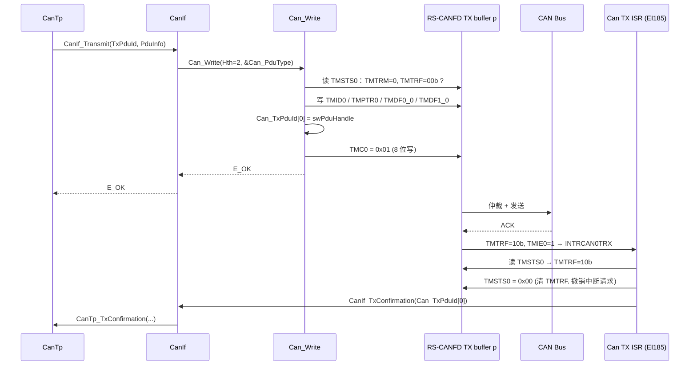

# Can_Write 实现：从 HTH 到 TX buffer，再到 CanIf_TxConfirmation

> Prerequisite: [07 HOH / HRH / HTH](07-hoh-hrh-hth.md)、[09 Can_Init 实现](09-can-init-implementation.md)
> Next: [11 RX 实现](11-can-rx-implementation.md)
> 对应规范: AUTOSAR SWS CAN Driver **R22-11**（`Can_Write` p.80–83；发送 p.44–47；重入 p.51；类型 p.57–60）；HW-E R01UH0585EJ0120 Rev.1.20（TX buffer p.878–889；发送时序 p.1107–1111；中断源 p.1058）
> 对应源码: openAUTOSAR `communication/CAN/CanIf/src/CanIf.c:424`（`CanIf_Transmit`）、`:464-481`（调用 `Can_Write` 并处理 `CAN_BUSY`）、`:743`（`CanIf_TxConfirmation`）；本项目无 Can_Write 实现，教学代码见 [14 从零写 Can Driver](14-can-driver-from-scratch.md)

---

## 1. 本章目标

1. 说清楚 `Can_Write` 的完整契约：谁调用、在什么上下文、三种返回值 `E_OK` / `CAN_BUSY` / `E_NOT_OK` 各自意味着什么、调用者收到后该做什么。
2. 把一次 `Can_Write` 拆成 RS-CANFD 的寄存器操作：TMSTSp 判空 → TMIDp → TMPTRp → TMDF0/1_p → TMCp.TMTR。
3. 理解为什么 `swPduHandle` 必须在**触发发送之前**保存，以及发送完成路径（ISR 或 `Can_MainFunction_Write`）里"先拷句柄、再清标志、再释放、最后回调"的顺序。
4. 理解 `Can_Write` 的**线程安全**要求：同一 HTH 的抢占调用必须返回 `CAN_BUSY`，不同 HTH 可以并行；exclusive area 应该包多大。
5. 知道 R22-11 的 Can 驱动**没有**发送取消 API，以及 FD 模式下哪些东西会变。

---

## 2. 为什么需要这个模块

CanIf 手里有一个 L-PDU（ID、长度、数据、PduId），它要"交给硬件发出去"。中间隔着三件 CanIf 不该知道的事：

1. **硬件对象在哪里**：HTH 2 对应的是 CAN0 的 TX buffer 0，寄存器在 `0xFFD2_1000`（Classical 模式）还是 `0xFFD2_4000`（FD 模式）？
2. **硬件格式是什么**：AUTOSAR 的 `Can_IdType` 用 bit31 表示扩展帧（`SWS_Can_00416` p.58），RS-CANFD 的 TMIDp 用 bit31 TMIDE 表示扩展帧、ID 放在 bit28:0（HW-E p.882）；DLC 在 TMPTRp 的 bit31:28（p.884）；数据按"字节 0 在低 8 位"打包进 32 位寄存器（p.886）。
3. **硬件对象现在空不空**：TMSTSp.TMTRM（还有未完成的请求）、TMTRF（上一次结果还没被读走）（p.880）。

`Can_Write` 就是这三件事的封装。CanIf 只需要说"用 HTH 2 发这个 PDU"，然后等 `CanIf_TxConfirmation(PduId)`。

---

## 3. 在系统中的位置



逐个 transition：

1. **CanTp → CanIf_Transmit**：上层（这里是 CanTp，诊断响应路径）请求发送。完整的上层路径见 [05-can-stack/07 TX 路径](../05-can-stack/07-can-tx-path.md)。
2. **CanIf → Can_Write**：CanIf 根据 TxPdu 配置找到 HTH，组装 `Can_PduType{swPduHandle, length, id, sdu}` 并调用。CanIf 会检查 controller 是否 STARTED、PDU mode 是否 ONLINE（openAUTOSAR `CanIf.c:446-462`）；**Can 驱动自己不检查 controller 状态**（SWS p.36 "The Can module does not check the actual state before it performs Can_Write"）。
3. **读 TMSTS0**：判断硬件对象是否空闲。
4. **写 TMID/TMPTR/TMDF**：格式转换并拷贝数据。`SWS_Can_00011`（p.47）：数据在 `Can_Write` 内直接拷贝，调用者只需要在函数返回前保持缓冲不变。
5. **保存 swPduHandle**：`SWS_Can_00276`（p.45）。
6. **TMC0 = 0x01**：触发发送。从这一刻起硬件可能随时完成发送并触发中断。
7. **返回 E_OK**：表示"已接受"，不表示"已发出"。
8. **硬件发送完成**：TMTRF=10b（HW-E p.1109 Figure 17.28 (3)）；若 TMIE0=1，产生 CAN0 发送中断（EI185，HW-E p.792）。
9. **ISR 清 TMTRF 并回调**：`SWS_Can_00016`（p.45）规定 `CanIf_TxConfirmation` 由 TX ISR 或 `Can_MainFunction_Write`（轮询）调用。

---

## 4. AUTOSAR 如何定义

### 4.1 签名与返回值

[AUTOSAR API] `SWS_Can_00233`（R22-11 p.80–81）

```c
Std_ReturnType Can_Write(Can_HwHandleType Hth, const Can_PduType* PduInfo);
/* Service ID 0x06, Synchronous, Reentrant (thread-safe) */
```

| 返回值 | SWS 原意（p.81） | 调用者（CanIf）该做什么 |
|---|---|---|
| `E_OK` | Write command has been accepted | 等 `CanIf_TxConfirmation` |
| `CAN_BUSY`（0x02，`SWS_Can_00039` p.59–60） | No TX hardware buffer available **or** pre-emptive call of Can_Write that can't be implemented re-entrant | **不是错误**。CanIf 把请求放进自己的 TX buffer 排队（p.51 "In case of CAN_BUSY the CanIf module queues that request"），等某个 TxConfirmation 后再发 |
| `E_NOT_OK` | development error occurred（以及 `SWS_Can_00218` 的长度错误、`00506` Trigger Transmit 失败） | 视为发送失败 |

> 版本提示：R22-11 中 `CAN_BUSY` 是 `Std_ReturnType` 的扩展值。表格里残留的 "(see Can_ReturnType)"（p.81）是旧版本痕迹；早期规范用 `Can_ReturnType`（`CAN_OK/CAN_NOT_OK/CAN_BUSY`）。openAUTOSAR 就是旧风格：`CanIf.c:470` 写的是 `Can_ReturnType rVal = Can_Write(...)`。升级/阅读旧代码时要注意这个差异。

### 4.2 行为要求

| SWS ID（页） | 要求 | 实现对应 |
|---|---|---|
| `00212`（p.81） | HTH 空闲时：置 HTH 互斥 → 转格式并拷贝到硬件 → 触发发送 → 释放互斥 → 返回 E_OK | 第 7 节代码主体 |
| `00213`（p.81） | 硬件对象正在发送别的 L-PDU：**不取消**那一帧，什么也不做，返回 `CAN_BUSY` | 判忙后直接返回 |
| `00214`（p.81） | 同一 HTH 的抢占式调用无法重入处理 → `CAN_BUSY` | 软件 busy 标志 + exclusive area |
| `00275`（p.82） | 非阻塞 | 绝不等待 TMTRM 变 0 |
| `00216/00217/00219`（p.82） | DET：未初始化 `CAN_E_UNINIT`；Hth 不是已配置的 HTH `CAN_E_PARAM_HANDLE`；PduInfo 为 NULL `CAN_E_PARAM_POINTER` | DET 区块 |
| `00218`（p.82） | 长度 >64；或 >8 但 controller 不是 FD；或 FD 但 ID 没置 FD 位 → `E_NOT_OK`（+DET `CAN_E_PARAM_DATA_LENGTH`） | 注意：这条**不受 DET 开关控制**，返回 E_NOT_OK 是无条件的 |
| `00503–00506`（p.82–83） | Trigger Transmit：sdu 为 NULL 且该 HOH `CanTriggerTransmitEnable=TRUE` 时调用 `CanIf_TriggerTransmit` 取数据；未使能时 NULL sdu → `CAN_E_PARAM_POINTER` | 教学实现不支持 Trigger Transmit |
| `00486`（p.83） | 按 `id` 的最高两位决定帧类型；FD 位只在 FD 模式下才看 | Classical 模式忽略 bit30 |
| `00502`（p.83） | 长度不是合法 DLC 时用下一个合法 DLC，并用 `CanFdPaddingValue` 填充 | 只与 FD（>8 字节）有关 |
| `00276`（p.45） | 保存 `swPduHandle` 直到调用 `CanIf_TxConfirmation` 时回传 | `Can_TxPduId[p]` |
| `00016`（p.45） | TX ISR 或 `Can_MainFunction_Write`（轮询）调用 `CanIf_TxConfirmation` | 第 7.3 节 |
| `00059`（p.44） | 先发出的数据字节是数组元素 0 | 打包顺序 |

### 4.3 重入（p.51 §7.9）

规范原文的逻辑链：`CanIf_Transmit` 是可重入的 → 所以 `Can_Write` 必须线程安全（"for example by using mutexes"）→ 无法重入执行的抢占调用返回 `CAN_BUSY`（"write to different hardware TX Handles allowed, write to same TX Handles not allowed"）→ CanIf 对 `CAN_BUSY` 的处理和"所有硬件对象都忙"一样，即排队。

这告诉我们实现的边界：**不同 HTH 之间不能互相阻塞，同一 HTH 用一个"占用标志"互斥即可**。不需要（也不应该）让一个任务在 `Can_Write` 里等另一个任务。

### 4.4 R22-11 没有发送取消

研究笔记 02 §2.7.3 已核对：R22-11 没有 `Can_AbortTransmit` 之类的 API，4.2.1 移除了 `CanIf_CancelTxConfirmation`（SWS p.4）。规范里剩下的"取消"只有驱动内部行为：`Can_SetControllerMode(STOPPED)` 取消挂起报文（`00282` p.41）、bus-off 后取消挂起报文（`00273` p.42）。硬件虽然有 TMCp.TMTAR（发送中止请求，HW-E p.879），但在本教学驱动中不在 `Can_Write` 路径里使用。

---

## 5. 核心数据结构

### 5.1 输入：Can_PduType

[AUTOSAR API] `SWS_Can_00415`（p.57–58），定义在 `Can_GeneralTypes.h`：

```c
typedef struct {
    PduIdType  swPduHandle;  /* CanIf 的 L-PDU 句柄，Can 只保存、回传 */
    uint8      length;       /* SDU 长度（字节） */
    Can_IdType id;           /* bit31: 扩展帧；bit30: CAN FD；其余为 ID */
    uint8     *sdu;          /* 数据指针 */
} Can_PduType;
```

`Can_IdType` 的编码（`SWS_Can_00416` p.58）：

| bit31 bit30 | 含义 | 范围 |
|---|---|---|
| 00 | 标准 ID，Classical CAN | 0..0x7FF |
| 01 | 标准 ID，CAN FD | 0x40000000..0x400007FF |
| 10 | 扩展 ID，Classical CAN | 0x80000000..0x9FFFFFFF |
| 11 | 扩展 ID，CAN FD | 0xC0000000..0xDFFFFFFF |

### 5.2 驱动内部：每个 TX buffer 一份状态

[Educational Implementation]

```c
static boolean   Can_TxBusy[CAN_MAX_TX_BUFFERS];   /* 48 个 TX buffer */
static PduIdType Can_TxPduId[CAN_MAX_TX_BUFFERS];
```

- `Can_TxBusy[p]`：软件意义上"这个 HTH 已被占用"。从 `Can_Write` 判空成功开始置 TRUE，到发送完成处理（或 STOPPED/bus-off）时清 FALSE。它同时承担 `SWS_Can_00212` 的"mutex"和"有一帧在途"两种含义。
- `Can_TxPduId[p]`：`SWS_Can_00276` 要求保存的句柄。按 TX buffer 索引，因为发送完成时硬件只告诉你"哪个 p 完成了"。

为什么还要软件标志，光看 TMSTSp 不够吗？因为**硬件状态有空窗**：在 `Can_Write` 判空之后、写 TMCp 之前，TMSTSp 仍然显示"空闲"。如果此时另一个任务抢占进来、也对同一 HTH 调 `Can_Write`，只看硬件会判为空闲，两个调用就会交错写同一组 TMID/TMDF。软件标志在 exclusive area 里"检查并占用"，把这个窗口关掉。

### 5.3 HTH → TX buffer 映射

```c
typedef struct {  /* [Educational Implementation] */
    Can_HohKindType Kind;          /* CAN_HOH_TRANSMIT */
    uint8           ControllerIdx;
    uint8           TxBuffer;      /* 全局 p，必须在 16m..16m+15 */
} Can_HohConfigType;
```

本教学驱动采用最简单的 **1 HTH = 1 TX buffer**。`CanHwObjectCount > 1`（一个 HTH 对应多个 TX buffer，即 multiplexed transmission，`SWS_Can_00401` p.46）需要在 `Can_Write` 里遍历该 HTH 的 buffer 池找空闲的那个；RS-CANFD 也可以用 TX queue（每通道一个，HW-E p.794、p.801）实现硬件 FIFO 语义。这些是扩展练习，见第 13 节。

---

## 6. 初始化流程（与发送相关的部分）

`Can_Init`（第 9 章）中为发送做的准备只有两件：

1. `TMIECy`：对 `CanTxProcessing = INTERRUPT` 的 controller，把它的 HTH 所用 TX buffer 的 TMIEp 置 1（HW-E p.888）。TMIEp 只应在 TMTRM=0 时修改，冷启动时满足。
2. 软件表 `Can_TxBusy[]`、`Can_TxPduId[]` 清零（`SWS_Can_00250` "static variables, including flags"）。

TMCp 本身**不能**在 `Can_Init` 中写：它只能在 channel communication 或 halt 模式下修改，进入 channel reset 时全部清零（HW-E p.878）。这也意味着：**controller STOPPED 时调用 `Can_Write`，写 TMCp 是无效的**。规范不要求 Can 检查状态（SWS p.36），因为 CanIf 在 STOPPED 时不会调用 `Can_Write`；如果你的 CanIf 有 bug，你会看到 `E_OK` 却永远等不到确认。第 15 章把它列为一个调试要点。

---

## 7. Runtime Flow 与代码

### 7.1 Can_Write

[Educational Implementation]（第 14 章 `Can.c`，Classical 接口模式）

```c
static uint32 Can_Pack(const uint8 *d, uint8 len, uint8 from)
{
    uint32 w = 0u;
    uint8  k;
    for (k = 0u; k < 4u; k++) {                  /* byte0 → bit7:0 (HW-E p.886) */
        uint8 idx = (uint8)(from + k);
        if (idx < len) { w |= (uint32)d[idx] << (8u * k); }
    }
    return w;
}

Std_ReturnType Can_Write(Can_HwHandleType Hth, const Can_PduType *PduInfo)
{
    const Can_HohConfigType *hoh;
    uint8  p;
    uint32 tmid;
#if (CAN_DEV_ERROR_DETECT == STD_ON)
    if (Can_DriverState != CAN_DRV_READY) {                       /* 00216 */
        CAN_DET(CAN_SID_WRITE, CAN_E_UNINIT); return E_NOT_OK;
    }
    if (PduInfo == NULL_PTR) {                                    /* 00219 */
        CAN_DET(CAN_SID_WRITE, CAN_E_PARAM_POINTER); return E_NOT_OK;
    }
    if ((Hth >= Can_CfgPtr->HohCount) ||
        (Can_CfgPtr->Hohs[Hth].Kind != CAN_HOH_TRANSMIT)) {       /* 00217 */
        CAN_DET(CAN_SID_WRITE, CAN_E_PARAM_HANDLE); return E_NOT_OK;
    }
    if (PduInfo->sdu == NULL_PTR) {          /* 不支持 TriggerTransmit：00505 */
        CAN_DET(CAN_SID_WRITE, CAN_E_PARAM_POINTER); return E_NOT_OK;
    }
#endif
    if (PduInfo->length > 8u) {              /* Classical controller：00218 */
        CAN_DET(CAN_SID_WRITE, CAN_E_PARAM_DATA_LENGTH); return E_NOT_OK;
    }
    hoh = &Can_CfgPtr->Hohs[Hth];
    p   = hoh->TxBuffer;

    /* ---- (A) 原子地"检查并占用" HTH —— 00212 的 mutex ---- */
    SchM_Enter_Can_CAN_EXCLUSIVE_AREA_0();
    if ((Can_TxBusy[p] == TRUE) ||                               /* 00213/00214 */
        ((Can_Rd8(RSCAN_TMSTS(p)) & (TMSTS_TMTRM | TMSTS_TMTRF_MASK)) != 0u)) {
        SchM_Exit_Can_CAN_EXCLUSIVE_AREA_0();
        return CAN_BUSY;
    }
    Can_TxBusy[p] = TRUE;
    SchM_Exit_Can_CAN_EXCLUSIVE_AREA_0();

    /* ---- (B) 填 TX buffer（仅在 TMTRM=0 时允许写，HW-E p.882-887） ---- */
    if ((PduInfo->id & CAN_ID_IDE_FLAG) != 0u) {
        tmid = XMID_IDE | (PduInfo->id & XMID_EXT_MASK);   /* TMIDE=1, ID[28:0] */
    } else {
        tmid = PduInfo->id & XMID_STD_MASK;                 /* 标准 ID 在 bit10:0 */
    }
    Can_Wr32(RSCAN_TMID(p),  tmid);                          /* RTR=0, THLEN=0 */
    Can_Wr32(RSCAN_TMPTR(p), (uint32)PduInfo->length << 28); /* TMDLC[31:28] */
    Can_Wr32(RSCAN_TMDF0(p), Can_Pack(PduInfo->sdu, PduInfo->length, 0u));
    Can_Wr32(RSCAN_TMDF1(p), Can_Pack(PduInfo->sdu, PduInfo->length, 4u));

    /* ---- (C) 先存句柄，再触发 ---- */
    Can_TxPduId[p] = PduInfo->swPduHandle;                   /* 00276 */
    Can_Wr8(RSCAN_TMC(p), TMC_TMTR);                         /* 8 位写，HW-E p.878 */
    return E_OK;          /* busy 标志保留到发送完成处理时才清 */
}
```

### 7.2 逐段讲解

**DET 区块的顺序**：先查初始化，再查指针，再查句柄。原因很朴素：未初始化时 `Can_CfgPtr` 是 NULL，先查 `Hth >= Can_CfgPtr->HohCount` 会访问空指针。`Hth` 指向一个 **HRH** 也必须拒绝——HRH 和 HTH 共享同一个 ID 空间（`ECUC_Can_00326`，SWS p.125），CanIf 配置错把 HRH 当 HTH 用时，这条检查就是第一道防线。

**长度检查不在 `#if` 里**：`SWS_Can_00218` 写的是"shall return E_NOT_OK **and** if development error detection ... is enabled shall raise ..."。所以返回值检查无条件存在，只有 DET 报告受开关控制。

**(A) 判空的三个条件**（HW-E p.880–881）：

| 条件 | 含义 | 为什么算"忙" |
|---|---|---|
| `Can_TxBusy[p] == TRUE` | 软件已占用（可能正在填写，或在途） | 关闭 5.2 节说的空窗 |
| `TMSTSp.TMTRM == 1` | 有挂起的发送请求 | 硬件还在发；`SWS_Can_00213` 要求不打断它 |
| `TMSTSp.TMTRF != 00b` | 上次结果还没被消费 | 手册要求 TMTR 只能在 TMTRF=00b 时置 1（p.879、p.1110 (4)） |

第三个条件常被漏掉。如果发送完成中断被屏蔽了一段时间，TMTRF 停在 10b，此时再写 TMTR 是手册禁止的操作。正确做法是返回 `CAN_BUSY`，让完成处理先跑。

**为什么 exclusive area 只包 (A)，不包 (B)(C)？** 两种做法都合法：

| 做法 | 优点 | 缺点 |
|---|---|---|
| EA 只包"检查并占用"（本实现） | 中断锁定时间极短（一次 8 位读 + 一次写变量）；不同 HTH 的 `Can_Write` 之间不互相阻塞 | 需要 busy 标志，代码稍复杂 |
| EA 包住整个函数 | 逻辑最简单，无需额外标志 | 每次发送锁中断约 5 次 32 位写 + 1 次 8 位写的时间；所有 HTH 串行化 |

`SWS_Can_00212` 的措辞（"mutex for that HTH is set ... released"）更接近第一种。EA 的具体实现（关全局中断、关 CAN 中断、OS Resource、spinlock）由集成配置决定；`SchM_Enter_Can_CAN_EXCLUSIVE_AREA_0` 这个名字是**概念性的**，真实名字由 RTE/SchM 生成器决定。

**(B) 写寄存器的约束**：TMIDp/TMPTRp/TMDF0/1_p 只能在 TMTRM=0 时写（HW-E p.882–887）——这正是 (A) 已经保证的。未用的数据字节填 0：Classical 帧 DLC<8 时，多出的字节不会上总线，填什么都行，但填 0 让调试时看寄存器更干净。

**(C) 为什么先存句柄再写 TMTR？** 写 TMTR 之后，在一个空闲总线上，硬件可能在约 100 µs（500 kbit/s 下一帧的时间量级）内完成发送并触发中断。如果 TX ISR 的优先级高于当前任务，它会**在 `Can_Write` 返回之前**运行。假如句柄是在 TMTR 之后才保存的，ISR 就会读到上一次的旧句柄，向 CanIf 确认错误的 PDU——这种 bug 只在高负载/特定优先级下出现，极难复现。

**TMCp 必须 8 位写**：TMCp 是 8 位寄存器（`+0x250 + p`，每个 p 一个字节，HW-E p.878）。用 32 位写 `+0x250` 会同时写到 TMC0..TMC3，可能误触发别的 buffer。`Rh850_Mmio` shim 区分 `write8/write32` 的意义就在这里；第 14 章的 mock 会把错误宽度记为 `width_errors`。

**写 TMTR 时为什么不用 TMOM？** TMOM=1 是单次发送（失败不重发，HW-E p.878）。AUTOSAR Can 驱动没有对应的配置参数，正常通信应保留 CAN 协议的自动重发。TMOM 对某些时间触发应用有用，但不属于本章范围。

### 7.3 发送完成：从 TMTRF 到 CanIf_TxConfirmation

[Educational Implementation]

```c
void Can_Internal_TxProcess(uint8 ctrlIdx)   /* 由 TX ISR 或 Can_MainFunction_Write 调用 */
{
    Can_HwHandleType h;
    for (h = 0u; h < Can_CfgPtr->HohCount; h++) {
        const Can_HohConfigType *hoh = &Can_CfgPtr->Hohs[h];
        uint8 p, trf;
        PduIdType id;
        if ((hoh->Kind != CAN_HOH_TRANSMIT) || (hoh->ControllerIdx != ctrlIdx)) { continue; }
        p   = hoh->TxBuffer;
        trf = (uint8)(Can_Rd8(RSCAN_TMSTS(p)) & TMSTS_TMTRF_MASK);
        if ((trf != TMSTS_TMTRF_DONE) && (trf != TMSTS_TMTRF_DONE_ABRQ)) { continue; }
        SchM_Enter_Can_CAN_EXCLUSIVE_AREA_0();
        id = Can_TxPduId[p];                 /* 1. 先拷句柄                */
        Can_Wr8(RSCAN_TMSTS(p), 0u);         /* 2. TMTRF := 00b，撤销中断  */
        (void)Can_Rd8(RSCAN_TMSTS(p));       /*    dummy read（HW-E p.254）*/
        Can_TxBusy[p] = FALSE;               /* 3. HTH 重新可用            */
        SchM_Exit_Can_CAN_EXCLUSIVE_AREA_0();
        CanIf_TxConfirmation(id);            /* 4. 回调（可能再次 Can_Write）*/
    }
}
```

**TMTRF 的四种值**（HW-E p.880）：

| TMTRF | 含义 | 驱动动作 |
|---|---|---|
| 00b | 发送中或无请求 | 跳过 |
| 01b | 中止完成 | 本驱动不主动中止，正常不会出现；若出现，不能发 TxConfirmation |
| 10b | 发送完成（无中止请求） | 确认 |
| 11b | 发送完成（有中止请求，但中止来不及） | 帧确实发出去了 → 确认 |

**顺序 1→2→3→4 为什么不能换？**

- **1 在 2 之前**：清了 TMTRF，这个 buffer 立刻在硬件上"可用"；若此刻被抢占且有人 `Can_Write` 同一 HTH（软件标志还是 TRUE，所以其实会返回 BUSY；但若把 3 放到 2 之前，就会被覆盖）。先把句柄拷到局部变量，是对"共享表在回调前被改写"的最便宜防御。
- **2 必须做**：TX 中断源是电平型的，TMTRF 不清零，INTRCANmTRX 会一直有效（HW-E p.1057："The current interrupt request is still output until the interrupt request flag is cleared."；p.1109 (3) "To clear the interrupt request, set the TMTRF[1:0] flag to 00B"）。只清 EIC 不清 TMTRF = 中断风暴。TMTRF **只允许写 00b**（p.881）。
- **3 在 4 之前**：CanIf 在 `CanIf_TxConfirmation` 里常常会把自己 TX 队列里排着的下一帧发出去（`CAN_BUSY` 时排队的那些，SWS p.51）。如果此时 HTH 还被标为 busy，这次 `Can_Write` 又会返回 `CAN_BUSY`，队列就"卡住"直到下一次别的确认。第 14 章的测试用例专门验证了"确认回调里再次 `Can_Write` 必须成功"。
- **4 在 EA 之外**：回调可能很长，也可能再进 `Can_Write`（会再进 EA）。在 EA 内回调会造成嵌套和长时间锁中断。

**dummy read**：HW-E p.254 要求：用 store 更新控制寄存器后，若随后的指令（例如 EIRET 后再次开中断）依赖更新结果，要"store → dummy read 同一寄存器 → SYNCP"。驱动里能做的是 dummy read；SYNCP 是指令，通常由编译器内建函数或 OS 的 ISR 退出代码提供——**具体由工具链/OS port 决定，需确认**。

### 7.4 中断模式 vs 轮询模式

| `CanTxProcessing` | 谁调用 `Can_Internal_TxProcess` | `TMIEp` | 确认延迟 |
|---|---|---|---|
| INTERRUPT | TX ISR（CAN0 为 EI185 INTRCAN0TRX，HW-E p.792） | 1 | 中断延迟（µs 级） |
| POLLING | `Can_MainFunction_Write`（`SWS_Can_00031` p.85） | 0 | 最多一个 MainFunction 周期（常见 1–10 ms） |
| MIXED | 只轮询 `CanHardwareObjectUsesPolling=TRUE` 的 HOH | 按 HOH | 混合 |

**轮询模式的副作用**：HTH 在发送完成到下一次 `Can_MainFunction_Write` 之间仍然是 busy。对于 CanTp 连续帧这类背靠背发送，单 HTH + 10 ms 轮询意味着每 10 ms 最多发一帧。这就是为什么诊断 TX 通常配中断，或者给 HTH 配多个硬件对象。

优化提示：扫描所有 HTH 读 TMSTSp 的代价随 HTH 数线性增长。RS-CANFD 提供 `TMTCSTSy`（发送完成状态位图，`+0x370 + 4y`，HW-E p.894）和 `GTINTSTS0.TSIFm`（通道 m 有发送完成中断，p.826–827），可以先读位图再只处理置位的 buffer。教学实现为清晰起见逐个扫描。

---

## 8. RH850 Hardware Mapping

| AUTOSAR | RS-CANFD（Classical 接口模式） | 地址（CAN0, p=0） | HW-E |
|---|---|---|---|
| HTH | TX buffer p（通道 m 用 16m..16m+15） | — | p.800 |
| "硬件对象空闲" | TMSTSp.TMTRM=0 且 TMTRF=00b | TMSTS0 `0xFFD2_02D0`（8 位） | p.880–881 |
| `Can_PduType.id` | TMIDp：TMIDE[31]、TMRTR[30]、THLEN[29]、TMID[28:0] | `0xFFD2_1000` | p.882 |
| `Can_PduType.length` | TMPTRp.TMDLC[31:28]（TMPTR[23:16] 为 8 位 label） | `0xFFD2_1004` | p.884 |
| `Can_PduType.sdu` | TMDF0_p（字节 0–3）、TMDF1_p（字节 4–7），字节 0 在 bit7:0 | `0xFFD2_1008/100C` | p.886–887 |
| 触发发送 | TMCp.TMTR[0]=1（8 位写，只能写 1） | TMC0 `0xFFD2_0250` | p.878–879 |
| TX 中断使能 | TMIECy.TMIEp | TMIEC0 `0xFFD2_0390` | p.888 |
| 发送完成 | TMSTSp.TMTRF=10b/11b；TMTCSTSy 位图；GTINTSTS0.TSIFm | — | p.880、p.894、p.826 |
| 清完成标志 | TMSTSp ← 0x00（8 位） | — | p.881、p.1109 |
| TX 中断通道 | INTRCAN0TRX EI185 / CAN1 EI188 / CAN2 EI193 | EIC185 `0xFFFF_B172` | p.792；研究笔记 04 §5.2 |
| 发送优先级 | GCFG.TPRI=0：按 ID 仲裁；=1：按 buffer 号 | — | p.1077 |

**FD 接口模式的差异**（只列要点，见 handoff §9、HW-E p.916–919）：TMIDp 移到 `+0x4000 + 0x20×p`；多了 TMFDCTRp（FDF/BRS/ESI）；每个 buffer 的数据区最多 20 字节，更长的帧需要相邻 buffer 合并且只能从 local 0 或 local 3 发出；DLC 9–15 对应 12–64 字节，需按 `SWS_Can_00502` 补齐并填充 `CanFdPaddingValue`。

---

## 9. openAUTOSAR 实现

openAUTOSAR 没有 Can 驱动，但能看到**调用方**怎么用 `Can_Write`：

```c
/* openAUTOSAR communication/CAN/CanIf/src/CanIf.c:464-481（R3.1.5 风格，原文节选） */
  canPdu.id = txEntry->CanIfCanTxPduIdCanId;
  canPdu.length = PduInfoPtr->SduLength;
  canPdu.sdu = PduInfoPtr->SduDataPtr;
  canPdu.swPduHandle = CanTxPduId;

  Can_ReturnType rVal = Can_Write(txEntry->CanIfCanTxPduHthRef->CanIfHthIdSymRef, &canPdu);

  if (rVal == CAN_NOT_OK){
    return E_NOT_OK;
  }

  if (rVal == CAN_BUSY)  // CANIF 082, CANIF 161
  {
    // Tx buffering not supported so just return.
    return E_NOT_OK;
  }
```

两点观察：

1. **返回类型是旧的 `Can_ReturnType`**（`include/Can.h:327`：`Can_ReturnType Can_Write( Can_Arc_HTHType hth, Can_PduType *pduInfo );`），而 R22-11 是 `Std_ReturnType` + `CAN_BUSY`。读老代码时 `CAN_OK` ≈ `E_OK`。
2. **`CAN_BUSY` 被直接转成 `E_NOT_OK`**，注释写明"Tx buffering not supported"。这正是 AUTOSAR 规定 CanIf 要排队的原因：没有排队，每个 `CAN_BUSY` 都会变成上层的发送失败。对 CanTp 来说就是 N_As 超时或会话中断。这是一个很好的"反面教材"。

`CanIf_TxConfirmation` 在 `CanIf.c:743`，签名是 `void CanIf_TxConfirmation(PduIdType canTxPduId)`，与 R4.x 形态一致。

---

## 10. 当前教学项目实现

`examples/rh850_mcal_reference/` 目前没有发送实现。和本章相关的只有 `platform/Rh850_Mmio.h` 的 `write8`（TMCp/TMSTSp 必须 8 位访问）——它是这个 shim 设计时就考虑到的访问宽度问题。第 14 章的 mock 寄存器文件把这个约束变成了可执行的检查。

---

## 11. Code Walkthrough：一次完整发送的时间线

[Conceptual] 以 UDS 响应 `62 F1 90 ...` 的第一帧为例（CanTp 首帧，8 字节，ID 0x7E8，HTH 2 → p=0）：

| t | 上下文 | 动作 | 关键寄存器/变量 |
|---|---|---|---|
| t0 | CanTp MainFunction（任务） | `CanIf_Transmit` → `Can_Write(2, {7, 8, 0x7E8, buf})` | — |
| t0+ | 同上，EA 内 | TMSTS0=0x00，`Can_TxBusy[0]`=FALSE → 置 TRUE | `Can_TxBusy[0]=1` |
| t0++ | 同上 | TMID0=0x000007E8，TMPTR0=0x80000000，TMDF0_0/TMDF1_0 | — |
| t0+++ | 同上 | `Can_TxPduId[0]=7`；TMC0=0x01 | TMSTS0.TMTRM=1 |
| t1 | 硬件 | 仲裁成功，TMTSTS=1 | TMSTS0=0x09 |
| t2 | 硬件 | ACK 收到，EOF 结束 → TMTRF=10b，TMTR 清零 | TMSTS0=0x04 |
| t2+ | EI185 ISR | 读 TMSTS0=0x04 → 拷 id=7 → 写 TMSTS0=0 → busy=FALSE | TMSTS0=0x00 |
| t2++ | ISR | `CanIf_TxConfirmation(7)` → CanTp 启动 N_Bs 计时器等流控帧 | — |

（TMSTS0 数值按位推算：TMTRM=bit3、TMTRF=bit2:1、TMTSTS=bit0；仅作示意。）

---

## 12. Debug 方法

| 现象 | 先看什么 | 可能原因 |
|---|---|---|
| `Can_Write` 一直返回 `CAN_BUSY` | `Can_TxBusy[p]`、TMSTSp | 发送完成没被处理：TX 中断未开（TMIEp=0 / EIC 屏蔽）且又不是轮询；或 `Can_MainFunction_Write` 没被调度 |
| `E_OK` 但总线上没有帧 | CmSTS[2:0]、COMSTS、TMCp | controller 不在 communication（STOPPED 时写 TMC 无效）；收发器 STB 未释放 |
| 总线上一直重发同一帧 | CmERFL.AERR、TEC | 没有其他节点 ACK（单节点测试）→ ACK error 无限重发；见第 13/15 章 |
| 确认了错误的 PDU | `Can_TxPduId[p]` 写入时机 | 句柄在 TMTR 之后才保存（7.2 (C)） |
| 中断风暴，任务饿死 | TMSTSp.TMTRF、EIC185.EIRF | ISR 没清 TMTRF，或用 32 位写清 8 位寄存器 |
| `CAN_E_PARAM_HANDLE` | CanIf HTH 配置 | CanIf 引用了 HRH 或超范围的 HOH id |

断点建议：`Can_Write` 中返回 `CAN_BUSY` 的那一行；`Can_Internal_TxProcess` 中 `CanIf_TxConfirmation` 调用前；`Det_ReportError`。

---

## 13. 常见问题

1. **"`CAN_BUSY` 要不要报 DET？"** 不要。它是正常的流控信号（`SWS_Can_00039` 的描述就是"no transmit object was available"）。
2. **"CanIf 收到 `CAN_BUSY` 后会重试吗？"** 按 R4.x CanIf 的设计，配置了 TX buffer 的 CanIf 会排队，在 `CanIf_TxConfirmation` 里取出发送。没有配 buffer 时直接返回 `E_NOT_OK`。具体行为看 CanIf SWS（**本仓库没有 CanIf SWS，需以项目所用 release 确认**）。
3. **"能不能在 `Can_Write` 里等硬件空闲？"** 不能，`SWS_Can_00275` 要求非阻塞。
4. **"一个 HTH 配多个 TX buffer 怎么写？"** 练习：把 `Can_HohConfigType.TxBuffer` 改成 `{first, count}`，在 (A) 中遍历找第一个满足三条件的 p；`Can_TxPduId` 仍按 p 存。注意 GCFG.TPRI=0 时硬件按 ID 优先级发送，可以避免 inner priority inversion（SWS p.46 Note）。
5. **"STOPPED 时挂起的帧怎么办？"** `Can_SetControllerMode(STOPPED)` 让通道进 channel reset，硬件清掉 TMCp/TMSTSp（HW-E Table 17.180 p.1070），驱动同时清 `Can_TxBusy`。这些帧既不发出也不确认（`SWS_Can_00282`）。CanIf 的处理见其 SWS。
6. **"为什么不用 TX queue？"** TX queue 占用每通道最高编号的若干 buffer，并要求 GCFG.TPRI=0（HW-E p.801、p.818）。它更适合 BASIC HTH 的"硬件排队"。初学先掌握 1:1 映射。

---

## 14. 实验

1. **主机**：在第 14 章的测试里，把 `Can_TxPduId[p] = ...` 挪到 `Can_Wr8(RSCAN_TMC(p), ...)` 之后，再写一个 mock 钩子：在 TMC 写入时立即调用 `hw_tx_done(p)` 和 `Can_Isr_Ch0_Tx()`（模拟高优先级 ISR 抢占）。观察确认的句柄错误。
2. **主机**：把 `Can_Internal_TxProcess` 中第 3、4 步交换，运行"确认回调中再次 `Can_Write`"的用例，观察它返回 `CAN_BUSY`。
3. **目标板**：只接一个节点（没有别的 ECU 回 ACK），发送一帧，观察 TEC 上升到 128 后停住、CmSTS.EPSTS=1、帧不停重发，`CanIf_TxConfirmation` 永远不来。这是理解第 13 章 ACK error 特例的最好实验。
4. **思考**：如果 TX ISR 和 `Can_MainFunction_Write` 同时处理同一个 controller（配置错误：`CanTxProcessing=INTERRUPT` 但 MainFunction 也扫描），会发生什么？本实现中哪一步能避免双重确认？

---

## 15. 对未来真实项目的意义

- **读 CanIf 的 TX buffer 配置时**，你要知道 `CAN_BUSY` 从哪里来：硬件对象数、HTH 映射、确认处理是中断还是轮询，决定了 `CAN_BUSY` 出现的频率。诊断大数据传输（0x36 TransferData、长 DID）是 `CAN_BUSY` 的高发场景。
- **排查"偶发确认错乱"** 时，检查句柄保存顺序和 EA 范围；这类 bug 在供应商 MCAL 中也出现过，修复往往是 MCAL 补丁版本——升级 MCAL 时关注 release note 里关于 TxConfirmation 的条目。
- **评估 EA 实现**：真实项目中 Can 的 exclusive area 可能被配置成"关全局中断"。用调试器或 trace 测量 `Can_Write` 的关中断时长，是做中断延迟预算时的标准步骤。
- **AUTOSAR 版本差异**：早期规范使用 `Can_ReturnType`（Change History p.9 的 2.1.15 条目仍以 `CAN_NOT_OK` 描述返回值，R22-11 p.81 的表格也残留 "see Can_ReturnType"），R22-11 是 `Std_ReturnType + CAN_BUSY`；4.2.1 起有 Trigger Transmit；R22-11 没有取消 API。目标工程若使用 AR 4.2.2 风格 MCAL，`Can_Write` 返回类型可能仍是 `Can_ReturnType`——**需在真实项目确认**。

---

## 16. 本章总结

- `Can_Write` = 判空（软件标志 + TMSTSp 三条件）→ 格式转换写 TMIDp/TMPTRp/TMDFp → **先存 swPduHandle** → 8 位写 TMCp.TMTR → `E_OK`。
- `CAN_BUSY` 是流控信号，不是错误；CanIf 负责排队。同一 HTH 的抢占调用返回 `CAN_BUSY`，不同 HTH 互不阻塞。
- 发送完成处理：拷句柄 → 写 TMSTSp=0（清中断源）→ 释放 HTH → 回调 `CanIf_TxConfirmation`，回调里可能立即再次 `Can_Write`。
- RS-CANFD 的 TMCp/TMSTSp 是 8 位寄存器，TMTRF 只能写 00b，TX 中断是电平型，不清源就会风暴。

---

## 17. 下一章

发送讲完了，接下来看反方向：[11 RX 实现](11-can-rx-implementation.md)——接收规则如何把一帧送进 RX FIFO、label 如何变成 HRH、驱动如何构造 `Can_HwType` 和 `PduInfoType` 并调用 `CanIf_RxIndication`，以及 FIFO 溢出时如何报告 `CAN_E_DATALOST`。
