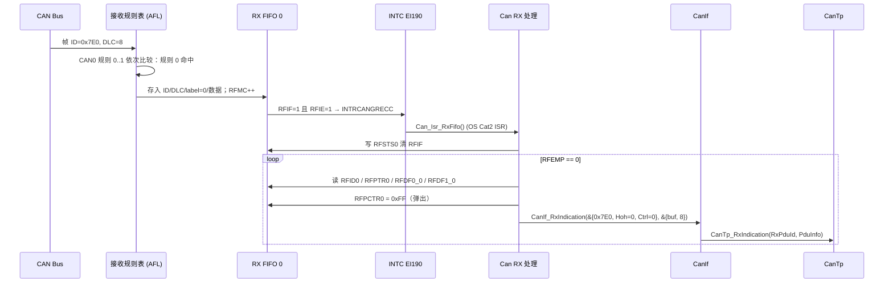

# CAN RX 实现：接收规则、RX FIFO 与 CanIf_RxIndication

> Prerequisite: [07 HOH / HRH / HTH](07-hoh-hrh-hth.md)、[09 Can_Init 实现](09-can-init-implementation.md)、[10 Can_Write 实现](10-can-write-implementation.md)
> Next: [12 中断与 MainFunction 实现](12-can-interrupt-implementation.md)
> 对应规范: AUTOSAR SWS CAN Driver **R22-11**（接收 p.48–50；`Can_HwType` p.59；`Can_MainFunction_Read` p.85–86；`CAN_E_DATALOST` p.53）；HW-E R01UH0585EJ0120 Rev.1.20（接收规则 p.830–837、p.1072–1075；RX FIFO p.844–852、p.1102；中断源 p.1058）
> 对应源码: openAUTOSAR `communication/CAN/CanIf/src/CanIf.c:764`（`CanIf_RxIndication`，R3.1.5 签名）；教学代码见 [14 从零写 Can Driver](14-can-driver-from-scratch.md)

---

## 1. 本章目标

1. 把"总线上来了一帧 0x7E0"到"`CanIf_RxIndication` 被调用"之间的每一步对应到 RS-CANFD 的硬件动作和驱动代码。
2. 理解接收规则（AFL）如何同时承担 AUTOSAR 的 `CanHwFilter`（ID/Mask）和 HRH 选择，以及"label → HRH"的映射设计。
3. 写出正确的 RX FIFO 读取循环：判空 → 读完整一条 → 弹出（RFPCTRx=0xFF）→ 构造 `Can_HwType`/`PduInfoType` → 回调；以及 RFIF 的清除时机。
4. 正确处理溢出（RFMLT → `CAN_E_DATALOST`）、扩展帧 ID 标记、DLC>8、配置错误的 label。
5. 理解 SWS 的接收一致性要求（`SWS_Can_00012`、影子缓冲）在 RS-CANFD 上意味着什么。

---

## 2. 为什么需要这个模块

接收是诊断请求进入 ECU 的唯一入口：

```text
CAN Bus → RS-CANFD 接收规则 → RX FIFO → CAN 中断/轮询 → Can driver → CanIf_RxIndication → CanTp → PduR → Dcm
```

上层只关心"哪个 L-PDU 到了、数据是什么"。驱动要解决的硬件问题有：

- **过滤**：总线上每秒可能有几千帧，ECU 只关心几十个 ID。RS-CANFD 用接收规则表在硬件里过滤；规则数为 0 时**什么都收不到**（HW-E p.1072）。
- **缓冲**：中断可能被延迟；FIFO 让多帧排队，而 RX buffer 只保留最新值（HW-E p.1072）。
- **格式**：RFIDx/RFPTRx/RFDF0/1_x 的位布局要转换成 AUTOSAR 的 `Can_IdType` 和字节数组（`SWS_Can_00060` p.48：先收到的字节是元素 0）。
- **识别**：CanIf 需要知道这一帧来自哪个 HRH（Hoh），以便做软件过滤和 L-PDU 查找。

---

## 3. 在系统中的位置



逐个 transition：

1. **Bus → AFL**：帧在 EOF 后被认为有效，进入"接收规则处理"：acceptance filter → DLC filter → routing → label addition（HW-E p.1072–1074）。
2. **规则比较**：只比较该**通道**自己的规则，从小号开始，**第一条命中即停止**（p.1073）。没有命中就丢弃，不存储。
3. **AFL → FIFO**：按 GAFLP1_j 选择目的地（最多 8 个），label（GAFLPTR[11:0]）随帧一起存（p.1074）。
4. **FIFO → INTC**：RFIF 按 RFCCx.RFIM/RFIGCV 的条件置位；RFIE=1 时产生请求。**8 个 RX FIFO 共用一个中断 EI190 INTRCANGRECC**（HW-E p.792）——不是 EI184（那是 CAN0 TX/RX FIFO 的接收中断）。
5. **ISR → Can**：OS Category 2 ISR 包装，见第 12 章。
6. **读一条、弹一条**：手册流程（p.848、p.1102）。
7. **CanIf_RxIndication**：`SWS_Can_00279`（p.48）规定参数：Mailbox（ID、Hoh、CanIf 抽象 ControllerId）+ PduInfoPtr（长度、数据指针）。在 RX ISR 或 `Can_MainFunction_Read` 中调用（`SWS_Can_00396`）。
8. **CanIf → CanTp**：CanIf 用 Hoh + CanId 找到 RxPduId，转给 CanTp（或 PduR/Com）。上层路径见 [05-can-stack/06 RX 路径](../05-can-stack/06-can-rx-path.md)。

**关键点：整个 `CanIf_RxIndication → CanTp → ...` 都在 ISR 上下文中同步执行**（SWS p.49："The complete RX processing (including copying to destination layer, e.g. COM) is done in the context of the RX interrupt or in the context of the Can_MainFunction_Read"）。上层回调必须短。

---

## 4. AUTOSAR 如何定义

### 4.1 回调参数

[AUTOSAR API] R22-11 中 `Can_HwType`（`SWS_CAN_00496` p.59）：

```c
typedef struct {
    Can_IdType       CanId;         /* 标准/扩展 ID（扩展帧 MSB 置 1） */
    Can_HwHandleType Hoh;           /* 硬件对象句柄（HRH） */
    uint8            ControllerId;  /* CanIf 提供的抽象 ControllerId */
} Can_HwType;
```

[Conceptual] `CanIf_RxIndication` 的 R4.x 形态是 `void CanIf_RxIndication(const Can_HwType* Mailbox, const PduInfoType* PduInfoPtr)`。**本仓库没有 CanIf SWS**，Can SWS 只给出了参数含义（`SWS_Can_00279` p.48、`SWS_Can_00234` p.88），确切签名需以项目所用 CanIf SWS 确认。

### 4.2 行为要求

| SWS ID（页） | 要求 | 实现对应 |
|---|---|---|
| `00279`（p.48） | 用 ID、Hoh、抽象 ControllerId 和长度/数据指针调用 `CanIf_RxIndication` | 构造 `mailbox` / `pdu` |
| `00423`（p.48） | 扩展帧：把 ID 的 MSB 置 1 | `CanId |= 0x80000000` |
| `00501`（p.48） | 指示是 Classical 还是 FD 帧（`Can_IdType` bit30） | Classical 模式下 bit30 恒为 0 |
| `00396`（p.48） | RX ISR 或 `Can_MainFunction_Read`（轮询）调用回调 | 第 12 章 |
| `00060`（p.48） | 先收到的字节是数组元素 0；硬件布局不同时提供适配缓冲 | 从 RFDF0/1 拆字节到 `buf[]` |
| `00489`（p.48） | 支持硬件 FIFO，深度由 `CanHwObjectCount` 配置 | RFCCx.RFDC |
| `00299/00300`（p.49） | 硬件缓冲不能锁定、或不能全局访问时，拷到影子缓冲 | 局部 `buf[8]` |
| `00012`（p.49） | ISR 和 `Can_MainFunction_Read` 都不能被**自己**打断 | 一个 FIFO 只由一个上下文处理 |
| `00395`（p.49） | 检测到 overwrite / overrun 时报运行时错误 `CAN_E_DATALOST` | RFMLT → `Det_ReportRuntimeError` |
| `00108`（p.86） | `Can_MainFunction_Read` 在 POLLING/MIXED 时轮询 | 第 12 章 |
| `00443/00444`（p.83–84） | 可选 L-PDU callout，返回 FALSE 则丢弃 | 教学实现未实现 |

### 4.3 HRH 与过滤的规范视角

- HRH 可以对应一个或多个硬件对象（`CanHwObjectCount`，对 HRH 是 FIFO 深度或影子缓冲数，ECUC_Can_00467 p.124）。
- `CanHwFilter`（ECUC_Can_00468 p.129）只能挂在 HRH 下：`CanHwFilterCode` + `CanHwFilterMask`。
- `CanHandleType`：FULL = 一个硬件对象只处理一个 ID；BASIC = 处理多个 ID（ECUC_Can_00323 p.123）。

在 RS-CANFD 上的自然映射是：**一条接收规则 ≈ 一个 CanHwFilter，规则的目的地 FIFO ≈ HRH 的硬件对象**。这些概念的展开见 [07 HOH/HRH/HTH](07-hoh-hrh-hth.md)；本章关注运行时代码。

---

## 5. 核心数据结构

### 5.1 接收规则（硬件）

[RH850 Hardware] 每条规则 4 个 32 位寄存器（Classical 模式窗口 `+0x500 + 0x10×j`，HW-E p.832–837）：

| 寄存器 | 关键字段 | 本教学配置的用法 |
|---|---|---|
| GAFLIDj | GAFLIDE[31]、GAFLRTR[30]、GAFLLB[29]（镜像）、GAFLID[28:0]（标准 ID 在 bit10:0） | `0x7E0` |
| GAFLMj | GAFLIDEM[31]、GAFLRTRM[30]、GAFLIDM[28:0]；**1 = 比较，0 = 不比较** | `0xC00007FF`：比较 IDE、RTR 和全部 11 位 → 标准数据帧精确匹配 |
| GAFLP0_j | GAFLDLC[31:28]（DLC 下限，仅 GCFG.DCE=1 时生效）、GAFLPTR[27:16]（12 位 label）、GAFLRMV[15]、GAFLRMDP[14:8] | label = HRH 号；RMV=0（不进 RX buffer） |
| GAFLP1_j | bit7:0 选 RX FIFO 0..7；bit16:8 选 TX/RX FIFO 0..8 | `1 << RxFifo` |

两条容易踩的规则：

- **GAFLIDEM=0 时手册要求 IDM 全为 0**（研究笔记 04 §8.5；HW-E p.834），所以不能写一个"不管标准还是扩展、只比低 11 位"的规则。
- **DLC 过滤只有 GCFG.DCE=1 时才生效**（HW-E p.1074）；DLC 小于规则值的帧被丢弃并置 GERFL.DEF——这是一种"规则命中却收不到"的情况，调试时要看 GERFL。

### 5.2 RX FIFO 读窗口（硬件）

| 寄存器（x=FIFO 号） | 偏移 | 字段 | HW-E |
|---|---|---|---|
| RFCCx | +0x0B8 + 4x | RFIGCV[15:13]、RFIM[12]、RFDC[10:8]、RFIE[1]、RFE[0] | p.844–845 |
| RFSTSx | +0x0D8 + 4x | RFMC[15:8] 未读条数、RFIF[3]、RFMLT[2]、RFFLL[1]、RFEMP[0] | p.846–847 |
| RFPCTRx | +0x0F8 + 4x | RFPC[7:0]：写 0xFF → 读指针前进、RFMC−1 | p.848 |
| RFIDx | +0xE00 + 0x10x | RFIDE[31]、RFRTR[30]、RFID[28:0] | p.849 |
| RFPTRx | +0xE04 + 0x10x | RFDLC[31:28]、RFPTR[27:16]（label）、RFTS[15:0]（时间戳） | p.850 |
| RFDF0_x / RFDF1_x | +0xE08 / +0xE0C + 0x10x | 字节 0..3 / 4..7，字节 0 在 bit7:0 | p.851–852 |
| RFISTS | +0x244 | RF0IF..RF7IF：哪个 FIFO 有中断请求 | p.875 |

注意 RFIDx/RFPTRx/RFDFx 是**访问窗口**：它们总是显示 FIFO 头部那一条；写 RFPCTRx=0xFF 后窗口内容就变成下一条。所以**必须先把整条读完，再弹出**。

### 5.3 驱动侧

[Educational Implementation]

```c
typedef struct {                 /* Can_ControllerConfigType 中与 RX 相关的字段 */
    uint8              RxFifo;          /* 本 controller 独占的 RX FIFO x */
    uint32             RxFifoCfg;       /* RFCCx（不含 RFE/RFIE），如 0x1200 */
    uint8              RuleFirst, RuleCount;
    Can_ProcessingType RxProcessing;
    /* ... */
} Can_ControllerConfigType;

typedef struct {
    uint32           GaflId, GaflMask;
    Can_HwHandleType Hrh;               /* 写进 GAFLPTR，接收时从 RFPTR 读回 */
} Can_RxRuleConfigType;
```

**label = HRH 的设计**：RS-CANFD 允许为每条规则附加 12 位 label（HW-E p.1074 §17.7.1.4），帧存入 FIFO 时 label 跟着存（RFPTRx[27:16]）。于是一个 FIFO 可以承载多个 HRH（每条规则 label 不同），接收时 `Hoh = (RFPTR >> 16) & 0xFFF`，零查表。这是**本教学实现的选择**；Renesas MCAL 如何从 FIFO/规则映射回 HRH，需看其生成代码确认（可能用 label，也可能每个 HRH 一个 FIFO/RX buffer）。

| 设计 | HRH 识别方式 | 优点 | 缺点 |
|---|---|---|---|
| label = HRH，多 HRH 共用一个 FIFO（本实现） | RFPTR label | FIFO 少、保序、零查表 | 一个 FIFO 溢出影响所有 HRH |
| 每 HRH 一个 RX FIFO | FIFO 号 | 隔离好 | 只有 8 个 RX FIFO（HW-E p.794），RAM 预算紧（p.1097） |
| 每 HRH 一个 RX buffer（FullCAN 风格） | buffer 号 | 只保留最新值，适合周期信号 | 覆盖式，不适合 CanTp 多帧（会丢帧） |

---

## 6. 初始化流程（RX 相关）

见 [09 章](09-can-init-implementation.md) 第 6 节。与 RX 相关的要点汇总：

1. global reset 中：GAFLCFG0（各通道规则数）→ 分页写规则 → RMNB=0 → RFCCx（RFDC/RFIM/RFIGCV、RFIE，**RFE=0**）。
2. global operating 后：RFCCx.RFE=1 **单独写**（HW-E p.845）。
3. 示例 RFCC0 = `0x00001200`（RFIM=1 每帧中断、RFDC=010b 即 8 条）+ RFIE + RFE = `0x00001203`。

RAM 约束（Classical 模式）：RX buffer 数 + 所有 RX FIFO 深度 + 所有 TX/RX FIFO 深度 ≤ 192（HW-E p.1097）。配置 CanHwObjectCount 时必须核算。

---

## 7. Runtime Flow 与代码

### 7.1 RX 处理函数

[Educational Implementation]（第 14 章 `Can.c`）

```c
void Can_Internal_RxProcess(uint8 ctrlIdx)   /* RX ISR 或 Can_MainFunction_Read 调用 */
{
    const Can_ControllerConfigType *c = Can_Ctrl(ctrlIdx);
    uint8  x = c->RxFifo;
    uint32 n;
    uint32 sts = Can_Rd32(RSCAN_RFSTS(x));
    if ((sts & RFSTS_RFMLT) != 0u) {                         /* (1) 溢出 */
        Can_Wr32(RSCAN_RFSTS(x), RFSTS_CLEAR_RFMLT);         /* 0x08：RFMLT=0, RFIF=1(保持) */
        (void)Det_ReportRuntimeError(CAN_MODULE_ID, CAN_INSTANCE_ID,
                                     CAN_SID_MAINFUNCTION_READ, CAN_E_DATALOST); /* 00395 */
    }
    if ((sts & RFSTS_RFIF) != 0u) {                          /* (2) 先清请求，再取数据 */
        Can_Wr32(RSCAN_RFSTS(x), RFSTS_CLEAR_RFIF);          /* 0x04：RFIF=0, RFMLT=1(保持) */
    }
    for (n = 0u; n < 128u; n++) {                            /* (3) 有界循环 */
        uint32 rfid, rfptr, d0, d1;
        uint8  buf[CAN_RX_BUFFER_SIZE];
        uint8  dlc, len, k;
        Can_HwType  mailbox;
        PduInfoType pdu;
        if ((Can_Rd32(RSCAN_RFSTS(x)) & RFSTS_RFEMP) != 0u) { break; }
        rfid  = Can_Rd32(RSCAN_RFID(x));                     /* (4) 整条读出 ... */
        rfptr = Can_Rd32(RSCAN_RFPTR(x));
        d0    = Can_Rd32(RSCAN_RFDF0(x));
        d1    = Can_Rd32(RSCAN_RFDF1(x));
        Can_Wr32(RSCAN_RFPCTR(x), RFPCTR_NEXT);              /* (5) ... 再弹出 */

        dlc = (uint8)(rfptr >> 28);
        len = (dlc > 8u) ? 8u : dlc;                         /* (6) Classical: 9..15 → 8 */
        for (k = 0u; k < 4u; k++) {
            buf[k]      = (uint8)(d0 >> (8u * k));
            buf[k + 4u] = (uint8)(d1 >> (8u * k));
        }
        mailbox.Hoh = (Can_HwHandleType)((rfptr >> 16) & 0xFFFu);   /* (7) label → HRH */
        if ((mailbox.Hoh >= Can_CfgPtr->HohCount) ||
            (Can_CfgPtr->Hohs[mailbox.Hoh].Kind != CAN_HOH_RECEIVE)) {
            continue;                                        /* 配置错误：丢弃，不崩溃 */
        }
        mailbox.CanId = ((rfid & XMID_IDE) != 0u)
                      ? ((rfid & XMID_EXT_MASK) | CAN_ID_IDE_FLAG)   /* (8) 00423 */
                      : (rfid & XMID_STD_MASK);
        mailbox.ControllerId = c->CanIfControllerId;
        pdu.SduDataPtr  = buf;                               /* 影子缓冲 (00299) */
        pdu.MetaDataPtr = NULL_PTR;
        pdu.SduLength   = len;
        CanIf_RxIndication(&mailbox, &pdu);                  /* (9) 同步回调 */
    }
    (void)Can_Rd32(RSCAN_RFSTS(x));                          /* (10) dummy read */
}
```

### 7.2 逐步讲解

**(1) 先处理溢出**：RFMLT=1 表示 FIFO 满时又来了一帧，**新帧被丢弃**（HW-E p.847、p.1122）。R22-11 要求报运行时错误 `CAN_E_DATALOST`（`SWS_Can_00395`），这里通过 `Det_ReportRuntimeError`（它是 `SWS_Can_00234` 列出的必需接口，p.88）。注意：丢的是**最新**那帧，FIFO 里已有的帧仍然有效，照常处理。

**W0C 的写法**：RFSTSx 中 RFIF 和 RFMLT 都是"写 0 清除、写 1 保持"（HW-E p.847 NOTE："use a store instruction to write '0' to the given flag and '1' to the other flags"）。所以：

| 目的 | 写入值 | 解释 |
|---|---|---|
| 只清 RFMLT | `0x00000008` | bit2(RFMLT)=0，bit3(RFIF)=1 |
| 只清 RFIF | `0x00000004` | bit3(RFIF)=0，bit2(RFMLT)=1 |

**绝对不要**用 `reg &= ~RFIF` 的读-改-写：读回的 RFMLT 若为 0，你会写 0 进去——如果恰好在读和写之间硬件置了 RFMLT，这次溢出就被你悄悄清掉了。

**(2) 为什么先清 RFIF 再取数据？** 考虑两种顺序：

| 顺序 | 竞争窗口 | 后果 |
|---|---|---|
| 取空 FIFO → 清 RFIF | 最后一次判空之后、清 RFIF 之前到达的帧：RFIF 被它置 1，又被我们清掉 | 帧留在 FIFO 里，**没有中断**提醒，直到下一帧到来才被处理（RFIM=1 时）——诊断请求可能"延迟一帧"甚至超时 |
| 清 RFIF → 取空 FIFO（本实现） | 清之后到达的帧会**重新**置 RFIF | 最坏情况：这帧在本次循环里被取走了，ISR 退出后又进来一次发现 FIFO 空——一次多余的中断，无害 |

这是所有"电平/标志型中断 + 队列"的通用原则：**先撤销通知，再消费队列**。

**(3) 有界循环**：上限 128 = RX FIFO 最大深度（HW-E p.845 RFDC=111b）。如果总线速率极高、ISR 处理速度跟不上，无界循环会让 ISR 永远不退出。界限也可以设成配置深度。

**(4)(5) 整条读完再弹出**：RFPCTRx 文档原话："Read the RSCANnRFIDx, RSCANnRFPTRx, RSCANnRFDF0_x, and RSCANnRFDF1_x registers to read messages in the receive FIFO buffer, and then write FFH to the RFPC[7:0] bits."（HW-E p.848）。而且只能在 RFE=1 且 RFEMP=0 时写 0xFF。

**为什么弹出放在回调之前？** 我们已经把数据拷进局部 `buf[]`（影子缓冲），硬件槽位可以立即释放。这样回调（可能较长）执行期间 FIFO 多一个空位，降低溢出风险。代价是 `buf[]` 在栈上，回调返回后失效——**CanIf 和上层必须在回调内拷走数据**，这正是 AUTOSAR 的约定（`PduInfoType` 指向的数据只在回调期间有效）。

**(6) DLC**：Classical 帧 DLC 9..15 仍表示 8 字节数据。RFDLC 原样保存收到的 DLC（GCFG.DRE=0 时，HW-E p.1074），所以要裁剪。手册还说明 DLC<8 时未用字节读出为 0（p.851）。

**(7) label → HRH，并校验**：label 来自配置，正常情况下一定是合法的 HRH。但如果配置生成器出错（或规则表被意外改写），用一个越界的 Hoh 去索引 CanIf 的表会更糟。校验失败直接丢弃。真实项目可能在这里报 DET 或调用错误钩子。

**(8) 扩展帧 MSB**：`SWS_Can_00423`：CanIf 不知道帧是标准还是扩展，Can 必须把扩展帧 ID 的 MSB 置 1。RFIDE 本身就是 bit31，所以 `(rfid & 0x1FFFFFFF) | 0x80000000` 与 `rfid & 0x9FFFFFFF` 等价；写成前者是为了表达"这是 AUTOSAR 编码，不是寄存器原样"。RTR 位（bit30）被丢弃——AUTOSAR Can 不支持远程帧（`SWS_Can_00236/00237` p.21），规则的 RTRM=1 + RTR=0 已经在硬件里把远程帧过滤掉了。

**(9) 回调**：同步、在 ISR（或 MainFunction）上下文中。CanIf 会做软件过滤（BASIC HRH 的二次筛选）、DLC 检查、查 RxPduId、转发上层。

**(10) dummy read**：HW-E p.254 的同步要求，见第 10 章 7.3 节和第 12 章。

### 7.3 一帧诊断请求的寄存器视角

[Conceptual] 测试仪发 `02 10 03 00 00 00 00 00`（DiagnosticSessionControl extended），ID 0x7E0：

| 读出 | 值 | 解码 |
|---|---|---|
| RFSTS0 | `0x00000108` | RFMC=1、RFIF=1、RFEMP=0 |
| RFID0 | `0x000007E0` | 标准帧，ID 0x7E0 |
| RFPTR0 | `0x8000xxxx` | DLC=8、label=0（→ HRH0）、低 16 位时间戳 |
| RFDF0_0 | `0x00031002` | 字节 0..3 = 02 10 03 00 |
| RFDF1_0 | `0x00000000` | 字节 4..7 |
| → `Can_HwType` | `{0x7E0, 0, 0}` | |
| → `PduInfoType` | `{buf, NULL, 8}` | buf = 02 10 03 00 00 00 00 00 |

---

## 8. RH850 Hardware Mapping

| AUTOSAR | RS-CANFD | HW-E |
|---|---|---|
| HRH | 接收规则 + 目的地 RX FIFO（本实现以 label 区分 HRH） | p.1072–1074 |
| CanHwFilterCode / Mask | GAFLIDj / GAFLMj（mask 1=比较） | p.832–834 |
| CanHwObjectCount（HRH） | RFCCx.RFDC（4/8/16/32/48/64/128） | p.845 |
| CanRxProcessing = INTERRUPT | RFCCx.RFIE=1 + RFIM（每帧/水位）；中断 EI190 | p.845；p.792 |
| `Can_HwType.CanId` | RFIDx（RFIDE→MSB） | p.849 |
| `Can_HwType.Hoh` | RFPTRx.RFPTR[11:0]（label） | p.850 |
| `PduInfoType.SduLength` | RFPTRx.RFDLC | p.850 |
| `PduInfoType.SduDataPtr` | 从 RFDF0/1_x 拆出的影子缓冲 | p.851–852 |
| 取下一条 | RFPCTRx ← 0xFF | p.848 |
| overrun → `CAN_E_DATALOST` | RFSTSx.RFMLT；汇总在 FMSTS、GERFL.MES | p.847；p.873；p.823 |
| DLC 过滤失败 | GERFL.DEF（仅 GCFG.DCE=1） | p.1074 |
| 哪个 FIFO 请求了中断 | RFISTS.RFxIF | p.875 |

**FD 接口模式差异**：RFIDx 移到 `+0x3000 + 0x80×x`；多了 RFFDSTSx（FDF/BRS/ESI）；数据寄存器 RFDFd_x 有 16 个（最多 64 字节）；RFCCx 增加 RFPLS（每条的 payload 存储大小）；超过存储大小的帧按 GCFG.CMPOC 处理（HW-E p.1074；handoff §8）。DLC 9..15 映射到 12..64 字节。

---

## 9. openAUTOSAR 实现

openAUTOSAR 的 `CanIf_RxIndication`（`communication/CAN/CanIf/src/CanIf.c:764`）签名是 R3.1.5 风格：

```c
void CanIf_RxIndication(uint8 Hrh, Can_IdType CanId, uint8 CanDlc, const uint8 *CanSduPtr)
```

与 R4.x 的差异：R3 把 Hrh、CanId、DLC、数据指针分成 4 个参数；R4.x 把前两者和 ControllerId 合成 `Can_HwType`，长度和数据合成 `PduInfoType`。R4 增加 `ControllerId`，是因为多个 Can 驱动（多个 HW unit）时 Hoh 号可能重叠，CanIf 需要控制器维度来区分。

它内部的处理（研究笔记 03 §2）：`CanIf_Arc_FindHrhChannel(Hrh)`（:100）→ 检查 PDU mode（:778-789）→ 线性扫描 RxPdu 表做软件过滤（:794-822）→ DLC 检查（:825-831）→ 按 user type 分发。研究笔记还指出一个缺陷：在 "unsupported filter type" 分支 `continue` 前没有 `entry++`（:820），会死循环——这提醒我们：**ISR 上下文里的回调一旦死循环，整个 ECU 停摆**。

openAUTOSAR 没有 Can 驱动，"RX FIFO → CanIf_RxIndication" 这一跳无法在其中追踪。

---

## 10. 当前教学项目实现

`examples/rh850_mcal_reference/` 中没有 RX 实现。本章代码在第 14 章的 mock 寄存器文件上测试：mock 模拟了 RFSTSx 的 W0C 语义、RFPCTRx 弹出、窗口寄存器只显示头部，以及"读空 FIFO 窗口"的错误检测（mock 中 `CHECK(M.count[x] > 0u)`）。

---

## 11. Code Walkthrough：接收规则到 HRH 的完整映射

[Educational Implementation] 示例配置（第 14 章 `Can_PBcfg.c`）：

```c
static const Can_HohConfigType Can_Hohs[4] = {
    { CAN_HOH_RECEIVE,  0u, 0u },   /* HRH 0: 物理寻址诊断请求 */
    { CAN_HOH_RECEIVE,  0u, 0u },   /* HRH 1: 功能寻址诊断请求 */
    { CAN_HOH_TRANSMIT, 0u, 0u },   /* HTH 2: TX buffer 0 */
    { CAN_HOH_TRANSMIT, 0u, 1u },   /* HTH 3: TX buffer 1 */
};
static const Can_RxRuleConfigType Can_Rules[2] = {
    { 0x7E0uL, 0xC00007FFuL, 0u },  /* 规则 0 → label 0 → HRH 0 */
    { 0x7DFuL, 0xC00007FFuL, 1u },  /* 规则 1 → label 1 → HRH 1 */
};
```

`Can_Init` 写出的硬件状态（Classical 模式，已在 mock 上核对）：

| 寄存器 | 值 |
|---|---|
| GAFLCFG0 | `0x02000000`（RNC0=2） |
| GAFLID0 / GAFLM0 / GAFLP0_0 / GAFLP1_0 | `0x7E0` / `0xC00007FF` / `0x00000000` / `0x00000001` |
| GAFLID1 / GAFLM1 / GAFLP0_1 / GAFLP1_1 | `0x7DF` / `0xC00007FF` / `0x00010000` / `0x00000001` |
| RFCC0 | `0x00001203` |

两个 ID（0x7E0、0x7DF）只是示例，取自研究笔记中的截图工程 ID 列表；**真实诊断 ID 必须由项目网络定义确认**。

把"规则顺序"作为配置的一部分来认真对待：规则从小号开始比较、命中第一条即停（HW-E p.1073）。如果你在规则 0 放了一条宽松的 mask（例如只比较高 4 位），后面的精确规则就永远不会命中，帧会带着规则 0 的 label（错误的 HRH）进入 FIFO。

---

## 12. Debug 方法

| 现象 | 检查顺序 | 典型原因 |
|---|---|---|
| 完全收不到 | GAFLCFG0 → 规则内容 → RFCCx.RFE → CmSTS（是否 STARTED） | 规则数为 0；RFE 没单独写；controller STOPPED（channel reset 中不接收） |
| FIFO 有数据（RFMC>0）但不进 ISR | RFCCx.RFIE、RFSTSx.RFIF、EIC190（EIMK/EIRF）、OS ISR 配置 | 中断挂在 EI184 而不是 EI190；EIC 被屏蔽 |
| 进 ISR 但 CanIf 不处理 | `mailbox.Hoh`、CanIf 的 HRH 配置 | label 与 CanIf 期望的 HRH 号不一致 |
| 只收到部分 ID | 规则顺序、mask 值、GERFL.DEF | 宽松规则遮住了精确规则；DLC 过滤 |
| 偶发丢帧 | RFSTSx.RFMLT、FMSTS、`CAN_E_DATALOST` 计数 | FIFO 太浅；ISR 被高优先级任务/中断长时间阻塞；轮询周期太长 |
| ISR 后数据错位 | RFDF 字节拆分顺序 | 字节 0 在 bit7:0（HW-E p.851），不是 bit31:24 |

更完整的分层方法见 [15 调试](15-can-driver-debugging.md)。

---

## 13. 常见问题

1. **"能不能用 RX buffer 代替 FIFO？"** 能，但 RX buffer 是覆盖式（HW-E p.1072），适合"只要最新值"的周期信号；对 CanTp 多帧传输会丢帧。读 RX buffer 的顺序也不同：先把 RMNDy.RMNSq 清 0，再读数据（HW-E p.1100，研究笔记 04 §8.9）。
2. **"可以在 `CanIf_RxIndication` 里调用 `Can_Write` 吗？"** 可以（例如 CanTp 收到首帧后立即发流控帧）。`Can_Write` 是可重入的；只要 RX 处理不持有 Can 的 exclusive area（本实现中 RX 路径不进 EA），就不会死锁。
3. **"为什么 CanIf 还要做软件过滤？"** 硬件规则数有限（每通道 ≤128，全模块 ≤192），BASIC HRH 常用一条宽 mask 规则收一个 ID 范围，再由 CanIf 精确筛选。
4. **"两个 controller 共用一个 RX FIFO 行吗？"** 硬件允许（GAFLP1 只是选目的地），但本实现假设一个 FIFO 只属于一个 controller，否则 `ControllerId` 无法从 FIFO 推断，`Can_DisableControllerInterrupts` 也无法按 controller 隔离。
5. **"FIFO 中断用每帧（RFIM=1）还是水位（RFIM=0）？"** 诊断请求通常稀疏且对延迟敏感 → 每帧中断。高负载信号通道可用水位中断降低中断频率，但需配合轮询或超时以免最后几帧滞留。

---

## 14. 实验

1. **主机**：在第 14 章测试中，把 `Can_Internal_RxProcess` 的 (2) 移到循环之后，然后写一个 mock 钩子：在最后一次读 RFSTS 判空之后注入一帧。比较两种顺序下 RFIF 的最终值。
2. **主机**：把 `Can_Rules[0].GaflMask` 改为 `0xC0000700`（只比较高 3 位），注入 ID 0x7DF，观察它以 HRH 0 而非 HRH 1 上报。
3. **目标板**：用 CANoe/PCAN 以 1 ms 间隔连续发 20 帧，把 FIFO 深度配成 4、关闭中断改为 10 ms 轮询，观察 RFMLT 与 `CAN_E_DATALOST`。
4. **思考**：如果 `CanIf_RxIndication` 执行时间是 200 µs，500 kbit/s 下 8 字节帧最短约 111 位 ≈ 222 µs（标准帧、无填充位时的量级），FIFO 深度 8，ISR 被一个 2 ms 的高优先级中断阻塞，会不会丢帧？

---

## 15. 对未来真实项目的意义

- **诊断请求收不到**是集成阶段最常见的问题之一。你需要能独立回答："帧到了引脚吗？过了规则吗？进了哪个 FIFO？中断挂对了吗？Hoh 对得上 CanIf 吗？"——本章的寄存器视角就是答案的骨架。
- **读供应商 MCAL 配置时**，确认三件事：mask 语义（工具 GUI 与 GAFLM 是否取反）、规则顺序、HRH 到 FIFO/buffer 的映射方式。截图工程中出现过"13 个邮箱 / 7 条规则 / mask=0"的疑问（研究笔记 01），本章给了判断方法。
- **中断负载评估**：RX ISR 的执行时间包括了整条上层链（CanIf → CanTp → PduR → 可能的 Dcm 回调）。做 timing 分析时，RX ISR 的 WCET 必须把这些算进去。
- **升级**：R4.x 之后 `CanIf_RxIndication` 的签名、`Can_HwType` 的内容、`PduInfoType.MetaDataPtr` 都可能随版本变化；目标工程若是 AR 4.2.2 风格 MCAL，需要对照其 CanIf 版本确认。

---

## 16. 本章总结

- 接收规则 = 硬件过滤器 + 路由 + label；label 可以把 HRH 带到 ISR 里。规则数为 0 时什么也收不到，mask 的 1 表示比较。
- RX FIFO 读取：**先清 RFIF → 循环（判空 → 整条读出 → 写 RFPCTRx=0xFF → 构造参数 → 回调）→ dummy read**。
- W0C 标志用"要清的位写 0、其他标志写 1"的一次 store，不用读-改-写。
- 溢出丢的是新帧，报 `CAN_E_DATALOST`；扩展帧 ID 的 MSB 置 1；DLC>8 裁剪为 8。
- 整条上层链在 ISR 上下文中同步执行，回调必须短、数据必须在回调内拷走。

---

## 17. 下一章

RX 和 TX 处理函数都已经写好，但"谁来调用它们"还没讲完。[12 中断与 MainFunction 实现](12-can-interrupt-implementation.md) 讲 OS Category 2 ISR 的包装、各中断源的清除顺序、共享中断 EI190 的分发，以及轮询模式下 `Can_MainFunction_Read/Write` 的设计。
