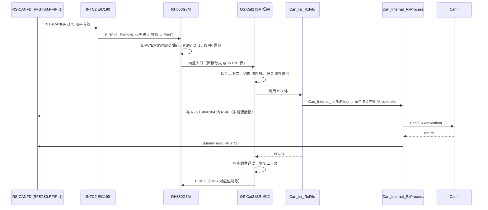

# CAN 中断与 MainFunction 实现：ISR 包装、清标志顺序、轮询

> Prerequisite: [05 CAN 中断](05-can-interrupt.md)、[10 Can_Write 实现](10-can-write-implementation.md)、[11 RX 实现](11-can-rx-implementation.md)、[OS Task 与 ISR](../02-autosar-classic/06-os-task-isr.md)
> Next: [13 错误处理与 Bus-off](13-can-error-busoff.md)
> 对应规范: AUTOSAR SWS CAN Driver **R22-11**（中断 p.33；轮询/通知 p.50–51；重入 p.51；MainFunction p.84–87；配置 `CanRxProcessing/CanTxProcessing/CanBusoffProcessing` p.107–110）；HW-E R01UH0585EJ0120 Rev.1.20（INTC p.264–290；同步 p.254；CAN 中断 p.792、p.1057–1058）
> 对应源码: openAUTOSAR `include/Can.h:330-334`（MainFunction 声明，含 R3 特有的 `Can_MainFunction_Error`）、`system/SchM/...`（研究笔记 03：`SchM_Can.h:19-23` 调度宏）；教学代码 `Can_Irq.c` 见 [14 从零写 Can Driver](14-can-driver-from-scratch.md)

---

## 1. 本章目标

1. 画出一次 CAN 中断从"外设置标志"到"CanIf 回调返回"的完整调用栈：RS-CANFD → INTC2 EICn → CPU 向量 → OS Category 2 ISR 框架 → Can 驱动 ISR 体 → 处理函数 → CanIf。
2. 对每一个 CAN 中断源说清楚：**请求标志在哪、怎么清、什么时候清、清不掉会怎样**。
3. 理解 RS-CANFD 的"共享中断"（EI190 由 8 个 RX FIFO 共用、EI189 全局错误）和"每通道中断"（ERR/REC/TRX）对驱动结构的影响。
4. 写出 `Can_MainFunction_Read/Write/BusOff/Mode`，并理解 INTERRUPT / POLLING / MIXED 三种配置下谁负责处理什么。
5. 实现 `Can_DisableControllerInterrupts/EnableControllerInterrupts` 的嵌套计数，并知道在 RS-CANFD 上"屏蔽一个 controller 的中断"为什么不简单。

---

## 2. 为什么需要这个模块

第 10、11 章写好了三个处理函数：`Can_Internal_TxProcess`、`Can_Internal_RxProcess`、`Can_Internal_BusOffProcess`。它们本身不关心"被谁调用"。本章解决的是**调用者**问题：

- 硬件事件要尽快处理（诊断请求的 P2 时间常常只有几十 ms，CanTp 的流控时序更紧）→ 中断。
- 但中断有代价：上下文切换、优先级规划、ISR 里不能做长操作、共享中断的分发 → 有些项目选择轮询。
- AUTOSAR 要求**两者都支持**，且可以按 controller、甚至按硬件对象选择（`SWS_Can_00007` p.50：必须能配置成完全不用中断；`SWS_Can_00099`：哪些事件可/必须轮询由硬件决定）。

所以驱动内部需要一个清晰的分层：**入口（ISR / MainFunction）→ 分发（哪个 controller、哪个事件）→ 处理函数（与入口无关）**。

---

## 3. 在系统中的位置



逐个 transition：

1. **HW → INTC**：RFIF=1 且 RFIE=1 时 RS-CANFD 输出中断请求（HW-E p.1057）。CAN 中断在 INTC 侧是**电平检测**（研究笔记 04 §5.2：Table 6.11 中 CAN 行标有 level 标记，可读 EICn.EICT 确认，HW-E p.267）。电平型意味着：**只要外设标志不清，请求就一直在**。
2. **INTC → CPU**：EICn 的 EIMK=0（未屏蔽）、优先级 EIP 高于当前 ISPR/PMR 屏蔽级别时受理（HW-E p.210–211、p.268）。同优先级时通道号小的先受理。
3. **CPU 硬件保存**：PC→EIPC、PSW→EIPSW、原因码→EIIC、PSW.ID=1、ISPR 对应优先级位置 1（HW-E p.193–194、p.210）。通用寄存器不由硬件保存。
4. **向量**：EICn.EITB=0 走直接分支（偏移由优先级决定），EITB=1 从 `INTBP + 4×通道号` 取地址（HW-E p.281）。EI190 的表项偏移是 `+0x2F8`（研究笔记 04 §5.2）。
5. **OS 框架**：Category 2 ISR 由 OS 生成的入口代码包装：保存寄存器、切换栈、允许在 ISR 中调用 OS 服务（如 `ActivateTask`、`SetEvent`）。**本仓库没有 AUTOSAR OS SWS**；以上是 OSEK/AUTOSAR OS 的公认行为，具体由项目 OS（研究笔记提到可能是 RTA-OS RH850GHS port）的手册确认。
6. **ISR 体**：只做分发，见第 7 节 `Can_Irq.c`。
7. **处理函数**：清源、读数据、回调——第 11 章。
8. **dummy read / SYNCP / EIRET**：HW-E p.254 Example 1：清中断请求后若要再开中断（EIRET 恢复 PSW 即开中断），需"store → dummy read → SYNCP"。驱动做 dummy read；SYNCP 由 OS 退出代码或编译器内建函数完成——**需按 OS port/工具链确认**。

---

## 4. AUTOSAR 如何定义

### 4.1 中断相关要求

| SWS ID（页） | 要求 | 实现含义 |
|---|---|---|
| `00033`（p.33） | 所需的所有中断由 Can 模块实现 ISR | ISR 体在 Can 模块里（`Can_Irq.c`） |
| `00419`（p.33） | 未使用的中断要关闭 | `Can_Init` 只打开配置需要的外设中断使能位 |
| `00420`（p.33） | ISR 末尾清中断标志 | 在 RS-CANFD 上清的是**外设**标志（TMTRF、RFIF、CmERFL），不是 EIRF |
| p.33 实现提示 | 驱动不设置中断向量优先级 | 优先级/向量由 OS 配置 |
| `00099`（p.50） | 事件可中断或轮询检测，由硬件决定可能性 | — |
| `00007`（p.50） | 必须能配置成完全不用中断 | 所有事件都有轮询路径 |
| p.51 | 轮询时回调上下文是 MainFunction，但回调实现必须按"可能在 ISR 中调用"来写 | CanIf 回调不能假设上下文 |
| `00012`（p.49） | ISR 和 `Can_MainFunction_Read` 都不能被**自己**打断 | 同一 FIFO 只由一个上下文处理；ISR 不可自嵌套 |

关于 `SWS_Can_00420` 的一个细节：规范说"at the end of the ISR"，但第 11 章我们**先**清 RFIF 再取数据。这不矛盾：对 FIFO 这种"队列 + 通知"结构，先撤销通知再清空队列是避免丢通知的正确做法；对 TX 完成这种"一个事件一个标志"的结构，处理完再清即可。理解规范的**目的**（离开 ISR 时不留下已处理事件的请求），比死扣字面更重要。

### 4.2 MainFunction

[AUTOSAR API]（p.84–87）全部为 `void Can_MainFunction_Xxx(void)`，由 BSW Scheduler 周期调用，不可重入，执行顺序无要求（`SWS_Can_00110`）。

| MainFunction | SID | 做什么 | 何时为空 |
|---|---|---|---|
| `Can_MainFunction_Write` | 0x01 | 轮询 TX 完成 → `CanIf_TxConfirmation`（`00031`） | 无 TX 轮询（`00178`） |
| `Can_MainFunction_Read` | 0x08 | 轮询 RX → `CanIf_RxIndication`（`00108`） | 无 RX 轮询（`00180`） |
| `Can_MainFunction_BusOff` | 0x09 | 轮询 bus-off（`00109`） | 无 bus-off 轮询（`00183`） |
| `Can_MainFunction_Wakeup` | 0x0a | 轮询唤醒（`00112`） | 无唤醒轮询（`00185`） |
| `Can_MainFunction_Mode` | 0x0c | 轮询模式切换完成 → `CanIf_ControllerModeIndication`（`00369/00370`） | 总是需要（无"可为空"条款） |

配置多个 `CanMainFunctionRWPeriods` 时，Read/Write 变成 `Can_MainFunction_Read_<ShortName>()` 等多个函数（`00441/00442` p.85–86），每个只处理引用该周期的 HOH。

### 4.3 中断开关 API

| API（页） | 要求 |
|---|---|
| `Can_DisableControllerInterrupts`（`00231` p.68） | 关闭该 controller 的所有中断；Reentrant |
| `00049`（p.68） | 只在中断已开时访问寄存器去关 |
| `00202`（p.68） | 调用 N 次 Disable，就要 N 次 Enable 才重新打开 |
| `Can_EnableControllerInterrupts`（`00232` p.69） | 恢复；`00208`：没有先 Disable 时调用则无动作 |
| `00425/00426`（p.67） | `Can_SetControllerMode` 不得开/关被 Disable 过的中断 |

---

## 5. 核心数据结构：中断源全景

### 5.1 RS-CANFD 的 11 个中断请求

[RH850 Hardware] HW-E Table 17.8（p.792）+ Table 17.175（p.1058）+ 研究笔记 04 §5.2：

| EI 通道 | 信号 | 范围 | 来源标志 → 使能位 | 清除方式 |
|---|---|---|---|---|
| 183 / 186 / 191 | INTRCANmERR | 每通道 | CmERFL：BEF/EWF/EPF/BOEF/BORF/OVLF/BLF/ALF → CmCTR 对应 `*IE` | CmERFL 写 0 清（W0C），其他标志写 1 |
| 184 / 187 / 192 | INTRCANmREC | 每通道 | CFSTSk.CFRXIF → CFCCk.CFRXIE（**TX/RX FIFO** 接收模式） | CFSTSk 写 0 清 |
| 185 / 188 / 193 | INTRCANmTRX | 每通道 | TMSTSp.TMTRF → TMIEp；TMTRF=01b → CmCTR.TAIE；CFTXIF/TXQIF/THLIF | TMSTSp ← 00b（8 位）等 |
| 189 | INTRCANGERR | **全局** | GERFL.DEF/MES/THLES → GCTR.DEIE/MEIE/THLEIE | 清**源**标志（MES 是汇总，要清 RFMLT/CFMLT） |
| 190 | INTRCANGRECC | **全局** | RFSTSx.RFIF（x=0..7）→ RFCCx.RFIE | RFSTSx 写 0 清 RFIF |

**最容易犯的错**：本教学配置用的是 **RX FIFO**（RFCCx/RFSTSx），它的中断是 **EI190**；EI184 是 CAN0 **TX/RX FIFO**（CFCCk）的接收中断，是另一组资源。只给 CAN0 配 183/184/185 三个 ISR，RX FIFO 的帧会永远到不了 CanIf（handoff §10 已强调）。

### 5.2 INTC 侧（EICn）

| 位 | 名称 | 含义（HW-E p.267–268） |
|---|---|---|
| 15 | EICT | 只读：0=边沿，1=电平 |
| 12 | EIRF | 请求标志；电平型由硬件跟随源，软件不能清 |
| 7 | EIMK | 1=屏蔽（复位值 1） |
| 6 | EITB | 0=直接分支，1=表引用 |
| 3:0 | EIP | 优先级，0 最高 |

EIC190 地址 `0xFFFF_B17C`，EIC185 `0xFFFF_B172`，EIC183 `0xFFFF_B16E`（`0xFFFF_B000 + 2n`，HW-E p.265）。**对 EIC 做读-改-写（包括 set1/clr1）可能丢失或重复中断**，手册要求在外设不产生请求、CPU 也没在受理该中断时才写（HW-E p.267，研究笔记 04 §5.1）。这条约束会在 7.4 节影响 `Can_DisableControllerInterrupts` 的设计。

### 5.3 驱动侧状态

```c
static uint8 Can_IrqDisableCnt[CAN_MAX_HW_CHANNELS];   /* [Educational Implementation] 嵌套计数，00202 */
```

以及配置中的 `TxProcessing / RxProcessing / BusoffProcessing`（第 9 章 5.1 节）。

---

## 6. 初始化流程（中断相关）

| 谁 | 做什么 | 时机 |
|---|---|---|
| OS（生成代码 / StartOS） | 向量表 / INTBP、EIC 优先级与 EITB、EIBD（PEID 必须 001，HW-E p.271） | 启动早期，CPU 中断仍关 |
| `Can_Init` | 外设中断使能：RFCCx.RFIE、TMIECy、CmCTR.BOEIE（以及若需要 GCTR.DEIE/MEIE） | EcuM 初始化阶段 |
| OS / 集成 | EIC 解除屏蔽（EIMK=0） | 视 OS 而定：OS 启动时统一开，或由 Can 在 SetControllerMode 中开（`00196`） |
| StartOS 之后 | CPU 全局开中断 | 进入调度 |

**安全顺序原则**（handoff §10）：先装好合法向量和 ISR、清理外设残留标志，再开外设中断源和 EIC，最后开 CPU 中断。**不能在 OS 尚未建立上下文时进入 Category 2 ISR**。在教学实现里，ISR 体第一行检查 `Can_DriverState != CAN_DRV_READY` 就返回，用来防御"Can_Init 之前/失败后来的伪中断"——但要注意，对电平型中断，"直接返回不清源"会导致立即再次进入；真正的保护是"源使能位在 `Can_Init` 之前为 0"（复位值即为 0）。

---

## 7. Runtime Flow 与代码

### 7.1 ISR 入口：Can_Irq.c

[Educational Implementation]

```c
/* Can_Irq.c —— 只做"入口 + 分发"，不碰寄存器 */
#include "Can_Internal.h"

#ifdef CAN_HOST_TEST
#define ISR(name) void name(void)          /* 主机测试：普通函数 */
#else
#include "Os.h"                            /* 目标：OS 提供 ISR() 宏，需按 OS 手册确认 */
#endif

ISR(Can_Isr_Ch0_Err) { Can_Internal_IsrError(0u); }  /* EI183 INTRCAN0ERR  */
ISR(Can_Isr_Ch0_Tx)  { Can_Internal_IsrTx(0u); }     /* EI185 INTRCAN0TRX  */
ISR(Can_Isr_Ch1_Err) { Can_Internal_IsrError(1u); }  /* EI186 INTRCAN1ERR  */
ISR(Can_Isr_Ch1_Tx)  { Can_Internal_IsrTx(1u); }     /* EI188 INTRCAN1TRX  */
ISR(Can_Isr_RxFifo)  { Can_Internal_IsrRxFifo(); }   /* EI190 INTRCANGRECC，8 个 RX FIFO 共用 */
```

`ISR(name)` 是 OSEK/AUTOSAR OS 定义 Category 2 ISR 的惯用宏；OS 配置（OIL/ARXML）中声明同名 ISR、类别、优先级和中断源，OS 生成向量和包装代码。Category 1 ISR 不经过 OS 框架、不能调用大多数 OS 服务，CAN ISR 要调用 CanIf→CanTp→...，上层可能 `SetEvent`/`ActivateTask`，所以几乎总是 Category 2。具体约束见 [OS Task 与 ISR](../02-autosar-classic/06-os-task-isr.md)。

### 7.2 分发：hardware channel → controller

```c
static void Can_ForChannel(uint8 m, void (*fn)(uint8))  /* [Educational Implementation] */
{
    uint8 i;
    if (Can_DriverState != CAN_DRV_READY) { return; }   /* Init 之前的伪中断 */
    for (i = 0u; i < Can_CfgPtr->ControllerCount; i++) {
        if (Can_Ctrl(i)->HwChannel == m) { fn(i); }
    }
}
void Can_Internal_IsrTx(uint8 hwChannel)    { Can_ForChannel(hwChannel, Can_Internal_TxProcess); }
void Can_Internal_IsrError(uint8 hwChannel) { Can_ForChannel(hwChannel, Can_Internal_BusOffProcess); }

void Can_Internal_IsrRxFifo(void)                       /* 共享 EI190 */
{
    uint8 i;
    if (Can_DriverState != CAN_DRV_READY) { return; }
    for (i = 0u; i < Can_CfgPtr->ControllerCount; i++) {
        if (Can_Ctrl(i)->RxProcessing == CAN_PROC_INTERRUPT) { Can_Internal_RxProcess(i); }
    }
}
```

**共享中断的两种分发策略**：

| 策略 | 做法 | 适用 |
|---|---|---|
| 遍历所有中断型 controller（本实现） | 每个 controller 的 FIFO 都检查一遍 RFSTS | controller 少（≤3），逻辑简单 |
| 先读 RFISTS（`+0x244`，HW-E p.875） | `RFISTS` 的 RFxIF 位直接告诉你哪些 FIFO 有请求，只处理置位的 | FIFO 多、追求 ISR 最短 |

注意 `RxProcessing == CAN_PROC_POLLING` 的 controller 在 ISR 中**必须跳过**：它的 FIFO 由 `Can_MainFunction_Read` 处理，ISR 再处理就违反 `SWS_Can_00012`（同一 FIFO 被两个上下文消费，ISR 可能打断 MainFunction 读到一半的那一条）。轮询型 controller 的 RFIE=0（`Can_Init` 中按配置设），所以正常情况下它也不会触发 EI190。

### 7.3 各中断源的清除顺序汇总

| 中断 | 处理函数 | 清除点 | 顺序要点 | 章节 |
|---|---|---|---|---|
| TRX（TX 完成） | `Can_Internal_TxProcess` | TMSTSp ← 0x00（8 位） | 拷句柄 → 清 TMTRF → 释放 HTH → 回调 | 第 10 章 7.3 |
| GRECC（RX FIFO） | `Can_Internal_RxProcess` | RFSTSx ← 0x04 | 先清 RFIF → 取空 FIFO → dummy read | 第 11 章 7.2 |
| ERR（bus-off） | `Can_Internal_BusOffProcess` | CmERFL ← 0x7FFF & ~BOEF | 清 BOEF → channel reset → 更新状态 → 回调 | 第 13 章 |
| GERR（全局错误） | 本教学驱动未使能 | 清 RFMLT/CFMLT/DEF 等源 | MES/THLES 是汇总，不能对汇总位写值 | handoff §5 |

**为什么 CmERFL 只清自己处理过的位？** 一个 ERR 中断可能同时由多个标志引起（BEF、EWF、EPF、BOEF...，取决于哪些 `*IE` 打开）。写 `0x7FFF & ~BOEF` 只清 BOEF，其他标志写 1 保持（HW-E p.812 Note："The only effective value for writing to this flag bit is 0 ... Otherwise writing to the bit results in retention of its state"）。如果写 0x00000000 一次全清，你会丢掉还没处理的事件；如果你打开了某个 `*IE` 却从不清它的标志，ERR 中断会风暴。

### 7.4 Can_Disable/EnableControllerInterrupts

[Educational Implementation]

```c
void Can_DisableControllerInterrupts(uint8 Controller)
{
    if ((Can_DriverState != CAN_DRV_READY) || (Controller >= Can_CfgPtr->ControllerCount)) {
        CAN_DET(CAN_SID_DISABLEINT, CAN_E_PARAM_CONTROLLER); return;
    }
    SchM_Enter_Can_CAN_EXCLUSIVE_AREA_0();
    if (Can_IrqDisableCnt[Controller] == 0u) {           /* 只在第一次真正去关 (00049) */
        Can_Port_SetControllerIrqMask(Can_Ctrl(Controller)->HwChannel, TRUE);
    }
    if (Can_IrqDisableCnt[Controller] < 0xFFu) { Can_IrqDisableCnt[Controller]++; }
    SchM_Exit_Can_CAN_EXCLUSIVE_AREA_0();
}

void Can_EnableControllerInterrupts(uint8 Controller)
{
    if ((Can_DriverState != CAN_DRV_READY) || (Controller >= Can_CfgPtr->ControllerCount)) {
        CAN_DET(CAN_SID_ENABLEINT, CAN_E_PARAM_CONTROLLER); return;
    }
    SchM_Enter_Can_CAN_EXCLUSIVE_AREA_0();
    if (Can_IrqDisableCnt[Controller] > 0u) {            /* 00208：未 Disable 过则无动作 */
        Can_IrqDisableCnt[Controller]--;
        if (Can_IrqDisableCnt[Controller] == 0u) {        /* 00202：配对后才真正打开 */
            Can_Port_SetControllerIrqMask(Can_Ctrl(Controller)->HwChannel, FALSE);
        }
    }
    SchM_Exit_Can_CAN_EXCLUSIVE_AREA_0();
}
```

**真正的难点在 `Can_Port_SetControllerIrqMask` 里**，教学实现把它留给集成层，原因有三：

1. **外设侧开关不适合运行时用**：CmCTR 的 `*IE` 只能在 channel reset 中修改（HW-E p.808）；RFCCx.RFIE 只能在 RFE=0 时修改（p.845），而清 RFE 会清空 FIFO。只有 TMIEp 可在 TMTRM=0 时改（p.888），但这时可能正好有帧在途。
2. **INTC 侧屏蔽有 RMW 风险**：EICn.EIMK 是最自然的开关，但 EIC 读-改-写有丢/重中断的风险（HW-E p.267）。真实 MCAL/OS port 会用经过验证的方法（例如在临界区内操作、或 OS 提供的中断源控制服务）——**需看 Renesas MCAL 和 OS 手册确认**。
3. **共享中断无法按 controller 屏蔽**：EI190 由所有 RX FIFO 共用。屏蔽它会同时挡住其他 controller 的接收。可选方案：(a) 只要有一个 controller 请求 Disable 就屏蔽 EI190（简单但过度阻塞）；(b) 每个 controller 用 TX/RX FIFO 的接收模式（各自 EI184/187/192）而不是共享 RX FIFO；(c) EI190 保持开启，ISR 内部跳过被 Disable 的 controller——**但对电平型中断，跳过而不清 RFIF 会导致中断风暴**，所以 (c) 不可行。

这是一个"硬件结构决定驱动设计"的典型例子，也是配置评审时值得问的问题："CanIf 什么时候调用 `Can_DisableControllerInterrupts`？在我们的 MCAL 里它屏蔽了哪些 EIC？"

### 7.5 MainFunction

[Educational Implementation]

```c
void Can_MainFunction_Write(void)
{
    uint8 i;
    if (Can_DriverState != CAN_DRV_READY) { return; }
    for (i = 0u; i < Can_CfgPtr->ControllerCount; i++) {
        if (Can_Ctrl(i)->TxProcessing == CAN_PROC_POLLING) { Can_Internal_TxProcess(i); }
    }
}

void Can_MainFunction_Read(void)
{
    uint8 i;
    if (Can_DriverState != CAN_DRV_READY) { return; }
    for (i = 0u; i < Can_CfgPtr->ControllerCount; i++) {
        if (Can_Ctrl(i)->RxProcessing == CAN_PROC_POLLING) { Can_Internal_RxProcess(i); }
    }
}

void Can_MainFunction_BusOff(void)
{
    uint8 i;
    if (Can_DriverState != CAN_DRV_READY) { return; }
    for (i = 0u; i < Can_CfgPtr->ControllerCount; i++) {
        if ((Can_Ctrl(i)->BusoffProcessing == CAN_PROC_POLLING) &&
            (Can_CtrlState[i] == CAN_CS_STARTED)) {
            Can_Internal_BusOffProcess(i);
        }
    }
}
```

要点：

- **MainFunction 与 ISR 处理同一函数**，区别只在调用者。这让"同一份逻辑、两种上下文"的测试变得简单（第 14 章测试直接调用 ISR 函数，也可以调用 MainFunction）。
- **早期返回 `CAN_DRV_READY` 检查**：BSW Scheduler 可能在 `Can_Init` 之前就开始调度（取决于 EcuM/BswM 的启动顺序）。规范对此没有 DET 要求，教学实现静默返回。
- **轮询时仍要清标志**：RFIE=0 时 RFIF 仍然按条件置位（HW-E p.847 描述 RFIF 置位条件只与 RFIGCV/RFIM 有关），`Can_Internal_RxProcess` 照样清它——无害，而且保持 RFSTS 干净便于调试。
- **MIXED**：`CanRxProcessing = MIXED` 时只轮询 `CanHardwareObjectUsesPolling = TRUE` 的 HOH（`SWS_Can_00108`）。本教学结构以 controller 为粒度，不支持 MIXED；要支持，需要把 `Processing` 下放到 HOH，并让同一 FIFO 只服务同一种处理方式的 HRH。

### 7.6 调度周期怎么选

[Real Project Consideration]

| MainFunction | 周期的约束 | 常见量级 |
|---|---|---|
| Read（轮询时） | FIFO 深度 × 最短帧间隔 > 周期 + 处理时间，否则溢出；CanTp 的 N_Br/N_Cr 时序 | 1–5 ms |
| Write（轮询时） | 背靠背发送吞吐 = HTH 数 / 周期；CanTp STmin、N_As | 1–5 ms |
| BusOff | 只影响检测延迟；CanSM 的恢复计时另算 | 5–10 ms |
| Mode | 模式切换未在 `Can_SetControllerMode` 内完成时的收尾延迟 | 5–10 ms |

周期由 BSW Scheduler 配置（`CanMainFunction{Busoff|Mode|Wakeup}Period` p.101–102；`CanMainFunctionRWPeriods` p.131）。调度机制见 [MainFunction 调度](../02-autosar-classic/07-mainfunction-scheduling.md)。

---

## 8. RH850 Hardware Mapping

| 概念 | RH850/P1M-E | HW-E |
|---|---|---|
| CAN 中断通道 | EI183–193（11 个） | p.792 |
| 检测方式 | 电平（读 EICn.EICT 确认） | p.267、p.285–290 |
| 中断屏蔽 | EICn.EIMK；IMRn 与之联动 | p.267–269 |
| 优先级 | EICn.EIP，0 最高，16 级；同级通道号小者优先 | p.268 |
| CPU 屏蔽 | PSW.ID、ISPR（受理时自动置位）、PMR | p.198、p.210–211 |
| 向量 | 直接分支（RBASE/EBASE + 偏移）或表引用（INTBP + 4n） | p.281–282 |
| 中断绑定 CPU | EIBDn.PEID 必须为 001 | p.271 |
| 清源后同步 | store → dummy read → SYNCP → EI/EIRET | p.254 |
| 共享中断定位 | RFISTS（RX FIFO）、GTINTSTS0（每通道 TX 类）、CFRISTS/CFTISTS | p.875–877、p.826 |
| OS ISR | Category 2 ISR 配置（优先级、向量、使能） | OS 手册（本仓库无） |

---

## 9. openAUTOSAR 实现

- `include/Can.h:330-334` 声明了 `Can_MainFunction_Write/Read/BusOff/Error/Wakeup`。`Can_MainFunction_Error` 是 Arctic 特有的，R4.x 没有；R4.x 有 `Can_MainFunction_Mode`（0x0c），openAUTOSAR 中没有。
- 研究笔记 03 记录 `SchM_Can.h:19-23` 有 Can 的调度宏，`SchM_MainFunction` 为空体（`system/SchM/src/SchM.c:424`，研究笔记 01）——openAUTOSAR 的调度骨架无法真正运行 Can 的 MainFunction。
- 没有 Can ISR 实现，也没有 RH850 的 OS port，所以"中断 → Can"这一跳在 openAUTOSAR 中不可追踪。

---

## 10. 当前教学项目实现

`examples/rh850_mcal_reference/` 的 README 在"目标板集成前置条件"中明确写着"建立 EIC/ISR 的初始化、挂起标志操作和临界区"尚未完成，并提醒对 OSTM 和 CAN 使用不同的 EIRF 处理方法（handoff §10：OSTM 是边沿型、CAN 是电平型）。本章的 `Can_Irq.c` 是对 CAN 部分的教学补充；它在主机上以普通函数形式被测试调用（`CAN_HOST_TEST` 宏），没有真实的向量和 OS。

---

## 11. Code Walkthrough：一个"中断风暴"的解剖

[Conceptual] 假设某工程师写了这样的 TX ISR：

```c
/* 错误示例 —— 不要这样写 */
ISR(Can_Isr_Ch0_Tx)
{
    uint8 p;
    for (p = 0u; p < 16u; p++) {
        if ((Can_Rd8(RSCAN_TMSTS(p)) & TMSTS_TMTRF_MASK) == TMSTS_TMTRF_DONE) {
            CanIf_TxConfirmation(Can_TxPduId[p]);
        }
    }
    /* "清中断" */
    Can_Wr16(EIC185_ADDR, Can_Rd16(EIC185_ADDR) & ~EIC_EIRF);
}
```

问题逐条：

1. **清错了地方**：EIC185 是电平型，EIRF 由源驱动、软件写无效（HW-E p.267）；TMTRF 没有清 → 请求一直有效 → EIRET 后立刻再次进入 → 任务永远得不到 CPU。现象：看门狗复位，或调试器停下来总是在这个 ISR 里。
2. **对 EIC 读-改-写**：即使是边沿型，RMW 也可能丢掉在读和写之间到来的请求（p.267）。
3. **只认 10b，不认 11b**：带中止请求的完成（11b）不会被确认，也不会被清——又一个风暴源。
4. **重复确认**：如果加上了清 TMTRF 但放在循环外、一次性清所有 buffer，可能把刚完成、尚未确认的 buffer 也清掉——丢确认。
5. **没有 `Can_TxBusy` 释放**：HTH 永远 busy，之后全是 `CAN_BUSY`。

对照第 10 章 7.3 节的正确写法，逐条都有对应。

---

## 12. Debug 方法

| 现象 | 看什么 | 判断 |
|---|---|---|
| 系统卡死在某个 CAN ISR | 外设标志（TMSTSp/RFSTSx/CmERFL）在 ISR 退出时是否仍为 1 | 源没清 → 风暴 |
| ISR 从不进入 | 外设使能位（RFIE/TMIEp/`*IE`）→ 外设标志 → EICn（EIRF=1? EIMK=0?）→ PSW.ID → ISPR/PMR | 逐级定位断在哪 |
| EIRF=1、EIMK=0 但不进 | ISPR 中更高或同级位为 1（另一个 ISR 没 EIRET）；PMR 屏蔽了该优先级 | 优先级/嵌套问题 |
| 进错 ISR | 向量表 / INTBP 表项（EI190 → `+0x2F8`） | OS 配置的中断源号写错（例如 184 vs 190） |
| 轮询模式下延迟大 | MainFunction 实际周期（trace 或计数器） | BSW 调度任务被饿死或周期配置不对 |
| `Can_Disable...` 后仍收到回调 | `Can_IrqDisableCnt`、EIC 屏蔽是否覆盖共享 EI190 | 7.4 节的共享中断问题 |

---

## 13. 常见问题

1. **"Can ISR 可以是 Category 1 吗？"** 技术上可以让 ISR 体极短（只置标志、由任务处理），但那样它就变成"中断 + 延后处理"，回调上下文变成任务。AUTOSAR Can 驱动规范假设回调在 ISR 或 MainFunction 中直接调用。大多数项目用 Category 2。
2. **"TX、RX、ERR 三个 ISR 的优先级怎么排？"** 常见做法：RX ≥ TX > ERR。RX 丢帧不可恢复；TX 慢一点只是确认延迟；bus-off 处理不急（CanSM 的恢复时间以 ms 计）。具体按项目 timing 分析。
3. **"同一 ISR 会自嵌套吗？"** 同一 EIC 通道在受理期间 ISPR 对应优先级位置 1，屏蔽同级及更低优先级（HW-E p.210），所以不会自嵌套。这满足了 `SWS_Can_00012`。但不同优先级的两个 CAN ISR 可以互相嵌套——它们访问的是不同的硬件对象，驱动的共享数据（如 `Can_TxBusy`）要用 EA 保护。
4. **"`Can_MainFunction_Mode` 为什么不能为空？"** 因为 `Can_SetControllerMode` 是异步的，超时未完成的切换需要它收尾（`00370/00372`）。即使大多数切换在函数内就完成了，也要保留它。
5. **"为什么 `Can_MainFunction_BusOff` 只在 STARTED 时检查？"** bus-off 只可能发生在参与通信时。STOPPED 时通道在 channel reset，CmERFL 已被清零（HW-E Table 17.180）。

---

## 14. 实验

1. **主机**：在第 14 章测试里把配置改成 `CAN_PROC_POLLING`，不调用任何 ISR，只调用 `Can_MainFunction_Write/Read/BusOff`，验证同样的测试用例全部通过。
2. **主机**：写一个"风暴检测"：在 mock 中统计 ISR 返回时 TMSTSp.TMTRF≠0 的次数；把第 10 章 7.3 节的 `Can_Wr8(RSCAN_TMSTS(p), 0u)` 注释掉，观察计数。
3. **目标板**：用示波器/逻辑分析仪在 ISR 入口和出口翻转一个 GPIO（通过 Dio），测量 RX ISR 的执行时间，并与第 11 章的上层链耗时对比。
4. **思考**：如果 CAN0 用中断、CAN1 用轮询，两个 controller 的 RX FIFO 都使能了 RFIE（配置错误），会发生什么？本实现中哪一行代码能避免 FIFO 被两个上下文同时消费？还有什么问题无法避免？

---

## 15. 对未来真实项目的意义

- **OS 配置是 CAN 能否工作的一半**。真实项目中你需要核对：OS 中声明的 CAN ISR 名称与 MCAL 提供的 ISR 符号一致；中断源号（183–193）与硬件表一致；优先级满足 timing 分析；类别是 Category 2。旧交接文档（`docs/rh850-hardware-handoff.md` §10）提到截图工程中有 `Interrupt_0228/022C` 之类的符号，**不能仅凭名字推断对应哪个 EI 通道**，必须查 OS 生成的中断表。
- **"中断风暴"和"中断不来"** 是集成期最常见的两类 CAN 中断问题，第 12 节的定位顺序（外设使能 → 外设标志 → EIC → CPU 屏蔽 → 向量）对任何 RH850 外设都适用。
- **共享中断**会影响 MCAL 的行为（例如 `Can_DisableControllerInterrupts` 的效果范围）。读 Renesas MCAL 手册时，重点找它对 INTRCANGRECC/INTRCANGERR 的处理说明。
- **MainFunction 周期**是配置评审项：轮询模式下的 FIFO 深度、HTH 数和周期必须一起核算。

---

## 16. 本章总结

- 调用栈：外设标志 → EICn（电平）→ CPU 向量 → OS Category 2 框架 → `Can_Irq.c` 入口 → 分发 → 处理函数 → CanIf。
- 清中断清的是**外设标志**：TMTRF（8 位写 00b）、RFIF（W0C 写 0x04）、CmERFL（W0C，只清处理过的位）；EIRF 不由软件清。
- RX FIFO 中断 EI190 是全局共享的，EI184 不是 RX FIFO 中断；共享中断让"按 controller 屏蔽中断"变得困难。
- MainFunction 和 ISR 调用同一处理函数；同一硬件对象只能由一个上下文消费（`SWS_Can_00012`）。
- `Can_Disable/EnableControllerInterrupts` 用嵌套计数；底层屏蔽方法依赖 OS/MCAL port，需在真实项目确认。

---

## 17. 下一章

前面三个处理函数中，`Can_Internal_BusOffProcess` 还只出现了名字。[13 错误处理与 Bus-off](13-can-error-busoff.md) 讲错误计数器、error passive、bus-off 检测、BOM 的四种模式，以及为什么 AUTOSAR 要求 Can 驱动**禁止自动恢复**，把恢复交给 CanSM。
