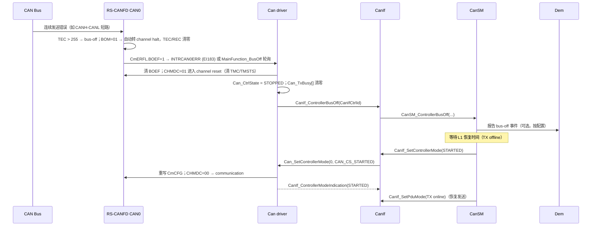
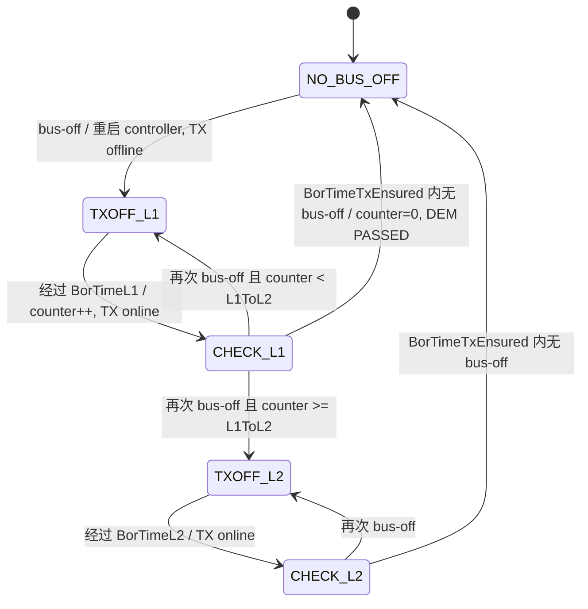

# CAN 错误处理与 Bus-off：从 TEC 到 CanSM 恢复

> Prerequisite: [01 CAN 硬件基础](01-can-hardware-basics.md)、[09 Can_Init 实现](09-can-init-implementation.md)、[12 中断与 MainFunction 实现](12-can-interrupt-implementation.md)
> Next: [14 从零写一个 RS-CANFD Can Driver](14-can-driver-from-scratch.md)
> 对应规范: AUTOSAR SWS CAN Driver **R22-11**（bus-off p.36、p.42–43，**`SWS_Can_00274` p.43**；`Can_GetControllerErrorState` p.71；错误计数 API p.73–74；`Can_MainFunction_BusOff` p.86；错误类型上报 p.55）；HW-E R01UH0585EJ0120 Rev.1.20（CmCTR.BOM p.805–809；CmSTS p.810–811；CmERFL p.812–815；bus-off 状态 p.1065–1069；Table 17.180 p.1070）
> 对应源码: openAUTOSAR `communication/CAN/CanIf/src/CanIf.c:919`（`CanIf_ControllerBusOff`）、`communication/CAN/CanSM/src/CanSM.c:83`（`CanSM_ControllerBusOff`）、`:275-418`（bus-off 恢复状态机）；教学代码见 [14 章](14-can-driver-from-scratch.md)

---

## 1. 本章目标

1. 理解 CAN 的故障界定（fault confinement）在 RS-CANFD 上的寄存器体现：TEC/REC、error warning / error passive / bus-off，以及对应的 CmSTS 状态位和 CmERFL 事件标志。
2. 理解 `SWS_Can_00274`（R22-11 p.43）"禁止或抑制自动 bus-off 恢复"的**理由**，以及它如何决定 RS-CANFD 的 BOM 配置。
3. 写出 bus-off 处理：检测（中断或 `Can_MainFunction_BusOff`）→ 进入 STOPPED、取消挂起发送 → `CanIf_ControllerBusOff`。
4. 看懂 CanSM 的 bus-off 恢复策略（L1/L2、TX offline）是如何驱动 `Can_SetControllerMode(STARTED)` 的。
5. 掌握几个与错误相关的"反直觉"现象：单节点 ACK error 不会 bus-off、BOM=01 时 TEC 被清零、进入 channel reset 会抹掉错误证据。

---

## 2. 为什么需要这个模块

CAN 的核心设计之一是**故障界定**：一个持续出错的节点要能把自己隔离出去，而不是拖垮整条总线。每个节点维护两个计数器：

- TEC（transmit error counter）：发送时检测到错误会增加，成功发送会减少。
- REC（receive error counter）：接收时同理。

按计数器的值，节点处于三种状态之一（ISO 11898-1 定义；**本仓库没有 ISO 11898 文本**，以下阈值取自 RS-CANFD 手册对相应标志的描述）：

| 状态 | 条件 | 节点行为 | RS-CANFD 体现 |
|---|---|---|---|
| Error active | TEC ≤ 127 且 REC ≤ 127 | 正常收发，出错时发主动错误帧 | CmSTS.EPSTS=0、BOSTS=0 |
| （Warning） | TEC 或 REC 首次 > 95 | 仍是 active，只是告警 | CmERFL.EWF（HW-E p.815） |
| Error passive | 128 ≤ TEC ≤ 255 或 REC ≥ 128 | 只能发被动错误帧，发送前多等待 | CmSTS.EPSTS=1；CmERFL.EPF（p.811、p.815） |
| Bus-off | TEC > 255 | **不参与总线** | CmSTS.BOSTS=1；CmERFL.BOEF（p.811、p.815） |

bus-off 之后怎么回来？ISO 规定需要检测到 128 次"11 个连续隐性位"才能重新变为 error active。RS-CANFD 硬件可以自己完成这个过程（BOM=00b），也可以停下来等软件决定（BOM=01b/10b/11b）。**AUTOSAR 选择了"等软件决定"**，这正是本章的主线。

---

## 3. 在系统中的位置



逐个 transition：

1. **Bus → HW**：错误使 TEC 超过 255，硬件进入 bus-off（HW-E p.1069 §17.6.2.5）。
2. **BOM=01 的硬件动作**：进入 bus-off 时 CHMDC 自动置为 10b，通道进入 channel halt；TEC/REC 清 0；不置 BORF、不产生恢复中断（HW-E p.807、p.1069）。BOEF 仍然会置 1（p.815："This flag is also set to 1 if the bus off state is entered when the BOM[1:0] bits ... are set to 01B"）。
3. **检测**：`CanBusoffProcessing = INTERRUPT` 时 CmCTR.BOEIE=1，BOEF 触发 EI183；= POLLING 时由 `Can_MainFunction_BusOff` 检查 BOEF（`SWS_Can_00109` p.86）。
4. **Can 的动作**：`SWS_Can_00272`（p.42）：转 STOPPED、确保不再参与网络；`SWS_Can_00273`：取消挂起报文。本实现进入 channel reset：硬件清 TMCp/TMSTSp（Table 17.180 p.1070），驱动清软件 busy 表——挂起的帧既不发出也不确认。
5. **CanIf_ControllerBusOff**：`SWS_Can_00020`（p.42）规定在 STOPPED 状态**到达之后**通知，参数是 CanIf 抽象 ControllerId。
6. **CanIf → CanSM**：CanIf 转发（CanIf/CanSM 的具体行为由它们的 SWS 定义，**本仓库没有这两份 SWS**）。
7. **CanSM 恢复**：等待配置的恢复时间，期间通常保持 TX offline；然后请求 STARTED。
8. **重启**：`Can_SetControllerMode(STARTED)` 重写位时间（`SWS_Can_00384`）并进入 communication。
9. **TX online**：CanSM 再等一段"确认无 bus-off"的时间（openAUTOSAR 中的 `CanSMBorTimeTxEnsured`），期间若再次 bus-off 则计数并可能升级到 L2 慢恢复。

---

## 4. AUTOSAR 如何定义

### 4.1 Bus-off 相关要求

| SWS ID（页） | 要求 |
|---|---|
| p.36 | 状态变化可由 bus-off 事件触发，以中断或 `Can_MainFunction_BusOff` 轮询状态位检测；Can 做必要的寄存器设置（"i.e. no hardware recovery in case of bus off"），再通知 CanIf |
| `00020`（p.42） | STARTED → STOPPED 由硬件 bus-off 触发；**STOPPED 到达后**用 `CanIf_ControllerBusOff` 通知 |
| `00272`（p.42） | bus-off 后 controller 转 STOPPED，并确保不再参与网络 |
| `00273`（p.42） | bus-off 后取消仍挂起的报文 |
| **`00274`（p.43）** | **"The Can module shall disable or suppress automatic bus-off recovery."** |
| `00109`（p.86） | `Can_MainFunction_BusOff` 轮询配置为"to be polled"的 bus-off 事件 |
| `00183`（p.86） | 无轮询时可为空宏 |
| `CanBusoffProcessing`（ECUC_Can_00314 p.107） | INTERRUPT / POLLING |

### 4.2 为什么 AUTOSAR 禁止自动恢复（`SWS_Can_00274`）

规范本身只写了要求（追溯到 SRS_Can_01060），没有展开理由。下面是教学性的解释——[Conceptual]，基于 AUTOSAR 分层设计和 CanSM 的职责：

1. **恢复策略是网络级/ECU 级决策，不是驱动级决策**。何时重试、重试几次、快恢复和慢恢复的间隔、是否报 DTC、是否通知 ComM/BswM——这些取决于整车网络规范（OEM 通常有明确的 bus-off 恢复时间要求），由 CanSM 统一配置。如果硬件自己恢复，CanSM 的时间策略就失效了。
2. **软件状态必须与硬件状态一致**。SWS p.36 的状态模型是：硬件事件 → Can 做寄存器设置 → 回调 CanIf → "The software state is then changed inside this callback function"。如果硬件在 CanSM 不知情时自动回到 error active 并开始发送，CanIf/CanSM 认为 controller 是 STOPPED，PDU mode 可能是 TX offline，而硬件却在发帧——状态机分裂。
3. **防止"喋喋不休的节点"（babbling idiot）**。如果 bus-off 的根因是本节点（例如收发器故障、位时间错误），自动恢复会让它每隔约 128×11 位时间就冲上总线再次制造错误，周期性地破坏整条总线的通信。软件控制的恢复可以逐级拉长间隔（L1 → L2），甚至在多次失败后放弃。
4. **挂起报文的语义**。`00273` 要求取消挂起报文：恢复后发出的是 CanSM/CanIf 重新提交的、当前有效的数据，而不是 bus-off 之前残留的旧帧。自动恢复的硬件会继续发送残留在 TX buffer 里的帧。
5. **诊断可见性**。bus-off 是需要记录 DTC 的事件（openAUTOSAR CanSM 中可见 `Dem_ReportErrorStatus(..., CanSMBusOffDemEvent, ...)`，`CanSM.c:299-301`）。软件主导的恢复给了 CanSM 一个明确的"事件点"。

### 4.3 错误状态查询与上报

| API / 要求（页） | 内容 | RS-CANFD 对应 |
|---|---|---|
| `Can_GetControllerErrorState`（`91004` p.71） | 返回 ACTIVE / PASSIVE / BUSOFF | CmSTS.BOSTS、EPSTS |
| `Can_GetControllerRxErrorCounter` / `Tx...`（`00511/00516` p.73–74） | 读 REC/TEC | CmSTS.REC[23:16]、TEC[31:24] |
| `91022`（p.55） | `CanEnableSecurityEventReporting=TRUE` 时，检测到 `Can_ErrorType` 0x1–0xB 的错误要调 `CanIf_ErrorNotification` | CmERFL.SERR/FERR/AERR/CERR/B1ERR/B0ERR/ADERR、BLF、ALF、OVLF |
| `91023`（p.55） | 同上开关下，进入 error passive 时调 `CanIf_ControllerErrorStatePassive`（带 Rx/Tx 计数） | CmERFL.EPF + CmSTS.REC/TEC |
| `91024`（p.55） | 硬件错误无法映射到预定义类型时不报 | — |

`Can_ErrorType` 的取值（位错误、ACK、仲裁丢失、过载、格式、填充、CRC、总线锁死等，`SWS_Can_91021` p.61）与 CmERFL 的标志大体一一对应，这部分在 R20-11 才加入（Change History p.1），属于安全事件（IdsM）上报，教学驱动未实现。

---

## 5. 核心数据结构：RS-CANFD 的错误寄存器

### 5.1 CmSTS — 当前状态（HW-E p.810–811）

| 位 | 名称 | 含义 |
|---|---|---|
| 31:24 | TEC[7:0] | 发送错误计数 |
| 23:16 | REC[7:0] | 接收错误计数 |
| 7 | COMSTS | 可通信（检测到 11 个连续隐性位后置 1） |
| 6 / 5 | RECSTS / TRMSTS | 正在接收 / 正在发送（TRMSTS 在 bus-off 中保持 1） |
| 4 | BOSTS | bus-off 状态（TEC>255），离开 bus-off 时清 0 |
| 3 | EPSTS | error passive，离开 error passive 或进入 channel reset 时清 0 |
| 2:0 | CSLPSTS/CHLTSTS/CRSTSTS | 通道模式 |

### 5.2 CmERFL — 事件标志（HW-E p.812–815）

| 位 | 名称 | 含义 | `Can_ErrorType` 大致对应 |
|---|---|---|---|
| 14 | ADERR | ACK 定界符格式错误 | — |
| 13 | B0ERR | 发送显性却检测到隐性（Dominant Bit Error） | 位错误 |
| 12 | B1ERR | 发送隐性却检测到显性（Recessive Bit Error） | 位错误 |
| 11 | CERR | CRC 错误 | CRC |
| 10 | AERR | ACK 错误 | ACK |
| 9 | FERR | 格式错误 | 格式 |
| 8 | SERR | 填充错误 | 填充 |
| 7 | ALF | 仲裁丢失（不是错误，是事件） | 仲裁丢失 |
| 6 | BLF | 总线锁定（检测到 32 个连续显性位） | 总线锁死 |
| 5 | OVLF | 过载帧 | 过载 |
| 4 | BORF | bus-off 恢复（128×11 隐性位后返回） | — |
| 3 | BOEF | 进入 bus-off | — |
| 2 | EPF | 首次进入 error passive | — |
| 1 | EWF | TEC 或 REC 首次 > 95 | — |
| 0 | BEF | 任一总线错误（bit14–8 中任一） | — |

几个手册细节，都是调试时的"坑"：

- **全部是 W0C**："The only effective value for writing ... is 0"；写 1 保持。软件不能把它们置 1（p.812–813）。
- **"首次"语义**：EPF/EWF 只在计数器**首次**越过阈值时置 1；清掉之后，计数器要先降回阈值以下再越过才会再次置位（p.815）。所以不能用"清标志后再看是否又置位"来判断"仍处于 passive"——要看 CmSTS.EPSTS。
- **ERRD 控制 bit14–8 的显示方式**：ERRD=0 时只显示**第一次**错误事件的类型；要看所有发生过的错误类型，设 ERRD=1（CmCTR bit23，只能在 reset/halt 改，p.807）。
- **进入 channel reset 会把 CmERFL 全部清零**，同时清 TEC/REC、EPSTS、BOSTS（Table 17.180 p.1070）。所以**先记录、再停通道**。

### 5.3 CmCTR.BOM — bus-off 恢复模式（HW-E p.807、p.1069）

| BOM | 进入 bus-off 时 | 恢复 | BORF / 恢复中断 | 满足 `SWS_Can_00274`？ |
|---|---|---|---|---|
| 00b | 停在 bus-off | **硬件自动**：128×11 隐性位后回到 error active 并继续通信 | 置 / 产生 | **否** |
| 01b | 立即自动转 channel halt，TEC/REC 清 0 | 不恢复，等软件 | 不置 / 不产生 | **是** |
| 10b | 停在 bus-off，等 128×11 隐性位完成后自动转 halt | 硬件完成 ISO 恢复序列，但随即 halt，不再通信 | 置 / 产生 | 是（硬件不会自己重新参与通信） |
| 11b | 停在 bus-off；软件写 CHMDC=10b 时转 halt | 若软件来不及，128×11 隐性位后自动回到 error active | 来不及时置 / 产生 | 有条件：取决于软件响应是否早于恢复完成 |

另外 `CmCTR.RTBO=1` 可以强制立即离开 bus-off，但手册规定只能在 BOM=00b 时使用（p.809）——与 AUTOSAR 的策略无关。

**本教学驱动选 BOM=01b**，理由：

1. 它是唯一"进入 bus-off 的瞬间硬件就停下"的模式，与 `SWS_Can_00272`（不再参与网络）最直接对应，没有竞争窗口（11b 有）。
2. BOEF 在 01b 下仍会置位（p.815），中断和轮询都能检测。
3. 驱动随后进入 channel reset，完成 STOPPED 的软件语义和 `00273` 的取消语义。

**BOM=01b 的一个后果**（[Real Project Consideration]）：ISO 规定的"128×11 隐性位"恢复等待被跳过了——halt 时 TEC/REC 已清零，之后 CanSM 请求 STARTED 时，通道只要检测到 11 个连续隐性位（COMSTS）就能通信。所以**最小恢复间隔完全由 CanSM 的 L1 时间保证**。500 kbit/s 时 128×11 位 = 1408 位 ≈ 2.8 ms；如果 CanSM 的快恢复时间配得比这还短，本节点的恢复会比 ISO 节点更"激进"。BOM=10b 让硬件先走完 ISO 序列再停下，是另一种合理选择。**Renesas MCAL 实际选哪个 BOM 值，需看其手册/生成代码确认**，并与 CanSM 的恢复时间配置一起评审（研究笔记 04 §10 第 12 项）。

---

## 6. 初始化流程（错误相关）

`Can_Init`（第 9 章）中：

```c
Can_Wr32(RSCAN_CmCTR(c->HwChannel), CTR_CHMDC_RESET | CTR_BOM_HALT_AT_ENTRY |
         ((c->BusoffProcessing == CAN_PROC_INTERRUPT) ? CTR_BOEIE : 0u));
```

- BOM 和 `*IE` 只能在 channel reset 中修改（HW-E p.808），所以必须在 `Can_Init`（或每次 STARTED 前的 reset 中）写。**进入 channel reset 不会清 BOM**（Table 17.180 p.1070 中 CmCTR 只列出 CRCT、CTMS、CTME、CHMDC），所以写一次即可。
- 教学驱动只打开 BOEIE。如果打开 EWIE/EPIE/BEIE 等，ERR ISR 必须处理并清除这些标志，否则会持续触发中断（第 12 章 7.3 节）。BEIE 在噪声环境下中断频率可能非常高，通常不开。
- ERRD 保持 0（只记录首个错误类型）。需要统计全部错误类型时设为 1。

---

## 7. Runtime Flow 与代码

### 7.1 Bus-off 处理函数

[Educational Implementation]（第 14 章 `Can.c`）

```c
void Can_Internal_BusOffProcess(uint8 ctrlIdx)  /* EI183 ISR 或 Can_MainFunction_BusOff */
{
    uint8  m    = Can_Ctrl(ctrlIdx)->HwChannel;
    uint32 erfl = Can_Rd32(RSCAN_CmERFL(m));
    if ((erfl & ERFL_BOEF) == 0u) { return; }                 /* 不是 bus-off */
    /* BOM=01：硬件已转 channel halt，TEC/REC 已清零 (HW-E p.807) */
    Can_Wr32(RSCAN_CmERFL(m), ERFL_FLAGS_MASK & ~ERFL_BOEF);   /* (1) W0C 只清 BOEF */
    Can_EnterChannelReset(ctrlIdx);                          /* (2) halt → reset，取消挂起 TX */
    (void)Can_WaitReg(RSCAN_CmSTS(m), STS_MODE_MASK, STS_CRSTSTS); /* (3) 最多 2 bit time */
    Can_CtrlState[ctrlIdx]   = CAN_CS_STOPPED;               /* (4) 00272 */
    Can_CtrlPending[ctrlIdx] = CAN_CS_UNINIT;
    CanIf_ControllerBusOff(Can_Ctrl(ctrlIdx)->CanIfControllerId);  /* (5) 00020 */
}

static void Can_EnterChannelReset(uint8 ctrlIdx)
{
    uint8  m   = Can_Ctrl(ctrlIdx)->HwChannel;
    uint32 ctr = Can_Rd32(RSCAN_CmCTR(m));
    Can_Wr32(RSCAN_CmCTR(m), (ctr & ~CTR_CHMDC_MASK) | CTR_CHMDC_RESET);
    Can_ReleaseAllTx(ctrlIdx);   /* channel reset 清 TMC/TMSTS (Table 17.180) */
}
```

### 7.2 逐步讲解

**为什么检测 BOEF 而不是 BOSTS？** BOSTS 是**电平状态**（"cleared to 0 when the CAN module has exited the bus off state"，p.811），BOM=01b 时硬件转入 halt 的同时 TEC/REC 被清零——状态位此时是否还保持 1，手册文字没有直接说明。BOEF 是**锁存事件**，置位后一直保持到软件清除（p.813），用它检测不会因为采样时机而漏掉。这是一个通用原则：**轮询事件用锁存标志，判断当前状态用状态位**。

**(1) 只清 BOEF**：`0x7FFF & ~0x8 = 0x7FF7`，其他标志写 1 保持（第 12 章 7.3）。严格说，紧接着的 channel reset 会把 CmERFL 全部清零，这一步看似多余；保留它是为了在 reset 之前就撤销中断请求，并让代码意图清晰。如果你想把 bus-off 前的错误类型记录下来（比如 AERR 还是 B0ERR），**必须在 (1) 之前读出整个 CmERFL 并保存**——reset 之后证据就没了。

**(2) halt → reset**：BOM=01b 下硬件已在 halt，halt→reset 最长 2 个 bit time（Table 17.178 p.1066）。进入 reset 的原因：

- 统一 STOPPED 的硬件表示（第 9 章 7.2 节表：STOPPED = channel reset）；
- reset 清 TMCp/TMSTSp，挂起的发送请求被硬件丢弃，满足 `SWS_Can_00273`；halt 不清这些寄存器（Table 17.180 只列 reset），如果停在 halt，之后 halt→communication 时残留的 TMTR 会被发出去。
- 驱动同时把 `Can_TxBusy[]` 清零，但**不**调用 `CanIf_TxConfirmation`——这些帧没有发出去。

**(3) 等待**：有界等待。即使超时，我们也继续通知（软件状态已不可能是 STARTED），让上层开始恢复流程。

**(4)(5) 先改状态、再回调**：`SWS_Can_00020` 要求"after STOPPED state is reached"。CanIf 在回调里可能立即查询 `Can_GetControllerMode` 或请求模式切换；状态必须已经是 STOPPED，否则 `Can_SetControllerMode(STARTED)` 会因"不在 STOPPED"而报 `CAN_E_TRANSITION`。

### 7.3 错误状态查询

```c
Std_ReturnType Can_GetControllerErrorState(uint8 ControllerId, Can_ErrorStateType *ErrorStatePtr)  /* [Educational Implementation] */
{
    uint32 sts;
    if ((Can_DriverState != CAN_DRV_READY) || (ErrorStatePtr == NULL_PTR) ||
        (ControllerId >= Can_CfgPtr->ControllerCount)) {
        CAN_DET(CAN_SID_GETERRORSTATE, CAN_E_PARAM_POINTER); return E_NOT_OK;
    }
    sts = Can_Rd32(RSCAN_CmSTS(Can_Ctrl(ControllerId)->HwChannel));
    *ErrorStatePtr = ((sts & STS_BOSTS) != 0u) ? CAN_ERRORSTATE_BUSOFF :
                     ((sts & STS_EPSTS) != 0u) ? CAN_ERRORSTATE_PASSIVE :
                                                 CAN_ERRORSTATE_ACTIVE;
    return E_OK;
}
```

（教学简化：不同的参数错误都报成 `CAN_E_PARAM_POINTER`；规范对 `91004` 各参数错误的具体 DET 码，见 SWS p.71。）

**陷阱**：在 BOM=01b 的 bus-off 处理完成之后调用它，返回的是 **ACTIVE**——TEC/REC 已被清零，通道在 reset 中，EPSTS/BOSTS 都是 0。第 14 章测试专门断言了这一点。所以"bus-off 发生过"这个信息只能来自 `CanIf_ControllerBusOff` 回调（以及 CanSM/DEM 的记录），不能事后从硬件状态推断。

### 7.4 CanSM 的恢复策略（来自 openAUTOSAR）

**本仓库没有 CanSM SWS**。下面以 openAUTOSAR 的 CanSM（Arctic Core，R3.1.5 风格）为参考，说明"上层恢复"长什么样——R4.x CanSM 的状态与参数命名可能不同，**需以项目 CanSM SWS/手册确认**。

```text
openAUTOSAR communication/CAN/CanSM/src/CanSM.c
  :83   CanSM_ControllerBusOff()      → 找到网络，置 busoffevent = TRUE
  :275  BOR_IDLE                      → 计数器/计时器清零 → BOR_CHECK
  :284  BOR_CHECK                     → 有 busoffevent：重启 CAN(FULL_COMM) + TX offline → TXOFF_L1
                                        计时到 CanSMBorTimeTxEnsured：Dem 报 PASSED → NO_BUS_OFF
  :323  BOR_TXOFF_L1                  → 等 CanSMBorTimeL1；counter++；TX online → CHECK_L1
  :338  BOR_CHECK_L1                  → 再次 bus-off：counter ≥ CanSMBorCounterL1ToL2 ? TXOFF_L2 : TXOFF_L1
                                        计时到 TimeTxEnsured：counter=0，报 PASSED → NO_BUS_OFF
  :368  BOR_TXOFF_L2                  → 等 CanSMBorTimeL2（慢恢复）
  :418  CanSM_MainFunction()          → 驱动上述状态机
```



和 Can 驱动的接口只有两个：入口 `CanIf_ControllerBusOff`，出口 `Can_SetControllerMode(STARTED)`（经 CanIf）。注意一个 R3/R4 差异：openAUTOSAR 的 `CanIf_ControllerBusOff`（`CanIf.c:919`）内部自己调用了 `CanIf_SetControllerMode(channel, CANIF_CS_STOPPED)`，注释写着"According to figure 35 in canif spec this should be done in Can driver but it is better to do it here"——在 R22-11 中，进入 STOPPED 是 **Can 驱动**的责任（`00272`），CanIf 只是更新自己的软件状态。

另一个细节：openAUTOSAR 的 CanSM 在 **TXOFF_L1 一开始就重启 controller**（`RequestCanIfMode(FULL_COMMUNICATION)` 在 BOR_CHECK 中就调用），只是保持 TX offline；也就是"立即恢复接收，延迟恢复发送"。这种策略下 L1 时间保护的是**发送**，不是总线参与本身——结合 5.3 节对 BOM=01b 的讨论，这对评审恢复时间很重要。

---

## 8. RH850 Hardware Mapping

| AUTOSAR | RS-CANFD | HW-E |
|---|---|---|
| bus-off 事件 | CmERFL.BOEF（锁存）；CmSTS.BOSTS（状态） | p.815；p.811 |
| `CanBusoffProcessing = INTERRUPT` | CmCTR.BOEIE=1 → INTRCANmERR（EI183/186/191） | p.808；p.792 |
| `SWS_Can_00274` | CmCTR.BOM = 01b（本实现）或 10b | p.807、p.1069 |
| `00272`（STOPPED，不参与网络） | channel reset（CHMDC=01） | p.1066 |
| `00273`（取消挂起报文） | channel reset 清 TMCp/TMSTSp | p.1070 |
| `Can_GetControllerErrorState` | CmSTS.BOSTS / EPSTS | p.810–811 |
| Rx/Tx 错误计数器 | CmSTS.REC[23:16] / TEC[31:24] | p.810 |
| error passive 事件（91023） | CmERFL.EPF | p.815 |
| `Can_ErrorType`（91021/91022） | CmERFL bit14–5 | p.812–814 |
| 强制退出 bus-off | CmCTR.RTBO（仅 BOM=00b） | p.809 |
| 总线锁定显性 | CmERFL.BLF（32 个连续显性位）；halt 无法进入时需进 reset | p.814；p.1065 Note 2 |

---

## 9. openAUTOSAR 实现

已在 7.4 节展开。补充两点：

- `CanIf_ControllerBusOff`（`CanIf.c:919-940`）先遍历 `Arc_ChannelToControllerMap` 找 channel，再 `CanIf_SetControllerMode(channel, CANIF_CS_STOPPED)`，再调用配置的 `CanIfBusOffNotification`（即 CanSM）。
- openAUTOSAR 没有 Can 驱动，也就没有 BOM 配置；"禁止自动恢复"在其中无法体现。

---

## 10. 当前教学项目实现

`examples/rh850_mcal_reference/` 没有错误处理代码。`docs/rh850-hardware-handoff.md` §5 已经正确记录了 BOM 的四种取值、CmERFL 的 W0C 语义、"MCAL/CanSM 的 bus-off 恢复策略必须与 BOM 一致"以及"不得为消除报错反复重启控制器"——本章是在它的基础上补充了 AUTOSAR 要求、驱动代码和 CanSM 交互。

---

## 11. Code Walkthrough：主机测试中的 bus-off 场景

[Educational Implementation] 第 14 章测试中的片段：

```c
/* --- 6. bus-off --- */
CHECK(Can_Write(2u, &pdu) == E_OK);                  /* 有一帧挂起 */
hw_busoff(0u); Can_Isr_Ch0_Err();                    /* mock：BOEF=1，CHMDC→halt */
CHECK(n_busoff == 1u && Can_GetControllerMode(0u, &mode) == E_OK && mode == CAN_CS_STOPPED);
CHECK((raw32(RSCAN_CmSTS(0)) & STS_MODE_MASK) == STS_CRSTSTS); /* reset，未自动恢复 */
CHECK(M.mem[RSCAN_TMC(0)] == 0u && n_txconf == 4u);  /* 挂起帧被取消，没有确认 */
CHECK(Can_GetControllerErrorState(0u, &es) == E_OK && es == CAN_ERRORSTATE_ACTIVE);
CHECK(Can_SetControllerMode(0u, CAN_CS_STARTED) == E_OK);   /* 模拟 CanSM 恢复 */
CHECK(Can_Write(2u, &pdu) == E_OK);                  /* HTH 可以再次使用 */
```

mock 的 `hw_busoff()` 按 BOM=01b 的手册描述建模：置 BOEF、把 CHMDC 改为 10b（halt）。每一条 `CHECK` 对应本章的一个要求：`00020`（回调 + STOPPED）、`00272/00274`（不自动恢复）、`00273`（取消挂起、无确认）、7.3 节的陷阱（ACTIVE）、以及恢复后 HTH 可用（`Can_TxBusy` 已释放）。

---

## 12. Debug 方法

| 现象 | 检查 | 解释 |
|---|---|---|
| 反复 bus-off | bus-off 前 CmERFL 的错误类型（需在处理函数开头保存）、位时间、终端电阻、收发器 | B0ERR/B1ERR 多 → 物理层/位时间；CERR/FERR → 位时间或噪声 |
| 单节点调试时 TEC 停在 128 左右、不 bus-off | CmERFL.AERR、CmSTS.EPSTS | **ACK error 特例**：总线上没有别的节点回 ACK 时，处于 error passive 的发送节点因 ACK error 不再增加 TEC（ISO 11898-1 的规则；本仓库无该标准原文），所以永远到不了 bus-off，只会无限重发。不要把它误判为"bus-off 检测坏了" |
| bus-off 后通信永不恢复 | CanSM 是否收到回调、`Can_SetControllerMode(STARTED)` 是否被调用、CmSTS.COMSTS | 回调没接上；或总线仍然故障（COMSTS 一直 0）；或 BLF=1（总线锁死显性） |
| bus-off 后立即恢复，CanSM 计时无效 | CmCTR.BOM | BOM=00b（自动恢复），违反 `00274` |
| `Can_GetControllerErrorState` 永远 ACTIVE | 调用时机 | BOM=01b 清了 TEC/REC，reset 清了 EPSTS（7.3 节） |
| ERR 中断风暴 | CmCTR 中打开了哪些 `*IE`、ISR 是否清了对应标志 | 打开 BEIE 但只处理 BOEF |

制造 bus-off 的实验方法：短接 CANH 与 CANL（或把 CANH 拉到地，具体按收发器手册的允许范围）后让节点发送；或者给本节点配置与总线不同的波特率，在有其他节点通信的总线上发送。前者是物理层故障，后者是位时间错误，两种都会让 TEC 快速上升。

---

## 13. 常见问题

1. **"bus-off 之后 Can 驱动可以自己调用 `Can_SetControllerMode(STARTED)` 吗？"** 不可以。那就是"自动恢复"的软件版本，同样违反 `00274` 的意图。恢复由 CanSM 决定。
2. **"BOM=10b 是不是也违规？"** 硬件会走完 ISO 恢复序列，但随即转 halt、不再参与通信，没有自动回到网络，所以符合"suppress"的含义。代价是检测到"恢复完成"需要处理 BORF 中断，并且 bus-off 期间通道停留在 bus-off 而不是 halt，驱动要决定何时把它带到 reset。
3. **"error passive 要不要通知上层？"** R22-11 只在 `CanEnableSecurityEventReporting=TRUE` 时要求 `CanIf_ControllerErrorStatePassive`（`91023`）。否则不要求。
4. **"bus-off 时正在接收的帧怎么办？"** bus-off 时节点不参与总线，不会再收到新帧；FIFO 中已经收到的帧仍然有效。本实现的 channel reset 不清 RX FIFO（RX FIFO 是全局资源，只有 global reset 才清，Table 17.180 中 RFCCx/RFSTSx 不在 channel reset 清除列表里），这些帧会在下一次 RX 处理时交给 CanIf。
5. **"CanIf_ControllerBusOff 在 ISR 上下文中调用，CanSM 能在里面做很多事吗？"** 不能。openAUTOSAR 的 CanSM 只是置一个 `busoffevent` 标志（`CanSM.c:83-96`），真正的处理在 `CanSM_MainFunction` 中——这是 ISR 回调的标准写法。

---

## 14. 实验

1. **主机**：把 `Can_Init` 中的 `CTR_BOM_HALT_AT_ENTRY` 改成 0（BOM=00b），并修改 mock 的 `hw_busoff()` 按 BOM=00b 行为建模（停在 bus-off、稍后自动恢复并置 BORF）。观察哪些断言失败，并解释每一条失败对应哪条 SWS 要求。
2. **主机**：在 `Can_Internal_BusOffProcess` 开头增加"保存 CmERFL 到诊断变量"的代码，并在测试中注入 `B0ERR | BEF | BOEF`，验证 channel reset 之后仍能读到保存的错误类型。
3. **目标板**：两节点总线，本节点周期发送；短接 CANH/CANL 1 秒再断开。用 trace 记录：BOEF 时刻、`CanIf_ControllerBusOff` 时刻、`Can_SetControllerMode(STARTED)` 时刻、第一帧 TxConfirmation 时刻，与 CanSM 配置的 L1 时间比较。
4. **目标板**：单节点（无 ACK）发送，观察 TEC 最终停在哪里、EPSTS 是否为 1、是否出现 bus-off，并解释。

---

## 15. 对未来真实项目的意义

- **bus-off 恢复是 OEM 网络规范的常见验收项**（恢复时间、重试次数、DTC 记录）。验收失败时，你要能区分问题在硬件配置（BOM）、Can 驱动（检测/通知）、CanIf（转发）、CanSM（计时/状态机）还是 DEM（事件配置）。
- **读 MCAL 生成代码时找 BOM**：Renesas MCAL 的 CmCTR 初值里 bit22:21 是多少？与 CanSM 的快/慢恢复时间是否匹配？这是 bus-off 相关问题的第一检查点。
- **错误证据会被 reset 抹掉**：在真实项目中加诊断计数或 trace 时，一定在 MCAL 的 bus-off 回调链早期（`CanIf_ControllerBusOff` 的用户回调里）读取并保存 CmERFL——前提是 MCAL 还没进 reset；否则只能在 MCAL 内部（供应商代码）或用调试器 trace 捕获。具体是否可行需看 MCAL 的实现顺序。
- **AUTOSAR 版本差异**：R20-11 起有错误类型上报（`91021–91024`），R4.3.0 起有 `Can_GetControllerErrorState`（Change History p.3）。目标工程若是 AR 4.2.2 风格 MCAL，可能没有这些 API——**需在真实项目确认**。

---

## 16. 本章总结

- RS-CANFD 用 CmSTS（当前状态：TEC/REC/EPSTS/BOSTS）和 CmERFL（锁存事件，W0C）表达 CAN 的故障界定；进入 channel reset 会清掉它们。
- `SWS_Can_00274`（R22-11 p.43）禁止自动 bus-off 恢复：恢复策略属于 CanSM，软件状态必须与硬件一致，并防止故障节点周期性冲击总线。
- 教学驱动用 BOM=01b：bus-off 即 halt；驱动检测 BOEF → 清标志 → channel reset（取消挂起 TX）→ STOPPED → `CanIf_ControllerBusOff`。
- 恢复路径：CanSM 计时 → `CanIf_SetControllerMode(STARTED)` → `Can_SetControllerMode(STARTED)`；BOM=01b 时最小恢复间隔由 CanSM 保证。
- 单节点 ACK error 不会导致 bus-off；BOM=01b 后错误计数器为 0——这两个现象是调试时最常见的误判来源。

---

## 17. 下一章

到这里，Can 驱动的所有运行时路径（Init、Mode、Write、TX 完成、RX、中断/轮询、bus-off）都讲完了。[14 从零写一个 RS-CANFD Can Driver](14-can-driver-from-scratch.md) 把它们组织成一个完整的、可在 PC 上单元测试的教学驱动：文件布局、类型、状态、每个 API、MMIO 抽象、mock 寄存器文件和测试计划，并说明它与真实 Renesas MCAL 的对应关系。
