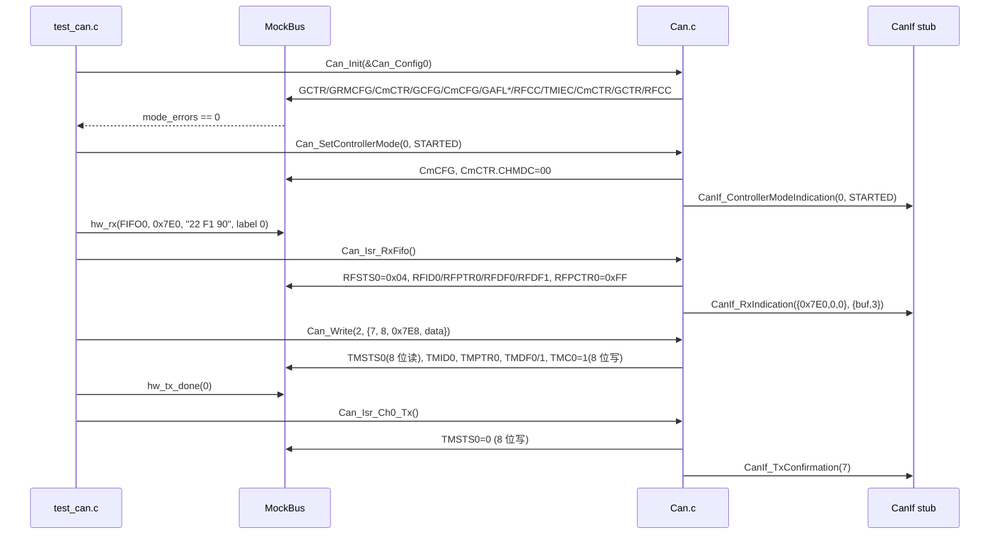

# 从零写一个 RS-CANFD AUTOSAR Can Driver（可在 PC 上单元测试）

> Prerequisite: [09 Can_Init](09-can-init-implementation.md)、[10 Can_Write](10-can-write-implementation.md)、[11 RX](11-can-rx-implementation.md)、[12 中断与 MainFunction](12-can-interrupt-implementation.md)、[13 错误与 Bus-off](13-can-error-busoff.md)
> Next: [15 Can Driver 调试](15-can-driver-debugging.md)
> 对应规范: AUTOSAR SWS CAN Driver **R22-11**（API p.62–87；类型 p.57–61；DET p.52–53；回调 p.88–89）；HW-E R01UH0585EJ0120 Rev.1.20（Section 17 RS-CANFD，Classical CAN 接口模式）
> 对应源码: 本项目 `examples/rh850_mcal_reference/platform/Rh850_Mmio.h/.c`（MMIO shim，本章直接复用）、`tools/run_host_tests.py`（现有主机测试的编译选项）；openAUTOSAR `include/Can.h`（只有声明，可对照 API 形态）

> **[Educational Implementation] 声明**：本章所有代码是教学实现。它按 AUTOSAR SWS R22-11 和 RH850/P1M-E 硬件手册编写，**在写作时**用主机 GCC 10.3（`-std=c99 -O2 -Wall -Wextra -Werror -pedantic`）编译，并在 mock 寄存器文件上运行了本章第 11 节的全部测试。它**没有**在真实 P1M-E 板上运行过，没有 MemMap、没有安全分析、没有覆盖 CAN FD、Trigger Transmit、唤醒、多硬件对象 HTH、MIXED 处理等。**不要把它当作量产代码**，也不要把它与 Renesas MCAL 混在同一个工程里使用。

---

## 1. 本章目标

这是 Part IV 的里程碑章节。读完并动手做完本章，你应该能够：

1. 从一张白纸开始，规划一个 AUTOSAR Can 驱动的文件布局、类型、配置结构和运行时状态。
2. 按里程碑逐步实现 `Can_Init`、`Can_SetControllerMode`、`Can_Write`、TX 完成、RX、ISR/MainFunction、bus-off，并且每一步都能在 PC 上测试。
3. 用 **MMIO 抽象 + mock 寄存器文件**把"硬件行为"变成可执行的断言：访问宽度、模式约束、W0C 语义、FIFO 弹出、channel reset 的副作用。
4. 写出一份覆盖 SWS 要求的测试计划，并理解哪些东西主机测试**证明不了**。
5. 把这个教学驱动映射回真实 Renesas MCAL：哪些部分你会在真实代码里看到同样的结构，哪些部分完全不同。

---

## 2. 为什么要自己写一遍

真实项目中 Can 驱动由芯片厂（Renesas）以 MCAL 形式交付，配置工具生成配置代码。你几乎不会从零写它。那为什么要写？

- **MCAL 是黑盒，但它的行为不是**。当诊断请求收不到、`CAN_BUSY` 不停、bus-off 后不恢复时，你要能推断 MCAL **一定**在做什么（因为硬件和规范只允许那几种做法），然后用寄存器和回调去验证。自己写过一遍，是建立这种推断能力最快的方法。
- **配置错误比代码错误多得多**。写配置结构时，你会被迫面对每一个约束：规则必须按通道连续、TX buffer 必须在 16m..16m+15、RFE 必须单独写、mask 的 1 表示比较……这些正是真实项目配置评审要查的东西。
- **主机可测试**意味着你可以在没有板子的情况下验证自己对规范和手册的理解，并在拿到真实 MCAL 时，用同样的测试思路去设计集成测试。

---

## 3. 在系统中的位置与边界

```mermaid
flowchart TB
    subgraph Upper["上层（本章用 stub 代替）"]
        CanIf["CanIf<br/>CanIf_RxIndication / TxConfirmation /<br/>ControllerBusOff / ControllerModeIndication"]
        Det["Det_ReportError / ReportRuntimeError"]
        SchM["SchM_Enter/Exit_Can_..._EXCLUSIVE_AREA_0"]
        Port["Can_Port_SetControllerIrqMask<br/>（集成层：EIC 屏蔽）"]
    end
    subgraph Drv["教学 Can 驱动"]
        CanH["Can.h / Can_GeneralTypes.h / Can_Cfg.h"]
        CanC["Can.c<br/>API + Tx/Rx/BusOff 处理"]
        Irq["Can_Irq.c<br/>ISR 入口"]
        PB["Can_PBcfg.c<br/>Can_Config0"]
        Regs["Can_Regs.h<br/>偏移/位定义"]
    end
    subgraph HWL["硬件访问"]
        Mmio["Rh850_Mmio（examples/.../platform）"]
        Native["Rh850_NativeMmio<br/>（目标板：volatile 访问）"]
        Mock["MockBus<br/>（PC：寄存器模型）"]
    end
    CanIf -- "Can_Write / Can_SetControllerMode / ..." --> CanC
    CanC -- callbacks --> CanIf
    CanC --> Det
    CanC --> SchM
    CanC --> Port
    Irq --> CanC
    PB --> CanC
    Regs --> CanC
    CanC --> Mmio
    Mmio --> Native
    Mmio --> Mock
```



边界说明：

- **向上**只依赖 CanIf 回调、Det、SchM（exclusive area）和一个集成钩子 `Can_Port_SetControllerIrqMask`。这些在主机测试中都是 stub。
- **向下**只通过 `Rh850_Mmio` 函数表访问寄存器。目标板上用现有的 `Rh850_NativeMmio`（`examples/rh850_mcal_reference/platform/Rh850_Mmio.c`，volatile 读写），PC 上换成 mock。
- **不负责**：引脚（Port）、时钟（Mcu）、EIC 优先级与向量（OS）——与第 9 章 6.3 节一致。

---

## 4. AUTOSAR 如何定义：本驱动实现的 API 子集

| API（SID） | SWS（R22-11） | 本驱动 | 说明 |
|---|---|---|---|
| `Can_Init` (0x00) | `00223` p.62 | ✔ | 第 9 章 |
| `Can_DeInit` (0x10) | `91002` p.64 | ✔（简化） | 回到 global reset |
| `Can_SetControllerMode` (0x03) | `00230` p.66 | ✔ | STARTED/STOPPED/逻辑 SLEEP |
| `Can_GetControllerMode` (0x12) | `91014` p.72 | ✔ | 软件状态 |
| `Can_GetControllerErrorState` (0x11) | `91004` p.71 | ✔ | CmSTS |
| `Can_Disable/EnableControllerInterrupts` (0x04/0x05) | `00231/00232` p.68–69 | ✔ | 嵌套计数 + 集成钩子 |
| `Can_Write` (0x06) | `00233` p.80 | ✔ | Classical，1 HTH = 1 TX buffer |
| `Can_MainFunction_Write/Read/BusOff/Mode` | p.84–87 | ✔ | — |
| `Can_SetBaudrate` / `Can_CheckWakeup` / `Can_MainFunction_Wakeup` / Rx/Tx 错误计数 / 时间戳 | 各页 | ✘ | 练习 |
| `Can_GetVersionInfo` | `00224` p.63 | ✘ | 练习 |

必需回调（`SWS_Can_00234` p.88）：`CanIf_ControllerBusOff`、`CanIf_ControllerModeIndication`、`CanIf_RxIndication`、`CanIf_TxConfirmation`、`Det_ReportRuntimeError`、`GetCounterValue`。本驱动用了前五个；`GetCounterValue` 被有界循环代替（见第 12 节"与真实 MCAL 的差距"）。

---

## 5. 文件布局

```text
edu_can/
├── inc/
│   ├── Std_Types.h          [主机 stub] 真实项目由平台提供
│   ├── ComStack_Types.h     [主机 stub] 真实项目由 ComStack 生成
│   ├── Can_GeneralTypes.h   [AUTOSAR API] Can/CanIf/CanTrcv 共享类型（SWS_Can_00436 p.24）
│   ├── CanIf_Can.h          [Conceptual] CanIf 回调声明（本仓库无 CanIf SWS）
│   ├── Det.h / SchM_Can.h   [Conceptual] DET 与 exclusive area 接口
│   ├── Can.h                对外 API + 实现相关的 Can_ConfigType
│   ├── Can_Cfg.h            预编译配置（真实项目：工具生成）
│   ├── Can_Regs.h           RS-CANFD 偏移与位定义（Classical 接口模式）
│   └── Can_Internal.h       驱动内部接口（Can.c ↔ Can_Irq.c），CanIf 不可见
├── src/
│   ├── Can.c                全部 API 与处理函数
│   ├── Can_Irq.c            ISR 入口（目标板上由 OS 包装为 Cat2 ISR）
│   └── Can_PBcfg.c          post-build 配置实例 Can_Config0（真实项目：工具生成）
└── test/
    └── test_can.c           mock 寄存器文件 + 上层 stub + 测试用例
（复用）examples/rh850_mcal_reference/platform/Rh850_Mmio.h/.c
```

和真实 AUTOSAR 模块文件的对应关系：

| 本驱动 | AUTOSAR 惯例 | 说明 |
|---|---|---|
| `Can.h` | `Can.h`（SWS 规定 API "Available via Can.h"） | 同名 |
| `Can_GeneralTypes.h` | `Can_GeneralTypes.h` | 同名；真实项目中可能由 CanIf/平台提供 |
| `Can_Cfg.h` | `Can_Cfg.h` | 预编译参数（`CanGeneral`） |
| `Can_PBcfg.c` | `Can_PBcfg.c`（post-build）或 `Can_Lcfg.c`（link-time） | 配置集实例 |
| `Can_Irq.c` | 供应商自定（常见 `Can_Irq.c`/`Can_Isr.c`） | ISR 入口；名称需按 OS 配置对齐 |
| `Can_Regs.h` | 供应商私有寄存器头 | 真实 MCAL 一般有自己的寄存器结构体定义 |
| — | `Can_MemMap.h` / `MemMap.h` | 见 7.4 节 |
| — | `SchM_Can.h` | 由 RTE/SchM 生成 |

---

## 6. 核心数据结构

### 6.1 类型与对外 API：Can_GeneralTypes.h、Can.h

`inc/Can_GeneralTypes.h`

```c
/* [AUTOSAR API] types per SWS CAN Driver R22-11 p.57-61 (host copy for teaching) */
#ifndef CAN_GENERALTYPES_H
#define CAN_GENERALTYPES_H
#include "ComStack_Types.h"

typedef uint32 Can_IdType;          /* SWS_Can_00416: bit31=IDE, bit30=FD */
typedef uint16 Can_HwHandleType;    /* SWS_Can_00429: uint8 or uint16 */

typedef struct {                    /* SWS_Can_00415 */
    PduIdType  swPduHandle;
    uint8      length;
    Can_IdType id;
    uint8     *sdu;
} Can_PduType;

typedef struct {                    /* SWS_CAN_00496 */
    Can_IdType       CanId;
    Can_HwHandleType Hoh;
    uint8            ControllerId;
} Can_HwType;

#define CAN_BUSY ((Std_ReturnType)0x02u)   /* SWS_Can_00039 */

typedef enum {                      /* SWS_Can_91013 */
    CAN_CS_UNINIT  = 0x00,
    CAN_CS_STARTED = 0x01,
    CAN_CS_STOPPED = 0x02,
    CAN_CS_SLEEP   = 0x03
} Can_ControllerStateType;

typedef enum {                      /* SWS_Can_91003 */
    CAN_ERRORSTATE_ACTIVE,
    CAN_ERRORSTATE_PASSIVE,
    CAN_ERRORSTATE_BUSOFF
} Can_ErrorStateType;

#define CAN_ID_IDE_FLAG  0x80000000uL
#define CAN_ID_FD_FLAG   0x40000000uL
#endif
```

`inc/Can.h`

```c
/* [Educational Implementation] Can.h of a teaching RS-CANFD driver.
 * API signatures follow AUTOSAR SWS CAN Driver R22-11 (p.62-87).
 * Can_ConfigType content is implementation specific (SWS_Can_00413). */
#ifndef CAN_H
#define CAN_H
#include "Can_GeneralTypes.h"
#include "Can_Cfg.h"

/* --- DET error codes, SWS_Can_91019 / 91020 (p.52-53) --- */
#define CAN_E_PARAM_POINTER      0x01u
#define CAN_E_PARAM_HANDLE       0x02u
#define CAN_E_PARAM_DATA_LENGTH  0x03u
#define CAN_E_PARAM_CONTROLLER   0x04u
#define CAN_E_UNINIT             0x05u
#define CAN_E_TRANSITION         0x06u
#define CAN_E_INIT_FAILED        0x09u
#define CAN_E_DATALOST           0x01u    /* runtime error */
/* --- service IDs (SWS tables) --- */
#define CAN_SID_INIT             0x00u
#define CAN_SID_MAINFUNCTION_WRITE 0x01u
#define CAN_SID_SETCONTROLLERMODE 0x03u
#define CAN_SID_DISABLEINT       0x04u
#define CAN_SID_ENABLEINT        0x05u
#define CAN_SID_WRITE            0x06u
#define CAN_SID_MAINFUNCTION_READ 0x08u
#define CAN_SID_MAINFUNCTION_BUSOFF 0x09u
#define CAN_SID_MAINFUNCTION_MODE 0x0Cu
#define CAN_SID_GETERRORSTATE    0x11u
#define CAN_SID_GETCTRLMODE      0x12u

typedef enum { CAN_PROC_INTERRUPT, CAN_PROC_POLLING } Can_ProcessingType;
typedef enum { CAN_HOH_RECEIVE, CAN_HOH_TRANSMIT } Can_HohKindType;

typedef struct {                  /* one CanController */
    uint8              HwChannel;        /* RS-CANFD channel m (0..2) */
    uint8              CanIfControllerId;/* abstract id reported to CanIf */
    uint32             ChannelCfg;       /* precomputed RSCANnCmCFG value */
    uint8              RxFifo;           /* RX FIFO x used by this controller */
    uint32             RxFifoCfg;        /* RFCCx value WITHOUT RFE/RFIE */
    uint8              RuleFirst;        /* index into Can_ConfigType.Rules */
    uint8              RuleCount;        /* -> GAFLCFG0.RNCm */
    Can_ProcessingType TxProcessing;     /* CanTxProcessing */
    Can_ProcessingType RxProcessing;     /* CanRxProcessing */
    Can_ProcessingType BusoffProcessing; /* CanBusoffProcessing */
} Can_ControllerConfigType;

typedef struct {                  /* one CanHardwareObject (index == HOH id) */
    Can_HohKindType Kind;
    uint8           ControllerIdx;       /* index into Controllers[] */
    uint8           TxBuffer;            /* HTH only: global TX buffer p */
} Can_HohConfigType;

typedef struct {                  /* one AFL rule == one CanHwFilter of an HRH */
    uint32           GaflId;             /* RSCANnGAFLIDj value */
    uint32           GaflMask;           /* RSCANnGAFLMj value, 1 = compare */
    Can_HwHandleType Hrh;                /* stored in 12-bit label GAFLPTR */
} Can_RxRuleConfigType;

typedef struct Can_ConfigType_s {
    const Can_ControllerConfigType *Controllers;
    uint8                           ControllerCount;
    const Can_HohConfigType        *Hohs;
    Can_HwHandleType                HohCount;
    const Can_RxRuleConfigType     *Rules;  /* sorted by HwChannel */
    uint8                           RuleCount;
    uint32                          GlobalCfg; /* RSCANnGCFG value */
} Can_ConfigType;

void           Can_Init(const Can_ConfigType *Config);
void           Can_DeInit(void);
Std_ReturnType Can_SetControllerMode(uint8 Controller, Can_ControllerStateType Transition);
Std_ReturnType Can_GetControllerMode(uint8 Controller, Can_ControllerStateType *ControllerModePtr);
Std_ReturnType Can_GetControllerErrorState(uint8 ControllerId, Can_ErrorStateType *ErrorStatePtr);
void           Can_DisableControllerInterrupts(uint8 Controller);
void           Can_EnableControllerInterrupts(uint8 Controller);
Std_ReturnType Can_Write(Can_HwHandleType Hth, const Can_PduType *PduInfo);
void           Can_MainFunction_Write(void);
void           Can_MainFunction_Read(void);
void           Can_MainFunction_BusOff(void);
void           Can_MainFunction_Mode(void);

extern const Can_ConfigType Can_Config0;   /* from Can_PBcfg.c */
#endif
```

设计决策（每一条都可以在前面章节找到原因）：

| 决策 | 理由 | 章节 |
|---|---|---|
| `Can_ConfigType` 存**寄存器原始值**（`ChannelCfg`、`RxFifoCfg`、`GaflId/GaflMask`、`GlobalCfg`） | 计算/校验在生成器里离线完成，运行时只搬运 | 9 章 5.1 |
| HOH 数组下标 = HOH id，HRH 在前 | `CanObjectId` 从 0 连续（ECUC_Can_00326） | 9 章 5.1 |
| `HwChannel` ≠ controller 索引 | 不碰未用通道（`SWS_Can_00053`） | 9 章 4.2 |
| 规则带 `Hrh`，写入 12 位 label | RX 时从 RFPTRx 直接得到 Hoh | 11 章 5.3 |
| 每 controller 一个 RX FIFO | `ControllerId` 可由 FIFO 推断；中断屏蔽可按 controller 讨论 | 11 章 13 |
| `Processing` 粒度是 controller | 简化；MIXED 需要下放到 HOH | 12 章 7.5 |

### 6.2 预编译配置与内部接口：Can_Cfg.h、Can_Internal.h

`inc/Can_Cfg.h`

```c
/* [Educational Implementation] pre-compile configuration.
 * In a real project this file is GENERATED from ECUC (CanGeneral). */
#ifndef CAN_CFG_H
#define CAN_CFG_H
#include "Std_Types.h"

#define CAN_DEV_ERROR_DETECT     STD_ON   /* CanDevErrorDetect */
#define CAN_MODULE_ID            80u      /* AUTOSAR module id of Can */
#define CAN_INSTANCE_ID          0u
#define CAN_MAX_HW_CHANNELS      3u       /* RSCFD0 has CAN0..2 (HW-E p.788) */
#define CAN_MAX_TX_BUFFERS       48u      /* 16 per channel (HW-E p.794) */
#define CAN_HW_WAIT_LOOPS        10000u   /* bounded register polling */
#define CAN_RX_BUFFER_SIZE       8u       /* classical CAN payload */
#endif
```

`CAN_MODULE_ID = 80` 取自 AUTOSAR BSW 模块列表中 Can 模块的 ID；**本仓库没有该列表文档**，使用前请以项目所用 release 的 List of Basic Software Modules 确认。

`inc/Can_Internal.h`

```c
/* [Educational Implementation] driver-internal interface between Can.c and
 * Can_Irq.c. Not visible to CanIf. */
#ifndef CAN_INTERNAL_H
#define CAN_INTERNAL_H
#include "Can.h"
#include "Rh850_Mmio.h"

void Can_Internal_TxProcess(uint8 ctrlIdx);
void Can_Internal_RxProcess(uint8 ctrlIdx);
void Can_Internal_BusOffProcess(uint8 ctrlIdx);
/* ISR dispatch: hardware channel m -> configured controller (safe before Can_Init) */
void Can_Internal_IsrTx(uint8 hwChannel);
void Can_Internal_IsrError(uint8 hwChannel);
void Can_Internal_IsrRxFifo(void);
/* integration hook: mask/unmask the INTC channels of one controller.
 * Real implementation is OS-port / MCAL specific (EICn.EIMK, HW-E p.267). */
void Can_Port_SetControllerIrqMask(uint8 hwChannel, boolean masked);
/* host-test hook: inject the register bus (Rh850_Mmio shim concept) */
void Can_Internal_SetMmio(const Rh850_Mmio *bus);
#endif
```

### 6.3 寄存器定义：Can_Regs.h

[RH850 Hardware] 只覆盖本驱动用到的寄存器，全部是 **Classical CAN 接口模式**（GRMCFG.RCMC=0）的偏移。FD 接口模式偏移不同（HW-E p.916–919），不能混用。

`inc/Can_Regs.h`

```c
/* [RH850 Hardware] RS-CANFD (RSCFD0) on RH850/P1M-E, *Classical CAN interface
 * mode only* (GRMCFG.RCMC = 0). Offsets/bits from R01UH0585EJ0120 Rev.1.20,
 * pages noted per line. CAN FD interface mode uses DIFFERENT offsets
 * (HW-E p.916-919) - never mix the two maps. */
#ifndef CAN_REGS_H
#define CAN_REGS_H
#include "Std_Types.h"

#define RSCAN0_BASE            0xFFD20000uL          /* HW-E p.791 */

/* ---- channel registers, m = 0..2 (HW-E p.798, p.803-815) ---- */
#define RSCAN_CmCFG(m)         (0x0000uL + 0x10uL * (m))
#define RSCAN_CmCTR(m)         (0x0004uL + 0x10uL * (m))
#define RSCAN_CmSTS(m)         (0x0008uL + 0x10uL * (m))
#define RSCAN_CmERFL(m)        (0x000CuL + 0x10uL * (m))
/* ---- global registers (HW-E p.798, p.816-831) ---- */
#define RSCAN_GCFG             0x0084uL
#define RSCAN_GCTR             0x0088uL
#define RSCAN_GSTS             0x008CuL
#define RSCAN_GERFL            0x0090uL
#define RSCAN_GAFLECTR         0x0098uL
#define RSCAN_GAFLCFG0         0x009CuL
#define RSCAN_RMNB             0x00A4uL
#define RSCAN_GRMCFG           0x04FCuL              /* HW-E p.802 */
/* ---- receive rule window, j = 0..15 (HW-E p.832-837) ---- */
#define RSCAN_GAFLID(j)        (0x0500uL + 0x10uL * (j))
#define RSCAN_GAFLM(j)         (0x0504uL + 0x10uL * (j))
#define RSCAN_GAFLP0(j)        (0x0508uL + 0x10uL * (j))
#define RSCAN_GAFLP1(j)        (0x050CuL + 0x10uL * (j))
/* ---- RX FIFO, x = 0..7 (HW-E p.844-852) ---- */
#define RSCAN_RFCC(x)          (0x00B8uL + 4uL * (x))
#define RSCAN_RFSTS(x)         (0x00D8uL + 4uL * (x))
#define RSCAN_RFPCTR(x)        (0x00F8uL + 4uL * (x))
#define RSCAN_RFID(x)          (0x0E00uL + 0x10uL * (x))
#define RSCAN_RFPTR(x)         (0x0E04uL + 0x10uL * (x))
#define RSCAN_RFDF0(x)         (0x0E08uL + 0x10uL * (x))
#define RSCAN_RFDF1(x)         (0x0E0CuL + 0x10uL * (x))
#define RSCAN_RFISTS           0x0244uL              /* HW-E p.875 */
/* ---- TX buffer, p = 0..47, channel m owns 16m..16m+15 (HW-E p.878-889) ---- */
#define RSCAN_TMC(p)           (0x0250uL + (p))      /* 8-bit access only */
#define RSCAN_TMSTS(p)         (0x02D0uL + (p))      /* 8-bit access only */
#define RSCAN_TMID(p)          (0x1000uL + 0x10uL * (p))
#define RSCAN_TMPTR(p)         (0x1004uL + 0x10uL * (p))
#define RSCAN_TMDF0(p)         (0x1008uL + 0x10uL * (p))
#define RSCAN_TMDF1(p)         (0x100CuL + 0x10uL * (p))
#define RSCAN_TMIEC(y)         (0x0390uL + 4uL * (y))
#define RSCAN_TMTCSTS(y)       (0x0370uL + 4uL * (y)) /* HW-E p.894 */
#define RSCAN_GTINTSTS0        0x0460uL              /* HW-E p.826 */

/* GCTR / GSTS (HW-E p.819-822) */
#define GCTR_GMDC_MASK         0x00000003uL
#define GCTR_GMDC_OPERATING    0x00000000uL
#define GCTR_GMDC_RESET        0x00000001uL
#define GCTR_GSLPR             0x00000004uL
#define GCTR_DEIE              0x00000100uL
#define GCTR_MEIE              0x00000200uL
#define GSTS_GRSTSTS           0x00000001uL
#define GSTS_GHLTSTS           0x00000002uL
#define GSTS_GSLPSTS           0x00000004uL
#define GSTS_GRAMINIT          0x00000008uL
/* CmCTR (HW-E p.805-809) */
#define CTR_CHMDC_MASK         0x00000003uL
#define CTR_CHMDC_COMM         0x00000000uL
#define CTR_CHMDC_RESET        0x00000001uL
#define CTR_CHMDC_HALT         0x00000002uL
#define CTR_CSLPR              0x00000004uL
#define CTR_BOEIE              0x00000800uL
#define CTR_BORIE              0x00001000uL
#define CTR_BOM_MASK           0x00600000uL
#define CTR_BOM_HALT_AT_ENTRY  0x00200000uL          /* BOM = 01b */
/* CmSTS (HW-E p.810-811) */
#define STS_CRSTSTS            0x00000001uL
#define STS_CHLTSTS            0x00000002uL
#define STS_CSLPSTS            0x00000004uL
#define STS_EPSTS              0x00000008uL
#define STS_BOSTS              0x00000010uL
#define STS_COMSTS             0x00000080uL
#define STS_MODE_MASK          0x00000007uL
#define STS_REC(v)             (((v) >> 16) & 0xFFuL)
#define STS_TEC(v)             (((v) >> 24) & 0xFFuL)
/* CmERFL (HW-E p.812-815): write 0 clears, write 1 keeps */
#define ERFL_BOEF              0x00000008uL
#define ERFL_BORF              0x00000010uL
#define ERFL_FLAGS_MASK        0x00007FFFuL
/* GAFLECTR (HW-E p.830) */
#define GAFLECTR_AFLDAE        0x00000100uL
/* RFCC / RFSTS (HW-E p.844-847) */
#define RFCC_RFE               0x00000001uL
#define RFCC_RFIE              0x00000002uL
#define RFSTS_RFEMP            0x00000001uL
#define RFSTS_RFFLL            0x00000002uL
#define RFSTS_RFMLT            0x00000004uL
#define RFSTS_RFIF             0x00000008uL
#define RFSTS_CLEAR_RFIF       0x00000004uL          /* RFIF=0, RFMLT=1(keep) */
#define RFSTS_CLEAR_RFMLT      0x00000008uL          /* RFMLT=0, RFIF=1(keep) */
#define RFPCTR_NEXT            0x000000FFuL          /* HW-E p.848 */
/* RFID / TMID (HW-E p.849, p.882) */
#define XMID_IDE               0x80000000uL
#define XMID_RTR               0x40000000uL
#define XMID_EXT_MASK          0x1FFFFFFFuL
#define XMID_STD_MASK          0x000007FFuL
/* TMC / TMSTS (HW-E p.878-881) */
#define TMC_TMTR               0x01u
#define TMSTS_TMTSTS           0x01u
#define TMSTS_TMTRF_MASK       0x06u
#define TMSTS_TMTRF_ABORTED    0x02u                 /* 01b */
#define TMSTS_TMTRF_DONE       0x04u                 /* 10b */
#define TMSTS_TMTRF_DONE_ABRQ  0x06u                 /* 11b */
#define TMSTS_TMTRM            0x08u
#endif
```

为什么用"偏移宏 + 访问函数"而不是"寄存器结构体 + volatile 指针"？

- 结构体映射（`#define RSCAN0 (*(volatile RSCAN_Type *)0xFFD20000)`）在目标板上更快、更直观，Renesas 的器件头文件通常也是这种风格。
- 但它把"访问宽度"和"访问顺序"藏进了编译器生成的指令里，**主机上无法测试**。偏移 + 函数表让每一次访问都经过一个可替换的函数，mock 可以检查"TMCp 必须 8 位写"、"GCFG 只能在 global reset 写"。
- 代价是目标板上每次访问多一次间接调用。量产驱动不会这样做；教学驱动用它换取可测试性。这正是 `Rh850_Mmio` shim 的设计初衷（其头文件注释："Injected bus operations let host tests check access width and ordering"）。

### 6.4 上层接口 stub 头文件

`inc/Std_Types.h`

```c
/* [Educational Implementation] host stub of Std_Types.h - NOT the AUTOSAR file */
#ifndef STD_TYPES_H
#define STD_TYPES_H
#include <stdint.h>
#include <stddef.h>
typedef uint8_t  uint8;
typedef uint16_t uint16;
typedef uint32_t uint32;
typedef uint8_t  boolean;
typedef uint8    Std_ReturnType;
#define E_OK      ((Std_ReturnType)0x00u)
#define E_NOT_OK  ((Std_ReturnType)0x01u)
#define TRUE      ((boolean)1u)
#define FALSE     ((boolean)0u)
#define STD_ON    1u
#define STD_OFF   0u
#define NULL_PTR  ((void *)0)
#endif
```

`inc/ComStack_Types.h`

```c
/* [Educational Implementation] host stub - real types are generated per project */
#ifndef COMSTACK_TYPES_H
#define COMSTACK_TYPES_H
#include "Std_Types.h"
typedef uint16 PduIdType;
typedef uint16 PduLengthType;
typedef struct {
    uint8        *SduDataPtr;
    uint8        *MetaDataPtr;
    PduLengthType SduLength;
} PduInfoType;
#endif
```

`inc/CanIf_Can.h`

```c
/* [Conceptual] R4.x style CanIf callbacks. The repo has NO CanIf SWS:
 * confirm exact signatures against the CanIf SWS of your project release. */
#ifndef CANIF_CAN_H
#define CANIF_CAN_H
#include "Can_GeneralTypes.h"
void CanIf_RxIndication(const Can_HwType *Mailbox, const PduInfoType *PduInfoPtr);
void CanIf_TxConfirmation(PduIdType CanTxPduId);
void CanIf_ControllerBusOff(uint8 ControllerId);
void CanIf_ControllerModeIndication(uint8 ControllerId, Can_ControllerStateType ControllerMode);
#endif
```

`inc/Det.h`

```c
/* [Conceptual] Det API shape (no DET SWS in repo) */
#ifndef DET_H
#define DET_H
#include "Std_Types.h"
Std_ReturnType Det_ReportError(uint16 ModuleId, uint8 InstanceId, uint8 ApiId, uint8 ErrorId);
Std_ReturnType Det_ReportRuntimeError(uint16 ModuleId, uint8 InstanceId, uint8 ApiId, uint8 ErrorId);
#endif
```

`inc/SchM_Can.h`

```c
/* [Conceptual] exclusive area hooks. Real names/implementation are generated
 * by the RTE/BSW scheduler of your project. Host test maps them to counters. */
#ifndef SCHM_CAN_H
#define SCHM_CAN_H
void SchM_Enter_Can_CAN_EXCLUSIVE_AREA_0(void);
void SchM_Exit_Can_CAN_EXCLUSIVE_AREA_0(void);
#endif
```

---

## 7. 初始化流程与实现顺序（里程碑）

不要一次写完所有代码。按下面的里程碑推进，每一步都有可运行的测试：

| 里程碑 | 实现 | 测试证明什么 | 对应章节 |
|---|---|---|---|
| M0 | `Can_Regs.h`、MMIO 访问函数、mock 骨架 | 偏移和宽度：mock 对未知偏移/错误宽度报错 | 本章 9 |
| M1 | `Can_Init` + 配置自检 + DET | 写入顺序满足模式约束（`mode_errors == 0`）；读回值；未用通道未被触碰；二次 Init 报 `CAN_E_TRANSITION` | 9 |
| M2 | `Can_SetControllerMode` + `Can_MainFunction_Mode` | STARTED 回调；非法转换 DET | 9 章 7 |
| M3 | `Can_Write` + `Can_MainFunction_Write`（轮询） | 寄存器内容、`CAN_BUSY`、句柄回传 | 10 |
| M4 | `Can_Internal_RxProcess` + `Can_MainFunction_Read` | ID/Hoh/数据解码、FIFO 弹出、溢出 | 11 |
| M5 | `Can_Irq.c` + ISR 分发 + EA | 中断路径与轮询路径行为一致；EA 不嵌套；回调不在 EA 内 | 12 |
| M6 | bus-off | STOPPED、取消挂起、无确认、可重启 | 13 |
| M7 | 接 CanIf（第 5 部分） | 端到端：CanTp 单帧/多帧 | [05-can-stack](../05-can-stack/01-canif.md) |

### 7.1 Can.c（完整）

[Educational Implementation] 每个函数在前面章节都有逐行讲解，这里给出完整文件，便于拷贝编译。

`src/Can.c`

```c
/* [Educational Implementation] Teaching RS-CANFD Can driver (Classical mode).
 * NOT production code: no MemMap sections, no safety analysis, simplified
 * timeout handling, one TX buffer per HTH, one RX FIFO per controller. */
#include "Can.h"
#include "Can_Internal.h"
#include "Can_Regs.h"
#include "CanIf_Can.h"
#include "Det.h"
#include "SchM_Can.h"

/* ------------------------------------------------------------------ */
/* MMIO access through the Rh850_Mmio shim (host tests inject a mock)   */
/* ------------------------------------------------------------------ */
static const Rh850_Mmio *Can_Bus = &Rh850_NativeMmio;
void Can_Internal_SetMmio(const Rh850_Mmio *bus) { Can_Bus = bus; }

static uint32 Can_Rd32(uint32 off)
{ return Can_Bus->read32(Can_Bus->context, (uintptr_t)(RSCAN0_BASE + off)); }
static void Can_Wr32(uint32 off, uint32 v)
{ Can_Bus->write32(Can_Bus->context, (uintptr_t)(RSCAN0_BASE + off), v); }
static uint8 Can_Rd8(uint32 off)
{ return Can_Bus->read8(Can_Bus->context, (uintptr_t)(RSCAN0_BASE + off)); }
static void Can_Wr8(uint32 off, uint8 v)
{ Can_Bus->write8(Can_Bus->context, (uintptr_t)(RSCAN0_BASE + off), v); }

/* bounded wait: (reg & mask) == expect */
static boolean Can_WaitReg(uint32 off, uint32 mask, uint32 expect)
{
    uint32 n;
    for (n = 0u; n < CAN_HW_WAIT_LOOPS; n++) {
        if ((Can_Rd32(off) & mask) == expect) { return TRUE; }
    }
    return FALSE;
}

/* ------------------------------------------------------------------ */
/* runtime state (would live in a MemMap VAR section in a real MCAL)    */
/* ------------------------------------------------------------------ */
typedef enum { CAN_DRV_UNINIT, CAN_DRV_READY } Can_DriverStateType;

static Can_DriverStateType      Can_DriverState = CAN_DRV_UNINIT;
static const Can_ConfigType    *Can_CfgPtr = NULL_PTR;
static Can_ControllerStateType  Can_CtrlState[CAN_MAX_HW_CHANNELS];
static Can_ControllerStateType  Can_CtrlPending[CAN_MAX_HW_CHANNELS]; /* UNINIT = none */
static uint8                    Can_IrqDisableCnt[CAN_MAX_HW_CHANNELS];
static boolean                  Can_TxBusy[CAN_MAX_TX_BUFFERS];
static PduIdType                Can_TxPduId[CAN_MAX_TX_BUFFERS];

#if (CAN_DEV_ERROR_DETECT == STD_ON)
#define CAN_DET(api, err) \
    ((void)Det_ReportError(CAN_MODULE_ID, CAN_INSTANCE_ID, (api), (err)))
#else
#define CAN_DET(api, err) ((void)0)
#endif

static const Can_ControllerConfigType *Can_Ctrl(uint8 idx)
{ return &Can_CfgPtr->Controllers[idx]; }

/* ------------------------------------------------------------------ */
/* Can_Init helpers                                                     */
/* ------------------------------------------------------------------ */
static boolean Can_ConfigIsConsistent(const Can_ConfigType *cfg)
{
    uint8 i, total = 0u, lastCh = 0u;
    if ((cfg->ControllerCount == 0u) || (cfg->ControllerCount > CAN_MAX_HW_CHANNELS)) {
        return FALSE;
    }
    for (i = 0u; i < cfg->ControllerCount; i++) {
        const Can_ControllerConfigType *c = &cfg->Controllers[i];
        if ((c->HwChannel >= CAN_MAX_HW_CHANNELS) || (c->RxFifo > 7u)) { return FALSE; }
        if ((i > 0u) && (c->HwChannel <= lastCh)) { return FALSE; } /* sorted */
        if (c->RuleFirst != total) { return FALSE; }      /* AFL contiguous */
        total = (uint8)(total + c->RuleCount);
        lastCh = c->HwChannel;
    }
    if ((total != cfg->RuleCount) || (total > 192u)) { return FALSE; } /* HW-E p.831 */
    for (i = 0u; i < cfg->HohCount; i++) {
        const Can_HohConfigType *h = &cfg->Hohs[i];
        if (h->ControllerIdx >= cfg->ControllerCount) { return FALSE; }
        if ((h->Kind == CAN_HOH_TRANSMIT) &&
            ((h->TxBuffer / 16u) != cfg->Controllers[h->ControllerIdx].HwChannel)) {
            return FALSE;                                   /* p = 16m..16m+15 */
        }
    }
    return TRUE;
}

static void Can_WriteRxRules(const Can_ConfigType *cfg)
{
    uint32 rnc = 0u;
    uint8  i, r;
    for (i = 0u; i < cfg->ControllerCount; i++) {          /* GAFLCFG0, p.831 */
        const Can_ControllerConfigType *c = &cfg->Controllers[i];
        rnc |= (uint32)c->RuleCount << (24u - (8u * c->HwChannel));
    }
    Can_Wr32(RSCAN_GAFLCFG0, rnc);
    for (r = 0u; r < cfg->RuleCount; r++) {               /* p.1096 procedure */
        uint8 j = (uint8)(r % 16u);
        uint8 ctrlIdx = cfg->Hohs[cfg->Rules[r].Hrh].ControllerIdx;
        if (j == 0u) {                                     /* select page, open */
            Can_Wr32(RSCAN_GAFLECTR, GAFLECTR_AFLDAE | (uint32)(r / 16u));
        }
        Can_Wr32(RSCAN_GAFLID(j), cfg->Rules[r].GaflId);
        Can_Wr32(RSCAN_GAFLM(j),  cfg->Rules[r].GaflMask);
        Can_Wr32(RSCAN_GAFLP0(j), ((uint32)cfg->Rules[r].Hrh & 0xFFFuL) << 16); /* label */
        Can_Wr32(RSCAN_GAFLP1(j), 1uL << cfg->Controllers[ctrlIdx].RxFifo);     /* -> RX FIFO x */
    }
    Can_Wr32(RSCAN_GAFLECTR, 0u);                          /* AFLDAE = 0 */
}

/* ------------------------------------------------------------------ */
/* Can_Init  - SWS_Can_00223 (p.62-63), 00245/00246/00250/00259/00053   */
/* ------------------------------------------------------------------ */
void Can_Init(const Can_ConfigType *Config)
{
    uint8 i;
#if (CAN_DEV_ERROR_DETECT == STD_ON)
    if (Can_DriverState != CAN_DRV_UNINIT) {               /* SWS_Can_00174 */
        CAN_DET(CAN_SID_INIT, CAN_E_TRANSITION);
        return;
    }
    for (i = 0u; i < CAN_MAX_HW_CHANNELS; i++) {           /* SWS_Can_00408 */
        if (Can_CtrlState[i] != CAN_CS_UNINIT) {
            CAN_DET(CAN_SID_INIT, CAN_E_TRANSITION);
            return;
        }
    }
    if (Config == NULL_PTR) {                  /* implementation choice */
        CAN_DET(CAN_SID_INIT, CAN_E_PARAM_POINTER);
        return;
    }
    if (Can_ConfigIsConsistent(Config) == FALSE) {
        CAN_DET(CAN_SID_INIT, CAN_E_INIT_FAILED);
        return;
    }
#endif
    /* 1. CAN RAM initialisation finished? GSTS.GRAMINIT (p.821, p.1090) */
    if (Can_WaitReg(RSCAN_GSTS, GSTS_GRAMINIT, 0u) == FALSE) {
        CAN_DET(CAN_SID_INIT, CAN_E_INIT_FAILED);
        return;
    }
    /* 2. global stop -> global reset (GSLPR=0, GMDC=01), p.819, p.1091 */
    Can_Wr32(RSCAN_GCTR, GCTR_GMDC_RESET);
    if (Can_WaitReg(RSCAN_GSTS, GSTS_GSLPSTS | GSTS_GRSTSTS, GSTS_GRSTSTS) == FALSE) {
        CAN_DET(CAN_SID_INIT, CAN_E_INIT_FAILED);
        return;
    }
    /* 3. interface mode: Classical (RCMC=0) - only in global reset, p.802 */
    Can_Wr32(RSCAN_GRMCFG, 0u);
    /* 4. used channels only: stop -> reset (SWS_Can_00053) */
    for (i = 0u; i < Config->ControllerCount; i++) {
        uint8 m = Config->Controllers[i].HwChannel;
        Can_Wr32(RSCAN_CmCTR(m), CTR_CHMDC_RESET);         /* CSLPR=0 */
        if (Can_WaitReg(RSCAN_CmSTS(m), STS_MODE_MASK, STS_CRSTSTS) == FALSE) {
            CAN_DET(CAN_SID_INIT, CAN_E_INIT_FAILED);
            return;
        }
    }
    /* 5. global configuration: DCS, TPRI ... (global reset only, p.817) */
    Can_Wr32(RSCAN_GCFG, Config->GlobalCfg);
    /* 6. bit timing per channel (channel reset, p.804) */
    for (i = 0u; i < Config->ControllerCount; i++) {
        const Can_ControllerConfigType *c = &Config->Controllers[i];
        Can_Wr32(RSCAN_CmCFG(c->HwChannel), c->ChannelCfg);
    }
    /* 7. receive rules (global reset only, p.831-837, p.1096) */
    Can_WriteRxRules(Config);
    /* 8. buffers: no RX buffers, RX FIFO configured but NOT enabled yet */
    Can_Wr32(RSCAN_RMNB, 0u);
    for (i = 0u; i < Config->ControllerCount; i++) {
        const Can_ControllerConfigType *c = &Config->Controllers[i];
        uint32 rfcc = c->RxFifoCfg;
        uint32 tmiec = 0u;
        uint8  h;
        if (c->RxProcessing == CAN_PROC_INTERRUPT) { rfcc |= RFCC_RFIE; }
        Can_Wr32(RSCAN_RFCC(c->RxFifo), rfcc);             /* RFE = 0 here */
        for (h = 0u; h < Config->HohCount; h++) {          /* TX complete IRQ */
            const Can_HohConfigType *hoh = &Config->Hohs[h];
            if ((hoh->Kind == CAN_HOH_TRANSMIT) && (hoh->ControllerIdx == i) &&
                (c->TxProcessing == CAN_PROC_INTERRUPT)) {
                tmiec |= 1uL << (hoh->TxBuffer % 32u);
            }
        }
        if (tmiec != 0u) {
            uint32 y = (uint32)c->HwChannel / 2u;          /* p 0..31 -> y=0 */
            Can_Wr32(RSCAN_TMIEC(y), Can_Rd32(RSCAN_TMIEC(y)) | tmiec);
        }
        /* 10. channel control: BOM=01 (halt at bus-off entry), error IRQ */
        Can_Wr32(RSCAN_CmCTR(c->HwChannel), CTR_CHMDC_RESET | CTR_BOM_HALT_AT_ENTRY |
                 ((c->BusoffProcessing == CAN_PROC_INTERRUPT) ? CTR_BOEIE : 0u));
    }
    /* 12. global reset -> global operating; channels stay in channel reset */
    Can_Wr32(RSCAN_GCTR, GCTR_GMDC_OPERATING);
    if (Can_WaitReg(RSCAN_GSTS, GSTS_GRSTSTS | GSTS_GSLPSTS, 0u) == FALSE) {
        CAN_DET(CAN_SID_INIT, CAN_E_INIT_FAILED);
        return;
    }
    /* 13. RFE=1 with a SEPARATE write in global operating mode (p.845) */
    for (i = 0u; i < Config->ControllerCount; i++) {
        const Can_ControllerConfigType *c = &Config->Controllers[i];
        Can_Wr32(RSCAN_RFCC(c->RxFifo), Can_Rd32(RSCAN_RFCC(c->RxFifo)) | RFCC_RFE);
    }
    /* software state: SWS_Can_00250 (static variables), 00259, 00246 */
    for (i = 0u; i < CAN_MAX_TX_BUFFERS; i++) { Can_TxBusy[i] = FALSE; Can_TxPduId[i] = 0u; }
    for (i = 0u; i < Config->ControllerCount; i++) {
        Can_CtrlState[i]     = CAN_CS_STOPPED;
        Can_CtrlPending[i]   = CAN_CS_UNINIT;
        Can_IrqDisableCnt[i] = 0u;
    }
    Can_CfgPtr      = Config;
    Can_DriverState = CAN_DRV_READY;
}

/* Can_DeInit (SWS_Can_91002) - educational: back to global reset */
void Can_DeInit(void)
{
    uint8 i;
    if (Can_DriverState != CAN_DRV_READY) { CAN_DET(0x10u, CAN_E_TRANSITION); return; }
    for (i = 0u; i < Can_CfgPtr->ControllerCount; i++) {
        if (Can_CtrlState[i] == CAN_CS_STARTED) { CAN_DET(0x10u, CAN_E_TRANSITION); return; }
    }
    Can_DriverState = CAN_DRV_UNINIT;                      /* SWS_Can_91009 */
    Can_Wr32(RSCAN_GCTR, GCTR_GMDC_RESET);                 /* clears FIFOs etc. */
    for (i = 0u; i < Can_CfgPtr->ControllerCount; i++) { Can_CtrlState[i] = CAN_CS_UNINIT; }
}

/* ------------------------------------------------------------------ */
/* Controller mode handling - SWS_Can_00230 (p.66-68)                   */
/* ------------------------------------------------------------------ */
static boolean Can_ModeReached(uint8 ctrlIdx, Can_ControllerStateType target)
{
    uint32 sts = Can_Rd32(RSCAN_CmSTS(Can_Ctrl(ctrlIdx)->HwChannel)) & STS_MODE_MASK;
    return (target == CAN_CS_STARTED) ? (boolean)(sts == 0u)
                                      : (boolean)(sts == STS_CRSTSTS);
}

static void Can_ReleaseAllTx(uint8 ctrlIdx)  /* pending TX are gone (reset) */
{
    Can_HwHandleType h;
    for (h = 0u; h < Can_CfgPtr->HohCount; h++) {
        const Can_HohConfigType *hoh = &Can_CfgPtr->Hohs[h];
        if ((hoh->Kind == CAN_HOH_TRANSMIT) && (hoh->ControllerIdx == ctrlIdx)) {
            Can_TxBusy[hoh->TxBuffer] = FALSE;
        }
    }
}

static void Can_EnterChannelReset(uint8 ctrlIdx)
{
    uint8  m   = Can_Ctrl(ctrlIdx)->HwChannel;
    uint32 ctr = Can_Rd32(RSCAN_CmCTR(m));
    Can_Wr32(RSCAN_CmCTR(m), (ctr & ~CTR_CHMDC_MASK) | CTR_CHMDC_RESET);
    Can_ReleaseAllTx(ctrlIdx);   /* channel reset clears TMC/TMSTS (Table 17.180) */
}

static void Can_FinishTransition(uint8 ctrlIdx, Can_ControllerStateType target)
{
    Can_CtrlState[ctrlIdx]   = target;
    Can_CtrlPending[ctrlIdx] = CAN_CS_UNINIT;
    CanIf_ControllerModeIndication(Can_Ctrl(ctrlIdx)->CanIfControllerId, target);
}

Std_ReturnType Can_SetControllerMode(uint8 Controller, Can_ControllerStateType Transition)
{
    Can_ControllerStateType cur;
    uint8 m, n;
#if (CAN_DEV_ERROR_DETECT == STD_ON)
    if (Can_DriverState != CAN_DRV_READY) {                       /* 00198 */
        CAN_DET(CAN_SID_SETCONTROLLERMODE, CAN_E_UNINIT); return E_NOT_OK;
    }
    if (Controller >= Can_CfgPtr->ControllerCount) {              /* 00199 */
        CAN_DET(CAN_SID_SETCONTROLLERMODE, CAN_E_PARAM_CONTROLLER); return E_NOT_OK;
    }
#endif
    cur = Can_CtrlState[Controller];
    m   = Can_Ctrl(Controller)->HwChannel;
    switch (Transition) {
    case CAN_CS_STARTED:
        if (cur != CAN_CS_STOPPED) {                              /* 00409/00200 */
            CAN_DET(CAN_SID_SETCONTROLLERMODE, CAN_E_TRANSITION); return E_NOT_OK;
        }
        Can_Wr32(RSCAN_CmCFG(m), Can_Ctrl(Controller)->ChannelCfg);  /* 00384 */
        Can_Wr32(RSCAN_CmCTR(m), (Can_Rd32(RSCAN_CmCTR(m)) & ~CTR_CHMDC_MASK) | CTR_CHMDC_COMM);
        break;
    case CAN_CS_STOPPED:
        if (cur == CAN_CS_SLEEP) {          /* logical sleep: HW already in reset */
            Can_FinishTransition(Controller, CAN_CS_STOPPED);        /* 00267 */
            return E_OK;
        }
        if (cur != CAN_CS_STARTED && cur != CAN_CS_STOPPED) {
            CAN_DET(CAN_SID_SETCONTROLLERMODE, CAN_E_TRANSITION); return E_NOT_OK;
        }
        Can_EnterChannelReset(Controller);                        /* 00263, 00282 */
        break;
    case CAN_CS_SLEEP:                      /* RS-CANFD: no CAN wake-up -> logical */
        if (cur != CAN_CS_STOPPED && cur != CAN_CS_SLEEP) {       /* 00411 */
            CAN_DET(CAN_SID_SETCONTROLLERMODE, CAN_E_TRANSITION); return E_NOT_OK;
        }
        Can_FinishTransition(Controller, CAN_CS_SLEEP);           /* 00258/00404 */
        return E_OK;
    default:
        CAN_DET(CAN_SID_SETCONTROLLERMODE, CAN_E_TRANSITION); return E_NOT_OK;
    }
    /* limited wait (00262/00264). Real driver: GetCounterValue (00398) */
    Can_CtrlPending[Controller] = Transition;
    for (n = 0u; n < 100u; n++) {
        if (Can_ModeReached(Controller, Transition) == TRUE) {
            Can_FinishTransition(Controller, Transition);
            break;
        }
    }
    return E_OK;   /* "request accepted"; else Can_MainFunction_Mode finishes it */
}

void Can_MainFunction_Mode(void)                                  /* 00369/00370 */
{
    uint8 i;
    if (Can_DriverState != CAN_DRV_READY) { return; }
    for (i = 0u; i < Can_CfgPtr->ControllerCount; i++) {
        Can_ControllerStateType t = Can_CtrlPending[i];
        if ((t != CAN_CS_UNINIT) && (Can_ModeReached(i, t) == TRUE)) {
            Can_FinishTransition(i, t);
        }
    }
}

Std_ReturnType Can_GetControllerMode(uint8 Controller, Can_ControllerStateType *ControllerModePtr)
{
    if ((Can_DriverState != CAN_DRV_READY) || (ControllerModePtr == NULL_PTR) ||
        (Controller >= Can_CfgPtr->ControllerCount)) {
        CAN_DET(CAN_SID_GETCTRLMODE, CAN_E_PARAM_POINTER); return E_NOT_OK;
    }
    *ControllerModePtr = Can_CtrlState[Controller];
    return E_OK;
}

Std_ReturnType Can_GetControllerErrorState(uint8 ControllerId, Can_ErrorStateType *ErrorStatePtr)
{
    uint32 sts;
    if ((Can_DriverState != CAN_DRV_READY) || (ErrorStatePtr == NULL_PTR) ||
        (ControllerId >= Can_CfgPtr->ControllerCount)) {
        CAN_DET(CAN_SID_GETERRORSTATE, CAN_E_PARAM_POINTER); return E_NOT_OK;
    }
    sts = Can_Rd32(RSCAN_CmSTS(Can_Ctrl(ControllerId)->HwChannel));  /* p.810 */
    *ErrorStatePtr = ((sts & STS_BOSTS) != 0u) ? CAN_ERRORSTATE_BUSOFF :
                     ((sts & STS_EPSTS) != 0u) ? CAN_ERRORSTATE_PASSIVE :
                                                 CAN_ERRORSTATE_ACTIVE;
    return E_OK;
}

/* nested disable/enable, SWS_Can_00202/00204 */
void Can_DisableControllerInterrupts(uint8 Controller)
{
    if ((Can_DriverState != CAN_DRV_READY) || (Controller >= Can_CfgPtr->ControllerCount)) {
        CAN_DET(CAN_SID_DISABLEINT, CAN_E_PARAM_CONTROLLER); return;
    }
    SchM_Enter_Can_CAN_EXCLUSIVE_AREA_0();
    if (Can_IrqDisableCnt[Controller] == 0u) {
        Can_Port_SetControllerIrqMask(Can_Ctrl(Controller)->HwChannel, TRUE);
    }
    if (Can_IrqDisableCnt[Controller] < 0xFFu) { Can_IrqDisableCnt[Controller]++; }
    SchM_Exit_Can_CAN_EXCLUSIVE_AREA_0();
}

void Can_EnableControllerInterrupts(uint8 Controller)
{
    if ((Can_DriverState != CAN_DRV_READY) || (Controller >= Can_CfgPtr->ControllerCount)) {
        CAN_DET(CAN_SID_ENABLEINT, CAN_E_PARAM_CONTROLLER); return;
    }
    SchM_Enter_Can_CAN_EXCLUSIVE_AREA_0();
    if (Can_IrqDisableCnt[Controller] > 0u) {           /* 00208: no-op if 0 */
        Can_IrqDisableCnt[Controller]--;
        if (Can_IrqDisableCnt[Controller] == 0u) {
            Can_Port_SetControllerIrqMask(Can_Ctrl(Controller)->HwChannel, FALSE);
        }
    }
    SchM_Exit_Can_CAN_EXCLUSIVE_AREA_0();
}

/* ------------------------------------------------------------------ */
/* Can_Write - SWS_Can_00233 (p.80-83)                                  */
/* ------------------------------------------------------------------ */
static uint32 Can_Pack(const uint8 *d, uint8 len, uint8 from)
{
    uint32 w = 0u;
    uint8  k;
    for (k = 0u; k < 4u; k++) {                  /* byte0 -> bits 7:0 (p.886) */
        uint8 idx = (uint8)(from + k);
        if (idx < len) { w |= (uint32)d[idx] << (8u * k); }
    }
    return w;
}

Std_ReturnType Can_Write(Can_HwHandleType Hth, const Can_PduType *PduInfo)
{
    const Can_HohConfigType *hoh;
    uint8  p;
    uint32 tmid;
#if (CAN_DEV_ERROR_DETECT == STD_ON)
    if (Can_DriverState != CAN_DRV_READY) {                       /* 00216 */
        CAN_DET(CAN_SID_WRITE, CAN_E_UNINIT); return E_NOT_OK;
    }
    if (PduInfo == NULL_PTR) {                                    /* 00219 */
        CAN_DET(CAN_SID_WRITE, CAN_E_PARAM_POINTER); return E_NOT_OK;
    }
    if ((Hth >= Can_CfgPtr->HohCount) ||
        (Can_CfgPtr->Hohs[Hth].Kind != CAN_HOH_TRANSMIT)) {       /* 00217 */
        CAN_DET(CAN_SID_WRITE, CAN_E_PARAM_HANDLE); return E_NOT_OK;
    }
    if (PduInfo->sdu == NULL_PTR) {        /* no TriggerTransmit here, 00505 */
        CAN_DET(CAN_SID_WRITE, CAN_E_PARAM_POINTER); return E_NOT_OK;
    }
#endif
    if (PduInfo->length > 8u) {            /* classical controller, 00218 */
        CAN_DET(CAN_SID_WRITE, CAN_E_PARAM_DATA_LENGTH); return E_NOT_OK;
    }
    hoh = &Can_CfgPtr->Hohs[Hth];
    p   = hoh->TxBuffer;

    /* --- check-and-claim the HTH atomically (the "mutex" of 00212) --- */
    SchM_Enter_Can_CAN_EXCLUSIVE_AREA_0();
    if ((Can_TxBusy[p] == TRUE) ||                               /* 00213/00214 */
        ((Can_Rd8(RSCAN_TMSTS(p)) & (TMSTS_TMTRM | TMSTS_TMTRF_MASK)) != 0u)) {
        SchM_Exit_Can_CAN_EXCLUSIVE_AREA_0();
        return CAN_BUSY;
    }
    Can_TxBusy[p] = TRUE;
    SchM_Exit_Can_CAN_EXCLUSIVE_AREA_0();

    /* --- fill the TX buffer (only allowed while TMTRM = 0, p.882-887) --- */
    if ((PduInfo->id & CAN_ID_IDE_FLAG) != 0u) {
        tmid = XMID_IDE | (PduInfo->id & XMID_EXT_MASK);
    } else {
        tmid = PduInfo->id & XMID_STD_MASK;
    }
    Can_Wr32(RSCAN_TMID(p),  tmid);
    Can_Wr32(RSCAN_TMPTR(p), (uint32)PduInfo->length << 28);     /* DLC */
    Can_Wr32(RSCAN_TMDF0(p), Can_Pack(PduInfo->sdu, PduInfo->length, 0u));
    Can_Wr32(RSCAN_TMDF1(p), Can_Pack(PduInfo->sdu, PduInfo->length, 4u));
    Can_TxPduId[p] = PduInfo->swPduHandle;  /* 00276: BEFORE TMTR=1 */
    Can_Wr8(RSCAN_TMC(p), TMC_TMTR);        /* 8-bit write, p.878 */
    return E_OK;                            /* busy flag stays until confirmation */
}

/* ------------------------------------------------------------------ */
/* TX completion -> CanIf_TxConfirmation (SWS_Can_00016, p.45)          */
/* ------------------------------------------------------------------ */
void Can_Internal_TxProcess(uint8 ctrlIdx)
{
    Can_HwHandleType h;
    for (h = 0u; h < Can_CfgPtr->HohCount; h++) {
        const Can_HohConfigType *hoh = &Can_CfgPtr->Hohs[h];
        uint8 p, trf;
        PduIdType id;
        if ((hoh->Kind != CAN_HOH_TRANSMIT) || (hoh->ControllerIdx != ctrlIdx)) { continue; }
        p   = hoh->TxBuffer;
        trf = (uint8)(Can_Rd8(RSCAN_TMSTS(p)) & TMSTS_TMTRF_MASK);
        if ((trf != TMSTS_TMTRF_DONE) && (trf != TMSTS_TMTRF_DONE_ABRQ)) { continue; }
        SchM_Enter_Can_CAN_EXCLUSIVE_AREA_0();
        id = Can_TxPduId[p];                 /* 1. copy handle first          */
        Can_Wr8(RSCAN_TMSTS(p), 0u);         /* 2. TMTRF := 00b, clears IRQ   */
        (void)Can_Rd8(RSCAN_TMSTS(p));       /*    dummy read (HW-E p.254)    */
        Can_TxBusy[p] = FALSE;               /* 3. HTH free again             */
        SchM_Exit_Can_CAN_EXCLUSIVE_AREA_0();
        CanIf_TxConfirmation(id);            /* 4. may call Can_Write again   */
    }
}

/* ------------------------------------------------------------------ */
/* RX FIFO -> CanIf_RxIndication (SWS_Can_00279/00396, p.48)            */
/* ------------------------------------------------------------------ */
void Can_Internal_RxProcess(uint8 ctrlIdx)
{
    const Can_ControllerConfigType *c = Can_Ctrl(ctrlIdx);
    uint8  x = c->RxFifo;
    uint32 n;
    uint32 sts = Can_Rd32(RSCAN_RFSTS(x));
    if ((sts & RFSTS_RFMLT) != 0u) {                         /* overflow, p.847 */
        Can_Wr32(RSCAN_RFSTS(x), RFSTS_CLEAR_RFMLT);
        (void)Det_ReportRuntimeError(CAN_MODULE_ID, CAN_INSTANCE_ID,
                                     CAN_SID_MAINFUNCTION_READ, CAN_E_DATALOST); /* 00395 */
    }
    if ((sts & RFSTS_RFIF) != 0u) {          /* clear request BEFORE draining */
        Can_Wr32(RSCAN_RFSTS(x), RFSTS_CLEAR_RFIF);
    }
    for (n = 0u; n < 128u; n++) {            /* bounded by max FIFO depth */
        uint32 rfid, rfptr, d0, d1;
        uint8  buf[CAN_RX_BUFFER_SIZE];
        uint8  dlc, len, k;
        Can_HwType  mailbox;
        PduInfoType pdu;
        if ((Can_Rd32(RSCAN_RFSTS(x)) & RFSTS_RFEMP) != 0u) { break; }
        rfid  = Can_Rd32(RSCAN_RFID(x));      /* 1. copy whole entry ...      */
        rfptr = Can_Rd32(RSCAN_RFPTR(x));
        d0    = Can_Rd32(RSCAN_RFDF0(x));
        d1    = Can_Rd32(RSCAN_RFDF1(x));
        Can_Wr32(RSCAN_RFPCTR(x), RFPCTR_NEXT);  /* 2. ... then pop (p.848)   */

        dlc = (uint8)(rfptr >> 28);
        len = (dlc > 8u) ? 8u : dlc;          /* classical: DLC 9..15 = 8 B   */
        for (k = 0u; k < 4u; k++) {
            buf[k]      = (uint8)(d0 >> (8u * k));
            buf[k + 4u] = (uint8)(d1 >> (8u * k));
        }
        mailbox.Hoh = (Can_HwHandleType)((rfptr >> 16) & 0xFFFu);   /* label=HRH */
        if ((mailbox.Hoh >= Can_CfgPtr->HohCount) ||
            (Can_CfgPtr->Hohs[mailbox.Hoh].Kind != CAN_HOH_RECEIVE)) {
            continue;                         /* config bug: drop, do not crash */
        }
        mailbox.CanId = ((rfid & XMID_IDE) != 0u)
                      ? ((rfid & XMID_EXT_MASK) | CAN_ID_IDE_FLAG)   /* 00423 */
                      : (rfid & XMID_STD_MASK);
        mailbox.ControllerId = c->CanIfControllerId;
        pdu.SduDataPtr  = buf;                /* shadow buffer (00299)        */
        pdu.MetaDataPtr = NULL_PTR;
        pdu.SduLength   = len;
        CanIf_RxIndication(&mailbox, &pdu);   /* 3. callback, synchronous     */
    }
    (void)Can_Rd32(RSCAN_RFSTS(x));          /* dummy read before return     */
}

/* ------------------------------------------------------------------ */
/* Bus-off -> STOPPED -> CanIf_ControllerBusOff (SWS_Can_00020, p.42)   */
/* ------------------------------------------------------------------ */
void Can_Internal_BusOffProcess(uint8 ctrlIdx)
{
    uint8  m    = Can_Ctrl(ctrlIdx)->HwChannel;
    uint32 erfl = Can_Rd32(RSCAN_CmERFL(m));
    if ((erfl & ERFL_BOEF) == 0u) { return; }
    /* BOM=01: HW already moved to channel halt, TEC/REC cleared (p.807) */
    Can_Wr32(RSCAN_CmERFL(m), ERFL_FLAGS_MASK & ~ERFL_BOEF);    /* W0C (p.812) */
    Can_EnterChannelReset(ctrlIdx);       /* cancels pending TX: 00272/00273 */
    (void)Can_WaitReg(RSCAN_CmSTS(m), STS_MODE_MASK, STS_CRSTSTS);
    Can_CtrlState[ctrlIdx]   = CAN_CS_STOPPED;
    Can_CtrlPending[ctrlIdx] = CAN_CS_UNINIT;
    CanIf_ControllerBusOff(Can_Ctrl(ctrlIdx)->CanIfControllerId);   /* after STOPPED */
}

/* ------------------------------------------------------------------ */
/* Scheduled functions (SWS 8.5, p.84-87)                              */
/* ------------------------------------------------------------------ */
void Can_MainFunction_Write(void)
{
    uint8 i;
    if (Can_DriverState != CAN_DRV_READY) { return; }
    for (i = 0u; i < Can_CfgPtr->ControllerCount; i++) {
        if (Can_Ctrl(i)->TxProcessing == CAN_PROC_POLLING) { Can_Internal_TxProcess(i); }
    }
}

void Can_MainFunction_Read(void)
{
    uint8 i;
    if (Can_DriverState != CAN_DRV_READY) { return; }
    for (i = 0u; i < Can_CfgPtr->ControllerCount; i++) {
        if (Can_Ctrl(i)->RxProcessing == CAN_PROC_POLLING) { Can_Internal_RxProcess(i); }
    }
}

void Can_MainFunction_BusOff(void)
{
    uint8 i;
    if (Can_DriverState != CAN_DRV_READY) { return; }
    for (i = 0u; i < Can_CfgPtr->ControllerCount; i++) {
        if ((Can_Ctrl(i)->BusoffProcessing == CAN_PROC_POLLING) &&
            (Can_CtrlState[i] == CAN_CS_STARTED)) {
            Can_Internal_BusOffProcess(i);
        }
    }
}

/* ------------------------------------------------------------------ */
/* ISR dispatch helpers used by Can_Irq.c                               */
/* ------------------------------------------------------------------ */
static void Can_ForChannel(uint8 m, void (*fn)(uint8))
{
    uint8 i;
    if (Can_DriverState != CAN_DRV_READY) { return; }   /* spurious IRQ before init */
    for (i = 0u; i < Can_CfgPtr->ControllerCount; i++) {
        if (Can_Ctrl(i)->HwChannel == m) { fn(i); }
    }
}
void Can_Internal_IsrTx(uint8 hwChannel)    { Can_ForChannel(hwChannel, Can_Internal_TxProcess); }
void Can_Internal_IsrError(uint8 hwChannel) { Can_ForChannel(hwChannel, Can_Internal_BusOffProcess); }
void Can_Internal_IsrRxFifo(void)
{
    uint8 i;
    if (Can_DriverState != CAN_DRV_READY) { return; }
    for (i = 0u; i < Can_CfgPtr->ControllerCount; i++) {   /* shared EI190 */
        if (Can_Ctrl(i)->RxProcessing == CAN_PROC_INTERRUPT) { Can_Internal_RxProcess(i); }
    }
}
```

### 7.2 Can_Irq.c

`src/Can_Irq.c`

```c
/* [Educational Implementation] ISR entry points of the teaching driver.
 * On target these are AUTOSAR OS Category 2 ISRs; the ISR() macro, vector
 * table, EIC priority and enable come from the OS port / OS configuration.
 * INTC channel numbers: HW-E Table 17.8 p.792. */
#include "Can_Internal.h"

#ifdef CAN_HOST_TEST
#define ISR(name) void name(void)
#else
#include "Os.h"           /* provides ISR() - confirm with your OS manual */
#endif

ISR(Can_Isr_Ch0_Err) { Can_Internal_IsrError(0u); }  /* EI183 INTRCAN0ERR  */
ISR(Can_Isr_Ch0_Tx)  { Can_Internal_IsrTx(0u); }     /* EI185 INTRCAN0TRX  */
ISR(Can_Isr_Ch1_Err) { Can_Internal_IsrError(1u); }  /* EI186 INTRCAN1ERR  */
ISR(Can_Isr_Ch1_Tx)  { Can_Internal_IsrTx(1u); }     /* EI188 INTRCAN1TRX  */
ISR(Can_Isr_RxFifo)  { Can_Internal_IsrRxFifo(); }   /* EI190 INTRCANGRECC, shared by RX FIFO0..7 */
```

### 7.3 Can_PBcfg.c（示例配置）

`src/Can_PBcfg.c`

```c
/* [Educational Implementation] example post-build configuration.
 * In a real project this is GENERATED from ECUC (CanConfigSet).
 * Values: CAN0, fCAN = 40 MHz (DCS=0), 500 kbit/s, CmCFG = 0x023E0003
 * (divider 4, TSEG1 15, TSEG2 4, SJW 3, 80 %; HW-E p.803-804). */
#include "Can.h"
#include "Can_Regs.h"

#define STD_EXACT_MASK  0xC00007FFuL   /* IDEM=1, RTRM=1, IDM[10:0]=1 (p.834) */

/* HOH ids: HRH0, HRH1, HTH2, HTH3 (SWS: HRHs first, ECUC_Can_00326) */
static const Can_HohConfigType Can_Hohs[4] = {
    { CAN_HOH_RECEIVE,  0u, 0u },   /* HRH 0: diagnostic request */
    { CAN_HOH_RECEIVE,  0u, 0u },   /* HRH 1: functional request */
    { CAN_HOH_TRANSMIT, 0u, 0u },   /* HTH 2: TX buffer p = 0     */
    { CAN_HOH_TRANSMIT, 0u, 1u },   /* HTH 3: TX buffer p = 1     */
};

static const Can_RxRuleConfigType Can_Rules[2] = {
    { 0x7E0uL, STD_EXACT_MASK, 0u },   /* rule 0 -> label 0 -> HRH 0 */
    { 0x7DFuL, STD_EXACT_MASK, 1u },   /* rule 1 -> label 1 -> HRH 1 */
};

static const Can_ControllerConfigType Can_Controllers[1] = {
    {
        0u,            /* HwChannel: CAN0 */
        0u,            /* CanIfControllerId */
        0x023E0003uL,  /* CmCFG */
        0u,            /* RX FIFO 0 */
        0x00001200uL,  /* RFCC0: RFIM=1, RFDC=010b (8 msgs), RFE/RFIE added by driver */
        0u, 2u,        /* rules 0..1 */
        CAN_PROC_INTERRUPT, CAN_PROC_INTERRUPT, CAN_PROC_INTERRUPT
    }
};

const Can_ConfigType Can_Config0 = {
    Can_Controllers, 1u,
    Can_Hohs, 4u,
    Can_Rules, 2u,
    0x00000000uL       /* GCFG: DCS=0 (clkc 40 MHz), TPRI=0 (ID priority) */
};
```

配置值的来源：`CmCFG = 0x023E0003` 是 fCAN=40 MHz、500 kbit/s 的 Classical 编码（divider 4、TSEG1 15、TSEG2 4、SJW 3，见 [03 位时间](03-can-clock-bit-timing.md) 和 handoff §6）；`RFCC0 = 0x1200` 是 RFIM=1、8 级深度；0x7E0/0x7DF 只是示例 ID。**这些都不是任何真实网络的已验证配置。**

### 7.4 MemMap（概念）

[Conceptual] 真实 AUTOSAR 模块把代码和数据放进由 `MemMap.h` 控制的段，以便链接脚本把它们放进正确的存储区（例如 ASIL 分区、初始化/非初始化 RAM）。典型写法：

```c
#define CAN_START_SEC_VAR_CLEARED_8
#include "Can_MemMap.h"
static Can_DriverStateType Can_DriverState;
#define CAN_STOP_SEC_VAR_CLEARED_8
#include "Can_MemMap.h"

#define CAN_START_SEC_CONFIG_DATA_UNSPECIFIED
#include "Can_MemMap.h"
const Can_ConfigType Can_Config0 = { /* ... */ };
#define CAN_STOP_SEC_CONFIG_DATA_UNSPECIFIED
#include "Can_MemMap.h"
```

本教学驱动**没有**使用 MemMap（主机编译不需要），宏名也只是示意；真实项目的段名、`Can_MemMap.h` 还是统一 `MemMap.h`，以项目的 MemMap 规范和 MCAL 交付为准。一个与 RH850 相关的提醒：`Can_DriverState` 这类"必须为 0 的初始值"依赖启动代码清零 `.bss`；如果它被放进了一个"不初始化"的段，`Can_Init` 的 DET 检查会读到随机值（第 15 章）。

---

## 8. Runtime Flow：一次完整的诊断往返（在 mock 上）



这张图里的每一个箭头都对应测试中的一条或多条 `CHECK`。

---

## 9. RH850 Hardware Mapping：mock 寄存器文件建模了什么

主机测试的价值取决于 mock 对硬件建模得多准。下表列出 mock 建模的行为、依据和**没有**建模的东西。

| mock 行为 | 依据（HW-E） | 能抓住的 bug |
|---|---|---|
| TMCp/TMSTSp（+0x250..+0x2FF）只接受 8 位访问；其他只接受 32 位 | p.878、p.880 | 用 32 位写 TMC 误触发相邻 buffer |
| GCTR 写入后 GSTS 跟随（stop/reset/operating） | p.819–822 | 没等模式就写配置 |
| CmCTR 写入后 CmSTS 跟随；进入 reset 时清 TMC/TMSTS/CmERFL/TEC/REC | p.805–811、Table 17.180 p.1070 | 忘记 reset 的副作用 |
| GCFG/GAFLCFG0/规则窗口只能在 global reset 写，否则 `mode_errors++` | p.817、p.831 | 初始化顺序错 |
| RFCCx.RFE 只能在 global operating 且与其他位分开写 | p.845 | RFE 与配置合并写 |
| TMCp 只能在 channel communication 写 | p.878 | STOPPED 时还在发 |
| TMIDp 等只能在 TMTRM=0 时写 | p.882–887 | 覆盖在途帧 |
| TMSTSp 只能写 0 | p.881 | 写错 TMTRF |
| RFSTSx / CmERFL 的 W0C 语义 | p.847、p.812 | 读-改-写误清标志 |
| RFIDx 等窗口只显示 FIFO 头；空 FIFO 读窗口 → 测试失败 | p.848 | 不判空就读 |
| RFPCTRx 只接受 0xFF，且 FIFO 非空 | p.848 | 弹空 FIFO |
| `hw_busoff()` 按 BOM=01b：置 BOEF、CHMDC→halt | p.807、p.815 | bus-off 处理顺序 |

**mock 没有建模**的（主机测试证明不了的）：真实时序（模式切换延迟、中断延迟）、总线仲裁与错误计数的演化、电气层、EIC/CPU 中断屏蔽、编译器生成的指令与 SYNCP、多核/缓存效应、CAN FD。这些只能在目标板和总线上验证。

---

## 10. 当前教学项目实现：如何把本章代码放进仓库并运行

本章代码目前**只存在于文档中**，没有提交到 `examples/`。要运行它：

1. 按第 5 节的目录，把第 6、7、11 节的代码块分别保存为对应文件（`edu_can/inc/...`、`edu_can/src/...`、`edu_can/test/test_can.c`）。
2. 在 `edu_can/` 目录执行（假设仓库根目录为 `<repo>`，与 `tools/run_host_tests.py` 使用相同的严格选项）：

```bash
gcc -std=c99 -O2 -Wall -Wextra -Werror -pedantic -DCAN_HOST_TEST \
    -Iinc -I<repo>/examples/rh850_mcal_reference/platform \
    src/Can.c src/Can_Irq.c src/Can_PBcfg.c \
    <repo>/examples/rh850_mcal_reference/platform/Rh850_Mmio.c \
    test/test_can.c -o test_can
./test_can
# 期望输出: edu Can driver host test: all checks passed
```

`Rh850_Mmio.c` 被链接进来只是为了提供 `Rh850_NativeMmio` 符号（`Can_Bus` 的默认值）；测试一开始就调用 `Can_Internal_SetMmio(&MockBus)`，native 访问函数不会被执行。

---

## 11. Code Walkthrough：mock 与测试

### 11.1 test_can.c（完整）

`test/test_can.c`

```c
/* [Educational Implementation] host unit test: mock RS-CANFD register file +
 * CanIf/Det/SchM stubs. Models only the behaviour the driver relies on. */
#include "Can.h"
#include "Can_Internal.h"
#include "Can_Regs.h"
#include "CanIf_Can.h"
#include <stdio.h>
#include <stdlib.h>
#include <string.h>

#define CHECK(e) do { if (!(e)) { fprintf(stderr, "%s:%d: CHECK(%s)\n", __FILE__, __LINE__, #e); exit(1); } } while (0)

/* ===================== mock register file ============================ */
#define MOCK_SIZE 0x1400u
typedef struct { uint32 id, ptr, d0, d1; } MockFrame;
typedef struct {
    uint8     mem[MOCK_SIZE];
    MockFrame fifo[8][16];
    unsigned  head[8], count[8];
    unsigned  width_errors, mode_errors;
    void    (*on_write32)(uint32 off);    /* preemption injection hook */
} Mock;
static Mock M;

static uint32 off_of(uintptr_t a) { uint32 o = (uint32)(a - RSCAN0_BASE); CHECK(o < MOCK_SIZE); return o; }
static uint32 raw32(uint32 o) { uint32 v; memcpy(&v, &M.mem[o], 4); return v; }
static void   set32(uint32 o, uint32 v) { memcpy(&M.mem[o], &v, 4); }
static int is_byte_reg(uint32 o) { return o >= 0x250u && o < 0x300u; }  /* TMC / TMSTS */

static uint8 m_read8(void *c, uintptr_t a)
{ uint32 o = off_of(a); (void)c; if (!is_byte_reg(o)) M.width_errors++; return M.mem[o]; }

static uint32 m_read32(void *c, uintptr_t a)
{
    uint32 o = off_of(a); (void)c;
    if (is_byte_reg(o)) M.width_errors++;
    if (o >= 0xD8u && o < 0xF8u) {                     /* RFSTSx: live FIFO state */
        unsigned x = (o - 0xD8u) / 4u;
        uint32 v = raw32(o) & (RFSTS_RFIF | RFSTS_RFMLT);
        if (M.count[x] == 0u) v |= RFSTS_RFEMP;
        return v | ((uint32)M.count[x] << 8);
    }
    if (o >= 0xE00u && o < 0xE80u) {                  /* RFID/PTR/DF window */
        unsigned x = (o - 0xE00u) / 0x10u, r = (o & 0xFu) / 4u;
        MockFrame *f = &M.fifo[x][M.head[x]];
        CHECK(M.count[x] > 0u);                         /* never read an empty FIFO */
        return r == 0 ? f->id : r == 1 ? f->ptr : r == 2 ? f->d0 : f->d1;
    }
    return raw32(o);
}

static void m_write8(void *c, uintptr_t a, uint8 v)
{
    uint32 o = off_of(a); (void)c;
    if (!is_byte_reg(o)) { M.width_errors++; return; }
    if (o < 0x2D0u) {                                   /* TMCp */
        unsigned p = o - 0x250u, m = p / 16u;
        if ((raw32(RSCAN_CmSTS(m)) & STS_MODE_MASK) != 0u) M.mode_errors++; /* comm only */
        if (v & TMC_TMTR) { M.mem[RSCAN_TMSTS(p)] |= TMSTS_TMTRM; M.mem[o] = v; }
    } else {                                            /* TMSTSp: only 00b allowed */
        CHECK(v == 0u);
        M.mem[o] &= (uint8)~TMSTS_TMTRF_MASK;
    }
}

static void mode_follow(unsigned m)
{
    uint32 ctr = raw32(RSCAN_CmCTR(m)), sts = raw32(RSCAN_CmSTS(m)) & ~STS_MODE_MASK;
    unsigned p;
    if (ctr & CTR_CSLPR)                                     sts |= STS_CSLPSTS | STS_CRSTSTS;
    else if ((ctr & CTR_CHMDC_MASK) == CTR_CHMDC_RESET) {
        sts |= STS_CRSTSTS; sts &= ~(STS_COMSTS | STS_BOSTS | STS_EPSTS | 0xFFFF0000uL);
        for (p = 16u * m; p < 16u * m + 16u; p++) { M.mem[RSCAN_TMC(p)] = 0; M.mem[RSCAN_TMSTS(p)] = 0; }
        set32(RSCAN_CmERFL(m), 0u);                          /* Table 17.180 */
    }
    else if ((ctr & CTR_CHMDC_MASK) == CTR_CHMDC_HALT)       sts |= STS_CHLTSTS;
    else                                                     sts |= STS_COMSTS;
    set32(RSCAN_CmSTS(m), sts);
}

static void m_write32(void *c, uintptr_t a, uint32 v)
{
    uint32 o = off_of(a); (void)c;
    if (is_byte_reg(o)) { M.width_errors++; return; }
    if (o == RSCAN_GCTR) {
        uint32 gs = 0u;
        set32(o, v);
        if (v & GCTR_GSLPR) gs = GSTS_GSLPSTS | GSTS_GRSTSTS;
        else if ((v & GCTR_GMDC_MASK) == GCTR_GMDC_RESET) gs = GSTS_GRSTSTS;
        set32(RSCAN_GSTS, gs);
        if (gs & GSTS_GRSTSTS) { unsigned m; for (m = 0; m < 3; m++) {
            if ((raw32(RSCAN_CmCTR(m)) & CTR_CSLPR) == 0u) { set32(RSCAN_CmCTR(m), (raw32(RSCAN_CmCTR(m)) & ~3uL) | 1uL); mode_follow(m); } } }
    } else if (o < 0x30u && (o & 0xFu) == 4u) {         /* CmCTR */
        set32(o, v); mode_follow(o / 0x10u);
    } else if (o < 0x30u && (o & 0xFu) == 0xCu) {       /* CmERFL: write-0-clear */
        set32(o, raw32(o) & (v | ~ERFL_FLAGS_MASK));
    } else if (o == RSCAN_GCFG || o == RSCAN_GAFLCFG0 || (o >= 0x500u && o < 0x600u)) {
        if ((raw32(RSCAN_GSTS) & GSTS_GRSTSTS) == 0u) M.mode_errors++;   /* global reset only */
        set32(o, v);
    } else if (o >= 0xB8u && o < 0xD8u) {               /* RFCCx */
        uint32 old = raw32(o);
        if ((v & RFCC_RFE) && !(old & RFCC_RFE) &&
            ((raw32(RSCAN_GSTS) & GSTS_GRSTSTS) || (v & ~RFCC_RFE) != old)) M.mode_errors++;
        set32(o, v);
    } else if (o >= 0xD8u && o < 0xF8u) {               /* RFSTSx: W0C */
        set32(o, raw32(o) & (v | ~(RFSTS_RFIF | RFSTS_RFMLT)));
    } else if (o >= 0xF8u && o < 0x118u) {              /* RFPCTRx */
        unsigned x = (o - 0xF8u) / 4u;
        CHECK(v == RFPCTR_NEXT); CHECK(M.count[x] > 0u);
        M.head[x] = (M.head[x] + 1u) % 16u; M.count[x]--;
    } else {
        if (o >= 0x1000u && (M.mem[RSCAN_TMSTS((o - 0x1000u) / 0x10u)] & TMSTS_TMTRM)) M.mode_errors++;
        set32(o, v);
    }
    if (M.on_write32) M.on_write32(o);
}

static void m_write16(void *c, uintptr_t a, uint16 v) { (void)c; (void)a; (void)v; M.width_errors++; }
static const Rh850_Mmio MockBus = { NULL, m_read8, m_read32, m_write8, m_write16, m_write32 };

/* hardware event injection */
static void hw_tx_done(unsigned p)
{ M.mem[RSCAN_TMSTS(p)] = TMSTS_TMTRF_DONE; M.mem[RSCAN_TMC(p)] = 0u; }
static void hw_rx(unsigned x, uint32 id, uint8 dlc, const uint8 *d, uint16 label)
{
    MockFrame *f; unsigned k;
    if (M.count[x] == 8u) { set32(RSCAN_RFSTS(x), raw32(RSCAN_RFSTS(x)) | RFSTS_RFMLT); return; }
    f = &M.fifo[x][(M.head[x] + M.count[x]) % 16u];
    f->id = id; f->ptr = ((uint32)dlc << 28) | ((uint32)label << 16); f->d0 = f->d1 = 0u;
    for (k = 0; k < dlc && k < 8u; k++) { if (k < 4) f->d0 |= (uint32)d[k] << (8*k); else f->d1 |= (uint32)d[k] << (8*(k-4)); }
    M.count[x]++;
    set32(RSCAN_RFSTS(x), raw32(RSCAN_RFSTS(x)) | RFSTS_RFIF);
}
static void hw_busoff(unsigned m)       /* BOM = 01b behaviour (p.807) */
{
    set32(RSCAN_CmERFL(m), raw32(RSCAN_CmERFL(m)) | ERFL_BOEF);
    set32(RSCAN_CmCTR(m), (raw32(RSCAN_CmCTR(m)) & ~3uL) | CTR_CHMDC_HALT);
    mode_follow(m);
}

/* ===================== upper-layer stubs ============================= */
static unsigned n_rx, n_txconf, n_busoff, n_mode, n_det, n_rterr, ea_depth, ea_max;
static PduIdType last_txconf; static Can_HwType last_mb; static uint8 last_data[8]; static PduLengthType last_len;
static uint8 last_det; static Can_ControllerStateType last_mode;
void CanIf_RxIndication(const Can_HwType *mb, const PduInfoType *p)
{ n_rx++; last_mb = *mb; last_len = p->SduLength; memcpy(last_data, p->SduDataPtr, p->SduLength); CHECK(ea_depth == 0u); }
static Can_PduType chain_pdu; static int chain_on;
void CanIf_TxConfirmation(PduIdType id)
{ n_txconf++; last_txconf = id; CHECK(ea_depth == 0u);
  if (chain_on) { chain_on = 0; CHECK(Can_Write(2u, &chain_pdu) == E_OK); } }  /* CanIf TX queue */
void CanIf_ControllerBusOff(uint8 c) { (void)c; n_busoff++; }
void CanIf_ControllerModeIndication(uint8 c, Can_ControllerStateType s) { (void)c; n_mode++; last_mode = s; }
Std_ReturnType Det_ReportError(uint16 m, uint8 i, uint8 a, uint8 e) { (void)m; (void)i; (void)a; n_det++; last_det = e; return E_OK; }
Std_ReturnType Det_ReportRuntimeError(uint16 m, uint8 i, uint8 a, uint8 e) { (void)m; (void)i; (void)a; (void)e; n_rterr++; return E_OK; }
void SchM_Enter_Can_CAN_EXCLUSIVE_AREA_0(void) { ea_depth++; if (ea_depth > ea_max) ea_max = ea_depth; }
void SchM_Exit_Can_CAN_EXCLUSIVE_AREA_0(void) { CHECK(ea_depth > 0u); ea_depth--; }
static unsigned n_mask_calls;
void Can_Port_SetControllerIrqMask(uint8 ch, boolean masked) { (void)ch; (void)masked; n_mask_calls++; }

extern void Can_Isr_Ch0_Tx(void); extern void Can_Isr_Ch0_Err(void); extern void Can_Isr_RxFifo(void);

/* preemption: a second Can_Write on the SAME HTH while the first is filling */
static Std_ReturnType preempt_ret; static int preempt_armed;
static void preempt_hook(uint32 o)
{
    if (preempt_armed && o == RSCAN_TMID(0)) {
        uint8 d[1] = {0}; Can_PduType p2 = { 99u, 1u, 0x123u, d };
        preempt_armed = 0; preempt_ret = Can_Write(2u, &p2);
    }
}

int main(void)
{
    uint8 data[8] = {0x02, 0x10, 0x03, 0, 0, 0, 0, 0};
    Can_PduType pdu = { 7u, 8u, 0x7E8u, data };
    Can_ControllerStateType mode;
    Can_ErrorStateType es;

    memset(&M, 0, sizeof M);
    set32(RSCAN_GCTR, 0x5u); set32(RSCAN_GSTS, 0xDu & ~GSTS_GRAMINIT);  /* stop, RAM init done */
    { unsigned m; for (m = 0; m < 3; m++) { set32(RSCAN_CmCTR(m), 0x5u); set32(RSCAN_CmSTS(m), 0x5u); } }
    Can_Internal_SetMmio(&MockBus);

    /* --- 1. API before init --- */
    CHECK(Can_Write(2u, &pdu) == E_NOT_OK && last_det == CAN_E_UNINIT);
    Can_Isr_RxFifo();                                     /* spurious IRQ is harmless */
    Can_Init(NULL_PTR); CHECK(last_det == CAN_E_PARAM_POINTER);

    /* --- 2. Can_Init --- */
    Can_Init(&Can_Config0);
    CHECK(M.mode_errors == 0u && M.width_errors == 0u);
    CHECK(raw32(RSCAN_CmCFG(0)) == 0x023E0003uL);
    CHECK(raw32(RSCAN_GAFLCFG0) == 0x02000000uL);
    CHECK(raw32(RSCAN_GAFLID(1)) == 0x7DFu && raw32(RSCAN_GAFLM(1)) == 0xC00007FFuL);
    CHECK(raw32(RSCAN_GAFLP0(1)) == 0x00010000uL && raw32(RSCAN_GAFLP1(0)) == 1u);
    CHECK(raw32(RSCAN_RFCC(0)) == 0x1203u);
    CHECK((raw32(RSCAN_CmCTR(1)) & CTR_CSLPR) != 0u);   /* unused channel untouched */
    CHECK((raw32(RSCAN_CmCTR(0)) & CTR_BOM_MASK) == CTR_BOM_HALT_AT_ENTRY);
    CHECK(Can_GetControllerMode(0u, &mode) == E_OK && mode == CAN_CS_STOPPED);
    n_det = 0; Can_Init(&Can_Config0); CHECK(n_det == 1u && last_det == CAN_E_TRANSITION);

    /* --- 3. start --- */
    CHECK(Can_SetControllerMode(0u, CAN_CS_STARTED) == E_OK);
    CHECK(n_mode == 1u && last_mode == CAN_CS_STARTED);
    CHECK(Can_SetControllerMode(0u, CAN_CS_SLEEP) == E_NOT_OK && last_det == CAN_E_TRANSITION);

    /* --- 4. Can_Write: E_OK, CAN_BUSY, confirmation --- */
    CHECK(Can_Write(2u, &pdu) == E_OK);
    CHECK(raw32(RSCAN_TMID(0)) == 0x7E8u && raw32(RSCAN_TMPTR(0)) == 0x80000000uL);
    CHECK(raw32(RSCAN_TMDF0(0)) == 0x00031002uL && M.mem[RSCAN_TMC(0)] == 1u);
    CHECK(Can_Write(2u, &pdu) == CAN_BUSY);              /* same HTH busy */
    CHECK(Can_Write(3u, &pdu) == E_OK);                  /* other HTH free */
    CHECK(Can_Write(0u, &pdu) == E_NOT_OK && last_det == CAN_E_PARAM_HANDLE); /* HRH! */
    pdu.length = 9u; CHECK(Can_Write(3u, &pdu) == E_NOT_OK && last_det == CAN_E_PARAM_DATA_LENGTH); pdu.length = 8u;
    hw_tx_done(0u); Can_Isr_Ch0_Tx();
    CHECK(n_txconf == 1u && last_txconf == 7u && M.mem[RSCAN_TMSTS(0)] == 0u);
    Can_Isr_Ch0_Tx(); CHECK(n_txconf == 1u);             /* no double confirmation */
    /* confirmation re-enters Can_Write (CanIf queue drain) */
    chain_pdu = pdu; chain_pdu.swPduHandle = 8u; chain_on = 1;
    CHECK(Can_Write(2u, &pdu) == E_OK); hw_tx_done(0u); Can_Isr_Ch0_Tx();
    CHECK(n_txconf == 2u && M.mem[RSCAN_TMC(0)] == 1u);  /* chained write accepted */
    hw_tx_done(0u); Can_Isr_Ch0_Tx(); CHECK(last_txconf == 8u);
    /* preemptive call on same HTH -> CAN_BUSY (SWS_Can_00214) */
    M.on_write32 = preempt_hook; preempt_armed = 1;
    CHECK(Can_Write(2u, &pdu) == E_OK && preempt_ret == CAN_BUSY);
    M.on_write32 = NULL; hw_tx_done(0u); Can_Isr_Ch0_Tx();
    CHECK(ea_max == 1u);

    /* --- 5. RX FIFO --- */
    { uint8 r[3] = {0x22, 0xF1, 0x90};
      hw_rx(0u, 0x7E0u, 3u, r, 0u);
      hw_rx(0u, XMID_IDE | 0x18DA10F1uL, 3u, r, 1u);
      Can_Isr_RxFifo();
      CHECK(n_rx == 2u && M.count[0] == 0u);
      CHECK(last_mb.Hoh == 1u && last_mb.CanId == (0x18DA10F1uL | CAN_ID_IDE_FLAG));
      CHECK(last_len == 3u && last_data[1] == 0xF1u);
      CHECK((raw32(RSCAN_RFSTS(0)) & RFSTS_RFIF) == 0u);
      { unsigned k; for (k = 0; k < 9; k++) hw_rx(0u, 0x7E0u, 3u, r, 0u); }   /* overflow */
      Can_Isr_RxFifo(); CHECK(n_rterr == 1u && n_rx == 10u && M.count[0] == 0u); }

    /* --- 6. bus-off --- */
    CHECK(Can_Write(2u, &pdu) == E_OK);                  /* pending at bus-off */
    hw_busoff(0u); Can_Isr_Ch0_Err();
    CHECK(n_busoff == 1u && Can_GetControllerMode(0u, &mode) == E_OK && mode == CAN_CS_STOPPED);
    CHECK((raw32(RSCAN_CmSTS(0)) & STS_MODE_MASK) == STS_CRSTSTS); /* reset, not auto-recovered */
    CHECK(M.mem[RSCAN_TMC(0)] == 0u && n_txconf == 4u);  /* pending cancelled, no conf */
    CHECK(Can_GetControllerErrorState(0u, &es) == E_OK && es == CAN_ERRORSTATE_ACTIVE);
    CHECK(Can_SetControllerMode(0u, CAN_CS_STARTED) == E_OK);   /* CanSM recovery */
    CHECK(Can_Write(2u, &pdu) == E_OK);                  /* buffer usable again */

    /* --- 7. interrupt disable nesting --- */
    Can_DisableControllerInterrupts(0u); Can_DisableControllerInterrupts(0u);
    Can_EnableControllerInterrupts(0u); CHECK(n_mask_calls == 1u);
    Can_EnableControllerInterrupts(0u); CHECK(n_mask_calls == 2u);

    CHECK(M.width_errors == 0u && M.mode_errors == 0u && ea_depth == 0u);
    printf("edu Can driver host test: all checks passed\n");
    return 0;
}
```

### 11.2 关键测试技巧

1. **抢占注入**（`preempt_hook`）：mock 的 `on_write32` 钩子在驱动写 TMID0 的瞬间回调测试代码，测试在这里对同一 HTH 再调一次 `Can_Write`——这就是"高优先级任务在 `Can_Write` 中途抢占"的确定性模拟。断言它返回 `CAN_BUSY`（`SWS_Can_00214`）。
2. **回调中重入**（`chain_on`）：`CanIf_TxConfirmation` stub 里再次调用 `Can_Write`，模拟 CanIf 发送队列中排着的下一帧。断言它成功——验证了第 10 章 7.3 节"先释放 HTH 再回调"的顺序。
3. **EA 检查**：`SchM_Enter/Exit` stub 统计嵌套深度，`ea_max == 1` 证明 EA 从不嵌套；回调 stub 中 `CHECK(ea_depth == 0u)` 证明回调不在 EA 内执行。
4. **"负面"读写检查**：`width_errors`、`mode_errors` 在测试结束时必须为 0。它们把手册里"只能在 X 模式下写"这类文字变成了断言。

### 11.3 测试计划（覆盖矩阵）

| # | 用例 | 覆盖的 SWS / HW 要求 | 在 test_can.c 中 |
|---|---|---|---|
| T1 | 初始化前调用 `Can_Write` | `00216` CAN_E_UNINIT | 步骤 1 |
| T2 | 初始化前的伪 RX 中断无副作用 | 12 章 6 | 步骤 1 |
| T3 | `Can_Init(NULL)` | 实现选择 CAN_E_PARAM_POINTER | 步骤 1 |
| T4 | Init 写入顺序满足模式约束 | HW-E p.802/817/831/845 | 步骤 2 `mode_errors` |
| T5 | Init 读回：CmCFG、GAFLCFG0、规则、RFCC0、BOM | 9 章 12 | 步骤 2 |
| T6 | 未用通道未被修改 | `00053` | 步骤 2 CAN1 CSLPR |
| T7 | Init 后 STOPPED；二次 Init → CAN_E_TRANSITION | `00259`、`00174` | 步骤 2 |
| T8 | STARTED → ModeIndication | `00261`、`00370` | 步骤 3 |
| T9 | STARTED → SLEEP 非法 | `00411`、`00200` | 步骤 3 |
| T10 | Write 寄存器内容（ID、DLC、字节序） | `00059`、HW-E p.882–886 | 步骤 4 |
| T11 | 同 HTH 忙 → CAN_BUSY；不同 HTH 可用 | `00213`、p.51 | 步骤 4 |
| T12 | Hth 是 HRH → CAN_E_PARAM_HANDLE | `00217` | 步骤 4 |
| T13 | 长度 9 → E_NOT_OK + CAN_E_PARAM_DATA_LENGTH | `00218` | 步骤 4 |
| T14 | TX 完成 → 正确句柄确认、TMTRF 清零、不重复确认 | `00016`、`00276` | 步骤 4 |
| T15 | 确认回调中再次 Write 成功 | 10 章 7.3 | 步骤 4 `chain_on` |
| T16 | 抢占式同 HTH 调用 → CAN_BUSY | `00214` | 步骤 4 `preempt_hook` |
| T17 | RX：标准/扩展 ID、Hoh、长度、数据 | `00279`、`00423`、`00060` | 步骤 5 |
| T18 | RX 后 RFIF 已清、FIFO 已空 | HW-E p.847–848 | 步骤 5 |
| T19 | 溢出 → CAN_E_DATALOST 一次，已存帧全部交付 | `00395` | 步骤 5 |
| T20 | bus-off → STOPPED、回调、未自动恢复 | `00020`、`00272`、`00274` | 步骤 6 |
| T21 | bus-off 取消挂起帧且不确认 | `00273` | 步骤 6 |
| T22 | bus-off 后 ErrorState = ACTIVE（BOM=01 陷阱） | 13 章 7.3 | 步骤 6 |
| T23 | 恢复后 HTH 可用 | 13 章 | 步骤 6 |
| T24 | Disable/Enable 嵌套计数 | `00202`、`00208` | 步骤 7 |

**建议你自己补充的用例**（练习）：轮询模式全套（把配置改为 `CAN_PROC_POLLING`）；`Can_SetControllerMode` 超时后由 `Can_MainFunction_Mode` 完成（让 mock 延迟 N 次读后才更新 CmSTS）；GRAMINIT 永不清零时 Init 失败且驱动保持 UNINIT；规则跨页（>16 条）时 GAFLECTR.AFLPN 的切换；CAN1 单独使用时 TMIEC 和 GAFLCFG0 的值。

---

## 12. Debug 方法：主机测试失败时怎么查

| 失败 | 先看 | 常见原因 |
|---|---|---|
| `mode_errors != 0` | 在 mock 的 `M.mode_errors++` 处设断点，看偏移 | 初始化顺序错；RFE 合并写；STOPPED 时写 TMC |
| `width_errors != 0` | 同上，看是 read8/32 还是 write8/32 | 对 TMCp/TMSTSp 用了 32 位访问 |
| `CHECK(M.count[x] > 0u)` 失败 | RX 循环的判空 | 没判 RFEMP 就读窗口或弹出 |
| 句柄错 | `Can_TxPduId[p]` 写入位置 | 句柄在 TMTR 之后保存 |
| 链式 Write 返回 CAN_BUSY | `Can_Internal_TxProcess` 步骤顺序 | 回调前没释放 `Can_TxBusy` |

目标板调试见 [15 章](15-can-driver-debugging.md)。

---

## 13. 常见问题：与真实 Renesas MCAL 的差距

[Real Project Consideration] 下表帮助你在拿到真实 MCAL 时"对号入座"。**Renesas MCAL 的内部实现本仓库没有资料**，表中右列只说明"应该去哪里确认"，不断言其做法。

| 方面 | 教学驱动 | 真实 MCAL（需确认） |
|---|---|---|
| 配置生成 | 手写 `Can_PBcfg.c` | 由配置工具从 ECUC/ARXML 生成；结构体名与字段由供应商定义 |
| 接口模式 | 只支持 Classical（RCMC=0） | 可能固定用 FD 接口模式（即使只发 Classical 帧）；看生成的 GRMCFG |
| HTH 映射 | 1 HTH = 1 TX buffer | 可能支持多 buffer、TX queue、TX/RX FIFO |
| HRH 映射 | label = HRH，每 controller 一个 RX FIFO | 可能用 RX buffer、多个 FIFO、label 或查表 |
| 超时 | 有界循环 | `GetCounterValue` + `CanTimeoutDuration`（`00398`） |
| exclusive area | 概念名 `CAN_EXCLUSIVE_AREA_0` | SchM 生成，可能分多个 EA |
| 中断屏蔽 | 集成钩子 | 直接操作 EIC 或调用 OS 服务；共享中断的处理方式需看手册 |
| BOM | 01b | 看 CmCTR 初值 bit22:21 |
| DET | 部分检查 | 完整的参数检查、可能有供应商扩展错误码 |
| 安全 | 无 | 可能有寄存器回读校验、ECC 错误处理（GERFL.EEFm，FD 模式）、ASIL 分区 |
| AUTOSAR 版本 | R22-11 API | 目标工程背景提到 AR 4.2.2 API 的 Renesas P1M MCAL：`Can_SetControllerMode` 参数类型、`Can_Write` 返回类型都可能不同 |
| MemMap | 无 | 有，按项目 MemMap 规范 |

---

## 14. 实验

1. **基础**：把代码保存为文件、编译、运行，得到 "all checks passed"。
2. **加 API**：实现 `Can_GetControllerRxErrorCounter/TxErrorCounter`（`00511/00516` p.73–74，读 CmSTS.REC/TEC），给 mock 增加设置 TEC/REC 的辅助函数并写测试。
3. **加功能**：实现一个 HTH 对应多个 TX buffer（`CanHwObjectCount > 1`），测试"第一个 buffer 忙时用第二个"。
4. **改模式**：给 `Can_Regs.h` 增加 FD 接口模式偏移（另一个头文件），把 `Can_Write` 改成支持 12/16 字节（参考 handoff §9 的 TMFDCTR 与数据窗口），并让 mock 校验 FD 窗口。注意 `Can_BitTiming.c` 可以直接给出 NCFG/DCFG。
5. **加超时**：用一个可注入的"计数器读取"函数替代有界循环，模拟 `GetCounterValue`，测试 `Can_SetControllerMode` 超时后由 `Can_MainFunction_Mode` 完成。
6. **反向练习**：故意引入第 10–13 章"常见错误"中的任意一个，确认测试能抓住它；抓不住的，就给 mock 增加建模。

---

## 15. 对未来真实项目的意义

- **你会读的真实代码长得和这个很像**：Init 里的模式切换和读回、Write 里的判空/填充/触发、ISR 里的清标志/回调、bus-off 里的状态切换与通知——硬件和规范共同决定了它们的骨架。拿到 Renesas MCAL 源码（如果供应商提供）时，先按本章的函数清单找到对应函数。
- **"MMIO 抽象 + mock"的思路可以迁移到集成测试**：在 PC 上用同样的方法测试你自己写的 CDD（复杂设备驱动）或 IoHwAb 适配层；对供应商 MCAL，至少可以在 PC 上对配置结构做"约束检查"（规则连续、buffer 范围、RAM 预算）。
- **测试计划表（11.3）是集成测试的种子**：真实项目里同样的 24 个场景，可以在 HIL/CANoe 上用真实 MCAL 复测（尤其是 T11、T15、T19–T23）。
- **知道边界**：主机测试证明的是"逻辑与顺序"，不是"时序与电气"。第 15 章会把剩下的部分交给示波器、调试器和总线分析仪。

---

## 16. 本章总结

- 一个最小可用的 AUTOSAR Can 驱动由 `Can.h / Can_Cfg.h / Can_PBcfg.c / Can.c / Can_Irq.c / Can_Regs.h`（+ MemMap）组成；向上只依赖 CanIf 回调、Det、SchM，向下只依赖 MMIO 抽象。
- 按 M0–M7 里程碑推进，每一步都可在 PC 上测试；mock 寄存器文件把手册中的模式约束、访问宽度、W0C、FIFO 窗口语义变成断言。
- 测试覆盖了 24 个场景，对应 R22-11 的 Init/Mode/Write/Rx/BusOff/中断控制要求；时序、电气、中断控制器行为必须在目标板上验证。
- 教学驱动与真实 MCAL 的差距是明确列出的：配置生成、接口模式、HOH 映射、超时、EA、中断屏蔽、BOM、安全、AUTOSAR 版本。

---

## 17. 下一章

代码写完了，但真正的考验是在板子上"通信不起来"的时候。[15 Can Driver 调试](15-can-driver-debugging.md) 给出从物理层到 CanIf 回调的分层调试方法、寄存器检查清单和断点表。
