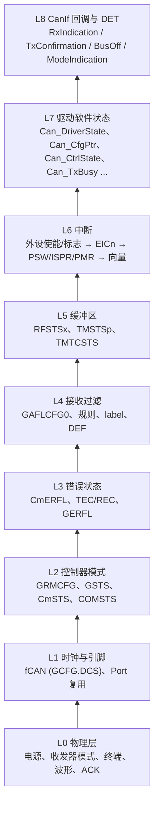

# Can Driver 调试：从示波器到 CanIf 回调的分层方法

> Prerequisite: [04 CAN 引脚与收发器](04-can-pin-transceiver.md)、[09](09-can-init-implementation.md)–[14](14-can-driver-from-scratch.md) 各章
> Next: [Part V — CanIf](../05-can-stack/01-canif.md)；集成层调试见 [08-integration/07 集成调试](../08-integration/07-integration-debugging.md)
> 对应规范: AUTOSAR SWS CAN Driver **R22-11**（DET 错误码 p.52–53；回调 p.88）；HW-E R01UH0585EJ0120 Rev.1.20（Section 17 RS-CANFD；INTC p.264–290）
> 对应源码: 本项目 `docs/rh850-hardware-handoff.md` §11（冷启动读回点）、`docs/hardware-review.md`（已知误区）；教学驱动见 [14 章](14-can-driver-from-scratch.md)

---

## 1. 本章目标

1. 建立一个**分层**的 CAN 调试模型：物理层 → 时钟/引脚 → 控制器模式 → 错误状态 → 接收过滤 → 缓冲区 → 中断 → 驱动软件状态 → CanIf 回调。每一层都有"看什么、正常值是什么、不正常说明什么"。
2. 掌握一份 RS-CANFD 寄存器检查清单（地址、有效位、期望值），可以直接在调试器的 watch 窗口里用。
3. 知道在哪里设断点、看哪些驱动变量，以及哪些操作会改变现场（不要在调试时做）。
4. 能把常见现象（收不到、发不出、`CAN_BUSY` 不停、中断风暴、bus-off 不恢复、偶发丢帧）快速定位到层。

---

## 2. 为什么需要分层

"CAN 不通"可能是二十种原因中的任何一种：收发器没上电、终端电阻缺失、波特率差了一倍、引脚 ALT 选错、controller 还在 reset、规则数为 0、RFE 没单独写、中断挂错通道、HRH 号对不上 CanIf……

如果从 CanIf 往下猜，你会花几天时间；如果从下往上**逐层证明"这一层没问题"**，通常一小时内就能定位。原则是：

> **每一层只用这一层的证据下结论；下层没证明正常之前，不要调试上层。**

这也是 `claude_plan.md` 中"Debug Mental Model"的 CAN 版本。

---

## 3. 在系统中的位置：九层模型



与上层的衔接：L8 之上是 CanIf → CanTp → PduR → Dcm，分别在 Part V、Part VI 和集成部分的调试章节展开。

---

## 4. AUTOSAR 视角：驱动能给你的诊断信息

AUTOSAR Can 驱动本身提供的"可观测性"很有限：

| 来源 | 内容 | 何时可用 |
|---|---|---|
| DET 开发错误（`SWS_Can_91019` p.52–53） | `CAN_E_PARAM_POINTER 0x01`、`PARAM_HANDLE 0x02`、`PARAM_DATA_LENGTH 0x03`、`PARAM_CONTROLLER 0x04`、`UNINIT 0x05`、`TRANSITION 0x06`、`PARAM_BAUDRATE 0x07`、`INIT_FAILED 0x09`、`PARAM_LPDU 0x0A` | `CanDevErrorDetect = TRUE` |
| DET 运行时错误（`91020` p.53） | `CAN_E_DATALOST 0x01` | 总是（`Det_ReportRuntimeError` 是必需接口，p.88） |
| 状态查询 API | `Can_GetControllerMode`、`Can_GetControllerErrorState`、Rx/Tx 错误计数器 | 运行时 |
| 回调 | `CanIf_ControllerBusOff`、`ModeIndication`、`RxIndication`、`TxConfirmation` | 运行时 |
| 安全事件（`91022/91023` p.55） | `CanIf_ErrorNotification`、`CanIf_ControllerErrorStatePassive` | `CanEnableSecurityEventReporting = TRUE` |

**调试建议**：开发阶段一定打开 `CanDevErrorDetect`，并在 `Det_ReportError` / `Det_ReportRuntimeError` 里设断点。一个 `CAN_E_PARAM_HANDLE` 断点能省下半天的寄存器排查。

---

## 5. 核心数据：寄存器检查清单（Classical 接口模式，CAN0）

[RH850 Hardware] 基址 `0xFFD2_0000`。FD 接口模式下部分偏移不同（HW-E p.916–919），先读 GRMCFG 确认模式再用本表。

| 层 | 寄存器 | 地址 | 有效位 / 期望（STARTED 空闲时） | HW-E |
|---|---|---|---|---|
| L2 | GRMCFG | `0xFFD2_04FC` | bit0 RCMC：0=Classical，1=FD | p.802 |
| L2 | CANFDMDR | `0xFFD2_8000` | bit0：只读模式确认 | handoff §4 |
| L1 | GCFG | `0xFFD2_0084` | bit4 DCS：0=clkc 40 MHz，1=clk_xincan 16 MHz | p.816–817 |
| L2 | GCTR | `0xFFD2_0088` | GMDC[1:0]=00，GSLPR=0 | p.819 |
| L2 | GSTS | `0xFFD2_008C` | [3:0]=0000b（RAM 初始化完成、operating） | p.821 |
| L3 | GERFL | `0xFFD2_0090` | DEF[0]、MES[1]、THLES[2]：期望 0 | p.823 |
| L1 | C0CFG | `0xFFD2_0000` | 与配置一致（例 `0x023E0003`：Classical、fCAN 40 MHz、500k、SJW=3 Tq） | p.803 |
| L2 | C0CTR | `0xFFD2_0004` | CHMDC=00；BOM[22:21]=按设计（例 01b）；`*IE` 按配置 | p.805 |
| L2/L3 | C0STS | `0xFFD2_0008` | [2:0]=000b；COMSTS[7]=1；EPSTS/BOSTS=0；TEC[31:24]、REC[23:16] 小 | p.810 |
| L3 | C0ERFL | `0xFFD2_000C` | bit14:0 期望 0（或只有偶发 ALF） | p.812 |
| L4 | GAFLCFG0 | `0xFFD2_009C` | RNC0[31:24] = 规则数 ≠ 0 | p.831 |
| L4 | GAFLECTR | `0xFFD2_0098` | AFLDAE[8]=0（写完后要关） | p.830 |
| L4 | GAFLID/M/P0/P1_j | `0xFFD2_0500 + 0x10j` 起 | 需先设 GAFLECTR.AFLPN 选页；读规则时注意别改写 | p.832–837 |
| L5 | RFCC0 | `0xFFD2_00B8` | RFE[0]=1；RFIE[1] 按配置；RFDC[10:8] ≠ 0 | p.844–845 |
| L5 | RFSTS0 | `0xFFD2_00D8` | RFEMP[0]=1（空闲）；RFMLT[2]=0；RFMC[15:8] | p.846 |
| L5 | RFPTR0 | `0xFFD2_0E04` | 非空时：DLC[31:28]、label[27:16] | p.850 |
| L5 | TMC0 / TMSTS0 | `0xFFD2_0250` / `0xFFD2_02D0` | **8 位**；空闲时 0x00 / 0x00 | p.878–881 |
| L5 | TMTRSTS0 / TMTCSTS0 | `0xFFD2_0350` / `0xFFD2_0370` | 位图：挂起请求 / 已完成未清 | p.890、p.894 |
| L6 | TMIEC0 | `0xFFD2_0390` | 使用中断确认的 TX buffer 位 = 1 | p.888 |
| L6 | RFISTS | `0xFFD2_0244` | RFxIF：哪个 RX FIFO 有中断请求 | p.875 |
| L6 | GTINTSTS0 | `0xFFD2_0460` | TSIFm/TAIFm/…：各通道 TX 类中断状态 | p.826–827 |
| L6 | EIC183 / 185 / 189 / 190 | `0xFFFF_B16E` / `B172` / `B17A` / `B17C` | EIMK[7]=0（已开）；EIP[3:0]；EIRF[12]；EICT[15]=1（电平） | p.265–268 |

**读寄存器会不会改变现场？** 本表中的寄存器，状态的改变都由**写**触发（W0C 标志写 0、RFPCTRx 写 0xFF 弹出、TMSTSp 写 0）；读 RFIDx 窗口不会弹出 FIFO（弹出只由 RFPCTRx 写入完成，HW-E p.848）。所以在调试器里**读**是安全的。但要避免：在 watch 窗口里"修改"这些寄存器、或让调试器脚本写入它们。

---

## 6. 初始化阶段的调试：黄金快照

[Real Project Consideration] 最有效的初始化调试方法是"黄金快照"：

1. 在 `Can_Init` 返回处（或 MCAL 的 Init 返回处）停下，按第 5 节清单把所有寄存器值导出成一个文本文件。
2. 在 `CanIf_ControllerModeIndication(…, STARTED)` 处再导出一次。
3. 一旦系统能正常通信，保存这两份作为**黄金快照**。
4. 以后任何"通信不起来"的问题，先导出同样两份快照与黄金快照 diff。

动态位（RFMC、TEC/REC、时间戳）要用掩码排除；GERFL 等寄存器的保留位读值未定义，比较时也要用有效位掩码（handoff §5）。

`docs/rh850-hardware-handoff.md` §11 给出了冷启动的"预期关键读回"，可作为第一版黄金快照的参考（注意它针对的是其中描述的参考配置，不一定是你的项目配置）。

---

## 7. Runtime Flow：逐层调试步骤

### L0 物理层

| 检查 | 方法 | 正常 | 异常含义 |
|---|---|---|---|
| 终端电阻 | 断电，万用表量 CANH–CANL | 两端各 120 Ω 时约 60 Ω（通用 CAN 布线惯例） | 120 Ω：只有一端；开路：都没有；≈0：短路 |
| 收发器模式 | 量 STB/EN 引脚电平，对照收发器手册 | Normal 模式 | Standby：能收（部分收发器）但不能发 |
| 隐性/显性电平 | 示波器差分探头或两路探头 | 隐性差分≈0 V，显性差分约 2 V 量级（典型值，以收发器手册为准） | 差分始终为 0：没驱动；始终显性：总线锁死（对应 CmERFL.BLF） |
| 位宽 | 示波器测最窄脉冲 | 500 kbit/s → 2 µs | 4 µs/1 µs：波特率差一倍，查 L1 |
| ACK | 看帧尾 ACK slot 是否被拉成显性 | 有其他节点时为显性 | 单节点测试必然无 ACK → AERR、TEC 增长、无限重发（第 13 章 12 节） |
| TX 引脚 | 在 MCU TX 引脚（收发器 TXD）上看是否有波形 | 发送时有 | 没有：Port 复用或 controller 模式问题（L1/L2） |
| RX 引脚 | 在 MCU RX 引脚（收发器 RXD）上看 | 总线有帧时有波形 | 没有：收发器没上电/没处于正确模式 |

总线分析仪（CANoe、PCAN 等）能直接显示 error frame 和 ACK 情况，比示波器更快；示波器用来确认电气和位宽。

### L1 时钟与引脚

- **fCAN**：GCFG.DCS=0 → 40 MHz（clkc = CLK_LSB），=1 → 16 MHz（clk_xincan = MainOSC）（HW-E p.791、p.817）。**pclk = 80 MHz 不是 fCAN**——这是旧文档中真实出现过的错误（`docs/hardware-review.md`）。用 C0CFG 反算：`bitrate = fCAN / (divider × (1 + TSEG1 + TSEG2))`，与示波器测得的位宽比较。
- **引脚**：Port 的 PMC/PFC/PFCE/PFCAE/PM/PIPC 配置决定 TX/RX 是否连到 RS-CANFD。具体端口号和 ALT 号见 [04 引脚章节](04-can-pin-transceiver.md)；不要凭记忆写 ALT 号。
- **可选**：用时钟输出功能（CKSCnC/CLKDnDIV，HW-E p.472–476）把 CLK_LSB 分频输出到引脚，用示波器确认时钟频率（研究笔记 04 §4.3）。

### L2 控制器模式

| GSTS[3:0] | 含义 | 处理 |
|---|---|---|
| 1xxx | GRAMINIT=1：CAN RAM 初始化未完成 | 等；如果一直为 1，检查时钟 |
| x1x1 | global stop | `Can_Init` 未执行或很早就失败 |
| 0001 | global reset | `Can_Init` 未走到 global operating |
| 0000 | global operating | 正常 |

| CmSTS[2:0] / COMSTS | 含义 | 处理 |
|---|---|---|
| 101b | channel stop | 该通道未在 `Can_Init` 中被配置（或配置的是别的通道） |
| 001b | channel reset = STOPPED | 还没 `Can_SetControllerMode(STARTED)`，或 bus-off 后进入 reset |
| 010b | channel halt | BOM=01b 下 bus-off 后、驱动还没处理；或测试模式 |
| 000b，COMSTS=0 | communication，但还没检测到 11 个隐性位 | 总线一直显性/RX 引脚无信号 → 回到 L0/L1 |
| 000b，COMSTS=1 | 可以通信 | 正常 |

### L3 错误状态

- **先保存再清**：CmERFL 是锁存的历史记录，进入 channel reset 会被清零（Table 17.180 p.1070）。
- 读 C0STS 的 TEC/REC：TEC 高 → 发送有问题（ACK、位错误）；REC 高 → 接收有问题（位时间、噪声）。
- CmERFL 的错误类型（HW-E p.812–814）：

| 主要标志 | 最常见原因 |
|---|---|
| AERR（ACK 错误） | 总线上没有其他节点，或其他节点波特率不同 |
| B0ERR / B1ERR（位错误） | 收发器方向/环路问题；总线短路；位时间严重不匹配 |
| SERR / FERR / CERR（填充/格式/CRC） | 波特率或采样点不匹配；噪声；终端问题 |
| BLF（总线锁定） | 32 个连续显性位：总线短路到显性或某节点卡死 |
| ALF（仲裁丢失） | 正常现象，不是错误 |

- ERRD=0 时 bit14–8 只记录**第一次**错误事件的类型（p.807）；需要看全部类型时临时设 ERRD=1（只能在 reset/halt 中改）。
- GERFL：DEF=1 表示有帧因 DLC 过滤被丢弃（L4）；MES=1 表示某个 FIFO 丢帧（看 RFSTSx.RFMLT / FMSTS）。

### L4 接收过滤

| 检查 | 期望 | 说明 |
|---|---|---|
| GAFLCFG0.RNCm | ≠ 0 | 规则数为 0 时什么都收不到（HW-E p.1072） |
| 规则内容 | 设 GAFLECTR.AFLPN 选页后读 GAFLIDj/Mj/P0_j/P1_j | 规则表"can be read regardless of the value of" AFLDAE，但 AFLDAE 只能在 global reset 中置 1（HW-E p.830）。调试时只改 AFLPN 选页、**不要**置 AFLDAE；读完把 AFLPN 恢复原值 |
| mask 语义 | GAFLM 的 1 = 比较 | 全 0 是通配；`0xC00007FF` 是标准数据帧精确匹配 |
| 规则顺序 | 精确规则在宽松规则前 | 先命中的规则决定目的地和 label（p.1073） |
| GAFLP1_j | 指向配置的 RX FIFO | 指错 FIFO：帧进了没人读的 FIFO |
| GCFG.DCE + GAFLP0_j.DLC | DCE=0 或 DLC 阈值合理 | 不满足时帧被丢弃并置 GERFL.DEF（p.1074） |
| RFPTRx.label | 等于 CanIf 期望的 HRH | label 错 → CanIf 找不到 L-PDU |

### L5 缓冲区

| 现象 | 寄存器 | 判断 |
|---|---|---|
| RFMC 持续增长，从不减少 | RFSTSx | 没有人在读这个 FIFO：中断没到（L6）或轮询没调度（L7） |
| RFMLT=1 | RFSTSx / FMSTS | 读得太慢：FIFO 太浅、ISR 被阻塞、轮询周期太长 |
| TMSTSp.TMTRM 一直 1 | TMSTSp、TMTRSTSy | 帧发不出去：没有 ACK（L0/L3）、controller 不在 communication（L2） |
| TMSTSp.TMTRF=10b 一直不清 | TMSTSp、TMTCSTSy | 发送完成没人处理：TX 中断未到或 `Can_MainFunction_Write` 未调度 → HTH 一直 busy → `CAN_BUSY` |
| TMCp 写入后读回 0 | TMCp、CmSTS | controller 在 channel reset（TMC 只能在 communication/halt 写，p.878） |

### L6 中断

逐级检查，任何一级断了中断都到不了 ISR：

```text
① 外设使能位   RFCCx.RFIE / TMIECy.TMIEp / CmCTR.*IE / GCTR.*IE
② 外设请求标志 RFSTSx.RFIF / TMSTSp.TMTRF / CmERFL.* / GERFL.*
③ INTC        EICn.EIRF=1 ? EIMK=0 ? EIP ?
④ CPU         PSW.ID=0 ?  ISPR 中是否有同级或更高优先级位为 1 ?  PMR 是否屏蔽该级 ?
⑤ 向量        EITB=0：直接分支偏移；EITB=1：INTBP + 4n 处的地址是否指向正确 ISR
⑥ OS          该 ISR 是否在 OS 配置中声明为 Category 2、中断源号是否正确
```

依据：HW-E p.198、p.210–211、p.267–268、p.281。常见断点：

- 有 RFIF、没有 EIRF：通道号错（**RX FIFO 是 EI190，不是 EI184**）。
- 有 EIRF、EIMK=0、但不进 ISR：ISPR 中某个位没清（另一个 ISR 没有正常 EIRET），或 PSW.ID=1（处于临界区太久）。
- 进了 ISR 又立刻再进：外设标志没清（中断风暴，第 12 章 11 节）。

### L7 驱动软件状态

教学驱动（第 14 章）中值得放进 watch 窗口的变量；真实 MCAL 的变量名不同，但一定有等价物：

| 变量 | 正常值 | 异常含义 |
|---|---|---|
| `Can_DriverState` | `CAN_DRV_READY` | UNINIT：Init 失败或未调用；如果它在 `.bss` 外的未初始化段里，上电后可能是随机值 |
| `Can_CfgPtr` | `&Can_Config0` | NULL：Init 失败；指向别处：用了错误的配置集 |
| `Can_CtrlState[i]` | STARTED | STOPPED：未启动或 bus-off 后未恢复；与 CmSTS 不一致：状态同步 bug |
| `Can_CtrlPending[i]` | `CAN_CS_UNINIT`（无挂起） | 长期挂起：模式切换在硬件上没完成 |
| `Can_TxBusy[p]` | 发送间隙为 FALSE | 长期 TRUE：确认路径断了（对照 TMSTSp） |
| `Can_TxPduId[p]` | 最近一次的句柄 | 与 CanIf 期望不符：句柄保存时机 bug |
| `Can_IrqDisableCnt[i]` | 0 | >0 且长期不变：`Disable/Enable` 不配对，中断被永久屏蔽 |

建议在开发版驱动里加几个**计数器**（不属于 AUTOSAR 规范，纯调试用）：RX 帧数、TX 确认数、`CAN_BUSY` 次数、`CAN_E_DATALOST` 次数、bus-off 次数、每个 ISR 的进入次数。它们比断点更适合观察"偶发"问题。

### L8 CanIf 回调与 DET

| 回调 | 没被调用 → 看哪层 | 被调用但上层不处理 → 看什么 |
|---|---|---|
| `CanIf_RxIndication` | L4–L7 | `Mailbox->Hoh`、`CanId`（扩展帧 MSB）、`ControllerId` 是否与 CanIf 配置一致 |
| `CanIf_TxConfirmation` | L5–L7 | 句柄是否是 CanIf 发出的那个 |
| `CanIf_ControllerModeIndication` | L2、`Can_MainFunction_Mode` 调度 | CanIf 的 controller ID 映射 |
| `CanIf_ControllerBusOff` | L3、BOEIE/轮询配置 | CanSM 是否收到并开始恢复 |

---

## 8. RH850 Hardware Mapping：断点表

[Real Project Consideration] 下表中的函数名是第 14 章教学驱动的名字；真实 MCAL 中找对应函数。

| 断点位置 | 想确认什么 | 命中时看什么 |
|---|---|---|
| `Det_ReportError` / `Det_ReportRuntimeError` | 任何开发/运行时错误 | ModuleId=80（Can）、ApiId、ErrorId；调用栈 |
| `Can_Init` 返回前 | 初始化完成 | 第 5 节清单 → 黄金快照 |
| `Can_SetControllerMode` 入口 | 谁、何时请求了什么模式 | Controller、Transition、调用栈（CanSM？） |
| `Can_FinishTransition` | 模式切换完成 | CmSTS、上下文（任务还是 MainFunction） |
| `Can_Write` 中 `return CAN_BUSY` | 为什么忙 | `Can_TxBusy[p]`、TMSTSp |
| `Can_Wr8(RSCAN_TMC(p), …)` | 帧被真正提交 | TMID/TMPTR/TMDF、CmSTS |
| `Can_Internal_TxProcess` 中回调前 | 发送完成 | TMSTSp 原值、句柄 |
| `Can_Internal_RxProcess` 中回调前 | 收到帧 | RFID/RFPTR 原值、label、`mailbox` |
| `Can_Internal_RxProcess` 的 RFMLT 分支 | 丢帧 | RFMC、时间、上一次 ISR 的间隔 |
| `Can_Internal_BusOffProcess` 入口 | bus-off | **先**保存 CmERFL、C0STS（TEC/REC 在 BOM=01b 下已清零） |
| ISR 入口（`Can_Isr_*`） | 中断到达 | 外设标志、EIC、触发频率 |
| `CanIf_RxIndication` 入口 | 进入上层 | 参数与 CanIf 配置比对 |

**断点的副作用**：在 RX ISR 里长时间停住，总线上的帧会继续进入 FIFO，恢复运行时可能已经 RFMLT；在 bus-off 处理中停住，CanSM 的计时器仍在别的上下文里跑（取决于调试器是否停整个芯片）。对时序敏感的问题，用计数器/trace 代替断点。

---

## 9. openAUTOSAR 对照

openAUTOSAR 没有 Can 驱动，但它的 CanIf 有两个"调试教材"：

- `CanIf.c:476-481`：`CAN_BUSY` 直接转为 `E_NOT_OK`（无 TX 缓冲）——如果你在真实项目中看到上层"偶发发送失败"而 Can 层看到的是 `CAN_BUSY`，先查 CanIf 的 TX buffer 配置。
- `CanIf.c:820`：RxIndication 中某分支 `continue` 前没有 `entry++` 会死循环（研究笔记 03）——提醒：**ISR 上下文的回调死循环表现为"整个 ECU 卡死在 CAN ISR"**，看起来像中断风暴，但外设标志其实已经清了。区分方法：看 ISR 进入计数器是否在增长（风暴）还是停在 1（死循环）。

---

## 10. 当前教学项目对照

- `docs/rh850-hardware-handoff.md` §11 的冷启动步骤和"预期关键读回"是第 6 节黄金快照的起点。
- `docs/hardware-review.md` 汇总了旧文档中的错误，几乎每一条都是真实的调试陷阱：pclk≠fCAN、EI190 vs EI184、mask 1=比较、RFE 单独写、TMC/TMSTS 8 位、W0C 不能读改写、CAN 的 EIRF 不能软件清（与 OSTM 不同）、Classical 与 FD 窗口重叠。
- 第 14 章的 mock 寄存器文件把其中大部分变成了主机上的断言——在上板之前先让主机测试通过，可以排除一大类 L5/L6/L7 问题。

---

## 11. Code Walkthrough：症状 → 层 速查表

| 症状 | 最可能的层 | 第一步 |
|---|---|---|
| 示波器上看不到任何波形（本节点发送时） | L0/L1/L2 | MCU TX 引脚有没有波形？有 → 收发器；没有 → Port 复用、CmSTS |
| 帧在总线上不停重发 | L0/L3 | 有没有别的节点 ACK？AERR？波特率一致？ |
| 本节点发的帧对方收到了，但本节点收不到任何帧 | L4/L5/L6 | GAFLCFG0、RFCC0.RFE、RFMC 是否增长 |
| RFMC 增长但 CanIf 没回调 | L6/L7 | EIC190、ISR 配置；或轮询 MainFunction 未调度 |
| CanIf 回调了但 CanTp/Dcm 没反应 | L8 → Part V | Hoh、CanId、CanIf RxPdu 配置 |
| `Can_Write` 总是 `CAN_BUSY` | L5/L6/L7 | TMSTSp.TMTRF 是否停在 10b；TX 中断/轮询 |
| `Can_Write` 返回 E_OK，但没有 TxConfirmation | L2/L5 | CmSTS 是否 communication；TMTRM 是否一直 1 |
| ECU 卡死，调试器停在 CAN ISR | L6 | 外设标志在 ISR 退出时是否已清；ISR 进入计数 |
| bus-off 后永不恢复 | L3/L8 | `CanIf_ControllerBusOff` 是否被调用；CanSM 是否请求 STARTED；BLF |
| bus-off 后立即恢复，不符合恢复时间要求 | L2 | CmCTR.BOM 是否为 00b |
| 偶发丢帧 | L5/L6 | RFMLT、`CAN_E_DATALOST`、ISR 被阻塞时间 |
| 偶发确认错 PDU | L7 | 句柄保存顺序、EA 范围 |
| 高负载时通信正常，空闲时第一帧延迟一帧 | L5/L6 | RX 处理中 RFIF 的清除时机（第 11 章 7.2） |
| 换了 FD 模式后一切错乱 | L2/L4/L5 | GRMCFG；是否还在用 Classical 偏移（+0x500 在 FD 模式是 C0DCFG） |

---

## 12. Debug 方法：调试纪律

1. **一次只改一个变量**。改了波特率又改了终端，就不知道是哪个起作用。
2. **记录"改之前"的现场**。尤其是 CmERFL、TEC/REC——它们会被 reset 清掉。
3. **区分"状态"与"事件"**：BOSTS/EPSTS/COMSTS 是状态，BOEF/EPF/AERR 是事件（锁存）。看历史用事件，看现在用状态。
4. **不要在调试中写 W0C 寄存器**，除非你明确要清某个标志。调试器的"刷新"不会写，但"编辑值"会。
5. **用两个独立工具交叉验证**：调试器读到的寄存器 + 总线分析仪看到的帧。两者矛盾时，通常是你对寄存器的理解（偏移/模式）错了。
6. **最小系统先行**：先用轮询、单 controller、单规则、单 HTH 把收发跑通（handoff §11 第 12 步的建议），再逐步打开中断、多规则、多 HOH、FD。

---

## 13. 常见问题

1. **"调试器能看到 `RSCAN0C0STS` 这样的名字吗？"** 取决于调试器是否加载了器件描述文件（SVD 类文件）。没有的话就用第 5 节的地址手动加 watch。
2. **"为什么停在断点时 COMSTS 变成 0？"** 如果调试器停住时总线上有错误（比如对方节点因为本节点不 ACK 而报错），状态会变化。CAN 控制器在 CPU 停止时仍在运行（具体取决于调试器的外设冻结设置，需看调试器文档）。
3. **"CANoe 显示 Error Frame，但 C0ERFL 是 0？"** C0ERFL 只在**本节点**检测到错误时置位；别的节点发的错误帧，本节点也会看到（作为接收错误），但如果本节点当时在 channel reset，就什么都不会记录。先确认 CmSTS 模式。
4. **"总线分析仪能收到本节点的帧，但对方 ECU 不响应"** → 这已经离开了 Can 驱动的范围：检查 ID、DLC、填充字节、诊断寻址（物理/功能）、对方的会话状态。见 Part VI/VIII。

---

## 14. 实验

1. **故障注入练习**（目标板或"纸上推演"）：对下面每个故障，写出你预期在第 5 节清单中看到的寄存器值，再实际验证：(a) 拔掉一端终端电阻；(b) GCFG.DCS 改成 1 但 CmCFG 不变；(c) GAFLCFG0 写 0；(d) RX ISR 挂到 EI184；(e) 删掉 `Can_Internal_TxProcess` 中清 TMSTSp 的那一行；(f) BOM 改为 00b。
2. **黄金快照**：在主机 mock 上实现"快照导出"函数（遍历第 5 节寄存器、打印），对 `Can_Init` 后和 STARTED 后各导出一次。
3. **计数器**：给第 14 章驱动加第 7 节 L7 建议的调试计数器，并在测试中断言它们的值。

---

## 15. 对未来真实项目的意义

- 真实项目中你面对的是**供应商 MCAL + 生成配置 + OS + 多个上层模块**。分层方法让你能在不读 MCAL 源码的情况下，用寄存器和回调证明问题在哪一层，然后带着证据去找对的人（硬件工程师、MCAL 供应商、配置负责人、上层模块负责人）。
- 第 5 节的清单和第 8 节的断点表可以直接变成项目的"CAN 集成检查表"；第 11 节的速查表可以放进团队 wiki。
- 研究笔记 04 §10 列出了真实项目必须核实的清单（芯片型号、接口模式、fCAN、引脚、HOH 映射、中断检测方式、BOM 策略、guard 配置等）——调试时遇到"按手册应该没问题"的情况，回到那张清单逐项确认。
- 目标工程背景（RTA-CAR、RTA-OS、GHS、Renesas P1M MCAL）只能作为"可能的真实环境"；其调试器、器件描述文件、MCAL 变量名都**需在真实项目环境中确认**。

---

## 16. 本章总结

- CAN 调试按 L0–L8 九层自下而上进行，每层用本层证据下结论。
- 关键寄存器：GRMCFG、GCFG、GSTS、CmSTS（模式/COMSTS/TEC/REC/EPSTS/BOSTS）、CmERFL、GERFL、GAFLCFG0 与规则、RFCCx/RFSTSx、TMSTSp、EICn。
- 读这些寄存器是安全的；写（W0C、RFPCTR、TMSTS）会改变现场。错误证据会被 channel reset 清掉，必须先保存。
- 断点用于定位"是否发生"，计数器/trace 用于观察"偶发"和时序问题。
- 黄金快照 + 分层速查表是把调试经验变成团队资产的最简单方式。

---

## 17. 下一章

Part IV（CAN MCAL）到此结束。Can 驱动把一帧交给了 `CanIf_RxIndication`，也从 `Can_Write` 接收 CanIf 的发送请求。下一部分从 CanIf 开始向上：[Part V — CanIf](../05-can-stack/01-canif.md)，讲 L-PDU 句柄、HRH 软件过滤、TX 缓冲（`CAN_BUSY` 的去处）以及 controller 模式在 CanIf/CanSM 中的管理。
