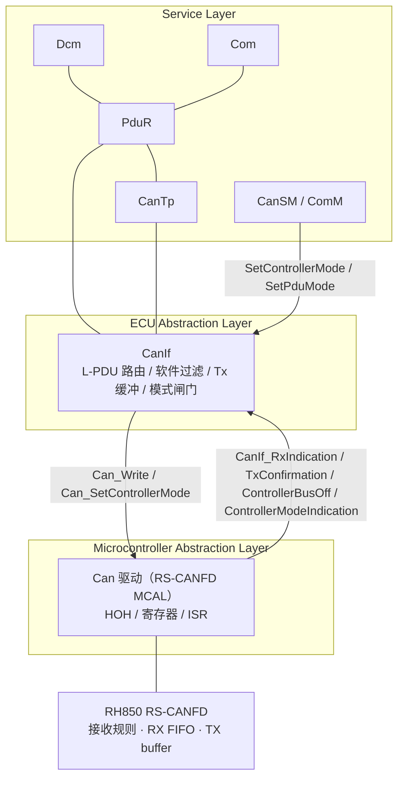
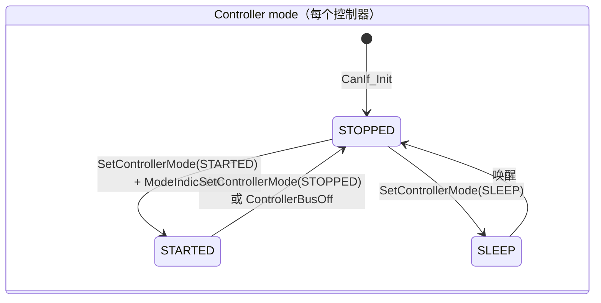
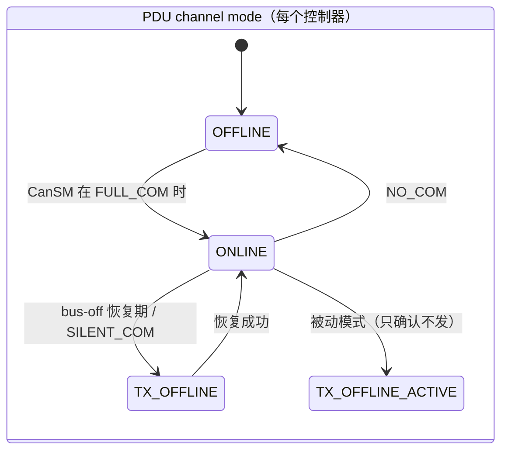
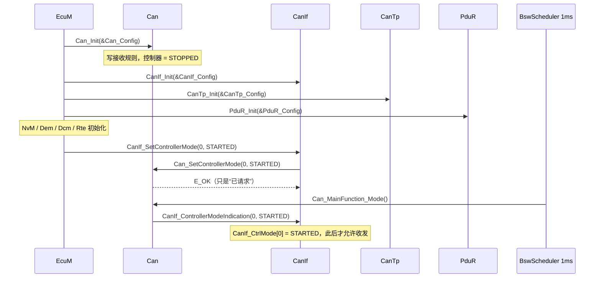
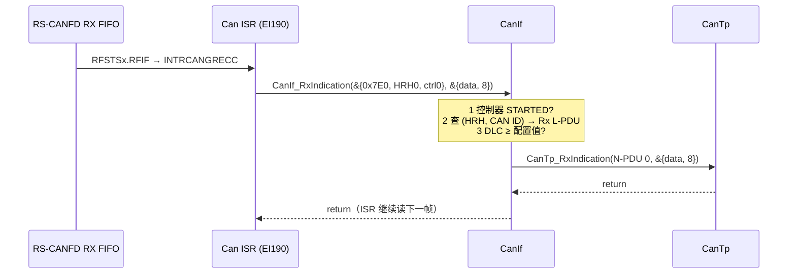
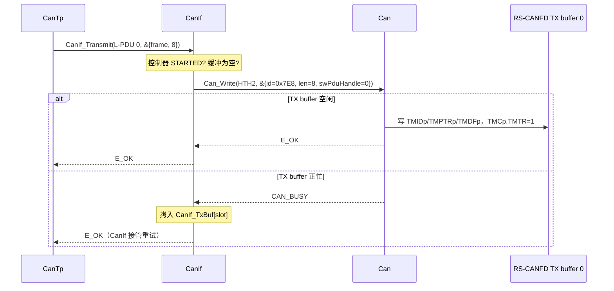

# CanIf：硬件无关的 CAN 接口层——从 HRH/HTH 到 L-PDU

> Prerequisite: [04-can-mcal/07 HOH / HRH / HTH](../04-can-mcal/07-hoh-hrh-hth.md)、[04-can-mcal/10 Can_Write 实现](../04-can-mcal/10-can-write-implementation.md)、[04-can-mcal/11 CAN RX 实现](../04-can-mcal/11-can-rx-implementation.md)、[04-can-mcal/05 CAN 中断](../04-can-mcal/05-can-interrupt.md)、[04-can-mcal/13 错误与 Bus-off](../04-can-mcal/13-can-error-busoff.md)
> Next: [02-canif-configuration.md](02-canif-configuration.md)
> 对应规范: AUTOSAR CP **R22-11** SWS CAN Driver（`AUTOSAR_SWS_CANDriver.pdf`）p.14（Can 只被 CanIf 访问，SRS_SPAL_12092）、p.22 脚注 3（片外控制器时 Can 驱动归 ECU Abstraction）、p.23（`SWS_Can_00058`）、p.45（`SWS_Can_00276`、`SWS_Can_00016`）、p.48（`SWS_Can_00279`）、p.51（`CAN_BUSY` 由 CanIf 排队）、p.59（`Can_HwType`、`CAN_BUSY`）、p.88（`SWS_Can_00234` 必需回调）。**本仓库没有 CanIf SWS**：凡 CanIf 自身的 API 签名、SWS ID、配置参数名，均按公认 R4.x 形态描述，需以真实项目所用 release 的 CanIf SWS 确认。
> 对应源码: 本项目 `examples/uds_diag_demo/ecual/CanIf.h`、`CanIf_Cbk.h`、`CanIf.c`、`CanIf_Cfg.c`；openAUTOSAR（R3.1.5 风格）`communication/CAN/CanIf/src/CanIf.c:226`（`CanIf_SetControllerMode`）、`:424`（`CanIf_Transmit`）、`:545`（`CanIf_SetPduMode`）、`:743`（`CanIf_TxConfirmation`）、`:764`（`CanIf_RxIndication`）、`:919`（`CanIf_ControllerBusOff`）

---

## 1. 本章目标

读完本章，你应该能够回答：

1. 既然 Can 驱动已经能收发帧，为什么 AUTOSAR 还要在它上面再放一层 CanIf？CanIf **具体**解决了哪些 Can 驱动解决不了的问题？
2. 一帧 0x7E0 从 RS-CANFD RX FIFO 出来以后，CanIf 凭什么知道它该交给 CanTp，而不是 Com 或 CanNm？
3. `Can_Write` 返回 `CAN_BUSY` 时，谁负责“稍后再发”？如果没人负责，诊断响应会怎样？
4. CanIf 的 **controller mode** 和 **PDU channel mode** 是两套什么状态？各自由谁切换？
5. **为什么 Can 驱动是 MCAL，而 CanIf 不是**——用 CAN SWS 原文能给出的证据是什么？
6. 在教学项目 `examples/uds_diag_demo/` 里，CanIf 的每个 API 在哪一行、在什么上下文（ISR / MainFunction）中被调用？

---

## 2. 为什么需要 CanIf？

`[Conceptual]` 先做一个思想实验：如果 CanTp 直接调用 `Can_Write`、Can 驱动直接调用 `CanTp_RxIndication`，会出什么问题？

| 问题 | 没有 CanIf 时 | 有 CanIf 时 |
|---|---|---|
| **句柄空间不同** | Can 驱动只认识 HOH（硬件对象句柄，例如 HRH0、HTH2），CanTp 只认识 N-PDU。两边数字毫无关系，必须有人做映射 | CanIf 定义 **L-PDU 句柄**，并持有 `(HRH, CAN ID) → L-PDU → 上层 PduId` 和 `L-PDU → (HTH, CAN ID)` 两张表 |
| **一个 HRH 收多个 ID** | BASIC 类型的 HRH（例如一个 RX FIFO）可能收进 0x7E0、0x7DF、0x100……，Can 驱动不关心语义 | CanIf 做 **软件过滤 + ID 分发**：同一 HRH 上的不同 CAN ID 分给不同上层 |
| **上层多样** | Can 驱动要知道 CanTp、Com(PduR)、CanNm、J1939Tp、CDD 的回调名——每加一个上层都要改 MCAL | Can 驱动**只认 CanIf**（`SWS_Can_00058`，p.23）；“这帧给谁”是 CanIf 配置 |
| **发送资源冲突** | HTH 正忙时 `Can_Write` 返回 `CAN_BUSY`，上层各自重试，重试策略分散 | CanIf 集中 **TX buffering**（CAN SWS p.51：“In case of CAN_BUSY the CanIf module queues that request”） |
| **多个 Can 驱动** | 一个 ECU 可能有片上 RS-CANFD + 片外 SPI CAN 控制器，两个驱动 API 名都带厂商前缀（`SWS_Can_00284/00385/00386`） | CanIf 把多个驱动统一成一个接口，上层不感知 |
| **通信模式** | 谁决定“现在可以发”？Bus-off 后谁停发？ | CanIf 维护 **controller mode** 与 **PDU channel mode**，由 CanSM/ComM 驱动，CanIf 在 `CanIf_Transmit` 里做闸门 |

一句话：**Can 驱动回答“怎样把 8 个字节放进 RS-CANFD 的 TX buffer”，CanIf 回答“这 8 个字节属于哪个通信对象、该交给谁、现在允不允许发”。**

---

## 3. 在系统中的位置



注意两点：

- Com 的 I-PDU 是 **PduR → CanIf**（IF 路径，单帧）；诊断请求是 **CanIf → CanTp → PduR → Dcm**（TP 路径，多帧）。CanIf 同时服务这两类上层，配置里用 “UL 类型” 区分（见 [02 章](02-canif-configuration.md)）。
- 箭头方向说明**谁调用谁**：向下是请求（`CanIf_Transmit`、`Can_Write`），向上是回调（`CanIf_RxIndication`、`CanIf_TxConfirmation`）。回调可以发生在 ISR 里，也可以发生在 `Can_MainFunction_Read/Write` 里——CanIf 两种都必须支持（CAN SWS p.50–51）。

### 3.1 为什么 Can 驱动是 MCAL，而 CanIf 不是

`[AUTOSAR Standard]` 本仓库没有 CanIf SWS 和 Layered Architecture 文档，但 CAN Driver SWS R22-11 本身给出了足够的证据：

1. **访问硬件 vs 硬件无关**：p.14 “The Can module is part of the lowest layer, performs the hardware access and offers a hardware independent API to the upper layer.” 访问寄存器是 MCAL 的定义特征；CanIf 从不访问寄存器。
2. **只有 CanIf 能调用 Can**：p.14（SRS_SPAL_12092）与 `SWS_Can_00058`（p.23）——Can 驱动只把 CanIf 当作请求来源和通知目的地；p.89 “The Can module always reports to CanIf module”。
3. **层次由“是否直接访问片上外设”决定，而不是模块名**：p.22 脚注 3——若使用片外 CAN 控制器，“the CAN driver is not any more part of the µC abstraction layer but put part of the ECU abstraction layer”。反过来说：CanIf 的职责（路由、过滤、缓冲、模式）与具体是哪块芯片无关，所以它在 ECU Abstraction Layer。
4. **片上控制器驱动不得使用其它驱动**：`SWS_Can_00238`（p.22）。CanIf 则可以面对多个 Can 驱动、甚至 CanTrcv。

> `[Real Project Consideration]` “CanIf 属于 ECU Abstraction Layer” 这一结论，在本仓库只能由上述 CAN SWS 文字间接佐证；正式依据是 CanIf SWS 与 `AUTOSAR_EXP_LayeredSoftwareArchitecture`，进入真实项目后应在对应 release 文档中确认。

**换 MCU 时的后果**：把 RH850 换成另一家 MCU，Can 驱动必须整体替换（寄存器完全不同），而 CanIf 只需要重新生成配置（HOH 编号可能变）。这正是 [README §7](../../examples/uds_diag_demo/README.md) 中“只有 `mcal/` 和 `sim/` 需要替换，`ecual/` 一行都不用改”的原因。

---

## 4. AUTOSAR 如何定义？

### 4.1 CAN SWS 对 CanIf 的要求（本仓库可引用的部分）

`[AUTOSAR Standard]` CAN SWS R22-11 `SWS_Can_00234`（p.88）列出 Can 驱动**必需**调用的 CanIf 回调：

| 回调（在 `CanIf_Can.h` 中声明） | Can 何时调用 | 上下文 | CAN SWS 出处 |
|---|---|---|---|
| `CanIf_RxIndication(Mailbox, PduInfoPtr)` | 收到一帧并通过硬件过滤 | RX ISR 或 `Can_MainFunction_Read` | `SWS_Can_00279` p.48、`00396` |
| `CanIf_TxConfirmation(CanTxPduId)` | 帧已成功发到总线；参数是 `Can_Write` 时传入的 `swPduHandle` | TX ISR 或 `Can_MainFunction_Write` | `SWS_Can_00016` p.45、`00276` |
| `CanIf_ControllerBusOff(ControllerId)` | 控制器进入 bus-off 并已切到 STOPPED | 错误 ISR 或 `Can_MainFunction_BusOff` | `SWS_Can_00020` p.42 |
| `CanIf_ControllerModeIndication(ControllerId, ControllerMode)` | 异步模式切换真正完成 | `Can_SetControllerMode` 内或 `Can_MainFunction_Mode` | p.37–40 |

`Can_HwType`（p.59，`SWS_CAN_00496`）是 RX 回调的 “Mailbox” 参数：`{ CanId, Hoh, ControllerId }`——注意 `ControllerId` 是 **CanIf 抽象的控制器号**，不是 RS-CANFD 的物理通道号。

### 4.2 CanIf 自身的 API（R4.x 公认形态）

`[Conceptual]` 以下签名**本仓库无 SWS 依据**，按公认 R4.x 形态列出，用于建立 mental model：

| API | 谁调用 | 何时 | 同步/异步 | 出错时 ECU 会怎样 |
|---|---|---|---|---|
| `void CanIf_Init(const CanIf_ConfigType*)` | EcuM / BswM 初始化列表 | `Can_Init` 之后、CanTp/PduR 之前 | 同步 | 未初始化时所有 API 报 DET `CANIF_E_UNINIT`，帧全部丢弃 |
| `Std_ReturnType CanIf_SetControllerMode(uint8 ControllerId, Can_ControllerStateType)` | CanSM（经 ComM 请求 FULL_COM） | 启动通信、bus-off 恢复、休眠 | 异步：只是把请求转给 `Can_SetControllerMode`，完成由 `CanIf_ControllerModeIndication` 告知 | 控制器一直 STOPPED → `CanIf_Transmit` 拒发、收不到帧 |
| `Std_ReturnType CanIf_SetPduMode(uint8 ControllerId, CanIf_PduModeType)` | CanSM | 控制器 STARTED 之后切 ONLINE；bus-off 时切 TX_OFFLINE | 同步 | 停在 OFFLINE → 控制器在线但应用 PDU 不收不发（常见“能 ACK、不响应”现象） |
| `Std_ReturnType CanIf_Transmit(PduIdType TxPduId, const PduInfoType*)` | CanTp、PduR（Com）、CanNm | 上层要发一帧 | 同步：返回 E_OK 表示“已交给硬件或已进 CanIf 缓冲” | E_NOT_OK → 上层（CanTp）中止本次传输 |
| `CanIf_RxIndication` / `CanIf_TxConfirmation` / `CanIf_ControllerBusOff` / `CanIf_ControllerModeIndication` | Can 驱动 | 见 4.1 | 回调 | — |
| `CanIf_TriggerTransmit`（可选） | Can 驱动 | `Can_PduType.sdu == NULL` 的 trigger transmit | 回调 | — |

> `[Real Project Consideration]` 版本差异很大：R3.x 的 `CanIf_RxIndication` 是四参数 `(Hrh, CanId, CanDlc, CanSduPtr)`（openAUTOSAR 即是），R4.2 起改为 `(const Can_HwType* Mailbox, const PduInfoType* PduInfoPtr)`；`CanIf_SetControllerMode` 的模式类型在 R4.3 由 `CanIf_ControllerModeType` 改为 `Can_ControllerStateType`；截图中的目标工程使用 Renesas P1M MCAL（AR 4.2.2 API），其回调形态需在真实项目中逐一核对。

### 4.3 两套模式

`[Conceptual]` CanIf 内部同时维护两套状态（R4.x 语义）：





| 模式 | 控制什么 | 谁改 | 在哪里生效 |
|---|---|---|---|
| Controller mode | 硬件控制器是否参与总线 | CanSM → `CanIf_SetControllerMode` → `Can_SetControllerMode`；Can 驱动通过 `CanIf_ControllerModeIndication` 回报 | 真正生效在 RS-CANFD `CmCTR.CHMDC` / `CmSTS`（见 [04-can-mcal/06](../04-can-mcal/06-can-controller-init.md)） |
| PDU channel mode | 软件层面是否允许 RX/TX 上层 PDU | CanSM → `CanIf_SetPduMode` | 只在 CanIf 软件里：`CanIf_Transmit` 与 `CanIf_RxIndication` 的闸门 |

**为什么要两套？** bus-off 恢复时，CanSM 需要“控制器已 STARTED（能接收、能参与错误计数恢复），但应用帧先别发”（TX_OFFLINE）——单一状态表达不了。

---

## 5. 核心数据结构

### 5.1 配置（只读，来自生成器）

`[Educational Implementation]` `examples/uds_diag_demo/ecual/CanIf.h`：

| 结构 | 行号 | 字段 → 对应 R4.x ECUC 参数 |
|---|---|---|
| `CanIf_RxPduConfigType` | `CanIf.h:30-37` | `canId`→`CanIfRxPduCanId`；`hrh`→`CanIfRxPduHrhIdRef`；`dlcMin`→`CanIfRxPduDataLength`（DLC check）；`upperPduId`→上层的 PduId（这里是 CanTp N-PDU id）；`rxIndication`→`CanIfRxPduUserRxIndicationUL = CAN_TP` |
| `CanIf_TxPduConfigType` | `CanIf.h:40-46` | `canId`→`CanIfTxPduCanId`；`hth`→`CanIfTxPduBufferRef→CanIfBufferHthRef`；`upperPduId`→回传给上层的 id；`txConfirmation`→`CanIfTxPduUserTxConfirmationUL` |
| `CanIf_ConfigType` | `CanIf.h:48-53` | 两张表的指针与长度 |

上层回调用函数指针表达（`CanIf.h:26-27`）——真实生成代码中通常是 `switch(UL)` 或函数指针表，二者都是“配置决定调用谁”。

### 5.2 运行时状态（RAM）

`[Educational Implementation]` `examples/uds_diag_demo/ecual/CanIf.c:13-23`：

| 变量 | 含义 | 谁写 | 谁读 |
|---|---|---|---|
| `CanIf_CfgPtr`（`:19`） | 当前配置 | `CanIf_Init` | 所有 API |
| `CanIf_CtrlMode[]`（`:20`） | CanIf 视角的控制器状态 | `CanIf_ControllerModeIndication`（`:56`）、`CanIf_ControllerBusOff`（`:69`） | `CanIf_Transmit`（`:108`）、`CanIf_RxIndication`（`:168`） |
| `CanIf_TxBuf[]`、`CanIf_TxBufHead`、`CanIf_TxBufCount`（`:21-23`） | CAN_BUSY 时的环形 Tx 缓冲（深度 `CANIF_TX_BUFFER_DEPTH = 4`，`CanIf_Cfg.h:25`） | `CanIf_Transmit`（`:122-126`） | `CanIf_TxConfirmation`（`:146-152`） |

注意 `CanIf_CtrlMode[]` **只在模式指示回调里更新**，不在 `CanIf_SetControllerMode` 里更新：请求 ≠ 已生效。这与 CAN SWS p.36 “Can 模块不记忆状态，软件状态在 CanIf 的回调里改变”一致。

### 5.3 每帧缓冲归谁

| 方向 | 缓冲 | 所有者 | 生命周期 |
|---|---|---|---|
| RX | `Can_Isr_GlobalRxFifo` 栈上的 `frame`（`mcal/Can.c:257`） | Can 驱动 | 只在 `CanIf_RxIndication` 调用期间有效 → CanIf **不得**保存指针 |
| TX（正常） | `CanIf_WriteToDriver` 栈上的 `local[8]`（`CanIf.c:82`） | CanIf | 只到 `Can_Write` 返回；Can 驱动必须在 `Can_Write` 内拷走（`SWS_Can_00011`，p.47） |
| TX（BUSY） | `CanIf_TxBuf[slot].data`（`CanIf.c:125`） | CanIf | 直到 `CanIf_TxConfirmation` 把它重新写进驱动 |

---

## 6. 初始化流程

`[Educational Implementation]` `examples/uds_diag_demo/integration/EcuM.c:24-42`：



| Transition | API | 文件:行 | 说明 |
|---|---|---|---|
| EcuM → Can | `Can_Init` | `EcuM.c:28` → `mcal/Can.c:51` | MCAL 先于 BSW；控制器停在 STOPPED（`Can.c:87`，`SWS_Can_00259`） |
| EcuM → CanIf | `CanIf_Init` | `EcuM.c:30` → `CanIf.c:25` | 所有控制器视为 STOPPED，清空 Tx 缓冲 |
| EcuM → CanIf | `CanIf_SetControllerMode` | `EcuM.c:40` → `CanIf.c:38-45` | **最后**才启动通信：保证收到第一帧时 CanTp/PduR/Dcm 都已初始化 |
| CanIf → Can | `Can_SetControllerMode` | `CanIf.c:44` → `Can.c:106` | 异步，只写“请求”（真实驱动写 `CmCTR.CHMDC`） |
| Can → CanIf | `CanIf_ControllerModeIndication` | `Can.c:164` → `CanIf.c:56` | 在 1 ms 任务的 `Can_MainFunction_Mode` 中确认（真实驱动轮询 `CmSTS`） |

对应 trace（`artifacts/uds-demo/trace.txt` 开头）：

```text
[     0 ms] [CanIf   ] SetControllerMode(0) -> Can_SetControllerMode
[     0 ms] [Can     ] SetControllerMode(0, STARTED) requested (CmCTR.CHMDC written)
[     1 ms] [Can     ] MainFunction_Mode: CmSTS shows STARTED -> CanIf_ControllerModeIndication
[     1 ms] [CanIf   ] ControllerModeIndication(0, STARTED) (real stack: -> CanSM)
```

`[Real Project Consideration]` 真实 ECU 中不是 EcuM 直接调 `CanIf_SetControllerMode`，而是：BswM 规则 → `ComM_RequestComMode(FULL)` → ComM → `CanSM_RequestComMode` → CanSM 依次调 `CanIf_SetControllerMode(STARTED)`、等 `CanSM_ControllerModeIndication`、再 `CanIf_SetPduMode(ONLINE)`。所以“诊断不响应”时要检查的不只是 CanIf，还要看 ComM 是否被请求了 FULL_COM、CanSM 状态机停在哪。openAUTOSAR 的 `examples/rte_simple/rte_simple.c:37-52` 因为“ComM is missing”而手动调用 `CanIf_SetControllerMode(STARTED)`，与本 demo 的做法相同（见研究笔记 03 §6）。

---

## 7. Runtime Flow

### 7.1 RX：`CanIf_RxIndication`



| Transition | API / 动作 | 上下文 | 文件:行 |
|---|---|---|---|
| HW → Can | RX FIFO 中断 | ISR | `mcal/Can.c:255-277`（模拟 EI190） |
| Can → CanIf | `CanIf_RxIndication(Mailbox, PduInfoPtr)` | ISR | 调用点 `Can.c:275`，实现 `CanIf.c:160` |
| CanIf 内部 | 控制器闸门 | ISR | `CanIf.c:168-170` |
| CanIf 内部 | 软件过滤：线性比较 `hrh` 与 `canId` | ISR | `CanIf.c:171-173` |
| CanIf 内部 | DLC check | ISR | `CanIf.c:174-178` |
| CanIf → CanTp | `rx->rxIndication(rx->upperPduId, PduInfoPtr)` | ISR | `CanIf.c:182` |
| 无匹配 | 丢弃并 trace | ISR | `CanIf.c:186-187` |

关键点：CanIf 把 Can 驱动给的 `PduInfoPtr` **原样**往上传，**不拷贝**。所以整条 RX 链（CanIf → CanTp → PduR → `Dcm_CopyRxData`）都必须在 ISR 返回前把数据拷走——这就是 R4.x TP 接口设计成“下层推、上层拷”（`CopyRxData`）的原因，详见 [06-can-rx-path.md](06-can-rx-path.md)。

### 7.2 TX：`CanIf_Transmit` 与 `CAN_BUSY`



| Transition | API | 文件:行 | 说明 |
|---|---|---|---|
| 上层 → CanIf | `CanIf_Transmit` | `CanIf.c:93` | 参数检查报 DET（`:99-106`） |
| 闸门 | 控制器非 STARTED → `E_NOT_OK` | `CanIf.c:108-110` | 教学简化：固定检查控制器 0 |
| 保序 | 已有缓冲帧时新帧直接排队 | `CanIf.c:116` | 否则新帧可能“插队”到旧帧前面 |
| CanIf → Can | `Can_Write(tx->hth, &canPdu)` | `CanIf.c:78-90` | `swPduHandle = TxPduId`（`:85`），这是 TxConfirmation 能找回 L-PDU 的唯一依据（`SWS_Can_00276`） |
| BUSY → 缓冲 | 拷贝进 `CanIf_TxBuf` | `CanIf.c:117-130` | 缓冲满时返回 `E_NOT_OK`（`:118-120`） |

`[AUTOSAR Standard]` `CAN_BUSY` **不是错误**（CAN SWS p.59 `SWS_Can_00039`、p.81 `SWS_Can_00213`）：它的意思是“硬件对象暂时被占用，我没有取消正在发的帧，也没有接受你的帧”。规范把“稍后重发”的责任明确交给 CanIf（p.51）。如果 CanIf 不缓冲（openAUTOSAR 就是，见 §9），`E_NOT_OK` 会一路传回 CanTp，CanTp 中止整条诊断响应。

### 7.3 TX 确认：`CanIf_TxConfirmation`

| Transition | API | 上下文 | 文件:行 |
|---|---|---|---|
| Can → CanIf | `CanIf_TxConfirmation(swPduHandle)` | TX ISR 或 `Can_MainFunction_Write`（本 demo 为轮询） | 调用点 `Can.c:235`，实现 `CanIf.c:136` |
| CanIf 内部 | 硬件对象空了 → 先把最老的缓冲帧写进驱动 | 同上 | `CanIf.c:146-152` |
| CanIf → CanTp | `tx->txConfirmation(tx->upperPduId, E_OK)` | 同上 | `CanIf.c:155` |

为什么**先补发缓冲帧、再通知上层**？因为通知上层可能立刻触发上层再发一帧（例如 openAUTOSAR CanTp 在 STmin=0 时会在 TxConfirmation 里直接发下一 CF）；先补发能保证 FIFO 顺序并尽快利用空出的硬件对象。

### 7.4 Bus-off：`CanIf_ControllerBusOff`

`[Educational Implementation]` `CanIf.c:69-76` 只把 `CanIf_CtrlMode[]` 置为 STOPPED（demo 的 mock 驱动不模拟 bus-off）。`[Real Project Consideration]` 真实链路是 RS-CANFD `CmERFL.BOEF` → EI183 → Can 驱动停控制器并取消挂起帧（`SWS_Can_00272/00273`）→ `CanIf_ControllerBusOff` → CanIf 清 Tx 缓冲、置 PDU mode → `CanSM_ControllerBusOff` → CanSM 按 L1/L2 恢复策略延时后再请求 STARTED。驱动**不得**自动恢复（`SWS_Can_00274`，p.43）。完整过程见 [04-can-mcal/13](../04-can-mcal/13-can-error-busoff.md)。

---

## 8. RH850 Hardware Mapping

`[RH850 Hardware]` CanIf 本身**不对应任何寄存器**——这一节的意义恰恰在于说明“CanIf 看到的抽象”和“RS-CANFD 里的实体”如何对应，以及哪一层负责翻译：

| CanIf 看到的 | Can 驱动负责翻译成 | RH850/P1M-E RS-CANFD 实体 | 详见 |
|---|---|---|---|
| `Mailbox->Hoh`（HRH） | 接收规则的 label / 规则指针 | `GAFLIDj / GAFLMj / GAFLP0j / GAFLP1j`；注意 P1M-E 上 `GAFLM` 位 = 1 表示“比较” | [04-can-mcal/07](../04-can-mcal/07-hoh-hrh-hth.md) §7 |
| `CanIf_RxIndication` 被调用 | RX FIFO 中断服务 | `RFSTSx.RFIF` → **EI190 INTRCANGRECC**（不是 EI184） | [04-can-mcal/05](../04-can-mcal/05-can-interrupt.md) §4.1 |
| `Can_Write(Hth, …)` 的 HTH | TX buffer 号 p | `TMIDp / TMPTRp / TMDFp`，`TMCp.TMTR = 1` | [04-can-mcal/10](../04-can-mcal/10-can-write-implementation.md) |
| `CAN_BUSY` | TX buffer 已有挂起请求 | `TMSTSp` 显示发送中 | 同上 |
| `CanIf_TxConfirmation` | 发送完成 | `TMSTSp.TMTRF`（中断方式时 EI185 CAN0 transmit） | 同上 |
| `CanIf_ControllerBusOff` | bus-off 检测 | `CmERFL.BOEF`、EI183 CAN0 error | [04-can-mcal/13](../04-can-mcal/13-can-error-busoff.md) |
| Controller mode STARTED | 通道通信模式 | `CmCTR.CHMDC` / `CmSTS` | [04-can-mcal/06](../04-can-mcal/06-can-controller-init.md) |

> 具体寄存器位域以 RH850/P1M-E 硬件手册（R01UH0585EJ0120）为准；其它 derivative（P1x-C 为 M_CAN）完全不同，需根据实际芯片手册确认。

---

## 9. openAUTOSAR 实现（R3.1.5 参考）

`[AUTOSAR Standard]` 以下均为 `D:\side_project\openAUTOSAR` 中实际行号，Arctic Core 2.18.0，**R3.1.5 风格**——用于读算法，不能当 R4.x 标准形态。

| 关注点 | 位置 | 观察 |
|---|---|---|
| `CanIf_Transmit` | `communication/CAN/CanIf/src/CanIf.c:424` | 先查 L-PDU（`CanIf_FindTxPduEntry`），再检查 controller STARTED（`:451`）与 PDU mode `TX_ONLINE/ONLINE`（`:460`），组 `Can_PduType`（`:464-468`）后调 `Can_Write`（`:470`） |
| `CAN_BUSY` 处理 | `CanIf.c:476-481` | 注释 “Tx buffering not supported so just return.” → **直接 `E_NOT_OK`**，与 CAN SWS p.51 的要求不符 |
| `CanIf_RxIndication` | `CanIf.c:764` | **R3 四参数签名** `(uint8 Hrh, Can_IdType CanId, uint8 CanDlc, const uint8 *CanSduPtr)`；先查 HRH 所属 channel 与 PDU mode（`:770-789`），再线性扫描 Rx L-PDU 表 |
| 软件过滤 | `CanIf.c:797-822` | 只支持 `CANIF_SOFTFILTER_TYPE_MASK`；`:813-814` 不匹配时 `entry++` 后 `continue` 正确；但 `:820` 的“不支持的过滤类型”分支 `continue` 前**没有 `entry++`**——循环变量 `i` 仍递增所以不会无限循环，但 `entry` 指针与 `i` 脱节，后续迭代反复检查同一条目，该帧被丢弃并多次报 DET |
| DLC check | `CanIf.c:825-831` | `CANIF_DLC_CHECK = STD_ON`（`include/CanIf_Cfg.h:29`），`CanDlc < CanIfCanRxPduDlc` 时丢弃 |
| 上层分派 | `CanIf.c:833-892` | `switch (entry->CanIfRxUserType)`：`CAN_SPECIAL`、`CAN_NM`、`CAN_PDUR`、`CAN_TP`（`:868-878`）、`J1939TP`；每个分支都在 `#if defined(USE_xxx)` 里 |
| CanTp 分支被编译掉 | `communication/CAN/CanIf/CMakeLists.txt:8` | 只有 `-DUSE_COM -DUSE_PDUR`，**没有 `-DUSE_CANTP`** → `:868-878` 被预处理删掉（研究笔记 03 已用 `nm` 验证） |
| `CanIf_TxConfirmation` | `CanIf.c:743-762` | 通过配置函数指针 `CanIfUserTxConfirmation` 上报，且检查 PDU mode |
| `CanIf_ControllerBusOff` | `CanIf.c:919` | 注释 “According to figure 35 in canif spec this should be done in Can driver but it is better to do it here”，自己调 `CanIf_SetControllerMode(STOPPED)`（`:937`） |
| 运行时状态 | `CanIf.c:83`（`CanIf_ConfigPtr`）、`:129`（`CanIf_Global`） | 每 channel 的 `ControllerMode` / `PduMode` |

与 R4.x / 本教学实现的差异：

| 项 | openAUTOSAR（R3.1.5） | 本 demo（R4.x 形态） |
|---|---|---|
| RX 回调签名 | 4 参数 | `(const Can_HwType*, const PduInfoType*)` |
| `Can_Write` 返回类型 | `Can_ReturnType`（`CAN_OK/NOT_OK/BUSY`） | `Std_ReturnType` + `CAN_BUSY`（CAN SWS R22-11 p.59） |
| CAN_BUSY | 不缓冲，`E_NOT_OK` | 环形缓冲 4 帧 |
| PDU mode | 有（R3 的 `CanIf_ChannelSetModeType`） | 无（教学简化） |
| 上层分派 | `switch(UserType)` + `#ifdef USE_xxx` | 配置中的函数指针 |
| 诊断路由 | **配置里没有 CanTp 的 L-PDU**（见 [02 章](02-canif-configuration.md) §9） | 0x7E0/0x7DF/0x7E8 全部配置 |

---

## 10. 当前教学项目实现

`[Educational Implementation]` `examples/uds_diag_demo/ecual/` 的取舍（文件头 `CanIf.h:1-17` 写明）：

| 已实现 | 未实现（真实 CanIf 应有） |
|---|---|
| (HRH, CAN ID) → Rx L-PDU → CanTp 的路由 | PDU channel mode（ONLINE/OFFLINE…） |
| Tx L-PDU → (HTH, CAN ID) | 多 Can 驱动、CanTrcv |
| CAN_BUSY 时 4 帧 FIFO 缓冲，确认时补发 | 按优先级（CAN ID）排序的 Tx 缓冲 |
| Tx 确认转发 | CanSM 回调转发（只 trace 提示） |
| 控制器模式记录（来自 ModeIndication） | 动态 CAN ID、Trigger Transmit、Wakeup、PN |
| 最小 DLC 检查（`dlcMin`） | `CanIfPrivateDlcCheck` 可配置开关、DLC 错误通知 |

两个必须知道的教学简化：

1. `CanIf_Transmit` 检查的是 `CanIf_CtrlMode[0]`（`CanIf.c:108`），而不是 `tx->hth` 所属控制器。单控制器 demo 中等价；多控制器时这是错误写法。
2. 缓冲是**全局一个 FIFO**、不区分 HTH。真实 CanIf 的 `CanIfBufferCfg` 按 HTH 分组、并通常按 CAN ID 优先级出队（避免低优先级帧堵住高优先级帧，对应 CAN SWS p.16–17 的优先级反转讨论）。

---

## 11. Code Walkthrough

### 11.1 `CanIf_RxIndication`（`ecual/CanIf.c:160-188`）

```c
/* [Educational Implementation] examples/uds_diag_demo/ecual/CanIf.c:168-182（节选） */
if (CanIf_CtrlMode[Mailbox->ControllerId] != CAN_CS_STARTED) {
    return;                                   /* 控制器未 STARTED：丢弃 */
}
for (i = 0u; i < CanIf_CfgPtr->numRxPdus; i++) {
    const CanIf_RxPduConfigType *rx = &CanIf_CfgPtr->rxPdus[i];
    if ((rx->hrh == Mailbox->Hoh) && (rx->canId == (Mailbox->CanId & 0x1FFFFFFFu))) {
        if (PduInfoPtr->SduLength < rx->dlcMin) { /* DLC check */ return; }
        rx->rxIndication(rx->upperPduId, PduInfoPtr);   /* = CanTp_RxIndication */
        return;
    }
}
```

逐段解释：

- `Mailbox->CanId & 0x1FFFFFFF`：`Can_IdType` 的最高两位编码帧类型（`SWS_Can_00416`：00 标准 CAN、01 标准 CAN FD、10 扩展、11 扩展 FD），比较 ID 前先去掉它们。如果忘了去掉，CAN FD 帧会“查不到 L-PDU”。
- 同时比较 `hrh` 和 `canId`：只比 ID 不够——同一 ID 可能经两个 HRH 进来（例如不同控制器），而 `Mailbox->Hoh` 也是“这帧来自哪组硬件对象”的唯一证据。
- `rx->upperPduId` 不是 CanIf 的 id，而是**上层模块定义的 id**（CanTp 的 N-PDU id，`CanTp_Cfg.h:20-21`）。CanIf 自己的 L-PDU 号是循环下标 `i`。
- 线性查找是 O(n)。真实 CanIf 提供 BINARY/INDEX/LINEAR/TABLE 等 `CanIfPrivateSoftwareFilterType`（R4.x 形态）：L-PDU 数百个的网关 ECU 中，这在 ISR 里是实打实的 CPU 负载。

### 11.2 `CanIf_Transmit`（`ecual/CanIf.c:93-133`）

```c
/* [Educational Implementation] examples/uds_diag_demo/ecual/CanIf.c:116-129（节选） */
ret = (CanIf_TxBufCount == 0u) ? CanIf_WriteToDriver(TxPduId, PduInfoPtr->SduDataPtr, length) : CAN_BUSY;
if (ret == CAN_BUSY) {
    if (CanIf_TxBufCount >= CANIF_TX_BUFFER_DEPTH) { return E_NOT_OK; }
    /* ... 拷入 CanIf_TxBuf[slot] ... */
    ret = E_OK;   /* accepted: CanIf owns the retry */
}
```

- 第一行的三目运算保证 FIFO：只要缓冲里还有旧帧，新帧就不能直接 `Can_Write`，否则会出现“CF2 先于 CF1 上总线”——对 CanTp 来说是 SN 错误。
- 返回 `E_OK` 的语义是“CanIf 已接受”，而不是“已上总线”。上层要等 `TxConfirmation` 才能认为发送完成——CanTp 的 N_As 计时就是在等这个确认。

### 11.3 `CanIf_TxConfirmation`（`ecual/CanIf.c:136-156`）

```c
/* [Educational Implementation] examples/uds_diag_demo/ecual/CanIf.c:146-155（节选） */
if (CanIf_TxBufCount != 0u) {
    CanIf_TxBufferEntryType *e = &CanIf_TxBuf[CanIf_TxBufHead];
    if (CanIf_WriteToDriver(e->txPduId, e->data, e->length) == E_OK) { /* 出队 */ }
}
tx->txConfirmation(tx->upperPduId, E_OK);
```

- 参数 `CanTxPduId` 是 `Can_Write` 时塞进 `swPduHandle` 的 L-PDU 号——驱动只负责“保管并回传”（`SWS_Can_00276`）。所以 FC 帧（L-PDU 1）和数据帧（L-PDU 0）虽然 CAN ID 都是 0x7E8、HTH 都是 2，确认时仍能区分（`CanIf_Cfg.h:18-23` 注释）。
- 本 demo 的确认永远是 `E_OK`：mock 驱动不模拟发送失败。R4.4 起 `CanTp_TxConfirmation` 带 `result` 参数，真实 CanIf 在控制器停止等情况下可能以 `E_NOT_OK` 确认，需在项目 release 中确认。

### 11.4 `CanIf_ControllerModeIndication`（`ecual/CanIf.c:56-67`）

控制器离开 STARTED 时清空 Tx 缓冲（`:60-62`）：硬件已经取消了挂起帧（`SWS_Can_00282`），CanIf 缓冲里的旧帧如果在恢复后再发，内容早已过期。真实 CanIf 还会把模式转发给 `CanSM_ControllerModeIndication`。

---

## 12. Debug 方法

| 症状 | 断点 | 看什么变量 | 判断 |
|---|---|---|---|
| 总线上有请求帧、ECU 完全没反应 | `Can_Isr_GlobalRxFifo`（`mcal/Can.c:255`） | — | 没进 → 硬件过滤/中断问题，回到 [04-can-mcal/15](../04-can-mcal/15-can-driver-debugging.md) |
| ISR 进了，CanTp 没收到 | `CanIf_RxIndication`（`CanIf.c:160`） | `*Mailbox`（`CanId`、`Hoh`、`ControllerId`）、`CanIf_CtrlMode[]` | 控制器不是 STARTED？`Hoh` 与配置不符？走到 `:186` 就是“无 L-PDU”——配置问题 |
| 帧被 DLC check 丢弃 | `CanIf.c:174` | `PduInfoPtr->SduLength`、`rx->dlcMin` | tester 不做 padding（DLC<8）而配置要求 8 |
| 响应不发 | `CanIf_Transmit`（`CanIf.c:93`） | 返回值、`CanIf_CtrlMode[0]` | `E_NOT_OK` 来自 `:108` 还是 `:120` |
| 响应发了一半 | `CanIf_TxConfirmation`（`CanIf.c:136`） | `CanIf_TxBufCount`、`CanIf_TxBufHead` | 缓冲满？确认没回来（看 `Can_MainFunction_Write` 是否被调度） |
| 帧顺序错乱 | `CanIf.c:116` | `CanIf_TxBufCount` | 确认 FIFO 逻辑没有被“优化”掉 |

host demo 中可直接 grep trace：`grep "CanIf" artifacts/uds-demo/trace.txt`。真实 ECU 上：在 `CanIf_RxIndication` 设条件断点 `Mailbox->CanId == 0x7E0`，比无条件断点更不容易打乱总线时序（停在断点期间对方 tester 的 N_Bs/N_Cr 仍在计时）。

---

## 13. 常见错误

1. **HOH 编号不一致**：CanIf 配置引用的 `CanConf_HRH_*`/`CanConf_HTH_*` 与 Can 配置生成的编号不一致（HRH/HTH 共用一个连续 ID 空间，`ECUC_Can_00326`，CAN SWS p.125）。症状：收得到帧但 CanIf 查不到 L-PDU；或 `Can_Write` 报 `CAN_E_PARAM_HANDLE`。
2. **只启动控制器、没切 PDU mode ONLINE**：控制器在总线上 ACK 帧（示波器看得到 ACK），但 CanIf 丢弃一切应用帧。
3. **把 `CAN_BUSY` 当错误**：CanIf 不缓冲 → 多帧响应在高负载下随机中断（openAUTOSAR 就是这种实现）。
4. **在 `CanIf_RxIndication` 里保存 `SduDataPtr`**：指针指向驱动的影子缓冲或栈，ISR 返回后失效。
5. **上层目标配错**：把 0x7E0 的 Rx L-PDU 的 UL 配成 PDUR（Com 路径）而不是 CAN_TP——帧被当成普通信号 I-PDU，诊断无响应。这正是 openAUTOSAR 现有配置的问题（[02 章](02-canif-configuration.md) §9）。
6. **ISR 中做太多事**：CanIf → CanTp → PduR → Dcm 全链都在 ISR 里；若某层在回调中做了耗时操作（例如在 `Dcm_TpRxIndication` 里直接处理服务），会拉长中断延迟并影响其它 CAN 帧。
7. **假设 `CanIf_SetControllerMode` 返回 E_OK 就已经 STARTED**：它是异步的，必须等 ModeIndication。

---

## 14. 实验

全部实验在 host 上运行，不修改仓库中的 demo：把 `examples/uds_diag_demo/` 复制到临时目录后修改，用与 `tools/run_uds_demo.py` 相同的 gcc 参数编译。下列输出是在本机（TDM-GCC 10.3.0）实际运行得到的。

### 实验 1：制造 `CAN_BUSY`，观察 CanIf Tx 缓冲

在一个自写的 `main` 中，`Sim_PowerOn(1,2)` 之后连续调用两次 `CanIf_Transmit`（L-PDU 0 与 L-PDU 1，HTH 都是 2）：

```text
[    15 ms] [CanIf   ] Transmit L-PDU 0 (DiagResp_7E8) -> Can_Write(HTH=2, ID=0x7E8)
[    15 ms] [Can     ] Write HTH=2 ID=0x7E8 DLC=8 -> TX buffer 0, TMC.TMTR=1  [02 3E 00 CC CC CC CC CC]
CanIf_Transmit(0) -> 0
[    15 ms] [CanIf   ] Transmit L-PDU 1 (DiagRespFC_7E8) -> Can_Write(HTH=2, ID=0x7E8)
[    15 ms] [Can     ] Write HTH=2 busy -> CAN_BUSY (CanIf will buffer)
[    15 ms] [CanIf   ]   HTH busy: L-PDU 1 buffered in CanIf (depth now 1)
CanIf_Transmit(1) -> 0
[    16 ms] [Bus     ] ECU    -> wire  ID=0x7E8 DLC=8  02 3E 00 CC CC CC CC CC
[    16 ms] [Can     ] MainFunction_Write: TX buffer 0 done (TMSTS.TMTRF) -> CanIf_TxConfirmation(L-PDU 0)
[    16 ms] [Can     ] Write HTH=2 ID=0x7E8 DLC=8 -> TX buffer 0, TMC.TMTR=1  [30 00 00 CC CC CC CC CC]
[    16 ms] [CanIf   ] TxConfirmation L-PDU 0 (DiagResp_7E8) -> CanTp_TxConfirmation(N-PDU 0)
[    17 ms] [Bus     ] ECU    -> wire  ID=0x7E8 DLC=8  30 00 00 CC CC CC CC CC
[    17 ms] [Can     ] MainFunction_Write: TX buffer 0 done (TMSTS.TMTRF) -> CanIf_TxConfirmation(L-PDU 1)
```

观察：两次 `CanIf_Transmit` 都返回 0（E_OK）；第二帧在第一帧的确认回调里被补发（先补发、后通知上层）；确认时按 `swPduHandle` 区分 L-PDU 0 和 1。
**延伸**：把 `CANIF_TX_BUFFER_DEPTH`（`CanIf_Cfg.h:25`）改成 1，并在第二次调用后再调用一次 `CanIf_Transmit(1, …)`。实测输出：

```text
CanIf_Transmit(0) -> 0
[    15 ms] [CanIf   ]   HTH busy: L-PDU 1 buffered in CanIf (depth now 1)
CanIf_Transmit(1) -> 0
[    15 ms] [CanIf   ]   Tx buffer full -> E_NOT_OK
CanIf_Transmit(1) again -> 1
```

缓冲满时返回 1（E_NOT_OK）——openAUTOSAR 在**第一次** CAN_BUSY 时就是这个结果（相当于深度 0；注意不要真把宏改成 0，`CanIf_TxBuf[0]` 与 `% 0` 在 C 中不合法）。

### 实验 2：控制器 STOPPED 时的请求

`Sim_PowerOn` 后调用 `CanIf_SetControllerMode(0, CAN_CS_STOPPED)`，运行 2 ms，再发 `3E 00`；然后切回 STARTED 再发一次：

```text
[    10 ms] [Can     ] SetControllerMode(0, STOPPED) requested (CmCTR.CHMDC written)
[    11 ms] [CanIf   ] ControllerModeIndication(0, not started) (real stack: -> CanSM)
[    12 ms] [Bus     ] Tester -> wire  ID=0x7E0 DLC=8  02 3E 00 55 55 55 55 55
[    12 ms] [Bus     ]   ECU controller not STARTED: frame not received
Request while STOPPED -> none
...
[    63 ms] [CanIf   ] ControllerModeIndication(0, STARTED) (real stack: -> CanSM)
...
[    71 ms] [Tester  ] <<< UDS response (2 bytes): 7E 00
Request after STARTED -> response
```

思考：在真实硬件上，STOPPED（通道复位/停止模式）的控制器根本不 ACK——tester 会看到 ACK error；而“控制器 STARTED + PDU mode OFFLINE”时控制器会 ACK，但没有响应。两种现象在 CANoe 上如何区分？

### 实验 3：在 trace 中数一次 `22 F1 90` 里 CanIf 被调用了几次

运行 `python tools/run_uds_demo.py`，在 `artifacts/uds-demo/trace.txt` 第一段（10–35 ms）中统计：`CanIf_RxIndication` 3 次（1 个请求 SF + 2 个 tester FC），`CanIf_Transmit` 3 次（FF + 2 个 CF），`CanIf_TxConfirmation` 3 次。说明：**FC 帧同样经过 CanIf**，并且是由 CanTp 自己发/自己收，Dcm 完全看不到。

---

## 15. 思考题

1. 如果 0x7E0 和 0x7DF 进入**同一个** BASIC HRH（一个 RX FIFO），CanIf 配置要怎么改？Can 驱动配置要怎么改？
2. `CanIf_TxConfirmation` 里先补发缓冲帧、再通知上层。如果顺序反过来，在“上层在确认回调里立即发下一帧”的情况下会发生什么？
3. 为什么 `CanIf_Transmit` 在 CAN_BUSY 时要**拷贝**数据，而不是保存上层给的指针？（提示：CanTp 的 `frame[8]` 在哪里分配？见 `com/CanTp.c:332`）
4. 一个 ECU 用 RS-CANFD 通道 0 和一颗 SPI 外挂 CAN 控制器。哪些模块属于 MCAL，哪些属于 ECU Abstraction？CanIf 配置中需要几个 “CanIfCtrlDrvCfg”？
5. bus-off 后 CanSM 先把 PDU mode 置为 TX_OFFLINE 再恢复控制器——为什么不直接 OFFLINE？

---

## 16. 对未来真实项目的意义

`[Real Project Consideration]`

- 在 RTA-CAR / 其它商业栈中，CanIf 几乎全部是**生成代码 + 少量静态代码**。拿到工程后先找：`CanIf_Cfg.h`（符号名 `CanIfConf_CanIfRxPduCfg_*`）、`CanIf_PBcfg.c` / `CanIf_Lcfg.c`（Rx/Tx L-PDU 表、HRH/HTH 引用、UL 回调表）。诊断不通时，先在这些表里找 0x7E0/0x7DF/0x7E8，确认 UL = CAN_TP、上层 id 指向正确的 CanTp N-PDU。
- 确认 MCAL 与 CanIf 的 **AUTOSAR release 是否匹配**：截图环境中 Renesas P1M MCAL 是 AR 4.2.2 API，而 BSW 可能是更新的 release；`CanIf_RxIndication`、`CanIf_ControllerModeIndication` 的签名差异通常由集成商的 wrapper 或 MCAL 的兼容开关处理，需要在项目中确认。
- “能 ACK、不响应”优先查 CanSM/ComM/PDU mode；“完全不 ACK”优先查控制器模式、收发器、引脚（[04-can-mcal/04](../04-can-mcal/04-can-pin-transceiver.md)）。
- 检查 CanIf Tx 缓冲是否开启、深度多少、按什么排序——它决定了诊断多帧响应与周期报文抢 HTH 时的行为。
- DCM 升级通常不改 CanIf，但升级后 Dcm 的 PduId 若重新编号，PduR 与 CanTp 的引用要整体重新生成；CanIf 的 `upperPduId` 指向 CanTp，一般不受影响——理解三套 handle 的边界能帮你判断“哪些生成文件必须一起更新”。

---

## 17. 本章总结

```text
Can 驱动：HOH + 寄存器 + ISR              （MCAL，换芯片就换）
   │  CanIf_RxIndication(Mailbox{CanId,Hoh,Ctrl}, PduInfo)     ← ISR / Can_MainFunction_Read
   │  CanIf_TxConfirmation(swPduHandle)                         ← ISR / Can_MainFunction_Write
   ▼
CanIf：(HRH, CAN ID) ↔ L-PDU ↔ 上层 PduId   （ECU Abstraction，换芯片只换配置）
   · 软件过滤、DLC check、上层分派（配置决定 CanTp / PduR / CanNm）
   · CAN_BUSY → CanIf 缓冲并在确认时补发
   · controller mode（硬件是否在线）+ PDU mode（软件是否放行）
   ▼
CanTp / PduR / CanNm
```

CanIf 的全部“智能”都在配置里：代码只是查表。下一章就把这张表拆开来看。

---

## 18. 下一章

[02-canif-configuration.md](02-canif-configuration.md)：逐个容器讲解 CanIf 配置（HOH 引用、Rx/Tx L-PDU、Tx 缓冲、上层目标、软件过滤、DLC check），给出 0x7E0/0x7DF/0x7E8 诊断通道的完整配置，并分析 openAUTOSAR 配置中“诊断帧只路由到 PduR/Com、没有 CanTp”的错误。
