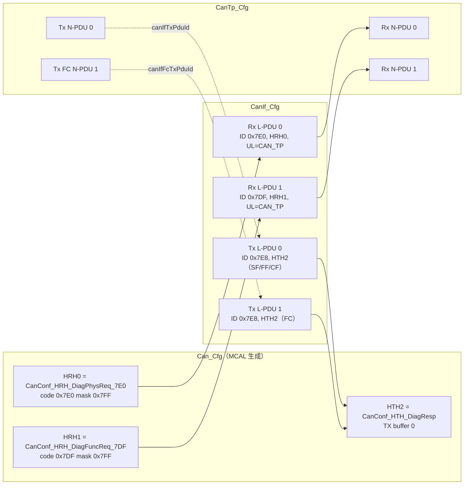
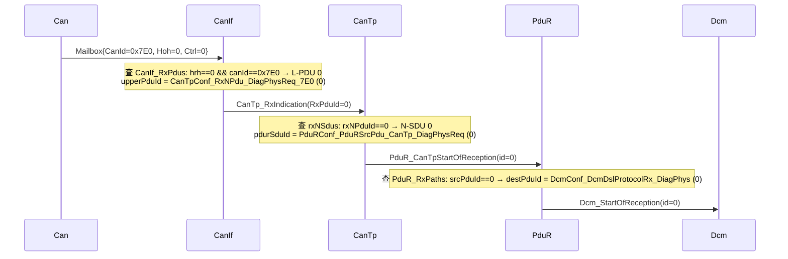
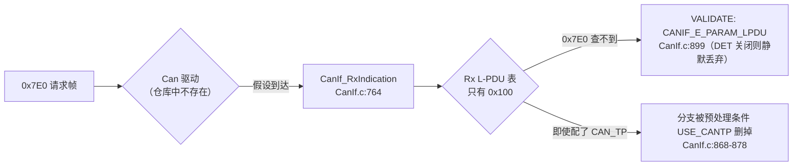

# CanIf 配置：HOH 引用、Rx/Tx L-PDU、Tx 缓冲与诊断通道 0x7E0/0x7DF/0x7E8

> Prerequisite: [01-canif.md](01-canif.md)、[04-can-mcal/07 HOH / HRH / HTH](../04-can-mcal/07-hoh-hrh-hth.md)、[04-can-mcal/08 Can 配置](../04-can-mcal/08-can-configuration.md)、[02-autosar-classic/04 ARXML 与配置](../02-autosar-classic/04-configuration-arxml.md)
> Next: [03-cantp.md](03-cantp.md)
> 对应规范: AUTOSAR CP **R22-11** SWS CAN Driver p.122–130（`CanHardwareObject`、`CanHandleType`、`CanObjectId`/`ECUC_Can_00326` 连续编号、`CanHwFilter` `ECUC_Can_00468–00470`）、p.45（`SWS_Can_00276`）、p.51（CAN_BUSY 排队）。**本仓库没有 CanIf SWS**：CanIf 容器与参数名（`CanIfInitHohCfg`、`CanIfRxPduCfg`、`CanIfTxPduCfg`、`CanIfBufferCfg`…）按公认 R4.x ECUC 形态描述，需以真实项目所用 release 的 CanIf SWS / 配置工具确认。
> 对应源码: 本项目 `examples/uds_diag_demo/mcal/Can_Cfg.h`、`Can_Cfg.c`、`ecual/CanIf_Cfg.h`、`CanIf_Cfg.c`、`com/CanTp_Cfg.h`、`CanTp_Cfg.c`；openAUTOSAR `communication/CAN/CanIf/src/CanIf_Cfg.c:80-149`、`include/CanIf_ConfigTypes.h:30-58`、`include/CanIf_Cfg.h:27-38`、`communication/CAN/CanIf/CMakeLists.txt:8`、`communication/CAN/CanTp/src/CanTp_Cfg.c:62-140`

---

## 1. 本章目标

1. 说出 CanIf 配置的主要容器，以及每个容器在运行时被哪个 API 使用。
2. 能独立写出一个 UDS 诊断通道（物理请求 0x7E0、功能请求 0x7DF、响应 0x7E8）在 Can → CanIf → CanTp 三层中的**全部**配置项，并说明它们之间的引用关系。
3. 理解“硬件过滤（RS-CANFD 接收规则）”和“软件过滤（CanIf）”的分工，知道什么时候软件过滤可以省掉。
4. 理解 DLC check 的含义与风险（tester 不做 padding 时）。
5. 能从 openAUTOSAR 的配置中指出“诊断帧根本到不了 CanTp”的原因，并给出修正方向。

---

## 2. 为什么 CanIf 的核心是配置？

`[Conceptual]` 上一章看到，`CanIf_RxIndication` 的代码只有“比 HRH、比 ID、比 DLC、调函数指针”四步（`ecual/CanIf.c:160-188`）。**所有**关于“0x7E0 是诊断请求”“诊断请求交给 CanTp 的 N-PDU 0”“响应用 0x7E8 从 HTH2 发出”的知识都不在代码里，而在配置表里。

这带来三个工程后果：

1. **代码可复用，配置不可复用**：同一份 CanIf 静态代码用于所有 ECU；每个 ECU 的差异全部来自 ARXML/ECUC → 生成器 → `CanIf_PBcfg.c`。
2. **跨模块引用必须一致**：CanIf 引用 Can 的 HOH、引用 CanTp/PduR 的 PduId；CanTp 反过来引用 CanIf 的 Tx L-PDU。任何一端重新编号，另一端必须重新生成。
3. **调试“为什么没响应”时，十有八九在查配置**：代码路径固定，变的是表。

---

## 3. 在系统中的位置：一条诊断请求经过的配置表



实线是 RX 方向“下层配置引用上层 id”，虚线是 TX 方向“上层配置引用下层 id”。这就是 [README §3.1](../../examples/uds_diag_demo/README.md) 所说的“三套 handle 由配置表连接”。

---

## 4. AUTOSAR 如何定义？（R4.x 容器结构）

`[Conceptual]` 本仓库没有 CanIf SWS，以下容器树按公认 R4.x 形态给出，参数名用于在真实配置工具中“对号入座”，具体多重性与默认值需以项目 release 确认：

```text
CanIf
├── CanIfPublicCfg        —— 对外可见的功能开关（DET、ReadRxPduData API、动态 TxId、PN、
│                            Tx 确认轮询等）
├── CanIfPrivateCfg       —— 内部行为
│     CanIfPrivateDlcCheck           是否做 DLC check
│     CanIfPrivateSoftwareFilterType BINARY / INDEX / LINEAR / TABLE
├── CanIfInitCfg          —— post-build 可变的主体
│   ├── CanIfInitHohCfg
│   │     ├── CanIfHrhCfg   CanIfHrhIdSymRef → Can/CanHardwareObject（RECEIVE）
│   │     │                 CanIfHrhCanCtrlIdRef、CanIfHrhSoftwareFilter
│   │     │                 CanIfHrhRangeCfg（BASIC HRH 接受的 ID 范围）
│   │     └── CanIfHthCfg   CanIfHthIdSymRef → Can/CanHardwareObject（TRANSMIT）
│   │                       CanIfHthCanCtrlIdRef
│   ├── CanIfRxPduCfg  (0..*) CanIfRxPduId、CanIfRxPduCanId、CanIfRxPduCanIdMask、
│   │                         CanIfRxPduCanIdType、CanIfRxPduDataLength、CanIfRxPduHrhIdRef、
│   │                         CanIfRxPduUserRxIndicationUL（CAN_TP / PDUR / CAN_NM / J1939TP / CDD …）、
│   │                         CanIfRxPduRef → EcucPdu
│   ├── CanIfTxPduCfg  (0..*) CanIfTxPduId、CanIfTxPduCanId、CanIfTxPduCanIdType、CanIfTxPduType
│   │                         （STATIC / DYNAMIC）、CanIfTxPduBufferRef、
│   │                         CanIfTxPduUserTxConfirmationUL、CanIfTxPduRef → EcucPdu
│   └── CanIfBufferCfg (0..*) CanIfBufferSize、CanIfBufferHthRef → CanIfHthCfg
├── CanIfCtrlDrvCfg       —— 每个 Can 驱动一个；CanIfCtrlCfg（CanIf 控制器 ↔ Can 控制器）
└── CanIfDispatchCfg      —— 控制器级回调去向（bus-off / mode indication → CAN_SM 等）
```

两个关键设计：

- **`EcucPdu` 全局 PDU**：`CanIfRxPduRef`、CanTp 的 `CanTpRxNPduRef`、PduR 的 `PduRSrcPduRef` 都引用 EcuC 中**同一个**全局 PDU 对象。工具靠这个“共同引用”在生成时把 CanIf 的 L-PDU 号和 CanTp 的 N-PDU 号连起来——这是“handle 由配置连接”的正式机制。
- **UL（Upper Layer）枚举**：决定 `CanIf_RxIndication` 调 `CanTp_RxIndication` 还是 `PduR_CanIfRxIndication`。诊断帧必须是 `CAN_TP`。

---

## 5. 核心配置项逐个讲

### 5.1 `CanIfInitHohCfg`：CanIf 与 Can 驱动的接缝

`[AUTOSAR Standard]` HOH 由 **Can 驱动配置**定义（CAN SWS p.122–130），CanIf 只“引用”。HRH 与 HTH 共用一个从 0 开始、无空洞的 ID 空间（`ECUC_Can_00326`，p.125，例 HRH0-0、HRH1-1、HTH0-2）。

`[Educational Implementation]` 本 demo（`mcal/Can_Cfg.h:21-25`、`Can_Cfg.c:16-21`）：

| HOH | 值 | 类型 | 硬件过滤 | 硬件对象 |
|---|---|---|---|---|
| `CanConf_HRH_DiagPhysReq_7E0` | 0 | RECEIVE，FULL | code 0x7E0 / mask 0x7FF | 接收规则 0 |
| `CanConf_HRH_DiagFuncReq_7DF` | 1 | RECEIVE，FULL | code 0x7DF / mask 0x7FF | 接收规则 1 |
| `CanConf_HTH_DiagResp` | 2 | TRANSMIT | — | TX buffer 0 |

demo 没有单独的 `CanIfHrhCfg`/`CanIfHthCfg` 表，而是在 L-PDU 中直接存 HOH 值（`CanIf.h:32`、`:42`）——这是扁平化简化；真实生成代码通常有 HRH 表，记录“该 HRH 是否需要软件过滤、属于哪个控制器、它下面有哪些 L-PDU（索引区间）”，以便 `CanIf_RxIndication` 直接跳到候选子集。

### 5.2 `CanIfRxPduCfg`：一个可接收的 CAN 帧

`[Educational Implementation]` `ecual/CanIf_Cfg.c:15-18`：

```c
/* [Educational Implementation] examples/uds_diag_demo/ecual/CanIf_Cfg.c:15-18 */
static const CanIf_RxPduConfigType CanIf_RxPdus[CANIF_NUM_RX_PDUS] = {
    { 0x7E0u, CanConf_HRH_DiagPhysReq_7E0, 1u, CanTpConf_RxNPdu_DiagPhysReq_7E0, CanTp_RxIndication, "DiagPhysReq_7E0" },
    { 0x7DFu, CanConf_HRH_DiagFuncReq_7DF, 1u, CanTpConf_RxNPdu_DiagFuncReq_7DF, CanTp_RxIndication, "DiagFuncReq_7DF" }
};
```

| 字段 | R4.x 参数 | 本例取值 | 为什么这样取 |
|---|---|---|---|
| `canId` | `CanIfRxPduCanId` | 0x7E0 / 0x7DF | OEM 诊断矩阵规定；11-bit 标准帧（`CanIfRxPduCanIdType = STANDARD`） |
| `hrh` | `CanIfRxPduHrhIdRef` | HRH0 / HRH1 | 必须与 Can 配置的接收规则一致 |
| `dlcMin` | `CanIfRxPduDataLength` | 1 | 最小合法 ISO-TP 帧是 1 字节 PCI + 1 字节数据？见 §5.6 讨论 |
| `upperPduId` | 由 `CanIfRxPduRef` ↔ `CanTpRxNPduRef` 推导 | N-PDU 0 / 1 | CanTp 定义的 id（`CanTp_Cfg.h:20-21`） |
| `rxIndication` | `CanIfRxPduUserRxIndicationUL = CAN_TP` | `CanTp_RxIndication` | 诊断走 TP；Com 信号报文才是 `PDUR` |

**注意**：tester 发给 ECU 的 **FC 帧**（ECU 发多帧响应时）也是从 0x7E0 进来的——它不需要单独的 Rx L-PDU。CanIf 把它当普通 0x7E0 帧交给 CanTp N-PDU 0，由 CanTp 根据 PCI 高 4 位 = 3 识别为 FC，再查“哪个 Tx N-SDU 的 `rxFcNPduId` 是 N-PDU 0”（`com/CanTp.c:476-484`、`CanTp_Cfg.c:30`）。

### 5.3 `CanIfTxPduCfg`：一个可发送的 CAN 帧

`[Educational Implementation]` `ecual/CanIf_Cfg.c:20-23`：

```c
/* [Educational Implementation] examples/uds_diag_demo/ecual/CanIf_Cfg.c:20-23 */
static const CanIf_TxPduConfigType CanIf_TxPdus[CANIF_NUM_TX_PDUS] = {
    { 0x7E8u, CanConf_HTH_DiagResp, CanTpConf_TxNPdu_DiagResp_7E8,   CanTp_TxConfirmation, "DiagResp_7E8" },
    { 0x7E8u, CanConf_HTH_DiagResp, CanTpConf_TxFcNPdu_DiagResp_7E8, CanTp_TxConfirmation, "DiagRespFC_7E8" }
};
```

**为什么同一个 CAN ID 0x7E8 配两个 Tx L-PDU？** 因为 CanTp 需要区分两类确认：

- L-PDU 0：响应数据帧（SF/FF/CF）的确认 → 推进 CanTp **TX 状态机**（`CanTp.c:528-563`）；
- L-PDU 1：ECU **接收**长请求时发出的 FC 帧的确认 → 推进 CanTp **RX 状态机**（`CanTp.c:509-526`，从 `RX_WAIT_FC_CONF` 进入 `RX_WAIT_CF`，开始 N_Cr）。

如果只配一个 L-PDU，`CanTp_TxConfirmation(N-PDU x)` 无法判断“刚发出去的是 FC 还是 CF”。在 R4.x 中这对应 `CanTpTxFcNPdu` 与 `CanTpTxNPdu` 各引用一个不同的 EcucPdu（即使 CAN ID 相同）。

### 5.4 `CanIfBufferCfg`：CAN_BUSY 时的缓冲

| 参数 | 含义 | 本 demo |
|---|---|---|
| `CanIfBufferSize` | 该缓冲能存几个 L-PDU；0 = 不缓冲 | `CANIF_TX_BUFFER_DEPTH = 4`（`CanIf_Cfg.h:25`），全局一个 FIFO |
| `CanIfBufferHthRef` | 该缓冲服务哪些 HTH | 未建模（只有一个 HTH） |
| `CanIfTxPduBufferRef` | Tx L-PDU 用哪个缓冲（也就间接决定 HTH） | 用 `hth` 字段代替 |

`[Real Project Consideration]` 设计缓冲深度时要估算“最坏情况下同一 HTH 上同时挂起多少帧”。诊断通道一般由 CanTp 自己串行化（等确认才发下一帧），深度 1–2 足够；但若诊断响应与周期性 Com 报文**共用 HTH**，就需要更深的缓冲，并且要按 CAN ID 优先级出队——否则高优先级周期报文会被诊断 CF 堵住。很多项目干脆给诊断响应一个独立的 FULL HTH。

### 5.5 上层目标（UL）

| UL | 回调 | 典型 PDU |
|---|---|---|
| `CAN_TP` | `CanTp_RxIndication` / `CanTp_TxConfirmation` | 诊断 0x7E0/0x7DF/0x7E8、OBD 0x7DF/0x7E8 |
| `PDUR` | `PduR_CanIfRxIndication` / `PduR_CanIfTxConfirmation` | Com 信号 I-PDU（如 0x100 车速） |
| `CAN_NM` | `CanNm_RxIndication` / `CanNm_TxConfirmation` | 网络管理 0x500–0x5FF 区间 |
| `J1939TP` | `J1939Tp_RxIndication` | 商用车 |
| `CDD` / `XCP` / `CAN_TSYN` | 各自回调 | 标定、时间同步、自定义 |

**配错 UL 的后果非常隐蔽**：帧确实被 CanIf 接收、确实有回调，只是去错了地方——没有任何 DET 错误。这正是 openAUTOSAR 现有配置的问题（§9）。

### 5.6 软件过滤与 DLC check

**硬件过滤 vs 软件过滤：**

| | 硬件过滤（Can 驱动配置） | 软件过滤（CanIf） |
|---|---|---|
| 在哪里 | RS-CANFD 接收规则 `GAFLIDj/GAFLMj`（[04-can-mcal/07](../04-can-mcal/07-hoh-hrh-hth.md) §7） | `CanIf_RxIndication` 中对 CAN ID 的比较 |
| 成本 | 0 CPU | 每帧一次查表，在 ISR 中 |
| 作用 | 不相关的帧根本不进 RX FIFO、不产生中断 | 区分同一 HRH 下的多个 L-PDU |
| 何时可省 | — | FULL HRH（一个 HRH 只收一个 ID）时，软件过滤只是“确认 ID 一致” |

本 demo 两个 HRH 都是 FULL（mask 0x7FF），所以 `CanIf_RxIndication` 的比较只是一致性检查。实验 2（§14）展示了 0x7E1 在**硬件**就被丢弃，根本不产生中断。

**DLC check：** `[Conceptual]` R4.x 的 DLC check 语义是“收到的长度 **≥** 配置的 `CanIfRxPduDataLength` 才放行”（不是相等），失败时丢帧并可上报错误。诊断场景的风险：

- 很多 OEM 要求 ISO-TP 帧 **padding 到 8 字节**，于是有人把 `CanIfRxPduDataLength` 配成 8；
- 但某些 tester（或 CAN FD 下的优化 DLC）发出 DLC < 8 的 SF，ECU 会静默丢弃——表现为“只有某台 tester 不通”。

本 demo 取 `dlcMin = 1`，是否强制 8 字节由 OEM 规范决定。实验 3（§14）对比了两种配置。

### 5.7 CAN ID 类型与 FD

`Can_IdType` 高两位编码帧格式（`SWS_Can_00416`）。CanIf 配置中 Rx/Tx L-PDU 的 `CanIdType`（STANDARD / EXTENDED / 以及 FD 变体）决定了：发送时 CanIf 往 `Can_PduType.id` 里写哪两位；接收时比较前是否屏蔽。29-bit normal-fixed 寻址（0x18DA_xx_yy）会在 [04-isotp.md](04-isotp.md) §5 讨论。

---

## 6. 初始化：配置何时生效

`[Educational Implementation]` `CanIf_Init(&CanIf_Config)`（`EcuM.c:30` → `CanIf.c:25-36`）只做一件事：记住配置指针，所有表都是 `const`（放在 ROM/Flash）。真实项目中有两种绑定方式：

| 方式 | 含义 | 何时用 |
|---|---|---|
| Pre-compile / Link-time | 配置表编进同一镜像，`CanIf_Init(NULL)` 或固定指针 | 绝大多数 ECU |
| Post-build（selectable / loadable） | 多套配置表，EcuM 根据变体编码选择 `&CanIf_Config_VariantX` | 一个软件支持多个车型/变体 |

post-build 下，CanIf 与 CanTp、PduR 的配置**必须选同一变体**，否则 handle 对不上——这是 EcuM `EcuM_DeterminePbConfiguration` 的职责。

---

## 7. Runtime：一帧 0x7E0 的 handle 变换



| Transition | 输入 handle | 查哪张表 | 输出 handle | 文件:行 |
|---|---|---|---|---|
| Can → CanIf | HRH 0 + CAN ID 0x7E0 | `CanIf_RxPdus` | CanTp N-PDU 0 | `CanIf_Cfg.c:16`、`CanIf.c:171-182` |
| CanIf → CanTp | N-PDU 0 | `CanTp_RxNSdus` | PduR src 0 | `CanTp_Cfg.c:14-20`、`CanTp.c:485-496` |
| CanTp → PduR | PduR src 0 | `PduR_RxPaths` | DcmRxPduId 0 | `PduR_Cfg.c:18`、`PduR.c:83-89` |

四个 “0” 分别属于四个模块，**数值相同纯属巧合**。把 0x7DF 走一遍会得到 HRH1 → L-PDU 1 → N-PDU 1 → N-SDU 1 → PduR src 1 → DcmRxPduId 1，数字依然“碰巧”一致；真实生成代码里几乎不会这么整齐。

---

## 8. RH850 Hardware Mapping：从 CanIf 配置推导 RS-CANFD 配置

`[RH850 Hardware]` CanIf 配置不直接写寄存器，但它**约束**了 Can 驱动配置，进而约束 RS-CANFD：

| CanIf 侧需求 | Can 驱动配置 | RS-CANFD 资源（P1M-E） |
|---|---|---|
| 0x7E0 物理请求，FULL HRH | `CanHardwareObject` RECEIVE，`CanHwFilterCode=0x7E0`，`Mask=0x7FF` | 1 条接收规则：`GAFLIDj` ID=0x7E0，`GAFLMj` 全部 ID 位 = 1（P1M-E 上 1 = 比较），目标 RX FIFO x |
| 0x7DF 功能请求，FULL HRH | 同上，0x7DF | 第 2 条接收规则 |
| 规则 → HRH 的识别 | 规则 label / 指针 | `GAFLP0j` 的标签字段随帧存入 FIFO（字段名以 HW 手册为准，见 `sim/VirtualCanBus.h:38-41` 注释） |
| RX 中断 | `CanRxProcessing = INTERRUPT` | RX FIFO `RFCCx.RFIE` → **EI190** |
| 0x7E8 响应 HTH | `CanHardwareObject` TRANSMIT | TX buffer p（`TMIDp/TMDFp/TMCp`） |
| FC 与数据帧共用 HTH | 一个 HTH | 同一个 TX buffer，CanIf 缓冲解决冲突 |

如果两个 HRH 被合并为一个 BASIC HRH（一个 RX FIFO + mask 0x7C0 之类的宽规则），CanIf 的软件过滤就变成必需，配置上要为该 HRH 打开 `CanIfHrhSoftwareFilter`，并把两个 Rx L-PDU 都挂在这个 HRH 下。

---

## 9. openAUTOSAR 的配置错误：诊断帧到不了 CanTp

`[AUTOSAR Standard]`（R3.1.5 参考）以下全部来自 `D:\side_project\openAUTOSAR` 实际文件。

### 9.1 现状

`communication/CAN/CanIf/src/CanIf_Cfg.c`：

| 行 | 内容 | 问题 |
|---|---|---|
| `:60` | `.CanIfDriverNameRef = "FLEXCAN"` | 暴露 MPC5xxx（Freescale FlexCAN）来源 |
| `:80-89` | 唯一 HTH：BASIC，`HWObj_2` | — |
| `:91-101` | 唯一 HRH：BASIC，`CanIfSoftwareFilterHrh = TRUE`，`HWObj_1` | — |
| `:114-128` | 唯一 Tx L-PDU：CAN ID **512（0x200）**，`CanIfUserTxConfirmation = PduR_CanIfTxConfirmation` | **没有 0x7E8**，确认交给 PduR（Com 路径） |
| `:130-149` | 唯一 Rx L-PDU：CAN ID **256（0x100）**，`CanIfRxUserType = CANIF_USER_TYPE_CAN_PDUR`，mask `0xFFF` | **没有 0x7E0/0x7DF**，UL 是 PDUR 而非 CAN_TP |

再叠加构建层面的问题：`communication/CAN/CanIf/CMakeLists.txt:8` 只定义 `-DUSE_COM -DUSE_PDUR`，没有 `-DUSE_CANTP`，于是 `CanIf.c:868-878` 的 `CANIF_USER_TYPE_CAN_TP` 分支被预处理删除——**即使把配置改对，编译出的 CanIf 也不会调用 `CanTp_RxIndication`**。

而 CanTp 一侧（`communication/CAN/CanTp/src/CanTp_Cfg.c:62-134`）却配置了 2 个 Tx N-SDU、2 个 Rx N-SDU，其中 `CanIf_PduId = 1 / 0`、`CanIf_FcPduId = 0`——引用的 CanIf L-PDU 0/1 在 CanIf 配置中**是 0x200 的 Com 报文或根本不存在**。也就是说两边的配置是各写各的，没有共同的 EcucPdu 引用把它们连起来。CanTp 配置自身也有问题：所有 N-SDU 的 TaType 都是 `CANTP_FUNCTIONAL`（包括名为 Phys 的）、`CanTpNar = 5000`（超过 ISO 15765-2 常用的 1000 ms 上限）、`CanTpConfig`（`:136-140`）没有初始化 `CanTpRxIdList`，而 `CanTp_RxIndication`（`CanTp.c:1001`）会解引用它。

PduR 一侧再补一刀：`communication/ComServices/PDURouter/include/PduR_Cfg.h:77-83` 把 `PduR_CanIfRxIndication` 宏替换为 `Com_RxIndication`——0x100 这条唯一的 Rx 路径也绕过了 PduR 路由表（详见 [05-pdur.md](05-pdur.md) §9）。



### 9.2 修正方向（示意）

`[Conceptual]` 下面是按 Arctic 结构体字段写的修正示意（`CanIf_ConfigTypes.h` 中的字段名），**不能直接链接运行**：仓库中没有 Can 驱动，`HWObj_*` 也只定义了两个硬件对象（`boards/linuxOs/MCAL/Can/include/Can_Cfg.h:59-68`，研究笔记 03 §2.1）。

```c
/* [Conceptual] 修正示意，基于 openAUTOSAR R3.1.5 CanIf 配置结构，非可运行代码 */
const CanIf_RxPduConfigType CanIfRxPduConfigData[] = {
  { .CanIfCanRxPduId = CANTP_RX_NPDU_UDS_PHYS,      /* 指向 CanTp 的 Rx N-PDU，而非 PduR id */
    .CanIfCanRxPduCanId = 0x7E0, .CanIfCanRxPduDlc = 1,
    .CanIfRxUserType = CANIF_USER_TYPE_CAN_TP,       /* 关键：UL = CAN_TP */
    .CanIfCanRxPduHrhRef = &CanIfHrhConfigData_Hoh[0],
    .CanIfRxPduIdCanIdType = CANIF_CAN_ID_TYPE_11,
    .CanIfSoftwareFilterType = CANIF_SOFTFILTER_TYPE_MASK, .CanIfCanRxPduCanIdMask = 0x7FF },
  { .CanIfCanRxPduId = CANTP_RX_NPDU_UDS_FUNC, .CanIfCanRxPduCanId = 0x7DF, /* ...同上... */ },
};
const CanIf_TxPduConfigType CanIfTxPduConfigData[] = {
  { .CanIfTxPduId = CANTP_TX_NPDU_UDS_PHYS, .CanIfCanTxPduIdCanId = 0x7E8, .CanIfCanTxPduIdDlc = 8,
    .CanIfUserTxConfirmation = CanTp_TxConfirmation,   /* 而非 PduR_CanIfTxConfirmation */
    .CanIfCanTxPduHthRef = &CanIfHthConfigData_Hoh[0], /* ... */ },
  /* FC 用的第二个 Tx L-PDU（同为 0x7E8） */
};
/* 另外：CanIf/CMakeLists.txt 增加 -DUSE_CANTP；CanTp_Cfg.c 的 CanIf_PduId / CanIf_FcPduId
 * 改为上面 Tx L-PDU 的下标；补齐 CanTpRxIdList；修正 PduR_Cfg.h 的零成本宏（见 05 章）。 */
```

教训：**模块间的“接线”只存在于配置里，而且是双向引用**。手写配置时极易出现“一边改了、另一边没改”；这就是真实项目一定用配置工具从同一份 ECUC/ARXML 生成所有模块配置的原因。

---

## 10. 当前教学项目实现

`[Educational Implementation]` demo 的配置文件都标注 “hand-written as if generated”，符号命名模仿真实生成器的 `<Module>Conf_<Container>_<ShortName>` 风格：

| 文件 | 内容 | 被谁引用 |
|---|---|---|
| `mcal/Can_Cfg.h:17-25` | 控制器与 HOH 编号 | `ecual/CanIf_Cfg.c` |
| `mcal/Can_Cfg.c:16-21` | HOH 表（含硬件过滤 code/mask、硬件对象号） | `Can_Init` |
| `ecual/CanIf_Cfg.h:13-25` | L-PDU 编号、缓冲深度 | `com/CanTp_Cfg.c`（Tx L-PDU 号） |
| `ecual/CanIf_Cfg.c:15-28` | Rx/Tx L-PDU 表 | `CanIf_Init` |
| `com/CanTp_Cfg.h:19-25` | N-PDU 编号 | `ecual/CanIf_Cfg.c`（upperPduId） |
| `com/CanTp_Cfg.c:13-34` | N-SDU 表，引用 CanIf Tx L-PDU 与 PduR id | `CanTp_Init` |

可以看到 `CanIf_Cfg.c` include 了 `CanTp.h`（`:13`），`CanTp_Cfg.c` include 了 `CanIf.h`（`:10`）——这种**互相引用**在生成代码中同样存在，靠头文件里的 `#define` 符号而不是硬编码数字来保持一致。

---

## 11. Code Walkthrough：三张表的交叉引用

把 0x7E0 通道的配置横向排成一行，每个单元格都能在源码中找到：

| 方向 | Can | CanIf | CanTp | PduR | Dcm |
|---|---|---|---|---|---|
| 请求（0x7E0） | `CanConf_HRH_DiagPhysReq_7E0` = 0（`Can_Cfg.h:22`），规则 code 0x7E0（`Can_Cfg.c:18`） | Rx L-PDU 0（`CanIf_Cfg.c:16`） | Rx N-PDU 0 → Rx N-SDU 0（`CanTp_Cfg.c:15-19`），BS=2、STmin=5 | src 0 → `DcmConf_DcmDslProtocolRx_DiagPhys`（`PduR_Cfg.c:18`） | DcmRxPduId 0（`Dcm_Cfg.h:31`） |
| 请求（0x7DF） | HRH1（`Can_Cfg.h:23`） | Rx L-PDU 1（`CanIf_Cfg.c:17`） | Rx N-PDU 1 → N-SDU 1，`CANTP_FUNCTIONAL`（`CanTp_Cfg.c:22-24`） | src 1 → DcmRxPduId 1（`PduR_Cfg.c:19`） | DcmRxPduId 1（`Dcm_Cfg.h:32`） |
| 响应数据（0x7E8） | HTH2 → TX buffer 0（`Can_Cfg.c:20`） | Tx L-PDU 0（`CanIf_Cfg.c:21`） | Tx N-SDU 0 的 `canIfTxPduId`（`CanTp_Cfg.c:30`） | dest 0 ← Dcm src 0（`PduR_Cfg.c:23-24`） | DcmTxPduId 0（`Dcm_Cfg.h:33`） |
| FC（ECU 发出） | HTH2 | Tx L-PDU 1（`CanIf_Cfg.c:22`） | Rx N-SDU 0 的 `canIfFcTxPduId`（`CanTp_Cfg.c:15`） | — | — |
| FC（tester 发来） | HRH0 | Rx L-PDU 0 | Tx N-SDU 0 的 `rxFcNPduId = N-PDU 0`（`CanTp_Cfg.c:30`） | — | — |

最后两行特别值得注意：**FC 帧不经过 PduR，也不到 Dcm**——它是 CanTp 对等层之间的协议帧，只在 CanIf 与 CanTp 之间流动。

---

## 12. Debug 方法

1. **先打印表，再看帧**：在 `CanIf_Init` 后设断点，展开 `*CanIf_CfgPtr`，逐项核对 ID/HRH/UL；真实项目中直接在生成的 `CanIf_PBcfg.c` 中搜 `0x7E0`（注意生成器可能写成十进制 2016 或带 ID 类型位）。
2. **区分“硬件没收”和“CanIf 没认”**：在 Can RX ISR 入口设断点。进了 ISR 但 CanTp 没收到 → CanIf 配置；连 ISR 都没进 → Can 驱动接收规则 / 中断（EI190）配置。
3. **看 `Mailbox->Hoh`**：如果 ISR 给出的 HRH 不是你以为的那个，说明接收规则顺序或 label 与 HOH 编号不一致（多条规则都能匹配时，RS-CANFD 按规则表顺序取第一条命中规则）。
4. **看 DLC**：`PduInfoPtr->SduLength` 小于配置值时帧被静默丢弃。
5. **一致性检查脚本**：`[Real Project Consideration]` 对大项目，写一个脚本从生成的 `*_Cfg.h` 中解析 `CanIfConf_*`、`CanTpConf_*`、`PduRConf_*` 符号并检查交叉引用，比肉眼可靠。

---

## 13. 常见错误

| 错误 | 症状 | 定位 |
|---|---|---|
| UL 配成 PDUR 而不是 CAN_TP | 无 DET、无响应，Com 收到一个“未知 I-PDU” | openAUTOSAR 现状 |
| Rx L-PDU 的 HRH 引用错 | ISR 正常，`CanIf_RxIndication` 走到“no Rx L-PDU” | §14 实验 1 |
| 接收规则 mask 写反（P1M-E 上 GAFLM 位 1 = 比较） | 要么什么都收（FIFO 溢出、CPU 被中断淹没），要么什么都不收 | [04-can-mcal/07](../04-can-mcal/07-hoh-hrh-hth.md) |
| DLC check 要求 8 而 tester 不 padding | 某些 tester 不通，CANoe 通 | §14 实验 3 |
| 只配了数据帧的 Tx L-PDU、没配 FC 的 | ECU 收长请求时无法发 FC → tester N_Bs 超时 | CanTp `canIfFcTxPduId` 指向不存在的 L-PDU |
| 物理/功能请求共用一个 Rx N-SDU | 功能请求 FF 被当作物理请求处理；并发 3E 80 打断进行中的物理多帧接收 | CanTp 配置 |
| 响应 CAN ID 写成 0x7E0 | ECU 自己收到自己的帧？（取决于硬件自收设置）tester 收不到响应 | CanIf Tx L-PDU |
| post-build 变体 CanIf/CanTp 不一致 | 偶发“串台” | EcuM 配置选择 |

---

## 14. 实验

所有实验在仓库外的临时副本中修改、编译、运行（gcc 参数同 `tools/run_uds_demo.py`），不改动仓库中的 demo。以下为本机实测输出。

### 实验 1：CanIf Rx L-PDU 的 CAN ID 配错

把 `ecual/CanIf_Cfg.c:16` 的 `0x7E0u` 改成 `0x7E1u`（硬件规则仍是 0x7E0），运行 `22 F1 90`：

```text
[    10 ms] [Bus     ] Tester -> wire  ID=0x7E0 DLC=8  03 22 F1 90 55 55 55 55
[    11 ms] [Can     ] ISR EI190 (RX FIFO): ID=0x7E0 HRH=0 DLC=8 -> CanIf_RxIndication
[    11 ms] [CanIf   ] RxIndication HRH=0 ID=0x7E0: no Rx L-PDU configured -> dropped
[   410 ms] [Tester  ] no final response within 400 ms
```

硬件收到了、中断来了，但 CanIf 不认识——这正是 openAUTOSAR 配置“只有 0x100”时 0x7E0 的命运。

### 实验 2：硬件过滤 vs 软件过滤

不改配置，用 `VirtualCanBus_TesterSend` 直接发一帧 0x7E1，再发一个功能地址 FF：

```text
[    15 ms] [Bus     ] Tester -> wire  ID=0x7DF DLC=8  10 0D 2E F1 A0 A0 A1 A2
[    16 ms] [CanIf   ] RxIndication HRH=1 ID=0x7DF -> Rx L-PDU 1 (DiagFuncReq_7DF) -> CanTp_RxIndication(N-PDU 1)
[    16 ms] [CanTp   ] RX RxNSdu_DiagFunc: FF on functional address -> ignored (ISO 15765-2)
[    18 ms] [Bus     ] Tester -> wire  ID=0x7E1 DLC=8  02 3E 00 55 55 55 55 55
[    18 ms] [Bus     ]   no receive rule matches ID=0x7E1: hardware discards it
```

0x7E1 在**硬件**被丢弃，连 ISR 都没有；0x7DF 的 FF 通过了 CanIf，被 **CanTp** 按 ISO 15765-2 规则拒绝（功能寻址只允许 SF）。三层各自过滤自己负责的东西。

### 实验 3：DLC check

用 `VirtualCanBus_TesterSend(0x7E0, {03 22 F1 90}, 4)` 发一个**不 padding** 的 SF：

- 原配置（`dlcMin = 1`）：正常收到，ECU 回 20 字节 VIN。
- 把 `CanIf_Cfg.c:16` 的 `dlcMin` 改为 `8u` 后：

```text
[    15 ms] [Bus     ] Tester -> wire  ID=0x7E0 DLC=4  03 22 F1 90
[    16 ms] [Can     ] ISR EI190 (RX FIFO): ID=0x7E0 HRH=0 DLC=4 -> CanIf_RxIndication
[    16 ms] [CanIf   ] RxIndication ID=0x7E0 DLC too short -> dropped
```

讨论：如果 OEM 规范强制 8 字节 padding，ECU 丢弃短帧是“正确”的；但必须确认所有产线/售后 tester 都 padding。

### 实验 4（纸面）：合并 HRH

把 0x7E0 与 0x7DF 合并到一个 BASIC HRH：写出新的 `Can_Cfg.c` HOH 表与新的 `CanIf_Cfg.c`。提示：0x7E0 XOR 0x7DF = 0x03F，即低 6 位全不同，单条规则能同时匹配二者的最“窄” mask 是 0x7C0（code 0x7C0），它会放进 0x7C0–0x7FF 共 64 个 ID。思考：(a) 此时 `CanIf_RxIndication` 的比较是否还只是“一致性检查”？(b) 总线上若存在 0x7C8 之类的其它 ECU 诊断 ID，会给 EI190 带来多少额外中断负载？(c) 用两条精确规则指向同一个 RX FIFO、但给不同 label，是否是更好的方案？

---

## 15. 思考题

1. 若 OEM 把诊断 ID 改成 29-bit normal-fixed 寻址（物理请求 0x18DA<ECU><Tester>、功能请求 0x18DB<功能目标地址><Tester>），Can 接收规则、CanIf Rx L-PDU 的 `CanIdType` 与 mask 分别要怎么改？`CanIf_RxIndication` 中屏蔽高两位的那一步（`CanIf.c:173`）为什么仍然必要？
2. 为什么 R4.x 用 `EcucPdu` 全局引用来连接 CanIf 与 CanTp，而不是让 CanIf 配置里直接写 CanTp 的 N-PDU 号？
3. 如果诊断响应（0x7E8）与一个 10 ms 周期报文（0x120）共用一个 HTH 和一个 4 深度的 CanIf 缓冲，在 CF 连发（STmin=0）时，周期报文最坏会被延迟多久？如何通过配置避免？
4. 功能请求 0x7DF 的响应用哪个 CAN ID 发出？为什么 CanIf 不需要为“功能请求的响应”单独配一个 Tx L-PDU？
5. openAUTOSAR 的 `CanIfCanRxPduCanIdMask = 0xFFF` 用于 11-bit ID 会不会出错？如果换成 29-bit ID 呢？

---

## 16. 对未来真实项目的意义

`[Real Project Consideration]`

- 进入 RTA-CAR 类工程后，诊断通道的配置通常来自 OEM 的 DBC/ARXML 通信矩阵 + 诊断规范（CDD/ODX）。拿到工程先做一张本章 §11 那样的“横向表”：Can HOH → CanIf L-PDU → CanTp N-PDU/N-SDU → PduR 路径 → DcmDslProtocolRx/Tx。这张表就是诊断不通时的排查地图。
- 重点核对：UL = CAN_TP；FC 的 Tx L-PDU 存在；物理/功能 N-SDU 分开；DLC check 与 OEM padding 规范一致；诊断 HTH 是否与周期报文共用；CanIf 缓冲深度。
- DCM 升级时如果 Dcm 的 `DcmDslProtocolRx` 重新编号，只影响 PduR 路径；CanIf 指向 CanTp，一般不变。但若升级同时引入 CAN FD 诊断（CAN_DL 64），CanIf 的 CAN ID 类型、DLC check、Can 驱动的 FD 配置、CanTp 的 `CanTpRxTaType`/padding 都要一起改。
- 配置工具生成的符号名（`CanIfConf_CanIfRxPduCfg_<ShortName>`）是最可靠的检索入口；不要依赖数值。

---

## 17. 本章总结

```text
Can_Cfg     HOH（HRH/HTH）+ 硬件过滤            ← MCAL 配置，CanIf 只引用
   ↑ 引用
CanIf_Cfg   Rx L-PDU：(HRH, CAN ID, DLC) → UL + 上层 id
            Tx L-PDU：上层 id ← (HTH, CAN ID) + 确认去向
            Buffer：CAN_BUSY 缓冲深度与 HTH 归属
   ↕ 双向引用（R4.x 经 EcucPdu）
CanTp_Cfg   N-PDU / N-SDU，反向引用 CanIf Tx L-PDU（数据帧 + FC 各一个）
```

openAUTOSAR 的反面教材说明：模块代码再完整，只要接线（配置）不对，诊断帧连 CanTp 都到不了。

---

## 18. 下一章

[03-cantp.md](03-cantp.md)：CanIf 交上来的是一帧一帧的 8 字节 N-PDU，而 Dcm 需要的是完整的 UDS 消息（N-SDU）。下一章讲 CanTp 如何用 RX/TX 状态机、N_xx 计时器和 PduR 的 `StartOfReception / CopyRxData / CopyTxData` 握手完成分段与重组。
