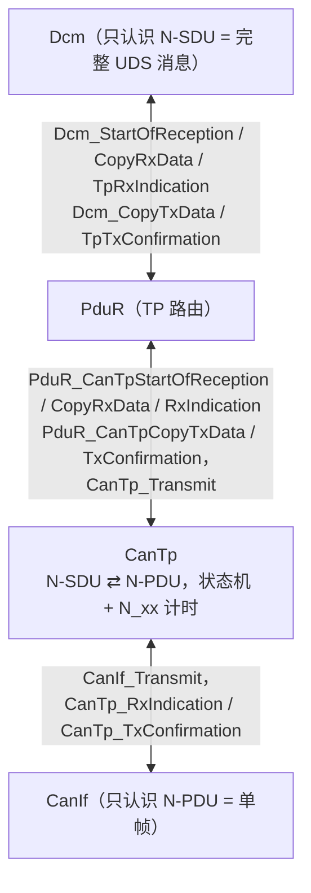
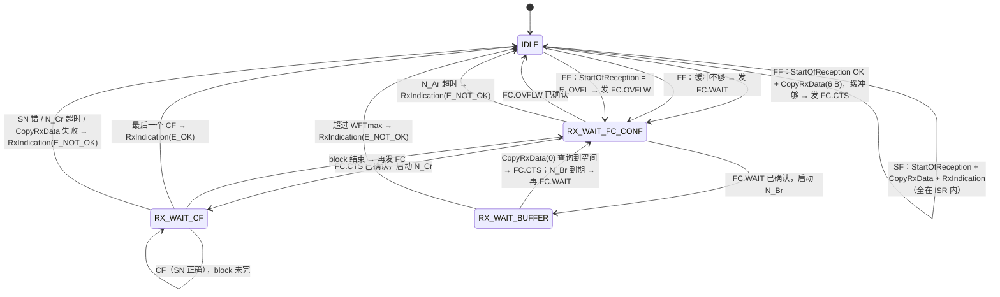
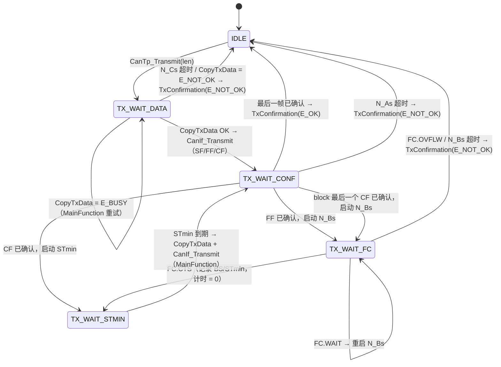
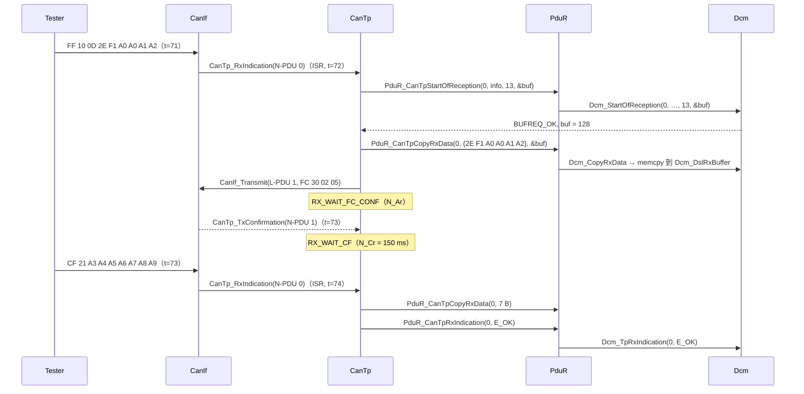

# CanTp：N-SDU 分段与重组、RX/TX 状态机、N_xx 计时与 PduR 回调握手

> Prerequisite: [01-canif.md](01-canif.md)、[02-canif-configuration.md](02-canif-configuration.md)、[02-autosar-classic/07 MainFunction 调度](../02-autosar-classic/07-mainfunction-scheduling.md)、[02-autosar-classic/06 OS Task 与 ISR](../02-autosar-classic/06-os-task-isr.md)
> Next: [04-isotp.md](04-isotp.md)（逐字节看帧格式）；之后 [05-pdur.md](05-pdur.md)
> 对应规范: AUTOSAR CP **R20-11** SWS DCM（`AUTOSAR_SWS_DiagnosticCommunicationManager.pdf`）p.243–247（`Dcm_StartOfReception` `SWS_Dcm_00094`、`Dcm_CopyRxData` `00556`、`Dcm_TpRxIndication` `00093`、`Dcm_CopyTxData` `00092`、`Dcm_TpTxConfirmation` `00351`）、p.56–59（`00444` OVFL、`00642`、`00996`、`00342/00344`、`00350`、`00557`）——这是 TP 握手在**上层一侧**的规范依据。**本仓库没有 CanTp SWS、PduR SWS、ComStack_Types SWS，也没有 ISO 15765-2 原文**：CanTp 自身 API、配置参数名与 ISO 计时参数按公认 R4.x / ISO 15765-2 内容描述，需以项目 release 的 SWS 和 ISO 原文确认。
> 对应源码: 本项目 `examples/uds_diag_demo/com/CanTp.h`、`CanTp.c`、`CanTp_Cfg.h`、`CanTp_Cfg.c`、`general/ComStack_Types.h`；openAUTOSAR（R3.1.5）`communication/CAN/CanTp/src/CanTp.c:151-158`（状态枚举）、`:336`（`copySegmentToPduRRxBuffer`）、`:432`（`sendFlowControlFrame`）、`:583`（`sendNextTxFrame`）、`:631`（`handleNextTxFrameSent`）、`:684`（`handleFlowControlFrame`）、`:892`（`CanTp_Transmit`）、`:1001`（`CanTp_RxIndication`）、`:1111`（`CanTp_TxConfirmation`）、`:1172`（`CanTp_MainFunction`）

---

## 1. 本章目标

1. 解释 N-PDU 与 N-SDU 的区别，以及为什么 Dcm 永远看不到“帧”。
2. 画出 CanTp 的 RX 与 TX 状态机，说出每个状态在等什么、由哪个事件离开、超时由哪个 N_xx 计时器负责。
3. 说清 `StartOfReception → CopyRxData × n → RxIndication` 和 `Transmit → CopyTxData × n → TxConfirmation` 两套握手中，每一步谁调谁、在什么上下文、`BufReq_ReturnType` 各返回值意味着什么。
4. 理解 `CanTp_MainFunction` 的周期如何决定 STmin 精度与超时精度。
5. 逐行读懂 `examples/uds_diag_demo/com/CanTp.c`，并能对照 openAUTOSAR 的 R3.1.5 实现指出差异与缺陷。

---

## 2. 为什么需要 CanTp？

`[Conceptual]` 经典 CAN 一帧最多 8 字节，而 UDS 消息可以长得多：`22 F1 90` 的响应是 20 字节（`62 F1 90` + 17 字节 VIN），`36 TransferData` 一块可达数 KB。CanTp（ISO 15765-2 的 AUTOSAR 实现）解决四个问题：

| 问题 | CanTp 的机制 |
|---|---|
| 长消息放不进一帧 | **分段**：First Frame（FF）带总长度 + 前几个字节，后续 Consecutive Frame（CF）带序号 |
| 接收方处理/缓冲能力有限 | **流控**：接收方发 Flow Control（FC），告诉发送方一次发几帧（BS）、帧间隔多少（STmin），或“等一下”（WAIT），或“太长放不下”（OVFLW） |
| 帧丢失、对方掉线 | **计时监督**：N_As/N_Ar/N_Bs/N_Br/N_Cs/N_Cr 六个计时器，任一超时即中止并通知上层 |
| 上层不应关心分段 | **N-SDU 抽象**：上层只看到“一个完整消息开始了 / 给你一段数据 / 结束了（成功或失败）” |

这正是 Dcm 能“网络无关”的原因：DCM SWS p.23 说 DCM 只与 PduR 交互，网络细节在 PduR 以下处理（研究笔记 02 §3.1）。同一个 Dcm 既可以接 CanTp，也可以接 FrTp、DoIP（SoAd）或 LinTp。

---

## 3. 在系统中的位置与术语



| 术语 | 含义 | 本 demo 例子 |
|---|---|---|
| **N-PDU** | 网络层协议数据单元 = 一个 CAN 帧（N_PCI + N_Data，必要时含 N_AI） | `03 22 F1 90 55 55 55 55` |
| **N-SDU** | 网络层服务数据单元 = 上层的完整消息 | `22 F1 90`（3 字节）、`62 F1 90 …`（20 字节） |
| **N_PCI** | 协议控制信息：帧类型 + 长度/序号/流控参数 | `03`（SF，长度 3）、`10 14`（FF，长度 20） |
| **N_AI** | 地址信息（normal 寻址时隐含在 CAN ID 中） | 0x7E0 / 0x7DF / 0x7E8 |
| N-PDU id | CanIf ↔ CanTp 之间的句柄 | `CanTpConf_RxNPdu_DiagPhysReq_7E0`（`CanTp_Cfg.h:20`） |
| N-SDU id | CanTp 内部 + 与 PduR 之间的句柄 | `CanTpConf_RxNSdu_DiagPhys`（`CanTp_Cfg.h:28`）；对 PduR 使用 `pdurSduId` |

`CanTp_Cfg.h:8-10` 的注释点出了最容易混的地方：**N-PDU 是一帧，N-SDU 是一条消息**，两套 id 空间。

---

## 4. AUTOSAR 如何定义？

### 4.1 CanTp 的 API（R4.x 公认形态）

`[Conceptual]` 本仓库无 CanTp SWS：

| API | 调用者 | 上下文 | 作用 | 本 demo |
|---|---|---|---|---|
| `void CanTp_Init(const CanTp_ConfigType*)` | EcuM/BswM | 启动 | 所有通道 → IDLE | `CanTp.c:570` |
| `Std_ReturnType CanTp_Transmit(PduIdType TxPduId, const PduInfoType*)` | PduR（`PduR_DcmTransmit` 转发） | Dcm_MainFunction（task） | 登记一个 N-SDU 的发送请求，**只给长度**（`SduDataPtr` 可为 NULL），数据之后用 `CopyTxData` 拉取 | `CanTp.c:392` |
| `void CanTp_RxIndication(PduIdType RxPduId, const PduInfoType*)` | CanIf | **ISR** 或 Can 读 MainFunction | 一帧到达 | `CanTp.c:466` |
| `void CanTp_TxConfirmation(PduIdType TxPduId, Std_ReturnType result)` | CanIf | **ISR** 或 Can 写 MainFunction | 一帧已上总线（R4.4 起带 `result`） | `CanTp.c:501` |
| `void CanTp_MainFunction(void)` | BSW Scheduler | 周期 task | 计时、STmin 节拍、重试 | `CanTp.c:590` |
| `CanTp_CancelTransmit/CancelReceive/ChangeParameter/ReadParameter` | PduR / 上层 | — | 取消、运行时改 BS/STmin | 未实现 |

### 4.2 CanTp 调用上层（经 PduR）的五个回调

`[AUTOSAR API]` 上层一侧以 Dcm 为例，签名来自本仓库的 DCM SWS R20-11（p.243–247，研究笔记 02 §3.3）；PduR 一侧的 `PduR_CanTp*` 签名与之一一对应（本仓库无 PduR SWS，按 R4.x 形态）：

| 回调 | 签名（Dcm 侧） | CanTp 何时调用 |
|---|---|---|
| StartOfReception | `BufReq_ReturnType Dcm_StartOfReception(PduIdType id, const PduInfoType* info, PduLengthType TpSduLength, PduLengthType* bufferSizePtr)` | 收到 SF 或 FF：告诉上层“一条 `TpSduLength` 字节的消息开始了”，上层回报可用缓冲大小 |
| CopyRxData | `BufReq_ReturnType Dcm_CopyRxData(PduIdType id, const PduInfoType* info, PduLengthType* bufferSizePtr)` | 每收到一段数据（SF 的数据、FF 的前 6 字节、每个 CF 的 ≤7 字节）；`SduLength = 0` 用于**只查询**剩余缓冲（`SWS_Dcm_00996`） |
| TpRxIndication | `void Dcm_TpRxIndication(PduIdType id, Std_ReturnType result)` | 接收结束：`E_OK` = 完整；`E_NOT_OK` = 中止（超时、SN 错…），上层不得评估缓冲内容（`00344`） |
| CopyTxData | `BufReq_ReturnType Dcm_CopyTxData(PduIdType id, const PduInfoType* info, const RetryInfoType* retry, PduLengthType* availableDataPtr)` | 每准备一帧（SF/FF/CF）时向上层**拉**数据 |
| TpTxConfirmation | `void Dcm_TpTxConfirmation(PduIdType id, Std_ReturnType result)` | 整个 N-SDU 发送结束（成功或失败） |

`[AUTOSAR Standard]` DCM SWS 注明这些函数“可能在中断上下文中被调用”（研究笔记 02 §3.3）——因为 CanTp 在 `CanTp_RxIndication`（ISR）里就会调用它们。

### 4.3 `BufReq_ReturnType` 语义

`[AUTOSAR API]` 类型定义见 `general/ComStack_Types.h:35-40`（本仓库无 ComStack_Types SWS，取值语义按 DCM SWS p.244–246 描述）：

| 返回值 | StartOfReception | CopyRxData | CopyTxData | CanTp 的反应（本 demo） |
|---|---|---|---|---|
| `BUFREQ_OK` | 接受；`*bufferSizePtr` 报可用空间（可能为 0） | 已拷贝；`*bufferSizePtr` 报剩余空间 | 已拷贝 `info->SduLength` 字节；`*availableDataPtr` 报剩余 | 继续 |
| `BUFREQ_E_NOT_OK` | 拒绝（例如同一连接正忙 `00557`、长度 0 `00642`） | 失败 | 失败；**仍需等 TpTxConfirmation 结束本次发送**（`00350`） | RX：SF 丢弃、FF 不回 FC（`CanTp.c:205-207`、`:253-256`）；CF 时中止并 `RxIndication(E_NOT_OK)`（`:296-298`）。TX：中止并 `TxConfirmation(E_NOT_OK)`（`:373-375`） |
| `BUFREQ_E_BUSY` | — | （R4.x 中可表示暂时无空间） | 数据暂时不够，可重试（分页缓冲 `01186`） | TX：进入 `CANTP_TX_WAIT_DATA`，在 MainFunction 中重试直到 N_Cs（`:366-372`、`:649-655`） |
| `BUFREQ_E_OVFL` | 消息长度超过上层缓冲（`00444`） | — | — | RX FF：发 **FC OVFLW**（`:247-251`） |

注意“缓冲不够”的两种表达：

- **总长度根本放不下** → StartOfReception 返回 `BUFREQ_E_OVFL` → FC.OVFLW，tester 放弃；
- **总长度放得下，但当前空闲空间不够下一个 block** → StartOfReception 返回 `BUFREQ_OK` + 较小的 `bufferSize` → CanTp 发 **FC.WAIT**，在 MainFunction 中用 `CopyRxData(SduLength=0)` 轮询（`:610-625`），空间够了再发 FC.CTS。

### 4.4 六个 N_xx 计时器

`[Conceptual]` 定义来自 ISO 15765-2（本仓库无原文，以下为公认内容，需以标准原文确认）。参照点：**发送方 = sender，接收方 = receiver**。

| 计时器 | 谁计 | 从……开始 | 到……结束 | 超时含义 | ISO 典型值 | 本 demo 配置 |
|---|---|---|---|---|---|---|
| **N_As** | 发送方 | 把 SF/FF/CF 交给数据链路层 | 收到该帧的 TxConfirmation | 本地 CAN 发不出去（bus-off、仲裁总输） | 超时 1000 ms | `nAsMs = 70`（`CanTp_Cfg.c:32`） |
| **N_Ar** | 接收方 | 把 FC 交给数据链路层 | FC 的 TxConfirmation | 本地发 FC 失败 | 超时 1000 ms | `nArMs = 70`（`:19`） |
| **N_Bs** | 发送方 | FF 或一个 block 最后一个 CF 的确认 | 收到对方 FC | **对方没回 FC** | 超时 1000 ms | `nBsMs = 150`（`:32`） |
| **N_Br** | 接收方 | 收到 FF / 一个 block 结束 / 发出 FC.WAIT | 发出下一个 FC | 性能要求：本地准备缓冲太慢（(N_Br + N_Ar) < 0.9 × N_Bs） | 性能参数 | `nBrMs = 70`（`:19`） |
| **N_Cs** | 发送方 | 收到 FC.CTS / 上一 CF 的确认 | 发出下一个 CF | 性能要求：本地准备数据太慢（(N_Cs + N_As) < 0.9 × N_Cr） | 性能参数 | `nCsMs = 70`（`:32`） |
| **N_Cr** | 接收方 | 发出 FC.CTS 的确认 / 收到上一个 CF | 收到下一个 CF | **对方停止发 CF** | 超时 1000 ms | `nCrMs = 150`（`:19`） |

记忆法：**A = Acknowledge（本地发帧被确认），B = Block（等 FC / 准备 FC），C = Consecutive（等 CF / 准备 CF）；s = sender，r = receiver。** demo 的取值（70/150 ms）远小于 ISO 上限，是为了在 host 仿真中更快看到超时；真实项目以 OEM 规范为准。

---

## 5. 核心数据结构

### 5.1 配置

`[Educational Implementation]` `com/CanTp.h:31-64`：

| 结构 | 行号 | 关键字段 → R4.x 参数 |
|---|---|---|
| `CanTp_RxNSduConfigType` | `CanTp.h:31-44` | `rxNPduId`→`CanTpRxNPdu`；`txFcNPduId`→`CanTpTxFcNPdu`；`canIfFcTxPduId`（发 FC 用的 CanIf L-PDU）；`pdurSduId`；`taType`→`CanTpRxTaType`；`bs`→`CanTpBs`；`stMin`→`CanTpSTmin`；`wftMax`→`CanTpRxWftMax`；`nArMs/nBrMs/nCrMs`→`CanTpNar/Nbr/Ncr` |
| `CanTp_TxNSduConfigType` | `CanTp.h:47-57` | `txNPduId`→`CanTpTxNPdu`；`canIfTxPduId`；`rxFcNPduId`→`CanTpRxFcNPdu`（tester 的 FC 从哪个 N-PDU 进来）；`pdurSduId`；`nAsMs/nBsMs/nCsMs` |

注意 BS/STmin 只出现在 **Rx** N-SDU 里：它们是“我作为接收方要求对方遵守的参数”，写进我发出的 FC。作为发送方时，BS/STmin 来自**对方**的 FC（运行时状态，`CanTp_TxRuntimeType.bs/stMinMs`）。

配置实例 `com/CanTp_Cfg.c:13-34`：

| N-SDU | 方向 | 关键参数 |
|---|---|---|
| `RxNSdu_DiagPhys`（`:14-20`） | RX，物理 0x7E0 | BS=2、STmin=5 ms、WFTmax=3、N_Ar=70、N_Br=70、N_Cr=150 |
| `RxNSdu_DiagFunc`（`:21-25`） | RX，功能 0x7DF，只收 SF | BS/STmin/WFT 无意义 |
| `TxNSdu_DiagPhys`（`:29-33`） | TX，0x7E8 | N_As=70、N_Bs=150、N_Cs=70；FC 从 Rx N-PDU 0（0x7E0）进来 |

### 5.2 运行时状态

`[Educational Implementation]` `com/CanTp.c:36-81`：

| 变量 | 行号 | 字段 |
|---|---|---|
| `CanTp_Rx[2]`（`CanTp_RxRuntimeType`） | `:43-53`、`:80` | `state`、`total`（FF_DL）、`received`、`upperBufferSize`、`nextSn`、`blockRemaining`、`wftCount`、`fcInFlight`（正在等确认的 FC 的 FS）、`timerMs` |
| `CanTp_Tx[1]`（`CanTp_TxRuntimeType`） | `:65-77`、`:81` | `state`、`nextKind`/`inFlightKind`（SF/FF/CF）、`total`、`sent`（已确认字节）、`inFlightLen`、`sn`、`bs`/`bsRemaining`/`stMinMs`（来自对方 FC）、`timerMs` |

每个 N-SDU 只有**一个** `timerMs`：任何时刻一个通道只在等一件事，所以六个 N_xx 计时器在实现上复用同一个变量，含义由 `state` 决定。这是几乎所有 CanTp 实现的共同做法（openAUTOSAR 用 `stateTimeoutCount` + 单独的 `NasNarTimeoutCount`，`CanTp.c:185-188` 附近）。

`CanTp` **不持有完整消息**：RX 数据边收边 `CopyRxData` 给上层，TX 数据边发边 `CopyTxData` 从上层拉。它只有每帧 8 字节的栈上 `frame[]`（`CanTp.c:137`、`:332`）。

---

## 6. 初始化流程

| 步骤 | 位置 | 说明 |
|---|---|---|
| `CanTp_Init(&CanTp_Config)` | `EcuM.c:31` → `CanTp.c:570-577` | 保存配置，`memset` 所有运行时状态 → IDLE |
| MainFunction 周期 | `CanTp_Cfg.h:16` `CANTP_MAIN_FUNCTION_PERIOD_MS = 1` | 所有 ms 计时器每次减 1 个周期 |
| 调度 | `integration/BswScheduler.c:41`（1 ms task） | 与 `Can_MainFunction_Write` 同一个 task，且排在它之后 |

**周期必须单一来源**：CanTp 内部用来换算的周期（`CANTP_MAIN_FUNCTION_PERIOD_MS`）必须等于 OS 实际调度周期。openAUTOSAR 的反例：`include/CanTp_Cfg.h:24` 写 1000 ms，而 SchM 实际约 25 ms（研究笔记 03 §6），所有 N_xx 失真。真实项目中这个值由配置工具从 `CanTpMainFunctionPeriod` 与 OS/RTE 的 runnable 周期同时生成。

---

## 7. Runtime Flow

### 7.1 RX 状态机

`[Educational Implementation]` 对应 `CanTp_RxStateType`（`CanTp.c:36-41`）：



| 事件 / 状态迁移 | 触发 API | 上下文 | 代码 |
|---|---|---|---|
| 帧分派（按 PCI 高 4 位） | `CanTp_RxIndication` | ISR | `CanTp.c:466-498` |
| SF 处理 | `PduR_CanTpStartOfReception` → `PduR_CanTpCopyRxData` → `PduR_CanTpRxIndication` | ISR | `CanTp.c:183-215` |
| FF 处理 | `PduR_CanTpStartOfReception`（`TpSduLength = FF_DL`）→ `PduR_CanTpCopyRxData`（6 B） | ISR | `CanTp.c:217-269` |
| 决定 CTS/WAIT | 比较 `upperBufferSize` 与“下一个 block 需要的字节” | ISR / MainFunction | `CanTp.c:156-181` |
| 发 FC | `CanIf_Transmit(canIfFcTxPduId)` | ISR / MainFunction | `CanTp.c:133-152` |
| FC 确认 | `CanTp_TxConfirmation(txFcNPduId)` | Can 写 MainFunction（本 demo） | `CanTp.c:509-526` |
| CF 处理 | `PduR_CanTpCopyRxData`（≤7 B），最后一个 CF → `PduR_CanTpRxIndication(E_OK)` | ISR | `CanTp.c:271-320` |
| 超时 / WAIT 轮询 | `CanTp_MainFunction` | 1 ms task | `CanTp.c:597-630` |

### 7.2 TX 状态机

`[Educational Implementation]` 对应 `CanTp_TxStateType`（`CanTp.c:55-61`）：



| 事件 / 状态迁移 | 触发 API | 上下文 | 代码 |
|---|---|---|---|
| 登记发送，并**立即**发第一帧 | `CanTp_Transmit` → `CanTp_TxSendNext` | 调用者上下文（Dcm_MainFunction，10 ms task） | `CanTp.c:392-422`（`:420`） |
| 拉数据 + 发帧 | `PduR_CanTpCopyTxData` → `CanIf_Transmit` | 同上 / MainFunction | `CanTp.c:328-388` |
| 帧确认 | `CanTp_TxConfirmation(txNPduId)` | Can 写 MainFunction | `CanTp.c:528-563` |
| 收到 tester 的 FC | `CanTp_RxIndication` → `CanTp_TxFlowControl` | ISR | `CanTp.c:476-484`、`:424-459` |
| STmin 节拍、N_As/N_Bs/N_Cs | `CanTp_MainFunction` | 1 ms task | `CanTp.c:631-659` |

### 7.3 RX 握手时序（多帧请求 `2E F1 A0 …` 13 字节）

数据来自 `artifacts/uds-demo/trace.txt` 中 71–74 ms 一段：



| # | Transition | API | 上下文 | 数据/缓冲 |
|---|---|---|---|---|
| 1 | CanIf → CanTp | `CanTp_RxIndication(0, &pdu)` | ISR | `pdu.SduDataPtr` 指向 Can 驱动 ISR 栈上的 `frame.data` |
| 2 | CanTp → PduR → Dcm | `StartOfReception(…, TpSduLength=13, &bufferSize)` | ISR | Dcm 检查长度（`Dcm_Dsl.c:334-338`），锁定连接、停 S3（`:339-344`） |
| 3 | CanTp → PduR → Dcm | `CopyRxData(SduLength=6)` | ISR | **第一次拷贝**：FF 的 6 字节 → `Dcm_DslRxBuffer`（`Dcm_Dsl.c:376`） |
| 4 | CanTp → CanIf | `CanIf_Transmit(FC)` | ISR | FC 在 CanTp 栈上构造（`CanTp.c:137-141`），CanIf 拷走 |
| 5 | CanIf → CanTp | `CanTp_TxConfirmation(1, E_OK)` | Can 写 MainFunction | 状态 → RX_WAIT_CF |
| 6 | CanTp → PduR → Dcm | `CopyRxData(SduLength=7)` | ISR | CF 数据拷入 Dcm 缓冲 |
| 7 | CanTp → PduR → Dcm | `TpRxIndication(E_OK)` | ISR | Dcm 只“登记请求完整”，服务处理推迟到下一个 `Dcm_MainFunction`（`Dcm_Dsl.c:419-437`） |

### 7.4 TX 握手时序（20 字节 VIN 响应）

见 [04-isotp.md](04-isotp.md) §7 的逐字节分析；握手要点：

| # | Transition | API | 上下文 |
|---|---|---|---|
| 1 | Dcm → PduR → CanTp | `PduR_DcmTransmit(0, {NULL, 20})` → `CanTp_Transmit(0, …)` | Dcm_MainFunction |
| 2 | CanTp → PduR → Dcm | `CopyTxData(SduLength=6)` → 拷到 FF 的 `frame[2..7]` | 同上（demo 在 `CanTp_Transmit` 内立即发 FF） |
| 3 | CanTp → CanIf | `CanIf_Transmit(L-PDU 0, FF)` | 同上 |
| 4 | CanIf → CanTp | `CanTp_TxConfirmation(0)` → TX_WAIT_FC（N_Bs） | Can 写 MainFunction |
| 5 | CanIf → CanTp | `CanTp_RxIndication(0, FC)` → TX_WAIT_STMIN | ISR |
| 6 | CanTp → PduR → Dcm | `CopyTxData(7)` → CF | CanTp_MainFunction |
| 7 | CanTp → PduR → Dcm | `TpTxConfirmation(E_OK)` | Can 写 MainFunction（最后一个 CF 的确认链） |

### 7.5 `CanTp_MainFunction` 的时间语义

`[Educational Implementation]` `CanTp.c:579-587`：

```c
/* [Educational Implementation] examples/uds_diag_demo/com/CanTp.c:579-587 */
static boolean CanTp_TimerExpired(uint16 *timerMs)
{
    if (*timerMs <= CANTP_MAIN_FUNCTION_PERIOD_MS) { *timerMs = 0u; return TRUE; }
    *timerMs = (uint16)(*timerMs - CANTP_MAIN_FUNCTION_PERIOD_MS);
    return FALSE;
}
```

后果：

1. **精度 = 一个周期**。STmin=2 ms 在 1 ms 周期下等 2 个 tick；若 MainFunction 是 5 ms，STmin=2 实际变成 5 ms（发送方只能“慢于”STmin，ISO 允许，但吞吐下降）。
2. **亚毫秒 STmin（0xF1–0xF9 = 100–900 µs）** 被向上取整为 1 ms（`CanTp_DecodeStMin`，`CanTp.c:87-96`）。要真正实现 100 µs 级间隔，需要 GPT 定时器中断驱动发送（`[Conceptual]`，常见于 flash 下载场景）。
3. **STmin = 0 时 CF 之间仍至少隔 1 tick**：本 demo 的 CF 总是由 MainFunction 发出（`:644-647`），即使对方允许 0 间隔。openAUTOSAR 则在 STmin=0 时直接在 `TxConfirmation` 回调里发下一个 CF（`CanTp.c:652-665`），吞吐更高，但把 `CopyTxData` 和 `CanIf_Transmit` 带进了 TX ISR 上下文。
4. **超时精度**：N_Bs=150 ms 在实验中观测为 FF 确认后约 149 ms 触发（§14 实验 1）——因为确认与第一次递减发生在同一个 tick。

---

## 8. RH850 Hardware Mapping

`[RH850 Hardware]` CanTp 不访问外设，但它的**上下文与计时**直接落在 RH850 资源上：

| CanTp 行为 | RH850/P1M-E 资源 | 说明 |
|---|---|---|
| `CanTp_RxIndication` 在 ISR 中运行 | INTC **EI190**（INTRCANGRECC，RX FIFO） | 整条 CanIf → CanTp → PduR → Dcm 拷贝链都在这个 ISR 里；ISR 优先级（EIC190 的 EIP）决定它能否被更高优先级中断抢占 |
| `CanTp_TxConfirmation` | TX 完成中断 **EI185**（CAN0 transmit，`TMSTSp.TMTRF`）或 `Can_MainFunction_Write` 轮询 | 本 demo 用轮询（`mcal/Can.c:7-12` 说明） |
| `CanTp_MainFunction` 的 1 ms 节拍 | OS counter（通常由 OSTM 驱动的 1 ms tick）→ 1 ms task | OSTM0/OSTM1 归属是配置选择，不是硬件事实 |
| STmin 精度 | OS tick 粒度；亚 ms 需 GPT（另一个 OSTM 或 TAUJ 通道） | 具体定时器分配需在真实项目中确认 |
| 多核 / 中断与 task 共享状态 | `CanTp_Rx[]` / `CanTp_Tx[]` 被 ISR 与 task 同时访问 | 真实实现用 `SchM_Enter_CanTp_*` 临界区；本 demo 单线程不需要 |

`[Real Project Consideration]` 在 RH850 上评估 ISR 负载时，要把“CanTp + PduR + `Dcm_CopyRxData` 的 memcpy”算进 EI190 的执行时间；一个 4 KB 的 `36 TransferData` 请求意味着约 585 个 CF，每个都在 ISR 里完成一次 7 字节拷贝和三层函数调用。

---

## 9. openAUTOSAR 实现（R3.1.5 参考）

`[AUTOSAR Standard]` `D:\side_project\openAUTOSAR\communication\CAN\CanTp\`：

| 关注点 | 位置 | 观察 |
|---|---|---|
| 状态枚举 | `src/CanTp.c:151-158` | `UNINITIALIZED, IDLE, SF_OR_FF_RECEIVED_WAITING_PDUR_BUFFER, RX_WAIT_CONSECUTIVE_FRAME, RX_WAIT_SDU_BUFFER, TX_WAIT_STMIN, TX_WAIT_TRANSMIT, TX_WAIT_FLOW_CONTROL, TX_WAIT_TX_CONFIRMATION`——与本 demo 的 RX/TX 状态一一可对应 |
| PCI 宏 | `src/CanTp.c:119-131` | `ISO15765_TPCI_SF 0x00 / FF 0x10 / CF 0x20 / FC 0x30`，FS = CTS 0 / WAIT 1 / OVFLW 2 |
| R3 “借缓冲” | `copySegmentToPduRRxBuffer` `:336`，调用 `PduR_CanTpProvideRxBuffer` `:354` | R3.x：上层**借出整块 buffer 指针**（`PduInfoType**`），CanTp 直接往里写；R4.x 改为 `StartOfReception` + `CopyRxData`（上层自己拷） |
| 发 FC | `sendFlowControlFrame` `:432`，CTS/WAIT/OVFLW 分支 `:448/:468/:473` | `BUFREQ_BUSY` → FC.WAIT（`:467-468`） |
| 发 FC 时的 N_Ar | `:402` | `NasNarTimeoutCount = CONVERT(CanTpNar)`，`:404` 调 `CanIf_Transmit(CanIf_FcPduId)` |
| `CanTp_Transmit` | `:892` | **只登记**：写 PCI 到 `canFrameBuffer`、`state = TX_WAIT_TRANSMIT`（`:927-944`）；真正发帧在下一个 MainFunction 的 `TX_WAIT_TRANSMIT` 分支（`:1204-1205` → `sendNextTxFrame` `:583`） |
| TX 拉数据 | `sendNextTxFrame` `:591` | `PduR_CanTpProvideTxBuffer`（R3）——同样是“借整块” |
| 帧发送完成 | `handleNextTxFrameSent` `:631` | 全部发完 → `PduR_CanTpTxConfirmation(NTFRSLT_OK)`（`:645`）；block 完 → `TX_WAIT_FLOW_CONTROL` + N_Bs（`:648-651`）；**STmin = 0 时在本回调里直接 `sendNextTxFrame`**（`:652-665`） |
| 收 FC | `handleFlowControlFrame` `:684` | CTS → `TX_WAIT_TRANSMIT`（`:710`）；WAIT → 重启 N_Bs（`:712-714`）；OVFLW 分支**调用的是 `PduR_CanTpRxIndication`**（`:717`）——TX 方向的失败却用 RX 指示通知上层，是一个缺陷（应为 TxConfirmation(E_NOT_OK)） |
| MainFunction | `:1172` | `TX_WAIT_STMIN` 到期后计算 N_Cs 时用了 `rxConfigListItem->CanTpNcr`（`:1200-1202`），而此时 `rxConfigListItem` 可能仍为 NULL |
| `CanTp_Transmit` 查表 | `:908-909` | 用 `CanTpRxIdList[CanTpTxSduId]` 查 **Tx** N-SDU（研究笔记 03 指出的可疑设计） |
| 周期 | `include/CanTp_Cfg.h:24-25` | `CANTP_MAIN_FUNCTION_PERIOD_TIME_MS 1000`；`CANTP_CONVERT_MS_TO_MAIN_CYCLES(x) (x)/1000`——`CanTpNas = 2` 换算为 0 个周期；宏参数也未加括号 |
| 示例配置 | `src/CanTp_Cfg.c:16`、`:62-134`、`:136-140` | `#warning "This default file may only be used as an example!"`；4 个 N-SDU 全部 `CANTP_FUNCTIONAL`；`CanTpNar = 5000`；`CanTpConfig` 未初始化 `CanTpRxIdList` |

R3.1.5 与 R4.x TP 接口的本质差异：

| | R3.x（openAUTOSAR） | R4.x（本 demo / DCM R20-11） |
|---|---|---|
| RX 缓冲 | `ProvideRxBuffer(id, len, PduInfoType**)`：上层借出指针，CanTp 写入 | `StartOfReception` + `CopyRxData`：CanTp 给数据，上层自己拷 |
| TX 缓冲 | `ProvideTxBuffer(id, PduInfoType**, len)`：上层借出指针 | `CopyTxData(id, info, retry, &available)`：上层拷到 CanTp 给的帧缓冲 |
| 结果类型 | `NotifResultType`（`NTFRSLT_OK / E_NOT_OK / E_WRONG_SN / E_NO_BUFFER …`） | `Std_ReturnType`（E_OK / E_NOT_OK） |
| `CanTp_TxConfirmation` | `(PduIdType)` | R4.4 起 `(PduIdType, Std_ReturnType)` |

为什么 R4 要改成 Copy 语义？借指针意味着上层缓冲在整个传输期间被下层持有，所有权模糊（openAUTOSAR Dcm 为此维护了一整套 `PROVIDED_TO_PDUR / PROVIDED_TO_DSD …` 状态，研究笔记 03 §4.2）；Copy 语义让每个模块只拥有自己的缓冲，也让 PduR 能做 TP 网关（on-the-fly 转发时不需要整块连续缓冲）。

---

## 10. 当前教学项目实现

`[Educational Implementation]` 范围写在 `com/CanTp.h:4-17`：

| 已实现 | 未实现 |
|---|---|
| SF/FF/CF/FC 双向（经典 CAN、8 字节、normal 寻址、12-bit FF_DL ≤ 4095） | CAN FD 帧格式、escape FF_DL（> 4095） |
| ECU 作为接收方的 BS/STmin 与 FC.WAIT（WFTmax） | extended / mixed 寻址 |
| ECU 作为发送方遵守 tester 的 BS/STmin | `CanTp_CancelTransmit/CancelReceive`、`ChangeParameter` |
| N_As / N_Ar / N_Bs / N_Br / N_Cr 超时；N_Cs 在 `TX_WAIT_DATA` 中处理 | 全双工通道建模规则 |
| 物理 0x7E0→0x7E8、功能 0x7DF（只收 SF） | 帧接收中途的“新 FF 打断”之外的高级并发规则 |
| 发送 padding 0xCC（`CanTp_Cfg.h:17`） | 接收 padding 校验 |

一个**教学实现的已知局限**值得单独指出：`CanTp_TxFlowControl` 只在 `CANTP_TX_WAIT_FC` 状态接受 FC（`CanTp.c:430-433`）。如果 tester 的 FC 在 FF 的 TxConfirmation **被处理之前**就到达（状态仍是 `TX_WAIT_CONF`），FC 会被当作“unexpected FC”丢弃，随后 N_Bs 超时。本 demo 的调度顺序（`BswScheduler.c:32-41`：先 bus tick，再 RX ISR，再 `Can_MainFunction_Write`，tester 在 tick 之后才响应）保证了确认先于 FC，所以不会触发。真实 ECU 上若 TX 确认采用**轮询**（`Can_MainFunction_Write` 周期 ≥ 1 ms）而 tester 回 FC 很快（几百 µs），这个竞争是真实存在的——商业 CanTp 通常允许在等 FF 确认时提前接收 FC，或要求 TX 确认用中断方式。

---

## 11. Code Walkthrough

### 11.1 入口分派：`CanTp_RxIndication`（`CanTp.c:466-498`）

```c
/* [Educational Implementation] examples/uds_diag_demo/com/CanTp.c:474-490（节选） */
pciType = (uint8)(PduInfoPtr->SduDataPtr[0] >> 4);
if (pciType == CANTP_PCI_FC) {                       /* FC 属于 TX 方向 */
    for (i = 0u; i < CanTp_CfgPtr->numTxNSdus; i++) {
        if (CanTp_CfgPtr->txNSdus[i].rxFcNPduId == RxPduId) { CanTp_TxFlowControl(i, PduInfoPtr); return; }
    }
    return;
}
for (i = 0u; i < CanTp_CfgPtr->numRxNSdus; i++) {   /* SF/FF/CF 属于 RX 方向 */
    if (CanTp_CfgPtr->rxNSdus[i].rxNPduId == RxPduId) { switch (pciType) { /* SF / FF / CF */ } }
}
```

同一个 N-PDU（0x7E0）承载两种方向的帧：请求的 SF/FF/CF（RX 方向）和 tester 对我方响应的 FC（TX 方向）。分派依据是 **PCI 类型 + 配置中的 `rxFcNPduId`**。

### 11.2 FF 处理：`CanTp_RxFirstFrame`（`CanTp.c:217-269`）

关键检查顺序：

1. 功能寻址不允许 FF（`:226-229`）——ISO 15765-2 规定功能寻址只能用 SF。
2. `SduLength < 8` 直接忽略（`:230-232`）：经典 CAN 的 FF 必须是满帧。
3. `FF_DL ≤ 7` 非法（`:234-237`）：能用 SF 表达的长度不得用 FF。
4. 正在接收中又来 FF → 先中止旧接收（`:238-240`），这是 ISO 规定的“新的 FF/SF 打断旧的分段接收”。
5. `StartOfReception` 返回 `E_OVFL` → 发 FC.OVFLW（`:247-251`）；其它非 OK → 不回 FC（`:253-256`），tester 将以 N_Bs 超时结束。
6. FF 的 6 字节立刻 `CopyRxData`（`:257`），再根据上层报告的 `bufSize` 决定 CTS 还是 WAIT（`:267-268`）。

### 11.3 CTS 还是 WAIT：`CanTp_RxBytesNeeded` / `CanTp_RxContinueOrWait`（`CanTp.c:156-181`）

```c
/* [Educational Implementation] examples/uds_diag_demo/com/CanTp.c:160-162 */
PduLengthType remaining = (PduLengthType)(rt->total - rt->received);
PduLengthType needed = (cfg->bs == 0u) ? remaining : (PduLengthType)(cfg->bs * 7u);
return (needed > remaining) ? remaining : needed;
```

只有当上层能接住“下一个 block”（BS × 7 字节，或剩余全部）时才发 CTS——否则发了 CTS 而上层又接不住，就只能中途中止。WAIT 次数受 `wftMax` 限制（`:175-180`），超过就放弃，防止无限 WAIT 霸占通道。

### 11.4 CF 处理：`CanTp_RxConsecutiveFrame`（`CanTp.c:271-320`）

- 状态不是 `RX_WAIT_CF` → 忽略（`:280-283`），例如 FC 还没被确认时 tester 就发来 CF。
- SN 校验（`:284-287`）：SN 是 4 位、从 1 开始、15 之后回到 0（`:302`）。
- 最后一个 CF 只取剩余字节（`:291`），padding 字节不拷给上层。
- block 结束时回到 `CanTp_RxContinueOrWait` 再发 FC（`:312-318`）；否则重启 N_Cr（`:319`）。

### 11.5 发送：`CanTp_Transmit` + `CanTp_TxSendNext`（`CanTp.c:392-422`、`:328-388`）

- `CanTp_Transmit` 只检查长度与状态（`:407-411`：忙、0 长度、> 4095、功能寻址 > 7 字节都拒绝），然后**同步**调用 `CanTp_TxSendNext` 发第一帧（`:420`）。
- `CanTp_TxSendNext` 先根据 `nextKind` 写 PCI（`:339-359`），再把 `pdu.SduDataPtr` 指向 `frame[pciLen]`、调用 `PduR_CanTpCopyTxData`（`:361-365`）——上层把数据**直接拷进 CanTp 栈上的帧缓冲**。这是 R4.x TX 方向唯一的一次 Dcm → CanTp 拷贝。
- `retry` 传 NULL（`:364-365`）：本 CanTp 不要求上层回退重发数据（`TP_DATARETRY` 用于某些需要重发的场景，`ComStack_Types.h:44-53`）。
- `E_BUSY` → `TX_WAIT_DATA` 并启动 N_Cs（`:366-372`）。

### 11.6 TX 确认：`CanTp_TxConfirmation`（`CanTp.c:501-564`）

一个回调同时服务两个方向：先查“是不是我发的 FC”（`:509-526`，用 `txFcNPduId` 匹配），再查“是不是我发的数据帧”（`:528-563`）。这就是 [02 章](02-canif-configuration.md) §5.3 要配两个 Tx L-PDU 的原因。数据帧确认后：

- `sent += inFlightLen`（`:538`）：**以确认为准**累计进度，而不是以 `CanIf_Transmit` 成功为准；
- FF 之后进 `TX_WAIT_FC`（`:546-550`）；
- CF 之后 SN 递增、BS 计数（`:551-559`），然后 `TX_WAIT_STMIN`（`:560-561`）。

---

## 12. Debug 方法

| 想看什么 | 断点 | 变量 |
|---|---|---|
| 帧被当作什么类型 | `CanTp_RxIndication`（`CanTp.c:466`） | `PduInfoPtr->SduDataPtr[0]`、`RxPduId` |
| 为什么没发 FC | `CanTp_RxFirstFrame` 中 `:246` 之后 | `br`、`bufSize` |
| 接收卡在哪个状态 | `CanTp_MainFunction`（`:590`） | `CanTp_Rx[0].state`、`.timerMs`、`.received/.total`、`.nextSn` |
| 发送卡在哪个状态 | 同上 | `CanTp_Tx[0].state`、`.sent/.total`、`.bs/.bsRemaining/.stMinMs`、`.timerMs` |
| 超时/中止原因 | `CanTp_RxAbort`（`:111`）、`CanTp_TxAbort`（`:120`） | `reason` 字符串；DET runtime error `CANTP_E_RX_COM 0xC0` / `CANTP_E_TX_COM 0xC1`（`CanTp.h:71-72`，取值为教学示意） |

host 上最快的方法是 grep：`grep "CanTp" artifacts/uds-demo/trace.txt`。真实 ECU 上调试 CanTp 有个陷阱：**断点会让对方的计时器继续走**——停在断点 2 秒，tester 早已 N_Bs/N_Cr 超时。建议用 trace buffer（RAM 环形日志）或 CANoe 的 ISO-TP 解析视图配合非停顿式观测（数据断点、计数器）。

---

## 13. 常见错误

1. **MainFunction 周期与配置不一致**（openAUTOSAR 1000 ms vs 实际 25 ms）：所有超时与 STmin 失真。
2. **N_Bs < tester 的 FC 响应时间**：tester 在 PC 上，FC 延迟可能几十 ms；ECU N_Bs 配得太小会偶发中止。
3. **ECU 的 STmin 配得太小**：ECU 作为接收方要求 STmin=0，但 ISR 处理一帧的时间 + `Dcm_CopyRxData` 拷贝跟不上 → RX FIFO 溢出（RS-CANFD `RFSTSx.RFMLT`）→ 丢 CF → SN 错。
4. **BS=0 与小缓冲**：BS=0 表示“一口气发完不再 FC”，若上层缓冲不够整条消息，只能在 FF 时就 OVFLW 或 WAIT。
5. **物理与功能 N-SDU 共用**：功能 `3E 80` 打断正在进行的物理多帧接收。
6. **FC 用错 CAN ID**：ECU 发 FC 必须用**响应** ID（0x7E8），不是请求 ID。
7. **上层在 `CopyRxData` 中做耗时处理**：它在 ISR 里。
8. **把 `E_OK` from `CanTp_Transmit` 当作“已发完”**：必须等 `TpTxConfirmation`；Dcm 的 P2 监控、会话切换（`10 03` 在确认后才切换，README §5.1）都依赖这个确认。

---

## 14. 实验

在仓库外的临时副本中修改并编译（gcc 参数同 `tools/run_uds_demo.py`），不改动仓库中的 demo。以下均为本机实测输出（已过滤与本实验无关的行）。

### 实验 1：tester 不回 FC → ECU 的 N_Bs 超时

把副本中 `sim/UdsTester.c` 的 `UdsTester_SendFc`（`:68`）改为直接 return，然后发 `22 F1 90`：

```text
[    30 ms] [CanTp   ] TX TxNSdu_DiagPhys: FF payload=6 [62 F1 90 4C 52 48] -> CanIf_Transmit(L-PDU 0)
[    31 ms] [Bus     ] ECU    -> wire  ID=0x7E8 DLC=8  10 14 62 F1 90 4C 52 48
[    31 ms] [CanIf   ] TxConfirmation L-PDU 0 (DiagResp_7E8) -> CanTp_TxConfirmation(N-PDU 0)
[    31 ms] [Tester  ] EXPERIMENT: FC suppressed
[   180 ms] [CanTp   ] TX TxNSdu_DiagPhys aborted (N_Bs timeout: no FC from tester) -> PduR_CanTpTxConfirmation(E_NOT_OK)
[   180 ms] [Det     ] RUNTIME ERROR module=35 instance=0 api=0x06 error=0xC1
[   180 ms] [PduR    ] CanTpTxConfirmation(0, E_NOT_OK) -> Dcm_TpTxConfirmation(DcmTxPduId 0)
[   180 ms] [Dcm/DSL ] TpTxConfirmation(E_NOT_OK): response on the bus (SWS_Dcm_00353: P2 monitoring stops)
[   180 ms] [Dcm/DSL ] request finished; S3 timer (re)started (5000 ms)
```

观察：(1) FF 确认后 149 ms 触发（N_Bs=150，见 §7.5）；(2) 失败一路以 `E_NOT_OK` 通知到 Dcm，Dcm **不重发**响应（`SWS_Dcm_00118`）；(3) Dcm 这一行 trace 的固定文字“response on the bus”在失败时并不准确——判断要看括号里的 `E_NOT_OK`。

### 实验 2：tester 发完 FF 就停 → ECU 的 N_Cr 超时

直接用 `VirtualCanBus_TesterSend(0x7E0, {10 0D 2E F1 A0 A0 A1 A2}, 8)`，之后不发 CF：

```text
[    16 ms] [CanTp   ] RX RxNSdu_DiagPhys: FF total=13 -> PduR_CanTpStartOfReception(0)
[    16 ms] [Dcm/DSL ] StartOfReception(DcmRxPduId 0 physical, len=13) -> BUFREQ_OK, buffer=128, S3 stopped
[    16 ms] [CanTp   ] RX RxNSdu_DiagPhys: send FC CTS (BS=2 STmin=5 ms)
[    17 ms] [Bus     ] ECU    -> wire  ID=0x7E8 DLC=8  30 02 05 CC CC CC CC CC
[    17 ms] [CanIf   ] TxConfirmation L-PDU 1 (DiagRespFC_7E8) -> CanTp_TxConfirmation(N-PDU 1)
[   166 ms] [CanTp   ] RX RxNSdu_DiagPhys aborted (N_Cr timeout: tester stopped sending CFs) -> PduR_CanTpRxIndication(E_NOT_OK)
[   166 ms] [PduR    ] CanTpRxIndication(0, E_NOT_OK) -> Dcm_TpRxIndication(DcmRxPduId 0)
[   166 ms] [Dcm/DSL ] TpRxIndication(E_NOT_OK): reception failed, request discarded
```

N_Cr 从 **FC 的确认**开始计（17 ms），不是从 FF 到达开始计。

### 实验 3：CF 序号错误

FF 之后发一个 SN=2 的 CF（`22 A3 …`）：

```text
[    19 ms] [CanTp   ] RX RxNSdu_DiagPhys aborted (wrong sequence number) -> PduR_CanTpRxIndication(E_NOT_OK)
[    19 ms] [Dcm/DSL ] TpRxIndication(E_NOT_OK): reception failed, request discarded
```

对比 openAUTOSAR：它用 `NTFRSLT_E_WRONG_SN` 区分原因（`CanTp.c:511`）；R4.x 的 `Std_ReturnType` 只有 E_NOT_OK，原因要看 DET runtime error。

### 实验 4：上层缓冲不够 → FC.OVFLW

把副本中 `diag/Dcm_Cfg.h:24` 的 `DCM_DSL_BUFFER_SIZE` 改为 `12u`，再发 13 字节请求的 FF：

```text
[    16 ms] [Dcm/DSL ] StartOfReception len=13 > buffer 12 -> BUFREQ_E_OVFL
[    16 ms] [CanTp   ] RX RxNSdu_DiagPhys: send FC OVFLW (BS=2 STmin=5 ms)
[    17 ms] [Bus     ] ECU    -> wire  ID=0x7E8 DLC=8  32 02 05 CC CC CC CC CC
```

注意：`StartOfReception` 返回非 OK 时 **不调用** `TpRxIndication`——接收从未“开始”，Dcm 也就没有需要清理的状态。FC.OVFLW 帧里的 BS/STmin 字节（`02 05`）对 OVFLW 没有意义，ISO 规定接收方应忽略。（此时 20 字节的 VIN 响应也放不下，这个配置只适合做本实验。）

### 实验 5（动手）：ECU 作为接收方的 FC.WAIT

`[Educational Implementation]` 本实验需要你自己改代码：让 `Dcm_StartOfReception` 在长度 13 时把 `*bufferSizePtr` 报为 6（只够 FF），并让 `Dcm_CopyRxData(SduLength=0)` 在第 3 次查询后才报告 ≥ 7。预期：ECU 先发 `31 02 05`（FC.WAIT）若干次，再发 `30 02 05`（CTS）。再把 `wftMax`（`CanTp_Cfg.c:19` 第一个 `3u`）改为 1，观察“CanTpRxWftMax exceeded”中止。

---

## 15. 思考题

1. 为什么 BS/STmin 配置在 **Rx** N-SDU 中，而 N_As/N_Bs/N_Cs 配置在 **Tx** N-SDU 中？
2. 如果 `CanTp_MainFunction` 周期是 5 ms，而 tester 要求 STmin = 0xF3（300 µs），ECU 的 CF 实际间隔是多少？这违反 ISO 吗？
3. openAUTOSAR 在 STmin = 0 时从 `TxConfirmation` 回调里直接发下一个 CF；本 demo 总是等 MainFunction。各自的优缺点（吞吐、ISR 负载、可重入风险）是什么？
4. CanTp 为什么在 `CopyRxData` 之前就调用 `StartOfReception`，而不是收齐再一次性交给上层？
5. N_Br 和 N_Cs 在 ISO 中是“性能要求”而不是“超时”。在 AUTOSAR CanTp 中它们分别对应什么动作？（看本 demo `RX_WAIT_BUFFER` 与 `TX_WAIT_DATA` 两个状态）
6. 为什么 `sent` 在 TxConfirmation 中累加而不是在 `CanIf_Transmit` 返回 E_OK 时累加？如果反过来，N_As 超时后会发生什么？

---

## 16. 对未来真实项目的意义

`[Real Project Consideration]`

- 真实 CanTp 是生成配置 + 供应商静态代码。拿到工程后核对：`CanTpMainFunctionPeriod` 与 OS task 周期一致；每个诊断 N-SDU 的 BS/STmin/N_xx 与 OEM 诊断规范（通常在“传输层参数”章节）一致；物理/功能 N-SDU 分开；padding 开关与字节值。
- 诊断“偶发多帧失败”时，先区分是 **N_Bs**（tester 没回 FC，ECU 侧）还是 **N_Cr**（ECU 没收到 CF，ECU 侧）还是 tester 侧的 N_Bs（ECU 没回 FC）。CANoe trace + ECU 的 DET runtime error 记录能快速分辨。
- Flash 编程（`34/36/37`）是 CanTp 的压力测试：大 FF_DL、BS=0/STmin=0 的高吞吐、ECU 接收时的 FC.WAIT（擦除 flash 期间缓冲占满）——这些场景在 bootloader 里尤其重要。
- DCM 从 R4.0 前的 `ProvideRxBuffer` 风格升级到 R4.x/R20-11 的 `StartOfReception/CopyRxData` 风格时，CanTp 与 PduR 必须同代；混用会出现签名不匹配或缓冲所有权错误。

---

## 17. 本章总结

```text
CanIf（帧） ──CanTp_RxIndication──▶ CanTp ──StartOfReception / CopyRxData×n / RxIndication──▶ PduR ─▶ Dcm
                                     │  RX：IDLE → (FF) → WAIT_FC_CONF → WAIT_CF … → IDLE
                                     │  TX：IDLE → WAIT_DATA → WAIT_CONF → WAIT_FC → WAIT_STMIN … → IDLE
                                     │  计时：N_As/N_Ar（等确认）N_Bs/N_Br（FC）N_Cs/N_Cr（CF）
CanIf（帧） ◀──CanIf_Transmit────── CanTp ◀──CanTp_Transmit(len) / CopyTxData×n / TxConfirmation── PduR ◀─ Dcm
```

CanTp 不保存完整消息，只保存“进度”；数据所有权始终在上层（Dcm 的 Rx/Tx 缓冲）。

---

## 18. 下一章

[04-isotp.md](04-isotp.md)：本章讲了状态机，下一章把它落到总线字节上——SF/FF/CF/FC 的精确编码、BS/STmin/padding、各种寻址格式，以及 `22 F1 90` → 20 字节 VIN 响应的逐帧逐字节分析。
