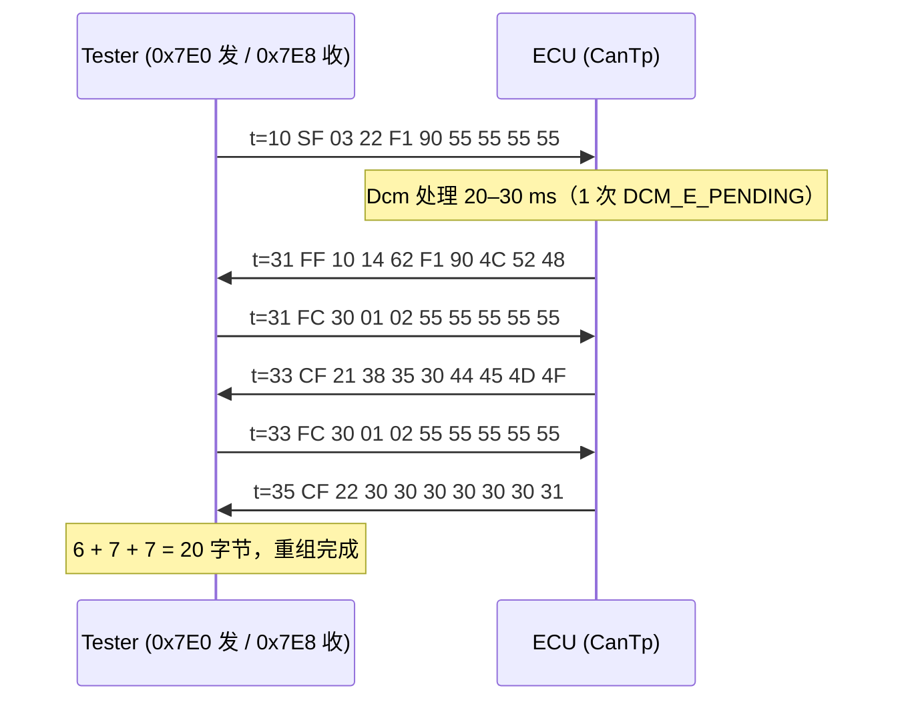

# ISO 15765-2（ISO-TP）：SF/FF/CF/FC 帧格式、BS/STmin、Padding、寻址与 `22 F1 90` 逐字节分析

> Prerequisite: [03-cantp.md](03-cantp.md)、[04-can-mcal/01 CAN 硬件基础](../04-can-mcal/01-can-hardware-basics.md)（帧结构、DLC）
> Next: [05-pdur.md](05-pdur.md)
> 对应规范: ISO 15765-2（Road vehicles — Diagnostic communication over CAN — Part 2: Transport protocol and network layer services）。**本仓库没有 ISO 15765-2 原文**，本章帧格式、STmin 编码、计时参数、寻址格式均为公认内容，需以 ISO 原文（注意 2011 / 2016 / 2024 版差异）与 OEM 传输层规范确认。AUTOSAR DCM SWS R20-11 引用 ISO 15765-2 作为 UDS on CAN 的传输层（`AUTOSAR_SWS_DiagnosticCommunicationManager.pdf` 文献表 [12]，以及 p.53 `SWS_Dcm_00030` 对 ISO 15765-3 网络无关部分的引用，研究笔记 02 §3.1）。
> 对应源码: 本项目 `examples/uds_diag_demo/com/CanTp.c`（PCI 编解码）、`sim/UdsTester.c`（tester 侧独立的 ISO-TP 实现）、`artifacts/uds-demo/trace.txt`（实测帧）；openAUTOSAR `communication/CAN/CanTp/src/CanTp.c:119-142`（PCI 与 payload 宏）、`:221`（`getFrameType`）、`:393-430`（padding helper）

---

## 1. 本章目标

1. 看到 CANoe / trace 中任意一帧 ISO-TP 帧，能立刻说出它是 SF/FF/CF/FC 中的哪一种、长度/序号/流控参数是多少。
2. 把 `22 F1 90` 请求与 20 字节 `62 F1 90 + VIN` 响应拆成逐帧、逐字节，并标出每一帧在 ECU 内部触发了哪个 AUTOSAR API。
3. 理解 BS、STmin、padding 如何影响帧数、FC 数和总耗时，并用 demo 实测验证。
4. 区分 normal / normal-fixed / extended / mixed 寻址，以及物理 / 功能寻址的约束。
5. 知道 CAN FD 下 ISO-TP 帧格式变化的要点。

---

## 2. 为什么要懂到字节级？

`[Real Project Consideration]` 诊断问题最终都落在总线 trace 上。当 tester 报 “N_Bs timeout” 或 “No response”，你手里通常只有 CANoe 的一列十六进制。能否在 30 秒内判断“是 ECU 没回 FC、FC 的 STmin 写错了单位、还是 CF 的 SN 跳号”，直接决定排查效率。上一章讲了状态机，本章把状态机的每次迁移对应到总线上的具体字节。

---

## 3. 在系统中的位置

```text
ISO 14229-1  UDS 应用层            22 F1 90  /  62 F1 90 <VIN>          ← Dcm（DSL/DSD/DSP）
ISO 14229-3 / ISO 15765-3  UDS on CAN 的会话/时序（P2、S3）              ← Dcm DSL
ISO 15765-2  网络层/传输层         SF / FF / CF / FC，BS，STmin，N_xx     ← CanTp
ISO 11898    数据链路层/物理层     CAN ID、DLC、8 字节 data field         ← CanIf + Can + RS-CANFD
```

AUTOSAR 的切分：CanTp 实现 ISO 15765-2；**N_PCI 字节只存在于 CanTp 与对端 CanTp 之间**，CanIf 以下把它们当普通数据，PduR/Dcm 以上永远看不到它们。

---

## 4. 帧格式定义（经典 CAN，CAN_DL = 8）

`[Conceptual]` ISO 15765-2 公认内容（normal 寻址）：

| 帧类型 | N_PCI 字节 | 高 4 位 | 低 4 位 / 后续字节 | 数据字节 | 用途 |
|---|---|---|---|---|---|
| **SF** Single Frame | 1 | `0` | SF_DL：1–7 | ≤ 7 | 整条消息一帧装下 |
| **FF** First Frame | 2 | `1` | FF_DL 高 4 位 + 下一字节低 8 位 = 12 位 FF_DL（8–4095） | 6 | 分段消息的第一帧 |
| **CF** Consecutive Frame | 1 | `2` | SN：1,2,…,15,0,1,… | ≤ 7 | 后续数据 |
| **FC** Flow Control | 3 | `3` | FS（0 CTS / 1 WAIT / 2 OVFLW）；byte1 = BS；byte2 = STmin | 0 | 接收方控制发送方 |

补充规则：

- **FF_DL ≤ 7 非法**（能用 SF 表达就必须用 SF）；本 demo 检查于 `CanTp.c:234-237`。
- **FF_DL > 4095**：2016 版引入 escape 序列——FF 的 12 位长度写 0，后跟 4 字节 32 位长度（此时 FF 只剩 2 字节数据）。本 demo 不支持（`CanTp.h:12-13`）。
- **SN**：第一个 CF 的 SN = 1；15 之后回到 0（不是 1）。demo：发送 `CanTp.c:551`、接收 `:302`。
- **FS 其它值**保留；收到非法 FS 应中止（`CanTp.c:455-457`）。

### 4.1 BS 与 STmin

| 参数 | 取值 | 含义 |
|---|---|---|
| **BS**（Block Size） | 0 | 发送方之后**不再等 FC**，一口气发完 |
| | 1–255 | 每发 BS 个 CF 后等下一个 FC |
| **STmin** | 0x00–0x7F | 0–127 ms |
| | 0x80–0xF0 | 保留 |
| | 0xF1–0xF9 | 100–900 µs（步长 100 µs） |
| | 0xFA–0xFF | 保留 |

收到保留的 STmin 值时，发送方应按最大值 0x7F（127 ms）处理——demo 的 `CanTp_DecodeStMin`（`CanTp.c:87-96`）正是如此，并把 0xF1–0xF9 向上取整到 1 ms（受 1 ms MainFunction 粒度限制）。

**单位陷阱**：STmin 是**十六进制编码的毫秒数**。FC `30 00 14` 的 STmin 是 0x14 = **20 ms**，不是 14 ms（§14 实验 1 中正好出现）。

### 4.2 Padding

经典 CAN 下，ISO-TP 帧可以：

- **padding 到 8 字节**（DLC=8），未用字节填固定值；常见取值 0xCC（ISO 15765-2:2016 的推荐值，需以原文确认）、0x55、0xAA、0x00，由 OEM 规定；
- 或 **不 padding**（DLC = PCI + 数据长度），称为 CAN frame data optimization。

接收方必须忽略 padding 字节的内容；但 DLC 本身是否必须为 8，取决于 OEM 规范——这就是 [02 章](02-canif-configuration.md) §5.6 DLC check 的风险来源。本 demo：ECU 发送用 0xCC（`CanTp_Cfg.h:17`，`CanTp.c:98-109`），tester 用 0x55（`SimHarness.c:28`）——**两个方向的 padding 可以不同**，trace 中一眼可以看出某帧是谁发的。

### 4.3 CAN FD 下的变化（概念）

`[Conceptual]` CAN FD（CAN_DL 最多 64）时：

| 帧 | 变化 |
|---|---|
| SF | CAN_DL ≤ 8 时同经典格式；CAN_DL > 8 时 byte0 = `0x00`（SF_DL escape），byte1 = SF_DL（最多 62，normal 寻址） |
| FF | 格式同上，但数据部分 = CAN_DL − 2 |
| CF | 数据部分 = CAN_DL − 1（最多 63） |
| Padding | CAN FD 的 DLC 只能取 0–8、12、16、20、24、32、48、64，所以最后一帧必须 padding 到下一个合法长度 |

FF 之后发送方使用的 CAN_DL 由 FF 的 CAN_DL 决定（接收方据此判断）。RS-CANFD 的 FD 模式寄存器偏移与经典模式不同（研究笔记 04），这部分属于 Can 驱动；CanTp 只关心 payload 长度。本 demo 不支持 FD。

---

## 5. 寻址格式

`[Conceptual]`

| 格式 | CAN ID | N_AI 在哪 | SF 最大数据 | 典型使用 |
|---|---|---|---|---|
| **Normal** | 11-bit，每个 (源,目的) 一对 ID，例 0x7E0/0x7E8 | 隐含在 CAN ID | 7 | 乘用车 UDS 最常见；本 demo |
| **Normal fixed** | 29-bit：物理 `0x18DA<TA><SA>`，功能 `0x18DB<TA><SA>` | CAN ID 中的 TA/SA 字段 | 7 | 商用车、部分 OEM |
| **Extended** | 任意 | **data byte0 = N_TA** | 6 | 网关后面的多个 ECU 共用 CAN ID |
| **Mixed** | 11-bit 或 29-bit（`0x18CE<TA><SA>` 物理 / `0x18CD<TA><SA>` 功能） | **data byte0 = N_AE**（地址扩展） | 6 | 远程诊断/子网 |

物理 vs 功能寻址：

| | 物理（physical，1:1） | 功能（functional，1:n） |
|---|---|---|
| 本 demo ID | 0x7E0 → 0x7E8 | 0x7DF → 各 ECU 用自己的物理响应 ID（本 ECU 0x7E8） |
| 帧类型 | SF / FF / CF / FC 都可 | **只能 SF**（多个 ECU 不可能同时对一个 FF 回 FC）。demo：`CanTp.c:226-229` 拒绝功能 FF，`:408` 拒绝功能长度 > 7 的发送 |
| 典型请求 | 所有服务 | `3E 80`（TesterPresent，抑制响应）、`10 01`、`28`、`85`、OBD `01 xx` |

openAUTOSAR 支持 `CANTP_STANDARD` 与 `CANTP_EXTENDED` 两种（`CanTp.c:232`、`:924`），extended 时 payload 宏少 1 字节（`:135-142`：SF 7/6、FF 6/5、CF 7/6）；不支持 mixed。

---

## 6. 通道参数从哪来

| 参数 | ECU 作为接收方（写进 ECU 发出的 FC） | ECU 作为发送方（来自 tester 的 FC） |
|---|---|---|
| 本 demo 来源 | `CanTp_Cfg.c:17-18`：BS = 2，STmin = 5 ms | `Sim_PowerOn(testerBs, testerStMin)`（`SimHarness.c:15-29`）；`main_demo.c:47` 用 BS = 1、STmin = 2 |
| 真实项目来源 | CanTp 配置（OEM 传输层规范） | tester 配置（CANoe / ODX 中的 CP_BlockSize、CP_STmin 等） |
| 运行时存放 | 配置常量 | `CanTp_Tx[0].bs / stMinMs`（`CanTp.c:439-441`） |

---

## 7. 逐字节分析：`22 F1 90` → 20 字节 VIN 响应

`[Educational Implementation]` 以下全部取自 `artifacts/uds-demo/trace.txt` 第一段（运行 `python tools/run_uds_demo.py` 可复现）。tester 参数 BS = 1、STmin = 2 ms。VIN = `LRH850DEMO0000001`（17 字节）。

### 7.1 帧序列总览



### 7.2 每一帧逐字节

**帧 1：请求 SF（tester → ECU，CAN ID 0x7E0）** — trace `[10 ms]`

| 字节 | 值 | 含义 |
|---|---|---|
| 0 | `03` | 高 4 位 0 = SF；低 4 位 SF_DL = 3 |
| 1–3 | `22 F1 90` | UDS：SID 0x22 ReadDataByIdentifier，DID 0xF190（VIN） |
| 4–7 | `55 55 55 55` | tester padding |

ECU 内部（`[11 ms]`，同一 ISR 内）：`CanIf_RxIndication` → `CanTp_RxIndication(N-PDU 0)` → `CanTp_RxSingleFrame`（SF_DL = `data[0] & 0x0F`，`CanTp.c:187`）→ `PduR_CanTpStartOfReception(0, …, 3, …)` → `Dcm_StartOfReception` → `PduR_CanTpCopyRxData`（3 字节）→ `PduR_CanTpRxIndication(E_OK)` → `Dcm_TpRxIndication`。

**帧 2：响应 FF（ECU → tester，0x7E8）** — trace `[30 ms]` 写入 TX buffer，`[31 ms]` 上总线

| 字节 | 值 | 含义 |
|---|---|---|
| 0 | `10` | 高 4 位 1 = FF；低 4 位 = FF_DL 的 bit 11–8 = 0 |
| 1 | `14` | FF_DL 低 8 位 → FF_DL = 0x014 = **20** |
| 2–4 | `62 F1 90` | 正响应 SID（0x22 + 0x40）+ DID 回显 |
| 5–7 | `4C 52 48` | VIN 前 3 字节 “LRH” |

ECU 内部（`[30 ms]`，Dcm_MainFunction 上下文）：`PduR_DcmTransmit(0, len=20)` → `CanTp_Transmit` → `CanTp_TxSendNext` 写 PCI（`CanTp.c:345-350`）→ `PduR_CanTpCopyTxData(6 字节)` → `Dcm_CopyTxData` 把 `Dcm_DslTxBuffer[0..5]` 拷进帧 → `CanIf_Transmit(L-PDU 0)` → `Can_Write(HTH 2)`。`[31 ms]` 确认回来后 CanTp 进入 `TX_WAIT_FC`，启动 N_Bs。

**帧 3：FC（tester → ECU，0x7E0）** — trace `[31 ms]`

| 字节 | 值 | 含义 |
|---|---|---|
| 0 | `30` | 高 4 位 3 = FC；FS = 0 = CTS（继续发） |
| 1 | `01` | BS = 1：每 1 个 CF 后再等 FC |
| 2 | `02` | STmin = 2 ms |
| 3–7 | `55…` | padding |

ECU 内部（`[32 ms]`，ISR）：`CanTp_RxIndication(N-PDU 0)` 看到 PCI = 3 → 查 `rxFcNPduId == 0` 的 Tx N-SDU → `CanTp_TxFlowControl`：记录 BS = 1、STmin = 2，状态 `TX_WAIT_STMIN`、计时 0（`CanTp.c:438-447`）。同一 tick 的 `CanTp_MainFunction` 立即发出 CF1。

**帧 4：CF1（ECU → tester）** — `[32 ms]` 写入、`[33 ms]` 上总线

| 字节 | 值 | 含义 |
|---|---|---|
| 0 | `21` | 高 4 位 2 = CF；SN = 1 |
| 1–7 | `38 35 30 44 45 4D 4F` | VIN 第 4–10 字节 “850DEMO” |

**帧 5：FC（tester → ECU）** — `[33 ms]`，同帧 3。因为 BS = 1，tester 每收一个 CF 就回一个 FC。

**帧 6：CF2（ECU → tester）** — `[34 ms]` 写入、`[35 ms]` 上总线

| 字节 | 值 | 含义 |
|---|---|---|
| 0 | `22` | CF，SN = 2 |
| 1–7 | `30 30 30 30 30 30 31` | VIN 第 11–17 字节 “0000001”（恰好 7 字节，**无 padding**） |

`[35 ms]` 确认回来：`sent = 6 + 7 + 7 = 20 ≥ total` → `PduR_CanTpTxConfirmation(E_OK)` → `Dcm_TpTxConfirmation` → 启动 S3。

### 7.3 每一帧对应的 AUTOSAR API（汇总）

| 时间 | 帧 | 方向 | ECU 侧上下文 | ECU 侧 API 链 |
|---|---|---|---|---|
| 10/11 ms | SF `03 22 F1 90` | T→E | RX ISR（EI190） | `CanIf_RxIndication` → `CanTp_RxIndication` → `PduR_CanTpStartOfReception/CopyRxData/RxIndication` → `Dcm_*` |
| 20 ms | — | — | Dcm_MainFunction | DSD → DSP → `Rte_Call_DataServices_DID_F190_ReadData(DCM_INITIAL)` → `DCM_E_PENDING` |
| 30 ms | FF `10 14 …` 写入 | E→T | Dcm_MainFunction | `PduR_DcmTransmit` → `CanTp_Transmit` → `PduR_CanTpCopyTxData` → `Dcm_CopyTxData` → `CanIf_Transmit` → `Can_Write` |
| 31 ms | FF 上总线、确认 | — | 1 ms task | `Can_MainFunction_Write` → `CanIf_TxConfirmation` → `CanTp_TxConfirmation`（→ TX_WAIT_FC） |
| 31/32 ms | FC `30 01 02` | T→E | RX ISR | `CanIf_RxIndication` → `CanTp_RxIndication`（FC 分支，不经 PduR） |
| 32 ms | CF1 `21 …` 写入 | E→T | CanTp_MainFunction | `PduR_CanTpCopyTxData`（7 B）→ `CanIf_Transmit` → `Can_Write` |
| 33 ms | CF1 确认；FC | — | 1 ms task / ISR | `CanTp_TxConfirmation`（BS 用完 → TX_WAIT_FC）；FC → TX_WAIT_STMIN |
| 34 ms | CF2 `22 …` 写入 | E→T | CanTp_MainFunction | 同 CF1 |
| 35 ms | CF2 确认 | — | 1 ms task | `CanTp_TxConfirmation` → `PduR_CanTpTxConfirmation(E_OK)` → `Dcm_TpTxConfirmation` |

### 7.4 同一段 trace 中的其它典型帧

| trace | 帧 | 解读 |
|---|---|---|
| `[40 ms]` `10 0B 62 F1 87 53 57 30` | FF，FF_DL = 0x00B = 11 | `22 F1 87` 的响应 11 字节 > 7，所以仍然分段 |
| `[42 ms]` `21 31 30 32 30 33 CC CC` | CF SN=1，5 字节数据 + 2 字节 **ECU padding 0xCC** | 11 = 6 + 5 |
| `[71 ms]` `10 0D 2E F1 A0 A0 A1 A2` | tester 发的 FF，FF_DL = 13 | `2E F1 A0` + 10 字节数据 |
| `[72 ms]` `30 02 05 CC CC CC CC CC` | **ECU 发的 FC**：CTS、BS = 2、STmin = 5 ms | 来自 `CanTp_Cfg.c:17-18`；padding 0xCC 说明是 ECU 发的 |
| `[73 ms]` `21 A3 A4 A5 A6 A7 A8 A9` | tester CF SN=1 | 13 = 6 + 7，只需 1 个 CF，BS = 2 没用完 |
| `[670 ms]` `03 7F 22 78 CC CC CC CC` | ECU 发的 SF：NRC 0x78 ResponsePending | 0x78 也走同一个 Tx N-SDU；单帧 |

### 7.5 帧数公式

对于经典 CAN、normal 寻址、消息长度 N：

```text
N ≤ 7         : 1 个 SF
N ≥ 8         : 1 个 FF + C 个 CF，C = ceil((N − 6) / 7)
FC 个数       : BS = 0 → 1；BS > 0 → ceil(C / BS)
N = 20        : C = ceil(14/7) = 2；BS=1 → 2 个 FC；BS=2 → 1 个 FC；BS=0 → 1 个 FC
N = 4095      : C = ceil(4089/7) = 585
```

`[Conceptual]` 总线耗时粗估：500 kbit/s 下一个 8 字节标准帧约 111 bit + 填充位 ≈ 0.22–0.27 ms。对于 20 字节响应，总线本身只占约 1 ms；trace 中 FF→最后 CF 的 4 ms 主要来自 1 ms 调度粒度与 BS = 1 时的 FC 往返。对于 4 KB 的下载，STmin 与 BS 的选择决定的是秒级差异。

---

## 8. RH850 Hardware Mapping

`[RH850 Hardware]`

| ISO-TP 概念 | 谁处理 | RS-CANFD（P1M-E） |
|---|---|---|
| N_PCI + 数据 + padding 共 8 字节 | CanTp 组帧（软件） | Can 驱动写入 TX buffer 数据寄存器 `TMDF0_p / TMDF1_p`（经典模式各 4 字节） |
| DLC = 8 | CanTp 给 `SduLength = 8`（`CanTp.c:107`） | `TMPTRp` 的 DLC 字段 |
| CAN ID 0x7E8 | CanIf 配置 | `TMIDp` |
| 接收帧的 8 字节 | Can ISR 读出 | RX FIFO 的 `RFDF0_x / RFDF1_x`，`RFPTRx` 中 DLC |
| 字节序 | AUTOSAR 规定“先收到的 data byte 为数组元素 0”，硬件表示不同时由 Can 驱动适配（`SWS_Can_00060`，CAN SWS R22-11 p.48） | 寄存器中 data byte0 位于 `RFDF0_x`/`TMDF0_p` 的哪个字节：**需根据实际芯片手册的 data field 映射图确认**；CanTp 只看到已按 AUTOSAR 顺序排好的数组 |
| FD 帧（64 字节） | Can 驱动 FD 配置 | FD 模式下的寄存器布局与偏移不同（GRMCFG.RCMC 选择），见 [04-can-mcal/02](../04-can-mcal/02-rh850-can-peripheral.md) |

padding、SN、FC 全部是**软件**行为：RS-CANFD 不理解 ISO-TP，它只负责把 8 个字节和 DLC 按 CAN 协议发出去。所以 ISO-TP 层面的 bug 永远在 CanTp（或对端 tester），不在 MCAL。

---

## 9. openAUTOSAR 实现（R3.1.5 参考）

| 关注点 | 位置 | 观察 |
|---|---|---|
| PCI 宏 | `CanTp.c:119-131` | `ISO15765_TPCI_MASK 0x30`——注意它用 `0x30` 作掩码取帧类型（只看 bit5–4），对合法帧没问题，但不会把高 4 位为 4–F 的非法 PCI 识别为错误 |
| payload 宏 | `CanTp.c:135-142` | SF 7/6、FF 6/5、CF 7/6（standard/extended） |
| 帧类型解码 | `getFrameType` `:221`；extended 分支 `:232` | extended 寻址时先跳过 byte0 |
| padding | `canReceivePaddingHelper` `:393`、`canTansmitPaddingHelper` `:409` | 只在 `CanTp*PaddingActivation == CANTP_ON` 时填充，填的是 **0x00**（注释 “TODO: Does it have to be padded with zeroes?” `:398/:421`）；示例配置中 padding 全部关闭 |
| FC 中的 BS | `sendFlowControlFrame` `:448-460` | BS 按上层剩余缓冲动态计算（`:451/:453`，`spaceFree / payload + 1`），而不是配置常量 |
| STmin 解码 | `handleNextTxFrameSent` `:670-677` | 0x00–0x7F 换算为周期 +1；0xF1–0xF9 → 1 个周期；其它 → 0x7F |
| FF_DL | 12 位 | 无 escape 支持 |

---

## 10. 当前教学项目实现

`[Educational Implementation]` 两套独立的 ISO-TP 实现互相校验：

| | ECU 侧 `com/CanTp.c` | Tester 侧 `sim/UdsTester.c` |
|---|---|---|
| 发 SF/FF | `CanTp_TxSendNext` `:339-350` | `UdsTester_SendRequest` `:100-116` |
| 发 CF | `CanTp_TxSendNext` `:351-358`（MainFunction 中按 STmin） | `UdsTester_MainFunction` `:203-230` |
| 发 FC | `CanTp_RxSendFc` `:133-152` | `UdsTester_SendFc` `:68-77`（只发 CTS） |
| 收 SF/FF/CF/FC | `CanTp_RxIndication` `:466-498` | `UdsTester_HandleFrame` `:119-192` |
| padding | 0xCC | 0x55 |
| STmin 解码 | `CanTp_DecodeStMin` `:87-96` | `:178`（> 0x7F 一律按 1 ms） |

“两个独立实现能互通”本身就是一种测试：如果 ECU 的编码有错，tester 会报“wrong SN”或重组长度不对，`tests/test_uds_demo.c` 的 80 个检查会失败。

---

## 11. Code Walkthrough：编码与解码

```c
/* [Educational Implementation] examples/uds_diag_demo/com/CanTp.c:339-358（编码，节选） */
case CANTP_FRAME_SF: frame[0] = (uint8)(CANTP_PCI_SF << 4 | (uint8)rt->total);                 pciLen = 1u; break;
case CANTP_FRAME_FF: frame[0] = (uint8)((CANTP_PCI_FF << 4) | (uint8)((rt->total >> 8) & 0x0Fu));
                     frame[1] = (uint8)(rt->total & 0xFFu);                                     pciLen = 2u; break;
default:             frame[0] = (uint8)((CANTP_PCI_CF << 4) | rt->sn);                         pciLen = 1u; break;
```

```c
/* [Educational Implementation] 解码（节选）
 * SF_DL : CanTp.c:187   len   = data[0] & 0x0F
 * FF_DL : CanTp.c:233   total = ((data[0] & 0x0F) << 8) | data[1]
 * SN    : CanTp.c:275   sn    = data[0] & 0x0F
 * FC    : CanTp.c:428   fs = data[0] & 0x0F; bs = data[1] (:439); stMin = Decode(data[2]) (:441) */
```

要点：

- 帧类型统一用 `data[0] >> 4`（`CanTp.c:474`），比 openAUTOSAR 的 `& 0x30` 更严格，非法 PCI（4–F）会走 `default` 分支被忽略（`:491-493`）。
- SF 的合法性检查（`CanTp.c:192`）：`len == 0`、`len > 7`、`len > SduLength − 1` 都忽略——最后一条防止“DLC = 4 却声称 SF_DL = 7”的畸形帧导致越界读。
- padding 在 `CanTp_SendFrame`（`:98-109`）统一完成，并总是以 DLC = 8 发送。

---

## 12. Debug 方法：读 trace 的检查清单

拿到一段 0x7E0/0x7E8 的 trace，按顺序问：

1. **byte0 高 4 位**是 0/1/2/3 中哪一个？不是 → 不是 ISO-TP 帧（或 extended/mixed 寻址，byte0 是地址）。
2. SF：SF_DL 与 DLC 是否自洽？FF：FF_DL 是否 ≥ 8？
3. FF 之后，**对方是否在 N_Bs 内回了 FC**？FC 的 CAN ID 是否是对方的发送 ID（ECU 发的 FC 用 0x7E8）？
4. FC 的 FS 是 CTS/WAIT/OVFLW 哪个？STmin 按**十六进制**解读了吗？
5. CF 的 SN 是否从 1 开始、连续、15 后回 0？
6. CF 间隔是否 ≥ STmin？每 BS 个 CF 后是否等了 FC？
7. 最后一个 CF 的有效字节数 = 剩余长度？padding 字节是否被错误地计入？
8. 谁的 padding？（本 demo：0xCC = ECU，0x55 = tester）

ECU 侧断点：`CanTp_RxIndication`（看原始字节）、`CanTp_TxSendNext` 中 `CanTp_SendFrame` 调用前（看组好的帧）。

---

## 13. 常见错误

| 错误 | 总线现象 |
|---|---|
| STmin 当十进制写（想要 20 ms 写成 `0x20`） | 实际 32 ms，下载速度降低 |
| SN 从 0 开始 | 对方第一个 CF 就报 wrong SN |
| FC 用了请求 ID | 对方收不到 FC → N_Bs 超时 |
| 功能寻址发多帧请求 | ECU 忽略（demo `CanTp.c:226-229`），tester 等不到 FC |
| extended 寻址只配了一边 | 一边把 byte0 当 PCI、一边当 N_TA，全部错乱 |
| padding 计入数据 | 重组后消息尾部多出 0xCC/0x55 |
| FF_DL 与实际 CF 数据不符 | 接收方在最后一个 CF 后仍在等，或提前结束 |
| CAN FD 帧 DLC 非法值 | 硬件层面就发不出去（Can 驱动报 `CAN_E_PARAM_DATA_LENGTH`） |

---

## 14. 实验

在仓库外的临时副本中用自写 `main` 调 `Sim_PowerOn(bs, stmin)` 后发 `22 F1 90`，不改动仓库 demo。以下为实测（只保留总线帧与关键 CanTp 行）。

### 实验 1：BS = 0、STmin = 20 ms

```text
[    31 ms] [Bus     ] ECU    -> wire  ID=0x7E8 DLC=8  10 14 62 F1 90 4C 52 48
[    31 ms] [Bus     ] Tester -> wire  ID=0x7E0 DLC=8  30 00 14 55 55 55 55 55
[    32 ms] [CanTp   ] TX TxNSdu_DiagPhys: FC CTS received (BS=0 STmin=20 ms) -> CFs from CanTp_MainFunction
[    33 ms] [Bus     ] ECU    -> wire  ID=0x7E8 DLC=8  21 38 35 30 44 45 4D 4F
[    53 ms] [Bus     ] ECU    -> wire  ID=0x7E8 DLC=8  22 30 30 30 30 30 30 31
RESULT len=20 after 43 ms
```

观察：FC 只有 1 个（BS = 0）；FC 的 byte2 是 `14`（= 20 ms）；两个 CF 上总线间隔正好 20 ms。

### 实验 2：BS = 2、STmin = 10 ms

```text
[    31 ms] [Bus     ] ECU    -> wire  ID=0x7E8 DLC=8  10 14 62 F1 90 4C 52 48
[    31 ms] [Bus     ] Tester -> wire  ID=0x7E0 DLC=8  30 02 0A 55 55 55 55 55
[    33 ms] [Bus     ] ECU    -> wire  ID=0x7E8 DLC=8  21 38 35 30 44 45 4D 4F
[    43 ms] [Bus     ] ECU    -> wire  ID=0x7E8 DLC=8  22 30 30 30 30 30 30 31
RESULT len=20 after 33 ms
```

两个 CF 在一个 block 内（BS = 2），只有 1 个 FC；间隔 10 ms。

### 实验 3：BS = 0、STmin = 0

```text
[    31 ms] [Bus     ] Tester -> wire  ID=0x7E0 DLC=8  30 00 00 55 55 55 55 55
[    33 ms] [Bus     ] ECU    -> wire  ID=0x7E8 DLC=8  21 38 35 30 44 45 4D 4F
[    34 ms] [Bus     ] ECU    -> wire  ID=0x7E8 DLC=8  22 30 30 30 30 30 30 31
RESULT len=20 after 24 ms
```

STmin = 0 时 CF 仍相隔 1 ms：本 demo 的 CF 由 1 ms MainFunction 发出，且必须等上一帧确认（[03 章](03-cantp.md) §7.5）。对比默认配置（BS = 1、STmin = 2）的 25 ms：三种参数下总耗时 24 / 25 / 33 / 43 ms 的差异来自 FC 往返次数和 STmin。

### 实验 4（纸笔）：解码练习

不看答案，解码以下帧（normal 寻址，ECU 响应 ID 0x7E8）：

```text
0x7E8  10 7A 59 02 FF 00 01 23
0x7E0  30 08 F5 00 00 00 00 00
0x7E8  21 45 67 89 2F 00 02 34
...
0x7E8  2F ...   0x7E8  20 ...
```

问题：消息总长（0x07A = ?）？是什么服务的响应？tester 要求的 BS 和 STmin 是多少（0xF5 = ?）？完整传完需要几个 CF、几个 FC？第 15、16 个 CF 的 PCI 字节分别是什么？（参考答案：122 字节；0x19 子功能 0x02 的正响应；BS = 8、STmin = 500 µs；17 个 CF、3 个 FC；`2F`、`20`）

---

## 15. 思考题

1. 为什么功能寻址不允许多帧？如果 OEM 需要功能寻址发一个 10 字节的请求，有什么办法？
2. SN 只有 4 位，接收方如何区分“SN = 1 是第 1 个 CF”还是“第 17 个 CF”？它真的需要区分吗？
3. extended 寻址把 N_TA 放进 data byte0，代价是每帧少 1 字节 payload。在什么网络拓扑下这个代价值得？
4. 接收方为什么要在 FC 中声明 STmin，而不是让发送方“尽快发”？结合 RS-CANFD RX FIFO 深度（`RFCCx.RFDC`）与 EI190 ISR 执行时间思考。
5. 一条 4095 字节的消息在 BS = 0、STmin = 0 时是否一定比 BS = 8、STmin = 0 更快？考虑接收方缓冲与 FC.WAIT。

---

## 16. 对未来真实项目的意义

`[Real Project Consideration]`

- OEM 诊断规范里通常有一张“传输层参数表”：寻址格式、请求/响应 ID、padding 值、BS、STmin、N_As…N_Cr、是否允许 CAN FD。把它和 CanTp/CanIf 配置逐项核对，是集成诊断时的第一件事。
- 用 CANoe 时打开 ISO-TP / Diagnostics 解析视图，但**也要会读原始字节**——解析视图对配置错误（例如 extended 寻址配错）往往显示得莫名其妙。
- Flash 下载性能调优就是在 BS/STmin、ECU 接收 ISR 负载、Flash 写入时间之间找平衡；bootloader 往往与应用使用不同的 CanTp 参数。
- 从经典 CAN 迁移到 CAN FD 诊断时，SF escape、FF/CF payload、DLC 合法值、padding 规则都会变；Can 驱动、CanIf DLC check、CanTp 配置要一起升级。

---

## 17. 本章总结

```text
byte0 高 4 位：0 = SF（低 4 位长度）  1 = FF（12 位长度）  2 = CF（SN）  3 = FC（FS, BS, STmin）
22 F1 90 → SF 03 22 F1 90
62 F1 90 + 17 字节 VIN（20 字节）→ FF 10 14 … ← FC 30 01 02 → CF 21 … ← FC → CF 22 …
帧数 = 1 + ceil((N−6)/7)；FC 数由 BS 决定；CF 间隔 ≥ STmin（hex ms，0xF1–F9 为 µs）
```

---

## 18. 下一章

[05-pdur.md](05-pdur.md)：CanTp 把完整的 N-SDU 交给的并不是 Dcm，而是 PduR。下一章解释 PduR 为什么存在、TP 与 IF 两类 API 有何不同、`PduR_DcmTransmit` 与 `PduR_CanTp*` 如何查路由表，以及 openAUTOSAR “zero cost” 宏如何让路由表形同虚设。
