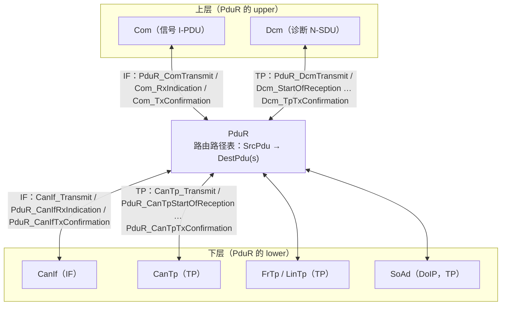
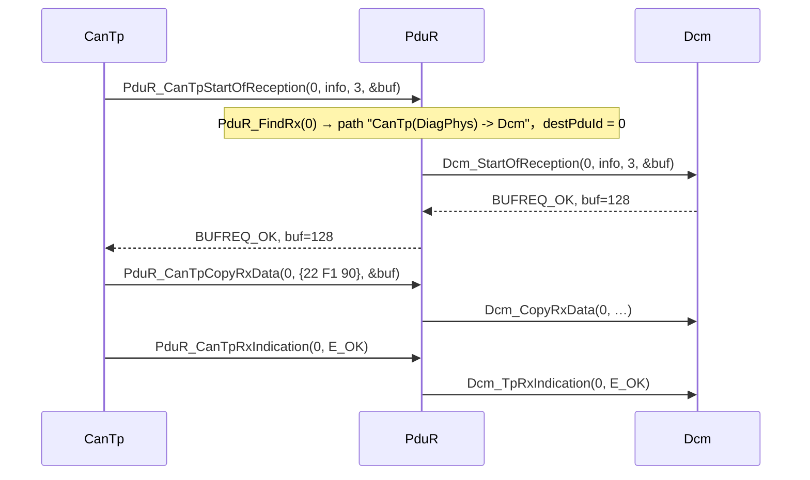
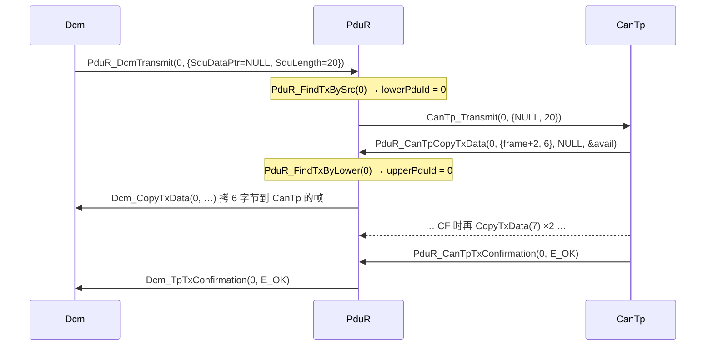
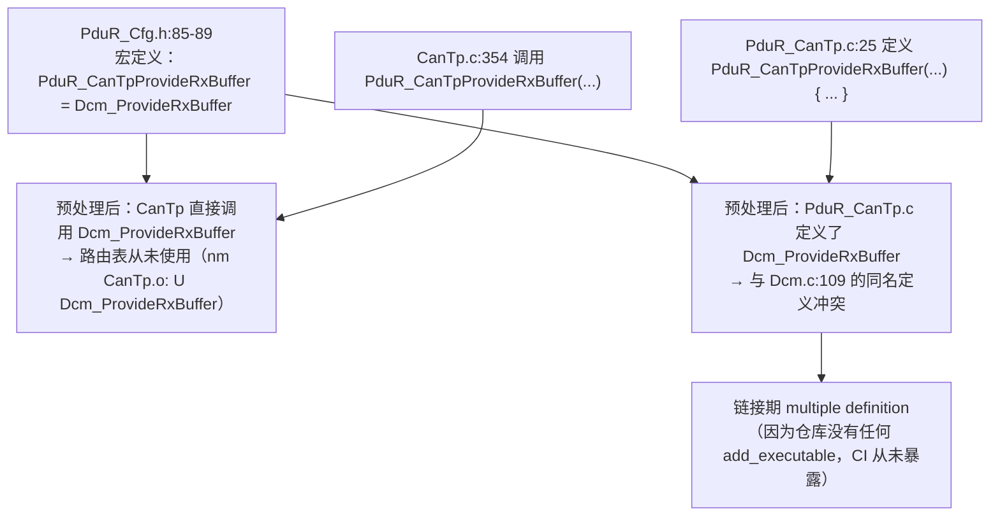

# PduR：PDU 路由器——TP 与 IF 两类接口、路由路径、`PduR_DcmTransmit` 与 zero-cost 陷阱

> Prerequisite: [03-cantp.md](03-cantp.md)、[04-isotp.md](04-isotp.md)、[01-canif.md](01-canif.md)
> Next: [06-can-rx-path.md](06-can-rx-path.md)
> 对应规范: AUTOSAR CP **R20-11** SWS DCM p.23（DCM 网络无关，只与 PduR 交互）、p.243–247（`Dcm_StartOfReception/CopyRxData/TpRxIndication/CopyTxData/TpTxConfirmation`，即 PduR 的 TP 上层接口在 Dcm 一侧的形态）、p.85–86（No/Silent Com 时不得调用 `PduR_DcmTransmit`，`SWS_Dcm_00148–00156`）、`SWS_Dcm_00115`（DSL 经 `PduR_DcmTransmit` 发送响应，研究笔记 02 §3.2）。**本仓库没有 PduR SWS**：PduR 自身 API 名、配置容器（`PduRRoutingPath`、`PduRSrcPdu`、`PduRDestPdu`…）按公认 R4.x 形态描述，需以项目 release 的 PduR SWS 确认。
> 对应源码: 本项目 `examples/uds_diag_demo/com/PduR.h`、`PduR.c`、`PduR_Cfg.h`、`PduR_Cfg.c`；openAUTOSAR（R3.1.5）`communication/ComServices/PDURouter/include/PduR_Cfg.h:42`、`:77-130`，`src/PduR_CanTp.c:23-43`，`src/PduR_Dcm.c:19-23`，`src/PduR_CanIf.c:19-28`，`src/PduR_Logic.c:124`，`src/PduR_Routing.c:52`，`include/PduR_PbCfg.h:34`

---

## 1. 本章目标

1. 说清 PduR 存在的理由：为什么 Dcm 不直接调用 CanTp，Com 不直接调用 CanIf。
2. 区分 PduR 的 **IF（Interface）类 API** 与 **TP（Transport Protocol）类 API**：数据如何传递、谁拥有缓冲、在什么上下文调用。
3. 读懂一条“路由路径（routing path）”的配置：源 PDU、目的 PDU、handle 如何在 PduR 中被翻译。
4. 逐行读懂本 demo 的 `PduR_DcmTransmit` 与 `PduR_CanTp*` 五个函数。
5. 理解 “zero-cost operation” 的含义，以及 openAUTOSAR `PduR_Cfg.h:77-130` 的宏为什么会导致路由表被绕过和链接期重复符号——并在 demo 上实测复现。

---

## 2. 为什么需要 PduR？

`[Conceptual]` PduR 是通信栈中间的一块“配线架（switchboard）”：

| 需求 | 没有 PduR | 有 PduR |
|---|---|---|
| **上层与传输层解耦** | Dcm 代码里写死 `CanTp_Transmit`；要支持 DoIP 就得改 Dcm | Dcm 只调 `PduR_DcmTransmit`；同一 Dcm 可接 CanTp、FrTp、LinTp、DoIP（SoAd） |
| **下层与上层解耦** | CanTp 写死“收到的都给 Dcm” | CanTp 只调 `PduR_CanTp*`；某个 N-SDU 给 Dcm、另一个给 J1939Dcm 或 CDD，由配置决定 |
| **网关** | 网关 ECU 每一路转发都要手写代码 | 路由路径直接把 CAN1 的 I-PDU 转发到 CAN2 / FlexRay；TP 网关可边收边转（on-the-fly） |
| **扇出（1:n）** | 一个 I-PDU 同时给 Com 和 IpduM，需要两份回调 | 一条路由路径多个目的 PDU |
| **统一 handle 管理** | 每对模块之间私下约定 id | PduR 是 handle 翻译点：源 id → 目的 id |

对一个**普通诊断 ECU**来说，PduR 在诊断路径上通常只做 1:1 转发——这也是 zero-cost 优化的出发点（§7.5）。但 Dcm 的代码依然只认识 PduR：换传输层时 Dcm 不需要改一行代码。

---

## 3. 在系统中的位置



注意 CanIf 同时出现在两处：Com 的 I-PDU 经 PduR 到 CanIf（IF 路径）；诊断帧则是 CanIf → CanTp → PduR（TP 路径），**PduR 并不处于 CanIf 与 CanTp 之间**。

---

## 4. AUTOSAR 如何定义？

### 4.1 两类 API：IF 与 TP

`[Conceptual]` R4.x 公认形态（本仓库无 PduR SWS）。命名规则：**下层调 PduR 时用 `PduR_<下层模块><动作>`；PduR 调上层时用 `<上层模块>_<动作>`。**

| | IF（Interface，单帧） | TP（Transport Protocol，分段） |
|---|---|---|
| 典型上层/下层 | Com ↔ CanIf / FrIf / LinIf | Dcm ↔ CanTp / FrTp / SoAd |
| 发送 | `PduR_ComTransmit(id, info)` → `CanIf_Transmit(id, info)`：**数据随调用一起传**（`SduDataPtr` 有效） | `PduR_DcmTransmit(id, info)` → `CanTp_Transmit(id, info)`：**只传长度**，数据之后由下层 `CopyTxData` 拉取 |
| 发送确认 | `PduR_CanIfTxConfirmation(id)` → `Com_TxConfirmation(id)` | `PduR_CanTpTxConfirmation(id, result)` → `Dcm_TpTxConfirmation(id, result)` |
| 接收 | `PduR_CanIfRxIndication(id, info)` → `Com_RxIndication(id, info)`：一次调用交付完整数据 | `PduR_CanTpStartOfReception` → `CopyRxData × n` → `PduR_CanTpRxIndication` → `Dcm_StartOfReception` → `Dcm_CopyRxData × n` → `Dcm_TpRxIndication` |
| Trigger transmit | `PduR_CanIfTriggerTransmit` → `Com_TriggerTransmit`（发送时才取数据） | — |
| 缓冲所有权 | 调用期间借用调用者缓冲 | 每层只拥有自己的缓冲，靠 Copy 交换 |
| 取消 | `PduR_<Up>CancelTransmit` | `PduR_<Up>CancelTransmit` / `CancelReceive` |

`[AUTOSAR API]` Dcm 一侧的 TP 回调签名在本仓库 DCM SWS R20-11 中有正式定义（p.243–247）：

```c
/* [AUTOSAR API] DCM SWS R20-11, SWS_Dcm_00094 / 00556 / 00093 / 00092 / 00351 */
BufReq_ReturnType Dcm_StartOfReception(PduIdType id, const PduInfoType* info,
                                       PduLengthType TpSduLength, PduLengthType* bufferSizePtr);
BufReq_ReturnType Dcm_CopyRxData(PduIdType id, const PduInfoType* info, PduLengthType* bufferSizePtr);
void              Dcm_TpRxIndication(PduIdType id, Std_ReturnType result);
BufReq_ReturnType Dcm_CopyTxData(PduIdType id, const PduInfoType* info, const RetryInfoType* retry,
                                 PduLengthType* availableDataPtr);
void              Dcm_TpTxConfirmation(PduIdType id, Std_ReturnType result);
```

PduR 的 `PduR_CanTp*` 下层接口与之参数完全相同，只是 `id` 属于 PduR 的 handle 空间。PduR 的工作就是：**查表把 `id` 换成目的模块的 id，再调用目的模块的同名函数。**

### 4.2 路由路径（R4.x 配置形态）

`[Conceptual]`

```text
PduR
├── PduRGeneral（DET、版本、零成本相关开关等；具体参数随 release 变化）
├── PduRBswModules（声明有哪些上/下层模块及其支持的 API：是否 TP、是否 TriggerTransmit…）
└── PduRRoutingPaths
    ├── PduRRoutingPathGroup（可运行时 Enable/Disable 的一组路径）
    ├── PduRTxBuffer（网关/扇出时的中间缓冲）
    └── PduRRoutingPath (1..*)
          ├── PduRSrcPdu   PduRSrcPduRef → EcucPdu；PduRSourcePduHandleId（源模块调用 PduR 时用的 id）
          └── PduRDestPdu (1..*)  PduRDestPduRef → EcucPdu；PduRDestPduHandleId；
                                  PduRDestPduDataProvision（DIRECT / TRIGGERTRANSMIT）；
                                  PduRDestTxBufferRef；PduRTpThreshold（TP 网关边收边转阈值）
```

一个诊断 ECU 的典型路径只有三条：

| 路径 | SrcPdu（谁调 PduR） | DestPdu（PduR 调谁） |
|---|---|---|
| 物理请求 | CanTp 的 Rx N-SDU（物理） | Dcm 的 `DcmDslProtocolRx`（物理） |
| 功能请求 | CanTp 的 Rx N-SDU（功能） | Dcm 的 `DcmDslProtocolRx`（功能） |
| 响应 | Dcm 的 `DcmDslProtocolTx` | CanTp 的 Tx N-SDU |

### 4.3 Dcm 对 PduR 的约束（本仓库可引用）

`[AUTOSAR Standard]` DCM SWS R20-11：

- DSL 通过 `PduR_DcmTransmit` 发送响应（`SWS_Dcm_00115`）；发送失败或负确认时**不重发**（`00118`，p.60）。
- ComM 报告 No Com 时不得调用 `PduR_DcmTransmit`；Silent Com 时禁止发送（`00148–00156`，p.85–86）。
- 上层（Dcm）的 TP 回调“可能在中断上下文被调用”——因为 PduR 在调用者上下文中同步转发。

---

## 5. 核心数据结构

`[Educational Implementation]` `com/PduR.h:26-61`：

| 结构 | 行号 | 含义 |
|---|---|---|
| `PduR_TpUpperLayerApiType` | `PduR.h:26-35` | 一个 TP 上层模块的五个函数指针（这里只有 Dcm 一个实例）。真实生成器通常直接生成调用，而不是函数指针表 |
| `PduR_RxRoutingPathType` | `PduR.h:38-43` | `srcPduId`（CanTp 调 PduR 用的 id）→ `destPduId`（DcmRxPduId）+ 目的模块 API |
| `PduR_TxRoutingPathType` | `PduR.h:46-54` | `srcPduId`（Dcm 调 `PduR_DcmTransmit` 用的 id）→ `lowerPduId`（CanTp Tx N-SDU）+ `lowerTransmit`；回程 `lowerCbkPduId`（CanTp 回调 PduR 时用的 id）→ `upperPduId`（DcmTxPduId） |
| `PduR_PBConfigType` | `PduR.h:56-61` | 两张路径表 |

TX 路径需要**两组** id，因为同一条路径被两个方向使用：

```text
去程：Dcm --PduR_DcmTransmit(srcPduId=0)--> PduR --CanTp_Transmit(lowerPduId=0)--> CanTp
回程：CanTp --PduR_CanTpCopyTxData(lowerCbkPduId=0)--> PduR --Dcm_CopyTxData(upperPduId=0)--> Dcm
```

配置实例 `com/PduR_Cfg.c:12-30`：

```c
/* [Educational Implementation] examples/uds_diag_demo/com/PduR_Cfg.c:17-25 */
static const PduR_RxRoutingPathType PduR_RxPaths[PDUR_NUM_RX_PATHS] = {
    { PduRConf_PduRSrcPdu_CanTp_DiagPhysReq, DcmConf_DcmDslProtocolRx_DiagPhys, &PduR_DcmApi, "CanTp(DiagPhys) -> Dcm" },
    { PduRConf_PduRSrcPdu_CanTp_DiagFuncReq, DcmConf_DcmDslProtocolRx_DiagFunc, &PduR_DcmApi, "CanTp(DiagFunc) -> Dcm" }
};
static const PduR_TxRoutingPathType PduR_TxPaths[PDUR_NUM_TX_PATHS] = {
    { PduRConf_PduRSrcPdu_Dcm_DiagResp, CanTpConf_TxNSdu_DiagPhys, CanTp_Transmit,
      PduRConf_PduRDestPdu_CanTp_DiagResp, DcmConf_DcmDslProtocolTx_DiagResp, &PduR_DcmApi, "Dcm -> CanTp(DiagPhys)" }
};
```

`PduR_Cfg.h:13-22` 的注释说明了谁使用哪个 id：CanTp 在 `PduR_CanTp*` 中传 `PduRConf_PduRSrcPdu_CanTp_*` 或 `PduRConf_PduRDestPdu_CanTp_DiagResp`；Dcm 在 `PduR_DcmTransmit` 中传 `PduRConf_PduRSrcPdu_Dcm_DiagResp`。

PduR 的运行时状态只有一个配置指针 `PduR_CfgPtr`（`PduR.c:11`）——**PduR 在 TP 1:1 路由中是无状态的**，也没有自己的数据缓冲。

---

## 6. 初始化流程

| 步骤 | 位置 | 说明 |
|---|---|---|
| `PduR_Init(&PduR_Config)` | `EcuM.c:32` → `PduR.c:13-18` | 保存配置指针 |
| 顺序 | Can → CanIf → CanTp → **PduR** → NvM → Dem → Dcm（`EcuM.c:28-36`） | Dcm 在 PduR 之后初始化；第一帧只会在 `CanIf_SetControllerMode(STARTED)`（`EcuM.c:40`）之后到达，所以此时所有回调目标都已就绪 |

`[Real Project Consideration]` R4.x 的 `PduR_Init` 之后，路由路径组（routing path group）的初始使能状态由配置决定；网关 ECU 常通过 `PduR_EnableRouting/DisableRouting` 在不同通信模式下开关某些路径（具体 API 形态随 release 变化，需确认）。诊断路径通常不放进可禁用的组。

---

## 7. Runtime Flow

### 7.1 RX：CanTp → PduR → Dcm



| Transition | API | 上下文 | 文件:行 |
|---|---|---|---|
| CanTp → PduR | `PduR_CanTpStartOfReception` | RX ISR（经 CanIf） | 调用 `CanTp.c:204`/`:246`；实现 `PduR.c:80-90` |
| PduR 查表 | `PduR_FindRx(id)` | 同上 | `PduR.c:20-33`；未知 id → DET `PDUR_E_PDU_ID_INVALID`（`:31`）并返回 `BUFREQ_E_NOT_OK`（`:85`） |
| PduR → Dcm | `p->dest->StartOfReception(p->destPduId, …)` | 同上 | `PduR.c:89` |
| CanTp → PduR → Dcm | `PduR_CanTpCopyRxData` → `Dcm_CopyRxData` | 同上 | `PduR.c:92-99`（没有 trace——每个 CF 都会调用，避免刷屏） |
| CanTp → PduR → Dcm | `PduR_CanTpRxIndication` → `Dcm_TpRxIndication` | 同上 | `PduR.c:101-109` |

trace 对应行（`[11 ms]`）：

```text
[    11 ms] [PduR    ] CanTpStartOfReception(0) -> route 'CanTp(DiagPhys) -> Dcm' -> Dcm_StartOfReception(DcmRxPduId 0)
[    11 ms] [PduR    ] CanTpRxIndication(0, E_OK) -> Dcm_TpRxIndication(DcmRxPduId 0)
```

### 7.2 TX：Dcm → PduR → CanTp，再回到 Dcm



| Transition | API | 上下文 | 文件:行 |
|---|---|---|---|
| Dcm → PduR | `PduR_DcmTransmit(PduRConf_PduRSrcPdu_Dcm_DiagResp, &info)`，`info.SduDataPtr = NULL` | Dcm_MainFunction | 调用 `Dcm_Dsl.c:199`（最终响应）、`:221`（NRC 0x78）；实现 `PduR.c:67-76` |
| PduR → CanTp | `p->lowerTransmit(p->lowerPduId, PduInfoPtr)` = `CanTp_Transmit` | 同上 | `PduR.c:75` |
| CanTp → PduR → Dcm | `PduR_CanTpCopyTxData` → `Dcm_CopyTxData` | Dcm_MainFunction（FF）/ CanTp_MainFunction（CF） | `PduR.c:111-119` |
| CanTp → PduR → Dcm | `PduR_CanTpTxConfirmation` → `Dcm_TpTxConfirmation` | Can 写 MainFunction（确认链） | `PduR.c:121-129` |

`info.SduDataPtr = NULL`（`Dcm_Dsl.c:194`）是 TP 发送 API 的典型特征：Dcm 只宣布“我有 20 字节要发”，数据留在 `Dcm_DslTxBuffer` 里，等 CanTp 一段一段来拷。

### 7.3 handle 翻译汇总

| 调用 | 传入 id 属于 | 传入值 | PduR 查表字段 | 传出 id 属于 | 传出值 |
|---|---|---|---|---|---|
| `PduR_CanTpStartOfReception` / `CopyRxData` / `RxIndication` | PduR（CanTp 视角的 src） | 0 / 1 | `rxPaths[].srcPduId` | Dcm `DcmRxPduId` | 0 / 1 |
| `PduR_DcmTransmit` | PduR（Dcm 视角的 src） | 0 | `txPaths[].srcPduId` | CanTp Tx N-SDU | 0 |
| `PduR_CanTpCopyTxData` / `TxConfirmation` | PduR（CanTp 视角的 dest） | 0 | `txPaths[].lowerCbkPduId` | Dcm `DcmTxPduId` | 0 |

全部是 0/1 —— 正是这种“碰巧一致”让人误以为可以跳过 PduR 直接调用（§7.5、§9）。

### 7.4 上下文与时序

PduR 本身不引入任何延迟、没有 MainFunction（本 demo），**完全运行在调用者的上下文**：

- `PduR_CanTp*` RX 系列：RX ISR（EI190）；
- `PduR_DcmTransmit`：Dcm_MainFunction（10 ms task）；
- `PduR_CanTpCopyTxData`：Dcm_MainFunction（第一帧）或 CanTp_MainFunction（CF）；
- `PduR_CanTpTxConfirmation`：TX 确认链（本 demo 为 `Can_MainFunction_Write`，1 ms task；真实可为 TX ISR）。

`[Real Project Consideration]` 网关场景（TP 边收边转、IF 多目的缓冲）中 PduR 有自己的缓冲和状态，且可能有延迟处理；那时上下文分析会复杂得多。是否存在 PduR 的周期函数、以及何时使用，取决于 release 与配置，需在项目中确认。

### 7.5 Zero-cost operation

`[Conceptual]` 如果某个上层 ↔ 下层之间所有路由都是 1:1、无网关、无扇出、且两侧 handle 值可以直接对应，那么 PduR 的查表在运行时是“恒等变换”。配置工具可以把它优化掉：

```c
/* [Conceptual] zero-cost 的典型生成结果（示意） */
#define PduR_CanTpStartOfReception  Dcm_StartOfReception
#define PduR_DcmTransmit            CanTp_Transmit
```

收益：少一层调用（ISR 中省栈、省周期）、少一张表。代价：

1. **前提必须由生成器保证**：handle 值必须真的相同；否则 CanTp 会把自己的 PduR id 直接当作 Dcm id 传过去，没有任何报错。
2. **PduR 的源文件里那些同名函数不能再被编译**，否则宏把函数定义改名，变成第二个 `Dcm_StartOfReception` 定义 → 链接错误。
3. 失去 DET 检查与运行时路由开关。

R3.x 中有显式的 `PduRZeroCostOperation` 配置参数（openAUTOSAR 的 `PDUR_ZERO_COST_OPERATION`，`PduR_Cfg.h:42`）；R4.x 中是否保留该参数、或完全由生成器决定内联，需以项目 release 确认。

---

## 8. RH850 Hardware Mapping

`[RH850 Hardware]` PduR 不对应任何外设。它与 RH850 的关系体现在**资源**上：

| 关注点 | 说明 |
|---|---|
| ISR 栈深度 | RX 方向 PduR 处在 EI190 ISR 的调用链中：`Can_Isr` → `CanIf_RxIndication` → `CanTp_RxIndication` → `PduR_CanTp*` → `Dcm_*`。RTA-OS 等 OS 的 Cat2 ISR 栈大小需要按最深链路估算；zero-cost 能省一层 |
| ROM 表 | 路由表是 `const`，链接到 code flash；post-build 配置时可能放在单独的 flash 区段（具体链接段名需在项目中确认） |
| 多核 | 若 Dcm 与 CanTp 分布在不同核（是否支持及如何实现取决于项目 release、OS 与 BSW 分区配置，需在真实项目中确认），PduR 调用就跨越了核边界，需要 IOC 或延迟转发机制；RH850/P1M-E 的 G3M 是 lock-step（双核冗余执行同一程序，对软件呈现为单核），此问题不出现 |

---

## 9. openAUTOSAR 实现与 zero-cost 宏陷阱（R3.1.5 参考）

`[AUTOSAR Standard]` 全部路径相对 `D:\side_project\openAUTOSAR\communication\ComServices\PDURouter\`。

### 9.1 正常设计：经路由表

| 函数 | 位置 | 作用 |
|---|---|---|
| `PduR_Init` | `src/PduR.c:52` | 保存 `PduR_Config` |
| `PduR_DcmTransmit` | `src/PduR_Dcm.c:21-23`（在 `#if (PDUR_ZERO_COST_OPERATION == STD_OFF) && (PDUR_DCM_SUPPORT == STD_ON)` 内，`:19`） | 调 `PduR_ARC_Transmit(DcmTxPduId, PduInfoPtr, 0x16)` |
| `PduR_CanTpProvideRxBuffer / RxIndication / ProvideTxBuffer / TxConfirmation` | `src/PduR_CanTp.c:25 / :30 / :34 / :39`（守卫 `:23`） | 转到 `PduR_ARC_ProvideRxBuffer` 等（R3 名称） |
| `PduR_CanIfRxIndication / TxConfirmation` | `src/PduR_CanIf.c:21 / :25`（守卫 `:19`） | 转到 `PduR_ARC_RxIndication` 等 |
| 通用逻辑 | `src/PduR_Logic.c:124`（`PduR_ARC_Transmit`）、`:223`（TpRxIndication）、`:357`（ProvideRxBuffer）、`:395`（ProvideTxBuffer） | 查路由路径 |
| 目的分派 | `src/PduR_Routing.c:52`（`PduR_ARC_RouteTransmit`：`switch (destination->DestModule)` → `CanIf_Transmit` / `CanTp_Transmit` / …） | 按目的模块调用 |
| 配置实例 | `include/PduR_PbCfg.h:34` `extern PduR_PBConfigType PduR_Config;` | **定义缺失**（仓库中没有 `PduR_PbCfg.c`） |

### 9.2 问题：宏无条件生效

`include/PduR_Cfg.h`：

```c
/* openAUTOSAR include/PduR_Cfg.h（R3.1.5），行号为实际文件行号 */
42:  #define PDUR_ZERO_COST_OPERATION	STD_OFF
...
76:  // Zero cost operation support active.
77:  #if PDUR_CANIF_SUPPORT == STD_ON
78:  #define PduR_CanIfRxIndication Com_RxIndication
79:  #define PduR_CanIfTxConfirmation Com_TxConfirmation
...
85:  #if PDUR_CANTP_SUPPORT == STD_ON
86:  #define PduR_CanTpProvideRxBuffer Dcm_ProvideRxBuffer
87:  #define PduR_CanTpRxIndication Dcm_RxIndication
88:  #define PduR_CanTpProvideTxBuffer Dcm_ProvideTxBuffer
89:  #define PduR_CanTpTxConfirmation Dcm_TxConfirmation
...
120: #if PDUR_COM_SUPPORT == STD_ON
121: #define PduR_ComTransmit CanIf_Transmit
...
126: #if PDUR_DCM_SUPPORT == STD_ON
127: #define PduR_DcmTransmit CanTp_Transmit
```

这些宏只判断“模块是否使能”（`PDUR_CANIF_SUPPORT`、`PDUR_CANTP_SUPPORT`、`PDUR_COM_SUPPORT`、`PDUR_DCM_SUPPORT` 在 `:26-33` 均为 `STD_ON`），**不判断 `PDUR_ZERO_COST_OPERATION`**（`:42` 是 `STD_OFF`）。而 `PduR_CanTp.c` 等源文件的守卫恰恰是 `PDUR_ZERO_COST_OPERATION == STD_OFF`——于是两件事同时发生：



后果清单（研究笔记 03 §2.2 已用 `nm` 验证）：

1. CanTp 直接调用 `Dcm_*`，`PduR_Logic.c` / `PduR_Routing.c` 的路由逻辑在诊断链路上**从未执行**；
2. `PduR_CanTp.c` 编出 `T Dcm_ProvideRxBuffer` 等，与 `diagnostic/Dcm/src/Dcm.c` 冲突；
3. `PduR_Dcm.c` 编出 `T CanTp_Transmit`，与 `CanTp.c:892` 冲突；
4. `PduR_CanIf.c` 编出 `T Com_RxIndication`，与 `communication/ComServices/Com/src/Com_Com.c:263` 冲突；
5. 即使能链接，handle 也是错的：CanTp 传给“PduR”的 `PduR_PduId`（`CanTp_Cfg.c` 中的 `PduR_PduId`）被原样当作 Dcm 的 `DcmRxPduId` 使用；
6. `PduR_ComTransmit` 被改成 `CanIf_Transmit`：Com 的 I-PDU id 被直接当作 CanIf L-PDU id。

修正方向：把 `:77-130` 的宏整体包进 `#if (PDUR_ZERO_COST_OPERATION == STD_ON)`，并补上 `PduR_PbCfg.c` 的路由表；或者真正启用 zero-cost，同时**排除** `PduR_CanTp.c/PduR_Dcm.c/PduR_CanIf.c` 的编译，并保证两侧 handle 一一相等。

### 9.3 R3.1.5 与 R4.x 名称对照

| R3.1.5（openAUTOSAR） | R4.x / 本 demo |
|---|---|
| `PduR_CanTpProvideRxBuffer(id, len, PduInfoType**)` | `PduR_CanTpStartOfReception` + `PduR_CanTpCopyRxData` |
| `PduR_CanTpRxIndication(id, NotifResultType)` | `PduR_CanTpRxIndication(id, Std_ReturnType)` → `Dcm_TpRxIndication` |
| `PduR_CanTpProvideTxBuffer(id, PduInfoType**, len)` | `PduR_CanTpCopyTxData(id, info, retry, &available)` |
| `PduR_CanTpTxConfirmation(id, NotifResultType)` | `PduR_CanTpTxConfirmation(id, Std_ReturnType)` → `Dcm_TpTxConfirmation` |
| `Dcm_ProvideRxBuffer / Dcm_RxIndication / Dcm_ProvideTxBuffer / Dcm_TxConfirmation` | `Dcm_StartOfReception + Dcm_CopyRxData / Dcm_TpRxIndication / Dcm_CopyTxData / Dcm_TpTxConfirmation` |

注意 R20-11 的 `Dcm_TxConfirmation` 仍然存在，但含义变了：它是 **IF** 接口（周期传输 ROE/0x2A 用，`SWS_Dcm_01092`，p.247），不是 TP 的发送完成。升级 DCM 时如果仍把 PduR 的 TP 确认接到 `Dcm_TxConfirmation`，签名可能碰巧兼容但语义完全错误。

---

## 10. 当前教学项目实现

`[Educational Implementation]` `com/PduR.h:1-18` 写明了范围：

| 已实现 | 未实现 |
|---|---|
| R4.x TP API：`PduR_DcmTransmit`、`PduR_CanTpStartOfReception/CopyRxData/RxIndication/CopyTxData/TxConfirmation` | IF API（demo 没有 Com） |
| 1:1 路由表，线性查找，未知 id 报 DET | 网关、扇出（1:n）、TP 边收边转、PduR 缓冲 |
| 函数指针形式的上层 API 表 | 路由路径组使能/禁用、Cancel API |

---

## 11. Code Walkthrough

### 11.1 查表函数（`PduR.c:20-63`）

三个查表函数对应 §7.3 的三种 id：`PduR_FindRx`（CanTp RX 回调 id → Rx 路径）、`PduR_FindTxBySrc`（Dcm 发送 id → Tx 路径）、`PduR_FindTxByLower`（CanTp TX 回调 id → Tx 路径）。查不到时都报 DET（module id 51 = PduR，error 0x02 = `PDUR_E_PDU_ID_INVALID`，`:31`/`:46`/`:61`）。真实生成代码通常用数组下标直接索引（handle 就是数组下标），是 O(1)；线性查找只是为了可读。

### 11.2 `PduR_DcmTransmit`（`PduR.c:67-76`）

```c
/* [Educational Implementation] examples/uds_diag_demo/com/PduR.c:67-76 */
Std_ReturnType PduR_DcmTransmit(PduIdType TxPduId, const PduInfoType *PduInfoPtr)
{
    const PduR_TxRoutingPathType *p = PduR_FindTxBySrc(TxPduId);
    if (p == NULL_PTR) { return E_NOT_OK; }
    /* trace ... */
    return p->lowerTransmit(p->lowerPduId, PduInfoPtr);
}
```

返回值直接透传 `CanTp_Transmit` 的结果：CanTp 正忙（例如上一条响应还没发完）时返回 `E_NOT_OK`，Dcm 按 `SWS_Dcm_00118` 不重试（`Dcm_Dsl.c:199-203`）。

### 11.3 `PduR_CanTpStartOfReception`（`PduR.c:80-90`）

只做两件事：查路径、把 id 换成 `p->destPduId` 后调用目的模块。`bufferSizePtr` 原样透传——**Dcm 报告的缓冲大小直接决定 CanTp 发 CTS 还是 WAIT**（[03 章](03-cantp.md) §11.3），PduR 不参与。

### 11.4 回程 id（`PduR.c:111-129`）

`PduR_CanTpCopyTxData` 与 `PduR_CanTpTxConfirmation` 用 `PduR_FindTxByLower`，把 CanTp 回调的 id 翻译成 Dcm 的 `DcmTxPduId`（`p->upperPduId`）。这正是 `PduR_TxRoutingPathType` 要存 `lowerCbkPduId` 和 `upperPduId` 两个字段的原因。

---

## 12. Debug 方法

| 症状 | 断点 | 看什么 |
|---|---|---|
| CanTp 说 StartOfReception 被拒（`BUFREQ_E_NOT_OK`） | `PduR_CanTpStartOfReception`（`PduR.c:80`） | `id` 是否在 `PduR_RxPaths[].srcPduId` 中；DET 是否记录了 PduR error 0x02 |
| Dcm 收到了，但物理/功能弄反 | `PduR.c:89` | `p->destPduId` |
| `PduR_DcmTransmit` 返回 E_NOT_OK | `PduR.c:67` | 路径存在？`CanTp_Transmit` 返回值（CanTp 正忙？） |
| 响应发出但 Dcm 没收到确认 | `PduR_CanTpTxConfirmation`（`PduR.c:121`） | `id` 与 `lowerCbkPduId` 是否一致 |
| zero-cost 项目中“请求进了错误的协议” | CanTp 调用点 | CanTp 传出的 id 与 Dcm 期望的 id 是否数值相等 |

真实项目中，商业 PduR 生成代码常常已经是宏或内联：**在 `PduR_CanTpStartOfReception` 上打不进断点并不奇怪**——去生成的 `PduR_*.h` 里看它被展开成了什么。

---

## 13. 常见错误

1. **zero-cost 宏与 PduR 源文件同时编译**（openAUTOSAR）：链接错误或路由表被绕过。
2. **handle 值“看起来对”但属于错误模块**：PduR 的 src id 与 Dcm 的 DcmRxPduId 数值相同只是巧合，重新生成后可能不再相同。
3. **TP 确认接到 IF 回调**（`Dcm_TxConfirmation` vs `Dcm_TpTxConfirmation`），常见于 DCM 升级。
4. **物理与功能路径接反**：功能请求被当作物理请求，NRC 抑制规则错乱（功能寻址下 NRC 0x11/0x12/0x31 应被抑制）。
5. **在 PduR 中加耗时逻辑**：它在 ISR 链路中。
6. **网关缓冲不足**：TP 网关 `PduRTpThreshold` 与目的总线速度不匹配，导致源侧 FC.WAIT 过多或 OVFLW。

---

## 14. 实验

在仓库外的临时副本中修改、编译、运行，不改动仓库 demo。以下均为本机实测。

### 实验 1：复现 openAUTOSAR 的 zero-cost 链接错误

写一个头文件 `zc.h`，内容与 openAUTOSAR `PduR_Cfg.h:85-89/126-127` 同构（换成 R4.x 名称）：

```c
/* [Conceptual] 实验用：无条件 zero-cost 宏 */
#define PduR_CanTpStartOfReception Dcm_StartOfReception
#define PduR_CanTpCopyRxData       Dcm_CopyRxData
#define PduR_CanTpRxIndication     Dcm_TpRxIndication
#define PduR_CanTpCopyTxData       Dcm_CopyTxData
#define PduR_CanTpTxConfirmation   Dcm_TpTxConfirmation
#define PduR_DcmTransmit           CanTp_Transmit
```

用 `gcc -include zc.h …` 编译全部源文件（**仍包含 `com/PduR.c`**）：

```text
collect2.exe: error: ld returned 1 exit status
multiple definition of `CanTp_Transmit'
multiple definition of `Dcm_CopyRxData'
multiple definition of `Dcm_CopyTxData'
multiple definition of `Dcm_StartOfReception'
multiple definition of `Dcm_TpRxIndication'
multiple definition of `Dcm_TpTxConfirmation'
```

这就是 openAUTOSAR 一旦被链接成镜像时会出现的错误。

### 实验 2：真正的 zero-cost

同样的 `zc.h`，但**不编译** `com/PduR.c`（再加一个 `#define PduR_Init PduR_InitZeroCost` 和一个空的 `PduR_InitZeroCost` 函数，供 `EcuM.c:32` 调用）。`22 F1 90` 正常得到 20 字节响应，trace 中**所有 `[PduR]` 行都消失了**：

```text
[    11 ms] [CanTp   ] RX RxNSdu_DiagPhys: SF len=3 [22 F1 90] -> PduR_CanTpStartOfReception(0)
[    11 ms] [Dcm/DSL ] StartOfReception(DcmRxPduId 0 physical, len=3) -> BUFREQ_OK, buffer=128, S3 stopped
[    11 ms] [Dcm/DSL ] TpRxIndication(E_OK): request [22 F1 90] complete; ...
[    30 ms] [Dcm/DSL ] response [62 F1 90 ...] -> PduR_DcmTransmit(0, len=20)
[    30 ms] [CanTp   ] Transmit TxNSdu_DiagPhys length=20 -> segmented (FF + CFs, needs FC from tester)
```

它能工作，**仅仅因为**本 demo 中 CanTp 的 `pdurSduId`（0/1）恰好等于 Dcm 的 `DcmRxPduId`（0/1）。思考：如果把 `PduR_Cfg.h` 中的 `PduRConf_PduRSrcPdu_CanTp_DiagFuncReq` 改成 7（并相应改 `PduR_Cfg.c`），非 zero-cost 版本仍然正确，zero-cost 版本会怎样？

### 实验 3：路由表中找不到 id

把副本 `com/CanTp_Cfg.c:16` 的 `PduRConf_PduRSrcPdu_CanTp_DiagPhysReq` 改为 `5u`：

```text
[    11 ms] [CanTp   ] RX RxNSdu_DiagPhys: SF len=3 [22 F1 90] -> PduR_CanTpStartOfReception(5)
[    11 ms] [Det     ] DEVELOPMENT ERROR module=51 instance=0 api=0x00 error=0x02
[    11 ms] [CanTp   ] RX RxNSdu_DiagPhys: StartOfReception refused (1) -> SF dropped
[   410 ms] [Tester  ] no final response within 400 ms
```

有 DET 时问题一眼可见；量产代码通常关闭 DET（`PduRDevErrorDetect = OFF`），此时现象只是“诊断无响应”。

---

## 15. 思考题

1. 为什么 TP 的发送 API 只传长度、而 IF 的发送 API 传数据？如果 TP 也一次性传数据，CanTp 需要多大的缓冲？
2. 一个网关 ECU 要把 CAN1 上的诊断请求（0x7E0，多帧）转发到 CAN2 上的某个子 ECU。PduR 需要什么配置？CanTp 在两条总线上各扮演什么角色？什么是“on-the-fly”转发？
3. R20-11 的 `Dcm_TxConfirmation` 与 `Dcm_TpTxConfirmation` 各在什么场景下被调用？
4. zero-cost 优化省掉了什么？在 RH850 的 EI190 ISR 中，它能节省多少栈？（提示：每一层函数调用在 RH850 G3M 上至少要保存返回地址 lp 及若干被调用者保存寄存器，具体取决于编译器 ABI）
5. 为什么 PduR 在诊断 1:1 路由中可以是无状态的，而在 TP 网关中必须有状态？

---

## 16. 对未来真实项目的意义

`[Real Project Consideration]`

- 打开真实工程的 PduR 生成代码，先确认诊断路径是“查表”还是“宏/内联直通”。两种情况下断点位置完全不同。
- 列出诊断相关的 PduR 路径（物理、功能、响应；以及 OBD、bootloader、DoIP 等其它协议的路径），核对其两端分别引用的 EcucPdu 与 CanTp/Dcm 配置一致。
- **DCM 升级的重灾区**：R4.0 前后 TP API 改名（Provide → Copy）、`NotifResultType` → `Std_ReturnType`、`Dcm_TxConfirmation` 语义变化。升级时 PduR 必须与 Dcm 同步重新生成，并逐个检查 `PduR_CanTp*` → `Dcm_*` 的映射。
- 若 ECU 同时支持 CAN 诊断和 DoIP，PduR 是两条传输链路汇合到同一 Dcm 的地方；Dcm 用 `DcmDslProtocolRx` 区分来源，PduR 负责把不同的源 PDU 送到对应的 `DcmDslProtocolRx`。

---

## 17. 本章总结

```text
            IF（单帧，数据随调用）               TP（分段，数据靠 Copy）
上层发送    PduR_ComTransmit(id, data)          PduR_DcmTransmit(id, len)
下层接收    PduR_CanIfRxIndication → Com_*      PduR_CanTpStartOfReception / CopyRxData / RxIndication → Dcm_*
下层确认    PduR_CanIfTxConfirmation → Com_*    PduR_CanTpCopyTxData / TxConfirmation → Dcm_*

PduR 的本质：查路由路径，把“源模块的 id”换成“目的模块的 id”，同步转发；1:1 时可 zero-cost。
openAUTOSAR：zero-cost 宏无条件生效 → 路由表被绕过 + 链接期重复定义（实验 1 复现）。
```

---

## 18. 下一章

[06-can-rx-path.md](06-can-rx-path.md)：CanIf、CanTp、PduR 各自讲完了，下一章把它们串成一条完整的 RX 路径——从 RS-CANFD RX FIFO、EI190 中断，一直到 `Dcm_TpRxIndication`——逐跳说明调用的 API、执行上下文、缓冲归属与数据拷贝次数。
