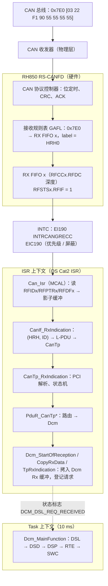
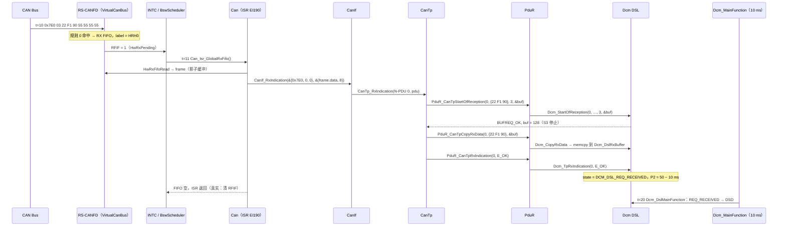

# 完整 RX 路径：RS-CANFD RX FIFO → EI190 → Can → CanIf → CanTp → PduR → Dcm

> Prerequisite: [01-canif.md](01-canif.md)、[03-cantp.md](03-cantp.md)、[04-isotp.md](04-isotp.md)、[05-pdur.md](05-pdur.md)、[04-can-mcal/05 CAN 中断](../04-can-mcal/05-can-interrupt.md)、[04-can-mcal/11 CAN RX 实现](../04-can-mcal/11-can-rx-implementation.md)、[04-can-mcal/12 中断与 MainFunction 实现](../04-can-mcal/12-can-interrupt-implementation.md)
> Next: [07-can-tx-path.md](07-can-tx-path.md)
> 对应规范: AUTOSAR CP **R22-11** SWS CAN Driver：p.33（`SWS_Can_00420` ISR 末尾清中断标志）、p.48（`SWS_Can_00279` 调 `CanIf_RxIndication`、`SWS_Can_00396` 由 RX ISR 或 `Can_MainFunction_Read` 调用、`SWS_Can_00060` 数据字节顺序）、p.48–49（`SWS_Can_00489/00490` FIFO 与影子缓冲、`SWS_Can_00299` 影子缓冲拷贝、“complete RX processing … is done in the context of the RX interrupt or … Can_MainFunction_Read”、`SWS_Can_00012` 不可自重入）、p.59（`Can_HwType`）；AUTOSAR CP **R20-11** SWS DCM：p.243–245（`SWS_Dcm_00094/00556/00093`）、p.56–57（`00444`、`00557`、`00642`、`00342`）、p.78–79（`00141` 开始接收时停 S3）。HW-E（RH850/P1M-E 硬件手册 R01UH0585EJ0120 Rev.1.20）p.285–286（EI190 INTRCANGRECC）、p.844–852（RX FIFO）、p.1058（中断源与标志）——详见 Part IV。CanIf/CanTp/PduR 无 SWS，按 R4.x 形态。
> 对应源码: 本项目 `examples/uds_diag_demo/sim/VirtualCanBus.c`、`integration/BswScheduler.c`、`mcal/Can.c`、`ecual/CanIf.c`、`com/CanTp.c`、`com/PduR.c`、`diag/Dcm_Dsl.c`；实测 trace `artifacts/uds-demo/trace.txt`；openAUTOSAR RX 链 `communication/CAN/CanIf/src/CanIf.c:764` → `communication/CAN/CanTp/src/CanTp.c:1001` → `diagnostic/Dcm/src/Dcm.c:109/:124` → `diagnostic/Dcm/src/Dcm_Dsl.c:682/:743`

---

## 1. 本章目标

1. 不看资料，画出一帧 0x7E0 从 CAN 总线到 `Dcm_TpRxIndication` 的完整调用链，标出每一跳的 API。
2. 对每一跳回答：**谁调用、在什么上下文（ISR / task）、数据在谁的缓冲里、有没有拷贝**。
3. 说出 RX 链中“ISR 部分”与“推迟到 `Dcm_MainFunction` 的部分”的分界线，以及为什么要这样分。
4. 当“诊断无响应”时，能从总线向上（或从 Dcm 向下）逐层二分定位故障点。
5. 能把本 demo 的模拟（VirtualCanBus + BswScheduler）一一映射回 RH850 真实硬件行为。

---

## 2. 为什么要单独讲“路径”？

`[Real Project Consideration]` 前几章按模块讲，每章都只看一跳。但现场问题从来不按模块出现：“tester 发了 `22 F1 90`，ECU 没回”可能是接收规则、EI190、控制器模式、CanIf UL、CanTp N-SDU、PduR 路径、Dcm 正忙中的任何一个。本章把整条链拉直，给出**可二分的检查点**，这就是 `claude_plan.md` 第 7 节要求的诊断路径：

```text
CAN Bus → RH850 CAN RX Hardware → CAN Interrupt → Can Driver → CanIf_RxIndication()
        → CanTp_RxIndication() → PduR → Dcm
```

---

## 3. 在系统中的位置



---

## 4. AUTOSAR 如何定义这条路径？

`[AUTOSAR Standard]` 本仓库可引用的规范要求（按路径顺序）：

| 跳 | 要求 | 出处 | 含义 |
|---|---|---|---|
| 硬件 → Can | RX FIFO 由 `CanHwObjectCount` 配置深度；无 FIFO 时可用影子缓冲 | CAN SWS R22-11 `SWS_Can_00489/00490`，p.48–49 | HRH 可以对应多个硬件对象 |
| Can ISR | 硬件缓冲不能锁定时，Can 必须先拷到影子缓冲 | `SWS_Can_00299`，p.49 | 防止被新帧覆盖 |
| Can ISR | ISR 与 `Can_MainFunction_Read` 不得被自己打断 | `SWS_Can_00012`，p.49 | 保证缓冲一致性 |
| Can ISR | ISR 末尾清中断标志（硬件不自动清时） | `SWS_Can_00420`，p.33 | RH850 电平型中断尤其关键 |
| Can → CanIf | 收到 L-PDU 时调用 `CanIf_RxIndication(Mailbox, PduInfoPtr)` | `SWS_Can_00279`，p.48；`Can_HwType` p.59 | Mailbox = {CanId, Hoh, ControllerId} |
| Can → CanIf | 由 RX ISR 或 `Can_MainFunction_Read`（轮询模式）调用 | `SWS_Can_00396`，p.48 | 两种上下文 CanIf 都要支持 |
| 数据顺序 | 先收到的字节是数组元素 0 | `SWS_Can_00060`，p.48 | 硬件表示不同则驱动适配 |
| **整条链** | “The complete RX processing (including copying to destination layer, e.g. COM) is done in the context of the RX interrupt or in the context of the Can_MainFunction_Read.” | CAN SWS p.49 | **上层的拷贝也在 ISR 里完成** |
| Dcm 接收 | `Dcm_StartOfReception` / `Dcm_CopyRxData` / `Dcm_TpRxIndication` | DCM SWS R20-11 `00094/00556/00093`，p.243–245 | 可能在中断上下文调用 |
| Dcm 接收 | 长度超过缓冲 → `BUFREQ_E_OVFL`；长度 0 → `E_NOT_OK`；同一连接正忙 → `E_NOT_OK` | `00444/00642/00557`，p.56–57 | 决定 CanTp 回 FC.OVFLW 还是丢弃 |
| Dcm 接收 | 开始接收单帧/多帧请求时停止 S3 | `00141`，p.78–79 | 会话保持逻辑 |
| Dcm 接收 | 开始拷贝后、RxIndication 前不访问接收缓冲；RxIndication 非 E_OK 不评估缓冲 | `00342/00344`，p.57 | 缓冲所有权在 RxIndication 时交接 |

CanIf、CanTp、PduR 自身的要求本仓库无 SWS，按 R4.x 形态见 [01](01-canif.md)、[03](03-cantp.md)、[05](05-pdur.md) 章。

---

## 5. 核心数据结构：缓冲归属与拷贝

`[Educational Implementation]` 一帧单帧请求在路径上经过的所有缓冲：

| # | 缓冲 | 所有者 | 位置 | 生命周期 | 拷贝？ |
|---|---|---|---|---|---|
| B0 | RS-CANFD 报文 RAM 中的 RX FIFO 条目 | 硬件 | `[RH850 Hardware]` RX FIFO x；demo：`VCan_RxFifo[16]`（`sim/VirtualCanBus.c:32`） | 直到驱动写 `RFPCTRx = 0xFF` 推进读指针 | 硬件写入 |
| B1 | ISR 栈上的影子缓冲 `frame` | Can 驱动 | `mcal/Can.c:257`，经 `VirtualCanBus_HwRxFifoRead`（`VirtualCanBus.c:87-99`）填充 | 只在本次 `CanIf_RxIndication` 调用期间 | **拷贝 1**：寄存器读出（真实驱动读 `RFIDx/RFPTRx/RFDF0_x/RFDF1_x`） |
| — | `PduInfoType pdu`（`SduDataPtr → frame.data`） | Can 驱动 | `Can.c:265`、`:270-272` | 同上 | 只传指针 |
| — | CanIf / CanTp / PduR | 无自有缓冲 | `CanIf.c:182` 原样上传；`CanTp.c:199-201` 只把指针偏移 1（跳过 PCI） | — | 不拷贝 |
| B2 | `Dcm_DslRxBuffer[128]` | Dcm | `diag/Dcm_Dsl.c:72` | 从 StartOfReception 锁定到请求处理完 | **拷贝 2**：`Dcm_CopyRxData` 的 `memcpy`（`Dcm_Dsl.c:376`） |
| B3 | `Dcm_MsgContextType`（`reqData` 指向 B2+1） | Dcm | `Dcm_Dsl.c:419-427` | 请求处理期间 | 不拷贝 |

**结论：从硬件到 Dcm 只有两次数据拷贝**——驱动读寄存器、Dcm 拷入自己的缓冲。中间三层只传指针，这正是 R4.x TP 接口“谁拥有缓冲谁负责拷贝”的设计效果。多帧请求时，每个 CF 重复一次 B0→B1→B2。

**为什么 CanIf/CanTp/PduR 不能保存指针？** B1 在 ISR 栈上，`Can_Isr_GlobalRxFifo` 的下一次循环（`Can.c:263`）就会覆盖它。

---

## 6. 前置条件：让 RX 路径“通电”的初始化

RX 路径上任何一个前置条件缺失，表现都是“无响应”。按依赖顺序：

| # | 前置条件 | 谁负责 | 本 demo | 缺失时的现象 |
|---|---|---|---|---|
| 1 | CAN RX/TX 引脚复用、收发器使能 | Port 驱动 / IoHwAb | 不模拟 | 控制器收不到任何位（[04-can-mcal/04](../04-can-mcal/04-can-pin-transceiver.md)） |
| 2 | 时钟与位定时 | Mcu + Can 驱动 | 不模拟（`Can_Cfg.c:13` 只写 500 kbit/s） | 错误帧、对方 TEC 上升 |
| 3 | 接收规则 + RX FIFO + 中断使能（`RFCCx.RFIE`、EIC190） | `Can_Init` | `Can.c:74-91`（规则 `:79`，中断 `:91`） | 帧被硬件丢弃 / FIFO 满了也没中断 |
| 4 | 控制器 STARTED | CanSM → `CanIf_SetControllerMode` → `Can_SetControllerMode` | `EcuM.c:40` → `Can.c:147-167` | 不 ACK、不接收（§14 引用 [01 章](01-canif.md) 实验 2） |
| 5 | CanIf 控制器/PDU 模式在线 | CanIf（CanSM 驱动） | `CanIf.c:56-67` | ISR 有、CanTp 无 |
| 6 | CanIf、CanTp、PduR、Dcm 已初始化 | EcuM/BswM | `EcuM.c:30-36` | DET UNINIT，帧丢弃 |
| 7 | Dcm 空闲（同一连接没有正在处理的请求） | Dcm DSL | `Dcm_Dsl.c:324-333` | StartOfReception 被拒（§14 实验 1） |

本 demo 刻意把 `CanIf_SetControllerMode(STARTED)` 放在所有上层初始化**之后**（`EcuM.c:38-40`），保证第一帧到达时整条链都已就绪。

---

## 7. Runtime Flow

### 7.1 单帧请求 `22 F1 90`：完整时序

`[Educational Implementation]` 时间戳取自 `artifacts/uds-demo/trace.txt` 第一段：



### 7.2 逐跳 API 表

| # | From → To | API | 上下文 | 文件:行（demo） | 数据 / 缓冲 | trace |
|---|---|---|---|---|---|---|
| 1 | Bus → HW | 硬件接收、验收过滤、入 FIFO | 硬件 | `VirtualCanBus.c:151-188`（过滤 `:170-179`，入队 `:185-187`） | B0；label = 规则的 HRH | `[10 ms] [Bus] Tester -> wire ID=0x7E0` |
| 2 | HW → INTC → Can | RX FIFO 中断请求 → ISR | 中断入口 | 模拟：`BswScheduler.c:33-35`（`HwRxPending && IsRxInterruptEnabled`）；真实：EI190 | — | — |
| 3 | Can 内部 | 循环读 FIFO 直到空 | ISR | `Can.c:263`（`while (VirtualCanBus_HwRxFifoRead(…))`） | B0 → B1（拷贝 1） | — |
| 4 | Can → CanIf | `CanIf_RxIndication(&mailbox, &pdu)` | ISR | 构造 `Can.c:267-272`，调用 `:275`；实现 `CanIf.c:160` | 指针指向 B1 | `[11 ms] [Can] ISR EI190 (RX FIFO): ID=0x7E0 HRH=0` |
| 5 | CanIf → CanTp | `CanTp_RxIndication(upperPduId=0, pdu)` | ISR | `CanIf.c:182`；实现 `CanTp.c:466` | 指针 | `[CanIf] RxIndication HRH=0 … -> CanTp_RxIndication(N-PDU 0)` |
| 6 | CanTp 内部 | PCI = 0 → SF，`len = 3` | ISR | `CanTp.c:474`、`:488` → `:183-215` | `payload.SduDataPtr = &data[1]`（`:199`） | `[CanTp] RX RxNSdu_DiagPhys: SF len=3` |
| 7 | CanTp → PduR → Dcm | `PduR_CanTpStartOfReception(0, &payload, 3, &bufSize)` → `Dcm_StartOfReception(0, …)` | ISR | `CanTp.c:204` → `PduR.c:80-90` → `Dcm_Dsl.c:309-349` | Dcm 锁定连接、停 S3（`Dcm_Dsl.c:339-344`） | `[PduR] CanTpStartOfReception(0) -> …`、`[Dcm/DSL] StartOfReception … BUFREQ_OK, buffer=128, S3 stopped` |
| 8 | CanTp → PduR → Dcm | `PduR_CanTpCopyRxData` → `Dcm_CopyRxData` | ISR | `CanTp.c:213` → `PduR.c:92-99` → `Dcm_Dsl.c:352-381` | B1 → B2（**拷贝 2**，`Dcm_Dsl.c:376`） | （无 trace，避免 CF 刷屏） |
| 9 | CanTp → PduR → Dcm | `PduR_CanTpRxIndication(0, E_OK)` → `Dcm_TpRxIndication(0, E_OK)` | ISR | `CanTp.c:214` → `PduR.c:101-109` → `Dcm_Dsl.c:384-438` | 建立 `msgContext`（`:419-427`），`state = REQ_RECEIVED`（`:434`） | `[Dcm/DSL] TpRxIndication(E_OK): request [22 F1 90] complete; P2 timer = 50-10 ms` |
| 10 | Can 内部 | FIFO 空，退出循环；真实驱动清 `RFSTSx.RFIF` | ISR 尾 | `Can.c:276-277`（注释 `:251-254`） | — | — |
| 11 | Task → Dcm | `Dcm_MainFunction` → `Dcm_DslMainFunction` 看到 `REQ_RECEIVED` | 10 ms task | `BswScheduler.c:49-51` → `Dcm_Dsl.c:254-257` | 读 B2 | `[20 ms] [Dcm/DSD] SID 0x22: lookup …` |

### 7.3 多帧请求 `2E F1 A0 …`（13 字节）：RX 路径中夹着 TX

trace 71–74 ms。与单帧相比，RX 路径中间多了一段 **ECU 发 FC**，它走的是 TX 方向（CanTp → CanIf → Can_Write），并且需要 TX 确认才能继续：

| 时间 | 事件 | 路径 | 上下文 |
|---|---|---|---|
| 71/72 ms | FF `10 0D 2E F1 A0 A0 A1 A2` | 第 1–7 跳；StartOfReception(`TpSduLength = 13`) + CopyRxData(6) | RX ISR |
| 72 ms | ECU 发 FC `30 02 05` | `CanTp_RxSendFc`（`CanTp.c:133-152`）→ `CanIf_Transmit(L-PDU 1)` → `Can_Write(HTH2)` | **仍在 RX ISR 内**（FF 处理的尾部） |
| 73 ms | FC 上总线、确认 | `Can_MainFunction_Write` → `CanIf_TxConfirmation(1)` → `CanTp_TxConfirmation(N-PDU 1)` → `RX_WAIT_CF`、启动 N_Cr | 1 ms task |
| 73/74 ms | CF `21 A3 … A9` | 第 1–6 跳 → `CanTp_RxConsecutiveFrame` → CopyRxData(7) → RxIndication(E_OK) | RX ISR |

所以“RX 路径”并不纯粹是 RX：**ECU 作为接收方也要发送 FC**，FC 的发送失败（N_Ar）或确认迟到同样会让请求接收失败。

### 7.4 ISR 与 MainFunction 的分界

`[AUTOSAR Standard]` CAN SWS p.49 要求“完整的 RX 处理（包括拷贝到目的层）”在 RX 中断或 `Can_MainFunction_Read` 上下文中完成——所以 CanIf、CanTp、PduR、以及 Dcm 的**接收回调**都在 ISR 里。但 Dcm 的**服务处理**不在 ISR 里：

| 在 ISR 中完成 | 推迟到 `Dcm_MainFunction` |
|---|---|
| 帧解析、TP 状态机推进 | SID 查表、会话/安全检查（DSD） |
| 拷贝请求字节到 Dcm 缓冲 | DID 查表、调用 RTE/SWC（DSP） |
| 锁定连接、停 S3、启动 P2 计时 | 组装响应、`PduR_DcmTransmit` |
| `Dcm_TpRxIndication` 只设 `state = DCM_DSL_REQ_RECEIVED` | P2/S3 计时递减（`Dcm_Dsl.c:266-300`） |

原因：服务处理可能很长（访问 NvM、调用 SWC、等待 `DCM_E_PENDING`），放在 ISR 中会阻塞所有同级及更低优先级中断。代价是**延迟**：请求在 11 ms 已完整，但 DSD 在 20 ms 才开始——最坏延迟约一个 `DcmTaskTime`。这段延迟算在 P2 预算里：DSL 从 `TpRxIndication` 时开始 P2 计时，预留 `DcmTimStrP2ServerAdjust`（本 demo 10 ms，`Dcm_Cfg.h:26`）补偿上下层延迟（`SWS_Dcm_00024`，研究笔记 02 §3.4）。

openAUTOSAR 做法相同：`DslRxIndicationFromPduR`（`Dcm_Dsl.c:743`）只调 `DsdDslDataIndication` 设标志（`Dcm_Dsd.c:369-379`），由下一次 `Dcm_MainFunction` 的 `DsdMain` 处理（研究笔记 03 §3.1）。

---

## 8. RH850 Hardware Mapping

`[RH850 Hardware]` demo 中 `VirtualCanBus` + `BswScheduler` 模拟的每一步，在 RH850/P1M-E 上对应：

| demo 模拟 | RH850/P1M-E 真实行为 | 关键寄存器 / 资源 | 详见 |
|---|---|---|---|
| `VirtualCanBus_TesterSend` 的规则匹配（`VirtualCanBus.c:170-179`） | 接收规则表按序比较，第一条命中的规则决定目标 FIFO 与标签 | `GAFLIDj`、`GAFLMj`（**P1M-E：位 = 1 表示比较**）、`GAFLP0j/GAFLP1j` | [04-can-mcal/07](../04-can-mcal/07-hoh-hrh-hth.md) §7、[11](../04-can-mcal/11-can-rx-implementation.md) |
| FIFO 满丢帧（`VirtualCanBus.c:180-183`） | 报文丢失标志 | `RFSTSx.RFMLT`；全局错误 EI189 | [04-can-mcal/13](../04-can-mcal/13-can-error-busoff.md) |
| `HwRxPending()` | RX FIFO 中断请求标志 | `RFSTSx.RFIF`，使能 `RFCCx.RFIE`（及中断条件配置） | [04-can-mcal/05](../04-can-mcal/05-can-interrupt.md) §4.2 |
| `BswScheduler.c:33-35` 调 ISR | INTC 通道 **EI190 INTRCANGRECC**（8 个 RX FIFO 共用）→ OS Cat2 ISR → MCAL ISR | `EIC190`（优先级、屏蔽），向量表 | **不是 EI184**（那是 CAN0 common FIFO） |
| `VirtualCanBus_HwRxFifoRead`（`:87-99`） | 读当前 FIFO 条目，写 `RFPCTRx = 0xFF` 推进读指针 | `RFIDx`、`RFPTRx`（DLC、时间戳）、`RFDF0_x/RFDF1_x`、`RFPCTRx` | [04-can-mcal/11](../04-can-mcal/11-can-rx-implementation.md) |
| `while` 循环直到 FIFO 空（`Can.c:263`） | 循环检查 `RFSTSx.RFEMP` | `RFEMP = 1` 表示空 | 同上 |
| ISR 返回 | 清 `RFSTSx.RFIF`（写 0），dummy read + `SYNCP` 后再 EIRET | 电平型中断：不清标志会**立即重入** | [04-can-mcal/05](../04-can-mcal/05-can-interrupt.md) §4.3–4.4 |
| label → `Mailbox->Hoh` | 规则中存放的标签随帧进入 FIFO，驱动据此得到 HRH | 字段名以 HW 手册为准（`VirtualCanBus.h:38-41` 注释） | — |

`[Real Project Consideration]` RX 路径的 ISR 负载 = 每帧（MCAL 读寄存器 + CanIf 查表 + CanTp 状态机 + PduR + `Dcm_CopyRxData` memcpy）。在 flash 下载时（每秒数千个 CF）这是真实的 CPU 负载，需要在目标板上用 GPIO 翻转或 OS 时间统计测量；EI190 的优先级要高于可能长时间运行的其它中断，否则 RX FIFO 会溢出（§14 实验 2）。

---

## 9. openAUTOSAR 实现：RX 链在哪里断开

`[AUTOSAR Standard]`（R3.1.5 参考）研究笔记 03 §3.1 的 RX 链，逐跳标注“在当前仓库配置下是否连通”：

| 跳 | openAUTOSAR 位置 | 连通？ | 原因 |
|---|---|---|---|
| 硬件 / ISR → CanIf | `include/Can.h:178-185` 的 `Can_CallbackType.RxIndication`（Arctic 特有函数指针） | 否 | **没有 Can 驱动源码**（`boards/linuxOs/MCAL/Can/` 只有 `Can_Cfg.h`） |
| CanIf_RxIndication | `communication/CAN/CanIf/src/CanIf.c:764`（R3 四参数） | — | — |
| CanIf → CanTp | `CanIf.c:868-878` | 否 | 配置里只有 0x100 → PDUR（`CanIf_Cfg.c:130-149`）；且 CMake 无 `-DUSE_CANTP`，分支被删除 |
| CanTp_RxIndication | `communication/CAN/CanTp/src/CanTp.c:1001` | 否 | `CanTpRxIdList` 未初始化（`CanTp_Cfg.c:136-140`），`:1047` 解引用 NULL |
| CanTp → “PduR” | `copySegmentToPduRRxBuffer` `CanTp.c:336` → `PduR_CanTpProvideRxBuffer` `:354` | 形式上通 | 宏直接替换为 `Dcm_ProvideRxBuffer`（`PduR_Cfg.h:86`），绕过路由表 |
| Dcm 借缓冲 | `diagnostic/Dcm/src/Dcm.c:109` → `Dcm_Dsl.c:682`（`DslProvideRxBufferToPdur`） | 形式上通 | R3 语义：把整块 Rx 缓冲指针借给 CanTp；`DCM_Config` 定义缺失 |
| 接收完成 | `PduR_CanTpRxIndication` → `Dcm_RxIndication`（`PduR_Cfg.h:87`）→ `Dcm.c:124` → `Dcm_Dsl.c:743` | 形式上通 | 同上 |
| 推迟到 MainFunction | `DsdDslDataIndication` → `Dcm_Dsd.c:369-379` 设标志；`Dcm_MainFunction` `Dcm.c:96` | 否 | SchM 未定义 `USE_DCM`，`Dcm_MainFunction` 从未被调度（研究笔记 03 §3.3） |

和本 demo 的对照：**模块内部的逻辑形状几乎一样**（ISR 中完成接收、MainFunction 中处理服务），差别全部在“模块之间的接线”与“缺失的 Can 驱动/调度”。

---

## 10. 当前教学项目实现

`[Educational Implementation]` RX 路径上的文件（按调用顺序）：

| 层 | 文件 | 关键函数 | 行号 |
|---|---|---|---|
| 总线 / 硬件模拟 | `sim/VirtualCanBus.c` | `VirtualCanBus_TesterSend`、`VirtualCanBus_HwRxFifoRead` | `:151-188`、`:87-99` |
| 中断模拟 | `integration/BswScheduler.c` | `BswScheduler_Tick1ms` | `:32-35` |
| MCAL | `mcal/Can.c` | `Can_Isr_GlobalRxFifo` | `:255-277` |
| ECU 抽象 | `ecual/CanIf.c` | `CanIf_RxIndication` | `:160-188` |
| TP | `com/CanTp.c` | `CanTp_RxIndication` → `CanTp_RxSingleFrame/FirstFrame/ConsecutiveFrame` | `:466-498`、`:183-320` |
| 路由 | `com/PduR.c` | `PduR_CanTpStartOfReception/CopyRxData/RxIndication` | `:80-109` |
| 诊断 | `diag/Dcm_Dsl.c` | `Dcm_StartOfReception/CopyRxData/TpRxIndication`，`Dcm_DslMainFunction` | `:309-438`、`:249-257` |

模拟与真实的两处关键差异：

1. **中断由调度器“轮询触发”**：`BswScheduler_Tick1ms` 每 1 ms 检查一次 FIFO（`:33`），所以帧在第 n ms 上总线、第 n+1 ms 进 ISR。真实硬件中帧接收完成后几微秒内就进入 ISR。
2. **单线程**：ISR 与 task 不会互相抢占，因此 demo 不需要 `SchM_Enter_*` 临界区。真实系统中 `Dcm_TpRxIndication`（ISR）与 `Dcm_DslMainFunction`（task）共享 `Dcm_Dsl.state`，必须保护（openAUTOSAR 用 `Irq_Save/Restore`，`Dcm_Dsl.c:759/885`）。

---

## 11. Code Walkthrough：沿着指针走一遍

```c
/* [Educational Implementation] mcal/Can.c:263-275 —— 影子缓冲与 Mailbox */
while (VirtualCanBus_HwRxFifoRead(&frame, &label)) {      /* B0 → B1：拷贝 1 */
    mailbox.CanId = frame.id;                             /* 标准帧：bit31/30 = 00 */
    mailbox.Hoh = label;                                  /* 接收规则的标签 = HRH */
    mailbox.ControllerId = Can_CfgPtr->hoh[label].controllerId;
    pdu.SduDataPtr = frame.data;                          /* 指向 B1 */
    pdu.SduLength = frame.dlc;
    CanIf_RxIndication(&mailbox, &pdu);
}
```

```c
/* [Educational Implementation] ecual/CanIf.c:182 —— 原样上传，无拷贝 */
rx->rxIndication(rx->upperPduId, PduInfoPtr);             /* = CanTp_RxIndication(0, &pdu) */
```

```c
/* [Educational Implementation] com/CanTp.c:199-214 —— 跳过 PCI 字节，仍是指向 B1 的指针 */
payload.SduDataPtr = &info->SduDataPtr[1];
payload.SduLength = len;
br = PduR_CanTpStartOfReception(cfg->pdurSduId, &payload, len, &bufSize);
/* ... */
br = PduR_CanTpCopyRxData(cfg->pdurSduId, &payload, &bufSize);
PduR_CanTpRxIndication(cfg->pdurSduId, (br == BUFREQ_OK) ? E_OK : E_NOT_OK);
```

```c
/* [Educational Implementation] diag/Dcm_Dsl.c:375-378 —— B1 → B2：拷贝 2 */
if (info->SduLength != 0u) {        /* SduLength 0 = "how much buffer is left?" (SWS_Dcm_00996) */
    (void)memcpy(&dst[*copied], info->SduDataPtr, info->SduLength);
    *copied = (PduLengthType)(*copied + info->SduLength);
}
```

```c
/* [Educational Implementation] diag/Dcm_Dsl.c:419-434 —— 只登记，不处理 */
ctx->idContext = Dcm_DslRxBuffer[0];                 /* SID */
ctx->reqData = &Dcm_DslRxBuffer[1];
/* ... */
Dcm_Dsl.p2TimerMs = (sint32)row->p2ServerMaxMs - (sint32)DCM_TIM_P2_SERVER_ADJUST_MS;
Dcm_Dsl.state = DCM_DSL_REQ_RECEIVED;
```

注意 `Dcm_StartOfReception` 的 `info` 参数被忽略（`Dcm_Dsl.c:312` 注释 “SF payload is delivered again with CopyRxData”）：R4.x 允许 StartOfReception 携带首段数据供上层预判（例如根据 SID 决定是否接受），但数据的正式交付仍通过 CopyRxData。

---

## 12. Debug 方法：逐层二分

`[Real Project Consideration]` “诊断无响应”时，从下往上逐层确认，每层只问一个是/否问题：

| 层 | 检查点 | 工具 / 断点 | 看什么 | 否 → 去哪里查 |
|---|---|---|---|---|
| 1 总线 | CANoe 上请求帧有 ACK 吗？ | CANoe trace | 无 ACK / ACK error | 控制器未 STARTED、收发器、引脚、波特率 |
| 2 硬件接收 | FIFO 里有帧吗？ | 调试器看 `RFSTSx`（消息计数 / RFEMP） | RFEMP = 1 一直为空 | 接收规则（GAFL 掩码语义！） |
| 3 中断 | 中断请求挂起了吗？ | `EIC190` 的请求标志 / 屏蔽位 | 有请求但不进 ISR | EIC190 被屏蔽、优先级、OS 未注册 ISR、用成了 EI184 |
| 4 Can ISR | `Can_Isr_*` 进了吗？ | 断点 `Can.c:255` | — | 同上 |
| 5 CanIf | `CanIf_RxIndication` 的 Mailbox | 断点 `CanIf.c:160`，条件 `Mailbox->CanId == 0x7E0` | `Hoh`、`ControllerId`；是否走到 `:186`（无 L-PDU） | CanIf 配置、控制器模式、DLC check |
| 6 CanTp | `CanTp_RxIndication` 与 N-SDU 状态 | 断点 `CanTp.c:466`；看 `CanTp_Rx[0]` | PCI 类型、`state` | CanTp 配置；功能 FF；SN 错 |
| 7 PduR | 路由是否找到 | 断点 `PduR.c:80`；DET | `PduR_FindRx` 返回 NULL？ | PduR 配置 / zero-cost handle |
| 8 Dcm 接收 | `Dcm_StartOfReception` 返回值 | 断点 `Dcm_Dsl.c:309` | `E_NOT_OK`（忙）/ `E_OVFL` | Dcm 状态、缓冲大小 |
| 9 Dcm 完成 | `Dcm_TpRxIndication(E_OK)` | 断点 `Dcm_Dsl.c:384` | `result` | TP 中途失败（N_Cr 等） |
| 10 Dcm 处理 | `Dcm_MainFunction` 是否看到 `REQ_RECEIVED` | 断点 `Dcm_Dsl.c:254` | `Dcm_Dsl.state` | `Dcm_MainFunction` 是否被调度 |

二分技巧：先在第 5 层下断点。命中 → 问题在上半部分（CanIf 以上）；不命中 → 问题在下半部分（硬件/中断/MCAL）。host demo 中对应的做法是 `grep -E "Bus|Can |CanIf" artifacts/uds-demo/trace.txt`。

---

## 13. 常见错误

1. **把 RX FIFO 中断配到 EI184**：EI184 是 CAN0 common（TX/RX）FIFO；8 个 RX FIFO 的中断都在 **EI190**。帧留在 FIFO 里永远到不了 CanIf。
2. **ISR 不清 `RFIF`**：电平型中断立即重入，系统“卡死”在 ISR。
3. **ISR 只读一帧就退出**：FIFO 里还有帧（中断条件可能配置为“每帧”或“达到深度”），延迟增大甚至溢出。demo 用 `while` 读空（`Can.c:263`）。
4. **在 CanIf/CanTp 中保存 `SduDataPtr`**：指向 ISR 栈。
5. **Dcm 正忙时的新请求被静默丢弃**：同一连接上 `Dcm_StartOfReception` 返回 `E_NOT_OK`（`SWS_Dcm_00557`），CanTp 丢 SF；tester 看到“无响应”（§14 实验 1）。
6. **在 `Dcm_TpRxIndication` 里直接处理服务**：ISR 执行时间暴涨。
7. **RX FIFO 深度太小 / EI190 优先级太低**：突发帧（多个 ECU 同时响应功能请求、或 tester 以 STmin = 0 连发 CF）导致溢出。
8. **ISR 与 task 共享 Dcm 状态却不加临界区**（真实多中断系统）：偶发状态错乱。

---

## 14. 实验

在仓库外的临时副本中用自写 `main` 驱动（`VirtualCanBus_TesterSend` 直接发原始帧），不改动仓库 demo。以下为本机实测。

### 实验 1：Dcm 正忙时到达的第二个请求

先发 `22 F1 90`（SWC 第一次返回 `DCM_E_PENDING`，Dcm 处于 PROCESSING），8 ms 后再发 `3E 00`：

```text
[    16 ms] [Dcm/DSL ] TpRxIndication(E_OK): request [22 F1 90] complete; P2 timer = 50-10 ms; DSD runs in next Dcm_MainFunction
[    20 ms] [Dcm/DSD ] ReadDataByIdentifier returned DCM_E_PENDING -> call again with DCM_PENDING next cycle
[    23 ms] [Bus     ] Tester -> wire  ID=0x7E0 DLC=8  02 3E 00 55 55 55 55 55
[    24 ms] [Can     ] ISR EI190 (RX FIFO): ID=0x7E0 HRH=0 DLC=8 -> CanIf_RxIndication
[    24 ms] [CanIf   ] RxIndication HRH=0 ID=0x7E0 -> Rx L-PDU 0 (DiagPhysReq_7E0) -> CanTp_RxIndication(N-PDU 0)
[    24 ms] [CanTp   ] RX RxNSdu_DiagPhys: SF len=2 [3E 00] -> PduR_CanTpStartOfReception(0)
[    24 ms] [PduR    ] CanTpStartOfReception(0) -> route 'CanTp(DiagPhys) -> Dcm' -> Dcm_StartOfReception(DcmRxPduId 0)
[    24 ms] [Dcm/DSL ] StartOfReception(0) while busy -> BUFREQ_E_NOT_OK
[    24 ms] [CanTp   ] RX RxNSdu_DiagPhys: StartOfReception refused (1) -> SF dropped
[    30 ms] [Dcm/DSP ] 0x22: DID 0xF190 (VIN) USE_DATA_ASYNCH_CLIENT_SERVER -> ReadData(DCM_PENDING, Data)
...
[    31 ms] [Bus     ] ECU    -> wire  ID=0x7E8 DLC=8  10 14 62 F1 90 4C 52 48
```

整条 RX 链都正常，只有最后一跳被 Dcm 拒绝：`3E 00` 没有任何响应，而第一个请求照常完成。思考：如果第二个请求来自**功能地址**的 `3E 80`，结果会怎样？（看 `Dcm_Dsl.c:325-330` 与 `SWS_Dcm_00557` 的例外）

### 实验 2：RX FIFO 溢出

在同一个 1 ms 内连续注入 17 帧 0x7DF `02 3E 80`（模拟的 FIFO 深度 `VCAN_RX_FIFO_DEPTH = 16`，`VirtualCanBus.h:30`）：

```text
[    15 ms] [Bus     ]   RX FIFO full: message lost
dropped=1
[    16 ms] [Can     ] ISR EI190 (RX FIFO): ID=0x7DF HRH=1 DLC=8 -> CanIf_RxIndication
...（共 16 次 ISR 读出）
```

第 17 帧在硬件层就丢了（真实硬件置 `RFSTSx.RFMLT`）。这在 host 上看起来夸张，但在真实系统中，只要 EI190 被更高优先级中断或长临界区阻塞数毫秒、而总线负载又高，就会发生。

### 实验 3：在 trace 上标注 11 个跳点

打开 `artifacts/uds-demo/trace.txt`，找到 `2E F1 A0` 一段（71–74 ms），在每一行旁边写上本章 §7.2 的跳号，并标出哪几行发生在“RX ISR 中但属于 TX 方向”（FC 的发送）。

### 实验 4（引用）：控制器 STOPPED

见 [01-canif.md](01-canif.md) §14 实验 2：控制器不在 STARTED 时，帧在第 1 跳之后就消失（“ECU controller not STARTED: frame not received”）。

---

## 15. 思考题

1. CAN SWS 要求“完整的 RX 处理（包括拷贝到目的层）在 RX 中断或 `Can_MainFunction_Read` 中完成”。如果改为 `CanRxProcessing = POLLING`、`Can_MainFunction_Read` 周期 5 ms，RX 路径的哪些部分会改变上下文？对 STmin = 0 的连续 CF 接收有什么影响？
2. 为什么 R4.x 不让 CanTp 在 ISR 中把数据存进自己的缓冲、等 MainFunction 再交给 Dcm？这样做会少还是多一次拷贝？
3. 在真实 RTOS 中，`Dcm_TpRxIndication`（ISR）与 `Dcm_DslMainFunction`（task）都访问 `Dcm_Dsl.state`。最小的临界区应该包住哪几行？
4. 如果 0x7E0 与 0x7DF 的接收规则指向**不同**的 RX FIFO，两个 FIFO 的中断都在 EI190 上，ISR 应按什么顺序读？为什么可能需要考虑顺序？
5. 本 demo 中请求在 11 ms 已完整、20 ms 才处理。若 `DcmTaskTime` 改为 20 ms，P2 预算还剩多少？`DcmTimStrP2ServerAdjust` 应如何调整？

---

## 16. 对未来真实项目的意义

`[Real Project Consideration]`

- 把本章 §12 的 10 层检查表变成你在真实 ECU 上的第一套排查流程；每一层准备好“在哪里下断点、看哪个变量/寄存器”。在 RTA-CAR 工程中，MCAL ISR 名、OS ISR 名、CanIf/CanTp 生成函数名都不同，但层次完全一样。
- 确认 OS 配置中 RS-CANFD 的 ISR 映射（EI190 对 RX FIFO、EI185 对 TX、EI183 对错误……）与 MCAL 配置的处理方式（INTERRUPT / POLLING）一致——这是 MCAL 与 OS 集成中最常见的错位之一。
- 评估 EI190 ISR 的最坏执行时间（含整条上层链路），用它来决定中断优先级与 RX FIFO 深度。
- DCM 升级后，RX 路径中最可能变化的是 `Dcm_StartOfReception` 的拒绝条件（并发请求、协议抢占、`DcmDslDiagRespOnSecondDeclinedRequest`），回归测试要覆盖“处理中再来请求”的场景（本章实验 1）。

---

## 17. 本章总结

```text
总线 → GAFL 规则 → RX FIFO（硬件）
     → EI190 → Can ISR：读寄存器到影子缓冲（拷贝 1）
         → CanIf_RxIndication(Mailbox, Pdu)            （查 HRH+ID → L-PDU，不拷贝）
         → CanTp_RxIndication(N-PDU, Pdu)               （PCI，状态机，不拷贝；多帧时可能在此发 FC）
         → PduR_CanTp* → Dcm_StartOfReception / CopyRxData（拷贝 2） / TpRxIndication
         ← ISR 返回（清 RFIF）
     → Dcm_MainFunction（task）：DSD → DSP → RTE → SWC
```

ISR 里完成“接收与交付”，task 里完成“理解与处理”。

---

## 18. 下一章

[07-can-tx-path.md](07-can-tx-path.md)：响应如何原路返回——`PduR_DcmTransmit` → `CanTp_Transmit` → `CopyTxData` 拉数据 → `CanIf_Transmit` → `Can_Write` → TX buffer → 发送完成 → `CanIf_TxConfirmation` → 一路确认回到 `Dcm_TpTxConfirmation`，以及 `CAN_BUSY` 在这条路上意味着什么。
