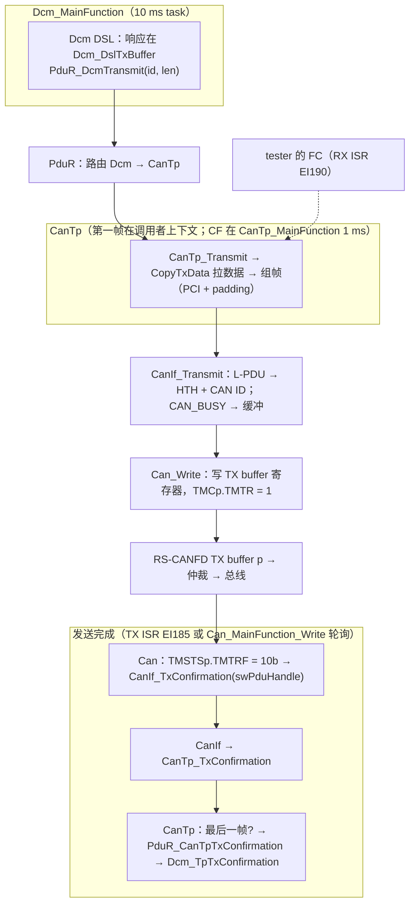
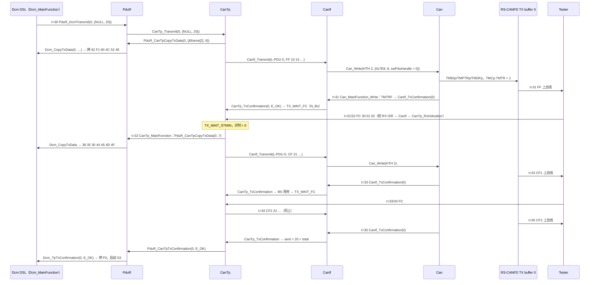
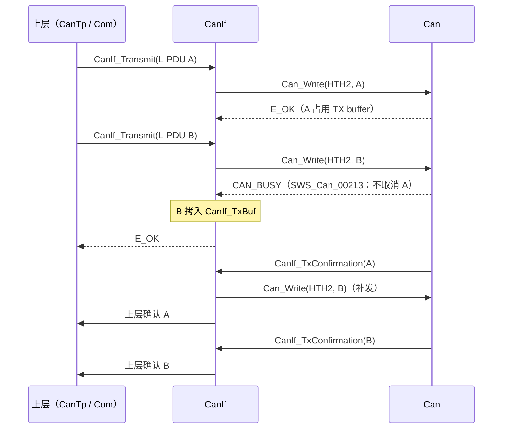

# 完整 TX 路径：Dcm → PduR_DcmTransmit → CanTp → CanIf → Can_Write → TX buffer → 确认链回到 Dcm_TpTxConfirmation

> Prerequisite: [06-can-rx-path.md](06-can-rx-path.md)、[03-cantp.md](03-cantp.md)、[05-pdur.md](05-pdur.md)、[01-canif.md](01-canif.md)、[04-can-mcal/10 Can_Write 实现](../04-can-mcal/10-can-write-implementation.md)、[04-can-mcal/12 中断与 MainFunction 实现](../04-can-mcal/12-can-interrupt-implementation.md)
> Next: Part VI — [06-dcm/01-dcm-overview.md](../06-dcm/01-dcm-overview.md)（Dcm 内部如何产生这条响应）；集成视角见 [08-integration/02-can-stack-integration.md](../08-integration/02-can-stack-integration.md)
> 对应规范: AUTOSAR CP **R22-11** SWS CAN Driver：p.45（`SWS_Can_00276` 保存 `swPduHandle`、`SWS_Can_00016` 由 TX ISR 或 `Can_MainFunction_Write` 调 `CanIf_TxConfirmation`）、p.47（`SWS_Can_00011` 在 `Can_Write` 内直接拷贝上层数据）、p.51（“In case of CAN_BUSY the CanIf module queues that request”；`Can_Write` 对不同 HTH 可重入）、p.59–60（`CAN_BUSY`，`SWS_Can_00039`）、p.80–82（`Can_Write`，`SWS_Can_00212/00213/00214`）、p.84–85（`Can_MainFunction_Write`，`SWS_Can_00225`）；AUTOSAR CP **R20-11** SWS DCM：`SWS_Dcm_00115`（经 `PduR_DcmTransmit` 发送）、`00118`（失败不重发，p.60）、`00092`（`Dcm_CopyTxData`，p.245–246）、`00350`（CopyTxData 失败仍需等确认，p.58–59）、`00351`（`Dcm_TpTxConfirmation`，p.247）、`00353`（确认后停 P2，p.59）、`00141`（确认后重启 S3，p.78–79）、`00119`（0x78 用独立缓冲，p.61）、`00594`（0x11 在正响应发出后才复位）。HW-E p.878–887、p.1107–1111（TX buffer 与发送时序，经研究笔记 04 §7.6）。CanIf/CanTp/PduR 无 SWS，按 R4.x 形态。
> 对应源码: 本项目 `examples/uds_diag_demo/diag/Dcm_Dsl.c`、`com/PduR.c`、`com/CanTp.c`、`ecual/CanIf.c`、`mcal/Can.c`、`sim/VirtualCanBus.c`、`integration/BswScheduler.c`；实测 trace `artifacts/uds-demo/trace.txt`；openAUTOSAR TX 链 `diagnostic/Dcm/src/Dcm_Dsl.c:596` → `PduR_Cfg.h:127`（宏）→ `communication/CAN/CanTp/src/CanTp.c:892/:1204-1205/:583` → `communication/CAN/CanIf/src/CanIf.c:424/:470` → `:743` → `CanTp.c:1111/:631` → `Dcm.c:188` → `Dcm_Dsl.c:950`

---

## 1. 本章目标

1. 画出一条 20 字节诊断响应从 `Dcm_DslTxBuffer` 到 CAN 总线、再从“发送完成”一路确认回到 `Dcm_TpTxConfirmation` 的完整调用链。
2. 对每一跳说出：调用者、上下文（Dcm_MainFunction / CanTp_MainFunction / TX ISR 或 Can_MainFunction_Write / RX ISR）、数据在谁的缓冲里、有几次拷贝。
3. 理解 TX 路径的“**拉（pull）**”模型：Dcm 只宣布长度，数据由 CanTp 按帧拉取。
4. 理解 `CAN_BUSY` 在 TX 路径上出现的位置、CanIf 如何吸收它，以及不吸收时会发生什么。
5. 理解为什么 Dcm 的会话切换、ECU 复位、S3 重启都必须等 **TxConfirmation**，而不是 `PduR_DcmTransmit` 返回。

---

## 2. 为什么 TX 路径值得单独讲？

`[Conceptual]` RX 路径是“一口气从 ISR 推到 Dcm”；TX 路径则完全不同：

| 特点 | RX 路径 | TX 路径 |
|---|---|---|
| 驱动方式 | 下层**推**（push）：帧到达就一路回调 | 上层**发起**、下层**拉**（pull）：`Transmit` 只给长度，`CopyTxData` 按帧取数据 |
| 上下文 | 基本都在 RX ISR | 分散在 4 种上下文：Dcm task、CanTp task、TX 确认（ISR 或 Can task）、RX ISR（收 FC） |
| 完成判定 | `TpRxIndication` | **TxConfirmation 链**：硬件发送完成 → Can → CanIf → CanTp → PduR → Dcm |
| 资源竞争 | RX FIFO 深度 | HTH（TX buffer）被占用 → `CAN_BUSY` |
| 对上层的意义 | 请求到达 | 响应真正上了总线 → 才能切会话、复位、重启 S3 |

`claude_plan.md` 第 7 节要求的 TX 链：

```text
DCM → PduR → CanTp → CanIf → Can_Write() → RH850 CAN Mailbox → CAN Bus
```

本章补上它的“回程”：确认链。

---

## 3. 在系统中的位置



---

## 4. AUTOSAR 如何定义这条路径？

`[AUTOSAR Standard]` 本仓库可引用的规范要求（按路径顺序）：

| 跳 | 要求 | 出处 | 含义 |
|---|---|---|---|
| Dcm → PduR | DSL 用 `PduR_DcmTransmit` 发送响应 | DCM R20-11 `SWS_Dcm_00115` | 只传 `TxPduId` 与长度 |
| Dcm | No Com 时不得调用 `PduR_DcmTransmit`；Silent Com 禁止发送 | `00148–00156`，p.85–86 | 与 ComM 状态耦合 |
| Dcm | 发送失败或负确认时**不重发**响应 | `00118`，p.60 | 不要指望 Dcm 补救下层错误 |
| CanTp → Dcm | `Dcm_CopyTxData(id, info, retry, &available)`：E_OK / E_BUSY（暂无数据，可重试）/ E_NOT_OK（失败，仍需等 TpTxConfirmation 结束） | `00092`，p.245–246；`00350`，p.58–59 | 拉模型 |
| Dcm | NRC 0x78 用**独立缓冲**发送，避免覆盖正在准备的响应 | `00119`，p.61 | 两条响应共用一个 N-SDU |
| CanIf → Can | `Can_Write(Hth, PduInfo)`：HTH 空闲 → 置互斥、写硬件、触发发送、E_OK | CAN R22-11 `SWS_Can_00212`，p.81 | 非阻塞 |
| CanIf → Can | HTH 正忙 → **不取消**正在发送的帧、不做任何动作、返回 `CAN_BUSY` | `00213`，p.81；`00214`（同一 HTH 的抢占式重入） | `CAN_BUSY` 不是错误 |
| CanIf | “In case of CAN_BUSY the CanIf module queues that request” | CAN SWS p.51 | 缓冲责任在 CanIf |
| Can | 在 `Can_Write` 内直接从上层缓冲拷贝，上层只需保持缓冲到函数返回 | `00011`，p.47 | 调用者的帧缓冲可以在栈上 |
| Can | 保存 `swPduHandle` 直到 `CanIf_TxConfirmation` | `00276`，p.45 | 确认时 CanIf 靠它找回 L-PDU |
| Can → CanIf | 成功发送后由 TX ISR 或 `Can_MainFunction_Write`（轮询）调 `CanIf_TxConfirmation` | `00016`，p.45；`00225`，p.84–85 | 两种上下文 |
| Dcm | `Dcm_TpTxConfirmation` 后停止 P2 / P2\* 监控 | `00353`，p.59 | 响应已发出 |
| Dcm | 最终响应发送完成时重启 S3 | `00141`，p.78–79 | 会话保持 |
| Dcm | 0x11 ECUReset：先发正响应，确认后再执行复位 | `00594`（README §5.1） | 否则 tester 收不到响应 |

---

## 5. 核心数据结构：缓冲与拷贝

`[Educational Implementation]` 一个 CF 在 TX 路径上经过的缓冲：

| # | 缓冲 | 所有者 | 位置 | 拷贝 |
|---|---|---|---|---|
| B0 | `Dcm_DslTxBuffer[128]`（完整响应 20 字节） | Dcm | `diag/Dcm_Dsl.c:73` | — |
| B1 | CanTp 栈上的 `frame[8]` | CanTp | `com/CanTp.c:332` | **拷贝 1**：`Dcm_CopyTxData` 把 6 或 7 字节拷到 `&frame[pciLen]`（`Dcm_Dsl.c:469`） |
| B2 | CanIf 栈上的 `local[8]` | CanIf | `ecual/CanIf.c:82` | **拷贝 2**：`CanIf.c:84`（教学实现的额外拷贝，见下） |
| B2' | `CanIf_TxBuf[slot].data`（仅 `CAN_BUSY` 时） | CanIf | `ecual/CanIf.c:21`、`:125` | **拷贝 2'** |
| B3 | Can 驱动中的 `VirtualCanBus_FrameType frame` | Can | `mcal/Can.c:174`、`:206` | **拷贝 3**（`SWS_Can_00011`） |
| B4 | TX buffer（RS-CANFD 报文 RAM） | 硬件 | 模拟：`VCan_TxBuf[]`（`VirtualCanBus.c:35`、`:101-110`）；真实：`TMIDp/TMPTRp/TMDF0_p/TMDF1_p` | 写寄存器 |

与 RX 路径（2 次拷贝）相比，本 demo 的 TX 路径拷贝更多：

- B1 是 R4.x TP 设计的必然：Dcm 拥有完整消息，CanTp 只拥有“一帧”，每帧拉一次。
- B2 在真实 CanIf 中**通常不存在**：CanIf 把上层的 `SduDataPtr` 直接放进 `Can_PduType.sdu`，因为 `SWS_Can_00011` 保证 Can 在返回前已拷走。本 demo 多拷一次只是为了让 `CanIf_WriteToDriver` 同时服务“直接发送”和“从缓冲补发”两种情况。
- B2' 只在 `CAN_BUSY` 时出现，这是 CanIf 缓冲的代价。

`swPduHandle` 的旅程：`CanIf.c:85` 写入 L-PDU 号 → `Can.c:212` 保存到 `Can_TxObj[Hth]` → 发送完成后 `Can.c:235` 作为 `CanIf_TxConfirmation` 的参数交回。

---

## 6. 前置条件

| # | 条件 | 位置 | 不满足时 |
|---|---|---|---|
| 1 | Dcm 处于可发送状态（ComM Full Com；本 demo 无 ComM） | DCM `00148–00156` | Dcm 不调用 `PduR_DcmTransmit` |
| 2 | PduR 有 Dcm → CanTp 的 TX 路径 | `PduR_Cfg.c:22-25` | `PduR_DcmTransmit` 返回 E_NOT_OK（`PduR.c:69-72`） |
| 3 | CanTp 该 Tx N-SDU 空闲 | `CanTp.c:407-411` | `CanTp_Transmit` 拒绝，Dcm 不重发 |
| 4 | CanIf 控制器 STARTED（真实还需 PDU mode ONLINE/TX_ONLINE） | `CanIf.c:108-110` | `CanIf_Transmit` 返回 E_NOT_OK → CanTp 中止 |
| 5 | Can 控制器 STARTED、HTH 合法 | `Can.c:180-195` | `Can_Write` 返回 E_NOT_OK / DET |
| 6 | TX 完成能被检测（TX 中断使能，或 `Can_MainFunction_Write` 被调度） | `BswScheduler.c:39` | **没有确认** → CanTp N_As 超时（§14 实验 1） |

---

## 7. Runtime Flow

### 7.1 20 字节 VIN 响应：完整时序

`[Educational Implementation]` 时间戳取自 `artifacts/uds-demo/trace.txt` 第一段（tester BS = 1、STmin = 2 ms）：



### 7.2 逐跳 API 表（去程）

| # | From → To | API | 上下文 | 文件:行 | 数据 / 状态 | trace（`[30 ms]` 起） |
|---|---|---|---|---|---|---|
| 1 | Dcm DSL 内部 | `Dcm_DslTransmitFinal(20)`：`state = TRANSMITTING`，`info.SduDataPtr = NULL` | Dcm_MainFunction | `Dcm_Dsl.c:187-204` | B0 中已有完整响应 | `[Dcm/DSL] response [62 F1 90 …] -> PduR_DcmTransmit(0, len=20)` |
| 2 | Dcm → PduR | `PduR_DcmTransmit(PduRConf_PduRSrcPdu_Dcm_DiagResp, &info)` | 同上 | `Dcm_Dsl.c:199` → `PduR.c:67-76` | 查 Tx 路径 | `[PduR] DcmTransmit(0) len=20 -> … CanTp_Transmit(N-SDU 0)` |
| 3 | PduR → CanTp | `CanTp_Transmit(0, &info)` | 同上 | `PduR.c:75` → `CanTp.c:392-422` | `total = 20`，`nextKind = FF`（`:412-415`） | `[CanTp] Transmit TxNSdu_DiagPhys length=20 -> segmented` |
| 4 | CanTp 内部 | `CanTp_TxSendNext`：写 PCI `10 14` | 同上（**demo 在 Transmit 内立即发第一帧**，`:420`） | `CanTp.c:345-350` | B1 | — |
| 5 | CanTp → PduR → Dcm | `PduR_CanTpCopyTxData(0, {&frame[2], 6}, NULL, &avail)` → `Dcm_CopyTxData` | 同上 | `CanTp.c:365` → `PduR.c:111-119` → `Dcm_Dsl.c:441-474` | B0 → B1（**拷贝 1**） | `[CanTp] TX …: FF payload=6 [62 F1 90 4C 52 48] -> CanIf_Transmit(L-PDU 0)` |
| 6 | CanTp → CanIf | `CanIf_Transmit(0, {frame, 8})`（padding 由 `CanTp_SendFrame` 填 0xCC） | 同上 | `CanTp.c:382` → `:98-109` → `CanIf.c:93-133` | `state = TX_WAIT_CONF`，N_As（`CanTp.c:386-387`） | `[CanIf] Transmit L-PDU 0 (DiagResp_7E8) -> Can_Write(HTH=2, ID=0x7E8)` |
| 7 | CanIf → Can | `Can_Write(2, {id 0x7E8, len 8, sdu, swPduHandle 0})` | 同上 | `CanIf.c:78-90` → `Can.c:171-217` | B1 → B2 → B3 → B4 | `[Can] Write HTH=2 ID=0x7E8 DLC=8 -> TX buffer 0, TMC.TMTR=1 [10 14 …]` |
| 8 | Can → HW | 写 TX buffer、置发送请求 | 同上 | 模拟 `VirtualCanBus.c:101-110`；真实见 §8 | — | — |
| 9 | HW → 总线 | 仲裁、发送、收到 ACK | 硬件 | 模拟 `VirtualCanBus_Tick`（`VirtualCanBus.c:129-147`，由 `BswScheduler.c:32` 每 1 ms 调用） | `complete = TRUE`（`:143`） | `[31 ms] [Bus] ECU -> wire ID=0x7E8 DLC=8 10 14 62 F1 90 4C 52 48` |

### 7.3 逐跳 API 表（确认链，回程）

| # | From → To | API | 上下文 | 文件:行 | 动作 | trace |
|---|---|---|---|---|---|---|
| 10 | HW → Can | 检测发送完成 | `Can_MainFunction_Write`（本 demo 轮询，1 ms）；真实可为 TX ISR | `BswScheduler.c:39` → `Can.c:220-239` | `busy = FALSE`（`:232`） | `[31 ms] [Can] MainFunction_Write: TX buffer 0 done (TMSTS.TMTRF) -> CanIf_TxConfirmation(L-PDU 0)` |
| 11 | Can → CanIf | `CanIf_TxConfirmation(swPduHandle)` | 同上 | `Can.c:235` → `CanIf.c:136-156` | 先补发缓冲帧（`:146-152`），再通知上层 | `[CanIf] TxConfirmation L-PDU 0 (DiagResp_7E8) -> CanTp_TxConfirmation(N-PDU 0)` |
| 12 | CanIf → CanTp | `CanTp_TxConfirmation(0, E_OK)` | 同上 | `CanIf.c:155` → `CanTp.c:501-564` | FF：`TX_WAIT_FC` + N_Bs（`:546-550`）；CF：SN++、BS 计数、`TX_WAIT_STMIN`（`:551-561`）；最后一帧：`IDLE`（`:539-545`） | — |
| 13 | CanTp → PduR → Dcm | `PduR_CanTpTxConfirmation(0, E_OK)` → `Dcm_TpTxConfirmation(0, E_OK)` | 同上 | `CanTp.c:543` → `PduR.c:121-129` → `Dcm_Dsl.c:477-497` | `Dcm_DslFinishRequest(TRUE)`（`:163-185`）：切会话 / 复位 / S3 | `[35 ms] [CanTp] TX …: complete (20 bytes) -> PduR_CanTpTxConfirmation(E_OK)`、`[PduR] CanTpTxConfirmation(0, E_OK) -> Dcm_TpTxConfirmation`、`[Dcm/DSL] request finished; S3 timer (re)started` |

中间穿插的 **FC 接收**（RX ISR）与 **CF 发送**（CanTp_MainFunction，`CanTp.c:644-647` → `CanTp_TxSendNext`）重复第 5–12 跳。

### 7.4 一次响应涉及的四种上下文

| 时间 | 上下文 | 做了什么 |
|---|---|---|
| 30 ms | `Dcm_MainFunction`（10 ms task） | 第 1–8 跳：Transmit + 拉 FF 数据 + `Can_Write` |
| 31 ms | `Can_MainFunction_Write`（1 ms task）/ 真实可为 TX ISR | 第 10–12 跳：FF 确认 → `TX_WAIT_FC` |
| 31–32 ms | RX ISR（EI190） | 收到 FC → `CanTp_TxFlowControl` → `TX_WAIT_STMIN` |
| 32 ms | `CanTp_MainFunction`（1 ms task） | STmin 到期 → 拉 CF1 数据 + `Can_Write` |
| 33–35 ms | 同上循环 | CF1 确认、FC、CF2、CF2 确认 |
| 35 ms | `Can_MainFunction_Write` / TX ISR | 第 13 跳：`Dcm_TpTxConfirmation` → S3 启动 |

`[Real Project Consideration]` 这意味着 `Dcm_CopyTxData` 可能在 **Dcm task** 和 **CanTp task**（或 openAUTOSAR STmin = 0 时的 **TX ISR**）中被调用，而 `Dcm_TpTxConfirmation` 可能在 **TX ISR** 中被调用。Dcm 的 Tx 缓冲状态必须对这些并发访问是安全的——这也是 DCM SWS 注明这些回调“可能在中断上下文调用”的原因。

### 7.5 `CAN_BUSY`：TX 路径上的资源冲突

`CAN_BUSY` 出现的条件：调用 `Can_Write` 时该 HTH 的硬件对象还有未完成的发送（`Can.c:196-200`；真实硬件为 `TMSTSp.TMTRM = 1` 或 `TMTRF` 尚未清除）。在**纯诊断**流中，CanTp 自己会等确认才发下一帧，所以同一 N-SDU 不会制造 BUSY；BUSY 来自**其它发送者共用同一 HTH**：

| 竞争者 | 场景 |
|---|---|
| ECU 发 FC（接收长请求时） | 与上一条响应的最后一帧、或 0x78 竞争（本 demo FC 与数据共用 HTH 2） |
| Com 周期报文 | 诊断与应用报文共用一个 BASIC HTH |
| CanNm | 网络管理报文共用 HTH |



| 处理方式 | 结果 |
|---|---|
| CanIf 缓冲（本 demo `CanIf.c:116-130`、`:146-152`；CAN SWS p.51 的要求） | 上层无感知，只是 B 晚一帧时间上总线 |
| CanIf 不缓冲，返回 `E_NOT_OK`（openAUTOSAR `CanIf.c:476-481`） | CanTp 中止：`CanTp_TxAbort("CanIf_Transmit failed")`（`CanTp.c:382-385`）→ `Dcm_TpTxConfirmation(E_NOT_OK)` → Dcm **不重发**（`00118`）→ tester 等到 P2 超时 |
| CanIf 缓冲已满 | 同上，`E_NOT_OK`（`CanIf.c:118-120`） |

实测见 [01-canif.md](01-canif.md) §14 实验 1。

### 7.6 NRC 0x78 与最终响应共用 TX 路径

trace 670–725 ms（慢 SWC，P2 到期）：

| 时间 | 事件 | 代码 |
|---|---|---|
| 670 ms | P2 到期，DSL 用**独立缓冲** `Dcm_DslRcrrpBuffer[3]` 发 `7F 22 78` | `Dcm_Dsl.c:206-224`（`SWS_Dcm_00119`）；缓冲 `:74` |
| 670 ms | `PduR_DcmTransmit(0, len = 3)` → `CanTp_Transmit` → SF `03 7F 22 78 CC CC CC CC` | 同一 Tx N-SDU |
| 671 ms | 确认链 → `Dcm_TpTxConfirmation`：识别为 0x78 的确认，服务继续运行 | `Dcm_Dsl.c:482-490` |
| 720 ms | 服务完成，`Dcm_DslTransmitFinal(20)` → FF … | `Dcm_Dsl.c:234` |

如果 0x78 的确认还没回来服务就完成了，DSL 不能立刻调 `PduR_DcmTransmit`——CanTp 的 N-SDU 正忙会拒绝（`CanTp.c:407`）。所以 DSL 先置 `finalWaiting`（`Dcm_Dsl.c:230-232`），在 0x78 的 `TpTxConfirmation` 里再发最终响应（`:486-489`）。`Dcm_CopyTxData` 根据 `rcrrpInFlight` 决定从哪个缓冲拷（`:451-461`）。

### 7.7 为什么“确认之后”才能做的事

`Dcm_DslFinishRequest`（`Dcm_Dsl.c:163-185`）只在 `Dcm_TpTxConfirmation` 中被调用：

| 动作 | 若在 `PduR_DcmTransmit` 返回时就做 | 规范 |
|---|---|---|
| `10 03` 切换到扩展会话 | 响应还在 TX buffer 里时会话就变了，若发送失败 tester 与 ECU 会话不一致 | 新定时参数在响应发送后生效（DCM p.80，研究笔记 02 §3.4） |
| `11 01` 执行复位 | 复位清掉 TX buffer，tester 永远收不到 `51 01` | `SWS_Dcm_00594` |
| 重启 S3 | S3 从“响应开始发送”算起，长响应时可能提前超时 | `00141` |
| 停止 P2 监控 | — | `00353` |

---

## 8. RH850 Hardware Mapping

`[RH850 Hardware]` 以下寄存器事实来自研究笔记 04（HW-E R01UH0585EJ0120 Rev.1.20 页码），完整的驱动实现见 [04-can-mcal/10](../04-can-mcal/10-can-write-implementation.md)：

| demo 模拟 | RH850/P1M-E RS-CANFD | 页码 |
|---|---|---|
| `VirtualCanBus_HwTxBufferBusy`（`VirtualCanBus.c:112-115`）→ `CAN_BUSY` | 写之前确认 `TMSTSp.TMTRM = 0`（无挂起请求）且 `TMTRF = 00b`（上次结果已清） | p.879–882、p.1110 |
| `VirtualCanBus_HwTxBufferWrite`（`:101-110`） | 写 `TMIDp`（IDE/RTR/ID）、`TMPTRp`（DLC[31:28]、label）、`TMDF0_p/TMDF1_p`（数据 0–7）；**这些寄存器只能在 `TMTRM = 0` 时写** | p.882–887 |
| `requested = TRUE` | `TMCp.TMTR = 1`（`TMCp` 是 **8 位**寄存器） | p.878–879 |
| `VirtualCanBus_Tick` 发送 | 协议控制器仲裁发送；多个 TX buffer 挂起时，`GCFG.TPRI = 0` 按 ID 优先、`= 1` 按 buffer 号优先（对所有通道生效） | p.1077 |
| `complete = TRUE` / `HwTxCompleteFlag` 读并清 | `TMSTSp.TMTRF = 10b`（发送完成）；ISR 或轮询中**写回 00b** 清除——不清就无法再次发送，也清不掉中断请求 | p.880–881、p.1109–1110 |
| 中断方式（本 demo 未用） | `TMIECy.TMIEp = 1` → **INTRCAN0TRX = EI185**（CAN0）；EI185 同时承载 TX buffer、TX/RX FIFO 发送、TX queue、TX history 多个源 | p.1058；[04-can-mcal/05](../04-can-mcal/05-can-interrupt.md) §4.2 |
| 控制器停止时取消挂起（`Can.c:156-161`） | 进入 channel reset 会清除 TMC/TMSTS 等（Table 17.180）；中止单个发送用 `TMCp.TMTAR = 1`，正在发送中的帧无法中止 | p.1070、p.879、p.1111 |

`[Real Project Consideration]` 选择 TX 确认的处理方式（`CanTxProcessing = INTERRUPT / POLLING`）直接影响诊断吞吐：轮询周期 1 ms 时，每个 CF 至少要等 1 ms 才能被确认，再加上 STmin 计时也在 1 ms 任务里，CF 间隔最小约 1–2 ms（[04-isotp.md](04-isotp.md) §14 实验 3）。flash 下载场景通常要求 TX 中断方式。

---

## 9. openAUTOSAR 实现：TX 链与它的问题

`[AUTOSAR Standard]`（R3.1.5 参考，研究笔记 03 §3.2）：

| 跳 | 位置 | 观察 |
|---|---|---|
| DSL 发起 | `diagnostic/Dcm/src/Dcm_Dsl.c:579-596`（`DSD_PENDING_RESPONSE_SIGNALED` → `DCM_TRANSMIT_SIGNALED` → `PduR_DcmTransmit`） | 与本 demo 相同：在 `Dcm_MainFunction` 末尾的 `DslMain` 中发送 |
| “PduR” | `PDURouter/include/PduR_Cfg.h:127` | 宏：`PduR_DcmTransmit` = `CanTp_Transmit`，Dcm 的 TxPduId 直接当 CanTp N-SDU id |
| CanTp_Transmit | `communication/CAN/CanTp/src/CanTp.c:892` | **只登记**（写 PCI、`TX_WAIT_TRANSMIT`，`:927-944`），**不发帧**；第一帧在下一个 `CanTp_MainFunction` 的 `TX_WAIT_TRANSMIT` 分支发出（`:1204-1205` → `sendNextTxFrame` `:583`） |
| 拉数据 | `sendNextTxFrame` `:591` → `PduR_CanTpProvideTxBuffer` → 宏 → `Dcm_ProvideTxBuffer`（`Dcm.c:174`）→ `DslProvideTxBuffer`（`Dcm_Dsl.c:899`） | R3：借出整块 Tx 缓冲指针，CanTp 逐字节拷到 8 字节 `canFrameBuffer` |
| CanIf_Transmit | `communication/CAN/CanIf/src/CanIf.c:424` → `Can_Write` `:470` | 检查 controller STARTED（`:451`）与 PDU mode（`:460`）；`Can_Write` **未定义**（无 Can 驱动） |
| CAN_BUSY | `CanIf.c:476-481` | 不缓冲，`E_NOT_OK` |
| 确认 | `CanIf_TxConfirmation` `:743` → 配置函数指针 `CanIfUserTxConfirmation`（`:758`）——示例配置指向 `PduR_CanIfTxConfirmation`（`CanIf_Cfg.c:124`），**不是 CanTp** | 诊断确认链在配置层面就断了 |
| CanTp 确认处理 | `CanTp_TxConfirmation` `:1111` → `handleNextTxFrameSent` `:631` | STmin = 0 时在确认回调里直接发下一个 CF（`:652-665`）；全部发完 → `PduR_CanTpTxConfirmation(NTFRSLT_OK)`（`:645`）→ 宏 → `Dcm_TxConfirmation`（`Dcm.c:188`）→ `DslTxConfirmation`（`Dcm_Dsl.c:950`） |
| Dcm 收尾 | `Dcm_Dsl.c:965-974`；0x11 在确认后才复位（`Dcm_Dsp.c:1971-1981`），0x10 在确认后才通知会话变化（`:1985-1990`） | 设计思想与本 demo 一致 |

本 demo 与 openAUTOSAR 的一个**有意差异**：本 demo 的 `CanTp_Transmit` 在调用者上下文中立即发出第一帧（`CanTp.c:420`），openAUTOSAR 推迟到下一个 MainFunction。前者少 1 个 CanTp 周期延迟，但让 `Dcm_CopyTxData` 与 `Can_Write` 在 Dcm task 中执行；后者把所有 TX 动作集中在 CanTp task 中，上下文更单一。两种都是合法的实现选择，真实项目以供应商实现为准。

---

## 10. 当前教学项目实现

`[Educational Implementation]` TX 路径上的文件（按调用顺序）：

| 层 | 文件 | 去程函数 | 回程函数 |
|---|---|---|---|
| 诊断 | `diag/Dcm_Dsl.c` | `Dcm_DslTransmitFinal` `:187-204`、`Dcm_DslSendResponsePending` `:206-224`、`Dcm_CopyTxData` `:441-474` | `Dcm_TpTxConfirmation` `:477-497`、`Dcm_DslFinishRequest` `:163-185` |
| 路由 | `com/PduR.c` | `PduR_DcmTransmit` `:67-76`、`PduR_CanTpCopyTxData` `:111-119` | `PduR_CanTpTxConfirmation` `:121-129` |
| TP | `com/CanTp.c` | `CanTp_Transmit` `:392-422`、`CanTp_TxSendNext` `:328-388`、`CanTp_SendFrame` `:98-109`、MainFunction `:631-659` | `CanTp_TxConfirmation` `:501-564`、`CanTp_TxFlowControl` `:424-459` |
| ECU 抽象 | `ecual/CanIf.c` | `CanIf_Transmit` `:93-133`、`CanIf_WriteToDriver` `:78-90` | `CanIf_TxConfirmation` `:136-156` |
| MCAL | `mcal/Can.c` | `Can_Write` `:171-217` | `Can_MainFunction_Write` `:220-239` |
| 硬件模拟 | `sim/VirtualCanBus.c` | `VirtualCanBus_HwTxBufferWrite` `:101-110` | `VirtualCanBus_Tick` `:129-147`、`HwTxCompleteFlag` `:117-125` |
| 调度 | `integration/BswScheduler.c` | Dcm 10 ms `:49-51`、CanTp 1 ms `:41` | `Can_MainFunction_Write` 1 ms `:39` |

---

## 11. Code Walkthrough

### 11.1 Dcm 只给长度（`Dcm_Dsl.c:187-199`）

```c
/* [Educational Implementation] examples/uds_diag_demo/diag/Dcm_Dsl.c:191-199（节选） */
Dcm_Dsl.txLen = length;
Dcm_Dsl.txCopied = 0u;
Dcm_Dsl.state = DCM_DSL_TRANSMITTING;
info.SduDataPtr = NULL_PTR;    /* TP API: data is pulled later via Dcm_CopyTxData */
info.SduLength = length;
if (PduR_DcmTransmit(PduRConf_PduRSrcPdu_Dcm_DiagResp, &info) != E_OK) {
    Dcm_DslFinishRequest(FALSE);   /* SWS_Dcm_00118: no retry */
}
```

### 11.2 CanTp 拉数据进自己的帧（`CanTp.c:361-365`）

```c
/* [Educational Implementation] examples/uds_diag_demo/com/CanTp.c:361-365 */
pdu.SduDataPtr = &frame[pciLen];          /* Dcm 直接写进 CanTp 的帧缓冲，跳过 PCI */
pdu.SduLength = payloadLen;
br = PduR_CanTpCopyTxData(cfg->pdurSduId, &pdu, (const RetryInfoType *)NULL_PTR, &available);
```

### 11.3 Dcm 侧的拷贝与进度（`Dcm_Dsl.c:465-473`）

```c
/* [Educational Implementation] examples/uds_diag_demo/diag/Dcm_Dsl.c:465-473 */
if (info->SduLength > (PduLengthType)(total - *copied)) { return BUFREQ_E_NOT_OK; }
if (info->SduLength != 0u) {
    (void)memcpy(info->SduDataPtr, &src[*copied], info->SduLength);
    *copied = (PduLengthType)(*copied + info->SduLength);
}
*availableDataPtr = (PduLengthType)(total - *copied);
```

注意 Dcm 的 `txCopied` 是“已交给 CanTp 的字节”，CanTp 的 `sent` 是“已被确认上总线的字节”（`CanTp.c:538`）。二者之差就是“在途”数据——若需要重发（`TP_DATARETRY`），CanTp 用 `RetryInfoType.TxTpDataCnt` 要求 Dcm 回退（`Dcm_Dsl.c:462-464`）。

### 11.4 硬件对象互斥与 `swPduHandle`（`Can.c:196-216`）

```c
/* [Educational Implementation] examples/uds_diag_demo/mcal/Can.c:197-212（节选） */
if (Can_TxObj[Hth].busy || VirtualCanBus_HwTxBufferBusy(hoh->hwBufferIdx)) {
    return CAN_BUSY;                                       /* SWS_Can_00213 */
}
(void)memcpy(frame.data, PduInfo->sdu, PduInfo->length);   /* SWS_Can_00011 */
/* [RH850 Hardware] real driver: write TMIDp, TMPTRp, TMDF0_p/TMDF1_p, then TMCp.TMTR = 1 */
(void)VirtualCanBus_HwTxBufferWrite(hoh->hwBufferIdx, &frame);
Can_TxObj[Hth].busy = TRUE;
Can_TxObj[Hth].swPduHandle = PduInfo->swPduHandle;         /* SWS_Can_00276 */
```

### 11.5 确认回到 Dcm 之后（`Dcm_Dsl.c:163-185`）

`Dcm_DslFinishRequest(responseOk)`：若有挂起的会话切换且响应成功 → 切会话；若有挂起的复位且成功 → `SchM_Switch_Dcm_DcmEcuReset(EXECUTE)`；最后重启 S3。**`responseOk = FALSE` 时（例如 N_Bs 超时）会话不切换、不复位**——这是 tester 与 ECU 保持一致的关键。

---

## 12. Debug 方法：从 Dcm 往下二分

| 层 | 检查点 | 断点 / 变量 | 结论 |
|---|---|---|---|
| 1 Dcm 发起 | `PduR_DcmTransmit` 被调用了吗？返回值？ | `Dcm_Dsl.c:199`；`Dcm_Dsl.state` | 没调用 → Dcm 内部（DSD/DSP 未完成、ComM 状态） |
| 2 PduR | 找到路径？ | `PduR.c:69`；DET | 配置 |
| 3 CanTp 受理 | `CanTp_Transmit` 返回 E_OK？ | `CanTp.c:407`；`CanTp_Tx[0].state` | 正忙（上一条没完）/ 长度非法 |
| 4 拉数据 | `Dcm_CopyTxData` 返回 OK？ | `CanTp.c:365`；`br` | Dcm 状态不对（不是 TRANSMITTING） |
| 5 CanIf 受理 | `CanIf_Transmit` 返回？ | `CanIf.c:93`；`CanIf_CtrlMode[]`、`CanIf_TxBufCount` | 控制器/PDU mode；缓冲满 |
| 6 Can_Write | 返回 E_OK / CAN_BUSY / E_NOT_OK？ | `Can.c:171` | HTH 错、控制器停 |
| 7 硬件 | 帧真的上总线了吗？ | 调试器看 `TMSTSp`；CANoe | `TMTRF` 一直 00b → 仲裁总输 / 无 ACK / bus-off |
| 8 确认 | `CanIf_TxConfirmation` 来了吗？ | `CanIf.c:136`；`Can_MainFunction_Write` 是否被调度、TX 中断是否使能 | 没来 → CanTp N_As 超时（§14 实验 1） |
| 9 CanTp 推进 | FF 后进 `TX_WAIT_FC`？收到 FC？ | `CanTp_Tx[0].state`、`.timerMs` | tester 不回 FC → N_Bs；FC 早于确认 → 被忽略（§14 实验 1） |
| 10 Dcm 收尾 | `Dcm_TpTxConfirmation(result)` | `Dcm_Dsl.c:477` | `E_NOT_OK` → 查 CanTp DET runtime error 原因 |

---

## 13. 常见错误

1. **TX 确认没有被调度**：`CanTxProcessing = POLLING` 却没把 `Can_MainFunction_Write` 放进 OS task；或 `INTERRUPT` 却没在 OS 中注册 EI185 ISR。现象：第一帧上了总线，之后一切停止（N_As 超时）。
2. **ISR/轮询中不清 `TMSTSp.TMTRF`**：TX buffer 永远“忙”，之后所有 `Can_Write` 都 `CAN_BUSY`，CanIf 缓冲迅速填满。
3. **CanIf 不缓冲 `CAN_BUSY`**：诊断响应与周期报文共用 HTH 时随机失败。
4. **在 `PduR_DcmTransmit` 返回后就切会话/复位**：tester 收不到响应或会话不一致。
5. **0x78 与最终响应抢同一个 N-SDU**：最终响应在 0x78 确认前发起 → `CanTp_Transmit` 拒绝 → 响应丢失。
6. **N_As 太短**：总线负载高、诊断 ID 优先级低（0x7E8 在 11-bit 中优先级很低）时仲裁屡次失败，N_As 超时。
7. **FC 在 FF 确认前到达**（TX 确认轮询 + 快速 tester）：教学 CanTp 会忽略该 FC（[03 章](03-cantp.md) §10），商业实现需确认其行为。
8. **把 `Dcm_TxConfirmation`（IF）当成 TP 确认**（DCM 升级时）。

---

## 14. 实验

在仓库外的临时副本中修改并运行，不改动仓库 demo。以下为本机实测。

### 实验 1：TX 确认永远不来 → N_As 超时（以及 FC 被忽略）

把副本中 `integration/BswScheduler.c:39` 的 `Can_MainFunction_Write();` 注释掉（模拟“轮询函数没被调度”），发 `22 F1 90`：

```text
[    30 ms] [CanTp   ] TX TxNSdu_DiagPhys: FF payload=6 [62 F1 90 4C 52 48] -> CanIf_Transmit(L-PDU 0)
[    30 ms] [Can     ] Write HTH=2 ID=0x7E8 DLC=8 -> TX buffer 0, TMC.TMTR=1  [10 14 62 F1 90 4C 52 48]
[    31 ms] [Bus     ] ECU    -> wire  ID=0x7E8 DLC=8  10 14 62 F1 90 4C 52 48
[    31 ms] [Tester  ] send FC CTS BS=1 STmin=2
[    31 ms] [Bus     ] Tester -> wire  ID=0x7E0 DLC=8  30 01 02 55 55 55 55 55
[    32 ms] [CanIf   ] RxIndication HRH=0 ID=0x7E0 -> Rx L-PDU 0 (DiagPhysReq_7E0) -> CanTp_RxIndication(N-PDU 0)
[    32 ms] [CanTp   ] TX TxNSdu_DiagPhys: unexpected FC -> ignored
[   100 ms] [CanTp   ] TX TxNSdu_DiagPhys aborted (N_As timeout: frame not confirmed by CanIf) -> PduR_CanTpTxConfirmation(E_NOT_OK)
[   100 ms] [PduR    ] CanTpTxConfirmation(0, E_NOT_OK) -> Dcm_TpTxConfirmation(DcmTxPduId 0)
[   100 ms] [Dcm/DSL ] TpTxConfirmation(E_NOT_OK): response on the bus (SWS_Dcm_00353: P2 monitoring stops)
```

两个教训：(1) 帧**确实上了总线**（31 ms），tester 也回了 FC，但 ECU 不知道发送已完成，70 ms 后 N_As 中止——“总线上看起来正常”不等于“ECU 内部正常”；(2) FC 在 CanTp 仍处于 `TX_WAIT_CONF` 时到达，被当作 unexpected FC 丢弃——这正是 §13 第 7 条的竞争。思考：之后再发一条请求会怎样？（提示：`Can_TxObj[2].busy` 永远是 TRUE）注意最后一行 Dcm trace 的固定文字 “response on the bus” 在 `E_NOT_OK` 时并不准确，以括号中的 result 为准（demo 措辞瑕疵，见 [demo README 已知偏差](../../examples/uds_diag_demo/README.md)）。

### 实验 2：`CAN_BUSY` 与 CanIf 缓冲

见 [01-canif.md](01-canif.md) §14 实验 1（实测输出）：两次 `CanIf_Transmit` 同一 HTH，第二次 `CAN_BUSY` 被缓冲，在第一帧的确认回调里补发。把缓冲深度改为 1 并连续三次调用，第三次返回 `E_NOT_OK`——在诊断路径上这会变成 CanTp 中止与 Dcm 不重发。

### 实验 3：tester 不回 FC → N_Bs

见 [03-cantp.md](03-cantp.md) §14 实验 1：FF 确认后 149 ms，`Dcm_TpTxConfirmation(E_NOT_OK)`。对比实验 1：N_As 是“本地确认没来”，N_Bs 是“对方 FC 没来”。

### 实验 4：观察 0x78 与最终响应的串行化

运行 `python tools/run_uds_demo.py`，在 `artifacts/uds-demo/trace.txt` 中找到 “slow SW-C” 一段（约 631–725 ms），确认：(a) `7F 22 78` 是单帧，经过与正响应相同的 Tx N-SDU 和 L-PDU；(b) `TpTxConfirmation(0x78, E_OK); service keeps running` 之后才出现最终响应的 `PduR_DcmTransmit`。

### 实验 5（动手）：把 TX 确认改为“中断方式”

`[Educational Implementation]` 在副本中把 `Can_MainFunction_Write` 的确认逻辑移到一个新的 `Can_Isr_Tx()`，并在 `BswScheduler_Tick1ms` 中 `VirtualCanBus_Tick()` 之后立即调用（模拟 EI185）。比较 `22 F1 90` 在 BS = 0、STmin = 0 时的总耗时与原来的 24 ms。思考：真实 RH850 上这一改动需要哪些配置（`TMIECy.TMIEp`、EIC185、OS ISR、MCAL 的 `CanTxProcessing`）？

---

## 15. 思考题

1. 为什么 R4.x 的 TP 发送接口让 Dcm“只给长度”？如果 `PduR_DcmTransmit` 直接传 4 KB 的数据指针，谁来保证这块缓冲在整个发送期间不被修改？
2. 0x7E8 在 11-bit 仲裁中优先级很低。在 80% 总线负载下，N_As = 70 ms 合理吗？OEM 通常怎么定？
3. 本 demo 在 `CanTp_Transmit` 中立即发出第一帧，openAUTOSAR 推迟到 MainFunction。若 `Dcm_MainFunction` 与 `CanTp_MainFunction` 在不同优先级的 task 中，两种做法各有什么并发风险？
4. `Dcm_TpTxConfirmation(E_NOT_OK)` 之后 Dcm 不重发响应，tester 会看到什么？最终由谁的哪个计时器结束这次通信？
5. 如果诊断响应与一个 10 ms 周期的 Com 报文共用 HTH，且 CanIf 缓冲按 FIFO 出队，周期报文的最坏延迟是多少？改成按 CAN ID 优先级出队后呢？

---

## 16. 对未来真实项目的意义

`[Real Project Consideration]`

- TX 路径的问题往往“总线上看起来没问题”：帧上去了，但 ECU 内部确认链断了（实验 1）。排查时一定要同时看 ECU 内部状态（CanTp 状态、DET runtime error）与总线 trace。
- 进入真实工程后确认：`CanTxProcessing`（中断/轮询）与 OS 中 EI185 / `Can_MainFunction_Write` 的配置一致；CanIf Tx 缓冲深度与 HTH 共享情况；诊断 Tx N-SDU 的 N_As/N_Bs/N_Cs 与 OEM 规范一致。
- DCM 升级时 TX 路径的回归重点：`PduR_DcmTransmit` 的调用时机（P2 预算）、`Dcm_CopyTxData` 的 `RetryInfo` 处理、0x78 的独立缓冲与串行化、确认后才执行的会话切换/复位、`Dcm_TpTxConfirmation` 与 `Dcm_TxConfirmation` 的区分。
- 本章与 [06 章](06-can-rx-path.md) 合起来就是一次 UDS 请求-响应在 CAN 栈中的完整生命周期；Part VI 将打开中间那个“Dcm 黑盒”。

---

## 17. 本章总结

```text
去程（拉模型）
Dcm_MainFunction ─ PduR_DcmTransmit(id, len) ─▶ PduR ─ CanTp_Transmit ─▶ CanTp
CanTp ─ PduR_CanTpCopyTxData ─▶ PduR ─ Dcm_CopyTxData（拷贝：Dcm 缓冲 → CanTp 帧）
CanTp ─ CanIf_Transmit ─▶ CanIf ─ Can_Write(HTH, {id, len, sdu, swPduHandle}) ─▶ Can ─▶ TX buffer（TMCp.TMTR=1）
                                   └ CAN_BUSY → CanIf 缓冲，确认时补发

回程（确认链）
TMSTSp.TMTRF=10b ─▶ Can（TX ISR / Can_MainFunction_Write）─ CanIf_TxConfirmation(swPduHandle)
 ─▶ CanTp_TxConfirmation ─（FF：等 FC；CF：等 STmin；最后一帧：）─ PduR_CanTpTxConfirmation
 ─▶ Dcm_TpTxConfirmation ─ 停 P2、切会话 / 复位、重启 S3
```

---

## 18. 下一章

Part V 到此结束：CanIf、CanTp、ISO-TP、PduR 以及 RX/TX 两条完整路径都已讲完，Dcm 一直被当作“PduR 上面的黑盒”。下一部分 [06-dcm/01-dcm-overview.md](../06-dcm/01-dcm-overview.md) 打开这个黑盒：`Dcm_TpRxIndication` 登记的请求如何在 `Dcm_MainFunction` 中经 DSL → DSD → DSP 变成 `62 F1 90 …`，以及 P2/S3、NRC 0x78、会话与安全是如何实现的。
