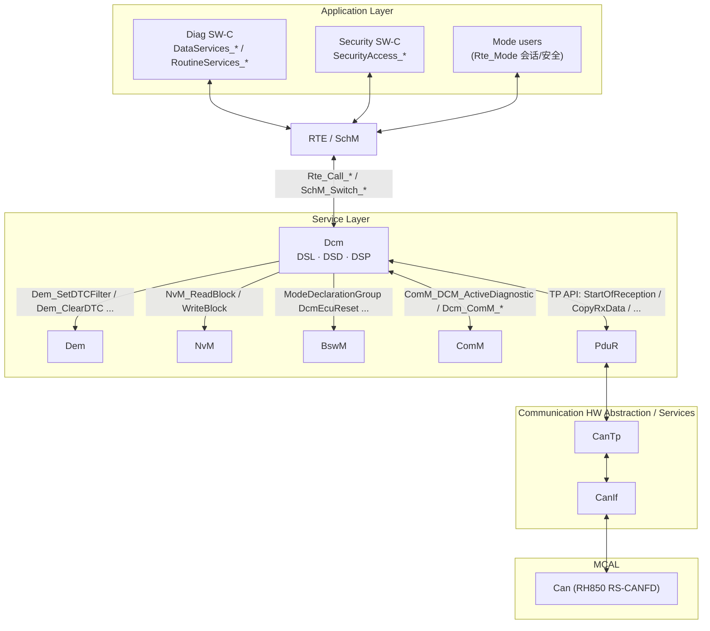
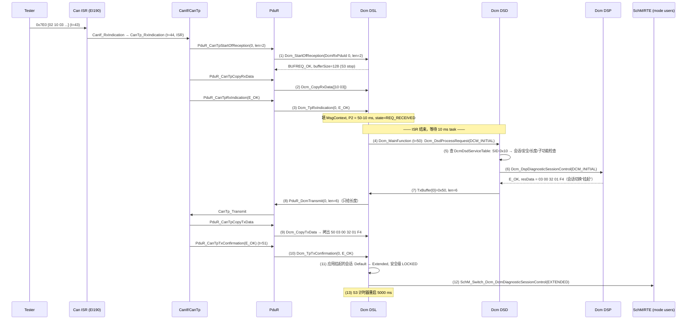

# DCM 总览：诊断通信管理器是什么、在哪里、一次请求如何走完

> Prerequisite: [MainFunction 调度](../02-autosar-classic/07-mainfunction-scheduling.md)、[CanTp](../05-can-stack/03-cantp.md)、[PduR](../05-can-stack/05-pdur.md)、[CAN RX 路径](../05-can-stack/06-can-rx-path.md)
> Next: [02 DSL — 诊断会话层](02-dsl.md)
> 对应规范: AUTOSAR CP SWS DiagnosticCommunicationManager **R20-11**（Doc ID 18）：Scope p.22–23、限制 p.27–29、依赖 p.30–31、子模块划分 §7.3.1 p.49–50、DSL §7.4 p.53–88、DSD §7.5 p.88–102、DSP §7.6 p.102 起、TP API §8.4 p.243–247、MainFunction p.260–261
> 对应源码: openAUTOSAR `diagnostic/Dcm/src/{Dcm.c,Dcm_Dsl.c,Dcm_Dsd.c,Dcm_Dsp.c}`（R3.1.5 风格）；本项目 [`examples/uds_diag_demo/diag/`](../../examples/uds_diag_demo/diag/)（R20-11 API 形态的教学实现）

---

## 1. 本章目标

读完本章，你应该能回答：

1. DCM **负责什么、不负责什么**？为什么 DTC 存储不在 DCM、ISO-TP 分段也不在 DCM？
2. DCM 在 AUTOSAR 分层中的位置：它**向下只认识 PduR**，向上/侧面与 RTE/SW-C、Dem、NvM、BswM、ComM 交互——这些交互分别是什么接口？
3. DSL / DSD / DSP 三个子模块各管什么？为什么 SWS 说这种划分“不是强制的”？
4. 一条 `10 03` 请求从 `Dcm_StartOfReception` 进入，到 `Dcm_TpTxConfirmation` 结束，中间每一步发生在 **ISR 上下文** 还是 **`Dcm_MainFunction` 上下文**？
5. openAUTOSAR 的 `Dcm.c/Dcm_Dsl.c/Dcm_Dsd.c/Dcm_Dsp.c` 和本项目 demo 的 `diag/Dcm*.c` 分别对应规范的哪一部分？
6. 将来打开公司 RTA-CAR 工程里的 DCM，第一眼应该找哪些文件、哪些符号？

本章是 Part VI 的“地图”。DSL、DSD、DSP、配置、0x10、0x27 各自有独立章节深入；DID、DTC/Dem、UDS 服务目录、运行时总流程、MainFunction、调试与升级见 [08](08-did.md)–[14](14-dcm-upgrade-guide.md)。

---

## 2. 为什么需要 DCM？

`[Conceptual]` 设想没有 DCM：每个 SW-C 自己去 CanTp 收字节、自己解析 `0x22`、自己算 P2 时间、自己判断“当前是不是扩展会话”“有没有解锁”。结果是：

- **协议逻辑被复制 N 份**：每个应用都要实现 ISO 14229-1 的 NRC 规则、SPRMIB 规则、功能寻址抑制规则，任何一处不一致都会让诊断仪（CANoe/ODIS/…）判定 ECU 不合规。
- **全局状态无人管理**：“当前会话”“当前安全级”是 **ECU 级**的状态，不属于任何一个 SW-C。
- **时序无人保证**：ISO 14229-2 要求服务器在 P2ServerMax 内响应，做不到就要发 NRC 0x78（ResponsePending）。这需要一个统一的计时者。
- **网络耦合**：CAN、CAN FD、LIN、FlexRay、DoIP 的传输细节各不相同，应用不应该知道。

DCM 就是把这些“协议层的公共问题”收拢到一个 BSW 模块里。R20-11 的定义（p.22）：DCM 提供诊断服务的通用 API，管理诊断数据流和诊断状态（特别是会话与安全状态），检查请求是否被支持、是否允许在当前状态执行；覆盖 OSI 第 5–7 层。

### 2.1 DCM **不是**什么

| 常见误解 | 事实（R20-11） | 谁负责 |
|---|---|---|
| DCM 负责 ISO-TP 分段/流控 | DCM 网络无关，只与 PduR 交互（p.23）；SF/FF/CF/FC、BS、STmin、N_Bs/N_Cr 都在 CanTp | CanTp（见 [05-can-stack/03](../05-can-stack/03-cantp.md)） |
| DCM 存储 DTC、冻结帧 | DCM 只做协议解析与组包；过滤、状态位、快照/扩展数据都在 DEM（研究笔记 02 §3.8.4） | Dem（见 [09](09-dtc-dem.md)） |
| DCM 实现 seed/key 算法 | DCM 只调用 `Xxx_GetSeed/Xxx_CompareKey`；算法属于应用/OEM 库（p.142–143） | SW-C / Csm / HSM（见 [07](07-security-access.md)） |
| DCM 直接复位 ECU | DCM 只切换 `DcmEcuReset` 模式，由 BswM 根据 action list 复位（`SWS_Dcm_00594`） | BswM → EcuM/Mcu |
| DCM 可以当 bootloader 用 | 规范明确限制：**DCM 不用于 bootloader**（p.27–29） | Flash Bootloader（FBL） |
| DCM 能同时跑两个 UDS 协议 | 只支持 OBD 与 UDS 并行，不支持两个 UDS 协议并行（p.27–29） | — |
| DCM 内部一定有 DSL/DSD/DSP 三个文件 | p.50 Note：子模块划分**不是强制实现**，只为规范可读性 | 各供应商自由实现 |

最后一条对你将来升级 RTA-CAR DCM 尤为重要：**不要期待商业栈里能找到名为 `Dsl`/`Dsd`/`Dsp` 的文件或函数**。规范中的 `DslInternal_SetSecurityLevel`、`DspInternal_DcmConfirmation` 等（§8.10 p.417–418）被明确标为 “not normative”。

---

## 3. 在系统中的位置

### 3.1 分层位置

`[AUTOSAR Standard]` DCM 位于 Service Layer 的 Communication Services（p.23），对下只有 PduR 一个“数据面”接口：



### 3.2 依赖关系图（DCM 规范 p.30–31）

`[AUTOSAR Standard]` R20-11 列出的依赖（研究笔记 02 §3.1）：

```text
Dcm
 ├── PduR      : 请求接收 / 响应发送（TP API，必需）
 ├── ComM      : Full/Silent/No Com 通知（Dcm_ComM_*）；ComM_DCM_Active/InactiveDiagnostic（必需，p.261）
 ├── Dem       : 0x14/0x19/0x85 等的 DTC 数据（ClientId 接口，DcmDemClientRef）
 ├── RTE/SW-C  : DataServices / SecurityAccess / RoutineServices / ServiceRequestNotification 端口
 ├── BswM      : 通过 ModeDeclarationGroup（DcmEcuReset、DcmDiagnosticSessionControl…）
 │               + BswM_Dcm_ApplicationUpdated / BswM_Dcm_CommunicationMode_CurrentState（p.262）
 ├── NvM       : USE_BLOCK_ID 型 DID、attempt counter 持久化
 ├── SchM      : Dcm_MainFunction 调度、SchM_Switch_*、SchM_Enter/Exit 临界区
 ├── Det       : 开发错误 / 运行时错误（p.47–48）
 ├── Csm/KeyM  : 0x29 Authentication（证书）
 ├── IoHwAb    : USE_ECU_SIGNAL 型数据
 └── EcuM      : 初始化 Dcm_Init；bootloader 跳转相关 Dcm_GetProgConditions/SetProgConditions
```

`[Real Project Consideration]` 这张图就是“为什么升级 DCM 不能只替换 `Dcm.c`”的答案：上面每一条边都是一组**由配置工具生成**的接口（`Rte_Dcm.h`、`SchM_Dcm.h`、`Dcm_Externals.h`、`PduR_Dcm.h`、`Dem` 的 client 配置……）。DCM 的 release 一变，这些边上的签名、返回值、调用时机都可能变。升级方法见 [14 DCM 升级指南](14-dcm-upgrade-guide.md)。

> 注意：本仓库**只有 DCM 的 SWS**，没有 PduR/CanTp/Dem/NvM/BswM/ComM/RTE 的 SWS。本章涉及这些模块的 API 只按“DCM 规范中作为被调用方出现的形态”描述，完整签名需以真实项目所用 release 的对应 SWS 确认。

---

## 4. AUTOSAR 如何定义 DCM

### 4.1 三个子模块（§7.3.1，p.49–50）

| 子模块 | 规范一句话定义（p.49） | 关键职责 | 关键 SWS（页码） | 深入章节 |
|---|---|---|---|---|
| **DSL** Diagnostic Session Layer | 保证请求/响应的数据流，监督并保证协议时序，管理诊断状态（尤其会话与安全） | TP 缓冲握手、P2/P2\*/S3、NRC 0x78、会话/安全/认证状态、并发 TesterPresent、协议优先级与抢占、ComM 交互、分页缓冲 | `00030`（p.53）、`00111/00241`（p.55）、`00557`（p.56）、`00024/00119`（p.61）、`00020/00022`（p.73/76）、`00140/00141`（p.78–79） | [02](02-dsl.md) |
| **DSD** Diagnostic Service Dispatcher | 处理诊断数据流：接收新请求转交数据处理器，在处理器触发时发送响应 | 校验（SID/会话/安全/模式规则/制造商与供应商许可）、SPRMIB、分发到 DSP、组装正/负响应、确认分发 | `00178`（p.88）、`01535`（p.94）、`00197/00211/00217`（p.93–97）、`00273/00696`（p.98）、`00222–00240`（p.100–102） | [03](03-dsd.md) |
| **DSP** Diagnostic Service Processing | 处理具体的服务/子服务请求 | 格式检查、调用 DEM/SW-C/BSW 取数或执行动作、组装响应数据（不含响应 SID） | `00272/00039/00271/00275`（p.103–104）、服务章节 §7.6.2 | [04](04-dsp.md) |

**为什么分三层？**（规范没有写理由，以下是教学解读 `[Conceptual]`）

- **DSL 与时间、缓冲、状态有关**——它是唯一需要“知道现在几点”的部分；它也是唯一直接面对 PduR、可能在中断上下文被调用的部分。
- **DSD 是纯粹的“规则引擎”**——给定（SID, 会话, 安全级, 配置表），输出“放行/哪个 NRC”。它不关心服务的语义。
- **DSP 是“业务”**——每个服务一个 handler，知道 `0x22` 后面跟的是 DID、`0x27` 的奇数子功能是 requestSeed。

这种划分让“新增一个服务”只影响 DSP 和服务表配置，“改时序参数”只影响 DSL 配置。

### 4.2 规范定义的“伪内部接口”（§8.10，p.417–418，not normative）

| 伪接口 | 作用 | demo 中的对应 | openAUTOSAR 中的对应 |
|---|---|---|---|
| `DslInternal_SetSecurityLevel` | DSP 在 0x27 sendKey 成功后设置安全级（`SWS_Dcm_00325`） | `Dcm_DslSetSecurityLevel`（`Dcm_Dsl.c:102-106`） | `DslSetSecurityLevel`（调用于 `Dcm_Dsp.c:1698`） |
| `DslInternal_SetSesCtrlType` | 0x10 的“发送确认函数”中设置新会话（`SWS_Dcm_00311`） | `Dcm_DslSetSession`（`Dcm_Dsl.c:108-122`） | `DslSetSesCtrlType`（调用于 `Dcm_Dsp.c:487`，**在处理时立即调用**） |
| `DspInternal_DcmConfirmation(idContext, ConnectionId, status)` | 响应发完（或被抑制）后通知 DSP，“这是做应用状态迁移的正确时机”（p.417） | `Dcm_DslFinishRequest`（`Dcm_Dsl.c:163-185`）中应用挂起的会话切换/复位 | `DspDcmConfirmation`（`Dcm_Dsp.c:1968`） |
| `DsdInternal_StartPagedProcessing` / `DsdInternal_ProcessPage` | 分页缓冲 | 未实现 | 未实现（`DCM_PAGEDBUFFER_ENABLED STD_OFF`，`include/Dcm_Cfg.h`） |

### 4.3 对外 API 分组（R20-11）

`[AUTOSAR API]`（研究笔记 02 §3.3）

| 分组 | API | 谁调用 | 上下文 |
|---|---|---|---|
| 生命周期 | `Dcm_Init(const Dcm_ConfigType*)`（`SWS_Dcm_00037`，p.236）、`Dcm_MainFunction(void)`（`00053`，p.260） | EcuM / BswM；BSW Scheduler | 启动；周期 task（`DcmTaskTime`） |
| PduR → Dcm（TP） | `Dcm_StartOfReception`、`Dcm_CopyRxData`、`Dcm_TpRxIndication`、`Dcm_CopyTxData`、`Dcm_TpTxConfirmation`（p.243–247） | PduR（代表 CanTp） | **可能在中断上下文** |
| PduR → Dcm（IF） | `Dcm_TxConfirmation`（`01092`，p.247） | PduR | 仅用于周期传输（0x2A），见 [02](02-dsl.md) §7.6 |
| ComM → Dcm | `Dcm_ComM_NoComModeEntered/SilentComModeEntered/FullComModeEntered`（p.248–249） | ComM | — |
| 状态查询 | `Dcm_GetSesCtrlType`、`Dcm_GetSecurityLevel`、`Dcm_GetActiveProtocol`、`Dcm_ResetToDefaultSession`、`Dcm_SetActiveDiagnostic` | SW-C / BSW | 任意任务 |
| Dcm → 外部（必需/可选接口） | `PduR_DcmTransmit`、`ComM_DCM_ActiveDiagnostic`、`Dem_*`、`NvM_*`、`BswM_Dcm_*`、`Rte_Call_*`、`SchM_Switch_*` | Dcm | 多数在 `Dcm_MainFunction` 中 |

---

## 5. 核心数据结构（概览）

DCM 的数据分两类，这个区分贯穿整个 Part VI：

| 类别 | 内容 | 生命周期 | 真实项目中的位置 | demo 中的位置 |
|---|---|---|---|---|
| **配置（const）** | 协议行、连接、Rx/Tx PDU id、缓冲大小、服务表、会话行（P2/P2\*）、安全行（seed/key 长度、延时）、DID/Routine 表、回调函数指针 | 编译/链接/post-build 时确定 | 生成的 `Dcm_Cfg.h`、`Dcm_Lcfg.c`、`Dcm_PBcfg.c` 一类文件（文件名因供应商而异） | `diag/Dcm_Cfg.h`、`diag/Dcm_Cfg.c` |
| **运行时状态（RAM）** | 当前会话、当前安全级、请求状态机、P2/S3 计时器、0x78 计数、Rx/Tx buffer、`Dcm_MsgContextType`、每个服务的挂起状态、安全 attempt counter/延时 | `Dcm_Init` 清零；复位丢失（除非持久化） | DCM 内部 static 变量 | `Dcm_Dsl`（`Dcm_Dsl.c:44-76`）、`Dcm_DsdActiveService`（`Dcm_Dsd.c:30`）、`Dcm_DspRdbi/Dcm_DspSec`（`Dcm_Dsp.c:24-42`） |

**`Dcm_MsgContextType`**（`SWS_Dcm_00994`，p.234–235）是 DSD 与 DSP 之间的“请求信封”：`reqData` 指向 SID **之后**的请求字节，`resData` 指向响应 SID **之后**的位置，另有 `reqDataLen/resDataLen/resMaxDataLen/msgAddInfo(reqType, suppressPosResponse)/idContext/dcmRxPduId`。demo 的定义见 `diag/Dcm_Types.h:29-38`。

`[Educational Implementation]` demo 的 DSL 在 `Dcm_TpRxIndication` 中填好这个信封（`Dcm_Dsl.c:419-427`）：

```c
/* examples/uds_diag_demo/diag/Dcm_Dsl.c:419-427 */
ctx->idContext = Dcm_DslRxBuffer[0];                 /* SID */
ctx->reqData = &Dcm_DslRxBuffer[1];
ctx->reqDataLen = (Dcm_MsgLenType)(Dcm_Dsl.rxLen - 1u);
ctx->resData = &Dcm_DslTxBuffer[1];
ctx->resDataLen = 0u;
ctx->resMaxDataLen = (Dcm_MsgLenType)(DCM_DSL_BUFFER_SIZE - 1u);
ctx->msgAddInfo.reqType = (id == DcmConf_DcmDslProtocolRx_DiagFunc) ? DCM_FUNCTIONAL_REQUEST : DCM_PHYSICAL_REQUEST;
ctx->msgAddInfo.suppressPosResponse = 0u;
ctx->dcmRxPduId = id;
```

注意 `resData = &TxBuffer[1]`：DSP 往 `resData[0..]` 写数据，DSD 最后只需在 `TxBuffer[0]` 填 `SID + 0x40`（`Dcm_Dsd.c:181`）——这正是 `SWS_Dcm_00039`（DSP 组装“不含响应 SID”的响应，p.103）和 `00223/00224`（DSD 加 SID，p.100）的分工。

---

## 6. 初始化流程

### 6.1 谁调用 `Dcm_Init`，此时 DCM 要做什么

`[AUTOSAR Standard]`

- `Dcm_Init(ConfigPtr)`（`SWS_Dcm_00037`）由 EcuM（或 BswM 的初始化 action list）调用，必须在 PduR 之后、在通信启动（CanSM/ComM 把控制器切到 STARTED）**之前**——否则第一帧诊断请求到来时 DCM 还没准备好缓冲。
- 初始化后：会话 = DefaultSession 0x01（`SWS_Dcm_00034`，p.76），安全级 = `DCM_SEC_LEV_LOCKED` 0x00（`SWS_Dcm_00033`，p.74），`ActiveDiagnostic = DCM_COMM_ACTIVE`（`01069`，p.85）。
- 如果配置了 `DcmDspSecurityAttemptCounterEnabled`，初始化后 DCM 还要通过 `Xxx_GetSecurityAttemptCounter` 恢复每个安全级的失败计数（`01154`，p.74）——这可能跨越多个 MainFunction（见 [07](07-security-access.md)）。
- 如果是从 bootloader 跳回或 ECUReset 之后，DCM 通过 `Dcm_GetProgConditions` 判断是否需要补发响应（`00536`，p.221），详见 [06](06-diagnostic-session.md) §7.5。

### 6.2 demo 中的初始化顺序

`[Educational Implementation]` `integration/EcuM.c:24-42`（`EcuM_Init`）：

```c
/* examples/uds_diag_demo/integration/EcuM.c (EcuM_Init 摘录) */
Can_Init(&Can_Config);                 /* MCAL                         */
CanIf_Init(&CanIf_Config);             /* ECU abstraction              */
CanTp_Init(&CanTp_Config);             /* services: communication      */
PduR_Init(&PduR_Config);
NvM_Init(NULL_PTR);
NvM_ReadAll();                         /* NV data before its users     */
Dem_Init(NULL_PTR);
Dcm_Init(&Dcm_Config);
Rte_Start();                           /* SW-C init runnables          */
(void)CanIf_SetControllerMode(CanConf_CanController_CAN0, CAN_CS_STARTED);
```

`Dcm_Init`（`diag/Dcm.c:16-28`）：检查 `ConfigPtr`（为空报 DET `DCM_E_INIT_FAILED`），保存配置指针，调用 `Dcm_DslInit()`（`Dcm_Dsl.c:147-157`：找默认会话行、安全级 LOCKED、无挂起会话）和 `Dcm_DspInit()`（`Dcm_Dsp.c:76-83`：清 RDBI/安全/例程状态）。trace 第 14 行：

```text
[     0 ms] [Dcm     ] Init: 9 services, 3 DIDs, 1 routines, 1 security rows; DefaultSession, LOCKED
```

`[Real Project Consideration]` 真实工程中 `Dcm_Init` 的调用点通常在 EcuM 的 DriverInitListTwo/Three 或 BswM 的启动 action list 里——由配置工具生成。升级 DCM 时要确认：新版本 `Dcm_Init` 的参数（R3.x 是 `Dcm_Init(void)`，见 openAUTOSAR `Dcm.c:79`；R4.x+ 是 `Dcm_Init(const Dcm_ConfigType*)`），以及 post-build 配置指针由谁提供。

---

## 7. Runtime Flow：一次 `10 03` 请求的完整生命周期

### 7.1 时序图

`[Educational Implementation]` 下面的时间戳取自 `artifacts/uds-demo/trace.txt` 第 129–161 行（`10 03` 进入扩展会话）。Dcm_MainFunction 周期 10 ms（`DCM_TASK_TIME_MS`，`Dcm_Cfg.h:20`）。



### 7.2 逐个 transition 解释

| # | API | 谁调用 / 上下文 | 输入 → 输出 | 状态变化（demo 代码） | 规范依据 |
|---|---|---|---|---|---|
| 1 | `Dcm_StartOfReception(id, info, TpSduLength, bufferSizePtr)` | PduR 代 CanTp 调用；**ISR**（demo 中是 RX FIFO ISR 的调用链） | TpSduLength=2 → `BUFREQ_OK`，`*bufferSizePtr=128` | `IDLE→RECEIVING`，停 S3（`Dcm_Dsl.c:339-344`） | `SWS_Dcm_00094` p.243；S3 停 `00141` p.79 |
| 2 | `Dcm_CopyRxData(id, info, bufferSizePtr)` | 同上 | 2 字节拷入 Rx buffer，返回剩余空间 | `rxCopied += 2`（`Dcm_Dsl.c:375-379`） | `00556`/`00443` p.57 |
| 3 | `Dcm_TpRxIndication(id, E_OK)` | 同上 | — | 填 MsgContext；P2 计时 = P2ServerMax − Adjust；`REQ_RECEIVED`（`Dcm_Dsl.c:419-434`）。**不在 ISR 里处理服务** | `00093` p.245；`00111` p.55（只有 E_OK 才交 DSD） |
| 4 | `Dcm_MainFunction` → `Dcm_DslMainFunction` → `Dcm_DsdProcessRequest(DCM_INITIAL,…)` | BSW Scheduler 10 ms task | — | `REQ_RECEIVED→PROCESSING`（`Dcm_Dsl.c:254-257`） | `00053` p.260 |
| 5 | DSD 校验链 | MainFunction | SID 0x10 找到；会话/安全通过；长度 ≥2；子功能 0x03 已配置 | `Dcm_DsdCheckRequest`（`Dcm_Dsd.c:77-142`） | `01535` p.94 |
| 6 | DSP handler | MainFunction | 查会话行，填 P2/P2\* → `E_OK` | `Dcm_DslRequestSessionChange(row)`：**只登记，不切换**（`Dcm_Dsp.c:138`） | `00250/00307` p.114 |
| 7 | 组装正响应 | MainFunction | `TxBuffer[0]=SID+0x40` | `Dcm_Dsd.c:181-185` | `00223/00224` p.100 |
| 8 | `PduR_DcmTransmit(TxPduId, PduInfo{SduDataPtr=NULL, SduLength=6})` | Dcm（MainFunction） | 只告诉下层**长度** | `PROCESSING→TRANSMITTING`（`Dcm_Dsl.c:187-204`） | `00115` p.59 |
| 9 | `Dcm_CopyTxData(id, info, retry, availableDataPtr)` | CanTp 经 PduR，**拉**数据；可能在 task 或 ISR | 拷出 6 字节 | `txCopied`（`Dcm_Dsl.c:441-474`） | `00092` p.245–246 |
| 10 | `Dcm_TpTxConfirmation(id, E_OK)` | CanTp 经 PduR；Tx 确认链（demo：`Can_MainFunction_Write` 轮询） | — | 停 P2 监控 | `00351` p.247；`00353` p.59 |
| 11 | （内部）`DslInternal_SetSesCtrlType` | Dcm | — | `Dcm_DslFinishRequest` → `Dcm_DslSetSession`：会话切换 + 安全级复位（`Dcm_Dsl.c:166-171`、`108-122`） | `00311` p.114；`00139` p.74 |
| 12 | `SchM_Switch_<bsnp>_DcmDiagnosticSessionControl(new)` | Dcm | 模式通知 BswM / SW-C | `Rte_Dcm.c:134-139` | `00311` p.114；ModeDeclarationGroup `91019` p.409 |
| 13 | S3 重启 | Dcm | — | `Dcm_Dsl.c:182-184` | `00141` p.79 |

**两个关键设计点：**

1. **ISR/Task 分界**：TP 回调（1–3、9、10）在 R20-11 中“might be called in interrupt context”（p.244–247 每个 API 的 Description）。所以 DCM 在回调里只做“拷贝 + 登记状态”，真正的服务处理推迟到 `Dcm_MainFunction`。这也意味着真实实现必须用 `SchM_Enter_Dcm_<EA>/SchM_Exit_Dcm_<EA>` 保护这些共享状态；demo 是单线程 host 程序，省略了临界区（`rte/SchM_Dcm.h` 头注释）。
2. **“先响应、后生效”**：会话切换（0x10）和复位（0x11）都在 `Dcm_TpTxConfirmation` 之后才生效。原因：P2 新值必须在“旧会话的响应”发出后才适用（p.80：“Activation of new timing values is only allowed after sending the response”）；复位如果先于响应，测试仪永远收不到 `51 01`。

---

## 8. RH850 Hardware Mapping

DCM 本身**不访问任何寄存器**，但它的行为直接受 RH850 平台的三个方面约束：

| DCM 概念 | RH850/P1M-E 上的落点 | 说明 |
|---|---|---|
| TP 回调“可能在中断上下文” | RS-CANFD RX FIFO 中断 **INTRCANGRECC = EI190**（不是 EI184，EI184 是 CAN0 common FIFO）→ OS Cat2 ISR → Can MCAL ISR → CanIf → CanTp → PduR → `Dcm_StartOfReception…` | demo 的 `BswScheduler.c:33-35` 模拟 INTC 调用 `Can_Isr_GlobalRxFifo()`；真实 ISR 优先级与 EIC 配置由 OS/集成者决定，见 [04-can-mcal/12](../04-can-mcal/12-can-interrupt-implementation.md) |
| P2/P2\*/S3/安全延时的计时 | `Dcm_MainFunction` 的周期（`DcmTaskTime`，`ECUC_Dcm_00820` p.678），其底层是 OS counter（通常由 OSTM 驱动） | OSTM0/OSTM1 中哪一个作为 OS tick 是**配置选择**，不是硬件事实；计时精度 = `DcmTaskTime` |
| 0x11 硬复位 | BswM action → `Mcu_PerformReset()` → RH850 软件复位（SWRESA 等寄存器，**需根据实际芯片手册确认**） | DCM 规范只到 `DcmEcuReset=EXECUTE`（`SWS_Dcm_00594`） |
| `USE_BLOCK_ID` DID / attempt counter 持久化 | NvM → Fee → Fls（RH850 Data Flash） | DCM 只调 NvM，不碰 flash |
| 安全访问随机数 | RH850 上是否有 TRNG/ICU-S/HSM 取决于具体 derivative（P1M-E 的安全外设**需根据实际芯片手册确认**） | 见 [07](07-security-access.md) §8 |

`[RH850 Hardware]` 一个常被忽略的点：CAN 中断的 OS 分类决定了 `Dcm_StartOfReception` 能否调用 OS 服务。若 CAN ISR 是 Cat1（不经 OS），则 TP 回调链中任何 `SchM_Enter`（通常映射为 OS 的 `SuspendAllInterrupts` 或自旋锁）都可能不合法——这是集成配置问题，不是 DCM 代码问题。

---

## 9. openAUTOSAR 实现（Arctic Core 2.18.0，R3.1.5 风格）

`[AUTOSAR Standard]` 的 R4.x 名与 openAUTOSAR 文件的映射（研究笔记 03 §7.2，均已在本机源码核对）：

| 规范部分 | openAUTOSAR 文件:行 | 说明 |
|---|---|---|
| `Dcm_Init` | `diagnostic/Dcm/src/Dcm.c:79` | R3：`Dcm_Init(void)`，使用全局 `DCM_Config`（`include/Dcm_Lcfg.h:641` 只有 extern，**定义缺失**） |
| `Dcm_MainFunction` | `Dcm.c:96-103` | 顺序 `DsdMain(); DspMain(); DslMain();` |
| DSL（缓冲、P2/S3、会话） | `src/Dcm_Dsl.c`：`DslProvideRxBufferToPdur` `:682`、`DslRxIndicationFromPduR` `:743`、`DslProvideTxBuffer` `:899`、`DslTxConfirmation` `:950`、`DslMain` `:523` | R3 “借 buffer” 接口 `Dcm_ProvideRxBuffer`（`Dcm.c:109`） |
| DSD（服务表、NRC） | `src/Dcm_Dsd.c`：`DsdHandleRequest` `:278`、`selectServiceFunction` `:86`、`DsdDspProcessingDone` `:342` | `DCM_USE_SERVICE_*` 全仓未定义 → 所有请求都回 0x11 |
| DSP（服务 handler） | `src/Dcm_Dsp.c`：0x10 `:469`、0x11 `:530`、0x22 `:1386`、0x27 `:1614`、0x2E `:1578`、0x31 `:1832`、0x3E `:1897`；确认 `DspDcmConfirmation` `:1968` | 应用接口全是配置中的 C 函数指针，无 RTE port |
| 配置类型 | `include/Dcm_Lcfg.h`（`Dcm_ConfigType` `:629-634`） | 树形结构与 R4 ECUC 大致对应 |

**与 R20-11 的关键差异**（升级教学素材）：

- TP 接口是 R3 的 `Dcm_ProvideRxBuffer / Dcm_RxIndication / Dcm_ProvideTxBuffer / Dcm_TxConfirmation(NotifResultType)`（`include/Dcm_Cbk.h:32-35`），R4.x 换成了 `StartOfReception / CopyRxData / TpRxIndication / CopyTxData / TpTxConfirmation(Std_ReturnType)`。对照表见 [02 DSL](02-dsl.md) §9。
- 没有 `Dcm_OpStatusType` 重入模型；pending 的服务在每个 `DspMain` 中**整体重跑**（研究笔记 03 §4.2）。
- 0x27 没有 attempt counter / delay（`DspSecurityNumAttDelay` 等字段未被使用）。
- 0x10 在处理时立即切换会话（`Dcm_Dsp.c:487`），而非在 Tx 确认后。

---

## 10. 当前教学项目实现

`[Educational Implementation]` `examples/uds_diag_demo/diag/` 用 R20-11 的 API 名与签名实现了一个“单协议、单连接”的最小 DCM：

| demo 文件 | 行数 | 对应规范 | 包含 | 刻意省略 |
|---|---|---|---|---|
| `diag/Dcm.h` / `Dcm.c` | 41 / 67 | 公共 API（p.236–261） | `Dcm_Init`、`Dcm_MainFunction`、`Dcm_Get*`、`Dcm_ResetToDefaultSession` | `Dcm_GetVersionInfo`、`Dcm_GetActiveProtocol`、`Dcm_SetActiveDiagnostic` |
| `diag/Dcm_Dsl.c` | 497 | §7.4 | TP 握手、P2/P2\*/S3、独立 buffer 的 0x78、会话/安全、并发功能 3E 80、Tx 确认后切会话/复位 | 协议抢占、多连接、ComM、分页缓冲、ROE、周期传输、0x29、`DCM_E_FORCE_RCRRP` |
| `diag/Dcm_Dsd.c` | 195 | §7.5 | SID/会话/安全/最小长度/子功能检查、SPRMIB、功能寻址 NRC 抑制、默认 NRC 0x10 | Manufacturer/Supplier notification、模式规则、认证 |
| `diag/Dcm_Dsp.c` | 638 | §7.6 | 0x10 0x11 0x14 0x19(02) 0x22 0x27 0x2E 0x31 0x3E | 其他服务 |
| `diag/Dcm_Cfg.h` / `Dcm_Cfg.c` | 154 / 133 | ECUC（p.441 起） | “as if generated” 的服务表、会话行、安全行、DID 表、例程表 | DID→DidInfo→DcmDspData 的多级引用被压平 |
| `diag/Dcm_Types.h`、`Dcm_Internal.h` | 40 / 67 | `Dcm_MsgContextType`；伪内部接口 | — | — |
| `rte/Rte_Dcm.*`、`rte/SchM_Dcm.h`、`rte/Rte_Dcm_Type.h` | — | §8.8 端口接口、`Rte_Dcm_Type.h` 类型 | `Rte_Call_DataServices_*`、`SecurityAccess_*`、`RoutineServices_*`、`SchM_Switch_Dcm_*` | IOC、跨核、exclusive area |

---

## 11. Code Walkthrough：`Dcm_MainFunction` 的骨架

`[Educational Implementation]` `diag/Dcm.c:33-40`：

```c
void Dcm_MainFunction(void)
{
    if (Dcm_CfgPtr == NULL_PTR) {
        return;
    }
    Dcm_DslMainFunction();
    Dcm_DspMainFunction();
}
```

`Dcm_DslMainFunction`（`Dcm_Dsl.c:249-302`）一次调用里做三件事，顺序很重要：

1. **推进请求**（`:254-264`）：`REQ_RECEIVED` → 以 `DCM_INITIAL` 调 DSD；`PROCESSING` → 以 `DCM_PENDING` 重调（`SWS_Dcm_00530`）。
2. **P2/P2\* 监督**（`:266-287`）：服务仍在 `PROCESSING` 时递减 P2 计时，到期发 0x78（`00024`）、重载为 P2\* − Adjust；达到 `DcmDslDiagRespMaxNumRespPend` 则以 `DCM_CANCEL` 取消并发 0x10（`00120`）。
3. **S3 监督**（`:289-301`）：空闲且非默认会话时 S3 到期 → 回默认会话（`00140`）。

`Dcm_DspMainFunction`（`Dcm_Dsp.c:86-100`）只递减安全访问延时计时器（`DcmDspSecurityDelayTime`）。

对比 openAUTOSAR 的 `DsdMain → DspMain → DslMain`（`Dcm.c:100-102`）：顺序不同，但都体现了“**DCM 的一切时间行为都以 MainFunction 为节拍**”这一点——这也是为什么 `DcmTaskTime` 必须和 RTE/SchM 中实际的调度周期一致（`ECUC_Dcm_00820` p.678）。MainFunction 的深入讨论见 [12 Dcm_MainFunction](12-dcm-mainfunction.md)。

---

## 12. Debug 方法

### 12.1 “诊断无响应”时的断点顺序

按数据流方向逐层下断点，**每一层先证明“到达了”，再看下一层**：

| 顺序 | 断点 | 看什么 | 如果没停下来 |
|---|---|---|---|
| 1 | `Dcm_StartOfReception` | `id`（是哪个 DcmRxPduId？物理/功能）、`TpSduLength`、返回值 | 问题在 CanTp/PduR/CanIf 或更下层（见 [05-can-stack](../05-can-stack/06-can-rx-path.md)） |
| 2 | `Dcm_TpRxIndication` | `result` 是否 E_OK | E_NOT_OK → 多帧接收失败（N_Cr 超时等），看 CanTp |
| 3 | `Dcm_MainFunction` | 是否被周期调用；DSL 状态是否 `REQ_RECEIVED` | MainFunction 未调度（OS task/SchM 配置） |
| 4 | DSD 服务查找 | 当前会话/安全级、服务表行 | 得到 NRC 0x11/0x7F/0x33 |
| 5 | DSP handler / `Rte_Call_*` | `OpStatus`、返回值、ErrorCode | 应用返回 PENDING 不结束 → 0x78 循环 |
| 6 | `PduR_DcmTransmit` | 长度、返回值 | E_NOT_OK → 响应丢弃，不重发（`SWS_Dcm_00118`） |
| 7 | `Dcm_CopyTxData` / `Dcm_TpTxConfirmation` | `result` | 下层发送失败（N_Bs 超时、bus-off） |

### 12.2 关键 watch 变量（demo 名 → 真实栈中要找的概念）

- `Dcm_Dsl.state`、`Dcm_Dsl.sessionRow`、`Dcm_Dsl.secLevel`、`Dcm_Dsl.p2TimerMs`、`Dcm_Dsl.s3TimerMs`、`Dcm_Dsl.respPendCount`（`Dcm_Dsl.c:44-70`）。
- 真实栈：找“当前会话”“当前安全级”“请求状态”“P2 计数器”“S3 计数器”“0x78 计数器”这 6 个运行时变量。它们一定存在，只是名字不同。

### 12.3 用 trace 代替断点

demo 每一跳都有 trace（`artifacts/uds-demo/trace.txt`）。例如只看 DCM：

```powershell
Select-String -Path artifacts/uds-demo/trace.txt -Pattern "Dcm/"
```

更系统的 DCM 调试方法见 [13 DCM 调试](13-dcm-debugging.md)。

---

## 13. 常见问题

| 现象 | 常见原因 | 在哪确认 |
|---|---|---|
| 所有请求都回 `7F xx 11` | 服务表为空或协议引用了错误的 SID 表；openAUTOSAR 中是 `DCM_USE_SERVICE_*` 未定义（研究笔记 03 §3.3） | `DcmDslProtocolSIDTable`、生成的服务表 |
| 只有物理请求有响应，功能请求（0x7DF）没有 | 功能 Rx PDU 未配置 `DcmDslProtocolRxAddrType=DCM_FUNCTIONAL_TYPE`，或 PduR 没路由；或 NRC 被正确地抑制（`SWS_Dcm_00001`） | Dcm/PduR/CanTp 配置 |
| 请求能进 `Dcm_TpRxIndication`，但永远没响应 | `Dcm_MainFunction` 没被调度 | OS/SchM 配置、`DcmTaskTime` |
| 0x10 切到扩展会话后马上又回默认 | 测试仪没发 TesterPresent，S3 5 s 超时；或 ECU 的 MainFunction 周期配置与实际调度不一致导致 S3 实际变短 | `DcmTaskTime` vs OS alarm 周期 |
| 0x78 之后测试仪仍超时 | 测试仪 P2\* 设置比 ECU 实际间隔小；`DcmTimStrP2StarServerAdjust` 太小 | [02 DSL](02-dsl.md) §7.4 |
| ECUReset 后测试仪没收到 `51 01` | 复位在响应发出前执行（违反 `SWS_Dcm_00594`） | BswM 规则、`DcmEcuReset` 模式切换时机 |

---

## 14. 实验

所有实验在仓库根目录执行 `python tools/run_uds_demo.py`，**不修改 demo 源码**，只阅读输出。

1. **画出你自己的时序图**：在 `artifacts/uds-demo/trace.txt` 中找到 `22 F1 87` 那一段（约第 84–127 行），只用 trace 行，写出每一跳对应本章 §7.2 表格中的哪个编号。注意：`22 F1 87` 是同步 DID，比 `10 03` 少一次 MainFunction 往返吗？为什么？
2. **测 ISR→MainFunction 延迟**：在 trace 中比较每个请求的 `TpRxIndication` 时间戳和 `[Dcm/DSD] SID 0x..: lookup` 时间戳。差值为什么在 1–9 ms 之间变化？它的上限由哪个配置参数决定？
3. **验证“先响应后切会话”**：在 `10 03` 段落中，找出 `TpTxConfirmation(E_OK)` 与 `session DefaultSession -> ExtendedDiagnosticSession` 两行的先后顺序。
4. **阅读回归测试**：打开 `examples/uds_diag_demo/tests/test_uds_demo.c`，找到 `test_unknown_sid_and_lengths`，说出每个期望 NRC 是 DSD 还是 DSP 产生的。

---

## 15. 思考题

1. 为什么 `Dcm_TpRxIndication` 不直接调用 DSD？如果直接调用会对 RH850 上的 CAN 中断延迟产生什么影响？
2. SWS 说 DSL/DSD/DSP 划分不是强制的。那么在一个陌生的商业 DCM 中，你会用什么“行为特征”来定位“DSL 的部分”？（提示：谁持有计时器？谁被 PduR 调用？）
3. `Dcm_MsgContextType.resData` 指向 Tx buffer 的第 1 字节。如果一个服务需要的响应比 `resMaxDataLen` 还长，R20-11 给出了哪两种不同的处理（提示：`SWS_Dcm_01058/01059`，p.73）？
4. 依赖图中，哪些边是“DCM 主动调用”，哪些是“别人调用 DCM”？升级时哪一类更容易出现链接错误、哪一类更容易出现运行时行为差异？

---

## 16. 对未来真实项目的意义

进入公司 RTA-CAR 工程后（RTA-CAR 12.9.0 是截图中的可能环境，其内部实现**需在真实项目环境中确认**），按下面的清单建立对 DCM 的第一张地图：

1. **找版本**：在 DCM 头文件中搜 `DCM_AR_RELEASE_MAJOR_VERSION` / `DCM_AR_RELEASE_MINOR_VERSION` / `DCM_SW_MAJOR_VERSION`（R4.x 命名惯例），openAUTOSAR 则是 `DCM_AR_MAJOR_VERSION`（`Dcm.h:34-36`）。这决定你该读哪个 release 的 SWS。
2. **找 TP 入口**：搜 `Dcm_StartOfReception`、`Dcm_CopyRxData`、`Dcm_TpRxIndication`、`Dcm_CopyTxData`、`Dcm_TpTxConfirmation`。如果搜到的是 `Dcm_ProvideRxBuffer`，说明是 R3.x 接口。
3. **找配置**：搜 `Dcm_Cfg.h`、`Dcm_Lcfg.c`、`Dcm_PBcfg.c` 或供应商命名的 `Dcm_*Cfg*`；在其中搜 `0x22` 或 `ReadDataByIdentifier` 找服务表。
4. **找应用边界**：搜 `Rte_Call_DataServices_`、`Rte_Call_SecurityAccess_`、`Rte_Call_RoutineServices_`、`Dcm_Externals.h`（C callout 原型）。
5. **找模式边界**：搜 `SchM_Switch_` + `DcmDiagnosticSessionControl`、`DcmEcuReset`，再到 BswM 配置里找订阅这些模式的规则。
6. **找调度**：搜 `Dcm_MainFunction` 被哪个 OS task 调用，确认其周期等于配置的 `DcmTaskTime`。
7. **对照 demo**：把 §7.2 的 13 个 transition 逐个在真实栈中定位到函数。能全部定位，你就掌握了这个 DCM 的骨架。

---

## 17. 本章总结

```text
          ISR 上下文                         |         Dcm_MainFunction 上下文
PduR → Dcm_StartOfReception/CopyRxData      |
     → Dcm_TpRxIndication  ──登记请求──────► |  DSL: P2/S3 计时, 推进状态机
                                            |  DSD: SID/会话/安全/长度/子功能 → NRC 或放行
                                            |  DSP: 服务 handler → Rte/Dem/NvM (OpStatus)
                                            |  DSD: 组装 SID+0x40 / 7F SID NRC
                                            |  DSL: PduR_DcmTransmit(只给长度)
PduR → Dcm_CopyTxData (拉数据)  ◄───────────  |
PduR → Dcm_TpTxConfirmation → 会话/复位生效, S3 重启
```

- DCM = 协议规则 + 全局诊断状态 + 时序保证；它不做传输、不存 DTC、不实现安全算法、不直接复位。
- DSL/DSD/DSP 是规范的叙述结构，不是实现义务。
- 理解 DCM 的关键是两条分界：**ISR vs MainFunction**、**处理 vs 生效（Tx 确认之后）**。

---

## 18. 下一章

DCM 与外界的第一个接触点是 PduR 的 TP 接口，而所有的时序（P2/P2\*/S3/0x78）也都在同一个子模块里。下一章 [02 DSL](02-dsl.md) 将逐个讲清 `BufReq_ReturnType` 的语义、协议/连接/PDU 配置、缓冲所有权、0x78 的生成与并发请求的处理，并给出 R3.x（openAUTOSAR）与 R4.x 的 TP 接口对照表。
