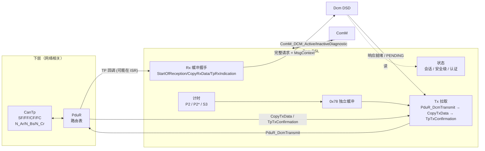
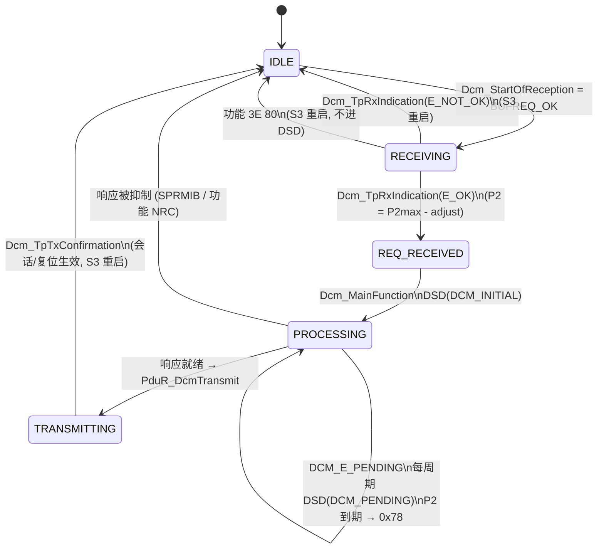
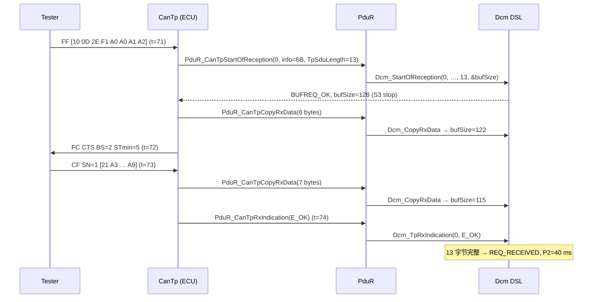
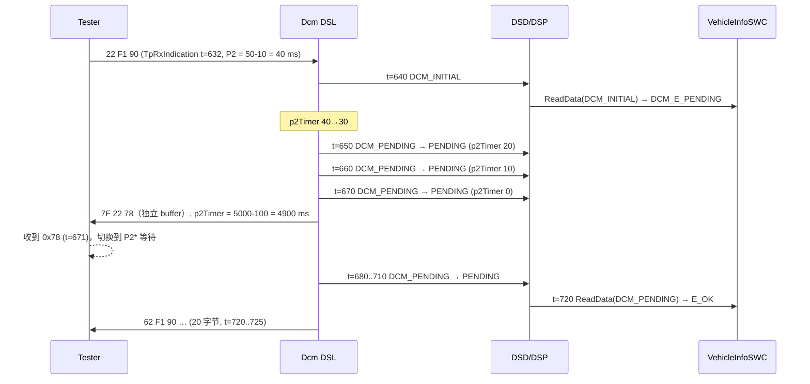

# DSL — Diagnostic Session Layer：TP 接口、缓冲、协议/连接、P2/P2\*/S3 与 NRC 0x78

> Prerequisite: [01 DCM 总览](01-dcm-overview.md)、[CanTp](../05-can-stack/03-cantp.md)、[ISO-TP](../05-can-stack/04-isotp.md)、[PduR](../05-can-stack/05-pdur.md)
> Next: [03 DSD — 服务分发](03-dsd.md)
> 对应规范: AUTOSAR CP SWS DCM **R20-11** §7.4 DSL（p.53–88）、§8.4 TP 回调（p.243–249）、§10 配置 DcmDsl（p.457–481）、`DcmTaskTime`（p.678）
> 对应源码: openAUTOSAR `diagnostic/Dcm/src/Dcm_Dsl.c`、`include/Dcm_Lcfg.h`（R3.1.5）；本项目 [`examples/uds_diag_demo/diag/Dcm_Dsl.c`](../../examples/uds_diag_demo/diag/Dcm_Dsl.c)、[`com/PduR.c`](../../examples/uds_diag_demo/com/PduR.c)、[`com/CanTp.c`](../../examples/uds_diag_demo/com/CanTp.c)

---

## 1. 本章目标

学完本章你应该能够：

1. 逐个解释 `Dcm_StartOfReception / Dcm_CopyRxData / Dcm_TpRxIndication / Dcm_CopyTxData / Dcm_TpTxConfirmation` 的**调用者、上下文、输入输出与每个 `BufReq_ReturnType` 返回值的后果**（包括它如何影响 CanTp 发出的 Flow Control）。
2. 画出 `DcmDslProtocolRow → DcmDslConnection → DcmDslMainConnection → DcmDslProtocolRx / DcmDslProtocolTx` 的配置树，说出一个 `PduId` 是如何把 CanTp 的 N-SDU 映射到“某个协议的某个连接”的。
3. 解释 DSL 的缓冲所有权：为什么 0x78 必须用独立缓冲（`SWS_Dcm_00119`）？
4. 精确说出 P2、P2\*、S3 计时器何时启动、何时停止、到期后做什么，以及 `DcmTimStrP2ServerAdjust` 为什么存在。
5. 解释并发请求的三种情况：同连接（`BUFREQ_E_NOT_OK`）、并发功能 TesterPresent（接受但不处理）、不同连接（0x21 或静默拒绝）。
6. 对比 R3.x（openAUTOSAR `Dcm_ProvideRxBuffer`）与 R4.x TP 接口，说出升级时最容易出错的语义差异。

---

## 2. 为什么需要 DSL？

DSD 和 DSP 只关心“请求字节是什么、该回什么”。但在它们之前和之后，有一大堆与**传输和时间**相关的问题：

- 请求是分段到达的（FF + CF），在最后一个 CF 到达之前，谁持有缓冲？缓冲不够大怎么办？
- 正在处理一个请求时，又来了一个请求怎么办？如果第二个只是功能寻址的 `3E 80` 呢？
- 应用需要 3 秒才能读出数据，但测试仪 P2 = 50 ms，ECU 该怎么让测试仪“再等等”？
- 测试仪离开了（不再发 TesterPresent），ECU 何时退回默认会话、重新上锁？
- CAN 通道进入 Silent/No Communication 时，DCM 还能不能发响应？

这些问题有一个共同特征：**它们与服务语义无关，但与 ISO 14229-2（会话层时序）和 ISO 15765-3/-2（网络无关部分）直接相关**。`SWS_Dcm_00030`（p.53）要求 DSL 所有功能符合 ISO14229-1、ISO14229-2 和 ISO15765-3 的网络无关部分；并且“DSL 中没有网络相关的功能区”。

---

## 3. 在系统中的位置



DSL 与 DSD 的接口（规范 Table 7.3，p.91）：双向交换诊断消息；DSD 从 DSL 获取当前会话和安全级；DSL 把发送确认交给 DSD。

---

## 4. AUTOSAR 如何定义 DSL

### 4.1 TP 接口：五个回调与 `BufReq_ReturnType`

`[AUTOSAR API]`（R20-11 §8.4，`Dcm.h`；每个 API 的 Description 都写着 “This function might be called in interrupt context”）

```c
BufReq_ReturnType Dcm_StartOfReception(PduIdType id, const PduInfoType* info,
                                       PduLengthType TpSduLength, PduLengthType* bufferSizePtr); /* SWS_Dcm_00094, 0x46, p.243-244 */
BufReq_ReturnType Dcm_CopyRxData(PduIdType id, const PduInfoType* info,
                                 PduLengthType* bufferSizePtr);                                 /* SWS_Dcm_00556, 0x44, p.244-245 */
void              Dcm_TpRxIndication(PduIdType id, Std_ReturnType result);                       /* SWS_Dcm_00093, 0x45, p.245 */
BufReq_ReturnType Dcm_CopyTxData(PduIdType id, const PduInfoType* info,
                                 const RetryInfoType* retry, PduLengthType* availableDataPtr);    /* SWS_Dcm_00092, 0x43, p.245-246 */
void              Dcm_TpTxConfirmation(PduIdType id, Std_ReturnType result);                     /* SWS_Dcm_00351, 0x48, p.247 */
```

#### 4.1.1 `Dcm_StartOfReception` —— “你接不接这个请求？给你多大缓冲？”

| 项 | 内容 |
|---|---|
| 谁调用 | PduR（`PduR_CanTpStartOfReception` 转发），代表 CanTp 收到 **SF 或 FF** 时 |
| 上下文 | 通常是 CAN RX ISR 的调用链（或 `Can_MainFunction_Read` 轮询链） |
| 输入 | `id` = **DcmDslProtocolRxPduId**（Dcm 自己的 handle，`ECUC_Dcm_00687` p.476）；`info` = SF/FF 中的首段数据和 MetaData（可为 NULL_PTR，p.244）；`TpSduLength` = 整个请求长度 |
| 输出 | `*bufferSizePtr` = 可用接收缓冲；R20-11 写明“该参数会被传输协议模块用于计算 Block Size（BS）”（p.244） |
| 返回 | `BUFREQ_OK`：接受；`BUFREQ_E_NOT_OK`：拒绝，接收中止；`BUFREQ_E_OVFL`：没有这么大的缓冲，接收中止（p.244） |
| 关键 SWS | `00444`（长度超过缓冲 → `BUFREQ_E_OVFL`，p.56）；`00642`（`TpSduLength==0` → `BUFREQ_E_NOT_OK`，p.57）；`00557`（处理中同连接新请求 → `E_NOT_OK`，并发 TP 例外，p.56）；`00788/00789/00790`（不同连接，p.56）；`00141`（开始接收即停 S3，p.79） |

> 规范内部不一致：p.244 的 Description 写“当 `TpSduLength` 为 0 时应提供当前可用的最大缓冲”，而 `SWS_Dcm_00642`（p.57）要求 `TpSduLength==0` 返回 `BUFREQ_E_NOT_OK`。demo 按 `00642` 实现（`Dcm_Dsl.c:321-323`）。真实栈选哪种 → 需在真实项目确认（这是升级回归测试应覆盖的边界）。

**`BufReq_ReturnType` 对总线的影响**（CanTp 侧行为，本仓库没有 CanTp SWS，以下是公认 R4.x 行为 + demo 实现）：

| Dcm 返回 | 对 SF | 对 FF | demo 中 CanTp 代码 |
|---|---|---|---|
| `BUFREQ_OK` | 继续 `CopyRxData` | 根据 `bufferSize` 决定发 FC.CTS 还是 FC.WAIT | `com/CanTp.c:166-180`（`upperBufferSize >= 下一块所需` → CTS，否则 WAIT，超过 `wftMax` 中止） |
| `BUFREQ_E_OVFL` | 丢弃 | 发 **FC.OVFLW**，测试仪放弃 | `com/CanTp.c:247-252` |
| `BUFREQ_E_NOT_OK` | 丢弃 | **不发 FC**，测试仪 N_Bs 超时 | `com/CanTp.c:253-256` |

这就是为什么“DCM 缓冲大小”会直接出现在 CAN 总线上：缓冲不足时，测试仪看到的是 FC.OVFLW，而不是任何 UDS NRC。

#### 4.1.2 `Dcm_CopyRxData` —— “把这一段拷进你的缓冲”

- 每个 SF/FF/CF 的有效载荷各调用一次；`*bufferSizePtr` 返回拷贝后剩余空间（`SWS_Dcm_00443`，p.57）。
- `info->SduLength == 0` 是**查询**：返回 `BUFREQ_OK` 和剩余空间（`00996`，p.57），`SduDataPtr` 可以是 NULL_PTR（p.245）。CanTp 在发送下一个 FC 之前常用它。
- 开始拷贝后，到 `Dcm_TpRxIndication` 之前，Dcm **不得访问**接收缓冲（`00342`，p.57）——因为数据还不完整，而且可能在 ISR 中被并发写入。

#### 4.1.3 `Dcm_TpRxIndication` —— “接收结束了，结果是……”

- `result == E_OK`：DSL 把请求交给 DSD（`00111`，p.55），并从此**锁定**这个 DcmPduId 直到 `Dcm_TpTxConfirmation`（`00241`，p.55）。
- `result != E_OK`：不评估缓冲内容（`00344`，p.57）——不知道哪些字节有效；同时按 `00141` 重启 S3（“indicates an error during the reception of a multi-frame request”是 S3 的启动条件之一，p.79）。
- 只有 `StartOfReception` 成功后才会收到这个调用（p.57 Note）。

#### 4.1.4 `Dcm_CopyTxData` —— 下层“拉”响应数据

- DSL 发送时调用 `PduR_DcmTransmit(DcmDslProtocolTxPduRef, PduInfo)`（`00115`，p.59），其中**只有长度**（以及通用连接的地址 MetaData），数据随后由下层通过 `Dcm_CopyTxData` 按段拉取（p.60）。
- 返回 `BUFREQ_OK`（已完整拷贝，`00346` p.58）、`BUFREQ_E_BUSY`（数据暂不够，下层可重试——分页缓冲场景，`01186` p.73）、`BUFREQ_E_NOT_OK`（失败；但本次发送仍未结束，必须等 `Dcm_TpTxConfirmation(E_NOT_OK)` 才算结束，`00350` p.58–59）。
- `retry`：NULL_PTR 表示拷完即可丢弃；`TP_CONFPENDING` 要求保留；`TP_DATARETRY` 要求从 `TxTpDataCnt` 指示的偏移重新拷（p.246）。
- `*availableDataPtr` 不得超过剩余待发字节（`00350`）。

#### 4.1.5 `Dcm_TpTxConfirmation` —— 发送结束

- 解锁发送缓冲（`00352`）、停止 P2/P2\*/分页超时监控（`00353`，p.59），转给 DSD → `DspInternal_DcmConfirmation`（`00117/00235/00236`，p.60/101）。
- 发送失败**不重发**（`00118`，p.60）。
- 它是 S3 的启动条件（`00141`），也是 0x10 切会话、0x11 复位的触发点（`00311`/`00594`）。

#### 4.1.6 `Dcm_TxConfirmation`（IF 型）不是普通响应的确认

`SWS_Dcm_01092`（p.247）定义的 `Dcm_TxConfirmation(PduIdType, Std_ReturnType)` 是 **IF（非 TP）接口**，用于周期传输（0x2A）：周期 PDU 由 `PduR_DcmTransmit` 一次给出完整载荷、不调用 `Dcm_CopyTxData`（`01072`），结果由 `Dcm_TxConfirmation` 通知（`01073`，p.59）。**普通 UDS 响应的确认是 `Dcm_TpTxConfirmation`**。

> 升级陷阱：openAUTOSAR（R3.x）里叫 `Dcm_TxConfirmation(PduIdType, NotifResultType)` 的函数（`Dcm.c:188`）是 **TP 响应确认**；R4.x 中同名函数的语义已经变成“周期传输的 IF 确认”。只按函数名做映射会接错。

### 4.2 协议 / 连接 / Rx-Tx PDU 的配置模型

`[AUTOSAR Standard]` 配置容器（R20-11 §10.2.4，ECUC ID 与页码已在 PDF 中核对）：

```text
DcmDsl                                   ECUC_Dcm_00690  p.457
├── DcmDslBuffer [1..256]                ECUC_Dcm_00739  p.458
│     └── DcmDslBufferSize               ECUC_Dcm_00738  p.459
├── DcmDslCallbackDCMRequestService [*]  ECUC_Dcm_00679  p.459   → Xxx_StartProtocol/StopProtocol
├── DcmDslDiagResp                       ECUC_Dcm_00691  p.460
│     ├── DcmDslDiagRespMaxNumRespPend   ECUC_Dcm_00693  p.460   0x78 上限（未配=无限，01567）
│     └── DcmDslDiagRespOnSecondDeclinedRequest  ECUC_Dcm_00914  p.460
└── DcmDslProtocol                       ECUC_Dcm_00694  p.461
      └── DcmDslProtocolRow [1..*]       ECUC_Dcm_00695  p.463   一个“诊断协议”（UDS_ON_CAN、OBD_ON_CAN…）
            ├── DcmDslProtocolType               ECUC_Dcm_01110  p.465
            ├── DcmDslProtocolPriority           ECUC_Dcm_00699  p.463
            ├── DcmDslProtocolRxBufferRef / TxBufferRef  ECUC_Dcm_00701 / 00704  p.468
            ├── DcmDslProtocolSIDTable           ECUC_Dcm_00702  p.468   → DcmDsdServiceTable
            ├── DcmTimStrP2ServerAdjust          ECUC_Dcm_00729  p.466
            ├── DcmTimStrP2StarServerAdjust      ECUC_Dcm_00728  p.467
            ├── DcmSendRespPendOnRestart         ECUC_Dcm_01114  p.466
            ├── DcmDemClientRef                  ECUC_Dcm_01083  p.467
            ├── DcmDslProtocolMaximumResponseSize ECUC_Dcm_01020 p.463   （仅分页缓冲）
            └── DcmDslConnection [1..*]          ECUC_Dcm_00705  p.471   choice 容器：
                  ├── DcmDslMainConnection       ECUC_Dcm_00706  p.472   普通请求/响应
                  │     ├── DcmDslProtocolComMChannelRef     ECUC_Dcm_00952  p.473
                  │     ├── DcmDslProtocolRxConnectionId     ECUC_Dcm_00826  p.472
                  │     ├── DcmDslProtocolRxTesterSourceAddr ECUC_Dcm_01115  p.472
                  │     ├── DcmDslProtocolRx [1..*]          ECUC_Dcm_00709  p.475
                  │     │     ├── DcmDslProtocolRxPduId      ECUC_Dcm_00687  p.476   ← Dcm 的 Rx handle
                  │     │     ├── DcmDslProtocolRxAddrType   ECUC_Dcm_00710  p.476   PHYSICAL / FUNCTIONAL
                  │     │     └── DcmDslProtocolRxPduRef     ECUC_Dcm_00770  p.477   → EcucPdu
                  │     └── DcmDslProtocolTx [0..1]          ECUC_Dcm_00711  p.477
                  │           ├── DcmDslTxConfirmationPduId  ECUC_Dcm_00864  p.477   ← Dcm 的 Tx 确认 handle
                  │           └── DcmDslProtocolTxPduRef     ECUC_Dcm_00772  p.478   → EcucPdu（PduR_DcmTransmit 用）
                  ├── DcmDslPeriodicTransmission  ECUC_Dcm_00741  p.478   0x2A
                  └── DcmDslResponseOnEvent       ECUC_Dcm_00744  p.480   0x86
```

**如何读这棵树**：

- **协议（ProtocolRow）** 决定“用哪张服务表、哪个缓冲、什么优先级、P2 补偿多少、用哪个 Dem client”。UDS 和 OBD 是两个协议行。
- **连接（MainConnection）** 对应“一个测试仪的一条逻辑通道”：它有一个 Tx PDU（响应）和若干 Rx PDU（通常一个物理 + 一个功能）。ComM 通道也挂在连接上。
- **Rx PDU 的寻址类型**是按 PDU 配的，而不是从 CAN ID 推断：物理和功能请求总是不同的 `DcmDslProtocolRxPduId`（p.56）。这就是为什么 DSD 能知道“这是功能请求”并据此抑制 NRC。
- `DcmDslProtocolTx` 多重性可以是 0：此时 DCM 处理请求但不发响应（`01166`，p.60）。
- 一个 ECU 服务多个测试仪 → 按 UDS 惯例应为每个测试仪配一个协议实例（p.82 Note）；同协议多连接时，第二个请求按 `DcmDslDiagRespOnSecondDeclinedRequest` 处理（`00729`，p.82）。

### 4.3 缓冲

- R20-11 允许“只分配一个诊断缓冲用于请求和响应”（Manage resources，p.84）；0x78 用独立缓冲（`00119`，p.61）；分页缓冲可选（`00028`，p.72）。
- 分页缓冲（`DcmPagedBufferEnabled`，`ECUC_Dcm_00776` p.442）只用于发送、只供 DCM 内部（p.73）；响应超过 `DcmDslProtocolMaximumResponseSize` → NRC 0x14（`01058`）；不用分页时，超过 `resMaxDataLen` → 0x14（`01059`，p.73）。DSP 在分页模式下必须先确定总长度（`00038`，p.103）——因为 ISO-TP 的 FF 里就要写总长度。分页的 DSP 视角见 [04 DSP](04-dsp.md) §4.6。

### 4.4 会话与时序

| 参数 | 定义 | 规范 |
|---|---|---|
| P2ServerMin / P2\*ServerMin | 固定 0 ms | `00143` p.79 |
| P2ServerMax | 每个会话一个值：`DcmDspSessionP2ServerMax`（`ECUC_Dcm_00766` p.656） | 0x10 正响应中报告给测试仪 |
| P2\*ServerMax | `DcmDspSessionP2StarServerMax`（`ECUC_Dcm_00768` p.656） | 同上 |
| S3Server | 固定 **5 s** | `00143` p.79 |
| 新时序何时生效 | 发送响应**之后** | p.80 |
| 协议启动时 | 从默认会话行加载时序（`00144`，p.83） | — |

**P2 与 0x78**（`SWS_Dcm_00024`，p.61）：应用能执行但需要更多时间时，DSL 在 **`P2ServerMax − DcmTimStrP2ServerAdjust`**（若已发过 0x78，则 **`P2*ServerMax − DcmTimStrP2StarServerAdjust`**）到达时发 NRC 0x78。

- **为什么要 Adjust？** P2 是测试仪测量的“请求最后一帧发完 → 响应第一帧收到”。ECU 内部从 `Dcm_TpRxIndication` 开始计时，到 0x78 真正出现在总线上之间，还要经历：MainFunction 节拍量化误差、PduR/CanTp/CanIf/Can 的发送延迟、总线仲裁。Adjust 就是这部分“下层延迟预算”。
- `00119`：0x78 用独立缓冲发送，避免覆盖正在准备的响应（应用可能已经往诊断缓冲写了一半数据）。
- 次数上限：`DcmDslDiagRespMaxNumRespPend`；未配置为无限（`01567`，p.62）；达到上限 → `DCM_CANCEL` 取消操作、报运行时错误 `DCM_E_INTERFACE_TIMEOUT`、发 NRC 0x10（`00120`，p.111）。
- 应用主动要求立即 0x78：返回 `DCM_E_FORCE_RCRRP`（§7.4.4.10 p.73；`00528/00529` p.52），详见 [04 DSP](04-dsp.md) §4.2。
- 发过 0x78 后，最终响应必须发出——SPRMIB 被清除（`00203`，p.94）。

**S3**（`00140/00141`，p.78–79）：

| S3 动作 | 触发条件 |
|---|---|
| **启动（重置）** | 最终响应发送完成或出错（`Dcm_TpTxConfirmation`）；无需响应的请求处理完成；多帧接收出错（`Dcm_TpRxIndication` 报错） |
| **停止** | 开始接收单帧或多帧请求（`Dcm_StartOfReception`） |
| **到期** | 非默认会话下回到默认会话，并 `SchM_Switch_<bsnp>_DcmDiagnosticSessionControl(DEFAULT_SESSION)`（`00140`） |

### 4.5 并发 TesterPresent 与并发请求

| 情况 | 规范行为 | SWS |
|---|---|---|
| 正在处理请求时，**同一连接**来了新请求 | `Dcm_StartOfReception` 返回 `BUFREQ_E_NOT_OK` | `00557` p.56 |
| 同一连接上的并发**功能 `3E 80`** | 接受（`BUFREQ_OK`），但不处理——正在运行的请求已经会在结束时重置 S3 | `00557` p.56 |
| 空闲时收到功能 `3E 80`（SPRMIB=1） | DSL 直接重置 S3，**不交给 DSD**，不响应 | `00112/00113` p.58 |
| 只有**功能地址 + SPRMIB=1** 的 3E 才算“并发 TesterPresent” | 物理 `3E 80` 或功能 `3E 00` 走正常流程 | `01168` p.58 |
| 非默认会话中，**不同连接**来的并发 TesterPresent | 接受但不处理，**不**重置 S3；也不会引发协议抢占 | `01145/01146` p.56–57；`01144` p.81 |
| 正在处理时，**不同连接**来了新请求 | `DcmDslDiagRespOnSecondDeclinedRequest=TRUE`：`BUFREQ_OK` 收下并回 NRC 0x21；`FALSE`：`BUFREQ_E_NOT_OK` | `00788/00789/00790` p.56；`00727/00729` p.82 |
| 更高优先级协议的请求 | 可以抢占当前协议：调用 `Xxx_StopProtocol`、`PduR_DcmCancelTransmit/CancelReceive`、以 `DCM_CANCEL` 取消挂起操作 | `00015` p.80；`00459/00079/01046/00575` p.81 |
| OBD 请求到来而 UDS 正在处理 | OBD 与 UDS 并行处理，不做优先级检查 | `01367` p.82 |

“为什么并发 TesterPresent 需要特殊处理”（`00113` 的 Rationale，p.58）：测试仪在做长时间操作（例如刷写前的扩展会话里读大量 DID）时会并行地周期发送功能 `3E 80` 保活。如果 DSL 把它当作普通请求排队，要么被拒（`00557`），要么挤占物理请求的处理，导致下一个物理请求被延迟。DSL 在旁路中消化它，让物理请求“没有任何延迟”地继续。

### 4.6 会话/安全状态的“所有者”

- DSL 保存当前安全级（`00020`，p.73）与当前会话（`00022`，p.76），对外提供 `Dcm_GetSecurityLevel` / `Dcm_GetSesCtrlType`，对内提供 `DslInternal_SetSecurityLevel` / `DslInternal_SetSesCtrlType`。
- 安全级复位规则（`00139`，p.74）：任何“非默认 → 非默认（包括相同会话）”或“非默认 → 默认”（0x10 或 S3 超时）的转换都复位为 LOCKED。
- 详细的会话状态机见 [06 会话控制](06-diagnostic-session.md)；安全访问见 [07](07-security-access.md)。

### 4.7 与 ComM 的交互

`[AUTOSAR Standard]`（§7.4.4.18，p.85–88）

| 方向 | API | 行为 | SWS |
|---|---|---|---|
| ComM → Dcm | `Dcm_ComM_NoComModeEntered(NetworkId)` | 关闭所有收发、ROE、周期传输；之后不得调用 `PduR_DcmTransmit` | `00148–00152` p.85–86 |
| ComM → Dcm | `Dcm_ComM_SilentComModeEntered(NetworkId)` | 关闭所有发送 | `00153–00156` p.86 |
| ComM → Dcm | `Dcm_ComM_FullComModeEntered(NetworkId)` | 恢复全部 | `00157–00162` p.86–87 |
| — | 未被 `DcmDslProtocolComMChannelRef` 引用的 NetworkId | 直接返回 | `01324–01326` |
| Dcm 发送前 | 必须等到 Full Com 指示，最多等 P2ServerMax | `01142` p.85 |
| Dcm → ComM | `ComM_DCM_ActiveDiagnostic(NetworkId)` | 收到请求或进入非默认会话 → active，阻止 ECU 休眠 | `01373/01376` p.87 |
| Dcm → ComM | `ComM_DCM_InactiveDiagnostic(NetworkId)` | 请求处理完、无其他协议在处理、**且在默认会话** → inactive；S3 超时回默认 → 所有网络 inactive | `01374/01375/01377` p.87–88 |
| 应用 → Dcm | `Dcm_SetActiveDiagnostic(boolean)` | `FALSE` → DCM 不再阻止休眠 | `01068–01071` p.85 |

“处理完”的精确定义（`01378`，p.88）：发出了非 0x78 的最终响应并收到 `Dcm_TpTxConfirmation`；或 SPRMIB=1 且正响应被抑制；或功能寻址下负响应被抑制。

`[Real Project Consideration]` 这组交互决定了**整车休眠**：如果 DCM 在扩展会话里错误地调用了 `ComM_DCM_InactiveDiagnostic`，ECU 可能在测试仪还在线时睡眠；反之如果永远不调用，ECU 永远不睡（静态电流超标）。demo **没有**实现 ComM 交互（`Dcm_Dsl.c:16-18` 头注释）。

---

## 5. 核心数据结构

### 5.1 运行时状态（demo）

`[Educational Implementation]` `diag/Dcm_Dsl.c:36-76`：

```c
typedef enum {
    DCM_DSL_IDLE = 0,
    DCM_DSL_RECEIVING,
    DCM_DSL_REQ_RECEIVED,
    DCM_DSL_PROCESSING,
    DCM_DSL_TRANSMITTING
} Dcm_DslStateType;

typedef struct {
    Dcm_DslStateType   state;
    PduIdType          rxPduId;
    PduLengthType      rxLen, rxCopied, txLen, txCopied;   /* (原文分行声明) */
    boolean            tpActive;         /* 并发功能 TesterPresent (SWS_Dcm_00557) */
    PduLengthType      tpCopied;
    boolean            rcrrpInFlight;    /* 0x78 独立 buffer (SWS_Dcm_00119)       */
    PduLengthType      rcrrpCopied;
    boolean            rcrrpSentForRequest;
    uint8              respPendCount;
    boolean            finalWaiting;     /* 最终响应已就绪但 0x78 仍在发送         */
    PduLengthType      finalLen;
    sint32             p2TimerMs;
    boolean            s3Running;
    sint32             s3TimerMs;
    uint8              sessionRow;
    Dcm_SecLevelType   secLevel;
    uint8              pendingSessionRow;   /* Tx 确认后才生效的会话 */
    boolean            resetPending;        /* Tx 确认后才执行的复位 */
    uint8              resetType;
    Dcm_MsgContextType msgContext;
} Dcm_DslRuntimeType;

static uint8 Dcm_DslRxBuffer[DCM_DSL_BUFFER_SIZE];
static uint8 Dcm_DslTxBuffer[DCM_DSL_BUFFER_SIZE];
static uint8 Dcm_DslRcrrpBuffer[3];     /* 7F SID 78 */
static uint8 Dcm_DslTpBuffer[2];        /* 并发 3E 80 */
```

（上面把 `rxLen/rxCopied/txLen/txCopied` 合并成一行只是为了排版；原文见 `Dcm_Dsl.c:44-70`。）

一个请求的状态机（`Dcm_Dsl.c:20-27` 头注释）：



### 5.2 运行时状态（openAUTOSAR）

openAUTOSAR 把 DSL 建模为“**外部 Rx/Tx 缓冲归谁**”的状态（`Dcm_DslBufferUserType`，`include/Dcm_Lcfg.h:395-406`）：`NOT_IN_USE → PROVIDED_TO_PDUR → PROVIDED_TO_DSD → DSD_PENDING_RESPONSE_SIGNALED → DCM_TRANSMIT_SIGNALED → PROVIDED_TO_PDUR → NOT_IN_USE`，每个协议一份 `Dcm_DslRunTimeProtocolParametersType`（`:556-574`）。另有 8 字节 `localRxBuffer`（并发 TesterPresent）与 `localTxBuffer`（0x78/0x10/0x21）。两种建模本质相同：**“谁拥有缓冲” = “请求处于哪个阶段”**。

### 5.3 配置（demo）

`[Educational Implementation]` `diag/Dcm_Cfg.h:18-33`：

```c
#define DCM_TASK_TIME_MS                10u    /* DcmTaskTime = 0.010 s                  */
#define DCM_DSL_BUFFER_SIZE             128u   /* DcmDslBufferSize (rx and tx each)      */
#define DCM_DSL_MAX_NUM_RESP_PEND       20u    /* DcmDslDiagRespMaxNumRespPend           */
#define DCM_TIM_P2_SERVER_ADJUST_MS     10u    /* DcmTimStrP2ServerAdjust                */
#define DCM_TIM_P2STAR_SERVER_ADJUST_MS 100u   /* DcmTimStrP2StarServerAdjust            */
#define DCM_S3_SERVER_MS                5000u  /* S3Server, fixed 5 s (SWS_Dcm_00143)    */
#define DcmConf_DcmDslProtocolRx_DiagPhys   0u /* DcmDslProtocolRxPduId (physical)       */
#define DcmConf_DcmDslProtocolRx_DiagFunc   1u /* DcmDslProtocolRxPduId (functional)     */
#define DcmConf_DcmDslProtocolTx_DiagResp   0u /* DcmDslTxConfirmationPduId              */
```

demo 是“一个协议行、一个 MainConnection、两个 Rx PDU、一个 Tx PDU”的最小配置。`DcmConf_` 前缀是 AUTOSAR 生成符号名的惯例（`DcmConf_<container>_<shortName>`），真实生成代码中也会看到类似名字。PduR 侧把 CanTp 的 N-SDU 映射到这些 id：`com/PduR.c:80-90`（`PduR_CanTpStartOfReception` 查 `PduR_RxPaths[]` → `p->dest->StartOfReception(p->destPduId, …)`）。

---

## 6. 初始化流程

`Dcm_DslInit`（`Dcm_Dsl.c:147-157`）由 `Dcm_Init` 调用：

1. 清零全部运行时状态，`state = IDLE`；
2. 当前会话行 = 默认会话（`SWS_Dcm_00034`）；
3. 安全级 = `DCM_SEC_LEV_LOCKED`（`SWS_Dcm_00033`）；
4. 无挂起会话切换。

S3 在初始化时不运行（默认会话下 S3 无意义，`00140` 只约束非默认会话）。

`[AUTOSAR Standard]` 规范还要求在**协议第一次收到请求时**（不是 `Dcm_Init` 时）调用所有 `Xxx_StartProtocol()`（`00036`，p.83），全部返回 E_OK 后：加载默认会话时序（`00144`）、设置服务表（`00145`）、复位安全级（`00146`）、复位会话并切换模式（`00147`，p.84）；任何一个 `StartProtocol` 不返回 E_OK → NRC 0x22（`00674`）。demo 没有实现 `StartProtocol` 回调；openAUTOSAR 在 `DslRxIndicationFromPduR` 中调用 `StartProtocolHelper`（`Dcm_Dsl.c:770`）。

---

## 7. Runtime Flow

### 7.1 单帧请求接收

已在 [01 总览](01-dcm-overview.md) §7 用 `10 03` 讲过。这里补充 **demo 中 `Dcm_StartOfReception` 的判断顺序**（`Dcm_Dsl.c:309-349`）：

```c
/* [Educational Implementation] examples/uds_diag_demo/diag/Dcm_Dsl.c:313-348 (摘录) */
if (Dcm_CfgPtr == NULL_PTR) { Det_ReportError(..., 0x46u, 0x05u /* DCM_E_UNINIT */); return BUFREQ_E_NOT_OK; }
if ((bufferSizePtr == NULL_PTR) || (id > DcmConf_DcmDslProtocolRx_DiagFunc)) { /* DCM_E_PARAM */ return BUFREQ_E_NOT_OK; }
if (TpSduLength == 0u) { return BUFREQ_E_NOT_OK; }                                  /* SWS_Dcm_00642 */
if (Dcm_Dsl.state != DCM_DSL_IDLE) {
    if ((id == DcmConf_DcmDslProtocolRx_DiagFunc) && (TpSduLength == 2u) && !Dcm_Dsl.tpActive) {
        Dcm_Dsl.tpActive = TRUE; ... return BUFREQ_OK;                                /* SWS_Dcm_00557 例外 */
    }
    return BUFREQ_E_NOT_OK;                                                           /* SWS_Dcm_00557 */
}
if (TpSduLength > DCM_DSL_BUFFER_SIZE) { return BUFREQ_E_OVFL; }                     /* SWS_Dcm_00444 */
Dcm_Dsl.state = DCM_DSL_RECEIVING; ... Dcm_Dsl.s3Running = FALSE;                     /* SWS_Dcm_00141 */
*bufferSizePtr = DCM_DSL_BUFFER_SIZE;
return BUFREQ_OK;
```

注意 `Dcm_StartOfReception` 中的服务 ID 号 `0x46`、DET 错误码 `0x05/0x06` 与 R20-11 的定义一致（API SID p.243；`DCM_E_UNINIT 0x05`、`DCM_E_PARAM 0x06`，p.47–48）。

### 7.2 多帧请求接收（`2E F1 A0` + 10 字节，共 13 字节）

`[Educational Implementation]` trace 第 232–262 行：



| transition | 说明 |
|---|---|
| FF → `Dcm_StartOfReception(TpSduLength=13)` | DCM 此时**已知道总长度**，可以立即判断能否容纳（`00444`）。这是 R4 接口相对 R3 的改进之一：R3 的 `Dcm_ProvideRxBuffer` 也带总长度，但要求一次性“借出”整块缓冲。 |
| `Dcm_CopyRxData` ×2 | FF 中 6 字节 + CF 中 7 字节；每次返回剩余空间，CanTp 据此决定下一个 FC 是 CTS 还是 WAIT（`com/CanTp.c:166-180`）。 |
| FC CTS BS=2 | demo 中 BS/STmin 来自 CanTp 配置（`CanTp_Cfg.c`）；R20-11 说 `bufferSizePtr` “will be used to compute the Block Size”（p.244），CanTp 实际如何用它计算 BS 属于 CanTp SWS（本仓库没有）。 |
| `Dcm_TpRxIndication(E_OK)` | 13 字节完整。之前任何时刻，DSL 都不碰这块缓冲（`00342`）。 |

### 7.3 响应发送：DCM 不“推”，下层“拉”

`22 F1 90` 的 20 字节响应（trace 第 46–80 行）：

| 时刻 | 事件 | DCM 侧 API |
|---|---|---|
| 30 ms | DSL：`PduR_DcmTransmit(0, len=20)`，`SduDataPtr=NULL` | `Dcm_DslTransmitFinal`（`Dcm_Dsl.c:187-204`） |
| 30 ms | CanTp：20 > 7 → 分段，先发 FF（6 字节载荷） | `Dcm_CopyTxData(info.SduLength=6)` |
| 31 ms | FF 发完，等测试仪 FC（N_Bs） | — |
| 32 ms | 收到 FC CTS BS=1 STmin=2 → 发 CF SN=1（7 字节） | `Dcm_CopyTxData(7)` |
| 34 ms | 再一次 FC → CF SN=2（7 字节） | `Dcm_CopyTxData(7)` |
| 35 ms | 全部发完 | `Dcm_TpTxConfirmation(E_OK)` → S3 重启 |

关键实现细节（`Dcm_Dsl.c:441-474`）：

```c
/* [Educational Implementation] examples/uds_diag_demo/diag/Dcm_Dsl.c:451-473 (摘录) */
if (Dcm_Dsl.rcrrpInFlight) {                 /* 0x78 优先：独立 3 字节 buffer */
    src = Dcm_DslRcrrpBuffer; total = 3u; copied = &Dcm_Dsl.rcrrpCopied;
} else if (Dcm_Dsl.state == DCM_DSL_TRANSMITTING) {
    src = Dcm_DslTxBuffer; total = Dcm_Dsl.txLen; copied = &Dcm_Dsl.txCopied;
} else {
    return BUFREQ_E_NOT_OK;
}
if ((retry != NULL_PTR) && (retry->TpDataState == TP_DATARETRY) && (retry->TxTpDataCnt <= *copied)) {
    *copied = (PduLengthType)(*copied - retry->TxTpDataCnt);   /* 回退重拷 */
}
if (info->SduLength > (PduLengthType)(total - *copied)) {
    return BUFREQ_E_NOT_OK;
}
... memcpy ...
*availableDataPtr = (PduLengthType)(total - *copied);
return BUFREQ_OK;
```

为什么用“拉”模型？因为 DCM 不知道下层的帧大小（CAN 7 字节/CAN FD 最多 62 字节/FlexRay 不定），也不应该知道。“拉”让网络无关性成立，同时允许分页缓冲（DCM 可以在下层拉之前才填充下一页，必要时返回 `BUFREQ_E_BUSY`）。

### 7.4 P2 到期 → NRC 0x78（慢 SW-C）

`[Educational Implementation]` trace 第 610–718 行，`VehicleInfoSWC` 被设置为前 8 次返回 `DCM_E_PENDING`（`integration/main_demo.c` 中 `VehicleInfoSWC_SetVinPendingCycles(8u)`）：



逐步对应代码（`Dcm_Dsl.c:266-287`）：

```c
/* examples/uds_diag_demo/diag/Dcm_Dsl.c:267-286 */
if ((Dcm_Dsl.state == DCM_DSL_PROCESSING) && !Dcm_Dsl.finalWaiting) {
    Dcm_Dsl.p2TimerMs -= (sint32)DCM_TASK_TIME_MS;
    if (Dcm_Dsl.p2TimerMs <= 0) {
        if (Dcm_Dsl.respPendCount < DCM_DSL_MAX_NUM_RESP_PEND) {
            if (!Dcm_Dsl.rcrrpInFlight) {
                Dcm_DslSendResponsePending();          /* SWS_Dcm_00024 + 00119 */
            }
            Dcm_Dsl.respPendCount++;
            Dcm_Dsl.p2TimerMs = (sint32)Dcm_DslRow()->p2StarServerMaxMs - (sint32)DCM_TIM_P2STAR_SERVER_ADJUST_MS;
        } else {
            /* SWS_Dcm_00120: give up -> cancel the operation, NRC 0x10 */
            Dcm_DsdCancel(&Dcm_Dsl.msgContext);        /* DCM_CANCEL, 返回值忽略 (01046/01413) */
            (void)Det_ReportRuntimeError(DET_MODULE_ID_DCM, 0u, 0x25u, 0x01u /* DCM_E_INTERFACE_TIMEOUT */);
            txLen = Dcm_DsdBuildNegativeResponse((uint8)Dcm_Dsl.msgContext.idContext, DCM_E_GENERALREJECT, Dcm_DslTxBuffer);
            Dcm_DslHandleDsdResult(DCM_DSD_RESULT_SEND, txLen);
        }
    }
}
```

三个值得注意的细节：

1. **量化误差**：请求在 t=632 收齐，0x78 在 t=670 发出，只过了 38 ms 而不是 40 ms——因为 demo 在第一次 MainFunction（t=640，只过了 8 ms）就减了一个完整的 10 ms。一般结论：基于 MainFunction 的计时有 ±1 个 `DcmTaskTime` 的误差，`DcmTimStrP2ServerAdjust` 必须覆盖“量化误差 + 下层发送延迟”。
2. **最终响应与 0x78 的竞争**：如果服务恰好在 0x78 还在发送时完成，最终响应必须等 0x78 的 `Dcm_TpTxConfirmation` 之后才能发（单一 Tx PDU 同时只能有一个发送）。demo 用 `finalWaiting`（`Dcm_Dsl.c:230-232`、`486-489`）处理。
3. **0x78 不经过 DSD**：它由 DSL 直接组帧（`7F SID 78`，`Dcm_Dsl.c:210-212`），所以 0x78 并不出现在 `Dcm_NegativeResponseCodeType` 中（R20-11 p.304–307 的类型表里没有 0x78）——SW-C 不能“返回 0x78”，见 `rte/Rte_Dcm_Type.h:49-53` 的注释。

### 7.5 S3 与功能 TesterPresent

**功能 `3E 80`**（trace 第 455–468 行）：

```c
/* [Educational Implementation] examples/uds_diag_demo/diag/Dcm_Dsl.c:408-417 */
if ((id == DcmConf_DcmDslProtocolRx_DiagFunc) && (Dcm_Dsl.rxLen == 2u) &&
    (Dcm_DslRxBuffer[0] == 0x3Eu) && (Dcm_DslRxBuffer[1] == 0x80u)) {
    /* SWS_Dcm_00112/00113: functional TesterPresent with SPRMIB is handled
     * by the DSL alone: just keep the session alive. */
    Dcm_Dsl.state = DCM_DSL_IDLE;
    Dcm_Dsl.s3Running = TRUE;
    Dcm_Dsl.s3TimerMs = (sint32)DCM_S3_SERVER_MS;
    return;
}
```

对照 openAUTOSAR：`isTesterPresentCommand`（`Dcm_Dsl.c:454-460`）只检查 `SID==0x3E && (sub & 0x80)`，**不检查是否功能寻址**——物理 `3E 80` 也会被 DSL 旁路。R20-11 `01168`（p.58）明确要求“只在功能地址且 SPRMIB=1 时”当作并发 TesterPresent。这是一个典型的 R3→R4 行为差异。

**并发 `3E 80`（处理中到达）**：demo 用 2 字节 `Dcm_DslTpBuffer` 接收（`Dcm_Dsl.c:325-330`），`Dcm_TpRxIndication` 中识别后丢弃（`:389-396`）。openAUTOSAR 用 8 字节 `localRxBuffer`（`Dcm_Dsl.c:705-717`）并在 `:873-883` 中重启 S3——注意 R20-11 `00557` 说并发 TesterPresent “not further processed, as the running diagnostic request already resets the session timeout timer”，即**不需要**额外重启 S3。

**S3 超时**（`Dcm_Dsl.c:289-301`，trace 第 720–725 行）：

```text
[  5720 ms] [Dcm/DSL ] S3 timeout (5000 ms without request) -> back to default session
[  5720 ms] [Dcm/DSL ] session ExtendedDiagnosticSession -> DefaultSession (S3 timeout); security LOCKED; ...
[  5720 ms] [Rte     ] SchM_Switch_Dcm_DcmDiagnosticSessionControl(0x01): mode users (BswM, SW-Cs) notified
```

上一次 `Dcm_TpTxConfirmation` 在 t=725（慢 VIN 读取结束），5000 ms 后 t≈5725；trace 显示 5720，又是 MainFunction 量化（S3 也只在 10 ms 节拍上递减）。

### 7.6 并发请求（处理中再来一个物理请求）

demo 是单连接，`Dcm_Dsl.state != IDLE` 时任何非 `3E 80` 的请求都返回 `BUFREQ_E_NOT_OK`（`Dcm_Dsl.c:331-332`）：

```text
[..] [Dcm/DSL ] StartOfReception(0) while busy -> BUFREQ_E_NOT_OK
```

对 SF，CanTp 丢弃该帧；对 FF，CanTp 不发 FC，测试仪 N_Bs 超时。测试仪看不到任何 UDS 层的反馈——这是 `00557` 期望的行为（同一连接上，测试仪本来就不该在收到响应前发新请求）。

`[Conceptual]` 多连接 ECU 中，若 `DcmDslDiagRespOnSecondDeclinedRequest=TRUE`，第二个连接的请求会被 `BUFREQ_OK` 收下，然后回 `7F SID 21`（BusyRepeatRequest）。注意这个 0x21 也必须用独立缓冲发送（主缓冲正在被第一个请求使用）——openAUTOSAR 用 `localTxBuffer` 发 0x21。

---

## 8. RH850 Hardware Mapping

| DSL 关注点 | RH850 侧 | 实践建议 |
|---|---|---|
| TP 回调可能在 ISR | RS-CANFD RX FIFO 中断 INTRCANGRECC（EI190）→ Can ISR → CanIf → CanTp → PduR → Dcm | DSL 回调里只拷贝 + 置标志；共享状态用 `SchM_Enter/Exit_Dcm_<EA>` 保护（OS 实现常为关中断或锁），并控制临界区长度以免影响其它中断延迟 |
| Tx 确认链 | RS-CANFD TX 完成中断或 `Can_MainFunction_Write` 轮询（demo：轮询，`BswScheduler.c:39`） | Tx 确认若在 ISR 中，`Dcm_TpTxConfirmation` 中触发的会话切换/`SchM_Switch` 也在 ISR 上下文——真实栈通常只置标志、在下一个 MainFunction 完成 |
| P2/S3 计时 | `DcmTaskTime` × OS counter（通常由 OSTM 产生 tick；OSTM0/1 的分配是配置选择） | 用逻辑分析仪测“请求最后一帧 → 0x78 第一帧”，与 P2ServerMax − Adjust 比较 |
| 缓冲 | RH850/P1M-E 片上 RAM（Local RAM / Global RAM，容量**需根据实际芯片手册确认**） | 诊断缓冲常放在非 ECC 敏感区或按链接脚本指定段；与 CanTp 不共享 |

---

## 9. openAUTOSAR 实现与 R3.x vs R4.x 对照

### 9.1 R3.x 的 “Provide buffer” 模型

`[AUTOSAR Standard]` R3.1.5 风格（openAUTOSAR `include/Dcm_Cbk.h:32-35`）：

```c
BufReq_ReturnType Dcm_ProvideRxBuffer(PduIdType dcmRxPduId, PduLengthType tpSduLength, PduInfoType **pduInfoPtr);
void              Dcm_RxIndication(PduIdType dcmRxPduId, NotifResultType result);
BufReq_ReturnType Dcm_ProvideTxBuffer(PduIdType dcmTxPduId, PduInfoType **pduInfoPtr, PduLengthType length);
void              Dcm_TxConfirmation(PduIdType dcmTxPduId, NotifResultType result);
```

语义：上层把**自己缓冲的指针**交给下层（`PduInfoType**`），下层直接往里写（Rx）或从里读（Tx）。openAUTOSAR 的实现 `DslProvideRxBufferToPdur`（`Dcm_Dsl.c:682-734`）：

- 外部缓冲空闲 → 标记 `BUFFER_BUSY` / `PROVIDED_TO_PDUR`，把指针交给 PduR（`:695-703`）；
- 外部缓冲被 DSD 占用 → 尝试 8 字节本地缓冲（并发 TesterPresent，`:705-717`），太长则 `BUFREQ_BUSY`；
- 外部缓冲正被 PduR 占用 → `BUFREQ_BUSY`（`:722`）；
- 长度超过 → `BUFREQ_OVFL`（`:726`）；
- 成功 → 停 S3（`:729`）。

`DslRxIndicationFromPduR`（`:743-887`）中：TesterPresent 旁路（`:762-765`）、协议启动/抢占（`:767-830`）、调用 `ComM_DCM_ActiveDiagnostic()`（`:835`，R3 无 NetworkId 参数）、P2 计时以 MainFunction 周期数表示（`:840`）、把请求交给 DSD（`:854`，只置标志，下个 MainFunction 处理）。

### 9.2 对照表

| 维度 | R3.x（openAUTOSAR，R3.1.5 风格） | R4.x / R20-11 | 升级影响 |
|---|---|---|---|
| Rx 开始 | `Dcm_ProvideRxBuffer(id, tpSduLength, PduInfoType**)`：借出整块缓冲指针 | `Dcm_StartOfReception(id, info, TpSduLength, bufferSizePtr)`：只报告可用空间 | 下层不再持有 DCM 缓冲指针；DCM 必须自己做拷贝与边界检查 |
| Rx 数据 | 下层直接写入借来的缓冲 | `Dcm_CopyRxData(id, info, bufferSizePtr)` 逐段拷贝 | `SduLength==0` 查询语义（`00996`）是新增的 |
| Rx 结束 | `Dcm_RxIndication(id, NotifResultType)` | `Dcm_TpRxIndication(id, Std_ReturnType)` | 结果类型从 `NTFRSLT_OK/...` 变为 `E_OK/E_NOT_OK`；失败原因细节丢失（N_TIMEOUT_CR 等不再区分） |
| Tx 数据 | `Dcm_ProvideTxBuffer(id, PduInfoType**, length)`：借出整块 Tx 缓冲 | `Dcm_CopyTxData(id, info, retry, availableDataPtr)`：按段拉取 + 重传支持 | 新增 `RetryInfoType`、`BUFREQ_E_BUSY`（分页）；DCM 需跟踪已拷贝偏移 |
| Tx 结束 | `Dcm_TxConfirmation(id, NotifResultType)`（TP 确认） | `Dcm_TpTxConfirmation(id, Std_ReturnType)`；`Dcm_TxConfirmation` 改为 IF/周期传输专用（`01092`） | **同名函数语义改变**，最易接错 |
| 返回值名 | `BUFREQ_OK/BUFREQ_NOT_OK/BUFREQ_BUSY/BUFREQ_OVFL` | `BUFREQ_OK/BUFREQ_E_NOT_OK/BUFREQ_E_BUSY/BUFREQ_E_OVFL` | 枚举名带 `_E_`；`ComStack_Types.h` 版本须一致 |
| 0x78 | `localTxBuffer`（8 字节）发送；有 `messageLenght` 未赋值缺陷（研究笔记 03 §4.2） | 独立缓冲（`00119`）；`DCM_E_FORCE_RCRRP` 可由应用触发 | — |
| P2 起点/调整 | P2ServerMax 换算成 MainFunction 周期，无 Adjust（`Dcm_Dsl.c:840`） | `P2ServerMax − DcmTimStrP2ServerAdjust`（`00024`） | 新增配置参数 |
| 0x78 上限后 | `DspCancelPendingRequests()` + 0x10（`Dcm_Dsl.c:564-567`） | 以 `DCM_CANCEL` 调用当前操作 + DET 运行时错误 + 0x10（`00120`） | 应用必须处理 `DCM_CANCEL` |
| 并发 TesterPresent | 不区分物理/功能（`isTesterPresentCommand` `:454`） | 仅功能 + SPRMIB（`01168`） | 行为差异，需回归测试 |
| ComM | `ComM_DCM_ActiveDiagnostic()` / `InactiveDiagnostic()` 无参数；每次 Tx 确认都 Inactive（`:967`） | 带 `NetworkId`；非默认会话保持 active（`01374`） | 签名与时机都变 |

---

## 10. 当前教学项目实现

`[Educational Implementation]` demo 的 DSL 实现了：

- R20-11 五个 TP 回调的完整语义（含 `SduLength==0` 查询、`TP_DATARETRY` 回退）；
- P2/P2\* 与 Adjust、独立缓冲 0x78、`DcmDslDiagRespMaxNumRespPend` 上限后的 `DCM_CANCEL` + 0x10；
- S3 启停（`00141` 的三个启动条件与停止条件）；
- 功能 `3E 80` 旁路与并发 `3E 80`；
- 会话切换与复位延迟到 Tx 确认之后。

未实现（`Dcm_Dsl.c:16-18`）：协议抢占、多连接、分页缓冲、ComM、ROE、周期传输、0x29、`DCM_E_FORCE_RCRRP`。

---

## 11. Code Walkthrough：`Dcm_TpTxConfirmation` 与“请求结束”

```c
/* [Educational Implementation] examples/uds_diag_demo/diag/Dcm_Dsl.c:477-497 */
void Dcm_TpTxConfirmation(PduIdType id, Std_ReturnType result)
{
    if (id != DcmConf_DcmDslProtocolTx_DiagResp) {
        return;
    }
    if (Dcm_Dsl.rcrrpInFlight) {                       /* 这是 0x78 的确认 */
        Dcm_Dsl.rcrrpInFlight = FALSE;
        if (Dcm_Dsl.finalWaiting) {                    /* 最终响应在等 0x78 发完 */
            Dcm_Dsl.finalWaiting = FALSE;
            Dcm_DslTransmitFinal(Dcm_Dsl.finalLen);
        }
        return;                                        /* 服务继续运行，P2* 计时 */
    }
    if (Dcm_Dsl.state == DCM_DSL_TRANSMITTING) {       /* 这是最终响应的确认 */
        Dcm_DslFinishRequest((result == E_OK) ? TRUE : FALSE);
    }
}
```

`Dcm_DslFinishRequest`（`Dcm_Dsl.c:163-185`）是 demo 版的 “`DspInternal_DcmConfirmation`”：

1. `state = IDLE`（释放 DcmPduId 锁，`00241`）；
2. 若有挂起的会话切换且 `responseOk` → `Dcm_DslSetSession`（`00311`）；
3. 若有挂起的复位且 `responseOk` → `SchM_Switch_Dcm_DcmEcuReset(EXECUTE)`（`00594`）；
4. 重启 S3（`00141`）。

注意 `responseOk == FALSE` 时（发送失败），会话**不**切换、复位**不**执行。这与规范一致吗？R20-11 `00311` 只说“send confirmation function”设置新会话，没有明确区分发送成功与失败；`00594` 说“正响应发送确认后”。demo 选择保守策略（失败不生效）。真实栈的选择 → 需在真实项目确认，并写进回归测试。

---

## 12. Debug 方法

| 问题 | 断点 / watch | 判断 |
|---|---|---|
| 多帧请求测试仪收到 FC.OVFLW | `Dcm_StartOfReception` 返回值、`TpSduLength` vs `DcmDslBufferSize` | 返回 `BUFREQ_E_OVFL` → 缓冲配置太小（`00444`） |
| 多帧请求测试仪 N_Bs 超时（没有 FC） | 同上 | 返回 `BUFREQ_E_NOT_OK` → DCM 忙（上一个请求未结束）或 id 无效 |
| 0x78 发得太晚，测试仪先超时 | 记录 `Dcm_TpRxIndication` 时刻与 0x78 的 `Dcm_CopyTxData` 时刻；示波器测总线 | 差值 + 下层延迟 > P2 → 增大 `DcmTimStrP2ServerAdjust` 或缩短 `DcmTaskTime` |
| 0x78 之后永远没有最终响应 | 应用操作的 `OpStatus` 序列；`respPendCount` | 应用一直 PENDING → 上限后应得到 0x10；若上限未配置（无限，`01567`）则无限 0x78 |
| 会话莫名回默认 | S3 计时器、`Dcm_StartOfReception` 是否被调用（测试仪的 `3E 80` 是否真的到达 DCM） | 功能请求没有路由到 DCM（PduR/CanTp 配置）是常见原因 |
| 响应发了一半 | `Dcm_CopyTxData` 返回值、`retry` 参数 | 返回 `E_NOT_OK` 后仍需等 `TpTxConfirmation(E_NOT_OK)`（`00350`） |

---

## 13. 常见问题

1. **把 CanTp 的 N-SDU id 当成 DcmRxPduId**：三套 handle（CanTp N-SDU、PduR src/dest、DcmDslProtocolRxPduId）是不同的数字空间（demo README §3.1）。`Dcm_StartOfReception` 收到的 `id` 是 PduR 路由表的 **destPduId**（`com/PduR.c:89`）。
2. **功能 Rx PDU 没有配置为 FUNCTIONAL**：结果是功能请求的 NRC 0x11/0x12/0x31 不被抑制，整车多个 ECU 同时回负响应，测试仪混乱。
3. **`DcmTaskTime` 与实际调度周期不一致**：openAUTOSAR 就是反例——`DCM_MAIN_FUNCTION_PERIOD_TIME_MS 10`（`include/Dcm_Cfg.h`）而 SchM 实际约 25 ms（研究笔记 03 §6.2），P2/S3 全部错位。
4. **在 `Dcm_TpRxIndication` 里直接处理服务**：ISR 时间暴涨，且 SW-C 的 runnable 被在 ISR 上下文调用——违反 RTE 的调用约束。
5. **未配置 `DcmDslDiagRespMaxNumRespPend`**：应用死锁时 ECU 无限发 0x78，测试仪永远等待。
6. **0x78 与最终响应共用缓冲**：0x78 覆盖了应用已写入的响应数据（`00119` 正是为了避免它）。

---

## 14. 实验

在仓库根目录运行 `python tools/run_uds_demo.py`，然后只读输出（不修改 demo）：

1. **数清 `Dcm_CopyRxData` 调用次数**：在 trace 的 `2E F1 A0` 段（第 232–262 行）中，FF 携带 6 字节、CF 携带 7 字节。推算：如果请求是 100 字节，`Dcm_CopyRxData` 会被调用几次？CanTp 在 BS=2 的配置下会发几个 FC？
2. **计算 0x78 的实际时刻**：在 trace 第 610–718 行，列出每次 `Dcm_MainFunction`（10 ms 节拍）时 `p2TimerMs` 的值（按本章 §7.4 的代码推算），验证 0x78 出现在 t=670。若 `DcmTaskTime` 是 5 ms，0x78 会在何时出现？
3. **理解 Adjust**：从 trace 读出“0x78 的 `PduR_DcmTransmit`（t=670）”到“总线上出现 `03 7F 22 78`（t=671）”的延迟。这个延迟由哪些模块贡献？
4. **阅读测试**：`tests/test_uds_demo.c` 的 `test_response_pending_0x78`（第 278–290 行）断言“恰好一次 0x78”且“耗时 ≥80 ms”。为什么不是两次？把 `VehicleInfoSWC_SetVinPendingCycles(8u)` 想象成 `600u`，按 P2\* = 5000−100 ms 推算会有几次 0x78？（README §8 给了一个“改配置”版本的实验，本章不要求修改代码。）
5. **S3 边界**：`test_s3_timeout`（第 261–276 行）在 4900 ms 时仍是扩展会话、5100 ms 时回默认。结合 §7.5 的量化误差，解释为什么测试取 4900/5100 而不是 4999/5001。

---

## 15. 思考题

1. `Dcm_StartOfReception` 的 `info` 参数携带了 SF/FF 的首段数据。DCM 理论上可以在这里就“偷看”SID，提前拒绝不支持的服务（p.55 提到 StartOfReception “allows the Dcm to reject the reception if … the requested service is not available”）。这样做的好处与风险各是什么？
2. 为什么 S3 在 `Dcm_StartOfReception` 时**停止**，而不是在 `Dcm_TpRxIndication` 时？考虑一个跨越 6 秒的超长多帧请求（例如很慢的 STmin）。
3. 如果 CAN 通道处于 Silent Communication，而应用返回了 `DCM_E_FORCE_RCRRP`，DCM 该怎么办？（提示：`01142/01143`，p.85，以及研究笔记 02 §3.14 中关于 `DCM_E_FORCE_RCRRP_IN_SILENT_COMM` 不在 DET 表中的规范瑕疵。）
4. 0x78 的 `Dcm_TpTxConfirmation(E_NOT_OK)` 到来时，DCM 应该继续等待应用，还是放弃？R20-11 对此有明确要求吗？（对比 bootloader 场景 `00995/00997`。）

---

## 16. 对未来真实项目的意义

在 RTA-CAR（或任何商业）DCM 中定位 DSL：

1. **搜 TP 回调实现**：`Dcm_StartOfReception`、`Dcm_CopyRxData`、`Dcm_TpRxIndication`、`Dcm_CopyTxData`、`Dcm_TpTxConfirmation`。它们的函数体就是 DSL 的入口；看它们修改了哪些 static 变量，就找到了 DSL 的运行时状态。
2. **搜计时器**：在 DCM 源码中搜 `P2`、`S3`、`RespPend`、`0x78`；在配置中找 `DcmTimStrP2ServerAdjust`、`DcmTimStrP2StarServerAdjust`、`DcmDslDiagRespMaxNumRespPend` 生成的宏/常量。确认计时单位（ms 还是 MainFunction 周期数）。
3. **搜临界区**：`SchM_Enter_Dcm_` / `SchM_Exit_Dcm_`。看哪些 exclusive area 在 TP 回调中使用，再到 RTE/OS 配置中确认它们映射成什么（关中断？OS 资源？）。这直接影响 RH850 上的中断延迟。
4. **找连接表**：生成的配置中 `DcmDslProtocolRow` / `DcmDslMainConnection` / `DcmDslProtocolRx` 对应的数组；确认物理/功能 Rx PDU 的 `AddrType`、Tx PDU 引用、`ComMChannelRef`。
5. **对照 PduR 路由**：PduR 生成配置里 CanTp → Dcm 的路由目的 id 是否等于 `DcmConf_DcmDslProtocolRx_*` 的值。
6. **验证 0x78 时序**：用 CANoe 测“请求末帧 → 0x78”时间，与 P2ServerMax − Adjust 比较；升级 DCM 后重新测一遍——这是最容易在升级后“悄悄变化”的行为之一。
7. **确认 ComM 交互**：搜 `ComM_DCM_ActiveDiagnostic`、`ComM_DCM_InactiveDiagnostic` 的调用点与参数；在扩展会话中让 ECU 空闲，确认它不会睡眠。

---

## 17. 本章总结

- DSL 是 DCM 的“传输与时间外壳”：TP 握手、缓冲所有权、P2/P2\*/S3、0x78、会话/安全状态、并发与抢占、ComM。
- R4.x TP 接口的核心思想是**拷贝而非借出**：`StartOfReception` 报告空间，`CopyRxData/CopyTxData` 逐段拷贝，`*Indication/*Confirmation` 结束一次传输。DCM 的返回值直接决定 CanTp 在总线上发 FC.CTS/WAIT/OVFLW 还是沉默。
- P2 计时从 `Dcm_TpRxIndication` 开始，到期发 0x78（独立缓冲），之后用 P2\*；所有计时都量化在 `DcmTaskTime` 上，Adjust 参数用来吸收量化与下层延迟。
- S3：开始接收即停，响应发完/无需响应/接收出错即重启；功能 `3E 80` 由 DSL 旁路处理。
- R3.x → R4.x 的 TP 接口变化不只是改名：所有权模型、结果类型和 `Dcm_TxConfirmation` 的语义都变了。

---

## 18. 下一章

DSL 把一个完整的请求和 `Dcm_MsgContextType` 交出去之后，下一个问题是：DCM 怎么知道这个请求“是否被允许”，又该交给谁处理？[03 DSD](03-dsd.md) 讲服务表查找、会话/安全掩码、子功能、SPRMIB、制造商/供应商通知，以及 R20-11 与 ISO 14229-1 在 NRC 检查顺序上的差异。
