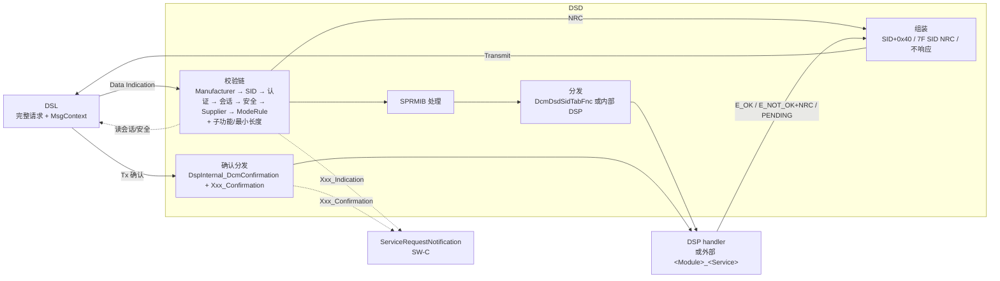
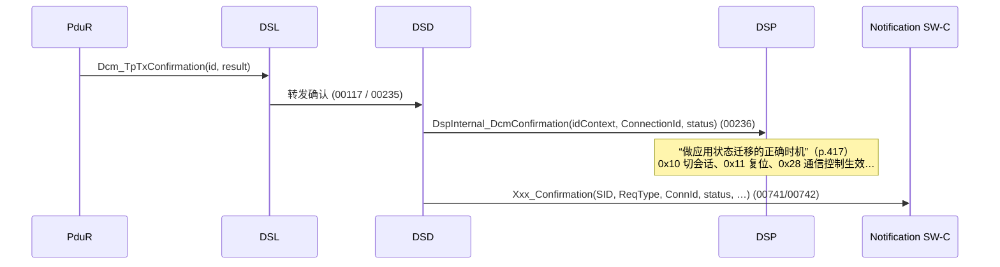
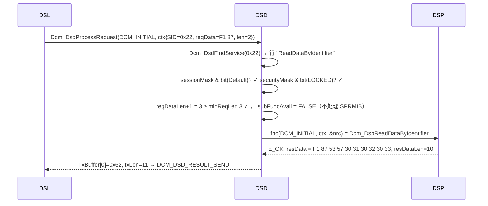

# DSD — Diagnostic Service Dispatcher：服务表、校验链、SPRMIB、通知与确认

> Prerequisite: [01 DCM 总览](01-dcm-overview.md)、[02 DSL](02-dsl.md)
> Next: [04 DSP — 服务处理](04-dsp.md)
> 对应规范: AUTOSAR CP SWS DCM **R20-11** §7.5 DSD（p.88–102）、NRC 顺序 `SWS_Dcm_01075`（p.50）、模式规则 §7.6.1.5（p.105–108）、外部服务处理 §8.9（p.415–417）、ServiceRequestNotification §8.7.3.8（p.294–295）、配置 DcmDsd §10.2.3（p.445–456）
> 对应源码: openAUTOSAR `diagnostic/Dcm/src/Dcm_Dsd.c`（R3.1.5）；本项目 [`examples/uds_diag_demo/diag/Dcm_Dsd.c`](../../examples/uds_diag_demo/diag/Dcm_Dsd.c)、[`diag/Dcm_Cfg.c`](../../examples/uds_diag_demo/diag/Dcm_Cfg.c)

---

## 1. 本章目标

学完本章你应该能够回答：

1. “DCM 怎么知道 `0x22` 是 ReadDataByIdentifier？”——答案在**服务表配置**里，而不在 DCM 代码里。服务表的每一行有哪些字段？
2. DSD 按什么顺序做校验？R20-11 的 `SWS_Dcm_01535` 顺序、子功能/长度检查、ISO 14229-1 的通用顺序三者是什么关系？demo README 提到的“顺序差异”具体在哪？
3. suppressPosRspMsgIndicationBit（SPRMIB）何时生效、何时**不**生效（0x78 之后、负响应）？
4. 功能寻址下哪些 NRC 被抑制，为什么？
5. Manufacturer / Supplier Notification（`Xxx_Indication/Xxx_Confirmation`）与 `CallbackDCMRequestServices`（`Xxx_StartProtocol/StopProtocol`）分别在什么时候被调用，能做什么？
6. 响应发出后，确认是如何从 DSL 走到 DSP 的？`Dcm_TxConfirmation` 在这里扮演什么角色（提示：不是你想的那样）？

---

## 2. 为什么需要 DSD？

ISO 14229-1 为每个服务都定义了相同的“通用前置检查”：服务是否支持？当前会话允许吗？当前安全级允许吗？子功能是否支持？长度够吗？如果每个服务 handler 自己写这些检查，会出现两个问题：

1. **顺序不一致**：一个 handler 先查长度，另一个先查会话——同一个错误请求在不同服务上得到不同 NRC，测试仪的一致性测试失败。`SWS_Dcm_01075`（p.50）要求“发送的 NRC 顺序须符合 ISO14229-1”，`SWS_Dcm_00827`（p.90）要求“DSD 按 ISO14229-1 给出的顺序检查收到的请求，任何一步失败即停止并发送该 NRC”。
2. **配置无法驱动**：OEM 的诊断规范（CDD/ODX）会规定“0x2E 只在扩展会话 + level 1 下可用”。这应该是一行配置，而不是一段 C 代码。

DSD 就是把这些通用检查做成**表驱动的规则引擎**：输入（SID、子功能、长度、当前会话、当前安全级、寻址类型），输出“放行到哪个 handler”或“哪个 NRC / 不响应”。`SWS_Dcm_00178`（p.88）：DSD 只处理合法请求，拒绝不合法请求。

---

## 3. 在系统中的位置



DSD 与 DSP 的接口（规范 Table 7.4，p.92）：DSD → DSP 委托处理 + 发送确认；DSP → DSD 通知“处理完成”。

---

## 4. AUTOSAR 如何定义 DSD

### 4.1 服务表：从 SID 到 handler

`[AUTOSAR Standard]`

- `SWS_Dcm_00192/00193`（p.92）：DSD 分析第一个字节（SID），在“Service Identifier Table”中查找。
- `SWS_Dcm_00195`（p.92）：**DSL 提供当前服务表**——服务表属于协议（`DcmDslProtocolSIDTable`，`ECUC_Dcm_00702`），每次协议初始化时 DSL 设置链接（`00035`，p.80）。同一时刻只有一张表激活。
- `SWS_Dcm_00196`（p.92）：找到 SID 后，若配置了 `DcmDsdSidTabFnc`（`ECUC_Dcm_00777`），调用该外部函数 `<Module>_<DiagnosticService>`；否则调用 DCM 内部实现。
- `SWS_Dcm_00197`（p.93）：SID 不在表中 → NRC 0x11。
- `SWS_Dcm_00084`（p.92）：`DcmRespondAllRequest = FALSE` 时，SID 在 0x40–0x7F 或 0xC0–0xFF（即“响应 SID”范围）的请求**不响应**。
- `SWS_Dcm_CONSTR_6047`（p.93）：同一张服务表内 SID 唯一。
- 允许把 OBD 服务加入 UDS 协议的服务表，但不允许把 UDS 服务加入 OBD 协议的服务表（DcmDsdServiceTable 描述，p.452）。

配置容器（R20-11 §10.2.3）：

```text
DcmDsd                                 ECUC_Dcm_00688  p.445
├── DcmDsdServiceRequestManufacturerNotification [0..*]  ECUC_Dcm_00681  p.451
├── DcmDsdServiceRequestSupplierNotification     [0..*]  ECUC_Dcm_00816  p.452
└── DcmDsdServiceTable [1..*]          ECUC_Dcm_00732  p.452
      ├── DcmDsdSidTabId               ECUC_Dcm_00736  p.452
      └── DcmDsdService [*]            ECUC_Dcm_00689  p.447
            ├── DcmDsdSidTabServiceId          ECUC_Dcm_00735  p.449   SID
            ├── DcmDsdServiceUsed              ECUC_Dcm_01044  p.448   多用途 ECU 开关
            ├── DcmDsdSidTabSubfuncAvail       ECUC_Dcm_00737  p.449   有子功能 ⇔ 有 SPRMIB
            ├── DcmDsdSidTabSessionLevelRef    ECUC_Dcm_00734  p.451   0..*，空 = 不检查会话
            ├── DcmDsdSidTabSecurityLevelRef   ECUC_Dcm_00733  p.450   0..*，空 = 不检查安全
            ├── DcmDsdSidTabModeRuleRef        ECUC_Dcm_00918  p.449   0..1，空 = 不检查
            ├── DcmDsdSidTabFnc                ECUC_Dcm_00777  p.448   0..1，空 = 内部 DSP
            ├── DcmDsdServiceRole              ECUC_Dcm_01139  p.447   0x29 认证角色位图
            └── DcmDsdSubService [*]           ECUC_Dcm_00802  p.453
                  ├── DcmDsdSubServiceId               ECUC_Dcm_00803  p.454
                  ├── DcmDsdSubServiceSessionLevelRef  ECUC_Dcm_00804  p.456
                  ├── DcmDsdSubServiceSecurityLevelRef ECUC_Dcm_00812  p.456
                  ├── DcmDsdSubServiceModeRuleRef      ECUC_Dcm_00924  p.455
                  ├── DcmDsdSubServiceFnc              ECUC_Dcm_00942  p.453
                  └── DcmDsdSubServiceUsed / Role      ECUC_Dcm_01047 / 01140
```

**“空引用列表 = 不检查”**：`DcmDsdSidTabSessionLevelRef` 和 `DcmDsdSidTabSecurityLevelRef` 的描述都写着“If there is no reference configured, no … verification shall be performed”（p.450–451）。这是一个很容易配错的语义：在配置工具里“全都不选”意味着“全部允许”，而不是“全部禁止”。demo 用 `DCM_SEC_ANY = 0xFFFFFFFF` 表达同一个语义（`Dcm_Cfg.h:42-49`）。

### 4.2 校验链：R20-11 `SWS_Dcm_01535`

`[AUTOSAR Standard]` `SWS_Dcm_01535`（p.94）——DCM 只在以下校验**按此顺序**全部通过后才接受请求：

| # | 校验 | 失败结果 | 相关 SWS（页） |
|---|---|---|---|
| 1 | **Manufacturer** 许可：调用所有 `ServiceRequestManufacturerNotification` 端口的 `Xxx_Indication` | `E_REQUEST_NOT_ACCEPTED` → 不响应；`E_NOT_OK` → 第一个返回 E_NOT_OK 者的 ErrorCode | `00218/00462/00463/01321`（p.99） |
| 2 | **SID** 是否在当前服务表 | 0x11 | `00197`（p.93） |
| 3 | **认证**（仅配置了 `DcmDspAuthentication` 时；仅 UDS 服务 0x10–0xFF） | 0x34 | `01536/01537/01544`（p.95–96） |
| 4 | **会话**（`DcmDsdSidTabSessionLevelRef`） | 0x7F；子服务不允许 → 0x7E | `00211/00616`（p.97）。**0x10 本身不做会话校验**（p.97） |
| 5 | **安全级**（`DcmDsdSidTabSecurityLevelRef`） | 0x33；子服务不允许 → 0x33 | `00217/00617`（p.97–98）。**0x27 本身不做安全校验**（p.97） |
| 6 | **Supplier** 许可：`ServiceRequestSupplierNotification` 端口的 `Xxx_Indication` | 同 #1 | `00516/00517/00518/01322`（p.99） |
| 7 | **模式规则**（`DcmDsdSidTabModeRuleRef` / `DcmDsdSubServiceModeRuleRef`） | 规则计算出的 NRC（无指定 → 0x22） | `00773/00774`（p.98）；计算 `00812–00815`（p.107） |

此外 §7.5.4.4 “Check format and subfunction support”（p.98）还有两条通用检查，**不在 `01535` 的编号列表里**：

| 校验 | 失败结果 | SWS |
|---|---|---|
| 子功能是否配置（存在 `DcmDsdSubServiceId` 匹配的 `DcmDsdSubService`）——**0x31 除外**，其子功能由 DSP 检查 | 0x12 | `00273`（p.98） |
| 请求长度不小于最小长度 | 0x13 | `00696`（p.98） |

以及：DSD 产生 NRC 时只调用 `Xxx_Confirmation`，**不调用** `DspInternal_DcmConfirmation`（`01474`，p.94）——请求从未到达 DSP，DSP 也就没有需要“收尾”的状态。

### 4.3 R20-11 vs ISO 14229-1：NRC 顺序到底谁说了算？

这是 demo README §6 表格中“DSD 检查顺序”一行所指的问题，也是 DCM 升级回归测试中**最高风险**的一项。

`[AUTOSAR Standard]` R20-11 自身有三层表述：

1. `01075`（p.50）：发送的 NRC 顺序须符合 ISO 14229-1。
2. `00827`（p.90）：DSD 按 ISO 14229-1 给出的顺序检查。
3. `01535`（p.94）：给出一个具体的 7 步顺序，但没有把 `00273`（0x12）和 `00696`（0x13）放进这个编号列表；服务章节（如 0x2E、0x31）的需求编号顺序又把 0x13 的长度检查放在会话/安全之后（研究笔记 02 §3.7、§3.8.7）。

`[Conceptual]` ISO 14229-1 的通用服务器响应流程（**本仓库没有 ISO 14229-1 原文**，以下为业界通行理解，具体以所用 ISO 版本原文为准）大致是：

```text
manufacturer specific checks
  → SID supported?                       (0x11)
  → SID supported in active session?     (0x7F)
  → SID security check OK?               (0x33)
  → supplier specific checks
  → [服务有子功能时] minimum length OK?   (0x13)
  → sub-function supported?              (0x12)
  → sub-function supported in session?   (0x7E)
  → sub-function security check OK?      (0x33)
  → 服务特定检查（总长度 0x13、参数范围 0x31、条件 0x22、顺序 0x24 …）
```

`[Educational Implementation]` demo 的 DSD 顺序（`Dcm_Dsd.c:10-22`）：

```text
SID(0x11) → 会话(0x7F) → 安全(0x33) → 最小长度(0x13) → [SPRMIB 剥离]
  → 子功能已配置(0x12) → 子功能会话(0x7E) → 子功能安全(0x33) → DSP
```

这与上面的 ISO 通行理解一致，但与“R20-11 文本中 `00273` 写在 `00696` 前面”的排列不同。三者冲突的典型测试用例：

| 请求（默认会话，未解锁） | demo 结果 | 说明 |
|---|---|---|
| `10`（只有 SID） | `7F 10 13` | 最小长度 2（`Dcm_Cfg.c:116`）→ DSD 0x13 |
| `10 03 00` | `7F 10 13` | 最小长度通过，子功能 0x03 存在 → DSP 检查**精确**长度失败（`Dcm_Dsp.c:120-123`；测试 `test_unknown_sid_and_lengths`） |
| `3E 05` | `7F 3E 12` | 子功能 0x05 未配置（`Dcm_Sub3E` 只有 0x00） |
| `2E F1 A0 01 02 03 04 05 06 07 08 09 0A`（默认会话） | `7F 2E 7F` | 0x2E 只允许扩展会话（`Dcm_Cfg.c:122`），会话检查先于一切服务特定检查 |
| `2E F1 A0 01 02`（扩展会话、已解锁） | `7F 2E 13` | DSD 放行，DSP 中 DID 存在、会话/安全通过后才发现数据长度不对（`Dcm_Dsp.c:512-515`） |

`[Real Project Consideration]` 升级 DCM 时：

- 用**只看总线字节**的测试（像 `tests/test_uds_demo.c`）把每一种“多个错误同时存在”的组合锁定下来：例如“错误会话 + 错误长度”“未解锁 + 不支持的子功能”“功能寻址 + 不支持的 SID”。
- 同一个错误组合，新旧 DCM 给出不同 NRC，是升级后诊断仪一致性测试失败的最常见原因。
- 4.2.1 的 change history 写着“升级到 ISO 14229-1:2013（NRC 顺序）”（研究笔记 02 §6.1）——如果旧项目基线早于 4.2.1，NRC 顺序差异几乎必然存在。

### 4.4 suppressPosRspMsgIndicationBit

`[AUTOSAR Standard]`（§7.5.4.2，p.93–94；§7.5.4.6.3，p.101）

| SWS | 要求 | 为什么 |
|---|---|---|
| `00204` | 只在 `DcmDsdSidTabSubfuncAvail=TRUE` 的服务上处理 SPRMIB | SPRMIB 是子功能字节的 bit 7；没有子功能的服务（0x22、0x2E）第二字节是数据，不能被解释为 SPRMIB |
| `00201` | DSD 从消息中**屏蔽掉** SPRMIB 位 | DSP 看到的是“干净”的子功能值（0x80 → 0x00），不需要每个 handler 都处理 bit 7 |
| `00202` | 通过 `Dcm_MsgContextType.msgAddInfo` 在层间传递“抑制正响应”信息 | — |
| `00200/00231` | SPRMIB=1 时不发正响应 | ISO 14229-1 |
| `00203` | 发过 0x78（responsePending）后，清除 SPRMIB | 测试仪已经收到 0x78，正在等最终响应；如果抑制，测试仪会一直等到 P2\* 超时 |
| `01411`（p.98） | 若服务配置了 `DcmDsdSubService`，子功能值在 SPRMIB=0 或 1 时都支持 | 配置中只需写 0x01，不必再写 0x81 |
| 负响应 | SPRMIB **不**抑制负响应 | ISO 14229-1；R20-11 只说抑制“positive response” |

`00204` 的 Note 特别提到 RoutineControl：SPRMIB 的处理与请求中参数的处理顺序无关——0x31 的子功能检查由 DSP 做（`00273` 豁免），但 SPRMIB 仍由 DSD 剥离。

### 4.5 功能寻址的 NRC 抑制

`SWS_Dcm_00001`（p.101）：负结果 + 功能寻址时，抑制 **0x11、0x12、0x31、0x7E、0x7F**。

为什么是这 5 个？功能请求（例如 0x7DF）会被**整车所有 ECU** 收到。“我不支持这个服务/子功能/参数/在当前会话不支持”是“与我无关”的意思，如果每个 ECU 都回负响应，总线上会出现几十帧无用报文，测试仪还要从中找出真正的答案。其他 NRC（0x13、0x22、0x33……）表示“这个请求与我有关但有问题”，仍需回复。

与 0x78 的交互：如果已经发过 0x78，测试仪在等最终响应，此时即使是 0x31 也应该发出——demo 在 `Dcm_DsdReject` 中检查 `!Dcm_DslResponsePendingWasSent()`（`Dcm_Dsd.c:54-55`）。R20-11 文本中没有直接写这条组合规则，demo 的做法是由 `00203` 的精神推导的 → 真实栈行为需在真实项目确认。

### 4.6 Manufacturer / Supplier Notification

`[AUTOSAR API]` `ServiceRequestNotification` 接口（C 原型 `SWS_Dcm_01341/01342`，p.294–295；C/S 接口 §8.8.3.8 p.379）：

```c
Std_ReturnType Xxx_Indication(uint8 SID, const uint8* RequestData, uint32 DataSize, uint8 ReqType,
                              uint16 ConnectionId, Dcm_NegativeResponseCodeType* ErrorCode,
                              Dcm_ProtocolType ProtocolType, uint16 TesterSourceAddress);    /* 0x65, sync */
Std_ReturnType Xxx_Confirmation(uint8 SID, uint8 ReqType, uint16 ConnectionId,
                                Dcm_ConfirmationStatusType ConfirmationStatus,
                                Dcm_ProtocolType ProtocolType, uint16 TesterSourceAddress);   /* 0x66, sync */
```

| 项 | Manufacturer Notification | Supplier Notification |
|---|---|---|
| 配置 | `DcmDsdServiceRequestManufacturerNotification`（p.451） | `DcmDsdServiceRequestSupplierNotification`（p.452） |
| R-Port 名 | `ServiceRequestManufacturerNotification_{Name}` | `ServiceRequestSupplierNotification_<SWC>` |
| 何时调用 `Indication` | 校验链**第 1 步**：“刚收到请求之后” | 校验链**第 6 步**：“处理诊断消息之前”（会话/安全通过之后） |
| 典型用途（规范示例 p.98–99） | 在 after-run 状态禁止 OBD 请求；OEM 的整车条件 | 供应商自己的前置条件、日志、统计 |
| 返回值 | `E_OK` 放行；`E_REQUEST_NOT_ACCEPTED` → 不响应（且只调 `Xxx_Confirmation`、不调 `DspInternal_DcmConfirmation`，`01172`）；`E_NOT_OK` → 用第一个 E_NOT_OK 的 ErrorCode 作 NRC | 同左（`00517/00518/01322`） |
| `Confirmation` | 在 `DspInternal_DcmConfirmation` **之后立即**调用所有通知端口的 `Xxx_Confirmation`（`00741/00742`，p.102） | 同左 |

`Indication` 的参数 `RequestData` 是“除 SID 外的完整请求数据”（p.295），`ReqType` 0=物理/1=功能。注意它是**同步**接口：不能返回 PENDING——需要耗时判断的条件不适合放在这里，应该用模式规则（读 S/R 或 mode）。

### 4.7 `CallbackDCMRequestServices`：协议级许可（不是请求级）

`[AUTOSAR API]`（`SWS_Dcm_01339/01340`，p.293–294）：

```c
Std_ReturnType Xxx_StartProtocol(Dcm_ProtocolType ProtocolType, uint16 TesterSourceAddress, uint16 ConnectionId); /* 0x67 */
Std_ReturnType Xxx_StopProtocol (Dcm_ProtocolType ProtocolType, uint16 TesterSourceAddress, uint16 ConnectionId); /* 0x64 */
```

- **由 DSL 调用，不是 DSD**：协议第一次收到请求时调用所有 `Xxx_StartProtocol`（`00036`，p.83）；全部 E_OK 后设置服务表、复位会话与安全（`00144–00147`）；任何一个不返回 E_OK → NRC 0x22（`00674`，p.84）。
- `Xxx_StopProtocol` 只在协议被抢占时调用（`00459`，p.81；`00624`：Tx 确认后**不**停止协议），返回非 E_OK → 0x22（`01190`）。
- C/S 接口形态还允许返回 `E_PROTOCOL_NOT_ALLOWED`（研究笔记 02 §3.9，p.378）。

它和 `Xxx_Indication` 的区别：`StartProtocol` 是“这个**协议**现在能不能开始用”（例如 OBD 协议在某些车辆状态下不可用），只在协议启动时问一次；`Indication` 是“这一条**请求**能不能执行”，每条请求都问。

### 4.8 分发、组装与外部服务处理器

- `00221`（p.100）：DSD 查找 DSP 中对应的服务解释器并调用。
- `00222–00225`（p.100）：DSP 完成后 DSD 组装响应：把 `Dcm_MsgContextType` 中的数据转入响应缓冲，在第一个字节加 SID（正响应 = SID | 0x40），然后在“下一个执行步骤”发起传输。
- `00228`（p.101）：DSD 处理应用给出的、在 `Dcm_NegativeResponseCodeType` 中定义的所有 NRC。
- `00271`（p.103）：未指定特定 NRC 时，失败统一为 0x10。
- 外部服务处理器（`DcmDsdSidTabFnc` 非空）：`<Module>_<DiagnosticService>(Dcm_ExtendedOpStatusType OpStatus, Dcm_MsgContextType* pMsgContext, Dcm_NegativeResponseCodeType* ErrorCode)`（`SWS_Dcm_00763`，p.415）；子服务用 `<Module>_<DiagnosticService>_<SubService>`（`00764`，p.416）。首次调用 `DCM_INITIAL`（`00732`）；返回 `DCM_E_PENDING` 期间不接受同/低优先级新请求（`00733`）；取消时以 `DCM_CANCEL` 再调（`00735`，p.93）。其 OpStatus 取值还包括 `DCM_POS_RESPONSE_SENT / DCM_POS_RESPONSE_FAILED / DCM_NEG_RESPONSE_SENT / DCM_NEG_RESPONSE_FAILED`（p.416，类型 `Dcm_ExtendedOpStatusType`，`91015` p.235–236）——外部处理器通过这些值得知响应的发送结果。

### 4.9 确认路径：从 `Dcm_TpTxConfirmation` 到 `DspInternal_DcmConfirmation`

`[AUTOSAR Standard]`（§7.5.4.7，p.101–102）



| 情况 | DSL 发送？ | `DspInternal_DcmConfirmation`？ | `Xxx_Confirmation`？ | SWS |
|---|---|---|---|---|
| 正响应 / DSP 产生的负响应 | 是 | 是（Tx 确认后） | 是（紧随其后） | `00236/00741/00742` |
| 正响应被 SPRMIB 抑制 | 否 | **是**（没有 Tx 确认也要调） | 是 | `00238/00240`（p.101–102） |
| 功能寻址下负响应被抑制 | 否 | 是 | 是 | `00240` |
| **DSD 自己产生的 NRC**（0x11/0x7F/0x33…） | 是 | **否** | 是 | `01474`（p.94） |
| `Xxx_Indication` 返回 `E_REQUEST_NOT_ACCEPTED` | 否 | 否 | 是 | `01172`（p.99） |

`Dcm_ConfirmationStatusType`（`00983`，p.301–302）：`DCM_RES_POS_OK / DCM_RES_POS_NOT_OK / DCM_RES_NEG_OK / DCM_RES_NEG_NOT_OK`——区分“正/负响应”与“发送成功/失败”。

> **关于 `Dcm_TxConfirmation`**：在 R20-11 中，`Dcm_TxConfirmation`（`SWS_Dcm_01092`，p.247）是 **IF 接口，只用于周期传输**（0x2A，`01073`，p.59）。普通请求/响应的确认链起点是 `Dcm_TpTxConfirmation`。只有在 R3.x（如 openAUTOSAR `Dcm.c:188`）中，`Dcm_TxConfirmation(PduIdType, NotifResultType)` 才是 TP 响应的确认——这在 [02 DSL](02-dsl.md) §4.1.6 已强调过。

---

## 5. 核心数据结构

### 5.1 demo 的服务表

`[Educational Implementation]` 类型定义 `diag/Dcm_Cfg.h:117-136`：

```c
typedef Std_ReturnType (*Dcm_DsdServiceFncType)(Dcm_OpStatusType OpStatus, Dcm_MsgContextType *pMsgContext,
                                                Dcm_NegativeResponseCodeType *ErrorCode);
typedef struct {
    uint8  subFunctionId;               /* DcmDsdSubServiceId                         */
    uint32 sessionMask;                 /* DcmDsdSubServiceSessionLevelRef            */
    uint32 securityMask;                /* DcmDsdSubServiceSecurityLevelRef           */
} Dcm_DsdSubServiceType;

typedef struct {
    uint8                        sid;            /* DcmDsdSidTabServiceId                */
    boolean                      subFuncAvail;   /* DcmDsdSidTabSubfuncAvail             */
    uint8                        minReqLen;      /* incl. SID; shorter -> NRC 0x13       */
    uint32                       sessionMask;    /* DcmDsdSidTabSessionLevelRef          */
    uint32                       securityMask;   /* DcmDsdSidTabSecurityLevelRef         */
    const Dcm_DsdSubServiceType *subServices;    /* NULL: sub-function checked by DSP   */
    uint8                        numSubServices;
    Dcm_DsdServiceFncType        fnc;            /* DcmDsdSidTabFnc / internal DSP       */
    const char                  *name;
} Dcm_DsdServiceType;
```

几个设计选择及其与真实配置的差别：

- **会话/安全用位掩码**（`Dcm_Cfg.h:39-50`）：真实配置是“对 `DcmDspSessionRow` / `DcmDspSecurityRow` 的引用列表”，生成器通常也会把它编译成位掩码或索引数组，以便 O(1) 检查。demo 中“当前会话 0x03 → 第 3 位”。
- **`fnc` 的签名** 与外部服务处理器 `<Module>_<DiagnosticService>` 相同（只是 OpStatus 用 `Dcm_OpStatusType` 而非扩展类型）——demo 让内部 DSP handler 也采用这一形态，这样“内部服务”和“外部服务”在 DSD 看来没有区别。
- **`minReqLen`**：R20-11 没有一个名为“最小长度”的配置参数；最小长度通常由生成器根据服务类型推导（有子功能的服务至少 2 字节，0x22 至少 3 字节……）。demo 显式写出。

服务表实例 `diag/Dcm_Cfg.c:114-125`：

```c
static const Dcm_DsdServiceType Dcm_Services[] = {
    /* SID   subFn  minLen sessions                         security     sub-table          handler */
    { 0x10u, TRUE,  2u, DCM_SES_ALL,                        DCM_SEC_ANY, Dcm_Sub10, DCM_N(Dcm_Sub10), Dcm_DspDiagnosticSessionControl,   "DiagnosticSessionControl" },
    { 0x11u, TRUE,  2u, DCM_SES_ALL,                        DCM_SEC_ANY, Dcm_Sub11, DCM_N(Dcm_Sub11), Dcm_DspEcuReset,                   "ECUReset" },
    { 0x14u, FALSE, 4u, DCM_SES_DEFAULT | DCM_SES_EXTENDED, DCM_SEC_ANY, NULL_PTR,  0u,               Dcm_DspClearDiagnosticInformation, "ClearDiagnosticInformation" },
    { 0x19u, TRUE,  3u, DCM_SES_DEFAULT | DCM_SES_EXTENDED, DCM_SEC_ANY, Dcm_Sub19, DCM_N(Dcm_Sub19), Dcm_DspReadDTCInformation,         "ReadDTCInformation" },
    { 0x22u, FALSE, 3u, DCM_SES_ALL,                        DCM_SEC_ANY, NULL_PTR,  0u,               Dcm_DspReadDataByIdentifier,       "ReadDataByIdentifier" },
    { 0x27u, TRUE,  2u, DCM_SES_EXTENDED,                   DCM_SEC_ANY, Dcm_Sub27, DCM_N(Dcm_Sub27), Dcm_DspSecurityAccess,             "SecurityAccess" },
    { 0x2Eu, FALSE, 4u, DCM_SES_EXTENDED,                   DCM_SEC_ANY, NULL_PTR,  0u,               Dcm_DspWriteDataByIdentifier,      "WriteDataByIdentifier" },
    { 0x31u, TRUE,  4u, DCM_SES_EXTENDED,                   DCM_SEC_ANY, NULL_PTR,  0u,               Dcm_DspRoutineControl,             "RoutineControl" },
    { 0x3Eu, TRUE,  2u, DCM_SES_ALL,                        DCM_SEC_ANY, Dcm_Sub3E, DCM_N(Dcm_Sub3E), Dcm_DspTesterPresent,              "TesterPresent" }
};
```

注意：

- 0x31 的 `subServices = NULL_PTR`——体现 `00273` 的“0x31 例外”：子功能（start/stop/results）是否存在取决于**具体 RID**是否配置了 `DcmDspStopRoutine` 等，只能由 DSP 判断（`Dcm_Dsp.c:573-577`）。
- 0x2E 的安全掩码是 `DCM_SEC_ANY`：服务本身不需要解锁，**DID 级别**的写权限才需要（`Dcm_Cfg.c:44-47`）。这是常见设计——不同 DID 有不同的安全要求，不能在服务级统一限制。
- 0x27 只允许扩展会话（`Dcm_Sub27` 的子功能也只允许扩展会话）。

### 5.2 运行时状态

DSD 本身几乎是无状态的：demo 只有一个 `Dcm_DsdActiveService`（`Dcm_Dsd.c:30`）记录“当前正在 PENDING 的服务”，供 `DCM_PENDING` 重调和 `DCM_CANCEL` 使用。openAUTOSAR 有 `msgData`、`currentSid`、`suppressPosRspMsg`、`dsdDslDataIndication`（`Dcm_Dsd.c:39-43`）——同样是单实例，同时只能处理一个请求。

---

## 6. 初始化流程

DSD 没有独立的初始化需求。规范层面，服务表的“激活”发生在协议启动时（`00145`，p.83），由 DSL 设置。demo 在 `Dcm_DsdProcessRequest(DCM_INITIAL, …)` 开头把 `Dcm_DsdActiveService` 清空（`Dcm_Dsd.c:151-153`）。

---

## 7. Runtime Flow

### 7.1 正常放行（`22 F1 87`）



trace 第 96–102 行：

```text
[    40 ms] [Dcm/DSD ] SID 0x22: lookup in DcmDsdServiceTable -> ReadDataByIdentifier
[    40 ms] [Dcm/DSD ] checks passed (session/security/length/sub-function) -> dispatch to DSP ReadDataByIdentifier
[    40 ms] [Dcm/DSP ] 0x22: DID 0xF187 (SparePartNumber/SwVersion) USE_DATA_SYNCH_CLIENT_SERVER -> ReadData(Data)
[    40 ms] [Dcm/DSD ] positive response assembled: SID 0x62 + 10 data bytes
```

### 7.2 拒绝：不支持的 SID（`85 02`）

trace 第 580–608 行：

```text
[   630 ms] [Dcm/DSD ] SID 0x85: lookup in DcmDsdServiceTable -> not configured
[   630 ms] [Dcm/DSD ] negative response 7F 85 11 (SID not in service table)
[   630 ms] [Dcm/DSL ] response [7F 85 11] -> PduR_DcmTransmit(0, len=3)
```

同一请求若以功能寻址发送，`Dcm_DsdReject` 判定 0x11 属于 `00001` 列表 → `DCM_DSD_RESULT_NO_RESPONSE`，DSL 不发送（`tests/test_uds_demo.c` 的 `test_unknown_sid_and_lengths`：`EXPECT_NO_RESPONSE(TRUE, unk)`）。

### 7.3 SPRMIB：物理 `3E 80`

`test_tester_present` 中 `EXPECT_NO_RESPONSE(FALSE, tpSup)`：物理寻址的 `3E 80` **不**被 DSL 旁路（`01168`：只有功能寻址才算并发 TesterPresent），而是正常进入 DSD：

1. SID 0x3E 找到，会话/安全通过，长度 2 ≥ 2；
2. `subFuncAvail = TRUE` → 发现 bit 7 置位 → `suppressPosResponse = 1`，`reqData[0]` 改为 0x00（`Dcm_Dsd.c:106-112`）；
3. 子功能 0x00 在 `Dcm_Sub3E` 中 → 放行；
4. DSP 返回 E_OK；
5. `suppressPosResponse != 0` 且没发过 0x78 → `DCM_DSD_RESULT_NO_RESPONSE`（`Dcm_Dsd.c:177-180`）；
6. DSL `Dcm_DslFinishRequest(TRUE)` → S3 重启（`00141` 的“无需响应的请求处理完成”）。

### 7.4 PENDING 与取消

`Dcm_DsdProcessRequest` 被 DSL 在每个 MainFunction 以 `DCM_PENDING` 重调时，跳过校验链，直接调用保存的 `Dcm_DsdActiveService->fnc`（`Dcm_Dsd.c:159-168`）。0x78 次数用尽时，DSL 调 `Dcm_DsdCancel`（`Dcm_Dsd.c:188-195`），以 `DCM_CANCEL` 调用 handler 并忽略返回值（`01046/01413`）。OpStatus 模型的完整讨论见 [04 DSP](04-dsp.md) §4.2。

---

## 8. RH850 Hardware Mapping

DSD 是纯软件规则引擎，与 RH850 外设无关。唯一的平台相关考虑是**执行时间**：

- 服务表查找在 `Dcm_MainFunction` 中执行。demo 用线性查找（`Dcm_Dsd.c:64-73`）；规范 p.92 提到“出于性能原因，支持检查可能需要 lookup table”。服务表很大（几十个服务、上百个子服务）时，生成器通常生成按 SID 索引的数组。
- 在 RH850G3M（P1M-E，160 MHz）上，几十项的线性查找只需微秒级时间，不是瓶颈；真正耗时的是 DSP 中的应用调用。但若 DCM 与安全相关任务在同一个 OS task 中，仍需把 MainFunction 的最坏执行时间（WCET）纳入时序分析。

---

## 9. openAUTOSAR 实现

`DsdHandleRequest`（`diagnostic/Dcm/src/Dcm_Dsd.c:278-338`）的检查顺序：

| 顺序 | 检查 | 位置 | NRC / 行为 |
|---|---|---|---|
| 0 | `DCM_RESPOND_ALL_REQUEST == STD_ON` 或 `(SID & 0x7F) < 0x40` | `:287` | 否则静默丢弃（`DCM084`） |
| 1 | `lookupSid`（线性查找当前协议的服务表） | `:288` | 0x11（`:331`） |
| 2 | `DspCheckSessionLevel` | `:290` | 0x7F（`:327`） |
| 3 | `DspCheckSecurityLevel` | `:291` | 0x33（`:323`） |
| 4 | `askApplicationForServicePermission`（`:50-67`，R3 `Indication(requestData, dataSize)`） | `:294` | `E_REQUEST_ENV_NOK` → 0x22（`:314`）；其他非 OK → 静默（`:318`） |
| 5 | SPRMIB（`DsdSidTabSubfuncAvail && bit7`） | `:302-309` | 剥离 bit 7（`DCM201`） |
| 6 | `selectServiceFunction(sid)`（`:86`，编译期 `#ifdef DCM_USE_SERVICE_*` 的 switch） | `:310` | 未编译的服务 → 0x11（`:232`） |

与 R20-11 的差异（升级教学素材）：

1. **应用许可的位置**：openAUTOSAR 在会话/安全**之后**调用唯一一种 Indication；R20-11 把 Manufacturer 放在**最前**、Supplier 放在安全之后（`01535`）。
2. **Indication 签名与返回值**：R3 是 `Indication(uint8* requestData, uint16 dataSize)`，返回 `E_REQUEST_ENV_NOK` 时固定 0x22；R20-11 带 8 个参数，`E_NOT_OK` 时由应用给 NRC。
3. **没有通用的 0x12/0x13/0x7E 检查**：各 DSP handler 自己判断（研究笔记 03 §4.3）；`DCM_E_SUBFUNCTIONNOTSUPPORTEDINACTIVESESSION` 全仓未使用。
4. **功能寻址抑制**：`createAndSendNcr`（`:70-83`）只抑制 0x11/0x12/0x31，缺 0x7E/0x7F（R20-11 `00001` 有 5 个）。
5. **SPRMIB 与 0x78**：`DsdDspProcessingDone`（`:342-358`）中 `suppressPosRspMsg` 不考虑是否发过 0x78（缺 `00203`）。
6. **确认**：`DsdDspProcessingDone` 在 SPRMIB 抑制时直接调 `DspDcmConfirmation`（`:351`）；正常响应由 `DslTxConfirmation → DsdDataConfirmation → DspDcmConfirmation`（`Dcm_Dsl.c:973` → `Dcm_Dsd.c:362-366`）。这与 R20-11 `00236/00240` 一致。但 DSD 自己产生的 NRC 在 Tx 确认后也会走到 `DspDcmConfirmation`——与 `01474` 不同（不过 openAUTOSAR 的 `DspDcmConfirmation` 只检查“有没有挂起的会话切换/复位”，对 DSD NRC 无副作用）。

---

## 10. 当前教学项目实现

`[Educational Implementation]` demo DSD（`diag/Dcm_Dsd.c`，195 行）实现了：SID 查找、服务级会话/安全、最小长度、SPRMIB 剥离、子服务存在性/会话/安全、分发、正响应组装、默认 NRC 0x10、SPRMIB 抑制（含 0x78 例外）、功能寻址 5 种 NRC 抑制、PENDING 重调、CANCEL。

未实现：Manufacturer/Supplier Notification、`Xxx_Confirmation`、认证（0x34）、模式规则、`DcmRespondAllRequest=FALSE` 的过滤（demo 配置为 `STD_ON`，`Dcm_Cfg.h:21`）、多服务表。

---

## 11. Code Walkthrough

### 11.1 校验链 `Dcm_DsdCheckRequest`（`Dcm_Dsd.c:77-142`）

```c
/* [Educational Implementation] examples/uds_diag_demo/diag/Dcm_Dsd.c:80-105 (摘录) */
uint32 sesBit = DCM_SES_MASK(Dcm_DslGetSesCtrlType());       /* 向 DSL 要当前会话 (Table 7.3) */
uint32 secBit = DCM_SEC_MASK(Dcm_DslGetSecurityLevel());     /* 向 DSL 要当前安全级          */
const Dcm_DsdServiceType *svc = Dcm_DsdFindService(sid);

if (svc == NULL_PTR)                          → 0x11  /* SWS_Dcm_00197 */
if ((svc->sessionMask & sesBit) == 0u)        → 0x7F  /* SWS_Dcm_00211 */
if ((svc->securityMask & secBit) == 0u)       → 0x33  /* SWS_Dcm_00217 */
if ((ctx->reqDataLen + 1u) < svc->minReqLen)  → 0x13  /* SWS_Dcm_00696 */
```

（上面为了可读性把 `if` 体压缩成 `→ NRC`，原文每个分支调用 `Dcm_DsdReject` 并 `return FALSE`。）

注意 0x10 和 0x27 的特殊性在 demo 中**由配置表达**而不是代码分支：0x10 的 `sessionMask = DCM_SES_ALL`（相当于“不做会话校验”），0x27 的 `securityMask = DCM_SEC_ANY`（相当于“不做安全校验”）。规范 p.97 的两个“NOT”在真实栈里也通常是这样处理的——在配置工具中对这两个服务不配置引用。

### 11.2 子功能与 SPRMIB（`Dcm_Dsd.c:106-138`）

```c
if (svc->subFuncAvail) {  /* [Educational Implementation] */
    uint8 sf = ctx->reqData[0];
    if ((sf & 0x80u) != 0u) {
        ctx->msgAddInfo.suppressPosResponse = 1u;        /* SWS_Dcm_00202 */
        ctx->reqData[0] = (uint8)(sf & 0x7Fu);           /* SWS_Dcm_00201 */
    }
    if (svc->subServices != NULL_PTR) {
        /* 查 DcmDsdSubService: 未找到 0x12 (00273)；会话 0x7E (00616)；安全 0x33 (00617) */
    }
}
```

`reqData[0]` 被原地修改——这意味着 DSP 永远看不到 bit 7。如果你在调试器里看 Rx buffer，会发现 SPRMIB 位“消失”了，这是预期行为。

### 11.3 结果处理（`Dcm_Dsd.c:144-186`）

```c
ret = Dcm_DsdActiveService->fnc(OpStatus, pMsgContext, &nrc);  /* [Educational Implementation] */
if (ret == DCM_E_PENDING) {
    return DCM_DSD_RESULT_PENDING;                    /* DSL 下个周期以 DCM_PENDING 重调 */
}
if (ret != E_OK) {
    if ((nrc == DCM_POS_RESP) || (ret != E_NOT_OK)) {
        nrc = DCM_E_GENERALREJECT;                    /* SWS_Dcm_00271；也覆盖 01415 的非法组合 */
    }
    return Dcm_DsdReject(pMsgContext, nrc, txBuffer, txLength, Dcm_DsdActiveService->name);
}
if ((pMsgContext->msgAddInfo.suppressPosResponse != 0u) && !Dcm_DslResponsePendingWasSent()) {
    return DCM_DSD_RESULT_NO_RESPONSE;                /* SWS_Dcm_00200 + 00203 */
}
txBuffer[0] = (uint8)(sid + 0x40u);                   /* SWS_Dcm_00223/00224 */
*txLength = (PduLengthType)(1u + pMsgContext->resDataLen);
```

`(nrc == DCM_POS_RESP) && ret == E_NOT_OK` 正是 `SWS_Dcm_01415`（p.103）描述的“应用把 ErrorCode 设为 `DCM_POS_RESP` 却返回 `E_NOT_OK`”——规范要求报运行时错误 `DCM_E_INVALID_VALUE`；demo 只是改发 0x10，没有报 DET（一个可以作为练习指出的简化）。

### 11.4 功能寻址抑制（`Dcm_Dsd.c:40-62`）

```c
static boolean Dcm_DsdNrcSuppressedForFunctional(Dcm_NegativeResponseCodeType nrc)  /* [Educational Implementation] */
{
    return (boolean)((nrc == DCM_E_SERVICENOTSUPPORTED) || (nrc == DCM_E_SUBFUNCTIONNOTSUPPORTED) ||
                     (nrc == DCM_E_REQUESTOUTOFRANGE) ||
                     (nrc == DCM_E_SUBFUNCTIONNOTSUPPORTEDINACTIVESESSION) ||
                     (nrc == DCM_E_SERVICENOTSUPPORTEDINACTIVESESSION));   /* SWS_Dcm_00001 */
}
```

`Dcm_DsdReject` 对 DSD 自己产生的 NRC 和 DSP 返回的 NRC 都适用——例如 DSP 的 0x31（DID 不支持）在功能寻址下也被抑制。这符合 `00001`“负结果 + 功能寻址”的措辞。

---

## 12. Debug 方法

| 现象 | 断点 | watch | 结论方向 |
|---|---|---|---|
| 意外的 0x11 | 服务查找函数 | 当前激活的服务表指针、SID | 协议引用了错误的服务表；服务 `DcmDsdServiceUsed=FALSE`；（R3 栈）服务未编译 |
| 意外的 0x7F/0x7E | 会话校验 | `Dcm_GetSesCtrlType()` 的值、服务行的会话引用 | 会话没切过去（0x10 响应没发成功？S3 超时了？）；配置把会话引用写错 |
| 意外的 0x33 | 安全校验 | `Dcm_GetSecurityLevel()`、服务/子服务/DID 的安全引用 | 会话切换导致安全复位（`00139`）；服务级与 DID 级安全混淆 |
| 期望 NRC 但没有响应 | `Dcm_DsdReject` 等价处 | `reqType`、NRC 值 | 功能寻址抑制（正确行为）；Indication 返回了 `E_REQUEST_NOT_ACCEPTED` |
| 期望正响应但没有 | 正响应组装处 | `suppressPosResponse` | 测试仪发了 bit 7 置位的子功能 |
| NRC 顺序与诊断规范不符 | 整个校验链，单步 | — | 对照 §4.3 表，确认是 DSD 还是 DSP 产生的 NRC |

在真实工程中，一个高效手段是在 DSD 的“拒绝”出口统一打一个 trace/log 点（demo 的 `Dcm_DsdReject` 就是这样做的），记录 SID、NRC 和原因字符串。

---

## 13. 常见问题

1. **把会话/安全引用“全部取消勾选”以为是禁止**——实际是“不检查”（p.450–451）。
2. **0x2E 在服务级要求安全**，结果某些不需要安全的 DID 也写不了。安全要求应配在 DID 级（`DcmDspDidWriteSecurityLevelRef`）。
3. **0x31 配了 `DcmDsdSubService`**：R20-11 中 0x31 的子功能检查由 DSP 按 RID 进行；若生成器允许也配了子服务表，可能出现双重检查与不一致 NRC。
4. **对无子功能服务开启 `DcmDsdSidTabSubfuncAvail`**：`22 F1 90` 的 `F1` 被当成 SPRMIB=1 的子功能 0x71，响应被错误抑制。
5. **在 `Xxx_Indication` 中做耗时操作**：它是同步接口、在 MainFunction 中执行，直接拉长 P2。
6. **期望 `Xxx_Confirmation` 只在成功时调用**：它在 DSD NRC、`E_REQUEST_NOT_ACCEPTED` 等情况下也会被调用（§4.9 表），应用需要检查 `ConfirmationStatus`。

---

## 14. 实验

运行 `python tools/run_uds_demo.py`，不修改 demo，阅读 `artifacts/uds-demo/results.txt` 与 `trace.txt`：

1. **校验链定位**：对 `tests/test_uds_demo.c` 中 `test_unknown_sid_and_lengths`（第 240–259 行）的 6 个期望，逐个标注 NRC 来自 DSD 的哪一步（`Dcm_Dsd.c` 行号）还是 DSP 的哪一行。
2. **会话 vs 服务特定检查**：`test_wdbi_needs_security`（第 175–197 行）先在默认会话发 13 字节 0x2E 得到 0x7F，解锁后发 5 字节 0x2E 得到 0x13。用 §4.3 的顺序解释：如果在**默认会话**发 5 字节 0x2E，demo 会回什么？为什么？
3. **SPRMIB 的路径差异**：比较 `test_tester_present`（第 219–238 行）中物理 `3E 80` 和功能 `3E 80` 的处理路径：分别在 DSL 还是 DSD 被“消化”？trace 中能看到哪一个？（提示：main_demo 只发了功能 `3E 80`，见 trace 第 455–468 行。）
4. **纸上推演**：假设给 demo 加一个 Manufacturer Notification，在 ECU 车速 > 0 时对 0x2E 返回 `E_NOT_OK` + 0x22。按 R20-11 `01535`，一个“默认会话 + 车速 > 0 + 13 字节 0x2E”请求会得到 0x22 还是 0x7F？按 openAUTOSAR 的顺序呢？

---

## 15. 思考题

1. 为什么 R20-11 把 Manufacturer 许可放在 SID 校验**之前**？想想“after-run 状态禁止 OBD 请求”这个例子：如果先做 SID 校验，不支持的 OBD 服务会得到什么响应？
2. `DcmDsdSidTabSecurityLevelRef` 可以引用多个安全级（0..\*）。如果服务允许 level 1 和 level 3，而当前是 level 2，结果是什么？“安全级”是“等级”（越高越强）还是“集合成员”？（提示：`SWS_Dcm_00139` 说同一时间只有一个安全级。）
3. DSD 产生 NRC 时为什么不调用 `DspInternal_DcmConfirmation`（`01474`）？如果调用了，在 0x10 的场景下会出什么问题？
4. 外部服务处理器（`DcmDsdSidTabFnc`）和内部 DSP 服务在“谁负责子功能检查、谁负责长度检查”上有什么不同？如果 OEM 要求某个服务完全自定义，你会选择 `DcmDsdSidTabFnc` 还是 `DcmDsdSubServiceFnc`？

---

## 16. 对未来真实项目的意义

在 RTA-CAR DCM（实现细节需在真实项目环境中确认）中：

1. **找服务表**：在生成的 DCM 配置文件中搜 SID 常量（`0x22u`、`0x2Eu`）或 `DcmDsdService` 的 short name；确认每行的会话/安全引用是如何编码的（位掩码？索引列表？）。
2. **找校验顺序**：在 DCM 源码中找“查 SID → NRC 0x11”的位置，单步走一遍，记录每个 NRC 的产生顺序，与 OEM 诊断规范及 ISO 14229-1 对照。把结果写成回归测试。
3. **找通知端口**：搜 `ServiceRequestManufacturerNotification_`、`ServiceRequestSupplierNotification_`、`Rte_Call_ServiceRequest`、`_Indication(`；确认应用中谁实现了它们、返回什么。
4. **找外部服务**：在配置中搜 `DcmDsdSidTabFnc`、`DcmDsdSubServiceFnc` 非空的条目——这些服务的逻辑不在 DCM 内，升级 DCM 时它们的签名（`Dcm_ExtendedOpStatusType` 等）最容易变。
5. **找确认**：搜 `_Confirmation(` 与 `Dcm_ConfirmationStatusType`；确认会话切换、复位、通信控制是在确认回调中生效，而不是在处理时。
6. **升级时**：重点对比 (a) 校验顺序（尤其 0x13 的位置）、(b) 功能寻址抑制列表、(c) SPRMIB 与 0x78 的交互、(d) `Xxx_Indication` 签名与返回值语义、(e) 服务级 vs 子服务级配置的生成规则。

---

## 17. 本章总结

```text
请求 → [Manufacturer] → SID(0x11) → [认证 0x34] → 会话(0x7F/0x7E) → 安全(0x33)
     → [Supplier] → [ModeRule] → 子功能(0x12)/最小长度(0x13) → SPRMIB 剥离 → DSP
DSP 结果 → E_OK: SID+0x40（SPRMIB=1 且无 0x78 → 不响应）
         → E_NOT_OK+NRC: 7F SID NRC（功能寻址 0x11/0x12/0x31/0x7E/0x7F → 不响应）
         → DCM_E_PENDING: 下个 MainFunction 以 DCM_PENDING 重调
Tx 确认 → DspInternal_DcmConfirmation（DSD 自己的 NRC 除外）→ Xxx_Confirmation
```

- DSD 是表驱动的规则引擎；“DCM 知道 0x22 是什么”完全来自配置。
- NRC 顺序是规范（R20-11 自身的多处表述）、ISO 14229-1 和具体实现三者交叉的灰色地带——必须用总线级回归测试锁定。
- SPRMIB 只抑制正响应、只对有子功能的服务、0x78 之后失效。
- `Dcm_TxConfirmation` 在 R4.x 中不是普通响应的确认。

---

## 18. 下一章

DSD 放行之后，请求进入 [04 DSP](04-dsp.md)：服务 handler 的结构、`Dcm_OpStatusType` 的四个值如何驱动异步调用、DSP 如何通过 RTE 端口或 C callout 调用应用（`DcmDspDataUsePort` 的各种取值），以及分页缓冲的概念。
