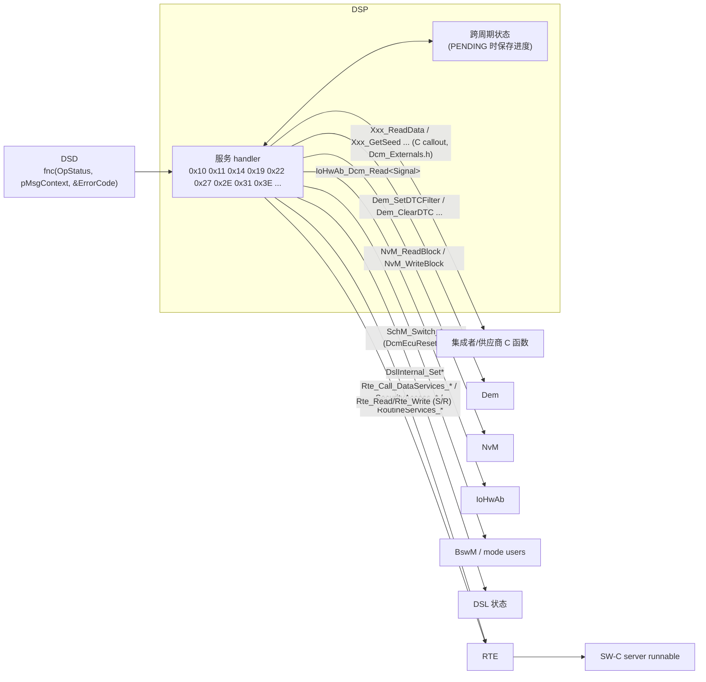
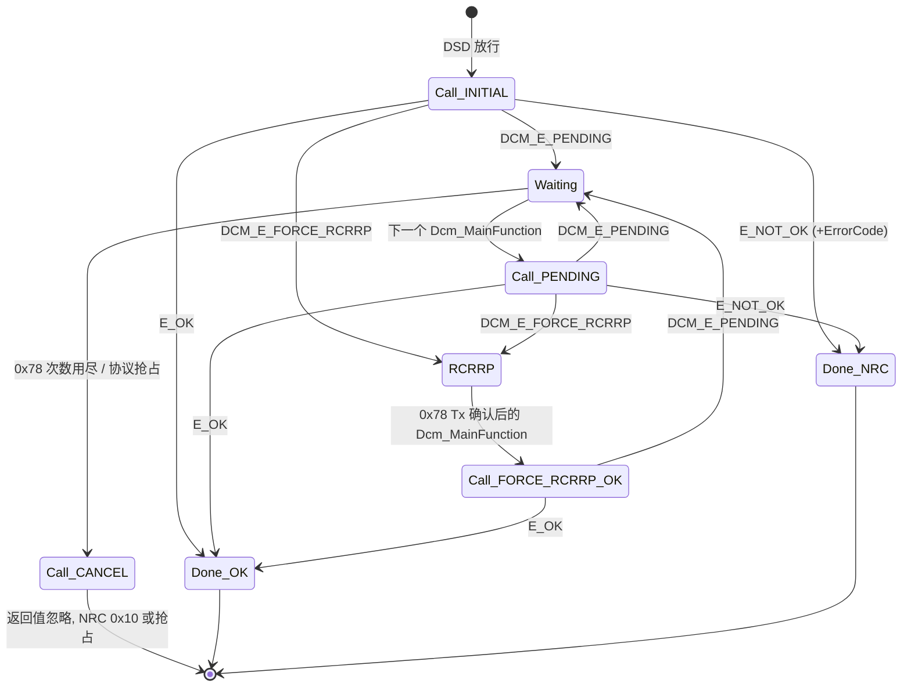
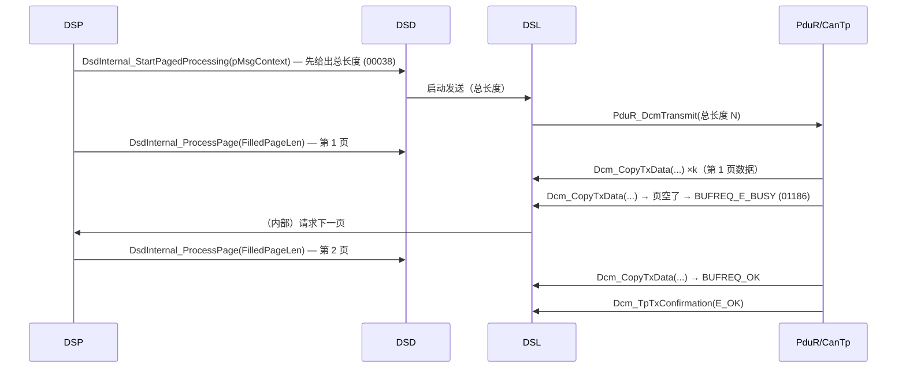
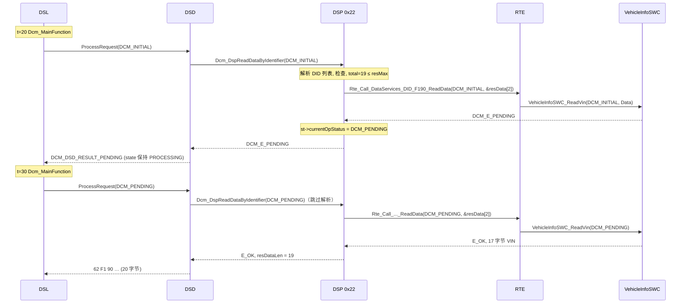

# DSP — Diagnostic Service Processing：服务 handler、OpStatus 异步模型、应用接口与分页缓冲

> Prerequisite: [02 DSL](02-dsl.md)、[03 DSD](03-dsd.md)、[RTE Client-Server](../07-rte-swc/06-client-server.md)
> Next: [05 DCM 配置](05-dcm-configuration.md)
> 对应规范: AUTOSAR CP SWS DCM **R20-11** §7.6.1 DSP 通用（p.102–111）、`Dcm_OpStatusType` §7.3.4.4（p.52）、同步/异步 §7.8（p.223–224）、C callout 原型 §8.7.3（p.265–295）、端口接口 §8.8.3（p.338–379）、外部服务处理 §8.9（p.415–417）、分页缓冲 §7.4.4.9（p.72–73）、`DcmDspDataUsePort`（p.537–539）
> 对应源码: openAUTOSAR `diagnostic/Dcm/src/Dcm_Dsp.c`、`include/Dcm_Lcfg.h`；本项目 [`examples/uds_diag_demo/diag/Dcm_Dsp.c`](../../examples/uds_diag_demo/diag/Dcm_Dsp.c)、[`diag/Dcm_Cfg.c`](../../examples/uds_diag_demo/diag/Dcm_Cfg.c)、[`rte/Rte_Dcm.c`](../../examples/uds_diag_demo/rte/Rte_Dcm.c)、[`swc/VehicleInfoSWC.c`](../../examples/uds_diag_demo/swc/VehicleInfoSWC.c)

---

## 1. 本章目标

1. 说清一个 DSP 服务 handler 的**标准结构**：输入什么、输出什么、哪些检查归 DSP、哪些归 DSD。
2. 彻底理解 `Dcm_OpStatusType`（`DCM_INITIAL / DCM_PENDING / DCM_CANCEL / DCM_FORCE_RCRRP_OK`）与返回值（`E_OK / E_NOT_OK / DCM_E_PENDING / DCM_E_FORCE_RCRRP`）组成的异步协议：谁在什么时候用什么值调用谁。
3. 知道 R20-11 中**没有** `Dcm_ExternalProcessingDone`，以及“异步完成”在 R20-11 中如何表达。
4. 能从一条 `DcmDspDataUsePort` 配置推导出 DSP 调用应用的确切形式（`Rte_Call_DataServices_<Data>_ReadData(OpStatus, Data)`？C 函数？`Rte_Read`？`NvM_ReadBlock`？）。
5. 理解分页缓冲（paged buffer）为什么存在、DSP 在其中要承担什么。
6. 能在 demo 中逐行追踪 `22 F1 90` 从 `DCM_INITIAL` → `DCM_E_PENDING` → `DCM_PENDING` → `E_OK` 的全过程。

DID 读写的服务细节见 [08 DID](08-did.md)；DTC 服务见 [09](09-dtc-dem.md)；完整 UDS 服务目录见 [10](10-uds-services.md)。本章关注**所有服务共享的处理框架**。

---

## 2. 为什么需要 DSP 这一层？

DSD 解决了“该不该处理”，但“怎么处理”在每个服务之间差别巨大：

- 0x22 需要把多个 DID 拼接成一个响应，每个 DID 又可能由多个数据元素组成，每个数据元素可能来自不同的 SW-C、NvM 块或 IoHwAb 信号；
- 0x27 要在两次请求之间记住“哪个级别的 seed 已经发出”；
- 0x31 的输入输出信号格式由每个 RID 自己的配置决定；
- 0x14/0x19 要和 Dem 进行多步交互。

这些都需要**服务语义**，而且几乎都需要**调用 DCM 之外的模块**，而那些模块可能无法立即给出结果（NvM 写 flash 要几十毫秒，另一个核上的 SW-C 要等 IOC）。DSP 的存在，就是为每个服务提供一个“解析请求 → 调用外部 → 组装数据”的 handler，并统一用 OpStatus 协议处理“外部还没做完”的情况。

R20-11 §7.6.1（p.102）规定 DSP 收到 DSD 的处理请求时总是执行：

1. 分析收到的请求消息；
2. 检查格式以及所访问的子功能是否支持；
3. 在 DEM、SW-C 或其他 BSW 模块上获取数据或执行所需的函数调用；
4. 组装响应。

---

## 3. 在系统中的位置



---

## 4. AUTOSAR 如何定义 DSP

### 4.1 handler 的通用规则

`[AUTOSAR Standard]`

| SWS | 页 | 要求 | 教学解读 |
|---|---|---|---|
| `00272` | 103 | 请求格式/长度错误 → NRC 0x13 | 服务特定的长度检查（精确长度、DID 数量×2+1…）在 DSP；DSD 只查最小长度 |
| `00039` | 103 | DSP 组装**不含响应 SID** 的响应并确定长度 | 对应 `Dcm_MsgContextType.resData/resDataLen` |
| `00038` | 103 | 使用分页缓冲时，DSP 必须在交出任何数据前确定**总长度** | ISO-TP 的 FF 中就要写总长度 |
| `00271` | 103 | 除非另有规定，调用外部 API 失败 → NRC 0x10 | “不知道是什么错时，发 GeneralReject” |
| `01414` | 103 | 应用返回 `E_NOT_OK` 时，ErrorCode 只接受 0x01–0xFF | 0x00 是 `DCM_POS_RESP` |
| `01415` | 103 | 应用设 ErrorCode=`DCM_POS_RESP` 却返回 `E_NOT_OK` → 运行时错误 `DCM_E_INVALID_VALUE` | 防御应用 bug |
| `00275` | 104 | 其他不支持的消息参数 → NRC 0x31 | 不支持的 DID/RID/参数值 |
| `00775` | 104 | DCM 是 8 个 ModeDeclarationGroup 的 mode manager | 会话、复位、安全、快速掉电、通信控制、DTC 设置、ROE、认证状态 |
| `01412` | 110 | Dem 函数返回 `DEM_PENDING` → 稍后再调，直到不再 PENDING | Dem 也遵循“轮询直到完成” |
| `01048` | 50 | 取消一个带 NvM 访问的服务时，调用 `NvM_CancelJobs()` | 取消原因：0x78 次数用尽或协议抢占 |

### 4.2 `Dcm_OpStatusType`：异步调用协议

`[AUTOSAR API]` `Dcm_OpStatusType`（`SWS_Dcm_00984`，p.301，定义在 `Rte_Dcm_Type.h`）：

```c
typedef uint8 Dcm_OpStatusType;
#define DCM_INITIAL          0x00u  /* 本请求的第一次调用                  */
#define DCM_PENDING          0x01u  /* 上次返回 DCM_E_PENDING 后的再次调用  */
#define DCM_CANCEL           0x02u  /* 取消：停止并清理                     */
#define DCM_FORCE_RCRRP_OK   0x03u  /* 应用要求的 0x78 已经发出             */
```

返回值（接口“Possible Errors”，p.338、p.363）：`E_OK 0`、`E_NOT_OK 1`、`DCM_E_PENDING 10`、`DCM_E_COMPARE_KEY_FAILED 11`、`DCM_E_FORCE_RCRRP 12`。demo 定义在 `rte/Rte_Dcm_Type.h:19-28`。

规则（§7.3.4.4，p.52；p.110–111；§7.8 p.223–224）：

| SWS | 规则 |
|---|---|
| `00527` | 第一次调用使用 `OpStatus = DCM_INITIAL` |
| `00530` / `00760` | 返回 `DCM_E_PENDING` → 在**每个** `Dcm_MainFunction` 中以 `DCM_PENDING` 再调，直到不再返回 PENDING |
| `00528` | 返回 `DCM_E_FORCE_RCRRP` → DCM 发起 0x78 发送，0x78 发送完成前**不再调用**该操作 |
| `00529` | 0x78 的发送确认之后，在 `Dcm_MainFunction` 中以 `DCM_FORCE_RCRRP_OK` 再调 |
| `01046` / `00120` | 协议抢占或 0x78 次数用尽 → 以 `DCM_CANCEL` 调用 |
| `01413` | `DCM_CANCEL` 调用的返回值被忽略 |
| `01187` | OUT 数据只在最后一次（返回 `E_OK`）调用后有效 |
| `01188` | ErrorCode 只在最后一次（返回 `E_NOT_OK`）调用后有效 |
| `01189` | IN 参数每次调用都必须提供（来自请求的值） |



**`DCM_E_PENDING` 与 `DCM_E_FORCE_RCRRP` 的区别**：

| | `DCM_E_PENDING` | `DCM_E_FORCE_RCRRP` |
|---|---|---|
| 含义 | “我还没做完，请稍后再问” | “我还没做完，而且请**立即**告诉测试仪等一等” |
| 0x78 何时发 | 由 DSL 在 P2 − Adjust 到期时自动发（`00024`） | 立即发（§7.4.4.10，p.73） |
| 下次调用 | 下一个 MainFunction，`DCM_PENDING` | 0x78 **发送确认之后**的 MainFunction，`DCM_FORCE_RCRRP_OK` |
| 典型用途 | 等 NvM、等另一个核、等 Dem | 即将进入一个长时间且不能被打断的操作（例如擦除 flash 前），希望 0x78 先出去 |

`[Real Project Consideration]` 为什么 `DCM_E_FORCE_RCRRP` 要“等 0x78 发完再调”？因为应用接下来可能做一件会**阻塞 CPU 或总线**的事（例如在 RH850 上执行 code flash 擦除时，部分 flash 区域不可读取，若中断向量/代码在同一 bank 可能需要关中断——具体约束**需根据实际芯片手册与 flash driver 手册确认**）。必须确保 0x78 已经离开 ECU，测试仪才会切换到 P2\* 计时。

### 4.3 `Dcm_ExternalProcessingDone` 去哪了？

`[AUTOSAR Standard]` 在本仓库的 R20-11 DCM SWS PDF 中**检索不到** `Dcm_ExternalProcessingDone`、`Dcm_ExternalSetNegResponse` 或 `ProcessingDone` 字样（已全文 grep）。这些名字属于更早 release 中“外部服务处理器”的接口形态：外部 handler 被 DCM 调用后，在自己方便的时候回调 DCM 告知“处理完成/设置负响应”。具体是哪个 release 引入和移除的，本仓库没有对应 SWS → **需以真实项目所用 release 的 SWS 确认**。

R20-11 中外部服务处理器的形态（`SWS_Dcm_00763`，p.415–416）已统一为**返回值 + OpStatus 轮询模型**：

```c
Std_ReturnType <Module>_<DiagnosticService>(Dcm_ExtendedOpStatusType OpStatus,
                                            Dcm_MsgContextType* pMsgContext,
                                            Dcm_NegativeResponseCodeType* ErrorCode);  /* 0x32, Asynchronous, Reentrant */
/* 返回: E_OK / E_NOT_OK(+ErrorCode) / DCM_E_PENDING / DCM_E_FORCE_RCRRP */
```

- “完成”= 某次调用返回 `E_OK` 或 `E_NOT_OK`；
- “未完成”= 返回 `DCM_E_PENDING`，DCM 下个周期再调（`00732/00733/00735`，p.93）；
- 发送结果通过 `Dcm_ExtendedOpStatusType` 的 `DCM_POS_RESPONSE_SENT / DCM_POS_RESPONSE_FAILED / DCM_NEG_RESPONSE_SENT / DCM_NEG_RESPONSE_FAILED` 告诉外部 handler（p.416，`91015` p.235–236）——这相当于旧模型中“确认”回调的替代。

`[Conceptual]` 两种模型的对比：

| | 旧式“回调完成”模型（`Dcm_ExternalProcessingDone` 一类） | R20-11 “轮询完成”模型 |
|---|---|---|
| 控制流 | handler 返回后，由 handler 在任意上下文中回调 DCM | DCM 始终是调用者，handler 只通过返回值表达状态 |
| 上下文 | 回调可能来自另一个 task/ISR → DCM 需要更多临界区 | 所有调用都在 `Dcm_MainFunction` 中 → 时序可预测 |
| 取消 | 需要单独的取消接口 | `DCM_CANCEL` 统一表达 |
| 升级影响 | 若旧项目的外部服务使用 ProcessingDone 回调，升级到 R20-11 形态时这些服务**必须重写**为可重入的状态机 | — |

升级时在旧代码里搜 `Dcm_ExternalProcessingDone`、`Dcm_ExternalSetNegResponse`、`DcmDsdSidTabFnc` 配置——它们标出了需要重写的外部服务。

### 4.4 DSP 如何调用应用：`DcmDspDataUsePort` 等配置

`[AUTOSAR Standard]` DSP 从不“知道”应用函数名——它从配置中得到“用哪种接口访问这份数据”。三个关键配置：

#### 4.4.1 数据元素：`DcmDspDataUsePort`（`ECUC_Dcm_00713`，p.537–539）

| 取值 | DSP 调用形态 | OpStatus / PENDING | ErrorCode | 规范来源 |
|---|---|---|---|---|
| `USE_DATA_SYNCH_CLIENT_SERVER` | `Rte_Call_DataServices_{Data}_ReadData(Data)` 等（R-Port `DataServices_{Data}`） | 无 / 不允许 | `ConditionCheckRead`、`WriteData` 有 | p.223：“与 Dem 的 DataServices 接口兼容（无 OpStatus）” |
| `USE_DATA_ASYNCH_CLIENT_SERVER` | `Rte_Call_DataServices_{Data}_ReadData(OpStatus, Data)` | 有 / 允许 | ReadData 无 | p.538 |
| `USE_DATA_ASYNCH_CLIENT_SERVER_ERROR` | 同上，ReadData 多一个 `ErrorCode` | 有 / 允许 | 有，应用可以在读操作中触发 NRC | p.538 |
| `USE_DATA_SYNCH_FNC` | C 函数，名字来自 `DcmDspDataReadFnc`（`ECUC_Dcm_00669`）、`DcmDspDataWriteFnc`（`00670`）等，原型在 `Dcm_Externals.h` | 无 | 同 SYNCH C/S | p.537–539；规范示例 DID 0xF080（p.225–226） |
| `USE_DATA_ASYNCH_FNC` | C 函数 + OpStatus | 有 / 允许 | ReadData 无 | p.538 |
| `USE_DATA_ASYNCH_FNC_ERROR` | C 函数 + OpStatus + ErrorCode | 有 | 有 | p.538 |
| `USE_DATA_SENDER_RECEIVER` | `Rte_Read/Rte_Write` 访问 S/R 端口 `DataServices_{Data}`（isService=false） | — | — | p.538 |
| `USE_DATA_SENDER_RECEIVER_AS_SERVICE` | 同上，isService=true | — | — | p.538 |
| `USE_BLOCK_ID` | `NvM_ReadBlock` / `NvM_WriteBlock`（`DcmDspDataBlockIdRef`，`00809`） | DCM 内部轮询 NvM | NvM 失败 → 0x72（写） | `00560`（p.139）、`00541`（p.175–176） |
| `USE_ECU_SIGNAL` | `IoHwAb_Dcm_Read<EcuSignalName>()` 等 | — | — | `00578`（p.138） |

对应的 C 原型（`Dcm_Externals.h` 视角，研究笔记 02 §3.9，均为 `[AUTOSAR API]`）：

```c
Std_ReturnType Xxx_ReadData(uint8* Data);                                          /* SWS_Dcm_00793, sync        */
Std_ReturnType Xxx_ReadData(Dcm_OpStatusType OpStatus, uint8* Data);               /* SWS_Dcm_91006, async       */
Std_ReturnType Xxx_ReadData(Dcm_OpStatusType OpStatus, uint8* Data,
                            Dcm_NegativeResponseCodeType* ErrorCode);              /* SWS_Dcm_91005, async+error */
Std_ReturnType Xxx_WriteData(const uint8* Data, Dcm_OpStatusType OpStatus,
                             Dcm_NegativeResponseCodeType* ErrorCode);             /* SWS_Dcm_91008, async 定长  */
Std_ReturnType Xxx_ConditionCheckRead(Dcm_OpStatusType OpStatus,
                                      Dcm_NegativeResponseCodeType* ErrorCode);    /* SWS_Dcm_91011, async       */
```

（C 语言没有重载：真实 `Dcm_Externals.h` 中每个数据元素的函数名不同，例如规范示例的 `ReadDID_F080`；这里同名只是为了对照签名。）

另外 DID 级还有 `DcmDspDidUsePort`（`ECUC_Dcm_01122`，p.510–511）：`USE_DATA_ELEMENT_SPECIFIC_INTERFACES`（默认，按上表逐数据元素访问）或 `USE_ATOMIC_*`（整个 DID 作为一个结构通过一个 S/R 或 NvData 端口访问）。详见 [08 DID](08-did.md)。

> **`[Real Project Consideration]` 同步/异步签名 ≠ 同步/异步调用点**。R20-11 p.223 Note：DCM 使用 `AsynchronousServerCallPoint` 还是 `SynchronousServerCallPoint` 来调用服务处理器“完全是实现决定”；有没有 OpStatus 参数与用哪种调用点之间“没有对应关系”。也就是说：即使接口是 `ASYNCH_CLIENT_SERVER`，RTE 生成的 `Rte_Call` 在同核同分区时多半仍是一次**直接函数调用**；OpStatus 只是让 SW-C 有机会“分多次完成”。demo 的 `rte/Rte_Dcm.c:8-14` 头注释就是这个意思。

#### 4.4.2 安全访问：`DcmDspSecurityUsePort`（`ECUC_Dcm_00967`，p.652）

- `USE_ASYNCH_CLIENT_SERVER` → R-Port `SecurityAccess_{SecurityLevel}`（`SWS_Dcm_00685`，p.338–340），DSP 调 `Rte_Call_SecurityAccess_<Level>_GetSeed / _CompareKey`（`00324`）。
- `USE_ASYNCH_FNC` → `DcmDspSecurityGetSeedFnc`（`00968`）/ `DcmDspSecurityCompareKeyFnc`（`00969`）配置的 C 函数（`00862/00863`）。
- 两种都是**异步**（有 OpStatus）。详见 [07 安全访问](07-security-access.md)。

#### 4.4.3 例程：`DcmDspRoutineUsePort`（`ECUC_Dcm_00724`，p.608）

- `TRUE` → C/S 接口 `RoutineServices_{RoutineName}`（`SWS_Dcm_00690`，p.362–377），操作 `Start / Stop / RequestResults`（`01442`）；
- `FALSE` → `DcmDspStartRoutineFnc`（`00664`）等配置的 C 函数（`01443`）。
- 签名随信号配置变化：定长信号 → `dataIn_n/dataOut_n`；变长 → `dataInVar/dataOutVar + currentDataLength`（`01360–01364`，p.192–193）。规范瑕疵：`Xxx_Stop` 的 C 原型（`01204`，p.289）缺 OpStatus，而 C/S 接口中有（研究笔记 02 §3.9）。

### 4.5 DSP 作为 mode manager

`SWS_Dcm_00775`（p.104）列出的 8 个 ModeDeclarationGroup 中，DSP 直接驱动的有：`DcmEcuReset`（0x11）、`DcmModeRapidPowerShutDown`（0x11 0x04/0x05）、`DcmCommunicationControl_<Channel>`（0x28）、`DcmControlDTCSetting`（0x85）、`DcmResponseOnEvent_<id>`（0x86）。BswM 和 SW-C 作为 mode user 订阅这些模式，从而在**不调用 DCM API** 的情况下对诊断事件作出反应。模式切换的时机（处理时 vs Tx 确认后）是各服务章节的重点，例如 0x11 先切 `HARD/SOFT`（`00373`）、Tx 确认后切 `EXECUTE`（`00594`）。

模式规则（`DcmModeRule`，§7.6.1.5 p.105–108）是反方向的：DCM 作为 mode **user**，读取 BswM/SW-C 的模式或 S/R 数据来决定是否允许服务/DID/RID 执行；规则失败 NRC 的计算：AND 取第一个失败的带 NRC 的规则，OR 取最后一个，无指定 → 0x22（`00812–00815`，p.107）。

### 4.6 分页缓冲（paged buffer）的概念

`[AUTOSAR Standard]`（§7.4.4.9 p.72–73；§7.5.2.6 p.91；§8.10.6–8.10.8 p.418）

**问题**：0x19 0x02 读全部 DTC、0x36 TransferData（上传）等服务的响应可能有几 KB。如果诊断缓冲必须容纳最大响应，RAM 占用很大——“RAM 在小型 MCU 中常是关键资源”（p.91）。

**思路**：缓冲只放一“页”，下层发完这一页后 DSP 再填下一页。



要点：

- 只用于**发送**，且只供 DCM 内部使用（应用不可见，p.73）。
- `DcmPagedBufferEnabled`（`ECUC_Dcm_00776`，p.442）开启；响应超过 `DcmDslProtocolMaximumResponseSize` → 0x14（`01058`）；未开启时超过 `resMaxDataLen` → 0x14（`01059`）。
- **总长度必须先知道**（`00038`）：例如 0x19 必须先通过 `Dem_GetNumberOfFilteredDTC` 算出 DTC 数量。规范为此专门规定：分页时以第一次计算的长度为准，后续数据多了截断、少了补 0（`00587/00588`，p.121，研究笔记 02 §3.8.4）——因为 FF 已经发出，长度不能改。
- `Dcm_CopyTxData` 在当前页数据不足时返回 `BUFREQ_E_BUSY`，下层稍后重试（`01186`）；CanTp 在等待期间受 N_Cs 约束，DSP 填页太慢会导致 CanTp 超时。
- 分页超时由 `Dcm_TpTxConfirmation` 停止监控（`00353`）；出错时 DCM 调用 `DspInternal_CancelPagedBufferProcessing`（p.418）。

demo 与 openAUTOSAR **都没有实现**分页缓冲（openAUTOSAR `DCM_PAGEDBUFFER_ENABLED STD_OFF`，`include/Dcm_Cfg.h`）。demo 对超长响应直接回 0x14（0x19：`Dcm_Dsp.c:244-247`；0x22：`:324-327`），对应 `01059`。

---

## 5. 核心数据结构

### 5.1 handler 签名

`[Educational Implementation]` demo 让所有内部 handler 采用与外部服务处理器相同的形态（`diag/Dcm_Internal.h:48-65`）：

```c
Std_ReturnType Dcm_DspReadDataByIdentifier(Dcm_OpStatusType OpStatus, Dcm_MsgContextType *pMsgContext,
                                           Dcm_NegativeResponseCodeType *ErrorCode);
```

- `pMsgContext->reqData/reqDataLen`：SID 之后的请求（SPRMIB 已被 DSD 剥离）；
- `pMsgContext->resData/resDataLen/resMaxDataLen`：响应 SID 之后的空间；
- 返回 `E_OK`（`resDataLen` 有效）、`E_NOT_OK`（`*ErrorCode` 有效）、`DCM_E_PENDING`。

真实栈中内部 handler 的签名是**实现细节**（规范没有标准化），但外部 handler（`DcmDsdSidTabFnc`）的签名是标准化的（`00763`）。

### 5.2 跨 PENDING 保存的状态

一个返回 `DCM_E_PENDING` 的 handler 在下次被调用时必须知道“上次做到哪了”。demo 的做法是每个服务一个 static 状态结构（`diag/Dcm_Dsp.c:23-42`）：

```c
typedef struct {  /* [Educational Implementation] */
    uint8            didIdx[DCM_DSP_MAX_DID_TO_READ];   /* 本次请求中通过检查的 DID 在配置表中的索引 */
    uint8            numDids;
    uint8            current;                           /* 正在读第几个 DID                          */
    Dcm_OpStatusType currentOpStatus;                   /* 对当前 DID 应传 INITIAL 还是 PENDING       */
    Dcm_MsgLenType   pos;                               /* resData 中已写到的位置                     */
} Dcm_DspRdbiStateType;

typedef struct {
    uint8            seedLevel;                              /* 已发出 seed 的级别; 0 = 无 */
    uint8            attemptCounter[DCM_DSP_MAX_SECURITY_ROWS];
    sint32           delayMs[DCM_DSP_MAX_SECURITY_ROWS];
} Dcm_DspSecurityStateType;

static Dcm_DspRdbiStateType     Dcm_DspRdbi;
static uint8                    Dcm_DspWdbiDid;
static Dcm_DspSecurityStateType Dcm_DspSec;
static boolean                  Dcm_DspRoutineStarted[DCM_DSP_MAX_ROUTINES];
static uint8                    Dcm_DspRoutineActive;
```

注意 `currentOpStatus` 的作用：0x22 一次请求可能读多个 DID，**每个 DID 的数据接口都有自己的 INITIAL/PENDING 序列**。服务 handler 本身被 DSD 以 `DCM_PENDING` 调用，并不意味着下一个 DID 的接口也应收到 `DCM_PENDING`——它应收到 `DCM_INITIAL`（`Dcm_Dsp.c:362`）。这是实现多 DID 异步读取时非常容易犯的错误。

---

## 6. 初始化流程

`Dcm_DspInit`（`Dcm_Dsp.c:76-83`）由 `Dcm_Init` 调用：清零 RDBI 状态、安全状态（attempt counter、延时）、例程状态。

`[AUTOSAR Standard]` 真实 DCM 在初始化阶段（或之后几个 MainFunction 内）还可能需要：

- 恢复安全 attempt counter（`01154`，见 [07](07-security-access.md)）；
- 若配置了 `DcmVinRef`，启动时调用 `Dcm_GetVin` 读取一次 VIN（`01174`，p.224）；
- 读取 `Dcm_GetProgConditions` 决定是否补发 bootloader/复位后的响应（`00536`，见 [06](06-diagnostic-session.md)）。

---

## 7. Runtime Flow

### 7.1 异步 DID 读取：`22 F1 90`（1 次 PENDING）

`[Educational Implementation]` trace 第 34–45 行：



| transition | 代码位置 | 规范 |
|---|---|---|
| DSD 以 `DCM_INITIAL` 调 handler | `Dcm_Dsd.c:163` | `00527` |
| handler 只在 INITIAL 时解析/检查 | `Dcm_Dsp.c:280-331` | `01335/00438/00433/00434/00435`（DID 规则见 [08](08-did.md)） |
| 调用异步数据接口 | `Dcm_Dsp.c:347-349`（`d->readAsync(st->currentOpStatus, &out[2])`） | `00437`；`DcmDspDataUsePort=USE_DATA_ASYNCH_CLIENT_SERVER`（`Dcm_Cfg.c:34-38`） |
| RTE 直接调用 server runnable | `Rte_Dcm.c:54-62` | — |
| SWC 返回 PENDING | `VehicleInfoSWC.c` 中 `VehicleInfoSWC_ReadVin` | — |
| handler 记录“下次用 PENDING” | `Dcm_Dsp.c:351-354` | `00530` |
| 下个周期以 `DCM_PENDING` 调 | `Dcm_Dsl.c:258-261` | `00530/00760` |
| OUT 数据只在 E_OK 后使用 | handler 只在 `r == E_OK` 后推进 `pos`（`Dcm_Dsp.c:360-362`） | `01187` |

SWC 一侧的实现（`swc/VehicleInfoSWC.c`，`VehicleInfoSWC_ReadVin`）展示了 server 端应如何处理 OpStatus：

```c
Std_ReturnType VehicleInfoSWC_ReadVin(Dcm_OpStatusType OpStatus, uint8 *Data)
{
    if (OpStatus == DCM_CANCEL) {               /* 取消：清理、返回值会被忽略 (01413) */
        VehicleInfoSWC_VinPendingLeft = 0u;
        return E_OK;
    }
    if (OpStatus == DCM_INITIAL) {              /* 新请求：重新开始 */
        VehicleInfoSWC_VinPendingLeft = VehicleInfoSWC_VinPendingCycles;
    }
    if (VehicleInfoSWC_VinPendingLeft != 0u) {
        VehicleInfoSWC_VinPendingLeft--;
        return DCM_E_PENDING;                   /* Data 此时无效 (01187) */
    }
    (void)memcpy(Data, VehicleInfoSWC_Vin, VEHINFO_VIN_LENGTH);
    return E_OK;
}
```

### 7.2 异步写 + NvM：`2E F1 A0`

trace 第 256–270 行：DSP 在 INITIAL 时完成全部检查（`Dcm_Dsp.c:493-517`），然后调用 `Rte_Call_DataServices_DID_F1A0_WriteData(Data, DCM_INITIAL, &ErrorCode)`；SWC 把数据拷到**暂存区**并发起 `NvM_WriteBlock`（排队）返回 PENDING；NvM 在 5 ms task 中完成写入；下一个 Dcm 周期以 `DCM_PENDING` 再调时 SWC 查询 NvM 结果返回 E_OK。

两个值得注意的点：

1. **IN 参数每次都要给**（`01189`）：DSP 在每次调用时都传入 `&pMsgContext->reqData[2]`（`Dcm_Dsp.c:521`）。SWC 只在 INITIAL 时拷贝，但规范要求 DCM 每次都提供有效值。
2. **暂存区必须稳定**：NvM 异步写期间，源 RAM 不能被改动。SWC 用独立的 `VehicleInfoSWC_ConfigStaging`（`VehicleInfoSWC.c:40`），而不是直接让 NvM 读 DCM 的 Rx 缓冲——DCM 的 Rx 缓冲在下一个请求到来时会被覆盖。

`[AUTOSAR Standard]` 本例是 SW-C 自己用 NvM 的 `USE_DATA_ASYNCH_CLIENT_SERVER`。如果改成 `USE_BLOCK_ID`，则由 DCM 自己执行 `NvM_SetBlockLockStatus(FALSE) → NvM_WriteBlock → 轮询 NvM_GetErrorStatus → NvM_SetBlockLockStatus(TRUE)`，失败 → 0x72（`00541`，p.175–176）。

### 7.3 取消：0x78 次数用尽

当 DSL 发现 `respPendCount` 达到上限（`Dcm_Dsl.c:277-285`），调用 `Dcm_DsdCancel` → handler 以 `DCM_CANCEL` 被调用。demo 的 0x22 handler 在取消时把 `DCM_CANCEL` 继续传给**正在 PENDING 的那个 DID 的接口**（`Dcm_Dsp.c:269-278`），让 SWC 有机会中止它的异步操作——这正是 `00120` 要求的“通过设置活动端口接口的 OpStatus 为 DCM_CANCEL 通知应用或 BSW”。

### 7.4 C callout 适配层：例程

`DcmDspRoutineUsePort=TRUE` 时，每个 RID 的 `Start/Stop/RequestResults` 签名都由其信号配置决定，不同 RID 的签名各不相同。DSP 不可能针对每个签名写代码——生成器会生成“胶水”函数，把 DSP 内部统一形态转换成具体端口的调用。demo 在 `Dcm_Cfg.c:51-85` 手写了这层胶水：

```c
/* [Educational Implementation] examples/uds_diag_demo/diag/Dcm_Cfg.c:77-85 */
static Std_ReturnType Dcm_Cfg_Routine_FF00_RequestResults(const uint8 *InBuffer, uint16 InLength,
                                                          Dcm_OpStatusType OpStatus, uint8 *OutBuffer,
                                                          uint16 *OutLength, Dcm_NegativeResponseCodeType *ErrorCode)
{
    (void)InBuffer;
    (void)InLength;
    *OutLength = 1u;
    return Rte_Call_RoutineServices_Routine_FF00_RequestResults(OpStatus, &OutBuffer[0], ErrorCode);
}
```

`[Real Project Consideration]` 在真实生成代码中找到这种“胶水”，是理解“DCM 如何调用某个具体例程/DID”的最快途径；升级 DCM 时，这一层是**生成器**负责的，若生成器版本与 DCM 源码版本不匹配，编译错误通常就出在这里。

---

## 8. RH850 Hardware Mapping

| DSP 关注点 | RH850 侧 | 说明 |
|---|---|---|
| `USE_BLOCK_ID` / NvM 写 | NvM → MemIf → Fee → Fls → RH850 Data Flash（FACI/FCU 等 flash 序列器，**具体模块与时序需根据实际芯片手册与 Renesas Fls 驱动手册确认**） | Data Flash 擦写是毫秒级操作，必须走异步 PENDING；不能在 DSP 中忙等 |
| 例程执行（0x31） | 可能操作外设（自检、执行器测试）——通过 IoHwAb 或 SW-C | DSP 只调端口；直接写寄存器是严重的分层违规 |
| `USE_ECU_SIGNAL` | `IoHwAb_Dcm_Read<Signal>()` → Dio/Adc/Icu MCAL → RH850 端口/ADC 寄存器 | 见 IoHwAb R24-11 研究笔记 02 §5 |
| `DCM_E_FORCE_RCRRP` 前的长操作 | Code flash 自编程（通常属于 bootloader，DCM 规范明确不用于 bootloader，p.27–29） | 应用中的长操作若会锁住总线/中断，必须先确保 0x78 已发出（`00528/00529`） |
| MainFunction 执行时间 | 所有同步应用调用都发生在 `Dcm_MainFunction` 的 task 中 | 同步接口里做耗时操作 → 拉长该 task 的执行时间，影响同 task 的其他 BSW |

---

## 9. openAUTOSAR 实现

`[AUTOSAR Standard]` 与 R20-11 的关键差异（研究笔记 03 §4.4–4.7）：

1. **应用接口只有 C 函数指针**：`Dcm_DspDidType.DspDidReadDataFnc` 等（`include/Dcm_Lcfg.h:173-192`），调用如 `Dcm_Dsp.c:1254`。结构中虽有 `DspDidUsePort` 字段（`:174`），但 Dcm 源码**从未读取**它；`include/Rte_Dcm.h` 是空文件——R4.x 的 `Rte_Call_DataServices_*` 路径完全不存在。
2. **没有 OpStatus**：回调类型（`Dcm_Lcfg.h:44-93`，如 `Dcm_CallbackReadDataFncType` `:56`）的 `ReadData(uint8 *data)` 没有 OpStatus。
3. **PENDING = 整体重跑**：0x22/0x2E 把请求指针存入 `dspUdsReadDidPending/dspUdsWriteDidPending`（`Dcm_Dsp.c:1445` 附近），每个 `DspMain` 调 `DspReadDidMainFunction` 从头**重新执行整个服务处理函数**（`Dcm_Dsp.c:377-384`）——这意味着多 DID 请求中已经读过的 DID 会被再读一遍，应用必须是幂等的。
4. **处理完成用 `DsdDspProcessingDone(responseCode)` 通知 DSD**（`Dcm_Dsd.c:342`）——这是 R3 时代“DSP 主动回调 DSD”的形态，与 R20-11 “handler 返回值”形态不同。
5. **确认** `DspDcmConfirmation`（`Dcm_Dsp.c:1968-1991`）：0x11 正响应发完后才 `DcmE_EcuPerformReset` / `Mcu_PerformReset`；0x10 正响应发完后通知 `Dcm_DiagnosticSessionControl`——“先响应后生效”的时序是正确的。

| R20-11 概念 | openAUTOSAR 对应 | 差异 |
|---|---|---|
| `Xxx_ReadData(OpStatus, Data)` | `DspDidReadDataFnc(uint8 *data)`（`Dcm_Lcfg.h:181`） | 无 OpStatus |
| `Xxx_ConditionCheckRead(OpStatus, ErrorCode)` | `DspDidConditionCheckReadFnc`（`:180`），调用 `Dcm_Dsp.c:1233` | 失败固定 0x22 |
| `Xxx_GetSeed/CompareKey` | `DspSecurityRow.GetSeed/CompareKey`（`:121-122`） | `CompareKey(key)` 无 ErrorCode/OpStatus |
| `RoutineServices_<Name>.Start` | `DspStartRoutineFnc(in, out, &nrc)`（调用 `Dcm_Dsp.c:1762`） | 无 OpStatus |
| `DCM_E_PENDING` | `E_PENDING` → 存指针、下周期重跑 | 无 `DCM_PENDING` 状态传入 |
| `DCM_CANCEL` | `DspCancelPendingRequests()`（`Dcm_Dsl.c:565`） | 应用不会被通知取消 |

---

## 10. 当前教学项目实现

`[Educational Implementation]` `diag/Dcm_Dsp.c`（638 行）：

| 服务 | handler | 行 | 应用接口 | PENDING 来源 |
|---|---|---|---|---|
| 0x10 | `Dcm_DspDiagnosticSessionControl` | 110–142 | — | — |
| 0x11 | `Dcm_DspEcuReset` | 147–165 | `SchM_Switch_Dcm_DcmEcuReset` | — |
| 0x14 | `Dcm_DspClearDiagnosticInformation` | 170–210 | `Dem_SelectDTC` + `Dem_ClearDTC` | `DEM_PENDING`（`01412`） |
| 0x19 02 | `Dcm_DspReadDTCInformation` | 216–258 | `Dem_SetDTCFilter` + `Dem_GetNextFilteredDTC` | — |
| 0x22 | `Dcm_DspReadDataByIdentifier` | 264–367 | `DataServices_*` sync/async | SWC |
| 0x27 | `Dcm_DspSecurityAccess` | 383–482 | `SecurityAccess_Level_01` | SWC（demo SWC 不返回 PENDING） |
| 0x2E | `Dcm_DspWriteDataByIdentifier` | 487–535 | `DataServices_DID_F1A0_WriteData` | SWC 等 NvM |
| 0x31 | `Dcm_DspRoutineControl` | 540–618 | `RoutineServices_Routine_FF00`（经 `Dcm_Cfg.c` 胶水） | SWC |
| 0x3E | `Dcm_DspTesterPresent` | 623–638 | — | — |

未实现：`DCM_E_FORCE_RCRRP` / `DCM_FORCE_RCRRP_OK`、`_ERROR` 变体、C callout（`*_FNC`）变体、S/R、`USE_BLOCK_ID`、`USE_ECU_SIGNAL`、分页缓冲、模式规则、`Dem_DisableDTCRecordUpdate` 等。

---

## 11. Code Walkthrough：0x22 handler 的“可重入”结构

```c
/* [Educational Implementation] examples/uds_diag_demo/diag/Dcm_Dsp.c:264-367 (结构摘要) */
Std_ReturnType Dcm_DspReadDataByIdentifier(Dcm_OpStatusType OpStatus, Dcm_MsgContextType *pMsgContext,
                                           Dcm_NegativeResponseCodeType *ErrorCode)
{
    Dcm_DspRdbiStateType *st = &Dcm_DspRdbi;

    if (OpStatus == DCM_CANCEL) {           /* ① 取消：把 CANCEL 传给正在等待的接口, 清状态 */
        ...
        return E_OK;
    }
    if (OpStatus == DCM_INITIAL) {          /* ② 只在第一次: 长度、DID 数量、逐 DID 检查、总长度 */
        ...                                 /*    结果存入 st->didIdx[] / numDids              */
        st->current = 0u; st->pos = 0u; st->currentOpStatus = DCM_INITIAL;
    }
    while (st->current < st->numDids) {    /* ③ 每次: 从上次停下的 DID 继续 */
        ...
        r = (sync) ? d->readSync(&out[2]) : d->readAsync(st->currentOpStatus, &out[2]);
        if (r == DCM_E_PENDING) { st->currentOpStatus = DCM_PENDING; return DCM_E_PENDING; }
        if (r != E_OK)          { st->numDids = 0u; *ErrorCode = DCM_E_CONDITIONSNOTCORRECT; return E_NOT_OK; }
        st->pos += 2u + d->size; st->current++; st->currentOpStatus = DCM_INITIAL;
    }
    pMsgContext->resDataLen = st->pos;      /* ④ 完成 */
    st->numDids = 0u;
    return E_OK;
}
```

这个结构可以推广到任何异步 handler：

| 区块 | 职责 | 对应规范 |
|---|---|---|
| ① CANCEL | 通知下游取消、释放资源、返回（值被忽略） | `01046/01413/00120`；NvM 场景还要 `NvM_CancelJobs`（`01048`） |
| ② INITIAL | 一次性的解析和检查，保存进度 | `00527` |
| ③ 循环 | 可多次进入；遇 PENDING 即保存进度返回 | `00530/01187/01189` |
| ④ 完成 | 设置 `resDataLen`，清状态 | `00039` |

openAUTOSAR 的“整体重跑”模型等价于“每次都从 ② 开始”，而 R20-11 的 OpStatus 模型允许直接跳到 ③。

---

## 12. Debug 方法

| 现象 | 看什么 | 典型原因 |
|---|---|---|
| 服务一直 PENDING，最后 0x10 | 每个周期的 `OpStatus` 序列；应用返回值 | 应用的完成条件永不满足；应用在 `DCM_PENDING` 时又重新发起了操作（把 PENDING 当 INITIAL 处理） |
| 多 DID 读取时第二个 DID 数据错 | 第二个 DID 接口收到的 `OpStatus` | DSP 把服务级的 `DCM_PENDING` 传给了新 DID（应为 `DCM_INITIAL`） |
| 响应中出现垃圾数据 | 应用在返回 PENDING 时是否写了 `Data` | 违反 `01187`：DCM 必须忽略 PENDING 时的 OUT 数据，但若 DCM 先按偏移写入 DID 号、再交给应用，应用的部分写入会残留——检查 DCM 是否在 E_OK 后才推进偏移 |
| 0x2E 写入的值不对 | NvM 源缓冲在写入期间是否被改 | 让 NvM 直接引用 DCM Rx 缓冲 |
| NRC 是 0x10 而不是应用给的 NRC | 应用返回值与 `*ErrorCode` | 应用返回 `E_NOT_OK` 但 ErrorCode = 0（`01415`）；或返回了非标准值（如 `RTE_E_*`） |
| `DCM_CANCEL` 后系统异常 | 应用是否处理 CANCEL | 应用忽略 CANCEL，异步操作仍在进行并在之后写入已被复用的缓冲 |

断点建议：在 DSD 调用 handler 的那一行（demo `Dcm_Dsd.c:163`）设条件断点 `OpStatus != DCM_INITIAL`，即可只观察 PENDING/CANCEL 路径。

---

## 13. 常见问题

1. **SW-C 在 `DCM_PENDING` 时重新启动操作**：每次都“从头开始”，永远不会完成。正确做法：只在 `DCM_INITIAL` 时启动，`DCM_PENDING` 时查询。
2. **SW-C 不处理 `DCM_CANCEL`**：下一个请求到来时，上一个请求的异步操作仍在运行。
3. **配置 SYNCH 接口却在实现里等待**：同步接口没有 OpStatus，不能返回 PENDING——应用只好忙等，`Dcm_MainFunction` 被阻塞，P2 失守。应改用 `ASYNCH`。
4. **ASYNCH 与 `_ERROR` 变体混用**：`USE_DATA_ASYNCH_CLIENT_SERVER` 的 ReadData 没有 ErrorCode，应用无法给出特定 NRC；需要时改用 `_ERROR` 变体——这是**接口变化**，SW-C 与 RTE 都要重新生成。
5. **把 `Rte_Call` 的返回值 `RTE_E_*` 直接当作 DCM 返回值**：例如 RTE 层错误（`RTE_E_TIMEOUT` 等）不在 DCM 的返回值集合中，DCM 只能按 `00271` 回 0x10。
6. **期望 `Dcm_ExternalProcessingDone`**：在 R20-11 中不存在（§4.3）。

---

## 14. 实验

运行 `python tools/run_uds_demo.py`，阅读输出（不修改 demo）：

1. **OpStatus 序列**：在 `trace.txt` 第 610–718 行（慢 SWC 的 `22 F1 90`），数出 `ReadData(DCM_INITIAL…)` 与 `ReadData(DCM_PENDING…)` 各出现几次，与 `VehicleInfoSWC_SetVinPendingCycles(8u)` 对应起来。为什么 PENDING 调用次数是 8 而不是 9？
2. **两个异步来源**：比较 `22 F1 90`（SWC 自己模拟延时）与 `2E F1 A0`（等 NvM）的 trace，标出 NvM MainFunction（5 ms task）在两次 Dcm MainFunction 之间完成写入的那一行（第 264 行附近）。
3. **Dem PENDING**：`14 FF FF FF`（trace 第 513–546 行）中 `Dem_ClearDTC` 返回 `DEM_PENDING`，DSP 返回 `DCM_E_PENDING`（`Dcm_Dsp.c:197-198`）。注意 0x14 handler 在 `DCM_PENDING` 时**跳过** `Dem_SelectDTC`（`:177-191`）。为什么不需要重新 select？
4. **纸上设计**：为 demo 的 0x22 handler 设计 `DCM_E_FORCE_RCRRP` 支持：DSL 需要增加什么状态？`DCM_FORCE_RCRRP_OK` 应该在 `Dcm_DslMainFunction` 的哪一段传入？（对照 `00528/00529`。）

---

## 15. 思考题

1. R20-11 为什么把“0x78 次数用尽后取消”的通知做成 `DCM_CANCEL` 调用同一个接口，而不是一个单独的 `Xxx_Cancel` 函数？
2. 一个 DID 由 3 个数据元素组成，分别配置为 `USE_DATA_SYNCH_CLIENT_SERVER`、`USE_DATA_ASYNCH_CLIENT_SERVER`、`USE_BLOCK_ID`。DSP 读这个 DID 时，最坏需要几个 MainFunction？如果第二个元素在第 3 次调用时返回 `E_NOT_OK`，第一个元素已写入的数据怎么办？
3. 分页缓冲要求“总长度先确定”。对于 0x19 0x02，如果在发送第一页之后又有新的 DTC 被确认，R20-11 如何保证响应的一致性？（提示：`00587/00588`，以及 `Dem_DisableDTCRecordUpdate` 在读快照时的作用 `00371`。）
4. p.223 说异步签名与异步调用点无关。在多核 RH850（如 U2A，**P1M-E 是单核锁步**）上，若 DCM 在核 0、SW-C 在核 1，`Rte_Call` 会变成什么？OpStatus 模型在这里起什么作用？

---

## 16. 对未来真实项目的意义

1. **列出所有应用接口**：在生成的 `Rte_Dcm.h` 中搜 `Rte_Call_DataServices_`、`Rte_Call_SecurityAccess_`、`Rte_Call_RoutineServices_`；在 `Dcm_Externals.h`（或供应商等价文件）中搜 `_ReadData`、`_WriteData`、`_GetSeed`、`_Start`。这就是 DCM 与应用的完整边界清单。
2. **为每个接口标注同步/异步**：查配置中的 `DcmDspDataUsePort`、`DcmDspSecurityUsePort`、`DcmDspRoutineUsePort`。异步接口的 SW-C 实现必须正确处理四种 OpStatus——在代码评审中逐个检查 `DCM_CANCEL` 分支。
3. **找内部 handler**：在 DCM 源码中找 SID 到函数的映射（服务表中的函数指针），确认 PENDING 状态保存在哪里。
4. **找胶水层**：生成代码中适配 RID/DID 具体签名的函数；升级时与新生成器输出逐个 diff。
5. **搜旧接口**：`Dcm_ExternalProcessingDone`、`Dcm_ExternalSetNegResponse`、`DsdDspProcessingDone` 一类名字的存在说明代码基线早于 R20-11 形态。
6. **确认 NvM 相关取消**：搜 `NvM_CancelJobs` 是否在 DCM 中被调用（`01048`）。

---

## 17. 本章总结

- DSP = 每个服务一个 handler：解析 → 服务特定检查 → 调外部（RTE/C callout/Dem/NvM/IoHwAb/SchM）→ 组装不含 SID 的响应。
- 异步统一靠 `Dcm_OpStatusType`：INITIAL 开始、PENDING 继续、CANCEL 取消、FORCE_RCRRP_OK 在应用要求的 0x78 之后继续；所有调用都由 DCM 在 MainFunction 中发起。R20-11 没有 `Dcm_ExternalProcessingDone`。
- 调用应用的形态完全由 `*UsePort` 配置决定；签名中的 OpStatus 与 RTE 调用点是否异步无关。
- 分页缓冲是“发送侧 RAM 优化”，前提是总长度先确定；demo 与 openAUTOSAR 都未实现。

---

## 18. 下一章

DSL、DSD、DSP 的行为全部由配置驱动。下一章 [05 DCM 配置](05-dcm-configuration.md) 把真正重要的 ECUC 树（`DcmGeneral`、`DcmConfigSet/DcmDsl/DcmDsd/DcmDsp`、会话/安全/DID/例程）按“行为 ← 配置参数 ← 生成的表”串起来，并对照 demo 手写的 `Dcm_Cfg.c`。
